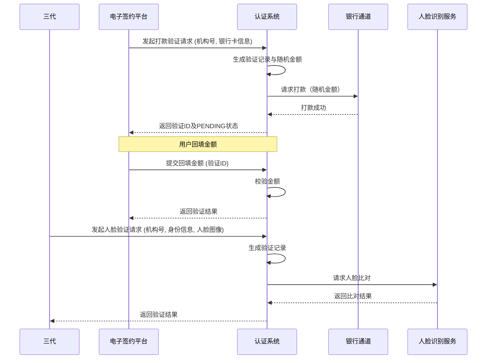

# 模块设计: 认证系统

生成时间: 2026-01-23 17:22:57
批判迭代: 2

---

# 认证系统设计文档

## 1. 概述
- **目的与范围**: 认证系统负责提供身份核验服务，通过打款验证和人脸验证接口，确认账户归属及个人身份的一致性，为关系绑定、开通付款等业务流程提供安全保障。其边界限定于接收认证请求、调用外部服务（如银行打款、人脸识别）进行验证，并返回验证结果。

## 2. 接口设计
- **API端点 (REST/GraphQL)**:
    - `POST /api/v1/verify/payment` (打款验证)
    - `POST /api/v1/verify/face` (人脸验证)
- **请求/响应结构**:
    - **打款验证请求**:
        - `requestId` (string): 请求唯一标识，用于幂等性控制。
        - `institutionId` (string): 机构号，标识发起认证的业务主体。
        - `bankCardNo` (string): 目标银行卡号。
        - `name` (string): 持卡人姓名。
        - `idCardNo` (string): 持卡人身份证号。
    - **打款验证响应**:
        - `verificationId` (string): 本次验证任务唯一标识。
        - `status` (string): 状态（`PENDING`， `SUCCESS`， `FAILED`）。
        - `message` (string): 状态描述。
    - **人脸验证请求**:
        - `requestId` (string): 请求唯一标识，用于幂等性控制。
        - `institutionId` (string): 机构号。
        - `name` (string): 姓名。
        - `idCardNo` (string): 身份证号。
        - `faceImage` (string): Base64编码的人脸图像数据或视频帧。
    - **人脸验证响应**:
        - `verificationId` (string): 本次验证任务唯一标识。
        - `status` (string): 状态（`SUCCESS`， `FAILED`）。
        - `score` (number): 比对相似度分数（可选）。
        - `message` (string): 状态描述。
- **发布/消费的事件**:
    - **发布事件**:
        - `VerificationCompleted`: 当任一验证流程完成（成功或失败）时发布，包含 `verificationId`， `type`， `status`， `institutionId`。
    - **消费事件**: TBD

## 3. 数据模型
- **表/集合**:
    - **verification_request** (验证请求表):
        - `verification_id` (PK): 验证任务唯一标识。
        - `request_id` (UK): 客户端请求唯一标识，用于幂等。
        - `institution_id`: 机构号。
        - `type`: 验证类型 (`PAYMENT`, `FACE`)。
        - `status`: 当前状态 (`INITIATED`, `PENDING`, `SUCCESS`, `FAILED`)。
        - `target_info`: JSON字段，存储验证目标信息（如银行卡号、姓名、身份证号）。
        - `verification_data`: JSON字段，存储验证过程数据（如打款金额、人脸比对结果）。
        - `created_at`: 创建时间。
        - `updated_at`: 更新时间。
        - `expires_at`: 验证过期时间（如打款验证的有效期）。
- **关键字段**: 如上所述。
- **与其他模块的关系**: 为电子签约平台、三代（通过行业钱包间接调用）等模块提供身份认证服务。通过 `institution_id` 关联业务主体。

## 4. 业务逻辑
- **核心工作流/算法**:
    1.  **打款验证**:
        - 接收请求后，生成唯一 `verification_id`， 状态置为 `INITIATED`。
        - 生成一个随机金额（例如：0.01元至1.00元之间，保留两位小数），并安全存储于 `verification_data` 中。
        - 调用银行通道接口，请求向目标银行卡打入该随机金额。
        - 若打款成功，状态更新为 `PENDING`， 并设置 `expires_at`（如24小时后）。
        - 等待用户回填金额。收到回填请求后，从 `verification_data` 中取出原始金额进行比对。
        - 比对成功则状态更新为 `SUCCESS`， 失败则更新为 `FAILED`。发布 `VerificationCompleted` 事件。
    2.  **人脸验证**:
        - 接收请求后，生成唯一 `verification_id`， 状态置为 `INITIATED`。
        - 调用第三方人脸识别服务，传入姓名、身份证号和人脸图像进行比对。
        - 接收比对结果（含相似度分数）。根据预设阈值（如分数 >= 0.8）判断是否通过。
        - 通过则状态更新为 `SUCCESS`， 否则为 `FAILED`。将结果存入 `verification_data`。发布 `VerificationCompleted` 事件。
- **业务规则与验证**:
    - 所有验证请求必须包含有效的 `institution_id`（机构号）和用于幂等的 `request_id`。
    - 打款验证的随机金额生成需使用安全的随机数生成器，并在验证完成或过期后安全清理。
    - 人脸验证需符合相关隐私与安全法规，人脸图像数据在验证完成后的一段合规保留期后应被匿名化或删除。
    - 验证请求和结果数据需加密存储。
- **关键边界情况处理**:
    - **外部服务不可用**: 对银行通道、人脸识别服务的调用实施指数退避重试（最多3次）。若最终失败，将验证状态置为 `FAILED`， 并记录详细错误日志。
    - **验证超时**: 打款验证设有 `expires_at`， 定时任务会扫描过期任务，自动将状态置为 `FAILED`。
    - **多次输入错误**: 对同一 `verification_id` 的回填金额验证设置尝试次数限制（如3次），超过后锁定并置为 `FAILED`。
    - **幂等性**: 基于 `request_id` 实现请求幂等，防止重复创建验证任务。

## 5. 时序图

## 6. 错误处理
- **预期错误情况**:
    - 外部服务调用失败（网络超时、服务异常）。
    - 输入信息不合法（如身份证格式错误、银行卡号无效）。
    - 验证失败（金额不符、人脸比对不通过）。
    - 重复请求（`request_id` 已存在）。
    - 验证任务已过期。
- **处理策略**:
    - 对可重试错误（如网络超时）实施指数退避重试，重试次数上限为3次。
    - 对业务逻辑错误（如验证失败、信息不合法）返回明确的错误码和提示信息，不重试。
    - 对重复请求，返回已存在的验证任务状态。
    - 所有错误均记录详细的错误日志，包含 `verification_id`， `institution_id` 和错误上下文，用于监控和审计。
    - 定义监控指标，如验证成功率、各阶段耗时、外部服务错误率。

## 7. 依赖关系
- **上游模块/调用方**: 电子签约平台（在签约流程中调用）、三代（在关系绑定流程中调用）。
- **下游服务/被调用方**: 银行通道（打款服务）、第三方人脸识别服务。
- **内部依赖**: 数据库（存储验证记录）、消息队列（发布事件）。