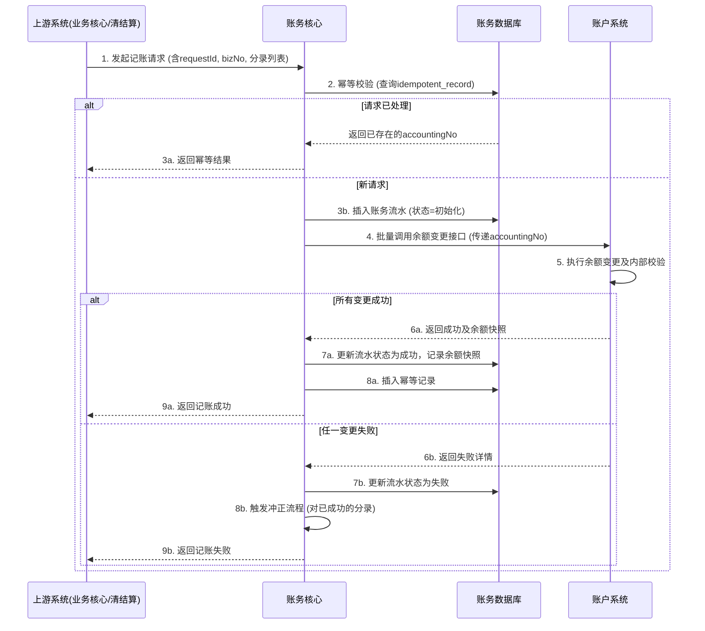

# 模块设计: 账务核心

生成时间: 2026-01-23 17:22:59
批判迭代: 2

---

# 账务核心模块设计文档

## 1. 概述
- **目的与范围**: 本模块是负责处理资金账户记账、冲正、回滚等核心账务操作的系统。它接收来自**业务核心**（处理天财分账交易）和**清结算系统**（处理结算、手续费）的记账指令，作为协调层，确保账务流水记录与下游**账户系统**执行的余额变更保持最终一致性。其核心职责是：1) 接收并持久化账务指令；2) 协调并保证账户余额变更与流水记录的事务性；3) 提供冲正、回滚等补偿机制。其边界在于处理账务指令的协调与记录，不涉及业务逻辑校验（如分账规则、手续费计算），业务校验应由上游模块（如行业钱包、清结算）完成。

## 2. 接口设计
- **API端点 (REST/GraphQL)**:
    - `POST /api/v1/accounting/entries`: 提交记账指令。
    - `POST /api/v1/accounting/reversals/{original_biz_no}`: 对指定原业务流水号的交易发起冲正。
    - `GET /api/v1/accounting/entries/{biz_no}`: 根据业务流水号查询账务流水状态。
- **请求/响应结构**:
    - 记账请求 (`POST /api/v1/accounting/entries`):
        ```json
        {
          "requestId": "req_123456789", // 请求唯一标识，用于幂等
          "bizType": "SPLIT_ACCOUNTING", // 业务类型：分账(SPLIT_ACCOUNTING)、归集(COLLECTION)、结算(SETTLEMENT)、手续费(FEE)
          "bizNo": "split_2025001010001", // 上游业务流水号
          "entries": [
            {
              "accountNo": "ACC80010001", // 账户号
              "amount": "100.00", // 金额（正数表示入账/增加，负数表示出账/减少）
              "direction": "CREDIT", // 方向：CREDIT(贷方/增加), DEBIT(借方/减少)
              "currency": "CNY"
            }
          ]
        }
        ```
    - 记账响应:
        ```json
        {
          "code": "SUCCESS",
          "message": "成功",
          "data": {
            "accountingNo": "ACT2025001010001", // 账务核心流水号
            "status": "PROCESSING" // 状态：PROCESSING, SUCCESS, FAILED
          }
        }
        ```
- **发布/消费的事件**:
    - 消费事件: TBD (例如，监听业务核心发布的“分账交易已校验”事件或清结算发布的“结算单已生成”事件)。
    - 发布事件:
        - `AccountingCompleted`: 账务处理完成（成功或失败）。
        - `AccountingReversed`: 冲正完成。

## 3. 数据模型
- **表/集合**:
    - `accounting_ledger` (账务流水主表): 记录每一笔账务指令的核心信息。
    - `accounting_entry` (会计分录子表): 记录每笔指令下的具体借贷分录。
    - `idempotent_record` (幂等记录表): 保障请求的幂等性。
- **关键字段**:
    - `accounting_ledger`:
        - `accounting_no` (PK): 账务流水号，本系统生成。
        - `request_id`: 上游请求ID，用于幂等。
        - `biz_type`: 业务类型。
        - `biz_no`: 上游业务流水号。
        - `status`: 状态（初始化、处理中、成功、失败、已冲正）。
        - `reverse_accounting_no`: 对应的冲正流水号。
        - `created_at`, `updated_at`: 创建/更新时间。
    - `accounting_entry`:
        - `id` (PK): 自增ID。
        - `accounting_no` (FK): 关联的账务流水号。
        - `account_no`: 账户号。
        - `amount`: 金额。
        - `direction`: 借贷方向。
        - `balance_before`: 操作前余额（从账户系统查询）。
        - `balance_after`: 操作后余额（从账户系统查询）。
    - `idempotent_record`:
        - `request_id` (PK): 请求ID。
        - `accounting_no`: 已处理的账务流水号。
        - `created_at`: 记录时间。
- **与其他模块的关系**: 本模块依赖**账户系统**执行最终的余额变更操作，并记录与之对应的账务流水，需通过事务或补偿机制保证两者的一致性。

## 4. 业务逻辑
- **核心工作流/算法**:
    1.  **接收与幂等校验**: 接收记账请求，通过`request_id`检查`idempotent_record`表，若已处理则直接返回原有结果。
    2.  **持久化指令**: 在`accounting_ledger`和`accounting_entry`中插入状态为“初始化”的记录。
    3.  **协调余额变更**:
        - 对于每一条会计分录，调用**账户系统**的余额变更接口（需支持扣减、增加、冻结等）。
        - 本模块需确保所有分录的余额变更作为一个整体事务。若账户系统支持分布式事务（如TCC），则参与其中；否则，需实现“先尝试余额变更，后持久化流水，失败则发起冲正”的补偿模式。
    4.  **更新流水状态**: 所有余额变更成功后，更新`accounting_ledger`状态为“成功”，并记录`balance_before`和`balance_after`到`accounting_entry`。
    5.  **冲正/回滚机制**:
        - 若任何一步失败，则将主流水状态置为“失败”。
        - 对于已部分成功变更余额的场景，自动或根据指令发起冲正请求，生成一条反向的`accounting_ledger`记录（状态为“冲正”），并调用账户系统进行反向操作，以恢复余额。
- **业务规则与验证**:
    - **幂等性**: 所有操作必须基于`request_id`保证幂等。
    - **最终一致性**: 通过账务流水与账户余额的补偿机制（冲正）确保最终一致。
    - **并发控制**: 对同一账户的并发操作，依赖**账户系统**的乐观锁或悲观锁机制保证余额准确性。
    - **校验边界**: 本模块不进行“余额是否充足”、“账户是否冻结”等业务校验。这些校验应由上游调用方（如行业钱包、清结算）在调用本模块前，或**账户系统**在变更余额时完成。
- **关键边界情况处理**:
    - **分布式事务部分成功**: 采用冲正作为补偿交易，确保数据回滚。
    - **系统异常与重试**: 关键步骤（如调用账户系统）需有重试机制，并设置最大重试次数。超过次数后标记失败并告警。
    - **对账与追溯**: 完整的`accounting_entry`记录（含操作前后余额）为日终对账（与账户系统、上游系统）提供依据。

## 5. 时序图


## 6. 错误处理
- **预期错误情况**:
    - **业务参数错误**: 账户不存在、金额格式错误、借贷不平。
    - **系统交互错误**: 账户系统服务不可用、返回未知错误、网络超时。
    - **数据一致性错误**: 冲正时原交易状态异常、对账不平。
    - **并发冲突**: 请求重复 (`request_id`冲突)。
- **处理策略**:
    - **参数与幂等错误**: 立即失败，返回明确错误码。
    - **系统交互错误**: 进行有限次重试（如3次），重试失败后标记该笔流水为“失败”，触发告警，并尝试发起冲正。
    - **数据一致性错误**: 记录详细日志并告警，需人工介入核查。
    - **所有错误**均需在`accounting_ledger`中更新状态并记录错误原因，便于追踪。

## 7. 依赖关系
- **上游模块**: **业务核心**（发起分账、归集等记账指令）、**清结算系统**（发起结算、手续费扣除等记账指令）。上游模块负责业务逻辑校验后调用本模块。
- **下游模块**: **账户系统**（强依赖，用于执行所有账户余额的变更操作，并返回结果）。
- **内部依赖**: 自身数据库（用于持久化账务流水和幂等记录）。