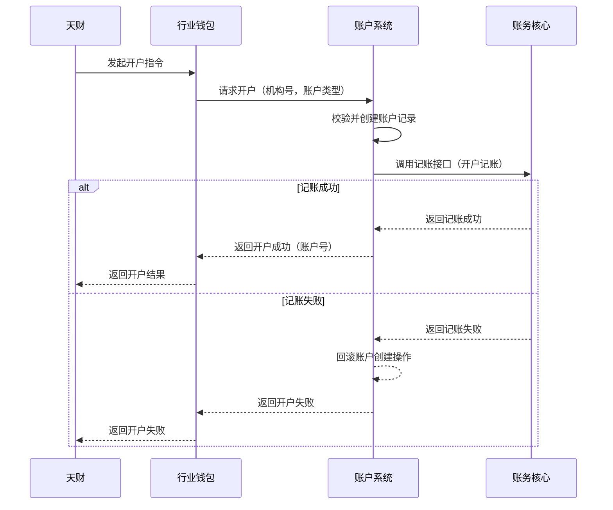

# 模块设计: 账户系统

生成时间: 2026-01-23 17:22:43
批判迭代: 2

---

# 账户系统模块设计文档

## 1. 概述
- **目的与范围**: 账户系统（账户域）是底层账户服务，负责为业务主体开立和管理各类资金账户。其核心职责包括：根据指令开立账户、升级账户、执行账户余额的扣减与增加、处理账户冻结请求，以及标记账户类型（如待结算账户、退货账户）。本模块不处理具体的业务逻辑（如分账、归集），仅提供原子化的账户操作能力。

## 2. 接口设计
- **API端点 (REST/GraphQL)**: TBD
- **请求/响应结构**: TBD
- **发布/消费的事件**: TBD

## 3. 数据模型
- **表/集合**: TBD
- **关键字段**: 账户号、账户类型（如“01待结算账户”、“04退货账户”）、账户状态（如正常、冻结）、关联机构号、余额。
- **与其他模块的关系**: 账户记录与清结算系统、行业钱包等模块的业务数据通过机构号、账户号等关键字段进行关联。

## 4. 业务逻辑
- **核心工作流/算法**: 接收上游系统（如天财或三代）的指令，执行账户开立、余额变动（增/减）、状态变更（冻结/解冻）等操作。
- **业务规则与验证**:
    1.  开立账户需绑定有效的机构号。
    2.  执行扣款前需校验账户状态正常且余额充足。
    3.  账户类型标记需符合预定义规则（如待结算账户编号为01）。
    4.  **账户升级**: 根据业务规则（如从接收方账户升级为收款账户），更新账户类型及相关属性。具体升级路径和条件由上游业务定义，本系统执行属性变更。
    5.  **标记账户类型**: 根据上游指令，为账户设置特定的类型标识（如01、04）。此操作为属性更新，不涉及资金变动。
- **关键边界情况处理**:
    1.  **重复开户请求**: 需幂等处理，基于请求ID或业务唯一键（如机构号+账户类型）进行校验，已存在则返回成功。
    2.  **并发余额操作**: 需通过数据库行级锁（悲观锁）或带版本号的乐观锁机制，结合事务保证数据一致性，防止超扣。
    3.  **操作失败**: 支持事务回滚，确保原子性。对于跨系统调用（如调用账务核心）失败，需实现补偿机制（如冲正交易）或重试逻辑。
    4.  **依赖失败处理**: 当调用下游账务核心失败时，本系统操作应回滚，并向调用方返回失败，由上游决定是否重试。

## 5. 时序图

## 6. 错误处理
- **预期错误情况**:
    1.  开户时机构号无效。
    2.  扣款时余额不足。
    3.  账户状态异常（如已冻结）。
    4.  系统内部错误（如数据库连接失败）。
    5.  下游依赖（账务核心）服务不可用或调用超时。
- **处理策略**:
    1.  对于参数或状态错误，返回明确的业务错误码和提示。
    2.  对于系统内部错误，记录日志并返回系统异常，触发监控告警。
    3.  支持数据库事务回滚，确保操作原子性。
    4.  对于下游依赖失败，记录详细日志，执行回滚，并向上游返回可识别的失败状态，由业务发起方决定后续流程（如重试）。

## 7. 依赖关系
- **上游模块**: 天财（通过行业钱包发起账户操作指令）、清结算系统（发起账户冻结等指令）。
- **下游模块**: 账务核心（完成记账操作）。