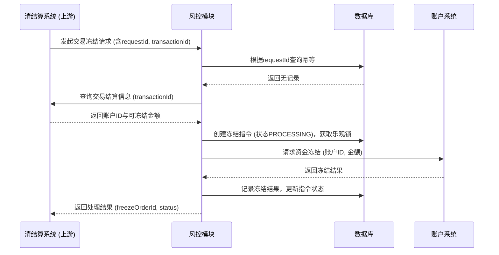
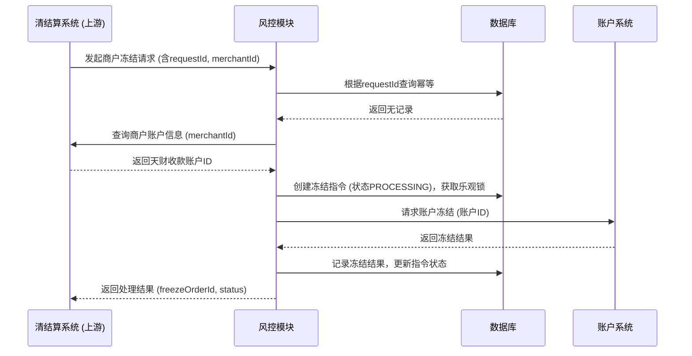

# 模块设计: 风控

生成时间: 2026-01-23 17:23:07
批判迭代: 2

---

# 风控模块设计文档

## 1. 概述
- **目的与范围**: 本模块负责对天财账户及交易进行风险监控与处置。核心职责包括接收风控指令，对已结算至天财收款账户的特定交易资金进行冻结，以及对收单商户对应的天财收款账户进行冻结。本模块不涉及风险规则的制定与评估，仅执行上游系统发起的冻结指令。

## 2. 接口设计
- **API端点 (REST/GraphQL)**:
    1.  **交易冻结接口**:
        - 路径: `/api/v1/risk-control/transaction-freeze`
        - 方法: `POST`
        - 描述: 接收指令，对特定交易资金进行冻结。
    2.  **商户冻结接口**:
        - 路径: `/api/v1/risk-control/merchant-freeze`
        - 方法: `POST`
        - 描述: 接收指令，对商户对应的天财收款账户进行冻结。
    3.  **冻结查询接口**:
        - 路径: `/api/v1/risk-control/freeze-records/{freezeOrderId}`
        - 方法: `GET`
        - 描述: 根据冻结指令ID查询冻结执行结果。
- **请求/响应结构**:
    - **交易冻结请求**:
        ```json
        {
          "requestId": "string, 请求唯一标识，用于幂等",
          "merchantId": "string, 收单商户ID",
          "transactionId": "string, 待冻结的交易ID",
          "freezeAmount": "number, 冻结金额",
          "freezeReason": "string, 冻结原因"
        }
        ```
    - **商户冻结请求**:
        ```json
        {
          "requestId": "string, 请求唯一标识，用于幂等",
          "merchantId": "string, 收单商户ID",
          "freezeReason": "string, 冻结原因"
        }
        ```
    - **通用响应**:
        ```json
        {
          "code": "string, 响应码",
          "message": "string, 响应消息",
          "data": {
            "freezeOrderId": "string, 本系统生成的冻结指令ID",
            "status": "string, 冻结状态 (PROCESSING/SUCCESS/FAILED)"
          }
        }
        ```
- **发布/消费的事件**: TBD

## 3. 数据模型
- **表/集合**:
    1.  **冻结指令表 (freeze_order)**:
        - 存储接收到的原始冻结指令及处理状态。
    2.  **冻结记录表 (freeze_record)**:
        - 存储每次冻结操作（交易或账户）的执行记录。
- **关键字段**:
    - **freeze_order 表**:
        - `id`: 主键，本系统生成的冻结指令ID。
        - `request_id`: 上游请求ID，用于幂等控制，唯一索引。
        - `merchant_id`: 收单商户ID。
        - `transaction_id`: 交易ID（仅交易冻结）。
        - `freeze_amount`: 冻结金额（仅交易冻结）。
        - `freeze_reason`: 冻结原因。
        - `freeze_type`: 冻结类型 (`TRANSACTION` / `MERCHANT`)。
        - `status`: 指令状态 (`RECEIVED` / `PROCESSING` / `SUCCESS` / `FAILED`)。
        - `target_account_id`: 目标天财收款账户ID（处理时填充）。
        - `created_at`: 创建时间。
        - `updated_at`: 更新时间。
    - **freeze_record 表**:
        - `id`: 主键。
        - `freeze_order_id`: 外键，关联冻结指令。
        - `account_id`: 被冻结的账户ID（天财收款账户）。
        - `frozen_balance`: 被冻结的余额（交易冻结时为特定金额，商户冻结时为0，表示账户级冻结）。
        - `operation`: 操作类型 (`FREEZE_TRANSACTION` / `FREEZE_ACCOUNT`)。
        - `result`: 操作结果 (`SUCCESS` / `FAILED`)。
        - `error_message`: 失败时的错误信息。
        - `created_at`: 创建时间。
- **与其他模块的关系**: 本模块执行冻结操作时，需调用账户系统对账户进行冻结或标记。通过 `merchant_id` 或 `transaction_id` 查询清结算或业务核心系统，以定位目标天财收款账户。

## 4. 业务逻辑
- **核心工作流/算法**:
    1.  **交易冻结流程**:
        - 接收风控发起的交易冻结指令。
        - **幂等检查**: 根据请求中的 `requestId` 查询 `freeze_order` 表。若已存在相同 `requestId` 的记录，则直接返回已有的处理结果。
        - **定位目标账户与资金**:
            - 根据请求中的 `transactionId`，调用**清结算系统**的查询接口，获取该交易结算后的资金所在的天财收款账户ID (`target_account_id`) 及可冻结的余额。
            - 验证指定交易资金是否已结算至目标账户且未被冻结。
        - **并发控制**: 对目标账户ID采用乐观锁机制（如通过版本号），防止并发冻结导致超额冻结。
        - **调用账户系统**:
            - 调用账户系统的**资金冻结接口**，传入账户ID和冻结金额，对账户内的特定资金进行冻结（交易级冻结）。
        - **记录结果**: 在 `freeze_record` 表中记录冻结操作详情，并更新 `freeze_order` 表状态。
    2.  **商户冻结流程**:
        - 接收风控发起的商户冻结指令。
        - **幂等检查**: 根据请求中的 `requestId` 查询 `freeze_order` 表。若已存在相同 `requestId` 的记录，则直接返回已有的处理结果。
        - **定位目标账户**:
            - 根据请求中的 `merchantId`，调用**清结算系统**或**行业钱包**的查询接口，获取该收单商户对应的天财收款账户ID (`target_account_id`)。
            - 验证目标账户是否存在且状态正常（未冻结）。
        - **并发控制**: 对目标账户ID采用乐观锁机制。
        - **调用账户系统**:
            - 调用账户系统的**账户冻结接口**，传入账户ID，对整个账户进行冻结（账户级冻结）。
        - **记录结果**: 在 `freeze_record` 表中记录冻结操作详情，并更新 `freeze_order` 表状态。
- **业务规则与验证**:
    - 执行冻结前，需验证目标账户（天财收款账户）是否存在且状态正常。
    - 执行交易冻结时，需验证指定交易资金是否已结算至目标账户且可冻结金额充足。
    - 所有冻结请求必须包含幂等键 (`requestId`)。
- **关键边界情况处理**:
    - 若目标账户不存在或已处于冻结状态，需记录日志并返回相应错误。
    - 若交易冻结时指定资金不足，需记录日志并返回相应错误。
    - 若下游系统（清结算、账户系统）调用超时或失败，根据错误类型进行有限次重试，重试失败后标记指令为失败。
    - 并发请求通过数据库乐观锁确保同一账户的冻结操作串行化。

## 5. 时序图





## 6. 错误处理
- **预期错误情况**:
    - 目标账户不存在。
    - 目标账户已冻结。
    - 交易冻结时资金不足。
    - 调用下游系统（如清结算系统、账户系统）超时或失败。
    - 重复请求（幂等冲突）。
    - 乐观锁更新失败（并发冲突）。
- **处理策略**:
    - **幂等冲突**: 直接返回已存在的冻结指令处理结果。
    - **业务逻辑错误**（如账户不存在、已冻结、资金不足）: 记录详细日志，更新指令状态为`FAILED`，并向调用方返回明确的错误码和描述。
    - **并发冲突**: 返回“操作冲突，请稍后重试”错误，由上游决定是否重试。
    - **系统间调用失败**: 进行有限次重试（针对网络超时等临时性错误），重试失败后记录错误日志，更新指令状态为`FAILED`，并向上游返回系统错误。

## 7. 依赖关系
- **上游模块**: **清结算系统**（根据术语表，负责账户冻结及提供对账单数据，是风控指令的合理发起方）。
- **下游模块**:
    - **账户系统**（账户域）: 提供账户级和资金级的冻结能力。
    - **清结算系统**: 提供交易结算信息查询、商户-账户映射关系查询。
    - **行业钱包**: 作为备选，提供商户-账户映射关系查询。