# DocuFlow-AI Project - 软件设计文档
生成时间: 2026-01-16 16:59:01

## 目录
1. [概述说明](#1-概述说明)
   - 1.1 [术语与缩略词](#11-术语与缩略词)
2. [系统设计](#2-系统设计)
3. [模块设计](#3-模块设计)
   - 3.1 [账户系统](#31-账户系统)
   - 3.2 [三代系统](#32-三代系统)
   - 3.3 [认证系统](#33-认证系统)
   - 3.4 [业务核心](#34-业务核心)
   - 3.5 [清结算系统](#35-清结算系统)
   - 3.6 [计费中台](#36-计费中台)
   - 3.7 [钱包APP/商服平台](#37-钱包APP/商服平台)
   - 3.8 [电子签约平台](#38-电子签约平台)
   - 3.9 [行业钱包系统](#39-行业钱包系统)
   - 3.10 [对账单系统](#310-对账单系统)
4. [接口设计](#4-接口设计)
5. [数据库设计](#5-数据库设计)

---
# 1 概述说明

## 1.1 术语与缩略词


## 角色

- **天财**: 一个特定的商户或机构（推测为餐饮SaaS服务商“天财商龙”），是本需求文档中分账业务的主要发起方和合作方。
- **总部** (别名: 总店, 发起方, 归集方, 付方（在特定场景下）): 在分账业务中，作为资金归集方或付款发起方的商户实体，通常为企业性质，负责管理下属门店。
- **门店** (别名: 被归集方, 付方（在归集场景下）, 收方（在会员结算场景下）): 在分账业务中，作为被归集方或收款方的商户实体，可以是企业或个人/个体户，隶属于某个总部。

## 业务实体

- **收单商户** (别名: 商户): 通过支付系统进行收款交易的商户实体。在本系统中，根据业务模式可分为总部和门店。
- **天财收款账户** (别名: 专用收款账户, 天财专用账户): 为天财业务场景特设的专用账户类型，用于收单资金的结算和存储。类型为“行业钱包”，与普通收款账户在底层区分，主要用于分账流转。
- **天财接收方账户** (别名: 接收方账户, 入账方账户): 为天财业务场景特设的专用账户类型，用于接收从“天财收款账户”分账而来的资金，支持绑定多张银行卡并设置默认提现卡。
- **普通收款账户**: 非天财专用的标准收款账户，与“天财收款账户”在功能和权限上有所区别。
- **待结算账户** (别名: 01账户): 用于临时存放收单交易资金的内部账户，代码为01。
- **退货账户** (别名: 04账户): 用于处理交易退款资金的内部账户，代码为04。

## 技术术语

- **三代系统**: 指代拉卡拉内部的某一代核心业务系统，负责商户管理、开户、交易处理等核心流程。
- **行业钱包系统** (别名: 钱包系统): 负责处理钱包类账户业务（如天财专用账户）的系统，进行开户、关系绑定、分账请求处理等业务逻辑校验和流转。
- **账户系统**: 底层的账户管理核心系统，负责账户的创建、升级、标记、账务处理及能力控制。
- **清结算系统** (别名: 清结算): 负责资金清算、结算、计费以及退货资金处理的系统。
- **电子签约平台** (别名: 电子签章系统): 提供电子协议签署、短信认证、H5页面封装及证据链留存服务的系统。
- **认证系统**: 提供打款验证和人脸验证等身份核验能力的系统。
- **打款验证**: 一种身份认证方式，通过向目标银行卡打入随机小额款项，并要求回填正确金额和备注来完成验证。主要用于对公企业认证。
- **人脸验证**: 一种身份认证方式，通过比对姓名、身份证和人脸信息是否一致来完成验证。主要用于个人或个体户认证。
- **四要素验证**: 在开户环节进行的身份验证，通常包括姓名、身份证号、银行卡号、手机号四要素的核验。
- **主动结算**: 一种结算模式，指收单交易资金结算到商户指定的收款账户（如天财收款账户）。
- **被动结算**: 一种结算模式，指收单交易资金暂存于待结算账户，需要额外指令才能结算到收款账户。
- **对账单系统**: 生成和提供各类账户动账明细、交易账单的系统，供天财进行对账。
- **计费中台**: 负责计算分账等业务手续费的系统。
- **业务核心**: 接收并记录“天财分账”交易信息的核心系统。

## 流程

- **开户** (别名: 开通天财专用账户): 为商户创建“天财收款账户”或“天财接收方账户”的过程。包括新开账户或将普通收款账户升级为天财专用账户。
- **关系绑定** (别名: 签约与认证, 绑定关系): 在特定业务场景下，建立并认证资金收付双方授权关系的过程。包含协议签署和身份验证，是进行分账的前提。
- **开通付款**: 在“批量付款”和“会员结算”场景下，付方（总部）需要额外进行的一次授权流程，以开通其付款能力。
- **归集** (别名: 资金归集): 一种资金流转场景，指门店将资金归集到总部。涉及创建“门店归集关系”。
- **批量付款** (别名: 批付): 一种资金流转场景，指总部向多个接收方（如供应商、股东）进行分账付款。
- **会员结算**: 一种资金流转场景，特指总部向门店进行分账，资金用途通常与会员储值消费相关。
- **分账** (别名: 转账): 本需求中的核心业务流程，指资金在“天财收款账户”之间，或从“天财收款账户”到“天财接收方账户”的划转。由天财发起指令，经系统校验后执行。
- **提现** (别名: 提款): 将“天财收款账户”或“天财接收方账户”中的余额，提款到绑定银行卡的过程。

---
# 2 系统设计
# 天财分账系统级设计文档

## 2.1 系统结构

天财分账系统是一个服务于连锁商户资金归集、分账、结算的复杂金融业务平台。系统采用分层、模块化的微服务架构，以**三代系统**作为业务入口与流程协调中心，以**行业钱包系统**作为核心业务逻辑处理器，以**账户系统**和**清结算系统**作为资金处理与记账核心，并通过一系列支撑系统（如认证、计费、电子签约）确保业务的安全、合规与稳定运行。

**系统架构图 (C4 Container Level)**

```mermaid
graph TB
    subgraph “外部系统/用户”
        A1[“天财商龙系统(H5/API)”]
        A2[“商户(钱包APP/商服平台)”]
        A3[“内部运营平台”]
    end

    subgraph “业务接入与适配层”
        B1[“天财业务适配模块”]
        B2[“三代系统 - 天财分账模块”]
    end

    subgraph “核心业务处理层”
        C1[“行业钱包系统”]
        C2[“账户系统”]
        C3[“清结算系统”]
        C4[“业务核心”]
    end

    subgraph “支撑服务层”
        D1[“认证系统”]
        D2[“电子签约平台”]
        D3[“计费中台 - 天财模块”]
        D4[“对账单系统”]
    end

    subgraph “基础设施”
        E1[“消息队列(MQ/Kafka)”]
        E2[“数据库(MySQL)”]
        E3[“缓存(Redis)”]
        E4[“风控系统”]
    end

    A1 -- “分账指令/业务查询” --> B2
    A2 -- “功能入口/业务办理” --> B1
    A3 -- “业务审核/配置” --> B2
    B1 -- “业务跳转/权限校验” --> B2
    B2 -- “协调业务流程” --> C1
    C1 -- “账户操作/资金划转” --> C2
    C1 -- “清算/结算/退货处理” --> C3
    C1 -- “交易记录持久化” --> C4
    C1 -- “计算手续费” --> D3
    C1 -- “发起签约/认证” --> D2
    D2 -- “调用身份认证” --> D1
    C3 -- “同步账户配置” --> C2
    C4 -- “提供交易数据” --> D4
    C2 -- “提供账户流水” --> D4
    C3 -- “提供结算流水” --> D4
    
    B2 -. “异步消息” .-> E1
    C1 -. “异步消息” .-> E1
    D3 -. “规则缓存” .-> E3
    C1 -. “风控校验” .-> E4
    C3 -. “风控校验” .-> E4

    style B2 fill:#e1f5fe
    style C1 fill:#f1f8e9
    style C2 fill:#fff3e0
    style C3 fill:#fce4ec
```

*   **业务接入与适配层**：负责与外部用户和系统交互，进行权限控制、界面适配和业务流程的初步引导。
*   **核心业务处理层**：承载最核心的业务逻辑，包括账户体系管理、资金流转指令处理、清算结算计算等。
*   **支撑服务层**：提供业务运行所需的通用能力，如身份核验、合同签约、费用计算、数据聚合对账等。
*   **基础设施**：为上层服务提供通用的技术支撑能力。

## 2.2 功能结构

系统功能围绕“天财分账”业务的生命周期进行组织，主要分为商户与账户管理、资金关系建立、交易与结算处理、运营支撑四大功能域。

**功能结构图**

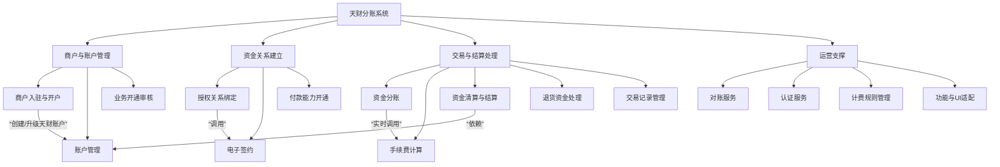
```mermaid
graph TD
    F[天财分账系统] --> F1[商户与账户管理]
    F --> F2[资金关系建立]
    F --> F3[交易与结算处理]
    F --> F4[运营支撑]

    F1 --> F11[商户入驻与开户]
    F1 --> F12[账户管理]
    F1 --> F13[业务开通审核]

    F2 --> F21[授权关系绑定]
    F2 --> F22[电子签约]
    F2 --> F23[付款能力开通]

    F3 --> F31[资金分账]
    F3 --> F32[手续费计算]
    F3 --> F33[资金清算与结算]
    F3 --> F34[退货资金处理]
    F3 --> F35[交易记录管理]

    F4 --> F41[对账服务]
    F4 --> F42[认证服务]
    F4 --> F43[计费规则管理]
    F4 --> F44[功能与UI适配]

    F11 -- “创建/升级天财账户” --> F12
    F21 -- “调用” --> F22
    F31 -- “实时调用” --> F32
    F33 -- “依赖” --> F12
```

*   **商户与账户管理**：实现商户信息的维护、专用账户的创建/升级/标记，以及业务申请的审核流程。
*   **资金关系建立**：处理资金归集、批量付款等场景下，付方与收方之间授权关系的建立、电子协议签署及付款能力开通。
*   **交易与结算处理**：涵盖从分账指令发起、手续费计算、资金实际划转，到日终清算、结算，以及异常场景（如退货）资金处理的完整链条。
*   **运营支撑**：提供系统运行所必需的辅助功能，包括数据对账、用户身份认证、计费规则配置以及面向不同渠道的界面与功能适配。

## 2.3 网络拓扑图

系统部署在私有云或金融云环境内，采用典型的微服务网络拓扑。外部流量通过**API网关**统一接入，内部服务间通过**服务网格**或内部负载均衡进行通信。敏感数据交互使用内网隔离区域。

```mermaid
graph TB
    subgraph “互联网区 (DMZ)”
        GW[API网关/负载均衡]
    end

    subgraph “应用服务区”
        AppCluster[应用服务集群<br/>三代/钱包/账户等模块]
        MQ[消息中间件集群]
        Cache[缓存集群]
    end

    subgraph “数据存储区”
        DB[数据库集群 (主从/分库)]
        FileStore[文件存储]
    end

    subgraph “外部服务区”
        Ext1[“第三方人脸服务”]
        Ext2[短信网关]
    end

    Internet -- “HTTPS” --> GW
    GW -- “内部路由” --> AppCluster
    AppCluster -- “服务调用” --> AppCluster
    AppCluster -- “生产/消费消息” --> MQ
    AppCluster -- “读写缓存” --> Cache
    AppCluster -- “数据持久化” --> DB
    AppCluster -- “生成账单文件” --> FileStore
    AppCluster -- “外部API调用” --> Ext1 & Ext2
    
    style AppCluster fill:#f5f5f5
    style DB fill:#e8f5e8
```

*   **安全分层**：互联网区、应用服务区、数据存储区之间通过防火墙进行隔离，遵循最小权限原则配置访问策略。
*   **高可用**：关键组件如应用服务、数据库、消息队列均采用集群化部署，避免单点故障。
*   **外部集成**：与第三方服务（如人脸核验）的调用通过专线或安全网关进行，确保通信安全与可控。

## 2.4 数据流转

数据流转主要围绕“资金”和“业务状态”两条主线，在商户发起业务到最终完成对账的完整周期内，跨越多个系统。

**核心业务数据流图 (资金分账场景)**

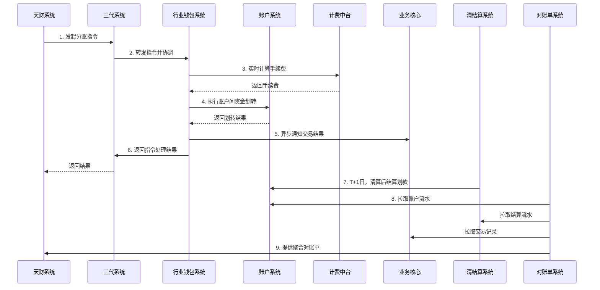
```mermaid
sequenceDiagram
    participant T as 天财系统
    participant G3 as 三代系统
    participant W as 行业钱包系统
    participant A as 账户系统
    participant F as 计费中台
    participant BC as 业务核心
    participant S as 清结算系统
    participant D as 对账单系统

    T->>G3: 1. 发起分账指令
    G3->>W: 2. 转发指令并协调
    W->>F: 3. 实时计算手续费
    F-->>W: 返回手续费
    W->>A: 4. 执行账户间资金划转
    A-->>W: 返回划转结果
    W->>BC: 5. 异步通知交易结果
    W->>G3: 6. 返回指令处理结果
    G3-->>T: 返回结果
    S->>A: 7. T+1日，清算后结算划款
    D->>A: 8. 拉取账户流水
    D->>S: 拉取结算流水
    D->>BC: 拉取交易记录
    D->>T: 9. 提供聚合对账单
```

**关键数据流说明：**
1.  **业务指令流**：从天财系统发起，经三代系统协调，由行业钱包系统执行核心逻辑。
2.  **资金流**：行业钱包系统调用账户系统完成实时分账；清结算系统在约定周期调用账户系统完成与商户的结算。
3.  **费用流**：行业钱包在处理交易时实时调用计费中台计算手续费。
4.  **数据持久化流**：交易关键信息由业务核心持久化；各系统产生的流水（账户、结算）最终由对账单系统聚合，供下游对账。

## 2.5 系统模块交互关系

各模块通过同步API调用和异步消息协作，共同完成业务。下图概括了主要模块间的调用与依赖关系。

**模块交互依赖图**

```mermaid
graph LR
    G3[“三代系统<br/>(协调入口)”]
    W[“行业钱包系统<br/>(核心处理器)”]
    A[“账户系统<br/>(账务核心)”]
    S[“清结算系统<br/>(资金中枢)”]
    BC[“业务核心<br/>(数据持久化)”]
    D[“对账单系统<br/>(数据聚合)”]
    F[“计费中台<br/>(费用计算)”]
    ESign[“电子签约平台<br/>(签约认证)”]
    Auth[“认证系统<br/>(身份核验)”]
    Adapter[“天财业务适配模块<br/>(前端适配)”]

    G3 -- “1. 驱动开户、绑关系、<br/>交易等全流程” --> W
    W -- “2. 账户操作、资金划转” --> A
    W -- “3. 发起清算结算、退货处理” --> S
    W -- “4. 持久化交易记录” --> BC
    W -- “5. 实时计算手续费” --> F
    W -- “6. 发起签约流程” --> ESign
    S -- “7. 同步商户结算账户” --> A
    S -- “8. 触发结算、扣退款” --> A
    ESign -- “9. 调用身份认证” --> Auth
    D -- “10. 拉取交易数据” --> BC
    D -- “11. 拉取账户流水” --> A
    D -- “12. 拉取结算流水” --> S
    Adapter -- “13. 功能鉴权与跳转” --> G3
    
    style W fill:#fff3e0
    style G3 fill:#e1f5fe
```

**关键交互关系说明：**
1.  **三代系统驱动**：作为总协调者，接收外部请求，并调用行业钱包系统执行具体业务。
2.  **行业钱包为核心**：是业务逻辑的集大成者，串联起账户、清算、计费、签约等所有关键操作。
3.  **账户系统为基石**：提供统一的账户模型和资金操作原子接口，被钱包和清结算系统频繁调用。
4.  **清结算系统承上启下**：接收钱包系统的业务触发，在自有周期内完成资金轧差和结算，并最终调用账户系统完成出款。
5.  **数据汇聚于对账**：业务核心、账户系统、清结算系统作为数据生产者，对账单系统作为消费者，汇聚数据生成统一视图。
6.  **签约与认证联动**：电子签约平台在签约流程中，依赖认证系统完成用户强身份验证，确保法律关系成立。
---
# 3 模块设计

## 3.1 账户系统


# 账户系统模块设计文档

## 1. 概述

### 1.1 目的
本模块是“天财分账”业务的核心底层支撑系统，负责为天财业务场景创建、管理和标记专用的账户实体，并提供相应的账务处理与能力控制。核心目标是实现“天财收款账户”和“天财接收方账户”的底层隔离与特殊化处理，确保资金只能在专用账户体系内安全流转。

### 1.2 范围
- **账户创建与升级**：支持为天财机构下的商户新开或升级“天财专用账户”（包括收款账户和接收方账户），并在底层进行特殊标记。
- **账户能力控制**：根据账户类型（天财收款账户/天财接收方账户/普通账户）控制其转账、提现等能力。
- **账户标记管理**：为天财机构下的所有账户（包括普通收款账户）打上“天财”标记，用于业务识别和流程控制。
- **账务处理**：响应分账、提现等指令，执行账户间的资金划转和余额更新。
- **账单流水生成**：根据清结算推送的结算单，生成包含明细的账户流水，支持对账单系统查询。

## 2. 接口设计

### 2.1 API端点 (RESTful)

#### 2.1.1 内部接口 (供行业钱包系统调用)

**1. 创建天财专用账户**
- **端点**: `POST /internal/v1/accounts/tiancai`
- **描述**: 为指定商户创建天财专用账户（收款账户或接收方账户）。
- **请求头**:
    - `X-Source-System: WALLET_SYSTEM`
    - `X-Request-Id`: 请求唯一标识
- **请求体**:
```json
{
  "requestId": "req_123456",
  "merchantNo": "88800010001",
  "institutionNo": "860000", // 天财机构号
  "accountType": "TIANCAI_RECEIVE_ACCOUNT", // 枚举: TIANCAI_RECEIVE_ACCOUNT, TIANCAI_RECEIVER_ACCOUNT
  "roleType": "HEADQUARTERS", // 可选，枚举: HEADQUARTERS, STORE。仅对收款账户有效。
  "originalAccountNo": "ACC001", // 可选。当为升级场景时，传入原普通收款账户号。
  "operationType": "CREATE", // 枚举: CREATE, UPGRADE
  "effectiveTime": "2023-12-01 00:00:00" // 期望生效时间
}
```
- **响应体 (成功)**:
```json
{
  "code": "SUCCESS",
  "message": "成功",
  "data": {
    "accountNo": "TC_ACC_88800010001_R001", // 新生成的天财专用账户号
    "accountType": "TIANCAI_RECEIVE_ACCOUNT",
    "status": "ACTIVE",
    "createTime": "2023-11-30 15:30:00"
  }
}
```

**2. 账户标记查询**
- **端点**: `GET /internal/v1/accounts/{accountNo}/tags`
- **描述**: 查询指定账户的标记信息，判断是否为天财专用账户。
- **响应体**:
```json
{
  "code": "SUCCESS",
  "data": {
    "accountNo": "TC_ACC_88800010001_R001",
    "isTiancaiAccount": true,
    "accountType": "TIANCAI_RECEIVE_ACCOUNT",
    "tags": ["TIANCAI", "WALLET", "ACTIVE_SETTLEMENT"]
  }
}
```

**3. 执行分账转账**
- **端点**: `POST /internal/v1/transfers/tiancai`
- **描述**: 执行从天财收款账户到另一个天财专用账户的资金划转。
- **请求体**:
```json
{
  "requestId": "transfer_789",
  "bizType": "TIANCAI_SPLIT",
  "outAccountNo": "TC_ACC_88800010001_R001",
  "inAccountNo": "TC_ACC_88800010002_R001",
  "amount": 10000,
  "currency": "CNY",
  "fee": 10,
  "feeBearer": "PAYER", // 枚举: PAYER, PAYEE
  "bizScene": "COLLECTION", // 枚举: COLLECTION, MEMBER_SETTLEMENT, BATCH_PAYMENT
  "remark": "门店归集"
}
```
- **响应体**:
```json
{
  "code": "SUCCESS",
  "data": {
    "transferNo": "TF202311301530001",
    "status": "SUCCESS",
    "outBalance": 99000,
    "inBalance": 10000
  }
}
```

**4. 查询账户余额及流水**
- **端点**: `GET /internal/v1/accounts/{accountNo}/statements`
- **描述**: 供对账单系统查询账户动账明细。
- **查询参数**: `startTime=2023-11-30 00:00:00&endTime=2023-11-30 23:59:59&pageNum=1&pageSize=100`
- **响应体**:
```json
{
  "code": "SUCCESS",
  "data": {
    "accountNo": "TC_ACC_88800010001_R001",
    "accountType": "TIANCAI_RECEIVE_ACCOUNT",
    "currentBalance": 99000,
    "statements": [
      {
        "seqNo": "202311300001",
        "transTime": "2023-11-30 10:15:30",
        "transType": "SPLIT_OUT",
        "amount": -10000,
        "balance": 99000,
        "counterpartyAccountNo": "TC_ACC_88800010002_R001",
        "bizNo": "TF202311301530001",
        "remark": "门店归集",
        "settleDetailFlag": "N" // 是否结算明细子账单: Y/N
      }
    ]
  }
}
```

### 2.2 发布/消费的事件

#### 2.2.1 消费的事件
1.  **账户创建事件** (来自三代系统/行业钱包系统)
    - 事件类型: `ACCOUNT_CREATED`
    - 负载: 包含商户号、账户号、账户类型、机构号、操作类型等。
    - 动作: 根据事件信息，在底层创建或标记账户。

2.  **结算单推送事件** (来自清结算系统)
    - 事件类型: `SETTLEMENT_ORDER_PUSHED`
    - 负载: 包含结算单号、商户号、账户号、结算金额、结算明细列表、`supplementDetailFlag`（补明细标识）等。
    - 动作: 根据结算单更新账户余额，并生成相应的账户流水。若`supplementDetailFlag`为`Y`，则为每笔结算明细生成子账单流水。

#### 2.2.2 发布的事件
1.  **账户状态变更事件**
    - 事件类型: `ACCOUNT_STATUS_CHANGED`
    - 负载: `{“accountNo”: “...”, “oldStatus”: “...”, “newStatus”: “...”, “changeReason”: “...”}`
    - 订阅方: 行业钱包系统、风控系统。

2.  **账户流水生成事件**
    - 事件类型: `ACCOUNT_STATEMENT_GENERATED`
    - 负载: 账户流水详情。
    - 订阅方: 对账单系统（用于异步拉取或核对）。

## 3. 数据模型

### 3.1 核心表设计

```sql
-- 账户主表
CREATE TABLE t_account (
    id BIGINT PRIMARY KEY AUTO_INCREMENT,
    account_no VARCHAR(64) NOT NULL UNIQUE COMMENT '账户号，如TC_ACC_XXX',
    merchant_no VARCHAR(32) NOT NULL COMMENT '所属商户号',
    institution_no VARCHAR(16) NOT NULL COMMENT '所属机构号',
    account_type VARCHAR(32) NOT NULL COMMENT '账户类型: NORMAL_RECEIVE, TIANCAI_RECEIVE, TIANCAI_RECEIVER, SETTLEMENT_01, REFUND_04',
    role_type VARCHAR(16) COMMENT '角色类型: HEADQUARTERS, STORE (仅天财收款账户有效)',
    currency VARCHAR(3) DEFAULT 'CNY',
    balance DECIMAL(15,2) DEFAULT 0.00 COMMENT '可用余额',
    frozen_balance DECIMAL(15,2) DEFAULT 0.00 COMMENT '冻结余额',
    status VARCHAR(16) DEFAULT 'ACTIVE' COMMENT '状态: ACTIVE, FROZEN, CLOSED',
    is_tiancai_tag BOOLEAN DEFAULT FALSE COMMENT '是否天财标记',
    version BIGINT DEFAULT 0 COMMENT '版本号，用于乐观锁',
    created_time DATETIME NOT NULL,
    updated_time DATETIME NOT NULL,
    INDEX idx_merchant_no (merchant_no),
    INDEX idx_institution_no (institution_no),
    INDEX idx_account_type (account_type)
) COMMENT '账户主表';

-- 账户标记表 (扩展属性)
CREATE TABLE t_account_tag (
    id BIGINT PRIMARY KEY AUTO_INCREMENT,
    account_no VARCHAR(64) NOT NULL COMMENT '账户号',
    tag_key VARCHAR(32) NOT NULL COMMENT '标记键',
    tag_value VARCHAR(128) COMMENT '标记值',
    created_time DATETIME NOT NULL,
    INDEX idx_account_no (account_no),
    INDEX idx_tag_key (tag_key)
) COMMENT '账户标记表，存储如“结算模式”、“业务场景”等扩展属性';

-- 账户流水表
CREATE TABLE t_account_statement (
    id BIGINT PRIMARY KEY AUTO_INCREMENT,
    account_no VARCHAR(64) NOT NULL COMMENT '账户号',
    seq_no VARCHAR(32) NOT NULL UNIQUE COMMENT '流水序号，全局唯一',
    trans_time DATETIME NOT NULL COMMENT '交易时间',
    trans_type VARCHAR(32) NOT NULL COMMENT '交易类型: SETTLEMENT_IN, SPLIT_OUT, WITHDRAW, REFUND...',
    amount DECIMAL(15,2) NOT NULL COMMENT '变动金额，正为入，负为出',
    balance DECIMAL(15,2) NOT NULL COMMENT '变动后余额',
    counterparty_account_no VARCHAR(64) COMMENT '对手方账户号',
    biz_no VARCHAR(64) COMMENT '业务单号(如分账单号、结算单号)',
    biz_scene VARCHAR(32) COMMENT '业务场景',
    remark VARCHAR(256),
    supplement_detail_flag CHAR(1) DEFAULT 'N' COMMENT '是否结算明细子账单: Y/N',
    parent_seq_no VARCHAR(32) COMMENT '父流水序号，用于关联结算明细子账单',
    created_time DATETIME NOT NULL,
    INDEX idx_account_time (account_no, trans_time),
    INDEX idx_biz_no (biz_no)
) COMMENT '账户流水表';

-- 账户能力控制表
CREATE TABLE t_account_capability (
    id BIGINT PRIMARY KEY AUTO_INCREMENT,
    account_type VARCHAR(32) NOT NULL COMMENT '账户类型',
    capability_code VARCHAR(32) NOT NULL COMMENT '能力编码，如：TRANSFER_OUT, WITHDRAW',
    is_enabled BOOLEAN DEFAULT TRUE COMMENT '是否启用',
    config JSON COMMENT '能力配置(JSON格式，如限额、频次)',
    created_time DATETIME NOT NULL,
    UNIQUE KEY uk_account_type_capability (account_type, capability_code)
) COMMENT '账户能力控制表，定义不同类型账户的能力';
```

### 3.2 与其他模块的关系
- **行业钱包系统**: 上层业务系统，调用本模块进行账户的创建、升级、转账。是本模块的主要调用方。
- **三代系统**: 商户管理核心，通过行业钱包间接驱动账户创建，并提供商户-账户关系。
- **清结算系统**: 推送结算单，驱动账户余额变更和流水生成。
- **对账单系统**: 消费本模块提供的账户流水数据，生成机构维度的对账单。
- **业务核心**: 接收行业钱包同步的分账交易信息，但资金的实际记账在本模块完成。

## 4. 业务逻辑

### 4.1 核心算法与流程

**1. 天财专用账户创建/升级流程:**
```
输入: 商户号、机构号、账户类型、操作类型(创建/升级)
步骤:
1. 校验机构号是否为天财机构号（白名单校验）。
2. 若为升级操作(operationType=UPGRADE):
   a. 根据originalAccountNo查询原普通账户。
   b. 校验原账户状态为ACTIVE，且属于同一商户。
   c. 将原账户的account_type更新为对应的天财账户类型。
   d. 为原账户打上`is_tiancai_tag=TRUE`及相应标记。
   e. 返回原账户号（账户号不变）。
3. 若为创建操作(operationType=CREATE):
   a. 生成新的天财专用账户号（规则: TC_ACC_{商户号}_{类型简码}{序号}）。
   b. 插入t_account记录，设置account_type, is_tiancai_tag=TRUE。
   c. 根据账户类型，从t_account_capability表初始化其能力。
   d. 返回新账户号。
4. 发布ACCOUNT_STATUS_CHANGED事件。
```

**2. 分账转账执行流程:**
```
输入: 转出账户、转入账户、金额、手续费、手续费承担方
步骤:
1. 校验转出账户和转入账户是否存在、状态是否为ACTIVE。
2. 校验转出账户类型必须为TIANCAI_RECEIVE_ACCOUNT。
3. 校验转入账户类型必须为TIANCAI_RECEIVE_ACCOUNT或TIANCAI_RECEIVER_ACCOUNT。
   （核心规则：禁止天财专用账户向普通账户转账）
4. 校验转出账户余额是否充足（金额+付方承担的手续费）。
5. 使用乐观锁（version字段）更新转出账户余额（扣减）。
6. 更新转入账户余额（增加）。
7. 生成两条账户流水记录（一出一入）。
8. 若手续费>0，根据feeBearer，从相应账户扣减手续费，并生成手续费流水。
9. 发布ACCOUNT_STATEMENT_GENERATED事件。
```

**3. 结算单处理与流水生成流程:**
```
输入: 结算单（含明细列表、supplementDetailFlag）
步骤:
1. 根据结算单中的账户号，锁定账户并更新余额（增加）。
2. 生成一条主流水记录，trans_type='SETTLEMENT_IN'，biz_no=结算单号。
3. 若supplementDetailFlag='Y':
   a. 遍历结算单明细列表。
   b. 为每一条明细生成一条子流水记录，trans_type同样为'SETTLEMENT_IN'。
   c. 子流水的amount为明细金额，parent_seq_no指向主流水seq_no。
   d. 子流水的balance字段可以留空或与主流水一致，因为余额变动由主流水体现。
4. 若supplementDetailFlag='N'，则仅保留主流水。
```

### 4.2 关键业务规则与校验逻辑
1.  **账户类型隔离规则**:
    - `TIANCAI_RECEIVE_ACCOUNT` 只能向 `TIANCAI_RECEIVE_ACCOUNT` 或 `TIANCAI_RECEIVER_ACCOUNT` 转账。
    - `TIANCAI_RECEIVER_ACCOUNT` 仅能接收资金和提现，不能主动转账。
    - 所有天财专用账户与普通账户之间的转账通道被底层强制关闭。

2.  **账户标记规则**:
    - 天财机构号下新开的所有账户（包括普通收款账户），`is_tiancai_tag` 必须为 `TRUE`。
    - 此标记用于上游系统（如三代、钱包）进行业务逻辑判断和流程控制。

3.  **风控冻结联动规则**:
    - 当收到“商户冻结”指令时，需冻结该商户名下所有 `TIANCAI_RECEIVE_ACCOUNT`。
    - 冻结操作将账户状态置为 `FROZEN`，并禁止所有出金和交易类操作。

4.  **余额校验**:
    - 任何出金操作（分账、提现）前，必须校验 `balance - frozen_balance >= 请求金额`。

## 5. 时序图

### 5.1 天财专用账户开户时序图

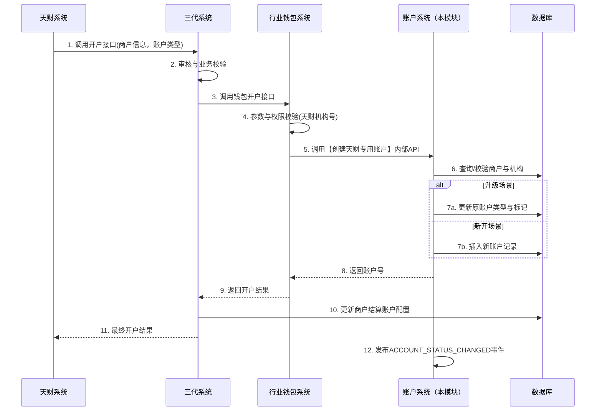
```mermaid
sequenceDiagram
    participant T as 天财系统
    participant G3 as 三代系统
    participant W as 行业钱包系统
    participant A as 账户系统（本模块）
    participant DB as 数据库

    T->>G3: 1. 调用开户接口(商户信息，账户类型)
    G3->>G3: 2. 审核与业务校验
    G3->>W: 3. 调用钱包开户接口
    W->>W: 4. 参数与权限校验(天财机构号)
    W->>A: 5. 调用【创建天财专用账户】内部API
    A->>DB: 6. 查询/校验商户与机构
    alt 升级场景
        A->>DB: 7a. 更新原账户类型与标记
    else 新开场景
        A->>DB: 7b. 插入新账户记录
    end
    A-->>W: 8. 返回账户号
    W-->>G3: 9. 返回开户结果
    G3->>DB: 10. 更新商户结算账户配置
    G3-->>T: 11. 最终开户结果
    A->>A: 12. 发布ACCOUNT_STATUS_CHANGED事件
```

### 5.2 天财分账转账时序图

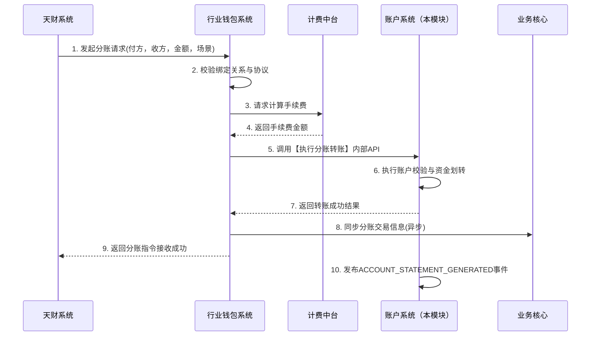
```mermaid
sequenceDiagram
    participant T as 天财系统
    participant W as 行业钱包系统
    participant Fee as 计费中台
    participant A as 账户系统（本模块）
    participant BC as 业务核心

    T->>W: 1. 发起分账请求(付方，收方，金额，场景)
    W->>W: 2. 校验绑定关系与协议
    W->>Fee: 3. 请求计算手续费
    Fee-->>W: 4. 返回手续费金额
    W->>A: 5. 调用【执行分账转账】内部API
    A->>A: 6. 执行账户校验与资金划转
    A-->>W: 7. 返回转账成功结果
    W->>BC: 8. 同步分账交易信息(异步)
    W-->>T: 9. 返回分账指令接收成功
    A->>A: 10. 发布ACCOUNT_STATEMENT_GENERATED事件
```

## 6. 错误处理

| 错误场景 | 错误码 | 处理策略 | 是否重试 |
| :--- | :--- | :--- | :--- |
| 账户不存在 | `ACCOUNT_NOT_FOUND` | 返回明确错误，上游需检查商户及账户状态。 | 否 |
| 账户状态异常（冻结、关闭） | `ACCOUNT_STATUS_INVALID` | 返回错误，上游需解冻或重新开户。 | 否 |
| 账户余额不足 | `INSUFFICIENT_BALANCE` | 返回错误，上游需充值或调整金额。 | 否 |
| 账户类型不符合规则 | `ACCOUNT_TYPE_MISMATCH` | 返回错误，上游需检查分账路径是否正确。 | 否 |
| 乐观锁更新冲突 | `OPTIMISTIC_LOCK_CONFLICT` | 系统自动重试（最多3次），仍失败则返回错误。 | 是 |
| 数据库连接异常 | `DB_CONNECTION_ERROR` | 记录日志，抛出系统异常，依赖框架重试机制。 | 是 |
| 下游系统（清结算）事件格式错误 | `INVALID_EVENT_FORMAT` | 记录日志并告警，丢弃无效事件。 | 否 |

**通用策略**:
- 所有对外接口返回格式统一的响应体，包含`code`, `message`, `data`。
- 系统内部异常被捕获后，转换为业务友好的错误码和消息。
- 涉及资金的核心操作（转账、提现）必须有完整的事务保证，确保数据一致性。
- 所有错误和异常需记录详细日志，便于问题追踪和对账。

## 7. 依赖说明

### 7.1 上游依赖
1.  **行业钱包系统**:
    - **交互方式**: 同步RPC调用（本模块提供的内部API）。
    - **依赖内容**: 接收其发起的账户创建、升级、转账、查询等指令。
    - **兼容性**: 需与钱包系统约定清晰的接口版本和字段含义。本模块需保持接口的向后兼容性。

2.  **清结算系统**:
    - **交互方式**: 异步消息（事件驱动）。
    - **依赖内容**: 消费`SETTLEMENT_ORDER_PUSHED`事件，驱动账户余额变更。
    - **兼容性**: 需明确事件格式、重试策略和幂等性处理（基于结算单号去重）。

3.  **数据库**:
    - **依赖内容**: MySQL/PostgreSQL，用于持久化账户、流水数据。
    - **要求**: 高可用、读写分离架构，保证事务一致性。

### 7.2 下游依赖
1.  **对账单系统**:
    - **交互方式**: 提供查询API，并发布`ACCOUNT_STATEMENT_GENERATED`事件供其订阅。
    - **提供内容**: 账户动账明细流水数据。
    - **性能要求**: 查询接口需支持按账户、时间范围分页查询，数据量大，需考虑数据库索引优化。

2.  **风控系统**:
    - **交互方式**: 监听本模块发布的`ACCOUNT_STATUS_CHANGED`事件。
    - **提供内容**: 账户冻结/解冻状态变更通知。

### 7.3 解耦与容错设计
- **异步化**: 与清结算、对账单系统的交互尽量采用事件驱动，避免同步调用链过长。
- **幂等性**: 所有涉及资金变动的接口和事件处理都必须支持幂等，通过业务唯一键（如`requestId`, `bizNo`）实现。
- **降级策略**: 若非核心查询接口（如流水查询）超时或不可用，可返回降级数据或友好提示，不影响核心交易链路。
- **监控与告警**: 对关键接口的调用量、成功率、耗时进行监控，对失败和异常进行实时告警。

## 3.2 三代系统


# 三代系统 - 天财分账模块设计文档

## 1. 概述

### 1.1 目的
本模块是三代系统为支持“天财商龙”分账业务而设计的核心业务模块。它作为天财业务在三代系统的入口和协调中心，负责处理商户开户、关系绑定、业务开通、退货模式配置等关键业务流程，并与行业钱包系统、账户系统、清结算系统等多个下游系统协同，实现资金归集、批量付款、会员结算等分账场景。

### 1.2 范围
- **商户管理**：为天财机构下的收单商户开通或升级“天财专用账户”（收款账户/接收方账户）。
- **业务开通与审核**：管理天财分账业务的线上审核、签约流程。
- **关系绑定**：处理归集、批量付款、会员结算场景下的授权关系建立与认证。
- **退货模式管理**：为天财商户配置和管理退货资金扣款路径。
- **接口网关**：作为天财系统与拉卡拉内部系统（钱包、账户、清结算等）交互的统一入口，进行权限校验、参数转换和路由。
- **数据同步与查询**：提供账户动账明细等查询接口，并参与对账单数据的组织。

### 1.3 核心原则
- **入口唯一性**：所有天财发起的业务请求，必须通过三代系统提供的专用接口进入。
- **强校验与隔离**：通过机构号、AppID严格限制调用方，确保业务数据隔离。
- **流程驱动**：业务开通遵循“开户 -> (开通付款) -> 关系绑定”的标准流程。
- **向下兼容**：支持老商户向天财专用账户模式的平滑迁移（升级或新开）。

## 2. 接口设计

### 2.1 API端点 (RESTful)

#### 2.1.1 商户开户接口
- **端点**: `POST /api/v1/tiancai/account/open`
- **描述**: 为收单商户开立或升级天财专用账户。
- **调用方**: 天财系统（通过机构号和AppID鉴权）
- **请求头**:
    - `X-App-Id`: 天财应用ID
    - `X-Org-No`: 天财机构号
    - `Authorization`: Bearer Token
- **请求体**:
```json
{
  "requestId": "TC20240115001", // 请求流水号，幂等键
  "merchantNo": "888000000001", // 收单商户号
  "operationType": "OPEN | UPGRADE", // 操作类型：新开 / 升级
  "accountType": "RECEIVE | RECEIVER", // 账户类型：收款账户 / 接收方账户
  "roleType": "HEADQUARTERS | STORE", // 角色类型：总部 / 门店 (仅收款账户需传)
  "settlementMode": "ACTIVE", // 结算模式，开户固定为ACTIVE
  "baseInfo": { // 商户基础信息（升级时部分可选）
    "merchantName": "xx餐饮总部",
    "legalPerson": "张三",
    "idCardNo": "110101199001011234",
    "contactPhone": "13800138000"
  },
  "bankCardInfo": { // 银行卡信息（接收方账户必传）
    "cardNo": "6228480012345678901",
    "bankName": "中国农业银行",
    "branchName": "北京分行",
    "isDefault": true
  },
  "effectiveTime": "2024-01-16 00:00:00" // 期望生效时间
}
```
- **响应体** (成功):
```json
{
  "code": "SUCCESS",
  "message": "成功",
  "data": {
    "requestId": "TC20240115001",
    "merchantNo": "888000000001",
    "tiancaiAccountNo": "TC888000000001R01", // 天财专用账户号
    "accountType": "RECEIVE",
    "status": "SUCCESS",
    "openTime": "2024-01-15 14:30:00"
  }
}
```

#### 2.1.2 关系绑定（签约与认证）接口
- **端点**: `POST /api/v1/tiancai/relationship/bind`
- **描述**: 发起归集、批量付款或会员结算场景下的授权关系建立流程。
- **请求体**:
```json
{
  "requestId": "TC20240115002",
  "scene": "COLLECTION | BATCH_PAY | MEMBER_SETTLEMENT", // 场景
  "initiatorMerchantNo": "888000000001", // 发起方商户号（总部）
  "initiatorMerchantName": "xx餐饮总部",
  "payerMerchantNo": "888000000002", // 付方商户号
  "payerMerchantName": "xx餐饮北京店",
  "payeeMerchantNo": "888000000001", // 收方商户号
  "payeeMerchantName": "xx餐饮总部",
  "authorizationContact": {
    "name": "李四",
    "phone": "13900139000",
    "idCardNo": "110101199002022345"
  },
  "collectionInfo": { // 归集场景特有
    "collectionMode": "FIXED_AMOUNT | PROPORTION", // 归集模式
    "maxProportion": 100, // 订单归集最高比例（%）
    "payerSettleAccountName": "xx餐饮北京店",
    "payerSettleCardNo": "6228480012345678902"
  },
  "capitalPurpose": "资金归集", // 资金用途
  "callbackUrl": "https://tiancai.com/callback" // 签约结果回调地址
}
```
- **响应体**:
```json
{
  "code": "SUCCESS",
  "message": "成功",
  "data": {
    "requestId": "TC20240115002",
    "authFlowNo": "AUTH202401150001", // 授权流水号
    "signUrl": "https://esign.lkl.com/h5/xxx", // H5签约页面URL（返回给天财引导用户操作）
    "expireTime": "2024-01-15 15:30:00"
  }
}
```

#### 2.1.3 业务开通审核接口
- **端点**: `POST /api/v1/tiancai/business/audit`
- **描述**: 业务运营人员审核天财商户的业务开通申请（线上自动审核流程）。
- **权限**: 内部运营系统调用
- **请求体**:
```json
{
  "applyNo": "APPLY20240115001", // 申请单号
  "merchantNo": "888000000001",
  "businessType": "TIANCAI_ACCOUNT", // 业务类型
  "auditResult": "PASS | REJECT",
  "auditComment": "资料齐全，符合要求",
  "auditor": "admin01"
}
```

#### 2.1.4 查询接口
- **端点**: `GET /api/v1/tiancai/query/account-details`
- **描述**: 查询待结算账户或收款账户的动账明细（供天财对账使用，需评估频率）。
- **请求参数**:
```
merchantNo=888000000001&accountType=PENDING|RECEIVE&startDate=2024-01-14&endDate=2024-01-15&pageNo=1&pageSize=100
```

### 2.2 发布/消费的事件

#### 2.2.1 发布的事件
1. **MerchantAccountUpgradedEvent** (商户账户升级事件)
   - **触发时机**: 普通收款账户成功升级为天财收款账户后。
   - **数据**:
   ```json
   {
     "eventId": "event_001",
     "eventType": "MERCHANT_ACCOUNT_UPGRADED",
     "timestamp": "2024-01-15T14:30:00Z",
     "data": {
       "merchantNo": "888000000001",
       "oldAccountNo": "ORD888000000001",
       "newAccountNo": "TC888000000001R01",
       "upgradeTime": "2024-01-15T14:30:00Z"
     }
   }
   ```

2. **BusinessAuditPassedEvent** (业务审核通过事件)
   - **触发时机**: 天财业务开通申请审核通过后。
   - **消费者**: 行业钱包系统（触发开户）、消息中心（通知天财）。

#### 2.2.2 消费的事件
1. **WalletAccountOpenedEvent** (钱包账户开立事件)
   - **发布方**: 行业钱包系统
   - **动作**: 更新本地商户的天财账户号，并回调通知天财系统。

2. **SigningCompletedEvent** (电子签约完成事件)
   - **发布方**: 电子签约平台
   - **动作**: 更新关系绑定状态，并回调通知天财系统。

## 3. 数据模型

### 3.1 核心表设计

#### 表: `tiancai_merchant` (天财商户信息表)
| 字段名 | 类型 | 必填 | 描述 | 索引 |
|--------|------|------|------|------|
| id | bigint | Y | 主键 | PK |
| merchant_no | varchar(32) | Y | 收单商户号 | UK |
| org_no | varchar(16) | Y | 所属机构号（天财） | IDX |
| merchant_name | varchar(128) | Y | 商户全称 | |
| role_type | tinyint | N | 角色类型：1-总部，2-门店 | IDX |
| merchant_type | varchar(16) | Y | 商户性质：ENTERPRISE/INDIVIDUAL | |
| tiancai_account_no | varchar(32) | N | 天财专用账户号 | UK |
| account_type | tinyint | N | 账户类型：1-收款账户，2-接收方账户 | |
| settlement_mode | tinyint | Y | 结算模式：1-主动，2-被动 | |
| refund_mode | varchar(32) | Y | 退货模式 | |
| status | tinyint | Y | 状态：1-正常，2-冻结，0-注销 | IDX |
| create_time | datetime | Y | 创建时间 | |
| update_time | datetime | Y | 更新时间 | |

#### 表: `tiancai_auth_relationship` (授权关系表)
| 字段名 | 类型 | 必填 | 描述 | 索引 |
|--------|------|------|------|------|
| id | bigint | Y | 主键 | PK |
| auth_flow_no | varchar(32) | Y | 授权流水号 | UK |
| scene | varchar(32) | Y | 场景：COLLECTION/BATCH_PAY/MEMBER_SETTLEMENT | IDX |
| initiator_merchant_no | varchar(32) | Y | 发起方商户号 | IDX |
| payer_merchant_no | varchar(32) | Y | 付方商户号 | IDX |
| payee_merchant_no | varchar(32) | Y | 收方商户号 | IDX |
| capital_purpose | varchar(64) | Y | 资金用途 | |
| auth_contact_name | varchar(64) | Y | 授权联系人姓名 | |
| auth_contact_phone | varchar(16) | Y | 授权联系人手机 | |
| auth_contact_id_card | varchar(32) | N | 授权联系人身份证 | |
| sign_status | tinyint | Y | 签约状态：0-初始化，1-已发送，2-已完成，3-已过期，4-已拒绝 | IDX |
| sign_url | varchar(512) | N | 签约H5 URL | |
| expire_time | datetime | Y | 签约过期时间 | |
| complete_time | datetime | N | 签约完成时间 | |
| create_time | datetime | Y | 创建时间 | |

#### 表: `tiancai_business_apply` (业务开通申请表)
| 字段名 | 类型 | 必填 | 描述 | 索引 |
|--------|------|------|------|------|
| id | bigint | Y | 主键 | PK |
| apply_no | varchar(32) | Y | 申请单号 | UK |
| merchant_no | varchar(32) | Y | 商户号 | IDX |
| business_type | varchar(32) | Y | 业务类型 | |
| apply_source | varchar(16) | Y | 申请来源：TIANCAI/OPERATION | |
| apply_data | json | Y | 申请资料（结构化存储） | |
| audit_status | tinyint | Y | 审核状态：0-待审核，1-通过，2-拒绝 | IDX |
| audit_comment | varchar(256) | N | 审核意见 | |
| auditor | varchar(32) | N | 审核人 | |
| audit_time | datetime | N | 审核时间 | |
| create_time | datetime | Y | 创建时间 | |

#### 表: `tiancai_interface_log` (接口调用日志表)
| 字段名 | 类型 | 必填 | 描述 | 索引 |
|--------|------|------|------|------|
| id | bigint | Y | 主键 | PK |
| request_id | varchar(64) | Y | 请求流水号（幂等键） | UK |
| app_id | varchar(32) | Y | 调用方AppID | IDX |
| org_no | varchar(16) | Y | 机构号 | IDX |
| interface_name | varchar(64) | Y | 接口名称 | |
| request_params | json | Y | 请求参数 | |
| response_result | json | N | 响应结果 | |
| status | tinyint | Y | 状态：1-成功，0-失败 | |
| error_code | varchar(32) | N | 错误码 | |
| error_message | varchar(256) | N | 错误信息 | |
| cost_time | int | Y | 耗时(ms) | |
| create_time | datetime | Y | 创建时间 | IDX |

### 3.2 与其他模块的关系
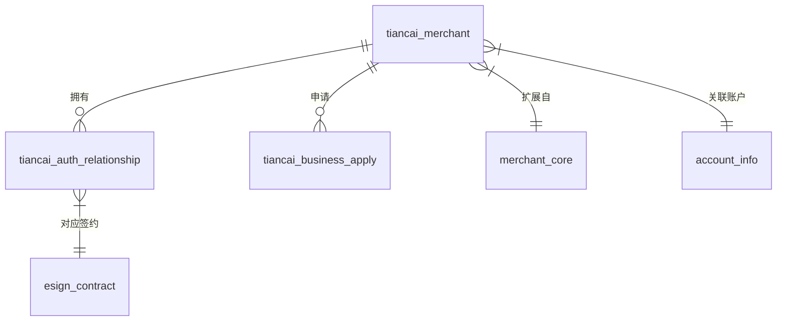
```mermaid
erDiagram
    tiancai_merchant ||--o{ tiancai_auth_relationship : "拥有"
    tiancai_merchant ||--o{ tiancai_business_apply : "申请"
    
    tiancai_merchant }|--|| merchant_core : "扩展自"
    tiancai_merchant }|--|| account_info : "关联账户"
    
    tiancai_auth_relationship }|--|| esign_contract : "对应签约"
```

- **merchant_core**: 三代系统核心商户表，`tiancai_merchant.merchant_no` 外键关联。
- **account_info**: 账户系统账户基础信息表，`tiancai_merchant.tiancai_account_no` 关联。
- **esign_contract**: 电子签约平台合同表，`tiancai_auth_relationship.auth_flow_no` 关联。

## 4. 业务逻辑

### 4.1 核心算法与流程

#### 4.1.1 开户流程逻辑
```python
def open_tiancai_account(request):
    # 1. 接口级校验
    validate_app_id_and_org(request.app_id, request.org_no)  # 必须为天财机构
    
    # 2. 幂等性检查
    if check_request_id_exists(request.request_id):
        return get_previous_response(request.request_id)
    
    # 3. 商户基础校验
    merchant = get_merchant_by_no(request.merchant_no)
    if not merchant:
        raise MerchantNotFoundException()
    
    if merchant.org_no != request.org_no:
        raise MerchantNotBelongToOrgException()
    
    # 4. 业务规则校验
    if request.operation_type == "OPEN":
        # 新开：检查是否已存在天财账户
        if merchant.tiancai_account_no:
            raise TiancaiAccountAlreadyExistsException()
    elif request.operation_type == "UPGRADE":
        # 升级：检查是否普通收款账户且未冻结
        if not merchant.is_normal_receive_account():
            raise CannotUpgradeException()
        if merchant.status == FROZEN:
            raise MerchantFrozenException()
    
    # 5. 调用行业钱包系统开户/升级
    wallet_request = build_wallet_open_request(request, merchant)
    wallet_response = call_wallet_system(wallet_request)
    
    # 6. 更新本地记录
    update_merchant_tiancai_account(merchant, wallet_response)
    
    # 7. 设置结算模式切换任务（如需次日生效）
    if request.effective_time:
        schedule_settlement_mode_change(merchant, request.effective_time)
    
    # 8. 发布事件，通知相关方
    publish_account_opened_event(merchant, wallet_response)
    
    return build_success_response(wallet_response)
```

#### 4.1.2 关系绑定校验逻辑
```python
def validate_relationship_bind(request):
    # 场景-specific 校验
    if request.scene == "COLLECTION":
        # 归集场景
        # 1. 付方必须是门店，收方必须是总部
        payer = get_tiancai_merchant(request.payer_merchant_no)
        payee = get_tiancai_merchant(request.payee_merchant_no)
        
        if payer.role_type != STORE or payee.role_type != HEADQUARTERS:
            raise InvalidRoleForCollectionException()
        
        # 2. 收方必须是企业性质
        if payee.merchant_type != ENTERPRISE:
            raise PayeeMustBeEnterpriseException()
        
        # 3. 发起方必须是收方（总部自己发起）
        if request.initiator_merchant_no != request.payee_merchant_no:
            raise InitiatorMustBePayeeException()
        
        # 4. 收付方必须都是天财收款账户
        if payer.account_type != RECEIVE_ACCOUNT or payee.account_type != RECEIVE_ACCOUNT:
            raise MustBeTiancaiReceiveAccountException()
    
    elif request.scene == "BATCH_PAY":
        # 批量付款场景
        # 1. 付方必须是总部
        payer = get_tiancai_merchant(request.payer_merchant_no)
        if payer.role_type != HEADQUARTERS:
            raise PayerMustBeHeadquartersException()
        
        # 2. 检查付方是否已开通付款能力
        if not payer.payment_capability_enabled:
            raise PaymentCapabilityNotEnabledException()
    
    # 通用校验：检查是否已存在有效关系
    existing_relation = get_active_relationship(
        request.payer_merchant_no, 
        request.payee_merchant_no, 
        request.scene
    )
    if existing_relation:
        raise RelationshipAlreadyExistsException()
```

### 4.2 业务规则

1. **开户规则**:
   - 一个收单商户只能开立一个天财收款账户。
   - 天财接收方账户支持绑定多张银行卡，需设置默认提现卡。
   - 老商户升级时，原收款账户余额需在切换时点前全部结算/提现完毕。
   - 天财机构下的新商户，默认退货模式为“终点账户+退货账户”。

2. **关系绑定规则**:
   - 归集关系：门店（付方）← 总部（收方），需门店授权联系人完成打款验证+协议签署。
   - 批量付款：总部（付方）→ 接收方（收方），接收方为企业需打款验证，为个人/个体需人脸验证。
   - 会员结算：作为批量付款的特例，遵循相同规则。
   - 关系建立前，付方在批量付款和会员结算场景需先“开通付款”。

3. **权限规则**:
   - 所有天财专用接口必须通过机构号和AppID双重验证。
   - 只有天财机构下的商户才能开通天财专用账户。
   - 商户主被动结算模式切换，仅允许天财调用。

4. **时效规则**:
   - 电子签约H5链接有效期为1小时。
   - 结算模式切换可在指定时间（如次日0点）生效。

### 4.3 验证逻辑

1. **四要素验证**:
   - 天财接收方开户时，必须完成姓名、身份证号、银行卡号、手机号的四要素验证。
   - 验证通过后，银行卡信息才可绑定。

2. **打款验证**:
   - 对公企业认证使用打款验证，向对公账户打入随机金额（0.01-0.99元）。
   - 验证时需回填正确金额和备注。

3. **人脸验证**:
   - 个人/个体户认证使用人脸验证。
   - 调用认证系统接口，比对姓名、身份证、人脸信息一致性。

## 5. 时序图

### 5.1 天财收款账户开户时序图

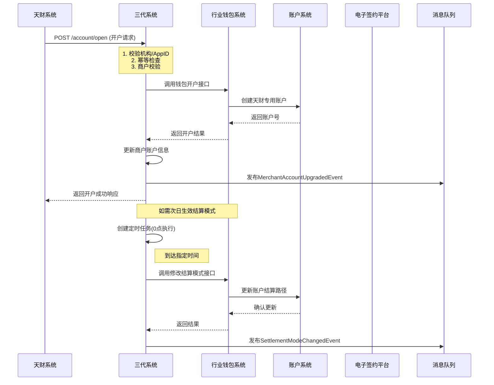
```mermaid
sequenceDiagram
    participant T as 天财系统
    participant G3 as 三代系统
    participant W as 行业钱包系统
    participant A as 账户系统
    participant ES as 电子签约平台
    participant MQ as 消息队列

    T->>G3: POST /account/open (开户请求)
    Note over G3: 1. 校验机构/AppID<br>2. 幂等检查<br>3. 商户校验
    G3->>W: 调用钱包开户接口
    W->>A: 创建天财专用账户
    A-->>W: 返回账户号
    W-->>G3: 返回开户结果
    G3->>G3: 更新商户账户信息
    G3->>MQ: 发布MerchantAccountUpgradedEvent
    G3-->>T: 返回开户成功响应
    
    Note over G3,W: 如需次日生效结算模式
    G3->>G3: 创建定时任务(0点执行)
    Note right of G3: 到达指定时间
    G3->>W: 调用修改结算模式接口
    W->>A: 更新账户结算路径
    A-->>W: 确认更新
    W-->>G3: 返回结果
    G3->>MQ: 发布SettlementModeChangedEvent
```

### 5.2 关系绑定（归集场景）时序图

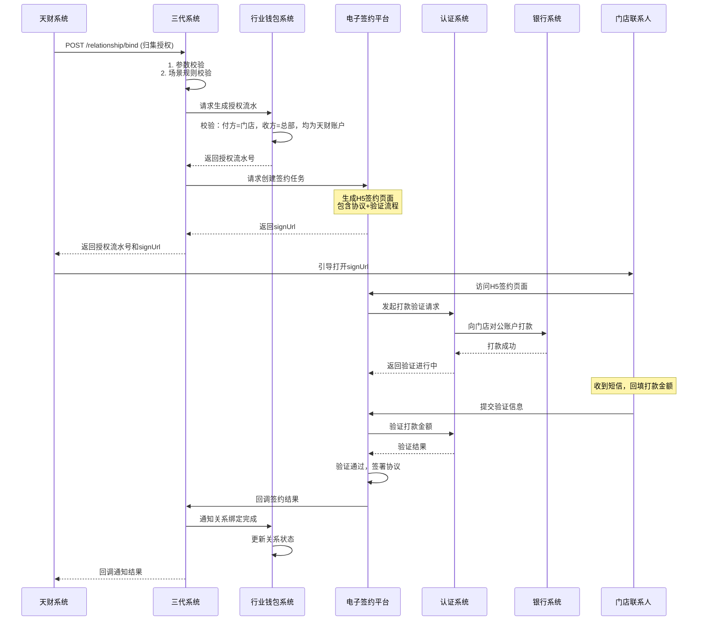
```mermaid
sequenceDiagram
    participant T as 天财系统
    participant G3 as 三代系统
    participant W as 行业钱包系统
    participant ES as 电子签约平台
    participant AS as 认证系统
    participant Bank as 银行系统
    participant User as 门店联系人

    T->>G3: POST /relationship/bind (归集授权)
    G3->>G3: 1. 参数校验<br>2. 场景规则校验
    G3->>W: 请求生成授权流水
    W->>W: 校验：付方=门店，收方=总部，均为天财账户
    W-->>G3: 返回授权流水号
    G3->>ES: 请求创建签约任务
    Note over ES: 生成H5签约页面<br>包含协议+验证流程
    ES-->>G3: 返回signUrl
    G3-->>T: 返回授权流水号和signUrl
    
    T->>User: 引导打开signUrl
    User->>ES: 访问H5签约页面
    ES->>AS: 发起打款验证请求
    AS->>Bank: 向门店对公账户打款
    Bank-->>AS: 打款成功
    AS-->>ES: 返回验证进行中
    
    Note over User: 收到短信，回填打款金额
    User->>ES: 提交验证信息
    ES->>AS: 验证打款金额
    AS-->>ES: 验证结果
    ES->>ES: 验证通过，签署协议
    ES->>G3: 回调签约结果
    G3->>W: 通知关系绑定完成
    W->>W: 更新关系状态
    G3-->>T: 回调通知结果
```

## 6. 错误处理

### 6.1 错误码设计

| 错误码 | HTTP状态码 | 描述 | 处理建议 |
|--------|------------|------|----------|
| TC_AUTH_001 | 401 | AppID或机构号无效 | 检查请求头中的认证信息 |
| TC_MERCHANT_002 | 400 | 商户不存在 | 检查商户号是否正确 |
| TC_MERCHANT_003 | 400 | 商户不属于该机构 | 确认商户与机构关系 |
| TC_ACCOUNT_004 | 400 | 天财账户已存在 | 无需重复开户 |
| TC_ACCOUNT_005 | 400 | 非普通账户，无法升级 | 检查账户类型 |
| TC_BUSINESS_006 | 400 | 业务申请待审核 | 等待审核完成 |
| TC_RELATION_007 | 400 | 场景角色不匹配 | 检查付方/收方角色 |
| TC_RELATION_008 | 400 | 关系已存在 | 无需重复绑定 |
| TC_VALIDATION_009 | 400 | 四要素验证失败 | 重新提交正确信息 |
| TC_SYSTEM_010 | 500 | 下游系统异常 | 重试或联系运维 |

### 6.2 异常处理策略

1. **幂等性保证**:
   - 所有写操作接口必须包含`requestId`。
   - 在`tiancai_interface_log`表中记录请求，实现天然幂等。
   - 重复请求直接返回之前的结果。

2. **下游系统降级**:
   - 调用行业钱包、账户系统等关键下游时，设置合理超时（如3秒）。
   - 部分查询类接口可返回缓存数据或默认值。
   - 开户等核心写操作，必须成功才能返回，否则明确失败。

3. **补偿机制**:
   - 对于异步流程（如签约），记录完整状态机。
   - 提供补偿查询接口，允许天财查询进度。
   - 定时任务扫描超时未完成流程，发送告警。

4. **数据一致性**:
   - 本地事务：数据库更新与日志记录在同一事务中。
   - 分布式事务：关键操作使用本地消息表+定时任务补偿。
   - 最终一致性：通过事件驱动，各系统异步同步状态。

## 7. 依赖说明

### 7.1 上游依赖

1. **天财系统**:
   - **交互方式**: REST API调用
   - **职责**: 业务发起方，提供商户资料、发起开户、关系绑定等请求。
   - **数据流**: 商户信息、业务请求、回调通知。
   - **SLA要求**: 接口响应时间<1s，可用性99.9%。

2. **内部运营系统**:
   - **交互方式**: REST API / 数据库直连
   - **职责**: 提供业务审核功能，传递审核结果。
   - **数据流**: 审核申请、审核结果。

### 7.2 下游依赖

1. **行业钱包系统**:
   - **交互方式**: RPC / REST
   - **职责**: 处理天财专用账户的开户、升级、关系绑定核心校验。
   - **关键接口**: 
     - `openTiancaiAccount`: 开户/升级
     - `createAuthRelationship`: 创建授权关系
     - `updateSettlementMode`: 修改结算模式
   - **异常影响**: 开户、关系绑定功能不可用。

2. **账户系统**:
   - **交互方式**: 通过钱包系统间接调用
   - **职责**: 底层账户的创建、标记、账务处理。
   - **异常影响**: 账户无法开立，资金操作失败。

3. **电子签约平台**:
   - **交互方式**: REST API
   - **职责**: 提供H5签约页面，完成协议签署和身份验证。
   - **关键接口**: 
     - `createSignTask`: 创建签约任务
     - `querySignStatus`: 查询签约状态
   - **异常影响**: 关系绑定流程中断。

4. **认证系统**:
   - **交互方式**: 通过电子签约平台间接调用
   - **职责**: 提供打款验证、人脸验证能力。
   - **异常影响**: 身份验证无法完成。

5. **清结算系统**:
   - **交互方式**: REST API / 消息队列
   - **职责**: 处理退货资金扣款、提供结算明细。
   - **关键交互**: 
     - 退货前置查询终点账户
     - 获取结算明细用于对账
   - **异常影响**: 退货功能异常，对账数据不全。

6. **消息队列 (MQ)**:
   - **交互方式**: 事件发布/订阅
   - **职责**: 异步通知、系统解耦。
   - **关键事件**: 账户变更、关系绑定完成、审核通过等。

### 7.3 依赖管理策略

1. **超时与重试**:
   - 钱包系统: 超时3秒，重试2次
   - 电子签约: 超时5秒，重试1次
   - 清结算: 超时2秒，重试3次

2. **熔断与降级**:
   - 使用熔断器模式（如Hystrix）保护关键依赖。
   - 非核心功能（如部分查询）支持降级返回。

3. **监控与告警**:
   - 监控各依赖接口的响应时间、成功率。
   - 关键依赖失败时，即时告警（企业微信/短信）。
   - 每日依赖健康度报告。

**文档版本**: 1.0  
**最后更新**: 2024-01-15  
**维护团队**: 三代系统开发组

## 3.3 认证系统


# 认证系统模块设计文档

## 1. 概述

### 1.1 目的
认证系统作为拉卡拉支付平台的核心身份核验模块，为“天财分账”等业务场景提供安全、合规、可靠的身份认证能力。其主要目的是：
- **验证身份真实性**：通过打款验证和人脸验证，确保参与分账业务的商户（总部、门店、接收方）身份真实有效，满足监管和法务要求。
- **保障协议有效性**：为电子签约流程提供前置身份核验，确保签署协议的各方主体身份无误，形成完整的电子证据链。
- **支持业务场景**：适配“归集”、“批量付款”、“会员结算”等多种分账场景下，对不同类型商户（企业/个人）的差异化认证需求。

### 1.2 范围
本模块设计范围涵盖：
- **打款验证**：面向对公企业，通过向指定银行卡打入随机小额款项并验证回填信息的方式进行认证。
- **人脸验证**：面向个人及个体户，通过比对姓名、身份证号和人脸生物特征信息进行认证。
- **认证结果管理**：记录、存储和查询认证过程与结果，为业务系统提供校验依据。
- **与电子签约平台集成**：作为电子签约流程中的关键一环，接收其调用并返回认证结果。

**边界说明**：
- 本模块**不负责**协议模板管理、短信发送、H5页面生成，这些由电子签约平台负责。
- 本模块**不负责**账户信息（如绑定银行卡）的存储与管理，这些由行业钱包系统负责。
- 本模块**不负责**打款验证中的实际资金划拨，仅负责发起指令和验证回填信息，资金划拨由账务核心系统执行。

## 2. 接口设计

### 2.1 API端点 (RESTful)

#### 2.1.1 发起打款验证
- **端点**: `POST /api/v1/verification/transfer`
- **描述**: 为指定的对公企业银行卡发起一笔随机小额打款，并生成一条待验证记录。
- **认证**: API Key (由调用方如电子签约平台提供)
- **请求头**:
    - `X-Request-ID`: 请求唯一标识，用于幂等和追踪。
    - `X-Caller-System`: 调用方系统标识 (如：`e-sign-platform`)。

- **请求体**:
```json
{
  "requestId": "req_202310271200001", // 业务请求ID，全局唯一
  "businessType": "TIANCAI_SPLIT", // 业务类型，固定值
  "scene": "BATCH_PAYMENT", // 场景：BATCH_PAYMENT, MEMBER_SETTLEMENT, COLLECTION, OPEN_PAYMENT
  "payerMerchantNo": "M1234567890", // 付方商户号（协议发起方）
  "payerMerchantName": "XX科技有限公司", // 付方商户全称
  "payeeBankCardNo": "6228480012345678901", // 收款银行卡号（待验证卡）
  "payeeAccountName": "XX科技有限公司", // 收款账户户名（需与卡号对应）
  "callbackUrl": "https://esign.example.com/callback/verification" // 验证结果回调地址
}
```

- **响应体 (成功)**:
```json
{
  "code": "SUCCESS",
  "message": "打款指令已发起",
  "data": {
    "verificationId": "verif_202310271200001", // 本系统生成的认证流水ID
    "status": "PENDING", // 状态：PENDING-待回填，SUCCESS-成功，FAILED-失败，EXPIRED-过期
    "expireTime": "2023-10-27T12:10:00+08:00" // 回填过期时间（如10分钟后）
  }
}
```

#### 2.1.2 验证打款回填信息
- **端点**: `POST /api/v1/verification/transfer/confirm`
- **描述**: 验证用户回填的打款金额和备注信息。
- **请求体**:
```json
{
  "verificationId": "verif_202310271200001",
  "filledAmount": "0.23", // 用户回填金额，单位元，两位小数
  "filledRemark": "529874" // 用户回填备注，6位数字或2个汉字
}
```
- **响应体 (成功)**:
```json
{
  "code": "SUCCESS",
  "message": "验证成功",
  "data": {
    "verificationId": "verif_202310271200001",
    "status": "SUCCESS",
    "verifyTime": "2023-10-27T12:05:30+08:00"
  }
}
```

#### 2.1.3 发起人脸验证
- **端点**: `POST /api/v1/verification/face`
- **描述**: 发起一次人脸核验请求，通常返回一个用于前端SDK调用的令牌或配置。
- **请求体**:
```json
{
  "requestId": "req_202310271200002",
  "businessType": "TIANCAI_SPLIT",
  "scene": "MEMBER_SETTLEMENT",
  "payerMerchantNo": "M1234567890",
  "payerMerchantName": "XX科技有限公司",
  "userId": "110101199001011234", // 待验证用户的身份证号
  "userName": "张三", // 待验证用户姓名
  "userType": "PERSONAL", // 用户类型：PERSONAL-个人， INDIVIDUAL-个体户
  "callbackUrl": "https://esign.example.com/callback/verification"
}
```
- **响应体 (成功)**:
```json
{
  "code": "SUCCESS",
  "message": "人脸核验请求已创建",
  "data": {
    "verificationId": "verif_202310271200002",
    "verifyToken": "face_token_abc123xyz", // 用于前端人脸SDK的令牌
    "sdkConfig": { // 可选，前端SDK所需配置
      "appId": "face_app_001",
      "nonce": "random_str",
      "timestamp": "1698372330"
    },
    "expireTime": "2023-10-27T12:10:00+08:00"
  }
}
```

#### 2.1.4 提交人脸验证结果
- **端点**: `POST /api/v1/verification/face/result` (通常由前端SDK回调或电子签约平台中转)
- **描述**: 接收人脸核验服务提供商（如腾讯云、阿里云）的回调结果，或由前端提交核验结果。
- **请求体**:
```json
{
  "verificationId": "verif_202310271200002",
  "bizToken": "biz_token_from_provider", // 核验服务商的业务流水号
  "success": true,
  "score": 0.95, // 人脸比对分数
  "message": "核验通过"
}
```
- **响应体 (成功)**:
```json
{
  "code": "SUCCESS",
  "message": "结果接收成功"
}
```

#### 2.1.5 查询认证结果
- **端点**: `GET /api/v1/verification/{verificationId}`
- **描述**: 根据认证流水ID查询详细的认证结果和过程信息。
- **响应体**:
```json
{
  "code": "SUCCESS",
  "data": {
    "verificationId": "verif_202310271200001",
    "requestId": "req_202310271200001",
    "businessType": "TIANCAI_SPLIT",
    "scene": "BATCH_PAYMENT",
    "merchantInfo": {
      "payerMerchantNo": "M1234567890",
      "payerMerchantName": "XX科技有限公司",
      "payeeBankCardNo": "6228480012345678901",
      "payeeAccountName": "XX科技有限公司"
    },
    "type": "TRANSFER", // 认证类型：TRANSFER-打款， FACE-人脸
    "status": "SUCCESS",
    "detail": {
      "transferAmount": "0.23", // 打款金额（仅打款验证）
      "transferRemark": "529874", // 打款备注（仅打款验证）
      "transferTime": "2023-10-27T12:01:00+08:00",
      "filledAmount": "0.23",
      "filledRemark": "529874",
      "filledTime": "2023-10-27T12:05:30+08:00"
    },
    "createTime": "2023-10-27T12:00:00+08:00",
    "verifyTime": "2023-10-27T12:05:30+08:00"
  }
}
```

### 2.2 发布/消费的事件

#### 2.2.1 消费的事件
- **Account.BankCardBound**: 当行业钱包系统或账户系统成功绑定银行卡时，可能需要触发预验证（可选需求，当前未明确，预留接口）。

#### 2.2.2 发布的事件
- **Verification.Completed**: 当一次认证流程完成（成功或失败）时发布，供电子签约平台、行业钱包等系统订阅。
```json
{
  "eventId": "event_verif_001",
  "eventType": "Verification.Completed",
  "timestamp": "2023-10-27T12:05:30+08:00",
  "payload": {
    "verificationId": "verif_202310271200001",
    "requestId": "req_202310271200001",
    "businessType": "TIANCAI_SPLIT",
    "scene": "BATCH_PAYMENT",
    "type": "TRANSFER",
    "status": "SUCCESS", // 或 FAILED
    "payerMerchantNo": "M1234567890",
    "relatedBankCardNo": "6228480012345678901",
    "userId": "110101199001011234" // 人脸验证时有值
  }
}
```

## 3. 数据模型

### 3.1 数据库表设计

#### 表: `verification_record` (认证记录主表)
| 字段名 | 类型 | 必填 | 默认值 | 说明 |
| :--- | :--- | :--- | :--- | :--- |
| `id` | bigint(20) | 是 | AUTO_INCREMENT | 主键 |
| `verification_id` | varchar(32) | 是 | | **业务唯一流水号**，前缀`verif_`，全局唯一索引 |
| `request_id` | varchar(64) | 是 | | 外部业务请求ID，用于幂等 |
| `business_type` | varchar(32) | 是 | | 业务类型：`TIANCAI_SPLIT` |
| `scene` | varchar(32) | 是 | | 场景：`COLLECTION`, `BATCH_PAYMENT`, `MEMBER_SETTLEMENT`, `OPEN_PAYMENT` |
| `verification_type` | varchar(16) | 是 | | 认证类型：`TRANSFER`, `FACE` |
| `status` | varchar(16) | 是 | `PENDING` | 状态：`PENDING`, `SUCCESS`, `FAILED`, `EXPIRED` |
| `payer_merchant_no` | varchar(32) | 是 | | 付方/协议发起方商户号 |
| `payer_merchant_name` | varchar(128) | 是 | | 付方商户全称 |
| `payee_bank_card_no` | varchar(32) | 否 | | **收款银行卡号**（打款验证时必填） |
| `payee_account_name` | varchar(128) | 否 | | **收款账户户名**（打款验证时必填） |
| `user_id` | varchar(32) | 否 | | **用户身份证号**（人脸验证时必填） |
| `user_name` | varchar(64) | 否 | | **用户姓名**（人脸验证时必填） |
| `user_type` | varchar(16) | 否 | | 用户类型：`PERSONAL`, `INDIVIDUAL`, `ENTERPRISE` |
| `callback_url` | varchar(512) | 是 | | 结果回调地址 |
| `expire_time` | datetime | 是 | | 认证过期时间 |
| `create_time` | datetime | 是 | CURRENT_TIMESTAMP | 创建时间 |
| `update_time` | datetime | 是 | CURRENT_TIMESTAMP ON UPDATE | 更新时间 |
| `creator` | varchar(32) | 是 | `system` | 创建者系统 |
| **索引** | | | | |
| idx_request_id | `request_id` | | | 业务请求ID索引 |
| idx_payer_merchant_no | `payer_merchant_no` | | | 付方商户号查询 |
| idx_status_expire | `status`, `expire_time` | | | 状态和过期时间，用于定时任务扫描 |

#### 表: `verification_transfer_detail` (打款验证详情表)
| 字段名 | 类型 | 必填 | 默认值 | 说明 |
| :--- | :--- | :--- | :--- | :--- |
| `id` | bigint(20) | 是 | AUTO_INCREMENT | 主键 |
| `verification_id` | varchar(32) | 是 | | 关联主表`verification_id`，唯一索引 |
| `transfer_amount` | decimal(10,2) | 是 | | 随机打款金额（元） |
| `transfer_remark` | varchar(32) | 是 | | 随机打款备注（6位数字或2汉字） |
| `transfer_order_no` | varchar(64) | 否 | | 打款交易订单号（由账务核心返回） |
| `transfer_status` | varchar(16) | 是 | `INIT` | 打款状态：`INIT`, `SUCCESS`, `FAILED` |
| `transfer_time` | datetime | 否 | | 打款成功时间 |
| `filled_amount` | decimal(10,2) | 否 | | 用户回填金额 |
| `filled_remark` | varchar(32) | 否 | | 用户回填备注 |
| `filled_time` | datetime | 否 | | 回填时间 |
| `retry_count` | int(11) | 是 | 0 | 回填验证重试次数 |
| `fail_reason` | varchar(256) | 否 | | 失败原因 |
| **索引** | | | | |
| idx_verification_id | `verification_id` | | UNIQUE | 主表关联索引 |

#### 表: `verification_face_detail` (人脸验证详情表)
| 字段名 | 类型 | 必填 | 默认值 | 说明 |
| :--- | :--- | :--- | :--- | :--- |
| `id` | bigint(20) | 是 | AUTO_INCREMENT | 主键 |
| `verification_id` | varchar(32) | 是 | | 关联主表`verification_id`，唯一索引 |
| `verify_token` | varchar(128) | 是 | | 人脸核验令牌 |
| `biz_token` | varchar(128) | 否 | | 第三方人脸服务商业务流水号 |
| `score` | decimal(5,4) | 否 | | 人脸比对分数 |
| `threshold` | decimal(5,4) | 是 | 0.8 | 通过阈值 |
| `live_check_passed` | tinyint(1) | 否 | 0 | 活体检测是否通过 |
| `verify_time` | datetime | 否 | | 核验完成时间 |
| `fail_reason` | varchar(256) | 否 | | 失败原因 |
| `provider_response` | text | 否 | | 第三方服务商原始响应（JSON格式存储） |
| **索引** | | | | |
| idx_verification_id | `verification_id` | | UNIQUE | 主表关联索引 |

#### 表: `verification_audit_log` (认证审计日志表)
| 字段名 | 类型 | 必填 | 默认值 | 说明 |
| :--- | :--- | :--- | :--- | :--- |
| `id` | bigint(20) | 是 | AUTO_INCREMENT | 主键 |
| `verification_id` | varchar(32) | 是 | | 关联认证记录 |
| `operation` | varchar(32) | 是 | | 操作类型：`CREATE`, `TRANSFER_INIT`, `FILLED`, `FACE_CALLBACK`, `STATUS_CHANGE` |
| `operator` | varchar(32) | 是 | `system` | 操作者（系统或用户ID） |
| `from_status` | varchar(16) | 否 | | 操作前状态 |
| `to_status` | varchar(16) | 否 | | 操作后状态 |
| `request_params` | text | 否 | | 请求参数（JSON） |
| `response` | text | 否 | | 响应结果（JSON） |
| `ip_address` | varchar(64) | 否 | | 操作IP |
| `user_agent` | varchar(512) | 否 | | 用户代理 |
| `create_time` | datetime | 是 | CURRENT_TIMESTAMP | 创建时间 |
| **索引** | | | | |
| idx_verification_id | `verification_id` | | | 关联查询 |
| idx_create_time | `create_time` | | | 时间范围查询 |

### 3.2 与其他模块的关系
- **行业钱包系统**: 主要调用方之一。在关系绑定流程中，行业钱包调用电子签约平台，后者再调用本系统进行认证。本系统将认证结果返回给电子签约平台，并最终同步给行业钱包。
- **电子签约平台**: 直接调用方。负责组装认证请求，调用本系统接口，并接收回调。认证结果是电子签约证据链的重要组成部分。
- **账务核心系统**: 依赖方。进行打款验证时，本系统通过内部接口或消息向账务核心发起一笔小额打款交易指令。
- **账户系统/三代系统**: 数据源。本系统在验证前，可能需要通过内部服务查询银行卡与商户的绑定关系（此校验主要由行业钱包完成，本系统做二次确认或记录）。

## 4. 业务逻辑

### 4.1 核心算法

#### 4.1.1 随机打款信息生成
```python
def generate_transfer_info():
    # 1. 金额生成：随机生成 0.01 到 0.99 之间，保留两位小数的金额
    # 避免使用常见数字如 0.01, 0.1, 1.0 等
    amount = round(random.uniform(0.02, 0.98), 2)
    # 确保两位小数，且不为整
    while amount * 100 == int(amount * 100) and amount * 100 % 10 == 0:
        amount = round(random.uniform(0.02, 0.98), 2)
    
    # 2. 备注生成：6位随机数字 或 2个随机汉字
    # 根据业务要求或随机选择一种格式
    if random.choice([True, False]):
        remark = ''.join([str(random.randint(0, 9)) for _ in range(6)])
    else:
        # 从常用汉字库中随机选取2个
        common_hanzi = ["验证", "测试", "核对", "确认", "身份", "协议"]
        remark = random.choice(common_hanzi)
    
    return amount, remark
```

#### 4.1.2 人脸比对分数评估
```python
def evaluate_face_verification(score, threshold=0.8, live_check_passed=True):
    """
    评估人脸核验结果
    :param score: 人脸比对相似度分数 (0-1)
    :param threshold: 通过阈值，默认0.8
    :param live_check_passed: 活体检测是否通过
    :return: Boolean 是否通过
    """
    if not live_check_passed:
        return False
    if score >= threshold:
        return True
    else:
        # 可记录分数低于阈值但接近的情况，用于风险分析
        if score >= 0.7:
            log.warning(f"人脸比对分数较低但接近阈值: {score}")
        return False
```

### 4.2 业务规则

1. **认证类型与主体匹配规则**：
   - **对公企业**（商户性质=企业）：必须使用**打款验证**。
   - **个人/个体户**：必须使用**人脸验证**。
   - 此规则由调用方（电子签约平台/行业钱包）保证，本系统做校验和记录。

2. **打款验证流程规则**：
   - 一笔打款验证请求对应一次且仅一次小额打款。
   - 用户有**10分钟**时间回填验证信息。
   - 允许**最多3次**回填尝试，超过则认证失败。
   - 打款金额和备注必须**完全匹配**（字符串精确比较），大小写不敏感。

3. **人脸验证流程规则**：
   - 人脸核验令牌有效期为**10分钟**。
   - 必须通过**活体检测**（防照片、视频攻击）。
   - 比对分数需**大于等于0.8**（可配置）方为通过。

4. **幂等性规则**：
   - 使用`request_id`保证同一业务请求不会重复创建认证记录。
   - 认证状态一旦进入终态（`SUCCESS`/`FAILED`/`EXPIRED`），不再接受状态变更。

5. **数据一致性规则**：
   - 认证记录与详情表通过`verification_id`强关联。
   - 所有状态变更必须记录审计日志。

### 4.3 验证逻辑

#### 4.3.1 发起打款验证前的校验
1. **基础参数校验**：非空检查，长度、格式校验（银行卡号Luhn算法初步校验）。
2. **业务幂等校验**：根据`request_id`查询是否已存在记录。
3. **银行卡状态校验**（可选，依赖账户系统）：查询该银行卡是否有效、是否已绑定、是否被冻结。
4. **商户一致性校验**（可选）：验证`payee_account_name`与`payee_bank_card_no`是否匹配（此校验主要依赖上游系统）。

#### 4.3.2 验证回填信息时的校验
1. **认证记录状态校验**：必须为`PENDING`状态，且未过期。
2. **重试次数校验**：`retry_count` < 3。
3. **信息匹配校验**：
   ```python
   def validate_filled_info(record, filled_amount, filled_remark):
       # 金额比较：转换为字符串后比较，避免浮点数精度问题
       expected_amount_str = f"{record.transfer_amount:.2f}"
       filled_amount_str = f"{float(filled_amount):.2f}"
       
       # 备注比较：去除首尾空格，大小写不敏感
       expected_remark = record.transfer_remark.strip()
       filled_remark_clean = filled_remark.strip()
       
       # 如果备注是数字，可能用户输入会忽略前导0，需要特殊处理
       if expected_remark.isdigit():
           filled_remark_clean = filled_remark_clean.lstrip('0')
           expected_remark = expected_remark.lstrip('0')
       
       return (expected_amount_str == filled_amount_str and 
               expected_remark.lower() == filled_remark_clean.lower())
   ```

#### 4.3.3 人脸验证结果校验
1. **活体检测强制通过**：`live_check_passed`必须为`true`。
2. **分数阈值校验**：`score` >= `threshold`（默认0.8）。
3. **防重放攻击**：验证`biz_token`是否已使用过。

## 5. 时序图

### 5.1 打款验证时序图 (以批量付款场景为例)

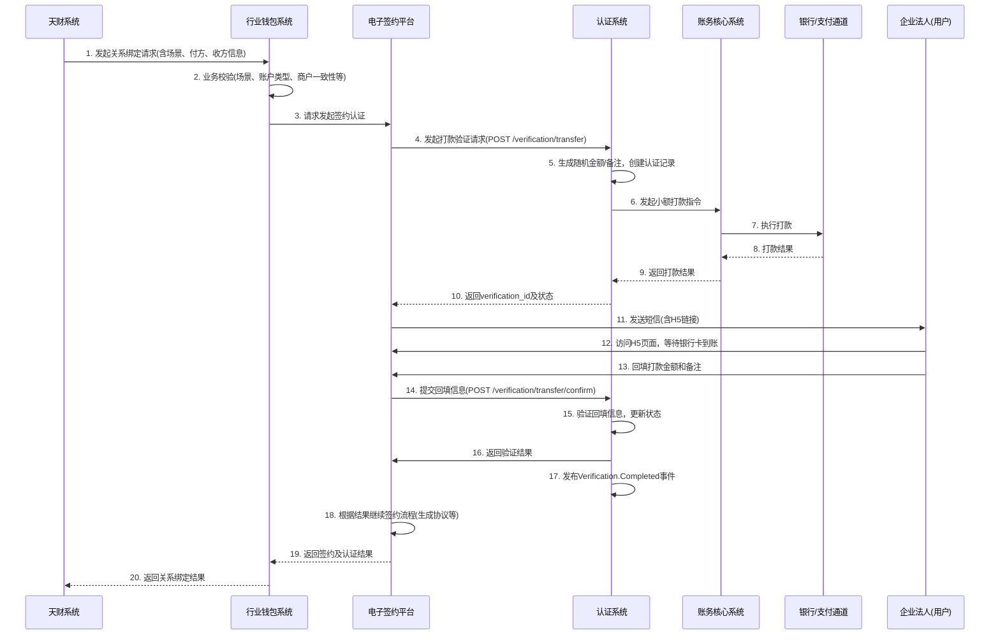
```mermaid
sequenceDiagram
    participant 天财 as 天财系统
    participant 钱包 as 行业钱包系统
    participant 电签 as 电子签约平台
    participant 认证 as 认证系统
    participant 账务核心 as 账务核心系统
    participant 银行 as 银行/支付通道
    participant 用户 as 企业法人(用户)

    天财->>钱包: 1. 发起关系绑定请求(含场景、付方、收方信息)
    钱包->>钱包: 2. 业务校验(场景、账户类型、商户一致性等)
    钱包->>电签: 3. 请求发起签约认证
    电签->>认证: 4. 发起打款验证请求(POST /verification/transfer)
    认证->>认证: 5. 生成随机金额/备注，创建认证记录
    认证->>账务核心: 6. 发起小额打款指令
    账务核心->>银行: 7. 执行打款
    银行-->>账务核心: 8. 打款结果
    账务核心-->>认证: 9. 返回打款结果
    认证-->>电签: 10. 返回verification_id及状态
    电签->>用户: 11. 发送短信(含H5链接)
    用户->>电签: 12. 访问H5页面，等待银行卡到账
    用户->>电签: 13. 回填打款金额和备注
    电签->>认证: 14. 提交回填信息(POST /verification/transfer/confirm)
    认证->>认证: 15. 验证回填信息，更新状态
    认证->>电签: 16. 返回验证结果
    认证->>认证: 17. 发布Verification.Completed事件
    电签->>电签: 18. 根据结果继续签约流程(生成协议等)
    电签-->>钱包: 19. 返回签约及认证结果
    钱包-->>天财: 20. 返回关系绑定结果
```

### 5.2 人脸验证时序图 (以会员结算场景为例)

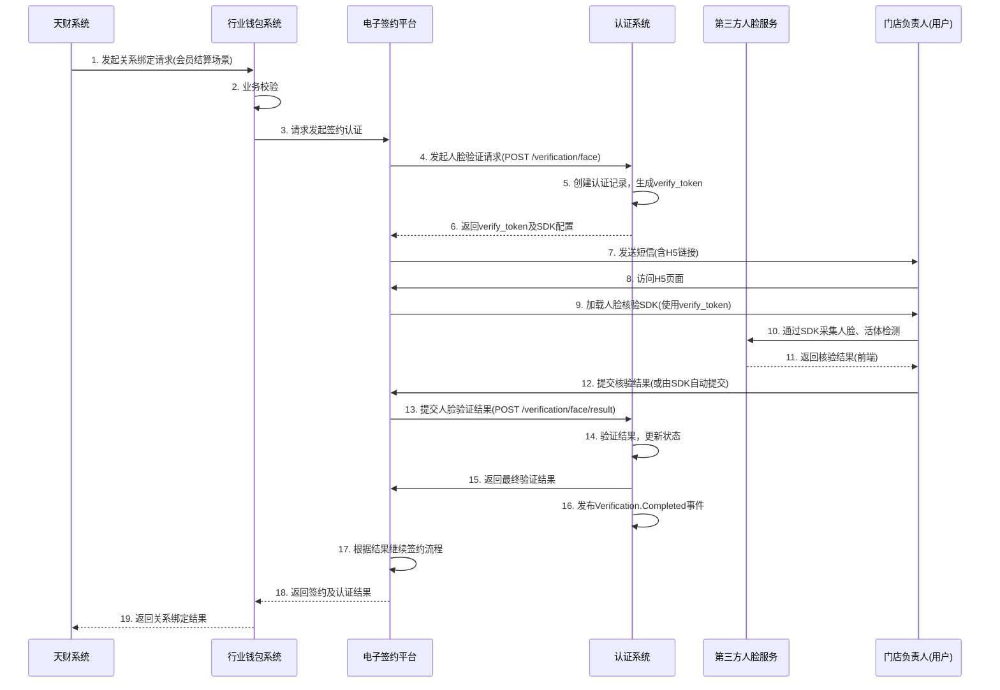
```mermaid
sequenceDiagram
    participant 天财 as 天财系统
    participant 钱包 as 行业钱包系统
    participant 电签 as 电子签约平台
    participant 认证 as 认证系统
    participant 人脸服务 as 第三方人脸服务
    participant 用户 as 门店负责人(用户)

    天财->>钱包: 1. 发起关系绑定请求(会员结算场景)
    钱包->>钱包: 2. 业务校验
    钱包->>电签: 3. 请求发起签约认证
    电签->>认证: 4. 发起人脸验证请求(POST /verification/face)
    认证->>认证: 5. 创建认证记录，生成verify_token
    认证-->>电签: 6. 返回verify_token及SDK配置
    电签->>用户: 7. 发送短信(含H5链接)
    用户->>电签: 8. 访问H5页面
    电签->>用户: 9. 加载人脸核验SDK(使用verify_token)
    用户->>人脸服务: 10. 通过SDK采集人脸、活体检测
    人脸服务-->>用户: 11. 返回核验结果(前端)
    用户->>电签: 12. 提交核验结果(或由SDK自动提交)
    电签->>认证: 13. 提交人脸验证结果(POST /verification/face/result)
    认证->>认证: 14. 验证结果，更新状态
    认证->>电签: 15. 返回最终验证结果
    认证->>认证: 16. 发布Verification.Completed事件
    电签->>电签: 17. 根据结果继续签约流程
    电签-->>钱包: 18. 返回签约及认证结果
    钱包-->>天财: 19. 返回关系绑定结果
```

## 6. 错误处理

### 6.1 预期错误及HTTP状态码

| 错误场景 | HTTP状态码 | 错误码 | 处理策略 |
| :--- | :--- | :--- | :--- |
| 请求参数缺失或格式错误 | 400 | `PARAM_INVALID` | 返回具体字段错误信息，请求方修正后重试 |
| 认证记录不存在 | 404 | `RECORD_NOT_FOUND` | 检查`verification_id`是否正确，或是否已过期清理 |
| 认证已过期 | 400 | `VERIFICATION_EXPIRED` | 需重新发起认证流程 |
| 认证已达最大重试次数 | 400 | `MAX_RETRY_EXCEEDED` | 需重新发起认证流程 |
| 打款失败（银行卡问题） | 400 | `TRANSFER_FAILED` | 记录具体原因，通知用户检查银行卡状态 |
| 人脸核验失败（活体/分数） | 400 | `FACE_VERIFY_FAILED` | 返回失败原因，用户可重试（有限次数） |
| 系统内部错误 | 500 | `INTERNAL_ERROR` | 记录详细日志，告警，人工介入 |
| 依赖服务超时 | 504 | `UPSTREAM_TIMEOUT` | 实现重试机制，设置合理超时时间 |

### 6.2 重试策略
1. **打款指令重试**：向账务核心发起打款失败时，根据错误类型决定是否重试（如网络超时可重试，卡号错误不重试）。
2. **回调通知重试**：向`callback_url`通知结果失败时，采用指数退避策略重试，最多3次。
3. **幂等性保证**：所有重试操作必须保证幂等，避免重复打款或重复记录。

### 6.3 降级与熔断
1. **人脸服务降级**：当第三方人脸服务不可用时，可考虑：
   - 短期故障：返回服务不可用错误，引导用户稍后重试。
   - 长期故障：若有备用服务商，可切换（需预先设计多服务商适配）。
2. **熔断机制**：对账务核心、人脸服务等外部依赖设置熔断器，防止连锁故障。

## 7. 依赖说明

### 7.1 上游依赖

#### 7.1.1 电子签约平台
- **交互方式**：同步HTTP API调用 + 异步回调。
- **关键依赖**：
  - 接收认证请求，需提供正确的业务参数和回调地址。
  - 在H5页面中集成人脸核验SDK或引导用户回填打款信息。
- **SLA要求**：认证系统需保证高可用性，核心接口P99延迟 < 1秒。

#### 7.1.2 账务核心系统
- **交互方式**：同步RPC调用或异步消息。
- **关键依赖**：
  - 提供小额打款能力，需支持指定金额、备注、收款卡号。
  - 返回打款结果（成功/失败）。
- **数据一致性**：打款交易需有唯一订单号，用于对账和追溯。

#### 7.1.3 第三方人脸核验服务
- **交互方式**：SDK集成 + 异步回调。
- **关键依赖**：
  - 提供活体检测和人脸比对能力。
  - 返回标准化结果（分数、是否通过）。
- **合规要求**：需符合个人信息保护法，数据加密传输。

### 7.2 下游依赖

#### 7.2.1 行业钱包系统
- **交互方式**：通过事件订阅`Verification.Completed`。
- **提供数据**：认证结果作为关系绑定的必要条件之一。
- **数据时效**：认证结果需及时同步，延迟影响业务流转。

### 7.3 内部依赖

#### 7.3.1 配置中心
- **配置项**：
  - 打款金额范围、备注生成规则。
  - 人脸比对阈值、超时时间。
  - 第三方服务商密钥、端点地址。

#### 7.3.2 监控与告警
- **监控指标**：
  - 接口QPS、成功率、延迟。
  - 认证成功率/失败率分布（按场景、类型）。
  - 打款失败原因统计。
- **告警规则**：
  - 认证失败率连续5分钟 > 5%。
  - 打款接口超时率 > 1%。
  - 人脸服务不可用。

**文档版本**: 1.0  
**最后更新**: 2023-10-27  
**设计者**: 软件架构师  
**评审状态**: 待评审

## 3.4 业务核心


# 业务核心模块设计文档

## 1. 概述

### 1.1 目的
“业务核心”模块是天财分账业务体系中的核心交易记录与数据中枢。其主要目的是接收、持久化并管理由“行业钱包系统”发起的“天财分账”交易指令的完整信息，为下游的“对账单系统”提供准确、可靠的交易数据源，以生成机构维度的分账指令对账单。本模块不负责分账业务逻辑校验、计费或账务处理，专注于交易信息的记录与查询。

### 1.2 范围
- **核心功能**：接收并存储“天财分账”交易请求的完整快照。
- **数据提供**：为“对账单系统”提供按机构、时间等维度查询分账交易详情的接口或数据。
- **边界**：
    - 上游：接收来自“行业钱包系统”的异步交易通知。
    - 下游：为“对账单系统”提供数据服务。
    - 不处理：资金流转、手续费计算、账户余额更新、业务规则校验（如关系绑定、权限检查）。

## 2. 接口设计

### 2.1 API 端点 (RESTful)

#### 2.1.1 接收天财分账交易通知 (异步回调)
- **Endpoint**: `POST /api/v1/tiancai/transfer/notify`
- **描述**: 行业钱包系统在分账交易处理完成后（无论成功或失败），异步调用此接口，推送交易结果信息。
- **请求头**:
    - `Content-Type: application/json`
    - `X-Signature`: 基于约定密钥和请求体生成的签名，用于安全校验。
- **请求体 (Input)**:
```json
{
  "request_id": "TC20240115123456789", // 天财侧请求流水号
  "system_trace_no": "WALLET202401150001", // 行业钱包系统流水号
  "lkl_transfer_no": "LKL202401150001", // 拉卡拉侧转账交易流水号（唯一）
  "request_time": "2024-01-15 10:30:00", // 天财发起请求时间
  "process_time": "2024-01-15 10:30:05", // 行业钱包处理完成时间
  "scene": "BATCH_PAYMENT", // 场景枚举: COLLECTION(归集), MEMBER_SETTLEMENT(会员结算), BATCH_PAYMENT(批量付款)
  "fund_purpose": "供应商付款", // 资金用途，根据场景不同
  "payer_info": {
    "merchant_no": "888000000001", // 付方商户号
    "merchant_name": "XX餐饮总部有限公司",
    "account_no": "TC_RCV_100001", // 付方天财收款账户号
    "merchant_type": "ENTERPRISE" // 商户性质: ENTERPRISE(企业), INDIVIDUAL(个体/个人)
  },
  "payee_info": {
    "merchant_no": "888000000002", // 收方商户号 (对于接收方账户，此字段可能为接收方ID)
    "merchant_name": "XX供应商有限公司",
    "account_no": "TC_RECV_200001", // 收方账户号 (天财收款账户或天财接收方账户)
    "account_type": "RECEIVER_ACCOUNT", // 账户类型: RECEIVING_ACCOUNT(收款账户), RECEIVER_ACCOUNT(接收方账户)
    "merchant_type": "ENTERPRISE"
  },
  "amount": 10000, // 分账金额（单位：分）
  "fee": 10, // 手续费（单位：分）
  "fee_bearer": "PAYER", // 手续费承担方: PAYER(付方), PAYEE(收方)
  "transfer_mode": "NET", // 到账模式: NET(净额), GROSS(全额)
  "status": "SUCCESS", // 交易状态: SUCCESS, FAILED
  "fail_reason": "", // 失败原因，成功时为空
  "initiator_merchant_no": "888000000001", // 指令发起方商户号（总部）
  "initiator_merchant_name": "XX餐饮总部有限公司" // 指令发起方商户名
}
```
- **响应 (Output)**:
```json
{
  "code": "SUCCESS",
  "message": "接收成功",
  "data": {
    "lkl_transfer_no": "LKL202401150001"
  }
}
```

#### 2.1.2 查询天财分账交易记录 (供对账单系统调用)
- **Endpoint**: `GET /api/v1/tiancai/transfer/records`
- **描述**: 对账单系统按机构、日期范围拉取分账交易记录。
- **查询参数**:
    - `org_id`: **必填**，机构号。
    - `start_date`: **必填**，查询开始日期 (yyyy-MM-dd)。
    - `end_date`: **必填**，查询结束日期 (yyyy-MM-dd)。
    - `scene`: 可选，场景过滤。
    - `status`: 可选，状态过滤。
    - `page_no`: 页码，默认1。
    - `page_size`: 页大小，默认100，最大1000。
- **响应 (Output)**:
```json
{
  "code": "SUCCESS",
  "message": "成功",
  "data": {
    "total": 150,
    "page_no": 1,
    "page_size": 100,
    "records": [
      {
        "lkl_transfer_no": "LKL202401150001",
        "request_id": "TC20240115123456789",
        "system_trace_no": "WALLET202401150001",
        "request_time": "2024-01-15 10:30:00",
        "process_time": "2024-01-15 10:30:05",
        "scene": "BATCH_PAYMENT",
        "fund_purpose": "供应商付款",
        "payer_merchant_no": "888000000001",
        "payer_merchant_name": "XX餐饮总部有限公司",
        "payer_account_no": "TC_RCV_100001",
        "payee_merchant_no": "888000000002",
        "payee_merchant_name": "XX供应商有限公司",
        "payee_account_no": "TC_RECV_200001",
        "payee_account_type": "RECEIVER_ACCOUNT",
        "amount": 10000,
        "fee": 10,
        "fee_bearer": "PAYER",
        "transfer_mode": "NET",
        "status": "SUCCESS",
        "fail_reason": null,
        "initiator_merchant_no": "888000000001",
        "initiator_merchant_name": "XX餐饮总部有限公司"
      }
      // ... 更多记录
    ]
  }
}
```

### 2.2 发布/消费的事件
- **消费事件**: 本模块不主动消费消息队列事件，通过同步HTTP接口接收数据。
- **发布事件**: 本模块不主动发布事件。其存储的数据通过查询接口被动提供给下游系统。

## 3. 数据模型

### 3.1 数据库表设计 (以MySQL为例)

#### 表: `tc_transfer_record` (天财分账交易记录表)
| 字段名 | 类型 | 长度 | 可空 | 默认值 | 注释 |
| :--- | :--- | :--- | :--- | :--- | :--- |
| `id` | bigint | | NO | AUTO_INCREMENT | 主键 |
| `lkl_transfer_no` | varchar | 32 | NO | | **唯一索引**，拉卡拉侧交易流水号 |
| `request_id` | varchar | 64 | NO | | 天财请求流水号 |
| `system_trace_no` | varchar | 32 | NO | | 行业钱包系统流水号 |
| `request_time` | datetime | | NO | | 天财发起请求时间 |
| `process_time` | datetime | | NO | | 行业钱包处理完成时间 |
| `scene` | varchar | 32 | NO | | 场景: COLLECTION, MEMBER_SETTLEMENT, BATCH_PAYMENT |
| `fund_purpose` | varchar | 64 | YES | | 资金用途 |
| `payer_merchant_no` | varchar | 32 | NO | | 付方商户号 |
| `payer_merchant_name` | varchar | 128 | NO | | 付方商户名 |
| `payer_account_no` | varchar | 32 | NO | | 付方账户号 |
| `payer_merchant_type` | varchar | 16 | NO | | 付方商户类型 |
| `payee_merchant_no` | varchar | 32 | YES | | 收方商户号 (接收方账户可能无商户号) |
| `payee_merchant_name` | varchar | 128 | NO | | 收方商户名/户名 |
| `payee_account_no` | varchar | 32 | NO | | 收方账户号 |
| `payee_account_type` | varchar | 32 | NO | | 账户类型: RECEIVING_ACCOUNT, RECEIVER_ACCOUNT |
| `payee_merchant_type` | varchar | 16 | YES | | 收方商户类型 |
| `amount` | bigint | | NO | | 分账金额（分） |
| `fee` | bigint | | NO | | 手续费（分） |
| `fee_bearer` | varchar | 16 | NO | | 手续费承担方: PAYER, PAYEE |
| `transfer_mode` | varchar | 16 | NO | | 到账模式: NET, GROSS |
| `status` | varchar | 16 | NO | | 状态: SUCCESS, FAILED |
| `fail_reason` | varchar | 256 | YES | | 失败原因 |
| `initiator_merchant_no` | varchar | 32 | NO | | **索引**，指令发起方商户号（总部） |
| `initiator_merchant_name` | varchar | 128 | NO | | 指令发起方商户名 |
| `org_id` | varchar | 32 | NO | | **索引**，机构号（从商户-机构关系映射或接口传入推导） |
| `created_at` | datetime | | NO | CURRENT_TIMESTAMP | 记录创建时间 |
| `updated_at` | datetime | | NO | CURRENT_TIMESTAMP ON UPDATE | 记录更新时间 |

**索引设计**:
- 主键: `PRIMARY KEY (id)`
- 唯一索引: `UNIQUE KEY uk_lkl_transfer_no (lkl_transfer_no)`
- 查询索引: `KEY idx_org_date (org_id, process_time)` 用于对账单系统按机构和时间范围查询。
- 查询索引: `KEY idx_initiator_date (initiator_merchant_no, process_time)`

### 3.2 与其他模块的关系
- **行业钱包系统**: 上游数据生产者。通过调用`/notify`接口，将分账交易结果同步至本模块。
- **对账单系统**: 下游数据消费者。通过调用`/records`查询接口，获取生成“机构天财分账指令账单”所需的原始交易数据。
- **三代系统**: 间接关联。本模块记录的`initiator_merchant_no`和`payer_merchant_no`等，需要通过三代系统提供的机构-商户关系（或从接口上下文推导）来关联到具体的`org_id`（机构号）。

## 4. 业务逻辑

### 4.1 核心处理流程
1.  **数据接收与验签**：
    - 接收行业钱包的HTTP POST请求。
    - 校验`X-Signature`请求头，确保请求来源合法、数据未被篡改。
2.  **数据去重与幂等**：
    - 以`lkl_transfer_no`（拉卡拉侧唯一流水号）为主键进行判重。若已存在相同记录，直接返回成功，避免重复插入。
3.  **数据补全与转换**：
    - 根据`initiator_merchant_no`（或`payer_merchant_no`）**映射或推导**出对应的`org_id`（机构号）。此映射关系可能需要调用三代系统的缓存或接口，或由行业钱包在通知时一并传入。**（这是关键设计点，需与上下游明确）**
    - 金额单位转换为分存储。
    - 记录当前时间作为`created_at`。
4.  **数据持久化**：
    - 将完整的交易信息快照存入`tc_transfer_record`表。
5.  **响应**：
    - 无论存储成功与否，均需向行业钱包返回明确的HTTP状态码和业务响应码。
    - 存储失败需记录详细日志并告警。

### 4.2 业务规则与校验逻辑
- **数据完整性**：必须校验请求体中所有必填字段的存在性和基本格式。
- **状态同步**：忠实记录行业钱包推送的交易状态（`SUCCESS`/`FAILED`）及原因，不做修改。
- **机构号映射**：必须确保每条记录都能准确关联到其所属的`org_id`，这是对账单系统按机构出账的基础。

## 5. 时序图

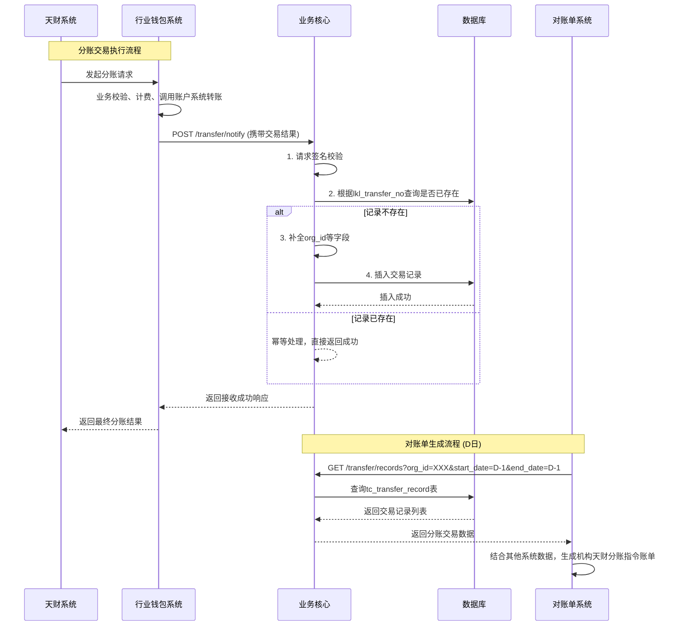
```mermaid
sequenceDiagram
    participant T as 天财系统
    participant W as 行业钱包系统
    participant BC as 业务核心
    participant DB as 数据库
    participant BS as 对账单系统

    Note over T, W: 分账交易执行流程
    T->>W: 发起分账请求
    W->>W: 业务校验、计费、调用账户系统转账
    W->>BC: POST /transfer/notify (携带交易结果)
    BC->>BC: 1. 请求签名校验
    BC->>DB: 2. 根据lkl_transfer_no查询是否已存在
    alt 记录不存在
        BC->>BC: 3. 补全org_id等字段
        BC->>DB: 4. 插入交易记录
        DB-->>BC: 插入成功
    else 记录已存在
        BC-->>BC: 幂等处理，直接返回成功
    end
    BC-->>W: 返回接收成功响应
    W-->>T: 返回最终分账结果

    Note over BS, BC: 对账单生成流程 (D日)
    BS->>BC: GET /transfer/records?org_id=XXX&start_date=D-1&end_date=D-1
    BC->>DB: 查询tc_transfer_record表
    DB-->>BC: 返回交易记录列表
    BC-->>BS: 返回分账交易数据
    BS->>BS: 结合其他系统数据，生成机构天财分账指令账单
```

## 6. 错误处理

| 错误场景 | 错误码 | 处理策略 | 日志与监控 |
| :--- | :--- | :--- | :--- |
| 请求签名验证失败 | `AUTH_SIGNATURE_ERROR` | 返回HTTP 401，拒绝处理请求。 | 记录错误IP、请求体摘要，触发安全告警。 |
| 请求Body解析失败 | `REQUEST_PARSE_ERROR` | 返回HTTP 400，提示参数错误。 | 记录原始请求字符串。 |
| 必填字段缺失 | `REQUEST_VALIDATION_ERROR` | 返回HTTP 400，提示具体缺失字段。 | 记录缺失字段信息。 |
| `lkl_transfer_no`重复 | `SUCCESS` (幂等) | 视为成功，直接返回成功响应。 | 记录INFO日志，说明触发幂等。 |
| 数据库插入失败 (唯一冲突除外) | `SYSTEM_ERROR` | 返回HTTP 500，提示系统繁忙。 | 记录详细异常堆栈，触发PagerDuty等紧急告警。 |
| 机构号(`org_id`)映射失败 | `DATA_MAPPING_ERROR` | **策略待定**：可存入默认值或空值并标记异常，同时记录错误日志。需与对账单系统约定如何处理此类异常数据。 | 记录ERROR日志，包含相关商户号，触发业务告警。 |
| 下游对账单系统查询超时 | N/A | 设置合理的API超时时间与分页大小。提供重试机制文档。 | 监控接口响应时间与错误率。 |

## 7. 依赖说明

### 7.1 上游依赖：行业钱包系统
- **交互方式**：同步HTTP调用（`/transfer/notify`）。
- **依赖内容**：
    1.  **交易结果数据**：钱包系统必须在每笔分账交易处理完毕后，及时、准确地推送通知。
    2.  **机构号信息**：**强烈建议**钱包系统在通知报文中直接携带`org_id`字段。若无法携带，业务核心需额外依赖三代系统接口进行商户-机构关系查询，增加复杂度和故障点。
    3.  **安全约定**：双方需预先交换并妥善管理用于生成`X-Signature`的密钥。
- **SLA要求**：钱包系统需保证通知的**至少一次**投递。业务核心通过`lkl_transfer_no`实现幂等，以处理重复通知。

### 7.2 潜在依赖：三代系统 (若需映射机构号)
- **交互方式**：同步HTTP调用或查询本地缓存（缓存由定时任务从三代同步）。
- **依赖内容**：根据`merchant_no`查询所属`org_id`的接口或数据。
- **降级策略**：若无法获取机构号，可暂存数据并标记异常，由对账后流程人工处理。

### 7.3 下游服务：对账单系统
- **交互方式**：提供同步HTTP查询接口（`/transfer/records`）。
- **提供服务**：按机构、时间范围提供准确、完整的分账交易历史数据。
- **性能要求**：需支持对账单系统在出账高峰期（如D日9点前）的批量查询，要求数据库索引设计合理，查询响应迅速。

## 3.5 清结算系统


# 清结算系统模块设计文档

## 1. 概述

### 1.1 目的
本模块是“天财分账”业务的核心资金处理中枢，负责处理收单交易的**资金清算、结算、计费以及退货资金处理**。核心目标是确保天财专用账户体系内的资金能够准确、及时地从待结算账户（01账户）结算至天财收款账户，并支持退货、冻结等资金操作，同时为对账单系统提供完整的结算明细数据。

### 1.2 范围
- **资金结算**：将收单交易资金从待结算账户（01账户）结算至商户指定的天财收款账户或普通收款账户。
- **计费处理**：接收计费中台计算的分账手续费，并在结算或分账时进行扣收。
- **退货资金处理**：支持“终点账户+退货账户”模式，处理涉及天财收款账户的退货交易。
- **账户冻结联动**：响应风控指令，冻结已结算至天财收款账户的资金。
- **结算单生成与推送**：生成包含明细的结算单，并推送给账户系统，驱动账户余额变更和流水生成。
- **对账数据供给**：为对账单系统提供待结算账户、退货账户的动账明细，以及结算单与交易的关联关系。

## 2. 接口设计

### 2.1 API端点 (RESTful)

#### 2.1.1 内部接口 (供三代系统、行业钱包系统调用)

**1. 更新商户结算账户配置**
- **端点**: `POST /internal/v1/settlement/merchant/config`
- **描述**: 接收三代系统同步的商户结算账户配置变更（如切换为天财收款账户）。
- **请求头**:
    - `X-Source-System: GEN3_SYSTEM`
    - `X-Request-Id`: 请求唯一标识
- **请求体**:
```json
{
  "requestId": "config_20240116001",
  "merchantNo": "88800010001",
  "institutionNo": "860000",
  "settlementMode": "ACTIVE", // 结算模式: ACTIVE, PASSIVE
  "settlementAccountNo": "TC_ACC_88800010001_R001", // 结算目标账户号（天财收款账户或普通收款账户）
  "settlementAccountType": "TIANCAI_RECEIVE_ACCOUNT", // 账户类型
  "effectiveTime": "2024-01-17 00:00:00", // 配置生效时间
  "operator": "system"
}
```
- **响应体 (成功)**:
```json
{
  "code": "SUCCESS",
  "message": "结算账户配置更新成功",
  "data": {
    "configId": "CONFIG_001",
    "status": "EFFECTIVE"
  }
}
```

**2. 查询退货终点账户信息**
- **端点**: `GET /internal/v1/settlement/refund/target-account`
- **描述**: 退货前置流程调用，查询指定商户的退货终点账户（天财收款账户）信息及余额。
- **查询参数**: `merchantNo=88800010001&originalOrderNo=ORD123456`
- **响应体**:
```json
{
  "code": "SUCCESS",
  "data": {
    "merchantNo": "88800010001",
    "targetAccountNo": "TC_ACC_88800010001_R001",
    "targetAccountType": "TIANCAI_RECEIVE_ACCOUNT",
    "availableBalance": 15000.00,
    "refundAccountNo": "REF_ACC_88800010001_04", // 关联的04退货账户
    "refundAccountBalance": 5000.00,
    "supportPreDeduct": true // 是否支持预扣退货账户资金
  }
}
```

**3. 执行退货扣款**
- **端点**: `POST /internal/v1/settlement/refund/deduct`
- **描述**: 退货前置流程确认后，从终点账户（天财收款账户）或退货账户扣减资金。
- **请求体**:
```json
{
  "requestId": "refund_deduct_001",
  "originalOrderNo": "ORD123456",
  "refundOrderNo": "REF123456",
  "merchantNo": "88800010001",
  "targetAccountNo": "TC_ACC_88800010001_R001",
  "deductAmount": 100.00,
  "deductFrom": "TARGET_ACCOUNT", // 枚举: TARGET_ACCOUNT, REFUND_ACCOUNT, AUTO
  "operator": "system"
}
```
- **响应体**:
```json
{
  "code": "SUCCESS",
  "data": {
    "deductNo": "DEDUCT_20240116001",
    "actualDeductAccount": "TC_ACC_88800010001_R001",
    "deductedAmount": 100.00,
    "remainingBalance": 14900.00
  }
}
```

#### 2.1.2 内部接口 (供账户系统、对账单系统调用)

**4. 查询待结算/退货账户动账明细**
- **端点**: `GET /internal/v1/settlement/accounts/{accountType}/statements`
- **描述**: 为对账单系统提供待结算账户（01）、退货账户（04）的动账明细。
- **路径参数**: `accountType` - 01 (待结算) 或 04 (退货)
- **查询参数**: 
    - `merchantNo` (可选)
    - `startTime=2024-01-15 00:00:00`
    - `endTime=2024-01-15 23:59:59`
    - `pageNum=1`
    - `pageSize=100`
- **响应体**:
```json
{
  "code": "SUCCESS",
  "data": {
    "accountType": "01",
    "statements": [
      {
        "seqNo": "SETTLE_202401150001",
        "accountNo": "SETTLE_01_88800010001",
        "transTime": "2024-01-15 10:30:25",
        "transType": "TRADE_IN", // 交易入账
        "amount": 500.00,
        "balance": 1500.00,
        "relatedOrderNo": "ORD123456",
        "relatedMerchantNo": "88800010001",
        "tradeType": "CONSUME",
        "tradeAmount": 500.00,
        "feeAmount": 2.50,
        "netAmount": 497.50
      }
    ],
    "total": 150,
    "pageNum": 1,
    "pageSize": 100
  }
}
```

### 2.2 发布/消费的事件

#### 2.2.1 消费的事件
1.  **交易清算完成事件** (来自支付核心)
    - 事件类型: `TRADE_SETTLEMENT_READY`
    - 负载: `{“batchNo”: “B20240116”, “merchantNo”: “...”, “tradeList”: [...], “settleDate”: “2024-01-16”}`
    - 动作: 触发批量结算流程，生成结算单。

2.  **计费结果事件** (来自计费中台)
    - 事件类型: `FEE_CALCULATED`
    - 负载: `{“bizNo”: “...”, “bizType”: “TIANCAI_SPLIT”, “payer”: “...”, “payee”: “...”, “amount”: 10000, “feeAmount”: 10, “feeBearer”: “PAYER”}`
    - 动作: 记录分账手续费，用于结算时扣收。

3.  **商户冻结指令事件** (来自风控系统)
    - 事件类型: `MERCHANT_FREEZE_COMMAND`
    - 负载: `{“merchantNo”: “...”, “freezeType”: “MERCHANT”|“TRADE”, “freezeReason”: “...”, “freezeAmount”: 1000.00 (可选), “relatedOrderNo”: “...” (可选)}`
    - 动作: 冻结商户对应的天财收款账户资金。

#### 2.2.2 发布的事件
1.  **结算单生成事件**
    - 事件类型: `SETTLEMENT_ORDER_GENERATED`
    - 负载: 
    ```json
    {
      "settlementOrderNo": "SO202401160001",
      "merchantNo": "88800010001",
      "accountNo": "TC_ACC_88800010001_R001",
      "settlementDate": "2024-01-16",
      "totalAmount": 10000.00,
      "totalFee": 50.00,
      "netAmount": 9950.00,
      "supplementDetailFlag": "Y", // 是否补明细
      "detailList": [
        {
          "detailNo": "SD001",
          "originalOrderNo": "ORD123456",
          "tradeAmount": 500.00,
          "feeAmount": 2.50,
          "netAmount": 497.50,
          "tradeTime": "2024-01-15 10:30:25"
        }
      ]
    }
    ```
    - 订阅方: **账户系统**（核心消费者，用于更新余额和生成流水）。

2.  **资金冻结结果事件**
    - 事件类型: `FUND_FREEZE_RESULT`
    - 负载: `{“freezeId”: “...”, “merchantNo”: “...”, “accountNo”: “...”, “freezeAmount”: 1000.00, “freezeStatus”: “SUCCESS”|“FAILED”, “failReason”: “...”}`
    - 订阅方: 风控系统、行业钱包系统。

## 3. 数据模型

### 3.1 核心表设计

```sql
-- 结算单主表
CREATE TABLE t_settlement_order (
    id BIGINT PRIMARY KEY AUTO_INCREMENT,
    settlement_order_no VARCHAR(64) NOT NULL UNIQUE COMMENT '结算单号',
    merchant_no VARCHAR(32) NOT NULL COMMENT '商户号',
    institution_no VARCHAR(16) NOT NULL COMMENT '机构号',
    account_no VARCHAR(64) NOT NULL COMMENT '结算目标账户号（天财收款账户）',
    account_type VARCHAR(32) NOT NULL COMMENT '账户类型',
    settlement_date DATE NOT NULL COMMENT '结算日期',
    settlement_mode VARCHAR(16) NOT NULL COMMENT '结算模式: ACTIVE, PASSIVE',
    total_amount DECIMAL(15,2) NOT NULL COMMENT '结算总金额（交易金额）',
    total_fee DECIMAL(15,2) DEFAULT 0.00 COMMENT '总手续费',
    net_amount DECIMAL(15,2) NOT NULL COMMENT '净结算金额',
    currency VARCHAR(3) DEFAULT 'CNY',
    supplement_detail_flag CHAR(1) DEFAULT 'N' COMMENT '是否补明细账单: Y/N',
    status VARCHAR(16) DEFAULT 'GENERATED' COMMENT '状态: GENERATED, PUSHED, CONFIRMED, FAILED',
    push_time DATETIME COMMENT '推送至账户系统时间',
    confirmed_time DATETIME COMMENT '账户系统确认时间',
    created_time DATETIME NOT NULL,
    updated_time DATETIME NOT NULL,
    INDEX idx_merchant_date (merchant_no, settlement_date),
    INDEX idx_account_no (account_no),
    INDEX idx_status (status)
) COMMENT '结算单主表';

-- 结算单明细表
CREATE TABLE t_settlement_detail (
    id BIGINT PRIMARY KEY AUTO_INCREMENT,
    settlement_order_no VARCHAR(64) NOT NULL COMMENT '结算单号',
    detail_no VARCHAR(64) NOT NULL UNIQUE COMMENT '明细序号',
    original_order_no VARCHAR(64) NOT NULL COMMENT '原交易订单号',
    trade_type VARCHAR(32) NOT NULL COMMENT '交易类型',
    trade_amount DECIMAL(15,2) NOT NULL COMMENT '交易金额',
    fee_amount DECIMAL(15,2) DEFAULT 0.00 COMMENT '手续费金额',
    net_amount DECIMAL(15,2) NOT NULL COMMENT '净额',
    trade_time DATETIME NOT NULL COMMENT '交易时间',
    created_time DATETIME NOT NULL,
    INDEX idx_settlement_order (settlement_order_no),
    INDEX idx_original_order (original_order_no),
    FOREIGN KEY (settlement_order_no) REFERENCES t_settlement_order(settlement_order_no)
) COMMENT '结算单明细表';

-- 商户结算配置表
CREATE TABLE t_merchant_settlement_config (
    id BIGINT PRIMARY KEY AUTO_INCREMENT,
    merchant_no VARCHAR(32) NOT NULL UNIQUE COMMENT '商户号',
    institution_no VARCHAR(16) NOT NULL COMMENT '机构号',
    settlement_mode VARCHAR(16) NOT NULL COMMENT '结算模式',
    settlement_account_no VARCHAR(64) NOT NULL COMMENT '结算账户号',
    settlement_account_type VARCHAR(32) NOT NULL COMMENT '结算账户类型',
    refund_mode VARCHAR(32) DEFAULT 'TARGET_REFUND' COMMENT '退货模式: TARGET_REFUND(终点账户+退货账户), SETTLEMENT_FIRST(优先扣待结算)',
    effective_time DATETIME NOT NULL COMMENT '生效时间',
    status VARCHAR(16) DEFAULT 'EFFECTIVE' COMMENT '状态: EFFECTIVE, HISTORY',
    created_time DATETIME NOT NULL,
    updated_time DATETIME NOT NULL,
    INDEX idx_institution (institution_no),
    INDEX idx_account (settlement_account_no)
) COMMENT '商户结算配置表';

-- 内部账户流水表（01待结算、04退货）
CREATE TABLE t_internal_account_statement (
    id BIGINT PRIMARY KEY AUTO_INCREMENT,
    account_type VARCHAR(8) NOT NULL COMMENT '账户类型: 01, 04',
    account_no VARCHAR(64) NOT NULL COMMENT '内部账户号',
    seq_no VARCHAR(64) NOT NULL UNIQUE COMMENT '流水序号',
    trans_time DATETIME NOT NULL COMMENT '交易时间',
    trans_type VARCHAR(32) NOT NULL COMMENT '交易类型: TRADE_IN, REFUND_OUT, SETTLE_OUT, etc.',
    amount DECIMAL(15,2) NOT NULL COMMENT '变动金额',
    balance DECIMAL(15,2) NOT NULL COMMENT '变动后余额',
    related_order_no VARCHAR(64) COMMENT '关联订单号',
    related_merchant_no VARCHAR(32) COMMENT '关联商户号',
    trade_type VARCHAR(32) COMMENT '交易类型（如CONSUME）',
    trade_amount DECIMAL(15,2) COMMENT '交易金额',
    fee_amount DECIMAL(15,2) COMMENT '手续费',
    net_amount DECIMAL(15,2) COMMENT '净额',
    biz_remark VARCHAR(256),
    created_time DATETIME NOT NULL,
    INDEX idx_account_time (account_no, trans_time),
    INDEX idx_merchant_time (related_merchant_no, trans_time),
    INDEX idx_order (related_order_no)
) COMMENT '内部账户（01/04）流水表';

-- 资金冻结记录表
CREATE TABLE t_fund_freeze_record (
    id BIGINT PRIMARY KEY AUTO_INCREMENT,
    freeze_id VARCHAR(64) NOT NULL UNIQUE COMMENT '冻结流水号',
    merchant_no VARCHAR(32) NOT NULL COMMENT '商户号',
    account_no VARCHAR(64) NOT NULL COMMENT '被冻结账户（天财收款账户）',
    freeze_type VARCHAR(16) NOT NULL COMMENT '冻结类型: MERCHANT, TRADE',
    freeze_amount DECIMAL(15,2) NOT NULL COMMENT '冻结金额',
    frozen_balance DECIMAL(15,2) NOT NULL COMMENT '冻结后冻结余额',
    freeze_reason VARCHAR(256),
    related_order_no VARCHAR(64) COMMENT '关联订单号（交易冻结时）',
    freeze_status VARCHAR(16) DEFAULT 'ACTIVE' COMMENT '状态: ACTIVE, RELEASED, PARTIAL_RELEASED',
    release_time DATETIME,
    created_time DATETIME NOT NULL,
    INDEX idx_merchant (merchant_no),
    INDEX idx_account (account_no),
    INDEX idx_status (freeze_status)
) COMMENT '资金冻结记录表';
```

### 3.2 与其他模块的关系
- **账户系统**: **核心下游**。本模块向账户系统推送结算单事件，驱动天财收款账户余额变更。同时，账户系统为本模块提供账户余额查询能力（用于退货前置）。
- **三代系统**: **上游配置源**。接收商户结算账户配置（特别是天财收款账户），并据此进行结算路由。
- **行业钱包系统**: 在退货前置流程中，作为查询方调用本模块获取终点账户信息。
- **计费中台**: **上游依赖**。获取分账手续费计算结果，在结算时进行扣收。
- **对账单系统**: **下游数据消费者**。为本模块提供待结算账户（01）、退货账户（04）的动账明细，以及结算单与交易的关联关系。
- **支付核心/业务核心**: 提供原始交易数据，触发清算流程。
- **风控系统**: 接收冻结指令，对天财收款账户资金进行冻结。

## 4. 业务逻辑

### 4.1 核心算法与流程

**1. D+1批量结算流程（天财收款账户）:**
```
触发: 每日定时任务或TRADE_SETTLEMENT_READY事件
输入: 结算日期T-1日的所有已清算交易
步骤:
1. 按商户维度分组交易数据。
2. 查询每个商户的当前有效结算配置(t_merchant_settlement_config)。
3. 对于配置了天财收款账户的商户：
   a. 汇总交易金额、手续费，计算净额。
   b. 生成结算单号，插入t_settlement_order。
   c. 遍历交易明细，为每笔交易生成结算明细，插入t_settlement_detail。
   d. 设置supplementDetailFlag='Y'（要求账户系统补明细）。
4. 对于普通收款账户商户，流程类似，但supplementDetailFlag='N'。
5. 对于每个生成的结算单：
   a. 从01待结算账户扣减净结算金额，生成01账户出账流水。
   b. 发布SETTLEMENT_ORDER_GENERATED事件（包含明细）。
   c. 更新结算单状态为PUSHED。
6. 账户系统消费事件，完成资金划转和流水生成。
```

**2. 退货前置查询与扣款流程:**
```
场景: 商户发起退货，退货前置查询终点账户
步骤:
1. 退货前置调用本模块【查询退货终点账户信息】接口。
2. 本模块根据merchantNo查询t_merchant_settlement_config：
   a. 获取settlement_account_no（天财收款账户）和refund_mode。
   b. 调用账户系统接口查询该天财收款账户的可用余额。
   c. 查询关联的04退货账户余额。
3. 返回账户信息及余额。
4. 若退货前置决定扣款，调用【执行退货扣款】接口。
5. 本模块根据deductFrom策略：
   a. TARGET_ACCOUNT: 直接从天财收款账户扣减。
   b. REFUND_ACCOUNT: 从04退货账户扣减。
   c. AUTO: 优先扣天财收款账户，余额不足则预扣04账户。
6. 生成内部账户流水（01/04），记录扣款。
```

**3. 商户/交易冻结处理流程:**
```
触发: MERCHANT_FREEZE_COMMAND事件
步骤:
1. 解析事件，获取freezeType。
2. 若freezeType='MERCHANT':
   a. 根据merchantNo找到其所有天财收款账户。
   b. 调用账户系统接口，冻结这些账户（账户系统会设置状态为FROZEN）。
   c. 记录冻结流水到t_fund_freeze_record。
3. 若freezeType='TRADE':
   a. 根据relatedOrderNo找到对应的结算明细及结算单。
   b. 定位资金所在的天财收款账户(account_no)。
   c. 调用账户系统接口，冻结该账户的指定金额(freezeAmount)。
   d. 记录冻结流水。
4. 发布FUND_FREEZE_RESULT事件。
```

### 4.2 关键业务规则与校验逻辑
1.  **结算账户配置生效规则**:
    - 三代系统同步的配置，`effective_time`为未来时间（如次日0点），本模块会在此时间点后生效。
    - 生效前，仍按原配置结算。
    - 同一商户仅能有一条`status='EFFECTIVE'`的配置。

2.  **退货模式规则**:
    - 天财机构下的新商户，默认退货模式为`TARGET_REFUND`（终点账户+退货账户）。
    - 当商户结算模式在主动/被动间切换时，退货模式自动同步变更（与结算模式逻辑绑定）。

3.  **结算单生成规则**:
    - 仅当`settlement_account_type`为`TIANCAI_RECEIVE_ACCOUNT`时，`supplementDetailFlag`才设为`'Y'`，要求账户系统生成子账单明细。
    - 结算单号生成规则：`SO` + `yyyymmdd` + `7位序列号`。

4.  **资金冻结联动规则**:
    - 商户冻结：冻结该商户名下所有状态为`ACTIVE`的天财收款账户，禁止所有出金操作。
    - 交易冻结：仅冻结涉及特定交易的那部分资金，不影响账户其他资金的使用。
    - 冻结金额不能超过账户可用余额。

5.  **手续费处理规则**:
    - 分账手续费由计费中台计算，本模块记录并在结算时体现。
    - 收单交易手续费在清算时已扣减，结算单中的`total_fee`仅为展示，实际结算净额已扣除。

## 5. 时序图

### 5.1 D+1结算至天财收款账户时序图

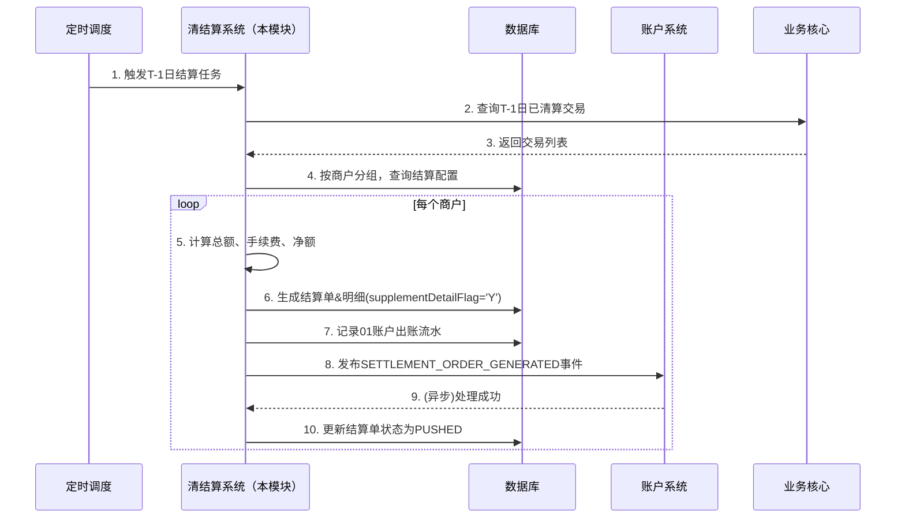
```mermaid
sequenceDiagram
    participant Scheduler as 定时调度
    participant SC as 清结算系统（本模块）
    participant DB as 数据库
    participant Account as 账户系统
    participant BC as 业务核心

    Scheduler->>SC: 1. 触发T-1日结算任务
    SC->>BC: 2. 查询T-1日已清算交易
    BC-->>SC: 3. 返回交易列表
    SC->>DB: 4. 按商户分组，查询结算配置
    loop 每个商户
        SC->>SC: 5. 计算总额、手续费、净额
        SC->>DB: 6. 生成结算单&明细(supplementDetailFlag='Y')
        SC->>DB: 7. 记录01账户出账流水
        SC->>Account: 8. 发布SETTLEMENT_ORDER_GENERATED事件
        Account-->>SC: 9. (异步)处理成功
        SC->>DB: 10. 更新结算单状态为PUSHED
    end
```

### 5.2 退货前置查询扣款时序图

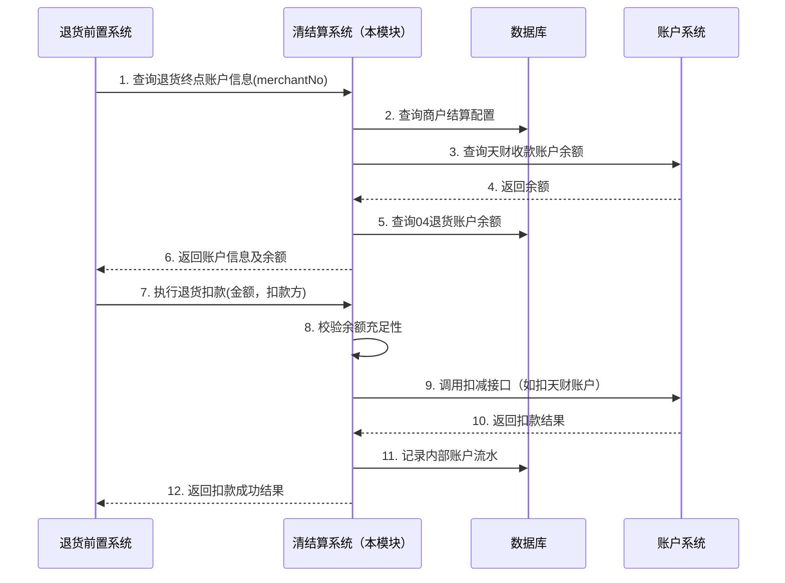
```mermaid
sequenceDiagram
    participant RP as 退货前置系统
    participant SC as 清结算系统（本模块）
    participant DB as 数据库
    participant Account as 账户系统

    RP->>SC: 1. 查询退货终点账户信息(merchantNo)
    SC->>DB: 2. 查询商户结算配置
    SC->>Account: 3. 查询天财收款账户余额
    Account-->>SC: 4. 返回余额
    SC->>DB: 5. 查询04退货账户余额
    SC-->>RP: 6. 返回账户信息及余额
    RP->>SC: 7. 执行退货扣款(金额，扣款方)
    SC->>SC: 8. 校验余额充足性
    SC->>Account: 9. 调用扣减接口（如扣天财账户）
    Account-->>SC: 10. 返回扣款结果
    SC->>DB: 11. 记录内部账户流水
    SC-->>RP: 12. 返回扣款成功结果
```

## 6. 错误处理

| 错误场景 | 错误码 | 处理策略 | 是否重试 |
| :--- | :--- | :--- | :--- |
| 结算账户配置不存在 | `SETTLEMENT_CONFIG_NOT_FOUND` | 记录告警，该商户结算暂停，需人工介入检查三代配置。 | 否（需人工） |
| 天财收款账户状态异常（冻结、关闭） | `TARGET_ACCOUNT_INVALID` | 结算失败，记录错误日志并告警。资金暂留01账户。 | 是（每日重试） |
| 01账户余额不足 | `INSUFFICIENT_SETTLEMENT_BALANCE` | 系统严重错误，立即告警，暂停所有结算。需紧急核查交易与清算数据。 | 否（需人工） |
| 退货扣款时账户余额不足 | `INSUFFICIENT_REFUND_BALANCE` | 返回错误，退货前置流程终止或尝试其他路径。 | 否 |
| 推送结算单至账户系统失败 | `PUSH_TO_ACCOUNT_FAILED` | 记录日志，进入重试队列（最多5次，指数退避）。最终失败则人工干预。 | 是 |
| 计费结果未找到 | `FEE_RESULT_NOT_FOUND` | 使用默认费率（0）继续结算，同时记录告警日志。 | 否（但告警） |
| 数据库连接异常 | `DB_CONNECTION_ERROR` | 记录日志，抛出系统异常，依赖框架重试机制。 | 是 |

**通用策略**:
- 所有对外接口返回统一格式的响应体。
- 资金类操作（结算、扣款）必须保证事务性，失败后全额回滚。
- 事件处理需支持幂等，基于业务唯一键（`settlementOrderNo`, `freezeId`）去重。
- 建立监控大盘，对结算成功率、延迟、失败订单数进行实时监控和告警。

## 7. 依赖说明

### 7.1 上游依赖
1.  **三代系统**:
    - **交互方式**: 同步RPC调用（配置更新接口）。
    - **依赖内容**: 商户结算账户配置（特别是天财收款账户绑定）。
    - **兼容性**: 需严格校验机构号、商户号、账户号的合法性。配置生效时间需妥善处理。

2.  **计费中台**:
    - **交互方式**: 异步消息（消费`FEE_CALCULATED`事件）。
    - **依赖内容**: 分账业务的手续费计算结果。
    - **要求**: 事件格式稳定，确保手续费与分账指令能正确关联（通过`bizNo`）。

3.  **业务核心/支付核心**:
    - **交互方式**: 异步消息（消费`TRADE_SETTLEMENT_READY`事件）或直接查询。
    - **依赖内容**: 已清算的交易明细数据，用于生成结算单。
    - **要求**: 交易数据准确、完整，清算状态明确。

4.  **风控系统**:
    - **交互方式**: 异步消息（消费`MERCHANT_FREEZE_COMMAND`事件）。
    - **依赖内容**: 商户/交易冻结指令。
    - **要求**: 指令需包含明确的商户、账户、金额信息。

### 7.2 下游依赖
1.  **账户系统**:
    - **交互方式**: **异步消息（核心）**。发布`SETTLEMENT_ORDER_GENERATED`事件。
    - **提供内容**: 结算单（含明细），驱动天财收款账户入金。
    - **要求**: 必须保证事件可靠投递。本模块需监听账户系统的处理结果（通过回调或状态查询），更新结算单状态。

2.  **对账单系统**:
    - **交互方式**: 提供查询API（`GET /internal/v1/settlement/accounts/{accountType}/statements`）。
    - **提供内容**: 01、04内部账户的动账明细，以及结算单与交易的关联关系。
    - **性能要求**: 查询频繁，数据量大，需对`account_no`和`trans_time`建立联合索引，考虑分库分表。

3.  **行业钱包系统（退货前置）**:
    - **交互方式**: 同步RPC调用（查询和扣款接口）。
    - **提供内容**: 天财收款账户信息、余额，以及执行扣款。
    - **SLA要求**: 高可用、低延迟，直接影响商户退货体验。

### 7.3 解耦与容错设计
- **事件驱动结算**: 与账户系统的结算资金划转通过事件解耦，避免同步调用超时或阻塞影响整体结算进度。
- **结算任务分片**: 大批量结算时，按商户或机构进行分片处理，并行执行，提高效率。
- **重试与补偿机制**:
    - 事件推送失败进入重试队列。
    - 每日对账任务校验结算单状态，对状态异常的（如`GENERATED`超时未`PUSHED`）进行补偿处理。
- **配置降级**: 若查询账户余额等依赖接口超时，可根据历史数据或默认值进行降级，保障核心流程（如退货查询）不中断，但需记录日志告警。
- **数据一致性对账**: 每日与账户系统进行余额对账，与业务核心进行交易结算状态对账，及时发现并修复差异。

## 3.6 计费中台


# 计费中台 - 天财分账模块设计文档

## 1. 概述

### 1.1 目的
本模块是“计费中台”系统中，专门为“天财商龙”分账业务提供手续费计算能力的核心模块。它接收来自行业钱包系统的分账请求，根据预先配置的计费规则，计算并返回分账手续费，确保分账业务计费的准确性、实时性和一致性。

### 1.2 范围
- **计费规则管理**：提供接口供三代系统配置、查询、更新天财分账业务的手续费规则。
- **实时计费服务**：为行业钱包系统发起的每一笔“天财分账”交易，实时计算手续费。
- **费用承担方处理**：支持“付方承担”、“收方承担”或“统一承担”等多种手续费承担模式。
- **计费模式支持**：支持按比例计费、固定金额计费等多种计费模式。
- **数据一致性保障**：确保计费规则在三代系统、行业钱包系统与计费中台之间的强一致性。
- **对账支持**：生成清晰的计费明细，供对账单系统使用。

### 1.3 核心原则
- **实时性**：分账手续费计算必须实时完成，不影响主交易流程。
- **准确性**：计费规则必须精确匹配业务场景（业务类型、收方类型、承担方等）。
- **一致性**：计费规则变更需确保在三方系统（三代、钱包、计费中台）间同步成功，避免因信息不一致导致资损或客诉。
- **灵活性**：支持丰富的计费维度和模式配置，满足天财复杂的业务场景。
- **可审计**：所有计费请求和结果需完整记录，便于对账和问题追溯。

## 2. 接口设计

### 2.1 API端点 (RESTful)

#### 2.1.1 计费规则配置接口
- **端点**: `POST /api/v1/tiancai/fee/rule/config`
- **描述**: 由三代系统调用，用于创建或更新天财分账业务的计费规则。
- **调用方**: 三代系统
- **请求头**:
    - `X-System-Id`: `GENERATION_3`
    - `Authorization`: Bearer Token (内部系统间认证)
- **请求体**:
```json
{
  "requestId": "G3_FEE_20240116001", // 请求流水号，幂等键
  "operation": "CREATE | UPDATE | INVALID", // 操作类型
  "ruleId": "TC_FEE_RULE_001", // 规则ID (UPDATE/INVALID时必传)
  "ruleInfo": {
    "bizType": "TIANCAI_SPLIT_ACCOUNT", // 业务类型：天财转账/分账
    "payerRoleType": "HEADQUARTERS | STORE", // 付方角色（总部/门店）
    "payeeAccountType": "RECEIVE_ACCOUNT | RECEIVER_ACCOUNT", // 收方账户类型
    "feeBearer": "PAYER | PAYEE | UNIFIED", // 手续费承担方
    "arrivalMode": "NET | GROSS", // 到账模式：净额/全额
    "chargeScope": "TRANSACTION_AMOUNT", // 计费范围：按流水金额
    "chargeMode": "PERCENTAGE | FIXED_AMOUNT", // 计费模式：比例/固定金额
    "chargeValue": "0.0035", // 计费值 (比例如0.35%，固定金额如1.00)
    "minFee": "0.01", // 最低手续费（元）
    "maxFee": "50.00", // 最高手续费（元）
    "effectiveTime": "2024-01-17 00:00:00", // 生效时间
    "expireTime": "2999-12-31 23:59:59", // 失效时间
    "targetMerchantNo": "888000000001", // 目标商户号（为空则全局规则）
    "targetAccountNo": "TC888000000001R01" // 目标账户号（为空则商户级规则）
  }
}
```
- **响应体** (成功):
```json
{
  "code": "SUCCESS",
  "message": "成功",
  "data": {
    "requestId": "G3_FEE_20240116001",
    "ruleId": "TC_FEE_RULE_001",
    "syncStatus": {
      "walletSystem": "SUCCESS",
      "feeCenter": "SUCCESS"
    },
    "configTime": "2024-01-16 10:30:00"
  }
}
```

#### 2.1.2 实时计费计算接口
- **端点**: `POST /api/v1/tiancai/fee/calculate`
- **描述**: 由行业钱包系统在分账前调用，实时计算单笔分账交易手续费。
- **调用方**: 行业钱包系统
- **请求头**:
    - `X-System-Id`: `WALLET_SYSTEM`
    - `Authorization`: Bearer Token
- **请求体**:
```json
{
  "requestId": "WALLET_FEE_20240116001",
  "splitRequestId": "TC_SPLIT_20240116001", // 分账请求流水号
  "scene": "COLLECTION | BATCH_PAY | MEMBER_SETTLEMENT", // 分账场景
  "payerMerchantNo": "888000000001", // 付方商户号
  "payerAccountNo": "TC888000000001R01", // 付方账户号（天财收款账户）
  "payerRoleType": "HEADQUARTERS", // 付方角色
  "payeeMerchantNo": "888000000002", // 收方商户号
  "payeeAccountNo": "TC888000000002R01", // 收方账户号
  "payeeAccountType": "RECEIVE_ACCOUNT", // 收方账户类型
  "splitAmount": "1000.00", // 分账金额（元）
  "feeBearerFromRequest": "PAYER", // 请求中指定的手续费承担方
  "requestTime": "2024-01-16 14:30:25.123" // 请求时间（用于匹配生效规则）
}
```
- **响应体** (成功):
```json
{
  "code": "SUCCESS",
  "message": "成功",
  "data": {
    "requestId": "WALLET_FEE_20240116001",
    "splitRequestId": "TC_SPLIT_20240116001",
    "calculatedFee": "3.50", // 计算出的手续费（元）
    "actualFee": "3.50", // 实际收取手续费（经最低最高限制后）
    "feeBearer": "PAYER", // 最终确定的手续费承担方
    "chargeMode": "PERCENTAGE", // 应用的计费模式
    "chargeValue": "0.0035", // 应用的计费值
    "netAmount": "996.50", // 净额（当到账模式为NET时）
    "ruleId": "TC_FEE_RULE_001", // 匹配的规则ID
    "calculationTime": "2024-01-16 14:30:25.456"
  }
}
```

#### 2.1.3 计费规则查询接口
- **端点**: `GET /api/v1/tiancai/fee/rule/query`
- **描述**: 供三代系统、钱包系统或内部运营查询生效的计费规则。
- **请求参数**:
```
targetMerchantNo=888000000001&payeeAccountType=RECEIVE_ACCOUNT&bizType=TIANCAI_SPLIT_ACCOUNT&effectiveTime=2024-01-16 15:00:00
```
- **响应体**:
```json
{
  "code": "SUCCESS",
  "message": "成功",
  "data": {
    "rules": [
      {
        "ruleId": "TC_FEE_RULE_001",
        "bizType": "TIANCAI_SPLIT_ACCOUNT",
        "payerRoleType": "HEADQUARTERS",
        "payeeAccountType": "RECEIVE_ACCOUNT",
        "feeBearer": "PAYER",
        "chargeMode": "PERCENTAGE",
        "chargeValue": "0.0035",
        "minFee": "0.01",
        "maxFee": "50.00",
        "effectiveTime": "2024-01-17 00:00:00",
        "expireTime": "2999-12-31 23:59:59",
        "status": "ACTIVE"
      }
    ]
  }
}
```

### 2.2 发布/消费的事件

#### 2.2.1 消费的事件
1. **FeeRuleChangedEvent** (计费规则变更事件)
   - **发布方**: 三代系统（在配置接口中同步调用后发布）
   - **触发时机**: 计费规则创建、更新或失效时。
   - **数据**:
   ```json
   {
     "eventId": "event_fee_001",
     "eventType": "FEE_RULE_CHANGED",
     "timestamp": "2024-01-16T10:30:00Z",
     "data": {
       "operation": "CREATE",
       "ruleId": "TC_FEE_RULE_001",
       "ruleInfo": { ... }, // 同配置接口的ruleInfo
       "sourceSystem": "GENERATION_3"
     }
   }
   ```
   - **动作**: 计费中台监听此事件，更新本地缓存，确保与三代系统数据一致。

#### 2.2.2 发布的事件
1. **FeeCalculatedEvent** (手续费计算完成事件)
   - **触发时机**: 实时计费接口成功计算出手续费后。
   - **数据**:
   ```json
   {
     "eventId": "event_calc_001",
     "eventType": "FEE_CALCULATED",
     "timestamp": "2024-01-16T14:30:25Z",
     "data": {
       "splitRequestId": "TC_SPLIT_20240116001",
       "payerMerchantNo": "888000000001",
       "payeeMerchantNo": "888000000002",
       "splitAmount": "1000.00",
       "calculatedFee": "3.50",
       "feeBearer": "PAYER",
       "ruleId": "TC_FEE_RULE_001",
       "requestTime": "2024-01-16T14:30:25.123Z"
     }
   }
   ```
   - **消费者**: 对账单系统（用于生成计费明细）、监控系统（用于计费业务监控）。

## 3. 数据模型

### 3.1 核心表设计

#### 表: `tiancai_fee_rule` (天财计费规则表)
| 字段名 | 类型 | 必填 | 描述 | 索引 |
|--------|------|------|------|------|
| id | bigint | Y | 主键 | PK |
| rule_id | varchar(64) | Y | 规则唯一标识 | UK |
| biz_type | varchar(32) | Y | 业务类型 | IDX |
| payer_role_type | varchar(32) | N | 付方角色类型 | IDX |
| payee_account_type | varchar(32) | Y | 收方账户类型 | IDX |
| fee_bearer | varchar(32) | Y | 手续费承担方 | |
| arrival_mode | varchar(32) | Y | 到账模式 | |
| charge_scope | varchar(32) | Y | 计费范围 | |
| charge_mode | varchar(32) | Y | 计费模式 | |
| charge_value | decimal(10,6) | Y | 计费值 | |
| min_fee | decimal(12,2) | Y | 最低手续费(元) | |
| max_fee | decimal(12,2) | Y | 最高手续费(元) | |
| target_merchant_no | varchar(32) | N | 目标商户号 | IDX |
| target_account_no | varchar(32) | N | 目标账户号 | IDX |
| effective_time | datetime | Y | 生效时间 | IDX |
| expire_time | datetime | Y | 失效时间 | IDX |
| status | tinyint | Y | 状态：1-生效，0-失效 | IDX |
| version | int | Y | 版本号（乐观锁） | |
| create_time | datetime | Y | 创建时间 | |
| update_time | datetime | Y | 更新时间 | |
| source_request_id | varchar(64) | Y | 来源请求ID（三代） | |
| last_sync_time | datetime | Y | 最后同步时间 | |

#### 表: `tiancai_fee_calculation_log` (计费计算日志表)
| 字段名 | 类型 | 必填 | 描述 | 索引 |
|--------|------|------|------|------|
| id | bigint | Y | 主键 | PK |
| calculation_id | varchar(64) | Y | 计费计算流水号 | UK |
| request_id | varchar(64) | Y | 请求流水号（钱包） | IDX |
| split_request_id | varchar(64) | Y | 分账请求流水号 | IDX |
| scene | varchar(32) | Y | 分账场景 | |
| payer_merchant_no | varchar(32) | Y | 付方商户号 | IDX |
| payer_account_no | varchar(32) | Y | 付方账户号 | |
| payee_merchant_no | varchar(32) | Y | 收方商户号 | IDX |
| payee_account_no | varchar(32) | Y | 收方账户号 | |
| split_amount | decimal(12,2) | Y | 分账金额 | |
| fee_bearer_request | varchar(32) | Y | 请求中手续费承担方 | |
| matched_rule_id | varchar(64) | Y | 匹配的规则ID | IDX |
| charge_mode | varchar(32) | Y | 计费模式 | |
| charge_value | decimal(10,6) | Y | 计费值 | |
| calculated_fee | decimal(12,2) | Y | 计算手续费 | |
| actual_fee | decimal(12,2) | Y | 实际手续费 | |
| fee_bearer_actual | varchar(32) | Y | 实际手续费承担方 | |
| net_amount | decimal(12,2) | N | 净额 | |
| calculation_time | datetime | Y | 计算时间 | IDX |
| request_time | datetime | Y | 请求时间 | |
| status | tinyint | Y | 状态：1-成功，0-失败 | |
| error_code | varchar(32) | N | 错误码 | |
| error_message | varchar(256) | N | 错误信息 | |

#### 表: `tiancai_fee_rule_sync_log` (规则同步日志表)
| 字段名 | 类型 | 必填 | 描述 | 索引 |
|--------|------|------|------|------|
| id | bigint | Y | 主键 | PK |
| sync_batch_no | varchar(64) | Y | 同步批次号 | UK |
| source_request_id | varchar(64) | Y | 三代请求ID | IDX |
| rule_id | varchar(64) | Y | 规则ID | IDX |
| operation | varchar(32) | Y | 操作类型 | |
| rule_info_before | json | N | 变更前规则信息 | |
| rule_info_after | json | N | 变更后规则信息 | |
| sync_target | varchar(32) | Y | 同步目标：WALLET/FEE_CENTER | |
| sync_status | tinyint | Y | 状态：1-成功，0-失败 | |
| sync_time | datetime | Y | 同步时间 | IDX |
| retry_count | int | Y | 重试次数 | |
| error_message | varchar(512) | N | 错误信息 | |

### 3.2 与其他模块的关系
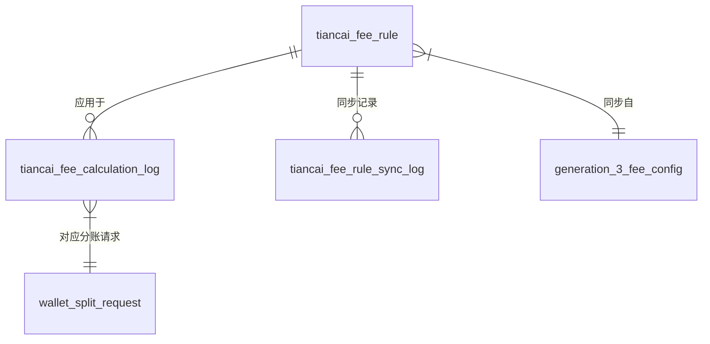
```mermaid
erDiagram
    tiancai_fee_rule ||--o{ tiancai_fee_calculation_log : "应用于"
    tiancai_fee_rule ||--o{ tiancai_fee_rule_sync_log : "同步记录"
    
    tiancai_fee_rule }|--|| generation_3_fee_config : "同步自"
    tiancai_fee_calculation_log }|--|| wallet_split_request : "对应分账请求"
```

- **generation_3_fee_config**: 三代系统计费配置表，`tiancai_fee_rule.source_request_id` 关联三代请求。
- **wallet_split_request**: 行业钱包系统分账请求表，`tiancai_fee_calculation_log.split_request_id` 关联。

## 4. 业务逻辑

### 4.1 核心算法与流程

#### 4.1.1 实时计费计算流程
```python
def calculate_split_fee(request):
    # 1. 参数基础校验
    validate_request_params(request)
    
    # 2. 幂等性检查
    if check_calculation_id_exists(request.request_id):
        return get_previous_calculation(request.request_id)
    
    # 3. 匹配计费规则（核心算法）
    matched_rule = match_fee_rule(
        biz_type="TIANCAI_SPLIT_ACCOUNT",
        payer_role_type=request.payer_role_type,
        payee_account_type=request.payee_account_type,
        target_merchant_no=request.payer_merchant_no,  # 优先匹配付方
        target_account_no=request.payer_account_no,
        request_time=request.request_time
    )
    
    if not matched_rule:
        # 尝试匹配全局规则
        matched_rule = match_fee_rule(
            biz_type="TIANCAI_SPLIT_ACCOUNT",
            payer_role_type=request.payer_role_type,
            payee_account_type=request.payee_account_type,
            target_merchant_no=None,  # 全局规则
            target_account_no=None,
            request_time=request.request_time
        )
    
    if not matched_rule:
        raise FeeRuleNotFoundException()
    
    # 4. 确定手续费承担方（请求参数优先，规则次之）
    final_fee_bearer = determine_fee_bearer(
        request.fee_bearer_from_request,
        matched_rule.fee_bearer
    )
    
    # 5. 计算手续费
    calculated_fee = calculate_fee_amount(
        split_amount=request.split_amount,
        charge_mode=matched_rule.charge_mode,
        charge_value=matched_rule.charge_value
    )
    
    # 6. 应用最低最高限制
    actual_fee = apply_fee_limits(
        calculated_fee,
        min_fee=matched_rule.min_fee,
        max_fee=matched_rule.max_fee
    )
    
    # 7. 计算净额（如需）
    net_amount = None
    if matched_rule.arrival_mode == "NET":
        if final_fee_bearer == "PAYEE":
            net_amount = request.split_amount - actual_fee
        else:
            net_amount = request.split_amount
    
    # 8. 记录日志并发布事件
    log_calculation(request, matched_rule, actual_fee, final_fee_bearer, net_amount)
    publish_fee_calculated_event(request, matched_rule, actual_fee)
    
    return build_fee_response(matched_rule, actual_fee, final_fee_bearer, net_amount)
```

#### 4.1.2 计费规则匹配算法
```python
def match_fee_rule(biz_type, payer_role_type, payee_account_type, 
                   target_merchant_no, target_account_no, request_time):
    """
    计费规则匹配优先级（从高到低）：
    1. 账户级规则（target_account_no匹配）
    2. 商户级规则（target_merchant_no匹配）
    3. 全局规则（target为空）
    
    同一级别内，按生效时间倒序取最新生效的规则
    """
    # 构建查询条件
    query_filters = {
        "biz_type": biz_type,
        "payee_account_type": payee_account_type,
        "status": "ACTIVE",
        "effective_time__lte": request_time,
        "expire_time__gt": request_time
    }
    
    # 添加可选条件
    if payer_role_type:
        query_filters["payer_role_type"] = payer_role_type
    
    # 尝试账户级匹配
    if target_account_no:
        account_rule = FeeRule.objects.filter(
            **query_filters,
            target_account_no=target_account_no
        ).order_by("-effective_time").first()
        if account_rule:
            return account_rule
    
    # 尝试商户级匹配
    if target_merchant_no:
        merchant_rule = FeeRule.objects.filter(
            **query_filters,
            target_merchant_no=target_merchant_no,
            target_account_no__isnull=True
        ).order_by("-effective_time").first()
        if merchant_rule:
            return merchant_rule
    
    # 全局规则
    global_rule = FeeRule.objects.filter(
        **query_filters,
        target_merchant_no__isnull=True,
        target_account_no__isnull=True
    ).order_by("-effective_time").first()
    
    return global_rule
```

### 4.2 业务规则

1. **计费规则优先级规则**:
   - 账户级规则 > 商户级规则 > 全局规则。
   - 同一级别内，按生效时间取最新规则。
   - 规则有效期必须包含请求时间点。

2. **手续费承担方确定规则**:
   - 优先使用分账请求中指定的`feeBearerFromRequest`。
   - 如果请求未指定或为`UNIFIED`，则使用匹配规则中的`feeBearer`。
   - 最终承担方必须是`PAYER`或`PAYEE`。

3. **手续费计算规则**:
   - 按比例计费：`手续费 = 分账金额 × 费率`。
   - 固定金额计费：`手续费 = 固定值`。
   - 计算结果需满足：`最低手续费 ≤ 实际手续费 ≤ 最高手续费`。
   - 金额单位：元，保留2位小数。

4. **净额计算规则**:
   - 仅当`到账模式=NET`时计算净额。
   - 收方承担手续费：`净额 = 分账金额 - 手续费`。
   - 付方承担手续费：`净额 = 分账金额`。

5. **规则同步一致性规则**:
   - 三代系统配置规则时，必须同步到钱包系统和计费中台。
   - 采用“同步调用+事件确认”双重保障机制。
   - 任何一方同步失败，整体操作失败，需人工介入。

### 4.3 验证逻辑

1. **计费规则配置验证**:
   - 费率值范围：比例费率需在[0, 1]区间，固定金额需为正数。
   - 时间有效性：生效时间必须早于失效时间。
   - 规则冲突检查：新规则不能与现有有效规则在相同维度下时间重叠。

2. **实时计费请求验证**:
   - 必填字段检查：分账金额必须大于0。
   - 账户类型校验：付方必须是天财收款账户。
   - 金额格式校验：金额必须为有效数字且不超过系统限制。

3. **数据一致性验证**:
   - 定期比对三代、钱包、计费中台三方的规则快照。
   - 发现不一致时，以三代系统为基准进行修复并告警。

## 5. 时序图

### 5.1 计费规则配置与同步时序图

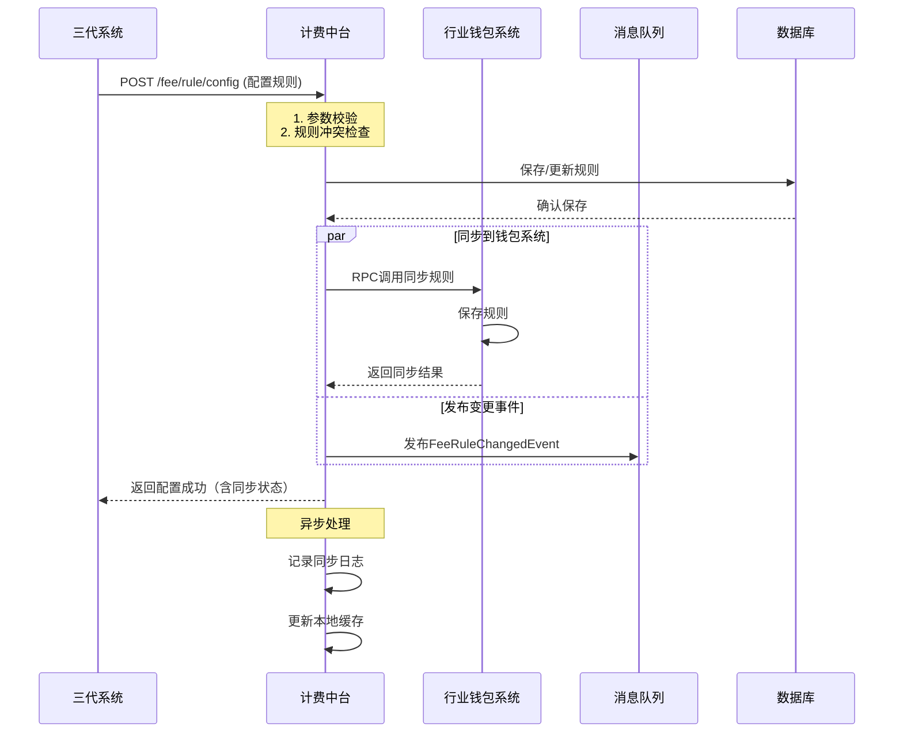
```mermaid
sequenceDiagram
    participant G3 as 三代系统
    participant FC as 计费中台
    participant W as 行业钱包系统
    participant MQ as 消息队列
    participant DB as 数据库

    G3->>FC: POST /fee/rule/config (配置规则)
    Note over FC: 1. 参数校验<br>2. 规则冲突检查
    FC->>DB: 保存/更新规则
    DB-->>FC: 确认保存
    
    par 同步到钱包系统
        FC->>W: RPC调用同步规则
        W->>W: 保存规则
        W-->>FC: 返回同步结果
    and 发布变更事件
        FC->>MQ: 发布FeeRuleChangedEvent
    end
    
    FC-->>G3: 返回配置成功（含同步状态）
    
    Note over FC: 异步处理
    FC->>FC: 记录同步日志
    FC->>FC: 更新本地缓存
```

### 5.2 实时分账计费时序图

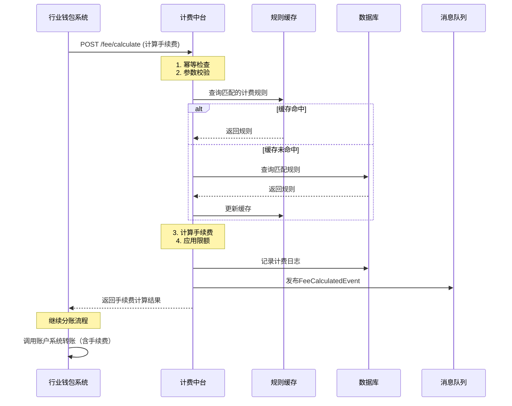
```mermaid
sequenceDiagram
    participant W as 行业钱包系统
    participant FC as 计费中台
    participant Cache as 规则缓存
    participant DB as 数据库
    participant MQ as 消息队列

    W->>FC: POST /fee/calculate (计算手续费)
    Note over FC: 1. 幂等检查<br>2. 参数校验
    
    FC->>Cache: 查询匹配的计费规则
    alt 缓存命中
        Cache-->>FC: 返回规则
    else 缓存未命中
        FC->>DB: 查询匹配规则
        DB-->>FC: 返回规则
        FC->>Cache: 更新缓存
    end
    
    Note over FC: 3. 计算手续费<br>4. 应用限额
    FC->>DB: 记录计费日志
    FC->>MQ: 发布FeeCalculatedEvent
    FC-->>W: 返回手续费计算结果
    
    Note over W: 继续分账流程
    W->>W: 调用账户系统转账（含手续费）
```

## 6. 错误处理

### 6.1 错误码设计

| 错误码 | HTTP状态码 | 描述 | 处理建议 |
|--------|------------|------|----------|
| FEE_RULE_001 | 400 | 计费规则参数无效 | 检查规则配置参数 |
| FEE_RULE_002 | 400 | 规则时间冲突 | 调整规则生效/失效时间 |
| FEE_RULE_003 | 500 | 规则同步失败 | 检查下游系统状态并重试 |
| FEE_CALC_001 | 400 | 计费请求参数无效 | 检查分账请求参数 |
| FEE_CALC_002 | 404 | 未找到匹配计费规则 | 检查规则配置或联系运营 |
| FEE_CALC_003 | 400 | 分账金额不合法 | 金额需大于0且符合格式 |
| FEE_CALC_004 | 409 | 重复计费请求 | 使用原requestId查询结果 |
| FEE_SYNC_001 | 500 | 三方数据不一致 | 人工介入核对并修复 |
| FEE_SYSTEM_001 | 500 | 系统内部错误 | 查看日志联系运维 |

### 6.2 异常处理策略

1. **幂等性保证**:
   - 所有写操作接口必须包含`requestId`。
   - 在`tiancai_fee_calculation_log`中记录所有计费请求，实现天然幂等。
   - 重复请求直接返回之前计算结果。

2. **规则匹配降级策略**:
   - 优先匹配精确规则，未找到时尝试匹配更宽泛规则。
   - 最终未匹配任何规则时，明确返回错误，不提供默认费率。

3. **下游依赖容错**:
   - 规则缓存：使用Redis缓存热点规则，缓存失效时降级查库。
   - 缓存更新：规则变更时主动刷新缓存，设置合理TTL（如5分钟）。

4. **数据一致性保障**:
   - 规则同步采用同步调用，确保强一致性。
   - 提供规则比对工具，定期检查三方一致性。
   - 不一致时告警并记录详细差异，支持手动触发同步。

5. **监控与告警**:
   - 监控计费成功率、响应时间、规则匹配失败率。
   - 规则同步失败即时告警（企业微信/短信）。
   - 每日计费业务报告，包括交易量、手续费总额、异常情况。

## 7. 依赖说明

### 7.1 上游依赖

1. **三代系统**:
   - **交互方式**: REST API调用（规则配置）、消息队列（事件）
   - **职责**: 计费规则的唯一配置源，发起规则创建、更新、失效操作。
   - **数据流**: 计费规则配置信息、规则变更事件。
   - **SLA要求**: 配置接口响应时间<500ms，可用性99.95%。
   - **关键依赖**: 规则配置接口必须确保调用成功，否则影响业务计费。

2. **行业钱包系统**:
   - **交互方式**: REST API调用（实时计费）
   - **职责**: 分账业务发起方，在每笔分账前调用计费接口。
   - **数据流**: 分账请求信息、手续费计算结果。
   - **SLA要求**: 计费接口响应时间<100ms，可用性99.99%。
   - **关键依赖**: 计费接口必须高可用，否则阻塞分账流程。

### 7.2 下游依赖

1. **规则缓存 (Redis)**:
   - **交互方式**: 直接访问
   - **职责**: 缓存热点计费规则，提升查询性能。
   - **数据结构**: Hash存储规则对象，Key格式：`fee_rule:{rule_id}`。
   - **异常影响**: 缓存失效时降级查库，性能下降但功能正常。

2. **数据库 (MySQL)**:
   - **交互方式**: 直接访问
   - **职责**: 持久化存储计费规则和计算日志。
   - **关键表**: `tiancai_fee_rule`, `tiancai_fee_calculation_log`。
   - **异常影响**: 核心功能不可用，需优先恢复。

3. **消息队列 (Kafka/RocketMQ)**:
   - **交互方式**: 事件发布
   - **职责**: 异步通知计费结果，系统解耦。
   - **关键Topic**: `tiancai-fee-calculated`, `tiancai-fee-rule-changed`。
   - **异常影响**: 事件消费方无法及时获取信息，不影响主流程。

### 7.3 依赖管理策略

1. **超时与重试**:
   - 规则配置接口：超时2秒，不重试（由三代系统重试）。
   - 实时计费接口：超时50ms，重试1次（快速失败）。
   - 缓存操作：超时10ms，重试2次。

2. **熔断与降级**:
   - 数据库访问熔断：失败率超过50%时熔断，降级返回默认规则（需配置）。
   - 缓存访问降级：直接查库，记录降级日志。

3. **数据同步一致性保障**:
   - 同步调用+异步确认：三代配置时同步调用钱包和计费中台。
   - 定期比对：每日凌晨比对三方规则快照。
   - 不一致修复：提供管理界面手动触发同步。

4. **容量规划**:
   - 规则数量预估：初期<10万条，按商户+账户维度增长。
   - 计费QPS预估：峰值1000 TPS，平均200 TPS。
   - 日志存储：计费日志保留180天，规则变更日志永久保留。

**文档版本**: 1.0  
**最后更新**: 2024-01-16  
**维护团队**: 计费中台开发组

## 3.7 钱包APP/商服平台


# 钱包APP/商服平台 - 天财业务适配模块设计文档

## 1. 概述

### 1.1 目的
本模块是钱包APP和商服平台为支持“天财商龙”分账业务而设计的适配模块。其主要目的是针对天财机构下的商户，在前端应用层面进行功能适配和入口控制，确保天财专用账户的业务流程符合其特定的业务规则和权限要求，同时为商户提供符合天财业务模式的用户界面和操作体验。

### 1.2 范围
- **入口控制**：根据商户所属机构号，动态控制功能入口的显示与隐藏。
- **权限适配**：针对天财收款账户和天财接收方账户，适配不同的操作权限和业务流程。
- **界面定制**：为天财业务提供特定的界面提示、引导和操作流程。
- **数据展示**：适配天财专用账户的余额、流水、对账单等数据的展示格式。
- **操作拦截**：在前端对不符合天财业务规则的操作进行预校验和拦截。

### 1.3 核心原则
- **机构隔离**：严格根据商户的机构号（是否为天财机构）控制功能可见性。
- **最小化变更**：在现有钱包APP/商服平台架构基础上，通过配置化方式实现适配，避免大规模代码重构。
- **用户体验一致**：在满足业务规则的前提下，尽量保持与普通商户一致的操作体验。
- **安全合规**：确保所有前端操作都经过后端校验，前端拦截仅为优化体验。

## 2. 接口设计

### 2.1 API端点 (RESTful)

#### 2.1.1 商户功能权限查询接口
- **端点**: `GET /api/v1/merchant/features`
- **描述**: 查询当前登录商户的可使用功能列表，根据机构号动态返回。
- **调用方**: 钱包APP、商服平台前端
- **请求头**:
    - `Authorization`: Bearer Token (商户登录Token)
- **响应体**:
```json
{
  "code": "SUCCESS",
  "message": "成功",
  "data": {
    "merchantNo": "888000000001",
    "merchantName": "xx餐饮总部",
    "orgNo": "TC001", // 机构号
    "orgName": "天财商龙",
    "isTiancaiOrg": true, // 是否天财机构
    "accountType": "TIANCAI_RECEIVE", // 账户类型: TIANCAI_RECEIVE, TIANCAI_RECEIVER, NORMAL
    "roleType": "HEADQUARTERS", // 角色类型: HEADQUARTERS, STORE, NONE
    "availableFeatures": {
      "withdraw": false, // 提现入口（天财机构关闭）
      "settlementModeSwitch": false, // 结算模式切换入口（天财机构关闭）
      "collection": true, // 资金归集（仅天财总部可见）
      "batchPay": true, // 批量付款（仅天财总部可见）
      "memberSettlement": true, // 会员结算（仅天财总部可见）
      "accountQuery": true, // 账户查询
      "transactionQuery": true, // 交易查询
      "statementDownload": true // 对账单下载
    },
    "tiancaiAccountInfo": {
      "accountNo": "TC888000000001R01",
      "accountType": "RECEIVE",
      "balance": "10000.00",
      "status": "NORMAL"
    }
  }
}
```

#### 2.1.2 天财业务页面跳转接口
- **端点**: `POST /api/v1/tiancai/redirect`
- **描述**: 获取天财业务H5页面的跳转URL和参数，用于在APP内嵌WebView打开。
- **请求体**:
```json
{
  "businessType": "COLLECTION_AUTH", // 业务类型: COLLECTION_AUTH, BATCH_PAY, MEMBER_SETTLEMENT
  "targetMerchantNo": "888000000002", // 目标商户号（可选）
  "extraParams": {} // 额外参数
}
```
- **响应体**:
```json
{
  "code": "SUCCESS",
  "message": "成功",
  "data": {
    "redirectUrl": "https://tiancai.lkl.com/h5/collection-auth?token=xxx",
    "title": "资金归集授权",
    "expireTime": "2024-01-15 15:30:00"
  }
}
```

#### 2.1.3 操作预校验接口
- **端点**: `POST /api/v1/operation/precheck`
- **描述**: 在执行关键操作前进行预校验，返回是否允许操作及原因。
- **请求体**:
```json
{
  "operation": "WITHDRAW", // 操作类型: WITHDRAW, SETTLEMENT_SWITCH, etc.
  "amount": "1000.00", // 操作金额（可选）
  "targetAccount": "TC888000000001R01" // 目标账户（可选）
}
```
- **响应体**:
```json
{
  "code": "SUCCESS",
  "message": "成功",
  "data": {
    "allowed": false,
    "reasonCode": "TIANCAI_FORBIDDEN", // 原因码
    "reasonMessage": "天财机构商户的提现功能已关闭，请通过天财系统操作",
    "alternativeAction": {
      "type": "REDIRECT",
      "url": "https://tiancai.com/withdraw",
      "description": "前往天财系统操作"
    }
  }
}
```

### 2.2 发布/消费的事件

#### 2.2.1 消费的事件
1. **MerchantLoggedInEvent** (商户登录事件)
   - **发布方**: 认证中心
   - **动作**: 根据登录商户的机构号，加载对应的功能权限配置，初始化界面状态。

2. **TiancaiAccountStatusChangedEvent** (天财账户状态变更事件)
   - **发布方**: 三代系统/行业钱包系统
   - **动作**: 更新本地缓存的账户状态，刷新界面显示。

3. **RelationshipBoundEvent** (关系绑定完成事件)
   - **发布方**: 三代系统
   - **动作**: 更新相关业务入口的状态（如归集、批量付款变为可用）。

## 3. 数据模型

### 3.1 核心表设计

#### 表: `merchant_feature_config` (商户功能配置表)
| 字段名 | 类型 | 必填 | 描述 | 索引 |
|--------|------|------|------|------|
| id | bigint | Y | 主键 | PK |
| org_no | varchar(16) | Y | 机构号 | UK |
| org_name | varchar(64) | Y | 机构名称 | |
| is_tiancai_org | tinyint | Y | 是否天财机构: 1-是, 0-否 | IDX |
| feature_code | varchar(32) | Y | 功能代码 | UK |
| feature_name | varchar(64) | Y | 功能名称 | |
| enabled | tinyint | Y | 是否启用: 1-是, 0-否 | |
| visible | tinyint | Y | 是否可见: 1-是, 0-否 | |
| require_auth | tinyint | Y | 是否需要额外授权: 1-是, 0-否 | |
| auth_level | tinyint | N | 授权等级: 1-普通, 2-高级 | |
| redirect_url | varchar(512) | N | 跳转URL（如功能外跳） | |
| description | varchar(256) | N | 功能描述 | |
| effective_time | datetime | Y | 生效时间 | |
| expire_time | datetime | N | 过期时间 | |
| create_time | datetime | Y | 创建时间 | |
| update_time | datetime | Y | 更新时间 | |

#### 表: `tiancai_ui_config` (天财UI配置表)
| 字段名 | 类型 | 必填 | 描述 | 索引 |
|--------|------|------|------|------|
| id | bigint | Y | 主键 | PK |
| config_key | varchar(64) | Y | 配置键 | UK |
| config_type | varchar(32) | Y | 配置类型: BANNER, TIP, GUIDE, etc. | IDX |
| target_page | varchar(64) | N | 目标页面 | |
| title | varchar(128) | N | 标题 | |
| content | text | Y | 内容（HTML/JSON） | |
| org_no | varchar(16) | N | 机构号（空表示所有天财机构） | IDX |
| account_type | varchar(32) | N | 账户类型 | |
| role_type | varchar(32) | N | 角色类型 | |
| priority | int | Y | 显示优先级 | |
| start_time | datetime | N | 开始显示时间 | |
| end_time | datetime | N | 结束显示时间 | |
| status | tinyint | Y | 状态: 1-启用, 0-停用 | |
| create_time | datetime | Y | 创建时间 | |

#### 表: `user_operation_log` (用户操作日志表)
| 字段名 | 类型 | 必填 | 描述 | 索引 |
|--------|------|------|------|------|
| id | bigint | Y | 主键 | PK |
| merchant_no | varchar(32) | Y | 商户号 | IDX |
| user_id | varchar(32) | Y | 用户ID | |
| org_no | varchar(16) | Y | 机构号 | IDX |
| operation | varchar(64) | Y | 操作类型 | |
| target | varchar(128) | N | 操作目标 | |
| parameters | json | N | 操作参数 | |
| result | varchar(16) | Y | 结果: SUCCESS, FAILED, BLOCKED | |
| error_code | varchar(32) | N | 错误码 | |
| error_message | varchar(256) | N | 错误信息 | |
| client_info | json | Y | 客户端信息 | |
| ip_address | varchar(64) | Y | IP地址 | |
| create_time | datetime | Y | 创建时间 | IDX |

### 3.2 与其他模块的关系
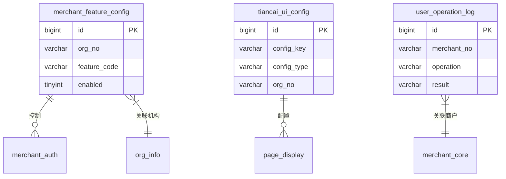
```mermaid
erDiagram
    merchant_feature_config ||--o{ merchant_auth : "控制"
    tiancai_ui_config ||--o{ page_display : "配置"
    
    merchant_feature_config }|--|| org_info : "关联机构"
    user_operation_log }|--|| merchant_core : "关联商户"
    
    merchant_feature_config {
        bigint id PK
        varchar org_no
        varchar feature_code
        tinyint enabled
    }
    
    tiancai_ui_config {
        bigint id PK
        varchar config_key
        varchar config_type
        varchar org_no
    }
    
    user_operation_log {
        bigint id PK
        varchar merchant_no
        varchar operation
        varchar result
    }
```

- **org_info**: 机构信息表，`merchant_feature_config.org_no` 外键关联。
- **merchant_core**: 三代系统核心商户表，`user_operation_log.merchant_no` 外键关联。
- **merchant_auth**: 商户权限表，根据`merchant_feature_config`动态生成权限。

## 4. 业务逻辑

### 4.1 核心算法与流程

#### 4.1.1 功能权限动态加载算法
```javascript
// 前端权限控制逻辑
async function loadMerchantFeatures() {
    try {
        // 1. 调用后端接口获取商户信息和功能权限
        const response = await api.get('/merchant/features');
        const { isTiancaiOrg, accountType, roleType, availableFeatures } = response.data;
        
        // 2. 根据机构类型设置全局标志
        window.isTiancaiMerchant = isTiancaiOrg;
        window.merchantRole = roleType;
        
        // 3. 动态更新界面元素
        updateFeatureVisibility(availableFeatures);
        
        // 4. 加载天财专属UI配置
        if (isTiancaiOrg) {
            await loadTiancaiUIConfig(accountType, roleType);
        }
        
        // 5. 绑定操作拦截器
        bindOperationInterceptors();
        
    } catch (error) {
        console.error('加载商户功能失败:', error);
        // 降级方案：显示默认功能集
        showDefaultFeatures();
    }
}

// 更新功能可见性
function updateFeatureVisibility(features) {
    // 提现入口控制
    const withdrawBtn = document.getElementById('withdraw-btn');
    if (withdrawBtn) {
        withdrawBtn.style.display = features.withdraw ? 'block' : 'none';
        if (!features.withdraw) {
            showTiancaiTip('提现功能已关闭，请通过天财系统操作');
        }
    }
    
    // 结算模式切换入口控制
    const settlementSwitchBtn = document.getElementById('settlement-switch-btn');
    if (settlementSwitchBtn) {
        settlementSwitchBtn.style.display = features.settlementModeSwitch ? 'block' : 'none';
    }
    
    // 天财业务入口控制（仅总部可见）
    if (window.merchantRole === 'HEADQUARTERS') {
        showElement('collection-btn', features.collection);
        showElement('batch-pay-btn', features.batchPay);
        showElement('member-settlement-btn', features.memberSettlement);
    }
}
```

#### 4.1.2 操作拦截与重定向逻辑
```javascript
// 操作拦截器
function bindOperationInterceptors() {
    // 拦截提现操作
    interceptOperation('withdraw', async (amount, account) => {
        if (!window.isTiancaiMerchant) {
            return { allowed: true }; // 非天财商户，允许操作
        }
        
        // 天财商户，调用预校验接口
        const precheck = await api.post('/operation/precheck', {
            operation: 'WITHDRAW',
            amount: amount,
            targetAccount: account
        });
        
        if (!precheck.data.allowed) {
            // 显示提示信息
            showOperationBlockedModal(precheck.data);
            return { allowed: false };
        }
        
        return { allowed: true };
    });
    
    // 拦截结算模式切换
    interceptOperation('settlement-switch', async () => {
        if (!window.isTiancaiMerchant) {
            return { allowed: true };
        }
        
        const precheck = await api.post('/operation/precheck', {
            operation: 'SETTLEMENT_SWITCH'
        });
        
        if (!precheck.data.allowed) {
            showOperationBlockedModal(precheck.data);
            return { allowed: false };
        }
        
        return { allowed: true };
    });
}

// 天财业务跳转处理
async function handleTiancaiBusiness(businessType, targetMerchantNo) {
    try {
        // 获取跳转URL
        const response = await api.post('/tiancai/redirect', {
            businessType: businessType,
            targetMerchantNo: targetMerchantNo
        });
        
        // 在APP内打开H5页面
        openInWebView(response.data.redirectUrl, {
            title: response.data.title,
            showClose: true,
            onClose: () => {
                // 页面关闭回调，刷新数据
                refreshBusinessData();
            }
        });
        
    } catch (error) {
        showError('无法打开业务页面，请稍后重试');
    }
}
```

### 4.2 业务规则

1. **入口控制规则**:
   - 天财机构号下的所有商户，在钱包APP/商服平台隐藏"提现"入口。
   - 天财机构号下的所有商户，在钱包APP/商服平台隐藏"结算模式切换"入口。
   - 天财总部商户显示"资金归集"、"批量付款"、"会员结算"业务入口。
   - 天财门店商户仅显示被授权业务的查看入口。

2. **操作重定向规则**:
   - 当用户尝试访问被禁用的功能时，显示友好的提示信息。
   - 提供跳转到天财系统对应功能的链接或二维码。
   - 对于需要在拉卡拉系统内完成的操作（如关系绑定），提供内嵌H5页面。

3. **界面展示规则**:
   - 天财专用账户的余额显示增加"天财专用"标识。
   - 交易流水明细中，天财分账交易显示特定的图标和描述。
   - 对账单下载提供天财专属格式选项。

4. **权限校验规则**:
   - 所有前端拦截都必须有后端双重校验。
   - 用户操作日志需要记录机构号和操作结果。
   - 敏感操作需要额外的身份验证。

### 4.3 验证逻辑

1. **机构号验证**:
   - 用户登录时，根据商户号获取机构信息。
   - 验证机构号是否在天财机构白名单中。
   - 缓存机构类型信息，减少重复查询。

2. **功能权限验证**:
   - 每次进入功能页面时，重新验证权限状态。
   - 权限变更时，强制用户重新登录或刷新令牌。
   - 支持权限的实时更新和生效。

3. **操作预验证**:
   - 关键操作执行前，调用预校验接口。
   - 预校验失败时，阻止操作并显示原因。
   - 提供替代操作方案。

## 5. 时序图

### 5.1 天财商户登录与权限加载时序图

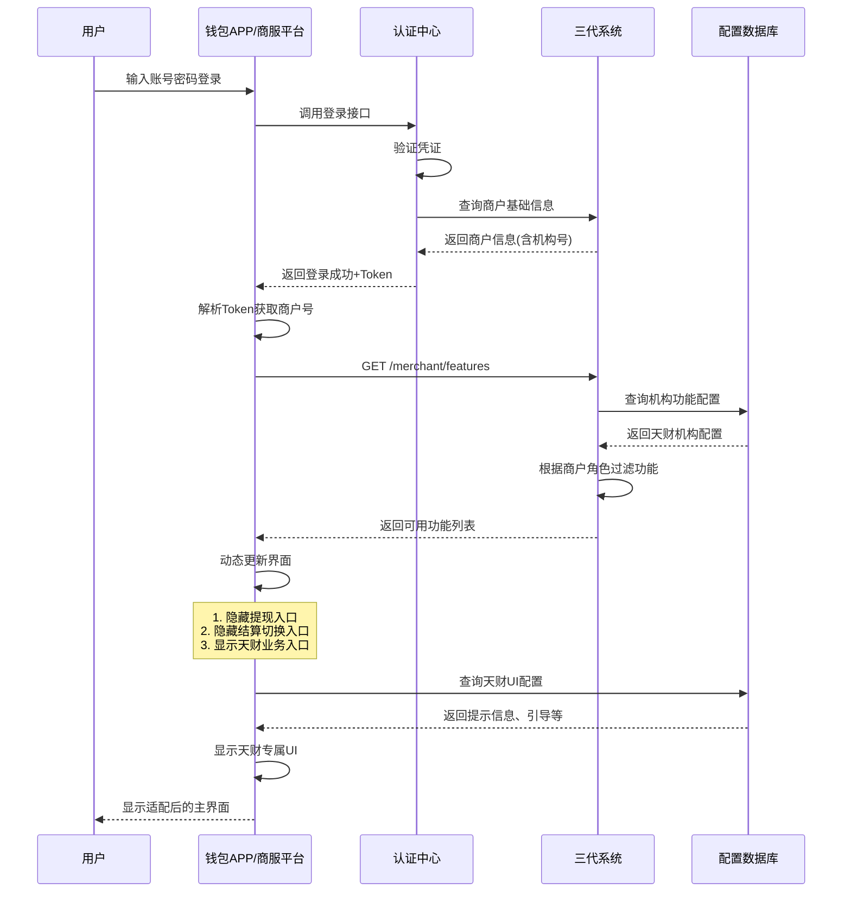
```mermaid
sequenceDiagram
    participant U as 用户
    participant APP as 钱包APP/商服平台
    participant AUTH as 认证中心
    participant G3 as 三代系统
    participant DB as 配置数据库

    U->>APP: 输入账号密码登录
    APP->>AUTH: 调用登录接口
    AUTH->>AUTH: 验证凭证
    AUTH->>G3: 查询商户基础信息
    G3-->>AUTH: 返回商户信息(含机构号)
    AUTH-->>APP: 返回登录成功+Token
    
    APP->>APP: 解析Token获取商户号
    APP->>G3: GET /merchant/features
    G3->>DB: 查询机构功能配置
    DB-->>G3: 返回天财机构配置
    G3->>G3: 根据商户角色过滤功能
    G3-->>APP: 返回可用功能列表
    
    APP->>APP: 动态更新界面
    Note over APP: 1. 隐藏提现入口<br>2. 隐藏结算切换入口<br>3. 显示天财业务入口
    
    APP->>DB: 查询天财UI配置
    DB-->>APP: 返回提示信息、引导等
    APP->>APP: 显示天财专属UI
    APP-->>U: 显示适配后的主界面
```

### 5.2 天财业务操作拦截与重定向时序图

```mermaid
sequenceDiagram
    participant U as 用户(天财总部)
    participant APP as 钱包APP
    participant API as 后端API
    participant G3 as 三代系统
    participant TC as 天财系统

    U->>APP: 点击"资金归集"
    APP->>API: POST /tiancai/redirect
    API->>G3: 验证商户权限
    G3-->>API: 权限验证通过
    API->>TC: 请求生成归集页面
    TC-->>API: 返回H5页面URL+参数
    API-->>APP: 返回跳转信息
    
    APP->>APP: 打开WebView加载H5
    APP->>TC: 加载天财归集页面
    TC-->>APP: 显示归集操作界面
    
    Note over U,TC: 用户在H5页面完成归集授权
    
    TC->>G3: 回调授权结果
    G3-->>API: 通知关系绑定完成
    API->>APP: 发送推送通知
    APP->>APP: 刷新业务状态
    APP-->>U: 显示授权成功提示
```

## 6. 错误处理

### 6.1 错误码设计

| 错误码 | HTTP状态码 | 描述 | 处理建议 |
|--------|------------|------|----------|
| UI_AUTH_001 | 403 | 功能不可用（天财机构限制） | 显示提示信息，引导用户使用天财系统 |
| UI_AUTH_002 | 403 | 权限不足（非总部角色） | 隐藏或禁用相关功能入口 |
| UI_CONFIG_003 | 500 | UI配置加载失败 | 使用默认配置，记录日志 |
| UI_REDIRECT_004 | 400 | 业务跳转参数错误 | 检查参数格式，重新发起 |
| UI_REDIRECT_005 | 502 | 天财系统不可用 | 显示系统维护提示，稍后重试 |
| UI_OPERATION_006 | 429 | 操作过于频繁 | 显示操作限制提示，等待后重试 |

### 6.2 异常处理策略

1. **功能降级策略**:
   - 当权限接口不可用时，默认显示基础功能集。
   - UI配置加载失败时，使用本地默认配置。
   - 天财系统不可用时，显示友好的维护页面。

2. **用户引导策略**:
   - 功能被禁用时，提供清晰的说明和替代方案。
   - 操作失败时，给出具体的解决步骤。
   - 提供客服联系方式，用于处理复杂问题。

3. **监控与告警**:
   - 监控功能权限接口的可用性和响应时间。
   - 记录用户操作拦截日志，用于分析用户行为。
   - 当天财系统跳转失败率超过阈值时发送告警。

4. **数据一致性**:
   - 定期同步机构配置信息，确保前后端一致。
   - 用户权限变更时，强制刷新本地缓存。
   - 提供手动刷新功能，解决缓存不一致问题。

## 7. 依赖说明

### 7.1 上游依赖

1. **认证中心**:
   - **交互方式**: REST API
   - **职责**: 提供用户登录认证，返回包含机构号的商户信息。
   - **数据流**: 登录凭证、商户基本信息、机构号。
   - **SLA要求**: 登录接口响应时间<500ms，可用性99.9%。

2. **三代系统**:
   - **交互方式**: REST API
   - **职责**: 提供商户详细信息、功能权限查询、业务跳转接口。
   - **关键接口**:
     - `GET /merchant/features`: 查询商户功能权限
     - `POST /tiancai/redirect`: 获取业务跳转URL
     - `POST /operation/precheck`: 操作预校验
   - **异常影响**: 无法正确显示功能入口，业务跳转失败。

### 7.2 下游依赖

1. **天财系统H5页面**:
   - **交互方式**: WebView内嵌
   - **职责**: 提供天财业务的具体操作界面。
   - **数据流**: 业务参数、操作结果。
   - **异常影响**: 用户无法完成天财业务操作。

2. **配置数据库**:
   - **交互方式**: 直接访问
   - **职责**: 存储机构功能配置、UI配置信息。
   - **数据流**: 配置数据、规则定义。
   - **异常影响**: 无法加载动态配置，使用默认配置。

### 7.3 依赖管理策略

1. **缓存策略**:
   - 商户功能权限缓存5分钟，减少接口调用。
   - UI配置缓存10分钟，支持手动刷新。
   - 机构信息缓存1小时，变化频率低。

2. **超时与重试**:
   - 权限查询接口: 超时2秒，重试1次
   - 业务跳转接口: 超时3秒，重试2次
   - 预校验接口: 超时1秒，不重试

3. **降级方案**:
   - 权限接口失败: 显示所有基础功能，隐藏天财专属功能
   - 天财系统不可用: 显示维护页面，提供客服入口
   - 配置加载失败: 使用内置默认配置

4. **监控指标**:
   - 功能权限接口成功率
   - 天财业务跳转成功率
   - 用户操作拦截率
   - 页面加载时间

**文档版本**: 1.0  
**最后更新**: 2024-01-16  
**维护团队**: 前端平台开发组

## 3.8 电子签约平台


# 电子签约平台模块设计文档

## 1. 概述

### 1.1 目的
电子签约平台作为“天财分账”业务的核心合规与授权保障模块，旨在为资金流转关系（归集、批量付款、会员结算）的建立提供安全、合法、可追溯的电子签约与身份认证服务。其主要目的是：
- **协议签署与生成**：根据不同的业务场景（归集、批量付款、会员结算）和主体类型（企业/个人），生成并管理标准化的电子协议模板，支持多方在线签署。
- **身份核验集成**：作为认证流程的统一入口，根据主体类型（对公/对私）调用认证系统进行打款验证或人脸验证，并将认证结果与协议签署过程绑定，形成完整的电子证据链。
- **流程封装与引导**：通过短信推送H5链接，引导用户（法人、负责人、授权联系人）在移动端完成身份验证、协议查看与签署的全流程，提供流畅的用户体验。
- **证据链留存**：完整记录签约过程中的所有关键节点（协议内容、签署时间、认证信息、操作日志），满足监管合规与司法举证要求。

### 1.2 范围
本模块设计范围涵盖：
- **协议模板管理**：维护不同场景（归集、批量付款、会员结算、开通付款）和角色（总部/门店/接收方）对应的电子协议模板。
- **签约流程发起与管理**：接收行业钱包系统的签约请求，创建签约流程实例，并驱动其按步骤（短信通知->H5引导->身份认证->协议签署->结果回调）执行。
- **身份认证代理**：根据主体类型，代理调用认证系统的打款验证或人脸验证接口，并处理认证结果回调。
- **H5页面生成与封装**：根据场景和用户类型，动态生成包含协议内容、认证引导、签署控件的H5页面。
- **签约记录与证据链存储**：持久化存储完整的签约流程数据，包括协议快照、认证记录、签署记录、操作日志。
- **结果通知**：将签约最终结果（成功/失败）同步回调给行业钱包系统。

**边界说明**：
- 本模块**不负责**底层身份核验逻辑（打款/人脸），仅作为调用方与认证系统集成。
- 本模块**不负责**商户/账户信息（如银行卡、商户属性）的校验，这些由行业钱包系统在调用前完成。
- 本模块**不负责**短信通道的直接调用，但负责生成短信内容和H5链接，通过内部消息或接口触发短信发送（通常由消息中心执行）。
- 本模块**不负责**电子签章的法律有效性底层技术（如CA证书、时间戳），但集成第三方电子签章服务或使用公司基础能力。

## 2. 接口设计

### 2.1 API端点 (RESTful)

#### 2.1.1 发起签约流程
- **端点**: `POST /api/v1/esign/process/initiate`
- **描述**: 由行业钱包系统调用，根据业务场景和参与方信息，发起一个电子签约流程。本接口是签约流程的总入口。
- **认证**: API Key (由调用方行业钱包系统提供)
- **请求头**:
    - `X-Request-ID`: 请求唯一标识，用于幂等和追踪。
    - `X-Caller-System`: 调用方系统标识 (如：`wallet-system`)。
- **请求体**:
```json
{
  "requestId": "wallet_req_202310271500001", // 行业钱包请求ID，全局唯一
  "businessType": "TIANCAI_SPLIT", // 业务类型，固定值
  "scene": "COLLECTION", // 场景：COLLECTION(归集), BATCH_PAYMENT(批量付款), MEMBER_SETTLEMENT(会员结算), OPEN_PAYMENT(开通付款)
  "payerInfo": { // 付方信息（协议中的付款/授权方）
    "merchantNo": "M1234567890",
    "merchantName": "XX科技有限公司总部",
    "merchantType": "ENTERPRISE", // ENTERPRISE-企业, INDIVIDUAL-个体户, PERSONAL-个人
    "accountNo": "TC_ACCT_001", // 付方天财账户号
    "accountType": "TIANCAI_COLLECTION" // 账户类型: TIANCAI_COLLECTION(收款账户), TIANCAI_RECEIVING(接收方账户)
  },
  "payeeInfo": { // 收方信息（协议中的收款/被授权方），开通付款场景下与payerInfo相同
    "merchantNo": "M9876543210",
    "merchantName": "XX科技杭州门店",
    "merchantType": "ENTERPRISE",
    "accountNo": "TC_ACCT_002",
    "accountType": "TIANCAI_COLLECTION",
    "bankCardNo": "6228480012345678901", // 收方绑定默认银行卡号（用于打款验证）
    "bankAccountName": "XX科技杭州门店", // 银行卡户名
    "legalPersonName": "李四", // 法人/负责人姓名（对公/对私）
    "legalPersonIdNo": "110101199001011234", // 法人/负责人身份证号
    "contactPhone": "13800138000" // 接收短信的手机号（法人/负责人/授权联系人）
  },
  "agreementInfo": {
    "purpose": "资金归集", // 资金用途：资金归集、缴纳品牌费、供应商付款、会员结算等
    "extraParams": { // 协议模板变量
      "collectionRatio": "100%", // 归集比例
      "effectiveDate": "2023-10-27",
      "expiryDate": "2024-10-26"
    }
  },
  "callbackUrl": "https://wallet.example.com/callback/esign" // 签约结果回调地址
}
```
- **响应体 (成功)**:
```json
{
  "code": "SUCCESS",
  "message": "签约流程已发起",
  "data": {
    "processId": "esign_proc_202310271500001", // 本系统签约流程ID
    "status": "INITIATED", // 状态：INITIATED-已发起， SMS_SENT-短信已发， VERIFYING-认证中， SIGNING-签署中， COMPLETED-完成， FAILED-失败
    "expireTime": "2023-10-27T17:00:00+08:00" // 流程过期时间（如1.5小时后）
  }
}
```

#### 2.1.2 查询签约流程状态
- **端点**: `GET /api/v1/esign/process/{processId}`
- **描述**: 根据流程ID查询签约流程的详细状态和结果。
- **响应体**:
```json
{
  "code": "SUCCESS",
  "data": {
    "processId": "esign_proc_202310271500001",
    "requestId": "wallet_req_202310271500001",
    "businessType": "TIANCAI_SPLIT",
    "scene": "COLLECTION",
    "status": "COMPLETED",
    "agreementName": "资金归集授权协议",
    "agreementNo": "AGR_20231027150001",
    "payerInfo": { ... }, // 同请求体精简信息
    "payeeInfo": { ... },
    "verificationResult": {
      "type": "TRANSFER",
      "status": "SUCCESS",
      "verificationId": "verif_202310271200001",
      "verifyTime": "2023-10-27T15:05:30+08:00"
    },
    "signatureResult": {
      "signTime": "2023-10-27T15:06:00+08:00",
      "signatoryName": "李四",
      "signatoryType": "LEGAL_PERSON", // LEGAL_PERSON-法人， AUTHORIZED_PERSON-授权代理人
      "signatureHash": "abc123...",
      "caCertificate": "..." // CA证书信息（如有）
    },
    "agreementUrl": "https://esign.example.com/agreement/AGR_20231027150001", // 协议查看/下载地址
    "createTime": "2023-10-27T15:00:00+08:00",
    "completeTime": "2023-10-27T15:06:00+08:00"
  }
}
```

#### 2.1.3 处理H5页面请求
- **端点**: `GET /api/v1/esign/h5/{processId}`
- **描述**: 用户点击短信链接后访问的H5页面入口。根据流程状态，动态渲染不同的页面（等待认证、认证引导、协议签署、结果展示）。
- **请求参数**:
    - `token`: 一次性访问令牌，通过短信链接携带，用于身份验证和防篡改。
- **响应**: 返回HTML页面（服务端渲染或前端框架）。

#### 2.1.4 提交签署确认
- **端点**: `POST /api/v1/esign/process/{processId}/confirm`
- **描述**: H5页面中，用户阅读协议后点击“同意并签署”时调用，完成协议签署。
- **请求头**:
    - `X-Access-Token`: 从H5页面上下文获取的令牌。
- **请求体**:
```json
{
  "action": "AGREE", // 固定值 AGREE
  "signatoryName": "李四", // 签署人姓名（前端展示并确认）
  "userAgent": "Mozilla/5.0...",
  "ipAddress": "192.168.1.1"
}
```
- **响应体**:
```json
{
  "code": "SUCCESS",
  "message": "签署成功",
  "data": {
    "processId": "esign_proc_202310271500001",
    "nextStep": "COMPLETE", // 或 REDIRECT
    "redirectUrl": "https://esign.example.com/h5/complete?processId=..." // 签署成功页
  }
}
```

#### 2.1.5 接收认证结果回调
- **端点**: `POST /api/v1/esign/callback/verification`
- **描述**: 认证系统在验证完成后回调的接口，用于更新签约流程状态。
- **认证**: API Key (由认证系统提供)
- **请求体**:
```json
{
  "verificationId": "verif_202310271200001",
  "processId": "esign_proc_202310271500001", // 可选，认证系统从请求中记录并回传
  "status": "SUCCESS", // 或 FAILED
  "type": "TRANSFER", // TRANSFER 或 FACE
  "detail": { ... } // 认证详情摘要
}
```
- **响应体**:
```json
{
  "code": "SUCCESS",
  "message": "回调接收成功"
}
```

### 2.2 发布/消费的事件

#### 2.2.1 消费的事件
- **Verification.Completed**: 订阅认证系统发布的认证完成事件，用于异步更新签约流程状态。
```json
{
  "eventId": "event_verif_001",
  "eventType": "Verification.Completed",
  "timestamp": "2023-10-27T12:05:30+08:00",
  "payload": {
    "verificationId": "verif_202310271200001",
    "requestId": "req_202310271200001", // 对应本系统的processId或关联ID
    "status": "SUCCESS",
    "type": "TRANSFER",
    "payerMerchantNo": "M1234567890",
    "relatedBankCardNo": "6228480012345678901"
  }
}
```

#### 2.2.2 发布的事件
- **E-Sign.ProcessInitiated**: 当一个新的签约流程成功创建时发布。
```json
{
  "eventId": "event_esign_001",
  "eventType": "E-Sign.ProcessInitiated",
  "timestamp": "2023-10-27T15:00:00+08:00",
  "payload": {
    "processId": "esign_proc_202310271500001",
    "scene": "COLLECTION",
    "payerMerchantNo": "M1234567890",
    "payeeMerchantNo": "M9876543210",
    "payeeContactPhone": "13800138000"
  }
}
```
- **E-Sign.SMSSent**: 当签约短信已成功触发发送时发布（供监控和对账）。
- **E-Sign.ProcessCompleted**: 当签约流程完成（成功或失败）时发布，供行业钱包等系统订阅。
```json
{
  "eventId": "event_esign_002",
  "eventType": "E-Sign.ProcessCompleted",
  "timestamp": "2023-10-27T15:06:00+08:00",
  "payload": {
    "processId": "esign_proc_202310271500001",
    "status": "SUCCESS", // 或 FAILED
    "agreementNo": "AGR_20231027150001",
    "verificationId": "verif_202310271200001",
    "payerMerchantNo": "M1234567890",
    "payeeMerchantNo": "M9876543210",
    "failReason": "" // 失败时有值
  }
}
```

## 3. 数据模型

### 3.1 数据库表设计

#### 表: `esign_process` (签约流程主表)
| 字段名 | 类型 | 必填 | 默认值 | 说明 |
| :--- | :--- | :--- | :--- | :--- |
| `id` | bigint(20) | 是 | AUTO_INCREMENT | 主键 |
| `process_id` | varchar(32) | 是 | | **业务流程ID**，前缀`esign_proc_`，全局唯一索引 |
| `request_id` | varchar(64) | 是 | | 外部业务请求ID（行业钱包），用于幂等 |
| `business_type` | varchar(32) | 是 | | 业务类型：`TIANCAI_SPLIT` |
| `scene` | varchar(32) | 是 | | 场景：`COLLECTION`, `BATCH_PAYMENT`, `MEMBER_SETTLEMENT`, `OPEN_PAYMENT` |
| `status` | varchar(16) | 是 | `INITIATED` | 状态：`INITIATED`, `SMS_SENT`, `VERIFYING`, `SIGNING`, `COMPLETED`, `FAILED`, `EXPIRED` |
| `payer_merchant_no` | varchar(32) | 是 | | 付方商户号 |
| `payer_merchant_name` | varchar(128) | 是 | | 付方商户全称 |
| `payer_merchant_type` | varchar(16) | 是 | | 付方类型：`ENTERPRISE`, `INDIVIDUAL`, `PERSONAL` |
| `payer_account_no` | varchar(32) | 是 | | 付方账户号 |
| `payer_account_type` | varchar(32) | 是 | | 付方账户类型 |
| `payee_merchant_no` | varchar(32) | 是 | | 收方商户号 |
| `payee_merchant_name` | varchar(128) | 是 | | 收方商户全称 |
| `payee_merchant_type` | varchar(16) | 是 | | 收方类型 |
| `payee_account_no` | varchar(32) | 是 | | 收方账户号 |
| `payee_account_type` | varchar(32) | 是 | | 收方账户类型 |
| `payee_bank_card_no` | varchar(32) | 否 | | 收方绑定银行卡（打款验证用） |
| `payee_bank_account_name` | varchar(128) | 否 | | 银行卡户名 |
| `payee_legal_person_name` | varchar(64) | 否 | | 法人/负责人姓名 |
| `payee_legal_person_id_no` | varchar(32) | 否 | | 法人/负责人身份证号 |
| `payee_contact_phone` | varchar(16) | 是 | | 接收短信手机号 |
| `agreement_name` | varchar(128) | 是 | | 协议名称 |
| `agreement_no` | varchar(32) | 否 | | 协议编号，签署后生成 |
| `agreement_purpose` | varchar(64) | 是 | | 资金用途 |
| `agreement_variables` | json | 否 | | 协议模板变量（JSON格式） |
| `verification_type` | varchar(16) | 是 | | 认证类型：`TRANSFER`, `FACE`，根据收方类型决定 |
| `verification_id` | varchar(32) | 否 | | 关联的认证流水ID |
| `verification_status` | varchar(16) | 否 | | 认证状态：`PENDING`, `SUCCESS`, `FAILED` |
| `callback_url` | varchar(512) | 是 | | 结果回调地址（行业钱包） |
| `expire_time` | datetime | 是 | | 流程过期时间 |
| `sms_sent_time` | datetime | 否 | | 短信发送时间 |
| `sign_time` | datetime | 否 | | 协议签署时间 |
| `complete_time` | datetime | 否 | | 流程完成时间 |
| `fail_reason` | varchar(256) | 否 | | 失败原因 |
| `create_time` | datetime | 是 | CURRENT_TIMESTAMP | 创建时间 |
| `update_time` | datetime | 是 | CURRENT_TIMESTAMP ON UPDATE | 更新时间 |
| **索引** | | | | |
| idx_process_id | `process_id` | | UNIQUE | 主流程ID索引 |
| idx_request_id | `request_id` | | | 业务请求ID索引 |
| idx_payer_merchant_no | `payer_merchant_no` | | | 付方商户号查询 |
| idx_payee_contact_phone | `payee_contact_phone` | | | 手机号查询（用于H5入口） |
| idx_status_expire | `status`, `expire_time` | | | 状态和过期时间，用于定时任务 |

#### 表: `agreement_template` (协议模板表)
| 字段名 | 类型 | 必填 | 默认值 | 说明 |
| :--- | :--- | :--- | :--- | :--- |
| `id` | bigint(20) | 是 | AUTO_INCREMENT | 主键 |
| `template_id` | varchar(32) | 是 | | 模板ID，如 `TPL_COLLECTION_ENTERPRISE` |
| `template_name` | varchar(128) | 是 | | 模板名称 |
| `business_type` | varchar(32) | 是 | | 业务类型：`TIANCAI_SPLIT` |
| `scene` | varchar(32) | 是 | | 适用场景 |
| `payer_type` | varchar(16) | 是 | `ANY` | 付方类型：`ENTERPRISE`, `INDIVIDUAL`, `PERSONAL`, `ANY` |
| `payee_type` | varchar(16) | 是 | `ANY` | 收方类型 |
| `agreement_purpose` | varchar(64) | 否 | | 资金用途（为空表示通用） |
| `content_template` | text | 是 | | 协议内容模板（含变量占位符） |
| `version` | varchar(16) | 是 | | 模板版本，如 `1.0` |
| `effective_date` | date | 是 | | 生效日期 |
| `expiry_date` | date | 否 | | 失效日期 |
| `is_active` | tinyint(1) | 是 | 1 | 是否激活 |
| `creator` | varchar(32) | 是 | | 创建人 |
| `create_time` | datetime | 是 | CURRENT_TIMESTAMP | 创建时间 |
| **索引** | | | | |
| idx_template_key | `business_type`, `scene`, `payer_type`, `payee_type`, `agreement_purpose`, `is_active` | | | 模板检索复合索引 |

#### 表: `signature_record` (签署记录表)
| 字段名 | 类型 | 必填 | 默认值 | 说明 |
| :--- | :--- | :--- | :--- | :--- |
| `id` | bigint(20) | 是 | AUTO_INCREMENT | 主键 |
| `process_id` | varchar(32) | 是 | | 关联流程ID |
| `agreement_no` | varchar(32) | 是 | | 协议编号 |
| `signatory_merchant_no` | varchar(32) | 是 | | 签署方商户号 |
| `signatory_name` | varchar(64) | 是 | | 签署人姓名 |
| `signatory_type` | varchar(16) | 是 | | 签署人类型：`LEGAL_PERSON`, `AUTHORIZED_PERSON` |
| `signatory_id_no` | varchar(32) | 否 | | 签署人身份证号 |
| `signature_hash` | varchar(256) | 是 | | 签署内容哈希值（防篡改） |
| `ca_certificate_id` | varchar(128) | 否 | | CA证书ID（如有） |
| `sign_ip` | varchar(64) | 是 | | 签署IP地址 |
| `sign_user_agent` | varchar(512) | 是 | | 签署用户代理 |
| `sign_time` | datetime | 是 | | 签署时间 |
| `create_time` | datetime | 是 | CURRENT_TIMESTAMP | 创建时间 |
| **索引** | | | | |
| idx_process_id | `process_id` | | | 流程关联索引 |
| idx_agreement_no | `agreement_no` | | | 协议编号索引 |

#### 表: `esign_audit_log` (签约审计日志表)
| 字段名 | 类型 | 必填 | 默认值 | 说明 |
| :--- | :--- | :--- | :--- | :--- |
| `id` | bigint(20) | 是 | AUTO_INCREMENT | 主键 |
| `process_id` | varchar(32) | 是 | | 关联流程ID |
| `operation` | varchar(32) | 是 | | 操作类型：`PROCESS_CREATE`, `SMS_TRIGGER`, `VERIFICATION_INIT`, `VERIFICATION_CALLBACK`, `SIGN_CONFIRM`, `STATUS_CHANGE` |
| `operator` | varchar(32) | 是 | `system` | 操作者（系统或用户ID） |
| `from_status` | varchar(16) | 否 | | 操作前状态 |
| `to_status` | varchar(16) | 否 | | 操作后状态 |
| `details` | text | 否 | | 操作详情（JSON格式） |
| `ip_address` | varchar(64) | 否 | | 操作IP |
| `user_agent` | varchar(512) | 否 | | 用户代理 |
| `create_time` | datetime | 是 | CURRENT_TIMESTAMP | 创建时间 |
| **索引** | | | | |
| idx_process_id | `process_id` | | | 关联查询 |
| idx_create_time | `create_time` | | | 时间范围查询 |

### 3.2 与其他模块的关系
- **行业钱包系统**: 主要调用方和结果接收方。行业钱包在完成业务校验后，调用本系统发起签约流程，并接收最终结果回调。本系统是行业钱包实现“关系绑定”和“开通付款”的关键依赖。
- **认证系统**: 核心依赖方。本系统根据收方类型，代理调用认证系统的打款验证或人脸验证接口，并监听其完成事件。认证结果是签约流程的必要前置条件。
- **消息中心/短信网关**: 依赖方。本系统生成短信内容和H5链接后，通过内部接口或事件触发消息中心发送短信。短信内容模板由本系统管理。
- **账户系统/三代系统**: 数据源（间接）。本系统所需的商户/账户信息由行业钱包在调用时提供，但协议模板中可能涉及的系统名称、条款等需要与底层系统术语一致。
- **文件存储/对象存储**: 依赖方。用于存储最终生成的协议PDF文件、人脸验证视频（如有）等证据文件。

## 4. 业务逻辑

### 4.1 核心算法

#### 4.1.1 协议模板匹配与渲染
```python
def match_and_render_agreement(scene, payer_type, payee_type, purpose, extra_params):
    """
    根据场景、参与方类型和资金用途匹配协议模板，并渲染变量。
    """
    # 1. 模板匹配逻辑
    query_filters = {
        'business_type': 'TIANCAI_SPLIT',
        'scene': scene,
        'is_active': True,
        'effective_date__lte': datetime.now(),
        'expiry_date__gte': datetime.now()  # 或为NULL
    }
    # 优先匹配具体资金用途的模板
    template = AgreementTemplate.objects.filter(
        **query_filters,
        agreement_purpose=purpose
    ).first()
    if not template:
        # 回退到该场景通用模板
        template = AgreementTemplate.objects.filter(
            **query_filters,
            agreement_purpose__isnull=True
        ).first()
    # 进一步按payer_type, payee_type过滤（模板中可能为ANY）
    if template and (template.payer_type not in ['ANY', payer_type]):
        template = None
    if template and (template.payee_type not in ['ANY', payee_type]):
        template = None
    
    if not template:
        raise TemplateNotFoundException(f"No agreement template found for scene={scene}, payer={payer_type}, payee={payee_type}, purpose={purpose}")
    
    # 2. 模板变量渲染
    context = {
        'current_date': datetime.now().strftime('%Y年%m月%d日'),
        'payer_merchant_name': extra_params.get('payer_merchant_name'),
        'payee_merchant_name': extra_params.get('payee_merchant_name'),
        'purpose': purpose,
        **extra_params  # 其他自定义变量
    }
    rendered_content = render_template(template.content_template, context)
    
    return template.template_id, rendered_content
```

#### 4.1.2 H5页面访问令牌生成与验证
```python
def generate_access_token(process_id, phone, expires_in=1800):
    """
    生成用于H5页面访问的一次性令牌。
    防止链接被篡改或重复使用。
    """
    payload = {
        'process_id': process_id,
        'phone': phone,  # 绑定手机号，防止链接被转发
        'exp': datetime.utcnow() + timedelta(seconds=expires_in)
    }
    token = jwt.encode(payload, SECRET_KEY, algorithm='HS256')
    return token

def verify_access_token(token, process_id, phone):
    """
    验证H5页面访问令牌的有效性。
    """
    try:
        payload = jwt.decode(token, SECRET_KEY, algorithms=['HS256'])
        if payload['process_id'] != process_id or payload['phone'] != phone:
            return False
        return True
    except jwt.ExpiredSignatureError:
        raise TokenExpiredException("访问令牌已过期")
    except jwt.InvalidTokenError:
        raise InvalidTokenException("无效的访问令牌")
```

### 4.2 业务规则

1. **签约场景与协议映射规则**：
   - **归集场景** (`COLLECTION`)：门店（付方）与拉卡拉签署《代付授权协议》。协议主体：拉卡拉（甲方）、门店（乙方）。总部作为发起方和归集方，不在协议中签署，但协议内容涉及总部信息。
   - **批量付款场景** (`BATCH_PAYMENT`)：总部（付方）与接收方（收方）签署《分账付款协议》。对公接收方使用打款验证，对私接收方使用人脸验证。
   - **会员结算场景** (`MEMBER_SETTLEMENT`)：总部（付方）与门店（收方）签署《会员结算分账协议》（单独固定模板）。对公门店打款验证，对私门店人脸验证。
   - **开通付款场景** (`OPEN_PAYMENT`)：总部（付方）与拉卡拉签署《代付授权协议》。仅对公总部需要，作为批量付款和会员结算的前置授权。

2. **认证类型选择规则**：
   - **收方类型为`ENTERPRISE`（企业）**：必须使用**打款验证**，验证其绑定银行卡。
   - **收方类型为`INDIVIDUAL`（个体户）或`PERSONAL`（个人）**：必须使用**人脸验证**，验证法人/负责人身份。
   - 此规则由本系统根据`payee_merchant_type`自动判断，并在调用认证系统时指定。

3. **签约流程状态机规则**：
   ```
   INITIATED -> SMS_SENT -> VERIFYING -> SIGNING -> COMPLETED
         |          |           |           |
         +-> FAILED<-+           +-> FAILED<-+
   ```
   - 每个状态转换需记录审计日志。
   - 流程过期（`EXPIRED`）后不可再继续操作，需重新发起。
   - 认证失败后，流程直接进入`FAILED`状态，并通知行业钱包。

4. **短信发送规则**：
   - 短信内容需包含：商户简称、业务场景、H5链接（含一次性令牌）。
   - H5链接有效期与流程有效期一致（如1.5小时）。
   - 同一流程，短信最多重复发送2次（防骚扰）。

5. **证据链完整性规则**：
   - 一个完整的签约证据链必须包含：协议最终文本、协议签署记录（时间、IP、用户代理）、身份认证记录（认证系统流水）、所有状态变更审计日志。
   - 证据链数据至少保存5年，以满足监管要求。

### 4.3 验证逻辑

#### 4.3.1 发起签约流程前的校验（在行业钱包完成，本系统做防御性校验）
1. **基础参数校验**：非空检查，手机号格式，商户号格式等。
2. **业务幂等校验**：根据`request_id`查询是否已存在流程，避免重复签约。
3. **场景与类型一致性校验**：
   - `OPEN_PAYMENT`场景下，`payerInfo`与`payeeInfo`应为同一商户。
   - `COLLECTION`场景下，收方（总部）类型必须为`ENTERPRISE`。
   - `BATCH_PAYMENT`和`MEMBER_SETTLEMENT`场景下，付方（总部）类型必须为`ENTERPRISE`。
4. **模板存在性校验**：根据场景、参与方类型、资金用途，确认存在有效的协议模板。

#### 4.3.2 H5页面访问校验
1. **令牌有效性校验**：验证JWT令牌是否有效、未过期。
2. **流程状态校验**：流程必须处于`SMS_SENT`或`VERIFYING`或`SIGNING`状态，且未过期。
3. **手机号绑定校验**：令牌中的手机号必须与流程中`payee_contact_phone`一致，防止链接被转发。

#### 4.3.3 签署确认校验
1. **前置状态校验**：流程必须处于`SIGNING`状态（即认证已成功）。
2. **签署人信息校验**：提交的`signatoryName`必须与流程中`payee_legal_person_name`一致（或与授权代理人名单匹配）。
3. **防重复签署**：同一流程不能重复签署。

## 5. 时序图

### 5.1 归集场景签约时序图（门店对公）

```mermaid
sequenceDiagram
    participant 天财 as 天财系统
    participant 钱包 as 行业钱包系统
    participant 电签 as 电子签约平台
    participant 认证 as 认证系统
    participant 消息 as 消息中心
    participant 用户 as 门店法人/授权人

    天财->>钱包: 1. 发起归集授权请求(场景=COLLECTION)
    钱包->>钱包: 2. 业务校验(角色、账户类型、发起方一致性)
    钱包->>电签: 3. 发起签约流程(POST /esign/process/initiate)
    电签->>电签: 4. 参数校验，匹配协议模板，创建流程记录
    电签->>电签: 5. 判断收方类型=ENTERPRISE，准备打款验证
    电签->>认证: 6. 发起打款验证(POST /verification/transfer)
    认证->>认证: 7. 生成打款信息，创建认证记录
    认证-->>电签: 8. 返回verification_id
    电签->>电签: 9. 更新流程状态为VERIFYING，关联verification_id
    电签->>消息: 10. 发布事件E-Sign.ProcessInitiated (或直接调用短信接口)
    消息->>用户: 11. 发送短信(含H5链接和令牌)
    电签->>电签: 12. 更新状态为SMS_SENT
    Note over 认证,账务核心: 并行：认证系统执行打款（见认证系统时序图）
    用户->>电签: 13. 点击链接访问H5页面(GET /esign/h5/{processId})
    电签->>电签: 14. 验证令牌，渲染“等待打款到账”页面
    用户->>电签: 15. 在H5页面回填打款金额/备注
    电签->>认证: 16. 提交回填信息(POST /verification/transfer/confirm)
    认证->>认证: 17. 验证回填信息，更新认证状态
    认证->>电签: 18. 回调认证结果(POST /esign/callback/verification)
    电签->>电签: 19. 更新流程verification_status=SUCCESS，状态转为SIGNING
    电签->>用户: 20. H5页面自动刷新，展示协议内容
    用户->>电签: 21. 阅读后点击“同意并签署”(POST /esign/process/confirm)
    电签->>电签: 22. 生成协议编号，记录签署信息，状态转为COMPLETED
    电签->>钱包: 23. 回调签约结果(callbackUrl)
    电签->>电签: 24. 发布E-Sign.ProcessCompleted事件
    钱包->>天财: 25. 返回归集授权结果
```

### 5.2 批量付款场景签约时序图（接收方对私）

```mermaid
sequenceDiagram
    participant 天财 as 天财系统
    participant 钱包 as 行业钱包系统
    participant 电签 as 电子签约平台
    participant 认证 as 认证系统
    participant 消息 as 消息中心
    participant 用户 as 接收方负责人(个人)

    天财->>钱包: 1. 发起关系绑定请求(场景=BATCH_PAYMENT)
    钱包->>钱包: 2. 业务校验
    钱包->>电签: 3. 发起签约流程
    电签->>电签: 4. 参数校验，匹配协议模板，创建流程记录
    电签->>电签: 5. 判断收方类型=PERSONAL，准备人脸验证
    电签->>认证: 6. 发起人脸验证(POST /verification/face)
    认证->>认证: 7. 创建认证记录，生成verify_token
    认证-->>电签: 8. 返回verification_id和verify_token
    电签->>电签: 9. 更新流程状态为VERIFYING
    电签->>消息: 10. 触发短信发送
    消息->>用户: 11. 发送短信(含H5链接)
    电签->>电签: 12. 更新状态为SMS_SENT
    用户->>电签: 13. 点击链接访问H5页面
    电签->>电签: 14. 验证令牌，渲染“人脸验证”页面，加载SDK(用verify_token)
    用户->>认证: 15. 通过前端SDK采集人脸(活体检测)
    认证->>用户: 16. 返回人脸核验结果(前端)
    用户->>电签: 17. 提交核验结果(或SDK自动提交)
    电签->>认证: 18. 提交人脸验证结果(POST /verification/face/result)
    认证->>认证: 19. 验证结果，更新认证状态
    认证->>电签: 20. 回调认证结果
    电签->>电签: 21. 更新verification_status=SUCCESS，状态转为SIGNING
    电签->>用户: 22. H5页面展示协议内容
    用户->>电签: 23. 点击“同意并签署”
    电签->>电签: 24. 记录签署，状态转为COMPLETED
    电签->>钱包: 25. 回调签约结果
    电签->>电签: 26. 发布E-Sign.ProcessCompleted事件
    钱包->>天财: 27. 返回关系绑定结果
```

## 6. 错误处理

### 6.1 预期错误及HTTP状态码

| 错误场景 | HTTP状态码 | 错误码 | 处理策略 |
| :--- | :--- | :--- | :--- |
| 请求参数缺失或格式错误 | 400 | `PARAM_INVALID` | 返回具体字段错误，调用方修正 |
| 协议模板未找到 | 400 | `TEMPLATE_NOT_FOUND` | 检查场景、参与方类型、资金用途配置，告警配置管理员 |
| 签约流程不存在 | 404 | `PROCESS_NOT_FOUND` | 检查processId是否正确，或流程已过期清理 |
| 流程状态不合法（如重复签署） | 400 | `INVALID_PROCESS_STATUS` | 引导用户查看当前状态，或重新发起 |
| H5访问令牌无效或过期 | 401 | `INVALID_ACCESS_TOKEN` | 提示用户链接已失效，需重新获取短信 |
| 认证失败（打款/人脸） | 400 | `VERIFICATION_FAILED` | 记录具体原因，流程终止，回调行业钱包失败结果 |
| 短信发送失败 | 500 | `SMS_SEND_FAILED` | 重试机制（最多2次），仍失败则流程标记为失败 |
| 回调通知失败（行业钱包） | 500 | `CALLBACK_FAILED` | 指数退避重试，持久化重试队列，人工监控 |
| 系统内部错误 | 500 | `INTERNAL_ERROR` | 记录详细日志，告警，人工介入 |

### 6.2 重试策略
1. **短信发送重试**：首次发送失败后，延迟30秒重试，最多重试2次。重试失败则流程标记为`FAILED`。
2. **认证系统调用重试**：对于网络超时等临时故障，采用指数退避重试，最多3次。对于业务逻辑错误（如卡号无效）不重试。
3. **结果回调重试**：向行业钱包`callbackUrl`通知失败时，采用指数退避策略重试，最多5次，重试间隔逐渐拉长。持久化重试任务到数据库或消息队列。

### 6.3 降级与熔断
1. **认证服务降级**：当认证系统完全不可用时，对于非核心测试场景，可考虑配置“模拟认证”模式（仅用于开发和测试环境）。生产环境必须依赖认证，否则流程无法继续。
2. **短信服务降级**：如果短信通道临时故障，可考虑延长流程有效期，并在H5页面提供“重新发送短信”功能（需验证身份）。
3. **熔断机制**：对认证系统、消息中心的调用设置熔断器（如Hystrix或Resilience4j），当失败率超过阈值时快速失败，避免资源耗尽。

## 7. 依赖说明

### 7.1 上游依赖

#### 7.1.1 行业钱包系统
- **交互方式**：同步HTTP API调用（发起流程） + 异步HTTP回调（接收结果）。
- **关键依赖**：
  - 提供完整、准确的业务参数（场景、参与方信息、资金用途）。
  - 在调用前完成必要的业务校验（商户角色、账户类型、一致性）。
- **SLA要求**：核心接口`/esign/process/initiate` P99延迟 < 500ms，可用性 > 99.9%。

#### 7.1.2 认证系统
- **交互方式**：同步HTTP API调用（发起验证） + 异步HTTP回调（接收结果） + 事件监听。
- **关键依赖**：
  - 提供高可用的打款验证和人脸验证服务。
  - 及时返回验证结果，保证签约流程不阻塞。
- **数据一致性**：认证结果必须与签约流程强关联，`verification_id`是关键关联键。

#### 7.1.3 消息中心/短信网关
- **交互方式**：异步消息（事件驱动）或同步HTTP API。
- **关键依赖**：
  - 可靠地发送短信，保证到达率。
  - 支持短信模板变量替换。
- **合规要求**：短信内容需符合运营商规范，包含退订方式等。

### 7.2 下游依赖

#### 7.2.1 天财系统（间接）
- **交互方式**：通过行业钱包系统中转。
- **提供数据**：无直接交互，但最终签约结果会影响天财的业务流程。

### 7.3 内部依赖

#### 7.3.1 配置中心
- **配置项**：
  - 协议模板内容与匹配规则。
  - 流程有效期、短信重试策略。
  - 认证系统端点、消息中心配置。
  - H5页面前端资源路径。

#### 7.3.2 监控与告警
- **监控指标**：
  - 接口QPS、成功率、延迟（按场景细分）。
  - 签约流程各状态数量分布。
  - 认证成功率、短信到达率。
  - 证据链生成完整性。
- **告警规则**：
  - 签约流程失败率连续10分钟 > 3%。
  - 认证系统调用超时率 > 2%。
  - 短信发送失败率 > 5%。
  - 未处理回调积压数量 > 100。

**文档版本**: 1.0  
**最后更新**: 2023-10-27  
**设计者**: 软件架构师  
**评审状态**: 待评审

## 3.9 行业钱包系统


# 行业钱包系统模块设计文档

## 1. 概述

### 1.1 目的
行业钱包系统是“天财分账”业务的核心业务逻辑处理模块，位于三代系统与底层账户系统之间，扮演着业务协调者与规则校验者的角色。其主要目的是：
- **业务逻辑集中处理**：统一处理天财分账业务的开户、关系绑定、分账转账等核心业务流程，封装复杂的业务规则校验。
- **专用账户体系管理**：作为天财专用账户（收款账户/接收方账户）的业务管理层，负责开户申请的处理、账户角色的维护以及与账户系统的交互。
- **关系绑定与认证驱动**：驱动并管理资金流转关系（归集、批量付款、会员结算）的建立过程，集成电子签约平台完成身份认证与协议签署。
- **分账指令处理**：接收并校验天财发起的资金分账指令，协调计费、账户系统完成资金划转，并同步交易信息。
- **业务状态与数据管理**：维护商户-账户关系、授权关系状态、认证结果等业务数据，为上层查询和对账提供支持。

### 1.2 范围
本模块设计范围涵盖：
- **天财专用账户开户/升级**：接收三代系统的开户请求，校验天财机构权限，调用账户系统创建或升级专用账户，并维护账户角色（总部/门店）。
- **关系绑定流程管理**：接收天财或三代的关系绑定请求，进行场景化业务校验，驱动电子签约平台完成认证与签约，并管理绑定关系的状态。
- **开通付款授权**：处理总部在批量付款和会员结算场景下的前置授权流程（“开通付款”）。
- **分账指令处理**：接收天财的分账请求，校验绑定关系与协议状态，计算手续费，调用账户系统执行资金划转，并同步交易信息至业务核心。
- **业务数据查询与同步**：提供账户信息、关系状态等查询接口，并向对账单系统、业务核心同步必要的交易数据。
- **天财机构业务隔离**：通过机构号白名单机制，确保所有业务操作严格限定在天财机构范围内。

**边界说明**：
- 本模块**不负责**底层账户的创建与记账（由账户系统负责）。
- 本模块**不负责**电子协议的具体生成、签署与身份核验（由电子签约平台负责）。
- 本模块**不负责**手续费的计算逻辑（由计费中台负责），但负责发起计费请求并应用结果。
- 本模块**不负责**商户的进件、审核等生命周期管理（由三代系统负责）。

## 2. 接口设计

### 2.1 API端点 (RESTful)

#### 2.1.1 内部接口 (供三代系统调用)

**1. 开立/升级天财专用账户**
- **端点**: `POST /internal/v1/tiancai/account/open`
- **描述**: 为指定收单商户开立新的天财专用账户，或将现有普通收款账户升级为天财专用账户。
- **调用方**: 三代系统
- **请求头**:
    - `X-Source-System: G3_SYSTEM`
    - `X-Request-Id`: 请求唯一标识
- **请求体**:
```json
{
  "requestId": "g3_req_20240116001",
  "merchantNo": "88800010001",
  "institutionNo": "860000", // 必须为天财机构号
  "operationType": "CREATE", // 枚举: CREATE(新开), UPGRADE(升级)
  "accountType": "TIANCAI_RECEIVE", // 枚举: TIANCAI_RECEIVE(收款账户), TIANCAI_RECEIVER(接收方账户)
  "roleType": "HEADQUARTERS", // 枚举: HEADQUARTERS(总部), STORE(门店)。仅TIANCAI_RECEIVE账户有效。
  "originalAccountNo": "ACC001", // 可选。当operationType=UPGRADE时，传入原普通收款账户号。
  "settlementMode": "ACTIVE", // 结算模式，固定为ACTIVE
  "effectiveTime": "2024-01-17 00:00:00" // 期望生效时间（用于结算模式切换）
}
```
- **响应体 (成功)**:
```json
{
  "code": "SUCCESS",
  "message": "成功",
  "data": {
    "requestId": "g3_req_20240116001",
    "merchantNo": "88800010001",
    "tiancaiAccountNo": "TC_ACC_88800010001_R001",
    "accountType": "TIANCAI_RECEIVE",
    "roleType": "HEADQUARTERS",
    "status": "ACTIVE",
    "openTime": "2024-01-16 14:30:00"
  }
}
```

**2. 发起关系绑定（签约与认证）**
- **端点**: `POST /internal/v1/tiancai/relationship/bind`
- **描述**: 发起归集、批量付款或会员结算场景下的授权关系建立流程。本接口驱动电子签约平台。
- **请求体**:
```json
{
  "requestId": "g3_req_20240116002",
  "scene": "COLLECTION", // 枚举: COLLECTION(归集), BATCH_PAYMENT(批量付款), MEMBER_SETTLEMENT(会员结算)
  "initiatorMerchantNo": "88800010001", // 发起方商户号（天财页面操作方）
  "payerMerchantNo": "88800010002", // 付方商户号
  "payerAccountNo": "TC_ACC_88800010002_R001", // 付方天财账户号
  "payeeMerchantNo": "88800010001", // 收方商户号
  "payeeAccountNo": "TC_ACC_88800010001_R001", // 收方天财账户号
  "capitalPurpose": "资金归集", // 资金用途
  "authorizationContact": { // 授权联系人信息（归集场景为门店联系人）
    "name": "李四",
    "phone": "13900139000",
    "idCardNo": "110101199002022345"
  },
  "extraParams": { // 场景特有参数
    "collectionMode": "PROPORTION",
    "maxProportion": 100
  },
  "callbackUrl": "https://g3.example.com/callback/relationship" // 三代回调地址
}
```
- **响应体**:
```json
{
  "code": "SUCCESS",
  "message": "签约流程已发起",
  "data": {
    "requestId": "g3_req_20240116002",
    "authFlowNo": "AUTH202401160001", // 本系统生成的授权流水号
    "processId": "esign_proc_202401160001", // 电子签约流程ID
    "status": "INITIATED"
  }
}
```

**3. 发起开通付款授权**
- **端点**: `POST /internal/v1/tiancai/payment/enable`
- **描述**: 在批量付款和会员结算场景下，为付方（总部）开通付款能力的前置授权流程。
- **请求体**:
```json
{
  "requestId": "g3_req_20240116003",
  "initiatorMerchantNo": "88800010001",
  "payerMerchantNo": "88800010001", // 付方商户号（与发起方一致）
  "payerAccountNo": "TC_ACC_88800010001_R001",
  "capitalPurpose": "会员结算,批量付款", // 资金用途
  "callbackUrl": "https://g3.example.com/callback/payment"
}
```
- **响应体**: 同关系绑定接口，返回授权流水号和签约流程ID。

**4. 查询关系绑定状态**
- **端点**: `GET /internal/v1/tiancai/relationship/status`
- **描述**: 根据授权流水号或商户号查询关系绑定或开通付款的状态。
- **查询参数**: `authFlowNo=AUTH202401160001` 或 `payerMerchantNo=88800010001&payeeMerchantNo=88800010002&scene=COLLECTION`
- **响应体**:
```json
{
  "code": "SUCCESS",
  "data": {
    "authFlowNo": "AUTH202401160001",
    "scene": "COLLECTION",
    "status": "COMPLETED", // 枚举: INITIATED, VERIFYING, SIGNING, COMPLETED, FAILED, EXPIRED
    "verificationResult": "SUCCESS",
    "agreementNo": "AGR_202401160001",
    "completeTime": "2024-01-16 15:30:00"
  }
}
```

#### 2.1.2 外部接口 (供天财系统调用)

**1. 发起分账（转账）**
- **端点**: `POST /api/v1/tiancai/transfer`
- **描述**: 天财系统发起资金分账指令的核心接口。
- **认证**: API Key + 机构号白名单
- **请求头**:
    - `X-App-Id`: 天财应用ID
    - `X-Org-No`: 天财机构号 (如 860000)
    - `X-Request-Id`: 请求唯一标识
- **请求体**:
```json
{
  "requestId": "tc_req_20240116001",
  "scene": "MEMBER_SETTLEMENT", // 枚举: COLLECTION, MEMBER_SETTLEMENT, BATCH_PAYMENT
  "initiatorMerchantNo": "88800010001", // 指令发起方（总部）
  "outMerchantNo": "88800010001", // 转出方商户号
  "outAccountNo": "TC_ACC_88800010001_R001", // 转出方账户号
  "inMerchantNo": "88800010002", // 转入方商户号
  "inAccountNo": "TC_ACC_88800010002_R001", // 转入方账户号
  "amount": 10000, // 分账金额（单位：分）
  "currency": "CNY",
  "feeBearer": "PAYER", // 枚举: PAYER(付方承担), PAYEE(收方承担)
  "remark": "会员结算-2024年1月"
}
```
- **响应体 (成功)**:
```json
{
  "code": "SUCCESS",
  "message": "分账指令接收成功",
  "data": {
    "requestId": "tc_req_20240116001",
    "transferNo": "TF202401161430001", // 本系统分账流水号
    "status": "PROCESSING", // 最终结果需异步回调或查询
    "acceptTime": "2024-01-16 14:30:05"
  }
}
```

**2. 查询分账结果**
- **端点**: `GET /api/v1/tiancai/transfer/{transferNo}`
- **描述**: 根据分账流水号查询指令执行结果。
- **响应体**:
```json
{
  "code": "SUCCESS",
  "data": {
    "transferNo": "TF202401161430001",
    "requestId": "tc_req_20240116001",
    "scene": "MEMBER_SETTLEMENT",
    "outAccountNo": "TC_ACC_88800010001_R001",
    "inAccountNo": "TC_ACC_88800010002_R001",
    "amount": 10000,
    "fee": 10,
    "feeBearer": "PAYER",
    "status": "SUCCESS", // 枚举: PROCESSING, SUCCESS, FAILED
    "failReason": "",
    "completeTime": "2024-01-16 14:30:10"
  }
}
```

#### 2.1.3 回调接口 (供电子签约平台调用)

**1. 签约结果回调**
- **端点**: `POST /internal/callback/esign`
- **描述**: 电子签约平台在签约流程完成（成功或失败）后回调此接口。
- **认证**: API Key (电子签约平台提供)
- **请求体**:
```json
{
  "processId": "esign_proc_202401160001",
  "status": "SUCCESS", // 或 FAILED
  "agreementNo": "AGR_202401160001",
  "verificationId": "verif_202401160001",
  "payerMerchantNo": "88800010002",
  "payeeMerchantNo": "88800010001",
  "signTime": "2024-01-16 15:30:00",
  "failReason": ""
}
```
- **响应体**:
```json
{
  "code": "SUCCESS",
  "message": "回调接收成功"
}
```

### 2.2 发布/消费的事件

#### 2.2.1 消费的事件
1.  **AccountStatusChangedEvent** (来自账户系统)
    - **事件类型**: `ACCOUNT_STATUS_CHANGED`
    - **负载**: `{"accountNo": "...", "oldStatus": "...", "newStatus": "...", "changeReason": "..."}`
    - **动作**: 更新本地缓存的账户状态，若账户被冻结，则暂停相关分账能力。

2.  **SettlementModeChangedEvent** (来自三代系统)
    - **事件类型**: `SETTLEMENT_MODE_CHANGED`
    - **负载**: `{"merchantNo": "...", "oldMode": "...", "newMode": "...", "effectiveTime": "..."}`
    - **动作**: 更新商户结算模式，并同步至账户系统（如需）。

#### 2.2.2 发布的事件
1.  **TiancaiAccountOpenedEvent** (天财账户开立事件)
    - **事件类型**: `TIANCAI_ACCOUNT_OPENED`
    - **触发时机**: 成功开立或升级天财专用账户后。
    - **负载**:
    ```json
    {
      "eventId": "event_wallet_001",
      "eventType": "TIANCAI_ACCOUNT_OPENED",
      "timestamp": "2024-01-16T14:30:00Z",
      "payload": {
        "merchantNo": "88800010001",
        "tiancaiAccountNo": "TC_ACC_88800010001_R001",
        "accountType": "TIANCAI_RECEIVE",
        "roleType": "HEADQUARTERS",
        "operationType": "CREATE",
        "institutionNo": "860000"
      }
    }
    ```
    - **订阅方**: 三代系统（用于更新本地记录）、消息中心（通知天财）。

2.  **RelationshipBoundEvent** (关系绑定完成事件)
    - **事件类型**: `RELATIONSHIP_BOUND`
    - **触发时机**: 关系绑定（或开通付款）流程成功完成后。
    - **负载**: 包含授权流水号、场景、付收方信息、协议编号等。
    - **订阅方**: 三代系统、风控系统（用于风险关系图谱）。

3.  **TiancaiTransferExecutedEvent** (天财分账执行事件)
    - **事件类型**: `TIANCAI_TRANSFER_EXECUTED`
    - **触发时机**: 分账指令在账户系统执行成功后。
    - **负载**:
    ```json
    {
      "eventId": "event_wallet_002",
      "eventType": "TIANCAI_TRANSFER_EXECUTED",
      "timestamp": "2024-01-16T14:30:10Z",
      "payload": {
        "transferNo": "TF202401161430001",
        "requestId": "tc_req_20240116001",
        "scene": "MEMBER_SETTLEMENT",
        "outAccountNo": "TC_ACC_88800010001_R001",
        "inAccountNo": "TC_ACC_88800010002_R001",
        "amount": 10000,
        "fee": 10,
        "status": "SUCCESS"
      }
    }
    ```
    - **订阅方**: **业务核心**（用于记录分账交易）、对账单系统（用于生成分账指令账单）。

## 3. 数据模型

### 3.1 核心表设计

```sql
-- 天财专用账户信息表 (业务层)
CREATE TABLE t_tiancai_account (
    id BIGINT PRIMARY KEY AUTO_INCREMENT,
    account_no VARCHAR(64) NOT NULL UNIQUE COMMENT '天财专用账户号',
    merchant_no VARCHAR(32) NOT NULL COMMENT '所属收单商户号',
    institution_no VARCHAR(16) NOT NULL COMMENT '所属机构号（天财）',
    account_type VARCHAR(32) NOT NULL COMMENT '账户类型: TIANCAI_RECEIVE, TIANCAI_RECEIVER',
    role_type VARCHAR(16) COMMENT '角色类型: HEADQUARTERS, STORE (仅收款账户有效)',
    original_account_no VARCHAR(64) COMMENT '原账户号（升级场景）',
    status VARCHAR(16) DEFAULT 'ACTIVE' COMMENT '状态: ACTIVE, FROZEN, CLOSED',
    settlement_mode VARCHAR(16) DEFAULT 'ACTIVE' COMMENT '结算模式',
    open_time DATETIME NOT NULL COMMENT '开户/升级时间',
    effective_time DATETIME COMMENT '生效时间（用于结算模式切换）',
    created_time DATETIME NOT NULL,
    updated_time DATETIME NOT NULL,
    INDEX idx_merchant_no (merchant_no),
    INDEX idx_institution_no (institution_no),
    INDEX idx_account_type (account_type, role_type)
) COMMENT '天财专用账户业务信息表';

-- 授权关系表 (绑定关系与开通付款)
CREATE TABLE t_auth_relationship (
    id BIGINT PRIMARY KEY AUTO_INCREMENT,
    auth_flow_no VARCHAR(32) NOT NULL UNIQUE COMMENT '授权流水号',
    scene VARCHAR(32) NOT NULL COMMENT '场景: COLLECTION, BATCH_PAYMENT, MEMBER_SETTLEMENT, OPEN_PAYMENT',
    initiator_merchant_no VARCHAR(32) NOT NULL COMMENT '发起方商户号',
    payer_merchant_no VARCHAR(32) NOT NULL COMMENT '付方商户号',
    payer_account_no VARCHAR(64) NOT NULL COMMENT '付方账户号',
    payee_merchant_no VARCHAR(32) NOT NULL COMMENT '收方商户号',
    payee_account_no VARCHAR(64) NOT NULL COMMENT '收方账户号',
    capital_purpose VARCHAR(64) NOT NULL COMMENT '资金用途',
    status VARCHAR(16) DEFAULT 'INITIATED' COMMENT '状态: INITIATED, VERIFYING, SIGNING, COMPLETED, FAILED, EXPIRED',
    verification_type VARCHAR(16) COMMENT '认证类型: TRANSFER, FACE',
    verification_id VARCHAR(32) COMMENT '认证流水ID',
    verification_status VARCHAR(16) COMMENT '认证状态: PENDING, SUCCESS, FAILED',
    agreement_no VARCHAR(32) COMMENT '协议编号',
    process_id VARCHAR(32) COMMENT '电子签约流程ID',
    extra_params JSON COMMENT '场景扩展参数(JSON)',
    callback_url VARCHAR(512) COMMENT '回调地址',
    expire_time DATETIME NOT NULL COMMENT '流程过期时间',
    complete_time DATETIME COMMENT '完成时间',
    fail_reason VARCHAR(256) COMMENT '失败原因',
    created_time DATETIME NOT NULL,
    updated_time DATETIME NOT NULL,
    INDEX idx_payer_payee_scene (payer_merchant_no, payee_merchant_no, scene, status),
    INDEX idx_process_id (process_id),
    INDEX idx_status_expire (status, expire_time)
) COMMENT '授权关系表（含开通付款）';

-- 分账交易记录表
CREATE TABLE t_tiancai_transfer (
    id BIGINT PRIMARY KEY AUTO_INCREMENT,
    transfer_no VARCHAR(32) NOT NULL UNIQUE COMMENT '分账流水号',
    request_id VARCHAR(64) NOT NULL COMMENT '外部请求ID（幂等键）',
    scene VARCHAR(32) NOT NULL COMMENT '业务场景',
    initiator_merchant_no VARCHAR(32) NOT NULL COMMENT '指令发起方',
    out_account_no VARCHAR(64) NOT NULL COMMENT '转出账户',
    in_account_no VARCHAR(64) NOT NULL COMMENT '转入账户',
    amount DECIMAL(15,2) NOT NULL COMMENT '分账金额',
    currency VARCHAR(3) DEFAULT 'CNY',
    fee DECIMAL(15,2) DEFAULT 0.00 COMMENT '手续费',
    fee_bearer VARCHAR(16) NOT NULL COMMENT '手续费承担方',
    remark VARCHAR(256),
    status VARCHAR(16) DEFAULT 'PROCESSING' COMMENT '状态: PROCESSING, SUCCESS, FAILED',
    fail_reason VARCHAR(256),
    auth_flow_no VARCHAR(32) COMMENT '关联的授权流水号',
    fee_calc_id VARCHAR(32) COMMENT '计费流水ID',
    account_transfer_no VARCHAR(32) COMMENT '账户系统转账流水号',
    biz_core_sync_flag CHAR(1) DEFAULT 'N' COMMENT '是否已同步业务核心: Y/N',
    accept_time DATETIME NOT NULL COMMENT '接收时间',
    complete_time DATETIME COMMENT '完成时间',
    created_time DATETIME NOT NULL,
    updated_time DATETIME NOT NULL,
    INDEX idx_request_id (request_id),
    INDEX idx_out_account (out_account_no, accept_time),
    INDEX idx_status_time (status, accept_time),
    INDEX idx_auth_flow_no (auth_flow_no)
) COMMENT '天财分账交易记录表';

-- 机构-账户关系缓存表 (用于快速校验)
CREATE TABLE t_institution_account_cache (
    id BIGINT PRIMARY KEY AUTO_INCREMENT,
    institution_no VARCHAR(16) NOT NULL COMMENT '机构号',
    merchant_no VARCHAR(32) NOT NULL COMMENT '商户号',
    account_no VARCHAR(64) NOT NULL COMMENT '账户号',
    account_type VARCHAR(32) NOT NULL COMMENT '账户类型',
    role_type VARCHAR(16) COMMENT '角色类型',
    is_tiancai_tag BOOLEAN DEFAULT TRUE COMMENT '是否天财标记',
    status VARCHAR(16) DEFAULT 'ACTIVE',
    last_sync_time DATETIME NOT NULL COMMENT '最后同步时间',
    UNIQUE KEY uk_institution_account (institution_no, account_no),
    INDEX idx_merchant_account (merchant_no, account_no)
) COMMENT '机构-账户关系缓存表，同步自账户系统';
```

### 3.2 与其他模块的关系
```mermaid
erDiagram
    t_tiancai_account ||--o{ t_auth_relationship : "作为付方或收方参与"
    t_auth_relationship ||--o{ t_tiancai_transfer : "授权后分账"
    
    t_tiancai_account }|--|| account_system : "映射底层账户"
    t_auth_relationship }|--|| esign_platform : "驱动签约流程"
    t_tiancai_transfer }|--|| account_system : "执行资金划转"
    t_tiancai_transfer }|--|| fee_center : "计算手续费"
    t_tiancai_transfer }|--|| biz_core : "同步交易信息"
```

- **账户系统**: 底层依赖。本表`t_tiancai_account.account_no`与账户系统账户号对应，通过缓存表`t_institution_account_cache`同步关键属性，用于业务校验。
- **电子签约平台**: 驱动依赖。`t_auth_relationship.process_id`关联电子签约流程，通过回调更新状态。
- **三代系统**: 上游调用方。接收其开户、关系绑定请求，并回调结果。
- **天财系统**: 外部调用方。直接接收其分账指令。
- **业务核心**: 下游数据同步方。分账成功后，发布事件或调用接口同步交易信息。

## 4. 业务逻辑

### 4.1 核心算法与流程

#### 4.1.1 天财专用账户开户/升级流程
```python
def open_tiancai_account(request):
    # 1. 基础校验
    validate_request_id(request.request_id) # 幂等
    validate_institution_is_tiancai(request.institution_no) # 必须为天财机构
    
    # 2. 商户与账户校验
    merchant = get_merchant_from_g3(request.merchant_no)
    if not merchant or merchant.institution_no != request.institution_no:
        raise MerchantNotFoundException()
    
    # 3. 业务规则校验
    if request.operation_type == "CREATE":
        # 新开：检查是否已存在天财账户
        existing = get_tiancai_account_by_merchant(request.merchant_no, request.account_type)
        if existing:
            raise TiancaiAccountAlreadyExistsException()
    elif request.operation_type == "UPGRADE":
        # 升级：检查原账户是否存在且为普通收款账户
        original_account = get_account_from_system(request.original_account_no)
        if not original_account or original_account.account_type != "NORMAL_RECEIVE":
            raise CannotUpgradeException()
        # 检查是否已存在天财账户
        existing = get_tiancai_account_by_merchant(request.merchant_no, request.account_type)
        if existing:
            raise TiancaiAccountAlreadyExistsException()
    
    # 4. 调用账户系统创建/升级账户
    account_request = build_account_system_request(request, merchant)
    account_response = call_account_system("/internal/v1/accounts/tiancai", account_request)
    
    # 5. 本地记录
    tiancai_account = create_tiancai_account_record(request, account_response)
    
    # 6. 更新缓存
    update_institution_account_cache(tiancai_account)
    
    # 7. 发布事件
    publish_event(TiancaiAccountOpenedEvent(tiancai_account))
    
    return build_success_response(tiancai_account)
```

#### 4.1.2 关系绑定业务校验逻辑
```python
def validate_relationship_bind(request):
    """
    根据场景进行业务规则校验
    """
    # 通用校验：发起方、付方、收方必须属于天财机构
    validate_all_merchants_belong_to_tiancai(
        [request.initiatorMerchantNo, request.payerMerchantNo, request.payeeMerchantNo]
    )
    
    # 获取账户信息（从缓存）
    payer_account = get_cached_account(request.payerAccountNo)
    payee_account = get_cached_account(request.payeeAccountNo)
    
    if request.scene == "COLLECTION":
        # 归集场景
        # 1. 付方必须是门店，收方必须是总部
        if payer_account.role_type != "STORE" or payee_account.role_type != "HEADQUARTERS":
            raise InvalidRoleForCollectionException()
        # 2. 收方必须是企业性质（从三代获取）
        if get_merchant_type(request.payeeMerchantNo) != "ENTERPRISE":
            raise PayeeMustBeEnterpriseException()
        # 3. 发起方必须是收方（总部自己发起）
        if request.initiatorMerchantNo != request.payeeMerchantNo:
            raise InitiatorMustBePayeeException()
        # 4. 收付方必须都是天财收款账户
        if payer_account.account_type != "TIANCAI_RECEIVE" or payee_account.account_type != "TIANCAI_RECEIVE":
            raise MustBeTiancaiReceiveAccountException()
            
    elif request.scene == "BATCH_PAYMENT":
        # 批量付款场景
        # 1. 付方必须是总部
        if payer_account.role_type != "HEADQUARTERS":
            raise PayerMustBeHeadquartersException()
        # 2. 收方必须是天财接收方账户
        if payee_account.account_type != "TIANCAI_RECEIVER":
            raise PayeeMustBeReceiverAccountException()
        # 3. 检查付方是否已开通付款能力
        if not is_payment_enabled(request.payerMerchantNo):
            raise PaymentCapabilityNotEnabledException()
        # 4. 发起方必须是付方
        if request.initiatorMerchantNo != request.payerMerchantNo:
            raise InitiatorMustBePayerException()
            
    elif request.scene == "MEMBER_SETTLEMENT":
        # 会员结算场景
        # 1. 付方必须是总部
        if payer_account.role_type != "HEADQUARTERS":
            raise PayerMustBeHeadquartersException()
        # 2. 收方必须是门店（天财收款账户）
        if payee_account.role_type != "STORE" or payee_account.account_type != "TIANCAI_RECEIVE":
            raise InvalidPayeeForMemberSettlementException()
        # 3. 检查付方是否已开通付款能力
        if not is_payment_enabled(request.payerMerchantNo):
            raise PaymentCapabilityNotEnabledException()
        # 4. 发起方必须是付方
        if request.initiatorMerchantNo != request.payerMerchantNo:
            raise InitiatorMustBePayerException()
    
    # 检查是否已存在有效关系
    existing = get_active_relationship(
        request.payerMerchantNo, 
        request.payeeMerchantNo, 
        request.scene
    )
    if existing:
        raise RelationshipAlreadyExistsException()
```

#### 4.1.3 分账指令处理流程
```python
def process_tiancai_transfer(request):
    # 1. 接口级校验（机构、AppID）
    validate_api_access(request.app_id, request.org_no)
    
    # 2. 幂等性检查
    existing_transfer = get_transfer_by_request_id(request.requestId)
    if existing_transfer:
        return build_response_from_existing(existing_transfer)
    
    # 3. 基础业务校验
    # 3.1 账户存在且属于天财机构
    out_account = validate_and_get_account(request.outAccountNo, request.org_no)
    in_account = validate_and_get_account(request.inAccountNo, request.org_no)
    
    # 3.2 账户类型校验：转出必须为天财收款账户，转入可为收款或接收方账户
    if out_account.account_type != "TIANCAI_RECEIVE":
        raise InvalidOutAccountTypeException()
    if in_account.account_type not in ["TIANCAI_RECEIVE", "TIANCAI_RECEIVER"]:
        raise InvalidInAccountTypeException()
    
    # 3.3 场景一致性校验（根据场景校验账户角色）
    validate_scene_consistency(request.scene, out_account, in_account)
    
    # 4. 校验绑定关系与协议
    auth_relationship = get_valid_relationship_for_transfer(
        out_account.merchant_no, 
        in_account.merchant_no, 
        request.scene
    )
    if not auth_relationship:
        raise RelationshipNotBoundException()
    
    # 5. 调用计费中台计算手续费
    fee_request = build_fee_calc_request(request, out_account, in_account)
    fee_response = call_fee_center(fee_request)
    
    # 6. 调用账户系统执行转账
    transfer_request = build_account_transfer_request(request, fee_response, auth_relationship.auth_flow_no)
    account_response = call_account_system("/internal/v1/transfers/tiancai", transfer_request)
    
    # 7. 记录分账交易
    transfer_record = create_transfer_record(request, fee_response, account_response, auth_relationship.auth_flow_no)
    
    # 8. 同步交易信息至业务核心（异步）
    async_sync_to_biz_core(transfer_record)
    
    # 9. 发布分账执行事件
    publish_event(TiancaiTransferExecutedEvent(transfer_record))
    
    return build_accept_response(transfer_record)
```

### 4.2 业务规则

1. **账户开立规则**:
   - 一个收单商户只能开立一个天财收款账户。
   - 天财接收方账户支持绑定多张银行卡（由三代管理），本系统记录其默认提现卡信息（用于打款验证）。
   - 老商户升级时，需确保原普通收款账户状态正常。
   - 所有天财机构下的账户（包括普通收款账户）必须被打上“天财”标记。

2. **关系绑定规则**:
   - **归集关系**: 门店（付方）→ 总部（收方）。需门店授权联系人完成打款验证+协议签署。
   - **批量付款**: 总部（付方）→ 接收方（收方）。接收方为企业需打款验证，为个人/个体需人脸验证。
   - **会员结算**: 总部（付方）→ 门店（收方）。对公门店打款验证，对私门店人脸验证。
   - **开通付款**: 总部（付方）开通批量付款和会员结算能力的前置授权。仅需一次。
   - 关系绑定前，付方在批量付款和会员结算场景必须已完成“开通付款”。

3. **分账规则**:
   - 资金只能在天财专用账户体系内流转：`TIANCAI_RECEIVE` → `TIANCAI_RECEIVE` 或 `TIANCAI_RECEIVE` → `TIANCAI_RECEIVER`。
   - 禁止天财专用账户向普通账户转账。
   - 分账前必须存在对应场景下已完成的绑定关系（协议+认证）。
   - 手续费承担方由天财指定（付方或收方），费率由三代配置。

4. **状态流转规则**:
   - 授权关系状态：`INITIATED` → `VERIFYING` → `SIGNING` → `COMPLETED`。任一环节失败则进入`FAILED`。
   - 分账指令状态：`PROCESSING` → `SUCCESS`/`FAILED`。

### 4.3 验证逻辑

1. **机构权限校验**:
   - 所有接口调用必须验证机构号是否在天财机构白名单内。
   - 外部接口（天财调用）额外验证AppID和签名。

2. **账户一致性校验**:
   - 分账时，转出/转入账户必须属于调用方机构（天财）。
   - 关系绑定时，付方、收方账户必须属于天财机构。

3. **场景化业务校验**:
   - 根据场景枚举，校验付方、收方的账户类型和角色类型是否符合规则。
   - 校验发起方与付方/收方的一致性（法务要求）。

4. **绑定关系校验**:
   - 检查是否存在对应场景下状态为`COMPLETED`的授权记录。
   - 检查关联的协议和认证是否均成功。

5. **幂等性校验**:
   - 所有写操作通过`requestId`实现幂等，防止重复处理。

## 5. 时序图

### 5.1 天财分账指令处理时序图

```mermaid
sequenceDiagram
    participant 天财 as 天财系统
    participant 钱包 as 行业钱包系统
    participant 计费 as 计费中台
    participant 账户 as 账户系统
    participant 业务核心 as 业务核心
    participant MQ as 消息队列

    天财->>钱包: 1. POST /transfer (分账请求)
    钱包->>钱包: 2. 校验机构/AppID, 幂等性
    钱包->>钱包: 3. 校验账户存在、类型、所属机构
    钱包->>钱包: 4. 根据场景校验账户角色
    钱包->>钱包: 5. 查询有效的绑定关系与协议
    alt 关系不存在或无效
        钱包-->>天财: 返回错误: 关系未绑定
    end
    钱包->>计费: 6. 请求计算手续费
    计费-->>钱包: 7. 返回手续费金额
    钱包->>账户: 8. 调用执行分账转账
    账户->>账户: 9. 执行资金划转(扣款+入账)
    账户-->>钱包: 10. 返回转账成功
    钱包->>钱包: 11. 更新分账记录状态为SUCCESS
    钱包->>业务核心: 12. 同步分账交易信息(异步调用)
    钱包->>MQ: 13. 发布TiancaiTransferExecutedEvent
    钱包-->>天财: 14. 返回指令接收成功(含transferNo)
    
    Note over 业务核心,MQ: 异步流程
    业务核心->>业务核心: 记录分账交易
    MQ->>对账单系统: 消费事件，生成分账指令账单
```

### 5.2 关系绑定（归集场景）时序图

```mermaid
sequenceDiagram
    participant 天财 as 天财系统
    participant 三代 as 三代系统
    participant 钱包 as 行业钱包系统
    participant 电签 as 电子签约平台
    participant 认证 as 认证系统
    participant MQ as 消息队列

    天财->>三代: 1. 发起归集授权请求
    三代->>钱包: 2. 调用关系绑定接口
    钱包->>钱包: 3. 业务校验(角色、账户类型、发起方一致性)
    钱包->>电签: 4. 发起签约流程
    电签->>电签: 5. 创建流程，判断需打款验证
    电签->>认证: 6. 发起打款验证
    认证-->>电签: 7. 返回verification_id
    电签->>电签: 8. 触发短信发送
    电签-->>钱包: 9. 返回process_id
    钱包-->>三代: 10. 返回授权流水号
    三代-->>天财: 11. 返回受理成功
    
    Note over 认证,用户: 并行：用户完成打款验证与签署
    用户->>电签: 12. 完成验证与签署
    电签->>钱包: 13. 回调签约结果
    钱包->>钱包: 14. 更新关系状态为COMPLETED
    钱包->>MQ: 15. 发布RelationshipBoundEvent
    钱包-->>三代: 16. 回调最终结果
    三代-->>天财: 17. 回调最终结果
```

## 6. 错误处理

### 6.1 预期错误及处理策略

| 错误场景 | 错误码 | HTTP状态码 | 处理策略 |
| :--- | :--- | :--- | :--- |
| 机构号无效或非天财机构 | `INSTITUTION_INVALID` | 403 | 拒绝请求，记录日志告警 |
| 请求参数缺失或格式错误 | `PARAM_INVALID` | 400 | 返回具体字段错误信息 |
| 商户不存在 | `MERCHANT_NOT_FOUND` | 400 | 检查商户号，联系三代系统 |
| 账户不存在或状态异常 | `ACCOUNT_INVALID` | 400 | 检查账户号，确认是否已开户/冻结 |
| 账户类型不符合规则 | `ACCOUNT_TYPE_MISMATCH` | 400 | 根据场景检查付方/收方账户类型 |
| 绑定关系不存在或无效 | `RELATIONSHIP_NOT_BOUND` | 400 | 需先完成关系绑定流程 |
| 付款能力未开通 | `PAYMENT_NOT_ENABLED` | 400 | 需先完成“开通付款”授权 |
| 余额不足 | `INSUFFICIENT_BALANCE` | 400 | 提示充值或调整金额 |
| 重复请求（幂等） | `REQUEST_DUPLICATED` | 200 | 返回之前处理的结果 |
| 下游系统（账户、计费）超时 | `DOWNSTREAM_TIMEOUT` | 500 | 重试机制（最多3次），仍失败则标记为失败 |
| 电子签约回调结果不一致 | `ESIGN_CALLBACK_INCONSISTENT` | 500 | 记录告警，人工核查流程状态 |

### 6.2 重试与补偿机制

1. **同步调用重试**:
   - 对账户系统、计费中台的调用，设置超时（如3秒）和重试（最多2次）。
   - 重试策略：指数退避，避免雪崩。

2. **异步补偿**:
   - 分账指令处理中，若同步业务核心失败，记录失败标志，由定时任务补偿同步。
   - 关系绑定回调三代失败时，持久化重试任务，指数退避重试。

3. **对账与修复**:
   - 每日与账户系统对账，检查分账交易状态一致性。
   - 提供管理端手工修复工具，处理极少数异常状态。

## 7. 依赖说明

### 7.1 上游依赖

1. **三代系统**:
   - **交互方式**: 同步RPC调用（本模块提供的内部API）。
   - **职责**: 提供商户开户、关系绑定的业务入口，完成初步审核。
   - **关键数据流**: 商户信息、开户请求、关系绑定请求。
   - **SLA要求**: 接口响应时间P99 < 1s，可用性 > 99.9%。

2. **天财系统**:
   - **交互方式**: REST API调用（分账指令）。
   - **职责**: 业务最终发起方，发起分账指令。
   - **关键数据流**: 分账请求参数。
   - **安全要求**: 必须通过机构号、AppID和API Key多重认证。

### 7.2 下游依赖

1. **账户系统**:
   - **交互方式**: 同步RPC调用。
   - **职责**: 底层账户的创建、升级、标记、资金划转。
   - **关键接口**: 
     - `POST /internal/v1/accounts/tiancai`: 开户/升级
     - `POST /internal/v1/transfers/tiancai`: 执行转账
   - **异常影响**: 开户、分账核心功能不可用。**必须熔断和降级**。

2. **电子签约平台**:
   - **交互方式**: 同步RPC调用（发起） + 异步HTTP回调（接收结果）。
   - **职责**: 完成身份认证与电子协议签署。
   - **关键接口**: `POST /api/v1/esign/process/initiate`
   - **异常影响**: 关系绑定流程中断。可考虑延长流程有效期，但无法绕过。

3. **计费中台**:
   - **交互方式**: 同步RPC调用。
   - **职责**: 计算分账手续费。
   - **关键接口**: 手续费计算接口。
   - **异常影响**: 分账无法进行。可考虑降级为0手续费或固定手续费（需业务确认）。

4. **业务核心**:
   - **交互方式**: 异步消息（事件驱动）或同步RPC。
   - **职责**: 记录天财分账交易信息。
   - **关键交互**: 消费`TiancaiTransferExecutedEvent`。
   - **异常影响**: 对账单中分账交易信息缺失。需补偿同步。

### 7.3 依赖管理策略

1. **熔断与降级**:
   - 对账户系统、计费中台设置熔断器（如Hystrix），失败率超过阈值时快速失败。
   - 计费服务不可用时，可降级使用配置的默认费率或0费率（需业务开关控制）。
   - 业务核心同步失败时，不影响主流程，但需记录并告警。

2. **超时配置**:
   - 账户系统: 3秒
   - 电子签约: 5秒
   - 计费中台: 2秒
   - 三代系统: 2秒

3. **监控与告警**:
   - 监控各依赖接口的P99延迟、成功率。
   - 关键依赖（账户、电签）失败时，实时告警。
   - 每日生成依赖健康度报告。

**文档版本**: 1.0  
**最后更新**: 2026-01-16  
**维护团队**: 行业钱包系统开发组

## 3.10 对账单系统


# 对账单系统模块设计文档

## 1. 概述

### 1.1 目的
对账单系统是“天财分账”业务的数据整合与账单生成中心。其核心目的是**为天财机构提供统一、清晰、多维度（账户、交易）的资金对账视图**。系统通过聚合来自账户系统、清结算系统、业务核心等多个上游模块的动账明细和交易数据，按照天财的业务需求进行关联、匹配和格式化，最终生成机构维度的各类对账单，供天财进行资金核对与业务分析。

### 1.2 范围
- **数据聚合与关联**：整合来自不同系统的异构数据（账户流水、交易记录、结算明细），通过商户、账户、订单等关键字段进行关联匹配。
- **机构维度账单生成**：
    - **账户维度对账单**：生成01待结算账户、04退货账户、天财收款账户、天财接收方账户的动账明细账单。
    - **交易维度对账单**：生成机构天财分账指令账单、机构提款指令账单、机构交易/结算账单。
- **数据供给与接口**：
    - 按固定时间窗口（如D日9点前）批量提供D-1日的完整动账明细。
    - 提供准实时（按批次）的天财收款账户动账明细推送。
    - 提供查询接口，供天财或内部系统按需查询。
- **数据匹配与加工**：
    - 将账户流水与原始交易信息（如订单号、交易类型、金额）进行组合展示。
    - 对清结算推送的“补明细账单”标识进行处理，生成包含结算明细子账单的完整流水。

**边界说明**：
- 本模块**不负责**底层账户的记账、资金结算、交易处理等核心业务逻辑。
- 本模块**不负责**商户层级的对账单生成，仅聚焦于天财机构层级。
- 本模块**不负责**原始交易数据的产生，仅为数据的消费者和加工者。

## 2. 接口设计

### 2.1 API端点 (RESTful)

#### 2.1.1 内部数据供给接口 (供天财系统或内部管理台调用)

**1. 批量获取账户动账明细文件**
- **端点**: `GET /api/v1/tiancai/statements/batch`
- **描述**: 天财系统在固定时间点（如D日9点）拉取D-1日指定类型账户的完整动账明细文件。支持分页或文件下载。
- **认证**: API Key + 机构号白名单
- **请求头**:
    - `X-App-Id`: 天财应用ID
    - `X-Org-No`: 天财机构号 (如 860000)
- **查询参数**:
    - `accountType`: **必填**，账户类型。枚举: `SETTLEMENT_01`(待结算), `REFUND_04`(退货), `TIANCAI_RECEIVE`(天财收款账户), `TIANCAI_RECEIVER`(接收方账户), `NORMAL_RECEIVE`(普通收款账户)
    - `settleDate`: **必填**，账单日期，格式 `yyyy-MM-dd`。表示T-1日。
    - `batchNo`: 可选，批次号。用于天财收款账户的日间批次查询（如`BATCH_1`表示0-3点，`BATCH_2`表示3-12点）。
    - `fileFormat`: 可选，文件格式。`JSON`(默认) 或 `CSV`。
    - `pageNo`: 页码（当`fileFormat=JSON`时有效），默认1。
    - `pageSize`: 页大小（当`fileFormat=JSON`时有效），默认1000，最大5000。
- **响应体 (JSON格式示例)**:
```json
{
  "code": "SUCCESS",
  "message": "成功",
  "data": {
    "orgNo": "860000",
    "accountType": "SETTLEMENT_01",
    "settleDate": "2024-01-15",
    "totalCount": 1250,
    "pageNo": 1,
    "pageSize": 1000,
    "hasNext": true,
    "items": [
      {
        "seqNo": "2024011500001",
        "accountNo": "SETTLE_01_88800010001",
        "accountType": "SETTLEMENT_01",
        "transTime": "2024-01-15 10:30:25",
        "transType": "TRADE_IN",
        "amount": 500.00,
        "balance": 1500.00,
        "relatedOrderNo": "ORD123456",
        "relatedMerchantNo": "88800010001",
        "relatedMerchantName": "XX餐饮北京店",
        "tradeType": "CONSUME",
        "tradeAmount": 500.00,
        "feeAmount": 2.50,
        "netAmount": 497.50,
        "payerInfo": "消费者张三",
        "payeeInfo": "XX餐饮北京店",
        "terminalNo": "T001",
        "bizRemark": "午餐消费"
      }
      // ... 更多明细
    ]
  }
}
```
- **响应 (CSV文件下载)**:
    - 直接返回CSV文件流，`Content-Type: text/csv`。
    - 文件名格式：`{orgNo}_{accountType}_statement_{settleDate}.csv`

**2. 查询天财分账指令账单**
- **端点**: `GET /api/v1/tiancai/statements/transfer`
- **描述**: 查询指定日期范围内的机构天财分账指令明细。
- **查询参数**:
    - `orgNo`: **必填**，机构号。
    - `startDate`: **必填**，开始日期 `yyyy-MM-dd`。
    - `endDate`: **必填**，结束日期 `yyyy-MM-dd`。
    - `scene`: 可选，场景过滤。
    - `status`: 可选，状态过滤。
- **响应体**: 结构类似`/batch`接口，但字段为分账指令特有（如付方、收方、手续费承担方等），数据来源于业务核心。

**3. 动账明细准实时推送回调接口**
- **端点**: `POST /api/v1/tiancai/statements/push-callback`
- **描述**: **（可选方案）** 本系统通过消息队列或定时任务生成批次文件后，调用天财提供的此回调接口，通知文件已就绪并传递下载地址。也可采用天财主动拉取模式（接口1）。
- **请求体**:
```json
{
  "orgNo": "860000",
  "accountType": "TIANCAI_RECEIVE",
  "settleDate": "2024-01-16",
  "batchNo": "BATCH_1",
  "batchPeriod": "00:00-03:00",
  "fileUrl": "https://bucket.lkl.com/statements/860000_TIANCAI_RECEIVE_20240116_BATCH1.csv",
  "fileHash": "md5...",
  "recordCount": 350,
  "generatedTime": "2024-01-16 03:05:00"
}
```

#### 2.1.2 内部数据采集接口 (供上游系统调用/本系统主动拉取)

**4. 账户流水查询接口 (面向账户系统)**
- **端点**: `GET /internal/v1/statements/source/account` **(本系统主动调用)**
- **描述**: 本系统定时任务主动调用账户系统提供的接口（参见账户系统设计2.1.1-4），拉取各类账户的动账明细。
- **基础URL**: 配置为账户系统的 `GET /internal/v1/accounts/{accountNo}/statements` 或批量查询接口。

**5. 内部账户流水查询接口 (面向清结算系统)**
- **端点**: `GET /internal/v1/statements/source/settlement` **(本系统主动调用)**
- **描述**: 本系统定时任务主动调用清结算系统提供的接口（参见清结算系统设计2.1.2-4），拉取01、04内部账户的动账明细及关联的交易信息。

**6. 分账交易数据查询接口 (面向业务核心)**
- **端点**: `GET /internal/v1/statements/source/bizcore` **(本系统主动调用)**
- **描述**: 本系统定时任务主动调用业务核心提供的接口（参见业务核心设计2.1.2），拉取天财分账指令的交易数据。

### 2.2 发布/消费的事件

#### 2.2.1 消费的事件
1.  **账户流水生成事件** (来自账户系统)
    - **事件类型**: `ACCOUNT_STATEMENT_GENERATED`
    - **负载**: 账户流水详情（包含`accountNo`, `transType`, `amount`, `bizNo`, `supplementDetailFlag`等）。
    - **动作**: 监听此事件，可用于触发准实时批次处理（针对天财收款账户），或更新本地缓存。

2.  **结算单生成事件** (来自清结算系统)
    - **事件类型**: `SETTLEMENT_ORDER_GENERATED`
    - **负载**: 结算单及明细（包含`supplementDetailFlag`，明细列表）。
    - **动作**: 记录结算单与交易的关联关系，用于后续数据匹配。

3.  **天财分账执行事件** (来自行业钱包系统)
    - **事件类型**: `TIANCAI_TRANSFER_EXECUTED`
    - **负载**: 分账指令执行结果（`transferNo`, `scene`, `amount`, `fee`等）。
    - **动作**: 作为分账指令账单的另一个数据源（与业务核心数据互补或作为触发信号）。

#### 2.2.2 发布的事件
- **账单就绪事件** (可选)
    - **事件类型**: `TIANCAI_STATEMENT_READY`
    - **触发时机**: 完成某一机构、某一账户类型、某一日期的账单文件生成后。
    - **负载**: 包含文件位置、记录数、账单类型等信息。
    - **订阅方**: 消息中心（用于通知运营）、数据仓库（用于归档）。

## 3. 数据模型

### 3.1 核心表设计

```sql
-- 机构-商户映射表 (缓存自三代系统)
CREATE TABLE t_org_merchant_mapping (
    id BIGINT PRIMARY KEY AUTO_INCREMENT,
    org_no VARCHAR(16) NOT NULL COMMENT '机构号（天财）',
    merchant_no VARCHAR(32) NOT NULL COMMENT '收单商户号',
    merchant_name VARCHAR(128) NOT NULL COMMENT '商户名称',
    role_type VARCHAR(16) COMMENT '角色: HEADQUARTERS, STORE',
    merchant_type VARCHAR(16) COMMENT '商户性质: ENTERPRISE, INDIVIDUAL',
    status VARCHAR(16) DEFAULT 'ACTIVE',
    last_sync_time DATETIME NOT NULL,
    UNIQUE KEY uk_org_merchant (org_no, merchant_no),
    INDEX idx_merchant_no (merchant_no)
) COMMENT '机构-商户关系映射表，用于数据关联和过滤';

-- 账户基础信息表 (缓存自账户系统/行业钱包)
CREATE TABLE t_account_info (
    id BIGINT PRIMARY KEY AUTO_INCREMENT,
    account_no VARCHAR(64) NOT NULL UNIQUE COMMENT '账户号',
    merchant_no VARCHAR(32) NOT NULL COMMENT '所属商户号',
    account_type VARCHAR(32) NOT NULL COMMENT '账户类型: SETTLEMENT_01, REFUND_04, TIANCAI_RECEIVE, TIANCAI_RECEIVER, NORMAL_RECEIVE',
    role_type VARCHAR(16) COMMENT '角色类型 (仅天财收款账户)',
    is_tiancai_tag BOOLEAN DEFAULT FALSE COMMENT '是否天财标记',
    status VARCHAR(16) DEFAULT 'ACTIVE',
    last_sync_time DATETIME NOT NULL,
    INDEX idx_merchant_account (merchant_no, account_type),
    INDEX idx_org_account (org_no, account_type) -- 需与t_org_merchant_mapping关联查询
) COMMENT '账户基础信息缓存表';

-- 动账明细原始表 (存储从上游拉取的原始流水)
CREATE TABLE t_statement_raw (
    id BIGINT PRIMARY KEY AUTO_INCREMENT,
    source_system VARCHAR(32) NOT NULL COMMENT '数据来源: ACCOUNT, SETTLEMENT, BIZCORE',
    source_id VARCHAR(64) NOT NULL COMMENT '来源系统唯一ID (如流水seq_no, 结算单号, 交易号)',
    account_no VARCHAR(64) NOT NULL COMMENT '账户号',
    account_type VARCHAR(32) NOT NULL COMMENT '账户类型',
    trans_time DATETIME NOT NULL COMMENT '交易时间',
    trans_type VARCHAR(32) NOT NULL COMMENT '交易类型',
    amount DECIMAL(15,2) NOT NULL COMMENT '变动金额',
    balance DECIMAL(15,2) COMMENT '变动后余额',
    currency VARCHAR(3) DEFAULT 'CNY',
    counterparty_account_no VARCHAR(64) COMMENT '对手方账户号',
    biz_no VARCHAR(64) COMMENT '业务单号',
    biz_scene VARCHAR(32) COMMENT '业务场景',
    remark VARCHAR(256),
    supplement_detail_flag CHAR(1) DEFAULT 'N' COMMENT '是否补明细账单: Y/N',
    parent_source_id VARCHAR(64) COMMENT '父流水来源ID (用于关联子账单)',
    related_order_no VARCHAR(64) COMMENT '关联订单号 (从来源系统获取)',
    related_merchant_no VARCHAR(32) COMMENT '关联商户号',
    -- 以下字段可能从其他系统关联补全
    trade_type VARCHAR(32),
    trade_amount DECIMAL(15,2),
    fee_amount DECIMAL(15,2),
    net_amount DECIMAL(15,2),
    payer_info VARCHAR(128),
    payee_info VARCHAR(128),
    terminal_no VARCHAR(32),
    raw_data JSON COMMENT '原始数据JSON，用于追溯和补全',
    created_time DATETIME NOT NULL,
    INDEX idx_account_time (account_no, trans_time),
    INDEX idx_source (source_system, source_id),
    INDEX idx_related_order (related_order_no),
    INDEX idx_trans_time (trans_time)
) COMMENT '动账明细原始表，存储从各上游系统采集的数据';

-- 账单生成任务表
CREATE TABLE t_statement_task (
    id BIGINT PRIMARY KEY AUTO_INCREMENT,
    task_no VARCHAR(32) NOT NULL UNIQUE COMMENT '任务编号',
    org_no VARCHAR(16) NOT NULL COMMENT '机构号',
    account_type VARCHAR(32) NOT NULL COMMENT '账户类型',
    settle_date DATE NOT NULL COMMENT '账单日期',
    batch_no VARCHAR(32) COMMENT '批次号 (如BATCH_1)',
    batch_period VARCHAR(32) COMMENT '批次时间范围',
    status VARCHAR(16) DEFAULT 'PENDING' COMMENT '状态: PENDING, PROCESSING, SUCCESS, FAILED',
    file_path VARCHAR(512) COMMENT '生成的文件路径',
    file_hash VARCHAR(64) COMMENT '文件哈希',
    record_count INT DEFAULT 0 COMMENT '记录数',
    error_message TEXT,
    start_time DATETIME,
    end_time DATETIME,
    created_time DATETIME NOT NULL,
    INDEX idx_org_date_type (org_no, settle_date, account_type, batch_no),
    INDEX idx_status (status, created_time)
) COMMENT '账单生成任务调度表';

-- 数据关联映射表 (用于存储复杂的关联关系，如结算单明细与交易的映射)
CREATE TABLE t_data_mapping (
    id BIGINT PRIMARY KEY AUTO_INCREMENT,
    mapping_type VARCHAR(32) NOT NULL COMMENT '映射类型: SETTLEMENT_DETAIL_TO_TRADE',
    key1 VARCHAR(64) NOT NULL COMMENT '键1 (如结算明细detail_no)',
    key2 VARCHAR(64) NOT NULL COMMENT '键2 (如交易订单号)',
    key3 VARCHAR(64) COMMENT '键3 (如商户号)',
    extra_info JSON COMMENT '扩展信息',
    created_time DATETIME NOT NULL,
    UNIQUE KEY uk_mapping_type_keys (mapping_type, key1, key2),
    INDEX idx_key2 (key2)
) COMMENT '数据关联映射表，解决多系统数据关联问题';
```

### 3.2 与其他模块的关系
```mermaid
erDiagram
    t_statement_raw ||--o{ t_statement_task : "被聚合生成"
    t_org_merchant_mapping }|--|| t_statement_raw : "提供机构过滤"
    t_account_info }|--|| t_statement_raw : "提供账户属性"

    t_statement_raw }|--|| account_system : "拉取账户流水"
    t_statement_raw }|--|| settlement_system : "拉取01/04流水及交易关联"
    t_statement_raw }|--|| biz_core : "拉取分账指令"
    
    t_org_merchant_mapping }|--|| gen3_system : "同步机构-商户关系"
    t_account_info }|--|| account_system : "同步账户信息"
    t_account_info }|--|| wallet_system : "同步账户角色"
```

- **账户系统**: **核心数据源**。提供所有类型账户（01, 04, 天财收款/接收方，普通收款）的底层动账明细流水。特别是处理`supplementDetailFlag`逻辑，生成子账单。
- **清结算系统**: **关键数据源**。提供01待结算账户、04退货账户的动账明细，并且**携带了与原始交易的关联信息**（订单号、交易类型、金额、手续费等），这是实现“组合展示”的关键。
- **业务核心**: **关键数据源**。提供“天财分账指令”的完整交易数据，用于生成分账指令账单。
- **三代系统**: **元数据提供方**。提供“机构-商户”关系映射，用于过滤和归属数据。同时提供商户的基本信息（名称、类型）。
- **行业钱包系统**: **元数据提供方**。提供“商户-账户”关系，特别是账户的角色类型（总部/门店）。同时其发布的分账事件可作为数据同步的触发信号。

## 4. 业务逻辑

### 4.1 核心算法与流程

#### 4.1.1 数据采集与关联流程
```python
def collect_and_associate_data(account_type, date_range):
    """
    采集指定账户类型在指定日期范围内的数据，并进行关联。
    """
    statements = []
    
    if account_type in ["SETTLEMENT_01", "REFUND_04"]:
        # 1. 从清结算系统拉取内部账户流水（已包含交易关联信息）
        settlement_data = call_settlement_system(account_type, date_range)
        for item in settlement_data:
            raw_stmt = build_raw_statement(item, source="SETTLEMENT")
            # 清结算数据已包含related_order_no, trade_type等，直接使用
            statements.append(raw_stmt)
            
    elif account_type in ["TIANCAI_RECEIVE", "NORMAL_RECEIVE", "TIANCAI_RECEIVER"]:
        # 2. 从账户系统拉取账户流水
        account_data = call_account_system(account_type, date_range)
        for item in account_data:
            raw_stmt = build_raw_statement(item, source="ACCOUNT")
            
            # 关键：尝试关联交易信息
            if item.get("related_order_no"):
                # 如果账户流水本身有关联订单号（可能来自清结算事件）
                trade_info = query_trade_info(item["related_order_no"])
                if trade_info:
                    enrich_statement_with_trade(raw_stmt, trade_info)
            elif item.get("biz_no"):
                # 如果是分账流水(biz_no可能是分账单号)，从业务核心获取分账详情
                if item["trans_type"] in ["SPLIT_OUT", "SPLIT_IN"]:
                    transfer_info = query_bizcore_transfer(item["biz_no"])
                    if transfer_info:
                        enrich_statement_with_transfer(raw_stmt, transfer_info)
            
            statements.append(raw_stmt)
    
    # 3. 过滤并归属到具体天财机构
    org_filtered_statements = []
    for stmt in statements:
        # 根据stmt.merchant_no查询t_org_merchant_mapping，得到org_no
        org_no = get_org_no_by_merchant(stmt.related_merchant_no or stmt.merchant_no)
        if org_no and org_no in TIANCAI_ORG_WHITELIST: # 只处理天财机构
            stmt.org_no = org_no
            org_filtered_statements.append(stmt)
    
    # 4. 保存原始数据
    save_raw_statements(org_filtered_statements)
    
    return org_filtered_statements
```

#### 4.1.2 账单文件生成流程（以D日9点出D-1日账单为例）
```python
def generate_daily_statement_batch():
    """
    每日定时任务，生成D-1日各类账户的完整对账单。
    """
    settle_date = get_yesterday() # D-1日
    account_types = ["SETTLEMENT_01", "REFUND_04", "TIANCAI_RECEIVER"]
    
    for org_no in get_all_tiancai_orgs():
        for acc_type in account_types:
            task_no = create_statement_task(org_no, acc_type, settle_date)
            
            try:
                # 1. 采集并关联数据
                statements = collect_and_associate_data_for_org(org_no, acc_type, settle_date)
                
                # 2. 格式化输出
                formatted_items = []
                for stmt in statements:
                    item = format_statement_item(stmt, acc_type)
                    formatted_items.append(item)
                
                # 3. 生成文件 (CSV/JSON)
                file_path, file_hash = generate_statement_file(
                    org_no, acc_type, settle_date, formatted_items
                )
                
                # 4. 更新任务状态
                update_task_success(task_no, file_path, file_hash, len(formatted_items))
                
                # 5. (可选) 发布账单就绪事件或回调天财
                publish_statement_ready_event(org_no, acc_type, settle_date, file_path)
                
            except Exception as e:
                update_task_failed(task_no, str(e))
                log_error(f"生成账单失败: org={org_no}, type={acc_type}, date={settle_date}", e)
```

#### 4.1.3 天财收款账户准实时批次处理流程
```python
def process_realtime_receive_account_batch():
    """
    处理天财收款账户的准实时批次（0-3点，3-12点，12-18点）。
    """
    current_time = get_current_time()
    batch_def = get_current_batch_definition(current_time) # 判断属于哪个批次
    
    if not batch_def:
        return
    
    batch_no = batch_def["batch_no"]
    batch_period = batch_def["period"]
    # 计算批次时间范围，例如BATCH_1: 当天00:00:00 - 当天03:00:00
    start_time, end_time = calculate_batch_time_range(batch_def)
    
    for org_no in get_all_tiancai_orgs():
        task_no = create_statement_task(org_no, "TIANCAI_RECEIVE", get_today(), batch_no, batch_period)
        
        try:
            # 1. 采集指定时间范围内的数据
            statements = query_raw_statements_by_time(
                org_no, "TIANCAI_RECEIVE", start_time, end_time
            )
            
            # 2. 关联交易信息（对于结算入账流水）
            for stmt in statements:
                if stmt.trans_type == "SETTLEMENT_IN" and stmt.supplement_detail_flag == "Y":
                    # 获取子账单明细
                    child_stmts = query_child_statements(stmt.source_id)
                    # 为每个子明细关联交易信息（从清结算映射表获取）
                    for child in child_stmts:
                        trade_info = get_trade_info_by_settlement_detail(child.related_order_no)
                        if trade_info:
                            enrich_statement_with_trade(child, trade_info)
            
            # 3. 生成批次文件
            formatted_items = format_all_statements(statements)
            file_path, file_hash = generate_batch_file(org_no, "TIANCAI_RECEIVE", get_today(), batch_no, formatted_items)
            
            update_task_success(task_no, file_path, file_hash, len(formatted_items))
            
            # 4. 通知天财（推送或等待拉取）
            notify_tiancai_batch_ready(org_no, "TIANCAI_RECEIVE", get_today(), batch_no, file_path)
            
        except Exception as e:
            update_task_failed(task_no, str(e))
```

### 4.2 业务规则

1.  **数据关联规则**:
    - **01/04账户**：交易信息直接来自清结算系统推送的流水，已内置关联。
    - **天财收款账户（结算入账）**：通过`supplementDetailFlag='Y'`找到子账单，子账单的`related_order_no`关联清结算的结算明细，进而找到原始交易。
    - **天财收款账户（分账出账）**：通过`biz_no`（分账单号）关联业务核心的分账指令数据。
    - **天财接收方账户**：通常只记录动账明细（分账入账、提现出账），关联信息较少。

2.  **账单生成时效规则**:
    - **D日9点前**：必须生成并可供拉取`SETTLEMENT_01`, `REFUND_04`, `TIANCAI_RECEIVER`账户的D-1日0-24点完整账单。
    - **D日3点后**：生成`TIANCAI_RECEIVE`账户D-1日0-24点 + D日0-3点的账单（第一批次）。
    - **D日12点后**：生成`TIANCAI_RECEIVE`账户D日3-12点的账单（第二批次）。
    - **D日18点后**：生成`TIANCAI_RECEIVE`账户D日12-18点的账单（第三批次）。

3.  **数据过滤规则**:
    - 只处理带有“天财”标记的账户（`is_tiancai_tag = TRUE`）的数据。
    - 只生成天财机构（白名单内）维度的账单，不提供商户维度账单。

4.  **文件与格式规则**:
    - 支持JSON和CSV两种格式。
    - CSV文件需包含表头，字段顺序固定。
    - 文件命名需明确包含机构号、账户类型、日期、批次号。

### 4.3 关键数据处理逻辑

1.  **“补明细账单”处理**:
    - 当从账户系统获取到`supplementDetailFlag='Y'`的流水时，需查询其子账单（`parent_seq_no`关联）。
    - 子账单的`related_order_no`需要与清结算系统的`t_data_mapping`（或直接查询）关联，获取完整的交易信息。
    - 在最终账单展示时，主流水（汇总）和子流水（明细）可能都需要展示，需根据天财需求确定格式。

2.  **余额展示逻辑**:
    - 账户流水中的`balance`字段表示该笔交易发生后的账户实时余额。
    - 对于组合展示的账单，每一行都应包含变动后的余额。
    - 对于子账单，其`balance`可能与主流水一致，或为空（取决于账户系统实现）。

3.  **机构数据隔离**:
    - 所有查询都必须基于`org_no`进行过滤。
    - 通过`t_org_merchant_mapping`表实现商户到机构的映射。此表数据需要与三代系统定期同步（或监听变更事件）。

## 5. 时序图

### 5.1 D-1日账单生成时序图（D日9点前）

```mermaid
sequenceDiagram
    participant Scheduler as 定时调度器
    participant BS as 对账单系统
    participant DB as 数据库
    participant Account as 账户系统
    participant Settlement as 清结算系统
    participant BizCore as 业务核心
    participant Gen3 as 三代系统
    participant Tiancai as 天财系统

    Note over Scheduler,BS: D日 08:00 AM
    Scheduler->>BS: 触发D-1日账单生成任务
    BS->>Gen3: 同步最新的机构-商户映射关系
    Gen3-->>BS: 返回映射数据
    BS->>DB: 更新t_org_merchant_mapping
    
    par 并行采集数据
        BS->>Settlement: 拉取01/04账户D-1日流水(含交易信息)
        Settlement-->>BS: 返回流水数据
        BS->>Account: 拉取接收方账户D-1日流水
        Account-->>BS: 返回流水数据
        BS->>BizCore: 拉取D-1日分账指令数据
        BizCore-->>BS: 返回分账数据
    end
    
    BS->>BS: 数据关联、加工、按机构过滤
    BS->>DB: 保存原始数据(t_statement_raw)
    
    loop 每个天财机构
        BS->>BS: 按账户类型生成格式化账单(CSV/JSON)
        BS->>DB: 记录任务状态(t_statement_task)
        BS->>BS: 上传账单文件到文件存储
        Note over BS: 可选
        BS->>Tiancai: 推送账单就绪通知(回调)
    end
    
    Note over Tiancai: D日 09:00 AM
    Tiancai->>BS: 主动拉取账单文件(GET /batch)
    BS-->>Tiancai: 返回文件或数据
```

### 5.2 天财收款账户准实时批次处理时序图

```mermaid
sequenceDiagram
    participant Scheduler as 定时调度器
    participant BS as 对账单系统
    participant MQ as 消息队列
    participant Account as 账户系统
    participant Settlement as 清结算系统
    participant Tiancai as 天财系统

    Note over MQ,Account: 交易发生 & 结算完成
    Account->>MQ: 发布ACCOUNT_STATEMENT_GENERATED事件
    Settlement->>MQ: 发布SETTLEMENT_ORDER_GENERATED事件
    
    Note over Scheduler,BS: D日 03:05 AM (批次1触发)
    Scheduler->>BS: 触发批次1处理(00:00-03:00)
    BS->>MQ: 消费时间段内的事件(或直接查询)
    BS->>Account: 拉取天财收款账户00:00-03:00流水
    Account-->>BS: 返回流水
    BS->>Settlement: 查询流水关联的交易信息
    Settlement-->>BS: 返回交易详情
    BS->>BS: 关联数据，生成批次文件
    BS->>BS: 上传文件，更新任务状态
    BS->>Tiancai: 回调通知批次1就绪
    Tiancai-->>BS: 确认接收
```

## 6. 错误处理

| 错误场景 | 错误码 | 处理策略 | 监控与告警 |
| :--- | :--- | :--- | :--- |
| 上游数据源（账户/清结算）不可用 | `UPSTREAM_UNAVAILABLE` | 记录任务失败，进入重试队列。根据重试策略（如指数退避）重试。超过最大重试次数则告警。 | 监控上游接口健康度，失败时立即告警。 |
| 数据关联失败（如找不到交易信息） | `DATA_ASSOCIATION_FAILED` | 记录警告日志，该条数据以“信息不全”状态仍存入账单，但标记缺失字段。不影响整体账单生成。 | 定期统计关联失败率，超过阈值（如1%）时告警。 |
| 机构-商户映射缺失 | `ORG_MAPPING_MISSING` | 该商户数据将被过滤，不进入任何机构账单。记录错误日志。 | 监控映射缺失数量，及时告警并同步三代系统。 |
| 生成文件失败（磁盘满、权限等） | `FILE_GENERATION_ERROR` | 任务标记为失败，记录详细错误。依赖存储系统监控。 | 监控文件系统可用空间和权限。 |
| 推送回调天财失败 | `NOTIFICATION_FAILED` | 记录日志，进入重试队列重试推送。同时，天财仍可通过主动拉取接口获取。 | 监控回调成功率。 |
| 数据库连接异常 | `DB_CONNECTION_ERROR` | 抛出系统异常，由框架层统一重试或熔断。 | 监控数据库连接池状态。 |

**通用策略**:
- **重试机制**：对于临时性失败（网络超时、上游短暂不可用），采用指数退避策略重试。
- **降级策略**：在极端情况下，如果无法获取关联的交易信息，仍生成包含基本动账信息的账单，确保核心资金流水可见。
- **补偿机制**：提供管理后台，支持手动触发指定日期、指定机构的账单重新生成，以修复数据问题。
- **对账与校验**：每日账单生成后，与上游系统进行数据总量核对，确保数据一致性。

## 7. 依赖说明

### 7.1 上游依赖

1.  **账户系统**:
    - **交互方式**: 同步RPC调用（本系统主动拉取） + 异步消息（事件监听）。
    - **依赖内容**:
        - **核心**: 所有类型账户的动账明细流水，特别是`supplementDetailFlag`和子账单信息。
        - **元数据**: 账户基础信息（账户号、商户号、类型、标记）。
    - **SLA要求**: 批量查询接口需支持大时间范围数据拉取，性能要求高。事件推送要求可靠。

2.  **清结算系统**:
    - **交互方式**: 同步RPC调用（本系统主动拉取） + 异步消息（事件监听）。
    - **依赖内容**:
        - **核心**: 01、04内部账户的动账明细，且**必须包含关联的原始交易信息**（订单号、交易类型、金额、手续费等）。
        - **映射关系**: 结算单明细与交易订单的映射关系。
    - **关键性**: 最高。缺少清结算的交易关联信息，账单将无法实现“组合展示”。

3.  **业务核心**:
    - **交互方式**: 同步RPC调用（本系统主动拉取）。
    - **依赖内容**: “天财分账指令”的完整交易记录，用于生成分账指令账单。
    - **数据质量**: 要求分账指令数据准确、完整，与行业钱包系统执行结果一致。

4.  **三代系统**:
    - **交互方式**: 同步RPC调用（定期同步）或异步消息。
    - **依赖内容**: “机构-商户”关系映射表。这是实现机构维度数据过滤和归属的**唯一依据**。
    - **数据一致性**: 必须保证映射关系的实时性或准实时性，商户新增、变更需及时同步。

5.  **行业钱包系统**:
    - **交互方式**: 异步消息（事件监听）。
    - **依赖内容**: `TIANCAI_TRANSFER_EXECUTED`事件，作为分账数据同步的触发或补充。
    - **元数据**: 账户角色信息（总部/门店），可通过缓存同步获取。

### 7.2 下游服务

1.  **天财系统**:
    - **交互方式**: 提供REST API供其主动拉取，或主动向其回调推送。
    - **提供服务**: 各类机构维度对账单文件或数据。
    - **性能要求**: 拉取接口需支持高并发、大数据量下载。文件生成和传输需高效。

### 7.3 依赖管理策略

1.  **数据采集解耦**:
    - 采用“拉模式”为主，由本系统定时主动从上游拉取数据，掌握主动权。
    - 结合“事件驱动”为辅，监听关键事件（如分账完成）触发准实时处理。
    - 所有拉取的数据本地持久化，避免对上游实时查询的过度依赖。

2.  **分级降级与补偿**:
    - **P0（必须保障）**: 账户流水基础数据。如果账户系统不可用，账单生成完全失败。
    - **P1（强烈依赖）**: 清结算的交易关联信息。缺失则账单不完整，但基础流水仍可提供。
    - **P2（重要依赖）**: 业务核心的分账指令数据。缺失则分账指令账单无法生成。
    - 对于P1/P2依赖，提供降级方案（如记录缺失标记，后续人工补全）。

3.  **缓存与异步更新**:
    - 机构-商户映射、账户基础信息等元数据，在本系统建立缓存，定期异步更新，避免关键路径上的同步调用。

4.  **监控与告警矩阵**:
    - 为每个上游依赖接口设立独立的健康度看板（成功率、延迟）。
    - 账单生成各阶段（数据采集、关联、文件生成）设立关键指标和告警。
    - 每日生成数据质量报告（如总记录数、关联成功率、各机构数据量）。

**文档版本**: 1.0  
**最后更新**: 2026-01-16  
**维护团队**: 对账单系统开发组

---
# 4 接口设计
## 4.1 对外接口
此部分列出系统向外部系统（如商户、运营人员、天财系统等）提供的服务接口。

### 4.1.1 商户与业务开通接口
此类接口主要由三代系统对外提供，用于处理商户开户、关系绑定、业务审核等核心业务流程。

| 接口路径与方法 | 所属模块 | 功能说明 | 请求/响应格式 |
| :--- | :--- | :--- | :--- |
| `POST /api/v1/tiancai/account/open` | 三代系统 | 为收单商户开立或升级天财专用账户（收款/接收方账户）。 | 请求：商户信息、账户类型等。响应：账户开立结果、账户号。 |
| `POST /api/v1/tiancai/relationship/bind` | 三代系统 | 发起归集、批量付款或会员结算场景下的授权关系建立流程。 | 请求：授权方、被授权方信息、场景类型。响应：签约流程ID或关系建立结果。 |
| `POST /api/v1/tiancai/business/audit` | 三代系统 | 内部运营审核天财商户的业务开通申请。 | 请求：申请ID、审核结果、备注。响应：审核操作结果。 |
| `GET /api/v1/tiancai/query/account-details` | 三代系统 | 查询待结算账户或收款账户的动账明细，供对账使用。 | 请求：账户号、日期范围。响应：账户动账明细列表。 |

### 4.1.2 认证与签约接口
此类接口由认证系统和电子签约平台提供，用于完成身份核验和电子协议签署。

| 接口路径与方法 | 所属模块 | 功能说明 | 请求/响应格式 |
| :--- | :--- | :--- | :--- |
| `POST /api/v1/verification/transfer` | 认证系统 | 发起打款验证，生成小额打款指令。 | 请求：用户身份信息、银行卡号。响应：验证流水ID。 |
| `POST /api/v1/verification/transfer/confirm` | 认证系统 | 验证用户回填的打款金额和备注信息。 | 请求：验证流水ID、回填金额、备注。响应：验证结果。 |
| `POST /api/v1/verification/face` | 认证系统 | 发起人脸核验请求，返回验证令牌。 | 请求：用户身份信息、人脸照片/视频。响应：验证令牌、流水ID。 |
| `POST /api/v1/verification/face/result` | 认证系统 | 接收并处理人脸核验结果。 | 请求：流水ID、第三方核验结果。响应：处理状态。 |
| `GET /api/v1/verification/{verificationId}` | 认证系统 | 根据流水ID查询认证结果详情。 | 请求：验证流水ID。响应：认证记录详情。 |
| `GET /api/v1/esign/h5/{processId}` | 电子签约平台 | 用户点击短信链接后访问的H5页面入口，用于查看和签署协议。 | 请求：签约流程ID。响应：H5页面内容。 |
| `POST /api/v1/esign/process/{processId}/confirm` | 电子签约平台 | H5页面中，用户完成协议签署时调用，确认签署。 | 请求：签约流程ID、签署人信息。响应：签署确认结果。 |

### 4.1.3 业务处理与查询接口
此类接口由业务核心、对账单系统、行业钱包系统等提供，用于处理交易指令、查询账单等。

| 接口路径与方法 | 所属模块 | 功能说明 | 请求/响应格式 |
| :--- | :--- | :--- | :--- |
| `POST /api/v1/tiancai/transfer` | 行业钱包系统 | 天财系统发起资金分账指令。 | 请求：分账指令详情（付款方、收款方、金额等）。响应：交易受理结果、交易流水号。 |
| `POST /api/v1/tiancai/transfer/notify` | 业务核心 | 接收行业钱包系统异步推送的分账交易结果通知。 | 请求：交易结果通知（流水号、状态、完成时间等）。响应：接收确认。 |
| `GET /api/v1/tiancai/transfer/records` | 业务核心 | 供对账单系统按机构、日期范围查询分账交易记录。 | 请求：机构号、开始日期、结束日期。响应：分账交易记录列表。 |
| `GET /api/v1/tiancai/statements/batch` | 对账单系统 | 批量获取账户动账明细文件，供天财系统拉取D-1日完整账单。 | 请求：机构号、账单日期。响应：账单文件下载地址或文件流。 |
| `GET /api/v1/tiancai/statements/transfer` | 对账单系统 | 查询指定日期范围内的机构天财分账指令账单。 | 请求：机构号、开始日期、结束日期。响应：分账指令账单列表。 |
| `POST /api/v1/tiancai/statements/push-callback` | 对账单系统 | （可选）账单就绪后回调天财系统的接口，通知文件下载地址。 | 请求：机构号、账单日期、文件地址。响应：回调接收确认。 |

### 4.1.4 计费服务接口
此类接口由计费中台提供，用于规则管理和实时计费。

| 接口路径与方法 | 所属模块 | 功能说明 | 请求/响应格式 |
| :--- | :--- | :--- | :--- |
| `POST /api/v1/tiancai/fee/rule/config` | 计费中台 | 由三代系统调用，用于创建、更新或失效计费规则。 | 请求：计费规则详情。响应：规则配置结果。 |
| `POST /api/v1/tiancai/fee/calculate` | 计费中台 | 由行业钱包系统调用，为单笔分账交易实时计算手续费。 | 请求：交易金额、商户信息、业务场景。响应：手续费金额、费率详情。 |
| `GET /api/v1/tiancai/fee/rule/query` | 计费中台 | 供三方系统查询生效的计费规则。 | 请求：商户ID、业务场景。响应：生效的计费规则列表。 |

### 4.1.5 前端适配接口
此类接口由天财业务适配模块提供，用于控制功能入口和界面跳转。

| 接口路径与方法 | 所属模块 | 功能说明 | 请求/响应格式 |
| :--- | :--- | :--- | :--- |
| `GET /api/v1/merchant/features` | 天财业务适配模块 | 查询当前登录商户的可使用功能列表，根据机构号动态返回。 | 请求：用户令牌。响应：功能列表（含天财业务入口）。 |
| `POST /api/v1/tiancai/redirect` | 天财业务适配模块 | 获取天财业务H5页面的跳转URL和参数，用于在APP内嵌WebView打开。 | 请求：目标页面标识、上下文参数。响应：跳转URL及安全参数。 |
| `POST /api/v1/operation/precheck` | 天财业务适配模块 | 在执行关键操作前进行预校验，返回是否允许操作及原因。 | 请求：操作类型、操作对象。响应：校验结果、提示信息。 |

## 4.2 模块间接口
此部分列出系统内部各模块之间相互调用的接口。

### 4.2.1 账户与资金管理接口
此类接口围绕账户的创建、查询、资金划转等操作。

| 接口路径与方法 | 调用方 -> 提供方 | 功能说明 | 请求/响应格式 |
| :--- | :--- | :--- | :--- |
| `POST /internal/v1/accounts/tiancai` | 三代系统/行业钱包系统 -> 账户系统 | 为指定商户创建或升级天财专用账户（收款/接收方账户）。 | 请求：商户ID、账户类型。响应：账户号、账户信息。 |
| `GET /internal/v1/accounts/{accountNo}/tags` | 行业钱包系统/清结算系统 -> 账户系统 | 查询指定账户的标记信息，判断是否为天财专用账户。 | 请求：账户号。响应：账户标记列表。 |
| `POST /internal/v1/transfers/tiancai` | 行业钱包系统 -> 账户系统 | 执行从天财收款账户到另一个天财专用账户的资金划转。 | 请求：付款账户、收款账户、金额、业务流水号。响应：划转结果。 |
| `GET /internal/v1/accounts/{accountNo}/statements` | 对账单系统/三代系统 -> 账户系统 | 查询账户余额及动账明细流水。 | 请求：账户号、日期范围。响应：账户流水列表。 |
| `POST /internal/v1/tiancai/account/open` | 三代系统 -> 行业钱包系统 | 为收单商户开立或升级天财专用账户。 | 请求：商户信息。响应：账户开立结果。 |
| `POST /internal/v1/tiancai/relationship/bind` | 三代系统 -> 行业钱包系统 | 发起归集、批量付款或会员结算场景下的授权关系建立流程。 | 请求：授权关系信息。响应：流程启动结果。 |
| `POST /internal/v1/tiancai/payment/enable` | 三代系统 -> 行业钱包系统 | 为付方（总部）开通批量付款和会员结算能力的前置授权。 | 请求：付方信息、授权范围。响应：授权结果。 |
| `GET /internal/v1/tiancai/relationship/status` | 三代系统 -> 行业钱包系统 | 查询关系绑定或开通付款的状态。 | 请求：关系ID或业务流水号。响应：关系状态详情。 |

### 4.2.2 清算、结算与退货接口
此类接口用于处理资金清算、结算配置、退货资金处理等。

| 接口路径与方法 | 调用方 -> 提供方 | 功能说明 | 请求/响应格式 |
| :--- | :--- | :--- | :--- |
| `POST /internal/v1/settlement/merchant/config` | 三代系统 -> 清结算系统 | 接收三代系统同步的商户结算账户配置变更（如切换为天财收款账户）。 | 请求：商户ID、结算账户配置。响应：配置更新结果。 |
| `GET /internal/v1/settlement/refund/target-account` | 支付核心/业务核心 -> 清结算系统 | 退货前置流程调用，查询指定商户的退货终点账户（天财收款账户）信息及余额。 | 请求：原交易流水号或商户ID。响应：退货目标账户信息、可用余额。 |
| `POST /internal/v1/settlement/refund/deduct` | 支付核心/业务核心 -> 清结算系统 | 退货前置流程确认后，从终点账户（天财收款账户）或退货账户扣减资金。 | 请求：扣款账户、金额、业务流水号。响应：扣款结果。 |
| `GET /internal/v1/settlement/accounts/{accountType}/statements` | 对账单系统 -> 清结算系统 | 为对账单系统提供待结算账户（01）、退货账户（04）的动账明细。 | 请求：账户类型、日期范围。响应：内部账户流水列表。 |

### 4.2.3 签约与认证协同接口
此类接口用于模块间协同完成签约流程和身份认证。

| 接口路径与方法 | 调用方 -> 提供方 | 功能说明 | 请求/响应格式 |
| :--- | :--- | :--- | :--- |
| `POST /api/v1/esign/process/initiate` | 行业钱包系统 -> 电子签约平台 | 发起签约流程总入口，由行业钱包系统调用。 | 请求：签约方信息、协议模板、回调地址。响应：签约流程ID。 |
| `GET /api/v1/esign/process/{processId}` | 行业钱包系统/认证系统 -> 电子签约平台 | 根据流程ID查询签约流程的详细状态和结果。 | 请求：签约流程ID。响应：流程状态、签署方信息。 |
| `POST /api/v1/esign/callback/verification` | 认证系统 -> 电子签约平台 | 接收认证系统回调，更新签约流程状态（如认证通过后触发协议签署）。 | 请求：签约流程ID、认证结果。响应：状态更新结果。 |

### 4.2.4 数据查询与同步接口
此类接口用于模块间的数据拉取和状态同步。

| 接口路径与方法 | 调用方 -> 提供方 | 功能说明 | 请求/响应格式 |
| :--- | :--- | :--- | :--- |
| `GET /internal/v1/accounts/{accountNo}/statements` | 清结算系统 -> 账户系统 | 同4.2.1，清结算系统查询账户流水以完成清算。 | 同4.2.1。 |
| `GET /api/v1/tiancai/transfer/records` | 对账单系统 -> 业务核心 | 同4.1.3，对账单系统拉取分账交易记录。 | 同4.1.3。 |
| `GET /internal/v1/settlement/accounts/{accountType}/statements` | 对账单系统 -> 清结算系统 | 同4.2.2，对账单系统拉取内部账户流水。 | 同4.2.2。 |
---
# 5 数据库设计
# 5. 数据库设计

## 5.1 ER图

```mermaid
erDiagram
    %% 账户系统核心
    t_account {
        string account_no PK "账户号"
        string account_type "账户类型"
        decimal balance "余额"
        string status "状态"
        string merchant_id "商户ID"
        string tiancai_tag "天财标记"
    }

    t_account_tag {
        bigint id PK
        string account_no FK "账户号"
        string tag_key "标记键"
        string tag_value "标记值"
    }

    t_account_statement {
        bigint id PK
        string account_no FK "账户号"
        string trans_no "交易流水号"
        decimal amount "变动金额"
        decimal balance_after "变动后余额"
        string trans_type "交易类型"
        datetime trans_time "交易时间"
    }

    t_account_capability {
        bigint id PK
        string account_type "账户类型"
        string capability_code "能力编码"
        string status "状态"
    }

    %% 三代系统 - 天财业务
    tiancai_merchant {
        bigint id PK
        string merchant_no "商户号"
        string account_no FK "天财账户号"
        string status "商户状态"
        string org_code "机构号"
    }

    tiancai_auth_relationship {
        bigint id PK
        string payer_merchant_no "付款方商户号"
        string payee_merchant_no "收款方商户号"
        string auth_type "授权类型"
        string status "签约状态"
        string process_id FK "签约流程ID"
    }

    tiancai_business_apply {
        bigint id PK
        string merchant_no FK "商户号"
        string apply_type "申请类型"
        string status "审核状态"
        datetime apply_time "申请时间"
    }

    tiancai_interface_log {
        bigint id PK
        string request_id "请求ID"
        string interface_name "接口名称"
        string status "调用状态"
        datetime request_time "请求时间"
    }

    %% 认证系统
    verification_record {
        bigint id PK "流水ID"
        string merchant_no FK "商户号"
        string verify_type "认证类型"
        string status "认证状态"
        datetime create_time "创建时间"
    }

    verification_transfer_detail {
        bigint id PK
        bigint verification_id FK "认证记录ID"
        decimal amount "打款金额"
        string remark "备注"
        string user_input "用户回填"
    }

    verification_face_detail {
        bigint id PK
        bigint verification_id FK "认证记录ID"
        string token "人脸令牌"
        decimal score "比对分数"
    }

    verification_audit_log {
        bigint id PK
        bigint verification_id FK "认证记录ID"
        string operation "操作类型"
        datetime operate_time "操作时间"
    }

    %% 业务核心
    tc_transfer_record {
        bigint id PK
        string transfer_no "分账交易号"
        string payer_account_no FK "付款账户"
        string payee_account_no FK "收款账户"
        decimal amount "分账金额"
        decimal fee "手续费"
        string status "交易状态"
        datetime create_time "创建时间"
    }

    %% 清结算系统
    t_settlement_order {
        bigint id PK
        string order_no "结算单号"
        string merchant_no FK "商户号"
        string account_no FK "结算账户"
        decimal amount "结算金额"
        string status "结算状态"
        datetime settle_date "结算日期"
    }

    t_settlement_detail {
        bigint id PK
        bigint order_id FK "结算单ID"
        string trans_no FK "交易流水号"
        decimal trans_amount "交易金额"
    }

    t_merchant_settlement_config {
        bigint id PK
        string merchant_no FK "商户号"
        string account_no FK "结算账户号"
        string settle_mode "结算模式"
        string status "状态"
    }

    t_internal_account_statement {
        bigint id PK
        string account_no FK "内部账户号"
        string trans_no "交易流水号"
        decimal amount "变动金额"
        string trans_type "交易类型"
        datetime trans_time "交易时间"
    }

    t_fund_freeze_record {
        bigint id PK
        string account_no FK "账户号"
        decimal amount "冻结金额"
        string freeze_type "冻结类型"
        string status "冻结状态"
        datetime freeze_time "冻结时间"
    }

    %% 计费中台
    tiancai_fee_rule {
        bigint id PK
        string rule_code "规则编码"
        string merchant_no FK "商户号"
        decimal fee_rate "费率"
        string status "规则状态"
        datetime effective_time "生效时间"
    }

    tiancai_fee_calculation_log {
        bigint id PK
        string transfer_no FK "分账交易号"
        decimal amount "交易金额"
        decimal fee "计算手续费"
        string rule_code FK "规则编码"
        datetime calculate_time "计算时间"
    }

    tiancai_fee_rule_sync_log {
        bigint id PK
        string rule_code FK "规则编码"
        string sync_target "同步目标"
        string status "同步状态"
        datetime sync_time "同步时间"
    }

    %% 天财业务适配模块
    merchant_feature_config {
        bigint id PK
        string org_code "机构号"
        string feature_code "功能编码"
        string status "启用状态"
        string redirect_url "跳转URL"
    }

    tiancai_ui_config {
        bigint id PK
        string org_code "机构号"
        string config_key "配置键"
        string config_value "配置值"
        string config_type "配置类型"
    }

    user_operation_log {
        bigint id PK
        string user_id "用户ID"
        string operation "操作类型"
        string target "操作对象"
        datetime operate_time "操作时间"
    }

    %% 电子签约平台
    esign_process {
        bigint id PK "流程ID"
        string business_id "业务ID"
        string merchant_no FK "商户号"
        string template_code FK "模板编码"
        string status "流程状态"
        datetime create_time "创建时间"
    }

    agreement_template {
        bigint id PK
        string template_code "模板编码"
        string business_type "业务类型"
        string content "模板内容"
        string status "状态"
    }

    signature_record {
        bigint id PK
        bigint process_id FK "流程ID"
        string signer_id "签署人ID"
        string sign_data "签署数据"
        datetime sign_time "签署时间"
    }

    esign_audit_log {
        bigint id PK
        bigint process_id FK "流程ID"
        string operation "操作类型"
        datetime operate_time "操作时间"
    }

    %% 行业钱包系统
    t_tiancai_account {
        bigint id PK
        string account_no FK "账户号"
        string merchant_no FK "商户号"
        string account_level "账户等级"
        string status "账户状态"
    }

    t_auth_relationship {
        bigint id PK
        string payer_account_no FK "付款账户"
        string payee_account_no FK "收款账户"
        string auth_type "授权类型"
        string status "授权状态"
        string process_id FK "签约流程ID"
    }

    t_tiancai_transfer {
        bigint id PK
        string transfer_no "分账交易号"
        string payer_account_no FK "付款账户"
        string payee_account_no FK "收款账户"
        decimal amount "分账金额"
        string status "交易状态"
        datetime create_time "创建时间"
    }

    t_institution_account_cache {
        bigint id PK
        string org_code "机构号"
        string account_no FK "账户号"
        datetime update_time "更新时间"
    }

    %% 对账单系统
    t_org_merchant_mapping {
        bigint id PK
        string org_code "机构号"
        string merchant_no FK "商户号"
        string mapping_type "映射类型"
    }

    t_account_info {
        bigint id PK
        string account_no FK "账户号"
        string merchant_no FK "商户号"
        string account_type "账户类型"
        datetime sync_time "同步时间"
    }

    t_statement_raw {
        bigint id PK
        string data_source "数据来源"
        string raw_data "原始数据"
        string status "处理状态"
        datetime collect_time "采集时间"
    }

    t_statement_task {
        bigint id PK
        string task_type "任务类型"
        string date_range "日期范围"
        string status "任务状态"
        string result_file "结果文件"
        datetime create_time "创建时间"
    }

    t_data_mapping {
        bigint id PK
        string source_system "源系统"
        string source_key "源键"
        string target_system "目标系统"
        string target_key "目标键"
        string mapping_type "映射类型"
    }

    %% 关系定义
    t_account ||--o{ t_account_tag : "拥有"
    t_account ||--o{ t_account_statement : "产生"
    t_account ||--o{ t_tiancai_account : "对应"
    t_account ||--o{ t_merchant_settlement_config : "作为结算账户"
    t_account ||--o{ t_internal_account_statement : "产生"
    
    tiancai_merchant ||--o{ tiancai_business_apply : "申请"
    tiancai_merchant ||--o{ tiancai_auth_relationship : "参与"
    tiancai_merchant ||--o{ t_tiancai_account : "拥有"
    tiancai_merchant ||--o{ t_merchant_settlement_config : "配置"
    
    verification_record ||--o{ verification_transfer_detail : "包含"
    verification_record ||--o{ verification_face_detail : "包含"
    verification_record ||--o{ verification_audit_log : "记录"
    
    tc_transfer_record ||--o{ tiancai_fee_calculation_log : "计算"
    
    t_settlement_order ||--o{ t_settlement_detail : "包含"
    
    tiancai_fee_rule ||--o{ tiancai_fee_calculation_log : "应用"
    tiancai_fee_rule ||--o{ tiancai_fee_rule_sync_log : "同步"
    
    esign_process ||--o{ signature_record : "签署"
    esign_process ||--o{ esign_audit_log : "记录"
    esign_process ||--o{ tiancai_auth_relationship : "用于"
    esign_process ||--o{ t_auth_relationship : "用于"
    
    t_tiancai_transfer ||--|| tc_transfer_record : "对应"
    
    t_org_merchant_mapping ||--o{ t_account_info : "关联"
    t_account_info ||--o{ t_statement_raw : "提供"
```

## 5.2 表结构

### 账户系统模块

#### t_account (账户主表)
- **所属模块**: 账户系统
- **主要字段**:
  - `account_no` (PK): 账户号，唯一标识
  - `account_type`: 账户类型（如：收款账户、付款账户）
  - `balance`: 账户余额
  - `status`: 账户状态（正常、冻结、注销等）
  - `merchant_id`: 所属商户ID
  - `tiancai_tag`: 天财专用账户标记
  - `create_time`: 创建时间
  - `update_time`: 更新时间
- **与其他表的关系**:
  - 一对多关联 `t_account_tag`，存储账户扩展标记
  - 一对多关联 `t_account_statement`，记录账户流水
  - 一对一关联 `t_tiancai_account`，对应天财业务账户信息
  - 一对多关联 `t_merchant_settlement_config`，作为商户结算账户

#### t_account_tag (账户标记表)
- **所属模块**: 账户系统
- **主要字段**:
  - `id` (PK): 主键
  - `account_no` (FK): 账户号，关联t_account
  - `tag_key`: 标记键
  - `tag_value`: 标记值
  - `create_time`: 创建时间
- **与其他表的关系**:
  - 多对一关联 `t_account`，属于某个账户

#### t_account_statement (账户流水表)
- **所属模块**: 账户系统
- **主要字段**:
  - `id` (PK): 主键
  - `account_no` (FK): 账户号，关联t_account
  - `trans_no`: 交易流水号
  - `amount`: 变动金额
  - `balance_after`: 变动后余额
  - `trans_type`: 交易类型（充值、消费、转账等）
  - `trans_time`: 交易时间
  - `remark`: 备注
- **与其他表的关系**:
  - 多对一关联 `t_account`，属于某个账户

#### t_account_capability (账户能力控制表)
- **所属模块**: 账户系统
- **主要字段**:
  - `id` (PK): 主键
  - `account_type`: 账户类型
  - `capability_code`: 能力编码（转账、提现、消费等）
  - `status`: 能力状态（启用、禁用）
  - `create_time`: 创建时间
- **与其他表的关系**: 独立配置表，无直接外键关联

### 三代系统 - 天财分账模块

#### tiancai_merchant (天财商户信息表)
- **所属模块**: 三代系统 - 天财分账模块
- **主要字段**:
  - `id` (PK): 主键
  - `merchant_no`: 商户号，唯一标识
  - `account_no` (FK): 天财专用账户号，关联t_account
  - `status`: 商户状态（正常、禁用、注销）
  - `org_code`: 所属机构号
  - `create_time`: 创建时间
- **与其他表的关系**:
  - 一对多关联 `tiancai_business_apply`，记录业务申请
  - 一对多关联 `tiancai_auth_relationship`，参与授权关系
  - 一对一关联 `t_tiancai_account`，拥有天财账户
  - 一对多关联 `t_merchant_settlement_config`，配置结算信息

#### tiancai_auth_relationship (授权关系表)
- **所属模块**: 三代系统 - 天财分账模块
- **主要字段**:
  - `id` (PK): 主键
  - `payer_merchant_no`: 付款方商户号
  - `payee_merchant_no`: 收款方商户号
  - `auth_type`: 授权类型（归集、批量付款、会员结算）
  - `status`: 签约状态（待签约、已签约、已失效）
  - `process_id` (FK): 签约流程ID，关联esign_process
  - `create_time`: 创建时间
- **与其他表的关系**:
  - 多对一关联 `esign_process`，通过电子签约完成授权

#### tiancai_business_apply (业务开通申请表)
- **所属模块**: 三代系统 - 天财分账模块
- **主要字段**:
  - `id` (PK): 主键
  - `merchant_no` (FK): 商户号，关联tiancai_merchant
  - `apply_type`: 申请类型（开户、升级、变更）
  - `status`: 审核状态（待审核、审核通过、审核拒绝）
  - `apply_time`: 申请时间
  - `audit_time`: 审核时间
- **与其他表的关系**:
  - 多对一关联 `tiancai_merchant`，属于某个商户

#### tiancai_interface_log (接口调用日志表)
- **所属模块**: 三代系统 - 天财分账模块
- **主要字段**:
  - `id` (PK): 主键
  - `request_id`: 请求ID，用于幂等性
  - `interface_name`: 接口名称
  - `status`: 调用状态（成功、失败）
  - `request_time`: 请求时间
  - `response_time`: 响应时间
- **与其他表的关系**: 独立日志表，无直接外键关联

### 认证系统模块

#### verification_record (认证记录主表)
- **所属模块**: 认证系统
- **主要字段**:
  - `id` (PK): 流水ID，主键
  - `merchant_no` (FK): 商户号
  - `verify_type`: 认证类型（打款验证、人脸核验）
  - `status`: 认证状态（待验证、验证中、成功、失败）
  - `create_time`: 创建时间
  - `complete_time`: 完成时间
- **与其他表的关系**:
  - 一对多关联 `verification_transfer_detail`，存储打款验证详情
  - 一对多关联 `verification_face_detail`，存储人脸验证详情
  - 一对多关联 `verification_audit_log`，记录操作日志

#### verification_transfer_detail (打款验证详情表)
- **所属模块**: 认证系统
- **主要字段**:
  - `id` (PK): 主键
  - `verification_id` (FK): 认证记录ID，关联verification_record
  - `amount`: 打款金额
  - `remark`: 备注信息
  - `user_input`: 用户回填信息
  - `match_result`: 匹配结果
- **与其他表的关系**:
  - 多对一关联 `verification_record`，属于某次认证

#### verification_face_detail (人脸验证详情表)
- **所属模块**: 认证系统
- **主要字段**:
  - `id` (PK): 主键
  - `verification_id` (FK): 认证记录ID，关联verification_record
  - `token`: 人脸令牌
  - `score`: 比对分数
  - `threshold`: 阈值
  - `result`: 核验结果
- **与其他表的关系**:
  - 多对一关联 `verification_record`，属于某次认证

#### verification_audit_log (认证审计日志表)
- **所属模块**: 认证系统
- **主要字段**:
  - `id` (PK): 主键
  - `verification_id` (FK): 认证记录ID，关联verification_record
  - `operation`: 操作类型
  - `operate_time`: 操作时间
  - `operator`: 操作人
  - `remark`: 操作备注
- **与其他表的关系**:
  - 多对一关联 `verification_record`，记录某次认证的操作日志

### 业务核心模块

#### tc_transfer_record (天财分账交易记录表)
- **所属模块**: 业务核心
- **主要字段**:
  - `id` (PK): 主键
  - `transfer_no`: 分账交易号，唯一标识
  - `payer_account_no` (FK): 付款账户号，关联t_account
  - `payee_account_no` (FK): 收款账户号，关联t_account
  - `amount`: 分账金额
  - `fee`: 手续费
  - `status`: 交易状态（成功、失败、处理中）
  - `create_time`: 创建时间
  - `complete_time`: 完成时间
- **与其他表的关系**:
  - 一对一关联 `t_tiancai_transfer`，对应行业钱包交易记录
  - 一对多关联 `tiancai_fee_calculation_log`，记录手续费计算

### 清结算系统模块

#### t_settlement_order (结算单主表)
- **所属模块**: 清结算系统
- **主要字段**:
  - `id` (PK): 主键
  - `order_no`: 结算单号，唯一标识
  - `merchant_no` (FK): 商户号
  - `account_no` (FK): 结算账户号，关联t_account
  - `amount`: 结算金额
  - `status`: 结算状态（待结算、结算中、已结算）
  - `settle_date`: 结算日期
  - `create_time`: 创建时间
- **与其他表的关系**:
  - 一对多关联 `t_settlement_detail`，包含结算明细

#### t_settlement_detail (结算单明细表)
- **所属模块**: 清结算系统
- **主要字段**:
  - `id` (PK): 主键
  - `order_id` (FK): 结算单ID，关联t_settlement_order
  - `trans_no` (FK): 交易流水号
  - `trans_amount`: 交易金额
  - `fee_amount`: 手续费
  - `settle_amount`: 结算金额
- **与其他表的关系**:
  - 多对一关联 `t_settlement_order`，属于某个结算单

#### t_merchant_settlement_config (商户结算配置表)
- **所属模块**: 清结算系统
- **主要字段**:
  - `id` (PK): 主键
  - `merchant_no` (FK): 商户号，关联tiancai_merchant
  - `account_no` (FK): 结算账户号，关联t_account
  - `settle_mode`: 结算模式（T+1、D+0等）
  - `status`: 状态（启用、禁用）
  - `update_time`: 更新时间
- **与其他表的关系**:
  - 多对一关联 `tiancai_merchant`，属于某个商户
  - 多对一关联 `t_account`，配置结算账户

#### t_internal_account_statement (内部账户流水表)
- **所属模块**: 清结算系统
- **主要字段**:
  - `id` (PK): 主键
  - `account_no` (FK): 内部账户号，关联t_account
  - `trans_no`: 交易流水号
  - `amount`: 变动金额
  - `trans_type`: 交易类型（01待结算、04退货等）
  - `trans_time`: 交易时间
  - `balance_after`: 变动后余额
- **与其他表的关系**:
  - 多对一关联 `t_account`，属于某个内部账户

#### t_fund_freeze_record (资金冻结记录表)
- **所属模块**: 清结算系统
- **主要字段**:
  - `id` (PK): 主键
  - `account_no` (FK): 账户号，关联t_account
  - `amount`: 冻结金额
  - `freeze_type`: 冻结类型（风控冻结、司法冻结等）
  - `status`: 冻结状态（冻结中、已解冻）
  - `freeze_time`: 冻结时间
  - `unfreeze_time`: 解冻时间
- **与其他表的关系**:
  - 多对一关联 `t_account`，冻结某个账户的资金

### 计费中台 - 天财分账模块

#### tiancai_fee_rule (天财计费规则表)
- **所属模块**: 计费中台 - 天财分账模块
- **主要字段**:
  - `id` (PK): 主键
  - `rule_code`: 规则编码，唯一标识
  - `merchant_no` (FK): 商户号
  - `fee_rate`: 费率（百分比或固定值）
  - `status`: 规则状态（生效、失效）
  - `effective_time`: 生效时间
  - `expire_time`: 失效时间
- **与其他表的关系**:
  - 一对多关联 `tiancai_fee_calculation_log`，应用于手续费计算
  - 一对多关联 `tiancai_fee_rule_sync_log`，记录同步日志

#### tiancai_fee_calculation_log (计费计算日志表)
- **所属模块**: 计费中台 - 天财分账模块
- **主要字段**:
  - `id` (PK): 主键
  - `transfer_no` (FK): 分账交易号，关联tc_transfer_record
  - `amount`: 交易金额
  - `fee`: 计算手续费
  - `rule_code` (FK): 规则编码，关联tiancai_fee_rule
  - `calculate_time`: 计算时间
  - `status`: 计算状态
- **与其他表的关系**:
  - 多对一关联 `tc_transfer_record`，为某笔交易计算手续费
  - 多对一关联 `tiancai_fee_rule`，应用某个计费规则

#### tiancai_fee_rule_sync_log (规则同步日志表)
- **所属模块**: 计费中台 - 天财分账模块
- **主要字段**:
  - `id` (PK): 主键
  - `rule_code` (FK): 规则编码，关联tiancai_fee_rule
  - `sync_target`: 同步目标系统
  - `status`: 同步状态（成功、失败）
  - `sync_time`: 同步时间
  - `error_msg`: 错误信息
- **与其他表的关系**:
  - 多对一关联 `tiancai_fee_rule`，同步某个规则

### 天财业务适配模块

#### merchant_feature_config (商户功能配置表)
- **所属模块**: 天财业务适配模块
- **主要字段**:
  - `id` (PK): 主键
  - `org_code`: 机构号
  - `feature_code`: 功能编码
  - `status`: 启用状态（启用、禁用）
  - `redirect_url`: 跳转URL
  - `visible`: 是否可见
  - `create_time`: 创建时间
- **与其他表的关系**: 独立配置表，无直接外键关联

#### tiancai_ui_config (天财UI配置表)
- **所属模块**: 天财业务适配模块
- **主要字段**:
  - `id` (PK): 主键
  - `org_code`: 机构号
  - `config_key`: 配置键
  - `config_value`: 配置值
  - `config_type`: 配置类型（文案、颜色、图标等）
  - `update_time`: 更新时间
- **与其他表的关系**: 独立配置表，无直接外键关联

#### user_operation_log (用户操作日志表)
- **所属模块**: 天财业务适配模块
- **主要字段**:
  - `id` (PK): 主键
  - `user_id`: 用户ID
  - `operation`: 操作类型
  - `target`: 操作对象
  - `operate_time`: 操作时间
  - `ip_address`: IP地址
  - `user_agent`: 用户代理
- **与其他表的关系**: 独立日志表，无直接外键关联

### 电子签约平台模块

#### esign_process (签约流程主表)
- **所属模块**: 电子签约平台
- **主要字段**:
  - `id` (PK): 流程ID，主键
  - `business_id`: 业务ID
  - `merchant_no` (FK): 商户号
  - `template_code` (FK): 模板编码，关联agreement_template
  - `status`: 流程状态（初始化、签署中、已完成、已取消）
  - `create_time`: 创建时间
  - `complete_time`: 完成时间
- **与其他表的关系**:
  - 一对多关联 `signature_record`，记录签署信息
  - 一对多关联 `esign_audit_log`，记录操作日志
  - 一对多关联 `tiancai_auth_relationship`，用于授权关系建立
  - 一对多关联 `t_auth_relationship`，用于行业钱包授权

#### agreement_template (协议模板表)
- **所属模块**: 电子签约平台
- **主要字段**:
  - `id` (PK): 主键
  - `template_code`: 模板编码，唯一标识
  - `business_type`: 业务类型（归集、批量付款、会员结算）
  - `content`: 模板内容
  - `status`: 状态（启用、禁用）
  - `version`: 版本号
- **与其他表的关系**:
  - 一对多关联 `esign_process`，被签约流程使用

#### signature_record (签署记录表)
- **所属模块**: 电子签约平台
- **主要字段**:
  - `id` (PK): 主键
  - `process_id` (FK): 流程ID，关联esign_process
  - `signer_id`: 签署人ID
  - `sign_data`: 签署数据（签名图片、时间戳等）
  - `sign_time`: 签署时间
  - `sign_type`: 签署方式（手写、扫码等）
- **与其他表的关系**:
  - 多对一关联 `esign_process`，属于某个签约流程

#### esign_audit_log (签约审计日志表)
- **所属模块**: 电子签约平台
- **主要字段**:
  - `id` (PK): 主键
  - `process_id` (FK): 流程ID，关联esign_process
  - `operation`: 操作类型（发起、签署、取消等）
  - `operate_time`: 操作时间
  - `operator`: 操作人
  - `remark`: 操作备注
- **与其他表的关系**:
  - 多对一关联 `esign_process`，记录某个流程的操作日志

### 行业钱包系统模块

#### t_tiancai_account (天财专用账户业务信息表)
- **所属模块**: 行业钱包系统
- **主要字段**:
  - `id` (PK): 主键
  - `account_no` (FK): 账户号，关联t_account
  - `merchant_no` (FK): 商户号，关联tiancai_merchant
  - `account_level`: 账户等级（普通、高级）
  - `status`: 账户状态（正常、冻结、注销）
  - `create_time`: 创建时间
- **与其他表的关系**:
  - 一对一关联 `t_account`，对应账户基础信息
  - 一对一关联 `tiancai_merchant`，属于某个商户

#### t_auth_relationship (授权关系表)
- **所属模块**: 行业钱包系统
- **主要字段**:
  - `id` (PK): 主键
  - `payer_account_no` (FK): 付款账户号，关联t_account
  - `payee_account_no` (FK): 收款账户号，关联t_account
  - `auth_type`: 授权类型（归集、批量付款、会员结算）
  - `status`: 授权状态（待授权、已授权、已失效）
  - `process_id` (FK): 签约流程ID，关联esign_process
  - `create_time`: 创建时间
- **与其他表的关系**:
  - 多对一关联 `esign_process`，通过电子签约完成授权

#### t_tiancai_transfer (天财分账交易记录表)
- **所属模块**: 行业钱包系统
- **主要字段**:
  - `id` (PK): 主键
  - `transfer_no`: 分账交易号，唯一标识
  - `payer_account_no` (FK): 付款账户号，关联t_account
  - `payee_account_no` (FK): 收款账户号，关联t_account
  - `amount`: 分账金额
  - `status`: 交易状态（成功、失败、处理中）
  - `create_time`: 创建时间
  - `complete_time`: 完成时间
- **与其他表的关系**:
  - 一对一关联 `tc_transfer_record`，对应业务核心交易记录

#### t_institution_account_cache (机构-账户关系缓存表)
- **所属模块**: 行业钱包系统
- **主要字段**:
  - `id` (PK): 主键
  - `org_code`: 机构号
  - `account_no` (FK): 账户号，关联t_account
  - `update_time`: 更新时间
  - `expire_time`: 过期时间
- **与其他表的关系**:
  - 多对一关联 `t_account`，缓存账户信息

### 对账单系统模块

#### t_org_merchant_mapping (机构-商户关系映射表)
- **所属模块**: 对账单系统
- **主要字段**:
  - `id` (PK): 主键
  - `org_code`: 机构号
  - `merchant_no` (FK): 商户号
  - `mapping_type`: 映射类型（直属、加盟等）
  - `create_time`: 创建时间
- **与其他表的关系**:
  - 一对多关联 `t_account_info`，关联账户信息

#### t_account_info (账户基础信息缓存表)
- **所属模块**: 对账单系统
- **主要字段**:
  - `id` (PK): 主键
  - `account_no` (FK): 账户号，关联t_account
  - `merchant_no` (FK): 商户号
  - `account_type`: 账户类型
  - `sync_time`: 同步时间
  - `data_source`: 数据来源
- **与其他表的关系**:
  - 多对一关联 `t_org_merchant_mapping`，属于某个机构商户关系
  - 一对多关联 `t_statement_raw`，提供账户信息

#### t_statement_raw (动账明细原始表)
- **所属模块**: 对账单系统
- **主要字段**:
  - `id` (PK): 主键
  - `data_source`: 数据来源（账户系统、清结算系统、业务核心）
  - `raw_data`: 原始数据（JSON格式）
  - `status`: 处理状态（待处理、已处理、处理失败）
  - `collect_time`: 采集时间
  - `process_time`: 处理时间
- **与其他表的关系**:
  - 多对一关联 `t_account_info`，关联账户信息

#### t_statement_task (账单生成任务调度表)
- **所属模块**: 对账单系统
- **主要字段**:
  - `id` (PK): 主键
  - `task_type`: 任务类型（日终对账、实时对账）
  - `date_range`: 日期范围
  - `status`: 任务状态（待执行、执行中、已完成、失败）
  - `result_file`: 结果文件路径
  - `create_time`: 创建时间
  - `complete_time`: 完成时间
- **与其他表的关系**: 独立任务表，无直接外键关联

#### t_data_mapping (数据关联映射表)
- **所属模块**: 对账单系统
- **主要字段**:
  - `id` (PK): 主键
  - `source_system`: 源系统
  - `source_key`: 源键
  - `target_system`: 目标系统
  - `target_key`: 目标键
  - `mapping_type`: 映射类型（账户映射、商户映射等）
  - `create_time`: 创建时间
- **与其他表的关系**: 独立映射表，无直接外键关联