# 5. 数据库设计

## 5.1 ER图

```mermaid
erDiagram
    %% 账户系统核心
    t_account {
        string account_no PK "账户号"
        string account_type "账户类型"
        decimal balance "余额"
        string status "状态"
        string merchant_id "商户ID"
        string tiancai_tag "天财标记"
    }

    t_account_tag {
        bigint id PK
        string account_no FK "账户号"
        string tag_key "标记键"
        string tag_value "标记值"
    }

    t_account_statement {
        bigint id PK
        string account_no FK "账户号"
        string trans_no "交易流水号"
        decimal amount "变动金额"
        decimal balance_after "变动后余额"
        string trans_type "交易类型"
        datetime trans_time "交易时间"
    }

    t_account_capability {
        bigint id PK
        string account_type "账户类型"
        string capability_code "能力编码"
        string status "状态"
    }

    %% 三代系统 - 天财业务
    tiancai_merchant {
        bigint id PK
        string merchant_no "商户号"
        string account_no FK "天财账户号"
        string status "商户状态"
        string org_code "机构号"
    }

    tiancai_auth_relationship {
        bigint id PK
        string payer_merchant_no "付款方商户号"
        string payee_merchant_no "收款方商户号"
        string auth_type "授权类型"
        string status "签约状态"
        string process_id FK "签约流程ID"
    }

    tiancai_business_apply {
        bigint id PK
        string merchant_no FK "商户号"
        string apply_type "申请类型"
        string status "审核状态"
        datetime apply_time "申请时间"
    }

    tiancai_interface_log {
        bigint id PK
        string request_id "请求ID"
        string interface_name "接口名称"
        string status "调用状态"
        datetime request_time "请求时间"
    }

    %% 认证系统
    verification_record {
        bigint id PK "流水ID"
        string merchant_no FK "商户号"
        string verify_type "认证类型"
        string status "认证状态"
        datetime create_time "创建时间"
    }

    verification_transfer_detail {
        bigint id PK
        bigint verification_id FK "认证记录ID"
        decimal amount "打款金额"
        string remark "备注"
        string user_input "用户回填"
    }

    verification_face_detail {
        bigint id PK
        bigint verification_id FK "认证记录ID"
        string token "人脸令牌"
        decimal score "比对分数"
    }

    verification_audit_log {
        bigint id PK
        bigint verification_id FK "认证记录ID"
        string operation "操作类型"
        datetime operate_time "操作时间"
    }

    %% 业务核心
    tc_transfer_record {
        bigint id PK
        string transfer_no "分账交易号"
        string payer_account_no FK "付款账户"
        string payee_account_no FK "收款账户"
        decimal amount "分账金额"
        decimal fee "手续费"
        string status "交易状态"
        datetime create_time "创建时间"
    }

    %% 清结算系统
    t_settlement_order {
        bigint id PK
        string order_no "结算单号"
        string merchant_no FK "商户号"
        string account_no FK "结算账户"
        decimal amount "结算金额"
        string status "结算状态"
        datetime settle_date "结算日期"
    }

    t_settlement_detail {
        bigint id PK
        bigint order_id FK "结算单ID"
        string trans_no FK "交易流水号"
        decimal trans_amount "交易金额"
    }

    t_merchant_settlement_config {
        bigint id PK
        string merchant_no FK "商户号"
        string account_no FK "结算账户号"
        string settle_mode "结算模式"
        string status "状态"
    }

    t_internal_account_statement {
        bigint id PK
        string account_no FK "内部账户号"
        string trans_no "交易流水号"
        decimal amount "变动金额"
        string trans_type "交易类型"
        datetime trans_time "交易时间"
    }

    t_fund_freeze_record {
        bigint id PK
        string account_no FK "账户号"
        decimal amount "冻结金额"
        string freeze_type "冻结类型"
        string status "冻结状态"
        datetime freeze_time "冻结时间"
    }

    %% 计费中台
    tiancai_fee_rule {
        bigint id PK
        string rule_code "规则编码"
        string merchant_no FK "商户号"
        decimal fee_rate "费率"
        string status "规则状态"
        datetime effective_time "生效时间"
    }

    tiancai_fee_calculation_log {
        bigint id PK
        string transfer_no FK "分账交易号"
        decimal amount "交易金额"
        decimal fee "计算手续费"
        string rule_code FK "规则编码"
        datetime calculate_time "计算时间"
    }

    tiancai_fee_rule_sync_log {
        bigint id PK
        string rule_code FK "规则编码"
        string sync_target "同步目标"
        string status "同步状态"
        datetime sync_time "同步时间"
    }

    %% 天财业务适配模块
    merchant_feature_config {
        bigint id PK
        string org_code "机构号"
        string feature_code "功能编码"
        string status "启用状态"
        string redirect_url "跳转URL"
    }

    tiancai_ui_config {
        bigint id PK
        string org_code "机构号"
        string config_key "配置键"
        string config_value "配置值"
        string config_type "配置类型"
    }

    user_operation_log {
        bigint id PK
        string user_id "用户ID"
        string operation "操作类型"
        string target "操作对象"
        datetime operate_time "操作时间"
    }

    %% 电子签约平台
    esign_process {
        bigint id PK "流程ID"
        string business_id "业务ID"
        string merchant_no FK "商户号"
        string template_code FK "模板编码"
        string status "流程状态"
        datetime create_time "创建时间"
    }

    agreement_template {
        bigint id PK
        string template_code "模板编码"
        string business_type "业务类型"
        string content "模板内容"
        string status "状态"
    }

    signature_record {
        bigint id PK
        bigint process_id FK "流程ID"
        string signer_id "签署人ID"
        string sign_data "签署数据"
        datetime sign_time "签署时间"
    }

    esign_audit_log {
        bigint id PK
        bigint process_id FK "流程ID"
        string operation "操作类型"
        datetime operate_time "操作时间"
    }

    %% 行业钱包系统
    t_tiancai_account {
        bigint id PK
        string account_no FK "账户号"
        string merchant_no FK "商户号"
        string account_level "账户等级"
        string status "账户状态"
    }

    t_auth_relationship {
        bigint id PK
        string payer_account_no FK "付款账户"
        string payee_account_no FK "收款账户"
        string auth_type "授权类型"
        string status "授权状态"
        string process_id FK "签约流程ID"
    }

    t_tiancai_transfer {
        bigint id PK
        string transfer_no "分账交易号"
        string payer_account_no FK "付款账户"
        string payee_account_no FK "收款账户"
        decimal amount "分账金额"
        string status "交易状态"
        datetime create_time "创建时间"
    }

    t_institution_account_cache {
        bigint id PK
        string org_code "机构号"
        string account_no FK "账户号"
        datetime update_time "更新时间"
    }

    %% 对账单系统
    t_org_merchant_mapping {
        bigint id PK
        string org_code "机构号"
        string merchant_no FK "商户号"
        string mapping_type "映射类型"
    }

    t_account_info {
        bigint id PK
        string account_no FK "账户号"
        string merchant_no FK "商户号"
        string account_type "账户类型"
        datetime sync_time "同步时间"
    }

    t_statement_raw {
        bigint id PK
        string data_source "数据来源"
        string raw_data "原始数据"
        string status "处理状态"
        datetime collect_time "采集时间"
    }

    t_statement_task {
        bigint id PK
        string task_type "任务类型"
        string date_range "日期范围"
        string status "任务状态"
        string result_file "结果文件"
        datetime create_time "创建时间"
    }

    t_data_mapping {
        bigint id PK
        string source_system "源系统"
        string source_key "源键"
        string target_system "目标系统"
        string target_key "目标键"
        string mapping_type "映射类型"
    }

    %% 关系定义
    t_account ||--o{ t_account_tag : "拥有"
    t_account ||--o{ t_account_statement : "产生"
    t_account ||--o{ t_tiancai_account : "对应"
    t_account ||--o{ t_merchant_settlement_config : "作为结算账户"
    t_account ||--o{ t_internal_account_statement : "产生"
    
    tiancai_merchant ||--o{ tiancai_business_apply : "申请"
    tiancai_merchant ||--o{ tiancai_auth_relationship : "参与"
    tiancai_merchant ||--o{ t_tiancai_account : "拥有"
    tiancai_merchant ||--o{ t_merchant_settlement_config : "配置"
    
    verification_record ||--o{ verification_transfer_detail : "包含"
    verification_record ||--o{ verification_face_detail : "包含"
    verification_record ||--o{ verification_audit_log : "记录"
    
    tc_transfer_record ||--o{ tiancai_fee_calculation_log : "计算"
    
    t_settlement_order ||--o{ t_settlement_detail : "包含"
    
    tiancai_fee_rule ||--o{ tiancai_fee_calculation_log : "应用"
    tiancai_fee_rule ||--o{ tiancai_fee_rule_sync_log : "同步"
    
    esign_process ||--o{ signature_record : "签署"
    esign_process ||--o{ esign_audit_log : "记录"
    esign_process ||--o{ tiancai_auth_relationship : "用于"
    esign_process ||--o{ t_auth_relationship : "用于"
    
    t_tiancai_transfer ||--|| tc_transfer_record : "对应"
    
    t_org_merchant_mapping ||--o{ t_account_info : "关联"
    t_account_info ||--o{ t_statement_raw : "提供"
```

## 5.2 表结构

### 账户系统模块

#### t_account (账户主表)
- **所属模块**: 账户系统
- **主要字段**:
  - `account_no` (PK): 账户号，唯一标识
  - `account_type`: 账户类型（如：收款账户、付款账户）
  - `balance`: 账户余额
  - `status`: 账户状态（正常、冻结、注销等）
  - `merchant_id`: 所属商户ID
  - `tiancai_tag`: 天财专用账户标记
  - `create_time`: 创建时间
  - `update_time`: 更新时间
- **与其他表的关系**:
  - 一对多关联 `t_account_tag`，存储账户扩展标记
  - 一对多关联 `t_account_statement`，记录账户流水
  - 一对一关联 `t_tiancai_account`，对应天财业务账户信息
  - 一对多关联 `t_merchant_settlement_config`，作为商户结算账户

#### t_account_tag (账户标记表)
- **所属模块**: 账户系统
- **主要字段**:
  - `id` (PK): 主键
  - `account_no` (FK): 账户号，关联t_account
  - `tag_key`: 标记键
  - `tag_value`: 标记值
  - `create_time`: 创建时间
- **与其他表的关系**:
  - 多对一关联 `t_account`，属于某个账户

#### t_account_statement (账户流水表)
- **所属模块**: 账户系统
- **主要字段**:
  - `id` (PK): 主键
  - `account_no` (FK): 账户号，关联t_account
  - `trans_no`: 交易流水号
  - `amount`: 变动金额
  - `balance_after`: 变动后余额
  - `trans_type`: 交易类型（充值、消费、转账等）
  - `trans_time`: 交易时间
  - `remark`: 备注
- **与其他表的关系**:
  - 多对一关联 `t_account`，属于某个账户

#### t_account_capability (账户能力控制表)
- **所属模块**: 账户系统
- **主要字段**:
  - `id` (PK): 主键
  - `account_type`: 账户类型
  - `capability_code`: 能力编码（转账、提现、消费等）
  - `status`: 能力状态（启用、禁用）
  - `create_time`: 创建时间
- **与其他表的关系**: 独立配置表，无直接外键关联

### 三代系统 - 天财分账模块

#### tiancai_merchant (天财商户信息表)
- **所属模块**: 三代系统 - 天财分账模块
- **主要字段**:
  - `id` (PK): 主键
  - `merchant_no`: 商户号，唯一标识
  - `account_no` (FK): 天财专用账户号，关联t_account
  - `status`: 商户状态（正常、禁用、注销）
  - `org_code`: 所属机构号
  - `create_time`: 创建时间
- **与其他表的关系**:
  - 一对多关联 `tiancai_business_apply`，记录业务申请
  - 一对多关联 `tiancai_auth_relationship`，参与授权关系
  - 一对一关联 `t_tiancai_account`，拥有天财账户
  - 一对多关联 `t_merchant_settlement_config`，配置结算信息

#### tiancai_auth_relationship (授权关系表)
- **所属模块**: 三代系统 - 天财分账模块
- **主要字段**:
  - `id` (PK): 主键
  - `payer_merchant_no`: 付款方商户号
  - `payee_merchant_no`: 收款方商户号
  - `auth_type`: 授权类型（归集、批量付款、会员结算）
  - `status`: 签约状态（待签约、已签约、已失效）
  - `process_id` (FK): 签约流程ID，关联esign_process
  - `create_time`: 创建时间
- **与其他表的关系**:
  - 多对一关联 `esign_process`，通过电子签约完成授权

#### tiancai_business_apply (业务开通申请表)
- **所属模块**: 三代系统 - 天财分账模块
- **主要字段**:
  - `id` (PK): 主键
  - `merchant_no` (FK): 商户号，关联tiancai_merchant
  - `apply_type`: 申请类型（开户、升级、变更）
  - `status`: 审核状态（待审核、审核通过、审核拒绝）
  - `apply_time`: 申请时间
  - `audit_time`: 审核时间
- **与其他表的关系**:
  - 多对一关联 `tiancai_merchant`，属于某个商户

#### tiancai_interface_log (接口调用日志表)
- **所属模块**: 三代系统 - 天财分账模块
- **主要字段**:
  - `id` (PK): 主键
  - `request_id`: 请求ID，用于幂等性
  - `interface_name`: 接口名称
  - `status`: 调用状态（成功、失败）
  - `request_time`: 请求时间
  - `response_time`: 响应时间
- **与其他表的关系**: 独立日志表，无直接外键关联

### 认证系统模块

#### verification_record (认证记录主表)
- **所属模块**: 认证系统
- **主要字段**:
  - `id` (PK): 流水ID，主键
  - `merchant_no` (FK): 商户号
  - `verify_type`: 认证类型（打款验证、人脸核验）
  - `status`: 认证状态（待验证、验证中、成功、失败）
  - `create_time`: 创建时间
  - `complete_time`: 完成时间
- **与其他表的关系**:
  - 一对多关联 `verification_transfer_detail`，存储打款验证详情
  - 一对多关联 `verification_face_detail`，存储人脸验证详情
  - 一对多关联 `verification_audit_log`，记录操作日志

#### verification_transfer_detail (打款验证详情表)
- **所属模块**: 认证系统
- **主要字段**:
  - `id` (PK): 主键
  - `verification_id` (FK): 认证记录ID，关联verification_record
  - `amount`: 打款金额
  - `remark`: 备注信息
  - `user_input`: 用户回填信息
  - `match_result`: 匹配结果
- **与其他表的关系**:
  - 多对一关联 `verification_record`，属于某次认证

#### verification_face_detail (人脸验证详情表)
- **所属模块**: 认证系统
- **主要字段**:
  - `id` (PK): 主键
  - `verification_id` (FK): 认证记录ID，关联verification_record
  - `token`: 人脸令牌
  - `score`: 比对分数
  - `threshold`: 阈值
  - `result`: 核验结果
- **与其他表的关系**:
  - 多对一关联 `verification_record`，属于某次认证

#### verification_audit_log (认证审计日志表)
- **所属模块**: 认证系统
- **主要字段**:
  - `id` (PK): 主键
  - `verification_id` (FK): 认证记录ID，关联verification_record
  - `operation`: 操作类型
  - `operate_time`: 操作时间
  - `operator`: 操作人
  - `remark`: 操作备注
- **与其他表的关系**:
  - 多对一关联 `verification_record`，记录某次认证的操作日志

### 业务核心模块

#### tc_transfer_record (天财分账交易记录表)
- **所属模块**: 业务核心
- **主要字段**:
  - `id` (PK): 主键
  - `transfer_no`: 分账交易号，唯一标识
  - `payer_account_no` (FK): 付款账户号，关联t_account
  - `payee_account_no` (FK): 收款账户号，关联t_account
  - `amount`: 分账金额
  - `fee`: 手续费
  - `status`: 交易状态（成功、失败、处理中）
  - `create_time`: 创建时间
  - `complete_time`: 完成时间
- **与其他表的关系**:
  - 一对一关联 `t_tiancai_transfer`，对应行业钱包交易记录
  - 一对多关联 `tiancai_fee_calculation_log`，记录手续费计算

### 清结算系统模块

#### t_settlement_order (结算单主表)
- **所属模块**: 清结算系统
- **主要字段**:
  - `id` (PK): 主键
  - `order_no`: 结算单号，唯一标识
  - `merchant_no` (FK): 商户号
  - `account_no` (FK): 结算账户号，关联t_account
  - `amount`: 结算金额
  - `status`: 结算状态（待结算、结算中、已结算）
  - `settle_date`: 结算日期
  - `create_time`: 创建时间
- **与其他表的关系**:
  - 一对多关联 `t_settlement_detail`，包含结算明细

#### t_settlement_detail (结算单明细表)
- **所属模块**: 清结算系统
- **主要字段**:
  - `id` (PK): 主键
  - `order_id` (FK): 结算单ID，关联t_settlement_order
  - `trans_no` (FK): 交易流水号
  - `trans_amount`: 交易金额
  - `fee_amount`: 手续费
  - `settle_amount`: 结算金额
- **与其他表的关系**:
  - 多对一关联 `t_settlement_order`，属于某个结算单

#### t_merchant_settlement_config (商户结算配置表)
- **所属模块**: 清结算系统
- **主要字段**:
  - `id` (PK): 主键
  - `merchant_no` (FK): 商户号，关联tiancai_merchant
  - `account_no` (FK): 结算账户号，关联t_account
  - `settle_mode`: 结算模式（T+1、D+0等）
  - `status`: 状态（启用、禁用）
  - `update_time`: 更新时间
- **与其他表的关系**:
  - 多对一关联 `tiancai_merchant`，属于某个商户
  - 多对一关联 `t_account`，配置结算账户

#### t_internal_account_statement (内部账户流水表)
- **所属模块**: 清结算系统
- **主要字段**:
  - `id` (PK): 主键
  - `account_no` (FK): 内部账户号，关联t_account
  - `trans_no`: 交易流水号
  - `amount`: 变动金额
  - `trans_type`: 交易类型（01待结算、04退货等）
  - `trans_time`: 交易时间
  - `balance_after`: 变动后余额
- **与其他表的关系**:
  - 多对一关联 `t_account`，属于某个内部账户

#### t_fund_freeze_record (资金冻结记录表)
- **所属模块**: 清结算系统
- **主要字段**:
  - `id` (PK): 主键
  - `account_no` (FK): 账户号，关联t_account
  - `amount`: 冻结金额
  - `freeze_type`: 冻结类型（风控冻结、司法冻结等）
  - `status`: 冻结状态（冻结中、已解冻）
  - `freeze_time`: 冻结时间
  - `unfreeze_time`: 解冻时间
- **与其他表的关系**:
  - 多对一关联 `t_account`，冻结某个账户的资金

### 计费中台 - 天财分账模块

#### tiancai_fee_rule (天财计费规则表)
- **所属模块**: 计费中台 - 天财分账模块
- **主要字段**:
  - `id` (PK): 主键
  - `rule_code`: 规则编码，唯一标识
  - `merchant_no` (FK): 商户号
  - `fee_rate`: 费率（百分比或固定值）
  - `status`: 规则状态（生效、失效）
  - `effective_time`: 生效时间
  - `expire_time`: 失效时间
- **与其他表的关系**:
  - 一对多关联 `tiancai_fee_calculation_log`，应用于手续费计算
  - 一对多关联 `tiancai_fee_rule_sync_log`，记录同步日志

#### tiancai_fee_calculation_log (计费计算日志表)
- **所属模块**: 计费中台 - 天财分账模块
- **主要字段**:
  - `id` (PK): 主键
  - `transfer_no` (FK): 分账交易号，关联tc_transfer_record
  - `amount`: 交易金额
  - `fee`: 计算手续费
  - `rule_code` (FK): 规则编码，关联tiancai_fee_rule
  - `calculate_time`: 计算时间
  - `status`: 计算状态
- **与其他表的关系**:
  - 多对一关联 `tc_transfer_record`，为某笔交易计算手续费
  - 多对一关联 `tiancai_fee_rule`，应用某个计费规则

#### tiancai_fee_rule_sync_log (规则同步日志表)
- **所属模块**: 计费中台 - 天财分账模块
- **主要字段**:
  - `id` (PK): 主键
  - `rule_code` (FK): 规则编码，关联tiancai_fee_rule
  - `sync_target`: 同步目标系统
  - `status`: 同步状态（成功、失败）
  - `sync_time`: 同步时间
  - `error_msg`: 错误信息
- **与其他表的关系**:
  - 多对一关联 `tiancai_fee_rule`，同步某个规则

### 天财业务适配模块

#### merchant_feature_config (商户功能配置表)
- **所属模块**: 天财业务适配模块
- **主要字段**:
  - `id` (PK): 主键
  - `org_code`: 机构号
  - `feature_code`: 功能编码
  - `status`: 启用状态（启用、禁用）
  - `redirect_url`: 跳转URL
  - `visible`: 是否可见
  - `create_time`: 创建时间
- **与其他表的关系**: 独立配置表，无直接外键关联

#### tiancai_ui_config (天财UI配置表)
- **所属模块**: 天财业务适配模块
- **主要字段**:
  - `id` (PK): 主键
  - `org_code`: 机构号
  - `config_key`: 配置键
  - `config_value`: 配置值
  - `config_type`: 配置类型（文案、颜色、图标等）
  - `update_time`: 更新时间
- **与其他表的关系**: 独立配置表，无直接外键关联

#### user_operation_log (用户操作日志表)
- **所属模块**: 天财业务适配模块
- **主要字段**:
  - `id` (PK): 主键
  - `user_id`: 用户ID
  - `operation`: 操作类型
  - `target`: 操作对象
  - `operate_time`: 操作时间
  - `ip_address`: IP地址
  - `user_agent`: 用户代理
- **与其他表的关系**: 独立日志表，无直接外键关联

### 电子签约平台模块

#### esign_process (签约流程主表)
- **所属模块**: 电子签约平台
- **主要字段**:
  - `id` (PK): 流程ID，主键
  - `business_id`: 业务ID
  - `merchant_no` (FK): 商户号
  - `template_code` (FK): 模板编码，关联agreement_template
  - `status`: 流程状态（初始化、签署中、已完成、已取消）
  - `create_time`: 创建时间
  - `complete_time`: 完成时间
- **与其他表的关系**:
  - 一对多关联 `signature_record`，记录签署信息
  - 一对多关联 `esign_audit_log`，记录操作日志
  - 一对多关联 `tiancai_auth_relationship`，用于授权关系建立
  - 一对多关联 `t_auth_relationship`，用于行业钱包授权

#### agreement_template (协议模板表)
- **所属模块**: 电子签约平台
- **主要字段**:
  - `id` (PK): 主键
  - `template_code`: 模板编码，唯一标识
  - `business_type`: 业务类型（归集、批量付款、会员结算）
  - `content`: 模板内容
  - `status`: 状态（启用、禁用）
  - `version`: 版本号
- **与其他表的关系**:
  - 一对多关联 `esign_process`，被签约流程使用

#### signature_record (签署记录表)
- **所属模块**: 电子签约平台
- **主要字段**:
  - `id` (PK): 主键
  - `process_id` (FK): 流程ID，关联esign_process
  - `signer_id`: 签署人ID
  - `sign_data`: 签署数据（签名图片、时间戳等）
  - `sign_time`: 签署时间
  - `sign_type`: 签署方式（手写、扫码等）
- **与其他表的关系**:
  - 多对一关联 `esign_process`，属于某个签约流程

#### esign_audit_log (签约审计日志表)
- **所属模块**: 电子签约平台
- **主要字段**:
  - `id` (PK): 主键
  - `process_id` (FK): 流程ID，关联esign_process
  - `operation`: 操作类型（发起、签署、取消等）
  - `operate_time`: 操作时间
  - `operator`: 操作人
  - `remark`: 操作备注
- **与其他表的关系**:
  - 多对一关联 `esign_process`，记录某个流程的操作日志

### 行业钱包系统模块

#### t_tiancai_account (天财专用账户业务信息表)
- **所属模块**: 行业钱包系统
- **主要字段**:
  - `id` (PK): 主键
  - `account_no` (FK): 账户号，关联t_account
  - `merchant_no` (FK): 商户号，关联tiancai_merchant
  - `account_level`: 账户等级（普通、高级）
  - `status`: 账户状态（正常、冻结、注销）
  - `create_time`: 创建时间
- **与其他表的关系**:
  - 一对一关联 `t_account`，对应账户基础信息
  - 一对一关联 `tiancai_merchant`，属于某个商户

#### t_auth_relationship (授权关系表)
- **所属模块**: 行业钱包系统
- **主要字段**:
  - `id` (PK): 主键
  - `payer_account_no` (FK): 付款账户号，关联t_account
  - `payee_account_no` (FK): 收款账户号，关联t_account
  - `auth_type`: 授权类型（归集、批量付款、会员结算）
  - `status`: 授权状态（待授权、已授权、已失效）
  - `process_id` (FK): 签约流程ID，关联esign_process
  - `create_time`: 创建时间
- **与其他表的关系**:
  - 多对一关联 `esign_process`，通过电子签约完成授权

#### t_tiancai_transfer (天财分账交易记录表)
- **所属模块**: 行业钱包系统
- **主要字段**:
  - `id` (PK): 主键
  - `transfer_no`: 分账交易号，唯一标识
  - `payer_account_no` (FK): 付款账户号，关联t_account
  - `payee_account_no` (FK): 收款账户号，关联t_account
  - `amount`: 分账金额
  - `status`: 交易状态（成功、失败、处理中）
  - `create_time`: 创建时间
  - `complete_time`: 完成时间
- **与其他表的关系**:
  - 一对一关联 `tc_transfer_record`，对应业务核心交易记录

#### t_institution_account_cache (机构-账户关系缓存表)
- **所属模块**: 行业钱包系统
- **主要字段**:
  - `id` (PK): 主键
  - `org_code`: 机构号
  - `account_no` (FK): 账户号，关联t_account
  - `update_time`: 更新时间
  - `expire_time`: 过期时间
- **与其他表的关系**:
  - 多对一关联 `t_account`，缓存账户信息

### 对账单系统模块

#### t_org_merchant_mapping (机构-商户关系映射表)
- **所属模块**: 对账单系统
- **主要字段**:
  - `id` (PK): 主键
  - `org_code`: 机构号
  - `merchant_no` (FK): 商户号
  - `mapping_type`: 映射类型（直属、加盟等）
  - `create_time`: 创建时间
- **与其他表的关系**:
  - 一对多关联 `t_account_info`，关联账户信息

#### t_account_info (账户基础信息缓存表)
- **所属模块**: 对账单系统
- **主要字段**:
  - `id` (PK): 主键
  - `account_no` (FK): 账户号，关联t_account
  - `merchant_no` (FK): 商户号
  - `account_type`: 账户类型
  - `sync_time`: 同步时间
  - `data_source`: 数据来源
- **与其他表的关系**:
  - 多对一关联 `t_org_merchant_mapping`，属于某个机构商户关系
  - 一对多关联 `t_statement_raw`，提供账户信息

#### t_statement_raw (动账明细原始表)
- **所属模块**: 对账单系统
- **主要字段**:
  - `id` (PK): 主键
  - `data_source`: 数据来源（账户系统、清结算系统、业务核心）
  - `raw_data`: 原始数据（JSON格式）
  - `status`: 处理状态（待处理、已处理、处理失败）
  - `collect_time`: 采集时间
  - `process_time`: 处理时间
- **与其他表的关系**:
  - 多对一关联 `t_account_info`，关联账户信息

#### t_statement_task (账单生成任务调度表)
- **所属模块**: 对账单系统
- **主要字段**:
  - `id` (PK): 主键
  - `task_type`: 任务类型（日终对账、实时对账）
  - `date_range`: 日期范围
  - `status`: 任务状态（待执行、执行中、已完成、失败）
  - `result_file`: 结果文件路径
  - `create_time`: 创建时间
  - `complete_time`: 完成时间
- **与其他表的关系**: 独立任务表，无直接外键关联

#### t_data_mapping (数据关联映射表)
- **所属模块**: 对账单系统
- **主要字段**:
  - `id` (PK): 主键
  - `source_system`: 源系统
  - `source_key`: 源键
  - `target_system`: 目标系统
  - `target_key`: 目标键
  - `mapping_type`: 映射类型（账户映射、商户映射等）
  - `create_time`: 创建时间
- **与其他表的关系**: 独立映射表，无直接外键关联