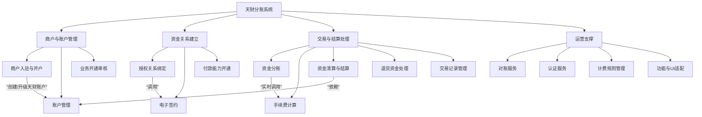
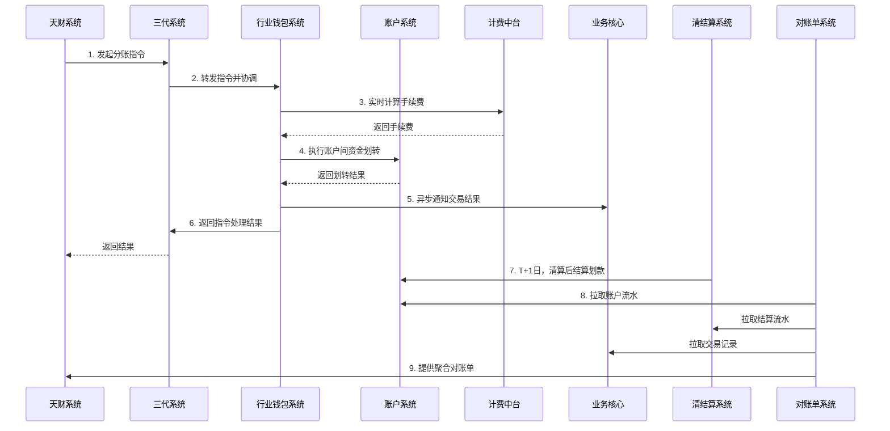

# 天财分账系统级设计文档

## 2.1 系统结构

天财分账系统是一个服务于连锁商户资金归集、分账、结算的复杂金融业务平台。系统采用分层、模块化的微服务架构，以**三代系统**作为业务入口与流程协调中心，以**行业钱包系统**作为核心业务逻辑处理器，以**账户系统**和**清结算系统**作为资金处理与记账核心，并通过一系列支撑系统（如认证、计费、电子签约）确保业务的安全、合规与稳定运行。

**系统架构图 (C4 Container Level)**

```mermaid
graph TB
    subgraph “外部系统/用户”
        A1[“天财商龙系统(H5/API)”]
        A2[“商户(钱包APP/商服平台)”]
        A3[“内部运营平台”]
    end

    subgraph “业务接入与适配层”
        B1[“天财业务适配模块”]
        B2[“三代系统 - 天财分账模块”]
    end

    subgraph “核心业务处理层”
        C1[“行业钱包系统”]
        C2[“账户系统”]
        C3[“清结算系统”]
        C4[“业务核心”]
    end

    subgraph “支撑服务层”
        D1[“认证系统”]
        D2[“电子签约平台”]
        D3[“计费中台 - 天财模块”]
        D4[“对账单系统”]
    end

    subgraph “基础设施”
        E1[“消息队列(MQ/Kafka)”]
        E2[“数据库(MySQL)”]
        E3[“缓存(Redis)”]
        E4[“风控系统”]
    end

    A1 -- “分账指令/业务查询” --> B2
    A2 -- “功能入口/业务办理” --> B1
    A3 -- “业务审核/配置” --> B2
    B1 -- “业务跳转/权限校验” --> B2
    B2 -- “协调业务流程” --> C1
    C1 -- “账户操作/资金划转” --> C2
    C1 -- “清算/结算/退货处理” --> C3
    C1 -- “交易记录持久化” --> C4
    C1 -- “计算手续费” --> D3
    C1 -- “发起签约/认证” --> D2
    D2 -- “调用身份认证” --> D1
    C3 -- “同步账户配置” --> C2
    C4 -- “提供交易数据” --> D4
    C2 -- “提供账户流水” --> D4
    C3 -- “提供结算流水” --> D4
    
    B2 -. “异步消息” .-> E1
    C1 -. “异步消息” .-> E1
    D3 -. “规则缓存” .-> E3
    C1 -. “风控校验” .-> E4
    C3 -. “风控校验” .-> E4

    style B2 fill:#e1f5fe
    style C1 fill:#f1f8e9
    style C2 fill:#fff3e0
    style C3 fill:#fce4ec
```

*   **业务接入与适配层**：负责与外部用户和系统交互，进行权限控制、界面适配和业务流程的初步引导。
*   **核心业务处理层**：承载最核心的业务逻辑，包括账户体系管理、资金流转指令处理、清算结算计算等。
*   **支撑服务层**：提供业务运行所需的通用能力，如身份核验、合同签约、费用计算、数据聚合对账等。
*   **基础设施**：为上层服务提供通用的技术支撑能力。

## 2.2 功能结构

系统功能围绕“天财分账”业务的生命周期进行组织，主要分为商户与账户管理、资金关系建立、交易与结算处理、运营支撑四大功能域。

**功能结构图**



*   **商户与账户管理**：实现商户信息的维护、专用账户的创建/升级/标记，以及业务申请的审核流程。
*   **资金关系建立**：处理资金归集、批量付款等场景下，付方与收方之间授权关系的建立、电子协议签署及付款能力开通。
*   **交易与结算处理**：涵盖从分账指令发起、手续费计算、资金实际划转，到日终清算、结算，以及异常场景（如退货）资金处理的完整链条。
*   **运营支撑**：提供系统运行所必需的辅助功能，包括数据对账、用户身份认证、计费规则配置以及面向不同渠道的界面与功能适配。

## 2.3 网络拓扑图

系统部署在私有云或金融云环境内，采用典型的微服务网络拓扑。外部流量通过**API网关**统一接入，内部服务间通过**服务网格**或内部负载均衡进行通信。敏感数据交互使用内网隔离区域。

```mermaid
graph TB
    subgraph “互联网区 (DMZ)”
        GW[API网关/负载均衡]
    end

    subgraph “应用服务区”
        AppCluster[应用服务集群<br/>三代/钱包/账户等模块]
        MQ[消息中间件集群]
        Cache[缓存集群]
    end

    subgraph “数据存储区”
        DB[数据库集群 (主从/分库)]
        FileStore[文件存储]
    end

    subgraph “外部服务区”
        Ext1[“第三方人脸服务”]
        Ext2[短信网关]
    end

    Internet -- “HTTPS” --> GW
    GW -- “内部路由” --> AppCluster
    AppCluster -- “服务调用” --> AppCluster
    AppCluster -- “生产/消费消息” --> MQ
    AppCluster -- “读写缓存” --> Cache
    AppCluster -- “数据持久化” --> DB
    AppCluster -- “生成账单文件” --> FileStore
    AppCluster -- “外部API调用” --> Ext1 & Ext2
    
    style AppCluster fill:#f5f5f5
    style DB fill:#e8f5e8
```

*   **安全分层**：互联网区、应用服务区、数据存储区之间通过防火墙进行隔离，遵循最小权限原则配置访问策略。
*   **高可用**：关键组件如应用服务、数据库、消息队列均采用集群化部署，避免单点故障。
*   **外部集成**：与第三方服务（如人脸核验）的调用通过专线或安全网关进行，确保通信安全与可控。

## 2.4 数据流转

数据流转主要围绕“资金”和“业务状态”两条主线，在商户发起业务到最终完成对账的完整周期内，跨越多个系统。

**核心业务数据流图 (资金分账场景)**



**关键数据流说明：**
1.  **业务指令流**：从天财系统发起，经三代系统协调，由行业钱包系统执行核心逻辑。
2.  **资金流**：行业钱包系统调用账户系统完成实时分账；清结算系统在约定周期调用账户系统完成与商户的结算。
3.  **费用流**：行业钱包在处理交易时实时调用计费中台计算手续费。
4.  **数据持久化流**：交易关键信息由业务核心持久化；各系统产生的流水（账户、结算）最终由对账单系统聚合，供下游对账。

## 2.5 系统模块交互关系

各模块通过同步API调用和异步消息协作，共同完成业务。下图概括了主要模块间的调用与依赖关系。

**模块交互依赖图**

```mermaid
graph LR
    G3[“三代系统<br/>(协调入口)”]
    W[“行业钱包系统<br/>(核心处理器)”]
    A[“账户系统<br/>(账务核心)”]
    S[“清结算系统<br/>(资金中枢)”]
    BC[“业务核心<br/>(数据持久化)”]
    D[“对账单系统<br/>(数据聚合)”]
    F[“计费中台<br/>(费用计算)”]
    ESign[“电子签约平台<br/>(签约认证)”]
    Auth[“认证系统<br/>(身份核验)”]
    Adapter[“天财业务适配模块<br/>(前端适配)”]

    G3 -- “1. 驱动开户、绑关系、<br/>交易等全流程” --> W
    W -- “2. 账户操作、资金划转” --> A
    W -- “3. 发起清算结算、退货处理” --> S
    W -- “4. 持久化交易记录” --> BC
    W -- “5. 实时计算手续费” --> F
    W -- “6. 发起签约流程” --> ESign
    S -- “7. 同步商户结算账户” --> A
    S -- “8. 触发结算、扣退款” --> A
    ESign -- “9. 调用身份认证” --> Auth
    D -- “10. 拉取交易数据” --> BC
    D -- “11. 拉取账户流水” --> A
    D -- “12. 拉取结算流水” --> S
    Adapter -- “13. 功能鉴权与跳转” --> G3
    
    style W fill:#fff3e0
    style G3 fill:#e1f5fe
```

**关键交互关系说明：**
1.  **三代系统驱动**：作为总协调者，接收外部请求，并调用行业钱包系统执行具体业务。
2.  **行业钱包为核心**：是业务逻辑的集大成者，串联起账户、清算、计费、签约等所有关键操作。
3.  **账户系统为基石**：提供统一的账户模型和资金操作原子接口，被钱包和清结算系统频繁调用。
4.  **清结算系统承上启下**：接收钱包系统的业务触发，在自有周期内完成资金轧差和结算，并最终调用账户系统完成出款。
5.  **数据汇聚于对账**：业务核心、账户系统、清结算系统作为数据生产者，对账单系统作为消费者，汇聚数据生成统一视图。
6.  **签约与认证联动**：电子签约平台在签约流程中，依赖认证系统完成用户强身份验证，确保法律关系成立。