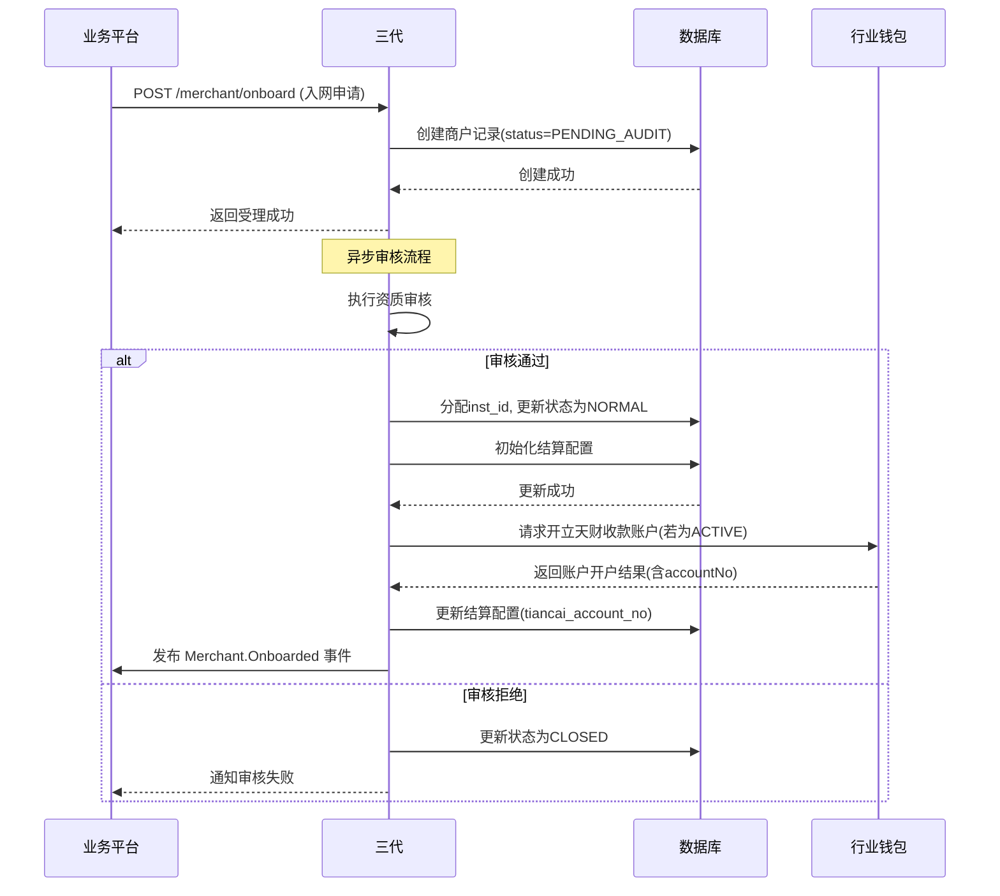
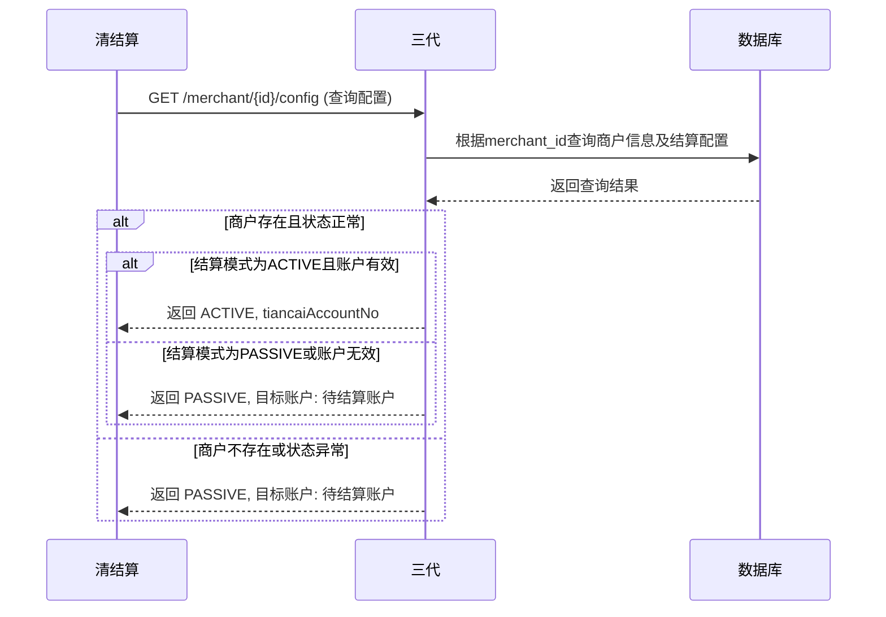

# 模块设计: 三代

生成时间: 2026-01-22 15:45:14
批判迭代: 2

---

# 模块设计: 三代

生成时间: TBD
批判迭代: TBD

---

# 三代模块设计文档

## 1. 概述
- **目的与范围**: 本模块是拉卡拉支付系统中的一个核心系统或服务层，负责处理商户入网审核、开户、配置同步等核心业务逻辑。它为天财平台提供商户信息管理、结算模式配置查询等服务，是连接业务平台与底层支付能力的关键枢纽。

## 2. 接口设计
- **API端点 (REST)**:
    - `POST /api/v1/merchant/onboard`: 接收商户入网申请。
    - `GET /api/v1/merchant/{merchantId}/config`: 查询商户状态及结算配置。
    - `PUT /api/v1/merchant/{merchantId}/status`: 更新商户状态（如冻结、注销）。
    - `PUT /api/v1/merchant/{merchantId}/settlement-config`: 更新商户结算配置。
- **请求/响应结构**:
    - 商户入网请求 (`POST /api/v1/merchant/onboard`):
        ```json
        {
          "requestId": "string",
          "merchantName": "string",
          "merchantType": "ENTERPRISE/INDIVIDUAL",
          "businessLicenseNo": "string",
          "contactInfo": "object",
          "settlementMode": "ACTIVE/PASSIVE"
        }
        ```
    - 商户配置查询响应 (`GET /api/v1/merchant/{merchantId}/config`):
        ```json
        {
          "code": "string",
          "message": "string",
          "data": {
            "merchantId": "string",
            "instId": "string",
            "merchantStatus": "NORMAL/FROZEN/CLOSED",
            "settlementMode": "ACTIVE/PASSIVE",
            "tiancaiAccountNo": "string"
          }
        }
        ```
    - 商户状态更新请求 (`PUT /api/v1/merchant/{merchantId}/status`):
        ```json
        {
          "requestId": "string",
          "targetStatus": "FROZEN/CLOSED/ACTIVE",
          "reason": "string"
        }
        ```
    - 结算配置更新请求 (`PUT /api/v1/merchant/{merchantId}/settlement-config`):
        ```json
        {
          "requestId": "string",
          "settlementMode": "ACTIVE/PASSIVE",
          "tiancaiAccountNo": "string"
        }
        ```
- **发布/消费的事件**:
    - 发布事件: `Merchant.Onboarded` (商户入网审核通过事件)，`Merchant.Status.Updated` (商户状态变更事件)，`Merchant.SettlementConfig.Updated` (结算配置变更事件)。
    - 消费事件: TBD

## 3. 数据模型
- **表/集合**:
    - `merchant_info`: 商户主信息表。
    - `merchant_settlement_config`: 商户结算配置表。
    - `merchant_audit_log`: 商户审核日志表。
- **关键字段**:
    - `merchant_info`:
        - `id` (主键)
        - `merchant_id` (商户标识，唯一)
        - `inst_id` (机构号，唯一)
        - `merchant_name` (商户名称)
        - `merchant_type` (商户类型: ENTERPRISE/INDIVIDUAL)
        - `business_license_no` (营业执照号)
        - `status` (状态: PENDING_AUDIT/NORMAL/FROZEN/CLOSED)
        - `created_time`
        - `updated_time`
    - `merchant_settlement_config`:
        - `id` (主键)
        - `merchant_id` (外键，关联 merchant_info)
        - `settlement_mode` (结算模式: ACTIVE/PASSIVE)
        - `tiancai_account_no` (天财收款账户号，当 settlement_mode=ACTIVE 时必填)
        - `created_time`
        - `updated_time`
    - `merchant_audit_log`:
        - `id` (主键)
        - `merchant_id` (外键，关联 merchant_info)
        - `audit_action` (审核动作: SUBMIT/APPROVE/REJECT)
        - `audit_operator` (审核人)
        - `audit_comment` (审核意见)
        - `created_time`
- **与其他模块的关系**: `merchant_settlement_config` 中的 `tiancai_account_no` 关联**账户系统**中的账户记录。本模块为**清结算**模块提供商户状态及结算配置的查询服务。

## 4. 业务逻辑
- **核心工作流/算法**:
    1.  **商户入网与审核**:
        - 接收入网申请，创建商户记录，初始状态为 `PENDING_AUDIT`。
        - 执行资质审核（可人工或自动），审核通过后生成唯一的机构号 (`inst_id`)，更新商户状态为 `NORMAL`。
        - 根据申请中的结算模式，初始化结算配置。若为主动结算 (`ACTIVE`)，需等待**行业钱包**完成天财收款账户开户后，再更新 `tiancai_account_no`。
        - 发布 `Merchant.Onboarded` 事件。
    2.  **商户信息管理**:
        - 提供商户状态查询接口。
        - 处理商户状态变更（如冻结、注销）。状态变更时，需检查是否存在进行中的业务（如结算），并发布 `Merchant.Status.Updated` 事件。
    3.  **结算配置管理**:
        - 为收单商户配置结算模式（主动结算或被动结算）。
        - 当结算模式为主动结算时，需关联其天财收款账户信息。此信息可能由**行业钱包**在开户后异步通知。
        - 结算配置变更时，发布 `Merchant.SettlementConfig.Updated` 事件。
    4.  **配置查询服务**:
        - 为**清结算**等下游模块提供商户状态及结算配置的查询服务。
        - 根据商户标识查询，若商户不存在或未配置结算模式，则返回默认的被动结算 (`PASSIVE`) 模式。
- **业务规则与验证**:
    - 机构号 (`inst_id`) 由三代运营分配，是商户在天财平台下的唯一标识。
    - 只有收单商户（企业或个体）才能开通天财收款账户并配置主动结算。
    - 商户状态异常（如冻结）时，其关联的结算、分账等业务应被限制。
    - 结算配置更新时，需验证商户状态是否为正常 (`NORMAL`)。
- **关键边界情况处理**:
    - 查询商户配置时，若商户不存在或未配置结算模式，返回默认结算模式 (`PASSIVE`) 及空的目标账户。
    - 商户状态变更（如冻结）时，需考虑对正在进行的业务流程（如结算）的影响，通过事件通知相关系统。
    - 入网审核失败时，需清理相关临时数据。
- **并发与一致性**:
    - 商户状态、结算配置的更新操作使用乐观锁（`version`字段）防止并发更新冲突。
    - 关键业务流程（如入网审核）通过本地事务确保数据一致性。
- **数据生命周期管理**:
    - 商户数据根据监管要求设置保留期限（如5年）。
    - 已注销的商户数据可归档至历史库。

## 5. 时序图

### 5.1 商户入网与审核时序图


### 5.2 清结算查询配置时序图


## 6. 错误处理
- **预期错误情况与错误码**:
    - `MERCHANT_NOT_FOUND` (404): 商户不存在。
    - `MERCHANT_STATUS_INVALID` (409): 商户状态异常，不允许当前操作（如冻结状态下更新配置）。
    - `SETTLEMENT_CONFIG_INVALID` (400): 结算配置无效（如ACTIVE模式未提供天财账户）。
    - `INST_ID_ALREADY_EXISTS` (409): 机构号已存在（并发冲突）。
    - `AUDIT_OPERATION_DENIED` (403): 审核操作被拒绝（如重复审核）。
    - `DATABASE_OPERATION_FAILED` (500): 数据库操作异常。
- **处理策略**:
    - 对于业务错误（如商户不存在、状态无效），返回明确的错误码和信息，不进行重试。
    - 对于数据库操作失败等系统级错误，记录详细日志并触发告警，向上游返回系统错误，建议其稍后重试。
    - 通过 `requestId` 保证请求的幂等性，防止重复创建或更新。
    - 关键业务操作（如状态变更）记录审计日志 (`merchant_audit_log`)。

## 7. 依赖关系
- **上游模块**:
    - **业务平台** (如天财): 发起商户入网申请、状态查询与更新请求。
    - **行业钱包**: 为主动结算的商户开立天财收款账户，并异步通知账户号。
- **下游模块**:
    - **清结算**: 查询商户结算配置以执行结算入账。
- **交互说明**: 本模块作为商户信息与配置的管理中心，为**清结算**模块提供同步查询服务，是决定资金结算流向（至天财收款账户或待结算账户）的关键依据。与**行业钱包**的交互涉及异步开户及通知。