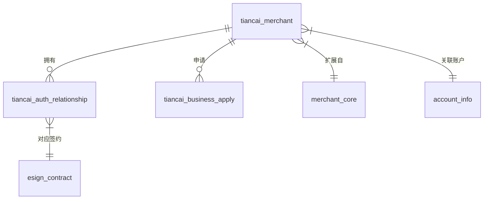
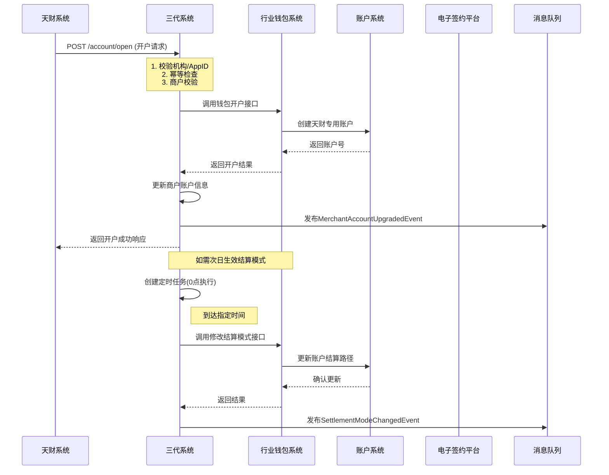
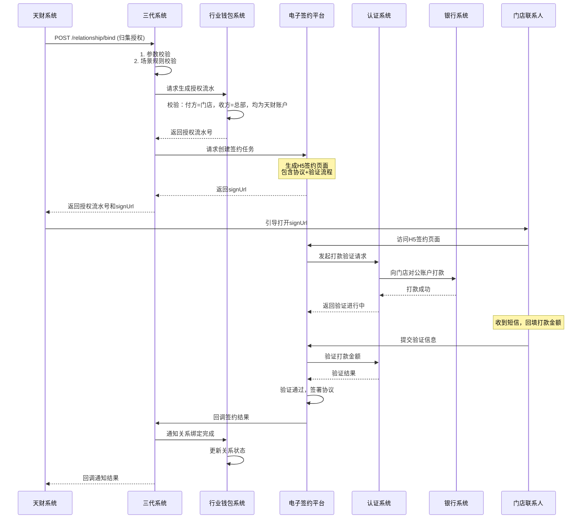

# 模块设计: 三代系统

生成时间: 2026-01-16 16:44:49

---

# 三代系统 - 天财分账模块设计文档

## 1. 概述

### 1.1 目的
本模块是三代系统为支持“天财商龙”分账业务而设计的核心业务模块。它作为天财业务在三代系统的入口和协调中心，负责处理商户开户、关系绑定、业务开通、退货模式配置等关键业务流程，并与行业钱包系统、账户系统、清结算系统等多个下游系统协同，实现资金归集、批量付款、会员结算等分账场景。

### 1.2 范围
- **商户管理**：为天财机构下的收单商户开通或升级“天财专用账户”（收款账户/接收方账户）。
- **业务开通与审核**：管理天财分账业务的线上审核、签约流程。
- **关系绑定**：处理归集、批量付款、会员结算场景下的授权关系建立与认证。
- **退货模式管理**：为天财商户配置和管理退货资金扣款路径。
- **接口网关**：作为天财系统与拉卡拉内部系统（钱包、账户、清结算等）交互的统一入口，进行权限校验、参数转换和路由。
- **数据同步与查询**：提供账户动账明细等查询接口，并参与对账单数据的组织。

### 1.3 核心原则
- **入口唯一性**：所有天财发起的业务请求，必须通过三代系统提供的专用接口进入。
- **强校验与隔离**：通过机构号、AppID严格限制调用方，确保业务数据隔离。
- **流程驱动**：业务开通遵循“开户 -> (开通付款) -> 关系绑定”的标准流程。
- **向下兼容**：支持老商户向天财专用账户模式的平滑迁移（升级或新开）。

## 2. 接口设计

### 2.1 API端点 (RESTful)

#### 2.1.1 商户开户接口
- **端点**: `POST /api/v1/tiancai/account/open`
- **描述**: 为收单商户开立或升级天财专用账户。
- **调用方**: 天财系统（通过机构号和AppID鉴权）
- **请求头**:
    - `X-App-Id`: 天财应用ID
    - `X-Org-No`: 天财机构号
    - `Authorization`: Bearer Token
- **请求体**:
```json
{
  "requestId": "TC20240115001", // 请求流水号，幂等键
  "merchantNo": "888000000001", // 收单商户号
  "operationType": "OPEN | UPGRADE", // 操作类型：新开 / 升级
  "accountType": "RECEIVE | RECEIVER", // 账户类型：收款账户 / 接收方账户
  "roleType": "HEADQUARTERS | STORE", // 角色类型：总部 / 门店 (仅收款账户需传)
  "settlementMode": "ACTIVE", // 结算模式，开户固定为ACTIVE
  "baseInfo": { // 商户基础信息（升级时部分可选）
    "merchantName": "xx餐饮总部",
    "legalPerson": "张三",
    "idCardNo": "110101199001011234",
    "contactPhone": "13800138000"
  },
  "bankCardInfo": { // 银行卡信息（接收方账户必传）
    "cardNo": "6228480012345678901",
    "bankName": "中国农业银行",
    "branchName": "北京分行",
    "isDefault": true
  },
  "effectiveTime": "2024-01-16 00:00:00" // 期望生效时间
}
```
- **响应体** (成功):
```json
{
  "code": "SUCCESS",
  "message": "成功",
  "data": {
    "requestId": "TC20240115001",
    "merchantNo": "888000000001",
    "tiancaiAccountNo": "TC888000000001R01", // 天财专用账户号
    "accountType": "RECEIVE",
    "status": "SUCCESS",
    "openTime": "2024-01-15 14:30:00"
  }
}
```

#### 2.1.2 关系绑定（签约与认证）接口
- **端点**: `POST /api/v1/tiancai/relationship/bind`
- **描述**: 发起归集、批量付款或会员结算场景下的授权关系建立流程。
- **请求体**:
```json
{
  "requestId": "TC20240115002",
  "scene": "COLLECTION | BATCH_PAY | MEMBER_SETTLEMENT", // 场景
  "initiatorMerchantNo": "888000000001", // 发起方商户号（总部）
  "initiatorMerchantName": "xx餐饮总部",
  "payerMerchantNo": "888000000002", // 付方商户号
  "payerMerchantName": "xx餐饮北京店",
  "payeeMerchantNo": "888000000001", // 收方商户号
  "payeeMerchantName": "xx餐饮总部",
  "authorizationContact": {
    "name": "李四",
    "phone": "13900139000",
    "idCardNo": "110101199002022345"
  },
  "collectionInfo": { // 归集场景特有
    "collectionMode": "FIXED_AMOUNT | PROPORTION", // 归集模式
    "maxProportion": 100, // 订单归集最高比例（%）
    "payerSettleAccountName": "xx餐饮北京店",
    "payerSettleCardNo": "6228480012345678902"
  },
  "capitalPurpose": "资金归集", // 资金用途
  "callbackUrl": "https://tiancai.com/callback" // 签约结果回调地址
}
```
- **响应体**:
```json
{
  "code": "SUCCESS",
  "message": "成功",
  "data": {
    "requestId": "TC20240115002",
    "authFlowNo": "AUTH202401150001", // 授权流水号
    "signUrl": "https://esign.lkl.com/h5/xxx", // H5签约页面URL（返回给天财引导用户操作）
    "expireTime": "2024-01-15 15:30:00"
  }
}
```

#### 2.1.3 业务开通审核接口
- **端点**: `POST /api/v1/tiancai/business/audit`
- **描述**: 业务运营人员审核天财商户的业务开通申请（线上自动审核流程）。
- **权限**: 内部运营系统调用
- **请求体**:
```json
{
  "applyNo": "APPLY20240115001", // 申请单号
  "merchantNo": "888000000001",
  "businessType": "TIANCAI_ACCOUNT", // 业务类型
  "auditResult": "PASS | REJECT",
  "auditComment": "资料齐全，符合要求",
  "auditor": "admin01"
}
```

#### 2.1.4 查询接口
- **端点**: `GET /api/v1/tiancai/query/account-details`
- **描述**: 查询待结算账户或收款账户的动账明细（供天财对账使用，需评估频率）。
- **请求参数**:
```
merchantNo=888000000001&accountType=PENDING|RECEIVE&startDate=2024-01-14&endDate=2024-01-15&pageNo=1&pageSize=100
```

### 2.2 发布/消费的事件

#### 2.2.1 发布的事件
1. **MerchantAccountUpgradedEvent** (商户账户升级事件)
   - **触发时机**: 普通收款账户成功升级为天财收款账户后。
   - **数据**:
   ```json
   {
     "eventId": "event_001",
     "eventType": "MERCHANT_ACCOUNT_UPGRADED",
     "timestamp": "2024-01-15T14:30:00Z",
     "data": {
       "merchantNo": "888000000001",
       "oldAccountNo": "ORD888000000001",
       "newAccountNo": "TC888000000001R01",
       "upgradeTime": "2024-01-15T14:30:00Z"
     }
   }
   ```

2. **BusinessAuditPassedEvent** (业务审核通过事件)
   - **触发时机**: 天财业务开通申请审核通过后。
   - **消费者**: 行业钱包系统（触发开户）、消息中心（通知天财）。

#### 2.2.2 消费的事件
1. **WalletAccountOpenedEvent** (钱包账户开立事件)
   - **发布方**: 行业钱包系统
   - **动作**: 更新本地商户的天财账户号，并回调通知天财系统。

2. **SigningCompletedEvent** (电子签约完成事件)
   - **发布方**: 电子签约平台
   - **动作**: 更新关系绑定状态，并回调通知天财系统。

## 3. 数据模型

### 3.1 核心表设计

#### 表: `tiancai_merchant` (天财商户信息表)
| 字段名 | 类型 | 必填 | 描述 | 索引 |
|--------|------|------|------|------|
| id | bigint | Y | 主键 | PK |
| merchant_no | varchar(32) | Y | 收单商户号 | UK |
| org_no | varchar(16) | Y | 所属机构号（天财） | IDX |
| merchant_name | varchar(128) | Y | 商户全称 | |
| role_type | tinyint | N | 角色类型：1-总部，2-门店 | IDX |
| merchant_type | varchar(16) | Y | 商户性质：ENTERPRISE/INDIVIDUAL | |
| tiancai_account_no | varchar(32) | N | 天财专用账户号 | UK |
| account_type | tinyint | N | 账户类型：1-收款账户，2-接收方账户 | |
| settlement_mode | tinyint | Y | 结算模式：1-主动，2-被动 | |
| refund_mode | varchar(32) | Y | 退货模式 | |
| status | tinyint | Y | 状态：1-正常，2-冻结，0-注销 | IDX |
| create_time | datetime | Y | 创建时间 | |
| update_time | datetime | Y | 更新时间 | |

#### 表: `tiancai_auth_relationship` (授权关系表)
| 字段名 | 类型 | 必填 | 描述 | 索引 |
|--------|------|------|------|------|
| id | bigint | Y | 主键 | PK |
| auth_flow_no | varchar(32) | Y | 授权流水号 | UK |
| scene | varchar(32) | Y | 场景：COLLECTION/BATCH_PAY/MEMBER_SETTLEMENT | IDX |
| initiator_merchant_no | varchar(32) | Y | 发起方商户号 | IDX |
| payer_merchant_no | varchar(32) | Y | 付方商户号 | IDX |
| payee_merchant_no | varchar(32) | Y | 收方商户号 | IDX |
| capital_purpose | varchar(64) | Y | 资金用途 | |
| auth_contact_name | varchar(64) | Y | 授权联系人姓名 | |
| auth_contact_phone | varchar(16) | Y | 授权联系人手机 | |
| auth_contact_id_card | varchar(32) | N | 授权联系人身份证 | |
| sign_status | tinyint | Y | 签约状态：0-初始化，1-已发送，2-已完成，3-已过期，4-已拒绝 | IDX |
| sign_url | varchar(512) | N | 签约H5 URL | |
| expire_time | datetime | Y | 签约过期时间 | |
| complete_time | datetime | N | 签约完成时间 | |
| create_time | datetime | Y | 创建时间 | |

#### 表: `tiancai_business_apply` (业务开通申请表)
| 字段名 | 类型 | 必填 | 描述 | 索引 |
|--------|------|------|------|------|
| id | bigint | Y | 主键 | PK |
| apply_no | varchar(32) | Y | 申请单号 | UK |
| merchant_no | varchar(32) | Y | 商户号 | IDX |
| business_type | varchar(32) | Y | 业务类型 | |
| apply_source | varchar(16) | Y | 申请来源：TIANCAI/OPERATION | |
| apply_data | json | Y | 申请资料（结构化存储） | |
| audit_status | tinyint | Y | 审核状态：0-待审核，1-通过，2-拒绝 | IDX |
| audit_comment | varchar(256) | N | 审核意见 | |
| auditor | varchar(32) | N | 审核人 | |
| audit_time | datetime | N | 审核时间 | |
| create_time | datetime | Y | 创建时间 | |

#### 表: `tiancai_interface_log` (接口调用日志表)
| 字段名 | 类型 | 必填 | 描述 | 索引 |
|--------|------|------|------|------|
| id | bigint | Y | 主键 | PK |
| request_id | varchar(64) | Y | 请求流水号（幂等键） | UK |
| app_id | varchar(32) | Y | 调用方AppID | IDX |
| org_no | varchar(16) | Y | 机构号 | IDX |
| interface_name | varchar(64) | Y | 接口名称 | |
| request_params | json | Y | 请求参数 | |
| response_result | json | N | 响应结果 | |
| status | tinyint | Y | 状态：1-成功，0-失败 | |
| error_code | varchar(32) | N | 错误码 | |
| error_message | varchar(256) | N | 错误信息 | |
| cost_time | int | Y | 耗时(ms) | |
| create_time | datetime | Y | 创建时间 | IDX |

### 3.2 与其他模块的关系


- **merchant_core**: 三代系统核心商户表，`tiancai_merchant.merchant_no` 外键关联。
- **account_info**: 账户系统账户基础信息表，`tiancai_merchant.tiancai_account_no` 关联。
- **esign_contract**: 电子签约平台合同表，`tiancai_auth_relationship.auth_flow_no` 关联。

## 4. 业务逻辑

### 4.1 核心算法与流程

#### 4.1.1 开户流程逻辑
```python
def open_tiancai_account(request):
    # 1. 接口级校验
    validate_app_id_and_org(request.app_id, request.org_no)  # 必须为天财机构
    
    # 2. 幂等性检查
    if check_request_id_exists(request.request_id):
        return get_previous_response(request.request_id)
    
    # 3. 商户基础校验
    merchant = get_merchant_by_no(request.merchant_no)
    if not merchant:
        raise MerchantNotFoundException()
    
    if merchant.org_no != request.org_no:
        raise MerchantNotBelongToOrgException()
    
    # 4. 业务规则校验
    if request.operation_type == "OPEN":
        # 新开：检查是否已存在天财账户
        if merchant.tiancai_account_no:
            raise TiancaiAccountAlreadyExistsException()
    elif request.operation_type == "UPGRADE":
        # 升级：检查是否普通收款账户且未冻结
        if not merchant.is_normal_receive_account():
            raise CannotUpgradeException()
        if merchant.status == FROZEN:
            raise MerchantFrozenException()
    
    # 5. 调用行业钱包系统开户/升级
    wallet_request = build_wallet_open_request(request, merchant)
    wallet_response = call_wallet_system(wallet_request)
    
    # 6. 更新本地记录
    update_merchant_tiancai_account(merchant, wallet_response)
    
    # 7. 设置结算模式切换任务（如需次日生效）
    if request.effective_time:
        schedule_settlement_mode_change(merchant, request.effective_time)
    
    # 8. 发布事件，通知相关方
    publish_account_opened_event(merchant, wallet_response)
    
    return build_success_response(wallet_response)
```

#### 4.1.2 关系绑定校验逻辑
```python
def validate_relationship_bind(request):
    # 场景-specific 校验
    if request.scene == "COLLECTION":
        # 归集场景
        # 1. 付方必须是门店，收方必须是总部
        payer = get_tiancai_merchant(request.payer_merchant_no)
        payee = get_tiancai_merchant(request.payee_merchant_no)
        
        if payer.role_type != STORE or payee.role_type != HEADQUARTERS:
            raise InvalidRoleForCollectionException()
        
        # 2. 收方必须是企业性质
        if payee.merchant_type != ENTERPRISE:
            raise PayeeMustBeEnterpriseException()
        
        # 3. 发起方必须是收方（总部自己发起）
        if request.initiator_merchant_no != request.payee_merchant_no:
            raise InitiatorMustBePayeeException()
        
        # 4. 收付方必须都是天财收款账户
        if payer.account_type != RECEIVE_ACCOUNT or payee.account_type != RECEIVE_ACCOUNT:
            raise MustBeTiancaiReceiveAccountException()
    
    elif request.scene == "BATCH_PAY":
        # 批量付款场景
        # 1. 付方必须是总部
        payer = get_tiancai_merchant(request.payer_merchant_no)
        if payer.role_type != HEADQUARTERS:
            raise PayerMustBeHeadquartersException()
        
        # 2. 检查付方是否已开通付款能力
        if not payer.payment_capability_enabled:
            raise PaymentCapabilityNotEnabledException()
    
    # 通用校验：检查是否已存在有效关系
    existing_relation = get_active_relationship(
        request.payer_merchant_no, 
        request.payee_merchant_no, 
        request.scene
    )
    if existing_relation:
        raise RelationshipAlreadyExistsException()
```

### 4.2 业务规则

1. **开户规则**:
   - 一个收单商户只能开立一个天财收款账户。
   - 天财接收方账户支持绑定多张银行卡，需设置默认提现卡。
   - 老商户升级时，原收款账户余额需在切换时点前全部结算/提现完毕。
   - 天财机构下的新商户，默认退货模式为“终点账户+退货账户”。

2. **关系绑定规则**:
   - 归集关系：门店（付方）← 总部（收方），需门店授权联系人完成打款验证+协议签署。
   - 批量付款：总部（付方）→ 接收方（收方），接收方为企业需打款验证，为个人/个体需人脸验证。
   - 会员结算：作为批量付款的特例，遵循相同规则。
   - 关系建立前，付方在批量付款和会员结算场景需先“开通付款”。

3. **权限规则**:
   - 所有天财专用接口必须通过机构号和AppID双重验证。
   - 只有天财机构下的商户才能开通天财专用账户。
   - 商户主被动结算模式切换，仅允许天财调用。

4. **时效规则**:
   - 电子签约H5链接有效期为1小时。
   - 结算模式切换可在指定时间（如次日0点）生效。

### 4.3 验证逻辑

1. **四要素验证**:
   - 天财接收方开户时，必须完成姓名、身份证号、银行卡号、手机号的四要素验证。
   - 验证通过后，银行卡信息才可绑定。

2. **打款验证**:
   - 对公企业认证使用打款验证，向对公账户打入随机金额（0.01-0.99元）。
   - 验证时需回填正确金额和备注。

3. **人脸验证**:
   - 个人/个体户认证使用人脸验证。
   - 调用认证系统接口，比对姓名、身份证、人脸信息一致性。

## 5. 时序图

### 5.1 天财收款账户开户时序图



### 5.2 关系绑定（归集场景）时序图



## 6. 错误处理

### 6.1 错误码设计

| 错误码 | HTTP状态码 | 描述 | 处理建议 |
|--------|------------|------|----------|
| TC_AUTH_001 | 401 | AppID或机构号无效 | 检查请求头中的认证信息 |
| TC_MERCHANT_002 | 400 | 商户不存在 | 检查商户号是否正确 |
| TC_MERCHANT_003 | 400 | 商户不属于该机构 | 确认商户与机构关系 |
| TC_ACCOUNT_004 | 400 | 天财账户已存在 | 无需重复开户 |
| TC_ACCOUNT_005 | 400 | 非普通账户，无法升级 | 检查账户类型 |
| TC_BUSINESS_006 | 400 | 业务申请待审核 | 等待审核完成 |
| TC_RELATION_007 | 400 | 场景角色不匹配 | 检查付方/收方角色 |
| TC_RELATION_008 | 400 | 关系已存在 | 无需重复绑定 |
| TC_VALIDATION_009 | 400 | 四要素验证失败 | 重新提交正确信息 |
| TC_SYSTEM_010 | 500 | 下游系统异常 | 重试或联系运维 |

### 6.2 异常处理策略

1. **幂等性保证**:
   - 所有写操作接口必须包含`requestId`。
   - 在`tiancai_interface_log`表中记录请求，实现天然幂等。
   - 重复请求直接返回之前的结果。

2. **下游系统降级**:
   - 调用行业钱包、账户系统等关键下游时，设置合理超时（如3秒）。
   - 部分查询类接口可返回缓存数据或默认值。
   - 开户等核心写操作，必须成功才能返回，否则明确失败。

3. **补偿机制**:
   - 对于异步流程（如签约），记录完整状态机。
   - 提供补偿查询接口，允许天财查询进度。
   - 定时任务扫描超时未完成流程，发送告警。

4. **数据一致性**:
   - 本地事务：数据库更新与日志记录在同一事务中。
   - 分布式事务：关键操作使用本地消息表+定时任务补偿。
   - 最终一致性：通过事件驱动，各系统异步同步状态。

## 7. 依赖说明

### 7.1 上游依赖

1. **天财系统**:
   - **交互方式**: REST API调用
   - **职责**: 业务发起方，提供商户资料、发起开户、关系绑定等请求。
   - **数据流**: 商户信息、业务请求、回调通知。
   - **SLA要求**: 接口响应时间<1s，可用性99.9%。

2. **内部运营系统**:
   - **交互方式**: REST API / 数据库直连
   - **职责**: 提供业务审核功能，传递审核结果。
   - **数据流**: 审核申请、审核结果。

### 7.2 下游依赖

1. **行业钱包系统**:
   - **交互方式**: RPC / REST
   - **职责**: 处理天财专用账户的开户、升级、关系绑定核心校验。
   - **关键接口**: 
     - `openTiancaiAccount`: 开户/升级
     - `createAuthRelationship`: 创建授权关系
     - `updateSettlementMode`: 修改结算模式
   - **异常影响**: 开户、关系绑定功能不可用。

2. **账户系统**:
   - **交互方式**: 通过钱包系统间接调用
   - **职责**: 底层账户的创建、标记、账务处理。
   - **异常影响**: 账户无法开立，资金操作失败。

3. **电子签约平台**:
   - **交互方式**: REST API
   - **职责**: 提供H5签约页面，完成协议签署和身份验证。
   - **关键接口**: 
     - `createSignTask`: 创建签约任务
     - `querySignStatus`: 查询签约状态
   - **异常影响**: 关系绑定流程中断。

4. **认证系统**:
   - **交互方式**: 通过电子签约平台间接调用
   - **职责**: 提供打款验证、人脸验证能力。
   - **异常影响**: 身份验证无法完成。

5. **清结算系统**:
   - **交互方式**: REST API / 消息队列
   - **职责**: 处理退货资金扣款、提供结算明细。
   - **关键交互**: 
     - 退货前置查询终点账户
     - 获取结算明细用于对账
   - **异常影响**: 退货功能异常，对账数据不全。

6. **消息队列 (MQ)**:
   - **交互方式**: 事件发布/订阅
   - **职责**: 异步通知、系统解耦。
   - **关键事件**: 账户变更、关系绑定完成、审核通过等。

### 7.3 依赖管理策略

1. **超时与重试**:
   - 钱包系统: 超时3秒，重试2次
   - 电子签约: 超时5秒，重试1次
   - 清结算: 超时2秒，重试3次

2. **熔断与降级**:
   - 使用熔断器模式（如Hystrix）保护关键依赖。
   - 非核心功能（如部分查询）支持降级返回。

3. **监控与告警**:
   - 监控各依赖接口的响应时间、成功率。
   - 关键依赖失败时，即时告警（企业微信/短信）。
   - 每日依赖健康度报告。

---
**文档版本**: 1.0  
**最后更新**: 2024-01-15  
**维护团队**: 三代系统开发组