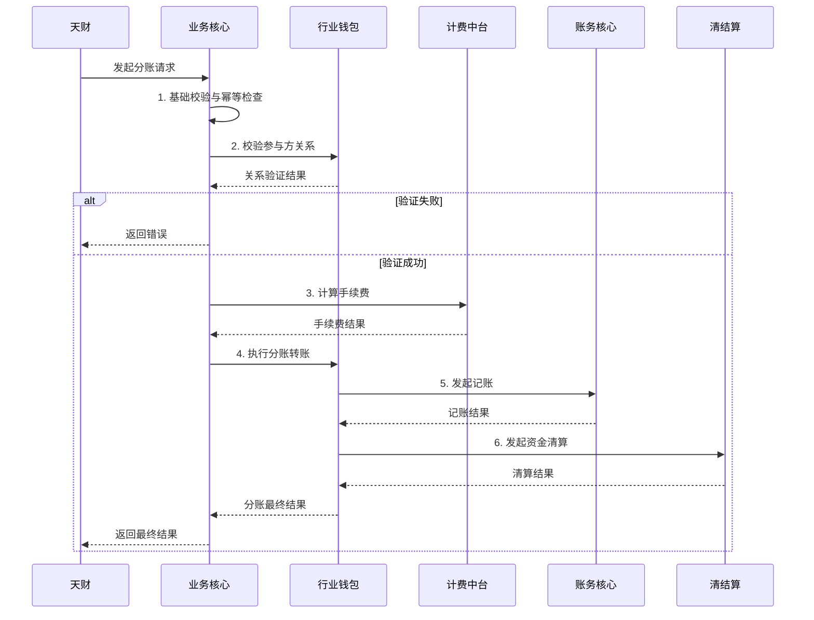

# 模块设计: 业务核心

生成时间: 2026-01-22 15:39:06
批判迭代: 2

---

# 业务核心模块设计文档

## 1. 概述
- **目的与范围**: 业务核心模块负责接收并处理天财分账交易数据。它是天财平台与下游资金处理系统之间的桥梁，主要职责是接收业务指令，进行必要的业务逻辑处理和数据转换，并协调后续的资金流转流程。其边界在于处理分账业务的数据流，不直接管理账户、不执行资金操作、不处理商户入网等上游流程。

## 2. 接口设计
- **API端点 (REST/GraphQL)**:
    - `POST /api/v1/business-core/split-order`: 接收天财发起的单笔分账请求。
    - `POST /api/v1/business-core/batch-payment`: 接收天财发起的批量付款请求。
    - `POST /api/v1/business-core/query-order`: 查询分账/付款订单状态。
- **请求/响应结构**:
    - 分账请求 (`split-order`):
        - 请求体: `{ "orderId": "string", "appId": "string", "instId": "string", "payerAccountNo": "string", "payeeAccountNo": "string", "amount": "number", "scene": "string", "idempotentKey": "string" }`
        - 响应体: `{ "code": "string", "msg": "string", "data": { "bizOrderNo": "string", "status": "string" } }`
    - 批量付款请求 (`batch-payment`): TBD
    - 订单查询请求 (`query-order`): TBD
- **发布/消费的事件**:
    - 消费事件: 监听来自**天财**的 `tiancai.split.request` 事件。
    - 发布事件: 发布 `business-core.split.processing`（处理中）、`business-core.split.success`（成功）、`business-core.split.failed`（失败）事件。

## 3. 数据模型
- **表/集合**:
    - `biz_order` (业务订单表): 存储所有分账/付款订单的核心信息。
    - `participant_relation` (参与方关系缓存表): 缓存已验证的参与方关系，用于加速校验。
- **关键字段**:
    - `biz_order` 表: `id` (主键), `biz_order_no` (业务订单号), `original_order_id` (天财原始订单号), `app_id`, `inst_id`, `payer_info`, `payee_info`, `amount`, `scene`, `status`, `idempotent_key`, `retry_count`, `next_retry_time`, `error_msg`, `created_at`, `updated_at`。
    - `participant_relation` 表: `id` (主键), `payer_inst_id`, `payee_inst_id`, `relation_type`, `is_valid`, `verified_at`, `expires_at`。
- **与其他模块的关系**: 接收来自**天财**的业务指令数据，处理后将分账指令传递给**行业钱包**执行资金划转。依赖**计费中台**计算手续费，依赖**账务核心**进行记账，依赖**清结算**完成资金清算。

## 4. 业务逻辑
- **核心工作流/算法**: 主要业务流程是处理**天财分账**。模块接收分账请求，验证业务数据的有效性（如机构号、金额、参与方关系），然后根据业务规则将请求转发至相应的下游系统（如行业钱包执行分账转账）。
- **业务规则与验证**:
    1.  **基础数据校验**: 校验请求参数完整性、金额格式、机构号(`inst_id`)和`app_id`有效性。
    2.  **参与方关系验证**: 根据业务场景（如**归集**、**会员结算**），调用**行业钱包**的`/wallet/api/relation/validate`接口，校验付款方与收款方之间是否已完成必要的**关系绑定**或**开通付款**流程。验证结果可缓存在`participant_relation`表中。
    3.  **幂等性校验**: 基于请求中的`idempotent_key`或`orderId`，检查`biz_order`表，防止重复处理。
    4.  **业务场景合规性**: 校验交易场景(`scene`)是否符合定义（如分账、归集、批量付款）。
- **关键边界情况处理**: 处理下游系统（如行业钱包、清结算）处理失败或超时的场景，需有重试或冲正机制。处理因**交易冻结**或**商户冻结**导致分账失败的情况。

## 5. 时序图

## 6. 错误处理
- **预期错误情况**: 可能的错误类型包括：业务数据校验失败（如无效机构号、金额错误）、参与方关系未绑定、下游系统服务不可用、处理超时、账户状态异常（如冻结）。
- **处理策略**:
    1.  **输入错误**: 立即返回错误信息，不生成业务订单。
    2.  **下游系统故障**:
        - **重试机制**: 对于网络超时或暂时性失败，更新`biz_order`表的`retry_count`和`next_retry_time`字段，采用指数退避策略进行重试，设置最大重试次数（如3次）。
        - **冲正机制**: 对于最终失败且已调用下游资金操作（如已记账）的订单，需根据`biz_order`记录发起反向冲正交易，调用相应系统的冲正接口。
    3.  **幂等性**: 所有请求必须携带`idempotent_key`，业务核心基于此键确保同一请求仅被处理一次。
    4.  **监控与通知**: 记录详细日志，对最终失败的订单进行告警并通知运营人员处理。

## 7. 依赖关系
- **上游模块**: **天财**（业务指令来源）。
- **下游模块**:
    - **行业钱包**（执行分账转账、参与方关系验证）
    - **清结算**（资金清算）
    - **计费中台**（手续费计算）
    - **账务核心**（记账）