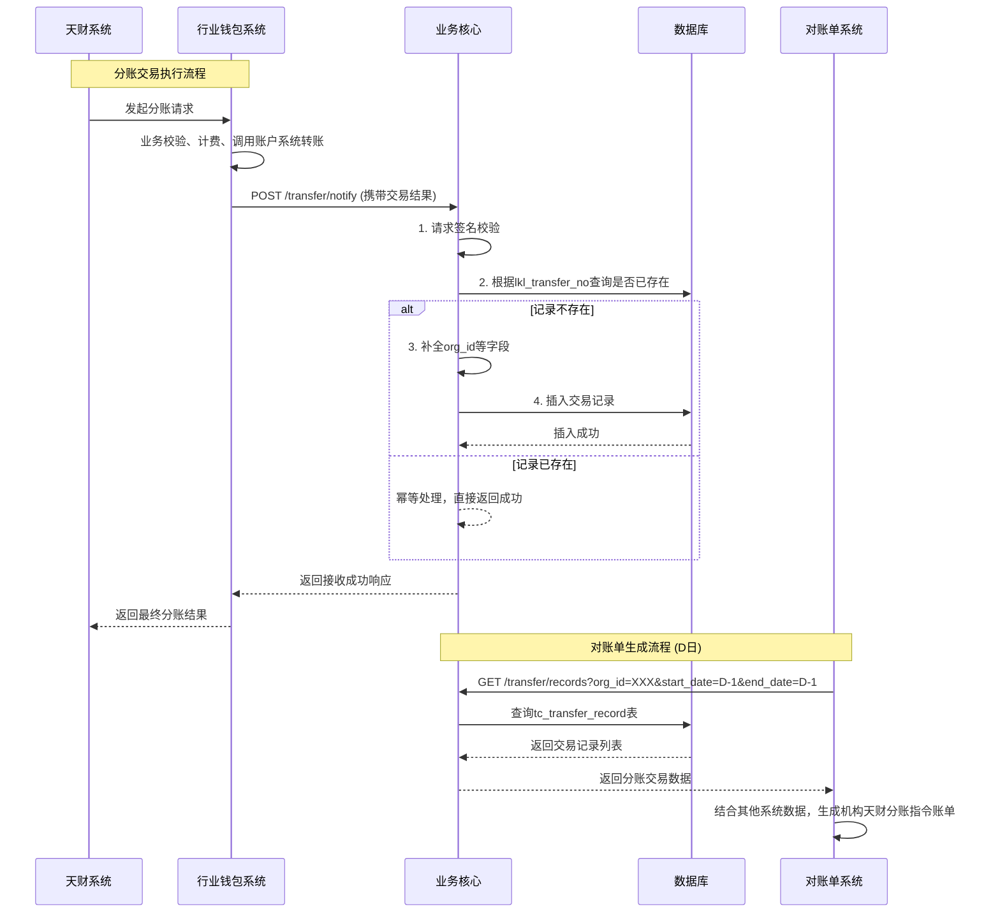

# 模块设计: 业务核心

生成时间: 2026-01-16 16:46:45

---

# 业务核心模块设计文档

## 1. 概述

### 1.1 目的
“业务核心”模块是天财分账业务体系中的核心交易记录与数据中枢。其主要目的是接收、持久化并管理由“行业钱包系统”发起的“天财分账”交易指令的完整信息，为下游的“对账单系统”提供准确、可靠的交易数据源，以生成机构维度的分账指令对账单。本模块不负责分账业务逻辑校验、计费或账务处理，专注于交易信息的记录与查询。

### 1.2 范围
- **核心功能**：接收并存储“天财分账”交易请求的完整快照。
- **数据提供**：为“对账单系统”提供按机构、时间等维度查询分账交易详情的接口或数据。
- **边界**：
    - 上游：接收来自“行业钱包系统”的异步交易通知。
    - 下游：为“对账单系统”提供数据服务。
    - 不处理：资金流转、手续费计算、账户余额更新、业务规则校验（如关系绑定、权限检查）。

## 2. 接口设计

### 2.1 API 端点 (RESTful)

#### 2.1.1 接收天财分账交易通知 (异步回调)
- **Endpoint**: `POST /api/v1/tiancai/transfer/notify`
- **描述**: 行业钱包系统在分账交易处理完成后（无论成功或失败），异步调用此接口，推送交易结果信息。
- **请求头**:
    - `Content-Type: application/json`
    - `X-Signature`: 基于约定密钥和请求体生成的签名，用于安全校验。
- **请求体 (Input)**:
```json
{
  "request_id": "TC20240115123456789", // 天财侧请求流水号
  "system_trace_no": "WALLET202401150001", // 行业钱包系统流水号
  "lkl_transfer_no": "LKL202401150001", // 拉卡拉侧转账交易流水号（唯一）
  "request_time": "2024-01-15 10:30:00", // 天财发起请求时间
  "process_time": "2024-01-15 10:30:05", // 行业钱包处理完成时间
  "scene": "BATCH_PAYMENT", // 场景枚举: COLLECTION(归集), MEMBER_SETTLEMENT(会员结算), BATCH_PAYMENT(批量付款)
  "fund_purpose": "供应商付款", // 资金用途，根据场景不同
  "payer_info": {
    "merchant_no": "888000000001", // 付方商户号
    "merchant_name": "XX餐饮总部有限公司",
    "account_no": "TC_RCV_100001", // 付方天财收款账户号
    "merchant_type": "ENTERPRISE" // 商户性质: ENTERPRISE(企业), INDIVIDUAL(个体/个人)
  },
  "payee_info": {
    "merchant_no": "888000000002", // 收方商户号 (对于接收方账户，此字段可能为接收方ID)
    "merchant_name": "XX供应商有限公司",
    "account_no": "TC_RECV_200001", // 收方账户号 (天财收款账户或天财接收方账户)
    "account_type": "RECEIVER_ACCOUNT", // 账户类型: RECEIVING_ACCOUNT(收款账户), RECEIVER_ACCOUNT(接收方账户)
    "merchant_type": "ENTERPRISE"
  },
  "amount": 10000, // 分账金额（单位：分）
  "fee": 10, // 手续费（单位：分）
  "fee_bearer": "PAYER", // 手续费承担方: PAYER(付方), PAYEE(收方)
  "transfer_mode": "NET", // 到账模式: NET(净额), GROSS(全额)
  "status": "SUCCESS", // 交易状态: SUCCESS, FAILED
  "fail_reason": "", // 失败原因，成功时为空
  "initiator_merchant_no": "888000000001", // 指令发起方商户号（总部）
  "initiator_merchant_name": "XX餐饮总部有限公司" // 指令发起方商户名
}
```
- **响应 (Output)**:
```json
{
  "code": "SUCCESS",
  "message": "接收成功",
  "data": {
    "lkl_transfer_no": "LKL202401150001"
  }
}
```

#### 2.1.2 查询天财分账交易记录 (供对账单系统调用)
- **Endpoint**: `GET /api/v1/tiancai/transfer/records`
- **描述**: 对账单系统按机构、日期范围拉取分账交易记录。
- **查询参数**:
    - `org_id`: **必填**，机构号。
    - `start_date`: **必填**，查询开始日期 (yyyy-MM-dd)。
    - `end_date`: **必填**，查询结束日期 (yyyy-MM-dd)。
    - `scene`: 可选，场景过滤。
    - `status`: 可选，状态过滤。
    - `page_no`: 页码，默认1。
    - `page_size`: 页大小，默认100，最大1000。
- **响应 (Output)**:
```json
{
  "code": "SUCCESS",
  "message": "成功",
  "data": {
    "total": 150,
    "page_no": 1,
    "page_size": 100,
    "records": [
      {
        "lkl_transfer_no": "LKL202401150001",
        "request_id": "TC20240115123456789",
        "system_trace_no": "WALLET202401150001",
        "request_time": "2024-01-15 10:30:00",
        "process_time": "2024-01-15 10:30:05",
        "scene": "BATCH_PAYMENT",
        "fund_purpose": "供应商付款",
        "payer_merchant_no": "888000000001",
        "payer_merchant_name": "XX餐饮总部有限公司",
        "payer_account_no": "TC_RCV_100001",
        "payee_merchant_no": "888000000002",
        "payee_merchant_name": "XX供应商有限公司",
        "payee_account_no": "TC_RECV_200001",
        "payee_account_type": "RECEIVER_ACCOUNT",
        "amount": 10000,
        "fee": 10,
        "fee_bearer": "PAYER",
        "transfer_mode": "NET",
        "status": "SUCCESS",
        "fail_reason": null,
        "initiator_merchant_no": "888000000001",
        "initiator_merchant_name": "XX餐饮总部有限公司"
      }
      // ... 更多记录
    ]
  }
}
```

### 2.2 发布/消费的事件
- **消费事件**: 本模块不主动消费消息队列事件，通过同步HTTP接口接收数据。
- **发布事件**: 本模块不主动发布事件。其存储的数据通过查询接口被动提供给下游系统。

## 3. 数据模型

### 3.1 数据库表设计 (以MySQL为例)

#### 表: `tc_transfer_record` (天财分账交易记录表)
| 字段名 | 类型 | 长度 | 可空 | 默认值 | 注释 |
| :--- | :--- | :--- | :--- | :--- | :--- |
| `id` | bigint | | NO | AUTO_INCREMENT | 主键 |
| `lkl_transfer_no` | varchar | 32 | NO | | **唯一索引**，拉卡拉侧交易流水号 |
| `request_id` | varchar | 64 | NO | | 天财请求流水号 |
| `system_trace_no` | varchar | 32 | NO | | 行业钱包系统流水号 |
| `request_time` | datetime | | NO | | 天财发起请求时间 |
| `process_time` | datetime | | NO | | 行业钱包处理完成时间 |
| `scene` | varchar | 32 | NO | | 场景: COLLECTION, MEMBER_SETTLEMENT, BATCH_PAYMENT |
| `fund_purpose` | varchar | 64 | YES | | 资金用途 |
| `payer_merchant_no` | varchar | 32 | NO | | 付方商户号 |
| `payer_merchant_name` | varchar | 128 | NO | | 付方商户名 |
| `payer_account_no` | varchar | 32 | NO | | 付方账户号 |
| `payer_merchant_type` | varchar | 16 | NO | | 付方商户类型 |
| `payee_merchant_no` | varchar | 32 | YES | | 收方商户号 (接收方账户可能无商户号) |
| `payee_merchant_name` | varchar | 128 | NO | | 收方商户名/户名 |
| `payee_account_no` | varchar | 32 | NO | | 收方账户号 |
| `payee_account_type` | varchar | 32 | NO | | 账户类型: RECEIVING_ACCOUNT, RECEIVER_ACCOUNT |
| `payee_merchant_type` | varchar | 16 | YES | | 收方商户类型 |
| `amount` | bigint | | NO | | 分账金额（分） |
| `fee` | bigint | | NO | | 手续费（分） |
| `fee_bearer` | varchar | 16 | NO | | 手续费承担方: PAYER, PAYEE |
| `transfer_mode` | varchar | 16 | NO | | 到账模式: NET, GROSS |
| `status` | varchar | 16 | NO | | 状态: SUCCESS, FAILED |
| `fail_reason` | varchar | 256 | YES | | 失败原因 |
| `initiator_merchant_no` | varchar | 32 | NO | | **索引**，指令发起方商户号（总部） |
| `initiator_merchant_name` | varchar | 128 | NO | | 指令发起方商户名 |
| `org_id` | varchar | 32 | NO | | **索引**，机构号（从商户-机构关系映射或接口传入推导） |
| `created_at` | datetime | | NO | CURRENT_TIMESTAMP | 记录创建时间 |
| `updated_at` | datetime | | NO | CURRENT_TIMESTAMP ON UPDATE | 记录更新时间 |

**索引设计**:
- 主键: `PRIMARY KEY (id)`
- 唯一索引: `UNIQUE KEY uk_lkl_transfer_no (lkl_transfer_no)`
- 查询索引: `KEY idx_org_date (org_id, process_time)` 用于对账单系统按机构和时间范围查询。
- 查询索引: `KEY idx_initiator_date (initiator_merchant_no, process_time)`

### 3.2 与其他模块的关系
- **行业钱包系统**: 上游数据生产者。通过调用`/notify`接口，将分账交易结果同步至本模块。
- **对账单系统**: 下游数据消费者。通过调用`/records`查询接口，获取生成“机构天财分账指令账单”所需的原始交易数据。
- **三代系统**: 间接关联。本模块记录的`initiator_merchant_no`和`payer_merchant_no`等，需要通过三代系统提供的机构-商户关系（或从接口上下文推导）来关联到具体的`org_id`（机构号）。

## 4. 业务逻辑

### 4.1 核心处理流程
1.  **数据接收与验签**：
    - 接收行业钱包的HTTP POST请求。
    - 校验`X-Signature`请求头，确保请求来源合法、数据未被篡改。
2.  **数据去重与幂等**：
    - 以`lkl_transfer_no`（拉卡拉侧唯一流水号）为主键进行判重。若已存在相同记录，直接返回成功，避免重复插入。
3.  **数据补全与转换**：
    - 根据`initiator_merchant_no`（或`payer_merchant_no`）**映射或推导**出对应的`org_id`（机构号）。此映射关系可能需要调用三代系统的缓存或接口，或由行业钱包在通知时一并传入。**（这是关键设计点，需与上下游明确）**
    - 金额单位转换为分存储。
    - 记录当前时间作为`created_at`。
4.  **数据持久化**：
    - 将完整的交易信息快照存入`tc_transfer_record`表。
5.  **响应**：
    - 无论存储成功与否，均需向行业钱包返回明确的HTTP状态码和业务响应码。
    - 存储失败需记录详细日志并告警。

### 4.2 业务规则与校验逻辑
- **数据完整性**：必须校验请求体中所有必填字段的存在性和基本格式。
- **状态同步**：忠实记录行业钱包推送的交易状态（`SUCCESS`/`FAILED`）及原因，不做修改。
- **机构号映射**：必须确保每条记录都能准确关联到其所属的`org_id`，这是对账单系统按机构出账的基础。

## 5. 时序图



## 6. 错误处理

| 错误场景 | 错误码 | 处理策略 | 日志与监控 |
| :--- | :--- | :--- | :--- |
| 请求签名验证失败 | `AUTH_SIGNATURE_ERROR` | 返回HTTP 401，拒绝处理请求。 | 记录错误IP、请求体摘要，触发安全告警。 |
| 请求Body解析失败 | `REQUEST_PARSE_ERROR` | 返回HTTP 400，提示参数错误。 | 记录原始请求字符串。 |
| 必填字段缺失 | `REQUEST_VALIDATION_ERROR` | 返回HTTP 400，提示具体缺失字段。 | 记录缺失字段信息。 |
| `lkl_transfer_no`重复 | `SUCCESS` (幂等) | 视为成功，直接返回成功响应。 | 记录INFO日志，说明触发幂等。 |
| 数据库插入失败 (唯一冲突除外) | `SYSTEM_ERROR` | 返回HTTP 500，提示系统繁忙。 | 记录详细异常堆栈，触发PagerDuty等紧急告警。 |
| 机构号(`org_id`)映射失败 | `DATA_MAPPING_ERROR` | **策略待定**：可存入默认值或空值并标记异常，同时记录错误日志。需与对账单系统约定如何处理此类异常数据。 | 记录ERROR日志，包含相关商户号，触发业务告警。 |
| 下游对账单系统查询超时 | N/A | 设置合理的API超时时间与分页大小。提供重试机制文档。 | 监控接口响应时间与错误率。 |

## 7. 依赖说明

### 7.1 上游依赖：行业钱包系统
- **交互方式**：同步HTTP调用（`/transfer/notify`）。
- **依赖内容**：
    1.  **交易结果数据**：钱包系统必须在每笔分账交易处理完毕后，及时、准确地推送通知。
    2.  **机构号信息**：**强烈建议**钱包系统在通知报文中直接携带`org_id`字段。若无法携带，业务核心需额外依赖三代系统接口进行商户-机构关系查询，增加复杂度和故障点。
    3.  **安全约定**：双方需预先交换并妥善管理用于生成`X-Signature`的密钥。
- **SLA要求**：钱包系统需保证通知的**至少一次**投递。业务核心通过`lkl_transfer_no`实现幂等，以处理重复通知。

### 7.2 潜在依赖：三代系统 (若需映射机构号)
- **交互方式**：同步HTTP调用或查询本地缓存（缓存由定时任务从三代同步）。
- **依赖内容**：根据`merchant_no`查询所属`org_id`的接口或数据。
- **降级策略**：若无法获取机构号，可暂存数据并标记异常，由对账后流程人工处理。

### 7.3 下游服务：对账单系统
- **交互方式**：提供同步HTTP查询接口（`/transfer/records`）。
- **提供服务**：按机构、时间范围提供准确、完整的分账交易历史数据。
- **性能要求**：需支持对账单系统在出账高峰期（如D日9点前）的批量查询，要求数据库索引设计合理，查询响应迅速。