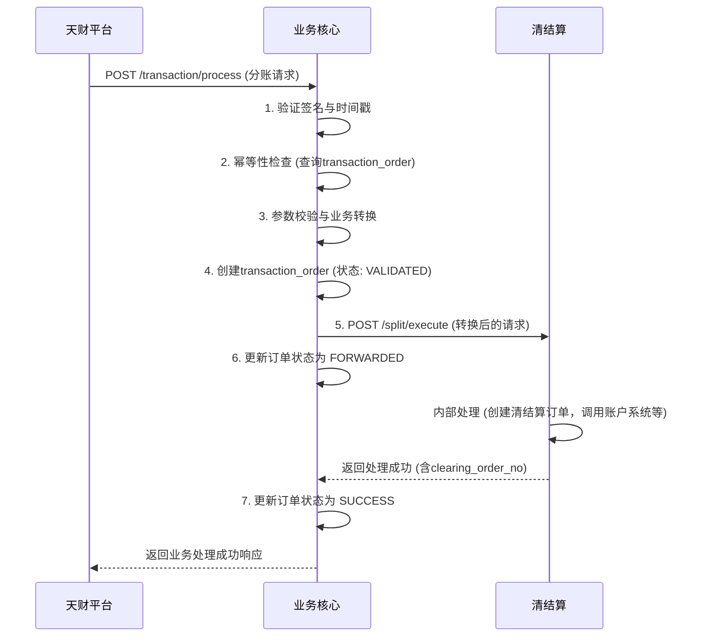
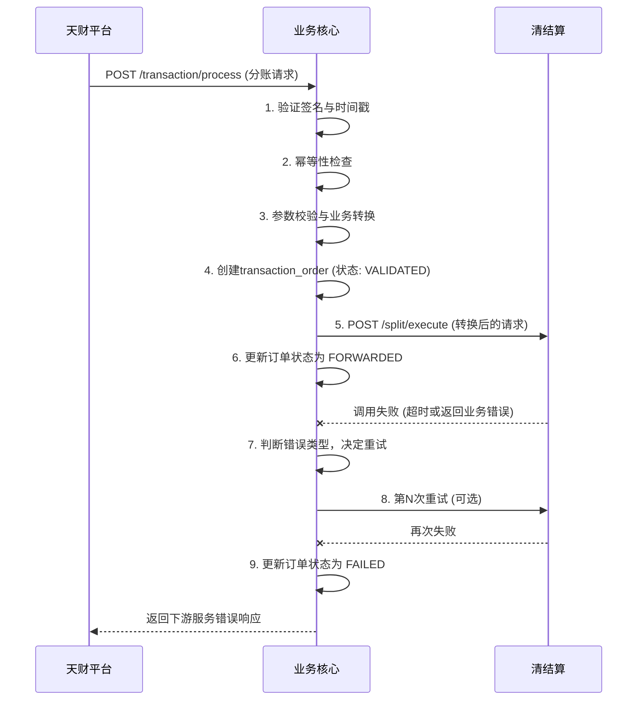

# 模块设计: 交易系统

生成时间: 2026-01-22 15:43:48
批判迭代: 2

---

# 模块设计: 业务核心

生成时间: TBD
批判迭代: TBD

---

## 1. 概述
- **目的与范围**: 本模块是负责接收并处理天财平台分账交易数据的系统。它作为业务请求的入口，接收来自天财业务平台的指令，进行初步的校验与格式转换，并调用下游清结算等模块完成资金处理。它是连接外部业务平台与内部资金处理系统的桥梁。
- **核心职责**:
    1.  提供统一的业务接口，接收天财平台发起的各类资金处理请求。
    2.  对请求进行身份认证、参数校验、幂等性处理和业务逻辑校验。
    3.  将天财平台的业务请求转换为下游清结算模块可识别的标准格式。
    4.  调用清结算模块执行资金处理，并处理其返回结果。
    5.  管理业务请求的状态，提供查询能力。

## 2. 接口设计
- **API端点 (REST)**:
    - `POST /api/v1/transaction/process`: 统一业务处理入口，接收天财平台的交易请求。
    - `GET /api/v1/transaction/query/{requestId}`: 根据请求ID查询交易处理状态。
- **请求/响应结构**:
    - 业务处理请求 (`POST /api/v1/transaction/process`):
        ```json
        {
          "requestId": "string，请求唯一标识（由天财平台生成）",
          "appId": "string，应用标识，用于身份验证",
          "signature": "string，请求签名",
          "timestamp": "long，请求时间戳",
          "bizType": "string，业务类型 (SPLIT, COLLECTION, BATCH_PAY)",
          "bizData": {
            // 业务数据，结构根据bizType变化
            "bizOrderNo": "string，业务订单号",
            "payerInfo": "object，付款方信息",
            "receiverInfo": "object，收款方信息",
            "amount": "BigDecimal，交易金额",
            "extInfo": "object，扩展信息"
          }
        }
        ```
    - 业务处理响应:
        ```json
        {
          "code": "string，响应码",
          "message": "string，响应信息",
          "data": {
            "requestId": "string，原请求ID",
            "transactionOrderNo": "string，业务核心订单号",
            "status": "string，处理状态 (PROCESSING, SUCCESS, FAILED)",
            "clearingOrderNo": "string，清结算订单号（成功时返回）"
          }
        }
        ```
    - 交易查询响应 (`GET /api/v1/transaction/query/{requestId}`):
        ```json
        {
          "code": "string，响应码",
          "message": "string，响应信息",
          "data": {
            "requestId": "string，请求ID",
            "transactionOrderNo": "string，业务核心订单号",
            "bizType": "string，业务类型",
            "status": "string，处理状态",
            "clearingOrderNo": "string，清结算订单号",
            "createdTime": "string，创建时间",
            "updatedTime": "string，更新时间"
          }
        }
        ```
- **发布/消费的事件**:
    - 消费事件: TBD
    - 发布事件: TBD

## 3. 数据模型
- **表/集合**:
    - `transaction_order`: 业务订单表，用于记录所有接收到的交易请求及其处理状态。
- **关键字段**:
    - `transaction_order`:
        - `id` (主键)
        - `transaction_order_no` (业务核心订单号，唯一)
        - `request_id` (天财平台请求ID，用于幂等)
        - `app_id` (应用标识)
        - `biz_type` (业务类型: SPLIT, COLLECTION, BATCH_PAY)
        - `biz_data` (JSON，原始业务请求数据)
        - `status` (状态: RECEIVED, VALIDATED, FORWARDED, SUCCESS, FAILED)
        - `clearing_order_no` (关联的清结算订单号)
        - `error_code` (错误码，失败时记录)
        - `error_message` (错误信息，失败时记录)
        - `created_time` (创建时间)
        - `updated_time` (更新时间)
- **与其他模块的关系**: `transaction_order` 通过 `clearing_order_no` 关联清结算模块的 `clearing_order` 表。`request_id` 和 `app_id` 用于关联天财平台的业务请求。

## 4. 业务逻辑
- **核心工作流/算法**:
    1.  **接收与解析**: 接收天财平台通过 `POST /api/v1/transaction/process` 发起的业务请求，解析JSON请求体。
    2.  **身份认证与签名验证**: 根据 `appId` 获取对应的密钥，验证请求签名 (`signature`) 和时间戳 (`timestamp`) 的有效性，防止重放攻击。
    3.  **幂等性校验**: 根据 `requestId` 查询 `transaction_order` 表。若已存在相同 `requestId` 且状态为终态（SUCCESS/FAILED）的记录，则直接返回历史处理结果。
    4.  **基础参数校验**: 校验请求必填字段（`requestId`, `appId`, `bizType`, `bizData`）是否存在，格式是否符合约定。
    5.  **业务参数校验与转换**:
        - **分账 (SPLIT)**: 校验 `bizData` 中付款方账户 (`payerInfo.accountNo`)、收款方账户 (`receiverInfo.accountNo`)、金额 (`amount`) 的合法性。转换为清结算 `POST /split/execute` 接口的请求格式。
        - **归集 (COLLECTION)**: 校验门店账户与总部账户的归集关系。转换为清结算 `POST /split/execute` 接口的请求格式（`bizType: COLLECTION`）。
        - **批量付款 (BATCH_PAY)**: 校验付款方账户、收款方列表、总金额。转换为多次调用清结算 `POST /split/execute` 接口（或未来支持的批量接口）。
    6.  **持久化与状态更新**: 创建 `transaction_order` 记录，状态置为 `VALIDATED`。
    7.  **调用下游服务**: 根据转换后的请求，调用清结算模块对应的接口（如 `/split/execute`）。将 `transaction_order` 状态更新为 `FORWARDED`。
    8.  **处理下游响应**:
        - **成功**: 更新 `transaction_order` 状态为 `SUCCESS`，记录 `clearing_order_no`。
        - **失败**: 根据清结算返回的错误码，判断错误类型。更新 `transaction_order` 状态为 `FAILED`，记录错误信息。
    9.  **响应天财平台**: 根据最终状态，构造并返回响应。
- **业务规则与验证**:
    - 请求签名算法: TBD。
    - 时间戳有效期: TBD (例如，请求时间戳与服务器时间相差超过5分钟视为无效)。
    - 必填字段校验规则: 针对不同 `bizType` 定义 `bizData` 中的必填字段。
    - 账户格式校验: 校验账户号是否符合天财账户的编码规则。
    - 金额校验: 金额必须大于0，且符合精度要求。
- **关键边界情况处理**:
    - **下游服务（清结算）调用失败或超时**: 记录详细日志。根据错误类型（网络超时、服务不可用）实施重试策略（如最多重试3次，指数退避）。若最终失败，将订单状态置为 `FAILED`，并向天财平台返回 `DOWNSTREAM_SERVICE_ERROR`。
    - **请求参数校验失败**: 在步骤4或5中校验失败，立即中止流程，不调用下游服务。创建状态为 `FAILED` 的订单记录，并返回具体的参数错误信息。
    - **接收到未知业务类型的请求**: 在步骤5中，若 `bizType` 不在支持列表中，返回 `UNSUPPORTED_BIZ_TYPE` 错误。
    - **幂等性处理中发现状态为处理中（PROCESSING）的重复请求**: 返回"处理中，请稍后查询"的提示，防止重复创建订单。
- **数据持久化与状态管理**:
    - 所有接收到的请求均在 `transaction_order` 表中持久化，形成完整的处理流水。
    - 状态机定义: `RECEIVED` -> `VALIDATED` -> `FORWARDED` -> (`SUCCESS` | `FAILED`)。
    - 提供 `GET /api/v1/transaction/query/{requestId}` 接口供天财平台查询交易处理状态，实现异步请求的结果查询。

## 5. 时序图

### 5.1 分账请求处理时序图（成功流程）


### 5.2 分账请求处理时序图（下游服务失败）


## 6. 错误处理
- **预期错误情况与错误码**:
    - `INVALID_SIGNATURE` (401): 请求签名验证失败。
    - `INVALID_TIMESTAMP` (400): 请求时间戳过期或格式错误。
    - `INVALID_APPID` (401): 无效的应用标识 (AppId)。
    - `MISSING_PARAMETER` (400): 缺少必填请求参数。
    - `INVALID_PARAMETER` (400): 请求参数格式或值错误。
    - `UNSUPPORTED_BIZ_TYPE` (400): 不支持的交易业务类型。
    - `DUPLICATE_REQUEST` (409): 重复请求（幂等性冲突，且原请求已成功或失败）。
    - `REQUEST_PROCESSING` (409): 请求正在处理中（幂等性冲突，原请求处于中间状态）。
    - `DOWNSTREAM_SERVICE_ERROR` (502): 下游服务（清结算）调用失败或返回不可重试的业务错误。
    - `SYSTEM_ERROR` (500): 系统内部错误。
- **处理策略**:
    - **客户端错误 (4xx)**: 对于签名、参数、业务类型等错误，在流程早期（调用下游前）拦截，直接返回错误，并创建状态为 `FAILED` 的订单记录。
    - **下游服务错误 (5xx)**: 对于清结算调用失败，根据错误详情（网络超时、服务不可用、账户状态错误等）决定策略。网络问题可重试；业务规则错误（如余额不足）不重试，直接失败。所有失败均更新订单状态并记录错误码。
    - **幂等性处理**: 通过 `requestId` 保证。对于重复请求，若原请求已终态，直接返回原结果；若在处理中，返回"处理中"状态。
    - **日志与监控**: 所有错误，无论是否返回给客户端，均需记录详细日志（包含 `requestId`, `transaction_order_no`）。设置监控告警，针对下游服务错误率、系统错误等进行告警。

## 7. 依赖关系
- **上游模块**:
    - **天财平台 (外部)**: 业务请求的发起方，通过开放API调用本模块。
- **下游模块**:
    - **清结算**: 核心依赖，用于执行所有资金清算、分账、结算等具体操作。本模块将校验转换后的请求转发给清结算。
- **交互说明**: 本模块作为面向天财平台的业务入口和适配层，主要职责是协议转换、请求校验和路由转发。它强依赖于清结算模块来完成核心的资金处理逻辑，自身不处理具体的账户操作和记账。