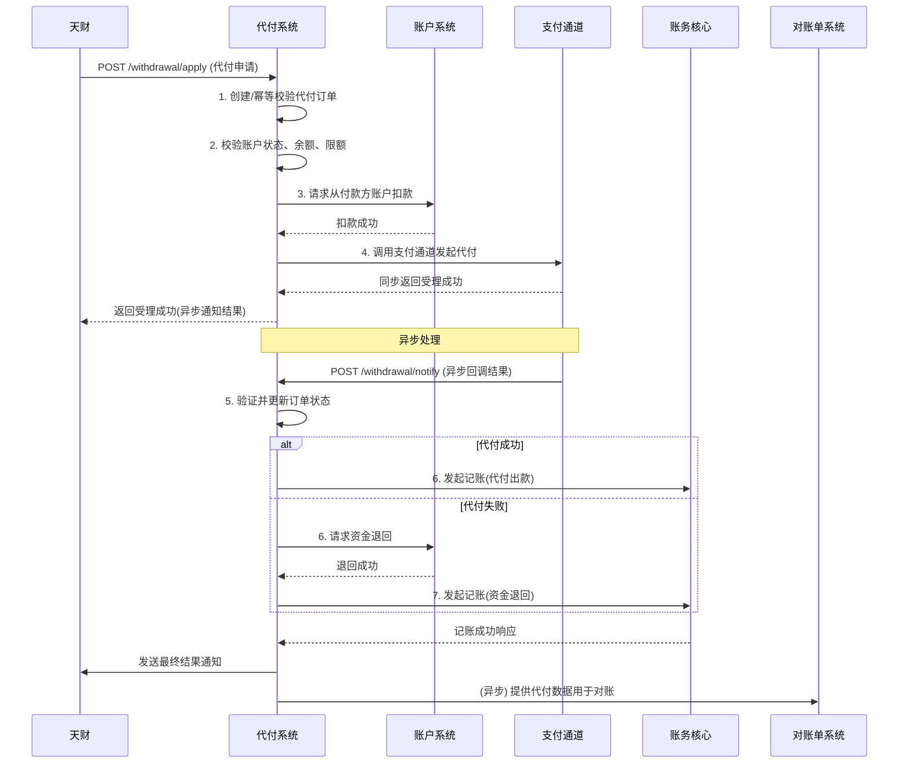
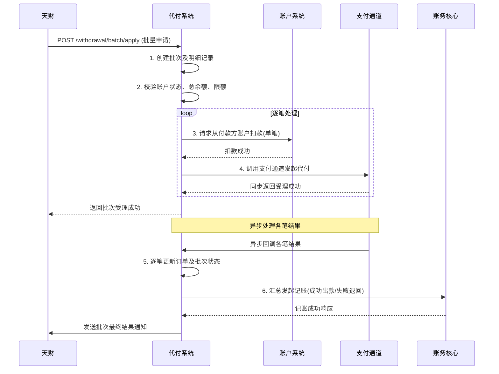

# 模块设计: 代付系统

生成时间: 2026-01-22 15:44:00
批判迭代: 2

---

# 模块设计: 代付系统

生成时间: TBD
批判迭代: TBD

---

## 1. 概述
- **目的与范围**: 本模块负责处理从天财收款账户或天财接收方账户向外部银行账户（或其他支付渠道）的资金代付（提现）业务。它接收来自天财平台或内部系统的代付指令，协调账户系统进行资金扣减，并通过支付通道完成对外付款，同时驱动账务核心完成记账。其范围涵盖单笔代付、批量代付（批付）的发起、状态同步、结果通知及对账处理。

## 2. 接口设计
- **API端点 (REST)**:
    - `POST /api/v1/withdrawal/apply`: 申请单笔代付。
    - `POST /api/v1/withdrawal/batch/apply`: 申请批量代付。
    - `POST /api/v1/withdrawal/query`: 查询代付订单状态。
    - `POST /api/v1/withdrawal/notify`: 接收支付通道异步回调。
- **请求/响应结构**:
    - 单笔代付申请 (`POST /api/v1/withdrawal/apply`):
        ```json
        {
          "requestId": "string，请求唯一标识",
          "payerAccountNo": "string，付款方账户号（天财收款账户/天财接收方账户）",
          "payeeBankCardNo": "string，收款方银行卡号",
          "payeeBankCardName": "string，收款方姓名",
          "payeeBankCode": "string，收款方银行编码",
          "payeeBankBranch": "string，收款方支行（可选）",
          "amount": "BigDecimal，代付本金",
          "feeAmount": "BigDecimal，手续费（可选，可由系统计算）",
          "remark": "string，备注",
          "extInfo": "object，扩展信息"
        }
        ```
    - 批量代付申请 (`POST /api/v1/withdrawal/batch/apply`):
        ```json
        {
          "requestId": "string，请求唯一标识",
          "batchNo": "string，批次号",
          "payerAccountNo": "string，付款方账户号",
          "items": [
            {
              "itemId": "string，批次内明细ID",
              "payeeBankCardNo": "string",
              "payeeBankCardName": "string",
              "payeeBankCode": "string",
              "payeeBankBranch": "string",
              "amount": "BigDecimal",
              "feeAmount": "BigDecimal",
              "remark": "string"
            }
          ],
          "extInfo": "object"
        }
        ```
    - 通用响应结构:
        ```json
        {
          "code": "string，响应码",
          "message": "string，响应信息",
          "data": {
            "requestId": "string，原请求ID",
            "withdrawalOrderNo": "string，代付订单号（单笔）或批次号（批量）",
            "status": "string，受理状态"
          }
        }
        ```
- **发布/消费的事件**:
    - 消费事件: TBD
    - 发布事件:
        - `WithdrawalSuccessEvent`: 代付成功事件。
        - `WithdrawalFailedEvent`: 代付失败事件。

## 3. 数据模型
- **表/集合**:
    - `withdrawal_order`: 代付主订单表。
    - `withdrawal_batch`: 批量代付批次表。
    - `withdrawal_batch_item`: 批量代付明细表。
    - `withdrawal_channel_log`: 支付通道调用日志表。
- **关键字段**:
    - `withdrawal_order`:
        - `id` (主键)
        - `withdrawal_order_no` (代付订单号，唯一)
        - `batch_no` (批次号，关联批量代付批次)
        - `request_id` (请求唯一标识，用于幂等)
        - `payer_account_no` (付款方账户号)
        - `payee_bank_card_no` (收款方银行卡号，脱敏存储)
        - `payee_bank_card_name` (收款方姓名)
        - `payee_bank_code` (收款方银行编码)
        - `principal_amount` (代付本金)
        - `fee_amount` (手续费)
        - `status` (状态: INIT, PROCESSING, SUCCESS, FAILED)
        - `channel_order_no` (支付通道订单号)
        - `channel_code` (支付通道编码)
        - `account_deduct_status` (账户扣款状态)
        - `account_refund_status` (资金退回状态)
        - `accounting_status` (记账状态)
        - `created_time` (创建时间)
        - `updated_time` (更新时间)
    - `withdrawal_batch`:
        - `id` (主键)
        - `batch_no` (批次号，唯一)
        - `request_id` (请求唯一标识)
        - `payer_account_no` (付款方账户号)
        - `total_amount` (批次总金额)
        - `total_count` (总笔数)
        - `success_count` (成功笔数)
        - `batch_status` (批次状态)
        - `created_time` (创建时间)
    - `withdrawal_batch_item`:
        - `id` (主键)
        - `batch_no` (批次号)
        - `item_id` (批次内明细ID)
        - `withdrawal_order_no` (关联的代付订单号)
        - `payee_bank_card_no` (收款方银行卡号，脱敏存储)
        - `payee_bank_card_name` (收款方姓名)
        - `principal_amount` (代付本金)
        - `fee_amount` (手续费)
        - `item_status` (明细状态)
    - `withdrawal_channel_log`:
        - `id` (主键)
        - `withdrawal_order_no` (关联代付订单号)
        - `channel_code` (支付通道编码)
        - `request_body` (请求报文)
        - `response_body` (响应报文)
        - `invoke_status` (调用状态)
        - `invoke_time` (调用时间)
- **与其他模块的关系**: `withdrawal_order` 通过 `payer_account_no` 关联账户系统的账户；代付成功/失败后会触发账务核心进行记账；为对账单系统提供代付交易数据用于对账。

## 4. 业务逻辑
- **核心工作流/算法**:
    1.  **代付申请与校验**:
        - 接收代付请求，校验请求幂等性 (`requestId`)。
        - 校验付款方账户 (`payer_account_no`) 状态（正常、非冻结、非注销）及账户类型（天财收款账户或天财接收方账户）是否支持提现。
        - 校验付款方账户余额是否充足（代付本金 + 手续费）。
        - 实施单笔/单日累计代付限额控制。
        - 创建代付订单，状态为 `INIT`。
    2.  **账户扣款**:
        - 驱动账户系统从付款方账户扣减代付本金及手续费。
        - 更新代付订单的账户扣款状态为成功，订单状态为 `PROCESSING`。
    3.  **支付通道处理**:
        - 根据收款方银行信息，路由选择合适的支付通道。
        - 组装通道请求报文，调用支付通道接口发起代付。
        - 记录通道调用日志。
        - 处理通道的同步响应：若受理成功，更新通道订单号；若明确失败，触发资金退回流程。
    4.  **异步结果处理**:
        - 接收支付通道的异步回调通知，或通过定时任务主动查询超时/处理中的订单。
        - 验证回调签名/身份。
        - 更新代付订单状态为 `SUCCESS` 或 `FAILED`。
    5.  **后续处理与通知**:
        - 若代付成功，驱动账务核心进行代付出款记账。
        - 若代付失败，驱动账户系统进行资金退回（冲正）操作，成功后驱动账务核心进行资金退回记账。
        - 更新订单的记账状态。
        - 发送最终结果通知给上游系统（如天财平台）。
- **业务规则与验证**:
    - 所有请求需通过 `requestId` 保证幂等性。
    - 付款方账户状态、余额、限额的校验在扣款前完成。
    - 收款方银行卡信息（卡号、姓名、银行编码）的合规性校验由支付通道负责，代付系统仅做基本格式校验。
    - 账户扣款与支付通道调用需保证最终一致性，通过状态机和补偿任务处理异常。
- **关键边界情况处理**:
    - 支付通道调用超时或返回"处理中"：将订单置为 `PROCESSING`，启动异步结果查询任务。
    - 支付通道返回明确失败：更新订单状态为 `FAILED`，并触发资金退回流程。
    - 账户扣款成功但调用支付通道失败：触发资金退回流程，保证资金一致性。
    - 异步回调丢失：通过定时对账任务与支付通道核对订单状态，修复本地状态。
- **并发与一致性**:
    - 对同一付款方账户的并发代付请求，在账户扣款环节通过数据库乐观锁（版本号）或分布式锁（基于 `payer_account_no`）控制，防止超额扣款。
    - 通过 `requestId` 实现请求层面的幂等性。
    - 资金操作（扣款、退回）与记账操作的最终一致性：若驱动账务核心记账失败，记录失败日志，通过异步补偿任务重试。
- **数据生命周期管理**:
    - 业务表数据根据监管和审计要求设置保留期限（如5年）。
    - 过期数据可归档至历史库或冷存储。

## 5. 时序图

### 5.1 单笔代付时序图


### 5.2 批量代付时序图


## 6. 错误处理
- **预期错误情况与错误码**:
    - `INVALID_REQUEST` (400): 请求参数错误或缺失。
    - `ACCOUNT_NOT_FOUND` (404): 付款方账户不存在。
    - `ACCOUNT_STATUS_ERROR` (409): 账户状态异常（冻结、注销等）。
    - `INSUFFICIENT_BALANCE` (409): 账户余额不足。
    - `WITHDRAWAL_LIMIT_EXCEEDED` (409): 超过单笔或单日累计限额。
    - `DUPLICATE_REQUEST` (409): 重复请求（幂等性冲突）。
    - `CHANNEL_INVOKE_FAILED` (500): 支付通道调用失败或超时。
    - `CHANNEL_BUSINESS_FAILED` (500): 支付通道返回业务失败（如卡号错误、账户受限）。
    - `ACCOUNT_OPERATION_FAILED` (500): 账户系统操作失败。
    - `ACCOUNTING_FAILED` (500): 账务核心记账失败。
- **处理策略**:
    - 对于参数、账户状态、余额、限额等业务规则错误，立即中止流程，更新订单状态为失败，并返回明确的错误码和信息。
    - 对于支付通道调用超时或暂时性失败，实施有限次数的重试（需注意幂等）。
    - 对于支付通道返回的明确业务失败，更新订单状态为失败，并触发资金退回流程。
    - 对于"账户扣款成功，后续步骤失败"的场景，必须通过补偿机制（如定时任务）确保最终状态一致，要么完成代付，要么完成资金退回。
    - 对于账务核心记账失败，记录失败日志并触发异步补偿任务进行重试。
    - 所有错误均需记录于代付订单及通道调用日志，便于排查和对账。

## 7. 依赖关系
- **上游模块**:
    - **天财**: 发起代付（提现）申请的业务平台。
    - **行业钱包**: 在"开通付款"流程完成后，可能触发代付（如批量付款场景）。
- **下游模块**:
    - **账户系统**: 执行代付资金的扣减及失败时的退回操作。
    - **支付通道**: 实际执行向外部银行账户付款的通道服务。
    - **账务核心**: 为代付出款、手续费扣收、资金退回等资金变动记录会计分录。
    - **对账单系统**: 提供代付交易数据，用于与支付通道进行对账。
- **交互说明**: 本模块是代付业务的协调者。它接收天财或行业钱包的指令，依赖账户系统执行资金扣减/退回，依赖支付通道完成对外付款，依赖账务核心完成记账，并为对账单系统提供数据。通过状态机、幂等设计和补偿机制，确保资金流与信息流的最终一致性。