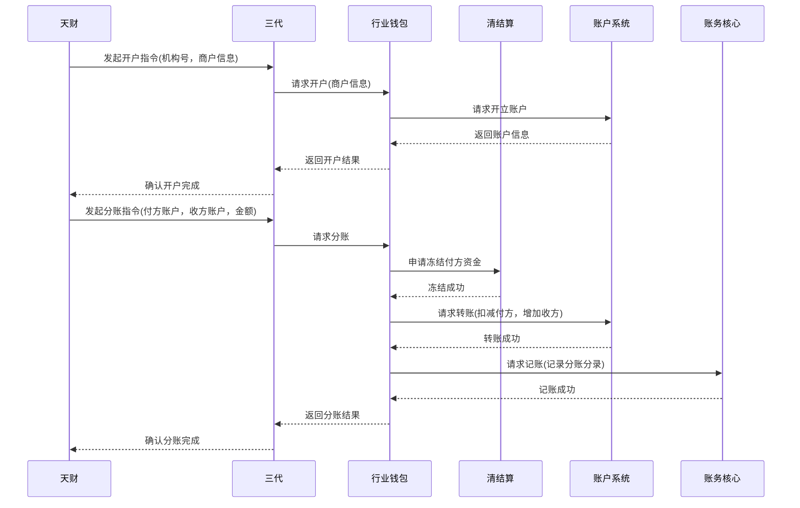

# 模块设计: 天财

生成时间: 2026-01-22 15:38:15
批判迭代: 2

---

# 天财模块设计文档

## 1. 概述
- **目的与范围**: 天财模块是提出分账、会员结算、批量付款需求的业务平台。其核心职责是作为业务发起方，负责向其他系统（如三代、行业钱包）发起开户、分账、归集等业务指令。其边界在于业务指令的发起与状态管理，不涉及底层账户操作、资金清算或记账等具体执行。所有对底层系统的操作均通过调用下游模块（如三代）的接口间接完成。

## 2. 接口设计
- **API端点 (REST/GraphQL)**: TBD
- **请求/响应结构**: TBD
- **发布/消费的事件**: TBD

## 3. 数据模型
- **表/集合**: TBD
- **关键字段**: TBD
- **与其他模块的关系**: 天财模块作为业务指令的发起方，其数据（如指令记录、商户关系）可能与三代、行业钱包等模块存在关联。

## 4. 业务逻辑
- **核心工作流/算法**: 主要业务流程包括：1) 发起开户指令，为收单商户或非收单商户开通天财账户；2) 发起分账指令，从天财收款账户向其他天财账户划转资金；3) 发起归集指令，将门店资金归集至总部；4) 发起会员结算指令；5) 发起批量付款指令。
- **业务规则与验证**:
    1.  **关系绑定验证**: 在发起分账、归集、会员结算、批量付款指令前，必须验证付方与收方之间已建立有效的业务关系（如总部与门店已绑定）。
    2.  **开通付款验证**: 对于批量付款和会员结算场景，必须验证付方（总部/门店）已完成"开通付款"流程，即已完成必要的电子签约和身份认证（如打款验证、人脸验证）。
    3.  **账户状态验证**: 发起分账指令前，需验证付方天财收款账户状态正常、未被冻结，且可用余额充足。
    4.  **指令幂等性**: 所有指令发起接口需支持幂等性，防止重复提交。
- **关键边界情况处理**:
    1.  **指令发起失败**: 因网络或系统异常导致调用下游（三代）接口失败，系统应记录失败日志并支持手动或自动重试。
    2.  **下游处理超时或异常**: 下游系统（三代）处理超时或返回业务失败时，天财模块应根据返回的错误码更新指令状态为"处理失败"，并触发告警通知人工介入核查。对于资金类指令，需依赖下游系统保证最终一致性，天财模块自身不执行冲正操作。
    3.  **异步结果通知**: 对于异步处理的指令，天财模块需提供回调接口，供下游系统在指令最终完成或失败时进行通知。

## 5. 时序图

## 6. 错误处理
- **预期错误情况**:
    1.  **参数校验失败**: 如账户不存在、余额不足、金额格式错误、必填字段缺失。
    2.  **业务状态非法**: 如付方与收方关系未绑定、付方未开通付款、账户状态异常（冻结、注销）。
    3.  **下游系统服务异常或超时**: 三代、行业钱包、清结算等下游服务不可用或响应超时。
    4.  **网络通信故障**: 天财与下游系统之间的网络中断。
- **处理策略**:
    1.  **参数与业务校验错误**: 在校验层立即拦截，返回明确的错误码和提示信息，不发起后续流程。
    2.  **下游系统异常**:
        - 对于可重试的临时性错误（如网络超时），根据配置的重试策略（如最多3次，指数退避）进行异步重试。
        - 对于明确的业务失败（如账户余额不足），更新指令状态为"失败"，并记录失败原因。
        - 对于关键资金类指令（如大额分账），若长时间处于"处理中"状态，需触发告警，由人工介入核查下游状态并决定是否需冲正（冲正操作由下游系统提供）。
    3.  **监控与告警**: 对指令失败率、下游调用延迟等关键指标进行监控，超出阈值时触发告警。

## 7. 依赖关系
- **上游模块**: 天财模块作为业务入口，不直接依赖其他业务模块，但依赖基础服务（如配置中心、消息队列）。
- **下游模块**: 本模块的指令主要下发至 **三代** 系统进行处理。**三代** 会进一步调用 **行业钱包**、**清结算**、**账户系统**、**账务核心** 等模块完成具体操作。天财模块不直接调用 **行业钱包**、**清结算**、**账户系统**、**账务核心**。