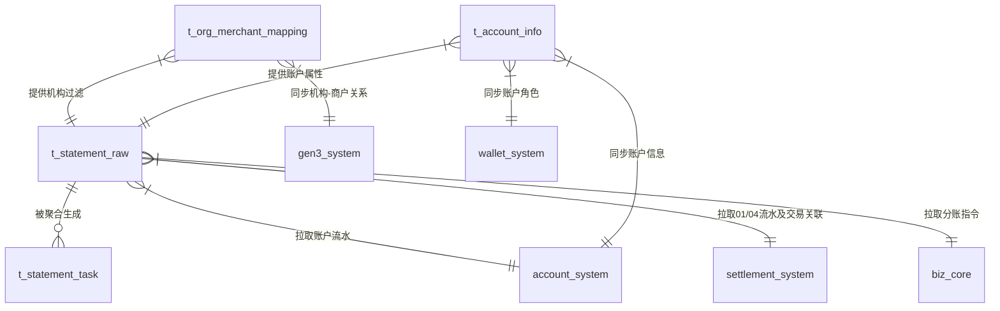
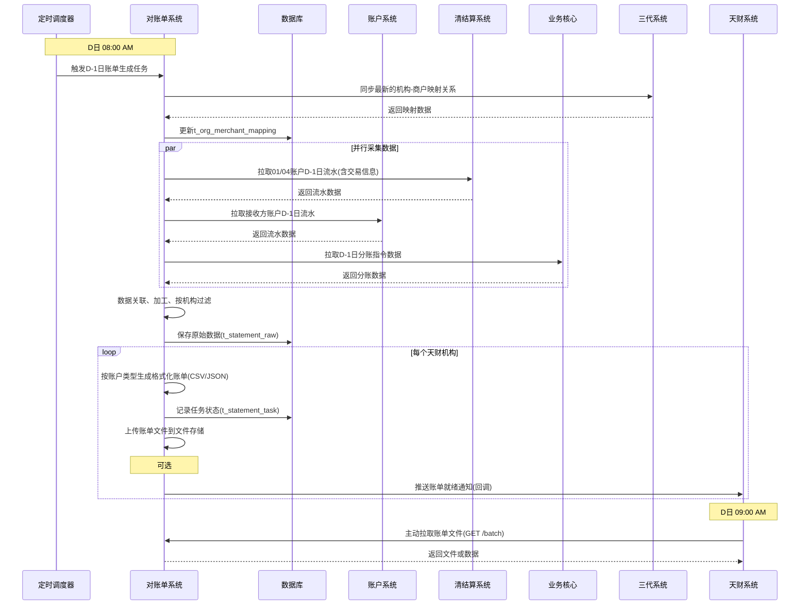
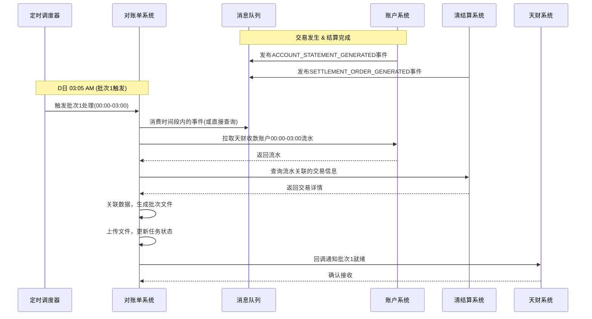

# 模块设计: 对账单系统

生成时间: 2026-01-16 16:54:29

---

# 模块设计: 对账单系统

生成时间: 2026-01-16

---

# 对账单系统模块设计文档

## 1. 概述

### 1.1 目的
对账单系统是“天财分账”业务的数据整合与账单生成中心。其核心目的是**为天财机构提供统一、清晰、多维度（账户、交易）的资金对账视图**。系统通过聚合来自账户系统、清结算系统、业务核心等多个上游模块的动账明细和交易数据，按照天财的业务需求进行关联、匹配和格式化，最终生成机构维度的各类对账单，供天财进行资金核对与业务分析。

### 1.2 范围
- **数据聚合与关联**：整合来自不同系统的异构数据（账户流水、交易记录、结算明细），通过商户、账户、订单等关键字段进行关联匹配。
- **机构维度账单生成**：
    - **账户维度对账单**：生成01待结算账户、04退货账户、天财收款账户、天财接收方账户的动账明细账单。
    - **交易维度对账单**：生成机构天财分账指令账单、机构提款指令账单、机构交易/结算账单。
- **数据供给与接口**：
    - 按固定时间窗口（如D日9点前）批量提供D-1日的完整动账明细。
    - 提供准实时（按批次）的天财收款账户动账明细推送。
    - 提供查询接口，供天财或内部系统按需查询。
- **数据匹配与加工**：
    - 将账户流水与原始交易信息（如订单号、交易类型、金额）进行组合展示。
    - 对清结算推送的“补明细账单”标识进行处理，生成包含结算明细子账单的完整流水。

**边界说明**：
- 本模块**不负责**底层账户的记账、资金结算、交易处理等核心业务逻辑。
- 本模块**不负责**商户层级的对账单生成，仅聚焦于天财机构层级。
- 本模块**不负责**原始交易数据的产生，仅为数据的消费者和加工者。

## 2. 接口设计

### 2.1 API端点 (RESTful)

#### 2.1.1 内部数据供给接口 (供天财系统或内部管理台调用)

**1. 批量获取账户动账明细文件**
- **端点**: `GET /api/v1/tiancai/statements/batch`
- **描述**: 天财系统在固定时间点（如D日9点）拉取D-1日指定类型账户的完整动账明细文件。支持分页或文件下载。
- **认证**: API Key + 机构号白名单
- **请求头**:
    - `X-App-Id`: 天财应用ID
    - `X-Org-No`: 天财机构号 (如 860000)
- **查询参数**:
    - `accountType`: **必填**，账户类型。枚举: `SETTLEMENT_01`(待结算), `REFUND_04`(退货), `TIANCAI_RECEIVE`(天财收款账户), `TIANCAI_RECEIVER`(接收方账户), `NORMAL_RECEIVE`(普通收款账户)
    - `settleDate`: **必填**，账单日期，格式 `yyyy-MM-dd`。表示T-1日。
    - `batchNo`: 可选，批次号。用于天财收款账户的日间批次查询（如`BATCH_1`表示0-3点，`BATCH_2`表示3-12点）。
    - `fileFormat`: 可选，文件格式。`JSON`(默认) 或 `CSV`。
    - `pageNo`: 页码（当`fileFormat=JSON`时有效），默认1。
    - `pageSize`: 页大小（当`fileFormat=JSON`时有效），默认1000，最大5000。
- **响应体 (JSON格式示例)**:
```json
{
  "code": "SUCCESS",
  "message": "成功",
  "data": {
    "orgNo": "860000",
    "accountType": "SETTLEMENT_01",
    "settleDate": "2024-01-15",
    "totalCount": 1250,
    "pageNo": 1,
    "pageSize": 1000,
    "hasNext": true,
    "items": [
      {
        "seqNo": "2024011500001",
        "accountNo": "SETTLE_01_88800010001",
        "accountType": "SETTLEMENT_01",
        "transTime": "2024-01-15 10:30:25",
        "transType": "TRADE_IN",
        "amount": 500.00,
        "balance": 1500.00,
        "relatedOrderNo": "ORD123456",
        "relatedMerchantNo": "88800010001",
        "relatedMerchantName": "XX餐饮北京店",
        "tradeType": "CONSUME",
        "tradeAmount": 500.00,
        "feeAmount": 2.50,
        "netAmount": 497.50,
        "payerInfo": "消费者张三",
        "payeeInfo": "XX餐饮北京店",
        "terminalNo": "T001",
        "bizRemark": "午餐消费"
      }
      // ... 更多明细
    ]
  }
}
```
- **响应 (CSV文件下载)**:
    - 直接返回CSV文件流，`Content-Type: text/csv`。
    - 文件名格式：`{orgNo}_{accountType}_statement_{settleDate}.csv`

**2. 查询天财分账指令账单**
- **端点**: `GET /api/v1/tiancai/statements/transfer`
- **描述**: 查询指定日期范围内的机构天财分账指令明细。
- **查询参数**:
    - `orgNo`: **必填**，机构号。
    - `startDate`: **必填**，开始日期 `yyyy-MM-dd`。
    - `endDate`: **必填**，结束日期 `yyyy-MM-dd`。
    - `scene`: 可选，场景过滤。
    - `status`: 可选，状态过滤。
- **响应体**: 结构类似`/batch`接口，但字段为分账指令特有（如付方、收方、手续费承担方等），数据来源于业务核心。

**3. 动账明细准实时推送回调接口**
- **端点**: `POST /api/v1/tiancai/statements/push-callback`
- **描述**: **（可选方案）** 本系统通过消息队列或定时任务生成批次文件后，调用天财提供的此回调接口，通知文件已就绪并传递下载地址。也可采用天财主动拉取模式（接口1）。
- **请求体**:
```json
{
  "orgNo": "860000",
  "accountType": "TIANCAI_RECEIVE",
  "settleDate": "2024-01-16",
  "batchNo": "BATCH_1",
  "batchPeriod": "00:00-03:00",
  "fileUrl": "https://bucket.lkl.com/statements/860000_TIANCAI_RECEIVE_20240116_BATCH1.csv",
  "fileHash": "md5...",
  "recordCount": 350,
  "generatedTime": "2024-01-16 03:05:00"
}
```

#### 2.1.2 内部数据采集接口 (供上游系统调用/本系统主动拉取)

**4. 账户流水查询接口 (面向账户系统)**
- **端点**: `GET /internal/v1/statements/source/account` **(本系统主动调用)**
- **描述**: 本系统定时任务主动调用账户系统提供的接口（参见账户系统设计2.1.1-4），拉取各类账户的动账明细。
- **基础URL**: 配置为账户系统的 `GET /internal/v1/accounts/{accountNo}/statements` 或批量查询接口。

**5. 内部账户流水查询接口 (面向清结算系统)**
- **端点**: `GET /internal/v1/statements/source/settlement` **(本系统主动调用)**
- **描述**: 本系统定时任务主动调用清结算系统提供的接口（参见清结算系统设计2.1.2-4），拉取01、04内部账户的动账明细及关联的交易信息。

**6. 分账交易数据查询接口 (面向业务核心)**
- **端点**: `GET /internal/v1/statements/source/bizcore` **(本系统主动调用)**
- **描述**: 本系统定时任务主动调用业务核心提供的接口（参见业务核心设计2.1.2），拉取天财分账指令的交易数据。

### 2.2 发布/消费的事件

#### 2.2.1 消费的事件
1.  **账户流水生成事件** (来自账户系统)
    - **事件类型**: `ACCOUNT_STATEMENT_GENERATED`
    - **负载**: 账户流水详情（包含`accountNo`, `transType`, `amount`, `bizNo`, `supplementDetailFlag`等）。
    - **动作**: 监听此事件，可用于触发准实时批次处理（针对天财收款账户），或更新本地缓存。

2.  **结算单生成事件** (来自清结算系统)
    - **事件类型**: `SETTLEMENT_ORDER_GENERATED`
    - **负载**: 结算单及明细（包含`supplementDetailFlag`，明细列表）。
    - **动作**: 记录结算单与交易的关联关系，用于后续数据匹配。

3.  **天财分账执行事件** (来自行业钱包系统)
    - **事件类型**: `TIANCAI_TRANSFER_EXECUTED`
    - **负载**: 分账指令执行结果（`transferNo`, `scene`, `amount`, `fee`等）。
    - **动作**: 作为分账指令账单的另一个数据源（与业务核心数据互补或作为触发信号）。

#### 2.2.2 发布的事件
- **账单就绪事件** (可选)
    - **事件类型**: `TIANCAI_STATEMENT_READY`
    - **触发时机**: 完成某一机构、某一账户类型、某一日期的账单文件生成后。
    - **负载**: 包含文件位置、记录数、账单类型等信息。
    - **订阅方**: 消息中心（用于通知运营）、数据仓库（用于归档）。

## 3. 数据模型

### 3.1 核心表设计

```sql
-- 机构-商户映射表 (缓存自三代系统)
CREATE TABLE t_org_merchant_mapping (
    id BIGINT PRIMARY KEY AUTO_INCREMENT,
    org_no VARCHAR(16) NOT NULL COMMENT '机构号（天财）',
    merchant_no VARCHAR(32) NOT NULL COMMENT '收单商户号',
    merchant_name VARCHAR(128) NOT NULL COMMENT '商户名称',
    role_type VARCHAR(16) COMMENT '角色: HEADQUARTERS, STORE',
    merchant_type VARCHAR(16) COMMENT '商户性质: ENTERPRISE, INDIVIDUAL',
    status VARCHAR(16) DEFAULT 'ACTIVE',
    last_sync_time DATETIME NOT NULL,
    UNIQUE KEY uk_org_merchant (org_no, merchant_no),
    INDEX idx_merchant_no (merchant_no)
) COMMENT '机构-商户关系映射表，用于数据关联和过滤';

-- 账户基础信息表 (缓存自账户系统/行业钱包)
CREATE TABLE t_account_info (
    id BIGINT PRIMARY KEY AUTO_INCREMENT,
    account_no VARCHAR(64) NOT NULL UNIQUE COMMENT '账户号',
    merchant_no VARCHAR(32) NOT NULL COMMENT '所属商户号',
    account_type VARCHAR(32) NOT NULL COMMENT '账户类型: SETTLEMENT_01, REFUND_04, TIANCAI_RECEIVE, TIANCAI_RECEIVER, NORMAL_RECEIVE',
    role_type VARCHAR(16) COMMENT '角色类型 (仅天财收款账户)',
    is_tiancai_tag BOOLEAN DEFAULT FALSE COMMENT '是否天财标记',
    status VARCHAR(16) DEFAULT 'ACTIVE',
    last_sync_time DATETIME NOT NULL,
    INDEX idx_merchant_account (merchant_no, account_type),
    INDEX idx_org_account (org_no, account_type) -- 需与t_org_merchant_mapping关联查询
) COMMENT '账户基础信息缓存表';

-- 动账明细原始表 (存储从上游拉取的原始流水)
CREATE TABLE t_statement_raw (
    id BIGINT PRIMARY KEY AUTO_INCREMENT,
    source_system VARCHAR(32) NOT NULL COMMENT '数据来源: ACCOUNT, SETTLEMENT, BIZCORE',
    source_id VARCHAR(64) NOT NULL COMMENT '来源系统唯一ID (如流水seq_no, 结算单号, 交易号)',
    account_no VARCHAR(64) NOT NULL COMMENT '账户号',
    account_type VARCHAR(32) NOT NULL COMMENT '账户类型',
    trans_time DATETIME NOT NULL COMMENT '交易时间',
    trans_type VARCHAR(32) NOT NULL COMMENT '交易类型',
    amount DECIMAL(15,2) NOT NULL COMMENT '变动金额',
    balance DECIMAL(15,2) COMMENT '变动后余额',
    currency VARCHAR(3) DEFAULT 'CNY',
    counterparty_account_no VARCHAR(64) COMMENT '对手方账户号',
    biz_no VARCHAR(64) COMMENT '业务单号',
    biz_scene VARCHAR(32) COMMENT '业务场景',
    remark VARCHAR(256),
    supplement_detail_flag CHAR(1) DEFAULT 'N' COMMENT '是否补明细账单: Y/N',
    parent_source_id VARCHAR(64) COMMENT '父流水来源ID (用于关联子账单)',
    related_order_no VARCHAR(64) COMMENT '关联订单号 (从来源系统获取)',
    related_merchant_no VARCHAR(32) COMMENT '关联商户号',
    -- 以下字段可能从其他系统关联补全
    trade_type VARCHAR(32),
    trade_amount DECIMAL(15,2),
    fee_amount DECIMAL(15,2),
    net_amount DECIMAL(15,2),
    payer_info VARCHAR(128),
    payee_info VARCHAR(128),
    terminal_no VARCHAR(32),
    raw_data JSON COMMENT '原始数据JSON，用于追溯和补全',
    created_time DATETIME NOT NULL,
    INDEX idx_account_time (account_no, trans_time),
    INDEX idx_source (source_system, source_id),
    INDEX idx_related_order (related_order_no),
    INDEX idx_trans_time (trans_time)
) COMMENT '动账明细原始表，存储从各上游系统采集的数据';

-- 账单生成任务表
CREATE TABLE t_statement_task (
    id BIGINT PRIMARY KEY AUTO_INCREMENT,
    task_no VARCHAR(32) NOT NULL UNIQUE COMMENT '任务编号',
    org_no VARCHAR(16) NOT NULL COMMENT '机构号',
    account_type VARCHAR(32) NOT NULL COMMENT '账户类型',
    settle_date DATE NOT NULL COMMENT '账单日期',
    batch_no VARCHAR(32) COMMENT '批次号 (如BATCH_1)',
    batch_period VARCHAR(32) COMMENT '批次时间范围',
    status VARCHAR(16) DEFAULT 'PENDING' COMMENT '状态: PENDING, PROCESSING, SUCCESS, FAILED',
    file_path VARCHAR(512) COMMENT '生成的文件路径',
    file_hash VARCHAR(64) COMMENT '文件哈希',
    record_count INT DEFAULT 0 COMMENT '记录数',
    error_message TEXT,
    start_time DATETIME,
    end_time DATETIME,
    created_time DATETIME NOT NULL,
    INDEX idx_org_date_type (org_no, settle_date, account_type, batch_no),
    INDEX idx_status (status, created_time)
) COMMENT '账单生成任务调度表';

-- 数据关联映射表 (用于存储复杂的关联关系，如结算单明细与交易的映射)
CREATE TABLE t_data_mapping (
    id BIGINT PRIMARY KEY AUTO_INCREMENT,
    mapping_type VARCHAR(32) NOT NULL COMMENT '映射类型: SETTLEMENT_DETAIL_TO_TRADE',
    key1 VARCHAR(64) NOT NULL COMMENT '键1 (如结算明细detail_no)',
    key2 VARCHAR(64) NOT NULL COMMENT '键2 (如交易订单号)',
    key3 VARCHAR(64) COMMENT '键3 (如商户号)',
    extra_info JSON COMMENT '扩展信息',
    created_time DATETIME NOT NULL,
    UNIQUE KEY uk_mapping_type_keys (mapping_type, key1, key2),
    INDEX idx_key2 (key2)
) COMMENT '数据关联映射表，解决多系统数据关联问题';
```

### 3.2 与其他模块的关系


- **账户系统**: **核心数据源**。提供所有类型账户（01, 04, 天财收款/接收方，普通收款）的底层动账明细流水。特别是处理`supplementDetailFlag`逻辑，生成子账单。
- **清结算系统**: **关键数据源**。提供01待结算账户、04退货账户的动账明细，并且**携带了与原始交易的关联信息**（订单号、交易类型、金额、手续费等），这是实现“组合展示”的关键。
- **业务核心**: **关键数据源**。提供“天财分账指令”的完整交易数据，用于生成分账指令账单。
- **三代系统**: **元数据提供方**。提供“机构-商户”关系映射，用于过滤和归属数据。同时提供商户的基本信息（名称、类型）。
- **行业钱包系统**: **元数据提供方**。提供“商户-账户”关系，特别是账户的角色类型（总部/门店）。同时其发布的分账事件可作为数据同步的触发信号。

## 4. 业务逻辑

### 4.1 核心算法与流程

#### 4.1.1 数据采集与关联流程
```python
def collect_and_associate_data(account_type, date_range):
    """
    采集指定账户类型在指定日期范围内的数据，并进行关联。
    """
    statements = []
    
    if account_type in ["SETTLEMENT_01", "REFUND_04"]:
        # 1. 从清结算系统拉取内部账户流水（已包含交易关联信息）
        settlement_data = call_settlement_system(account_type, date_range)
        for item in settlement_data:
            raw_stmt = build_raw_statement(item, source="SETTLEMENT")
            # 清结算数据已包含related_order_no, trade_type等，直接使用
            statements.append(raw_stmt)
            
    elif account_type in ["TIANCAI_RECEIVE", "NORMAL_RECEIVE", "TIANCAI_RECEIVER"]:
        # 2. 从账户系统拉取账户流水
        account_data = call_account_system(account_type, date_range)
        for item in account_data:
            raw_stmt = build_raw_statement(item, source="ACCOUNT")
            
            # 关键：尝试关联交易信息
            if item.get("related_order_no"):
                # 如果账户流水本身有关联订单号（可能来自清结算事件）
                trade_info = query_trade_info(item["related_order_no"])
                if trade_info:
                    enrich_statement_with_trade(raw_stmt, trade_info)
            elif item.get("biz_no"):
                # 如果是分账流水(biz_no可能是分账单号)，从业务核心获取分账详情
                if item["trans_type"] in ["SPLIT_OUT", "SPLIT_IN"]:
                    transfer_info = query_bizcore_transfer(item["biz_no"])
                    if transfer_info:
                        enrich_statement_with_transfer(raw_stmt, transfer_info)
            
            statements.append(raw_stmt)
    
    # 3. 过滤并归属到具体天财机构
    org_filtered_statements = []
    for stmt in statements:
        # 根据stmt.merchant_no查询t_org_merchant_mapping，得到org_no
        org_no = get_org_no_by_merchant(stmt.related_merchant_no or stmt.merchant_no)
        if org_no and org_no in TIANCAI_ORG_WHITELIST: # 只处理天财机构
            stmt.org_no = org_no
            org_filtered_statements.append(stmt)
    
    # 4. 保存原始数据
    save_raw_statements(org_filtered_statements)
    
    return org_filtered_statements
```

#### 4.1.2 账单文件生成流程（以D日9点出D-1日账单为例）
```python
def generate_daily_statement_batch():
    """
    每日定时任务，生成D-1日各类账户的完整对账单。
    """
    settle_date = get_yesterday() # D-1日
    account_types = ["SETTLEMENT_01", "REFUND_04", "TIANCAI_RECEIVER"]
    
    for org_no in get_all_tiancai_orgs():
        for acc_type in account_types:
            task_no = create_statement_task(org_no, acc_type, settle_date)
            
            try:
                # 1. 采集并关联数据
                statements = collect_and_associate_data_for_org(org_no, acc_type, settle_date)
                
                # 2. 格式化输出
                formatted_items = []
                for stmt in statements:
                    item = format_statement_item(stmt, acc_type)
                    formatted_items.append(item)
                
                # 3. 生成文件 (CSV/JSON)
                file_path, file_hash = generate_statement_file(
                    org_no, acc_type, settle_date, formatted_items
                )
                
                # 4. 更新任务状态
                update_task_success(task_no, file_path, file_hash, len(formatted_items))
                
                # 5. (可选) 发布账单就绪事件或回调天财
                publish_statement_ready_event(org_no, acc_type, settle_date, file_path)
                
            except Exception as e:
                update_task_failed(task_no, str(e))
                log_error(f"生成账单失败: org={org_no}, type={acc_type}, date={settle_date}", e)
```

#### 4.1.3 天财收款账户准实时批次处理流程
```python
def process_realtime_receive_account_batch():
    """
    处理天财收款账户的准实时批次（0-3点，3-12点，12-18点）。
    """
    current_time = get_current_time()
    batch_def = get_current_batch_definition(current_time) # 判断属于哪个批次
    
    if not batch_def:
        return
    
    batch_no = batch_def["batch_no"]
    batch_period = batch_def["period"]
    # 计算批次时间范围，例如BATCH_1: 当天00:00:00 - 当天03:00:00
    start_time, end_time = calculate_batch_time_range(batch_def)
    
    for org_no in get_all_tiancai_orgs():
        task_no = create_statement_task(org_no, "TIANCAI_RECEIVE", get_today(), batch_no, batch_period)
        
        try:
            # 1. 采集指定时间范围内的数据
            statements = query_raw_statements_by_time(
                org_no, "TIANCAI_RECEIVE", start_time, end_time
            )
            
            # 2. 关联交易信息（对于结算入账流水）
            for stmt in statements:
                if stmt.trans_type == "SETTLEMENT_IN" and stmt.supplement_detail_flag == "Y":
                    # 获取子账单明细
                    child_stmts = query_child_statements(stmt.source_id)
                    # 为每个子明细关联交易信息（从清结算映射表获取）
                    for child in child_stmts:
                        trade_info = get_trade_info_by_settlement_detail(child.related_order_no)
                        if trade_info:
                            enrich_statement_with_trade(child, trade_info)
            
            # 3. 生成批次文件
            formatted_items = format_all_statements(statements)
            file_path, file_hash = generate_batch_file(org_no, "TIANCAI_RECEIVE", get_today(), batch_no, formatted_items)
            
            update_task_success(task_no, file_path, file_hash, len(formatted_items))
            
            # 4. 通知天财（推送或等待拉取）
            notify_tiancai_batch_ready(org_no, "TIANCAI_RECEIVE", get_today(), batch_no, file_path)
            
        except Exception as e:
            update_task_failed(task_no, str(e))
```

### 4.2 业务规则

1.  **数据关联规则**:
    - **01/04账户**：交易信息直接来自清结算系统推送的流水，已内置关联。
    - **天财收款账户（结算入账）**：通过`supplementDetailFlag='Y'`找到子账单，子账单的`related_order_no`关联清结算的结算明细，进而找到原始交易。
    - **天财收款账户（分账出账）**：通过`biz_no`（分账单号）关联业务核心的分账指令数据。
    - **天财接收方账户**：通常只记录动账明细（分账入账、提现出账），关联信息较少。

2.  **账单生成时效规则**:
    - **D日9点前**：必须生成并可供拉取`SETTLEMENT_01`, `REFUND_04`, `TIANCAI_RECEIVER`账户的D-1日0-24点完整账单。
    - **D日3点后**：生成`TIANCAI_RECEIVE`账户D-1日0-24点 + D日0-3点的账单（第一批次）。
    - **D日12点后**：生成`TIANCAI_RECEIVE`账户D日3-12点的账单（第二批次）。
    - **D日18点后**：生成`TIANCAI_RECEIVE`账户D日12-18点的账单（第三批次）。

3.  **数据过滤规则**:
    - 只处理带有“天财”标记的账户（`is_tiancai_tag = TRUE`）的数据。
    - 只生成天财机构（白名单内）维度的账单，不提供商户维度账单。

4.  **文件与格式规则**:
    - 支持JSON和CSV两种格式。
    - CSV文件需包含表头，字段顺序固定。
    - 文件命名需明确包含机构号、账户类型、日期、批次号。

### 4.3 关键数据处理逻辑

1.  **“补明细账单”处理**:
    - 当从账户系统获取到`supplementDetailFlag='Y'`的流水时，需查询其子账单（`parent_seq_no`关联）。
    - 子账单的`related_order_no`需要与清结算系统的`t_data_mapping`（或直接查询）关联，获取完整的交易信息。
    - 在最终账单展示时，主流水（汇总）和子流水（明细）可能都需要展示，需根据天财需求确定格式。

2.  **余额展示逻辑**:
    - 账户流水中的`balance`字段表示该笔交易发生后的账户实时余额。
    - 对于组合展示的账单，每一行都应包含变动后的余额。
    - 对于子账单，其`balance`可能与主流水一致，或为空（取决于账户系统实现）。

3.  **机构数据隔离**:
    - 所有查询都必须基于`org_no`进行过滤。
    - 通过`t_org_merchant_mapping`表实现商户到机构的映射。此表数据需要与三代系统定期同步（或监听变更事件）。

## 5. 时序图

### 5.1 D-1日账单生成时序图（D日9点前）



### 5.2 天财收款账户准实时批次处理时序图



## 6. 错误处理

| 错误场景 | 错误码 | 处理策略 | 监控与告警 |
| :--- | :--- | :--- | :--- |
| 上游数据源（账户/清结算）不可用 | `UPSTREAM_UNAVAILABLE` | 记录任务失败，进入重试队列。根据重试策略（如指数退避）重试。超过最大重试次数则告警。 | 监控上游接口健康度，失败时立即告警。 |
| 数据关联失败（如找不到交易信息） | `DATA_ASSOCIATION_FAILED` | 记录警告日志，该条数据以“信息不全”状态仍存入账单，但标记缺失字段。不影响整体账单生成。 | 定期统计关联失败率，超过阈值（如1%）时告警。 |
| 机构-商户映射缺失 | `ORG_MAPPING_MISSING` | 该商户数据将被过滤，不进入任何机构账单。记录错误日志。 | 监控映射缺失数量，及时告警并同步三代系统。 |
| 生成文件失败（磁盘满、权限等） | `FILE_GENERATION_ERROR` | 任务标记为失败，记录详细错误。依赖存储系统监控。 | 监控文件系统可用空间和权限。 |
| 推送回调天财失败 | `NOTIFICATION_FAILED` | 记录日志，进入重试队列重试推送。同时，天财仍可通过主动拉取接口获取。 | 监控回调成功率。 |
| 数据库连接异常 | `DB_CONNECTION_ERROR` | 抛出系统异常，由框架层统一重试或熔断。 | 监控数据库连接池状态。 |

**通用策略**:
- **重试机制**：对于临时性失败（网络超时、上游短暂不可用），采用指数退避策略重试。
- **降级策略**：在极端情况下，如果无法获取关联的交易信息，仍生成包含基本动账信息的账单，确保核心资金流水可见。
- **补偿机制**：提供管理后台，支持手动触发指定日期、指定机构的账单重新生成，以修复数据问题。
- **对账与校验**：每日账单生成后，与上游系统进行数据总量核对，确保数据一致性。

## 7. 依赖说明

### 7.1 上游依赖

1.  **账户系统**:
    - **交互方式**: 同步RPC调用（本系统主动拉取） + 异步消息（事件监听）。
    - **依赖内容**:
        - **核心**: 所有类型账户的动账明细流水，特别是`supplementDetailFlag`和子账单信息。
        - **元数据**: 账户基础信息（账户号、商户号、类型、标记）。
    - **SLA要求**: 批量查询接口需支持大时间范围数据拉取，性能要求高。事件推送要求可靠。

2.  **清结算系统**:
    - **交互方式**: 同步RPC调用（本系统主动拉取） + 异步消息（事件监听）。
    - **依赖内容**:
        - **核心**: 01、04内部账户的动账明细，且**必须包含关联的原始交易信息**（订单号、交易类型、金额、手续费等）。
        - **映射关系**: 结算单明细与交易订单的映射关系。
    - **关键性**: 最高。缺少清结算的交易关联信息，账单将无法实现“组合展示”。

3.  **业务核心**:
    - **交互方式**: 同步RPC调用（本系统主动拉取）。
    - **依赖内容**: “天财分账指令”的完整交易记录，用于生成分账指令账单。
    - **数据质量**: 要求分账指令数据准确、完整，与行业钱包系统执行结果一致。

4.  **三代系统**:
    - **交互方式**: 同步RPC调用（定期同步）或异步消息。
    - **依赖内容**: “机构-商户”关系映射表。这是实现机构维度数据过滤和归属的**唯一依据**。
    - **数据一致性**: 必须保证映射关系的实时性或准实时性，商户新增、变更需及时同步。

5.  **行业钱包系统**:
    - **交互方式**: 异步消息（事件监听）。
    - **依赖内容**: `TIANCAI_TRANSFER_EXECUTED`事件，作为分账数据同步的触发或补充。
    - **元数据**: 账户角色信息（总部/门店），可通过缓存同步获取。

### 7.2 下游服务

1.  **天财系统**:
    - **交互方式**: 提供REST API供其主动拉取，或主动向其回调推送。
    - **提供服务**: 各类机构维度对账单文件或数据。
    - **性能要求**: 拉取接口需支持高并发、大数据量下载。文件生成和传输需高效。

### 7.3 依赖管理策略

1.  **数据采集解耦**:
    - 采用“拉模式”为主，由本系统定时主动从上游拉取数据，掌握主动权。
    - 结合“事件驱动”为辅，监听关键事件（如分账完成）触发准实时处理。
    - 所有拉取的数据本地持久化，避免对上游实时查询的过度依赖。

2.  **分级降级与补偿**:
    - **P0（必须保障）**: 账户流水基础数据。如果账户系统不可用，账单生成完全失败。
    - **P1（强烈依赖）**: 清结算的交易关联信息。缺失则账单不完整，但基础流水仍可提供。
    - **P2（重要依赖）**: 业务核心的分账指令数据。缺失则分账指令账单无法生成。
    - 对于P1/P2依赖，提供降级方案（如记录缺失标记，后续人工补全）。

3.  **缓存与异步更新**:
    - 机构-商户映射、账户基础信息等元数据，在本系统建立缓存，定期异步更新，避免关键路径上的同步调用。

4.  **监控与告警矩阵**:
    - 为每个上游依赖接口设立独立的健康度看板（成功率、延迟）。
    - 账单生成各阶段（数据采集、关联、文件生成）设立关键指标和告警。
    - 每日生成数据质量报告（如总记录数、关联成功率、各机构数据量）。

---
**文档版本**: 1.0  
**最后更新**: 2026-01-16  
**维护团队**: 对账单系统开发组