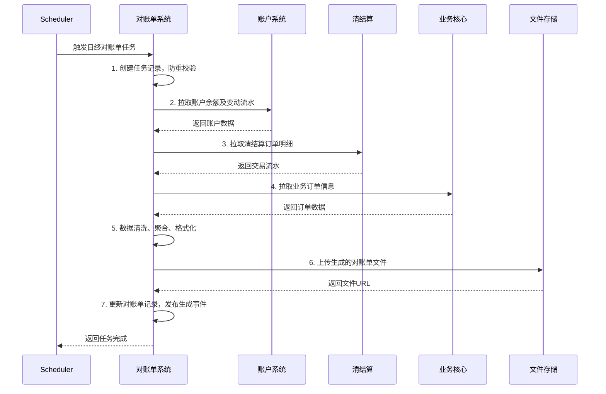

# 模块设计: 对账单系统

生成时间: 2026-01-22 15:46:50
批判迭代: 2

---

# 模块设计: 对账单系统

生成时间: TBD
批判迭代: TBD

---

# 对账单系统模块设计文档

## 1. 概述
- **目的与范围**: 本模块负责生成并提供各类账户和交易维度的对账单。它为商户、运营及内部系统提供标准化的资金流水、交易明细及汇总数据，支持对账、审计和财务核算。其边界在于从相关系统（如账户系统、清结算、业务核心）获取数据，进行聚合与格式转换，最终生成并提供对账单文件或数据接口。

## 2. 接口设计
- **API端点 (REST/GraphQL)**:
    - `GET /api/v1/statement/account`: 获取账户维度对账单。
    - `GET /api/v1/statement/transaction`: 获取交易维度对账单。
    - `POST /api/v1/statement/generate`: 触发对账单生成任务。
- **请求/响应结构**:
    - 账户对账单请求 (`GET /api/v1/statement/account`):
        ```json
        {
          "accountNo": "string",
          "startDate": "string (yyyy-MM-dd)",
          "endDate": "string (yyyy-MM-dd)",
          "fileFormat": "CSV/PDF"
        }
        ```
    - 交易对账单请求 (`GET /api/v1/statement/transaction`):
        ```json
        {
          "merchantId": "string",
          "instId": "string",
          "startDate": "string (yyyy-MM-dd)",
          "endDate": "string (yyyy-MM-dd)",
          "bizType": "string"
        }
        ```
    - 对账单生成请求 (`POST /api/v1/statement/generate`):
        ```json
        {
          "statementType": "DAILY/MONTHLY",
          "targetDate": "string (yyyy-MM-dd)"
        }
        ```
    - 通用响应结构:
        ```json
        {
          "code": "string",
          "message": "string",
          "data": {
            "statementId": "string",
            "downloadUrl": "string",
            "status": "string"
          }
        }
        ```
- **发布/消费的事件**:
    - 消费事件: `Settlement.Completed` (清结算完成事件)， `Wallet.Transfer.Executed` (行业钱包转账完成事件)。
    - 发布事件: `Statement.Generated` (对账单生成完成事件)。

## 3. 数据模型
- **表/集合**:
    - `statement_task`: 对账单生成任务表。
    - `statement_record`: 对账单记录表。
    - `statement_detail`: 对账单明细数据表。
- **关键字段**:
    - `statement_task`:
        - `id` (主键)
        - `task_id` (任务ID，唯一)
        - `statement_type` (对账单类型: ACCOUNT, TRANSACTION)
        - `period_type` (周期类型: DAILY, MONTHLY)
        - `target_date` (目标日期)
        - `status` (任务状态: INIT, PROCESSING, SUCCESS, FAILED)
        - `created_time`
        - `updated_time`
    - `statement_record`:
        - `id` (主键)
        - `statement_id` (对账单ID，唯一)
        - `task_id` (外键，关联 statement_task)
        - `account_no` (账户号，账户对账单时使用)
        - `merchant_id` (商户标识，交易对账单时使用)
        - `inst_id` (机构号)
        - `start_date` (对账周期开始)
        - `end_date` (对账周期结束)
        - `file_path` (对账单文件存储路径)
        - `download_url` (下载链接)
        - `created_time`
    - `statement_detail`:
        - `id` (主键)
        - `statement_id` (外键，关联 statement_record)
        - `biz_order_no` (业务订单号，关联业务核心的 `biz_order.biz_order_no`)
        - `clearing_order_no` (清结算订单号，关联清结算的 `clearing_order.clearing_order_no`)
        - `transaction_time` (交易时间)
        - `transaction_type` (交易类型: 分账、结算、冻结、退货)
        - `amount` (交易金额)
        - `balance` (账户余额，账户对账单时使用)
        - `counterparty_info` (对手方信息)
        - `remark` (备注)
- **与其他模块的关系**: `statement_detail` 中的 `biz_order_no` 关联**业务核心**的 `biz_order` 表。`clearing_order_no` 关联**清结算**的 `clearing_order` 表。`account_no` 关联**账户系统**的账户记录。对账单数据来源于这些模块的业务流水。

## 4. 业务逻辑
- **核心工作流/算法**:
    1.  **定时生成对账单**:
        - 根据预设周期（如日终、月末），自动触发对账单生成任务。
        - 在 `statement_task` 表中创建任务记录，通过唯一索引 (`task_id`, `statement_type`, `period_type`, `target_date`) 确保同一周期、同一类型的任务只有一个执行。
        - 从**账户系统**拉取指定周期内的账户余额及变动流水。
        - 从**清结算**拉取指定周期内的清结算订单明细 (`clearing_order`, `settlement_detail`, `split_detail` 等)。
        - 从**业务核心**拉取业务订单的补充信息 (`biz_order`)。
        - **数据聚合与格式化**:
            - **账户对账单**: 以账户 (`account_no`) 为维度，按时间顺序汇总所有交易流水，并计算每笔交易后的账户余额 (`balance`)。
            - **交易对账单**: 以商户 (`merchant_id`) 或机构 (`inst_id`) 为维度，按业务类型 (`bizType`) 筛选，汇总交易明细。
            - 格式化规则：CSV格式包含所有明细字段；PDF格式包含汇总信息（如交易总笔数、总金额）及明细列表。
        - 生成标准格式（如CSV、PDF）的对账单文件，存储至文件服务器或对象存储。
        - 在 `statement_record` 和 `statement_detail` 中持久化记录。
        - 更新 `statement_task` 状态为成功，并发布 `Statement.Generated` 事件。
    2.  **按需查询与下载**:
        - 接收商户或内部系统的查询请求，根据账户号、商户ID、时间范围等条件，从 `statement_record` 表中查找已生成的对账单。
        - 校验请求方权限：账户对账单需校验请求方是否为该账户所属商户；交易对账单需校验请求方（通过 `inst_id` 或 `app_id`）是否有权查询目标商户的数据。
        - 返回对账单下载链接或直接返回明细数据。
    3.  **手动触发生成**:
        - 接收手动生成请求，执行与定时任务类似的数据拉取和文件生成流程。
- **业务规则与验证**:
    - 对账周期必须合法（开始日期不大于结束日期，且周期跨度符合业务规定，如日账单为1天）。
    - 账户对账单仅能查询该账户所属商户权限范围内的数据。
    - 交易对账单需校验请求方（如通过 `inst_id` 或 `app_id`）是否有权查询目标商户的数据。
    - 生成任务需保证幂等性，通过数据库唯一约束 (`task_id`) 避免同一周期重复生成。
- **关键边界情况处理**:
    - **数据源系统服务不可用**：任务标记为失败，记录错误日志，并触发告警。后续通过补偿任务（如延迟重试）进行重试，最多重试3次，采用指数退避策略。
    - **拉取的数据存在不一致**：记录数据差异告警（如账户流水汇总与期初期末余额不符），生成的对账单中包含差异提示字段，并通知运营人员核查。
    - **对账单文件生成或存储失败**：任务回滚，删除已生成的临时文件，更新 `statement_task` 状态为失败并记录原因，触发告警。
- **并发与一致性**:
    - 对同一周期、同一类型的对账单生成任务，通过在 `statement_task` 表建立唯一索引 (`task_id`, `statement_type`, `period_type`, `target_date`) 确保只有一个任务成功创建并执行。
    - 数据拉取涉及多系统，采用最终一致性模型。对账单数据为特定时间点（如日终）的快照，可能不包含实时发生的交易。
- **数据生命周期管理**:
    - 对账单文件及明细数据根据监管和审计要求设置保留期限（如5年）。
    - 过期数据可归档至冷存储，并从业务数据库 (`statement_detail`) 中移除，仅保留 `statement_record` 的元数据记录。

## 5. 时序图



## 6. 错误处理
- **预期错误情况**:
    - `INVALID_PARAMETER` (400): 请求参数错误（如日期格式错误、周期不合法）。
    - `DATA_SOURCE_UNAVAILABLE` (503): 数据源系统（账户系统、清结算等）服务不可用或超时。
    - `DATA_INCONSISTENCY` (500): 从不同系统拉取的数据存在逻辑不一致。
    - `FILE_GENERATION_FAILED` (500): 对账单文件生成或上传失败。
    - `STATEMENT_NOT_FOUND` (404): 请求的对账单不存在。
    - `PERMISSION_DENIED` (403): 无权访问指定账户或商户的对账单数据。
    - `DUPLICATE_TASK` (409): 重复的生成任务请求。
- **处理策略**:
    - 对于参数错误、权限不足等业务错误，立即返回明确错误。
    - 对于数据源系统暂时性故障，采用指数退避策略进行重试（最多3次），重试失败后标记任务为失败并告警。
    - 对于数据不一致，记录差异日志并告警，生成的对账单可包含异常标记，流程继续。
    - 对于文件生成失败，任务回滚，标记为失败并告警。
    - 所有错误均在 `statement_task` 表中记录失败状态和原因。

## 7. 依赖关系
- **上游模块**:
    - **账户系统**: 提供账户余额及账户维度交易流水数据。
    - **清结算**: 提供核心的资金交易流水明细（分账、结算、冻结、退货）。
    - **业务核心**: 提供业务订单的补充信息（如原始订单号、场景）。
- **下游模块**:
    - **天财平台/商户端**: 消费对账单下载接口。
    - **内部运营系统**: 消费对账单数据进行审计与核算。
- **交互说明**: 本模块是数据消费和提供方。它主动从上游模块拉取数据以生成对账单，并通过接口为下游提供查询和下载服务。与上游的交互主要是数据查询，与下游的交互是服务提供。