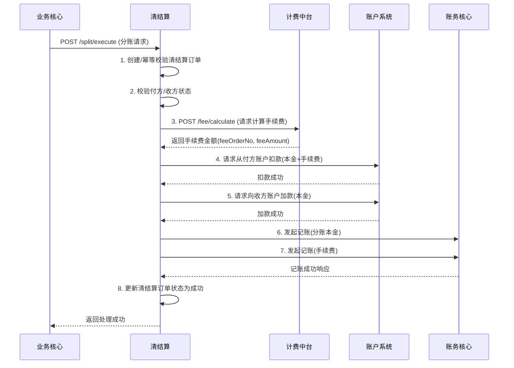
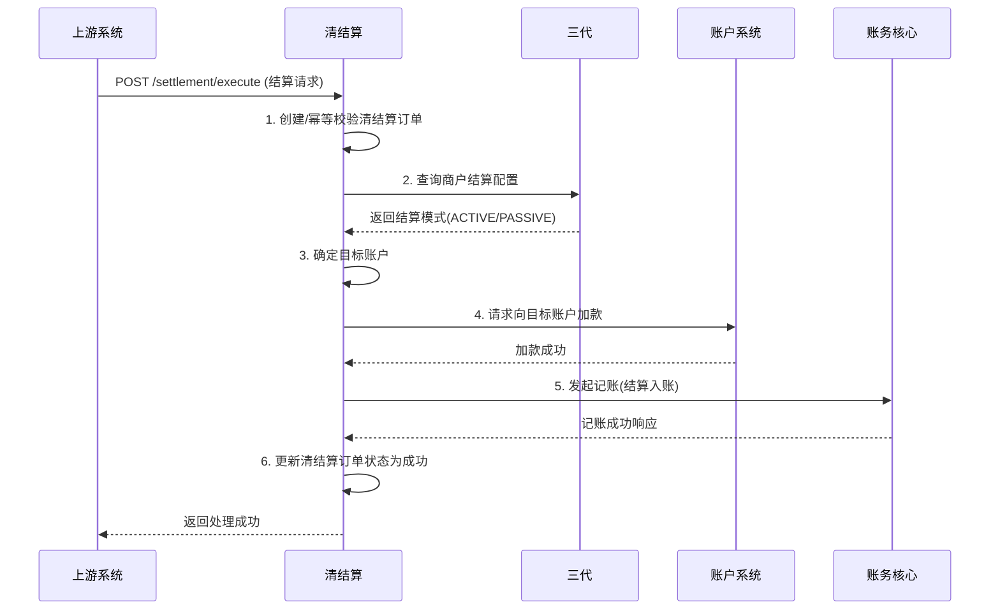
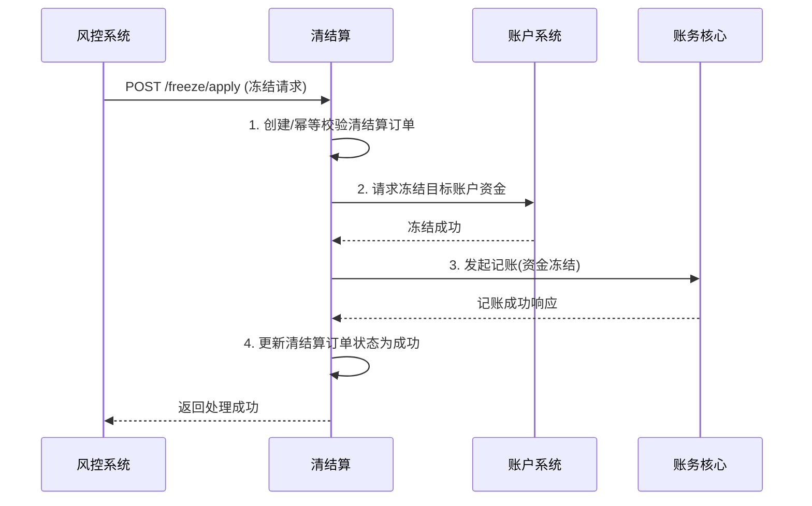

# 模块设计: 清结算

生成时间: 2026-01-22 15:42:26
批判迭代: 2

---

# 模块设计: 清结算

生成时间: TBD
批判迭代: TBD

---

# 清结算模块设计文档

## 1. 概述
- **目的与范围**: 本模块是负责资金清算与结算的核心系统，处理交易清分、结算入账、冻结申请、退货扣款等资金流转的核心环节。它接收上游交易数据，根据规则进行资金分配和状态处理，并驱动账户系统完成资金划转，是连接交易、账户与账务的关键枢纽。

## 2. 接口设计
- **API端点 (REST)**:
    - `POST /api/v1/settlement/execute`: 执行交易清分与结算入账。
    - `POST /api/v1/split/execute`: 执行分账/归集处理。
    - `POST /api/v1/freeze/apply`: 申请资金冻结。
    - `POST /api/v1/refund/deduct`: 执行退货前置与扣款。
- **请求/响应结构**:
    - 结算请求 (`POST /api/v1/settlement/execute`):
        ```json
        {
          "requestId": "string，请求唯一标识",
          "bizOrderNo": "string，业务订单号",
          "merchantId": "string，商户标识",
          "amount": "BigDecimal，结算金额",
          "settlementMode": "string，结算模式 (ACTIVE/PASSIVE)",
          "extInfo": "object，扩展信息"
        }
        ```
    - 分账请求 (`POST /api/v1/split/execute`):
        ```json
        {
          "requestId": "string，请求唯一标识",
          "bizOrderNo": "string，业务订单号",
          "payerAccountNo": "string，付款方账户号",
          "receiverAccountNo": "string，收款方账户号",
          "amount": "BigDecimal，分账本金",
          "bizType": "string，业务类型 (SPLIT/COLLECTION)",
          "extInfo": "object，扩展信息"
        }
        ```
    - 冻结请求 (`POST /api/v1/freeze/apply`):
        ```json
        {
          "requestId": "string，请求唯一标识",
          "accountNo": "string，目标账户号",
          "freezeAmount": "BigDecimal，冻结金额",
          "freezeType": "string，冻结类型 (TRANSACTION/MERCHANT)",
          "freezeReason": "string，冻结原因",
          "extInfo": "object，扩展信息"
        }
        ```
    - 退货扣款请求 (`POST /api/v1/refund/deduct`):
        ```json
        {
          "requestId": "string，请求唯一标识",
          "refundOrderNo": "string，退货订单号",
          "originalOrderNo": "string，原交易订单号",
          "deductAmount": "BigDecimal，扣款金额",
          "extInfo": "object，扩展信息"
        }
        ```
    - 通用响应结构:
        ```json
        {
          "code": "string，响应码",
          "message": "string，响应信息",
          "data": {
            "requestId": "string，原请求ID",
            "clearingOrderNo": "string，清结算订单号",
            "status": "string，处理状态"
          }
        }
        ```
- **发布/消费的事件**:
    - 消费事件: TBD
    - 发布事件: TBD

## 3. 数据模型
- **表/集合**:
    - `clearing_order`: 清结算主订单表。
    - `settlement_detail`: 结算明细表。
    - `split_detail`: 分账明细表。
    - `freeze_record`: 冻结记录表。
    - `refund_deduct_record`: 退货扣款记录表。
- **关键字段**:
    - `clearing_order`:
        - `id` (主键)
        - `clearing_order_no` (清结算订单号，唯一)
        - `biz_order_no` (关联业务订单号)
        - `biz_type` (业务类型: SETTLEMENT, SPLIT, FREEZE, REFUND_DEDUCT)
        - `request_id` (请求唯一标识，用于幂等)
        - `status` (状态: INIT, PROCESSING, SUCCESS, FAILED)
        - `amount` (涉及总金额)
        - `payer_account_no` (付款方账户，可选)
        - `receiver_account_no` (收款方账户，可选)
        - `created_time` (创建时间)
        - `updated_time` (更新时间)
    - `settlement_detail`:
        - `id` (主键)
        - `clearing_order_no` (关联清结算订单号)
        - `merchant_id` (商户标识)
        - `settlement_mode` (结算模式)
        - `target_account_no` (目标账户: 天财收款账户或待结算账户)
        - `settled_amount` (已结算金额)
        - `settlement_status` (结算状态)
    - `split_detail`:
        - `id` (主键)
        - `clearing_order_no` (关联清结算订单号)
        - `fee_order_no` (计费订单号，来自计费中台)
        - `principal_amount` (分账本金)
        - `fee_amount` (手续费)
        - `split_status` (分账状态)
    - `freeze_record`:
        - `id` (主键)
        - `clearing_order_no` (关联清结算订单号)
        - `frozen_account_no` (被冻结账户)
        - `freeze_type` (冻结类型)
        - `frozen_amount` (冻结金额)
        - `freeze_status` (冻结状态)
    - `refund_deduct_record`:
        - `id` (主键)
        - `clearing_order_no` (关联清结算订单号)
        - `source_account_no` (扣款来源账户)
        - `deduct_amount` (扣款金额)
        - `deduct_status` (扣款状态)
- **与其他模块的关系**: `clearing_order` 通过 `biz_order_no` 关联上游业务数据；通过 `payer_account_no`/`receiver_account_no` 关联账户系统的账户；通过 `fee_order_no` 关联计费中台的计费记录；清结算订单的完成会触发账务核心记账。

## 4. 业务逻辑
- **核心工作流/算法**:
    1.  **交易清分与结算入账**:
        - 接收结算请求，校验商户状态（依赖三代）和结算模式。
        - 若为主动结算 (`ACTIVE`)，目标账户为商户的天财收款账户；若为被动结算 (`PASSIVE`) 或未配置，目标账户为系统默认的待结算账户。
        - 驱动账户系统向目标账户增加余额。
        - 状态更新为成功，并触发账务核心进行结算入账记账。
    2.  **分账/归集处理**:
        - 接收分账请求，校验付方与收方的账户状态及绑定关系（若需要）。
        - 调用计费中台计算手续费。
        - 驱动账户系统从付方账户扣款（本金+手续费）。
        - 驱动账户系统向收方账户加款（本金）。
        - 状态更新为成功，并触发账务核心进行分账本金和手续费的记账。
    3.  **冻结处理**:
        - 接收冻结请求，校验目标账户状态。
        - 驱动账户系统对指定账户进行资金冻结。
        - 状态更新为成功，并触发账务核心进行冻结记账。
    4.  **退货前置与扣款**:
        - 接收退货扣款请求，根据原订单信息查询扣款来源（天财收款账户或退货账户）。
        - 驱动账户系统从源账户扣款。
        - 状态更新为成功，并触发账务核心进行退货扣款记账。
- **业务规则与验证**:
    - 所有请求需携带唯一 `requestId` 实现幂等性。
    - 验证结算指令的合法性（如商户状态、账户状态）。
    - 校验分账/归集关系中付方与收方的绑定状态。
    - 确保资金划转的原子性：通过本地事务保证清结算订单状态与驱动账户系统操作的协同，若账户操作失败，整体流程回滚。
- **关键边界情况处理**:
    - 清分时商户结算配置异常：走默认被动结算至待结算账户。
    - 分账时接收方账户状态异常（如已冻结）：中止流程，返回明确错误。
    - 退货扣款时源账户余额不足：中止流程，返回明确错误。
    - 计费中台服务不可用：分账流程中止，返回系统错误。
- **并发与一致性**:
    - 对同一账户的并发操作（如同时扣款）通过数据库乐观锁（版本号）在应用层控制，或在关键步骤使用分布式锁。
    - 通过 `requestId` 保证请求的幂等性，防止重复处理。
    - 资金操作与记账操作的最终一致性：若驱动账务核心记账失败，记录失败日志，通过异步补偿任务重试或触发对账机制修复。
- **数据生命周期管理**:
    - 业务表数据根据监管和审计要求设置保留期限（如5年）。
    - 过期数据可归档至历史库或冷存储。

## 5. 时序图

### 5.1 分账时序图


### 5.2 结算入账时序图


### 5.3 冻结时序图


## 6. 错误处理
- **预期错误情况与错误码**:
    - `INVALID_REQUEST` (400): 请求参数错误或缺失。
    - `MERCHANT_NOT_FOUND` (404): 商户不存在或状态异常。
    - `ACCOUNT_STATUS_ERROR` (409): 账户状态异常（冻结、注销等）。
    - `INSUFFICIENT_BALANCE` (409): 账户余额不足。
    - `BINDING_RELATION_INVALID` (409): 分账绑定关系无效。
    - `FEE_CALCULATION_FAILED` (500): 计费中台调用失败。
    - `ACCOUNT_OPERATION_FAILED` (500): 账户系统操作失败。
    - `ACCOUNTING_FAILED` (500): 账务核心记账失败。
    - `DUPLICATE_REQUEST` (409): 重复请求（幂等性冲突）。
- **处理策略**:
    - 对于参数、商户、账户状态、余额不足、绑定关系等业务规则错误，立即中止流程，更新清结算订单状态为失败，并向上游返回明确的错误码和信息。
    - 对于计费中台、账户系统、账务核心等依赖服务的暂时性失败（网络超时、短暂不可用），实施带退避策略的重试机制（如最多3次）。
    - 对于账户系统操作失败，确保本地事务回滚，清结算订单状态为失败。
    - 对于账务核心记账失败，记录失败日志并触发异步补偿任务进行重试，确保最终一致性。
    - 所有错误均需在对应的清结算订单及相关明细表中记录失败状态和错误原因。

## 7. 依赖关系
- **上游模块**:
    - **业务核心**: 提供分账、结算等业务请求。
    - **三代**: 提供商户结算配置查询。
    - **风控系统**: 发起交易冻结或商户冻结指令。
- **下游模块**:
    - **账户系统**: 执行原子化的账户余额扣减、增加、冻结操作。
    - **账务核心**: 接收清结算模块的指令，为资金变动记录会计分录。
    - **计费中台**: 为分账等业务计算手续费。
- **交互说明**: 本模块是资金流转的协调者。它接收上游业务指令，依赖账户系统执行原子资金操作，依赖账务核心完成记账，依赖计费中台获取手续费。通过幂等设计和状态机管理，确保资金操作与账务记录的协调一致。