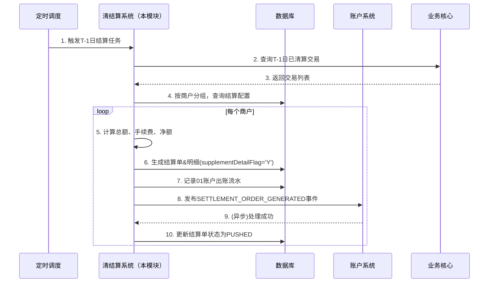
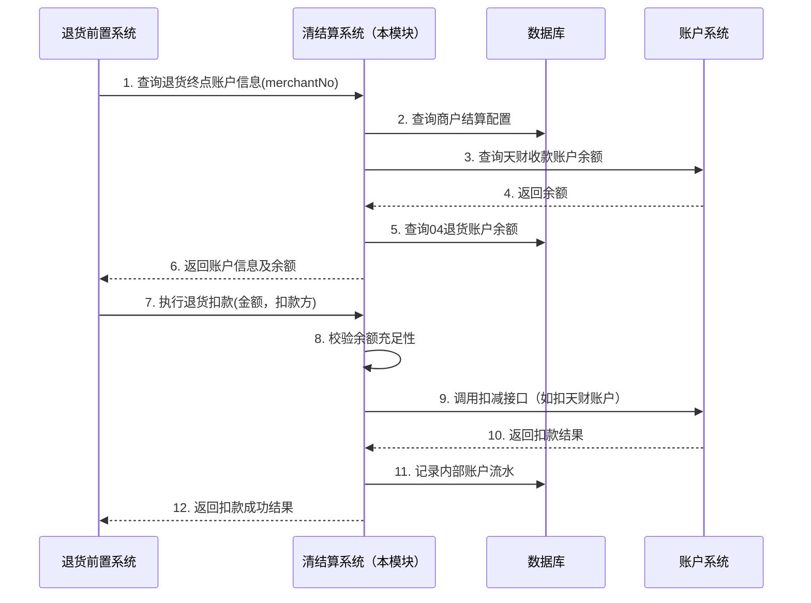

# 模块设计: 清结算系统

生成时间: 2026-01-16 16:48:05

---

# 清结算系统模块设计文档

## 1. 概述

### 1.1 目的
本模块是“天财分账”业务的核心资金处理中枢，负责处理收单交易的**资金清算、结算、计费以及退货资金处理**。核心目标是确保天财专用账户体系内的资金能够准确、及时地从待结算账户（01账户）结算至天财收款账户，并支持退货、冻结等资金操作，同时为对账单系统提供完整的结算明细数据。

### 1.2 范围
- **资金结算**：将收单交易资金从待结算账户（01账户）结算至商户指定的天财收款账户或普通收款账户。
- **计费处理**：接收计费中台计算的分账手续费，并在结算或分账时进行扣收。
- **退货资金处理**：支持“终点账户+退货账户”模式，处理涉及天财收款账户的退货交易。
- **账户冻结联动**：响应风控指令，冻结已结算至天财收款账户的资金。
- **结算单生成与推送**：生成包含明细的结算单，并推送给账户系统，驱动账户余额变更和流水生成。
- **对账数据供给**：为对账单系统提供待结算账户、退货账户的动账明细，以及结算单与交易的关联关系。

## 2. 接口设计

### 2.1 API端点 (RESTful)

#### 2.1.1 内部接口 (供三代系统、行业钱包系统调用)

**1. 更新商户结算账户配置**
- **端点**: `POST /internal/v1/settlement/merchant/config`
- **描述**: 接收三代系统同步的商户结算账户配置变更（如切换为天财收款账户）。
- **请求头**:
    - `X-Source-System: GEN3_SYSTEM`
    - `X-Request-Id`: 请求唯一标识
- **请求体**:
```json
{
  "requestId": "config_20240116001",
  "merchantNo": "88800010001",
  "institutionNo": "860000",
  "settlementMode": "ACTIVE", // 结算模式: ACTIVE, PASSIVE
  "settlementAccountNo": "TC_ACC_88800010001_R001", // 结算目标账户号（天财收款账户或普通收款账户）
  "settlementAccountType": "TIANCAI_RECEIVE_ACCOUNT", // 账户类型
  "effectiveTime": "2024-01-17 00:00:00", // 配置生效时间
  "operator": "system"
}
```
- **响应体 (成功)**:
```json
{
  "code": "SUCCESS",
  "message": "结算账户配置更新成功",
  "data": {
    "configId": "CONFIG_001",
    "status": "EFFECTIVE"
  }
}
```

**2. 查询退货终点账户信息**
- **端点**: `GET /internal/v1/settlement/refund/target-account`
- **描述**: 退货前置流程调用，查询指定商户的退货终点账户（天财收款账户）信息及余额。
- **查询参数**: `merchantNo=88800010001&originalOrderNo=ORD123456`
- **响应体**:
```json
{
  "code": "SUCCESS",
  "data": {
    "merchantNo": "88800010001",
    "targetAccountNo": "TC_ACC_88800010001_R001",
    "targetAccountType": "TIANCAI_RECEIVE_ACCOUNT",
    "availableBalance": 15000.00,
    "refundAccountNo": "REF_ACC_88800010001_04", // 关联的04退货账户
    "refundAccountBalance": 5000.00,
    "supportPreDeduct": true // 是否支持预扣退货账户资金
  }
}
```

**3. 执行退货扣款**
- **端点**: `POST /internal/v1/settlement/refund/deduct`
- **描述**: 退货前置流程确认后，从终点账户（天财收款账户）或退货账户扣减资金。
- **请求体**:
```json
{
  "requestId": "refund_deduct_001",
  "originalOrderNo": "ORD123456",
  "refundOrderNo": "REF123456",
  "merchantNo": "88800010001",
  "targetAccountNo": "TC_ACC_88800010001_R001",
  "deductAmount": 100.00,
  "deductFrom": "TARGET_ACCOUNT", // 枚举: TARGET_ACCOUNT, REFUND_ACCOUNT, AUTO
  "operator": "system"
}
```
- **响应体**:
```json
{
  "code": "SUCCESS",
  "data": {
    "deductNo": "DEDUCT_20240116001",
    "actualDeductAccount": "TC_ACC_88800010001_R001",
    "deductedAmount": 100.00,
    "remainingBalance": 14900.00
  }
}
```

#### 2.1.2 内部接口 (供账户系统、对账单系统调用)

**4. 查询待结算/退货账户动账明细**
- **端点**: `GET /internal/v1/settlement/accounts/{accountType}/statements`
- **描述**: 为对账单系统提供待结算账户（01）、退货账户（04）的动账明细。
- **路径参数**: `accountType` - 01 (待结算) 或 04 (退货)
- **查询参数**: 
    - `merchantNo` (可选)
    - `startTime=2024-01-15 00:00:00`
    - `endTime=2024-01-15 23:59:59`
    - `pageNum=1`
    - `pageSize=100`
- **响应体**:
```json
{
  "code": "SUCCESS",
  "data": {
    "accountType": "01",
    "statements": [
      {
        "seqNo": "SETTLE_202401150001",
        "accountNo": "SETTLE_01_88800010001",
        "transTime": "2024-01-15 10:30:25",
        "transType": "TRADE_IN", // 交易入账
        "amount": 500.00,
        "balance": 1500.00,
        "relatedOrderNo": "ORD123456",
        "relatedMerchantNo": "88800010001",
        "tradeType": "CONSUME",
        "tradeAmount": 500.00,
        "feeAmount": 2.50,
        "netAmount": 497.50
      }
    ],
    "total": 150,
    "pageNum": 1,
    "pageSize": 100
  }
}
```

### 2.2 发布/消费的事件

#### 2.2.1 消费的事件
1.  **交易清算完成事件** (来自支付核心)
    - 事件类型: `TRADE_SETTLEMENT_READY`
    - 负载: `{“batchNo”: “B20240116”, “merchantNo”: “...”, “tradeList”: [...], “settleDate”: “2024-01-16”}`
    - 动作: 触发批量结算流程，生成结算单。

2.  **计费结果事件** (来自计费中台)
    - 事件类型: `FEE_CALCULATED`
    - 负载: `{“bizNo”: “...”, “bizType”: “TIANCAI_SPLIT”, “payer”: “...”, “payee”: “...”, “amount”: 10000, “feeAmount”: 10, “feeBearer”: “PAYER”}`
    - 动作: 记录分账手续费，用于结算时扣收。

3.  **商户冻结指令事件** (来自风控系统)
    - 事件类型: `MERCHANT_FREEZE_COMMAND`
    - 负载: `{“merchantNo”: “...”, “freezeType”: “MERCHANT”|“TRADE”, “freezeReason”: “...”, “freezeAmount”: 1000.00 (可选), “relatedOrderNo”: “...” (可选)}`
    - 动作: 冻结商户对应的天财收款账户资金。

#### 2.2.2 发布的事件
1.  **结算单生成事件**
    - 事件类型: `SETTLEMENT_ORDER_GENERATED`
    - 负载: 
    ```json
    {
      "settlementOrderNo": "SO202401160001",
      "merchantNo": "88800010001",
      "accountNo": "TC_ACC_88800010001_R001",
      "settlementDate": "2024-01-16",
      "totalAmount": 10000.00,
      "totalFee": 50.00,
      "netAmount": 9950.00,
      "supplementDetailFlag": "Y", // 是否补明细
      "detailList": [
        {
          "detailNo": "SD001",
          "originalOrderNo": "ORD123456",
          "tradeAmount": 500.00,
          "feeAmount": 2.50,
          "netAmount": 497.50,
          "tradeTime": "2024-01-15 10:30:25"
        }
      ]
    }
    ```
    - 订阅方: **账户系统**（核心消费者，用于更新余额和生成流水）。

2.  **资金冻结结果事件**
    - 事件类型: `FUND_FREEZE_RESULT`
    - 负载: `{“freezeId”: “...”, “merchantNo”: “...”, “accountNo”: “...”, “freezeAmount”: 1000.00, “freezeStatus”: “SUCCESS”|“FAILED”, “failReason”: “...”}`
    - 订阅方: 风控系统、行业钱包系统。

## 3. 数据模型

### 3.1 核心表设计

```sql
-- 结算单主表
CREATE TABLE t_settlement_order (
    id BIGINT PRIMARY KEY AUTO_INCREMENT,
    settlement_order_no VARCHAR(64) NOT NULL UNIQUE COMMENT '结算单号',
    merchant_no VARCHAR(32) NOT NULL COMMENT '商户号',
    institution_no VARCHAR(16) NOT NULL COMMENT '机构号',
    account_no VARCHAR(64) NOT NULL COMMENT '结算目标账户号（天财收款账户）',
    account_type VARCHAR(32) NOT NULL COMMENT '账户类型',
    settlement_date DATE NOT NULL COMMENT '结算日期',
    settlement_mode VARCHAR(16) NOT NULL COMMENT '结算模式: ACTIVE, PASSIVE',
    total_amount DECIMAL(15,2) NOT NULL COMMENT '结算总金额（交易金额）',
    total_fee DECIMAL(15,2) DEFAULT 0.00 COMMENT '总手续费',
    net_amount DECIMAL(15,2) NOT NULL COMMENT '净结算金额',
    currency VARCHAR(3) DEFAULT 'CNY',
    supplement_detail_flag CHAR(1) DEFAULT 'N' COMMENT '是否补明细账单: Y/N',
    status VARCHAR(16) DEFAULT 'GENERATED' COMMENT '状态: GENERATED, PUSHED, CONFIRMED, FAILED',
    push_time DATETIME COMMENT '推送至账户系统时间',
    confirmed_time DATETIME COMMENT '账户系统确认时间',
    created_time DATETIME NOT NULL,
    updated_time DATETIME NOT NULL,
    INDEX idx_merchant_date (merchant_no, settlement_date),
    INDEX idx_account_no (account_no),
    INDEX idx_status (status)
) COMMENT '结算单主表';

-- 结算单明细表
CREATE TABLE t_settlement_detail (
    id BIGINT PRIMARY KEY AUTO_INCREMENT,
    settlement_order_no VARCHAR(64) NOT NULL COMMENT '结算单号',
    detail_no VARCHAR(64) NOT NULL UNIQUE COMMENT '明细序号',
    original_order_no VARCHAR(64) NOT NULL COMMENT '原交易订单号',
    trade_type VARCHAR(32) NOT NULL COMMENT '交易类型',
    trade_amount DECIMAL(15,2) NOT NULL COMMENT '交易金额',
    fee_amount DECIMAL(15,2) DEFAULT 0.00 COMMENT '手续费金额',
    net_amount DECIMAL(15,2) NOT NULL COMMENT '净额',
    trade_time DATETIME NOT NULL COMMENT '交易时间',
    created_time DATETIME NOT NULL,
    INDEX idx_settlement_order (settlement_order_no),
    INDEX idx_original_order (original_order_no),
    FOREIGN KEY (settlement_order_no) REFERENCES t_settlement_order(settlement_order_no)
) COMMENT '结算单明细表';

-- 商户结算配置表
CREATE TABLE t_merchant_settlement_config (
    id BIGINT PRIMARY KEY AUTO_INCREMENT,
    merchant_no VARCHAR(32) NOT NULL UNIQUE COMMENT '商户号',
    institution_no VARCHAR(16) NOT NULL COMMENT '机构号',
    settlement_mode VARCHAR(16) NOT NULL COMMENT '结算模式',
    settlement_account_no VARCHAR(64) NOT NULL COMMENT '结算账户号',
    settlement_account_type VARCHAR(32) NOT NULL COMMENT '结算账户类型',
    refund_mode VARCHAR(32) DEFAULT 'TARGET_REFUND' COMMENT '退货模式: TARGET_REFUND(终点账户+退货账户), SETTLEMENT_FIRST(优先扣待结算)',
    effective_time DATETIME NOT NULL COMMENT '生效时间',
    status VARCHAR(16) DEFAULT 'EFFECTIVE' COMMENT '状态: EFFECTIVE, HISTORY',
    created_time DATETIME NOT NULL,
    updated_time DATETIME NOT NULL,
    INDEX idx_institution (institution_no),
    INDEX idx_account (settlement_account_no)
) COMMENT '商户结算配置表';

-- 内部账户流水表（01待结算、04退货）
CREATE TABLE t_internal_account_statement (
    id BIGINT PRIMARY KEY AUTO_INCREMENT,
    account_type VARCHAR(8) NOT NULL COMMENT '账户类型: 01, 04',
    account_no VARCHAR(64) NOT NULL COMMENT '内部账户号',
    seq_no VARCHAR(64) NOT NULL UNIQUE COMMENT '流水序号',
    trans_time DATETIME NOT NULL COMMENT '交易时间',
    trans_type VARCHAR(32) NOT NULL COMMENT '交易类型: TRADE_IN, REFUND_OUT, SETTLE_OUT, etc.',
    amount DECIMAL(15,2) NOT NULL COMMENT '变动金额',
    balance DECIMAL(15,2) NOT NULL COMMENT '变动后余额',
    related_order_no VARCHAR(64) COMMENT '关联订单号',
    related_merchant_no VARCHAR(32) COMMENT '关联商户号',
    trade_type VARCHAR(32) COMMENT '交易类型（如CONSUME）',
    trade_amount DECIMAL(15,2) COMMENT '交易金额',
    fee_amount DECIMAL(15,2) COMMENT '手续费',
    net_amount DECIMAL(15,2) COMMENT '净额',
    biz_remark VARCHAR(256),
    created_time DATETIME NOT NULL,
    INDEX idx_account_time (account_no, trans_time),
    INDEX idx_merchant_time (related_merchant_no, trans_time),
    INDEX idx_order (related_order_no)
) COMMENT '内部账户（01/04）流水表';

-- 资金冻结记录表
CREATE TABLE t_fund_freeze_record (
    id BIGINT PRIMARY KEY AUTO_INCREMENT,
    freeze_id VARCHAR(64) NOT NULL UNIQUE COMMENT '冻结流水号',
    merchant_no VARCHAR(32) NOT NULL COMMENT '商户号',
    account_no VARCHAR(64) NOT NULL COMMENT '被冻结账户（天财收款账户）',
    freeze_type VARCHAR(16) NOT NULL COMMENT '冻结类型: MERCHANT, TRADE',
    freeze_amount DECIMAL(15,2) NOT NULL COMMENT '冻结金额',
    frozen_balance DECIMAL(15,2) NOT NULL COMMENT '冻结后冻结余额',
    freeze_reason VARCHAR(256),
    related_order_no VARCHAR(64) COMMENT '关联订单号（交易冻结时）',
    freeze_status VARCHAR(16) DEFAULT 'ACTIVE' COMMENT '状态: ACTIVE, RELEASED, PARTIAL_RELEASED',
    release_time DATETIME,
    created_time DATETIME NOT NULL,
    INDEX idx_merchant (merchant_no),
    INDEX idx_account (account_no),
    INDEX idx_status (freeze_status)
) COMMENT '资金冻结记录表';
```

### 3.2 与其他模块的关系
- **账户系统**: **核心下游**。本模块向账户系统推送结算单事件，驱动天财收款账户余额变更。同时，账户系统为本模块提供账户余额查询能力（用于退货前置）。
- **三代系统**: **上游配置源**。接收商户结算账户配置（特别是天财收款账户），并据此进行结算路由。
- **行业钱包系统**: 在退货前置流程中，作为查询方调用本模块获取终点账户信息。
- **计费中台**: **上游依赖**。获取分账手续费计算结果，在结算时进行扣收。
- **对账单系统**: **下游数据消费者**。为本模块提供待结算账户（01）、退货账户（04）的动账明细，以及结算单与交易的关联关系。
- **支付核心/业务核心**: 提供原始交易数据，触发清算流程。
- **风控系统**: 接收冻结指令，对天财收款账户资金进行冻结。

## 4. 业务逻辑

### 4.1 核心算法与流程

**1. D+1批量结算流程（天财收款账户）:**
```
触发: 每日定时任务或TRADE_SETTLEMENT_READY事件
输入: 结算日期T-1日的所有已清算交易
步骤:
1. 按商户维度分组交易数据。
2. 查询每个商户的当前有效结算配置(t_merchant_settlement_config)。
3. 对于配置了天财收款账户的商户：
   a. 汇总交易金额、手续费，计算净额。
   b. 生成结算单号，插入t_settlement_order。
   c. 遍历交易明细，为每笔交易生成结算明细，插入t_settlement_detail。
   d. 设置supplementDetailFlag='Y'（要求账户系统补明细）。
4. 对于普通收款账户商户，流程类似，但supplementDetailFlag='N'。
5. 对于每个生成的结算单：
   a. 从01待结算账户扣减净结算金额，生成01账户出账流水。
   b. 发布SETTLEMENT_ORDER_GENERATED事件（包含明细）。
   c. 更新结算单状态为PUSHED。
6. 账户系统消费事件，完成资金划转和流水生成。
```

**2. 退货前置查询与扣款流程:**
```
场景: 商户发起退货，退货前置查询终点账户
步骤:
1. 退货前置调用本模块【查询退货终点账户信息】接口。
2. 本模块根据merchantNo查询t_merchant_settlement_config：
   a. 获取settlement_account_no（天财收款账户）和refund_mode。
   b. 调用账户系统接口查询该天财收款账户的可用余额。
   c. 查询关联的04退货账户余额。
3. 返回账户信息及余额。
4. 若退货前置决定扣款，调用【执行退货扣款】接口。
5. 本模块根据deductFrom策略：
   a. TARGET_ACCOUNT: 直接从天财收款账户扣减。
   b. REFUND_ACCOUNT: 从04退货账户扣减。
   c. AUTO: 优先扣天财收款账户，余额不足则预扣04账户。
6. 生成内部账户流水（01/04），记录扣款。
```

**3. 商户/交易冻结处理流程:**
```
触发: MERCHANT_FREEZE_COMMAND事件
步骤:
1. 解析事件，获取freezeType。
2. 若freezeType='MERCHANT':
   a. 根据merchantNo找到其所有天财收款账户。
   b. 调用账户系统接口，冻结这些账户（账户系统会设置状态为FROZEN）。
   c. 记录冻结流水到t_fund_freeze_record。
3. 若freezeType='TRADE':
   a. 根据relatedOrderNo找到对应的结算明细及结算单。
   b. 定位资金所在的天财收款账户(account_no)。
   c. 调用账户系统接口，冻结该账户的指定金额(freezeAmount)。
   d. 记录冻结流水。
4. 发布FUND_FREEZE_RESULT事件。
```

### 4.2 关键业务规则与校验逻辑
1.  **结算账户配置生效规则**:
    - 三代系统同步的配置，`effective_time`为未来时间（如次日0点），本模块会在此时间点后生效。
    - 生效前，仍按原配置结算。
    - 同一商户仅能有一条`status='EFFECTIVE'`的配置。

2.  **退货模式规则**:
    - 天财机构下的新商户，默认退货模式为`TARGET_REFUND`（终点账户+退货账户）。
    - 当商户结算模式在主动/被动间切换时，退货模式自动同步变更（与结算模式逻辑绑定）。

3.  **结算单生成规则**:
    - 仅当`settlement_account_type`为`TIANCAI_RECEIVE_ACCOUNT`时，`supplementDetailFlag`才设为`'Y'`，要求账户系统生成子账单明细。
    - 结算单号生成规则：`SO` + `yyyymmdd` + `7位序列号`。

4.  **资金冻结联动规则**:
    - 商户冻结：冻结该商户名下所有状态为`ACTIVE`的天财收款账户，禁止所有出金操作。
    - 交易冻结：仅冻结涉及特定交易的那部分资金，不影响账户其他资金的使用。
    - 冻结金额不能超过账户可用余额。

5.  **手续费处理规则**:
    - 分账手续费由计费中台计算，本模块记录并在结算时体现。
    - 收单交易手续费在清算时已扣减，结算单中的`total_fee`仅为展示，实际结算净额已扣除。

## 5. 时序图

### 5.1 D+1结算至天财收款账户时序图



### 5.2 退货前置查询扣款时序图



## 6. 错误处理

| 错误场景 | 错误码 | 处理策略 | 是否重试 |
| :--- | :--- | :--- | :--- |
| 结算账户配置不存在 | `SETTLEMENT_CONFIG_NOT_FOUND` | 记录告警，该商户结算暂停，需人工介入检查三代配置。 | 否（需人工） |
| 天财收款账户状态异常（冻结、关闭） | `TARGET_ACCOUNT_INVALID` | 结算失败，记录错误日志并告警。资金暂留01账户。 | 是（每日重试） |
| 01账户余额不足 | `INSUFFICIENT_SETTLEMENT_BALANCE` | 系统严重错误，立即告警，暂停所有结算。需紧急核查交易与清算数据。 | 否（需人工） |
| 退货扣款时账户余额不足 | `INSUFFICIENT_REFUND_BALANCE` | 返回错误，退货前置流程终止或尝试其他路径。 | 否 |
| 推送结算单至账户系统失败 | `PUSH_TO_ACCOUNT_FAILED` | 记录日志，进入重试队列（最多5次，指数退避）。最终失败则人工干预。 | 是 |
| 计费结果未找到 | `FEE_RESULT_NOT_FOUND` | 使用默认费率（0）继续结算，同时记录告警日志。 | 否（但告警） |
| 数据库连接异常 | `DB_CONNECTION_ERROR` | 记录日志，抛出系统异常，依赖框架重试机制。 | 是 |

**通用策略**:
- 所有对外接口返回统一格式的响应体。
- 资金类操作（结算、扣款）必须保证事务性，失败后全额回滚。
- 事件处理需支持幂等，基于业务唯一键（`settlementOrderNo`, `freezeId`）去重。
- 建立监控大盘，对结算成功率、延迟、失败订单数进行实时监控和告警。

## 7. 依赖说明

### 7.1 上游依赖
1.  **三代系统**:
    - **交互方式**: 同步RPC调用（配置更新接口）。
    - **依赖内容**: 商户结算账户配置（特别是天财收款账户绑定）。
    - **兼容性**: 需严格校验机构号、商户号、账户号的合法性。配置生效时间需妥善处理。

2.  **计费中台**:
    - **交互方式**: 异步消息（消费`FEE_CALCULATED`事件）。
    - **依赖内容**: 分账业务的手续费计算结果。
    - **要求**: 事件格式稳定，确保手续费与分账指令能正确关联（通过`bizNo`）。

3.  **业务核心/支付核心**:
    - **交互方式**: 异步消息（消费`TRADE_SETTLEMENT_READY`事件）或直接查询。
    - **依赖内容**: 已清算的交易明细数据，用于生成结算单。
    - **要求**: 交易数据准确、完整，清算状态明确。

4.  **风控系统**:
    - **交互方式**: 异步消息（消费`MERCHANT_FREEZE_COMMAND`事件）。
    - **依赖内容**: 商户/交易冻结指令。
    - **要求**: 指令需包含明确的商户、账户、金额信息。

### 7.2 下游依赖
1.  **账户系统**:
    - **交互方式**: **异步消息（核心）**。发布`SETTLEMENT_ORDER_GENERATED`事件。
    - **提供内容**: 结算单（含明细），驱动天财收款账户入金。
    - **要求**: 必须保证事件可靠投递。本模块需监听账户系统的处理结果（通过回调或状态查询），更新结算单状态。

2.  **对账单系统**:
    - **交互方式**: 提供查询API（`GET /internal/v1/settlement/accounts/{accountType}/statements`）。
    - **提供内容**: 01、04内部账户的动账明细，以及结算单与交易的关联关系。
    - **性能要求**: 查询频繁，数据量大，需对`account_no`和`trans_time`建立联合索引，考虑分库分表。

3.  **行业钱包系统（退货前置）**:
    - **交互方式**: 同步RPC调用（查询和扣款接口）。
    - **提供内容**: 天财收款账户信息、余额，以及执行扣款。
    - **SLA要求**: 高可用、低延迟，直接影响商户退货体验。

### 7.3 解耦与容错设计
- **事件驱动结算**: 与账户系统的结算资金划转通过事件解耦，避免同步调用超时或阻塞影响整体结算进度。
- **结算任务分片**: 大批量结算时，按商户或机构进行分片处理，并行执行，提高效率。
- **重试与补偿机制**:
    - 事件推送失败进入重试队列。
    - 每日对账任务校验结算单状态，对状态异常的（如`GENERATED`超时未`PUSHED`）进行补偿处理。
- **配置降级**: 若查询账户余额等依赖接口超时，可根据历史数据或默认值进行降级，保障核心流程（如退货查询）不中断，但需记录日志告警。
- **数据一致性对账**: 每日与账户系统进行余额对账，与业务核心进行交易结算状态对账，及时发现并修复差异。