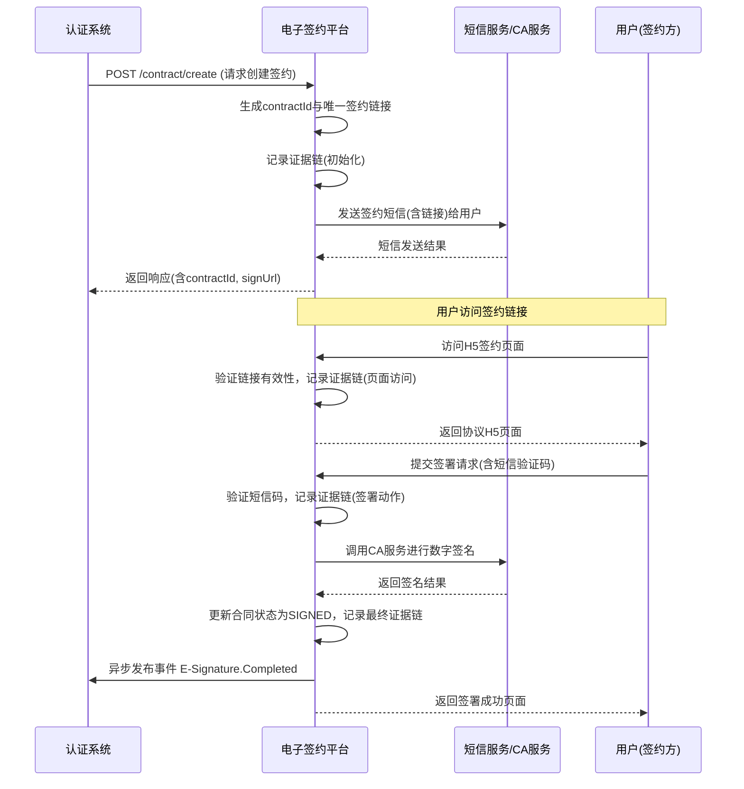

# 模块设计: 电子签约平台

生成时间: 2026-01-22 15:39:43
批判迭代: 1

---

# 电子签约平台 模块设计文档

## 1. 概述
- **目的与范围**: 本模块负责为天财业务提供电子协议签署、短信推送、H5页面封装及留存全证据链数据的服务。核心职责包括：1) 接收签约请求，生成并推送电子签约链接；2) 引导用户完成协议签署流程；3) 记录并存储签约全过程数据，形成不可篡改的证据链；4) 向业务方异步通知签约结果。本模块是完成"关系绑定"、"开通付款"等业务流程中授权环节的必要组成部分。

## 2. 接口设计
- **API端点 (REST/GraphQL)**:
    - `POST /api/v1/contract/create`：创建并初始化电子签约流程。
    - `GET /api/v1/contract/{contractId}/status`：查询电子签约状态。
    - `POST /api/v1/callback/contract/sign`：接收签约方（用户）签署完成的回调通知（内部或外部通道）。
- **请求/响应结构**:
    - 创建签约请求 (`POST /api/v1/contract/create`)：
        - 请求体: `{ "requestId": "string", "businessScenario": "BATCH_PAYMENT", "parties": [{"partyId": "string", "partyType": "HEADQUARTERS/STORE", "name": "string", "mobile": "string"}], "templateId": "string", "contractParams": {} }`
        - 响应体: `{ "contractId": "string", "signUrl": "string", "expireTime": "timestamp" }`
    - 查询签约状态响应 (`GET /api/v1/contract/{contractId}/status`)：
        - 响应体: `{ "contractId": "string", "status": "PENDING/SIGNED/EXPIRED/REVOKED", "signTime": "timestamp", "evidenceChainId": "string" }`
- **发布/消费的事件**:
    - 消费事件: TBD
    - 发布事件: `E-Signature.Completed` (签约完成事件，发布给认证系统等订阅方)。

## 3. 数据模型
- **表/集合**:
    - `contracts` (电子签约主表)
    - `signing_parties` (签约方信息表)
    - `evidence_chain` (证据链数据表)
- **关键字段**:
    - `contracts`:
        - `id` (主键), `contract_id` (业务ID), `request_id` (上游请求ID), `business_scenario` (业务场景), `template_id` (协议模板ID), `status` (PENDING/SIGNED/EXPIRED/REVOKED), `sign_url` (签约链接), `expire_time` (链接过期时间), `evidence_chain_id` (外键), `created_at`, `updated_at`。
    - `signing_parties`:
        - `id` (主键), `contract_id` (外键), `party_id` (签约方业务ID), `party_type`, `name`, `mobile`, `sign_status` (PENDING/SIGNED), `sign_time`, `sign_ip`, `sign_user_agent`。
    - `evidence_chain`:
        - `id` (主键), `evidence_chain_id` (业务证据链ID), `contract_id` (外键), `action_type` (VIEW/SIGN), `action_time`, `ip_address`, `user_agent`, `device_fingerprint`, `geo_location`, `screenshot_hash` (关键操作截图哈希), `data_hash` (前后数据哈希), `created_at`。
- **与其他模块的关系**:
    - 本模块被 **认证系统** 调用，以完成关系绑定流程中的电子签约环节。
    - 证据链数据独立存储，为所有签约行为提供审计和司法存证依据。

## 4. 业务逻辑
- **核心工作流/算法**:
    1. **签约流程初始化**: 接收创建请求，根据业务场景选择协议模板，填充变量，生成唯一的签约链接（H5页面地址）。向签约方发送包含链接的短信。
        - **技术细节**: 签约链接需包含一次性令牌（Token），有效期内仅能访问一次。链接生成后，立即记录证据链（`action_type: VIEW`）。
    2. **用户签署与证据链记录**: 用户访问H5页面查看协议，点击签署。系统记录用户操作环境（IP、UA、时间戳、地理位置等），并触发关键操作截图。调用CA机构或合规的电子签名服务完成签署，生成签名数据。
        - **技术细节**: 每次关键操作（页面加载、点击签署）均生成一条证据链记录，通过哈希链确保数据连贯性与不可篡改性。
    3. **签约完成与通知**: 所有签约方完成签署后，更新主合同状态为`SIGNED`，并异步发布`E-Signature.Completed`事件，通知上游业务系统（如认证系统）。
- **业务规则与验证**:
    - 签约链接具有时效性（如30分钟），超时未签署则流程失效。
    - 必须确保签约方身份与请求中提供的信息（如手机号）一致，通常通过短信验证码进行二次确认。
    - 证据链数据必须符合《电子签名法》等相关法规要求，确保可追溯、防篡改、可验证。
- **关键边界情况处理**:
    - 用户中途退出：签约链接支持断点续签，通过`contractId`可重新获取状态并继续流程。
    - 短信发送失败：记录失败日志，支持人工或自动重发，重试次数不超过3次。
    - 签约超时：定时任务扫描`PENDING`状态且`expire_time`已过的合同，将其状态更新为`EXPIRED`，并通知上游系统。

## 5. 时序图

## 6. 错误处理
- **预期错误情况**:
    - 外部服务异常（短信服务不可用、CA签名服务失败）。
    - 用户行为异常（验证码错误、重复提交签署、链接被篡改）。
    - 数据不一致（协议模板不存在、签约方信息缺失）。
- **处理策略**:
    - 对短信、CA等外部服务调用设置熔断机制，失败后记录日志并告警，支持人工介入补发或重试。
    - 对用户输入（如验证码）进行严格校验，并限制尝试频率，防止暴力破解。
    - 关键数据（如合同状态变更）采用事务更新，确保与证据链记录的一致性。
    - 所有错误均记录至操作日志和证据链，确保可追溯。

## 7. 依赖关系
- **上游模块**:
    - **认证系统**: 调用本模块以完成关系绑定或开通付款流程中的电子签约环节。
- **下游模块**:
    - **认证系统**: 消费本模块发布的`E-Signature.Completed`事件，以推进绑定流程。
    - **短信服务/CA机构服务**: 外部依赖，用于发送通知和执行数字签名。