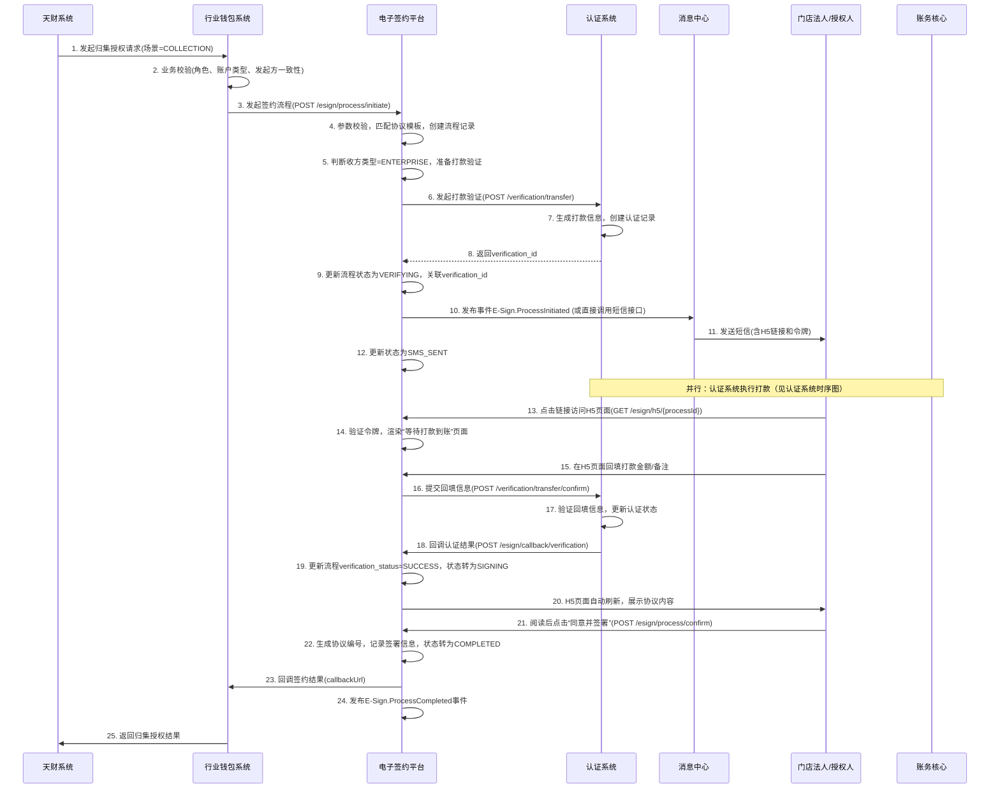
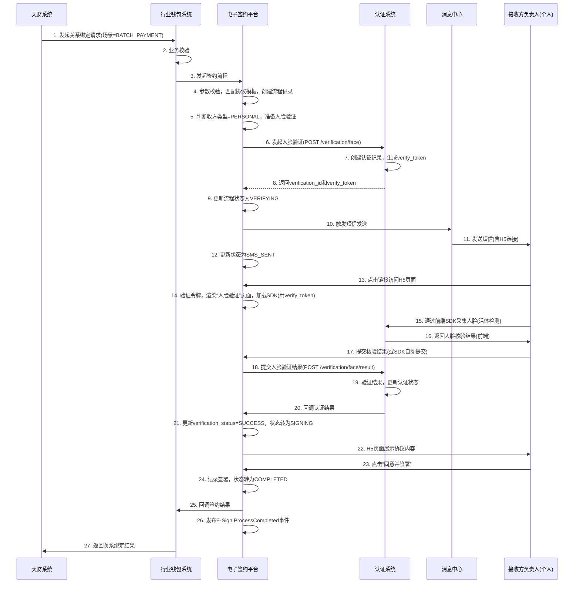

# 模块设计: 电子签约平台

生成时间: 2026-01-16 16:51:25

---

# 电子签约平台模块设计文档

## 1. 概述

### 1.1 目的
电子签约平台作为“天财分账”业务的核心合规与授权保障模块，旨在为资金流转关系（归集、批量付款、会员结算）的建立提供安全、合法、可追溯的电子签约与身份认证服务。其主要目的是：
- **协议签署与生成**：根据不同的业务场景（归集、批量付款、会员结算）和主体类型（企业/个人），生成并管理标准化的电子协议模板，支持多方在线签署。
- **身份核验集成**：作为认证流程的统一入口，根据主体类型（对公/对私）调用认证系统进行打款验证或人脸验证，并将认证结果与协议签署过程绑定，形成完整的电子证据链。
- **流程封装与引导**：通过短信推送H5链接，引导用户（法人、负责人、授权联系人）在移动端完成身份验证、协议查看与签署的全流程，提供流畅的用户体验。
- **证据链留存**：完整记录签约过程中的所有关键节点（协议内容、签署时间、认证信息、操作日志），满足监管合规与司法举证要求。

### 1.2 范围
本模块设计范围涵盖：
- **协议模板管理**：维护不同场景（归集、批量付款、会员结算、开通付款）和角色（总部/门店/接收方）对应的电子协议模板。
- **签约流程发起与管理**：接收行业钱包系统的签约请求，创建签约流程实例，并驱动其按步骤（短信通知->H5引导->身份认证->协议签署->结果回调）执行。
- **身份认证代理**：根据主体类型，代理调用认证系统的打款验证或人脸验证接口，并处理认证结果回调。
- **H5页面生成与封装**：根据场景和用户类型，动态生成包含协议内容、认证引导、签署控件的H5页面。
- **签约记录与证据链存储**：持久化存储完整的签约流程数据，包括协议快照、认证记录、签署记录、操作日志。
- **结果通知**：将签约最终结果（成功/失败）同步回调给行业钱包系统。

**边界说明**：
- 本模块**不负责**底层身份核验逻辑（打款/人脸），仅作为调用方与认证系统集成。
- 本模块**不负责**商户/账户信息（如银行卡、商户属性）的校验，这些由行业钱包系统在调用前完成。
- 本模块**不负责**短信通道的直接调用，但负责生成短信内容和H5链接，通过内部消息或接口触发短信发送（通常由消息中心执行）。
- 本模块**不负责**电子签章的法律有效性底层技术（如CA证书、时间戳），但集成第三方电子签章服务或使用公司基础能力。

## 2. 接口设计

### 2.1 API端点 (RESTful)

#### 2.1.1 发起签约流程
- **端点**: `POST /api/v1/esign/process/initiate`
- **描述**: 由行业钱包系统调用，根据业务场景和参与方信息，发起一个电子签约流程。本接口是签约流程的总入口。
- **认证**: API Key (由调用方行业钱包系统提供)
- **请求头**:
    - `X-Request-ID`: 请求唯一标识，用于幂等和追踪。
    - `X-Caller-System`: 调用方系统标识 (如：`wallet-system`)。
- **请求体**:
```json
{
  "requestId": "wallet_req_202310271500001", // 行业钱包请求ID，全局唯一
  "businessType": "TIANCAI_SPLIT", // 业务类型，固定值
  "scene": "COLLECTION", // 场景：COLLECTION(归集), BATCH_PAYMENT(批量付款), MEMBER_SETTLEMENT(会员结算), OPEN_PAYMENT(开通付款)
  "payerInfo": { // 付方信息（协议中的付款/授权方）
    "merchantNo": "M1234567890",
    "merchantName": "XX科技有限公司总部",
    "merchantType": "ENTERPRISE", // ENTERPRISE-企业, INDIVIDUAL-个体户, PERSONAL-个人
    "accountNo": "TC_ACCT_001", // 付方天财账户号
    "accountType": "TIANCAI_COLLECTION" // 账户类型: TIANCAI_COLLECTION(收款账户), TIANCAI_RECEIVING(接收方账户)
  },
  "payeeInfo": { // 收方信息（协议中的收款/被授权方），开通付款场景下与payerInfo相同
    "merchantNo": "M9876543210",
    "merchantName": "XX科技杭州门店",
    "merchantType": "ENTERPRISE",
    "accountNo": "TC_ACCT_002",
    "accountType": "TIANCAI_COLLECTION",
    "bankCardNo": "6228480012345678901", // 收方绑定默认银行卡号（用于打款验证）
    "bankAccountName": "XX科技杭州门店", // 银行卡户名
    "legalPersonName": "李四", // 法人/负责人姓名（对公/对私）
    "legalPersonIdNo": "110101199001011234", // 法人/负责人身份证号
    "contactPhone": "13800138000" // 接收短信的手机号（法人/负责人/授权联系人）
  },
  "agreementInfo": {
    "purpose": "资金归集", // 资金用途：资金归集、缴纳品牌费、供应商付款、会员结算等
    "extraParams": { // 协议模板变量
      "collectionRatio": "100%", // 归集比例
      "effectiveDate": "2023-10-27",
      "expiryDate": "2024-10-26"
    }
  },
  "callbackUrl": "https://wallet.example.com/callback/esign" // 签约结果回调地址
}
```
- **响应体 (成功)**:
```json
{
  "code": "SUCCESS",
  "message": "签约流程已发起",
  "data": {
    "processId": "esign_proc_202310271500001", // 本系统签约流程ID
    "status": "INITIATED", // 状态：INITIATED-已发起， SMS_SENT-短信已发， VERIFYING-认证中， SIGNING-签署中， COMPLETED-完成， FAILED-失败
    "expireTime": "2023-10-27T17:00:00+08:00" // 流程过期时间（如1.5小时后）
  }
}
```

#### 2.1.2 查询签约流程状态
- **端点**: `GET /api/v1/esign/process/{processId}`
- **描述**: 根据流程ID查询签约流程的详细状态和结果。
- **响应体**:
```json
{
  "code": "SUCCESS",
  "data": {
    "processId": "esign_proc_202310271500001",
    "requestId": "wallet_req_202310271500001",
    "businessType": "TIANCAI_SPLIT",
    "scene": "COLLECTION",
    "status": "COMPLETED",
    "agreementName": "资金归集授权协议",
    "agreementNo": "AGR_20231027150001",
    "payerInfo": { ... }, // 同请求体精简信息
    "payeeInfo": { ... },
    "verificationResult": {
      "type": "TRANSFER",
      "status": "SUCCESS",
      "verificationId": "verif_202310271200001",
      "verifyTime": "2023-10-27T15:05:30+08:00"
    },
    "signatureResult": {
      "signTime": "2023-10-27T15:06:00+08:00",
      "signatoryName": "李四",
      "signatoryType": "LEGAL_PERSON", // LEGAL_PERSON-法人， AUTHORIZED_PERSON-授权代理人
      "signatureHash": "abc123...",
      "caCertificate": "..." // CA证书信息（如有）
    },
    "agreementUrl": "https://esign.example.com/agreement/AGR_20231027150001", // 协议查看/下载地址
    "createTime": "2023-10-27T15:00:00+08:00",
    "completeTime": "2023-10-27T15:06:00+08:00"
  }
}
```

#### 2.1.3 处理H5页面请求
- **端点**: `GET /api/v1/esign/h5/{processId}`
- **描述**: 用户点击短信链接后访问的H5页面入口。根据流程状态，动态渲染不同的页面（等待认证、认证引导、协议签署、结果展示）。
- **请求参数**:
    - `token`: 一次性访问令牌，通过短信链接携带，用于身份验证和防篡改。
- **响应**: 返回HTML页面（服务端渲染或前端框架）。

#### 2.1.4 提交签署确认
- **端点**: `POST /api/v1/esign/process/{processId}/confirm`
- **描述**: H5页面中，用户阅读协议后点击“同意并签署”时调用，完成协议签署。
- **请求头**:
    - `X-Access-Token`: 从H5页面上下文获取的令牌。
- **请求体**:
```json
{
  "action": "AGREE", // 固定值 AGREE
  "signatoryName": "李四", // 签署人姓名（前端展示并确认）
  "userAgent": "Mozilla/5.0...",
  "ipAddress": "192.168.1.1"
}
```
- **响应体**:
```json
{
  "code": "SUCCESS",
  "message": "签署成功",
  "data": {
    "processId": "esign_proc_202310271500001",
    "nextStep": "COMPLETE", // 或 REDIRECT
    "redirectUrl": "https://esign.example.com/h5/complete?processId=..." // 签署成功页
  }
}
```

#### 2.1.5 接收认证结果回调
- **端点**: `POST /api/v1/esign/callback/verification`
- **描述**: 认证系统在验证完成后回调的接口，用于更新签约流程状态。
- **认证**: API Key (由认证系统提供)
- **请求体**:
```json
{
  "verificationId": "verif_202310271200001",
  "processId": "esign_proc_202310271500001", // 可选，认证系统从请求中记录并回传
  "status": "SUCCESS", // 或 FAILED
  "type": "TRANSFER", // TRANSFER 或 FACE
  "detail": { ... } // 认证详情摘要
}
```
- **响应体**:
```json
{
  "code": "SUCCESS",
  "message": "回调接收成功"
}
```

### 2.2 发布/消费的事件

#### 2.2.1 消费的事件
- **Verification.Completed**: 订阅认证系统发布的认证完成事件，用于异步更新签约流程状态。
```json
{
  "eventId": "event_verif_001",
  "eventType": "Verification.Completed",
  "timestamp": "2023-10-27T12:05:30+08:00",
  "payload": {
    "verificationId": "verif_202310271200001",
    "requestId": "req_202310271200001", // 对应本系统的processId或关联ID
    "status": "SUCCESS",
    "type": "TRANSFER",
    "payerMerchantNo": "M1234567890",
    "relatedBankCardNo": "6228480012345678901"
  }
}
```

#### 2.2.2 发布的事件
- **E-Sign.ProcessInitiated**: 当一个新的签约流程成功创建时发布。
```json
{
  "eventId": "event_esign_001",
  "eventType": "E-Sign.ProcessInitiated",
  "timestamp": "2023-10-27T15:00:00+08:00",
  "payload": {
    "processId": "esign_proc_202310271500001",
    "scene": "COLLECTION",
    "payerMerchantNo": "M1234567890",
    "payeeMerchantNo": "M9876543210",
    "payeeContactPhone": "13800138000"
  }
}
```
- **E-Sign.SMSSent**: 当签约短信已成功触发发送时发布（供监控和对账）。
- **E-Sign.ProcessCompleted**: 当签约流程完成（成功或失败）时发布，供行业钱包等系统订阅。
```json
{
  "eventId": "event_esign_002",
  "eventType": "E-Sign.ProcessCompleted",
  "timestamp": "2023-10-27T15:06:00+08:00",
  "payload": {
    "processId": "esign_proc_202310271500001",
    "status": "SUCCESS", // 或 FAILED
    "agreementNo": "AGR_20231027150001",
    "verificationId": "verif_202310271200001",
    "payerMerchantNo": "M1234567890",
    "payeeMerchantNo": "M9876543210",
    "failReason": "" // 失败时有值
  }
}
```

## 3. 数据模型

### 3.1 数据库表设计

#### 表: `esign_process` (签约流程主表)
| 字段名 | 类型 | 必填 | 默认值 | 说明 |
| :--- | :--- | :--- | :--- | :--- |
| `id` | bigint(20) | 是 | AUTO_INCREMENT | 主键 |
| `process_id` | varchar(32) | 是 | | **业务流程ID**，前缀`esign_proc_`，全局唯一索引 |
| `request_id` | varchar(64) | 是 | | 外部业务请求ID（行业钱包），用于幂等 |
| `business_type` | varchar(32) | 是 | | 业务类型：`TIANCAI_SPLIT` |
| `scene` | varchar(32) | 是 | | 场景：`COLLECTION`, `BATCH_PAYMENT`, `MEMBER_SETTLEMENT`, `OPEN_PAYMENT` |
| `status` | varchar(16) | 是 | `INITIATED` | 状态：`INITIATED`, `SMS_SENT`, `VERIFYING`, `SIGNING`, `COMPLETED`, `FAILED`, `EXPIRED` |
| `payer_merchant_no` | varchar(32) | 是 | | 付方商户号 |
| `payer_merchant_name` | varchar(128) | 是 | | 付方商户全称 |
| `payer_merchant_type` | varchar(16) | 是 | | 付方类型：`ENTERPRISE`, `INDIVIDUAL`, `PERSONAL` |
| `payer_account_no` | varchar(32) | 是 | | 付方账户号 |
| `payer_account_type` | varchar(32) | 是 | | 付方账户类型 |
| `payee_merchant_no` | varchar(32) | 是 | | 收方商户号 |
| `payee_merchant_name` | varchar(128) | 是 | | 收方商户全称 |
| `payee_merchant_type` | varchar(16) | 是 | | 收方类型 |
| `payee_account_no` | varchar(32) | 是 | | 收方账户号 |
| `payee_account_type` | varchar(32) | 是 | | 收方账户类型 |
| `payee_bank_card_no` | varchar(32) | 否 | | 收方绑定银行卡（打款验证用） |
| `payee_bank_account_name` | varchar(128) | 否 | | 银行卡户名 |
| `payee_legal_person_name` | varchar(64) | 否 | | 法人/负责人姓名 |
| `payee_legal_person_id_no` | varchar(32) | 否 | | 法人/负责人身份证号 |
| `payee_contact_phone` | varchar(16) | 是 | | 接收短信手机号 |
| `agreement_name` | varchar(128) | 是 | | 协议名称 |
| `agreement_no` | varchar(32) | 否 | | 协议编号，签署后生成 |
| `agreement_purpose` | varchar(64) | 是 | | 资金用途 |
| `agreement_variables` | json | 否 | | 协议模板变量（JSON格式） |
| `verification_type` | varchar(16) | 是 | | 认证类型：`TRANSFER`, `FACE`，根据收方类型决定 |
| `verification_id` | varchar(32) | 否 | | 关联的认证流水ID |
| `verification_status` | varchar(16) | 否 | | 认证状态：`PENDING`, `SUCCESS`, `FAILED` |
| `callback_url` | varchar(512) | 是 | | 结果回调地址（行业钱包） |
| `expire_time` | datetime | 是 | | 流程过期时间 |
| `sms_sent_time` | datetime | 否 | | 短信发送时间 |
| `sign_time` | datetime | 否 | | 协议签署时间 |
| `complete_time` | datetime | 否 | | 流程完成时间 |
| `fail_reason` | varchar(256) | 否 | | 失败原因 |
| `create_time` | datetime | 是 | CURRENT_TIMESTAMP | 创建时间 |
| `update_time` | datetime | 是 | CURRENT_TIMESTAMP ON UPDATE | 更新时间 |
| **索引** | | | | |
| idx_process_id | `process_id` | | UNIQUE | 主流程ID索引 |
| idx_request_id | `request_id` | | | 业务请求ID索引 |
| idx_payer_merchant_no | `payer_merchant_no` | | | 付方商户号查询 |
| idx_payee_contact_phone | `payee_contact_phone` | | | 手机号查询（用于H5入口） |
| idx_status_expire | `status`, `expire_time` | | | 状态和过期时间，用于定时任务 |

#### 表: `agreement_template` (协议模板表)
| 字段名 | 类型 | 必填 | 默认值 | 说明 |
| :--- | :--- | :--- | :--- | :--- |
| `id` | bigint(20) | 是 | AUTO_INCREMENT | 主键 |
| `template_id` | varchar(32) | 是 | | 模板ID，如 `TPL_COLLECTION_ENTERPRISE` |
| `template_name` | varchar(128) | 是 | | 模板名称 |
| `business_type` | varchar(32) | 是 | | 业务类型：`TIANCAI_SPLIT` |
| `scene` | varchar(32) | 是 | | 适用场景 |
| `payer_type` | varchar(16) | 是 | `ANY` | 付方类型：`ENTERPRISE`, `INDIVIDUAL`, `PERSONAL`, `ANY` |
| `payee_type` | varchar(16) | 是 | `ANY` | 收方类型 |
| `agreement_purpose` | varchar(64) | 否 | | 资金用途（为空表示通用） |
| `content_template` | text | 是 | | 协议内容模板（含变量占位符） |
| `version` | varchar(16) | 是 | | 模板版本，如 `1.0` |
| `effective_date` | date | 是 | | 生效日期 |
| `expiry_date` | date | 否 | | 失效日期 |
| `is_active` | tinyint(1) | 是 | 1 | 是否激活 |
| `creator` | varchar(32) | 是 | | 创建人 |
| `create_time` | datetime | 是 | CURRENT_TIMESTAMP | 创建时间 |
| **索引** | | | | |
| idx_template_key | `business_type`, `scene`, `payer_type`, `payee_type`, `agreement_purpose`, `is_active` | | | 模板检索复合索引 |

#### 表: `signature_record` (签署记录表)
| 字段名 | 类型 | 必填 | 默认值 | 说明 |
| :--- | :--- | :--- | :--- | :--- |
| `id` | bigint(20) | 是 | AUTO_INCREMENT | 主键 |
| `process_id` | varchar(32) | 是 | | 关联流程ID |
| `agreement_no` | varchar(32) | 是 | | 协议编号 |
| `signatory_merchant_no` | varchar(32) | 是 | | 签署方商户号 |
| `signatory_name` | varchar(64) | 是 | | 签署人姓名 |
| `signatory_type` | varchar(16) | 是 | | 签署人类型：`LEGAL_PERSON`, `AUTHORIZED_PERSON` |
| `signatory_id_no` | varchar(32) | 否 | | 签署人身份证号 |
| `signature_hash` | varchar(256) | 是 | | 签署内容哈希值（防篡改） |
| `ca_certificate_id` | varchar(128) | 否 | | CA证书ID（如有） |
| `sign_ip` | varchar(64) | 是 | | 签署IP地址 |
| `sign_user_agent` | varchar(512) | 是 | | 签署用户代理 |
| `sign_time` | datetime | 是 | | 签署时间 |
| `create_time` | datetime | 是 | CURRENT_TIMESTAMP | 创建时间 |
| **索引** | | | | |
| idx_process_id | `process_id` | | | 流程关联索引 |
| idx_agreement_no | `agreement_no` | | | 协议编号索引 |

#### 表: `esign_audit_log` (签约审计日志表)
| 字段名 | 类型 | 必填 | 默认值 | 说明 |
| :--- | :--- | :--- | :--- | :--- |
| `id` | bigint(20) | 是 | AUTO_INCREMENT | 主键 |
| `process_id` | varchar(32) | 是 | | 关联流程ID |
| `operation` | varchar(32) | 是 | | 操作类型：`PROCESS_CREATE`, `SMS_TRIGGER`, `VERIFICATION_INIT`, `VERIFICATION_CALLBACK`, `SIGN_CONFIRM`, `STATUS_CHANGE` |
| `operator` | varchar(32) | 是 | `system` | 操作者（系统或用户ID） |
| `from_status` | varchar(16) | 否 | | 操作前状态 |
| `to_status` | varchar(16) | 否 | | 操作后状态 |
| `details` | text | 否 | | 操作详情（JSON格式） |
| `ip_address` | varchar(64) | 否 | | 操作IP |
| `user_agent` | varchar(512) | 否 | | 用户代理 |
| `create_time` | datetime | 是 | CURRENT_TIMESTAMP | 创建时间 |
| **索引** | | | | |
| idx_process_id | `process_id` | | | 关联查询 |
| idx_create_time | `create_time` | | | 时间范围查询 |

### 3.2 与其他模块的关系
- **行业钱包系统**: 主要调用方和结果接收方。行业钱包在完成业务校验后，调用本系统发起签约流程，并接收最终结果回调。本系统是行业钱包实现“关系绑定”和“开通付款”的关键依赖。
- **认证系统**: 核心依赖方。本系统根据收方类型，代理调用认证系统的打款验证或人脸验证接口，并监听其完成事件。认证结果是签约流程的必要前置条件。
- **消息中心/短信网关**: 依赖方。本系统生成短信内容和H5链接后，通过内部接口或事件触发消息中心发送短信。短信内容模板由本系统管理。
- **账户系统/三代系统**: 数据源（间接）。本系统所需的商户/账户信息由行业钱包在调用时提供，但协议模板中可能涉及的系统名称、条款等需要与底层系统术语一致。
- **文件存储/对象存储**: 依赖方。用于存储最终生成的协议PDF文件、人脸验证视频（如有）等证据文件。

## 4. 业务逻辑

### 4.1 核心算法

#### 4.1.1 协议模板匹配与渲染
```python
def match_and_render_agreement(scene, payer_type, payee_type, purpose, extra_params):
    """
    根据场景、参与方类型和资金用途匹配协议模板，并渲染变量。
    """
    # 1. 模板匹配逻辑
    query_filters = {
        'business_type': 'TIANCAI_SPLIT',
        'scene': scene,
        'is_active': True,
        'effective_date__lte': datetime.now(),
        'expiry_date__gte': datetime.now()  # 或为NULL
    }
    # 优先匹配具体资金用途的模板
    template = AgreementTemplate.objects.filter(
        **query_filters,
        agreement_purpose=purpose
    ).first()
    if not template:
        # 回退到该场景通用模板
        template = AgreementTemplate.objects.filter(
            **query_filters,
            agreement_purpose__isnull=True
        ).first()
    # 进一步按payer_type, payee_type过滤（模板中可能为ANY）
    if template and (template.payer_type not in ['ANY', payer_type]):
        template = None
    if template and (template.payee_type not in ['ANY', payee_type]):
        template = None
    
    if not template:
        raise TemplateNotFoundException(f"No agreement template found for scene={scene}, payer={payer_type}, payee={payee_type}, purpose={purpose}")
    
    # 2. 模板变量渲染
    context = {
        'current_date': datetime.now().strftime('%Y年%m月%d日'),
        'payer_merchant_name': extra_params.get('payer_merchant_name'),
        'payee_merchant_name': extra_params.get('payee_merchant_name'),
        'purpose': purpose,
        **extra_params  # 其他自定义变量
    }
    rendered_content = render_template(template.content_template, context)
    
    return template.template_id, rendered_content
```

#### 4.1.2 H5页面访问令牌生成与验证
```python
def generate_access_token(process_id, phone, expires_in=1800):
    """
    生成用于H5页面访问的一次性令牌。
    防止链接被篡改或重复使用。
    """
    payload = {
        'process_id': process_id,
        'phone': phone,  # 绑定手机号，防止链接被转发
        'exp': datetime.utcnow() + timedelta(seconds=expires_in)
    }
    token = jwt.encode(payload, SECRET_KEY, algorithm='HS256')
    return token

def verify_access_token(token, process_id, phone):
    """
    验证H5页面访问令牌的有效性。
    """
    try:
        payload = jwt.decode(token, SECRET_KEY, algorithms=['HS256'])
        if payload['process_id'] != process_id or payload['phone'] != phone:
            return False
        return True
    except jwt.ExpiredSignatureError:
        raise TokenExpiredException("访问令牌已过期")
    except jwt.InvalidTokenError:
        raise InvalidTokenException("无效的访问令牌")
```

### 4.2 业务规则

1. **签约场景与协议映射规则**：
   - **归集场景** (`COLLECTION`)：门店（付方）与拉卡拉签署《代付授权协议》。协议主体：拉卡拉（甲方）、门店（乙方）。总部作为发起方和归集方，不在协议中签署，但协议内容涉及总部信息。
   - **批量付款场景** (`BATCH_PAYMENT`)：总部（付方）与接收方（收方）签署《分账付款协议》。对公接收方使用打款验证，对私接收方使用人脸验证。
   - **会员结算场景** (`MEMBER_SETTLEMENT`)：总部（付方）与门店（收方）签署《会员结算分账协议》（单独固定模板）。对公门店打款验证，对私门店人脸验证。
   - **开通付款场景** (`OPEN_PAYMENT`)：总部（付方）与拉卡拉签署《代付授权协议》。仅对公总部需要，作为批量付款和会员结算的前置授权。

2. **认证类型选择规则**：
   - **收方类型为`ENTERPRISE`（企业）**：必须使用**打款验证**，验证其绑定银行卡。
   - **收方类型为`INDIVIDUAL`（个体户）或`PERSONAL`（个人）**：必须使用**人脸验证**，验证法人/负责人身份。
   - 此规则由本系统根据`payee_merchant_type`自动判断，并在调用认证系统时指定。

3. **签约流程状态机规则**：
   ```
   INITIATED -> SMS_SENT -> VERIFYING -> SIGNING -> COMPLETED
         |          |           |           |
         +-> FAILED<-+           +-> FAILED<-+
   ```
   - 每个状态转换需记录审计日志。
   - 流程过期（`EXPIRED`）后不可再继续操作，需重新发起。
   - 认证失败后，流程直接进入`FAILED`状态，并通知行业钱包。

4. **短信发送规则**：
   - 短信内容需包含：商户简称、业务场景、H5链接（含一次性令牌）。
   - H5链接有效期与流程有效期一致（如1.5小时）。
   - 同一流程，短信最多重复发送2次（防骚扰）。

5. **证据链完整性规则**：
   - 一个完整的签约证据链必须包含：协议最终文本、协议签署记录（时间、IP、用户代理）、身份认证记录（认证系统流水）、所有状态变更审计日志。
   - 证据链数据至少保存5年，以满足监管要求。

### 4.3 验证逻辑

#### 4.3.1 发起签约流程前的校验（在行业钱包完成，本系统做防御性校验）
1. **基础参数校验**：非空检查，手机号格式，商户号格式等。
2. **业务幂等校验**：根据`request_id`查询是否已存在流程，避免重复签约。
3. **场景与类型一致性校验**：
   - `OPEN_PAYMENT`场景下，`payerInfo`与`payeeInfo`应为同一商户。
   - `COLLECTION`场景下，收方（总部）类型必须为`ENTERPRISE`。
   - `BATCH_PAYMENT`和`MEMBER_SETTLEMENT`场景下，付方（总部）类型必须为`ENTERPRISE`。
4. **模板存在性校验**：根据场景、参与方类型、资金用途，确认存在有效的协议模板。

#### 4.3.2 H5页面访问校验
1. **令牌有效性校验**：验证JWT令牌是否有效、未过期。
2. **流程状态校验**：流程必须处于`SMS_SENT`或`VERIFYING`或`SIGNING`状态，且未过期。
3. **手机号绑定校验**：令牌中的手机号必须与流程中`payee_contact_phone`一致，防止链接被转发。

#### 4.3.3 签署确认校验
1. **前置状态校验**：流程必须处于`SIGNING`状态（即认证已成功）。
2. **签署人信息校验**：提交的`signatoryName`必须与流程中`payee_legal_person_name`一致（或与授权代理人名单匹配）。
3. **防重复签署**：同一流程不能重复签署。

## 5. 时序图

### 5.1 归集场景签约时序图（门店对公）



### 5.2 批量付款场景签约时序图（接收方对私）



## 6. 错误处理

### 6.1 预期错误及HTTP状态码

| 错误场景 | HTTP状态码 | 错误码 | 处理策略 |
| :--- | :--- | :--- | :--- |
| 请求参数缺失或格式错误 | 400 | `PARAM_INVALID` | 返回具体字段错误，调用方修正 |
| 协议模板未找到 | 400 | `TEMPLATE_NOT_FOUND` | 检查场景、参与方类型、资金用途配置，告警配置管理员 |
| 签约流程不存在 | 404 | `PROCESS_NOT_FOUND` | 检查processId是否正确，或流程已过期清理 |
| 流程状态不合法（如重复签署） | 400 | `INVALID_PROCESS_STATUS` | 引导用户查看当前状态，或重新发起 |
| H5访问令牌无效或过期 | 401 | `INVALID_ACCESS_TOKEN` | 提示用户链接已失效，需重新获取短信 |
| 认证失败（打款/人脸） | 400 | `VERIFICATION_FAILED` | 记录具体原因，流程终止，回调行业钱包失败结果 |
| 短信发送失败 | 500 | `SMS_SEND_FAILED` | 重试机制（最多2次），仍失败则流程标记为失败 |
| 回调通知失败（行业钱包） | 500 | `CALLBACK_FAILED` | 指数退避重试，持久化重试队列，人工监控 |
| 系统内部错误 | 500 | `INTERNAL_ERROR` | 记录详细日志，告警，人工介入 |

### 6.2 重试策略
1. **短信发送重试**：首次发送失败后，延迟30秒重试，最多重试2次。重试失败则流程标记为`FAILED`。
2. **认证系统调用重试**：对于网络超时等临时故障，采用指数退避重试，最多3次。对于业务逻辑错误（如卡号无效）不重试。
3. **结果回调重试**：向行业钱包`callbackUrl`通知失败时，采用指数退避策略重试，最多5次，重试间隔逐渐拉长。持久化重试任务到数据库或消息队列。

### 6.3 降级与熔断
1. **认证服务降级**：当认证系统完全不可用时，对于非核心测试场景，可考虑配置“模拟认证”模式（仅用于开发和测试环境）。生产环境必须依赖认证，否则流程无法继续。
2. **短信服务降级**：如果短信通道临时故障，可考虑延长流程有效期，并在H5页面提供“重新发送短信”功能（需验证身份）。
3. **熔断机制**：对认证系统、消息中心的调用设置熔断器（如Hystrix或Resilience4j），当失败率超过阈值时快速失败，避免资源耗尽。

## 7. 依赖说明

### 7.1 上游依赖

#### 7.1.1 行业钱包系统
- **交互方式**：同步HTTP API调用（发起流程） + 异步HTTP回调（接收结果）。
- **关键依赖**：
  - 提供完整、准确的业务参数（场景、参与方信息、资金用途）。
  - 在调用前完成必要的业务校验（商户角色、账户类型、一致性）。
- **SLA要求**：核心接口`/esign/process/initiate` P99延迟 < 500ms，可用性 > 99.9%。

#### 7.1.2 认证系统
- **交互方式**：同步HTTP API调用（发起验证） + 异步HTTP回调（接收结果） + 事件监听。
- **关键依赖**：
  - 提供高可用的打款验证和人脸验证服务。
  - 及时返回验证结果，保证签约流程不阻塞。
- **数据一致性**：认证结果必须与签约流程强关联，`verification_id`是关键关联键。

#### 7.1.3 消息中心/短信网关
- **交互方式**：异步消息（事件驱动）或同步HTTP API。
- **关键依赖**：
  - 可靠地发送短信，保证到达率。
  - 支持短信模板变量替换。
- **合规要求**：短信内容需符合运营商规范，包含退订方式等。

### 7.2 下游依赖

#### 7.2.1 天财系统（间接）
- **交互方式**：通过行业钱包系统中转。
- **提供数据**：无直接交互，但最终签约结果会影响天财的业务流程。

### 7.3 内部依赖

#### 7.3.1 配置中心
- **配置项**：
  - 协议模板内容与匹配规则。
  - 流程有效期、短信重试策略。
  - 认证系统端点、消息中心配置。
  - H5页面前端资源路径。

#### 7.3.2 监控与告警
- **监控指标**：
  - 接口QPS、成功率、延迟（按场景细分）。
  - 签约流程各状态数量分布。
  - 认证成功率、短信到达率。
  - 证据链生成完整性。
- **告警规则**：
  - 签约流程失败率连续10分钟 > 3%。
  - 认证系统调用超时率 > 2%。
  - 短信发送失败率 > 5%。
  - 未处理回调积压数量 > 100。

---
**文档版本**: 1.0  
**最后更新**: 2023-10-27  
**设计者**: 软件架构师  
**评审状态**: 待评审