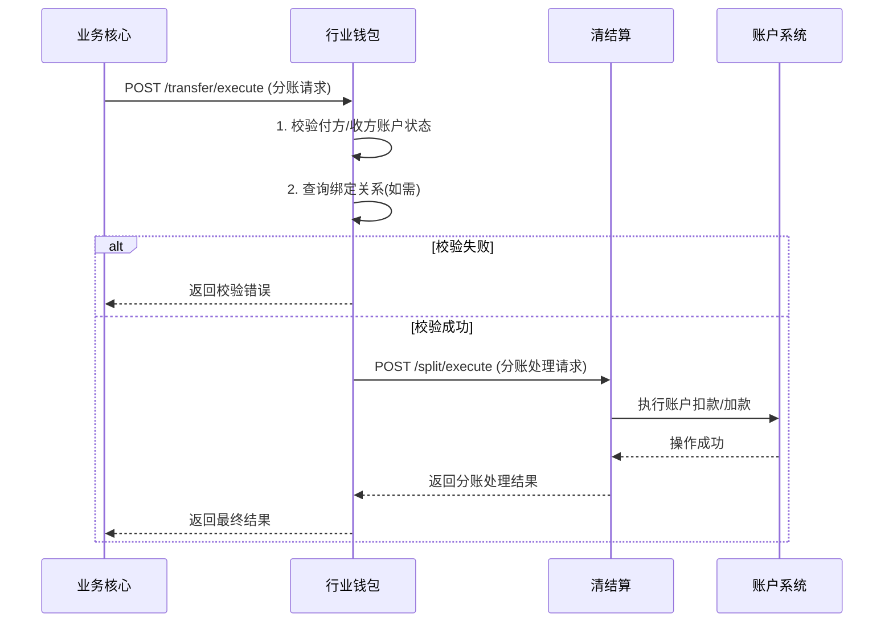
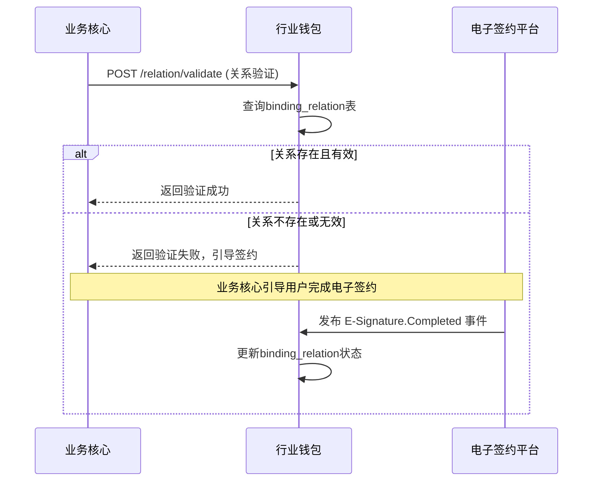

# 模块设计: 行业钱包

生成时间: 2026-01-22 15:43:55
批判迭代: 2

---

# 模块设计: 行业钱包

## 1. 概述
- **目的与范围**: 本模块是处理钱包相关业务的核心系统，负责用户生成、账户开户、关系绑定校验、分账请求处理等。它为天财平台提供账户管理能力，并作为业务核心与底层账户系统之间的协调者，执行资金划转指令。

## 2. 接口设计
- **API端点 (REST)**:
    - `POST /wallet/api/user/create`: 创建用户。
    - `POST /wallet/api/account/open`: 开立天财收款账户或天财接收方账户。
    - `POST /wallet/api/relation/validate`: 校验参与方（如总部与门店）之间的绑定关系。
    - `POST /wallet/api/transfer/execute`: 执行分账/转账。
- **请求/响应结构**:
    - 创建用户请求 (`POST /wallet/api/user/create`):
        ```json
        {
          "requestId": "string",
          "merchantId": "string",
          "userType": "string",
          "instId": "string"
        }
        ```
    - 开户请求 (`POST /wallet/api/account/open`):
        ```json
        {
          "requestId": "string",
          "merchantId": "string",
          "accountType": "string",
          "instId": "string"
        }
        ```
    - 关系验证请求 (`POST /wallet/api/relation/validate`):
        ```json
        {
          "payerInstId": "string",
          "payeeInstId": "string",
          "relationType": "string"
        }
        ```
    - 转账请求 (`POST /wallet/api/transfer/execute`):
        ```json
        {
          "requestId": "string",
          "bizOrderNo": "string",
          "fromAccountNo": "string",
          "toAccountNo": "string",
          "amount": "BigDecimal",
          "bizType": "string"
        }
        ```
    - 通用响应结构:
        ```json
        {
          "code": "string",
          "message": "string",
          "data": "object"
        }
        ```
- **发布/消费的事件**:
    - 消费事件: `E-Signature.Completed` (来自电子签约平台，用于更新绑定关系状态)。
    - 发布事件: `Wallet.Account.Opened` (账户开立完成事件)，`Wallet.Transfer.Executed` (转账执行完成事件)。

## 3. 数据模型
- **表/集合**:
    - `wallet_user`: 钱包用户表。
    - `wallet_account`: 钱包账户表。
    - `binding_relation`: 绑定关系表。
- **关键字段**:
    - `wallet_user`:
        - `id` (主键)
        - `user_id` (用户ID)
        - `merchant_id` (关联商户标识)
        - `user_type` (用户类型)
        - `inst_id` (机构号)
        - `created_time`
    - `wallet_account`:
        - `id` (主键)
        - `account_no` (账户号)
        - `user_id` (外键，关联wallet_user)
        - `account_type` (账户类型：天财收款账户、天财接收方账户)
        - `status` (账户状态)
        - `balance` (账户余额)
        - `version` (版本号，用于乐观锁)
        - `created_time`
    - `binding_relation`:
        - `id` (主键)
        - `payer_user_id` (付款方用户ID)
        - `payee_user_id` (收款方用户ID)
        - `relation_type` (关系类型，如总部-门店)
        - `contract_id` (关联的电子签约合同ID)
        - `auth_status` (授权状态)
        - `verified_time` (验证时间)
        - `expires_at` (过期时间)
- **与其他模块的关系**: `wallet_account` 的账户操作（余额变动）由**账户系统**执行。`binding_relation` 的合同签署依赖**电子签约平台**。分账业务由**业务核心**发起。

## 4. 业务逻辑
- **核心工作流/算法**:
    1.  **用户与账户开户**: 接收开户请求，为商户创建用户记录，并根据账户类型（收款账户/接收方账户）调用**账户系统**开立对应的底层账户。成功后发布 `Wallet.Account.Opened` 事件。
    2.  **关系绑定校验**: 接收关系验证请求，查询`binding_relation`表，检查付款方与收款方之间是否存在有效且已签署电子协议的绑定关系。此流程是**开通付款**的前提。若关系不存在或无效，返回错误并引导完成签约流程。
    3.  **分账转账执行**: 接收来自业务核心的转账指令，校验付方与收方账户状态，然后调用**清结算**模块执行具体的分账资金划转。成功后发布 `Wallet.Transfer.Executed` 事件。
- **业务规则与验证**:
    - 开立天财收款账户需关联**收单商户**；开立天财接收方账户可关联**非收单商户**或个人。
    - 执行分账前，必须验证付方账户类型为天财收款账户。
    - 关系绑定必须基于已完成的电子签约流程。
- **关键边界情况处理**:
    - 开户时商户信息不存在：返回商户不存在错误。
    - 关系校验未通过：返回明确的绑定关系无效错误，引导进行**关系绑定**流程。
    - 账户状态异常（如冻结）：中止转账流程，返回账户状态错误。
- **并发与一致性**:
    - 账户余额查询与更新操作使用乐观锁（`version`字段）防止并发更新导致的数据不一致。
    - 关键业务流程（如转账）通过本地事务确保数据库操作的原子性。
    - 与下游系统（清结算、账户系统）的交互，通过幂等请求ID和状态机管理保证最终一致性。
- **数据生命周期管理**:
    - 业务数据（用户、账户、关系）根据监管要求设置保留期限（如5年）。
    - 过期数据可归档至历史库，核心业务表仅保留活跃数据。

## 5. 时序图

### 5.1 分账转账时序图


### 5.2 关系验证时序图


## 6. 错误处理
- **预期错误情况与错误码**:
    - `MERCHANT_NOT_FOUND` (404): 商户不存在。
    - `ACCOUNT_NOT_FOUND` (404): 账户不存在。
    - `ACCOUNT_STATUS_ERROR` (409): 账户状态异常（冻结、注销等）。
    - `INSUFFICIENT_BALANCE` (409): 账户余额不足。
    - `BINDING_RELATION_INVALID` (409): 绑定关系无效或未签约。
    - `INVALID_ACCOUNT_TYPE` (400): 账户类型不符合业务规则。
    - `DUPLICATE_REQUEST` (409): 重复请求（幂等性冲突）。
    - `DOWNSTREAM_SERVICE_UNAVAILABLE` (503): 下游系统（清结算、账户系统）服务异常。
- **处理策略**:
    - 对于业务规则错误（如无效绑定、账户状态异常），立即返回明确错误码和信息，不进行重试。
    - 对于下游系统（清结算、账户系统）调用失败，根据错误类型决定：
        - 网络超时等暂时性故障：采用指数退避策略进行重试（最多3次）。
        - 余额不足等业务性失败：立即失败，返回错误。
    - 所有操作记录详细日志，关键错误触发告警。
    - 通过 `requestId` 保证请求的幂等性，防止重复处理。

## 7. 依赖关系
- **上游模块**: **业务核心**（接收分账指令和关系验证请求）。
- **下游模块**:
    - **账户系统**（执行底层的账户开立、余额操作）。
    - **清结算**（驱动资金划转和清算流程）。
    - **电子签约平台**（完成关系绑定所需的电子签约，并消费其完成事件）。
- **交互说明**: 本模块作为业务核心与底层资金操作系统的协调者。接收业务核心的指令，负责业务校验，并调用清结算执行资金流转。清结算再驱动账户系统完成原子操作。关系绑定依赖电子签约平台，并通过事件异步更新状态。