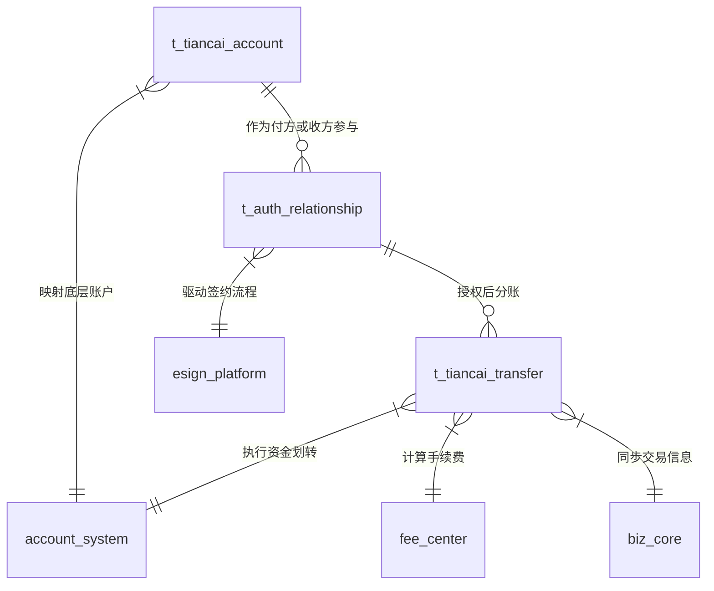
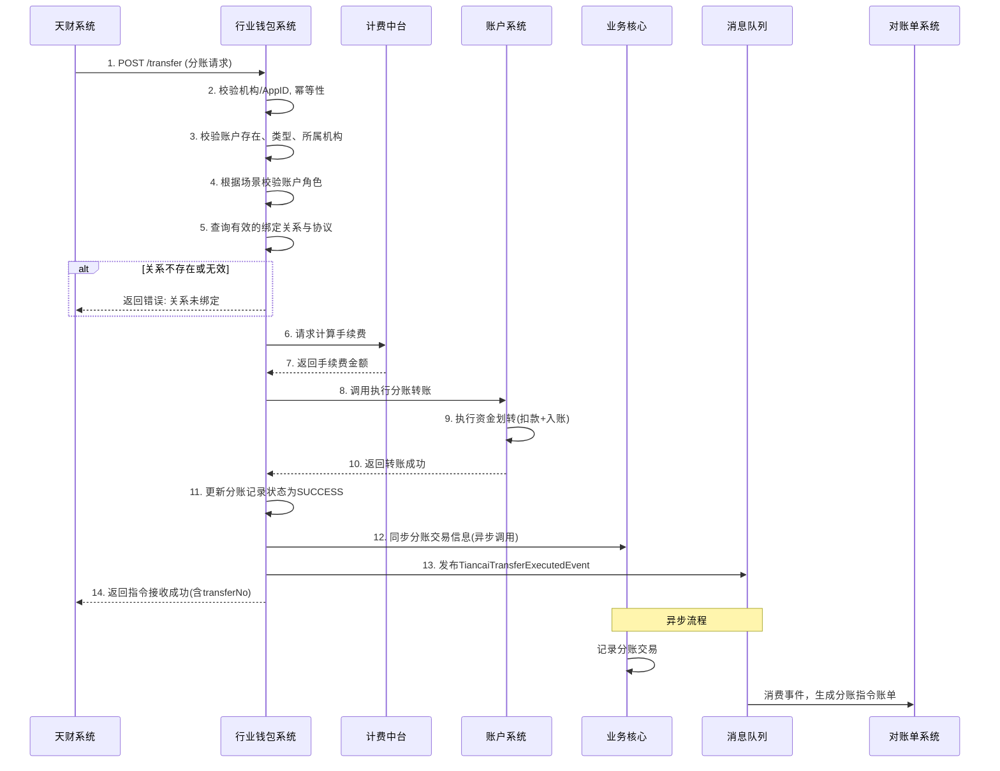
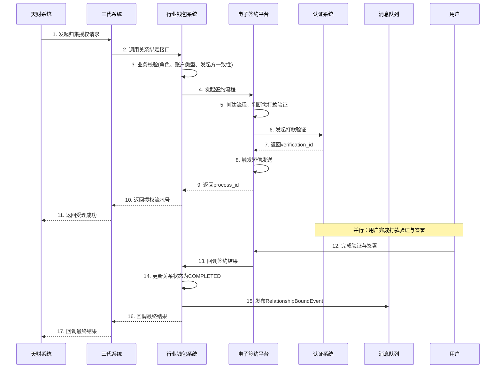

# 模块设计: 行业钱包系统

生成时间: 2026-01-16 16:53:01

---

# 模块设计: 行业钱包系统

生成时间: 2026-01-16

---

# 行业钱包系统模块设计文档

## 1. 概述

### 1.1 目的
行业钱包系统是“天财分账”业务的核心业务逻辑处理模块，位于三代系统与底层账户系统之间，扮演着业务协调者与规则校验者的角色。其主要目的是：
- **业务逻辑集中处理**：统一处理天财分账业务的开户、关系绑定、分账转账等核心业务流程，封装复杂的业务规则校验。
- **专用账户体系管理**：作为天财专用账户（收款账户/接收方账户）的业务管理层，负责开户申请的处理、账户角色的维护以及与账户系统的交互。
- **关系绑定与认证驱动**：驱动并管理资金流转关系（归集、批量付款、会员结算）的建立过程，集成电子签约平台完成身份认证与协议签署。
- **分账指令处理**：接收并校验天财发起的资金分账指令，协调计费、账户系统完成资金划转，并同步交易信息。
- **业务状态与数据管理**：维护商户-账户关系、授权关系状态、认证结果等业务数据，为上层查询和对账提供支持。

### 1.2 范围
本模块设计范围涵盖：
- **天财专用账户开户/升级**：接收三代系统的开户请求，校验天财机构权限，调用账户系统创建或升级专用账户，并维护账户角色（总部/门店）。
- **关系绑定流程管理**：接收天财或三代的关系绑定请求，进行场景化业务校验，驱动电子签约平台完成认证与签约，并管理绑定关系的状态。
- **开通付款授权**：处理总部在批量付款和会员结算场景下的前置授权流程（“开通付款”）。
- **分账指令处理**：接收天财的分账请求，校验绑定关系与协议状态，计算手续费，调用账户系统执行资金划转，并同步交易信息至业务核心。
- **业务数据查询与同步**：提供账户信息、关系状态等查询接口，并向对账单系统、业务核心同步必要的交易数据。
- **天财机构业务隔离**：通过机构号白名单机制，确保所有业务操作严格限定在天财机构范围内。

**边界说明**：
- 本模块**不负责**底层账户的创建与记账（由账户系统负责）。
- 本模块**不负责**电子协议的具体生成、签署与身份核验（由电子签约平台负责）。
- 本模块**不负责**手续费的计算逻辑（由计费中台负责），但负责发起计费请求并应用结果。
- 本模块**不负责**商户的进件、审核等生命周期管理（由三代系统负责）。

## 2. 接口设计

### 2.1 API端点 (RESTful)

#### 2.1.1 内部接口 (供三代系统调用)

**1. 开立/升级天财专用账户**
- **端点**: `POST /internal/v1/tiancai/account/open`
- **描述**: 为指定收单商户开立新的天财专用账户，或将现有普通收款账户升级为天财专用账户。
- **调用方**: 三代系统
- **请求头**:
    - `X-Source-System: G3_SYSTEM`
    - `X-Request-Id`: 请求唯一标识
- **请求体**:
```json
{
  "requestId": "g3_req_20240116001",
  "merchantNo": "88800010001",
  "institutionNo": "860000", // 必须为天财机构号
  "operationType": "CREATE", // 枚举: CREATE(新开), UPGRADE(升级)
  "accountType": "TIANCAI_RECEIVE", // 枚举: TIANCAI_RECEIVE(收款账户), TIANCAI_RECEIVER(接收方账户)
  "roleType": "HEADQUARTERS", // 枚举: HEADQUARTERS(总部), STORE(门店)。仅TIANCAI_RECEIVE账户有效。
  "originalAccountNo": "ACC001", // 可选。当operationType=UPGRADE时，传入原普通收款账户号。
  "settlementMode": "ACTIVE", // 结算模式，固定为ACTIVE
  "effectiveTime": "2024-01-17 00:00:00" // 期望生效时间（用于结算模式切换）
}
```
- **响应体 (成功)**:
```json
{
  "code": "SUCCESS",
  "message": "成功",
  "data": {
    "requestId": "g3_req_20240116001",
    "merchantNo": "88800010001",
    "tiancaiAccountNo": "TC_ACC_88800010001_R001",
    "accountType": "TIANCAI_RECEIVE",
    "roleType": "HEADQUARTERS",
    "status": "ACTIVE",
    "openTime": "2024-01-16 14:30:00"
  }
}
```

**2. 发起关系绑定（签约与认证）**
- **端点**: `POST /internal/v1/tiancai/relationship/bind`
- **描述**: 发起归集、批量付款或会员结算场景下的授权关系建立流程。本接口驱动电子签约平台。
- **请求体**:
```json
{
  "requestId": "g3_req_20240116002",
  "scene": "COLLECTION", // 枚举: COLLECTION(归集), BATCH_PAYMENT(批量付款), MEMBER_SETTLEMENT(会员结算)
  "initiatorMerchantNo": "88800010001", // 发起方商户号（天财页面操作方）
  "payerMerchantNo": "88800010002", // 付方商户号
  "payerAccountNo": "TC_ACC_88800010002_R001", // 付方天财账户号
  "payeeMerchantNo": "88800010001", // 收方商户号
  "payeeAccountNo": "TC_ACC_88800010001_R001", // 收方天财账户号
  "capitalPurpose": "资金归集", // 资金用途
  "authorizationContact": { // 授权联系人信息（归集场景为门店联系人）
    "name": "李四",
    "phone": "13900139000",
    "idCardNo": "110101199002022345"
  },
  "extraParams": { // 场景特有参数
    "collectionMode": "PROPORTION",
    "maxProportion": 100
  },
  "callbackUrl": "https://g3.example.com/callback/relationship" // 三代回调地址
}
```
- **响应体**:
```json
{
  "code": "SUCCESS",
  "message": "签约流程已发起",
  "data": {
    "requestId": "g3_req_20240116002",
    "authFlowNo": "AUTH202401160001", // 本系统生成的授权流水号
    "processId": "esign_proc_202401160001", // 电子签约流程ID
    "status": "INITIATED"
  }
}
```

**3. 发起开通付款授权**
- **端点**: `POST /internal/v1/tiancai/payment/enable`
- **描述**: 在批量付款和会员结算场景下，为付方（总部）开通付款能力的前置授权流程。
- **请求体**:
```json
{
  "requestId": "g3_req_20240116003",
  "initiatorMerchantNo": "88800010001",
  "payerMerchantNo": "88800010001", // 付方商户号（与发起方一致）
  "payerAccountNo": "TC_ACC_88800010001_R001",
  "capitalPurpose": "会员结算,批量付款", // 资金用途
  "callbackUrl": "https://g3.example.com/callback/payment"
}
```
- **响应体**: 同关系绑定接口，返回授权流水号和签约流程ID。

**4. 查询关系绑定状态**
- **端点**: `GET /internal/v1/tiancai/relationship/status`
- **描述**: 根据授权流水号或商户号查询关系绑定或开通付款的状态。
- **查询参数**: `authFlowNo=AUTH202401160001` 或 `payerMerchantNo=88800010001&payeeMerchantNo=88800010002&scene=COLLECTION`
- **响应体**:
```json
{
  "code": "SUCCESS",
  "data": {
    "authFlowNo": "AUTH202401160001",
    "scene": "COLLECTION",
    "status": "COMPLETED", // 枚举: INITIATED, VERIFYING, SIGNING, COMPLETED, FAILED, EXPIRED
    "verificationResult": "SUCCESS",
    "agreementNo": "AGR_202401160001",
    "completeTime": "2024-01-16 15:30:00"
  }
}
```

#### 2.1.2 外部接口 (供天财系统调用)

**1. 发起分账（转账）**
- **端点**: `POST /api/v1/tiancai/transfer`
- **描述**: 天财系统发起资金分账指令的核心接口。
- **认证**: API Key + 机构号白名单
- **请求头**:
    - `X-App-Id`: 天财应用ID
    - `X-Org-No`: 天财机构号 (如 860000)
    - `X-Request-Id`: 请求唯一标识
- **请求体**:
```json
{
  "requestId": "tc_req_20240116001",
  "scene": "MEMBER_SETTLEMENT", // 枚举: COLLECTION, MEMBER_SETTLEMENT, BATCH_PAYMENT
  "initiatorMerchantNo": "88800010001", // 指令发起方（总部）
  "outMerchantNo": "88800010001", // 转出方商户号
  "outAccountNo": "TC_ACC_88800010001_R001", // 转出方账户号
  "inMerchantNo": "88800010002", // 转入方商户号
  "inAccountNo": "TC_ACC_88800010002_R001", // 转入方账户号
  "amount": 10000, // 分账金额（单位：分）
  "currency": "CNY",
  "feeBearer": "PAYER", // 枚举: PAYER(付方承担), PAYEE(收方承担)
  "remark": "会员结算-2024年1月"
}
```
- **响应体 (成功)**:
```json
{
  "code": "SUCCESS",
  "message": "分账指令接收成功",
  "data": {
    "requestId": "tc_req_20240116001",
    "transferNo": "TF202401161430001", // 本系统分账流水号
    "status": "PROCESSING", // 最终结果需异步回调或查询
    "acceptTime": "2024-01-16 14:30:05"
  }
}
```

**2. 查询分账结果**
- **端点**: `GET /api/v1/tiancai/transfer/{transferNo}`
- **描述**: 根据分账流水号查询指令执行结果。
- **响应体**:
```json
{
  "code": "SUCCESS",
  "data": {
    "transferNo": "TF202401161430001",
    "requestId": "tc_req_20240116001",
    "scene": "MEMBER_SETTLEMENT",
    "outAccountNo": "TC_ACC_88800010001_R001",
    "inAccountNo": "TC_ACC_88800010002_R001",
    "amount": 10000,
    "fee": 10,
    "feeBearer": "PAYER",
    "status": "SUCCESS", // 枚举: PROCESSING, SUCCESS, FAILED
    "failReason": "",
    "completeTime": "2024-01-16 14:30:10"
  }
}
```

#### 2.1.3 回调接口 (供电子签约平台调用)

**1. 签约结果回调**
- **端点**: `POST /internal/callback/esign`
- **描述**: 电子签约平台在签约流程完成（成功或失败）后回调此接口。
- **认证**: API Key (电子签约平台提供)
- **请求体**:
```json
{
  "processId": "esign_proc_202401160001",
  "status": "SUCCESS", // 或 FAILED
  "agreementNo": "AGR_202401160001",
  "verificationId": "verif_202401160001",
  "payerMerchantNo": "88800010002",
  "payeeMerchantNo": "88800010001",
  "signTime": "2024-01-16 15:30:00",
  "failReason": ""
}
```
- **响应体**:
```json
{
  "code": "SUCCESS",
  "message": "回调接收成功"
}
```

### 2.2 发布/消费的事件

#### 2.2.1 消费的事件
1.  **AccountStatusChangedEvent** (来自账户系统)
    - **事件类型**: `ACCOUNT_STATUS_CHANGED`
    - **负载**: `{"accountNo": "...", "oldStatus": "...", "newStatus": "...", "changeReason": "..."}`
    - **动作**: 更新本地缓存的账户状态，若账户被冻结，则暂停相关分账能力。

2.  **SettlementModeChangedEvent** (来自三代系统)
    - **事件类型**: `SETTLEMENT_MODE_CHANGED`
    - **负载**: `{"merchantNo": "...", "oldMode": "...", "newMode": "...", "effectiveTime": "..."}`
    - **动作**: 更新商户结算模式，并同步至账户系统（如需）。

#### 2.2.2 发布的事件
1.  **TiancaiAccountOpenedEvent** (天财账户开立事件)
    - **事件类型**: `TIANCAI_ACCOUNT_OPENED`
    - **触发时机**: 成功开立或升级天财专用账户后。
    - **负载**:
    ```json
    {
      "eventId": "event_wallet_001",
      "eventType": "TIANCAI_ACCOUNT_OPENED",
      "timestamp": "2024-01-16T14:30:00Z",
      "payload": {
        "merchantNo": "88800010001",
        "tiancaiAccountNo": "TC_ACC_88800010001_R001",
        "accountType": "TIANCAI_RECEIVE",
        "roleType": "HEADQUARTERS",
        "operationType": "CREATE",
        "institutionNo": "860000"
      }
    }
    ```
    - **订阅方**: 三代系统（用于更新本地记录）、消息中心（通知天财）。

2.  **RelationshipBoundEvent** (关系绑定完成事件)
    - **事件类型**: `RELATIONSHIP_BOUND`
    - **触发时机**: 关系绑定（或开通付款）流程成功完成后。
    - **负载**: 包含授权流水号、场景、付收方信息、协议编号等。
    - **订阅方**: 三代系统、风控系统（用于风险关系图谱）。

3.  **TiancaiTransferExecutedEvent** (天财分账执行事件)
    - **事件类型**: `TIANCAI_TRANSFER_EXECUTED`
    - **触发时机**: 分账指令在账户系统执行成功后。
    - **负载**:
    ```json
    {
      "eventId": "event_wallet_002",
      "eventType": "TIANCAI_TRANSFER_EXECUTED",
      "timestamp": "2024-01-16T14:30:10Z",
      "payload": {
        "transferNo": "TF202401161430001",
        "requestId": "tc_req_20240116001",
        "scene": "MEMBER_SETTLEMENT",
        "outAccountNo": "TC_ACC_88800010001_R001",
        "inAccountNo": "TC_ACC_88800010002_R001",
        "amount": 10000,
        "fee": 10,
        "status": "SUCCESS"
      }
    }
    ```
    - **订阅方**: **业务核心**（用于记录分账交易）、对账单系统（用于生成分账指令账单）。

## 3. 数据模型

### 3.1 核心表设计

```sql
-- 天财专用账户信息表 (业务层)
CREATE TABLE t_tiancai_account (
    id BIGINT PRIMARY KEY AUTO_INCREMENT,
    account_no VARCHAR(64) NOT NULL UNIQUE COMMENT '天财专用账户号',
    merchant_no VARCHAR(32) NOT NULL COMMENT '所属收单商户号',
    institution_no VARCHAR(16) NOT NULL COMMENT '所属机构号（天财）',
    account_type VARCHAR(32) NOT NULL COMMENT '账户类型: TIANCAI_RECEIVE, TIANCAI_RECEIVER',
    role_type VARCHAR(16) COMMENT '角色类型: HEADQUARTERS, STORE (仅收款账户有效)',
    original_account_no VARCHAR(64) COMMENT '原账户号（升级场景）',
    status VARCHAR(16) DEFAULT 'ACTIVE' COMMENT '状态: ACTIVE, FROZEN, CLOSED',
    settlement_mode VARCHAR(16) DEFAULT 'ACTIVE' COMMENT '结算模式',
    open_time DATETIME NOT NULL COMMENT '开户/升级时间',
    effective_time DATETIME COMMENT '生效时间（用于结算模式切换）',
    created_time DATETIME NOT NULL,
    updated_time DATETIME NOT NULL,
    INDEX idx_merchant_no (merchant_no),
    INDEX idx_institution_no (institution_no),
    INDEX idx_account_type (account_type, role_type)
) COMMENT '天财专用账户业务信息表';

-- 授权关系表 (绑定关系与开通付款)
CREATE TABLE t_auth_relationship (
    id BIGINT PRIMARY KEY AUTO_INCREMENT,
    auth_flow_no VARCHAR(32) NOT NULL UNIQUE COMMENT '授权流水号',
    scene VARCHAR(32) NOT NULL COMMENT '场景: COLLECTION, BATCH_PAYMENT, MEMBER_SETTLEMENT, OPEN_PAYMENT',
    initiator_merchant_no VARCHAR(32) NOT NULL COMMENT '发起方商户号',
    payer_merchant_no VARCHAR(32) NOT NULL COMMENT '付方商户号',
    payer_account_no VARCHAR(64) NOT NULL COMMENT '付方账户号',
    payee_merchant_no VARCHAR(32) NOT NULL COMMENT '收方商户号',
    payee_account_no VARCHAR(64) NOT NULL COMMENT '收方账户号',
    capital_purpose VARCHAR(64) NOT NULL COMMENT '资金用途',
    status VARCHAR(16) DEFAULT 'INITIATED' COMMENT '状态: INITIATED, VERIFYING, SIGNING, COMPLETED, FAILED, EXPIRED',
    verification_type VARCHAR(16) COMMENT '认证类型: TRANSFER, FACE',
    verification_id VARCHAR(32) COMMENT '认证流水ID',
    verification_status VARCHAR(16) COMMENT '认证状态: PENDING, SUCCESS, FAILED',
    agreement_no VARCHAR(32) COMMENT '协议编号',
    process_id VARCHAR(32) COMMENT '电子签约流程ID',
    extra_params JSON COMMENT '场景扩展参数(JSON)',
    callback_url VARCHAR(512) COMMENT '回调地址',
    expire_time DATETIME NOT NULL COMMENT '流程过期时间',
    complete_time DATETIME COMMENT '完成时间',
    fail_reason VARCHAR(256) COMMENT '失败原因',
    created_time DATETIME NOT NULL,
    updated_time DATETIME NOT NULL,
    INDEX idx_payer_payee_scene (payer_merchant_no, payee_merchant_no, scene, status),
    INDEX idx_process_id (process_id),
    INDEX idx_status_expire (status, expire_time)
) COMMENT '授权关系表（含开通付款）';

-- 分账交易记录表
CREATE TABLE t_tiancai_transfer (
    id BIGINT PRIMARY KEY AUTO_INCREMENT,
    transfer_no VARCHAR(32) NOT NULL UNIQUE COMMENT '分账流水号',
    request_id VARCHAR(64) NOT NULL COMMENT '外部请求ID（幂等键）',
    scene VARCHAR(32) NOT NULL COMMENT '业务场景',
    initiator_merchant_no VARCHAR(32) NOT NULL COMMENT '指令发起方',
    out_account_no VARCHAR(64) NOT NULL COMMENT '转出账户',
    in_account_no VARCHAR(64) NOT NULL COMMENT '转入账户',
    amount DECIMAL(15,2) NOT NULL COMMENT '分账金额',
    currency VARCHAR(3) DEFAULT 'CNY',
    fee DECIMAL(15,2) DEFAULT 0.00 COMMENT '手续费',
    fee_bearer VARCHAR(16) NOT NULL COMMENT '手续费承担方',
    remark VARCHAR(256),
    status VARCHAR(16) DEFAULT 'PROCESSING' COMMENT '状态: PROCESSING, SUCCESS, FAILED',
    fail_reason VARCHAR(256),
    auth_flow_no VARCHAR(32) COMMENT '关联的授权流水号',
    fee_calc_id VARCHAR(32) COMMENT '计费流水ID',
    account_transfer_no VARCHAR(32) COMMENT '账户系统转账流水号',
    biz_core_sync_flag CHAR(1) DEFAULT 'N' COMMENT '是否已同步业务核心: Y/N',
    accept_time DATETIME NOT NULL COMMENT '接收时间',
    complete_time DATETIME COMMENT '完成时间',
    created_time DATETIME NOT NULL,
    updated_time DATETIME NOT NULL,
    INDEX idx_request_id (request_id),
    INDEX idx_out_account (out_account_no, accept_time),
    INDEX idx_status_time (status, accept_time),
    INDEX idx_auth_flow_no (auth_flow_no)
) COMMENT '天财分账交易记录表';

-- 机构-账户关系缓存表 (用于快速校验)
CREATE TABLE t_institution_account_cache (
    id BIGINT PRIMARY KEY AUTO_INCREMENT,
    institution_no VARCHAR(16) NOT NULL COMMENT '机构号',
    merchant_no VARCHAR(32) NOT NULL COMMENT '商户号',
    account_no VARCHAR(64) NOT NULL COMMENT '账户号',
    account_type VARCHAR(32) NOT NULL COMMENT '账户类型',
    role_type VARCHAR(16) COMMENT '角色类型',
    is_tiancai_tag BOOLEAN DEFAULT TRUE COMMENT '是否天财标记',
    status VARCHAR(16) DEFAULT 'ACTIVE',
    last_sync_time DATETIME NOT NULL COMMENT '最后同步时间',
    UNIQUE KEY uk_institution_account (institution_no, account_no),
    INDEX idx_merchant_account (merchant_no, account_no)
) COMMENT '机构-账户关系缓存表，同步自账户系统';
```

### 3.2 与其他模块的关系


- **账户系统**: 底层依赖。本表`t_tiancai_account.account_no`与账户系统账户号对应，通过缓存表`t_institution_account_cache`同步关键属性，用于业务校验。
- **电子签约平台**: 驱动依赖。`t_auth_relationship.process_id`关联电子签约流程，通过回调更新状态。
- **三代系统**: 上游调用方。接收其开户、关系绑定请求，并回调结果。
- **天财系统**: 外部调用方。直接接收其分账指令。
- **业务核心**: 下游数据同步方。分账成功后，发布事件或调用接口同步交易信息。

## 4. 业务逻辑

### 4.1 核心算法与流程

#### 4.1.1 天财专用账户开户/升级流程
```python
def open_tiancai_account(request):
    # 1. 基础校验
    validate_request_id(request.request_id) # 幂等
    validate_institution_is_tiancai(request.institution_no) # 必须为天财机构
    
    # 2. 商户与账户校验
    merchant = get_merchant_from_g3(request.merchant_no)
    if not merchant or merchant.institution_no != request.institution_no:
        raise MerchantNotFoundException()
    
    # 3. 业务规则校验
    if request.operation_type == "CREATE":
        # 新开：检查是否已存在天财账户
        existing = get_tiancai_account_by_merchant(request.merchant_no, request.account_type)
        if existing:
            raise TiancaiAccountAlreadyExistsException()
    elif request.operation_type == "UPGRADE":
        # 升级：检查原账户是否存在且为普通收款账户
        original_account = get_account_from_system(request.original_account_no)
        if not original_account or original_account.account_type != "NORMAL_RECEIVE":
            raise CannotUpgradeException()
        # 检查是否已存在天财账户
        existing = get_tiancai_account_by_merchant(request.merchant_no, request.account_type)
        if existing:
            raise TiancaiAccountAlreadyExistsException()
    
    # 4. 调用账户系统创建/升级账户
    account_request = build_account_system_request(request, merchant)
    account_response = call_account_system("/internal/v1/accounts/tiancai", account_request)
    
    # 5. 本地记录
    tiancai_account = create_tiancai_account_record(request, account_response)
    
    # 6. 更新缓存
    update_institution_account_cache(tiancai_account)
    
    # 7. 发布事件
    publish_event(TiancaiAccountOpenedEvent(tiancai_account))
    
    return build_success_response(tiancai_account)
```

#### 4.1.2 关系绑定业务校验逻辑
```python
def validate_relationship_bind(request):
    """
    根据场景进行业务规则校验
    """
    # 通用校验：发起方、付方、收方必须属于天财机构
    validate_all_merchants_belong_to_tiancai(
        [request.initiatorMerchantNo, request.payerMerchantNo, request.payeeMerchantNo]
    )
    
    # 获取账户信息（从缓存）
    payer_account = get_cached_account(request.payerAccountNo)
    payee_account = get_cached_account(request.payeeAccountNo)
    
    if request.scene == "COLLECTION":
        # 归集场景
        # 1. 付方必须是门店，收方必须是总部
        if payer_account.role_type != "STORE" or payee_account.role_type != "HEADQUARTERS":
            raise InvalidRoleForCollectionException()
        # 2. 收方必须是企业性质（从三代获取）
        if get_merchant_type(request.payeeMerchantNo) != "ENTERPRISE":
            raise PayeeMustBeEnterpriseException()
        # 3. 发起方必须是收方（总部自己发起）
        if request.initiatorMerchantNo != request.payeeMerchantNo:
            raise InitiatorMustBePayeeException()
        # 4. 收付方必须都是天财收款账户
        if payer_account.account_type != "TIANCAI_RECEIVE" or payee_account.account_type != "TIANCAI_RECEIVE":
            raise MustBeTiancaiReceiveAccountException()
            
    elif request.scene == "BATCH_PAYMENT":
        # 批量付款场景
        # 1. 付方必须是总部
        if payer_account.role_type != "HEADQUARTERS":
            raise PayerMustBeHeadquartersException()
        # 2. 收方必须是天财接收方账户
        if payee_account.account_type != "TIANCAI_RECEIVER":
            raise PayeeMustBeReceiverAccountException()
        # 3. 检查付方是否已开通付款能力
        if not is_payment_enabled(request.payerMerchantNo):
            raise PaymentCapabilityNotEnabledException()
        # 4. 发起方必须是付方
        if request.initiatorMerchantNo != request.payerMerchantNo:
            raise InitiatorMustBePayerException()
            
    elif request.scene == "MEMBER_SETTLEMENT":
        # 会员结算场景
        # 1. 付方必须是总部
        if payer_account.role_type != "HEADQUARTERS":
            raise PayerMustBeHeadquartersException()
        # 2. 收方必须是门店（天财收款账户）
        if payee_account.role_type != "STORE" or payee_account.account_type != "TIANCAI_RECEIVE":
            raise InvalidPayeeForMemberSettlementException()
        # 3. 检查付方是否已开通付款能力
        if not is_payment_enabled(request.payerMerchantNo):
            raise PaymentCapabilityNotEnabledException()
        # 4. 发起方必须是付方
        if request.initiatorMerchantNo != request.payerMerchantNo:
            raise InitiatorMustBePayerException()
    
    # 检查是否已存在有效关系
    existing = get_active_relationship(
        request.payerMerchantNo, 
        request.payeeMerchantNo, 
        request.scene
    )
    if existing:
        raise RelationshipAlreadyExistsException()
```

#### 4.1.3 分账指令处理流程
```python
def process_tiancai_transfer(request):
    # 1. 接口级校验（机构、AppID）
    validate_api_access(request.app_id, request.org_no)
    
    # 2. 幂等性检查
    existing_transfer = get_transfer_by_request_id(request.requestId)
    if existing_transfer:
        return build_response_from_existing(existing_transfer)
    
    # 3. 基础业务校验
    # 3.1 账户存在且属于天财机构
    out_account = validate_and_get_account(request.outAccountNo, request.org_no)
    in_account = validate_and_get_account(request.inAccountNo, request.org_no)
    
    # 3.2 账户类型校验：转出必须为天财收款账户，转入可为收款或接收方账户
    if out_account.account_type != "TIANCAI_RECEIVE":
        raise InvalidOutAccountTypeException()
    if in_account.account_type not in ["TIANCAI_RECEIVE", "TIANCAI_RECEIVER"]:
        raise InvalidInAccountTypeException()
    
    # 3.3 场景一致性校验（根据场景校验账户角色）
    validate_scene_consistency(request.scene, out_account, in_account)
    
    # 4. 校验绑定关系与协议
    auth_relationship = get_valid_relationship_for_transfer(
        out_account.merchant_no, 
        in_account.merchant_no, 
        request.scene
    )
    if not auth_relationship:
        raise RelationshipNotBoundException()
    
    # 5. 调用计费中台计算手续费
    fee_request = build_fee_calc_request(request, out_account, in_account)
    fee_response = call_fee_center(fee_request)
    
    # 6. 调用账户系统执行转账
    transfer_request = build_account_transfer_request(request, fee_response, auth_relationship.auth_flow_no)
    account_response = call_account_system("/internal/v1/transfers/tiancai", transfer_request)
    
    # 7. 记录分账交易
    transfer_record = create_transfer_record(request, fee_response, account_response, auth_relationship.auth_flow_no)
    
    # 8. 同步交易信息至业务核心（异步）
    async_sync_to_biz_core(transfer_record)
    
    # 9. 发布分账执行事件
    publish_event(TiancaiTransferExecutedEvent(transfer_record))
    
    return build_accept_response(transfer_record)
```

### 4.2 业务规则

1. **账户开立规则**:
   - 一个收单商户只能开立一个天财收款账户。
   - 天财接收方账户支持绑定多张银行卡（由三代管理），本系统记录其默认提现卡信息（用于打款验证）。
   - 老商户升级时，需确保原普通收款账户状态正常。
   - 所有天财机构下的账户（包括普通收款账户）必须被打上“天财”标记。

2. **关系绑定规则**:
   - **归集关系**: 门店（付方）→ 总部（收方）。需门店授权联系人完成打款验证+协议签署。
   - **批量付款**: 总部（付方）→ 接收方（收方）。接收方为企业需打款验证，为个人/个体需人脸验证。
   - **会员结算**: 总部（付方）→ 门店（收方）。对公门店打款验证，对私门店人脸验证。
   - **开通付款**: 总部（付方）开通批量付款和会员结算能力的前置授权。仅需一次。
   - 关系绑定前，付方在批量付款和会员结算场景必须已完成“开通付款”。

3. **分账规则**:
   - 资金只能在天财专用账户体系内流转：`TIANCAI_RECEIVE` → `TIANCAI_RECEIVE` 或 `TIANCAI_RECEIVE` → `TIANCAI_RECEIVER`。
   - 禁止天财专用账户向普通账户转账。
   - 分账前必须存在对应场景下已完成的绑定关系（协议+认证）。
   - 手续费承担方由天财指定（付方或收方），费率由三代配置。

4. **状态流转规则**:
   - 授权关系状态：`INITIATED` → `VERIFYING` → `SIGNING` → `COMPLETED`。任一环节失败则进入`FAILED`。
   - 分账指令状态：`PROCESSING` → `SUCCESS`/`FAILED`。

### 4.3 验证逻辑

1. **机构权限校验**:
   - 所有接口调用必须验证机构号是否在天财机构白名单内。
   - 外部接口（天财调用）额外验证AppID和签名。

2. **账户一致性校验**:
   - 分账时，转出/转入账户必须属于调用方机构（天财）。
   - 关系绑定时，付方、收方账户必须属于天财机构。

3. **场景化业务校验**:
   - 根据场景枚举，校验付方、收方的账户类型和角色类型是否符合规则。
   - 校验发起方与付方/收方的一致性（法务要求）。

4. **绑定关系校验**:
   - 检查是否存在对应场景下状态为`COMPLETED`的授权记录。
   - 检查关联的协议和认证是否均成功。

5. **幂等性校验**:
   - 所有写操作通过`requestId`实现幂等，防止重复处理。

## 5. 时序图

### 5.1 天财分账指令处理时序图



### 5.2 关系绑定（归集场景）时序图



## 6. 错误处理

### 6.1 预期错误及处理策略

| 错误场景 | 错误码 | HTTP状态码 | 处理策略 |
| :--- | :--- | :--- | :--- |
| 机构号无效或非天财机构 | `INSTITUTION_INVALID` | 403 | 拒绝请求，记录日志告警 |
| 请求参数缺失或格式错误 | `PARAM_INVALID` | 400 | 返回具体字段错误信息 |
| 商户不存在 | `MERCHANT_NOT_FOUND` | 400 | 检查商户号，联系三代系统 |
| 账户不存在或状态异常 | `ACCOUNT_INVALID` | 400 | 检查账户号，确认是否已开户/冻结 |
| 账户类型不符合规则 | `ACCOUNT_TYPE_MISMATCH` | 400 | 根据场景检查付方/收方账户类型 |
| 绑定关系不存在或无效 | `RELATIONSHIP_NOT_BOUND` | 400 | 需先完成关系绑定流程 |
| 付款能力未开通 | `PAYMENT_NOT_ENABLED` | 400 | 需先完成“开通付款”授权 |
| 余额不足 | `INSUFFICIENT_BALANCE` | 400 | 提示充值或调整金额 |
| 重复请求（幂等） | `REQUEST_DUPLICATED` | 200 | 返回之前处理的结果 |
| 下游系统（账户、计费）超时 | `DOWNSTREAM_TIMEOUT` | 500 | 重试机制（最多3次），仍失败则标记为失败 |
| 电子签约回调结果不一致 | `ESIGN_CALLBACK_INCONSISTENT` | 500 | 记录告警，人工核查流程状态 |

### 6.2 重试与补偿机制

1. **同步调用重试**:
   - 对账户系统、计费中台的调用，设置超时（如3秒）和重试（最多2次）。
   - 重试策略：指数退避，避免雪崩。

2. **异步补偿**:
   - 分账指令处理中，若同步业务核心失败，记录失败标志，由定时任务补偿同步。
   - 关系绑定回调三代失败时，持久化重试任务，指数退避重试。

3. **对账与修复**:
   - 每日与账户系统对账，检查分账交易状态一致性。
   - 提供管理端手工修复工具，处理极少数异常状态。

## 7. 依赖说明

### 7.1 上游依赖

1. **三代系统**:
   - **交互方式**: 同步RPC调用（本模块提供的内部API）。
   - **职责**: 提供商户开户、关系绑定的业务入口，完成初步审核。
   - **关键数据流**: 商户信息、开户请求、关系绑定请求。
   - **SLA要求**: 接口响应时间P99 < 1s，可用性 > 99.9%。

2. **天财系统**:
   - **交互方式**: REST API调用（分账指令）。
   - **职责**: 业务最终发起方，发起分账指令。
   - **关键数据流**: 分账请求参数。
   - **安全要求**: 必须通过机构号、AppID和API Key多重认证。

### 7.2 下游依赖

1. **账户系统**:
   - **交互方式**: 同步RPC调用。
   - **职责**: 底层账户的创建、升级、标记、资金划转。
   - **关键接口**: 
     - `POST /internal/v1/accounts/tiancai`: 开户/升级
     - `POST /internal/v1/transfers/tiancai`: 执行转账
   - **异常影响**: 开户、分账核心功能不可用。**必须熔断和降级**。

2. **电子签约平台**:
   - **交互方式**: 同步RPC调用（发起） + 异步HTTP回调（接收结果）。
   - **职责**: 完成身份认证与电子协议签署。
   - **关键接口**: `POST /api/v1/esign/process/initiate`
   - **异常影响**: 关系绑定流程中断。可考虑延长流程有效期，但无法绕过。

3. **计费中台**:
   - **交互方式**: 同步RPC调用。
   - **职责**: 计算分账手续费。
   - **关键接口**: 手续费计算接口。
   - **异常影响**: 分账无法进行。可考虑降级为0手续费或固定手续费（需业务确认）。

4. **业务核心**:
   - **交互方式**: 异步消息（事件驱动）或同步RPC。
   - **职责**: 记录天财分账交易信息。
   - **关键交互**: 消费`TiancaiTransferExecutedEvent`。
   - **异常影响**: 对账单中分账交易信息缺失。需补偿同步。

### 7.3 依赖管理策略

1. **熔断与降级**:
   - 对账户系统、计费中台设置熔断器（如Hystrix），失败率超过阈值时快速失败。
   - 计费服务不可用时，可降级使用配置的默认费率或0费率（需业务开关控制）。
   - 业务核心同步失败时，不影响主流程，但需记录并告警。

2. **超时配置**:
   - 账户系统: 3秒
   - 电子签约: 5秒
   - 计费中台: 2秒
   - 三代系统: 2秒

3. **监控与告警**:
   - 监控各依赖接口的P99延迟、成功率。
   - 关键依赖（账户、电签）失败时，实时告警。
   - 每日生成依赖健康度报告。

---
**文档版本**: 1.0  
**最后更新**: 2026-01-16  
**维护团队**: 行业钱包系统开发组