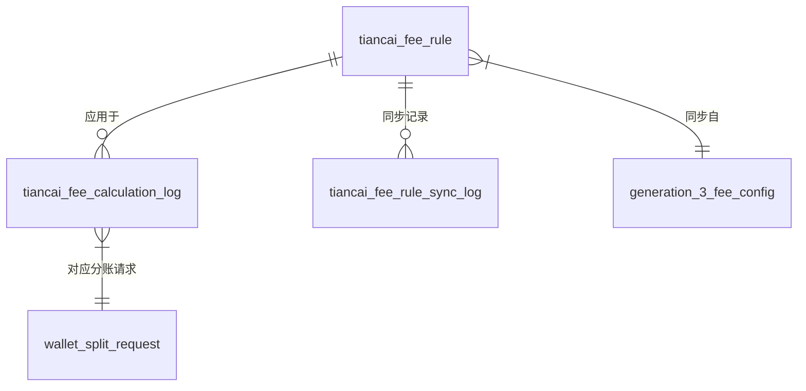
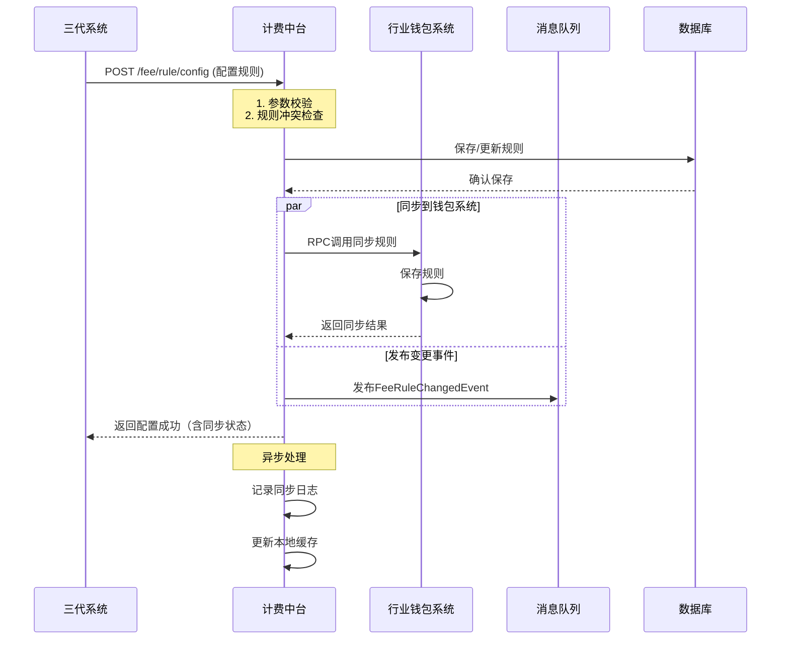
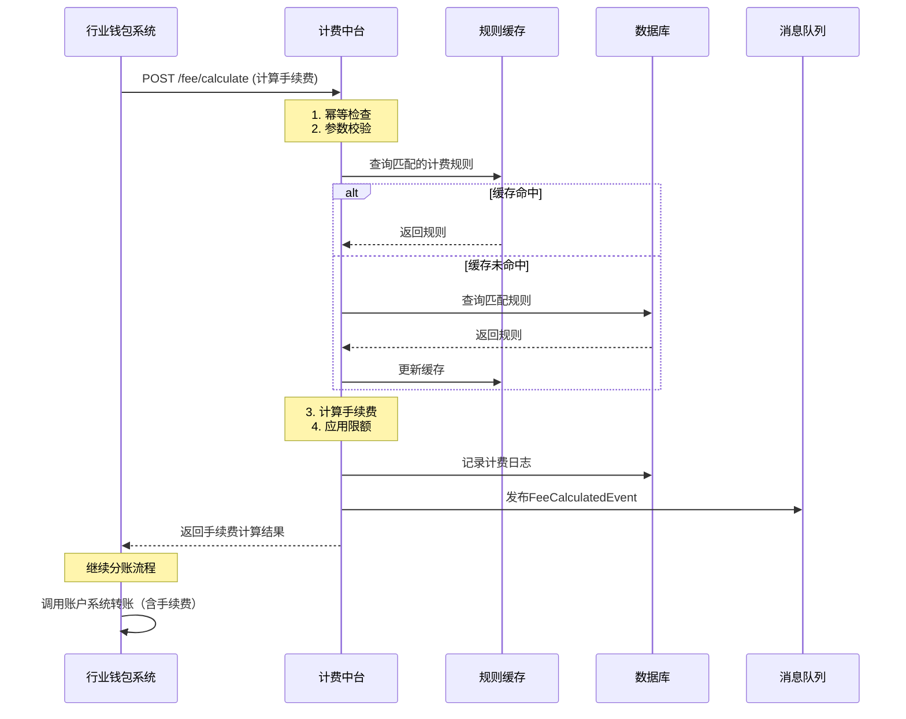

# 模块设计: 计费中台

生成时间: 2026-01-16 16:49:04

---

# 计费中台 - 天财分账模块设计文档

## 1. 概述

### 1.1 目的
本模块是“计费中台”系统中，专门为“天财商龙”分账业务提供手续费计算能力的核心模块。它接收来自行业钱包系统的分账请求，根据预先配置的计费规则，计算并返回分账手续费，确保分账业务计费的准确性、实时性和一致性。

### 1.2 范围
- **计费规则管理**：提供接口供三代系统配置、查询、更新天财分账业务的手续费规则。
- **实时计费服务**：为行业钱包系统发起的每一笔“天财分账”交易，实时计算手续费。
- **费用承担方处理**：支持“付方承担”、“收方承担”或“统一承担”等多种手续费承担模式。
- **计费模式支持**：支持按比例计费、固定金额计费等多种计费模式。
- **数据一致性保障**：确保计费规则在三代系统、行业钱包系统与计费中台之间的强一致性。
- **对账支持**：生成清晰的计费明细，供对账单系统使用。

### 1.3 核心原则
- **实时性**：分账手续费计算必须实时完成，不影响主交易流程。
- **准确性**：计费规则必须精确匹配业务场景（业务类型、收方类型、承担方等）。
- **一致性**：计费规则变更需确保在三方系统（三代、钱包、计费中台）间同步成功，避免因信息不一致导致资损或客诉。
- **灵活性**：支持丰富的计费维度和模式配置，满足天财复杂的业务场景。
- **可审计**：所有计费请求和结果需完整记录，便于对账和问题追溯。

## 2. 接口设计

### 2.1 API端点 (RESTful)

#### 2.1.1 计费规则配置接口
- **端点**: `POST /api/v1/tiancai/fee/rule/config`
- **描述**: 由三代系统调用，用于创建或更新天财分账业务的计费规则。
- **调用方**: 三代系统
- **请求头**:
    - `X-System-Id`: `GENERATION_3`
    - `Authorization`: Bearer Token (内部系统间认证)
- **请求体**:
```json
{
  "requestId": "G3_FEE_20240116001", // 请求流水号，幂等键
  "operation": "CREATE | UPDATE | INVALID", // 操作类型
  "ruleId": "TC_FEE_RULE_001", // 规则ID (UPDATE/INVALID时必传)
  "ruleInfo": {
    "bizType": "TIANCAI_SPLIT_ACCOUNT", // 业务类型：天财转账/分账
    "payerRoleType": "HEADQUARTERS | STORE", // 付方角色（总部/门店）
    "payeeAccountType": "RECEIVE_ACCOUNT | RECEIVER_ACCOUNT", // 收方账户类型
    "feeBearer": "PAYER | PAYEE | UNIFIED", // 手续费承担方
    "arrivalMode": "NET | GROSS", // 到账模式：净额/全额
    "chargeScope": "TRANSACTION_AMOUNT", // 计费范围：按流水金额
    "chargeMode": "PERCENTAGE | FIXED_AMOUNT", // 计费模式：比例/固定金额
    "chargeValue": "0.0035", // 计费值 (比例如0.35%，固定金额如1.00)
    "minFee": "0.01", // 最低手续费（元）
    "maxFee": "50.00", // 最高手续费（元）
    "effectiveTime": "2024-01-17 00:00:00", // 生效时间
    "expireTime": "2999-12-31 23:59:59", // 失效时间
    "targetMerchantNo": "888000000001", // 目标商户号（为空则全局规则）
    "targetAccountNo": "TC888000000001R01" // 目标账户号（为空则商户级规则）
  }
}
```
- **响应体** (成功):
```json
{
  "code": "SUCCESS",
  "message": "成功",
  "data": {
    "requestId": "G3_FEE_20240116001",
    "ruleId": "TC_FEE_RULE_001",
    "syncStatus": {
      "walletSystem": "SUCCESS",
      "feeCenter": "SUCCESS"
    },
    "configTime": "2024-01-16 10:30:00"
  }
}
```

#### 2.1.2 实时计费计算接口
- **端点**: `POST /api/v1/tiancai/fee/calculate`
- **描述**: 由行业钱包系统在分账前调用，实时计算单笔分账交易手续费。
- **调用方**: 行业钱包系统
- **请求头**:
    - `X-System-Id`: `WALLET_SYSTEM`
    - `Authorization`: Bearer Token
- **请求体**:
```json
{
  "requestId": "WALLET_FEE_20240116001",
  "splitRequestId": "TC_SPLIT_20240116001", // 分账请求流水号
  "scene": "COLLECTION | BATCH_PAY | MEMBER_SETTLEMENT", // 分账场景
  "payerMerchantNo": "888000000001", // 付方商户号
  "payerAccountNo": "TC888000000001R01", // 付方账户号（天财收款账户）
  "payerRoleType": "HEADQUARTERS", // 付方角色
  "payeeMerchantNo": "888000000002", // 收方商户号
  "payeeAccountNo": "TC888000000002R01", // 收方账户号
  "payeeAccountType": "RECEIVE_ACCOUNT", // 收方账户类型
  "splitAmount": "1000.00", // 分账金额（元）
  "feeBearerFromRequest": "PAYER", // 请求中指定的手续费承担方
  "requestTime": "2024-01-16 14:30:25.123" // 请求时间（用于匹配生效规则）
}
```
- **响应体** (成功):
```json
{
  "code": "SUCCESS",
  "message": "成功",
  "data": {
    "requestId": "WALLET_FEE_20240116001",
    "splitRequestId": "TC_SPLIT_20240116001",
    "calculatedFee": "3.50", // 计算出的手续费（元）
    "actualFee": "3.50", // 实际收取手续费（经最低最高限制后）
    "feeBearer": "PAYER", // 最终确定的手续费承担方
    "chargeMode": "PERCENTAGE", // 应用的计费模式
    "chargeValue": "0.0035", // 应用的计费值
    "netAmount": "996.50", // 净额（当到账模式为NET时）
    "ruleId": "TC_FEE_RULE_001", // 匹配的规则ID
    "calculationTime": "2024-01-16 14:30:25.456"
  }
}
```

#### 2.1.3 计费规则查询接口
- **端点**: `GET /api/v1/tiancai/fee/rule/query`
- **描述**: 供三代系统、钱包系统或内部运营查询生效的计费规则。
- **请求参数**:
```
targetMerchantNo=888000000001&payeeAccountType=RECEIVE_ACCOUNT&bizType=TIANCAI_SPLIT_ACCOUNT&effectiveTime=2024-01-16 15:00:00
```
- **响应体**:
```json
{
  "code": "SUCCESS",
  "message": "成功",
  "data": {
    "rules": [
      {
        "ruleId": "TC_FEE_RULE_001",
        "bizType": "TIANCAI_SPLIT_ACCOUNT",
        "payerRoleType": "HEADQUARTERS",
        "payeeAccountType": "RECEIVE_ACCOUNT",
        "feeBearer": "PAYER",
        "chargeMode": "PERCENTAGE",
        "chargeValue": "0.0035",
        "minFee": "0.01",
        "maxFee": "50.00",
        "effectiveTime": "2024-01-17 00:00:00",
        "expireTime": "2999-12-31 23:59:59",
        "status": "ACTIVE"
      }
    ]
  }
}
```

### 2.2 发布/消费的事件

#### 2.2.1 消费的事件
1. **FeeRuleChangedEvent** (计费规则变更事件)
   - **发布方**: 三代系统（在配置接口中同步调用后发布）
   - **触发时机**: 计费规则创建、更新或失效时。
   - **数据**:
   ```json
   {
     "eventId": "event_fee_001",
     "eventType": "FEE_RULE_CHANGED",
     "timestamp": "2024-01-16T10:30:00Z",
     "data": {
       "operation": "CREATE",
       "ruleId": "TC_FEE_RULE_001",
       "ruleInfo": { ... }, // 同配置接口的ruleInfo
       "sourceSystem": "GENERATION_3"
     }
   }
   ```
   - **动作**: 计费中台监听此事件，更新本地缓存，确保与三代系统数据一致。

#### 2.2.2 发布的事件
1. **FeeCalculatedEvent** (手续费计算完成事件)
   - **触发时机**: 实时计费接口成功计算出手续费后。
   - **数据**:
   ```json
   {
     "eventId": "event_calc_001",
     "eventType": "FEE_CALCULATED",
     "timestamp": "2024-01-16T14:30:25Z",
     "data": {
       "splitRequestId": "TC_SPLIT_20240116001",
       "payerMerchantNo": "888000000001",
       "payeeMerchantNo": "888000000002",
       "splitAmount": "1000.00",
       "calculatedFee": "3.50",
       "feeBearer": "PAYER",
       "ruleId": "TC_FEE_RULE_001",
       "requestTime": "2024-01-16T14:30:25.123Z"
     }
   }
   ```
   - **消费者**: 对账单系统（用于生成计费明细）、监控系统（用于计费业务监控）。

## 3. 数据模型

### 3.1 核心表设计

#### 表: `tiancai_fee_rule` (天财计费规则表)
| 字段名 | 类型 | 必填 | 描述 | 索引 |
|--------|------|------|------|------|
| id | bigint | Y | 主键 | PK |
| rule_id | varchar(64) | Y | 规则唯一标识 | UK |
| biz_type | varchar(32) | Y | 业务类型 | IDX |
| payer_role_type | varchar(32) | N | 付方角色类型 | IDX |
| payee_account_type | varchar(32) | Y | 收方账户类型 | IDX |
| fee_bearer | varchar(32) | Y | 手续费承担方 | |
| arrival_mode | varchar(32) | Y | 到账模式 | |
| charge_scope | varchar(32) | Y | 计费范围 | |
| charge_mode | varchar(32) | Y | 计费模式 | |
| charge_value | decimal(10,6) | Y | 计费值 | |
| min_fee | decimal(12,2) | Y | 最低手续费(元) | |
| max_fee | decimal(12,2) | Y | 最高手续费(元) | |
| target_merchant_no | varchar(32) | N | 目标商户号 | IDX |
| target_account_no | varchar(32) | N | 目标账户号 | IDX |
| effective_time | datetime | Y | 生效时间 | IDX |
| expire_time | datetime | Y | 失效时间 | IDX |
| status | tinyint | Y | 状态：1-生效，0-失效 | IDX |
| version | int | Y | 版本号（乐观锁） | |
| create_time | datetime | Y | 创建时间 | |
| update_time | datetime | Y | 更新时间 | |
| source_request_id | varchar(64) | Y | 来源请求ID（三代） | |
| last_sync_time | datetime | Y | 最后同步时间 | |

#### 表: `tiancai_fee_calculation_log` (计费计算日志表)
| 字段名 | 类型 | 必填 | 描述 | 索引 |
|--------|------|------|------|------|
| id | bigint | Y | 主键 | PK |
| calculation_id | varchar(64) | Y | 计费计算流水号 | UK |
| request_id | varchar(64) | Y | 请求流水号（钱包） | IDX |
| split_request_id | varchar(64) | Y | 分账请求流水号 | IDX |
| scene | varchar(32) | Y | 分账场景 | |
| payer_merchant_no | varchar(32) | Y | 付方商户号 | IDX |
| payer_account_no | varchar(32) | Y | 付方账户号 | |
| payee_merchant_no | varchar(32) | Y | 收方商户号 | IDX |
| payee_account_no | varchar(32) | Y | 收方账户号 | |
| split_amount | decimal(12,2) | Y | 分账金额 | |
| fee_bearer_request | varchar(32) | Y | 请求中手续费承担方 | |
| matched_rule_id | varchar(64) | Y | 匹配的规则ID | IDX |
| charge_mode | varchar(32) | Y | 计费模式 | |
| charge_value | decimal(10,6) | Y | 计费值 | |
| calculated_fee | decimal(12,2) | Y | 计算手续费 | |
| actual_fee | decimal(12,2) | Y | 实际手续费 | |
| fee_bearer_actual | varchar(32) | Y | 实际手续费承担方 | |
| net_amount | decimal(12,2) | N | 净额 | |
| calculation_time | datetime | Y | 计算时间 | IDX |
| request_time | datetime | Y | 请求时间 | |
| status | tinyint | Y | 状态：1-成功，0-失败 | |
| error_code | varchar(32) | N | 错误码 | |
| error_message | varchar(256) | N | 错误信息 | |

#### 表: `tiancai_fee_rule_sync_log` (规则同步日志表)
| 字段名 | 类型 | 必填 | 描述 | 索引 |
|--------|------|------|------|------|
| id | bigint | Y | 主键 | PK |
| sync_batch_no | varchar(64) | Y | 同步批次号 | UK |
| source_request_id | varchar(64) | Y | 三代请求ID | IDX |
| rule_id | varchar(64) | Y | 规则ID | IDX |
| operation | varchar(32) | Y | 操作类型 | |
| rule_info_before | json | N | 变更前规则信息 | |
| rule_info_after | json | N | 变更后规则信息 | |
| sync_target | varchar(32) | Y | 同步目标：WALLET/FEE_CENTER | |
| sync_status | tinyint | Y | 状态：1-成功，0-失败 | |
| sync_time | datetime | Y | 同步时间 | IDX |
| retry_count | int | Y | 重试次数 | |
| error_message | varchar(512) | N | 错误信息 | |

### 3.2 与其他模块的关系


- **generation_3_fee_config**: 三代系统计费配置表，`tiancai_fee_rule.source_request_id` 关联三代请求。
- **wallet_split_request**: 行业钱包系统分账请求表，`tiancai_fee_calculation_log.split_request_id` 关联。

## 4. 业务逻辑

### 4.1 核心算法与流程

#### 4.1.1 实时计费计算流程
```python
def calculate_split_fee(request):
    # 1. 参数基础校验
    validate_request_params(request)
    
    # 2. 幂等性检查
    if check_calculation_id_exists(request.request_id):
        return get_previous_calculation(request.request_id)
    
    # 3. 匹配计费规则（核心算法）
    matched_rule = match_fee_rule(
        biz_type="TIANCAI_SPLIT_ACCOUNT",
        payer_role_type=request.payer_role_type,
        payee_account_type=request.payee_account_type,
        target_merchant_no=request.payer_merchant_no,  # 优先匹配付方
        target_account_no=request.payer_account_no,
        request_time=request.request_time
    )
    
    if not matched_rule:
        # 尝试匹配全局规则
        matched_rule = match_fee_rule(
            biz_type="TIANCAI_SPLIT_ACCOUNT",
            payer_role_type=request.payer_role_type,
            payee_account_type=request.payee_account_type,
            target_merchant_no=None,  # 全局规则
            target_account_no=None,
            request_time=request.request_time
        )
    
    if not matched_rule:
        raise FeeRuleNotFoundException()
    
    # 4. 确定手续费承担方（请求参数优先，规则次之）
    final_fee_bearer = determine_fee_bearer(
        request.fee_bearer_from_request,
        matched_rule.fee_bearer
    )
    
    # 5. 计算手续费
    calculated_fee = calculate_fee_amount(
        split_amount=request.split_amount,
        charge_mode=matched_rule.charge_mode,
        charge_value=matched_rule.charge_value
    )
    
    # 6. 应用最低最高限制
    actual_fee = apply_fee_limits(
        calculated_fee,
        min_fee=matched_rule.min_fee,
        max_fee=matched_rule.max_fee
    )
    
    # 7. 计算净额（如需）
    net_amount = None
    if matched_rule.arrival_mode == "NET":
        if final_fee_bearer == "PAYEE":
            net_amount = request.split_amount - actual_fee
        else:
            net_amount = request.split_amount
    
    # 8. 记录日志并发布事件
    log_calculation(request, matched_rule, actual_fee, final_fee_bearer, net_amount)
    publish_fee_calculated_event(request, matched_rule, actual_fee)
    
    return build_fee_response(matched_rule, actual_fee, final_fee_bearer, net_amount)
```

#### 4.1.2 计费规则匹配算法
```python
def match_fee_rule(biz_type, payer_role_type, payee_account_type, 
                   target_merchant_no, target_account_no, request_time):
    """
    计费规则匹配优先级（从高到低）：
    1. 账户级规则（target_account_no匹配）
    2. 商户级规则（target_merchant_no匹配）
    3. 全局规则（target为空）
    
    同一级别内，按生效时间倒序取最新生效的规则
    """
    # 构建查询条件
    query_filters = {
        "biz_type": biz_type,
        "payee_account_type": payee_account_type,
        "status": "ACTIVE",
        "effective_time__lte": request_time,
        "expire_time__gt": request_time
    }
    
    # 添加可选条件
    if payer_role_type:
        query_filters["payer_role_type"] = payer_role_type
    
    # 尝试账户级匹配
    if target_account_no:
        account_rule = FeeRule.objects.filter(
            **query_filters,
            target_account_no=target_account_no
        ).order_by("-effective_time").first()
        if account_rule:
            return account_rule
    
    # 尝试商户级匹配
    if target_merchant_no:
        merchant_rule = FeeRule.objects.filter(
            **query_filters,
            target_merchant_no=target_merchant_no,
            target_account_no__isnull=True
        ).order_by("-effective_time").first()
        if merchant_rule:
            return merchant_rule
    
    # 全局规则
    global_rule = FeeRule.objects.filter(
        **query_filters,
        target_merchant_no__isnull=True,
        target_account_no__isnull=True
    ).order_by("-effective_time").first()
    
    return global_rule
```

### 4.2 业务规则

1. **计费规则优先级规则**:
   - 账户级规则 > 商户级规则 > 全局规则。
   - 同一级别内，按生效时间取最新规则。
   - 规则有效期必须包含请求时间点。

2. **手续费承担方确定规则**:
   - 优先使用分账请求中指定的`feeBearerFromRequest`。
   - 如果请求未指定或为`UNIFIED`，则使用匹配规则中的`feeBearer`。
   - 最终承担方必须是`PAYER`或`PAYEE`。

3. **手续费计算规则**:
   - 按比例计费：`手续费 = 分账金额 × 费率`。
   - 固定金额计费：`手续费 = 固定值`。
   - 计算结果需满足：`最低手续费 ≤ 实际手续费 ≤ 最高手续费`。
   - 金额单位：元，保留2位小数。

4. **净额计算规则**:
   - 仅当`到账模式=NET`时计算净额。
   - 收方承担手续费：`净额 = 分账金额 - 手续费`。
   - 付方承担手续费：`净额 = 分账金额`。

5. **规则同步一致性规则**:
   - 三代系统配置规则时，必须同步到钱包系统和计费中台。
   - 采用“同步调用+事件确认”双重保障机制。
   - 任何一方同步失败，整体操作失败，需人工介入。

### 4.3 验证逻辑

1. **计费规则配置验证**:
   - 费率值范围：比例费率需在[0, 1]区间，固定金额需为正数。
   - 时间有效性：生效时间必须早于失效时间。
   - 规则冲突检查：新规则不能与现有有效规则在相同维度下时间重叠。

2. **实时计费请求验证**:
   - 必填字段检查：分账金额必须大于0。
   - 账户类型校验：付方必须是天财收款账户。
   - 金额格式校验：金额必须为有效数字且不超过系统限制。

3. **数据一致性验证**:
   - 定期比对三代、钱包、计费中台三方的规则快照。
   - 发现不一致时，以三代系统为基准进行修复并告警。

## 5. 时序图

### 5.1 计费规则配置与同步时序图



### 5.2 实时分账计费时序图



## 6. 错误处理

### 6.1 错误码设计

| 错误码 | HTTP状态码 | 描述 | 处理建议 |
|--------|------------|------|----------|
| FEE_RULE_001 | 400 | 计费规则参数无效 | 检查规则配置参数 |
| FEE_RULE_002 | 400 | 规则时间冲突 | 调整规则生效/失效时间 |
| FEE_RULE_003 | 500 | 规则同步失败 | 检查下游系统状态并重试 |
| FEE_CALC_001 | 400 | 计费请求参数无效 | 检查分账请求参数 |
| FEE_CALC_002 | 404 | 未找到匹配计费规则 | 检查规则配置或联系运营 |
| FEE_CALC_003 | 400 | 分账金额不合法 | 金额需大于0且符合格式 |
| FEE_CALC_004 | 409 | 重复计费请求 | 使用原requestId查询结果 |
| FEE_SYNC_001 | 500 | 三方数据不一致 | 人工介入核对并修复 |
| FEE_SYSTEM_001 | 500 | 系统内部错误 | 查看日志联系运维 |

### 6.2 异常处理策略

1. **幂等性保证**:
   - 所有写操作接口必须包含`requestId`。
   - 在`tiancai_fee_calculation_log`中记录所有计费请求，实现天然幂等。
   - 重复请求直接返回之前计算结果。

2. **规则匹配降级策略**:
   - 优先匹配精确规则，未找到时尝试匹配更宽泛规则。
   - 最终未匹配任何规则时，明确返回错误，不提供默认费率。

3. **下游依赖容错**:
   - 规则缓存：使用Redis缓存热点规则，缓存失效时降级查库。
   - 缓存更新：规则变更时主动刷新缓存，设置合理TTL（如5分钟）。

4. **数据一致性保障**:
   - 规则同步采用同步调用，确保强一致性。
   - 提供规则比对工具，定期检查三方一致性。
   - 不一致时告警并记录详细差异，支持手动触发同步。

5. **监控与告警**:
   - 监控计费成功率、响应时间、规则匹配失败率。
   - 规则同步失败即时告警（企业微信/短信）。
   - 每日计费业务报告，包括交易量、手续费总额、异常情况。

## 7. 依赖说明

### 7.1 上游依赖

1. **三代系统**:
   - **交互方式**: REST API调用（规则配置）、消息队列（事件）
   - **职责**: 计费规则的唯一配置源，发起规则创建、更新、失效操作。
   - **数据流**: 计费规则配置信息、规则变更事件。
   - **SLA要求**: 配置接口响应时间<500ms，可用性99.95%。
   - **关键依赖**: 规则配置接口必须确保调用成功，否则影响业务计费。

2. **行业钱包系统**:
   - **交互方式**: REST API调用（实时计费）
   - **职责**: 分账业务发起方，在每笔分账前调用计费接口。
   - **数据流**: 分账请求信息、手续费计算结果。
   - **SLA要求**: 计费接口响应时间<100ms，可用性99.99%。
   - **关键依赖**: 计费接口必须高可用，否则阻塞分账流程。

### 7.2 下游依赖

1. **规则缓存 (Redis)**:
   - **交互方式**: 直接访问
   - **职责**: 缓存热点计费规则，提升查询性能。
   - **数据结构**: Hash存储规则对象，Key格式：`fee_rule:{rule_id}`。
   - **异常影响**: 缓存失效时降级查库，性能下降但功能正常。

2. **数据库 (MySQL)**:
   - **交互方式**: 直接访问
   - **职责**: 持久化存储计费规则和计算日志。
   - **关键表**: `tiancai_fee_rule`, `tiancai_fee_calculation_log`。
   - **异常影响**: 核心功能不可用，需优先恢复。

3. **消息队列 (Kafka/RocketMQ)**:
   - **交互方式**: 事件发布
   - **职责**: 异步通知计费结果，系统解耦。
   - **关键Topic**: `tiancai-fee-calculated`, `tiancai-fee-rule-changed`。
   - **异常影响**: 事件消费方无法及时获取信息，不影响主流程。

### 7.3 依赖管理策略

1. **超时与重试**:
   - 规则配置接口：超时2秒，不重试（由三代系统重试）。
   - 实时计费接口：超时50ms，重试1次（快速失败）。
   - 缓存操作：超时10ms，重试2次。

2. **熔断与降级**:
   - 数据库访问熔断：失败率超过50%时熔断，降级返回默认规则（需配置）。
   - 缓存访问降级：直接查库，记录降级日志。

3. **数据同步一致性保障**:
   - 同步调用+异步确认：三代配置时同步调用钱包和计费中台。
   - 定期比对：每日凌晨比对三方规则快照。
   - 不一致修复：提供管理界面手动触发同步。

4. **容量规划**:
   - 规则数量预估：初期<10万条，按商户+账户维度增长。
   - 计费QPS预估：峰值1000 TPS，平均200 TPS。
   - 日志存储：计费日志保留180天，规则变更日志永久保留。

---
**文档版本**: 1.0  
**最后更新**: 2024-01-16  
**维护团队**: 计费中台开发组