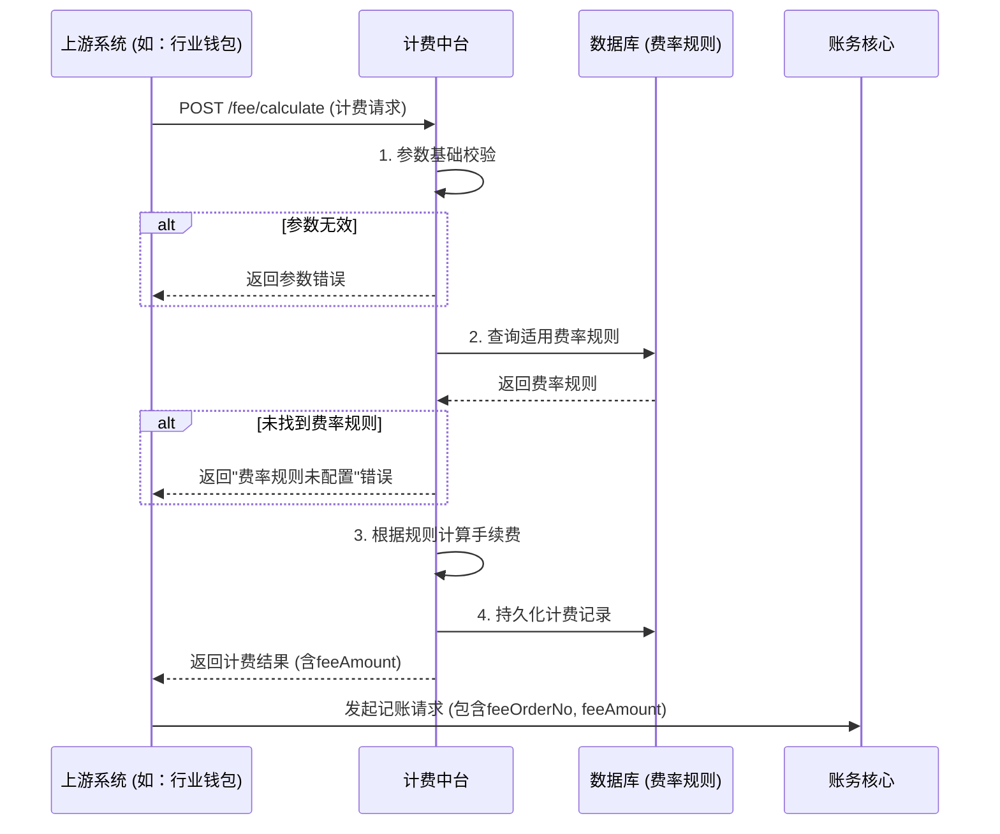

# 模块设计: 计费中台

生成时间: 2026-01-22 15:38:24
批判迭代: 2

---

# 计费中台 模块设计文档

## 1. 概述
- **目的与范围**：本模块是负责计算并生成转账、分账、批量付款等业务场景下手续费的独立服务。其核心职责是根据业务类型、金额、参与方等信息，查询并应用配置的费率规则，计算出应收的手续费金额，并将计费结果提供给上游业务系统（如行业钱包、清结算）用于后续的资金流转与记账。
- **与术语表的一致性说明**：根据术语表，"清结算"与"计费中台"为别名关系，表明本模块是"清结算"体系内专注于手续费计算的子模块或服务。因此，上游系统应为发起计费请求的业务系统（如行业钱包），下游为接收计费结果进行记账的"账务核心"，职责划分清晰，无重叠。

## 2. 接口设计
- **API端点 (REST)**：
    - `POST /api/v1/fee/calculate`：手续费计算接口。
    - `GET /api/v1/fee/rules/validation`：费率规则验证接口（供运营使用）。
- **请求/响应结构**：
    - 计费请求 (`POST /api/v1/fee/calculate`)：
        ```json
        {
          "requestId": "string，请求唯一标识",
          "bizType": "string，业务类型（如：SPLIT_ACCOUNT, BATCH_PAY, TRANSFER）",
          "bizOrderNo": "string，上游业务订单号",
          "payerAccountNo": "string，付款方账户号",
          "receiverAccountNo": "string，收款方账户号（可选）",
          "amount": "BigDecimal，计费基数金额",
          "currency": "string，币种",
          "extInfo": "object，扩展信息（如机构号、门店ID等）"
        }
        ```
    - 计费响应 (`POST /api/v1/fee/calculate`)：
        ```json
        {
          "code": "string，响应码",
          "message": "string，响应信息",
          "data": {
            "requestId": "string，原请求ID",
            "feeOrderNo": "string，计费订单号",
            "bizType": "string，业务类型",
            "calculatedAmount": "BigDecimal，计费基数金额",
            "feeAmount": "BigDecimal，计算出的手续费金额",
            "feeRuleId": "string，应用的费率规则ID",
            "currency": "string，币种"
          }
        }
        ```
- **发布/消费的事件**：
    - 消费事件：TBD（例如，监听业务订单创建事件以触发异步计费）。
    - 发布事件：TBD（例如，发布"计费完成"事件，供下游订阅）。

## 3. 数据模型
- **表/集合**：
    - `fee_rule_config`：费率规则配置表。
    - `fee_calculate_record`：计费记录表。
    - `fee_rule_audit_log`：费率规则变更审计日志表。
- **关键字段**：
    - `fee_rule_config`：
        - `id` (主键)
        - `rule_code` (规则代码，唯一)
        - `biz_type` (适用的业务类型)
        - `payer_type` (付款方类型，如：收单商户、非收单商户)
        - `receiver_type` (收款方类型)
        - `fee_model` (计费模式：PERCENTAGE百分比，FIXED固定，TIERED阶梯)
        - `rate_value` (费率值/固定金额)
        - `tier_config` (阶梯配置，JSON格式)
        - `priority` (规则优先级)
        - `status` (状态：ENABLED, DISABLED)
        - `effective_time` (生效时间)
        - `expire_time` (失效时间)
    - `fee_calculate_record`：
        - `id` (主键)
        - `fee_order_no` (计费订单号，唯一)
        - `biz_order_no` (关联的业务订单号)
        - `biz_type` (业务类型)
        - `payer_account_no` (付款方账户)
        - `calculated_amount` (计费基数)
        - `fee_amount` (手续费金额)
        - `applied_rule_id` (应用的规则ID)
        - `calculate_status` (状态：SUCCESS, FAILED)
        - `calc_request` (计费请求快照，JSON)
        - `calc_response` (计费响应快照，JSON)
- **与其他模块的关系**：`fee_calculate_record` 表中的计费结果（`fee_order_no`, `fee_amount`）将作为关键字段，通过接口或事件提供给"账务核心"模块，用于生成手续费相关的会计分录。

## 4. 业务逻辑
- **核心工作流/算法**：
    1. **接收请求**：通过 REST API 接收上游系统（如行业钱包）的计费请求。
    2. **参数校验**：校验请求参数完整性、业务类型合法性、金额有效性（>0）。
    3. **规则匹配**：根据 `bizType`、`payerAccountNo`、`receiverAccountNo`、`extInfo`（如机构号）等条件，查询 `fee_rule_config` 表，按优先级、生效状态、时间范围筛选出唯一适用的费率规则。
    4. **手续费计算**：
        - **百分比模式**：`feeAmount = calculatedAmount * rateValue`。
        - **固定费用模式**：`feeAmount = rateValue`。
        - **阶梯模式**：根据 `tier_config` 中定义的金额区间和对应费率进行计算。
    5. **结果处理**：生成唯一的 `feeOrderNo`，将计费请求、结果、应用的规则ID持久化到 `fee_calculate_record` 表。
    6. **返回结果**：将计算出的手续费金额及详情返回给调用方。
- **业务规则与验证**：
    - 规则匹配遵循"精确匹配优先，再模糊匹配"的原则。
    - 费率规则在生效前需通过运营后台进行配置与审核，变更记录存入 `fee_rule_audit_log`。
    - 计费时若金额为零或负数，直接返回零手续费并记录。
- **关键边界情况处理**：
    - **零手续费**：规则匹配后计算出的手续费为0，正常返回结果。
    - **费率配置缺失**：若无任何规则匹配，返回明确的"费率规则未配置"错误。
    - **多规则冲突**：通过规则优先级 (`priority`) 字段解决，取优先级最高者。
    - **配置版本管理**：通过 `effective_time` 和 `expire_time` 管理规则生命周期，确保计费时点使用正确的版本。

## 5. 时序图



## 6. 错误处理
- **预期错误情况与错误码**：
    - `INVALID_PARAM` (400): 请求参数缺失、格式错误或金额无效。
    - `FEE_RULE_NOT_FOUND` (404): 未找到适用于当前业务场景的生效费率规则。
    - `FEE_CALCULATION_ERROR` (500): 手续费计算过程中出现异常（如规则配置错误导致计算失败）。
    - `SYSTEM_ERROR` (500): 系统内部未知异常。
- **处理策略**：
    - 对于 `INVALID_PARAM` 和 `FEE_RULE_NOT_FOUND` 错误，立即中止流程，向调用方返回明确的错误码和信息，不进行重试。
    - 对于 `FEE_CALCULATION_ERROR` 和 `SYSTEM_ERROR`，记录详细的错误日志（包括请求ID、上下文信息），并返回系统错误响应。是否重试由调用方根据业务重要性决定。
    - 所有错误情况均需在 `fee_calculate_record` 表中记录失败状态和错误信息。
- **降级与容灾**：TBD（例如，在费率服务不可用时，可启用默认费率或快速失败）。

## 7. 依赖关系
- **上游模块**：**行业钱包**、**清结算**（作为业务发起方，调用计费接口）。根据术语表，"清结算"是本模块的别名，此处指清结算体系内其他发起计费需求的组件。
- **下游模块**：**账务核心**（接收计费结果中的 `feeOrderNo` 和 `feeAmount`，完成手续费相关的会计分录）。
- **内部依赖**：**数据库**（存储费率规则与计费记录）。
- **外部依赖**：TBD（如配置管理平台，用于动态推送费率规则）。