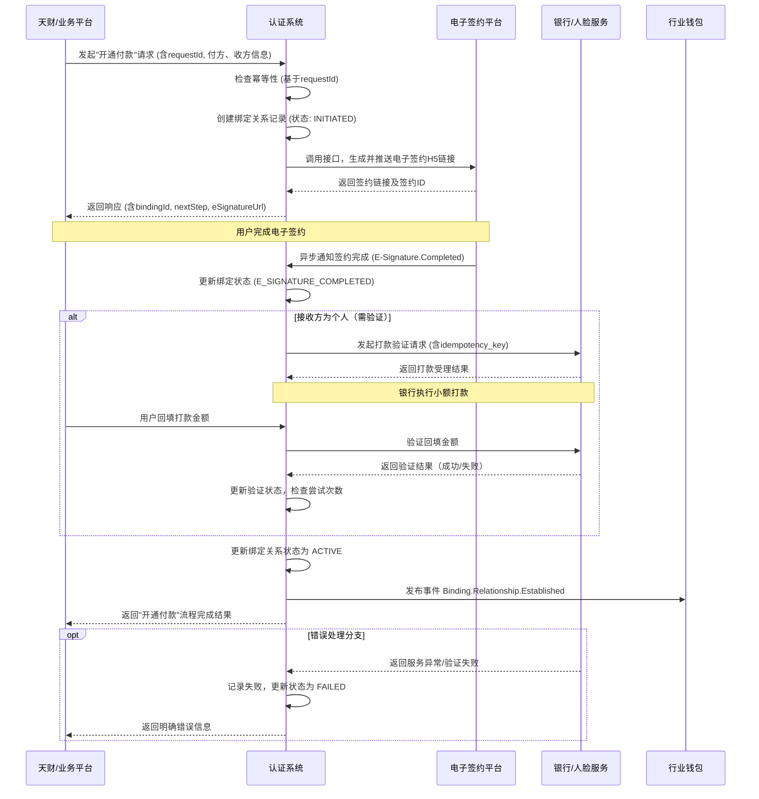

# 模块设计: 认证系统

生成时间: 2026-01-22 15:38:37
批判迭代: 2

---

# 认证系统 模块设计文档

## 1. 概述
- **目的与范围**: 本模块负责处理与天财业务相关的身份认证与授权关系绑定流程。核心职责包括：1) 执行打款验证与人脸验证以确认账户持有人身份；2) 管理总部与门店、付款方与接收方之间的"关系绑定"流程；3) 为"开通付款"等场景提供签约与认证支持。本模块是完成资金流转（如分账、归集、批量付款）前必要的授权与安全验证环节。

## 2. 接口设计
- **API端点 (REST/GraphQL)**:
    - `POST /api/v1/verification/payment`：发起打款验证。
    - `POST /api/v1/verification/payment/confirm`：确认打款验证（回填金额）。
    - `POST /api/v1/verification/face`：发起人脸验证。
    - `POST /api/v1/binding/initiate`：发起关系绑定流程。
    - `GET /api/v1/binding/{bindingId}/status`：查询绑定流程状态。
    - `POST /api/v1/callback/e-signature`：接收电子签约平台异步通知。
- **请求/响应结构**:
    - 发起打款验证请求 (`POST /api/v1/verification/payment`)：
        - 请求体: `{ "requestId": "string", "bankCardNo": "string", "bankCode": "string", "accountName": "string", "idCardNo": "string" }`
        - 响应体: `{ "verificationId": "string", "status": "PENDING" }`
    - 确认打款验证请求 (`POST /api/v1/verification/payment/confirm`)：
        - 请求体: `{ "verificationId": "string", "amount": "string" }`
        - 响应体: `{ "verificationId": "string", "status": "SUCCESS/FAILED", "message": "string" }`
    - 发起关系绑定请求 (`POST /api/v1/binding/initiate`)：
        - 请求体: `{ "requestId": "string", "payerId": "string", "payerType": "HEADQUARTERS/STORE", "receiverId": "string", "receiverType": "STORE/NON_ACQUIRING_MERCHANT", "businessScenario": "BATCH_PAYMENT" }`
        - 响应体: `{ "bindingId": "string", "nextStep": "E_SIGNATURE", "eSignatureUrl": "string" }`
- **发布/消费的事件**:
    - 消费事件: `E-Signature.Completed` (来自电子签约平台)。
    - 发布事件: `Verification.Payment.Succeeded`, `Verification.Payment.Failed`, `Verification.Face.Succeeded`, `Verification.Face.Failed`, `Binding.Relationship.Established`, `Binding.Relationship.Failed`。

## 3. 数据模型
- **表/集合**:
    - `verification_attempts` (验证尝试记录表)
    - `binding_relationships` (绑定关系表)
    - `binding_process` (绑定流程实例表)
- **关键字段**:
    - `verification_attempts`:
        - `id` (主键), `verification_id` (业务ID), `type` (PAYMENT/FACE), `target_id` (目标用户/账户ID), `status` (PENDING/SUCCESS/FAILED), `request_data` (JSON), `response_data` (JSON), `failure_reason` (TEXT), `attempt_count` (INT), `created_at`, `updated_at`。
    - `binding_relationships`:
        - `id` (主键), `relationship_id` (业务关系ID), `payer_id`, `payer_type`, `receiver_id`, `receiver_type`, `verification_status` (PENDING/VERIFIED), `contract_status` (PENDING/SIGNED), `overall_status` (PENDING/ACTIVE/INACTIVE), `created_at`, `activated_at`。
    - `binding_process`:
        - `id` (主键), `binding_id` (外键，关联binding_relationships), `current_step` (E_SIGNATURE/VERIFICATION/COMPLETED), `step_data` (JSON), `idempotency_key` (STRING), `created_at`, `updated_at`。
- **与其他模块的关系**:
    - 本模块需要与 **电子签约平台** 交互，以完成电子协议签署、短信推送及证据链留存。
    - 认证结果（如关系绑定状态）需要提供给 **行业钱包** 系统，用于后续分账、付款等操作的权限校验。
    - 接收来自 **三代** 系统的商户入网信息（作为上游输入）。

## 4. 业务逻辑
- **核心工作流/算法**:
    1. **打款验证流程**: 接收银行卡信息，调用银行通道发起小额打款，用户回填金额后，系统验证金额是否匹配以确认银行卡有效性和持有人身份。
        - **技术细节**: 为每次验证请求生成唯一的 `verification_id` 和 `idempotency_key`。调用银行接口时，使用 `idempotency_key` 确保同一请求的幂等性。打款金额为随机生成（如0.01-0.99元），并加密存储用于后续比对。设置异步任务轮询银行打款状态。
    2. **人脸验证流程**: 接收姓名、身份证号及人脸图像/视频，调用第三方人脸识别服务进行比对，验证三者信息是否一致。
        - **技术细节**: 调用人脸识别服务前，先校验身份证号格式与姓名合规性。服务响应后，根据置信度分数（如>0.9）判定成功或失败。记录完整的请求与响应流水。
    3. **关系绑定/开通付款流程**: 引导付款方（如总部）与接收方（如门店）完成电子签约，并根据业务规则要求（如对个人接收方）执行打款验证或人脸验证，最终建立授权绑定关系。
        - **状态机**: 流程状态包括 `INITIATED` -> `E_SIGNATURE_PENDING` -> `E_SIGNATURE_COMPLETED` -> `VERIFICATION_PENDING` (如需要) -> `VERIFICATION_COMPLETED` -> `ACTIVE`。任何步骤失败则进入 `FAILED` 状态。
        - **幂等性**: 通过业务方传入的 `requestId` 或自生成的 `idempotency_key` 保证"发起绑定"请求的幂等性。
- **业务规则与验证**:
    - 对于 **非收单商户（一般接收方）**，特别是个人，在绑定为分账接收方或开通付款时，必须完成 **打款验证** 或 **人脸验证**。
    - 绑定关系的建立需以双方完成 **电子签约** 为前提。
    - 验证结果需具备防篡改和可追溯性。
    - **每日尝试次数限制**: 同一验证目标（如银行卡、身份证）24小时内验证失败次数不得超过5次，超过则锁定24小时。
- **关键边界情况处理**:
    - 验证失败（如打款金额错误、人脸比对不通过）：记录失败原因，允许用户重试，但需检查并执行每日尝试次数限制。
    - 银行打款超时或失败：通过异步任务每10分钟检查一次"打款中"状态的记录，超过30分钟未收到银行回调则标记为超时，支持人工或自动重新发起。
    - 电子签约流程中断：在 `binding_process` 表中保存当前步骤与数据，支持通过 `bindingId` 查询状态并继续流程。

## 5. 时序图

## 6. 错误处理
- **预期错误情况**:
    - 外部服务异常（银行打款通道失败、人脸识别服务不可用、电子签约平台超时）。
    - 用户输入错误（银行卡信息无效、回填金额错误、身份证格式错误）。
    - 业务规则冲突（试图重复绑定已存在的关系、验证次数超限）。
- **处理策略**:
    - 对外部服务调用设置超时（如5秒）与重试机制（最多2次，仅对网络超时等可重试错误）。
    - 对用户输入进行格式与逻辑校验（如银行卡Luhn校验，身份证号校验），返回明确的错误提示。
    - 记录所有验证尝试日志至 `verification_attempts` 表，用于风控分析与问题排查。
    - 关键流程（如关系绑定）通过 `requestId` 和 `idempotency_key` 支持幂等性处理。
    - 依赖服务不可用时，流程状态置为"挂起"，并记录告警，支持人工介入。

## 7. 依赖关系
- **上游模块**:
    - **天财**（业务平台）: 发起认证与绑定请求。
    - **三代**: 提供商户入网审核通过后的基本信息，作为绑定关系的一方（如门店）的输入。根据术语表，三代是上游核心系统。
- **下游模块**:
    - **电子签约平台**: 依赖其完成协议签署流程。
    - **行业钱包**: 依赖本模块发布的 `Binding.Relationship.Established` 事件，以更新其内部的权限控制策略，允许后续分账、付款等操作。