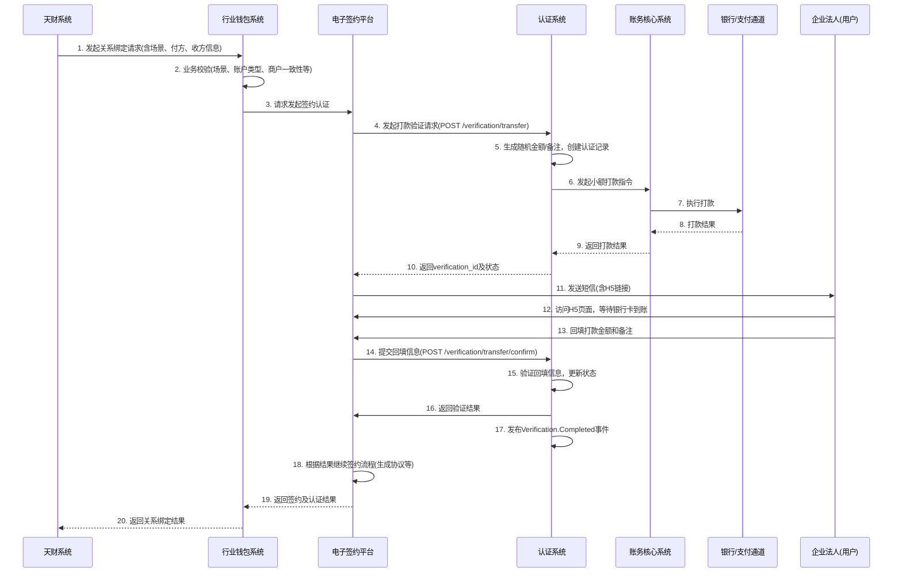
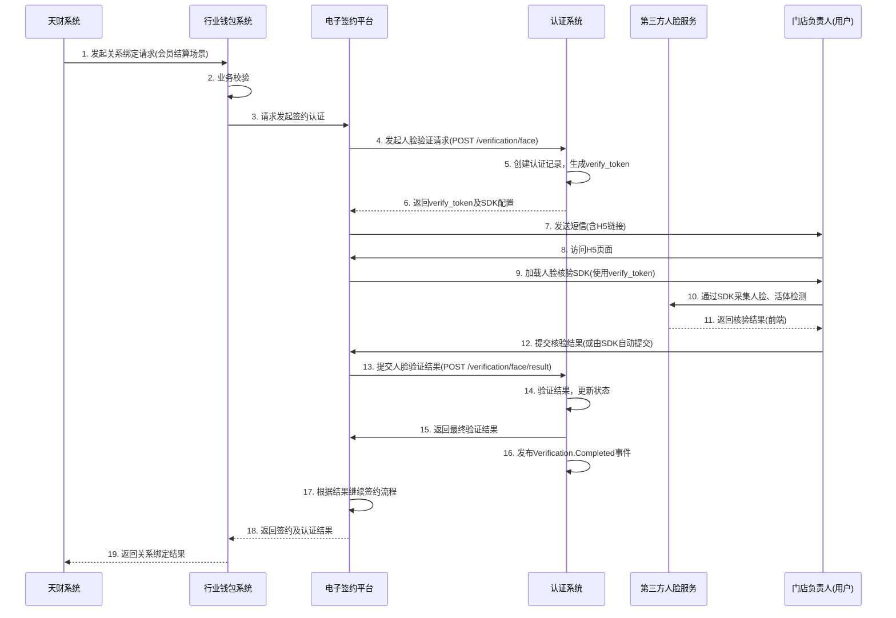

# 模块设计: 认证系统

生成时间: 2026-01-16 16:46:01

---

# 认证系统模块设计文档

## 1. 概述

### 1.1 目的
认证系统作为拉卡拉支付平台的核心身份核验模块，为“天财分账”等业务场景提供安全、合规、可靠的身份认证能力。其主要目的是：
- **验证身份真实性**：通过打款验证和人脸验证，确保参与分账业务的商户（总部、门店、接收方）身份真实有效，满足监管和法务要求。
- **保障协议有效性**：为电子签约流程提供前置身份核验，确保签署协议的各方主体身份无误，形成完整的电子证据链。
- **支持业务场景**：适配“归集”、“批量付款”、“会员结算”等多种分账场景下，对不同类型商户（企业/个人）的差异化认证需求。

### 1.2 范围
本模块设计范围涵盖：
- **打款验证**：面向对公企业，通过向指定银行卡打入随机小额款项并验证回填信息的方式进行认证。
- **人脸验证**：面向个人及个体户，通过比对姓名、身份证号和人脸生物特征信息进行认证。
- **认证结果管理**：记录、存储和查询认证过程与结果，为业务系统提供校验依据。
- **与电子签约平台集成**：作为电子签约流程中的关键一环，接收其调用并返回认证结果。

**边界说明**：
- 本模块**不负责**协议模板管理、短信发送、H5页面生成，这些由电子签约平台负责。
- 本模块**不负责**账户信息（如绑定银行卡）的存储与管理，这些由行业钱包系统负责。
- 本模块**不负责**打款验证中的实际资金划拨，仅负责发起指令和验证回填信息，资金划拨由账务核心系统执行。

## 2. 接口设计

### 2.1 API端点 (RESTful)

#### 2.1.1 发起打款验证
- **端点**: `POST /api/v1/verification/transfer`
- **描述**: 为指定的对公企业银行卡发起一笔随机小额打款，并生成一条待验证记录。
- **认证**: API Key (由调用方如电子签约平台提供)
- **请求头**:
    - `X-Request-ID`: 请求唯一标识，用于幂等和追踪。
    - `X-Caller-System`: 调用方系统标识 (如：`e-sign-platform`)。

- **请求体**:
```json
{
  "requestId": "req_202310271200001", // 业务请求ID，全局唯一
  "businessType": "TIANCAI_SPLIT", // 业务类型，固定值
  "scene": "BATCH_PAYMENT", // 场景：BATCH_PAYMENT, MEMBER_SETTLEMENT, COLLECTION, OPEN_PAYMENT
  "payerMerchantNo": "M1234567890", // 付方商户号（协议发起方）
  "payerMerchantName": "XX科技有限公司", // 付方商户全称
  "payeeBankCardNo": "6228480012345678901", // 收款银行卡号（待验证卡）
  "payeeAccountName": "XX科技有限公司", // 收款账户户名（需与卡号对应）
  "callbackUrl": "https://esign.example.com/callback/verification" // 验证结果回调地址
}
```

- **响应体 (成功)**:
```json
{
  "code": "SUCCESS",
  "message": "打款指令已发起",
  "data": {
    "verificationId": "verif_202310271200001", // 本系统生成的认证流水ID
    "status": "PENDING", // 状态：PENDING-待回填，SUCCESS-成功，FAILED-失败，EXPIRED-过期
    "expireTime": "2023-10-27T12:10:00+08:00" // 回填过期时间（如10分钟后）
  }
}
```

#### 2.1.2 验证打款回填信息
- **端点**: `POST /api/v1/verification/transfer/confirm`
- **描述**: 验证用户回填的打款金额和备注信息。
- **请求体**:
```json
{
  "verificationId": "verif_202310271200001",
  "filledAmount": "0.23", // 用户回填金额，单位元，两位小数
  "filledRemark": "529874" // 用户回填备注，6位数字或2个汉字
}
```
- **响应体 (成功)**:
```json
{
  "code": "SUCCESS",
  "message": "验证成功",
  "data": {
    "verificationId": "verif_202310271200001",
    "status": "SUCCESS",
    "verifyTime": "2023-10-27T12:05:30+08:00"
  }
}
```

#### 2.1.3 发起人脸验证
- **端点**: `POST /api/v1/verification/face`
- **描述**: 发起一次人脸核验请求，通常返回一个用于前端SDK调用的令牌或配置。
- **请求体**:
```json
{
  "requestId": "req_202310271200002",
  "businessType": "TIANCAI_SPLIT",
  "scene": "MEMBER_SETTLEMENT",
  "payerMerchantNo": "M1234567890",
  "payerMerchantName": "XX科技有限公司",
  "userId": "110101199001011234", // 待验证用户的身份证号
  "userName": "张三", // 待验证用户姓名
  "userType": "PERSONAL", // 用户类型：PERSONAL-个人， INDIVIDUAL-个体户
  "callbackUrl": "https://esign.example.com/callback/verification"
}
```
- **响应体 (成功)**:
```json
{
  "code": "SUCCESS",
  "message": "人脸核验请求已创建",
  "data": {
    "verificationId": "verif_202310271200002",
    "verifyToken": "face_token_abc123xyz", // 用于前端人脸SDK的令牌
    "sdkConfig": { // 可选，前端SDK所需配置
      "appId": "face_app_001",
      "nonce": "random_str",
      "timestamp": "1698372330"
    },
    "expireTime": "2023-10-27T12:10:00+08:00"
  }
}
```

#### 2.1.4 提交人脸验证结果
- **端点**: `POST /api/v1/verification/face/result` (通常由前端SDK回调或电子签约平台中转)
- **描述**: 接收人脸核验服务提供商（如腾讯云、阿里云）的回调结果，或由前端提交核验结果。
- **请求体**:
```json
{
  "verificationId": "verif_202310271200002",
  "bizToken": "biz_token_from_provider", // 核验服务商的业务流水号
  "success": true,
  "score": 0.95, // 人脸比对分数
  "message": "核验通过"
}
```
- **响应体 (成功)**:
```json
{
  "code": "SUCCESS",
  "message": "结果接收成功"
}
```

#### 2.1.5 查询认证结果
- **端点**: `GET /api/v1/verification/{verificationId}`
- **描述**: 根据认证流水ID查询详细的认证结果和过程信息。
- **响应体**:
```json
{
  "code": "SUCCESS",
  "data": {
    "verificationId": "verif_202310271200001",
    "requestId": "req_202310271200001",
    "businessType": "TIANCAI_SPLIT",
    "scene": "BATCH_PAYMENT",
    "merchantInfo": {
      "payerMerchantNo": "M1234567890",
      "payerMerchantName": "XX科技有限公司",
      "payeeBankCardNo": "6228480012345678901",
      "payeeAccountName": "XX科技有限公司"
    },
    "type": "TRANSFER", // 认证类型：TRANSFER-打款， FACE-人脸
    "status": "SUCCESS",
    "detail": {
      "transferAmount": "0.23", // 打款金额（仅打款验证）
      "transferRemark": "529874", // 打款备注（仅打款验证）
      "transferTime": "2023-10-27T12:01:00+08:00",
      "filledAmount": "0.23",
      "filledRemark": "529874",
      "filledTime": "2023-10-27T12:05:30+08:00"
    },
    "createTime": "2023-10-27T12:00:00+08:00",
    "verifyTime": "2023-10-27T12:05:30+08:00"
  }
}
```

### 2.2 发布/消费的事件

#### 2.2.1 消费的事件
- **Account.BankCardBound**: 当行业钱包系统或账户系统成功绑定银行卡时，可能需要触发预验证（可选需求，当前未明确，预留接口）。

#### 2.2.2 发布的事件
- **Verification.Completed**: 当一次认证流程完成（成功或失败）时发布，供电子签约平台、行业钱包等系统订阅。
```json
{
  "eventId": "event_verif_001",
  "eventType": "Verification.Completed",
  "timestamp": "2023-10-27T12:05:30+08:00",
  "payload": {
    "verificationId": "verif_202310271200001",
    "requestId": "req_202310271200001",
    "businessType": "TIANCAI_SPLIT",
    "scene": "BATCH_PAYMENT",
    "type": "TRANSFER",
    "status": "SUCCESS", // 或 FAILED
    "payerMerchantNo": "M1234567890",
    "relatedBankCardNo": "6228480012345678901",
    "userId": "110101199001011234" // 人脸验证时有值
  }
}
```

## 3. 数据模型

### 3.1 数据库表设计

#### 表: `verification_record` (认证记录主表)
| 字段名 | 类型 | 必填 | 默认值 | 说明 |
| :--- | :--- | :--- | :--- | :--- |
| `id` | bigint(20) | 是 | AUTO_INCREMENT | 主键 |
| `verification_id` | varchar(32) | 是 | | **业务唯一流水号**，前缀`verif_`，全局唯一索引 |
| `request_id` | varchar(64) | 是 | | 外部业务请求ID，用于幂等 |
| `business_type` | varchar(32) | 是 | | 业务类型：`TIANCAI_SPLIT` |
| `scene` | varchar(32) | 是 | | 场景：`COLLECTION`, `BATCH_PAYMENT`, `MEMBER_SETTLEMENT`, `OPEN_PAYMENT` |
| `verification_type` | varchar(16) | 是 | | 认证类型：`TRANSFER`, `FACE` |
| `status` | varchar(16) | 是 | `PENDING` | 状态：`PENDING`, `SUCCESS`, `FAILED`, `EXPIRED` |
| `payer_merchant_no` | varchar(32) | 是 | | 付方/协议发起方商户号 |
| `payer_merchant_name` | varchar(128) | 是 | | 付方商户全称 |
| `payee_bank_card_no` | varchar(32) | 否 | | **收款银行卡号**（打款验证时必填） |
| `payee_account_name` | varchar(128) | 否 | | **收款账户户名**（打款验证时必填） |
| `user_id` | varchar(32) | 否 | | **用户身份证号**（人脸验证时必填） |
| `user_name` | varchar(64) | 否 | | **用户姓名**（人脸验证时必填） |
| `user_type` | varchar(16) | 否 | | 用户类型：`PERSONAL`, `INDIVIDUAL`, `ENTERPRISE` |
| `callback_url` | varchar(512) | 是 | | 结果回调地址 |
| `expire_time` | datetime | 是 | | 认证过期时间 |
| `create_time` | datetime | 是 | CURRENT_TIMESTAMP | 创建时间 |
| `update_time` | datetime | 是 | CURRENT_TIMESTAMP ON UPDATE | 更新时间 |
| `creator` | varchar(32) | 是 | `system` | 创建者系统 |
| **索引** | | | | |
| idx_request_id | `request_id` | | | 业务请求ID索引 |
| idx_payer_merchant_no | `payer_merchant_no` | | | 付方商户号查询 |
| idx_status_expire | `status`, `expire_time` | | | 状态和过期时间，用于定时任务扫描 |

#### 表: `verification_transfer_detail` (打款验证详情表)
| 字段名 | 类型 | 必填 | 默认值 | 说明 |
| :--- | :--- | :--- | :--- | :--- |
| `id` | bigint(20) | 是 | AUTO_INCREMENT | 主键 |
| `verification_id` | varchar(32) | 是 | | 关联主表`verification_id`，唯一索引 |
| `transfer_amount` | decimal(10,2) | 是 | | 随机打款金额（元） |
| `transfer_remark` | varchar(32) | 是 | | 随机打款备注（6位数字或2汉字） |
| `transfer_order_no` | varchar(64) | 否 | | 打款交易订单号（由账务核心返回） |
| `transfer_status` | varchar(16) | 是 | `INIT` | 打款状态：`INIT`, `SUCCESS`, `FAILED` |
| `transfer_time` | datetime | 否 | | 打款成功时间 |
| `filled_amount` | decimal(10,2) | 否 | | 用户回填金额 |
| `filled_remark` | varchar(32) | 否 | | 用户回填备注 |
| `filled_time` | datetime | 否 | | 回填时间 |
| `retry_count` | int(11) | 是 | 0 | 回填验证重试次数 |
| `fail_reason` | varchar(256) | 否 | | 失败原因 |
| **索引** | | | | |
| idx_verification_id | `verification_id` | | UNIQUE | 主表关联索引 |

#### 表: `verification_face_detail` (人脸验证详情表)
| 字段名 | 类型 | 必填 | 默认值 | 说明 |
| :--- | :--- | :--- | :--- | :--- |
| `id` | bigint(20) | 是 | AUTO_INCREMENT | 主键 |
| `verification_id` | varchar(32) | 是 | | 关联主表`verification_id`，唯一索引 |
| `verify_token` | varchar(128) | 是 | | 人脸核验令牌 |
| `biz_token` | varchar(128) | 否 | | 第三方人脸服务商业务流水号 |
| `score` | decimal(5,4) | 否 | | 人脸比对分数 |
| `threshold` | decimal(5,4) | 是 | 0.8 | 通过阈值 |
| `live_check_passed` | tinyint(1) | 否 | 0 | 活体检测是否通过 |
| `verify_time` | datetime | 否 | | 核验完成时间 |
| `fail_reason` | varchar(256) | 否 | | 失败原因 |
| `provider_response` | text | 否 | | 第三方服务商原始响应（JSON格式存储） |
| **索引** | | | | |
| idx_verification_id | `verification_id` | | UNIQUE | 主表关联索引 |

#### 表: `verification_audit_log` (认证审计日志表)
| 字段名 | 类型 | 必填 | 默认值 | 说明 |
| :--- | :--- | :--- | :--- | :--- |
| `id` | bigint(20) | 是 | AUTO_INCREMENT | 主键 |
| `verification_id` | varchar(32) | 是 | | 关联认证记录 |
| `operation` | varchar(32) | 是 | | 操作类型：`CREATE`, `TRANSFER_INIT`, `FILLED`, `FACE_CALLBACK`, `STATUS_CHANGE` |
| `operator` | varchar(32) | 是 | `system` | 操作者（系统或用户ID） |
| `from_status` | varchar(16) | 否 | | 操作前状态 |
| `to_status` | varchar(16) | 否 | | 操作后状态 |
| `request_params` | text | 否 | | 请求参数（JSON） |
| `response` | text | 否 | | 响应结果（JSON） |
| `ip_address` | varchar(64) | 否 | | 操作IP |
| `user_agent` | varchar(512) | 否 | | 用户代理 |
| `create_time` | datetime | 是 | CURRENT_TIMESTAMP | 创建时间 |
| **索引** | | | | |
| idx_verification_id | `verification_id` | | | 关联查询 |
| idx_create_time | `create_time` | | | 时间范围查询 |

### 3.2 与其他模块的关系
- **行业钱包系统**: 主要调用方之一。在关系绑定流程中，行业钱包调用电子签约平台，后者再调用本系统进行认证。本系统将认证结果返回给电子签约平台，并最终同步给行业钱包。
- **电子签约平台**: 直接调用方。负责组装认证请求，调用本系统接口，并接收回调。认证结果是电子签约证据链的重要组成部分。
- **账务核心系统**: 依赖方。进行打款验证时，本系统通过内部接口或消息向账务核心发起一笔小额打款交易指令。
- **账户系统/三代系统**: 数据源。本系统在验证前，可能需要通过内部服务查询银行卡与商户的绑定关系（此校验主要由行业钱包完成，本系统做二次确认或记录）。

## 4. 业务逻辑

### 4.1 核心算法

#### 4.1.1 随机打款信息生成
```python
def generate_transfer_info():
    # 1. 金额生成：随机生成 0.01 到 0.99 之间，保留两位小数的金额
    # 避免使用常见数字如 0.01, 0.1, 1.0 等
    amount = round(random.uniform(0.02, 0.98), 2)
    # 确保两位小数，且不为整
    while amount * 100 == int(amount * 100) and amount * 100 % 10 == 0:
        amount = round(random.uniform(0.02, 0.98), 2)
    
    # 2. 备注生成：6位随机数字 或 2个随机汉字
    # 根据业务要求或随机选择一种格式
    if random.choice([True, False]):
        remark = ''.join([str(random.randint(0, 9)) for _ in range(6)])
    else:
        # 从常用汉字库中随机选取2个
        common_hanzi = ["验证", "测试", "核对", "确认", "身份", "协议"]
        remark = random.choice(common_hanzi)
    
    return amount, remark
```

#### 4.1.2 人脸比对分数评估
```python
def evaluate_face_verification(score, threshold=0.8, live_check_passed=True):
    """
    评估人脸核验结果
    :param score: 人脸比对相似度分数 (0-1)
    :param threshold: 通过阈值，默认0.8
    :param live_check_passed: 活体检测是否通过
    :return: Boolean 是否通过
    """
    if not live_check_passed:
        return False
    if score >= threshold:
        return True
    else:
        # 可记录分数低于阈值但接近的情况，用于风险分析
        if score >= 0.7:
            log.warning(f"人脸比对分数较低但接近阈值: {score}")
        return False
```

### 4.2 业务规则

1. **认证类型与主体匹配规则**：
   - **对公企业**（商户性质=企业）：必须使用**打款验证**。
   - **个人/个体户**：必须使用**人脸验证**。
   - 此规则由调用方（电子签约平台/行业钱包）保证，本系统做校验和记录。

2. **打款验证流程规则**：
   - 一笔打款验证请求对应一次且仅一次小额打款。
   - 用户有**10分钟**时间回填验证信息。
   - 允许**最多3次**回填尝试，超过则认证失败。
   - 打款金额和备注必须**完全匹配**（字符串精确比较），大小写不敏感。

3. **人脸验证流程规则**：
   - 人脸核验令牌有效期为**10分钟**。
   - 必须通过**活体检测**（防照片、视频攻击）。
   - 比对分数需**大于等于0.8**（可配置）方为通过。

4. **幂等性规则**：
   - 使用`request_id`保证同一业务请求不会重复创建认证记录。
   - 认证状态一旦进入终态（`SUCCESS`/`FAILED`/`EXPIRED`），不再接受状态变更。

5. **数据一致性规则**：
   - 认证记录与详情表通过`verification_id`强关联。
   - 所有状态变更必须记录审计日志。

### 4.3 验证逻辑

#### 4.3.1 发起打款验证前的校验
1. **基础参数校验**：非空检查，长度、格式校验（银行卡号Luhn算法初步校验）。
2. **业务幂等校验**：根据`request_id`查询是否已存在记录。
3. **银行卡状态校验**（可选，依赖账户系统）：查询该银行卡是否有效、是否已绑定、是否被冻结。
4. **商户一致性校验**（可选）：验证`payee_account_name`与`payee_bank_card_no`是否匹配（此校验主要依赖上游系统）。

#### 4.3.2 验证回填信息时的校验
1. **认证记录状态校验**：必须为`PENDING`状态，且未过期。
2. **重试次数校验**：`retry_count` < 3。
3. **信息匹配校验**：
   ```python
   def validate_filled_info(record, filled_amount, filled_remark):
       # 金额比较：转换为字符串后比较，避免浮点数精度问题
       expected_amount_str = f"{record.transfer_amount:.2f}"
       filled_amount_str = f"{float(filled_amount):.2f}"
       
       # 备注比较：去除首尾空格，大小写不敏感
       expected_remark = record.transfer_remark.strip()
       filled_remark_clean = filled_remark.strip()
       
       # 如果备注是数字，可能用户输入会忽略前导0，需要特殊处理
       if expected_remark.isdigit():
           filled_remark_clean = filled_remark_clean.lstrip('0')
           expected_remark = expected_remark.lstrip('0')
       
       return (expected_amount_str == filled_amount_str and 
               expected_remark.lower() == filled_remark_clean.lower())
   ```

#### 4.3.3 人脸验证结果校验
1. **活体检测强制通过**：`live_check_passed`必须为`true`。
2. **分数阈值校验**：`score` >= `threshold`（默认0.8）。
3. **防重放攻击**：验证`biz_token`是否已使用过。

## 5. 时序图

### 5.1 打款验证时序图 (以批量付款场景为例)



### 5.2 人脸验证时序图 (以会员结算场景为例)



## 6. 错误处理

### 6.1 预期错误及HTTP状态码

| 错误场景 | HTTP状态码 | 错误码 | 处理策略 |
| :--- | :--- | :--- | :--- |
| 请求参数缺失或格式错误 | 400 | `PARAM_INVALID` | 返回具体字段错误信息，请求方修正后重试 |
| 认证记录不存在 | 404 | `RECORD_NOT_FOUND` | 检查`verification_id`是否正确，或是否已过期清理 |
| 认证已过期 | 400 | `VERIFICATION_EXPIRED` | 需重新发起认证流程 |
| 认证已达最大重试次数 | 400 | `MAX_RETRY_EXCEEDED` | 需重新发起认证流程 |
| 打款失败（银行卡问题） | 400 | `TRANSFER_FAILED` | 记录具体原因，通知用户检查银行卡状态 |
| 人脸核验失败（活体/分数） | 400 | `FACE_VERIFY_FAILED` | 返回失败原因，用户可重试（有限次数） |
| 系统内部错误 | 500 | `INTERNAL_ERROR` | 记录详细日志，告警，人工介入 |
| 依赖服务超时 | 504 | `UPSTREAM_TIMEOUT` | 实现重试机制，设置合理超时时间 |

### 6.2 重试策略
1. **打款指令重试**：向账务核心发起打款失败时，根据错误类型决定是否重试（如网络超时可重试，卡号错误不重试）。
2. **回调通知重试**：向`callback_url`通知结果失败时，采用指数退避策略重试，最多3次。
3. **幂等性保证**：所有重试操作必须保证幂等，避免重复打款或重复记录。

### 6.3 降级与熔断
1. **人脸服务降级**：当第三方人脸服务不可用时，可考虑：
   - 短期故障：返回服务不可用错误，引导用户稍后重试。
   - 长期故障：若有备用服务商，可切换（需预先设计多服务商适配）。
2. **熔断机制**：对账务核心、人脸服务等外部依赖设置熔断器，防止连锁故障。

## 7. 依赖说明

### 7.1 上游依赖

#### 7.1.1 电子签约平台
- **交互方式**：同步HTTP API调用 + 异步回调。
- **关键依赖**：
  - 接收认证请求，需提供正确的业务参数和回调地址。
  - 在H5页面中集成人脸核验SDK或引导用户回填打款信息。
- **SLA要求**：认证系统需保证高可用性，核心接口P99延迟 < 1秒。

#### 7.1.2 账务核心系统
- **交互方式**：同步RPC调用或异步消息。
- **关键依赖**：
  - 提供小额打款能力，需支持指定金额、备注、收款卡号。
  - 返回打款结果（成功/失败）。
- **数据一致性**：打款交易需有唯一订单号，用于对账和追溯。

#### 7.1.3 第三方人脸核验服务
- **交互方式**：SDK集成 + 异步回调。
- **关键依赖**：
  - 提供活体检测和人脸比对能力。
  - 返回标准化结果（分数、是否通过）。
- **合规要求**：需符合个人信息保护法，数据加密传输。

### 7.2 下游依赖

#### 7.2.1 行业钱包系统
- **交互方式**：通过事件订阅`Verification.Completed`。
- **提供数据**：认证结果作为关系绑定的必要条件之一。
- **数据时效**：认证结果需及时同步，延迟影响业务流转。

### 7.3 内部依赖

#### 7.3.1 配置中心
- **配置项**：
  - 打款金额范围、备注生成规则。
  - 人脸比对阈值、超时时间。
  - 第三方服务商密钥、端点地址。

#### 7.3.2 监控与告警
- **监控指标**：
  - 接口QPS、成功率、延迟。
  - 认证成功率/失败率分布（按场景、类型）。
  - 打款失败原因统计。
- **告警规则**：
  - 认证失败率连续5分钟 > 5%。
  - 打款接口超时率 > 1%。
  - 人脸服务不可用。

---
**文档版本**: 1.0  
**最后更新**: 2023-10-27  
**设计者**: 软件架构师  
**评审状态**: 待评审