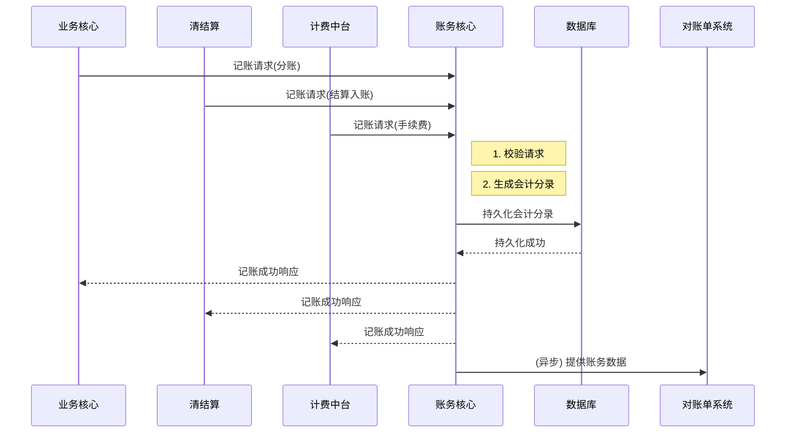

# 模块设计: 账务核心

生成时间: 2026-01-22 15:38:06
批判迭代: 2

---

# 账务核心模块设计文档

## 1. 概述
- **目的与范围**: 本模块负责为转账、分账、手续费等资金变动记录会计分录，是资金流转的记账中心。它不直接管理账户余额，而是根据业务核心、清结算等系统的指令，生成并持久化符合会计规则的账务记录，为后续对账、审计提供数据基础。

## 2. 接口设计
- **API端点 (REST/GraphQL)**: TBD
- **请求/响应结构**: TBD
- **发布/消费的事件**: TBD

## 3. 数据模型
- **表/集合**: TBD
- **关键字段**: TBD
- **与其他模块的关系**: 接收来自业务核心、清结算、计费中台等模块的记账指令，记录的资金变动与账户系统中的账户相关联。为对账单系统提供原始账务数据。

## 4. 业务逻辑
- **核心工作流/算法**: 接收记账请求，根据业务类型（如分账、转账、手续费扣收）和会计规则，生成借贷平衡的会计分录，并持久化存储。
- **业务规则与验证**: 确保每笔分录借贷平衡；验证记账请求的合法性（如业务流水号唯一性）；遵循既定的会计科目规则。
- **关键边界情况处理**: 处理重复记账请求（幂等性）；处理部分成功场景下的账务冲正逻辑；在系统异常时保证账务数据的一致性。
- **并发与一致性**: TBD
- **数据生命周期管理**: TBD

## 5. 时序图

## 6. 错误处理
- **预期错误情况**: 记账请求数据格式错误；借贷不平；重复的业务流水号；数据库连接或写入失败。
- **处理策略**: 对格式和业务规则错误立即返回失败；通过唯一索引或业务流水号检查实现幂等性，避免重复记账；对于系统级错误，记录日志并触发告警，由上游系统决定是否重试。

## 7. 依赖关系
- **上游模块**: 业务核心、清结算、计费中台
- **下游模块**: 对账单系统
- **交互说明**: 本模块与账户系统为指令驱动关系，不主动查询账户余额进行验证，仅依据上游系统的有效指令进行记账。