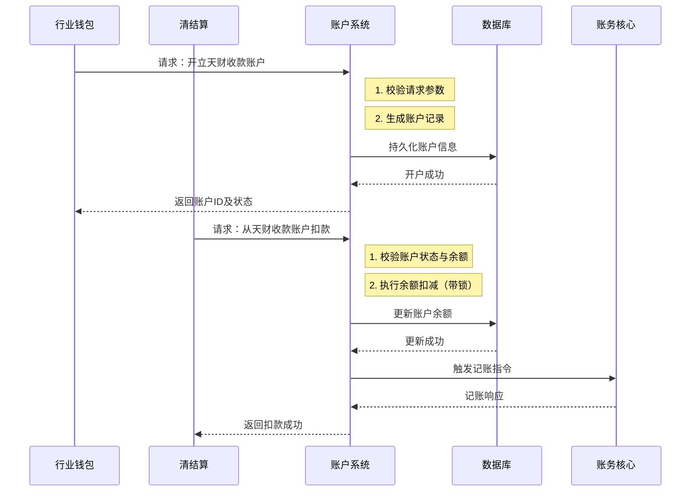

# 模块设计: 账户系统

生成时间: 2026-01-22 15:40:39
批判迭代: 2

---

# 账户系统模块设计文档

## 1. 概述
- **目的与范围**: 本模块是底层的账户管理系统，负责天财收款账户、天财接收方账户等各类账户的开立、升级、余额扣减/增加、冻结/解冻等核心账户操作。它为上层系统（如行业钱包、清结算）提供原子化的账户操作服务，并强制执行保障数据完整性的业务规则。

## 2. 接口设计
- **API端点 (REST/GraphQL)**: TBD
- **请求/响应结构**: TBD
- **发布/消费的事件**: TBD

## 3. 数据模型
- **表/集合**: TBD
- **关键字段**: 账户类型（如行业钱包、01待结算账户、04退货账户）、账户状态（如正常、冻结）、余额、关联商户/用户标识、机构号。
- **与其他模块的关系**: 账户记录与行业钱包系统中的用户信息关联，其资金变动由账务核心记录会计分录。

## 4. 业务逻辑
- **核心工作流/算法**: 接收开户、余额变动、状态变更（冻结/解冻）等指令，执行相应的账户操作并更新账户状态与余额。
- **业务规则与验证**: 验证操作指令的合法性（如扣款时余额是否充足）；确保账户状态允许执行当前操作（如冻结账户不可扣款）；校验账户类型与操作的匹配性（如接收方账户仅支持提现）。
- **关键边界情况处理**: 处理开户失败后的资源清理。
- **并发与一致性**: 通过数据库乐观锁（如版本号）或悲观锁（如行锁）机制，确保并发余额操作（如同时扣款）的原子性与一致性。
- **数据生命周期管理**: TBD

## 5. 时序图

## 6. 错误处理
- **预期错误情况**: 账户不存在；账户状态异常（如已冻结）；余额不足；操作类型与账户类型不匹配；数据库操作失败；并发更新冲突。
- **处理策略**: 对业务规则错误（如余额不足）立即返回明确的失败原因；对于并发冲突，返回失败并建议上游重试；对于系统级错误（如数据库异常），记录详细日志并触发告警，向上游返回操作失败，由上游决定是否重试或补偿。对于部分成功场景（如余额更新成功但触发记账失败），依赖上游系统的补偿机制或通过异步对账进行修正。

## 7. 依赖关系
- **上游模块**: 行业钱包、清结算
- **下游模块**: 账务核心
- **交互说明**: 本模块接收上游模块的指令执行账户操作，操作成功后，会触发或通知账务核心记录相应的会计分录。与账务核心的关系为指令驱动，不主动查询其状态。