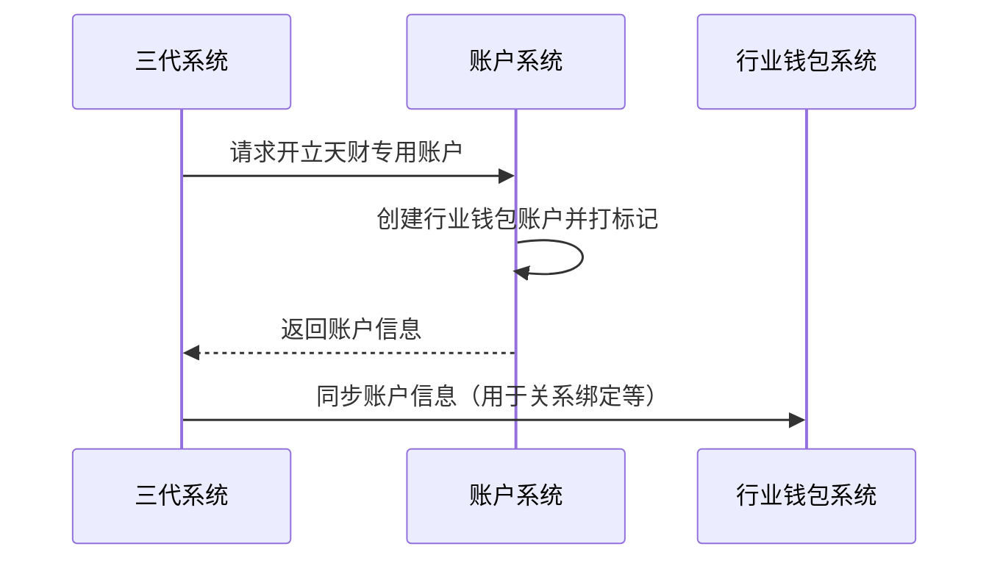

# 模块设计: 账户系统

生成时间: 2026-01-21 15:47:06

---

# 账户系统模块设计文档

## 1. 概述
- **目的与范围**: 本模块是底层账户管理系统，负责为"天财分账"业务开立和标记"天财专用账户"（行业钱包），并控制账户的特定业务能力。其核心职责是管理账户的生命周期和基础属性，不处理具体的分账、结算等业务逻辑。

## 2. 接口设计
- **API端点 (REST/GraphQL)**: TBD
- **请求/响应结构**: TBD
- **发布/消费的事件**: TBD

## 3. 数据模型
- **表/集合**: TBD
- **关键字段**: TBD
- **与其他模块的关系**: 本模块为"行业钱包系统"和"三代系统"提供账户开立与标记服务，是"清结算系统"进行账户冻结操作的目标系统之一。

## 4. 业务逻辑
- **核心工作流/算法**: 根据上游请求，开立类型为"行业钱包（非小微钱包）"的专用账户，并为该账户打上"天财专用账户"的业务标记，以区别于普通钱包账户。
- **业务规则与验证**: 确保开立的账户符合"天财专用账户"的预设类型和属性要求。
- **关键边界情况处理**: 处理重复开户请求、账户状态异常（如已冻结）等情况。

## 5. 时序图

## 6. 错误处理
- **预期错误情况**: 开户请求参数错误、底层账户服务异常、网络超时、账户已存在等。
- **处理策略**: 返回明确的错误码和描述，确保上游系统能感知失败并进行重试或降级处理。

## 7. 依赖关系
- **上游模块**: 三代系统（发起开户请求）。
- **下游模块**: 行业钱包系统、清结算系统。