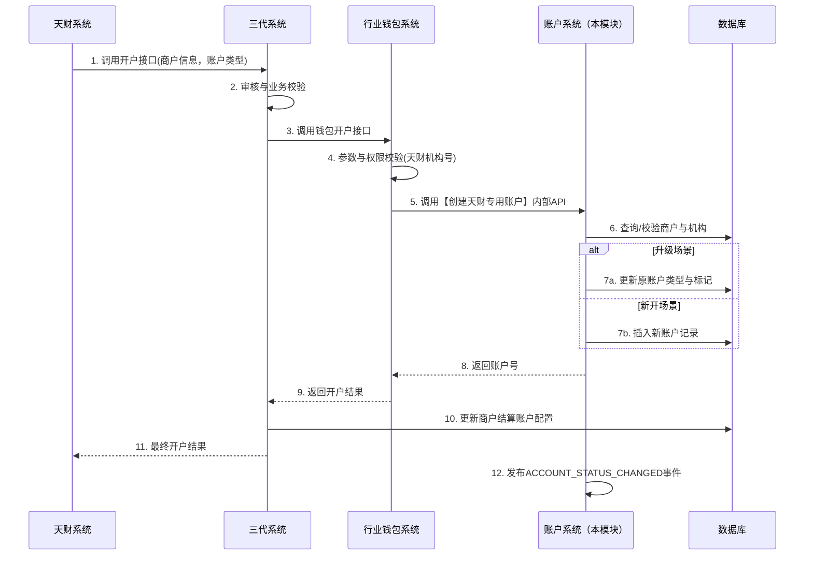
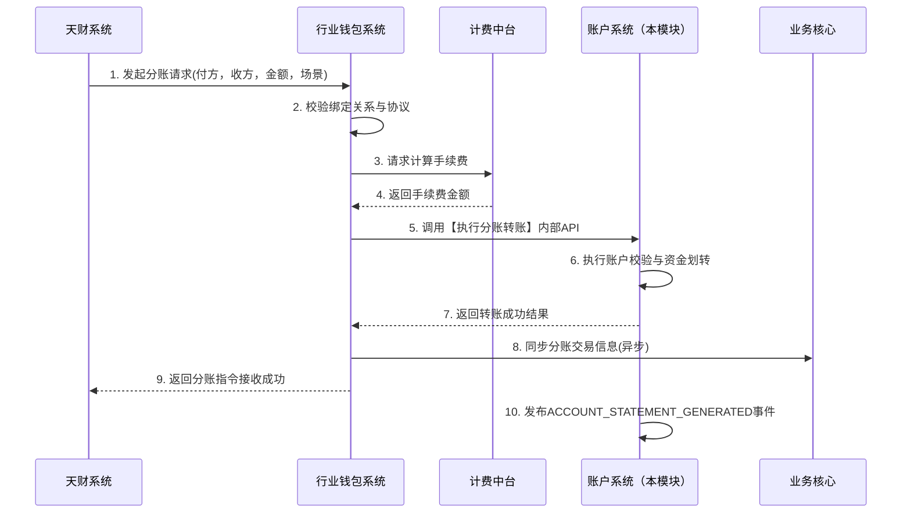

# 模块设计: 账户系统

生成时间: 2026-01-16 16:43:48

---

# 账户系统模块设计文档

## 1. 概述

### 1.1 目的
本模块是“天财分账”业务的核心底层支撑系统，负责为天财业务场景创建、管理和标记专用的账户实体，并提供相应的账务处理与能力控制。核心目标是实现“天财收款账户”和“天财接收方账户”的底层隔离与特殊化处理，确保资金只能在专用账户体系内安全流转。

### 1.2 范围
- **账户创建与升级**：支持为天财机构下的商户新开或升级“天财专用账户”（包括收款账户和接收方账户），并在底层进行特殊标记。
- **账户能力控制**：根据账户类型（天财收款账户/天财接收方账户/普通账户）控制其转账、提现等能力。
- **账户标记管理**：为天财机构下的所有账户（包括普通收款账户）打上“天财”标记，用于业务识别和流程控制。
- **账务处理**：响应分账、提现等指令，执行账户间的资金划转和余额更新。
- **账单流水生成**：根据清结算推送的结算单，生成包含明细的账户流水，支持对账单系统查询。

## 2. 接口设计

### 2.1 API端点 (RESTful)

#### 2.1.1 内部接口 (供行业钱包系统调用)

**1. 创建天财专用账户**
- **端点**: `POST /internal/v1/accounts/tiancai`
- **描述**: 为指定商户创建天财专用账户（收款账户或接收方账户）。
- **请求头**:
    - `X-Source-System: WALLET_SYSTEM`
    - `X-Request-Id`: 请求唯一标识
- **请求体**:
```json
{
  "requestId": "req_123456",
  "merchantNo": "88800010001",
  "institutionNo": "860000", // 天财机构号
  "accountType": "TIANCAI_RECEIVE_ACCOUNT", // 枚举: TIANCAI_RECEIVE_ACCOUNT, TIANCAI_RECEIVER_ACCOUNT
  "roleType": "HEADQUARTERS", // 可选，枚举: HEADQUARTERS, STORE。仅对收款账户有效。
  "originalAccountNo": "ACC001", // 可选。当为升级场景时，传入原普通收款账户号。
  "operationType": "CREATE", // 枚举: CREATE, UPGRADE
  "effectiveTime": "2023-12-01 00:00:00" // 期望生效时间
}
```
- **响应体 (成功)**:
```json
{
  "code": "SUCCESS",
  "message": "成功",
  "data": {
    "accountNo": "TC_ACC_88800010001_R001", // 新生成的天财专用账户号
    "accountType": "TIANCAI_RECEIVE_ACCOUNT",
    "status": "ACTIVE",
    "createTime": "2023-11-30 15:30:00"
  }
}
```

**2. 账户标记查询**
- **端点**: `GET /internal/v1/accounts/{accountNo}/tags`
- **描述**: 查询指定账户的标记信息，判断是否为天财专用账户。
- **响应体**:
```json
{
  "code": "SUCCESS",
  "data": {
    "accountNo": "TC_ACC_88800010001_R001",
    "isTiancaiAccount": true,
    "accountType": "TIANCAI_RECEIVE_ACCOUNT",
    "tags": ["TIANCAI", "WALLET", "ACTIVE_SETTLEMENT"]
  }
}
```

**3. 执行分账转账**
- **端点**: `POST /internal/v1/transfers/tiancai`
- **描述**: 执行从天财收款账户到另一个天财专用账户的资金划转。
- **请求体**:
```json
{
  "requestId": "transfer_789",
  "bizType": "TIANCAI_SPLIT",
  "outAccountNo": "TC_ACC_88800010001_R001",
  "inAccountNo": "TC_ACC_88800010002_R001",
  "amount": 10000,
  "currency": "CNY",
  "fee": 10,
  "feeBearer": "PAYER", // 枚举: PAYER, PAYEE
  "bizScene": "COLLECTION", // 枚举: COLLECTION, MEMBER_SETTLEMENT, BATCH_PAYMENT
  "remark": "门店归集"
}
```
- **响应体**:
```json
{
  "code": "SUCCESS",
  "data": {
    "transferNo": "TF202311301530001",
    "status": "SUCCESS",
    "outBalance": 99000,
    "inBalance": 10000
  }
}
```

**4. 查询账户余额及流水**
- **端点**: `GET /internal/v1/accounts/{accountNo}/statements`
- **描述**: 供对账单系统查询账户动账明细。
- **查询参数**: `startTime=2023-11-30 00:00:00&endTime=2023-11-30 23:59:59&pageNum=1&pageSize=100`
- **响应体**:
```json
{
  "code": "SUCCESS",
  "data": {
    "accountNo": "TC_ACC_88800010001_R001",
    "accountType": "TIANCAI_RECEIVE_ACCOUNT",
    "currentBalance": 99000,
    "statements": [
      {
        "seqNo": "202311300001",
        "transTime": "2023-11-30 10:15:30",
        "transType": "SPLIT_OUT",
        "amount": -10000,
        "balance": 99000,
        "counterpartyAccountNo": "TC_ACC_88800010002_R001",
        "bizNo": "TF202311301530001",
        "remark": "门店归集",
        "settleDetailFlag": "N" // 是否结算明细子账单: Y/N
      }
    ]
  }
}
```

### 2.2 发布/消费的事件

#### 2.2.1 消费的事件
1.  **账户创建事件** (来自三代系统/行业钱包系统)
    - 事件类型: `ACCOUNT_CREATED`
    - 负载: 包含商户号、账户号、账户类型、机构号、操作类型等。
    - 动作: 根据事件信息，在底层创建或标记账户。

2.  **结算单推送事件** (来自清结算系统)
    - 事件类型: `SETTLEMENT_ORDER_PUSHED`
    - 负载: 包含结算单号、商户号、账户号、结算金额、结算明细列表、`supplementDetailFlag`（补明细标识）等。
    - 动作: 根据结算单更新账户余额，并生成相应的账户流水。若`supplementDetailFlag`为`Y`，则为每笔结算明细生成子账单流水。

#### 2.2.2 发布的事件
1.  **账户状态变更事件**
    - 事件类型: `ACCOUNT_STATUS_CHANGED`
    - 负载: `{“accountNo”: “...”, “oldStatus”: “...”, “newStatus”: “...”, “changeReason”: “...”}`
    - 订阅方: 行业钱包系统、风控系统。

2.  **账户流水生成事件**
    - 事件类型: `ACCOUNT_STATEMENT_GENERATED`
    - 负载: 账户流水详情。
    - 订阅方: 对账单系统（用于异步拉取或核对）。

## 3. 数据模型

### 3.1 核心表设计

```sql
-- 账户主表
CREATE TABLE t_account (
    id BIGINT PRIMARY KEY AUTO_INCREMENT,
    account_no VARCHAR(64) NOT NULL UNIQUE COMMENT '账户号，如TC_ACC_XXX',
    merchant_no VARCHAR(32) NOT NULL COMMENT '所属商户号',
    institution_no VARCHAR(16) NOT NULL COMMENT '所属机构号',
    account_type VARCHAR(32) NOT NULL COMMENT '账户类型: NORMAL_RECEIVE, TIANCAI_RECEIVE, TIANCAI_RECEIVER, SETTLEMENT_01, REFUND_04',
    role_type VARCHAR(16) COMMENT '角色类型: HEADQUARTERS, STORE (仅天财收款账户有效)',
    currency VARCHAR(3) DEFAULT 'CNY',
    balance DECIMAL(15,2) DEFAULT 0.00 COMMENT '可用余额',
    frozen_balance DECIMAL(15,2) DEFAULT 0.00 COMMENT '冻结余额',
    status VARCHAR(16) DEFAULT 'ACTIVE' COMMENT '状态: ACTIVE, FROZEN, CLOSED',
    is_tiancai_tag BOOLEAN DEFAULT FALSE COMMENT '是否天财标记',
    version BIGINT DEFAULT 0 COMMENT '版本号，用于乐观锁',
    created_time DATETIME NOT NULL,
    updated_time DATETIME NOT NULL,
    INDEX idx_merchant_no (merchant_no),
    INDEX idx_institution_no (institution_no),
    INDEX idx_account_type (account_type)
) COMMENT '账户主表';

-- 账户标记表 (扩展属性)
CREATE TABLE t_account_tag (
    id BIGINT PRIMARY KEY AUTO_INCREMENT,
    account_no VARCHAR(64) NOT NULL COMMENT '账户号',
    tag_key VARCHAR(32) NOT NULL COMMENT '标记键',
    tag_value VARCHAR(128) COMMENT '标记值',
    created_time DATETIME NOT NULL,
    INDEX idx_account_no (account_no),
    INDEX idx_tag_key (tag_key)
) COMMENT '账户标记表，存储如“结算模式”、“业务场景”等扩展属性';

-- 账户流水表
CREATE TABLE t_account_statement (
    id BIGINT PRIMARY KEY AUTO_INCREMENT,
    account_no VARCHAR(64) NOT NULL COMMENT '账户号',
    seq_no VARCHAR(32) NOT NULL UNIQUE COMMENT '流水序号，全局唯一',
    trans_time DATETIME NOT NULL COMMENT '交易时间',
    trans_type VARCHAR(32) NOT NULL COMMENT '交易类型: SETTLEMENT_IN, SPLIT_OUT, WITHDRAW, REFUND...',
    amount DECIMAL(15,2) NOT NULL COMMENT '变动金额，正为入，负为出',
    balance DECIMAL(15,2) NOT NULL COMMENT '变动后余额',
    counterparty_account_no VARCHAR(64) COMMENT '对手方账户号',
    biz_no VARCHAR(64) COMMENT '业务单号(如分账单号、结算单号)',
    biz_scene VARCHAR(32) COMMENT '业务场景',
    remark VARCHAR(256),
    supplement_detail_flag CHAR(1) DEFAULT 'N' COMMENT '是否结算明细子账单: Y/N',
    parent_seq_no VARCHAR(32) COMMENT '父流水序号，用于关联结算明细子账单',
    created_time DATETIME NOT NULL,
    INDEX idx_account_time (account_no, trans_time),
    INDEX idx_biz_no (biz_no)
) COMMENT '账户流水表';

-- 账户能力控制表
CREATE TABLE t_account_capability (
    id BIGINT PRIMARY KEY AUTO_INCREMENT,
    account_type VARCHAR(32) NOT NULL COMMENT '账户类型',
    capability_code VARCHAR(32) NOT NULL COMMENT '能力编码，如：TRANSFER_OUT, WITHDRAW',
    is_enabled BOOLEAN DEFAULT TRUE COMMENT '是否启用',
    config JSON COMMENT '能力配置(JSON格式，如限额、频次)',
    created_time DATETIME NOT NULL,
    UNIQUE KEY uk_account_type_capability (account_type, capability_code)
) COMMENT '账户能力控制表，定义不同类型账户的能力';
```

### 3.2 与其他模块的关系
- **行业钱包系统**: 上层业务系统，调用本模块进行账户的创建、升级、转账。是本模块的主要调用方。
- **三代系统**: 商户管理核心，通过行业钱包间接驱动账户创建，并提供商户-账户关系。
- **清结算系统**: 推送结算单，驱动账户余额变更和流水生成。
- **对账单系统**: 消费本模块提供的账户流水数据，生成机构维度的对账单。
- **业务核心**: 接收行业钱包同步的分账交易信息，但资金的实际记账在本模块完成。

## 4. 业务逻辑

### 4.1 核心算法与流程

**1. 天财专用账户创建/升级流程:**
```
输入: 商户号、机构号、账户类型、操作类型(创建/升级)
步骤:
1. 校验机构号是否为天财机构号（白名单校验）。
2. 若为升级操作(operationType=UPGRADE):
   a. 根据originalAccountNo查询原普通账户。
   b. 校验原账户状态为ACTIVE，且属于同一商户。
   c. 将原账户的account_type更新为对应的天财账户类型。
   d. 为原账户打上`is_tiancai_tag=TRUE`及相应标记。
   e. 返回原账户号（账户号不变）。
3. 若为创建操作(operationType=CREATE):
   a. 生成新的天财专用账户号（规则: TC_ACC_{商户号}_{类型简码}{序号}）。
   b. 插入t_account记录，设置account_type, is_tiancai_tag=TRUE。
   c. 根据账户类型，从t_account_capability表初始化其能力。
   d. 返回新账户号。
4. 发布ACCOUNT_STATUS_CHANGED事件。
```

**2. 分账转账执行流程:**
```
输入: 转出账户、转入账户、金额、手续费、手续费承担方
步骤:
1. 校验转出账户和转入账户是否存在、状态是否为ACTIVE。
2. 校验转出账户类型必须为TIANCAI_RECEIVE_ACCOUNT。
3. 校验转入账户类型必须为TIANCAI_RECEIVE_ACCOUNT或TIANCAI_RECEIVER_ACCOUNT。
   （核心规则：禁止天财专用账户向普通账户转账）
4. 校验转出账户余额是否充足（金额+付方承担的手续费）。
5. 使用乐观锁（version字段）更新转出账户余额（扣减）。
6. 更新转入账户余额（增加）。
7. 生成两条账户流水记录（一出一入）。
8. 若手续费>0，根据feeBearer，从相应账户扣减手续费，并生成手续费流水。
9. 发布ACCOUNT_STATEMENT_GENERATED事件。
```

**3. 结算单处理与流水生成流程:**
```
输入: 结算单（含明细列表、supplementDetailFlag）
步骤:
1. 根据结算单中的账户号，锁定账户并更新余额（增加）。
2. 生成一条主流水记录，trans_type='SETTLEMENT_IN'，biz_no=结算单号。
3. 若supplementDetailFlag='Y':
   a. 遍历结算单明细列表。
   b. 为每一条明细生成一条子流水记录，trans_type同样为'SETTLEMENT_IN'。
   c. 子流水的amount为明细金额，parent_seq_no指向主流水seq_no。
   d. 子流水的balance字段可以留空或与主流水一致，因为余额变动由主流水体现。
4. 若supplementDetailFlag='N'，则仅保留主流水。
```

### 4.2 关键业务规则与校验逻辑
1.  **账户类型隔离规则**:
    - `TIANCAI_RECEIVE_ACCOUNT` 只能向 `TIANCAI_RECEIVE_ACCOUNT` 或 `TIANCAI_RECEIVER_ACCOUNT` 转账。
    - `TIANCAI_RECEIVER_ACCOUNT` 仅能接收资金和提现，不能主动转账。
    - 所有天财专用账户与普通账户之间的转账通道被底层强制关闭。

2.  **账户标记规则**:
    - 天财机构号下新开的所有账户（包括普通收款账户），`is_tiancai_tag` 必须为 `TRUE`。
    - 此标记用于上游系统（如三代、钱包）进行业务逻辑判断和流程控制。

3.  **风控冻结联动规则**:
    - 当收到“商户冻结”指令时，需冻结该商户名下所有 `TIANCAI_RECEIVE_ACCOUNT`。
    - 冻结操作将账户状态置为 `FROZEN`，并禁止所有出金和交易类操作。

4.  **余额校验**:
    - 任何出金操作（分账、提现）前，必须校验 `balance - frozen_balance >= 请求金额`。

## 5. 时序图

### 5.1 天财专用账户开户时序图



### 5.2 天财分账转账时序图



## 6. 错误处理

| 错误场景 | 错误码 | 处理策略 | 是否重试 |
| :--- | :--- | :--- | :--- |
| 账户不存在 | `ACCOUNT_NOT_FOUND` | 返回明确错误，上游需检查商户及账户状态。 | 否 |
| 账户状态异常（冻结、关闭） | `ACCOUNT_STATUS_INVALID` | 返回错误，上游需解冻或重新开户。 | 否 |
| 账户余额不足 | `INSUFFICIENT_BALANCE` | 返回错误，上游需充值或调整金额。 | 否 |
| 账户类型不符合规则 | `ACCOUNT_TYPE_MISMATCH` | 返回错误，上游需检查分账路径是否正确。 | 否 |
| 乐观锁更新冲突 | `OPTIMISTIC_LOCK_CONFLICT` | 系统自动重试（最多3次），仍失败则返回错误。 | 是 |
| 数据库连接异常 | `DB_CONNECTION_ERROR` | 记录日志，抛出系统异常，依赖框架重试机制。 | 是 |
| 下游系统（清结算）事件格式错误 | `INVALID_EVENT_FORMAT` | 记录日志并告警，丢弃无效事件。 | 否 |

**通用策略**:
- 所有对外接口返回格式统一的响应体，包含`code`, `message`, `data`。
- 系统内部异常被捕获后，转换为业务友好的错误码和消息。
- 涉及资金的核心操作（转账、提现）必须有完整的事务保证，确保数据一致性。
- 所有错误和异常需记录详细日志，便于问题追踪和对账。

## 7. 依赖说明

### 7.1 上游依赖
1.  **行业钱包系统**:
    - **交互方式**: 同步RPC调用（本模块提供的内部API）。
    - **依赖内容**: 接收其发起的账户创建、升级、转账、查询等指令。
    - **兼容性**: 需与钱包系统约定清晰的接口版本和字段含义。本模块需保持接口的向后兼容性。

2.  **清结算系统**:
    - **交互方式**: 异步消息（事件驱动）。
    - **依赖内容**: 消费`SETTLEMENT_ORDER_PUSHED`事件，驱动账户余额变更。
    - **兼容性**: 需明确事件格式、重试策略和幂等性处理（基于结算单号去重）。

3.  **数据库**:
    - **依赖内容**: MySQL/PostgreSQL，用于持久化账户、流水数据。
    - **要求**: 高可用、读写分离架构，保证事务一致性。

### 7.2 下游依赖
1.  **对账单系统**:
    - **交互方式**: 提供查询API，并发布`ACCOUNT_STATEMENT_GENERATED`事件供其订阅。
    - **提供内容**: 账户动账明细流水数据。
    - **性能要求**: 查询接口需支持按账户、时间范围分页查询，数据量大，需考虑数据库索引优化。

2.  **风控系统**:
    - **交互方式**: 监听本模块发布的`ACCOUNT_STATUS_CHANGED`事件。
    - **提供内容**: 账户冻结/解冻状态变更通知。

### 7.3 解耦与容错设计
- **异步化**: 与清结算、对账单系统的交互尽量采用事件驱动，避免同步调用链过长。
- **幂等性**: 所有涉及资金变动的接口和事件处理都必须支持幂等，通过业务唯一键（如`requestId`, `bizNo`）实现。
- **降级策略**: 若非核心查询接口（如流水查询）超时或不可用，可返回降级数据或友好提示，不影响核心交易链路。
- **监控与告警**: 对关键接口的调用量、成功率、耗时进行监控，对失败和异常进行实时告警。