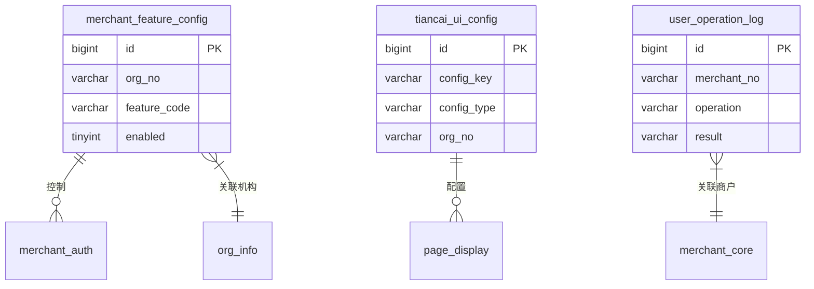
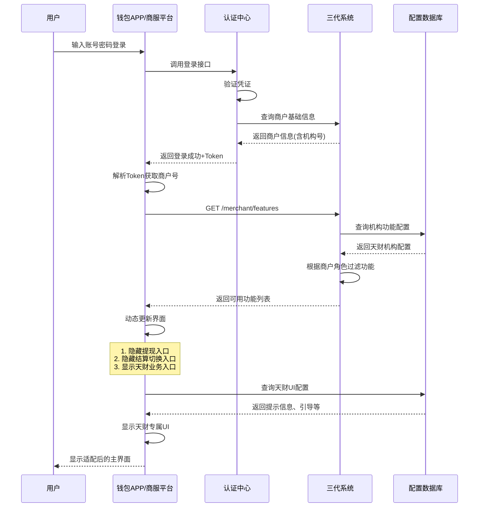
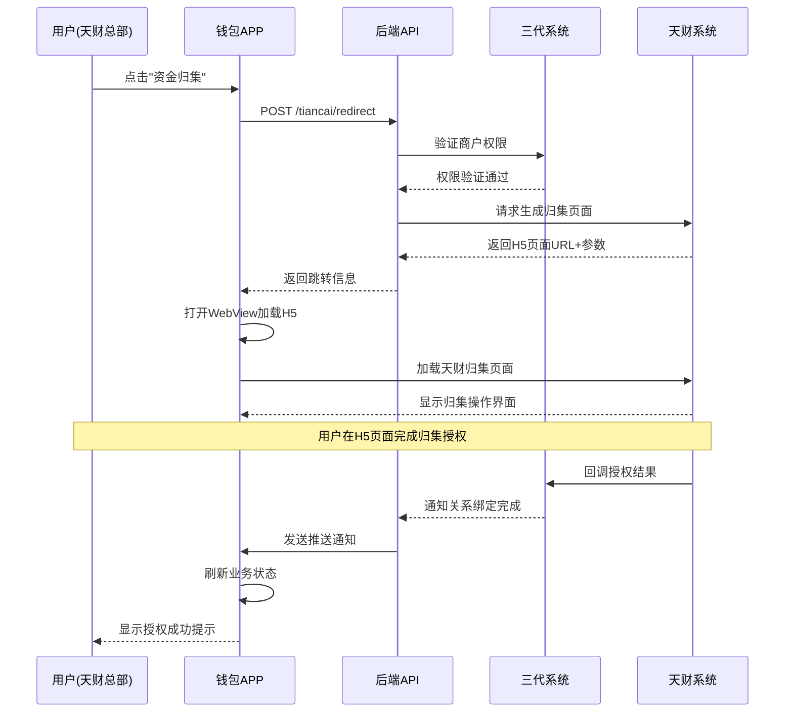

# 模块设计: 钱包APP/商服平台

生成时间: 2026-01-16 16:49:59

---

# 钱包APP/商服平台 - 天财业务适配模块设计文档

## 1. 概述

### 1.1 目的
本模块是钱包APP和商服平台为支持“天财商龙”分账业务而设计的适配模块。其主要目的是针对天财机构下的商户，在前端应用层面进行功能适配和入口控制，确保天财专用账户的业务流程符合其特定的业务规则和权限要求，同时为商户提供符合天财业务模式的用户界面和操作体验。

### 1.2 范围
- **入口控制**：根据商户所属机构号，动态控制功能入口的显示与隐藏。
- **权限适配**：针对天财收款账户和天财接收方账户，适配不同的操作权限和业务流程。
- **界面定制**：为天财业务提供特定的界面提示、引导和操作流程。
- **数据展示**：适配天财专用账户的余额、流水、对账单等数据的展示格式。
- **操作拦截**：在前端对不符合天财业务规则的操作进行预校验和拦截。

### 1.3 核心原则
- **机构隔离**：严格根据商户的机构号（是否为天财机构）控制功能可见性。
- **最小化变更**：在现有钱包APP/商服平台架构基础上，通过配置化方式实现适配，避免大规模代码重构。
- **用户体验一致**：在满足业务规则的前提下，尽量保持与普通商户一致的操作体验。
- **安全合规**：确保所有前端操作都经过后端校验，前端拦截仅为优化体验。

## 2. 接口设计

### 2.1 API端点 (RESTful)

#### 2.1.1 商户功能权限查询接口
- **端点**: `GET /api/v1/merchant/features`
- **描述**: 查询当前登录商户的可使用功能列表，根据机构号动态返回。
- **调用方**: 钱包APP、商服平台前端
- **请求头**:
    - `Authorization`: Bearer Token (商户登录Token)
- **响应体**:
```json
{
  "code": "SUCCESS",
  "message": "成功",
  "data": {
    "merchantNo": "888000000001",
    "merchantName": "xx餐饮总部",
    "orgNo": "TC001", // 机构号
    "orgName": "天财商龙",
    "isTiancaiOrg": true, // 是否天财机构
    "accountType": "TIANCAI_RECEIVE", // 账户类型: TIANCAI_RECEIVE, TIANCAI_RECEIVER, NORMAL
    "roleType": "HEADQUARTERS", // 角色类型: HEADQUARTERS, STORE, NONE
    "availableFeatures": {
      "withdraw": false, // 提现入口（天财机构关闭）
      "settlementModeSwitch": false, // 结算模式切换入口（天财机构关闭）
      "collection": true, // 资金归集（仅天财总部可见）
      "batchPay": true, // 批量付款（仅天财总部可见）
      "memberSettlement": true, // 会员结算（仅天财总部可见）
      "accountQuery": true, // 账户查询
      "transactionQuery": true, // 交易查询
      "statementDownload": true // 对账单下载
    },
    "tiancaiAccountInfo": {
      "accountNo": "TC888000000001R01",
      "accountType": "RECEIVE",
      "balance": "10000.00",
      "status": "NORMAL"
    }
  }
}
```

#### 2.1.2 天财业务页面跳转接口
- **端点**: `POST /api/v1/tiancai/redirect`
- **描述**: 获取天财业务H5页面的跳转URL和参数，用于在APP内嵌WebView打开。
- **请求体**:
```json
{
  "businessType": "COLLECTION_AUTH", // 业务类型: COLLECTION_AUTH, BATCH_PAY, MEMBER_SETTLEMENT
  "targetMerchantNo": "888000000002", // 目标商户号（可选）
  "extraParams": {} // 额外参数
}
```
- **响应体**:
```json
{
  "code": "SUCCESS",
  "message": "成功",
  "data": {
    "redirectUrl": "https://tiancai.lkl.com/h5/collection-auth?token=xxx",
    "title": "资金归集授权",
    "expireTime": "2024-01-15 15:30:00"
  }
}
```

#### 2.1.3 操作预校验接口
- **端点**: `POST /api/v1/operation/precheck`
- **描述**: 在执行关键操作前进行预校验，返回是否允许操作及原因。
- **请求体**:
```json
{
  "operation": "WITHDRAW", // 操作类型: WITHDRAW, SETTLEMENT_SWITCH, etc.
  "amount": "1000.00", // 操作金额（可选）
  "targetAccount": "TC888000000001R01" // 目标账户（可选）
}
```
- **响应体**:
```json
{
  "code": "SUCCESS",
  "message": "成功",
  "data": {
    "allowed": false,
    "reasonCode": "TIANCAI_FORBIDDEN", // 原因码
    "reasonMessage": "天财机构商户的提现功能已关闭，请通过天财系统操作",
    "alternativeAction": {
      "type": "REDIRECT",
      "url": "https://tiancai.com/withdraw",
      "description": "前往天财系统操作"
    }
  }
}
```

### 2.2 发布/消费的事件

#### 2.2.1 消费的事件
1. **MerchantLoggedInEvent** (商户登录事件)
   - **发布方**: 认证中心
   - **动作**: 根据登录商户的机构号，加载对应的功能权限配置，初始化界面状态。

2. **TiancaiAccountStatusChangedEvent** (天财账户状态变更事件)
   - **发布方**: 三代系统/行业钱包系统
   - **动作**: 更新本地缓存的账户状态，刷新界面显示。

3. **RelationshipBoundEvent** (关系绑定完成事件)
   - **发布方**: 三代系统
   - **动作**: 更新相关业务入口的状态（如归集、批量付款变为可用）。

## 3. 数据模型

### 3.1 核心表设计

#### 表: `merchant_feature_config` (商户功能配置表)
| 字段名 | 类型 | 必填 | 描述 | 索引 |
|--------|------|------|------|------|
| id | bigint | Y | 主键 | PK |
| org_no | varchar(16) | Y | 机构号 | UK |
| org_name | varchar(64) | Y | 机构名称 | |
| is_tiancai_org | tinyint | Y | 是否天财机构: 1-是, 0-否 | IDX |
| feature_code | varchar(32) | Y | 功能代码 | UK |
| feature_name | varchar(64) | Y | 功能名称 | |
| enabled | tinyint | Y | 是否启用: 1-是, 0-否 | |
| visible | tinyint | Y | 是否可见: 1-是, 0-否 | |
| require_auth | tinyint | Y | 是否需要额外授权: 1-是, 0-否 | |
| auth_level | tinyint | N | 授权等级: 1-普通, 2-高级 | |
| redirect_url | varchar(512) | N | 跳转URL（如功能外跳） | |
| description | varchar(256) | N | 功能描述 | |
| effective_time | datetime | Y | 生效时间 | |
| expire_time | datetime | N | 过期时间 | |
| create_time | datetime | Y | 创建时间 | |
| update_time | datetime | Y | 更新时间 | |

#### 表: `tiancai_ui_config` (天财UI配置表)
| 字段名 | 类型 | 必填 | 描述 | 索引 |
|--------|------|------|------|------|
| id | bigint | Y | 主键 | PK |
| config_key | varchar(64) | Y | 配置键 | UK |
| config_type | varchar(32) | Y | 配置类型: BANNER, TIP, GUIDE, etc. | IDX |
| target_page | varchar(64) | N | 目标页面 | |
| title | varchar(128) | N | 标题 | |
| content | text | Y | 内容（HTML/JSON） | |
| org_no | varchar(16) | N | 机构号（空表示所有天财机构） | IDX |
| account_type | varchar(32) | N | 账户类型 | |
| role_type | varchar(32) | N | 角色类型 | |
| priority | int | Y | 显示优先级 | |
| start_time | datetime | N | 开始显示时间 | |
| end_time | datetime | N | 结束显示时间 | |
| status | tinyint | Y | 状态: 1-启用, 0-停用 | |
| create_time | datetime | Y | 创建时间 | |

#### 表: `user_operation_log` (用户操作日志表)
| 字段名 | 类型 | 必填 | 描述 | 索引 |
|--------|------|------|------|------|
| id | bigint | Y | 主键 | PK |
| merchant_no | varchar(32) | Y | 商户号 | IDX |
| user_id | varchar(32) | Y | 用户ID | |
| org_no | varchar(16) | Y | 机构号 | IDX |
| operation | varchar(64) | Y | 操作类型 | |
| target | varchar(128) | N | 操作目标 | |
| parameters | json | N | 操作参数 | |
| result | varchar(16) | Y | 结果: SUCCESS, FAILED, BLOCKED | |
| error_code | varchar(32) | N | 错误码 | |
| error_message | varchar(256) | N | 错误信息 | |
| client_info | json | Y | 客户端信息 | |
| ip_address | varchar(64) | Y | IP地址 | |
| create_time | datetime | Y | 创建时间 | IDX |

### 3.2 与其他模块的关系


- **org_info**: 机构信息表，`merchant_feature_config.org_no` 外键关联。
- **merchant_core**: 三代系统核心商户表，`user_operation_log.merchant_no` 外键关联。
- **merchant_auth**: 商户权限表，根据`merchant_feature_config`动态生成权限。

## 4. 业务逻辑

### 4.1 核心算法与流程

#### 4.1.1 功能权限动态加载算法
```javascript
// 前端权限控制逻辑
async function loadMerchantFeatures() {
    try {
        // 1. 调用后端接口获取商户信息和功能权限
        const response = await api.get('/merchant/features');
        const { isTiancaiOrg, accountType, roleType, availableFeatures } = response.data;
        
        // 2. 根据机构类型设置全局标志
        window.isTiancaiMerchant = isTiancaiOrg;
        window.merchantRole = roleType;
        
        // 3. 动态更新界面元素
        updateFeatureVisibility(availableFeatures);
        
        // 4. 加载天财专属UI配置
        if (isTiancaiOrg) {
            await loadTiancaiUIConfig(accountType, roleType);
        }
        
        // 5. 绑定操作拦截器
        bindOperationInterceptors();
        
    } catch (error) {
        console.error('加载商户功能失败:', error);
        // 降级方案：显示默认功能集
        showDefaultFeatures();
    }
}

// 更新功能可见性
function updateFeatureVisibility(features) {
    // 提现入口控制
    const withdrawBtn = document.getElementById('withdraw-btn');
    if (withdrawBtn) {
        withdrawBtn.style.display = features.withdraw ? 'block' : 'none';
        if (!features.withdraw) {
            showTiancaiTip('提现功能已关闭，请通过天财系统操作');
        }
    }
    
    // 结算模式切换入口控制
    const settlementSwitchBtn = document.getElementById('settlement-switch-btn');
    if (settlementSwitchBtn) {
        settlementSwitchBtn.style.display = features.settlementModeSwitch ? 'block' : 'none';
    }
    
    // 天财业务入口控制（仅总部可见）
    if (window.merchantRole === 'HEADQUARTERS') {
        showElement('collection-btn', features.collection);
        showElement('batch-pay-btn', features.batchPay);
        showElement('member-settlement-btn', features.memberSettlement);
    }
}
```

#### 4.1.2 操作拦截与重定向逻辑
```javascript
// 操作拦截器
function bindOperationInterceptors() {
    // 拦截提现操作
    interceptOperation('withdraw', async (amount, account) => {
        if (!window.isTiancaiMerchant) {
            return { allowed: true }; // 非天财商户，允许操作
        }
        
        // 天财商户，调用预校验接口
        const precheck = await api.post('/operation/precheck', {
            operation: 'WITHDRAW',
            amount: amount,
            targetAccount: account
        });
        
        if (!precheck.data.allowed) {
            // 显示提示信息
            showOperationBlockedModal(precheck.data);
            return { allowed: false };
        }
        
        return { allowed: true };
    });
    
    // 拦截结算模式切换
    interceptOperation('settlement-switch', async () => {
        if (!window.isTiancaiMerchant) {
            return { allowed: true };
        }
        
        const precheck = await api.post('/operation/precheck', {
            operation: 'SETTLEMENT_SWITCH'
        });
        
        if (!precheck.data.allowed) {
            showOperationBlockedModal(precheck.data);
            return { allowed: false };
        }
        
        return { allowed: true };
    });
}

// 天财业务跳转处理
async function handleTiancaiBusiness(businessType, targetMerchantNo) {
    try {
        // 获取跳转URL
        const response = await api.post('/tiancai/redirect', {
            businessType: businessType,
            targetMerchantNo: targetMerchantNo
        });
        
        // 在APP内打开H5页面
        openInWebView(response.data.redirectUrl, {
            title: response.data.title,
            showClose: true,
            onClose: () => {
                // 页面关闭回调，刷新数据
                refreshBusinessData();
            }
        });
        
    } catch (error) {
        showError('无法打开业务页面，请稍后重试');
    }
}
```

### 4.2 业务规则

1. **入口控制规则**:
   - 天财机构号下的所有商户，在钱包APP/商服平台隐藏"提现"入口。
   - 天财机构号下的所有商户，在钱包APP/商服平台隐藏"结算模式切换"入口。
   - 天财总部商户显示"资金归集"、"批量付款"、"会员结算"业务入口。
   - 天财门店商户仅显示被授权业务的查看入口。

2. **操作重定向规则**:
   - 当用户尝试访问被禁用的功能时，显示友好的提示信息。
   - 提供跳转到天财系统对应功能的链接或二维码。
   - 对于需要在拉卡拉系统内完成的操作（如关系绑定），提供内嵌H5页面。

3. **界面展示规则**:
   - 天财专用账户的余额显示增加"天财专用"标识。
   - 交易流水明细中，天财分账交易显示特定的图标和描述。
   - 对账单下载提供天财专属格式选项。

4. **权限校验规则**:
   - 所有前端拦截都必须有后端双重校验。
   - 用户操作日志需要记录机构号和操作结果。
   - 敏感操作需要额外的身份验证。

### 4.3 验证逻辑

1. **机构号验证**:
   - 用户登录时，根据商户号获取机构信息。
   - 验证机构号是否在天财机构白名单中。
   - 缓存机构类型信息，减少重复查询。

2. **功能权限验证**:
   - 每次进入功能页面时，重新验证权限状态。
   - 权限变更时，强制用户重新登录或刷新令牌。
   - 支持权限的实时更新和生效。

3. **操作预验证**:
   - 关键操作执行前，调用预校验接口。
   - 预校验失败时，阻止操作并显示原因。
   - 提供替代操作方案。

## 5. 时序图

### 5.1 天财商户登录与权限加载时序图



### 5.2 天财业务操作拦截与重定向时序图



## 6. 错误处理

### 6.1 错误码设计

| 错误码 | HTTP状态码 | 描述 | 处理建议 |
|--------|------------|------|----------|
| UI_AUTH_001 | 403 | 功能不可用（天财机构限制） | 显示提示信息，引导用户使用天财系统 |
| UI_AUTH_002 | 403 | 权限不足（非总部角色） | 隐藏或禁用相关功能入口 |
| UI_CONFIG_003 | 500 | UI配置加载失败 | 使用默认配置，记录日志 |
| UI_REDIRECT_004 | 400 | 业务跳转参数错误 | 检查参数格式，重新发起 |
| UI_REDIRECT_005 | 502 | 天财系统不可用 | 显示系统维护提示，稍后重试 |
| UI_OPERATION_006 | 429 | 操作过于频繁 | 显示操作限制提示，等待后重试 |

### 6.2 异常处理策略

1. **功能降级策略**:
   - 当权限接口不可用时，默认显示基础功能集。
   - UI配置加载失败时，使用本地默认配置。
   - 天财系统不可用时，显示友好的维护页面。

2. **用户引导策略**:
   - 功能被禁用时，提供清晰的说明和替代方案。
   - 操作失败时，给出具体的解决步骤。
   - 提供客服联系方式，用于处理复杂问题。

3. **监控与告警**:
   - 监控功能权限接口的可用性和响应时间。
   - 记录用户操作拦截日志，用于分析用户行为。
   - 当天财系统跳转失败率超过阈值时发送告警。

4. **数据一致性**:
   - 定期同步机构配置信息，确保前后端一致。
   - 用户权限变更时，强制刷新本地缓存。
   - 提供手动刷新功能，解决缓存不一致问题。

## 7. 依赖说明

### 7.1 上游依赖

1. **认证中心**:
   - **交互方式**: REST API
   - **职责**: 提供用户登录认证，返回包含机构号的商户信息。
   - **数据流**: 登录凭证、商户基本信息、机构号。
   - **SLA要求**: 登录接口响应时间<500ms，可用性99.9%。

2. **三代系统**:
   - **交互方式**: REST API
   - **职责**: 提供商户详细信息、功能权限查询、业务跳转接口。
   - **关键接口**:
     - `GET /merchant/features`: 查询商户功能权限
     - `POST /tiancai/redirect`: 获取业务跳转URL
     - `POST /operation/precheck`: 操作预校验
   - **异常影响**: 无法正确显示功能入口，业务跳转失败。

### 7.2 下游依赖

1. **天财系统H5页面**:
   - **交互方式**: WebView内嵌
   - **职责**: 提供天财业务的具体操作界面。
   - **数据流**: 业务参数、操作结果。
   - **异常影响**: 用户无法完成天财业务操作。

2. **配置数据库**:
   - **交互方式**: 直接访问
   - **职责**: 存储机构功能配置、UI配置信息。
   - **数据流**: 配置数据、规则定义。
   - **异常影响**: 无法加载动态配置，使用默认配置。

### 7.3 依赖管理策略

1. **缓存策略**:
   - 商户功能权限缓存5分钟，减少接口调用。
   - UI配置缓存10分钟，支持手动刷新。
   - 机构信息缓存1小时，变化频率低。

2. **超时与重试**:
   - 权限查询接口: 超时2秒，重试1次
   - 业务跳转接口: 超时3秒，重试2次
   - 预校验接口: 超时1秒，不重试

3. **降级方案**:
   - 权限接口失败: 显示所有基础功能，隐藏天财专属功能
   - 天财系统不可用: 显示维护页面，提供客服入口
   - 配置加载失败: 使用内置默认配置

4. **监控指标**:
   - 功能权限接口成功率
   - 天财业务跳转成功率
   - 用户操作拦截率
   - 页面加载时间

---
**文档版本**: 1.0  
**最后更新**: 2024-01-16  
**维护团队**: 前端平台开发组