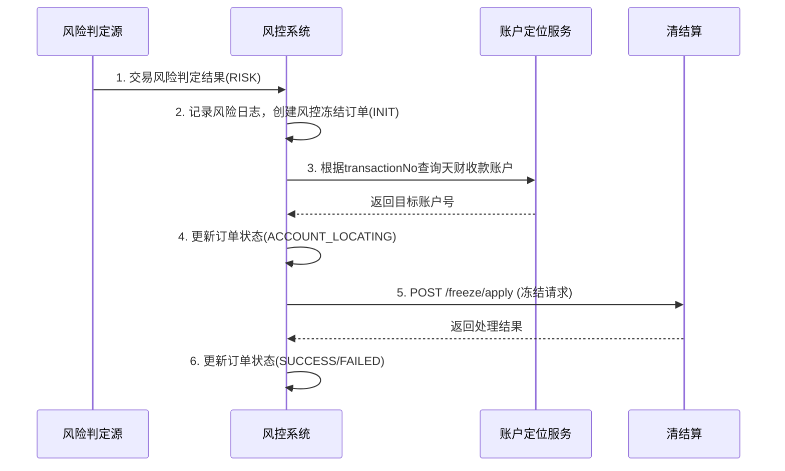
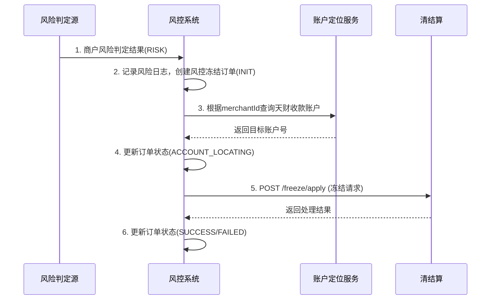

# 模块设计: 风控

生成时间: 2026-01-22 15:43:36
批判迭代: 2

---

# 模块设计: 风控系统

生成时间: TBD
批判迭代: TBD

---

## 1. 概述
- **目的与范围**: 本模块负责对交易和商户进行风险识别与控制。其核心职责包括：根据风险规则判定交易或商户是否存在风险，并对已结算至天财收款账户的资金发起冻结指令，或对商户发起冻结指令以冻结其对应的天财收款账户。本模块是保障资金安全、防范欺诈和违规行为的关键环节。

## 2. 接口设计
- **API端点 (REST)**:
    - `POST /api/v1/risk/freeze/transaction`: 发起交易冻结。
    - `POST /api/v1/risk/freeze/merchant`: 发起商户冻结。
- **请求/响应结构**:
    - 交易冻结请求 (`POST /api/v1/risk/freeze/transaction`):
        ```json
        {
          "requestId": "string，请求唯一标识",
          "transactionNo": "string，交易订单号",
          "freezeReason": "string，冻结原因",
          "extInfo": "object，扩展信息"
        }
        ```
    - 商户冻结请求 (`POST /api/v1/risk/freeze/merchant`):
        ```json
        {
          "requestId": "string，请求唯一标识",
          "merchantId": "string，商户标识",
          "freezeReason": "string，冻结原因",
          "extInfo": "object，扩展信息"
        }
        ```
    - 通用响应结构:
        ```json
        {
          "code": "string，响应码",
          "message": "string，响应信息",
          "data": {
            "requestId": "string，原请求ID",
            "freezeOrderNo": "string，风控冻结订单号",
            "status": "string，处理状态"
          }
        }
        ```
- **发布/消费的事件**:
    - 消费事件: TBD
    - 发布事件: TBD

## 3. 数据模型
- **表/集合**:
    - `risk_freeze_order`: 风控冻结主订单表。
    - `risk_judgment_log`: 风险判定日志表。
- **关键字段**:
    - `risk_freeze_order`:
        - `id` (主键)
        - `freeze_order_no` (风控冻结订单号，唯一)
        - `request_id` (请求唯一标识，用于幂等)
        - `biz_type` (业务类型: TRANSACTION_FREEZE, MERCHANT_FREEZE)
        - `target_id` (目标标识: 交易订单号或商户ID)
        - `target_account_no` (目标天财收款账户号)
        - `freeze_amount` (冻结金额，商户冻结时为TBD)
        - `freeze_reason` (冻结原因)
        - `status` (状态: INIT, ACCOUNT_LOCATING, FREEZE_REQUESTING, SUCCESS, FAILED)
        - `clearing_order_no` (关联的清结算订单号)
        - `created_time` (创建时间)
        - `updated_time` (更新时间)
    - `risk_judgment_log`:
        - `id` (主键)
        - `judgment_id` (风险判定ID)
        - `judgment_source` (判定来源: TBD)
        - `target_type` (目标类型: TRANSACTION, MERCHANT)
        - `target_id` (目标标识)
        - `risk_level` (风险等级)
        - `judgment_result` (判定结果: RISK, SAFE)
        - `judgment_time` (判定时间)
        - `rule_hits` (触发的规则列表)
- **与其他模块的关系**: `risk_freeze_order` 通过 `target_id` 关联上游交易或商户数据；通过 `target_account_no` 关联账户系统的天财收款账户；通过 `clearing_order_no` 关联清结算模块的冻结订单。

## 4. 业务逻辑
- **核心工作流/算法**:
    1.  **风险判定触发**:
        - 接收来自TBD（如内部规则引擎或外部系统）的风险判定结果。
        - 记录风险判定日志 (`risk_judgment_log`)。
        - 若判定结果为存在风险 (`RISK`)，则进入冻结流程。
    2.  **账户定位逻辑**:
        - **交易冻结**: 根据 `transactionNo` 查询TBD（如交易核心或清结算模块），获取该笔交易已结算入账的 `天财收款账户号`。
        - **商户冻结**: 根据 `merchantId` 查询TBD（如三代或账户系统），获取该商户对应的 `天财收款账户号`。
        - 将定位到的账户号更新至 `risk_freeze_order` 表的 `target_account_no` 字段。
    3.  **冻结指令发起**:
        - 构建清结算模块的冻结请求 (`POST /api/v1/freeze/apply`)。
        - 请求参数中，`accountNo` 为上一步定位的 `target_account_no`。
        - 交易冻结：`freezeType` 为 `TRANSACTION`，`freezeAmount` 为交易结算金额。
        - 商户冻结：`freezeType` 为 `MERCHANT`，`freezeAmount` 为TBD（如账户全部余额）。
        - 调用清结算接口，并携带唯一 `requestId` 保证幂等性。
    4.  **结果处理与状态同步**:
        - 接收清结算模块的响应。
        - 若成功，更新 `risk_freeze_order` 状态为 `SUCCESS`，并记录 `clearing_order_no`。
        - 若失败，根据错误类型决定重试或更新状态为 `FAILED`。
- **业务规则与验证**:
    - 风险判定规则来源: TBD。
    - 验证目标账户是否存在且状态正常（通过清结算模块的响应或前置查询）。
    - 所有请求需携带唯一 `requestId` 实现幂等性。
- **关键边界情况处理**:
    - 目标账户不存在：中止流程，更新订单状态为 `FAILED`，记录错误日志并告警。
    - 清结算模块冻结请求失败：根据错误码（如网络超时）实施重试机制（最多3次，带退避策略）。对于业务性失败（如账户状态异常），中止流程并告警。
    - 并发冻结请求：通过 `requestId` 幂等性保证同一风险事件只处理一次。
- **并发与一致性**:
    - 通过 `requestId` 保证请求的幂等性，防止重复发起冻结。
    - 账户定位与冻结请求操作需保证最终一致性。若清结算冻结成功但风控订单状态更新失败，需有对账或补偿机制。
- **数据生命周期管理**:
    - 风控订单与日志数据根据监管和审计要求设置保留期限（如5年）。
    - 过期数据可归档至历史库或冷存储。

## 5. 时序图

### 5.1 交易冻结时序图


### 5.2 商户冻结时序图


## 6. 错误处理
- **预期错误情况与错误码**:
    - `INVALID_REQUEST` (400): 请求参数错误或缺失。
    - `RISK_JUDGMENT_ERROR` (500): 风险判定过程异常。
    - `ACCOUNT_LOCATE_FAILED` (404): 无法定位到目标天财收款账户。
    - `ACCOUNT_STATUS_ERROR` (409): 目标账户状态异常（如已注销）。
    - `FREEZE_REQUEST_FAILED` (500): 向清结算发起冻结请求失败。
    - `DUPLICATE_REQUEST` (409): 重复请求（幂等性冲突）。
- **处理策略**:
    - 对于参数错误、账户不存在、账户状态异常等业务错误，记录日志并告警，流程中止，更新风控订单状态为 `FAILED`。
    - 对于依赖服务（账户定位服务、清结算）的暂时性失败（网络超时），实施带退避策略的重试机制（最多3次）。
    - 所有风险判定和冻结操作均需记录详细的审计日志 (`risk_judgment_log`, `risk_freeze_order`)。
    - 建立对账机制，定期核对风控冻结订单与清结算冻结记录的状态一致性。

## 7. 依赖关系
- **上游模块**:
    - **风险判定源**: 提供交易或商户的风险判定结果（TBD）。
- **下游模块**:
    - **清结算**: 接收本模块的冻结指令 (`POST /api/v1/freeze/apply`)，执行具体的资金或账户冻结流程。
    - **账户定位服务**: 提供根据交易或商户信息查询对应天财收款账户的服务（TBD，可能为三代、清结算或账户系统提供的查询能力）。
- **交互说明**: 本模块是风险管控的执行者。它接收风险判定结果，通过查询依赖服务定位目标账户，然后调用清结算模块执行冻结。自身不直接操作账户或记账，专注于风险决策的传递与执行。