# DocuFlow-AI Project - 软件设计文档
生成时间: 2026-01-16 17:56:42

## 目录
1. [概述说明](#1-概述说明)
   - 1.1 [术语与缩略词](#11-术语与缩略词)
2. [系统设计](#2-系统设计)
3. [模块设计](#3-模块设计)
   - 3.1 [账户系统](#31-账户系统)
   - 3.2 [电子签章系统](#32-电子签章系统)
   - 3.3 [认证系统](#33-认证系统)
   - 3.4 [计费中台](#34-计费中台)
   - 3.5 [三代系统](#35-三代系统)
   - 3.6 [清结算系统](#36-清结算系统)
   - 3.7 [账务核心系统](#37-账务核心系统)
   - 3.8 [行业钱包系统](#38-行业钱包系统)
   - 3.9 [业务核心](#39-业务核心)
   - 3.10 [前端渠道（钱包APP/商服平台）](#310-前端渠道（钱包APP/商服平台）)
   - 3.11 [对账单系统](#311-对账单系统)
4. [接口设计](#4-接口设计)
5. [数据库设计](#5-数据库设计)

---
# 1 概述说明

## 1.1 术语与缩略词


## 角色

- **天财** (别名: 天财商龙): 本需求文档中的核心业务合作方，指代“天财商龙”，是一个为餐饮等门店提供管理软件服务的系统。本系统旨在为其提供专用的分账、结算和付款能力。
- **总部** (别名: 总店, 发起方): 收单商户中的管理方或品牌方角色，通常是分账业务（归集、批量付款、会员结算）的发起者和资金归集方。
- **门店**: 收单商户中的分支机构或加盟店角色，在归集场景中是资金被归集方（付方），在会员结算场景中是资金接收方。
- **接收方** (别名: 入账方): 在批量付款场景中，接收从天财收款账户分账资金的实体，通常指供应商、股东等，拥有“天财接收方账户”。

## 技术术语

- **三代**: 指代拉卡拉支付系统中的一个核心系统层，负责商户管理、交易处理、接口网关等核心业务逻辑，在本需求中作为天财接口的主要调用方和业务协调方。
- **行业钱包** (别名: 钱包系统): 拉卡拉支付系统中的一个子系统，专门处理基于钱包账户模型的业务，如账户管理、关系绑定、转账分账等。在本需求中负责天财专用账户的业务逻辑处理。
- **账户系统**: 拉卡拉支付底层核心系统之一，负责账户的底层创建、标记、资金记账及能力控制。
- **清结算**: 清算与结算系统，负责交易资金的清分、结算、计费以及退货等资金处理流程。
- **打款验证** (别名: 小额打款验证): 一种身份认证方式，通过向待验证方的绑定银行卡打入随机小额款项，要求其回填正确金额和备注，以验证账户控制权和身份真实性。主要用于对公企业验证。
- **人脸验证**: 一种身份认证方式，通过比对姓名、身份证号和人脸生物特征信息，以验证个人身份真实性。主要用于个人或个体工商户验证。
- **电子签章系统** (别名: 电子签约平台): 负责生成电子协议、发送验证短信、封装H5页面、调用认证系统并留存全流程证据链（协议、认证过程、结果）的系统。
- **计费中台**: 负责计算分账交易手续费的系统。费率、计费模式等在三代配置，计费中台提供计费能力，清结算系统负责同步和执行。
- **业务核心**: 接收并记录“天财分账”交易信息的系统，为对账单系统提供交易数据源。
- **对账单系统**: 生成和提供各类资金动账明细和汇总账单的系统，在本需求中需特别提供天财机构层的分账、提款、收单、结算等账单。
- **主动结算**: 一种结算模式，指收单交易资金结算到商户指定的收款账户（如天财收款账户），而非停留在待结算账户。
- **被动结算**: 一种结算模式，指收单交易资金先停留在待结算账户，需要商户主动发起提款操作才能到账。
- **D+1结算**: 结算时效的一种，指交易发生日（D日）的次日进行资金结算。

## 业务实体

- **天财专用账户**: 为天财业务场景专门设立的账户类型，在账户系统底层有特殊标记，包括“天财收款账户”和“天财接收方账户”，其资金流转受到特定规则限制。
- **天财收款账户**: 天财专用账户的一种，主要归属于收单商户（总部或门店），用于接收收单结算款，并作为分账业务的付款方账户。类型为“行业钱包（非小微钱包）”。
- **天财接收方账户**: 天财专用账户的一种，主要归属于供应商、股东等收款方，用于接收从天财收款账户分账而来的资金。支持绑定多张银行卡并设置默认提现卡。
- **收单商户** (别名: 商户): 通过拉卡拉系统进行收款业务的商户实体。在本需求中，根据与天财的关系，可分为“总部”和“门店”。
- **01待结算账户** (别名: 待结算账户): 用于临时存放收单交易待结算资金的内部账户。
- **04退货账户** (别名: 退货账户): 用于处理退货业务的内部账户。在天财场景下，可与天财收款账户组合用于退货扣款。

## 流程

- **开户** (别名: 开通账户): 为商户或接收方创建天财专用账户（天财收款账户或天财接收方账户）的流程。包括新开账户和将普通收款账户升级为天财收款账户。
- **关系绑定** (别名: 签约与认证, 绑定): 在发起分账（转账）前，建立并验证资金付方与收方之间授权关系的流程。包含协议签署和身份认证（打款验证或人脸验证），是分账交易的前置条件。
- **归集** (别名: 资金归集): 一种分账场景，指总部将门店（付方）天财收款账户中的资金，归集到总部（收方）天财收款账户的业务流程。
- **批量付款** (别名: 批付): 一种分账场景，指总部从天财收款账户向多个接收方（天财接收方账户）进行分账付款的业务流程，用于供应商付款、分红等。
- **会员结算**: 一种分账场景，指总部从天财收款账户向门店（收方）的天财收款账户进行分账的业务流程，用于结算会员消费相关的资金。
- **分账** (别名: 转账): 本需求中的核心业务流程，特指在天财专用账户之间进行的资金划转，包括“归集”、“批量付款”、“会员结算”三种具体场景。由天财发起请求，经系统校验和计费后执行。
- **开通付款**: 在批量付款和会员结算场景下，付方（总部/门店）需要额外进行的一次授权流程，旨在签署代付授权协议，是关系绑定生效的前提。

---
# 2 系统设计
# 天财分账业务系统级设计文档

## 2.1 系统结构

天财分账业务系统采用分层、模块化的微服务架构，旨在为天财商龙合作方提供合规、高效、可追溯的资金分账服务。系统以**三代系统**作为统一对外接口和业务协调中心，以**行业钱包系统**为核心业务逻辑处理引擎，底层依赖**账户系统**、**清结算系统**等基础金融能力，并通过**电子签章**与**认证系统**确保业务关系的真实合法。整体架构遵循高内聚、低耦合原则，确保系统的可扩展性、可维护性和高可用性。

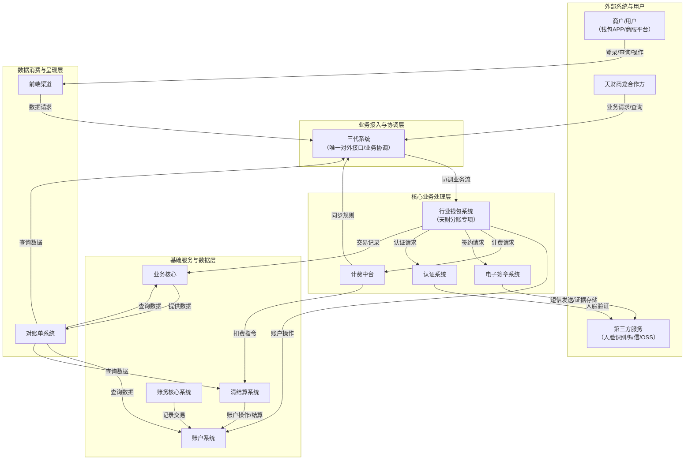
```mermaid
graph TB
    subgraph "外部系统与用户"
        A[天财商龙合作方]
        B[商户/用户<br>（钱包APP/商服平台）]
        C[第三方服务<br>（人脸识别/短信/OSS）]
    end

    subgraph "业务接入与协调层"
        D[三代系统<br>（唯一对外接口/业务协调）]
    end

    subgraph "核心业务处理层"
        E[行业钱包系统<br>（天财分账专项）]
        F[认证系统]
        G[电子签章系统]
        H[计费中台]
    end

    subgraph "基础服务与数据层"
        I[账户系统]
        J[清结算系统]
        K[账务核心系统]
        L[业务核心]
    end

    subgraph "数据消费与呈现层"
        M[对账单系统]
        N[前端渠道]
    end

    A -- 业务请求/查询 --> D
    B -- 登录/查询/操作 --> N
    N -- 数据请求 --> D
    D -- 协调业务流 --> E
    E -- 账户操作 --> I
    E -- 计费请求 --> H
    E -- 签约请求 --> G
    E -- 认证请求 --> F
    E -- 交易记录 --> L
    F -- 人脸验证 --> C
    G -- 短信发送/证据存储 --> C
    H -- 同步规则 --> D
    H -- 扣费指令 --> J
    J -- 账户操作/结算 --> I
    K -- 记录交易 --> I
    L -- 提供数据 --> M
    M -- 查询数据 --> I & L & J & D
```

**架构说明**:
1.  **外部接入层**: 三代系统作为唯一入口，屏蔽内部复杂度，提供稳定API。
2.  **核心业务层**: 行业钱包系统串联开户、绑关系、分账等核心流程，依赖认证、签章、计费等专项服务完成特定环节。
3.  **基础服务层**: 提供账户、清算、记账等金融系统核心能力，是资金安全、准确流转的基石。
4.  **数据层**: 业务核心与账务核心分别记录业务与账务数据，为对账单系统提供可靠数据源。
5.  **呈现层**: 对账单系统满足机构对账需求，前端渠道为商户提供自助服务。

## 2.2 功能结构

系统功能围绕“天财分账”业务的生命周期进行组织，涵盖商户准入、关系建立、交易执行、资金结算及数据服务全流程。

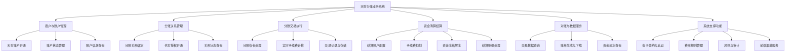
```mermaid
graph TD
    A[天财分账业务系统] --> B1[商户与账户管理]
    A --> B2[分账关系管理]
    A --> B3[分账交易执行]
    A --> B4[资金清算结算]
    A --> B5[对账与数据服务]
    A --> B6[系统支撑功能]

    B1 --> C1[天财账户开通]
    B1 --> C2[账户状态管理]
    B1 --> C3[账户信息查询]

    B2 --> C4[分账关系绑定]
    B2 --> C5[代付授权开通]
    B2 --> C6[关系状态查询]

    B3 --> C7[分账指令处理]
    B3 --> C8[实时手续费计算]
    B3 --> C9[交易记录与存储]

    B4 --> C10[结算账户配置]
    B4 --> C11[手续费扣划]
    B4 --> C12[资金冻结解冻]
    B4 --> C13[结算明细处理]

    B5 --> C14[交易数据查询]
    B5 --> C15[账单生成与下载]
    B5 --> C16[资金流水查询]

    B6 --> C17[电子签约与认证]
    B6 --> C18[费率规则管理]
    B6 --> C19[风控与审计]
    B6 --> C20[前端渠道服务]
```

**功能模块说明**:
- **商户与账户管理**: 负责天财专用账户的创建、升级、状态维护与查询，是业务参与方的准入基础。
- **分账关系管理**: 通过电子签约、小额打款/人脸认证建立并管理付方与收方之间的分账授权关系。
- **分账交易执行**: 处理归集、批量付款、会员结算等场景下的资金划转，协调计费并记录交易。
- **资金清算结算**: 执行资金的实际清算、手续费扣收、账户冻结及结算到银行卡等操作。
- **对账与数据服务**: 整合多源数据，为天财机构提供交易明细、汇总账单及资金流水查询。
- **系统支撑功能**: 提供签约、认证、计费规则、风控、前端交互等支撑业务运行的必要能力。

## 2.3 网络拓扑图

系统部署在私有云或金融级云平台内，采用分区隔离策略，确保不同安全等级模块间的访问可控。外部访问通过API网关接入，内部服务间通过服务网格或内网负载均衡进行通信。

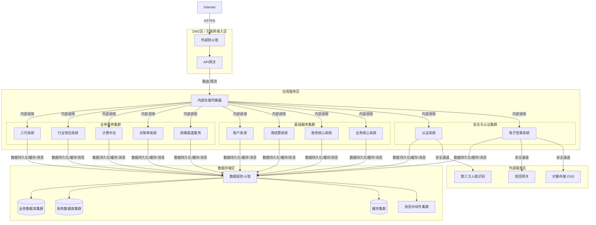
```mermaid
graph TB
    subgraph "DMZ区 / 互联网接入区"
        GW[API网关]
        FW1[外部防火墙]
    end

    subgraph "应用服务区"
        subgraph "业务服务集群"
            S1[三代系统]
            S2[行业钱包系统]
            S3[计费中台]
            S4[对账单系统]
            S5[前端渠道服务]
        end
        subgraph "基础服务集群"
            S6[账户系统]
            S7[清结算系统]
            S8[账务核心系统]
            S9[业务核心系统]
        end
        subgraph "安全与认证集群"
            S10[认证系统]
            S11[电子签章系统]
        end
        LB[内部负载均衡器]
    end

    subgraph "数据存储区"
        DB1[(业务数据库集群)]
        DB2[(账务数据库集群)]
        DB3[(缓存集群)]
        MQ[消息中间件集群]
        FW3[数据层防火墙]
    end

    subgraph "外部服务区"
        Ext1[第三方人脸识别]
        Ext2[短信网关]
        Ext3[对象存储 OSS]
    end

    Internet -- HTTPS --> FW1 --> GW
    GW -- 路由/限流 --> LB
    LB -- 内部调用 --> S1 & S2 & S3 & S4 & S5 & S6 & S7 & S8 & S9 & S10 & S11

    S1 & S2 & S3 & S4 & S5 & S6 & S7 & S8 & S9 & S10 & S11 -- 数据持久化/缓存/消息 --> FW3 --> DB1 & DB2 & DB3 & MQ
    
    S10 -- 安全通道 --> Ext1
    S11 -- 安全通道 --> Ext2 & Ext3
```

**部署说明**:
1.  **安全隔离**: 网络分为DMZ区、应用区、数据区，通过防火墙严格管控流量。
2.  **高可用**: 关键服务与中间件均采用集群部署，消除单点故障。
3.  **外部集成**: 与第三方服务通过专线或VPN建立安全、稳定的连接。
4.  **内部通信**: 服务间通过内网域名和负载均衡器调用，保证高效与可靠。

## 2.4 数据流转

数据流转核心围绕“一笔分账交易”的生命周期展开，涉及业务数据、资金指令和账务记录在多系统间的传递与同步。

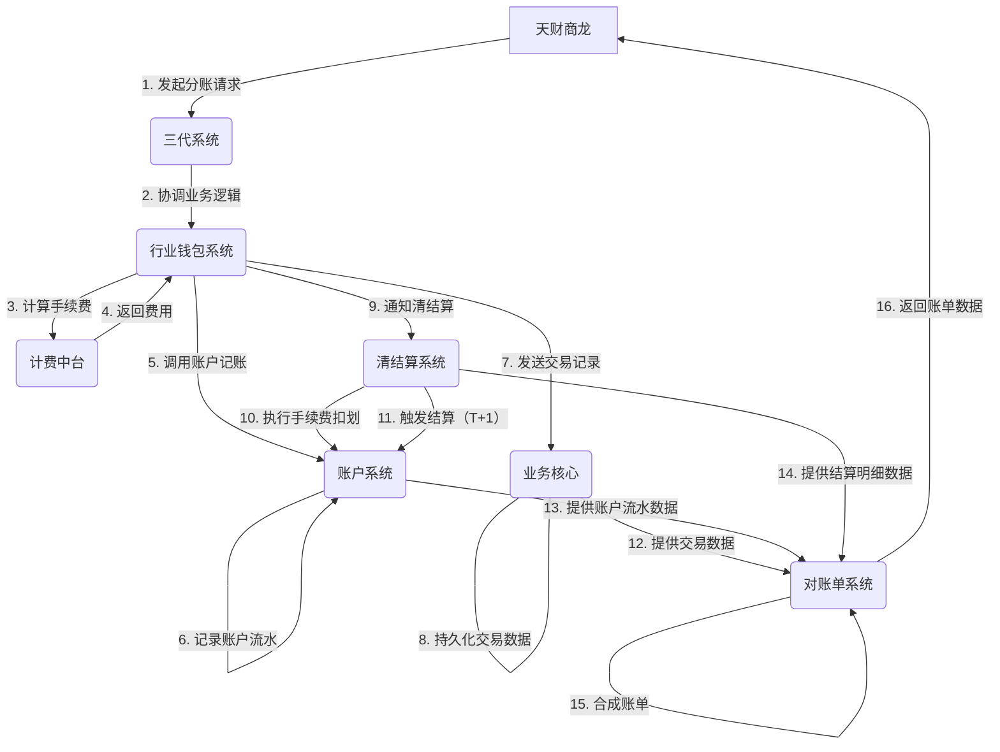
```mermaid
flowchart TD
    A[天财商龙] -- 1. 发起分账请求 --> B(三代系统)
    B -- 2. 协调业务逻辑 --> C(行业钱包系统)
    C -- 3. 计算手续费 --> D(计费中台)
    D -- 4. 返回费用 --> C
    C -- 5. 调用账户记账 --> E(账户系统)
    E -- 6. 记录账户流水 --> E
    C -- 7. 发送交易记录 --> F(业务核心)
    F -- 8. 持久化交易数据 --> F
    C -- 9. 通知清结算 --> G(清结算系统)
    G -- 10. 执行手续费扣划 --> E
    G -- 11. 触发结算（T+1） --> E
    F -- 12. 提供交易数据 --> H(对账单系统)
    E -- 13. 提供账户流水数据 --> H
    G -- 14. 提供结算明细数据 --> H
    H -- 15. 合成账单 --> H
    H -- 16. 返回账单数据 --> A
```

**关键数据流说明**:
1.  **业务请求流**: 外部请求经三代系统路由至行业钱包系统，驱动核心业务流程。
2.  **资金处理流**: 行业钱包系统驱动账户系统完成实时记账，清结算系统在事后完成手续费扣划和资金结算。
3.  **数据记录流**: 交易数据由业务核心持久化，账户流水、结算明细由各自系统记录，共同构成完整的业务视图。
4.  **对账数据流**: 对账单系统作为数据消费者，从业务核心、账户系统、清结算系统拉取数据，加工后提供给天财机构。

## 2.5 系统模块交互关系

各模块通过清晰的接口契约进行协作，形成松耦合的依赖关系。下图展示了核心的业务交互场景。

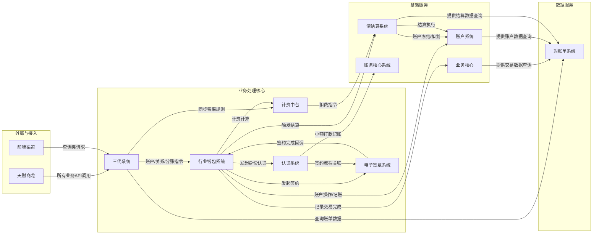
```mermaid
graph LR
    subgraph "外部与接入"
        Ext[天财商龙]
        Front[前端渠道]
    end

    subgraph "业务处理核心"
        Gen3[三代系统]
        Wallet[行业钱包系统]
        Fee[计费中台]
        Auth[认证系统]
        Esign[电子签章系统]
    end

    subgraph "基础服务"
        Acct[账户系统]
        Stm[清结算系统]
        AcctCore[账务核心系统]
        BizCore[业务核心]
    end

    subgraph "数据服务"
        Stmt[对账单系统]
    end

    Ext -- 所有业务API调用 --> Gen3
    Front -- 查询类请求 --> Gen3

    Gen3 -- 账户/关系/分账指令 --> Wallet
    Gen3 -- 同步费率规则 --> Fee
    Gen3 -- 查询账单数据 --> Stmt

    Wallet -- 账户操作/记账 --> Acct
    Wallet -- 计费计算 --> Fee
    Wallet -- 发起签约 --> Esign
    Wallet -- 发起身份认证 --> Auth
    Wallet -- 记录交易完成 --> BizCore
    Wallet -- 触发结算 --> Stm

    Auth -- 小额打款记账 --> AcctCore
    Auth -- 签约流程关联 --> Esign

    Esign -- 签约完成回调 --> Wallet

    Fee -- 扣费指令 --> Stm

    Stm -- 账户冻结/扣划 --> Acct
    Stm -- 结算执行 --> Acct

    BizCore -- 提供交易数据查询 --> Stmt
    Acct -- 提供账户数据查询 --> Stmt
    Stm -- 提供结算数据查询 --> Stmt
```

**交互关系详解**:
- **三代系统**是枢纽，对外统一，对内协调，重度依赖**行业钱包系统**处理具体业务。
- **行业钱包系统**是业务流程的“总导演”，串联起**账户系统**（资金操作）、**认证/签章系统**（合规保障）、**计费中台**（费用计算）、**业务核心**（数据留存）和**清结算系统**（事后结算）。
- **认证系统**与**电子签章系统**协作，共同完成关系绑定的合规流程，并依赖**账务核心系统**完成小额打款。
- **对账单系统**是主要的数据消费者，从**业务核心**、**账户系统**、**清结算系统**和**三代系统**获取原始数据，加工后输出。
- **清结算系统**和**计费中台**作为资金处理的关键环节，最终通过**账户系统**完成所有资金变动。
---
# 3 模块设计

## 3.1 账户系统


# 账户系统模块设计文档（天财分账专项）

## 1. 概述

### 1.1 目的
本模块（账户系统）作为拉卡拉支付底层核心系统之一，为“天财分账”业务提供底层账户支撑。核心目的是为天财业务场景创建和管理专用的账户类型（天财收款账户、天财接收方账户），并在账户底层进行特殊标记和能力控制，确保天财专用账户的资金流转符合业务规则，并与其他普通账户有效隔离。

### 1.2 范围
- **账户创建与升级**：支持为天财机构下的商户新开或升级“天财专用账户”。
- **账户标记与能力控制**：在账户底层对天财专用账户进行特殊标记，并控制其转账、结算等能力（例如，仅允许在天财专用账户间转账）。
- **账户信息存储**：存储账户基础信息、标记、角色（总部/门店）及关联关系。
- **资金记账**：接收并处理来自行业钱包系统的天财分账、打款验证等业务的资金记账请求。
- **账单数据提供**：为对账单系统提供底层账户动账明细数据。
- **账户冻结**：支持接收风控指令，对天财收款账户进行冻结/解冻。

## 2. 接口设计

### 2.1 API端点 (RESTful)

#### 2.1.1 内部接口（供行业钱包、清结算等系统调用）

**1. 创建天财专用账户**
- **端点**：`POST /internal/accounts/tiancai`
- **描述**：为指定商户创建天财收款账户或天财接收方账户。
- **调用方**：行业钱包系统
- **请求体**：
```json
{
  "requestId": "UUID",
  "merchantNo": "商户号",
  "accountType": "TIANCAI_COLLECT" | "TIANCAI_RECEIVER", // 天财收款账户 | 天财接收方账户
  "role": "HEADQUARTERS" | "STORE", // 总部 | 门店 (仅对收款账户有效)
  "baseAccountNo": "原普通收款账户号", // 升级场景下传入
  "operator": "系统标识"
}
```
- **响应体**：
```json
{
  "code": "SUCCESS",
  "message": "成功",
  "data": {
    "accountNo": "生成的天财专用账户号",
    "accountType": "TIANCAI_COLLECT",
    "status": "ACTIVE"
  }
}
```

**2. 账户升级（普通账户 -> 天财专用账户）**
- **端点**：`PUT /internal/accounts/{accountNo}/upgrade-to-tiancai`
- **描述**：将已存在的普通收款账户升级为天财收款账户。
- **调用方**：行业钱包系统
- **请求体**：
```json
{
  "requestId": "UUID",
  "targetAccountType": "TIANCAI_COLLECT",
  "role": "HEADQUARTERS" | "STORE",
  "operator": "系统标识"
}
```
- **响应体**：同创建接口。

**3. 账户记账**
- **端点**：`POST /internal/accounts/{accountNo}/book`
- **描述**：执行账户资金的借记或贷记操作。
- **调用方**：行业钱包系统（分账）、业务核心（打款验证）
- **请求体**：
```json
{
  "requestId": "UUID",
  "bizType": "TIANCAI_SPLIT" | "VERIFICATION_TRANSFER", // 天财分账 | 打款验证
  "bizNo": "业务流水号",
  "amount": 10000,
  "direction": "CREDIT" | "DEBIT",
  "currency": "CNY",
  "memo": "业务备注",
  "oppositeAccountNo": "对方账户号",
  "operator": "系统标识"
}
```
- **响应体**：
```json
{
  "code": "SUCCESS",
  "message": "成功",
  "data": {
    "accountNo": "账户号",
    "balance": "当前余额",
    "postingId": "记账流水ID"
  }
}
```

**4. 账户冻结/解冻**
- **端点**：`PUT /internal/accounts/{accountNo}/freeze-status`
- **描述**：更新账户的冻结状态。
- **调用方**：风控系统（通过清结算或直接调用）
- **请求体**：
```json
{
  "requestId": "UUID",
  "freezeType": "MERCHANT_FREEZE" | "TRANSACTION_FREEZE", // 商户冻结 | 交易冻结
  "freezeStatus": "FROZEN" | "UNFROZEN",
  "freezeReason": "冻结原因",
  "operator": "系统标识"
}
```

**5. 账户信息查询**
- **端点**：`GET /internal/accounts/{accountNo}`
- **描述**：查询账户详情，包含天财标记和角色。
- **调用方**：行业钱包、清结算、对账单系统
- **响应体**：
```json
{
  "code": "SUCCESS",
  "data": {
    "accountNo": "账户号",
    "merchantNo": "商户号",
    "accountType": "TIANCAI_COLLECT | TIANCAI_RECEIVER | GENERAL_COLLECT ...",
    "tiancaiFlag": true,
    "role": "HEADQUARTERS",
    "status": "ACTIVE",
    "freezeStatus": "UNFROZEN",
    "balance": 100000,
    "createdTime": "2023-01-01 10:00:00"
  }
}
```

**6. 动账明细查询（批量）**
- **端点**：`POST /internal/accounts/transaction-details/batch`
- **描述**：根据时间范围和账户列表，批量查询动账明细。供对账单系统拉取数据。
- **调用方**：对账单系统
- **请求体**：
```json
{
  "accountNos": ["账户1", "账户2"],
  "startTime": "2023-10-01 00:00:00",
  "endTime": "2023-10-02 00:00:00",
  "pageNo": 1,
  "pageSize": 1000
}
```
- **响应体**：
```json
{
  "code": "SUCCESS",
  "data": {
    "details": [
      {
        "postingId": "记账流水ID",
        "accountNo": "账户号",
        "bizType": "业务类型",
        "bizNo": "业务流水号",
        "amount": 100,
        "direction": "CREDIT",
        "balance": 1000,
        "currency": "CNY",
        "memo": "备注",
        "oppositeAccountNo": "对方账户",
        "createdTime": "2023-10-01 12:00:00"
      }
    ],
    "total": 1500
  }
}
```

### 2.2 发布/消费的事件

#### 2.2.1 消费的事件
- **AccountCreatedEvent**：由行业钱包发布。账户系统监听此事件，用于同步账户基础信息（非核心，主要依赖直接调用）。
- **SettlementDetailEvent**：由清结算系统发布。当有资金结算到天财收款账户时，账户系统根据事件中的“补明细账单”标识，生成更详细的子账单流水。

#### 2.2.2 发布的事件
- **AccountStatusChangedEvent**：当账户状态（如冻结状态）发生变化时发布。
  - **主题**：`account.status.changed`
  - **数据**：`{“accountNo”: “xxx”, “oldStatus”: “ACTIVE”, “newStatus”: “FROZEN”, “changeTime”: “...”, “reason”: “...”}`
- **BalanceChangedEvent**：当账户余额发生变动时发布（可选，用于监控或风控）。
  - **主题**：`account.balance.changed`
  - **数据**：`{“accountNo”: “xxx”, “changeAmount”: 100, “newBalance”: 1000, “bizNo”: “...”, “time”: “...”}`

## 3. 数据模型

### 3.1 核心表设计

**1. 账户主表 (account)**
存储所有账户的核心信息。
```sql
CREATE TABLE `account` (
  `id` bigint(20) NOT NULL AUTO_INCREMENT COMMENT '主键ID',
  `account_no` varchar(32) NOT NULL COMMENT '账户号，唯一',
  `merchant_no` varchar(32) NOT NULL COMMENT '所属商户号',
  `account_type` varchar(32) NOT NULL COMMENT '账户类型: GENERAL_COLLECT, TIANCAI_COLLECT, TIANCAI_RECEIVER, SETTLEMENT, REFUND ...',
  `tiancai_flag` tinyint(1) NOT NULL DEFAULT 0 COMMENT '是否天财专用账户标记: 0-否, 1-是',
  `role` varchar(32) DEFAULT NULL COMMENT '角色: HEADQUARTERS-总部, STORE-门店 (仅天财收款账户有效)',
  `currency` varchar(3) NOT NULL DEFAULT 'CNY' COMMENT '币种',
  `balance` decimal(20,2) NOT NULL DEFAULT '0.00' COMMENT '当前余额',
  `available_balance` decimal(20,2) NOT NULL DEFAULT '0.00' COMMENT '可用余额',
  `freeze_status` varchar(32) NOT NULL DEFAULT 'UNFROZEN' COMMENT '冻结状态: UNFROZEN, FROZEN',
  `freeze_reason` varchar(255) DEFAULT NULL COMMENT '冻结原因',
  `status` varchar(32) NOT NULL DEFAULT 'ACTIVE' COMMENT '账户状态: ACTIVE, INACTIVE, CLOSED',
  `version` int(11) NOT NULL DEFAULT 0 COMMENT '版本号，用于乐观锁',
  `created_time` datetime NOT NULL DEFAULT CURRENT_TIMESTAMP COMMENT '创建时间',
  `updated_time` datetime NOT NULL DEFAULT CURRENT_TIMESTAMP ON UPDATE CURRENT_TIMESTAMP COMMENT '更新时间',
  PRIMARY KEY (`id`),
  UNIQUE KEY `uk_account_no` (`account_no`),
  KEY `idx_merchant_no` (`merchant_no`),
  KEY `idx_tiancai_flag` (`tiancai_flag`),
  KEY `idx_account_type` (`account_type`)
) ENGINE=InnoDB COMMENT='账户主表';
```

**2. 账户流水表 (account_transaction)**
记录所有资金变动流水。
```sql
CREATE TABLE `account_transaction` (
  `id` bigint(20) NOT NULL AUTO_INCREMENT COMMENT '主键ID',
  `posting_id` varchar(64) NOT NULL COMMENT '记账流水ID，业务唯一',
  `account_no` varchar(32) NOT NULL COMMENT '账户号',
  `biz_type` varchar(32) NOT NULL COMMENT '业务类型: TIANCAI_SPLIT, VERIFICATION_TRANSFER, SETTLEMENT, WITHDRAW ...',
  `biz_no` varchar(64) NOT NULL COMMENT '业务流水号',
  `amount` decimal(20,2) NOT NULL COMMENT '变动金额，正数',
  `direction` varchar(10) NOT NULL COMMENT '方向: CREDIT-入账, DEBIT-出账',
  `balance` decimal(20,2) NOT NULL COMMENT '变动后余额',
  `currency` varchar(3) NOT NULL DEFAULT 'CNY' COMMENT '币种',
  `memo` varchar(512) DEFAULT NULL COMMENT '备注',
  `opposite_account_no` varchar(32) DEFAULT NULL COMMENT '对方账户号',
  `settlement_detail_flag` tinyint(1) NOT NULL DEFAULT 0 COMMENT '是否为结算明细流水: 0-否, 1-是',
  `parent_posting_id` varchar(64) DEFAULT NULL COMMENT '父记账流水ID (用于结算明细关联汇总流水)',
  `created_time` datetime NOT NULL DEFAULT CURRENT_TIMESTAMP COMMENT '创建时间',
  PRIMARY KEY (`id`),
  UNIQUE KEY `uk_posting_id` (`posting_id`),
  KEY `idx_account_no_time` (`account_no`, `created_time`),
  KEY `idx_biz_no_type` (`biz_no`, `biz_type`),
  KEY `idx_settlement_flag` (`settlement_detail_flag`)
) ENGINE=InnoDB COMMENT='账户流水表';
```

**3. 账户能力控制表 (account_capability)**
控制不同类型账户的能力。
```sql
CREATE TABLE `account_capability` (
  `id` bigint(20) NOT NULL AUTO_INCREMENT,
  `account_type` varchar(32) NOT NULL COMMENT '账户类型',
  `tiancai_flag` tinyint(1) NOT NULL DEFAULT 0 COMMENT '天财标记',
  `capability_code` varchar(64) NOT NULL COMMENT '能力编码: TRANSFER_OUT, TRANSFER_IN, WITHDRAW, ...',
  `is_allowed` tinyint(1) NOT NULL DEFAULT 1 COMMENT '是否允许: 0-否, 1-是',
  `allowed_target_types` varchar(512) DEFAULT NULL COMMENT '允许交易的目标账户类型列表 (JSON数组)',
  `description` varchar(255) DEFAULT NULL COMMENT '描述',
  PRIMARY KEY (`id`),
  UNIQUE KEY `uk_type_capability` (`account_type`, `tiancai_flag`, `capability_code`)
) ENGINE=InnoDB COMMENT='账户能力控制表';
```
*示例数据*：`(‘TIANCAI_COLLECT’, 1, ‘TRANSFER_OUT’, 1, ‘[“TIANCAI_COLLECT”, “TIANCAI_RECEIVER”]’)` 表示天财收款账户只允许向天财收款账户和天财接收方账户转账。

### 3.2 与其他模块的关系
- **行业钱包系统**：账户系统的直接上游调用方。负责业务逻辑校验后，调用账户系统进行账户创建、升级和记账。
- **清结算系统**：向账户系统推送结算明细事件；调用账户系统进行账户冻结。
- **对账单系统**：调用账户系统的批量查询接口，获取底层动账明细数据。
- **业务核心**：调用账户系统进行打款验证等业务的记账。
- **风控系统**：通过清结算或直接调用账户系统，触发账户冻结。

## 4. 业务逻辑

### 4.1 核心算法
1. **账户号生成算法**：采用“前缀 + 序列号”的方式生成唯一账户号。
   - 天财收款账户：`TC_C_{机构简码}{日期}{8位序列}`
   - 天财接收方账户：`TC_R_{机构简码}{日期}{8位序列}`
2. **余额更新**：采用乐观锁 (`version`字段) 保证在高并发记账场景下的余额一致性。
3. **动账明细插入**：记账操作必须在同一事务中完成余额更新和流水插入，保证数据一致性。

### 4.2 业务规则
1. **账户创建规则**：
   - 一个收单商户只能拥有一个天财收款账户。
   - 天财收款账户需标记角色（总部/门店）。
   - 天财接收方账户支持绑定多张银行卡（此信息存储在行业钱包或三代，账户系统不直接存储）。
2. **账户升级规则**：
   - 仅支持普通收款账户 (`GENERAL_COLLECT`) 升级为天财收款账户 (`TIANCAI_COLLECT`)。
   - 升级后，原账户号不变，但 `account_type` 和 `tiancai_flag` 被更新。
3. **转账能力规则**：
   - 天财专用账户 (`tiancai_flag=1`) 只能向其他天财专用账户转账。此规则通过 `account_capability` 表配置，在行业钱包发起转账前校验，账户系统记账时做最终防线校验。
4. **记账规则**：
   - “天财分账”业务使用特定的分录码。
   - 结算到天财收款账户时，若清结算推送的 `SettlementDetailEvent` 带有“补明细账单”标识，则需为每一笔结算明细生成一条 `settlement_detail_flag=1` 的子流水，并关联到汇总流水 (`parent_posting_id`)。
5. **冻结规则**：
   - “商户冻结”时，冻结该商户对应的天财收款账户。
   - “交易冻结”时，冻结指定天财收款账户中的特定资金（需行业钱包或清结算配合记录冻结金额，账户系统层面将账户状态置为冻结）。

### 4.3 验证逻辑
1. **创建/升级账户时**：
   - 校验调用方是否来自天财机构（此校验主要在行业钱包和三代完成，账户系统信任上游校验）。
   - 校验目标商户是否已存在同类型天财账户（防重复开户）。
   - 升级时，校验原账户是否存在且为普通收款账户。
2. **记账时**：
   - 校验账户状态是否为 `ACTIVE` 且 `freeze_status` 为 `UNFROZEN`。
   - 校验余额是否充足（借记时）。
   - 对于转账交易，校验转出账户和转入账户的 `tiancai_flag` 是否符合能力规则（作为最终防线）。
3. **查询时**：
   - 校验调用方是否有权限查询目标账户信息（通过内部服务间Token或IP白名单机制）。

## 5. 时序图

### 5.1 天财专用账户开户时序图

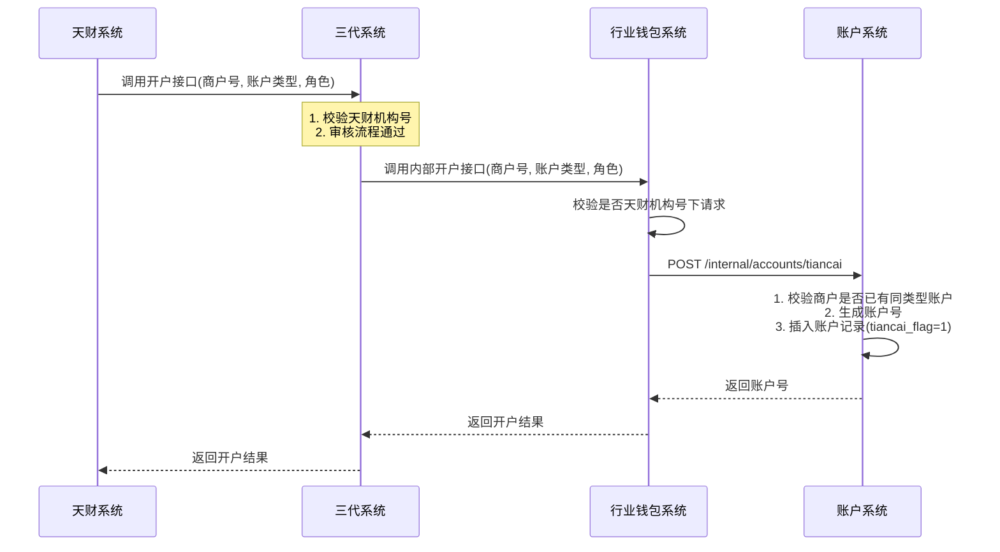
```mermaid
sequenceDiagram
    participant T as 天财系统
    participant G as 三代系统
    participant W as 行业钱包系统
    participant A as 账户系统

    T->>G: 调用开户接口(商户号, 账户类型, 角色)
    Note over G: 1. 校验天财机构号<br/>2. 审核流程通过
    G->>W: 调用内部开户接口(商户号, 账户类型, 角色)
    W->>W: 校验是否天财机构号下请求
    W->>A: POST /internal/accounts/tiancai
    A->>A: 1. 校验商户是否已有同类型账户<br/>2. 生成账户号<br/>3. 插入账户记录(tiancai_flag=1)
    A-->>W: 返回账户号
    W-->>G: 返回开户结果
    G-->>T: 返回开户结果
```

### 5.2 天财分账记账时序图

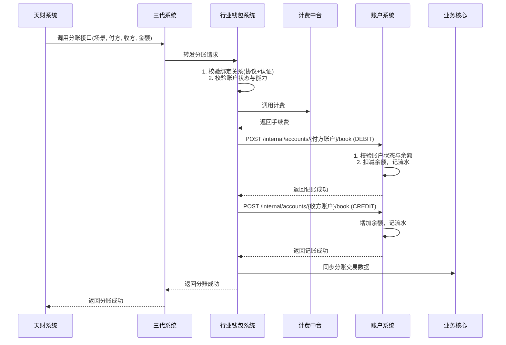
```mermaid
sequenceDiagram
    participant T as 天财系统
    participant G as 三代系统
    participant W as 行业钱包系统
    participant Fee as 计费中台
    participant A as 账户系统
    participant BC as 业务核心

    T->>G: 调用分账接口(场景, 付方, 收方, 金额)
    G->>W: 转发分账请求
    W->>W: 1. 校验绑定关系(协议+认证)<br/>2. 校验账户状态与能力
    W->>Fee: 调用计费
    Fee-->>W: 返回手续费
    W->>A: POST /internal/accounts/{付方账户}/book (DEBIT)
    A->>A: 1. 校验账户状态与余额<br/>2. 扣减余额，记流水
    A-->>W: 返回记账成功
    W->>A: POST /internal/accounts/{收方账户}/book (CREDIT)
    A->>A: 增加余额，记流水
    A-->>W: 返回记账成功
    W->>BC: 同步分账交易数据
    W-->>G: 返回分账成功
    G-->>T: 返回分账成功
```

### 5.3 结算明细生成时序图

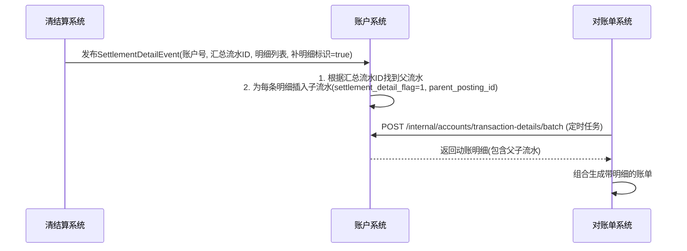
```mermaid
sequenceDiagram
    participant S as 清结算系统
    participant A as 账户系统
    participant B as 对账单系统

    S->>A: 发布SettlementDetailEvent(账户号, 汇总流水ID, 明细列表, 补明细标识=true)
    A->>A: 1. 根据汇总流水ID找到父流水<br/>2. 为每条明细插入子流水(settlement_detail_flag=1, parent_posting_id)
    B->>A: POST /internal/accounts/transaction-details/batch (定时任务)
    A-->>B: 返回动账明细(包含父子流水)
    B->>B: 组合生成带明细的账单
```

## 6. 错误处理

| 错误场景 | 错误码 | 处理策略 |
| :--- | :--- | :--- |
| 账户不存在 | `ACCOUNT_NOT_FOUND` | 返回明确错误，由调用方处理（如检查商户号是否正确）。 |
| 账户状态异常（非ACTIVE或已冻结） | `ACCOUNT_STATUS_INVALID` | 拒绝操作，返回错误。需调用方引导商户处理账户状态。 |
| 余额不足 | `INSUFFICIENT_BALANCE` | 拒绝借记操作。 |
| 账户类型不允许此操作 | `OPERATION_NOT_ALLOWED` | 根据`account_capability`表配置返回。例如天财账户向普通账户转账。 |
| 重复业务流水号 | `DUPLICATE_BIZ_NO` | 幂等处理：查询已存在的流水，若业务类型和金额一致则返回成功；否则返回错误。 |
| 数据库异常（死锁、超时） | `DB_ERROR` | 记录详细日志，向上抛出系统异常，由框架进行重试或降级处理。 |
| 网络超时 | `NETWORK_TIMEOUT` | 接口设计为幂等，调用方应具备重试机制。账户系统需做好防重校验。 |

**通用策略**：
- **内部接口**：使用唯一请求ID (`requestId`) 实现幂等性。
- **异常分类**：区分业务异常（返回给调用方）和系统异常（内部告警、重试）。
- **事务管理**：核心记账操作必须在数据库事务内完成，确保流水和余额一致。
- **监控告警**：对错误码 `DB_ERROR`, `NETWORK_TIMEOUT` 等系统级错误进行监控和告警。

## 7. 依赖说明

### 7.1 上游依赖
1. **行业钱包系统**：
   - **交互方式**：同步RPC调用（HTTP）。
   - **职责**：账户系统接收其开户、升级、记账指令。账户系统信任行业钱包已完成业务逻辑校验（如天财机构校验、关系绑定校验）。
   - **关键点**：行业钱包需传递清晰的业务类型 (`bizType`) 和唯一业务流水号 (`bizNo`)。

2. **清结算系统**：
   - **交互方式**：异步事件（消息队列） + 同步调用（冻结）。
   - **职责**：接收其发布的结算明细事件，以生成子账单流水；接收其发起的账户冻结/解冻指令。
   - **关键点**：事件格式需明确包含“补明细账单”标识和明细数据。

3. **对账单系统**：
   - **交互方式**：同步RPC调用（HTTP）。
   - **职责**：提供批量动账明细查询接口。需支持大数据量分页查询，性能要求高。
   - **关键点**：需明确数据推送时间点（如D日9点前提供D-1日数据）和查询频率。

### 7.2 下游依赖
1. **数据库（MySQL）**：
   - 存储账户和流水数据。要求高可用、高性能。流水表需考虑按月分表。
2. **消息中间件（如Kafka/RocketMQ）**：
   - 用于发布账户状态、余额变更等事件。

### 7.3 设计要点
- **松耦合**：通过明确接口和事件与上下游交互，避免直接数据库耦合。
- **幂等性**：所有写接口必须支持幂等，防止重试导致重复操作。
- **性能**：动账明细查询接口是性能关键点，需依赖`(account_no, created_time)`复合索引，并考虑历史数据归档。
- **可追溯**：所有资金变动必须记录不可变的流水，并关联业务流水号，满足审计和对账要求。

## 3.2 电子签章系统


# 电子签章系统模块设计文档

## 1. 概述

### 1.1 目的
电子签章系统（电子签约平台）是天财分账业务中的核心认证与协议管理模块。其主要目的是为“关系绑定”、“开通付款”等业务流程提供全流程的电子协议签署、身份认证（打款验证/人脸验证）、短信通知及H5页面封装能力，并留存完整的证据链数据，确保分账业务的法律合规性与操作安全性。

### 1.2 范围
本模块负责处理以下核心业务：
- **协议模板管理**：根据业务场景（归集、批量付款、会员结算）和签约方身份（对公/对私）配置和管理不同的电子协议模板。
- **签约流程驱动**：接收行业钱包系统的调用，驱动短信发送、H5页面生成、身份认证和协议签署的完整流程。
- **身份认证集成**：集成认证系统，根据场景调用打款验证或人脸验证服务。
- **证据链留存**：完整记录并存储协议内容、认证过程（验证金额、时间、类型）、认证结果等全流程数据。
- **签约状态管理**：管理每笔签约请求的状态流转，并向调用方（行业钱包）返回最终结果。

### 1.3 设计原则
- **合规性优先**：所有协议模板、认证流程需符合相关法律法规及公司合规要求。
- **可配置性**：协议内容、短信模板、H5页面应支持灵活配置，以适应业务变化。
- **高可靠性**：签约过程及证据链数据必须保证高可靠存储与防篡改。
- **松耦合**：通过清晰的API与事件与其他系统（行业钱包、认证系统）交互。

## 2. 接口设计

### 2.1 API端点 (RESTful)

#### 2.1.1 发起签约认证 (`POST /v1/sign/initiate`)
**描述**：行业钱包系统在校验通过后，调用此接口发起签约认证流程。
**请求方**：行业钱包系统

**请求体 (Request Body):**
```json
{
  "requestId": "WALLET_REQ_202405201200001", // 行业钱包生成的唯一请求ID
  "scene": "COLLECTION", // 场景枚举: COLLECTION(归集), BATCH_PAYMENT(批量付款), MEMBER_SETTLEMENT(会员结算), OPEN_PAYMENT(开通付款)
  "payerInfo": {
    "merchantNo": "PAYER_MCH_001", // 付方商户号
    "merchantName": "XX餐饮总部有限公司", // 付方商户全称
    "accountNo": "TC_PAY_ACC_001", // 付方账户号 (天财收款账户)
    "merchantType": "ENTERPRISE", // 付方商户性质: ENTERPRISE(企业), INDIVIDUAL(个体), PERSONAL(个人)
    "legalPersonName": "张三", // 法人/负责人姓名 (对公/对私)
    "legalPersonIdNo": "110101199001011234" // 法人/负责人身份证号
  },
  "payeeInfo": {
    "merchantNo": "PAYEE_MCH_002", // 收方商户号 (归集时为门店，批量付款时为接收方，会员结算时为门店)
    "merchantName": "XX餐饮西湖店", // 收方商户全称
    "accountNo": "TC_PAY_ACC_002", // 收方账户号 (天财收款账户 或 天财接收方账户)
    "accountType": "TC_PAYMENT_ACCOUNT", // 账户类型: TC_PAYMENT_ACCOUNT(天财收款账户), TC_RECEIVER_ACCOUNT(天财接收方账户)
    "merchantType": "ENTERPRISE", // 收方商户性质
    "legalPersonName": "李四",
    "legalPersonIdNo": "110101199002022345",
    "defaultBankCardNo": "6228480012345678901", // 默认银行卡号 (用于打款验证)
    "defaultBankCardName": "李四" // 默认银行卡户名
  },
  "initiatorInfo": {
    "merchantNo": "INITIATOR_MCH_001", // 发起方商户号 (天财接口中的发起方，通常与付方一致)
    "merchantName": "XX餐饮总部有限公司"
  },
  "fundPurpose": "缴纳管理费", // 资金用途 (归集场景用)
  "callbackUrl": "https://wallet.lakala.com/callback/sign/result" // 行业钱包回调地址 (用于异步通知)
}
```

**响应体 (Success Response 200):**
```json
{
  "code": "SUCCESS",
  "message": "签约流程已发起",
  "data": {
    "signFlowId": "SIGN_FLOW_202405201200001", // 电子签章系统生成的签约流水ID
    "status": "SMS_SENT", // 当前状态: SMS_SENT(短信已发送), AUTH_PENDING(待认证), SIGNED(已签署), FAILED(失败)
    "estimatedExpireTime": "2024-05-20T12:10:00Z" // H5链接预计过期时间
  }
}
```

#### 2.1.2 查询签约状态 (`GET /v1/sign/status/{signFlowId}`)
**描述**：行业钱包或天财系统查询指定签约流程的当前状态。
**请求方**：行业钱包系统 / 天财系统

**响应体 (Success Response 200):**
```json
{
  "code": "SUCCESS",
  "message": "查询成功",
  "data": {
    "signFlowId": "SIGN_FLOW_202405201200001",
    "requestId": "WALLET_REQ_202405201200001",
    "scene": "COLLECTION",
    "status": "SIGNED",
    "authType": "REMITTANCE_VERIFICATION", // 认证类型: REMITTANCE_VERIFICATION(打款验证), FACE_VERIFICATION(人脸验证)
    "authResult": "SUCCESS", // 认证结果: SUCCESS, FAILED, PENDING
    "signTime": "2024-05-20T12:05:30Z", // 协议签署时间
    "evidenceChainId": "EVIDENCE_CHAIN_001", // 证据链ID，可用于查询完整证据
    "failureReason": "" // 失败原因，成功时为空
  }
}
```

#### 2.1.3 获取证据链数据 (`GET /v1/evidence/{evidenceChainId}`) (内部/审计接口)
**描述**：获取指定签约流程的完整证据链数据，供内部审计或合规检查使用。
**请求方**：内部管理系统 / 合规系统

**响应体 (Success Response 200):**
```json
{
  "code": "SUCCESS",
  "message": "查询成功",
  "data": {
    "evidenceChainId": "EVIDENCE_CHAIN_001",
    "signFlowId": "SIGN_FLOW_202405201200001",
    "protocolContent": "{\"title\":\"资金归集授权协议\",\"content\":\"...完整协议HTML/PDF存储路径...\"}", // 协议内容或存储路径
    "authRecords": [
      {
        "authType": "REMITTANCE_VERIFICATION",
        "requestTime": "2024-05-20T12:01:00Z",
        "completeTime": "2024-05-20T12:03:15Z",
        "authResult": "SUCCESS",
        "detail": {
          "remittanceAmount": "0.23", // 打款金额
          "remittanceRemark": "123456", // 打款备注
          "userInputAmount": "0.23",
          "userInputRemark": "123456"
        }
      }
    ],
    "smsRecords": [
      {
        "templateId": "SMS_TEMP_COLLECTION_ENTERPRISE",
        "mobile": "13800138000",
        "content": "【拉卡拉】尊敬的商户，您有一份资金归集授权协议待签署，请点击链接：https://esign.lakala.com/h5/xxxx",
        "sendTime": "2024-05-20T12:00:30Z"
      }
    ],
    "h5AccessLogs": [
      {
        "accessTime": "2024-05-20T12:02:00Z",
        "userAgent": "Mozilla/5.0...",
        "ipAddress": "192.168.1.1"
      }
    ],
    "finalResult": "SIGNED",
    "createTime": "2024-05-20T12:00:00Z",
    "updateTime": "2024-05-20T12:05:30Z"
  }
}
```

### 2.2 发布/消费的事件

#### 2.2.1 消费的事件
- **无直接消费事件**：本模块主要通过同步API被行业钱包调用，驱动流程。

#### 2.2.2 发布的事件
- **SignFlowCompletedEvent** (签约流程完成事件)
  - **Topic**: `esign.flow.completed`
  - **触发条件**: 签约流程达到终态（`SIGNED` 或 `FAILED`）
  - **事件内容**:
    ```json
    {
      "eventId": "EVENT_20240520120530001",
      "eventType": "SIGN_FLOW_COMPLETED",
      "timestamp": "2024-05-20T12:05:30Z",
      "data": {
        "signFlowId": "SIGN_FLOW_202405201200001",
        "requestId": "WALLET_REQ_202405201200001",
        "scene": "COLLECTION",
        "status": "SIGNED", // 或 FAILED
        "payerMerchantNo": "PAYER_MCH_001",
        "payeeMerchantNo": "PAYEE_MCH_002",
        "evidenceChainId": "EVIDENCE_CHAIN_001",
        "failureReason": "" // 失败时有值
      }
    }
    ```
  - **订阅方**: 行业钱包系统（用于异步更新绑定关系状态）

## 3. 数据模型

### 3.1 核心数据库表设计

#### 表1: `esign_sign_flow` (签约流水主表)
| 字段名 | 类型 | 必填 | 描述 | 索引 |
|--------|------|------|------|------|
| `sign_flow_id` | VARCHAR(64) | Y | 主键，签约流水ID | PK |
| `request_id` | VARCHAR(64) | Y | 行业钱包请求ID | UK |
| `scene` | VARCHAR(32) | Y | 业务场景 | IDX |
| `status` | VARCHAR(32) | Y | 状态: INIT, SMS_SENT, AUTH_PENDING, SIGNED, FAILED, EXPIRED | IDX |
| `auth_type` | VARCHAR(32) | N | 认证类型: REMITTANCE_VERIFICATION, FACE_VERIFICATION | |
| `auth_result` | VARCHAR(32) | N | 认证结果: SUCCESS, FAILED, PENDING | |
| `payer_merchant_no` | VARCHAR(32) | Y | 付方商户号 | IDX |
| `payer_account_no` | VARCHAR(64) | Y | 付方账户号 | |
| `payer_merchant_type` | VARCHAR(16) | Y | 付方商户性质 | |
| `payee_merchant_no` | VARCHAR(32) | Y | 收方商户号 | IDX |
| `payee_account_no` | VARCHAR(64) | Y | 收方账户号 | |
| `payee_account_type` | VARCHAR(32) | Y | 收方账户类型 | |
| `payee_merchant_type` | VARCHAR(16) | Y | 收方商户性质 | |
| `initiator_merchant_no` | VARCHAR(32) | Y | 发起方商户号 | |
| `fund_purpose` | VARCHAR(128) | N | 资金用途 | |
| `evidence_chain_id` | VARCHAR(64) | N | 证据链ID | UK |
| `callback_url` | VARCHAR(512) | Y | 回调地址 | |
| `expire_time` | DATETIME | Y | 流程过期时间 | IDX |
| `failure_reason` | VARCHAR(512) | N | 失败原因 | |
| `create_time` | DATETIME | Y | 创建时间 | IDX |
| `update_time` | DATETIME | Y | 更新时间 | |
| `sign_time` | DATETIME | N | 签署时间 | |

#### 表2: `esign_protocol_template` (协议模板表)
| 字段名 | 类型 | 必填 | 描述 | 索引 |
|--------|------|------|------|------|
| `template_id` | VARCHAR(64) | Y | 主键，模板ID | PK |
| `template_name` | VARCHAR(128) | Y | 模板名称 | |
| `scene` | VARCHAR(32) | Y | 适用场景 | IDX |
| `payer_type` | VARCHAR(16) | Y | 付方类型: ENTERPRISE, INDIVIDUAL, PERSONAL, ALL | IDX |
| `payee_type` | VARCHAR(16) | Y | 收方类型: ENTERPRISE, INDIVIDUAL, PERSONAL, ALL | IDX |
| `protocol_type` | VARCHAR(32) | Y | 协议类型: COLLECTION_AUTH(归集授权), BATCH_PAY_AUTH(批量付款授权), MEMBER_SETTLE_AUTH(会员结算授权), OPEN_PAY_AUTH(开通付款授权) | |
| `content_html` | TEXT | Y | HTML格式协议内容 | |
| `content_variables` | JSON | Y | 协议内容变量定义，如：`["payerName", "payeeName", "bankCardNo"]` | |
| `is_active` | TINYINT(1) | Y | 是否启用: 1启用，0禁用 | |
| `version` | VARCHAR(16) | Y | 模板版本 | |
| `effective_time` | DATETIME | Y | 生效时间 | |
| `expire_time` | DATETIME | N | 失效时间 | |
| `create_time` | DATETIME | Y | 创建时间 | |

#### 表3: `esign_sms_template` (短信模板表)
| 字段名 | 类型 | 必填 | 描述 | 索引 |
|--------|------|------|------|------|
| `sms_template_id` | VARCHAR(64) | Y | 主键，短信模板ID | PK |
| `template_name` | VARCHAR(128) | Y | 模板名称 | |
| `scene` | VARCHAR(32) | Y | 适用场景 | IDX |
| `receiver_type` | VARCHAR(16) | Y | 接收方类型: ENTERPRISE(对公), PERSONAL(对私) | IDX |
| `content_template` | VARCHAR(512) | Y | 短信内容模板，支持变量替换，如：`【拉卡拉】尊敬的{merchantName}，您有一份{protocolName}待签署，请点击链接：{h5Url}` | |
| `h5_page_type` | VARCHAR(32) | Y | 关联的H5页面类型 | |
| `is_active` | TINYINT(1) | Y | 是否启用 | |
| `create_time` | DATETIME | Y | 创建时间 | |

#### 表4: `esign_evidence_chain` (证据链表)
| 字段名 | 类型 | 必填 | 描述 | 索引 |
|--------|------|------|------|------|
| `evidence_chain_id` | VARCHAR(64) | Y | 主键，证据链ID | PK |
| `sign_flow_id` | VARCHAR(64) | Y | 关联的签约流水ID | UK |
| `protocol_content_ref` | VARCHAR(512) | Y | 协议内容存储路径（OSS路径或数据库大字段引用） | |
| `auth_records` | JSON | Y | 认证记录JSON数组 | |
| `sms_records` | JSON | Y | 短信发送记录JSON数组 | |
| `h5_access_logs` | JSON | Y | H5页面访问日志JSON数组 | |
| `final_protocol_pdf_ref` | VARCHAR(512) | N | 最终签署的协议PDF存储路径 | |
| `create_time` | DATETIME | Y | 创建时间 | |

### 3.2 与其他模块的关系
- **行业钱包系统**：上游调用方，通过API发起签约请求，并消费`SignFlowCompletedEvent`事件。
- **认证系统**：下游服务提供方，提供打款验证和人脸验证的原子能力。
- **短信网关**：下游服务提供方，用于发送签约通知短信。
- **对象存储服务(OSS)**：用于存储生成的协议PDF、H5页面静态资源等。
- **消息中间件**：用于发布签约完成事件。

## 4. 业务逻辑

### 4.1 核心算法与流程

#### 4.1.1 签约流程驱动引擎
```python
def process_sign_flow(request_data):
    # 1. 参数校验与标准化
    validate_request(request_data)
    
    # 2. 生成签约流水并保存初始状态
    sign_flow = create_sign_flow_record(request_data)
    
    # 3. 根据场景和签约方身份，选择协议模板和短信模板
    protocol_template = select_protocol_template(
        scene=request_data.scene,
        payer_type=request_data.payerInfo.merchantType,
        payee_type=request_data.payeeInfo.merchantType
    )
    
    sms_template = select_sms_template(
        scene=request_data.scene,
        receiver_type=request_data.payeeInfo.merchantType
    )
    
    # 4. 生成个性化协议内容（变量替换）
    personalized_protocol = render_protocol_content(
        template=protocol_template,
        variables={
            "payerName": request_data.payerInfo.merchantName,
            "payeeName": request_data.payeeInfo.merchantName,
            "bankCardNo": mask_bank_card(request_data.payeeInfo.defaultBankCardNo),
            # ... 其他变量
        }
    )
    
    # 5. 生成H5页面URL（包含签约流水ID和临时token）
    h5_url = generate_h5_url(sign_flow_id=sign_flow.sign_flow_id)
    
    # 6. 发送短信（包含H5链接）
    send_sms(
        template=sms_template,
        mobile=get_receiver_mobile(request_data), # 根据业务规则获取接收方手机号
        variables={
            "merchantName": request_data.payeeInfo.merchantName,
            "protocolName": protocol_template.template_name,
            "h5Url": h5_url
        }
    )
    
    # 7. 更新签约流水状态为"SMS_SENT"，并设置过期时间（如30分钟）
    update_sign_flow_status(sign_flow.sign_flow_id, "SMS_SENT")
    
    # 8. 返回结果给调用方
    return build_response(sign_flow)
```

#### 4.1.2 H5页面处理逻辑
当用户点击短信中的H5链接时：
1. 验证链接中的token和签约流水ID有效性。
2. 检查签约流程是否已过期或已完成。
3. 根据场景和签约方身份，展示对应的协议内容。
4. 引导用户进行身份认证：
   - **对公企业**：触发打款验证流程，调用认证系统发起小额打款。
   - **对私个人/个体户**：触发人脸验证流程，调用认证系统进行人脸核验。
5. 用户完成认证后，展示协议签署页面，要求用户确认并签署（勾选同意）。
6. 签署后，生成最终的协议PDF（包含签署时间、双方信息、认证记录等）。
7. 更新签约流水状态为`SIGNED`，并发布`SignFlowCompletedEvent`事件。
8. 通知行业钱包系统（通过回调或事件）。

### 4.2 业务规则

#### 4.2.1 模板选择规则
| 场景 | 付方类型 | 收方类型 | 协议模板类型 | 认证类型 | 短信接收方 |
|------|----------|----------|--------------|----------|------------|
| 归集 | 企业 | 企业 | 归集授权协议 | 打款验证 | 收方（门店） |
| 归集 | 企业 | 个体 | 归集授权协议 | 人脸验证 | 收方（门店） |
| 批量付款 | 企业 | 企业 | 总部&接收方协议 | 打款验证 | 收方（接收方） |
| 批量付款 | 企业 | 个人 | 总部&接收方协议 | 人脸验证 | 收方（接收方） |
| 会员结算 | 企业 | 企业 | 会员结算协议 | 打款验证 | 收方（门店） |
| 会员结算 | 企业 | 个体 | 会员结算协议 | 人脸验证 | 收方（门店） |
| 开通付款 | 企业 | - | 代付授权协议 | 打款验证 | 付方（总部） |

#### 4.2.2 验证规则
1. **打款验证**：
   - 调用认证系统，向收方默认银行卡打入随机金额（0.01-0.99元）和6位数字备注。
   - 用户在H5页面回填金额和备注，系统调用认证系统验证。
   - 验证通过后，方可进行协议签署。

2. **人脸验证**：
   - 调用认证系统，引导用户进行人脸识别。
   - 验证姓名、身份证号、人脸特征一致性。
   - 验证通过后，方可进行协议签署。

#### 4.2.3 状态流转规则
```
INIT → SMS_SENT → AUTH_PENDING → SIGNED
    ↘              ↘
     → FAILED       → FAILED
     → EXPIRED
```
- 每个状态都有超时时间（如SMS_SENT状态30分钟超时）。
- 认证失败可重试（有最大重试次数限制，如3次）。
- 最终状态（SIGNED/FAILED/EXPIRED）为终态，不可再变更。

### 4.3 验证逻辑
1. **请求参数验证**：
   - 必填字段检查。
   - 商户号、账户号格式验证。
   - 场景枚举值有效性检查。
   - 付方与发起方一致性检查（由行业钱包主要校验，此处做防御性校验）。

2. **业务状态验证**：
   - 防止重复发起相同签约请求（通过`request_id`去重）。
   - 检查付方是否已开通付款（针对批量付款和会员结算场景，依赖行业钱包的校验结果）。

3. **安全验证**：
   - H5链接中的token防篡改验证。
   - 访问频率限制，防止恶意刷接口。

## 5. 时序图

### 5.1 关系绑定/归集授权时序图

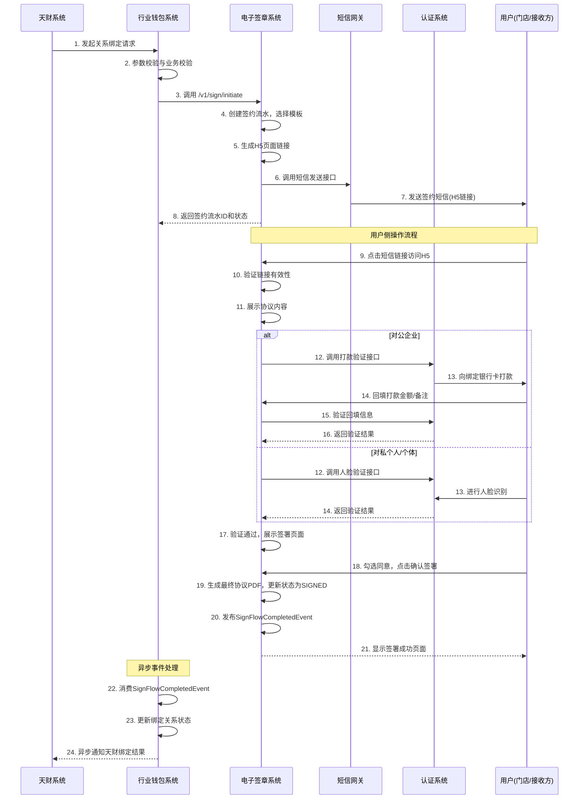
```mermaid
sequenceDiagram
    participant A as 天财系统
    participant W as 行业钱包系统
    participant E as 电子签章系统
    participant S as 短信网关
    participant C as 认证系统
    participant U as 用户(门店/接收方)

    A->>W: 1. 发起关系绑定请求
    W->>W: 2. 参数校验与业务校验
    W->>E: 3. 调用 /v1/sign/initiate
    E->>E: 4. 创建签约流水，选择模板
    E->>E: 5. 生成H5页面链接
    E->>S: 6. 调用短信发送接口
    S->>U: 7. 发送签约短信(H5链接)
    E-->>W: 8. 返回签约流水ID和状态
    
    Note over U,E: 用户侧操作流程
    U->>E: 9. 点击短信链接访问H5
    E->>E: 10. 验证链接有效性
    E->>E: 11. 展示协议内容
    
    alt 对公企业
        E->>C: 12. 调用打款验证接口
        C->>U: 13. 向绑定银行卡打款
        U->>E: 14. 回填打款金额/备注
        E->>C: 15. 验证回填信息
        C-->>E: 16. 返回验证结果
    else 对私个人/个体
        E->>C: 12. 调用人脸验证接口
        U->>C: 13. 进行人脸识别
        C-->>E: 14. 返回验证结果
    end
    
    E->>E: 17. 验证通过，展示签署页面
    U->>E: 18. 勾选同意，点击确认签署
    E->>E: 19. 生成最终协议PDF，更新状态为SIGNED
    E->>E: 20. 发布SignFlowCompletedEvent
    E-->>U: 21. 显示签署成功页面
    
    Note over W: 异步事件处理
    W->>W: 22. 消费SignFlowCompletedEvent
    W->>W: 23. 更新绑定关系状态
    W-->>A: 24. 异步通知天财绑定结果
```

### 5.2 开通付款时序图（简化版）

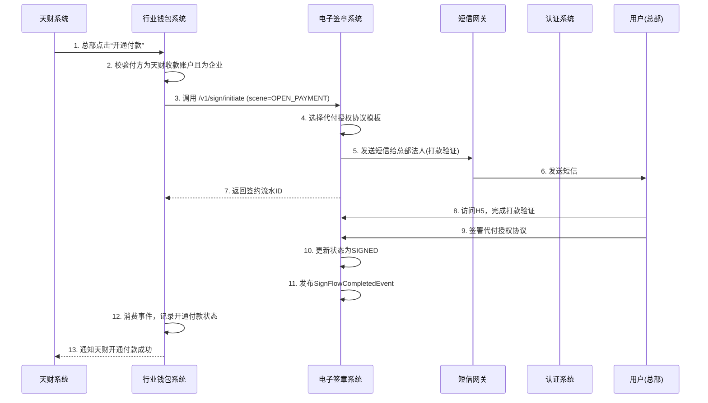
```mermaid
sequenceDiagram
    participant A as 天财系统
    participant W as 行业钱包系统
    participant E as 电子签章系统
    participant S as 短信网关
    participant C as 认证系统
    participant U as 用户(总部)

    A->>W: 1. 总部点击“开通付款”
    W->>W: 2. 校验付方为天财收款账户且为企业
    W->>E: 3. 调用 /v1/sign/initiate (scene=OPEN_PAYMENT)
    E->>E: 4. 选择代付授权协议模板
    E->>S: 5. 发送短信给总部法人(打款验证)
    S->>U: 6. 发送短信
    E-->>W: 7. 返回签约流水ID
    
    U->>E: 8. 访问H5，完成打款验证
    U->>E: 9. 签署代付授权协议
    E->>E: 10. 更新状态为SIGNED
    E->>E: 11. 发布SignFlowCompletedEvent
    
    W->>W: 12. 消费事件，记录开通付款状态
    W-->>A: 13. 通知天财开通付款成功
```

## 6. 错误处理

### 6.1 预期错误及HTTP状态码

| 错误码 | HTTP状态码 | 描述 | 处理建议 |
|--------|------------|------|----------|
| `PARAM_INVALID` | 400 | 请求参数无效或缺失 | 检查请求参数格式和必填项 |
| `SCENE_NOT_SUPPORTED` | 400 | 不支持的业务场景 | 检查scene枚举值 |
| `TEMPLATE_NOT_FOUND` | 500 | 未找到合适的协议模板 | 检查模板配置，确保对应场景有启用模板 |
| `SIGN_FLOW_EXISTS` | 409 | 相同request_id的签约流程已存在 | 使用已存在的签约流水，或更换request_id |
| `SIGN_FLOW_EXPIRED` | 410 | 签约流程已过期 | 重新发起签约请求 |
| `AUTH_FAILED` | 403 | 身份认证失败 | 提示用户认证失败原因，允许重试（有限次数） |
| `SMS_SEND_FAILED` | 500 | 短信发送失败 | 记录日志，告警，可自动重试或人工处理 |
| `CALLBACK_FAILED` | 500 | 回调行业钱包失败 | 记录日志，通过事件补偿机制确保状态同步 |
| `SYSTEM_ERROR` | 500 | 系统内部错误 | 记录详细日志，告警，人工介入 |

### 6.2 重试与补偿机制
1. **短信发送重试**：首次失败后，最多重试2次，间隔1分钟。
2. **认证系统调用重试**：网络超时等临时故障，最多重试3次。
3. **回调补偿**：如果回调行业钱包失败，除了记录日志外，还依赖行业钱包消费`SignFlowCompletedEvent`事件作为补偿机制。
4. **定时任务补偿**：
   - 定期扫描状态为`SMS_SENT`但已过期的签约流水，自动更新为`EXPIRED`。
   - 定期扫描状态为`AUTH_PENDING`但长时间无进展的流水，发送提醒或自动置为失败。

### 6.3 监控与告警
- **关键指标监控**：
  - 签约成功率、失败率、各场景分布。
  - 短信发送成功率、到达率。
  - 认证通过率、平均认证耗时。
  - H5页面访问PV/UV，转化率。
- **错误告警**：
  - 连续短信发送失败超过阈值。
  - 认证系统调用失败率升高。
  - 签约流程失败率异常升高。

## 7. 依赖说明

### 7.1 上游依赖

#### 7.1.1 行业钱包系统
- **交互方式**：同步API调用 (`/v1/sign/initiate`)
- **依赖职责**：
  - 提供完整的签约请求参数，包括付方、收方、发起方信息。
  - 完成必要的业务校验（如付方与发起方一致性、是否已开通付款等）。
  - 提供回调URL用于异步通知签约结果。
- **SLA要求**：接口响应时间P99 < 2s，可用性 > 99.9%。

#### 7.1.2 天财系统（间接）
- **交互方式**：通过行业钱包系统间接交互
- **依赖职责**：
  - 提供正确的业务场景和资金用途信息。
  - 确保发起的签约请求符合业务规则。

### 7.2 下游依赖

#### 7.2.1 认证系统
- **交互方式**：同步API调用
- **提供能力**：
  - 打款验证：发起小额打款、验证回填信息。
  - 人脸验证：发起人脸识别、验证身份信息。
- **SLA要求**：接口响应时间P99 < 3s，可用性 > 99.5%。

#### 7.2.2 短信网关
- **交互方式**：同步API调用
- **提供能力**：发送签约通知短信。
- **SLA要求**：接口响应时间P99 < 1s，到达率 > 95%。

#### 7.2.3 对象存储服务 (OSS)
- **交互方式**：SDK调用
- **提供能力**：存储协议PDF、H5页面静态资源。
- **SLA要求**：读写可用性 > 99.9%，持久性 > 99.9999999%。

#### 7.2.4 消息中间件
- **交互方式**：SDK调用
- **提供能力**：发布`SignFlowCompletedEvent`事件。
- **SLA要求**：消息投递可靠性 > 99.9%。

### 7.3 容错与降级策略
1. **认证系统降级**：如果认证系统不可用，签约流程无法进行，应明确提示用户“系统维护中，请稍后重试”。
2. **短信网关降级**：如果短信发送失败，可记录日志并告警，但签约流程无法继续（无替代方案）。
3. **OSS降级**：如果OSS不可用，可将协议内容临时存储在数据库（仅限文本），但PDF生成功能受影响。
4. **异步事件补偿**：如果消息中间件不可用，可先将事件持久化到本地数据库，通过定时任务重试发送。

**文档版本**: 1.0  
**最后更新**: 2024-05-20  
**评审人**: 架构评审委员会、合规部、法务部

## 3.3 认证系统


# 认证系统模块设计文档

## 1. 概述

### 1.1 目的
认证系统模块旨在为“天财分账”业务提供统一、安全、可审计的身份验证服务。核心职责是执行两种关键的身份认证方式：**小额打款验证**和**人脸验证**，以确保分账业务中资金付方与收方关系的真实性与合法性，满足法务合规要求。本模块作为底层能力提供方，被电子签章系统调用，是关系绑定流程中的关键一环。

### 1.2 范围
- **核心功能**：
    1.  **打款验证**：向指定银行卡发起小额随机打款，并验证用户回填的金额与备注信息。
    2.  **人脸验证**：调用第三方人脸识别服务，验证个人或个体工商户的姓名、身份证号与人脸生物特征是否一致。
- **服务对象**：主要为电子签章系统，在关系绑定流程中调用。
- **数据管理**：记录并管理每次验证请求的流水、状态、验证要素及结果，为电子签章平台提供全证据链数据支持。
- **不包含**：协议生成、短信发送、H5页面封装、业务规则校验（如商户一致性校验）。这些职责由电子签章系统或行业钱包系统承担。

## 2. 接口设计

### 2.1 API端点 (RESTful)

#### 2.1.1 发起打款验证
- **端点**：`POST /api/v1/auth/remittance/initiate`
- **描述**：接收验证请求，向指定银行卡发起一笔小额随机金额的打款。
- **请求头**：`Content-Type: application/json`
- **请求体**：
    ```json
    {
        "requestId": "REQ_202310270001", // 唯一请求流水号，由调用方（电子签章）生成
        "businessType": "TIANCAI_SPLIT_ACCOUNT", // 业务类型，固定值
        "authScene": "BINDING_RELATION", // 认证场景：BINDING_RELATION（关系绑定）
        "targetType": "CORPORATE", // 验证对象类型：CORPORATE（企业）/INDIVIDUAL（个人）
        "bankCardInfo": {
            "accountName": "北京某某科技有限公司",
            "accountNo": "6228480012345678901",
            "bankCode": "ICBC"
        },
        "callbackUrl": "https://esign.example.com/callback", // 验证结果回调地址
        "extInfo": { // 扩展信息，用于关联业务
            "merchantNo": "888000000001",
            "accountNo": "TC_RCV_ACC_001",
            "relationType": "HEADQUARTERS_TO_STORE" // HEADQUARTERS_TO_STORE, HEADQUARTERS_TO_RECEIVER, STORE_TO_HEADQUARTERS
        }
    }
    ```
- **响应体** (成功)：
    ```json
    {
        "code": "SUCCESS",
        "message": "打款指令已受理",
        "data": {
            "authId": "AUTH_RMT_202310270001", // 认证系统生成的唯一流水号
            "requestId": "REQ_202310270001",
            "status": "PENDING", // 状态：PENDING（待回填）
            "expireTime": "2023-10-27 15:30:00" // 回填截止时间
        }
    }
    ```

#### 2.1.2 验证打款回填信息
- **端点**：`POST /api/v1/auth/remittance/verify`
- **描述**：验证用户回填的小额打款金额和备注。
- **请求体**：
    ```json
    {
        "authId": "AUTH_RMT_202310270001",
        "filledAmount": "0.23", // 用户回填金额
        "filledRemark": "529874" // 用户回填备注（6位数字或2汉字）
    }
    ```
- **响应体** (成功)：
    ```json
    {
        "code": "SUCCESS",
        "message": "验证成功",
        "data": {
            "authId": "AUTH_RMT_202310270001",
            "status": "SUCCESS",
            "verifyTime": "2023-10-27 14:25:30"
        }
    }
    ```

#### 2.1.3 发起人脸验证
- **端点**：`POST /api/v1/auth/face/verify`
- **描述**：提交用户信息与人脸图像/视频，进行活体检测与身份核验。
- **请求体**：
    ```json
    {
        "requestId": "REQ_202310270002",
        "businessType": "TIANCAI_SPLIT_ACCOUNT",
        "authScene": "BINDING_RELATION",
        "targetType": "INDIVIDUAL", // INDIVIDUAL（个人/个体户）
        "identityInfo": {
            "name": "张三",
            "idCardNo": "110101199003071234"
        },
        "faceData": {
            "type": "IMAGE_BASE64", // IMAGE_BASE64 / VIDEO_URL / LIVENESS_DATA
            "content": "/9j/4AAQSkZJRgABAQEAYABgAAD/2wBDAA..." // Base64编码的图片或视频URL
        },
        "livenessCheck": true, // 是否进行活体检测
        "callbackUrl": "https://esign.example.com/callback",
        "extInfo": {
            "merchantNo": "888000000002",
            "accountNo": "TC_RCV_ACC_002"
        }
    }
    ```
- **响应体** (成功)：
    ```json
    {
        "code": "SUCCESS",
        "message": "人脸验证请求已受理",
        "data": {
            "authId": "AUTH_FACE_202310270001",
            "requestId": "REQ_202310270002",
            "status": "PROCESSING"
        }
    }
    ```
    *注：由于人脸识别可能涉及异步处理，首次响应可能只表示请求受理。最终结果通过回调通知。*

#### 2.1.4 查询认证结果
- **端点**：`GET /api/v1/auth/result/{authId}`
- **描述**：根据认证流水号查询最终的认证结果。
- **响应体**：
    ```json
    {
        "code": "SUCCESS",
        "message": "查询成功",
        "data": {
            "authId": "AUTH_RMT_202310270001",
            "requestId": "REQ_202310270001",
            "authType": "REMITTANCE",
            "targetType": "CORPORATE",
            "status": "SUCCESS", // SUCCESS, FAILED, EXPIRED, PENDING
            "initiateTime": "2023-10-27 14:00:00",
            "verifyTime": "2023-10-27 14:25:30",
            "failureReason": "", // 失败原因，如“回填金额不符”
            "extInfo": { ... } // 请求时的扩展信息
        }
    }
    ```

### 2.2 发布/消费的事件

#### 2.2.1 消费的事件
- **账户系统事件**：`BankCardBoundEvent`（银行卡绑定事件）。当账户系统为天财接收方账户绑定或更新默认银行卡时，认证系统可监听此事件，以获取最新、准确的银行卡信息，确保打款验证的准确性。

#### 2.2.2 发布的事件
- **认证完成事件**：`AuthCompletedEvent`。当一笔认证（打款或人脸）最终状态确定（成功/失败/过期）时发布，供电子签章系统或其他关心认证结果的系统订阅。
    ```json
    {
        "eventId": "EVT_AUTH_202310270001",
        "eventType": "AUTH_COMPLETED",
        "timestamp": "2023-10-27T14:25:30Z",
        "payload": {
            "authId": "AUTH_RMT_202310270001",
            "requestId": "REQ_202310270001",
            "authType": "REMITTANCE",
            "status": "SUCCESS",
            "targetType": "CORPORATE",
            "extInfo": { ... }
        }
    }
    ```

## 3. 数据模型

### 3.1 数据库表设计

#### 表：`auth_request` (认证请求主表)
| 字段名 | 类型 | 必填 | 默认值 | 描述 |
| :--- | :--- | :--- | :--- | :--- |
| `id` | bigint(20) | Y | AUTO_INCREMENT | 主键 |
| `auth_id` | varchar(32) | Y | | **业务唯一流水号**，格式：`AUTH_{TYPE}_{日期}_{序列}` |
| `request_id` | varchar(32) | Y | | 调用方请求流水号 |
| `auth_type` | varchar(20) | Y | | 认证类型：`REMITTANCE`(打款), `FACE`(人脸) |
| `auth_scene` | varchar(50) | Y | | 认证场景：`BINDING_RELATION` |
| `business_type` | varchar(50) | Y | | 业务类型：`TIANCAI_SPLIT_ACCOUNT` |
| `target_type` | varchar(20) | Y | | 验证对象类型：`CORPORATE`, `INDIVIDUAL` |
| `status` | varchar(20) | Y | `INIT` | 状态：`INIT`, `PENDING`, `PROCESSING`, `SUCCESS`, `FAILED`, `EXPIRED` |
| `callback_url` | varchar(512) | Y | | 结果回调地址 |
| `ext_info` | json | N | | 扩展信息，存储请求中的extInfo |
| `create_time` | datetime | Y | CURRENT_TIMESTAMP | 创建时间 |
| `update_time` | datetime | Y | CURRENT_TIMESTAMP ON UPDATE | 更新时间 |
| **索引** | | | | |
| `uk_auth_id` | UNIQUE (`auth_id`) | | | |
| `idx_request_id` | INDEX (`request_id`) | | | |
| `idx_status_createtime` | INDEX (`status`, `create_time`) | | | 用于清理过期任务 |

#### 表：`auth_remittance_detail` (打款验证详情表)
| 字段名 | 类型 | 必填 | 默认值 | 描述 |
| :--- | :--- | :--- | :--- | :--- |
| `id` | bigint(20) | Y | AUTO_INCREMENT | 主键 |
| `auth_id` | varchar(32) | Y | | 关联`auth_request.auth_id` |
| `bank_account_name` | varchar(100) | Y | | 银行卡户名 |
| `bank_account_no` | varchar(32) | Y | | 银行卡号（加密存储） |
| `bank_code` | varchar(20) | Y | | 银行编码 |
| `remit_amount` | decimal(10,2) | Y | | **系统打出的随机金额** |
| `remit_remark` | varchar(10) | Y | | **系统生成的随机备注**（6位数字或2汉字） |
| `filled_amount` | decimal(10,2) | N | | 用户回填金额 |
| `filled_remark` | varchar(10) | N | | 用户回填备注 |
| `remit_order_no` | varchar(64) | N | | 打款通道订单号，关联账务核心 |
| `remit_status` | varchar(20) | Y | `INIT` | 打款状态：`INIT`, `SUCCESS`, `FAILED` |
| `expire_time` | datetime | Y | | 回填截止时间（创建时间+24小时） |
| `verify_time` | datetime | N | | 验证时间 |
| `failure_reason` | varchar(200) | N | | 失败原因 |
| **索引** | | | | |
| `uk_auth_id` | UNIQUE (`auth_id`) | | | |
| `idx_expire_time` | INDEX (`expire_time`) | | | 用于过期处理 |

#### 表：`auth_face_detail` (人脸验证详情表)
| 字段名 | 类型 | 必填 | 默认值 | 描述 |
| :--- | :--- | :--- | :--- | :--- |
| `id` | bigint(20) | Y | AUTO_INCREMENT | 主键 |
| `auth_id` | varchar(32) | Y | | 关联`auth_request.auth_id` |
| `name` | varchar(50) | Y | | 姓名 |
| `id_card_no` | varchar(20) | Y | | 身份证号（加密存储） |
| `face_data_ref` | varchar(512) | N | | 人脸图像/视频存储引用（OSS路径或URL） |
| `liveness_score` | decimal(5,2) | N | | 活体检测分数 |
| `similarity_score` | decimal(5,2) | N | | 人脸比对相似度分数 |
| `thirdparty_request_id` | varchar(64) | N | | 第三方人脸服务请求ID |
| `thirdparty_response` | json | N | | 第三方服务原始响应 |
| `verify_time` | datetime | N | | 验证完成时间 |
| `failure_reason` | varchar(200) | N | | 失败原因 |
| **索引** | | | | |
| `uk_auth_id` | UNIQUE (`auth_id`) | | | |

### 3.2 与其他模块的关系
- **电子签章系统**：核心调用方。认证系统为其提供“验证”能力，电子签章系统负责整合协议、短信、H5页面，并调用本系统完成认证环节。
- **账户系统**：数据依赖方。打款验证需要准确的银行卡信息，这些信息来源于账户系统维护的“天财接收方账户”绑定的默认银行卡。
- **账务核心系统**：协作方。发起小额打款时，需要调用账务核心的付款接口完成出款记账。
- **行业钱包系统**：间接关联方。行业钱包发起关系绑定流程，触发电子签章调用本系统。本系统发布的认证结果事件可供行业钱包订阅，用于更新绑定关系状态。

## 4. 业务逻辑

### 4.1 核心算法

#### 4.1.1 打款验证随机数生成
- **随机金额**：生成一个在 `[0.01, 0.99]` 元范围内的随机金额，精确到分。算法需保证在并发下的唯一性与随机性。
- **随机备注**：
    - **数字模式**：生成6位纯数字随机字符串。
    - **汉字模式**：从一个预定义的常用汉字库中随机选取2个汉字。
    - 模式选择可根据配置或请求参数决定，天财场景可能固定使用数字模式。

#### 4.1.2 人脸验证流程
1.  **活体检测**：如果请求要求活体检测(`livenessCheck=true`)，优先对传入的`faceData`进行活体判断，防止照片、视频攻击。未通过则直接失败。
2.  **特征提取与比对**：调用第三方人脸识别服务（如阿里云、腾讯云），将待验证人脸特征与公安库或传入的身份证信息进行比对。
3.  **结果判定**：综合`liveness_score`（需大于阈值，如0.9）和`similarity_score`（需大于阈值，如0.8）判断最终结果。

### 4.2 业务规则与验证逻辑

#### 4.2.1 打款验证流程规则
1.  **接收请求**：从电子签章系统接收`initiate`请求。
2.  **参数校验**：检查必要参数，`bankCardInfo`中的卡号、户名需通过基础格式校验。
3.  **生成验证要素**：调用随机数生成算法，产生`remit_amount`和`remit_remark`。
4.  **发起打款**：
    - 调用**账务核心系统**的付款接口，向`bankCardInfo`指定卡号打款`remit_amount`元，备注为`remit_remark`。
    - 记录`remit_order_no`，更新`remit_status`为`PROCESSING`。
5.  **等待回填**：打款成功后，状态变为`PENDING`，等待用户回填。
6.  **验证回填**：
    - 用户通过H5页面回填后，电子签章调用`verify`接口。
    - **验证逻辑**：严格比对 `filledAmount` 是否等于 `remit_amount`，且 `filledRemark` 是否等于 `remit_remark`。
    - **容错考虑**：金额比较需考虑浮点数精度，应转换为`BigDecimal`进行等值比较。备注区分大小写。
7.  **结果处理**：验证成功则状态为`SUCCESS`，失败则为`FAILED`并记录原因。无论成功失败，均通过`callbackUrl`通知电子签章系统。

#### 4.2.2 人脸验证流程规则
1.  **接收请求**：接收电子签章系统的`verify`请求。
2.  **参数校验**：校验`identityInfo`和`faceData`的合法性。
3.  **调用第三方服务**：封装请求参数，调用选定的人脸识别服务商API。
4.  **处理异步响应**：部分服务为异步，需处理回调或轮询获取结果。
5.  **结果解析与判定**：根据4.1.2的算法判定最终结果。
6.  **回调通知**：将最终结果（`SUCCESS`/`FAILED`）回调至`callbackUrl`。

#### 4.2.3 通用规则
- **幂等性**：所有接口需支持幂等，基于`requestId`或`authId`防止重复处理。
- **有效期**：打款验证回填有效期通常为24小时，超时后状态自动变更为`EXPIRED`。
- **安全**：银行卡号、身份证号等敏感信息在数据库中加密存储。人脸原始数据不落本地库，仅存储于安全的对象存储中。

## 5. 时序图

### 5.1 打款验证时序图 (以批量付款场景为例)

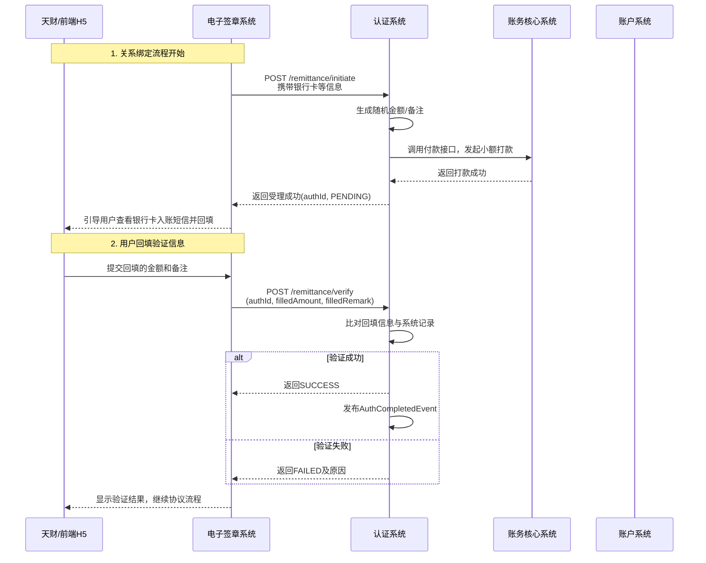
```mermaid
sequenceDiagram
    participant A as 天财/前端H5
    participant B as 电子签章系统
    participant C as 认证系统
    participant D as 账务核心系统
    participant E as 账户系统

    Note over A,B: 1. 关系绑定流程开始
    B->>C: POST /remittance/initiate<br/>携带银行卡等信息
    C->>C: 生成随机金额/备注
    C->>D: 调用付款接口，发起小额打款
    D-->>C: 返回打款成功
    C-->>B: 返回受理成功(authId, PENDING)
    B-->>A: 引导用户查看银行卡入账短信并回填

    Note over A,B: 2. 用户回填验证信息
    A->>B: 提交回填的金额和备注
    B->>C: POST /remittance/verify<br/>(authId, filledAmount, filledRemark)
    C->>C: 比对回填信息与系统记录
    alt 验证成功
        C-->>B: 返回SUCCESS
        C->>C: 发布AuthCompletedEvent
    else 验证失败
        C-->>B: 返回FAILED及原因
    end
    B-->>A: 显示验证结果，继续协议流程
```

### 5.2 人脸验证时序图

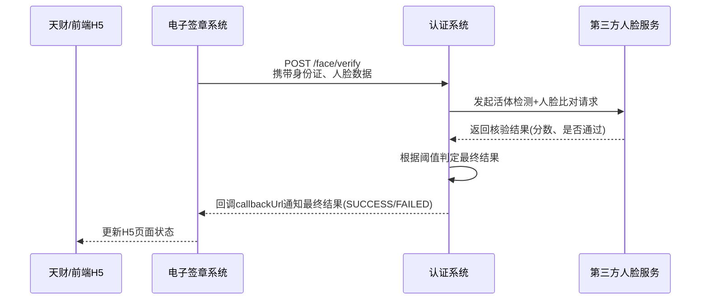
```mermaid
sequenceDiagram
    participant A as 天财/前端H5
    participant B as 电子签章系统
    participant C as 认证系统
    participant D as 第三方人脸服务

    B->>C: POST /face/verify<br/>携带身份证、人脸数据
    C->>D: 发起活体检测+人脸比对请求
    D-->>C: 返回核验结果(分数、是否通过)
    C->>C: 根据阈值判定最终结果
    C-->>B: 回调callbackUrl通知最终结果(SUCCESS/FAILED)
    B-->>A: 更新H5页面状态
```

## 6. 错误处理

| 错误场景 | 错误码 | HTTP状态码 | 处理策略 |
| :--- | :--- | :--- | :--- |
| 请求参数缺失或格式错误 | `PARAM_INVALID` | 400 | 返回具体字段错误信息，请求方修正后重试。 |
| 重复的请求ID (`requestId`) | `REQUEST_DUPLICATED` | 409 | 返回首次请求已受理的结果，保证幂等性。 |
| 银行卡信息无效（如卡号不存在） | `BANK_CARD_INVALID` | 400 | 记录失败原因，通知调用方检查账户系统数据。 |
| 小额打款失败（如账户余额不足） | `REMITTANCE_FAILED` | 500 | 更新`remit_status`为`FAILED`，通知调用方，建议用户重试或更换验证方式。 |
| 验证信息不匹配 | `VERIFICATION_MISMATCH` | 200 (业务失败) | 更新状态为`FAILED`，记录`failure_reason`。可配置允许重试次数。 |
| 认证记录已过期 | `AUTH_EXPIRED` | 410 | 不允许再验证，需重新发起整个认证流程。 |
| 第三方人脸服务异常 | `THIRDPARTY_SERVICE_ERROR` | 502 | 记录日志，告警，返回系统繁忙，建议稍后重试。 |
| 系统内部错误（DB、网络） | `INTERNAL_ERROR` | 500 | 记录详细日志，触发告警，返回通用错误信息。 |

**通用策略**：
- 所有错误均有明确的业务错误码和用户/调用方可理解的信息。
- 涉及资金的操作（如打款）必须有完备的核对与冲正机制。
- 设置异步任务（如Job）定期扫描`PENDING`超时的记录，自动更新为`EXPIRED`。

## 7. 依赖说明

### 7.1 上游依赖
1.  **电子签章系统**：
    - **交互方式**：同步HTTP API调用（发起验证、查询结果） + 异步事件回调/发布。
    - **职责**：电子签章系统是本模块的主要驱动者，负责组装业务上下文（如商户信息、场景），并在适当时机调用本模块。本模块需确保接口稳定、响应及时。

2.  **账户系统**：
    - **交互方式**：异步事件订阅 (`BankCardBoundEvent`)。
    - **职责**：提供准确的、最新的银行卡信息。本模块在发起打款验证前，应确保所使用的银行卡信息是最新绑定的，避免向旧卡打款。

3.  **账务核心系统**：
    - **交互方式**：同步HTTP API调用。
    - **职责**：提供小额付款能力，并返回付款流水号。本模块需处理付款可能失败的各种情况。

4.  **第三方人脸识别服务**：
    - **交互方式**：同步/异步HTTP API调用。
    - **职责**：提供专业的活体检测与人脸比对能力。本模块需封装不同服务商的差异，提供统一接口，并处理网络超时、服务不可用等异常。

### 7.2 下游依赖
1.  **行业钱包系统**：
    - **交互方式**：异步事件发布 (`AuthCompletedEvent`)。
    - **职责**：订阅认证结果事件，用于更新“关系绑定”流程的状态，或作为后续分账交易的校验依据之一。

### 7.3 依赖管理
- **强依赖**：账务核心、第三方人脸服务。这些服务不可用将导致核心功能失效。需要实现**熔断、降级和重试机制**。例如，人脸服务不可用时，可考虑降级为仅提示或引导用户使用打款验证（如果业务允许）。
- **弱依赖**：账户系统的事件。即使事件暂时丢失，也可以通过查询接口获取最新银行卡信息，或由电子签章系统在请求中传递准确的卡信息。
- **配置中心**：依赖配置中心管理第三方服务的端点、密钥、阈值（如人脸比对分数）等。
- **监控与告警**：对所有外部依赖的调用成功率、耗时进行监控，设置阈值告警。

## 3.4 计费中台


# 计费中台模块设计文档

## 1. 概述

### 1.1 目的
计费中台模块是“天财分账”业务的核心计费引擎，负责根据预先配置的规则，计算天财专用账户之间进行分账（转账）交易时产生的手续费。其核心目标是提供**实时、准确、可配置**的计费能力，确保手续费计算与业务规则、账户类型、场景完全匹配，并将计费结果同步至清结算系统执行扣费。

### 1.2 范围
本模块的职责范围包括：
- **费率配置管理**：接收并存储来自三代系统的计费规则配置。
- **实时计费计算**：在分账交易执行前，根据交易要素（场景、付方、收方、金额等）实时计算应收手续费。
- **计费结果同步**：将计算出的手续费明细（金额、承担方等）同步至清结算系统，作为资金划扣的依据。
- **一致性保障**：确保自身存储的费率信息与三代配置源、清结算执行端保持强一致性，避免因信息不同步导致的资损或客诉。
- **为对账单提供数据**：记录计费流水，为对账单系统提供手续费明细数据。

**边界说明**：
- **不负责**：费率的业务规则定义与商户界面配置（由三代负责）。
- **不负责**：手续费的实际资金扣划与记账（由清结算与账户系统负责）。
- **不负责**：分账交易本身的业务校验与执行（由行业钱包负责）。

## 2. 接口设计

### 2.1 API端点 (RESTful)

#### 2.1.1 计费计算接口
- **端点**: `POST /api/v1/fee/calculate`
- **描述**: 行业钱包在分账交易执行前调用此接口，计算该笔交易的手续费。
- **请求头**:
    - `X-Request-ID`: 请求唯一标识，用于全链路追踪。
    - `Content-Type: application/json`
- **请求体**:
```json
{
  "requestId": "req_1234567890", // 请求流水号，全局唯一
  "scene": "COLLECTION", // 业务场景: COLLECTION-归集, BATCH_PAY-批量付款, MEMBER_SETTLEMENT-会员结算
  "payerMerchantNo": "M100001", // 付方商户号
  "payerAccountNo": "ACCT_TIANCAI_PAY_001", // 付方账户号 (天财收款账户)
  "payerAccountType": "TIANCAI_PAYEE_ACCOUNT", // 付方账户类型
  "payeeMerchantNo": "M100002", // 收方商户号 (可为空，如接收方无商户号)
  "payeeAccountNo": "ACCT_TIANCAI_RCV_001", // 收方账户号
  "payeeAccountType": "TIANCAI_RECEIVER_ACCOUNT", // 收方账户类型: TIANCAI_PAYEE_ACCOUNT, TIANCAI_RECEIVER_ACCOUNT
  "transferAmount": 10000, // 分账金额，单位：分
  "feeBearer": "PAYER", // 手续费承担方: PAYER-付方承担, PAYEE-收方承担。由天财接口传入。
  "transactionTime": "2023-10-01T10:00:00Z" // 交易时间，用于匹配生效的费率
}
```
- **响应体 (成功)**:
```json
{
  "code": "SUCCESS",
  "message": "成功",
  "data": {
    "requestId": "req_1234567890",
    "feeCalculationId": "FEE_CAL_202310011000001", // 计费流水ID
    "totalFee": 30, // 计算出的总手续费，单位：分
    "feeDetails": [
      {
        "feeItem": "TRANSFER_FEE", // 费用项
        "calculateMode": "RATIO", // 计费模式: RATIO-比例, FIXED-固定金额
        "calculateBasis": 10000, // 计费基数 (流水金额)，单位：分
        "rate": 0.003, // 费率 (当模式为RATIO时有效)
        "fixedAmount": null, // 固定金额 (当模式为FIXED时有效)
        "calculatedAmount": 30 // 计算出的该费用项金额，单位：分
      }
    ],
    "feeBearer": "PAYER", // 手续费承担方
    "netAmount": 9970, // 净额 (当到账模式为净额转账时，收方实际到账金额)
    "arrivalMode": "NET", // 到账模式: NET-净额转账, FULL-全额转账
    "effectiveFeeRuleId": "RULE_20230901_001" // 生效的计费规则ID
  }
}
```
- **响应体 (失败)**:
```json
{
  "code": "FEE_RULE_NOT_FOUND",
  "message": "未找到适用的计费规则",
  "data": null
}
```

#### 2.1.2 费率配置同步接口 (供三代调用)
- **端点**: `POST /api/v1/fee/rules/sync`
- **描述**: 三代系统在商户配置或修改天财分账手续费规则后，调用此接口同步至计费中台。
- **请求体**:
```json
{
  "operation": "UPSERT", // 操作类型: UPSERT-新增或更新, INVALIDATE-失效
  "ruleId": "RULE_20230901_001", // 规则ID，三代生成，全局唯一
  "ruleData": {
    "payerMerchantNo": "M100001", // 付方商户号 (维度)
    "payerAccountNo": "ACCT_TIANCAI_PAY_001", // 付方账户号 (维度)
    "businessType": "TIANCAI_TRANSFER", // 业务类型: TIANCAI_TRANSFER (固定)
    "payeeAccountType": "TIANCAI_RECEIVER_ACCOUNT", // 收方账户类型 (维度)
    "scene": "BATCH_PAY", // 适用场景 (维度，可多个，逗号分隔)
    "feeCalculateMode": "RATIO", // 计费模式: RATIO, FIXED
    "feeRate": 0.003, // 费率 (当模式为RATIO时)
    "fixedFeeAmount": null, // 固定费用 (当模式为FIXED时)，单位：分
    "calculateRange": "FULL_AMOUNT", // 计费范围: FULL_AMOUNT-按流水金额计费
    "arrivalMode": "NET", // 到账模式: NET, FULL
    "effectiveTime": "2023-09-01T00:00:00Z", // 生效时间
    "invalidTime": "2099-12-31T23:59:59Z", // 失效时间
    "creator": "admin@lkl" // 操作人
  }
}
```
- **响应体**:
```json
{
  "code": "SUCCESS",
  "message": "同步成功",
  "data": {
    "ruleId": "RULE_20230901_001",
    "version": 2 // 规则版本号，用于乐观锁控制
  }
}
```

### 2.2 发布/消费的事件

#### 2.2.1 消费的事件
- **FeeRuleSyncedEvent**: 监听来自三代的费率配置变更消息，触发本地规则缓存更新。
    - 来源: 三代系统 (消息队列)
    - 载荷: 同`费率配置同步接口`的请求体。

#### 2.2.2 发布的事件
- **FeeCalculatedEvent**: 当一笔分账交易计费成功时发布，供清结算系统订阅并执行资金处理。
    - 目的地: 清结算系统 (消息队列)
    - 载荷:
    ```json
    {
      "eventId": "event_fee_123456",
      "type": "FEE_CALCULATED",
      "timestamp": "2023-10-01T10:00:05Z",
      "data": {
        "feeCalculationId": "FEE_CAL_202310011000001",
        "originalRequestId": "req_1234567890",
        "scene": "BATCH_PAY",
        "payerAccountNo": "ACCT_TIANCAI_PAY_001",
        "payeeAccountNo": "ACCT_TIANCAI_RCV_001",
        "transferAmount": 10000,
        "totalFee": 30,
        "feeBearer": "PAYER",
        "arrivalMode": "NET",
        "transactionTime": "2023-10-01T10:00:00Z"
      }
    }
    ```

## 3. 数据模型

### 3.1 核心数据库表设计

#### 表: `fee_rule` (计费规则表)
存储从三代同步的计费规则。
```sql
CREATE TABLE `fee_rule` (
  `id` bigint(20) NOT NULL AUTO_INCREMENT COMMENT '自增主键',
  `rule_id` varchar(64) NOT NULL COMMENT '规则业务ID，三代生成，唯一',
  `version` int(11) NOT NULL DEFAULT '1' COMMENT '版本号，用于乐观锁',
  `payer_merchant_no` varchar(32) NOT NULL COMMENT '付方商户号',
  `payer_account_no` varchar(64) DEFAULT NULL COMMENT '付方账户号',
  `business_type` varchar(32) NOT NULL DEFAULT 'TIANCAI_TRANSFER' COMMENT '业务类型',
  `payee_account_type` varchar(32) NOT NULL COMMENT '收方账户类型',
  `scene` varchar(512) NOT NULL COMMENT '适用场景，多个用逗号分隔',
  `fee_calculate_mode` varchar(16) NOT NULL COMMENT '计费模式: RATIO, FIXED',
  `fee_rate` decimal(10,6) DEFAULT NULL COMMENT '费率(比例)，当模式为RATIO时有效',
  `fixed_fee_amount` bigint(20) DEFAULT NULL COMMENT '固定费用(分)，当模式为FIXED时有效',
  `calculate_range` varchar(32) NOT NULL DEFAULT 'FULL_AMOUNT' COMMENT '计费范围',
  `arrival_mode` varchar(16) NOT NULL COMMENT '到账模式: NET, FULL',
  `effective_time` datetime NOT NULL COMMENT '生效时间',
  `invalid_time` datetime NOT NULL COMMENT '失效时间',
  `status` varchar(16) NOT NULL DEFAULT 'ACTIVE' COMMENT '状态: ACTIVE, INACTIVE',
  `creator` varchar(64) DEFAULT NULL COMMENT '创建人',
  `create_time` datetime NOT NULL DEFAULT CURRENT_TIMESTAMP COMMENT '创建时间',
  `update_time` datetime NOT NULL DEFAULT CURRENT_TIMESTAMP ON UPDATE CURRENT_TIMESTAMP COMMENT '更新时间',
  PRIMARY KEY (`id`),
  UNIQUE KEY `uk_rule_id` (`rule_id`),
  KEY `idx_payer_merchant` (`payer_merchant_no`, `payer_account_no`, `payee_account_type`, `status`, `effective_time`, `invalid_time`),
  KEY `idx_effective` (`status`, `effective_time`, `invalid_time`)
) ENGINE=InnoDB DEFAULT CHARSET=utf8mb4 COMMENT='天财分账计费规则表';
```

#### 表: `fee_calculation_record` (计费流水表)
记录每一笔计费请求的详细过程和结果。
```sql
CREATE TABLE `fee_calculation_record` (
  `id` bigint(20) NOT NULL AUTO_INCREMENT COMMENT '自增主键',
  `fee_calculation_id` varchar(64) NOT NULL COMMENT '计费流水业务ID',
  `request_id` varchar(64) NOT NULL COMMENT '原始计费请求ID',
  `scene` varchar(32) NOT NULL COMMENT '业务场景',
  `payer_merchant_no` varchar(32) NOT NULL COMMENT '付方商户号',
  `payer_account_no` varchar(64) NOT NULL COMMENT '付方账户号',
  `payee_account_no` varchar(64) NOT NULL COMMENT '收方账户号',
  `payee_account_type` varchar(32) NOT NULL COMMENT '收方账户类型',
  `transfer_amount` bigint(20) NOT NULL COMMENT '分账金额(分)',
  `fee_bearer` varchar(16) NOT NULL COMMENT '手续费承担方',
  `effective_fee_rule_id` varchar(64) NOT NULL COMMENT '生效的计费规则ID',
  `total_fee` bigint(20) NOT NULL COMMENT '总手续费(分)',
  `arrival_mode` varchar(16) NOT NULL COMMENT '到账模式',
  `net_amount` bigint(20) DEFAULT NULL COMMENT '净额(分)',
  `calculation_detail` json NOT NULL COMMENT '计费明细(JSON，存储feeDetails)',
  `status` varchar(16) NOT NULL DEFAULT 'CALCULATED' COMMENT '状态: CALCULATED-已计算, SYNCED-已同步至清结算, FAILED-计费失败',
  `sync_remark` varchar(255) DEFAULT NULL COMMENT '同步备注或错误信息',
  `transaction_time` datetime NOT NULL COMMENT '交易时间',
  `create_time` datetime NOT NULL DEFAULT CURRENT_TIMESTAMP COMMENT '创建时间',
  `update_time` datetime NOT NULL DEFAULT CURRENT_TIMESTAMP ON UPDATE CURRENT_TIMESTAMP COMMENT '更新时间',
  PRIMARY KEY (`id`),
  UNIQUE KEY `uk_fee_calculation_id` (`fee_calculation_id`),
  UNIQUE KEY `uk_request_id` (`request_id`),
  KEY `idx_payer_account` (`payer_account_no`, `transaction_time`),
  KEY `idx_status` (`status`, `create_time`)
) ENGINE=InnoDB DEFAULT CHARSET=utf8mb4 COMMENT='天财分账计费流水表';
```

### 3.2 与其他模块的关系
- **三代系统**: 上游配置源。通过接口同步费率规则，是计费规则的权威来源。
- **行业钱包系统**: 上游调用方。在分账交易前调用计费接口，并依赖返回结果决定是否继续交易。
- **清结算系统**: 下游执行方。消费`FeeCalculatedEvent`，根据计费结果进行实际资金扣划和结算。
- **业务核心/对账单系统**: 下游数据消费方。计费流水作为手续费明细的数据源，被同步或查询以生成对账单。

## 4. 业务逻辑

### 4.1 核心算法：费率匹配与计算
1. **输入**: 计费请求 (`FeeCalculateRequest`)。
2. **匹配规则**:
    - 根据 `payerMerchantNo`, `payerAccountNo` (可选), `payeeAccountType`, `scene`, `transactionTime` 作为关键维度。
    - 查询 `fee_rule` 表，找到一条同时满足以下条件的 **唯一有效规则**：
        a. `payer_merchant_no` 匹配。
        b. `payer_account_no` 为NULL或与请求匹配。
        c. `payee_account_type` 匹配。
        d. `scene` 字段包含请求的场景。
        e. `status = 'ACTIVE'`。
        f. `transactionTime` 介于 `effective_time` 和 `invalid_time` 之间。
    - 如果找到多条，按 `payer_account_no` 非空优先、`create_time` 最新优先的规则选择。
3. **计算手续费**:
    - **比例模式 (`RATIO`)**:
        ```
        totalFee = round(transferAmount * feeRate)
        ```
        *注：采用四舍五入到分。*
    - **固定金额模式 (`FIXED`)**:
        ```
        totalFee = fixedFeeAmount
        ```
4. **计算净额**:
    - **净额到账 (`NET`)**:
        - 如果 `feeBearer = 'PAYER'`: `netAmount = transferAmount`
        - 如果 `feeBearer = 'PAYEE'`: `netAmount = transferAmount - totalFee`
    - **全额到账 (`FULL`)**:
        - `netAmount = transferAmount` (手续费额外向承担方收取)

### 4.2 业务规则
1. **唯一规则匹配**: 确保任意一笔交易在特定时间点只匹配一条有效计费规则，避免重复计费或计费冲突。
2. **实时性**: 计费计算必须实时完成，性能要求高（P99 < 50ms）。
3. **幂等性**: 基于 `requestId` 实现计费请求的幂等处理，避免重复计算。
4. **一致性保证**: 费率规则同步需保证最终一致性。在规则同步过程中，如有交易计费，采用**短时降级**策略（如使用上一次生效的规则），并记录告警。
5. **到账模式与承担方联动**: 根据需求，`arrivalMode` 和 `feeBearer` 的组合决定最终的资金流。需在返回结果中明确 `netAmount`。

### 4.3 验证逻辑
1. **请求参数校验**:
    - 必填字段非空。
    - `transferAmount` > 0。
    - `scene`, `feeBearer`, `payeeAccountType` 等枚举值有效。
    - `payerAccountType` 必须为 `TIANCAI_PAYEE_ACCOUNT`。
2. **规则存在性校验**: 如果未匹配到任何有效规则，立即返回明确错误 `FEE_RULE_NOT_FOUND`，阻止交易进行。
3. **计费结果合理性校验**: 计算出的 `totalFee` 不能大于 `transferAmount`（在收方承担场景下，需保证 `netAmount > 0`）。

## 5. 时序图

### 5.1 关键工作流：分账交易计费时序图

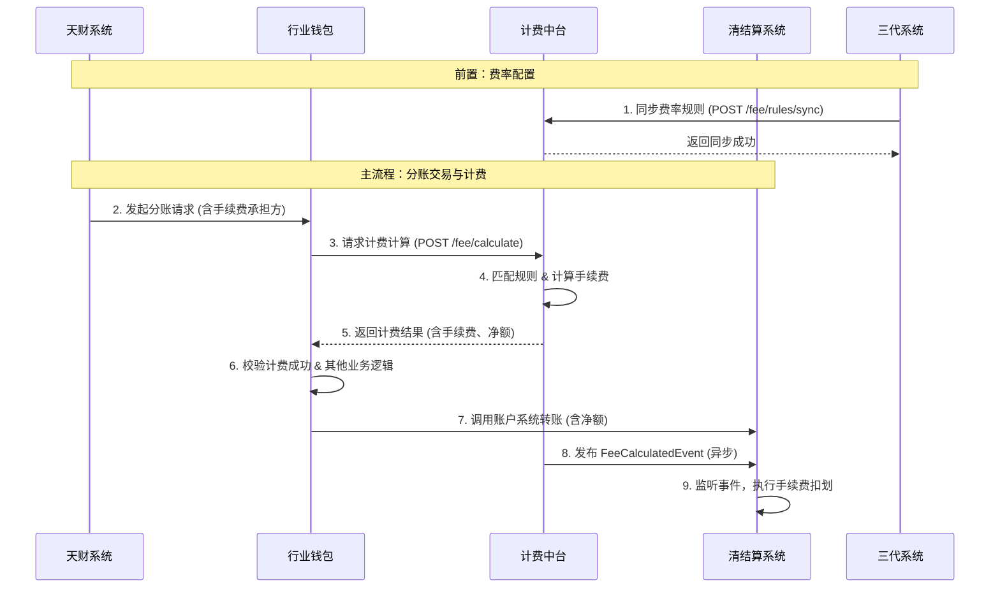
```mermaid
sequenceDiagram
    participant A as 天财系统
    participant W as 行业钱包
    participant F as 计费中台
    participant S as 清结算系统
    participant T as 三代系统

    Note over A, T: 前置：费率配置
    T->>F: 1. 同步费率规则 (POST /fee/rules/sync)
    F-->>T: 返回同步成功

    Note over A, S: 主流程：分账交易与计费
    A->>W: 2. 发起分账请求 (含手续费承担方)
    W->>F: 3. 请求计费计算 (POST /fee/calculate)
    F->>F: 4. 匹配规则 & 计算手续费
    F-->>W: 5. 返回计费结果 (含手续费、净额)
    W->>W: 6. 校验计费成功 & 其他业务逻辑
    W->>S: 7. 调用账户系统转账 (含净额)
    F->>S: 8. 发布 FeeCalculatedEvent (异步)
    S->>S: 9. 监听事件，执行手续费扣划
```

## 6. 错误处理

| 错误码 | 描述 | 触发条件 | 处理策略 |
| :--- | :--- | :--- | :--- |
| `INVALID_PARAMETER` | 请求参数无效 | 参数校验失败（格式、枚举值、必填） | 返回详细错误信息，请求方修正后重试。 |
| `FEE_RULE_NOT_FOUND` | 未找到适用的计费规则 | 根据交易维度未匹配到任何ACTIVE规则 | **阻断交易**。需由商户在三代检查配置。记录告警。 |
| `FEE_CALCULATION_ERROR` | 手续费计算错误 | 计算过程出现异常（如除零、溢出） | 记录详细日志和上下文，告警通知运维。返回系统错误。 |
| `DUPLICATE_REQUEST` | 重复的请求ID | `requestId` 已存在且状态为 `CALCULATED` | 返回之前已计算成功的结果，保证幂等性。 |
| `RULE_SYNC_CONFLICT` | 规则同步冲突 | 同步规则时版本冲突或数据不一致 | 记录冲突详情，告警通知运维人工介入。确保三代为权威源，可覆盖本地。 |
| `DOWNSTREAM_UNAVAILABLE` | 下游系统不可用 | 发布事件到消息队列失败 | 重试机制（如3次）。若最终失败，将计费记录状态标记为`SYNC_FAILED`，启动后台补偿任务。 |

**降级策略**:
- 在费率规则同步短暂延迟时，为保障交易进行，可短暂（如5分钟）继续使用旧的缓存规则，并发出业务告警。
- 若计费中台完全不可用，行业钱包应具备**应急开关**，可跳过计费环节（需记录日志），但此操作需严格审批，后续需人工核对与清算。

## 7. 依赖说明

### 7.1 上游模块依赖
1. **三代系统**:
    - **交互方式**: 同步HTTP接口 (`/fee/rules/sync`)、异步消息 (`FeeRuleSyncedEvent`)。
    - **依赖内容**: 计费规则的权威配置信息。
    - **强一致性要求**: 是。规则不一致会导致计费错误和资损。通过**同步接口+消息确认+定期对账**保障。

2. **行业钱包系统**:
    - **交互方式**: 同步HTTP接口 (`/fee/calculate`)。
    - **依赖内容**: 提供实时计费服务。
    - **性能要求**: 高。需保证低延迟和高可用，否则会阻塞分账交易主流程。

### 7.2 下游模块依赖
1. **清结算系统**:
    - **交互方式**: 异步消息 (`FeeCalculatedEvent`)。
    - **提供内容**: 计费结果明细，作为资金扣划依据。
    - **最终一致性要求**: 是。必须保证事件至少成功投递一次，清结算需幂等消费。

2. **业务核心/对账单系统**:
    - **交互方式**: 数据库同步（通过数据同步工具）或异步消息。
    - **提供内容**: `fee_calculation_record` 表中的计费流水数据。
    - **时效性要求**: 准实时。T+1对账单生成前数据必须就绪。

### 7.3 基础设施依赖
- **数据库**: MySQL，用于持久化规则和流水。
- **缓存**: Redis，用于缓存热点计费规则，提升匹配性能。
- **消息队列**: Kafka/RocketMQ，用于与清结算等系统异步解耦。
- **配置中心**: 用于管理开关、降级策略等运行时配置。

## 3.5 三代系统


# 三代系统模块设计文档（天财分账专项）

## 1. 概述

### 1.1 目的
本模块（三代系统）作为拉卡拉支付系统的核心业务层和网关，是“天财分账”业务对外部合作方（天财商龙）的唯一接口入口和内部业务协调中心。核心目的是：
1.  **对外接口网关**：为天财系统提供开户、关系绑定、分账等所有业务接口，并负责身份鉴权、流量控制、参数校验和协议转换。
2.  **业务协调与路由**：接收天财请求后，根据业务场景协调调用下游子系统（行业钱包、清结算、电子签章等），驱动业务流程流转。
3.  **业务配置与管理**：负责天财机构下商户的结算模式配置、分账手续费配置、以及业务开通的审核流程管理。
4.  **数据同步与标记**：在关键业务节点（如开户）为请求打上“天财”标记，并确保相关信息在上下游系统间同步。

### 1.2 范围
- **对外接口服务**：面向天财系统的RESTful API，涵盖开户、关系绑定、分账、查询等。
- **机构与商户管理**：管理天财机构号及其下属商户，控制业务开通权限。
- **业务审核流程**：处理天财提交的业务开通申请（线上/线下），审核通过后触发系统配置。
- **内部服务调用**：调用行业钱包、清结算等内部系统，完成具体业务操作。
- **配置管理**：配置商户结算模式（主动/被动）、分账手续费规则等。
- **数据标记与透传**：确保天财业务请求在系统链路中带有明确标识。

## 2. 接口设计

### 2.1 对外API端点 (RESTful - 供天财系统调用)

所有接口需通过机构号(`orgNo`)和AppID进行身份鉴权。请求和响应体均采用JSON格式。

#### 2.1.1 开户接口
- **端点**：`POST /api/v1/tiancai/accounts/open`
- **描述**：为天财机构下的商户开通天财专用账户（收款账户或接收方账户）。支持新开和升级。
- **请求头**：`X-App-Id`, `X-Org-No`, `X-Signature` (签名)
- **请求体**：
```json
{
  "requestId": "TC202501160001", // 天财请求流水号
  "merchantNo": "866123456789", // 目标商户号
  "accountType": "COLLECT" | "RECEIVER", // 账户类型：收款账户 | 接收方账户
  "role": "HEADQUARTERS" | "STORE", // 角色：总部 | 门店 (仅收款账户有效)
  "operationType": "CREATE" | "UPGRADE", // 操作类型：新开 | 升级
  "effectiveTime": "2025-01-17 00:00:00" // 期望生效时间（用于切换结算模式）
}
```
- **响应体**：
```json
{
  "code": "SUCCESS",
  "message": "开户成功",
  "data": {
    "requestId": "TC202501160001",
    "accountNo": "TC_C_LKL00120250116000001", // 生成的天财专用账户号
    "accountType": "TIANCAI_COLLECT",
    "status": "ACTIVE",
    "effectiveTime": "2025-01-17 00:00:00"
  }
}
```

#### 2.1.2 关系绑定/归集授权接口
- **端点**：`POST /api/v1/tiancai/relationships/bind`
- **描述**：建立分账付方与收方之间的授权关系，触发协议签署和身份认证流程。
- **请求体**：
```json
{
  "requestId": "TC202501160002",
  "scene": "GATHER" | "BATCH_PAY" | "MEMBER_SETTLE", // 场景：归集 | 批量付款 | 会员结算
  "initiatorMerchantNo": "866123456789", // 发起方商户号（总部）
  "initiatorMerchantName": "XX餐饮总部有限公司",
  "payerMerchantNo": "866123456790", // 付方商户号
  "payerAccountNo": "TC_C_...", // 付方账户号（天财收款账户）
  "payeeMerchantNo": "866123456791", // 收方商户号（接收方或门店）
  "payeeAccountNo": "TC_R_...", // 收方账户号
  "fundPurpose": "资金归集", // 资金用途
  "authContactPhone": "13800138000", // 授权联系人手机号（归集场景为门店联系人）
  "authContactName": "张三" // 授权联系人姓名
}
```
- **响应体**：
```json
{
  "code": "SUCCESS",
  "message": "关系绑定请求已受理，请等待短信认证",
  "data": {
    "requestId": "TC202501160002",
    "bindRequestNo": "BRN20250116000001", // 三代生成的绑定请求流水号
    "status": "PROCESSING",
    "nextStep": "SMS_VERIFICATION" // 下一步：短信验证
  }
}
```

#### 2.1.3 开通付款接口
- **端点**：`POST /api/v1/tiancai/payment/enable`
- **描述**：在批量付款和会员结算场景下，付方（总部）需额外进行的代付授权流程。
- **请求体**：
```json
{
  "requestId": "TC202501160003",
  "payerMerchantNo": "866123456789", // 付方商户号（总部）
  "payerAccountNo": "TC_C_...",
  "scene": "BATCH_PAY" | "MEMBER_SETTLE", // 适用场景
  "fundPurpose": "供应商付款" // 资金用途
}
```
- **响应体**：同关系绑定接口。

#### 2.1.4 分账（转账）接口
- **端点**：`POST /api/v1/tiancai/split`
- **描述**：执行天财专用账户间的资金划转，支持归集、批量付款、会员结算三种场景。
- **请求体**：
```json
{
  "requestId": "TC202501160004",
  "scene": "GATHER" | "BATCH_PAY" | "MEMBER_SETTLE",
  "initiatorMerchantNo": "866123456789", // 发起指令的商户号（总部）
  "payerMerchantNo": "866123456790",
  "payerAccountNo": "TC_C_...",
  "payeeMerchantNo": "866123456791",
  "payeeAccountNo": "TC_R_...",
  "amount": 10000, // 分账金额（单位：分）
  "feeBearer": "PAYER" | "PAYEE", // 手续费承担方：付方 | 收方
  "remark": "1月品牌管理费" // 业务备注
}
```
- **响应体**：
```json
{
  "code": "SUCCESS",
  "message": "分账成功",
  "data": {
    "requestId": "TC202501160004",
    "splitOrderNo": "SON20250116000001", // 分账订单号
    "amount": 10000,
    "fee": 10, // 手续费
    "netAmount": 9990, // 净额
    "status": "SUCCESS",
    "completeTime": "2025-01-16 14:30:00"
  }
}
```

#### 2.1.5 业务开通审核状态查询接口
- **端点**：`GET /api/v1/tiancai/audit/status`
- **描述**：查询商户开通天财分账业务的审核状态。
- **查询参数**：`merchantNo` (商户号), `auditRequestNo` (审核流水号，可选)
- **响应体**：
```json
{
  "code": "SUCCESS",
  "data": {
    "merchantNo": "866123456789",
    "auditRequestNo": "ARN202501150001",
    "auditStatus": "PENDING" | "APPROVED" | "REJECTED",
    "applyTime": "2025-01-15 10:00:00",
    "auditTime": "2025-01-16 09:30:00",
    "auditComment": "审核通过",
    "effectiveAccountNo": "TC_C_..." // 审核通过后生效的账户号
  }
}
```

#### 2.1.6 账户信息查询接口
- **端点**：`GET /api/v1/tiancai/accounts/{accountNo}`
- **描述**：查询天财专用账户的详细信息。
- **响应体**：
```json
{
  "code": "SUCCESS",
  "data": {
    "accountNo": "TC_C_...",
    "merchantNo": "866123456789",
    "accountType": "TIANCAI_COLLECT",
    "role": "HEADQUARTERS",
    "status": "ACTIVE",
    "balance": 1000000,
    "settlementMode": "ACTIVE", // 结算模式：ACTIVE-主动， PASSIVE-被动
    "defaultSettlementAccount": "TC_C_...", // 默认结算账户
    "createdTime": "2025-01-16 10:00:00"
  }
}
```

### 2.2 内部接口（供三代系统内部服务调用）

#### 2.2.1 调用行业钱包系统
- **开户请求**：`POST /wallet/internal/tiancai/accounts/open` (转发天财开户请求)
- **关系绑定请求**：`POST /wallet/internal/tiancai/relationships/bind`
- **分账请求**：`POST /wallet/internal/tiancai/split/execute`

#### 2.2.2 调用清结算系统
- **结算模式配置**：`PUT /settlement/internal/merchants/{merchantNo}/settlement-config`
- **退货模式查询**：`GET /settlement/internal/merchants/{merchantNo}/refund-mode`

### 2.3 发布/消费的事件

#### 2.3.1 消费的事件
- **AccountOpenedEvent** (来自行业钱包)：监听天财专用账户开户成功事件，更新本地商户的账户信息和结算配置。
- **RelationshipBoundEvent** (来自行业钱包)：监听关系绑定完成事件，更新本地绑定关系状态。
- **SplitCompletedEvent** (来自行业钱包)：监听分账完成事件，用于业务监控和统计。

#### 2.3.2 发布的事件
- **TiancaiAuditApprovedEvent**：当天财业务开通审核通过时发布，触发开户流程。
  - **主题**：`tiancai.audit.approved`
  - **数据**：`{“auditRequestNo”: “xxx”, “merchantNo”: “xxx”, “accountType”: “COLLECT”, “role”: “HEADQUARTERS”, “operator”: “admin”}`
- **MerchantSettlementModeChangedEvent**：当商户结算模式变更时发布。
  - **主题**：`merchant.settlement.mode.changed`
  - **数据**：`{“merchantNo”: “xxx”, “oldMode”: “PASSIVE”, “newMode”: “ACTIVE”, “settlementAccount”: “TC_C_...”, “changeTime”: “...”}`

## 3. 数据模型

### 3.1 核心表设计

**1. 天财机构商户关系表 (tiancai_org_merchant)**
存储天财机构与其下属商户的关联及业务开通状态。
```sql
CREATE TABLE `tiancai_org_merchant` (
  `id` bigint(20) NOT NULL AUTO_INCREMENT,
  `org_no` varchar(32) NOT NULL COMMENT '天财机构号',
  `merchant_no` varchar(32) NOT NULL COMMENT '商户号',
  `merchant_name` varchar(128) NOT NULL COMMENT '商户名称',
  `merchant_type` varchar(32) NOT NULL COMMENT '商户性质: ENTERPRISE, INDIVIDUAL, ...',
  `tiancai_account_no` varchar(32) DEFAULT NULL COMMENT '天财专用账户号',
  `account_role` varchar(32) DEFAULT NULL COMMENT '账户角色: HEADQUARTERS, STORE',
  `business_status` varchar(32) NOT NULL DEFAULT 'NOT_OPENED' COMMENT '业务状态: NOT_OPENED, AUDITING, OPENED, CLOSED',
  `settlement_mode` varchar(32) NOT NULL DEFAULT 'PASSIVE' COMMENT '结算模式: ACTIVE, PASSIVE',
  `default_settlement_account` varchar(32) DEFAULT NULL COMMENT '默认结算账户号',
  `audit_request_no` varchar(64) DEFAULT NULL COMMENT '最近一次审核流水号',
  `created_time` datetime NOT NULL DEFAULT CURRENT_TIMESTAMP,
  `updated_time` datetime NOT NULL DEFAULT CURRENT_TIMESTAMP ON UPDATE CURRENT_TIMESTAMP,
  PRIMARY KEY (`id`),
  UNIQUE KEY `uk_org_merchant` (`org_no`, `merchant_no`),
  KEY `idx_merchant_no` (`merchant_no`),
  KEY `idx_account_no` (`tiancai_account_no`)
) ENGINE=InnoDB COMMENT='天财机构商户关系表';
```

**2. 天财业务审核表 (tiancai_audit_request)**
记录天财业务开通的审核流程。
```sql
CREATE TABLE `tiancai_audit_request` (
  `id` bigint(20) NOT NULL AUTO_INCREMENT,
  `audit_request_no` varchar(64) NOT NULL COMMENT '审核流水号',
  `org_no` varchar(32) NOT NULL,
  `merchant_no` varchar(32) NOT NULL,
  `apply_type` varchar(32) NOT NULL COMMENT '申请类型: OPEN_ACCOUNT, UPGRADE_ACCOUNT',
  `account_type` varchar(32) NOT NULL COMMENT '申请账户类型: COLLECT, RECEIVER',
  `role` varchar(32) DEFAULT NULL COMMENT '申请角色',
  `apply_materials` json DEFAULT NULL COMMENT '申请材料信息(JSON)',
  `apply_time` datetime NOT NULL,
  `audit_status` varchar(32) NOT NULL DEFAULT 'PENDING' COMMENT '审核状态: PENDING, APPROVED, REJECTED',
  `auditor` varchar(64) DEFAULT NULL COMMENT '审核人',
  `audit_time` datetime DEFAULT NULL,
  `audit_comment` varchar(512) DEFAULT NULL COMMENT '审核意见',
  `effective_time` datetime DEFAULT NULL COMMENT '期望生效时间',
  `created_time` datetime NOT NULL DEFAULT CURRENT_TIMESTAMP,
  PRIMARY KEY (`id`),
  UNIQUE KEY `uk_audit_request_no` (`audit_request_no`),
  KEY `idx_merchant_status` (`merchant_no`, `audit_status`)
) ENGINE=InnoDB COMMENT='天财业务审核表';
```

**3. 天财分账关系表 (tiancai_split_relationship)**
存储已建立的分账授权关系。
```sql
CREATE TABLE `tiancai_split_relationship` (
  `id` bigint(20) NOT NULL AUTO_INCREMENT,
  `relationship_no` varchar(64) NOT NULL COMMENT '关系编号',
  `scene` varchar(32) NOT NULL COMMENT '场景: GATHER, BATCH_PAY, MEMBER_SETTLE',
  `payer_merchant_no` varchar(32) NOT NULL COMMENT '付方商户号',
  `payer_account_no` varchar(32) NOT NULL COMMENT '付方账户号',
  `payee_merchant_no` varchar(32) NOT NULL COMMENT '收方商户号',
  `payee_account_no` varchar(32) NOT NULL COMMENT '收方账户号',
  `fund_purpose` varchar(64) NOT NULL COMMENT '资金用途',
  `protocol_no` varchar(64) NOT NULL COMMENT '协议编号',
  `auth_status` varchar(32) NOT NULL DEFAULT 'UNAUTHORIZED' COMMENT '授权状态: UNAUTHORIZED, AUTHORIZED, EXPIRED, REVOKED',
  `auth_time` datetime DEFAULT NULL COMMENT '授权时间',
  `expire_time` datetime DEFAULT NULL COMMENT '授权过期时间',
  `created_time` datetime NOT NULL DEFAULT CURRENT_TIMESTAMP,
  `updated_time` datetime NOT NULL DEFAULT CURRENT_TIMESTAMP ON UPDATE CURRENT_TIMESTAMP,
  PRIMARY KEY (`id`),
  UNIQUE KEY `uk_relationship` (`scene`, `payer_account_no`, `payee_account_no`, `fund_purpose`),
  KEY `idx_payer` (`payer_merchant_no`),
  KEY `idx_payee` (`payee_merchant_no`)
) ENGINE=InnoDB COMMENT='天财分账关系表';
```

**4. 天财分账手续费配置表 (tiancai_split_fee_config)**
存储不同场景下的分账手续费规则。
```sql
CREATE TABLE `tiancai_split_fee_config` (
  `id` bigint(20) NOT NULL AUTO_INCREMENT,
  `config_no` varchar(64) NOT NULL,
  `scene` varchar(32) NOT NULL COMMENT '场景',
  `payer_account_type` varchar(32) NOT NULL COMMENT '付方账户类型: TIANCAI_COLLECT',
  `payee_account_type` varchar(32) NOT NULL COMMENT '收方账户类型: TIANCAI_COLLECT, TIANCAI_RECEIVER',
  `fee_mode` varchar(32) NOT NULL COMMENT '计费模式: RATE, FIXED',
  `fee_rate` decimal(10,4) DEFAULT NULL COMMENT '费率(百分比)',
  `fixed_fee` decimal(20,2) DEFAULT NULL COMMENT '固定费用(分)',
  `fee_bearer_options` varchar(32) NOT NULL DEFAULT 'PAYER,PAYEE' COMMENT '手续费承担方选项: PAYER,PAYEE',
  `min_amount` decimal(20,2) DEFAULT NULL COMMENT '最低收费金额',
  `max_amount` decimal(20,2) DEFAULT NULL COMMENT '最高收费金额',
  `arrival_mode` varchar(32) NOT NULL DEFAULT 'NET' COMMENT '到账模式: NET-净额, GROSS-全额',
  `status` varchar(32) NOT NULL DEFAULT 'ACTIVE' COMMENT '状态',
  `effective_time` datetime NOT NULL COMMENT '生效时间',
  `expire_time` datetime DEFAULT NULL COMMENT '失效时间',
  `created_time` datetime NOT NULL DEFAULT CURRENT_TIMESTAMP,
  PRIMARY KEY (`id`),
  UNIQUE KEY `uk_config` (`scene`, `payer_account_type`, `payee_account_type`, `status`, `effective_time`),
  KEY `idx_scene` (`scene`)
) ENGINE=InnoDB COMMENT='天财分账手续费配置表';
```

**5. 天财接口调用日志表 (tiancai_api_log)**
记录所有天财接口的请求和响应，用于对账和排查。
```sql
CREATE TABLE `tiancai_api_log` (
  `id` bigint(20) NOT NULL AUTO_INCREMENT,
  `log_id` varchar(64) NOT NULL COMMENT '日志ID',
  `org_no` varchar(32) NOT NULL,
  `api_path` varchar(255) NOT NULL COMMENT '接口路径',
  `request_id` varchar(64) NOT NULL COMMENT '天财请求ID',
  `request_body` json DEFAULT NULL COMMENT '请求体(脱敏后)',
  `response_body` json DEFAULT NULL COMMENT '响应体',
  `http_status` int(11) NOT NULL COMMENT 'HTTP状态码',
  `biz_code` varchar(32) NOT NULL COMMENT '业务返回码',
  `cost_time` int(11) NOT NULL COMMENT '耗时(ms)',
  `client_ip` varchar(64) DEFAULT NULL COMMENT '调用方IP',
  `created_time` datetime NOT NULL DEFAULT CURRENT_TIMESTAMP,
  PRIMARY KEY (`id`),
  UNIQUE KEY `uk_log_id` (`log_id`),
  KEY `idx_request_id` (`request_id`),
  KEY `idx_org_time` (`org_no`, `created_time`)
) ENGINE=InnoDB COMMENT='天财接口调用日志表';
```

### 3.2 与其他模块的关系
- **行业钱包系统**：三代的核心下游。三代将天财的请求转发给行业钱包，由其执行具体的开户、关系绑定、分账等业务逻辑。
- **账户系统**：通过行业钱包间接交互。三代关注账户开通结果，并更新本地商户的账户信息。
- **清结算系统**：三代在开户或结算模式变更时，调用清结算配置商户的结算账户和退货模式。
- **电子签章系统**：通过行业钱包间接交互。三代关注关系绑定的最终状态。
- **对账单系统**：三代提供机构-商户关系数据，协助对账单系统匹配账户和交易。
- **风控系统**：三代接收风控指令，对商户进行业务层面的控制（如暂停分账能力）。

## 4. 业务逻辑

### 4.1 核心算法
1. **账户号映射**：维护`merchant_no`与`tiancai_account_no`的映射关系，快速定位商户的天财账户。
2. **审核流水号生成**：`ARN{yyyymmdd}{8位序列}`，保证全局唯一。
3. **关系唯一性校验**：基于`(scene, payer_account_no, payee_account_no, fund_purpose)`复合唯一键，防止重复绑定。
4. **手续费计算**：根据`tiancai_split_fee_config`配置，结合金额、场景、账户类型计算手续费。

### 4.2 业务规则
1. **接口调用权限**：
   - 所有接口必须通过机构号(`orgNo`)和AppID鉴权。
   - 只能操作本机构号下的商户。
2. **开户规则**：
   - 新开天财收款账户时，自动将商户结算模式设置为“主动结算”，结算账户设置为新开的天财收款账户。
   - 升级账户时，原账户号不变，仅底层标记变更。
   - 一个商户只能有一个天财收款账户。
   - 天财接收方账户开户需完成4要素验证（由行业钱包/三代处理）。
3. **审核流程规则**：
   - 天财提交业务开通申请（附协议等材料）。
   - 三代运营人员审核，审核通过后系统自动执行开户/升级操作。
   - 可设置生效时间（如次日0点），用于切换结算模式。
4. **关系绑定规则**：
   - **归集场景**：付方必须是门店(`STORE`)，收方必须是总部(`HEADQUARTERS`)，且发起方必须是收方（总部）。
   - **批量付款/会员结算场景**：付方必须是总部(`HEADQUARTERS`)，且发起方必须是付方（总部）。
   - 必须先完成“开通付款”授权（针对批量付款和会员结算的企业付方），才能进行关系绑定。
   - 绑定关系状态变为`AUTHORIZED`后，方可进行分账。
5. **分账规则**：
   - 分账前必须校验关系绑定状态为`AUTHORIZED`。
   - 手续费承担方(`feeBearer`)必须在配置允许的范围内。
   - 分账金额必须大于0。
6. **结算模式管理规则**：
   - 天财机构下的新商户，默认开通“主动结算”至天财收款账户。
   - 支持“主动结算”与“被动结算”切换，但仅允许天财发起切换请求。
   - 切换结算模式时，需同步更新清结算系统配置。

### 4.3 验证逻辑
1. **请求基础校验**：
   - 校验`requestId`唯一性（防重）。
   - 校验必填字段。
   - 校验金额格式和范围。
2. **业务状态校验**：
   - 开户前校验商户是否已开通天财业务，防止重复开通。
   - 关系绑定前校验付方和收方账户是否存在且状态正常。
   - 分账前校验付方账户余额是否充足。
3. **一致性校验**：
   - 校验发起方商户号(`initiatorMerchantNo`)与业务规则要求的付方/收方商户号是否一致。
   - 校验接口中的商户号是否属于调用方机构号。
4. **配置校验**：
   - 分账时校验当前时间是否有生效的手续费配置。

## 5. 时序图

### 5.1 天财开户（新开）时序图
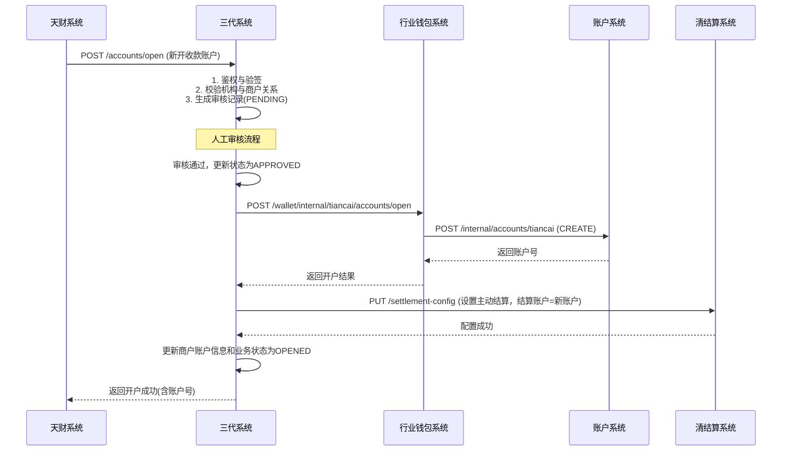
```mermaid
sequenceDiagram
    participant T as 天财系统
    participant G as 三代系统
    participant W as 行业钱包系统
    participant A as 账户系统
    participant S as 清结算系统

    T->>G: POST /accounts/open (新开收款账户)
    G->>G: 1. 鉴权与验签<br/>2. 校验机构与商户关系<br/>3. 生成审核记录(PENDING)
    Note over G: 人工审核流程
    G->>G: 审核通过，更新状态为APPROVED
    G->>W: POST /wallet/internal/tiancai/accounts/open
    W->>A: POST /internal/accounts/tiancai (CREATE)
    A-->>W: 返回账户号
    W-->>G: 返回开户结果
    G->>S: PUT /settlement-config (设置主动结算，结算账户=新账户)
    S-->>G: 配置成功
    G->>G: 更新商户账户信息和业务状态为OPENED
    G-->>T: 返回开户成功(含账户号)
```

### 5.2 关系绑定（批量付款场景）时序图
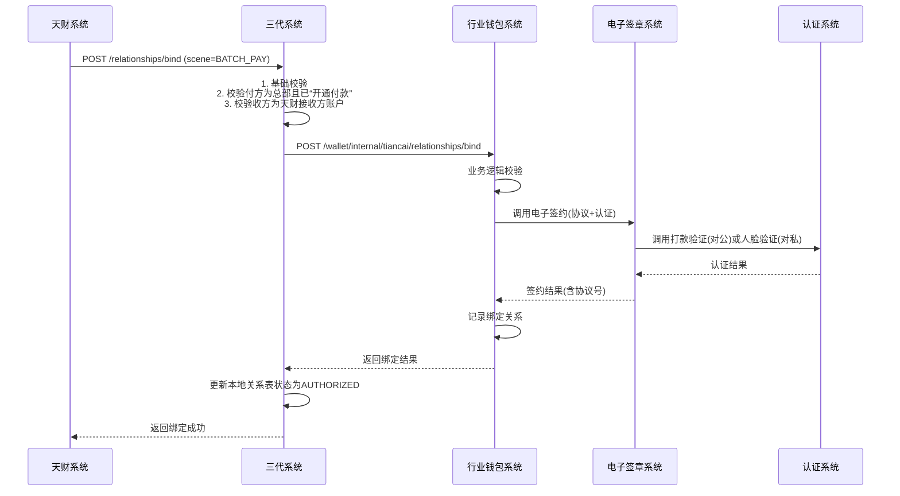
```mermaid
sequenceDiagram
    participant T as 天财系统
    participant G as 三代系统
    participant W as 行业钱包系统
    participant E as 电子签章系统
    participant Auth as 认证系统

    T->>G: POST /relationships/bind (scene=BATCH_PAY)
    G->>G: 1. 基础校验<br/>2. 校验付方为总部且已“开通付款”<br/>3. 校验收方为天财接收方账户
    G->>W: POST /wallet/internal/tiancai/relationships/bind
    W->>W: 业务逻辑校验
    W->>E: 调用电子签约(协议+认证)
    E->>Auth: 调用打款验证(对公)或人脸验证(对私)
    Auth-->>E: 认证结果
    E-->>W: 签约结果(含协议号)
    W->>W: 记录绑定关系
    W-->>G: 返回绑定结果
    G->>G: 更新本地关系表状态为AUTHORIZED
    G-->>T: 返回绑定成功
```

### 5.3 分账（归集场景）时序图
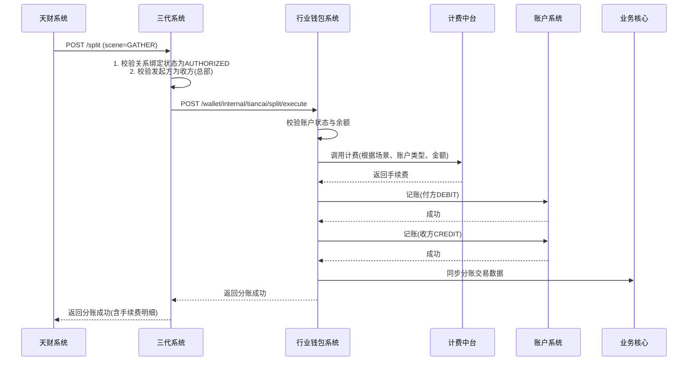
```mermaid
sequenceDiagram
    participant T as 天财系统
    participant G as 三代系统
    participant W as 行业钱包系统
    participant Fee as 计费中台
    participant A as 账户系统
    participant BC as 业务核心

    T->>G: POST /split (scene=GATHER)
    G->>G: 1. 校验关系绑定状态为AUTHORIZED<br/>2. 校验发起方为收方(总部)
    G->>W: POST /wallet/internal/tiancai/split/execute
    W->>W: 校验账户状态与余额
    W->>Fee: 调用计费(根据场景、账户类型、金额)
    Fee-->>W: 返回手续费
    W->>A: 记账(付方DEBIT)
    A-->>W: 成功
    W->>A: 记账(收方CREDIT)
    A-->>W: 成功
    W->>BC: 同步分账交易数据
    W-->>G: 返回分账成功
    G-->>T: 返回分账成功(含手续费明细)
```

## 6. 错误处理

| 错误场景 | 错误码 | HTTP状态码 | 处理策略 |
| :--- | :--- | :--- | :--- |
| 鉴权失败（机构号/AppID无效） | `AUTH_FAILED` | 401 | 拒绝请求，记录安全日志。 |
| 签名错误 | `INVALID_SIGNATURE` | 401 | 拒绝请求。 |
| 请求参数缺失或格式错误 | `INVALID_PARAMETER` | 400 | 返回具体字段错误信息。 |
| 商户不存在或不属于本机构 | `MERCHANT_NOT_FOUND` | 400 | 返回错误，提示检查商户号。 |
| 商户业务未开通 | `BUSINESS_NOT_OPENED` | 400 | 引导先进行业务开通申请。 |
| 账户不存在或状态异常 | `ACCOUNT_INVALID` | 400 | 返回具体账户状态问题。 |
| 关系未绑定或未授权 | `RELATIONSHIP_UNAUTHORIZED` | 400 | 引导先完成关系绑定流程。 |
| 付方余额不足 | `INSUFFICIENT_BALANCE` | 400 | 拒绝分账。 |
| 重复请求（requestId重复） | `DUPLICATE_REQUEST` | 409 | 幂等返回原请求结果。 |
| 下游系统调用超时或异常 | `DOWNSTREAM_ERROR` | 502 | 记录详细日志，告警，返回“系统繁忙”，建议重试。 |
| 数据库异常 | `DB_ERROR` | 500 | 告警，返回系统错误。 |

**通用策略**：
- **对外接口**：所有写操作接口必须支持幂等，基于天财的`requestId`防重。
- **优雅降级**：非核心查询接口在下游异常时可返回降级数据（如缓存）；核心交易接口必须保证强一致性。
- **重试机制**：对下游调用配置合理重试策略（如超时重试2次）。
- **监控告警**：对错误率、响应时间、下游健康状态进行监控。

## 7. 依赖说明

### 7.1 上游依赖（天财系统）
- **交互方式**：同步HTTP调用。
- **职责**：三代作为服务提供方，需保证接口高可用、低延迟。需提供明确的API文档和错误码说明。
- **关键点**：
  - 接口需具备幂等性，依赖天财传递`requestId`。
  - 需制定流量控制策略，防止天财异常调用冲击系统。
  - 所有请求和响应需全量日志记录，用于对账和问题排查。

### 7.2 下游依赖（内部系统）
1. **行业钱包系统**：
   - **交互方式**：同步RPC调用（HTTP）。
   - **职责**：三代将天财请求转换为内部标准格式，调用行业钱包执行核心业务逻辑。三代需处理行业钱包返回的业务异常并转换为对天财友好的错误信息。
   - **关键点**：调用需设置超时时间，并实现熔断机制，防止行业钱包故障导致三代服务雪崩。

2. **清结算系统**：
   - **交互方式**：同步RPC调用。
   - **职责**：在开户、结算模式变更时，三代调用清结算进行配置。三代需确保配置的准确性和最终一致性。
   - **关键点**：配置操作需有确认机制，失败时需有补偿或人工干预流程。

3. **消息中间件（如Kafka）**：
   - **交互方式**：异步事件发布/订阅。
   - **职责**：三代消费下游业务完成事件，更新本地状态；发布审核通过等事件，驱动其他系统流程。
   - **关键点**：确保事件发布的可靠性（至少一次投递），消费者需处理幂等。

### 7.3 设计要点
- **松耦合与清晰边界**：三代作为网关和协调者，不应包含过多业务逻辑，业务规则应下沉到行业钱包。三代主要负责路由、校验、协议转换和状态管理。
- **数据一致性**：本地状态（如关系绑定状态）需与行业钱包保持最终一致。通过监听事件或定时对账任务解决不一致问题。
- **可观测性**：全链路日志追踪（TraceID）、关键业务指标监控（开户成功率、分账成功率、平均耗时）。
- **安全性**：接口鉴权、参数防篡改（签名）、敏感信息脱敏、防重放攻击。

## 3.6 清结算系统


# 清结算系统模块设计文档（天财分账专项）

## 1. 概述

### 1.1 目的
本模块（清结算系统）作为拉卡拉支付的核心资金处理系统，为“天财分账”业务提供资金清算、结算、计费执行及退货处理能力。核心目的是确保天财业务场景下的收单资金能够准确、合规地结算至指定的“天财收款账户”，并支持基于该账户的资金流转（分账、退货）所涉及的计费、资金冻结等操作。

### 1.2 范围
- **收单资金结算**：将商户的收单交易资金，根据其配置的结算模式（主动/被动）和结算账户（天财收款账户），在D+1日完成资金清算与结算。
- **计费执行**：接收并执行由计费中台计算出的天财分账交易手续费，完成资金扣划。
- **退货处理**：支持天财场景下的退货流程，包括查询“天财收款账户”作为终点账户、执行扣款（优先扣天财收款账户，不足时扣04退货账户）。
- **账户冻结**：接收风控指令，对“天财收款账户”执行资金冻结/解冻操作，并通知账户系统。
- **结算明细推送**：在结算完成后，向账户系统推送包含明细的结算事件，支持对账单系统生成带明细的账单。
- **信息同步**：接收三代系统同步的商户结算账户配置（天财收款账户）。

## 2. 接口设计

### 2.1 API端点 (RESTful)

#### 2.1.1 内部接口（供三代、行业钱包、风控等系统调用）

**1. 同步结算账户配置**
- **端点**：`POST /internal/settlement/account-config`
- **描述**：接收三代系统同步的商户结算账户配置。当商户开通或变更天财业务时，三代调用此接口更新其结算终点账户为天财收款账户。
- **调用方**：三代系统
- **请求体**：
```json
{
  "requestId": "UUID",
  "merchantNo": "商户号",
  "settlementMode": "ACTIVE", // 结算模式: ACTIVE-主动结算, PASSIVE-被动结算
  "settlementAccountNo": "天财收款账户号", // 当settlementMode=ACTIVE时必填
  "effectiveTime": "2023-01-01 00:00:00", // 配置生效时间
  "operator": "三代系统"
}
```
- **响应体**：
```json
{
  "code": "SUCCESS",
  "message": "成功",
  "data": {
    "configId": "配置记录ID"
  }
}
```

**2. 查询退货终点账户信息**
- **端点**：`GET /internal/settlement/refund-endpoint-account`
- **描述**：退货前置流程中，查询指定商户的退货终点账户信息及余额。对于天财商户，返回其天财收款账户信息。
- **调用方**：退货前置系统
- **请求参数**：
  - `merchantNo` (必填): 商户号
- **响应体**：
```json
{
  "code": "SUCCESS",
  "data": {
    "endpointAccountNo": "天财收款账户号",
    "endpointAccountType": "TIANCAI_COLLECT", // 账户类型
    "balance": 10000, // 账户当前余额
    "availableBalance": 10000, // 账户可用余额
    "relatedRefundAccountNo": "04退货账户号", // 关联的04退货账户
    "refundAccountBalance": 5000 // 04退货账户余额
  }
}
```

**3. 执行分账手续费扣划**
- **端点**：`POST /internal/settlement/fee-deduction`
- **描述**：接收计费中台的计算结果，执行天财分账交易手续费的扣划。从手续费承担方指定的账户扣取费用。
- **调用方**：行业钱包系统（在分账交易计费后调用）
- **请求体**：
```json
{
  "requestId": "UUID",
  "bizType": "TIANCAI_SPLIT_FEE", // 业务类型
  "bizNo": "分账交易流水号", // 关联的分账业务流水
  "payerAccountNo": "付方账户号", // 手续费承担方账户（天财收款账户）
  "payerMerchantNo": "付方商户号",
  "feeAmount": 100, // 手续费金额（单位：分）
  "feeRate": "0.0038", // 费率（如按比例）
  "feeMode": "NET", // 计费模式: NET-净额, GROSS-全额
  "currency": "CNY",
  "operator": "行业钱包"
}
```
- **响应体**：
```json
{
  "code": "SUCCESS",
  "message": "成功",
  "data": {
    "deductionId": "扣费流水ID",
    "actualDeductedAmount": 100
  }
}
```

**4. 账户冻结/解冻**
- **端点**：`POST /internal/settlement/account-freeze`
- **描述**：接收风控系统的指令，对指定的天财收款账户执行冻结或解冻操作，并同步通知账户系统。
- **调用方**：风控系统
- **请求体**：
```json
{
  "requestId": "UUID",
  "freezeType": "MERCHANT_FREEZE" | "TRANSACTION_FREEZE", // 商户冻结 | 交易冻结
  "freezeStatus": "FROZEN" | "UNFROZEN",
  "targetType": "MERCHANT" | "ACCOUNT", // 目标类型: 按商户 | 按账户
  "targetValue": "商户号 或 账户号",
  "freezeAmount": 0, // 交易冻结时，需冻结的金额（单位：分）。商户冻结时为0。
  "freezeReason": "风险交易",
  "operator": "风控系统"
}
```
- **响应体**：
```json
{
  "code": "SUCCESS",
  "message": "成功",
  "data": {
    "freezeOrderNo": "冻结指令流水号"
  }
}
```

**5. 结算明细查询（供对账）**
- **端点**：`POST /internal/settlement/detail/batch`
- **描述**：根据时间范围和商户列表，批量查询结算明细（汇总及明细数据）。供内部对账或问题排查使用。
- **调用方**：对账单系统、运营平台
- **请求体**：
```json
{
  "merchantNos": ["商户1", "商户2"],
  "accountNos": ["账户1", "账户2"], // 可选，与merchantNos二选一
  "startSettleDate": "2023-10-01", // 结算日期起
  "endSettleDate": "2023-10-01", // 结算日期止
  "bizType": "SETTLEMENT" // 业务类型: SETTLEMENT-结算, FEE-手续费, REFUND-退货
}
```
- **响应体**：
```json
{
  "code": "SUCCESS",
  "data": {
    "details": [
      {
        "settleDate": "2023-10-01",
        "merchantNo": "商户号",
        "accountNo": "天财收款账户号",
        "bizType": "SETTLEMENT",
        "bizNo": "原交易流水号",
        "amount": 10000,
        "fee": 38,
        "netAmount": 9962,
        "currency": "CNY",
        "tradeTime": "2023-09-30 12:00:00",
        "settleTime": "2023-10-01 09:00:00",
        "detailFlag": "SUMMARY" // SUMMARY-汇总, DETAIL-明细
      }
    ]
  }
}
```

#### 2.1.2 发布/消费的事件

#### 2.2.1 消费的事件
- **FeeCalculatedEvent**：计费中台发布。当分账交易计费完成后，清结算系统消费此事件，执行手续费的实际扣划。
  - **主题**：`fee.calculated.tiancai.split`
  - **数据**：`{“bizNo”: “分账流水号”, “payerAccountNo”: “付方账户”, “feeAmount”: 100, “currency”: “CNY”, “calcTime”: “...”}`
- **AccountStatusChangedEvent**：账户系统发布。清结算系统监听此事件，用于同步账户冻结状态，确保清结算内部状态与账户系统一致。
  - **主题**：`account.status.changed`
  - **数据**：`{“accountNo”: “xxx”, “oldStatus”: “ACTIVE”, “newStatus”: “FROZEN”, “changeTime”: “...”, “reason”: “...”}`

#### 2.2.2 发布的事件
- **SettlementDetailEvent**：当收单交易资金结算到天财收款账户时发布。此事件包含“补明细账单”标识，驱动账户系统生成子账单流水。
  - **主题**：`settlement.detail.tiancai`
  - **数据**：
```json
{
  "eventId": "UUID",
  "settleDate": "2023-10-01",
  "merchantNo": "商户号",
  "accountNo": "天财收款账户号",
  "summaryPostingId": "汇总记账流水ID", // 账户系统中对应的汇总流水ID
  "supplementDetailFlag": true, // 补明细账单标识
  "details": [
    {
      "tradeNo": "交易流水号1",
      "amount": 5000,
      "fee": 19,
      "netAmount": 4981,
      "tradeTime": "2023-09-30 10:00:00"
    },
    {
      "tradeNo": "交易流水号2",
      "amount": 5000,
      "fee": 19,
      "netAmount": 4981,
      "tradeTime": "2023-09-30 11:00:00"
    }
  ]
}
```
- **AccountFreezeExecutedEvent**：当清结算系统成功执行账户冻结/解冻指令后发布，通知相关系统。
  - **主题**：`account.freeze.executed`
  - **数据**：`{“freezeOrderNo”: “指令号”, “accountNo”: “xxx”, “freezeStatus”: “FROZEN”, “freezeAmount”: 1000, “executedTime”: “...”, “operator”: “风控”}`

## 3. 数据模型

### 3.1 核心表设计

**1. 商户结算配置表 (merchant_settlement_config)**
存储商户的结算模式与终点账户配置。
```sql
CREATE TABLE `merchant_settlement_config` (
  `id` bigint(20) NOT NULL AUTO_INCREMENT COMMENT '主键ID',
  `merchant_no` varchar(32) NOT NULL COMMENT '商户号',
  `settlement_mode` varchar(32) NOT NULL COMMENT '结算模式: ACTIVE-主动结算, PASSIVE-被动结算',
  `settlement_account_no` varchar(32) DEFAULT NULL COMMENT '结算账户号 (主动结算时必填)',
  `settlement_account_type` varchar(32) DEFAULT NULL COMMENT '结算账户类型: TIANCAI_COLLECT, GENERAL_COLLECT',
  `effective_time` datetime NOT NULL COMMENT '配置生效时间',
  `status` varchar(32) NOT NULL DEFAULT 'VALID' COMMENT '状态: VALID-有效, INVALID-无效',
  `created_time` datetime NOT NULL DEFAULT CURRENT_TIMESTAMP COMMENT '创建时间',
  `updated_time` datetime NOT NULL DEFAULT CURRENT_TIMESTAMP ON UPDATE CURRENT_TIMESTAMP COMMENT '更新时间',
  PRIMARY KEY (`id`),
  UNIQUE KEY `uk_merchant_effective` (`merchant_no`, `effective_time`),
  KEY `idx_account_no` (`settlement_account_no`)
) ENGINE=InnoDB COMMENT='商户结算配置表';
```

**2. 结算执行记录表 (settlement_execution)**
记录每笔收单交易的结算执行结果。
```sql
CREATE TABLE `settlement_execution` (
  `id` bigint(20) NOT NULL AUTO_INCREMENT COMMENT '主键ID',
  `settle_date` date NOT NULL COMMENT '结算日期',
  `trade_no` varchar(64) NOT NULL COMMENT '原交易流水号',
  `merchant_no` varchar(32) NOT NULL COMMENT '商户号',
  `account_no` varchar(32) NOT NULL COMMENT '结算入账账户号 (天财收款账户)',
  `trade_amount` decimal(20,2) NOT NULL COMMENT '交易金额',
  `trade_fee` decimal(20,2) NOT NULL DEFAULT '0.00' COMMENT '交易手续费',
  `settlement_amount` decimal(20,2) NOT NULL COMMENT '实际结算金额 (净额)',
  `currency` varchar(3) NOT NULL DEFAULT 'CNY' COMMENT '币种',
  `trade_time` datetime NOT NULL COMMENT '交易时间',
  `settlement_time` datetime NOT NULL COMMENT '结算执行时间',
  `status` varchar(32) NOT NULL DEFAULT 'SUCCESS' COMMENT '状态: SUCCESS-成功, FAILED-失败, PENDING-待处理',
  `summary_posting_id` varchar(64) DEFAULT NULL COMMENT '关联的账户系统汇总流水ID',
  `supplement_detail_flag` tinyint(1) NOT NULL DEFAULT 0 COMMENT '补明细账单标识: 0-否, 1-是',
  `created_time` datetime NOT NULL DEFAULT CURRENT_TIMESTAMP COMMENT '创建时间',
  PRIMARY KEY (`id`),
  UNIQUE KEY `uk_trade_settle` (`trade_no`, `settle_date`),
  KEY `idx_merchant_date` (`merchant_no`, `settle_date`),
  KEY `idx_account_date` (`account_no`, `settle_date`),
  KEY `idx_settlement_time` (`settlement_time`)
) ENGINE=InnoDB COMMENT='结算执行记录表';
```

**3. 手续费扣划记录表 (fee_deduction_record)**
记录天财分账手续费扣划明细。
```sql
CREATE TABLE `fee_deduction_record` (
  `id` bigint(20) NOT NULL AUTO_INCREMENT COMMENT '主键ID',
  `deduction_no` varchar(64) NOT NULL COMMENT '扣费流水号',
  `biz_type` varchar(32) NOT NULL COMMENT '业务类型: TIANCAI_SPLIT_FEE',
  `biz_no` varchar(64) NOT NULL COMMENT '关联业务流水号 (分账流水)',
  `payer_account_no` varchar(32) NOT NULL COMMENT '付费方账户号',
  `payer_merchant_no` varchar(32) NOT NULL COMMENT '付费方商户号',
  `fee_amount` decimal(20,2) NOT NULL COMMENT '手续费金额',
  `fee_rate` varchar(20) DEFAULT NULL COMMENT '费率',
  `fee_mode` varchar(32) DEFAULT NULL COMMENT '计费模式: NET, GROSS',
  `currency` varchar(3) NOT NULL DEFAULT 'CNY' COMMENT '币种',
  `deduction_time` datetime NOT NULL COMMENT '扣费时间',
  `status` varchar(32) NOT NULL DEFAULT 'SUCCESS' COMMENT '状态: SUCCESS-成功, FAILED-失败',
  `account_posting_id` varchar(64) DEFAULT NULL COMMENT '账户系统扣费流水ID',
  `created_time` datetime NOT NULL DEFAULT CURRENT_TIMESTAMP COMMENT '创建时间',
  PRIMARY KEY (`id`),
  UNIQUE KEY `uk_deduction_no` (`deduction_no`),
  UNIQUE KEY `uk_biz_no_type` (`biz_no`, `biz_type`),
  KEY `idx_payer_account` (`payer_account_no`, `deduction_time`)
) ENGINE=InnoDB COMMENT='手续费扣划记录表';
```

**4. 账户冻结指令表 (account_freeze_order)**
记录风控发起的账户冻结/解冻指令及执行结果。
```sql
CREATE TABLE `account_freeze_order` (
  `id` bigint(20) NOT NULL AUTO_INCREMENT COMMENT '主键ID',
  `freeze_order_no` varchar(64) NOT NULL COMMENT '冻结指令流水号',
  `freeze_type` varchar(32) NOT NULL COMMENT '冻结类型: MERCHANT_FREEZE, TRANSACTION_FREEZE',
  `target_type` varchar(32) NOT NULL COMMENT '目标类型: MERCHANT, ACCOUNT',
  `target_value` varchar(32) NOT NULL COMMENT '目标值 (商户号或账户号)',
  `freeze_status` varchar(32) NOT NULL COMMENT '指令状态: FROZEN, UNFROZEN',
  `freeze_amount` decimal(20,2) NOT NULL DEFAULT '0.00' COMMENT '冻结金额 (交易冻结时>0)',
  `freeze_reason` varchar(255) DEFAULT NULL COMMENT '冻结原因',
  `operator` varchar(64) NOT NULL COMMENT '操作方',
  `order_status` varchar(32) NOT NULL DEFAULT 'PROCESSING' COMMENT '指令执行状态: PROCESSING-处理中, SUCCESS-成功, FAILED-失败, PARTIAL-部分成功',
  `account_sync_status` varchar(32) DEFAULT NULL COMMENT '账户系统同步状态: SYNCED-已同步, FAILED-同步失败',
  `executed_time` datetime DEFAULT NULL COMMENT '指令执行时间',
  `created_time` datetime NOT NULL DEFAULT CURRENT_TIMESTAMP COMMENT '创建时间',
  `updated_time` datetime NOT NULL DEFAULT CURRENT_TIMESTAMP ON UPDATE CURRENT_TIMESTAMP COMMENT '更新时间',
  PRIMARY KEY (`id`),
  UNIQUE KEY `uk_freeze_order_no` (`freeze_order_no`),
  KEY `idx_target_value` (`target_value`, `freeze_status`),
  KEY `idx_created_time` (`created_time`)
) ENGINE=InnoDB COMMENT='账户冻结指令表';
```

### 3.2 与其他模块的关系
- **三代系统**：上游调用方。同步商户结算账户配置（天财收款账户）。
- **行业钱包系统**：上游调用方。请求执行分账手续费扣划。
- **计费中台**：事件上游。发布计费结果事件，触发清结算扣费。
- **账户系统**：下游调用方。清结算调用其接口执行账户冻结；消费其发布的账户状态事件；向其发布结算明细事件。
- **风控系统**：上游调用方。发起账户冻结/解冻指令。
- **退货前置系统**：上游调用方。查询退货终点账户（天财收款账户）信息。
- **对账单系统**：下游调用方。提供结算明细查询接口。

## 4. 业务逻辑

### 4.1 核心算法
1. **D+1结算调度算法**：
   - 每日凌晨定时任务，扫描`settlement_execution`表中`settle_date`为当日且`status='PENDING'`的记录。
   - 根据`merchant_settlement_config`获取商户的结算账户（天财收款账户）。
   - 按账户分组，批量生成结算指令，调用账户系统进行批量记账。
   - 对于结算到天财收款账户的，在记账成功后，发布`SettlementDetailEvent`事件，并标记`supplement_detail_flag=true`。
2. **手续费扣划执行**：
   - 监听`FeeCalculatedEvent`消息。
   - 根据事件中的`payerAccountNo`，调用账户系统的记账接口（`bizType='TIANCAI_SPLIT_FEE'`）执行扣款。
   - 扣款成功，更新`fee_deduction_record`状态。
3. **账户冻结执行**：
   - 接收风控冻结指令。
   - 解析`targetType`和`targetValue`，若为`MERCHANT`，需通过商户号查询出其对应的天财收款账户号。
   - 调用账户系统的冻结接口，并更新`account_freeze_order`表状态。

### 4.2 业务规则
1. **结算规则**：
   - 天财商户默认配置为“主动结算”，结算账户为其“天财收款账户”。
   - 结算时效为D+1，即T日交易，T+1日结算。
   - 结算时，需扣除交易手续费，将净额结算至天财收款账户。
2. **手续费规则**：
   - 手续费承担方由天财接口传入，清结算根据计费中台结果从指定账户扣划。
   - 扣费失败会导致分账交易失败，需有明确错误返回。
3. **退货规则**：
   - 天财商户的退货模式为“终点账户+退货账户模式”。
   - 退货前置查询时，返回该商户的“天财收款账户”作为终点账户。
   - 执行退货时，优先扣除“天财收款账户”余额，不足部分扣除关联的“04退货账户”余额。
4. **冻结规则**：
   - “商户冻结”：冻结该商户对应的天财收款账户的全部资金。调用账户系统进行账户状态冻结。
   - “交易冻结”：冻结指定天财收款账户中的特定金额资金。需在清结算层面记录冻结金额明细，并调用账户系统进行账户状态冻结（账户系统可能需配合记录冻结金额）。
5. **明细推送规则**：
   - 结算到天财收款账户的每一笔交易，都需要生成明细记录。
   - 发布`SettlementDetailEvent`时，`details`数组需包含所有明细，并关联正确的`summaryPostingId`。

### 4.3 验证逻辑
1. **同步结算配置时**：
   - 校验商户号是否存在且有效。
   - 校验`settlementAccountNo`是否为有效的天财收款账户（可通过缓存或调用账户系统查询）。
   - 校验生效时间不能晚于当前时间。
2. **执行手续费扣划时**：
   - 校验`bizNo`是否已存在成功扣费记录（防重）。
   - 校验付费方账户状态是否正常（ACTIVE & UNFROZEN）。
   - 校验账户余额是否充足。
3. **处理冻结指令时**：
   - 校验指令格式及必填字段。
   - 校验目标商户或账户是否存在。
   - 对于解冻指令，校验是否存在对应的冻结指令。
4. **发布结算事件时**：
   - 校验`summaryPostingId`在账户系统中是否存在。
   - 校验明细金额之和与汇总金额一致。

## 5. 时序图

### 5.1 D+1结算至天财收款账户时序图
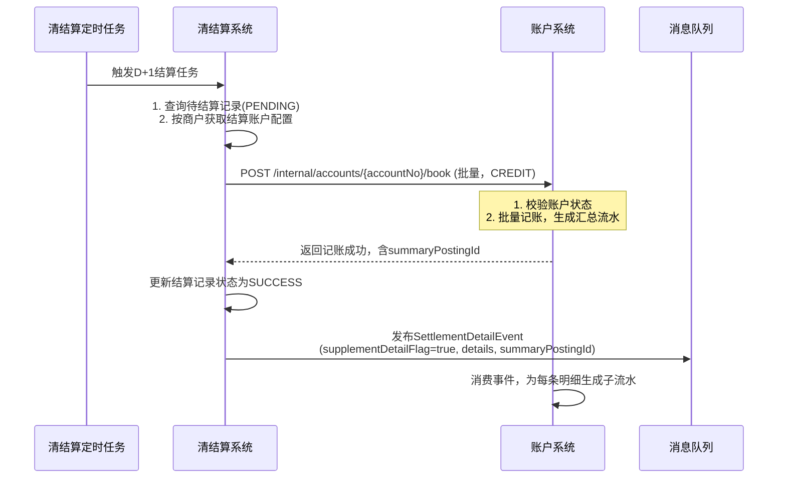
```mermaid
sequenceDiagram
    participant Scheduler as 清结算定时任务
    participant S as 清结算系统
    participant A as 账户系统
    participant MQ as 消息队列

    Scheduler->>S: 触发D+1结算任务
    S->>S: 1. 查询待结算记录(PENDING)<br/>2. 按商户获取结算账户配置
    S->>A: POST /internal/accounts/{accountNo}/book (批量，CREDIT)
    Note over A: 1. 校验账户状态<br/>2. 批量记账，生成汇总流水
    A-->>S: 返回记账成功，含summaryPostingId
    S->>S: 更新结算记录状态为SUCCESS
    S->>MQ: 发布SettlementDetailEvent<br/>(supplementDetailFlag=true, details, summaryPostingId)
    A->>A: 消费事件，为每条明细生成子流水
```

### 5.2 分账手续费扣划时序图
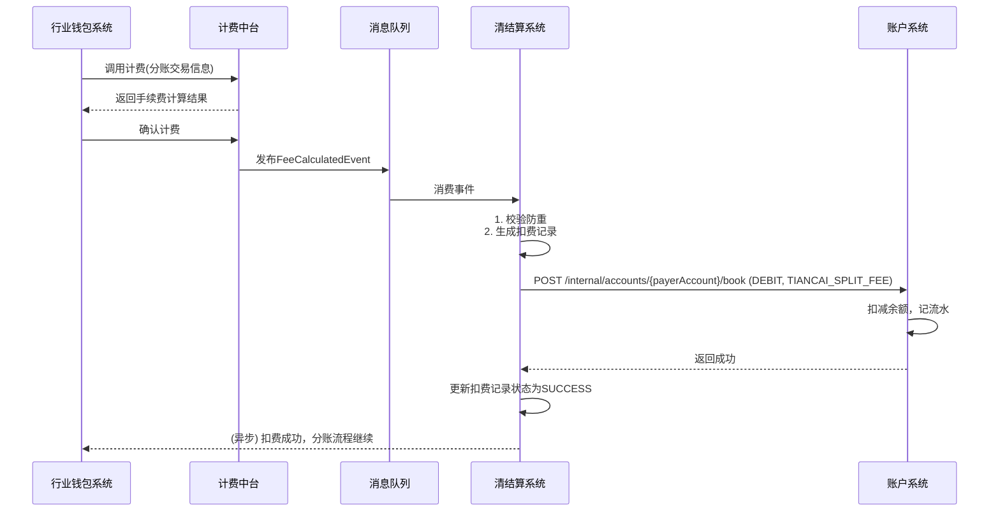
```mermaid
sequenceDiagram
    participant W as 行业钱包系统
    participant Fee as 计费中台
    participant MQ as 消息队列
    participant S as 清结算系统
    participant A as 账户系统

    W->>Fee: 调用计费(分账交易信息)
    Fee-->>W: 返回手续费计算结果
    W->>Fee: 确认计费
    Fee->>MQ: 发布FeeCalculatedEvent
    MQ->>S: 消费事件
    S->>S: 1. 校验防重<br/>2. 生成扣费记录
    S->>A: POST /internal/accounts/{payerAccount}/book (DEBIT, TIANCAI_SPLIT_FEE)
    A->>A: 扣减余额，记流水
    A-->>S: 返回成功
    S->>S: 更新扣费记录状态为SUCCESS
    S-->>W: (异步) 扣费成功，分账流程继续
```

### 5.3 天财商户退货查询与执行时序图
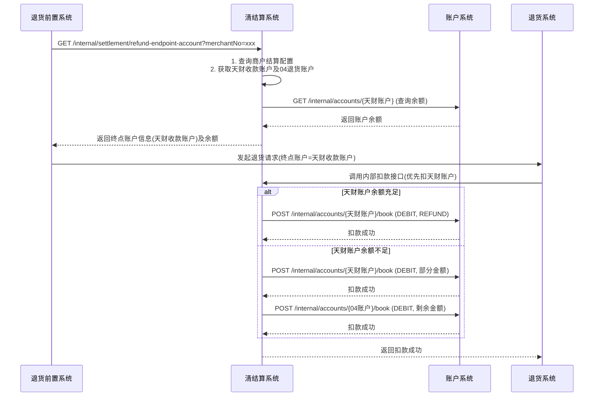
```mermaid
sequenceDiagram
    participant TP as 退货前置系统
    participant S as 清结算系统
    participant A as 账户系统
    participant RS as 退货系统

    TP->>S: GET /internal/settlement/refund-endpoint-account?merchantNo=xxx
    S->>S: 1. 查询商户结算配置<br/>2. 获取天财收款账户及04退货账户
    S->>A: GET /internal/accounts/{天财账户} (查询余额)
    A-->>S: 返回账户余额
    S-->>TP: 返回终点账户信息(天财收款账户)及余额
    TP->>RS: 发起退货请求(终点账户=天财收款账户)
    RS->>S: 调用内部扣款接口(优先扣天财账户)
    alt 天财账户余额充足
        S->>A: POST /internal/accounts/{天财账户}/book (DEBIT, REFUND)
        A-->>S: 扣款成功
    else 天财账户余额不足
        S->>A: POST /internal/accounts/{天财账户}/book (DEBIT, 部分金额)
        A-->>S: 扣款成功
        S->>A: POST /internal/accounts/{04账户}/book (DEBIT, 剩余金额)
        A-->>S: 扣款成功
    end
    S-->>RS: 返回扣款成功
```

### 5.4 账户冻结时序图
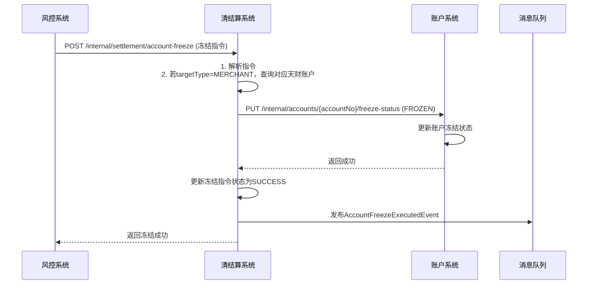
```mermaid
sequenceDiagram
    participant R as 风控系统
    participant S as 清结算系统
    participant A as 账户系统
    participant MQ as 消息队列

    R->>S: POST /internal/settlement/account-freeze (冻结指令)
    S->>S: 1. 解析指令<br/>2. 若targetType=MERCHANT，查询对应天财账户
    S->>A: PUT /internal/accounts/{accountNo}/freeze-status (FROZEN)
    A->>A: 更新账户冻结状态
    A-->>S: 返回成功
    S->>S: 更新冻结指令状态为SUCCESS
    S->>MQ: 发布AccountFreezeExecutedEvent
    S-->>R: 返回冻结成功
```

## 6. 错误处理

| 错误场景 | 错误码 | 处理策略 |
| :--- | :--- | :--- |
| 商户结算配置不存在 | `SETTLEMENT_CONFIG_NOT_FOUND` | 结算任务暂停，发出告警，需运营介入检查商户配置。 |
| 天财收款账户状态异常（冻结/非ACTIVE） | `ACCOUNT_STATUS_INVALID` | 结算失败，记录失败原因。需通知商户或运营处理账户状态。 |
| 手续费扣划时余额不足 | `INSUFFICIENT_BALANCE_FOR_FEE` | 扣费失败，导致分账交易整体失败。向行业钱包返回明确错误。 |
| 重复的业务流水号（扣费防重） | `DUPLICATE_BIZ_NO` | 幂等处理：查询已存在的扣费记录，若金额一致则返回成功；否则返回错误。 |
| 风控冻结指令目标不存在 | `FREEZE_TARGET_NOT_FOUND` | 返回指令失败，风控系统需检查目标商户/账户号。 |
| 账户系统调用超时或失败 | `ACCOUNT_SYSTEM_UNAVAILABLE` | 记录日志，根据操作类型决定重试策略（结算任务可重试，实时扣费需快速失败）。 |
| 消息队列投递失败（结算事件） | `MQ_PUBLISH_FAILED` | 重试投递，超过重试次数后入库，启动补偿任务定时重推。 |

**通用策略**：
- **幂等性**：所有写接口通过`requestId`或`bizNo`保证幂等。
- **异步补偿**：对于结算、事件推送等异步操作，需有定时补偿任务处理失败或超时记录。
- **事务一致性**：涉及资金变动的操作（如扣费），需与账户系统交互保证最终一致性。本地记录状态，便于对账和排查。
- **监控告警**：对结算失败率、扣费失败、系统间调用异常等设置监控告警。

## 7. 依赖说明

### 7.1 上游依赖
1. **三代系统**：
   - **交互方式**：同步RPC调用（HTTP）。
   - **职责**：提供商户结算账户配置（天财收款账户）。清结算信任此配置的准确性。
   - **关键点**：配置生效时间需精确，支持即时生效或次日生效。
2. **行业钱包系统**：
   - **交互方式**：同步RPC调用（HTTP）。
   - **职责**：请求执行分账手续费扣划。清结算需确保扣费实时性和成功率，直接影响分账交易。
3. **计费中台**：
   - **交互方式**：异步事件（消息队列）。
   - **职责**：提供准确的手续费计算结果。清结算消费事件执行扣划。
   - **关键点**：事件格式需包含完整的计费信息和业务关联号。
4. **风控系统**：
   - **交互方式**：同步RPC调用（HTTP）。
   - **职责**：发起账户冻结/解冻指令。清结算需快速响应并执行。
5. **退货前置系统**：
   - **交互方式**：同步RPC调用（HTTP）。
   - **职责**：查询退货终点账户。清结算需快速返回账户信息及余额。

### 7.2 下游依赖
1. **账户系统**：
   - **交互方式**：同步RPC调用（HTTP） + 异步事件（消费）。
   - **职责**：执行资金记账、账户冻结、提供账户信息查询。是清结算资金操作的核心依赖。
   - **关键点**：调用需高性能、高可用。记账接口必须幂等。
2. **消息中间件（如Kafka/RocketMQ）**：
   - 用于发布结算明细、冻结执行等事件。

### 7.3 设计要点
- **性能与批量**：D+1结算涉及大量数据处理，需采用批量查询、批量记账优化性能。
- **数据一致性**：清结算记录需与账户系统流水通过`bizNo`、`postingId`等强关联，确保对账无误。
- **可追溯性**：所有资金操作（结算、扣费、冻结）必须有完整记录，支持审计和问题排查。
- **配置化管理**：结算规则、重试策略、开关等应支持动态配置。

## 3.7 账务核心系统


# 账务核心系统模块设计文档（天财分账专项）

## 1. 概述

### 1.1 目的
本模块（账务核心系统）作为拉卡拉支付系统的核心交易记录中心，为“天财分账”业务提供交易数据的接收、记录和存储服务。核心目的是确保所有天财分账交易（包括归集、批量付款、会员结算）以及相关打款验证交易，都能被准确、完整地记录，形成标准化的交易流水，为下游的对账单系统提供可靠、可追溯的数据源。

### 1.2 范围
- **交易数据接收**：接收来自行业钱包系统的“天财分账”交易数据，并持久化存储。
- **交易数据接收**：接收来自业务核心或认证系统的“打款验证”交易数据，并持久化存储。
- **分录码管理**：为天财分账及打款验证业务定义并使用专用的会计分录码，确保财务核算的准确性。
- **数据查询与提供**：为对账单系统提供标准化的天财分账交易数据，支持按机构、时间等维度查询。
- **数据一致性保障**：通过幂等性设计，确保交易数据不重不漏，并与账户系统的资金流水通过业务流水号（`bizNo`）强关联。

## 2. 接口设计

### 2.1 API端点 (RESTful)

#### 2.1.1 内部接口（供行业钱包、业务核心等系统调用）

**1. 接收天财分账交易**
- **端点**：`POST /internal/transactions/tiancai-split`
- **描述**：接收并记录一笔天财分账交易。此接口必须幂等。
- **调用方**：行业钱包系统
- **请求体**：
```json
{
  "requestId": "UUID",
  "bizNo": "天财分账业务流水号",
  "bizType": "TIANCAI_SPLIT",
  "splitScene": "COLLECTION" | "BATCH_PAYMENT" | "MEMBER_SETTLEMENT", // 归集 | 批量付款 | 会员结算
  "payerMerchantNo": "付方商户号",
  "payerAccountNo": "付方天财账户号",
  "payeeMerchantNo": "收方商户号",
  "payeeAccountNo": "收方天财账户号",
  "amount": 10000,
  "fee": 10,
  "feeBearer": "PAYER" | "PAYEE", // 付方承担 | 收方承担
  "transferMode": "NET" | "GROSS", // 净额转账 | 全额转账
  "currency": "CNY",
  "scenePurpose": "缴纳品牌费", // 场景资金用途
  "splitRequestTime": "2023-10-01 12:00:00", // 天财发起请求时间
  "splitCompleteTime": "2023-10-01 12:00:05", // 分账完成时间
  "operator": "wallet_system"
}
```
- **响应体**：
```json
{
  "code": "SUCCESS",
  "message": "成功",
  "data": {
    "transactionId": "账务核心交易流水ID",
    "bizNo": "业务流水号",
    "status": "RECORDED"
  }
}
```

**2. 接收打款验证交易**
- **端点**：`POST /internal/transactions/verification-transfer`
- **描述**：接收并记录一笔用于身份验证的小额打款交易。此接口必须幂等。
- **调用方**：业务核心 或 认证系统（根据流程设计）
- **请求体**：
```json
{
  "requestId": "UUID",
  "bizNo": "打款验证业务流水号",
  "bizType": "VERIFICATION_TRANSFER",
  "verificationType": "REMITTANCE", // 打款验证
  "payerAccountNo": "付款账户号（内部账户）",
  "payeeBankCardNo": "收款方银行卡号",
  "payeeBankCardName": "收款方姓名",
  "amount": 0.01, // 随机小额金额
  "remark": "6位随机数字或2汉字",
  "currency": "CNY",
  "purpose": "RELATION_BINDING_AUTH", // 关系绑定认证
  "bindScene": "COLLECTION" | "BATCH_PAYMENT" | "MEMBER_SETTLEMENT", // 关联的分账场景
  "bindPayerMerchantNo": "关联付方商户号",
  "bindPayeeMerchantNo": "关联收方商户号",
  "transferTime": "2023-10-01 12:00:00",
  "operator": "auth_system"
}
```
- **响应体**：同分账接口。

**3. 天财分账交易查询（供对账单系统）**
- **端点**：`POST /internal/transactions/tiancai-split/query`
- **描述**：根据时间范围和机构号，批量查询天财分账交易记录。
- **调用方**：对账单系统
- **请求体**：
```json
{
  "orgNo": "天财机构号",
  "startTime": "2023-10-01 00:00:00",
  "endTime": "2023-10-02 00:00:00",
  "splitScene": "COLLECTION", // 可选，按场景过滤
  "pageNo": 1,
  "pageSize": 1000
}
```
- **响应体**：
```json
{
  "code": "SUCCESS",
  "data": {
    "transactions": [
      {
        "transactionId": "账务核心交易流水ID",
        "bizNo": "业务流水号",
        "splitScene": "COLLECTION",
        "payerMerchantNo": "付方商户号",
        "payerAccountNo": "付方账户号",
        "payeeMerchantNo": "收方商户号",
        "payeeAccountNo": "收方账户号",
        "amount": 10000,
        "fee": 10,
        "feeBearer": "PAYER",
        "transferMode": "NET",
        "currency": "CNY",
        "scenePurpose": "缴纳品牌费",
        "splitRequestTime": "2023-10-01 12:00:00",
        "splitCompleteTime": "2023-10-01 12:00:05",
        "createdTime": "2023-10-01 12:00:05"
      }
    ],
    "total": 1500
  }
}
```

### 2.2 发布/消费的事件

#### 2.2.1 消费的事件
- **TiancaiSplitExecutedEvent**：由行业钱包系统在分账成功后发布。账务核心监听此事件并记录交易。
  - **主题**：`tiancai.split.executed`
  - **数据**：包含 `bizNo`, `splitScene`, `payerAccountNo`, `payeeAccountNo`, `amount`, `fee`, `feeBearer`, `splitCompleteTime` 等关键字段。
- **VerificationTransferExecutedEvent**：由业务核心或认证系统在小额打款成功后发布。账务核心监听此事件并记录交易。
  - **主题**：`verification.transfer.executed`
  - **数据**：包含 `bizNo`, `payerAccountNo`, `payeeBankCardNo`, `amount`, `remark`, `purpose` 等关键字段。

#### 2.2.2 发布的事件
- **TransactionRecordedEvent**：当成功记录一笔交易（分账或打款验证）后发布。可用于下游系统（如监控、审计）订阅。
  - **主题**：`transaction.recorded`
  - **数据**：`{“transactionId”: “xxx”, “bizNo”: “yyy”, “bizType”: “TIANCAI_SPLIT”, “amount”: 100, “recordTime”: “...”}`

## 3. 数据模型

### 3.1 核心表设计

**1. 天财分账交易主表 (tiancai_split_transaction)**
存储所有天财分账交易的核心信息。
```sql
CREATE TABLE `tiancai_split_transaction` (
  `id` bigint(20) NOT NULL AUTO_INCREMENT COMMENT '主键ID',
  `transaction_id` varchar(32) NOT NULL COMMENT '账务核心交易流水ID，唯一',
  `biz_no` varchar(64) NOT NULL COMMENT '业务流水号（行业钱包生成），与biz_type组成唯一键',
  `biz_type` varchar(32) NOT NULL DEFAULT 'TIANCAI_SPLIT' COMMENT '业务类型',
  `split_scene` varchar(32) NOT NULL COMMENT '分账场景: COLLECTION-归集, BATCH_PAYMENT-批量付款, MEMBER_SETTLEMENT-会员结算',
  `payer_merchant_no` varchar(32) NOT NULL COMMENT '付方商户号',
  `payer_account_no` varchar(32) NOT NULL COMMENT '付方账户号（天财收款账户）',
  `payee_merchant_no` varchar(32) NOT NULL COMMENT '收方商户号',
  `payee_account_no` varchar(32) NOT NULL COMMENT '收方账户号（天财收款账户/接收方账户）',
  `amount` decimal(20,2) NOT NULL COMMENT '分账金额（元）',
  `fee` decimal(20,2) NOT NULL DEFAULT '0.00' COMMENT '手续费（元）',
  `fee_bearer` varchar(10) NOT NULL COMMENT '手续费承担方: PAYER-付方, PAYEE-收方',
  `transfer_mode` varchar(10) NOT NULL COMMENT '到账模式: NET-净额, GROSS-全额',
  `currency` varchar(3) NOT NULL DEFAULT 'CNY' COMMENT '币种',
  `scene_purpose` varchar(64) NOT NULL COMMENT '场景资金用途',
  `split_request_time` datetime NOT NULL COMMENT '天财发起请求时间',
  `split_complete_time` datetime NOT NULL COMMENT '分账完成时间',
  `status` varchar(32) NOT NULL DEFAULT 'SUCCESS' COMMENT '交易状态: SUCCESS, FAILED',
  `accounting_entry_code` varchar(32) NOT NULL COMMENT '会计分录码',
  `version` int(11) NOT NULL DEFAULT 0 COMMENT '版本号，用于乐观锁',
  `created_time` datetime NOT NULL DEFAULT CURRENT_TIMESTAMP COMMENT '创建时间',
  `updated_time` datetime NOT NULL DEFAULT CURRENT_TIMESTAMP ON UPDATE CURRENT_TIMESTAMP COMMENT '更新时间',
  PRIMARY KEY (`id`),
  UNIQUE KEY `uk_biz_no_type` (`biz_no`, `biz_type`),
  UNIQUE KEY `uk_transaction_id` (`transaction_id`),
  KEY `idx_payer_merchant_time` (`payer_merchant_no`, `split_complete_time`),
  KEY `idx_payee_merchant_time` (`payee_merchant_no`, `split_complete_time`),
  KEY `idx_complete_time` (`split_complete_time`),
  KEY `idx_scene` (`split_scene`)
) ENGINE=InnoDB COMMENT='天财分账交易主表';
```

**2. 打款验证交易表 (verification_transfer_transaction)**
存储所有用于关系绑定认证的小额打款交易信息。
```sql
CREATE TABLE `verification_transfer_transaction` (
  `id` bigint(20) NOT NULL AUTO_INCREMENT COMMENT '主键ID',
  `transaction_id` varchar(32) NOT NULL COMMENT '账务核心交易流水ID，唯一',
  `biz_no` varchar(64) NOT NULL COMMENT '业务流水号（认证系统生成），与biz_type组成唯一键',
  `biz_type` varchar(32) NOT NULL DEFAULT 'VERIFICATION_TRANSFER' COMMENT '业务类型',
  `verification_type` varchar(32) NOT NULL COMMENT '验证类型: REMITTANCE-打款验证',
  `payer_account_no` varchar(32) NOT NULL COMMENT '付款账户号（内部账户）',
  `payee_bank_card_no` varchar(32) NOT NULL COMMENT '收款方银行卡号',
  `payee_bank_card_name` varchar(128) NOT NULL COMMENT '收款方姓名',
  `amount` decimal(20,2) NOT NULL COMMENT '打款金额（元）',
  `remark` varchar(32) NOT NULL COMMENT '打款备注（6位随机数字或2汉字）',
  `currency` varchar(3) NOT NULL DEFAULT 'CNY' COMMENT '币种',
  `purpose` varchar(64) NOT NULL COMMENT '用途: RELATION_BINDING_AUTH-关系绑定认证',
  `bind_scene` varchar(32) DEFAULT NULL COMMENT '关联的分账场景',
  `bind_payer_merchant_no` varchar(32) DEFAULT NULL COMMENT '关联付方商户号',
  `bind_payee_merchant_no` varchar(32) DEFAULT NULL COMMENT '关联收方商户号',
  `transfer_time` datetime NOT NULL COMMENT '打款时间',
  `status` varchar(32) NOT NULL DEFAULT 'SUCCESS' COMMENT '交易状态: SUCCESS, FAILED',
  `accounting_entry_code` varchar(32) NOT NULL COMMENT '会计分录码',
  `created_time` datetime NOT NULL DEFAULT CURRENT_TIMESTAMP COMMENT '创建时间',
  `updated_time` datetime NOT NULL DEFAULT CURRENT_TIMESTAMP ON UPDATE CURRENT_TIMESTAMP COMMENT '更新时间',
  PRIMARY KEY (`id`),
  UNIQUE KEY `uk_biz_no_type` (`biz_no`, `biz_type`),
  UNIQUE KEY `uk_transaction_id` (`transaction_id`),
  KEY `idx_bind_merchant` (`bind_payer_merchant_no`, `bind_payee_merchant_no`),
  KEY `idx_transfer_time` (`transfer_time`)
) ENGINE=InnoDB COMMENT='打款验证交易表';
```

**3. 会计分录码配置表 (accounting_entry_config)**
管理各类业务对应的会计分录码。
```sql
CREATE TABLE `accounting_entry_config` (
  `id` bigint(20) NOT NULL AUTO_INCREMENT,
  `biz_type` varchar(32) NOT NULL COMMENT '业务类型: TIANCAI_SPLIT, VERIFICATION_TRANSFER',
  `scene` varchar(32) DEFAULT NULL COMMENT '场景: COLLECTION, BATCH_PAYMENT, MEMBER_SETTLEMENT',
  `payer_account_type` varchar(32) DEFAULT NULL COMMENT '付方账户类型',
  `payee_account_type` varchar(32) DEFAULT NULL COMMENT '收方账户类型',
  `accounting_entry_code` varchar(32) NOT NULL COMMENT '会计分录码',
  `entry_desc` varchar(255) NOT NULL COMMENT '分录描述',
  `is_active` tinyint(1) NOT NULL DEFAULT 1 COMMENT '是否生效',
  PRIMARY KEY (`id`),
  UNIQUE KEY `uk_biz_scene_account` (`biz_type`, `scene`, `payer_account_type`, `payee_account_type`)
) ENGINE=InnoDB COMMENT='会计分录码配置表';
```
*示例数据*：
- `(‘TIANCAI_SPLIT’, ‘COLLECTION’, ‘TIANCAI_COLLECT’, ‘TIANCAI_COLLECT’, ‘TC_SPLIT_COLLECT’, ‘天财归集分账’)`
- `(‘VERIFICATION_TRANSFER’, NULL, ‘INTERNAL_SETTLEMENT’, ‘BANK_CARD’, ‘AUTH_VERIFY_REMIT’, ‘认证打款验证’)`

### 3.2 与其他模块的关系
- **行业钱包系统**：账务核心的上游数据源。行业钱包在成功执行分账后，同步调用接口或发布事件，将交易数据发送至账务核心。
- **业务核心/认证系统**：账务核心的上游数据源。在完成小额打款验证后，将打款交易数据发送至账务核心。
- **对账单系统**：账务核心的核心下游。对账单系统定时调用账务核心的查询接口，获取天财分账交易数据，用于生成“机构天财分账指令账单”。
- **账户系统**：通过业务流水号 (`bizNo`) 与账户流水 (`account_transaction`) 关联，实现交易流与资金流的一一对应。

## 4. 业务逻辑

### 4.1 核心算法
1. **交易流水ID生成算法**：采用“前缀 + 日期 + 序列号”的方式生成唯一交易流水ID。
   - 天财分账：`TST_{日期}{8位序列}`
   - 打款验证：`VTT_{日期}{8位序列}`
2. **会计分录码匹配算法**：根据 `biz_type`, `scene`, `payer_account_type`, `payee_account_type` 从 `accounting_entry_config` 表中匹配出唯一的会计分录码。匹配失败则使用默认码并告警。
3. **幂等性校验算法**：以 `biz_no` + `biz_type` 为唯一键。收到请求时，先查询是否存在相同记录。若存在且关键字段（金额、账户）一致，则返回成功；若关键字段不一致，则返回错误。

### 4.2 业务规则
1. **数据记录规则**：
   - 只记录成功的交易。失败的交易由上游系统（行业钱包）记录和重试，账务核心不记录失败流水。
   - 每笔分账交易必须关联明确的场景 (`splitScene`) 和资金用途 (`scenePurpose`)。
   - 每笔打款验证交易必须关联其服务的分账绑定场景 (`bindScene`) 和关联商户。
2. **会计分录规则**：
   - 天财分账业务使用独立的会计分录码，与普通转账区分。
   - 会计分录码需根据分账场景和收付方账户类型动态匹配。
3. **数据一致性规则**：
   - 账务核心记录的 `bizNo` 必须与账户系统记账流水中的 `bizNo` 完全一致，确保交易流与资金流可对账。
   - 交易记录一旦创建，核心字段（金额、账户、场景）不可修改，仅状态可更新（如从SUCCESS标记为已冲正）。
4. **数据提供规则**：
   - 为对账单系统提供数据时，需按天财机构号 (`orgNo`) 进行过滤。机构与商户的映射关系由对账单系统从三代获取，账务核心不存储机构信息。

### 4.3 验证逻辑
1. **接收交易数据时**：
   - **基础校验**：校验必填字段是否齐全，金额是否为正数，时间格式是否正确。
   - **幂等校验**：根据 `biz_no` 和 `biz_type` 查询是否已存在记录。若存在，进行一致性比对。
   - **业务逻辑校验**：校验分账场景枚举值是否合法；校验手续费承担方是否合法。
   - **关联性校验（打款验证）**：校验 `bind_scene` 与关联的商户号是否匹配业务规则（如归集场景下，付方应为门店，收方应为总部）。
2. **查询交易数据时**：
   - **权限校验**：校验调用方（对账单系统）IP或Token，确保是可信内部系统。
   - **参数校验**：校验时间范围是否合理（如不能超过30天），分页参数是否合法。

## 5. 时序图

### 5.1 天财分账交易记录时序图

```mermaid
sequenceDiagram
    participant T as 天财系统
    participant G as 三代系统
    participant W as 行业钱包系统
    participant A as 账户系统
    participant BC as 账务核心系统
    participant BS as 对账单系统

    T->>G: 调用分账接口
    G->>W: 转发分账请求
    W->>W: 1. 校验绑定关系<br/>2. 调用计费
    W->>A: 调用记账(付方扣款)
    A-->>W: 成功
    W->>A: 调用记账(收方入账)
    A-->>W: 成功
    W->>BC: POST /internal/transactions/tiancai-split (或发布事件)
    Note over BC: 1. 幂等校验<br/>2. 匹配会计分录码<br/>3. 插入交易记录
    BC-->>W: 返回记录成功
    W-->>G: 返回分账成功
    G-->>T: 返回分账成功

    Note over BS,BC: 次日对账单生成
    BS->>BC: POST /internal/transactions/tiancai-split/query (定时任务)
    BC-->>BS: 返回天财分账交易列表
    BS->>BS: 组合生成“机构天财分账指令账单”
```

### 5.2 打款验证交易记录时序图

```mermaid
sequenceDiagram
    participant W as 行业钱包系统
    participant ES as 电子签章系统
    participant Auth as 认证系统
    participant BCore as 业务核心
    participant A as 账户系统
    participant BC as 账务核心系统

    W->>ES: 发起关系绑定认证请求
    ES->>Auth: 调用打款验证接口
    Auth->>BCore: 发起小额打款指令
    BCore->>A: 调用记账(内部账户出款)
    A-->>BCore: 成功
    BCore->>BC: POST /internal/transactions/verification-transfer (或发布事件)
    Note over BC: 1. 幂等校验<br/>2. 匹配会计分录码<br/>3. 插入验证交易记录
    BC-->>BCore: 返回记录成功
    BCore-->>Auth: 返回打款成功
    Auth-->>ES: 返回验证已发起
    ES-->>W: 返回认证流程已启动
```

## 6. 错误处理

| 错误场景 | 错误码 | 处理策略 |
| :--- | :--- | :--- |
| 重复业务流水号（数据一致） | `DUPLICATE_BIZ_NO_CONSISTENT` | 幂等处理，直接返回已存在交易的成功响应。 |
| 重复业务流水号（数据不一致） | `DUPLICATE_BIZ_NO_INCONSISTENT` | 返回明确错误，记录告警日志。需人工介入核查。 |
| 请求参数非法（缺失、格式错误） | `INVALID_PARAMETER` | 拒绝请求，返回具体错误信息。 |
| 会计分录码匹配失败 | `ACCOUNTING_ENTRY_NOT_FOUND` | 使用默认码记录交易，同时触发告警通知运维配置。 |
| 数据库异常（死锁、超时） | `DB_ERROR` | 记录详细日志，向上抛出系统异常。调用方应具备重试机制。 |
| 下游系统（对账单）查询超时 | `QUERY_TIMEOUT` | 记录日志，返回系统繁忙。对账单系统应具备重试和降级策略。 |

**通用策略**：
- **幂等性保障**：所有写接口必须基于 `biz_no` + `biz_type` 实现幂等，这是数据不重不漏的核心。
- **异步补偿**：对于事件消费模式，若消费失败，依赖消息中间件的重试机制。需保证消费逻辑的幂等性。
- **监控告警**：对 `DUPLICATE_BIZ_NO_INCONSISTENT` 和 `ACCOUNTING_ENTRY_NOT_FOUND` 等业务异常进行监控告警。
- **数据核对**：定期与账户系统的流水按 `biz_no` 对账，确保交易记录与资金流水数量一致。

## 7. 依赖说明

### 7.1 上游依赖
1. **行业钱包系统**：
   - **交互方式**：同步RPC调用（HTTP）或异步事件（消息队列）。建议采用同步调用，确保交易记录与业务执行强一致。
   - **职责**：提供完整、准确的天财分账交易数据。必须保证 `bizNo` 全局唯一且与账户系统记账使用的 `bizNo` 一致。
   - **关键点**：行业钱包需在分账资金操作全部成功后，再调用账务核心记录交易。

2. **业务核心/认证系统**：
   - **交互方式**：同步RPC调用（HTTP）或异步事件（消息队列）。
   - **职责**：提供打款验证交易数据，并关联到具体的分账绑定场景和商户。
   - **关键点**：需明确打款验证交易的业务归属，以便账务核心正确记录关联信息。

### 7.2 下游依赖
1. **对账单系统**：
   - **交互方式**：同步RPC调用（HTTP）。
   - **职责**：定时拉取天财分账交易数据，生成机构维度的分账指令账单。
   - **关键点**：账务核心需提供高性能的批量查询接口，支持按机构号和时间范围过滤。数据模型需与对账单系统的“机构天财分账指令账单”格式对齐。

2. **数据库（MySQL）**：
   - 存储交易记录。交易表数据增长快，需考虑按 `split_complete_time` 或 `created_time` 进行分表（如按月分表）。

### 7.3 设计要点
- **职责单一**：账务核心仅负责交易数据的记录和提供，不涉及任何资金操作和业务逻辑校验。
- **数据可靠性**：通过幂等性设计和与账户流水的强关联，确保每笔资金变动都有对应的交易记录，满足审计要求。
- **查询性能**：为对账单系统设计的查询接口是性能关键点，需在 `payer_merchant_no`, `split_complete_time` 等字段建立复合索引。
- **可扩展性**：通过 `accounting_entry_config` 表配置会计分录码，便于未来新增业务场景时快速扩展。

## 3.8 行业钱包系统


## 1. 概述

### 1.1 目的
本模块（行业钱包系统）是“天财分账”业务的核心业务逻辑处理中心。它基于钱包账户模型，负责处理天财业务场景下的账户管理、关系绑定、分账转账、计费协调等核心业务逻辑。作为连接三代系统（网关）与账户系统（底层记账）的桥梁，行业钱包系统确保天财专用账户的资金流转符合复杂的业务规则、法务要求和风控策略。

### 1.2 范围
- **账户管理**：接收三代系统的开户指令，校验业务规则后，调用账户系统创建或升级天财专用账户（收款账户/接收方账户），并维护账户的附加信息（如角色、关联银行卡）。
- **关系绑定与认证**：处理“归集”、“批量付款”、“会员结算”三种场景下的授权关系建立。协调电子签章系统完成协议签署和身份认证（打款验证/人脸验证），是分账交易的前置条件。
- **分账（转账）执行**：接收三代系统的分账指令，校验关系绑定状态、账户能力、余额后，协调计费中台计算手续费，并调用账户系统完成资金划转。
- **业务逻辑校验**：作为业务规则执行的“守门员”，对天财机构号、商户角色、场景一致性、发起方权限等进行严格校验。
- **数据同步与状态管理**：维护分账关系、绑定请求等业务状态，并向业务核心同步分账交易数据，为对账单提供数据源。
- **风控指令执行**：接收并执行来自风控或清结算的账户冻结指令（业务层面）。

## 2. 接口设计

### 2.1 内部API端点 (RESTful - 供三代系统调用)

所有接口需进行内部鉴权（如服务间Token）。

#### 2.1.1 开户接口
- **端点**：`POST /internal/tiancai/accounts/open`
- **描述**：为天财机构下的商户开通天财专用账户。支持新开和升级。
- **调用方**：三代系统
- **请求体**：
```json
{
  "requestId": "TC202501160001",
  "orgNo": "TC20240001", // 天财机构号
  "merchantNo": "866123456789",
  "merchantName": "XX餐饮总部有限公司",
  "merchantType": "ENTERPRISE", // 企业、个体工商户、个人
  "accountType": "COLLECT" | "RECEIVER", // 收款账户 | 接收方账户
  "role": "HEADQUARTERS" | "STORE", // 角色（仅收款账户有效）
  "operationType": "CREATE" | "UPGRADE", // 新开 | 升级
  "baseAccountNo": "原普通收款账户号", // 升级时传入
  "operator": "三代系统"
}
```
- **响应体**：
```json
{
  "code": "SUCCESS",
  "message": "成功",
  "data": {
    "requestId": "TC202501160001",
    "accountNo": "TC_C_LKL00120250116000001",
    "accountType": "TIANCAI_COLLECT",
    "status": "ACTIVE",
    "tiancaiFlag": true
  }
}
```

#### 2.1.2 关系绑定/开通付款接口
- **端点**：`POST /internal/tiancai/relationships/bind`
- **描述**：建立分账付方与收方之间的授权关系，或为批量付款/会员结算场景的付方开通代付授权。
- **调用方**：三代系统
- **请求体**：
```json
{
  "requestId": "TC202501160002",
  "scene": "GATHER" | "BATCH_PAY" | "MEMBER_SETTLE" | "ENABLE_PAYMENT", // 场景 + 开通付款
  "initiatorMerchantNo": "866123456789", // 发起方商户号（天财指令发起者）
  "initiatorMerchantName": "XX餐饮总部有限公司",
  "payerMerchantNo": "866123456790", // 付方商户号
  "payerAccountNo": "TC_C_...",
  "payerMerchantType": "ENTERPRISE",
  "payeeMerchantNo": "866123456791", // 收方商户号
  "payeeAccountNo": "TC_R_...",
  "payeeMerchantType": "ENTERPRISE",
  "fundPurpose": "资金归集", // 资金用途
  "authContactPhone": "13800138000", // 授权联系人手机（归集场景为门店联系人）
  "authContactName": "张三",
  "bankCardInfo": { // 认证打款目标卡信息（可选，钱包可查询）
    "cardNo": "6217000010001234567",
    "cardholderName": "李四"
  }
}
```
- **响应体**：
```json
{
  "code": "SUCCESS",
  "message": "关系绑定请求已受理",
  "data": {
    "requestId": "TC202501160002",
    "bindRequestNo": "WBRN20250116000001", // 钱包生成的绑定请求流水号
    "status": "PROCESSING",
    "nextStep": "SMS_VERIFICATION"
  }
}
```

#### 2.1.3 分账（转账）执行接口
- **端点**：`POST /internal/tiancai/split/execute`
- **描述**：执行天财专用账户间的资金划转。
- **调用方**：三代系统
- **请求体**：
```json
{
  "requestId": "TC202501160003",
  "scene": "GATHER" | "BATCH_PAY" | "MEMBER_SETTLE",
  "initiatorMerchantNo": "866123456789",
  "splitOrderNo": "SON20250116000001", // 三代分账订单号
  "payerMerchantNo": "866123456790",
  "payerAccountNo": "TC_C_...",
  "payeeMerchantNo": "866123456791",
  "payeeAccountNo": "TC_R_...",
  "amount": 10000,
  "feeBearer": "PAYER" | "PAYEE",
  "remark": "1月品牌管理费",
  "fundPurpose": "资金归集"
}
```
- **响应体**：
```json
{
  "code": "SUCCESS",
  "message": "分账成功",
  "data": {
    "requestId": "TC202501160003",
    "splitOrderNo": "SON20250116000001",
    "walletSplitNo": "WSN20250116000001", // 钱包分账流水号
    "amount": 10000,
    "fee": 10,
    "netAmount": 9990,
    "status": "SUCCESS",
    "completeTime": "2025-01-16 14:30:00"
  }
}
```

#### 2.1.4 绑定状态查询接口
- **端点**：`GET /internal/tiancai/relationships/status`
- **描述**：查询特定付方-收方-场景-资金用途下的绑定关系状态。
- **查询参数**：`payerAccountNo`, `payeeAccountNo`, `scene`, `fundPurpose`
- **响应体**：
```json
{
  "code": "SUCCESS",
  "data": {
    "relationshipNo": "TRN202501150001",
    "scene": "GATHER",
    "payerAccountNo": "TC_C_...",
    "payeeAccountNo": "TC_C_...",
    "fundPurpose": "资金归集",
    "protocolNo": "EP202501150001",
    "authStatus": "AUTHORIZED", // UNAUTHORIZED, AUTHORIZED, EXPIRED, REVOKED
    "authTime": "2025-01-15 15:30:00",
    "expireTime": "2026-01-15 15:30:00"
  }
}
```

#### 2.1.5 账户信息查询接口
- **端点**：`GET /internal/tiancai/accounts/{accountNo}/detail`
- **描述**：查询天财账户的详细信息，包括钱包层维护的附加信息。
- **响应体**：
```json
{
  "code": "SUCCESS",
  "data": {
    "accountNo": "TC_C_...",
    "merchantNo": "866123456789",
    "accountType": "TIANCAI_COLLECT",
    "role": "HEADQUARTERS",
    "status": "ACTIVE",
    "tiancaiFlag": true,
    "settlementMode": "ACTIVE",
    "boundBankCards": [ // 绑定的银行卡列表
      {
        "cardNo": "621700*******4567",
        "cardholderName": "XX公司",
        "bankName": "建设银行",
        "isDefault": true
      }
    ],
    "createdTime": "2025-01-16 10:00:00"
  }
}
```

### 2.2 外部依赖接口（行业钱包系统调用）

#### 2.2.1 调用账户系统
- 同《账户系统模块设计文档》中定义的接口。
- **关键接口**：`POST /internal/accounts/tiancai`, `POST /internal/accounts/{accountNo}/book`

#### 2.2.2 调用电子签章系统
- **端点**：`POST /api/v1/esign/contract/initiate`
- **描述**：发起电子协议签署和身份认证流程。
- **请求体**：
```json
{
  "requestId": "UUID",
  "bizScene": "TIANCAI_SPLIT",
  "subScene": "GATHER" | "BATCH_PAY" | "MEMBER_SETTLE" | "ENABLE_PAYMENT",
  "payerMerchantNo": "...",
  "payerMerchantName": "...",
  "payerMerchantType": "ENTERPRISE",
  "payeeMerchantNo": "...",
  "payeeMerchantName": "...",
  "payeeMerchantType": "INDIVIDUAL",
  "fundPurpose": "资金归集",
  "authContactPhone": "13800138000",
  "authContactName": "张三",
  "bankCardInfo": { ... },
  "callbackUrl": "https://wallet.lakala.com/internal/callback/esign"
}
```

#### 2.2.3 调用计费中台
- **端点**：`POST /api/v1/fee/calculate`
- **描述**：计算分账交易手续费。
- **请求体**：
```json
{
  "bizType": "TIANCAI_SPLIT",
  "scene": "GATHER",
  "payerAccountType": "TIANCAI_COLLECT",
  "payeeAccountType": "TIANCAI_COLLECT",
  "amount": 10000,
  "feeBearer": "PAYER",
  "merchantNo": "866123456789"
}
```

#### 2.2.4 调用业务核心
- **端点**：`POST /api/v1/bizcore/tiancai/split/record`
- **描述**：同步分账交易数据，供对账单系统使用。
- **请求体**：
```json
{
  "splitOrderNo": "SON...",
  "walletSplitNo": "WSN...",
  "scene": "GATHER",
  "payerMerchantNo": "...",
  "payerAccountNo": "...",
  "payeeMerchantNo": "...",
  "payeeAccountNo": "...",
  "amount": 10000,
  "fee": 10,
  "feeBearer": "PAYER",
  "netAmount": 9990,
  "fundPurpose": "资金归集",
  "status": "SUCCESS",
  "completeTime": "..."
}
```

### 2.3 发布/消费的事件

#### 2.3.1 消费的事件
- **TiancaiAuditApprovedEvent** (来自三代)：监听天财业务审核通过事件，触发开户流程（三代已直接调用，此事件为备用或通知）。
- **AccountStatusChangedEvent** (来自账户系统)：监听账户冻结/解冻事件，更新本地账户状态，并可能影响分账能力。

#### 2.3.2 发布的事件
- **AccountOpenedEvent**：当天财专用账户开户/升级成功时发布。
  - **主题**：`wallet.tiancai.account.opened`
  - **数据**：`{“requestId”: “xxx”, “merchantNo”: “xxx”, “accountNo”: “xxx”, “accountType”: “TIANCAI_COLLECT”, “role”: “HEADQUARTERS”, “tiancaiFlag”: true, “operationType”: “CREATE”}`
- **RelationshipBoundEvent**：当关系绑定（含开通付款）完成时发布。
  - **主题**：`wallet.tiancai.relationship.bound`
  - **数据**：`{“bindRequestNo”: “xxx”, “relationshipNo”: “xxx”, “scene”: “GATHER”, “payerAccountNo”: “xxx”, “payeeAccountNo”: “xxx”, “fundPurpose”: “xxx”, “protocolNo”: “xxx”, “authStatus”: “AUTHORIZED”, “authTime”: “...”}`
- **SplitCompletedEvent**：当分账交易完成时发布。
  - **主题**：`wallet.tiancai.split.completed`
  - **数据**：`{“splitOrderNo”: “xxx”, “walletSplitNo”: “xxx”, “scene”: “GATHER”, “payerAccountNo”: “xxx”, “payeeAccountNo”: “xxx”, “amount”: 10000, “fee”: 10, “status”: “SUCCESS”, “completeTime”: “...”}`
- **AccountFrozenEvent**：当执行账户冻结指令时发布（通知其他系统）。
  - **主题**：`wallet.account.frozen`
  - **数据**：`{“accountNo”: “xxx”, “freezeType”: “MERCHANT_FREEZE”, “freezeReason”: “风控指令”, “operator”: “wallet”}`

## 3. 数据模型

### 3.1 核心表设计

**1. 天财账户信息表 (wallet_tiancai_account)**
存储天财专用账户在钱包层的附加信息。
```sql
CREATE TABLE `wallet_tiancai_account` (
  `id` bigint(20) NOT NULL AUTO_INCREMENT,
  `account_no` varchar(32) NOT NULL COMMENT '账户号（与账户系统一致）',
  `merchant_no` varchar(32) NOT NULL COMMENT '商户号',
  `account_type` varchar(32) NOT NULL COMMENT 'TIANCAI_COLLECT, TIANCAI_RECEIVER',
  `role` varchar(32) DEFAULT NULL COMMENT 'HEADQUARTERS, STORE',
  `settlement_mode` varchar(32) NOT NULL DEFAULT 'ACTIVE' COMMENT '结算模式',
  `status` varchar(32) NOT NULL DEFAULT 'ACTIVE' COMMENT '钱包层状态',
  `tiancai_flag` tinyint(1) NOT NULL DEFAULT 1 COMMENT '天财标记',
  `org_no` varchar(32) NOT NULL COMMENT '所属天财机构号',
  `created_time` datetime NOT NULL DEFAULT CURRENT_TIMESTAMP,
  `updated_time` datetime NOT NULL DEFAULT CURRENT_TIMESTAMP ON UPDATE CURRENT_TIMESTAMP,
  PRIMARY KEY (`id`),
  UNIQUE KEY `uk_account_no` (`account_no`),
  KEY `idx_merchant_no` (`merchant_no`),
  KEY `idx_org_no` (`org_no`)
) ENGINE=InnoDB COMMENT='天财账户信息表（钱包层）';
```

**2. 天财绑定关系表 (wallet_tiancai_relationship)**
存储已建立的分账授权关系。
```sql
CREATE TABLE `wallet_tiancai_relationship` (
  `id` bigint(20) NOT NULL AUTO_INCREMENT,
  `relationship_no` varchar(64) NOT NULL COMMENT '关系编号',
  `scene` varchar(32) NOT NULL COMMENT 'GATHER, BATCH_PAY, MEMBER_SETTLE',
  `payer_account_no` varchar(32) NOT NULL COMMENT '付方账户号',
  `payer_merchant_no` varchar(32) NOT NULL,
  `payee_account_no` varchar(32) NOT NULL COMMENT '收方账户号',
  `payee_merchant_no` varchar(32) NOT NULL,
  `fund_purpose` varchar(64) NOT NULL COMMENT '资金用途',
  `protocol_no` varchar(64) NOT NULL COMMENT '协议编号',
  `auth_status` varchar(32) NOT NULL DEFAULT 'UNAUTHORIZED' COMMENT 'UNAUTHORIZED, AUTHORIZED, EXPIRED, REVOKED',
  `auth_time` datetime DEFAULT NULL COMMENT '授权时间',
  `expire_time` datetime DEFAULT NULL COMMENT '授权过期时间',
  `enable_payment_flag` tinyint(1) NOT NULL DEFAULT 0 COMMENT '是否已开通付款（针对BATCH_PAY/MEMBER_SETTLE）',
  `created_time` datetime NOT NULL DEFAULT CURRENT_TIMESTAMP,
  `updated_time` datetime NOT NULL DEFAULT CURRENT_TIMESTAMP ON UPDATE CURRENT_TIMESTAMP,
  PRIMARY KEY (`id`),
  UNIQUE KEY `uk_relationship` (`scene`, `payer_account_no`, `payee_account_no`, `fund_purpose`),
  KEY `idx_payer` (`payer_merchant_no`),
  KEY `idx_payee` (`payee_merchant_no`),
  KEY `idx_auth_status` (`auth_status`)
) ENGINE=InnoDB COMMENT='天财绑定关系表';
```

**3. 天财绑定请求表 (wallet_tiancai_bind_request)**
记录关系绑定/开通付款的请求流程状态。
```sql
CREATE TABLE `wallet_tiancai_bind_request` (
  `id` bigint(20) NOT NULL AUTO_INCREMENT,
  `bind_request_no` varchar(64) NOT NULL COMMENT '钱包绑定请求流水号',
  `request_id` varchar(64) NOT NULL COMMENT '三代请求ID',
  `scene` varchar(32) NOT NULL COMMENT '场景',
  `initiator_merchant_no` varchar(32) NOT NULL,
  `payer_account_no` varchar(32) NOT NULL,
  `payee_account_no` varchar(32) NOT NULL,
  `fund_purpose` varchar(64) NOT NULL,
  `status` varchar(32) NOT NULL DEFAULT 'PROCESSING' COMMENT 'PROCESSING, SUCCESS, FAILED',
  `esign_request_id` varchar(64) DEFAULT NULL COMMENT '电子签章请求ID',
  `fail_reason` varchar(512) DEFAULT NULL COMMENT '失败原因',
  `callback_time` datetime DEFAULT NULL COMMENT '电子签章回调时间',
  `created_time` datetime NOT NULL DEFAULT CURRENT_TIMESTAMP,
  PRIMARY KEY (`id`),
  UNIQUE KEY `uk_bind_request_no` (`bind_request_no`),
  UNIQUE KEY `uk_request_id` (`request_id`),
  KEY `idx_status` (`status`)
) ENGINE=InnoDB COMMENT='天财绑定请求表';
```

**4. 天财分账订单表 (wallet_tiancai_split_order)**
记录分账交易订单。
```sql
CREATE TABLE `wallet_tiancai_split_order` (
  `id` bigint(20) NOT NULL AUTO_INCREMENT,
  `wallet_split_no` varchar(64) NOT NULL COMMENT '钱包分账流水号',
  `split_order_no` varchar(64) NOT NULL COMMENT '三代分账订单号',
  `request_id` varchar(64) NOT NULL COMMENT '三代请求ID',
  `scene` varchar(32) NOT NULL,
  `payer_account_no` varchar(32) NOT NULL,
  `payee_account_no` varchar(32) NOT NULL,
  `amount` decimal(20,2) NOT NULL COMMENT '分账金额(分)',
  `fee` decimal(20,2) NOT NULL DEFAULT '0.00' COMMENT '手续费(分)',
  `fee_bearer` varchar(32) NOT NULL COMMENT 'PAYER, PAYEE',
  `net_amount` decimal(20,2) NOT NULL COMMENT '净额(分)',
  `fund_purpose` varchar(64) NOT NULL,
  `status` varchar(32) NOT NULL DEFAULT 'PROCESSING' COMMENT 'PROCESSING, SUCCESS, FAILED',
  `fail_reason` varchar(512) DEFAULT NULL,
  `relation_ship_no` varchar(64) DEFAULT NULL COMMENT '关联的关系编号',
  `biz_core_sync_status` varchar(32) NOT NULL DEFAULT 'PENDING' COMMENT '业务核心同步状态',
  `complete_time` datetime DEFAULT NULL,
  `created_time` datetime NOT NULL DEFAULT CURRENT_TIMESTAMP,
  PRIMARY KEY (`id`),
  UNIQUE KEY `uk_wallet_split_no` (`wallet_split_no`),
  UNIQUE KEY `uk_split_order_no` (`split_order_no`),
  UNIQUE KEY `uk_request_id` (`request_id`),
  KEY `idx_payer_account` (`payer_account_no`, `created_time`),
  KEY `idx_status` (`status`)
) ENGINE=InnoDB COMMENT='天财分账订单表';
```

**5. 账户银行卡绑定表 (wallet_account_bank_card)**
存储账户绑定的银行卡信息（用于打款验证和提现）。
```sql
CREATE TABLE `wallet_account_bank_card` (
  `id` bigint(20) NOT NULL AUTO_INCREMENT,
  `account_no` varchar(32) NOT NULL,
  `card_no` varchar(32) NOT NULL COMMENT '银行卡号（加密存储）',
  `cardholder_name` varchar(64) NOT NULL COMMENT '持卡人姓名',
  `bank_name` varchar(64) NOT NULL COMMENT '银行名称',
  `bank_code` varchar(16) DEFAULT NULL COMMENT '银行编码',
  `is_default` tinyint(1) NOT NULL DEFAULT 0 COMMENT '是否默认提现卡',
  `verification_status` varchar(32) NOT NULL DEFAULT 'UNVERIFIED' COMMENT '验证状态',
  `created_time` datetime NOT NULL DEFAULT CURRENT_TIMESTAMP,
  `updated_time` datetime NOT NULL DEFAULT CURRENT_TIMESTAMP ON UPDATE CURRENT_TIMESTAMP,
  PRIMARY KEY (`id`),
  UNIQUE KEY `uk_account_card` (`account_no`, `card_no`),
  KEY `idx_account` (`account_no`)
) ENGINE=InnoDB COMMENT='账户银行卡绑定表';
```

### 3.2 与其他模块的关系
- **三代系统**：上游调用方。接收其业务指令（开户、绑定、分账），进行业务逻辑处理后，调用下游系统执行。需将结果返回三代。
- **账户系统**：核心下游。调用其进行账户的创建、升级和资金记账。行业钱包信任账户系统的底层记账结果。
- **电子签章系统**：下游。调用其发起协议签署和身份认证流程，并接收其异步回调。
- **计费中台**：下游。在分账前调用，获取手续费计算结果。
- **业务核心**：下游。分账成功后，同步交易数据，供对账单系统使用。
- **清结算系统**：间接交互。通过账户系统的事件或直接调用（如冻结指令）进行交互。

## 4. 业务逻辑

### 4.1 核心算法
1. **绑定关系唯一键**：`(scene, payer_account_no, payee_account_no, fund_purpose)`。用于防止重复绑定和快速校验。
2. **分账幂等键**：使用三代传递的 `requestId` 作为幂等键，防止重复分账。
3. **手续费计算协调**：根据场景、账户类型、金额、承担方，调用计费中台获取手续费。若计费失败，分账流程中断。
4. **资金划转原子性**：通过顺序调用账户系统完成付方扣款和收方加款，并记录本地订单状态。需考虑异常情况下的冲正逻辑。

### 4.2 业务规则
1. **开户规则**：
   - 校验请求必须来自天财机构号（`orgNo`）下的商户。
   - 一个商户只能有一个天财收款账户。
   - 升级时，原账户必须为普通收款账户(`GENERAL_COLLECT`)。
   - 开户成功后，在钱包层记录账户角色和机构号。
2. **关系绑定规则**：
   - **场景一致性校验**：
     - `GATHER`：付方角色=`STORE`，收方角色=`HEADQUARTERS`。发起方商户号必须等于收方商户号。
     - `BATCH_PAY`/`MEMBER_SETTLE`：付方角色=`HEADQUARTERS`。发起方商户号必须等于付方商户号。
   - **开通付款前置条件**：对于 `BATCH_PAY` 和 `MEMBER_SETTLE` 场景，付方（总部）必须已成功完成 `ENABLE_PAYMENT` 流程（即 `enable_payment_flag=1`）。
   - **商户性质校验**：归集收方、批量付款/会员结算付方必须为企业(`ENTERPRISE`)。
   - **认证方式**：
     - 对公商户：打款验证。
     - 个人/个体工商户：人脸验证。
3. **分账规则**：
   - 前置校验：关系绑定状态必须为 `AUTHORIZED` 且在有效期内。
   - 账户校验：付方和收方账户必须都是天财专用账户(`tiancai_flag=1`)。
   - 余额校验：调用账户系统前，需确认付方账户余额充足（可查询账户系统）。
   - 手续费承担：支持付方或收方承担。计算净额时需准确扣除。
4. **状态同步规则**：
   - 分账成功后，必须同步数据至业务核心，并更新本地订单的同步状态。
   - 监听账户系统冻结事件，更新本地账户状态，并阻止被冻结账户作为付方进行分账。

### 4.3 验证逻辑
1. **接收三代请求时**：
   - 校验 `requestId` 唯一性（防重）。
   - 校验 `orgNo` 是否与本地记录的商户所属机构一致。
   - 校验商户是否已开通天财业务（存在 `wallet_tiancai_account` 记录）。
2. **绑定关系时**：
   - 校验付方、收方账户是否存在且状态正常。
   - 校验资金用途是否在允许的枚举范围内。
   - 校验是否已存在相同的有效绑定关系（防重复）。
3. **分账时**：
   - 校验绑定关系是否存在且有效。
   - 校验金额大于0。
   - 校验手续费承担方是否在配置允许范围内（需查询三代配置或本地缓存）。
4. **电子签章回调时**：
   - 校验回调签名。
   - 根据 `esign_request_id` 找到原绑定请求，更新状态。
   - 认证成功则创建或更新绑定关系记录；失败则记录原因。

## 5. 时序图

### 5.1 关系绑定（归集场景）时序图
```mermaid
sequenceDiagram
    participant G as 三代系统
    participant W as 行业钱包系统
    participant E as 电子签章系统
    participant Auth as 认证系统
    participant A as 账户系统

    G->>W: POST /relationships/bind (scene=GATHER)
    W->>W: 1. 校验天财机构号<br/>2. 校验场景一致性(付方=门店，收方=总部，发起方=收方)<br/>3. 校验付方/收方账户状态
    W->>E: POST /esign/contract/initiate (subScene=GATHER)
    E->>Auth: 调用打款验证(门店默认银行卡)
    Auth-->>E: 打款结果
    E->>E: 生成协议，封装H5
    E->>门店联系人: 发送签约短信(H5链接)
    门店联系人->>E: H5内完成协议签署+金额回填
    E->>E: 验证回填信息，完成签约
    E-->>W: 回调通知结果(协议号)
    W->>W: 1. 更新绑定请求状态<br/>2. 插入/更新绑定关系(AUTHORIZED)
    W->>A: 查询账户信息(可选，确认账户)
    W-->>G: 返回绑定成功
    W->>W: 发布RelationshipBoundEvent
```

### 5.2 分账执行（批量付款）时序图
```mermaid
sequenceDiagram
    participant G as 三代系统
    participant W as 行业钱包系统
    participant Fee as 计费中台
    participant A as 账户系统
    participant BC as 业务核心

    G->>W: POST /split/execute (scene=BATCH_PAY)
    W->>W: 1. 校验requestId幂等<br/>2. 查询绑定关系状态=AUTHORIZED<br/>3. 校验付方已开通付款
    W->>Fee: POST /fee/calculate
    Fee-->>W: 返回手续费=10
    W->>W: 计算净额(付方承担: net=9990)
    W->>A: POST /accounts/{付方}/book (DEBIT, 10000)
    A-->>W: 扣款成功
    W->>A: POST /accounts/{收方}/book (CREDIT, 9990)
    A-->>W: 加款成功
    W->>A: POST /accounts/{手续费账户}/book (CREDIT, 10) // 内部手续费账户
    A-->>W: 记账成功
    W->>W: 更新分账订单状态=SUCCESS
    W->>BC: POST /bizcore/tiancai/split/record
    BC-->>W: 同步成功
    W-->>G: 返回分账成功(含手续费明细)
    W->>W: 发布SplitCompletedEvent
```

### 5.3 开户（升级）时序图
```mermaid
sequenceDiagram
    participant G as 三代系统
    participant W as 行业钱包系统
    participant A as 账户系统

    G->>W: POST /accounts/open (operationType=UPGRADE)
    W->>W: 1. 校验商户是否已有天财账户<br/>2. 校验原账户为普通收款账户
    W->>A: PUT /accounts/{原账户}/upgrade-to-tiancai
    A->>A: 更新账户类型和tiancai_flag
    A-->>W: 返回升级成功(账户号不变)
    W->>W: 插入wallet_tiancai_account记录(role=HEADQUARTERS)
    W-->>G: 返回开户成功
    W->>W: 发布AccountOpenedEvent
```

## 6. 错误处理

| 错误场景 | 错误码 | 处理策略 |
| :--- | :--- | :--- |
| 请求重复 (`requestId`重复) | `DUPLICATE_REQUEST` | 查询原请求结果，幂等返回。 |
| 非天财机构请求 | `NOT_TIANCAI_ORG` | 拒绝请求，记录安全日志。 |
| 商户未开通天财业务 | `BUSINESS_NOT_OPENED` | 返回错误，引导先开户。 |
| 账户不存在或状态异常 | `ACCOUNT_INVALID` | 返回具体原因（冻结、非天财账户等）。 |
| 绑定关系不存在或未授权 | `RELATIONSHIP_UNAUTHORIZED` | 返回错误，引导先完成绑定。 |
| 场景一致性校验失败 | `SCENE_VALIDATION_FAILED` | 返回具体校验失败原因（如付方非门店）。 |
| 付方未开通付款（批量付款/会员结算） | `PAYMENT_NOT_ENABLED` | 返回错误，引导先进行“开通付款”。 |
| 余额不足 | `INSUFFICIENT_BALANCE` | 拒绝分账。需先查询账户余额。 |
| 计费服务调用失败 | `FEE_CALCULATION_ERROR` | 分账流程中断，返回系统错误，记录日志告警。 |
| 账户系统记账失败 | `ACCOUNT_BOOKING_ERROR` | 尝试冲正已完成的扣款（如付方扣款成功，收方加款失败），返回系统错误，需人工介入对账。 |
| 电子签章回调超时或失败 | `ESIGN_CALLBACK_FAILED` | 标记绑定请求为失败，记录原因。需有定时任务查询超时请求状态。 |
| 数据库异常 | `DB_ERROR` | 系统告警，返回系统错误，依赖上游重试（请求需幂等）。 |

**通用策略**：
- **幂等性**：所有写操作接口基于 `requestId` 实现幂等。
- **最终一致性**：分账涉及多系统，通过本地订单状态、同步状态和定期对账任务保证最终一致。
- **冲正机制**：分账过程中，若付方扣款成功但后续步骤失败，需尝试发起冲正交易（反向记账），并标记订单为失败/待处理。
- **监控告警**：对失败错误码、下游调用超时、状态不一致进行监控告警。

## 7. 依赖说明

### 7.1 上游依赖（三代系统）
- **交互方式**：同步RPC调用（HTTP）。
- **职责**：行业钱包接收三代转发的天财业务请求。三代已完成基础鉴权、参数校验和机构号校验。
- **关键点**：
  - 依赖三代传递准确的 `orgNo`、`merchantNo`、`scene`、`requestId`。
  - 行业钱包需高效处理请求，核心交易接口（分账）性能要求高。
  - 错误信息需清晰，能引导三代返回给天财合适的提示。

### 7.2 下游依赖（内部系统）
1. **账户系统**：
   - **交互方式**：同步RPC调用。
   - **职责**：执行最终的账户操作。行业钱包必须处理账户系统返回的所有业务异常（余额不足、账户冻结等）。
   - **关键点**：记账调用需有超时和重试机制。重试必须幂等。需考虑部分失败场景的补偿。

2. **电子签章系统**：
   - **交互方式**：同步调用 + 异步回调。
   - **职责**：完成法务要求的认证和签约流程。行业钱包需维护绑定请求状态，处理回调并更新状态。
   - **关键点**：回调接口需安全（验签）、幂等。需设置回调超时处理机制。

3. **计费中台**：
   - **交互方式**：同步RPC调用。
   - **职责**：提供实时手续费计算。行业钱包需缓存费率配置或快速失败策略，防止计费服务不可用阻塞核心分账流程（可考虑降级为固定费率）。
   - **关键点**：计费结果是分账金额计算的依据，必须准确。

4. **业务核心**：
   - **交互方式**：同步RPC调用。
   - **职责**：同步分账交易数据。此同步影响对账单生成，需保证最终一致。
   - **关键点**：同步失败需有重试队列或定时任务补推。

### 7.3 设计要点
- **业务规则集中化**：行业钱包是业务规则执行的焦点，确保规则一致且可维护。
- **状态机驱动**：绑定请求、分账订单等实体应有明确的状态机，便于跟踪和管理。
- **可追溯性**：所有业务操作需记录详细日志，关联 `requestId`、`bindRequestNo`、`walletSplitNo`，便于全链路追踪。
- **性能与扩展性**：分账接口可能面临批量请求，需考虑异步化、批量处理等优化手段。数据库设计需考虑索引和分表（如按时间分表）。

## 3.9 业务核心


## 1. 概述

### 1.1 目的
本模块（业务核心）是“天财分账”业务的核心交易数据记录与分发中心。其主要职责是接收并持久化来自行业钱包系统的分账交易数据，为下游的对账单系统提供准确、完整、可追溯的交易数据源。业务核心不处理具体的业务逻辑（如账户操作、计费、认证），而是作为交易事实的“记录者”，确保所有天财分账交易（归集、批量付款、会员结算）都有据可查，并支持按机构、商户、账户、时间等多维度进行数据查询和账单生成。

### 1.2 范围
- **交易数据接收与存储**：通过同步接口接收行业钱包系统推送的“天财分账”交易完成数据，并持久化到本地数据库。
- **数据模型映射与丰富**：将行业钱包推送的数据，映射并丰富为业务核心内部统一的交易数据模型，便于后续查询和对账。
- **数据查询服务**：为对账单系统提供天财分账交易数据的查询接口，支持按机构、商户、时间范围、交易状态等条件进行筛选。
- **数据一致性保障**：通过幂等处理、状态同步和补偿机制，确保与行业钱包系统的交易数据最终一致。
- **交易数据归档**：管理交易数据的生命周期，支持历史数据的归档和冷热分离。

## 2. 接口设计

### 2.1 内部API端点 (RESTful - 供行业钱包系统调用)

所有接口需进行内部鉴权（如服务间Token）。

#### 2.1.1 分账交易记录同步接口
- **端点**：`POST /internal/tiancai/split/record`
- **描述**：接收行业钱包系统推送的天财分账交易完成数据。此接口为异步通知，业务核心接收后需返回确认，并保证数据最终落地。
- **调用方**：行业钱包系统
- **请求体**：
```json
{
  "syncRequestId": "SYNC_TC202501160001", // 同步请求ID，用于幂等
  "splitOrderNo": "SON20250116000001", // 三代分账订单号
  "walletSplitNo": "WSN20250116000001", // 钱包分账流水号
  "scene": "GATHER", // GATHER, BATCH_PAY, MEMBER_SETTLE
  "payerMerchantNo": "866123456790",
  "payerMerchantName": "XX餐饮XX门店",
  "payerAccountNo": "TC_C_LKL00120250115000002",
  "payerAccountType": "TIANCAI_COLLECT",
  "payerRole": "STORE", // HEADQUARTERS, STORE
  "payeeMerchantNo": "866123456789",
  "payeeMerchantName": "XX餐饮总部有限公司",
  "payeeAccountNo": "TC_C_LKL00120250115000001",
  "payeeAccountType": "TIANCAI_COLLECT", // TIANCAI_COLLECT, TIANCAI_RECEIVER
  "payeeRole": "HEADQUARTERS", // HEADQUARTERS, STORE, N/A(接收方账户)
  "amount": 10000, // 分账金额(分)
  "fee": 10, // 手续费(分)
  "feeBearer": "PAYER", // PAYER, PAYEE
  "netAmount": 9990, // 净额(分)
  "fundPurpose": "资金归集", // 资金用途
  "status": "SUCCESS", // SUCCESS, FAILED
  "failReason": "", // 失败原因
  "completeTime": "2025-01-16 14:30:00", // 交易完成时间
  "relationShipNo": "TRN202501150001", // 关联的关系编号
  "orgNo": "TC20240001", // 天财机构号
  "remark": "1月品牌管理费", // 备注
  "extInfo": { // 扩展信息，用于未来扩展
    "originalRequestId": "TC202501160003" // 三代原始请求ID
  }
}
```
- **响应体**：
```json
{
  "code": "SUCCESS",
  "message": "同步成功",
  "data": {
    "syncRequestId": "SYNC_TC202501160001",
    "bizCoreSplitNo": "BCSN20250116000001", // 业务核心分账流水号
    "syncStatus": "ACCEPTED"
  }
}
```

#### 2.1.2 分账交易状态更新接口
- **端点**：`PUT /internal/tiancai/split/record/{bizCoreSplitNo}/status`
- **描述**：允许行业钱包系统在交易状态发生变更（如冲正、失败）时，更新业务核心已记录的交易状态。主要用于异常场景的补偿。
- **调用方**：行业钱包系统
- **请求体**：
```json
{
  "syncRequestId": "SYNC_TC202501160001_U",
  "status": "FAILED", // 新状态
  "failReason": "账户系统冲正", // 失败原因
  "updateTime": "2025-01-16 14:35:00"
}
```
- **响应体**：
```json
{
  "code": "SUCCESS",
  "message": "状态更新成功"
}
```

### 2.2 内部API端点 (RESTful - 供对账单系统调用)

#### 2.2.1 天财分账交易查询接口
- **端点**：`GET /internal/tiancai/split/records`
- **描述**：为对账单系统提供天财分账交易数据的查询能力，支持多条件筛选和分页。
- **调用方**：对账单系统
- **查询参数**：
  - `orgNo` (可选): 天财机构号
  - `merchantNo` (可选): 商户号（付方或收方）
  - `accountNo` (可选): 账户号（付方或收方）
  - `scene` (可选): 场景 (GATHER, BATCH_PAY, MEMBER_SETTLE)
  - `status` (可选): 状态 (SUCCESS, FAILED)
  - `startTime` (必填): 查询开始时间 (yyyy-MM-dd HH:mm:ss)
  - `endTime` (必填): 查询结束时间 (yyyy-MM-dd HH:mm:ss)
  - `pageNo` (默认1): 页码
  - `pageSize` (默认100): 每页大小
- **响应体**：
```json
{
  "code": "SUCCESS",
  "data": {
    "total": 150,
    "pageNo": 1,
    "pageSize": 100,
    "records": [
      {
        "bizCoreSplitNo": "BCSN20250116000001",
        "splitOrderNo": "SON20250116000001",
        "walletSplitNo": "WSN20250116000001",
        "scene": "GATHER",
        "payerMerchantNo": "866123456790",
        "payerMerchantName": "XX餐饮XX门店",
        "payerAccountNo": "TC_C_LKL00120250115000002",
        "payerAccountType": "TIANCAI_COLLECT",
        "payerRole": "STORE",
        "payeeMerchantNo": "866123456789",
        "payeeMerchantName": "XX餐饮总部有限公司",
        "payeeAccountNo": "TC_C_LKL00120250115000001",
        "payeeAccountType": "TIANCAI_COLLECT",
        "payeeRole": "HEADQUARTERS",
        "amount": 10000,
        "fee": 10,
        "feeBearer": "PAYER",
        "netAmount": 9990,
        "fundPurpose": "资金归集",
        "status": "SUCCESS",
        "completeTime": "2025-01-16 14:30:00",
        "relationShipNo": "TRN202501150001",
        "orgNo": "TC20240001",
        "remark": "1月品牌管理费",
        "createdTime": "2025-01-16 14:31:00"
      }
      // ... 更多记录
    ]
  }
}
```

#### 2.2.2 天财分账交易汇总查询接口
- **端点**：`GET /internal/tiancai/split/summary`
- **描述**：为对账单系统提供天财分账交易的汇总数据，用于生成机构层账单的汇总信息。
- **调用方**：对账单系统
- **查询参数**：
  - `orgNo` (必填): 天财机构号
  - `date` (必填): 汇总日期 (yyyy-MM-dd)
  - `scene` (可选): 场景，不传则汇总所有场景
- **响应体**：
```json
{
  "code": "SUCCESS",
  "data": {
    "orgNo": "TC20240001",
    "summaryDate": "2025-01-16",
    "scene": "GATHER", // 若未指定场景，此字段为“ALL”
    "totalCount": 50, // 交易总笔数
    "totalAmount": 5000000, // 分账总金额(分)
    "totalFee": 5000, // 手续费总金额(分)
    "successCount": 48,
    "failedCount": 2,
    "detailsByFundPurpose": [ // 按资金用途细分
      {
        "fundPurpose": "资金归集",
        "count": 30,
        "amount": 3000000,
        "fee": 3000
      },
      {
        "fundPurpose": "缴纳管理费",
        "count": 20,
        "amount": 2000000,
        "fee": 2000
      }
    ]
  }
}
```

### 2.3 发布/消费的事件

#### 2.3.1 消费的事件
- **SplitCompletedEvent** (来自行业钱包系统)：监听分账交易完成事件。作为接收交易数据的另一种方式（与同步接口互为备份或用于数据校验）。
  - **主题**：`wallet.tiancai.split.completed`
  - **数据**：`{“splitOrderNo”: “xxx”, “walletSplitNo”: “xxx”, “scene”: “GATHER”, “payerAccountNo”: “xxx”, “payeeAccountNo”: “xxx”, “amount”: 10000, “fee”: 10, “status”: “SUCCESS”, “completeTime”: “...”}`

#### 2.3.2 发布的事件
- **TiancaiSplitRecordedEvent**：当成功接收并持久化一条天财分账交易记录时发布。可用于通知其他关心此数据的内部系统（如风控、数据分析）。
  - **主题**：`bizcore.tiancai.split.recorded`
  - **数据**：`{“bizCoreSplitNo”: “BCSN...”, “splitOrderNo”: “SON...”, “scene”: “GATHER”, “orgNo”: “TC20240001”, “payerMerchantNo”: “...”, “payeeMerchantNo”: “...”, “amount”: 10000, “status”: “SUCCESS”, “completeTime”: “...”}`

## 3. 数据模型

### 3.1 核心表设计

**1. 天财分账交易主表 (biz_tiancai_split_order)**
存储天财分账交易的核心信息。
```sql
CREATE TABLE `biz_tiancai_split_order` (
  `id` bigint(20) NOT NULL AUTO_INCREMENT,
  `biz_core_split_no` varchar(64) NOT NULL COMMENT '业务核心分账流水号',
  `sync_request_id` varchar(64) NOT NULL COMMENT '同步请求ID(幂等键)',
  `split_order_no` varchar(64) NOT NULL COMMENT '三代分账订单号',
  `wallet_split_no` varchar(64) NOT NULL COMMENT '钱包分账流水号',
  `scene` varchar(32) NOT NULL COMMENT 'GATHER, BATCH_PAY, MEMBER_SETTLE',
  `payer_merchant_no` varchar(32) NOT NULL COMMENT '付方商户号',
  `payer_merchant_name` varchar(128) NOT NULL COMMENT '付方商户名称',
  `payer_account_no` varchar(32) NOT NULL COMMENT '付方账户号',
  `payer_account_type` varchar(32) NOT NULL COMMENT 'TIANCAI_COLLECT, TIANCAI_RECEIVER',
  `payer_role` varchar(32) DEFAULT NULL COMMENT 'HEADQUARTERS, STORE',
  `payee_merchant_no` varchar(32) NOT NULL COMMENT '收方商户号',
  `payee_merchant_name` varchar(128) NOT NULL COMMENT '收方商户名称',
  `payee_account_no` varchar(32) NOT NULL COMMENT '收方账户号',
  `payee_account_type` varchar(32) NOT NULL COMMENT 'TIANCAI_COLLECT, TIANCAI_RECEIVER',
  `payee_role` varchar(32) DEFAULT NULL COMMENT 'HEADQUARTERS, STORE',
  `amount` decimal(20,2) NOT NULL COMMENT '分账金额(分)',
  `fee` decimal(20,2) NOT NULL DEFAULT '0.00' COMMENT '手续费(分)',
  `fee_bearer` varchar(32) NOT NULL COMMENT 'PAYER, PAYEE',
  `net_amount` decimal(20,2) NOT NULL COMMENT '净额(分)',
  `fund_purpose` varchar(64) NOT NULL COMMENT '资金用途',
  `status` varchar(32) NOT NULL DEFAULT 'SUCCESS' COMMENT 'SUCCESS, FAILED',
  `fail_reason` varchar(512) DEFAULT NULL COMMENT '失败原因',
  `complete_time` datetime NOT NULL COMMENT '交易完成时间',
  `relation_ship_no` varchar(64) DEFAULT NULL COMMENT '关联的关系编号',
  `org_no` varchar(32) NOT NULL COMMENT '天财机构号',
  `remark` varchar(256) DEFAULT NULL COMMENT '备注',
  `ext_info` json DEFAULT NULL COMMENT '扩展信息(JSON)',
  `created_time` datetime NOT NULL DEFAULT CURRENT_TIMESTAMP,
  `updated_time` datetime NOT NULL DEFAULT CURRENT_TIMESTAMP ON UPDATE CURRENT_TIMESTAMP,
  PRIMARY KEY (`id`),
  UNIQUE KEY `uk_biz_core_split_no` (`biz_core_split_no`),
  UNIQUE KEY `uk_sync_request_id` (`sync_request_id`),
  UNIQUE KEY `uk_split_order_no` (`split_order_no`),
  UNIQUE KEY `uk_wallet_split_no` (`wallet_split_no`),
  KEY `idx_org_complete_time` (`org_no`, `complete_time`),
  KEY `idx_payer_account_time` (`payer_account_no`, `complete_time`),
  KEY `idx_payee_account_time` (`payee_account_no`, `complete_time`),
  KEY `idx_scene_status` (`scene`, `status`, `complete_time`)
) ENGINE=InnoDB COMMENT='天财分账交易主表';
```

**2. 天财分账交易索引表 (biz_tiancai_split_index)**
为高频查询场景建立的索引表，支持按商户、账户、日期快速定位交易。
```sql
CREATE TABLE `biz_tiancai_split_index` (
  `id` bigint(20) NOT NULL AUTO_INCREMENT,
  `biz_core_split_no` varchar(64) NOT NULL COMMENT '业务核心分账流水号',
  `org_no` varchar(32) NOT NULL COMMENT '天财机构号',
  `merchant_no` varchar(32) NOT NULL COMMENT '关联商户号(付方或收方)',
  `account_no` varchar(32) NOT NULL COMMENT '关联账户号(付方或收方)',
  `trade_date` date NOT NULL COMMENT '交易日期(基于complete_time)',
  `scene` varchar(32) NOT NULL COMMENT '场景',
  `role` varchar(32) DEFAULT NULL COMMENT '在该交易中的角色: PAYER, PAYEE',
  `created_time` datetime NOT NULL DEFAULT CURRENT_TIMESTAMP,
  PRIMARY KEY (`id`),
  UNIQUE KEY `uk_index` (`biz_core_split_no`, `merchant_no`, `account_no`),
  KEY `idx_org_merchant_date` (`org_no`, `merchant_no`, `trade_date`),
  KEY `idx_account_date` (`account_no`, `trade_date`),
  KEY `idx_org_date_scene` (`org_no`, `trade_date`, `scene`)
) ENGINE=InnoDB COMMENT='天财分账交易索引表';
```
*说明：每笔交易会生成两条索引记录（付方和收方），便于快速查询某个商户或账户的所有交易。*

### 3.2 与其他模块的关系
- **行业钱包系统**：核心上游数据源。通过同步接口或事件接收天财分账交易数据。业务核心信任行业钱包推送的数据准确性。
- **对账单系统**：核心下游消费者。提供查询接口，供对账单系统拉取天财分账交易数据，以生成机构层的“天财分账指令账单”。
- **三代系统**：间接关联。业务核心存储的 `splitOrderNo` 与三代系统关联，可用于问题追溯。
- **账户系统**：无直接交互。但交易数据中的账户信息需与账户系统底层数据保持一致（通过行业钱包保证）。

## 4. 业务逻辑

### 4.1 核心算法
1. **分账流水号生成**：`biz_core_split_no` 生成规则：`BCSN` + 日期(yyyyMMdd) + 6位序列号（如 `BCSN20250116000001`）。
2. **同步请求幂等**：基于 `sync_request_id` 实现幂等。重复请求直接返回已记录的数据。
3. **索引记录生成**：每接收一笔成功交易，自动向索引表插入两条记录（付方和收方），以优化查询性能。
4. **数据归档策略**：交易数据按 `complete_time` 进行分区或分表（如按月），并制定策略将超过一定时间（如13个月）的数据迁移至历史表或冷存储。

### 4.2 业务规则
1. **数据接收规则**：
   - 只接收状态为 `SUCCESS` 或 `FAILED` 的最终态交易数据。`PROCESSING` 状态的数据由行业钱包维护，业务核心不记录中间状态。
   - 必须包含 `orgNo`（天财机构号），用于数据归属和隔离。
   - `sync_request_id` 必须全局唯一，由行业钱包生成并保证。
2. **数据校验规则**：
   - 基础字段非空校验：`splitOrderNo`, `walletSplitNo`, `scene`, `payerAccountNo`, `payeeAccountNo`, `amount`, `completeTime`。
   - 金额逻辑校验：`amount` > 0；`netAmount` = `amount` - `fee` (当 `feeBearer=PAYER`) 或 `netAmount` = `amount` (当 `feeBearer=PAYEE`)。
   - 场景与账户类型一致性校验（参考行业钱包规则，此处为防御性校验）：
     - `GATHER`: 付方和收方账户类型必须为 `TIANCAI_COLLECT`。
     - `BATCH_PAY`: 付方账户类型为 `TIANCAI_COLLECT`，收方为 `TIANCAI_RECEIVER`。
     - `MEMBER_SETTLE`: 付方和收方账户类型必须为 `TIANCAI_COLLECT`。
3. **数据更新规则**：
   - 交易记录一旦创建，核心字段（如金额、双方账户、场景）不允许修改。
   - 仅允许通过状态更新接口修改 `status` 和 `fail_reason` 字段，且只能从 `SUCCESS` 变更为 `FAILED`（冲正场景），不允许反向修改。
   - 状态更新也需要幂等，基于 `sync_request_id` 或 `biz_core_split_no`。

### 4.3 验证逻辑
1. **接收同步请求时**：
   - 校验 `sync_request_id` 是否已存在。若存在，直接返回已记录的数据。
   - 校验必要字段格式和有效性（如日期格式、金额为正数）。
   - 校验 `orgNo` 是否在系统允许的天财机构号白名单内（可配置）。
2. **生成索引时**：
   - 确保付方和收方的商户号、账户号在索引表中各生成一条记录。
   - 索引中的 `trade_date` 基于 `complete_time` 转换，用于按日期快速查询。
3. **响应查询请求时**：
   - 校验查询时间范围是否合理（如不能超过90天）。
   - 校验调用方（对账单系统）是否有权查询指定 `orgNo` 的数据。

## 5. 时序图

### 5.1 分账交易数据同步时序图
```mermaid
sequenceDiagram
    participant W as 行业钱包系统
    participant BC as 业务核心
    participant DB as 数据库
    participant MQ as 消息队列

    Note over W, BC: 场景：分账交易成功，行业钱包同步数据至业务核心
    W->>BC: POST /split/record (携带syncRequestId)
    BC->>BC: 1. 校验syncRequestId幂等<br/>2. 基础字段校验
    alt 请求重复
        BC-->>W: 直接返回已记录数据
    else 新请求
        BC->>BC: 生成bizCoreSplitNo
        BC->>DB: 插入主表记录(biz_tiancai_split_order)
        BC->>DB: 插入两条索引记录(biz_tiancai_split_index)
        BC->>MQ: 发布TiancaiSplitRecordedEvent
        BC-->>W: 返回同步成功(bizCoreSplitNo)
    end
```

### 5.2 对账单系统查询分账数据时序图
```mermaid
sequenceDiagram
    participant S as 对账单系统
    participant BC as 业务核心
    participant DB as 数据库

    Note over S, BC: 场景：对账单系统生成机构天财分账指令账单
    S->>BC: GET /split/records?orgNo=TC20240001&startTime=...&endTime=...
    BC->>BC: 校验查询参数和时间范围
    BC->>DB: 联合查询主表和索引表，按条件筛选
    DB-->>BC: 返回分页交易数据
    BC-->>S: 返回交易记录列表
    S->>S: 按【分账交易对账单】格式组装数据
```

### 5.3 交易状态更新（冲正）时序图
```mermaid
sequenceDiagram
    participant W as 行业钱包系统
    participant BC as 业务核心
    participant DB as 数据库

    Note over W, BC: 场景：分账交易后续冲正，更新业务核心记录状态
    W->>BC: PUT /split/record/{bizCoreSplitNo}/status (status=FAILED)
    BC->>DB: 根据bizCoreSplitNo查询原记录
    alt 记录不存在
        BC-->>W: 返回错误(RECORD_NOT_FOUND)
    else 记录存在且状态为SUCCESS
        BC->>DB: 更新记录状态为FAILED，记录failReason
        BC-->>W: 返回状态更新成功
    else 记录状态已为FAILED
        BC-->>W: 幂等返回成功
    end
```

## 6. 错误处理

| 错误场景 | 错误码 | 处理策略 |
| :--- | :--- | :--- |
| 同步请求ID重复 (`sync_request_id`重复) | `DUPLICATE_SYNC_REQUEST` | 查询已记录的数据，幂等返回。 |
| 请求参数缺失或格式错误 | `INVALID_PARAMETER` | 拒绝请求，返回具体错误字段和原因。 |
| 天财机构号不在白名单内 | `ORG_NOT_ALLOWED` | 拒绝请求，记录安全日志。 |
| 金额逻辑校验失败（如netAmount计算错误） | `AMOUNT_VALIDATION_FAILED` | 拒绝请求，返回详细校验错误。 |
| 数据库写入失败（主表或索引表） | `DB_INSERT_ERROR` | 系统告警，返回系统错误。需保证事务性，主表和索引表插入应在同一事务中。 |
| 查询时间范围过大（如超过90天） | `QUERY_RANGE_TOO_LARGE` | 拒绝查询，提示缩小时间范围。 |
| 更新状态时记录不存在 | `RECORD_NOT_FOUND` | 返回错误，提示检查流水号。 |
| 更新状态违反规则（如SUCCESS->SUCCESS） | `STATUS_UPDATE_NOT_ALLOWED` | 返回错误，说明状态流转规则。 |

**通用策略**：
- **幂等性**：所有写操作接口（同步、状态更新）必须基于唯一ID实现幂等。
- **最终一致性**：与行业钱包的数据同步允许短暂延迟，但需保证最终一致。可通过定期对账任务检查数据差异。
- **优雅降级**：当数据库或下游依赖出现问题时，查询接口可返回降级结果（如仅返回基础字段），但写接口必须保证数据不丢失（可先写入本地队列或缓存）。
- **监控告警**：对同步失败率、查询超时、数据不一致告警进行监控。

## 7. 依赖说明

### 7.1 上游依赖（行业钱包系统）
- **交互方式**：同步RPC调用（HTTP）为主，异步事件（MQ）为辅。
- **职责**：业务核心被动接收行业钱包推送的最终态交易数据。行业钱包需保证数据的准确性、完整性和及时性。
- **关键点**：
  - 依赖行业钱包生成全局唯一的 `sync_request_id` 以实现幂等。
  - 依赖行业钱包在交易完成（包括失败）后及时推送数据，以确保对账单数据的时效性。
  - 行业钱包推送的数据应包含足够的信息（如机构号、商户名、账户类型、角色），以支持业务核心直接使用，避免二次查询。
  - 需与行业钱包约定数据格式版本，并考虑向前兼容。

### 7.2 下游依赖（对账单系统）
- **交互方式**：同步RPC调用（HTTP）。
- **职责**：对账单系统调用业务核心的查询接口，获取天财分账交易数据，用于生成“机构天财分账指令账单”。
- **关键点**：
  - 业务核心的查询接口需满足对账单系统的性能要求，特别是按日期范围查询大量数据时。
  - 查询结果的数据格式需与对账单系统所需的账单格式对齐，减少对账单系统的转换逻辑。
  - 需支持对账单系统可能需要的多种维度的汇总查询（如按机构、按场景、按资金用途）。

### 7.3 设计要点
- **高性能查询**：通过索引表 (`biz_tiancai_split_index`) 和合理的索引设计，优化按商户、账户、日期等维度的查询速度。考虑对大数据量表进行分区。
- **数据一致性**：作为记录系统，数据准确性至关重要。需有定期对账任务，将业务核心的记录与行业钱包、账户系统的底层流水进行比对，发现并修复不一致。
- **可扩展性**：数据模型设计应能容纳未来可能新增的天财业务场景或字段。使用 `ext_info` (JSON) 字段存储扩展信息。
- **审计与追溯**：所有交易记录不可篡改（核心字段），`updated_time` 仅用于状态更新。提供完整的操作日志，便于审计。

## 3.10 前端渠道（钱包APP/商服平台）


## 1. 概述

### 1.1 目的
本模块（前端渠道）是面向“天财分账”业务中特定机构号下商户的 **用户交互与自助服务入口**。其主要目的是为已开通天财业务的商户（总部/门店）提供便捷的账户管理、资金查询、业务状态跟踪等功能，同时根据业务要求，对特定机构号（天财机构）的商户**屏蔽或限制**标准钱包APP/商服平台中的部分功能（如提现、结算模式切换），确保资金流转严格遵循天财业务规则和流程。

### 1.2 范围
- **用户登录与权限控制**：支持天财机构号下商户使用其商户号/账户号登录，并根据其角色（总部/门店）和所属机构号展示差异化功能。
- **账户信息展示**：展示天财专用账户（收款账户/接收方账户）的余额、状态、关联银行卡、结算模式等核心信息。
- **交易流水查询**：提供天财分账交易（归集、批量付款、会员结算）、收单结算、提现等资金动账明细的查询与导出。
- **业务状态查询**：查询开户、关系绑定、分账等业务的申请与处理状态。
- **功能入口管控**：
  - **全局管控**：对于标记为“天财机构”的商户，在前端渠道**隐藏或禁用**“主动提现”和“结算模式切换”功能入口。
  - **差异化展示**：根据商户角色（总部/门店）展示不同的功能模块和信息。
- **信息通知**：展示来自系统（如认证短信、业务审核结果）的重要通知。

## 2. 接口设计

### 2.1 内部API端点 (RESTful - 供前端调用)

所有接口需进行用户会话鉴权（Token）。

#### 2.1.1 用户登录与信息获取
- **端点**：`POST /api/v1/channel/auth/login`
- **描述**：商户使用商户号/账户号及密码登录，系统识别其所属机构号及角色。
- **请求体**：
```json
{
  "loginId": "866123456789", // 商户号或天财账户号
  "password": "加密密码",
  "channel": "APP" | "WEB" // 渠道：钱包APP | 商服平台
}
```
- **响应体**：
```json
{
  "code": "SUCCESS",
  "data": {
    "token": "JWT_TOKEN",
    "merchantNo": "866123456789",
    "merchantName": "XX餐饮总部有限公司",
    "accountNo": "TC_C_LKL00120250116000001",
    "accountType": "TIANCAI_COLLECT",
    "role": "HEADQUARTERS",
    "orgNo": "TC20240001",
    "orgName": "天财商龙",
    "isTiancaiOrg": true, // 关键标识：是否属于天财机构
    "functionBlacklist": ["WITHDRAW", "SETTLEMENT_MODE_SWITCH"], // 功能黑名单
    "permissions": ["VIEW_ACCOUNT", "VIEW_TRADE", "QUERY_BIND_STATUS"] // 可用权限列表
  }
}
```

#### 2.1.2 账户概览信息查询
- **端点**：`GET /api/v1/channel/tiancai/account/overview`
- **描述**：获取天财专用账户的核心概览信息，包括余额、状态、结算账户等。
- **响应体**：
```json
{
  "code": "SUCCESS",
  "data": {
    "accountNo": "TC_C_...",
    "accountType": "TIANCAI_COLLECT",
    "role": "HEADQUARTERS",
    "balance": 1500000, // 可用余额（分）
    "frozenBalance": 0, // 冻结金额（分）
    "status": "ACTIVE",
    "settlementMode": "ACTIVE",
    "defaultSettlementAccount": "TC_C_...",
    "bankCard": {
      "cardNoSuffix": "4567",
      "bankName": "建设银行",
      "cardholderName": "XX公司"
    },
    "todayIncome": 500000, // 今日收入（分）
    "todayExpenditure": 300000 // 今日支出（分）
  }
}
```

#### 2.1.3 交易流水查询
- **端点**：`GET /api/v1/channel/tiancai/transactions`
- **描述**：分页查询账户的资金流水，包括分账、收单结算、提现等。
- **查询参数**：
  - `startTime` (必填): 查询开始时间，格式 `yyyy-MM-dd HH:mm:ss`
  - `endTime` (必填): 查询结束时间
  - `pageNo`: 页码，默认1
  - `pageSize`: 页大小，默认20
  - `tradeType` (可选): 交易类型 `TIANCAI_SPLIT`(天财分账), `SETTLEMENT`(收单结算), `WITHDRAW`(提现), `REFUND`(退货)
  - `scene` (可选，仅对天财分账有效): `GATHER`, `BATCH_PAY`, `MEMBER_SETTLE`
- **响应体**：
```json
{
  "code": "SUCCESS",
  "data": {
    "total": 150,
    "pageNo": 1,
    "pageSize": 20,
    "list": [
      {
        "tradeNo": "SON20250116000001",
        "tradeTime": "2025-01-16 14:30:00",
        "tradeType": "TIANCAI_SPLIT",
        "scene": "GATHER",
        "counterpartyName": "XX餐饮杭州店",
        "counterpartyAccountNo": "TC_C_...",
        "amount": -10000, // 负数为支出，正数为收入
        "fee": 10,
        "feeBearer": "PAYER",
        "balance": 1490000, // 交易后余额
        "fundPurpose": "资金归集",
        "status": "SUCCESS",
        "remark": "1月品牌管理费"
      },
      {
        "tradeNo": "ST20250116000001",
        "tradeTime": "2025-01-17 09:00:00",
        "tradeType": "SETTLEMENT",
        "counterpartyName": "拉卡拉清算中心",
        "amount": 500000,
        "balance": 1990000,
        "status": "SUCCESS",
        "remark": "D+1收单结算"
      }
    ]
  }
}
```

#### 2.1.4 业务状态查询
- **端点**：`GET /api/v1/channel/tiancai/business/status`
- **描述**：查询与当前商户相关的关键业务处理状态，如开户审核、关系绑定等。
- **查询参数**：
  - `bizType` (可选): `ACCOUNT_OPEN`, `RELATIONSHIP_BIND`, `SPLIT_ORDER`
  - `bizNo` (可选): 业务流水号，如审核流水号、绑定请求号、分账订单号
- **响应体**：
```json
{
  "code": "SUCCESS",
  "data": {
    "bizType": "ACCOUNT_OPEN",
    "bizNo": "ARN202501150001",
    "applyTime": "2025-01-15 10:00:00",
    "status": "APPROVED",
    "statusDesc": "审核通过",
    "auditTime": "2025-01-16 09:30:00",
    "auditComment": "材料齐全，符合要求",
    "effectiveAccountNo": "TC_C_...",
    "effectiveTime": "2025-01-17 00:00:00"
  }
}
```

#### 2.1.5 绑定关系查询
- **端点**：`GET /api/v1/channel/tiancai/relationships`
- **描述**：查询当前商户作为付方或收方已建立的绑定关系。
- **查询参数**：
  - `role` (可选): `PAYER`(作为付方), `PAYEE`(作为收方)
  - `scene` (可选): `GATHER`, `BATCH_PAY`, `MEMBER_SETTLE`
- **响应体**：
```json
{
  "code": "SUCCESS",
  "data": [
    {
      "relationshipNo": "TRN202501150001",
      "scene": "GATHER",
      "role": "PAYEE", // 当前商户在此关系中的角色
      "counterpartyName": "XX餐饮杭州店",
      "counterpartyAccountNo": "TC_C_...",
      "fundPurpose": "资金归集",
      "authStatus": "AUTHORIZED",
      "authTime": "2025-01-15 15:30:00",
      "expireTime": "2026-01-15 15:30:00",
      "protocolNo": "EP202501150001"
    }
  ]
}
```

#### 2.1.6 功能权限检查接口
- **端点**：`GET /api/v1/channel/function/check`
- **描述**：检查特定功能对当前登录商户是否可用。前端根据此接口动态控制按钮显示/隐藏、页面跳转。
- **查询参数**：`functionCode` (必填): 功能代码，如 `WITHDRAW`, `SETTLEMENT_MODE_SWITCH`
- **响应体**：
```json
{
  "code": "SUCCESS",
  "data": {
    "functionCode": "WITHDRAW",
    "available": false, // 是否可用
    "reason": "当前账户为天财专用账户，提现功能已由天财系统统一管理。", // 不可用时的提示信息
    "alternativeAction": "如需提现，请通过天财系统发起指令。" // 替代操作指引
  }
}
```

### 2.2 发布/消费的事件

#### 2.2.1 消费的事件
- **AccountOpenedEvent** (来自行业钱包/三代)：监听天财账户开户/升级成功事件，更新本地缓存的账户信息。
- **SplitCompletedEvent** (来自行业钱包)：监听分账完成事件，可用于实时刷新交易流水页面或推送通知。
- **MerchantSettlementModeChangedEvent** (来自三代)：监听结算模式变更事件，更新本地账户概览中的结算模式信息。
- **RelationshipBoundEvent** (来自行业钱包)：监听关系绑定完成事件，更新本地绑定关系列表。

#### 2.2.2 发布的事件
本模块主要为展示层，通常不发布业务事件。但可发布用户行为事件用于运营分析。
- **UserLoginEvent**：用户登录成功时发布。
  - **主题**：`channel.user.login`
  - **数据**：`{“merchantNo”: “xxx”, “accountNo”: “xxx”, “channel”: “APP”, “loginTime”: “...”}` (需脱敏)

## 3. 数据模型

### 3.1 核心表设计

**1. 渠道商户会话表 (channel_merchant_session)**
存储商户登录会话信息，用于鉴权和功能管控。
```sql
CREATE TABLE `channel_merchant_session` (
  `id` bigint(20) NOT NULL AUTO_INCREMENT,
  `session_id` varchar(64) NOT NULL COMMENT '会话ID (JWT Token payload ID)',
  `merchant_no` varchar(32) NOT NULL COMMENT '商户号',
  `account_no` varchar(32) NOT NULL COMMENT '当前登录的账户号',
  `org_no` varchar(32) NOT NULL COMMENT '所属机构号',
  `is_tiancai_org` tinyint(1) NOT NULL DEFAULT 0 COMMENT '是否天财机构',
  `function_blacklist` json DEFAULT NULL COMMENT '功能黑名单列表，JSON数组',
  `login_channel` varchar(16) NOT NULL COMMENT '登录渠道: APP, WEB',
  `login_ip` varchar(64) DEFAULT NULL,
  `login_time` datetime NOT NULL DEFAULT CURRENT_TIMESTAMP,
  `last_active_time` datetime NOT NULL DEFAULT CURRENT_TIMESTAMP ON UPDATE CURRENT_TIMESTAMP,
  `expire_time` datetime NOT NULL COMMENT '会话过期时间',
  PRIMARY KEY (`id`),
  UNIQUE KEY `uk_session_id` (`session_id`),
  KEY `idx_merchant_session` (`merchant_no`, `account_no`, `expire_time`),
  KEY `idx_expire_time` (`expire_time`) COMMENT '用于清理过期会话'
) ENGINE=InnoDB COMMENT='渠道商户会话表';
```

**2. 渠道功能管控配置表 (channel_function_control)**
配置不同机构类型、商户角色下的功能可用性。
```sql
CREATE TABLE `channel_function_control` (
  `id` bigint(20) NOT NULL AUTO_INCREMENT,
  `function_code` varchar(64) NOT NULL COMMENT '功能代码',
  `function_name` varchar(128) NOT NULL COMMENT '功能名称',
  `channel` varchar(16) NOT NULL COMMENT '适用渠道: ALL, APP, WEB',
  `org_type` varchar(32) NOT NULL DEFAULT 'ALL' COMMENT '机构类型: ALL, TIANCAI, NON_TIANCAI',
  `merchant_role` varchar(32) DEFAULT NULL COMMENT '商户角色: HEADQUARTERS, STORE, ALL',
  `is_available` tinyint(1) NOT NULL DEFAULT 1 COMMENT '是否可用',
  `unavailable_reason` varchar(512) DEFAULT NULL COMMENT '不可用时的提示原因',
  `alternative_action` varchar(512) DEFAULT NULL COMMENT '替代操作指引',
  `priority` int(11) NOT NULL DEFAULT 0 COMMENT '优先级，数值越大优先级越高',
  `status` varchar(32) NOT NULL DEFAULT 'ACTIVE' COMMENT '状态',
  `created_time` datetime NOT NULL DEFAULT CURRENT_TIMESTAMP,
  `updated_time` datetime NOT NULL DEFAULT CURRENT_TIMESTAMP ON UPDATE CURRENT_TIMESTAMP,
  PRIMARY KEY (`id`),
  UNIQUE KEY `uk_function_control` (`function_code`, `channel`, `org_type`, `merchant_role`, `status`),
  KEY `idx_function_code` (`function_code`)
) ENGINE=InnoDB COMMENT='渠道功能管控配置表';
```
**示例配置数据**：
| function_code | org_type | merchant_role | is_available | unavailable_reason |
| :--- | :--- | :--- | :--- | :--- |
| WITHDRAW | TIANCAI | ALL | 0 | 当前账户为天财专用账户，提现功能已由天财系统统一管理。 |
| SETTLEMENT_MODE_SWITCH | TIANCAI | ALL | 0 | 天财专用账户的结算模式由天财系统统一配置，不可自行切换。 |
| WITHDRAW | NON_TIANCAI | ALL | 1 | NULL |
| ACCOUNT_UPGRADE | TIANCAI | HEADQUARTERS | 0 | 天财总部账户升级需通过天财系统申请。 |

**3. 渠道操作日志表 (channel_operation_log)**
记录用户在前端的关键操作，用于审计和问题排查。
```sql
CREATE TABLE `channel_operation_log` (
  `id` bigint(20) NOT NULL AUTO_INCREMENT,
  `log_no` varchar(64) NOT NULL COMMENT '日志流水号',
  `merchant_no` varchar(32) NOT NULL,
  `account_no` varchar(32) NOT NULL,
  `channel` varchar(16) NOT NULL,
  `operation` varchar(64) NOT NULL COMMENT '操作类型: LOGIN, QUERY_ACCOUNT, QUERY_TRADE',
  `operation_detail` varchar(512) DEFAULT NULL COMMENT '操作详情',
  `request_params` json DEFAULT NULL COMMENT '请求参数(脱敏)',
  `ip_address` varchar(64) DEFAULT NULL,
  `user_agent` varchar(512) DEFAULT NULL,
  `result` varchar(32) NOT NULL COMMENT 'SUCCESS, FAILED',
  `error_code` varchar(64) DEFAULT NULL,
  `cost_time` int(11) NOT NULL COMMENT '耗时(ms)',
  `created_time` datetime NOT NULL DEFAULT CURRENT_TIMESTAMP,
  PRIMARY KEY (`id`),
  UNIQUE KEY `uk_log_no` (`log_no`),
  KEY `idx_merchant_time` (`merchant_no`, `created_time`),
  KEY `idx_operation` (`operation`, `created_time`)
) ENGINE=InnoDB COMMENT='渠道操作日志表';
```

### 3.2 与其他模块的关系
- **三代系统**：**核心数据源**。通过内部接口调用，获取商户的机构信息、账户详情、业务状态、绑定关系等。是判断“是否天财机构”和获取业务数据的权威来源。
- **行业钱包系统**：通过三代间接获取数据。前端渠道不直接调用行业钱包。
- **账户系统**：通过三代间接获取账户余额、流水等核心账务信息。
- **对账单系统**：可能直接或间接调用，获取更详细的账单数据（如结算明细）。
- **清结算系统**：无直接交互，结算信息通过账户流水体现。

## 4. 业务逻辑

### 4.1 核心算法
1. **功能可用性决策算法**：
   - 用户登录后，根据其 `org_no` 判断 `is_tiancai_org`。
   - 查询 `channel_function_control` 表，根据 `function_code`、`channel`、`org_type` (`TIANCAI`/`NON_TIANCAI`)、`merchant_role` 匹配规则。
   - 按 `priority` 降序排序，取第一条匹配的记录作为最终控制规则。
   - 将不可用的功能码列表存入会话 (`function_blacklist`)，前端据此控制UI。
2. **交易流水合并展示算法**：
   - 前端需要展示统一的资金流水，数据来源于多个业务（分账、收单结算、提现）。
   - 通过调用三代/账户系统接口，获取不同交易类型的流水，按时间倒序合并后返回给前端。
   - 对于“天财分账”交易，需将 `scene`、`fundPurpose` 等业务属性转换为前端可读的描述。

### 4.2 业务规则
1. **登录规则**：
   - 支持使用 **商户号** 或 **天财专用账户号** 登录。
   - 登录时，必须调用三代接口验证商户/账户状态，并获取其所属 `org_no` 和 `role`。
   - 天财机构下的商户，登录后必须设置 `is_tiancai_org=true` 和 `function_blacklist`。
2. **信息展示规则**：
   - **总部商户**：可查看自身账户信息、作为付方/收方的绑定关系、所有交易流水。
   - **门店商户**：可查看自身账户信息、作为付方（归集）/收方（会员结算）的绑定关系、自身交易流水。
   - **敏感信息脱敏**：银行卡号、身份证号等敏感信息在前端展示时必须脱敏。
3. **功能管控规则**：
   - **全局禁止**：对于所有天财机构商户 (`org_type='TIANCAI'`)，在前端渠道**必须隐藏**“主动提现”和“结算模式切换”的入口（按钮、菜单）。
   - **权限控制**：某些查询类功能（如查看其他门店绑定关系）需根据商户角色进行权限控制。
   - **提示信息**：当用户尝试访问被禁止的功能时（如通过直接URL），应返回清晰的提示信息，说明原因并提供替代方案（如联系天财客服）。
4. **数据一致性规则**：
   - 前端展示的账户余额、交易状态等应与三代/账户系统保持实时一致。对于分账等异步业务，状态查询需反映最新结果。

### 4.3 验证逻辑
1. **会话验证**：
   - 所有接口（除登录外）必须验证 `Authorization` Token 的有效性和过期时间。
   - 验证 Token 中的 `merchantNo`、`accountNo` 与当前会话存储的一致性。
2. **权限验证**：
   - 在访问特定功能接口前，检查该功能码是否在用户的 `function_blacklist` 中。
   - 对于查询类接口，校验查询的 `merchantNo` 或 `accountNo` 必须属于当前登录商户（防止越权查询）。
3. **参数验证**：
   - 时间范围查询需限制最大跨度（如不超过3个月）。
   - 分页参数需有合理限制。

## 5. 时序图

### 5.1 用户登录与功能管控时序图
```mermaid
sequenceDiagram
    participant U as 商户用户
    participant F as 前端渠道(本模块)
    participant G as 三代系统
    participant DB as 渠道数据库

    U->>F: 输入商户号/密码，点击登录
    F->>G: POST /internal/channel/auth/validate (merchantNo, password)
    G->>G: 1. 验证密码<br/>2. 查询商户信息及所属机构
    G-->>F: 返回商户详情(含orgNo, role, isTiancaiOrg)
    F->>DB: 查询channel_function_control表
    DB-->>F: 返回功能管控规则
    F->>F: 计算functionBlacklist
    F->>DB: 生成JWT Token，存入channel_merchant_session
    DB-->>F: 成功
    F-->>U: 返回登录成功，携带Token及功能黑名单
    Note over U,F: 前端根据functionBlacklist隐藏“提现”等按钮
```

### 5.2 查询账户交易流水时序图
```mermaid
sequenceDiagram
    participant U as 商户用户
    participant F as 前端渠道(本模块)
    participant G as 三代系统
    participant A as 账户系统(通过三代)

    U->>F: 在流水页面选择时间范围，点击查询
    F->>F: 1. 验证Token<br/>2. 校验查询时间范围
    F->>G: GET /internal/channel/tiancai/transactions (startTime, endTime, ...)
    G->>G: 校验当前登录商户权限
    G->>A: 调用账户系统查询流水接口
    A-->>G: 返回账户流水列表
    G->>G: 1. 补充业务信息(如对手方名称)<br/>2. 按时间排序、分页
    G-->>F: 返回格式化后的交易流水列表
    F-->>U: 渲染展示交易流水表格
```

### 5.3 功能可用性检查时序图（动态控制）
```mermaid
sequenceDiagram
    participant U as 商户用户
    participant F as 前端渠道(本模块)
    participant DB as 渠道数据库

    U->>F: 点击“提现”按钮（按钮可能已被隐藏）
    F->>F: 从本地存储读取functionBlacklist
    alt 功能在黑名单中
        F-->>U: 直接显示禁用提示，不发起请求
    else 功能不在黑名单或需二次确认
        F->>F: 调用功能检查接口 /function/check?code=WITHDRAW
        F->>DB: 根据当前会话查询最新管控规则
        DB-->>F: 返回管控规则(available=false, reason)
        F-->>U: 弹出提示框显示reason和alternativeAction
    end
```

## 6. 错误处理

| 错误场景 | 错误码 | HTTP状态码 | 处理策略（前端渠道） |
| :--- | :--- | :--- | :--- |
| 登录失败（密码错误） | `LOGIN_FAILED` | 401 | 返回“商户号或密码错误”，提示重试。 |
| 账户被冻结或业务未开通 | `ACCOUNT_FROZEN` / `BUSINESS_NOT_OPENED` | 403 | 返回明确提示，如“账户已被冻结，请联系客服”或“天财分账业务未开通”。 |
| Token无效或过期 | `INVALID_TOKEN` / `TOKEN_EXPIRED` | 401 | 清除本地Token，跳转至登录页。 |
| 功能不可用（黑名单） | `FUNCTION_UNAVAILABLE` | 403 | 返回配置的 `unavailable_reason` 和 `alternative_action`，前端友好提示。 |
| 查询时间范围超限 | `TIME_RANGE_EXCEEDED` | 400 | 返回“查询时间范围不能超过3个月”。 |
| 越权访问（查询非本商户数据） | `UNAUTHORIZED_ACCESS` | 403 | 记录安全日志，返回“无权访问”。 |
| 下游系统（三代）调用超时或异常 | `DOWNSTREAM_ERROR` | 502 | 返回“系统繁忙，请稍后重试”，并记录日志告警。 |
| 数据库异常 | `DB_ERROR` | 500 | 系统告警，返回“系统错误”。 |

**通用策略**：
- **前端友好提示**：所有错误应转换为用户可理解的语言，避免直接暴露技术细节。
- **安全日志**：所有认证失败、越权访问尝试必须记录详细日志。
- **优雅降级**：非核心查询功能（如流水详情）在下游异常时，可返回降级页面或缓存数据。
- **会话管理**：定期清理过期会话，防止数据库膨胀。

## 7. 依赖说明

### 7.1 上游依赖（三代系统）
- **交互方式**：同步HTTP调用（内部接口）。
- **职责**：三代系统是前端渠道的**核心数据提供方和权限仲裁方**。前端渠道几乎所有业务数据（账户、交易、关系、状态）都通过调用三代接口获取。三代负责校验商户身份、权限，并聚合下游（账户、行业钱包）的数据。
- **关键点**：
  - 依赖三代提供**准确的机构号(`orgNo`)和角色(`role`)** 信息，这是功能管控的基础。
  - 依赖三代接口的**高性能和高可用**，直接影响前端用户体验。
  - 需与三代约定清晰的**内部接口协议和错误码体系**。
  - 对于交易流水等复杂查询，三代需提供**高效的数据聚合和分页能力**。

### 7.2 设计要点
- **前后端分离**：前端渠道模块主要指后端服务，负责API提供、会话管理、业务逻辑聚合。前端UI（钱包APP、商服平台Web页面）是独立的客户端。
- **静态管控与动态检查结合**：
  - **静态**：登录时计算`functionBlacklist`，前端据此初始隐藏菜单/按钮。
  - **动态**：关键操作前调用检查接口二次确认，防止直接URL访问或缓存失效。
- **用户体验**：
  - 对天财商户，在界面适当位置增加标识（如“天财专用账户”）。
  - 提供清晰的操作指引和客服入口，解释功能限制的原因。
- **可配置化**：功能管控规则配置在数据库表中，便于运营人员根据业务需要动态调整，无需发布代码。
- **监控**：监控登录成功率、接口响应时间、错误率，特别是下游依赖的可用性。

## 3.11 对账单系统


## 1. 概述

### 1.1 目的
本模块（对账单系统）是“天财分账”业务的核心数据整合与账单生成中心。其主要目的是为天财机构提供其下属所有商户的资金动账明细和汇总账单，满足其总部对资金流转的监控、对账和财务核算需求。系统通过整合来自账户系统（底层动账流水）、业务核心（分账交易数据）、清结算系统（结算配置）和三代系统（机构-商户关系）的多源数据，按照天财要求的格式和时效，生成机构维度的各类对账单。

### 1.2 范围
- **数据采集与整合**：定时或实时从账户系统、业务核心等上游系统拉取或接收天财相关的动账明细和交易数据。
- **账单生成**：根据天财业务需求，生成以下机构层账单：
  1.  **账户维度对账单**：针对01待结算账户、04退货账户、天财收款账户、天财接收方账户的动账明细及余额变动账单。
  2.  **交易维度对账单**：
      - **机构天财分账指令账单**：基于业务核心提供的分账交易数据生成。
      - **机构提款指令账单**：涵盖收款账户和接收方账户的提款记录。
      - **机构交易、结算账单**：整合收单交易与结算信息（现有功能扩展）。
- **数据匹配与关联**：将账户系统的底层流水与业务核心的交易数据、三代系统的商户关系进行关联匹配，形成完整的、可读性强的账单条目。
- **接口服务**：为天财系统（通过三代）或内部运营提供账单查询和下载接口。
- **数据推送**：按照约定时效（如D日9点前），将D-1日的账单数据推送或提供给天财系统。

## 2. 接口设计

### 2.1 内部API端点 (RESTful - 供上游系统调用/对账单主动拉取)

#### 2.1.1 动账明细批量查询接口（调用账户系统）
- **端点**：`POST /internal/accounting/query/transaction-details` (代理或封装对账户系统的调用)
- **描述**：根据账户列表和时间范围，从账户系统批量查询动账明细。这是生成账户维度对账单的核心数据来源。
- **调用方**：对账单系统内部定时任务
- **请求体**：同账户系统接口 `POST /internal/accounts/transaction-details/batch`
```json
{
  "accountNos": ["TC_C_001", "SETTLEMENT_01_001", "REFUND_04_001", "TC_R_001"],
  "startTime": "2025-01-15 00:00:00",
  "endTime": "2025-01-16 00:00:00",
  "pageNo": 1,
  "pageSize": 2000
}
```
- **响应体**：同账户系统响应，包含动账明细列表。

#### 2.1.2 天财分账交易查询接口（调用业务核心）
- **端点**：`GET /internal/accounting/query/tiancai-split-records` (代理或封装对业务核心的调用)
- **描述**：从业务核心查询天财分账交易数据，用于生成“机构天财分账指令账单”。
- **调用方**：对账单系统内部定时任务
- **查询参数**：同业务核心接口 `GET /internal/tiancai/split/records`
- **响应体**：同业务核心响应，包含分账交易记录列表。

#### 2.1.3 机构-商户关系查询接口（调用三代系统）
- **端点**：`GET /internal/accounting/query/org-merchant-relations`
- **描述**：查询指定天财机构号下的所有商户及其关联的天财账户信息。用于数据归属和匹配。
- **调用方**：对账单系统内部任务
- **查询参数**：`orgNo` (天财机构号)
- **响应体**：
```json
{
  "code": "SUCCESS",
  "data": {
    "orgNo": "TC20240001",
    "merchants": [
      {
        "merchantNo": "866123456789",
        "merchantName": "XX餐饮总部有限公司",
        "merchantType": "ENTERPRISE",
        "tiancaiAccountNo": "TC_C_LKL00120250115000001",
        "accountRole": "HEADQUARTERS",
        "settlementAccountNo": "TC_C_LKL00120250115000001",
        "refundAccountNo": "REFUND_04_001"
      },
      {
        "merchantNo": "866123456790",
        "merchantName": "XX餐饮XX门店",
        "merchantType": "INDIVIDUAL",
        "tiancaiAccountNo": "TC_C_LKL00120250115000002",
        "accountRole": "STORE",
        "settlementAccountNo": "TC_C_LKL00120250115000002",
        "refundAccountNo": "REFUND_04_002"
      }
    ]
  }
}
```

#### 2.1.4 商户结算配置查询接口（调用清结算系统）
- **端点**：`GET /internal/accounting/query/merchant-settlement-config`
- **描述**：批量查询商户的结算账户配置，用于确认待结算账户与商户的关联关系。
- **调用方**：对账单系统内部任务
- **查询参数**：`merchantNos` (商户号列表，逗号分隔)
- **响应体**：
```json
{
  "code": "SUCCESS",
  "data": {
    "configs": [
      {
        "merchantNo": "866123456789",
        "settlementMode": "ACTIVE",
        "settlementAccountNo": "TC_C_LKL00120250115000001",
        "relatedSettlementAccountNo": "SETTLEMENT_01_001" // 关联的01待结算账户
      }
    ]
  }
}
```

### 2.2 对外/对三代API端点 (RESTful - 提供账单数据)

#### 2.2.1 机构账单数据查询接口
- **端点**：`GET /api/v1/tiancai/statements`
- **描述**：为三代系统提供天财机构维度的账单数据查询入口。三代可进一步封装给天财。
- **调用方**：三代系统
- **查询参数**：
  - `orgNo` (必填): 天财机构号
  - `statementType` (必填): 账单类型 `ACCOUNT_DETAIL`(账户明细), `SPLIT_ORDER`(分账指令), `WITHDRAW_ORDER`(提款指令), `TRADE_SETTLEMENT`(交易结算)
  - `accountType` (可选，账户明细时必填): 账户类型 `SETTLEMENT_01`, `REFUND_04`, `TIANCAI_COLLECT`, `TIANCAI_RECEIVER`
  - `date` (必填): 账单日期，格式 yyyy-MM-dd (查询D-1日数据)
  - `batch` (可选): 批次，用于天财收款账户当日补结算数据，如 `BATCH_1`(0-3点), `BATCH_2`(3-12点)
- **响应体**：
```json
{
  "code": "SUCCESS",
  "data": {
    "orgNo": "TC20240001",
    "statementType": "ACCOUNT_DETAIL",
    "accountType": "TIANCAI_COLLECT",
    "date": "2025-01-15",
    "batch": "BATCH_1",
    "generatedTime": "2025-01-16 08:30:00",
    "items": [ ... ] // 具体账单条目，格式见下文数据模型
  }
}
```

#### 2.2.2 账单文件生成与下载接口
- **端点**：`POST /api/v1/tiancai/statements/file`
- **描述**：按天财要求的文件格式（如CSV）生成账单文件，并返回下载链接。
- **调用方**：三代系统（定时任务或天财触发）
- **请求体**：
```json
{
  "orgNo": "TC20240001",
  "statementType": "ACCOUNT_DETAIL",
  "accountType": "TIANCAI_COLLECT",
  "date": "2025-01-15",
  "fileFormat": "CSV",
  "callbackUrl": "https://tiancai.com/callback" // 文件生成后回调通知
}
```
- **响应体**：
```json
{
  "code": "SUCCESS",
  "data": {
    "fileTaskId": "FILE_TASK_001",
    "status": "PROCESSING",
    "estimatedCompletionTime": "2025-01-16 09:00:00"
  }
}
```

### 2.3 发布/消费的事件

#### 2.3.1 消费的事件
- **SettlementDetailEvent** (来自清结算系统)：监听结算明细事件，用于实时或准实时更新天财收款账户的结算明细关联关系，确保账单中能正确展示“结算明细收支余”。
- **TiancaiSplitRecordedEvent** (来自业务核心)：监听天财分账交易记录事件，可作为触发生成“机构天财分账指令账单”的补充机制。
- **AccountStatusChangedEvent** (来自账户系统)：监听账户冻结等状态变更，确保账单中账户状态信息的准确性。

#### 2.3.2 发布的事件
- **StatementGeneratedEvent**：当一批次账单数据生成完成并持久化后发布，可用于通知下游数据就绪或触发文件生成。
  - **主题**：`accounting.statement.generated`
  - **数据**：`{“orgNo”: “TC20240001”, “statementType”: “ACCOUNT_DETAIL”, “accountType”: “TIANCAI_COLLECT”, “date”: “2025-01-15”, “batch”: “BATCH_1”, “itemCount”: 150, “generatedTime”: “...”}`
- **StatementDataInconsistentEvent**：当对账过程中发现上游数据不一致时发布（如账户流水与业务核心交易无法匹配），触发告警和人工干预。
  - **主题**：`accounting.data.inconsistent`
  - **数据**：`{“orgNo”: “xxx”, “date”: “xxx”, “inconsistentType”: “SPLIT_TRADE_MISMATCH”, “details”: “业务核心记录SN001在账户流水缺失”, “severity”: “HIGH”}`

## 3. 数据模型

### 3.1 核心表设计

**1. 账单生成任务表 (statement_generation_task)**
记录每次账单生成任务的状态和元数据。
```sql
CREATE TABLE `statement_generation_task` (
  `id` bigint(20) NOT NULL AUTO_INCREMENT,
  `task_id` varchar(64) NOT NULL COMMENT '任务ID',
  `org_no` varchar(32) NOT NULL COMMENT '天财机构号',
  `statement_type` varchar(32) NOT NULL COMMENT '账单类型',
  `account_type` varchar(32) DEFAULT NULL COMMENT '账户类型(账户明细账单使用)',
  `statement_date` date NOT NULL COMMENT '账单日期',
  `batch` varchar(32) DEFAULT NULL COMMENT '批次',
  `status` varchar(32) NOT NULL DEFAULT 'PENDING' COMMENT 'PENDING, PROCESSING, SUCCESS, FAILED',
  `data_source_time_range` varchar(64) NOT NULL COMMENT '数据源时间范围，如2025-01-15 00:00:00~2025-01-16 00:00:00',
  `item_count` int(11) DEFAULT NULL COMMENT '生成的账单条目数',
  `file_task_id` varchar(64) DEFAULT NULL COMMENT '关联的文件生成任务ID',
  `error_message` text COMMENT '失败原因',
  `start_time` datetime DEFAULT NULL COMMENT '任务开始时间',
  `end_time` datetime DEFAULT NULL COMMENT '任务结束时间',
  `created_time` datetime NOT NULL DEFAULT CURRENT_TIMESTAMP,
  PRIMARY KEY (`id`),
  UNIQUE KEY `uk_task` (`task_id`),
  KEY `idx_org_date_type` (`org_no`, `statement_date`, `statement_type`, `account_type`),
  KEY `idx_status` (`status`)
) ENGINE=InnoDB COMMENT='账单生成任务表';
```

**2. 机构账户明细账单表 (statement_org_account_detail)**
存储生成的机构层各类账户维度明细账单数据。
```sql
CREATE TABLE `statement_org_account_detail` (
  `id` bigint(20) NOT NULL AUTO_INCREMENT,
  `task_id` varchar(64) NOT NULL COMMENT '关联的任务ID',
  `org_no` varchar(32) NOT NULL,
  `account_type` varchar(32) NOT NULL COMMENT 'SETTLEMENT_01, REFUND_04, TIANCAI_COLLECT, TIANCAI_RECEIVER',
  `statement_date` date NOT NULL,
  `batch` varchar(32) DEFAULT NULL,
  `account_no` varchar(32) NOT NULL COMMENT '账户号',
  `related_merchant_no` varchar(32) DEFAULT NULL COMMENT '关联商户号(通过配置或关系匹配)',
  `related_merchant_name` varchar(128) DEFAULT NULL,
  `posting_id` varchar(64) NOT NULL COMMENT '账户流水ID',
  `biz_type` varchar(32) NOT NULL COMMENT '业务类型',
  `biz_no` varchar(64) NOT NULL COMMENT '业务流水号',
  `trade_no` varchar(64) DEFAULT NULL COMMENT '交易流水号(匹配后)',
  `counterparty_account_no` varchar(32) DEFAULT NULL COMMENT '对方账户号',
  `counterparty_merchant_no` varchar(32) DEFAULT NULL COMMENT '对方商户号',
  `counterparty_merchant_name` varchar(128) DEFAULT NULL,
  `amount` decimal(20,2) NOT NULL COMMENT '变动金额(分)',
  `direction` varchar(10) NOT NULL COMMENT 'CREDIT, DEBIT',
  `balance` decimal(20,2) NOT NULL COMMENT '变动后余额(分)',
  `currency` varchar(3) NOT NULL DEFAULT 'CNY',
  `trade_time` datetime DEFAULT NULL COMMENT '交易时间(从业务数据获取)',
  `posting_time` datetime NOT NULL COMMENT '动账时间',
  `fee` decimal(20,2) DEFAULT NULL COMMENT '手续费(分)',
  `net_amount` decimal(20,2) DEFAULT NULL COMMENT '净额(分)',
  `remark` varchar(512) DEFAULT NULL COMMENT '备注',
  `fund_purpose` varchar(64) DEFAULT NULL COMMENT '资金用途(分账场景)',
  `settlement_detail_flag` tinyint(1) NOT NULL DEFAULT 0 COMMENT '是否为结算明细流水',
  `parent_posting_id` varchar(64) DEFAULT NULL COMMENT '父流水ID(结算汇总流水)',
  `created_time` datetime NOT NULL DEFAULT CURRENT_TIMESTAMP,
  PRIMARY KEY (`id`),
  KEY `idx_task_id` (`task_id`),
  KEY `idx_org_account_date` (`org_no`, `account_no`, `statement_date`),
  KEY `idx_posting_time` (`posting_time`),
  KEY `idx_biz_no` (`biz_no`)
) ENGINE=InnoDB COMMENT='机构账户明细账单表';
```

**3. 机构分账指令账单表 (statement_org_split_order)**
存储生成的“机构天财分账指令账单”数据。
```sql
CREATE TABLE `statement_org_split_order` (
  `id` bigint(20) NOT NULL AUTO_INCREMENT,
  `task_id` varchar(64) NOT NULL,
  `org_no` varchar(32) NOT NULL,
  `statement_date` date NOT NULL,
  `biz_core_split_no` varchar(64) NOT NULL COMMENT '业务核心分账流水号',
  `split_order_no` varchar(64) NOT NULL COMMENT '三代分账订单号',
  `wallet_split_no` varchar(64) NOT NULL COMMENT '钱包分账流水号',
  `scene` varchar(32) NOT NULL COMMENT 'GATHER, BATCH_PAY, MEMBER_SETTLE',
  `payer_merchant_no` varchar(32) NOT NULL,
  `payer_merchant_name` varchar(128) NOT NULL,
  `payer_account_no` varchar(32) NOT NULL,
  `payer_role` varchar(32) DEFAULT NULL,
  `payee_merchant_no` varchar(32) NOT NULL,
  `payee_merchant_name` varchar(128) NOT NULL,
  `payee_account_no` varchar(32) NOT NULL,
  `payee_role` varchar(32) DEFAULT NULL,
  `amount` decimal(20,2) NOT NULL,
  `fee` decimal(20,2) NOT NULL,
  `fee_bearer` varchar(32) NOT NULL,
  `net_amount` decimal(20,2) NOT NULL,
  `fund_purpose` varchar(64) NOT NULL,
  `status` varchar(32) NOT NULL,
  `complete_time` datetime NOT NULL,
  `relation_ship_no` varchar(64) DEFAULT NULL,
  `remark` varchar(256) DEFAULT NULL,
  `created_time` datetime NOT NULL DEFAULT CURRENT_TIMESTAMP,
  PRIMARY KEY (`id`),
  KEY `idx_task_id` (`task_id`),
  KEY `idx_org_date` (`org_no`, `statement_date`),
  KEY `idx_complete_time` (`complete_time`)
) ENGINE=InnoDB COMMENT='机构分账指令账单表';
```

**4. 数据匹配关系缓存表 (statement_data_mapping_cache)**
缓存从上游系统查询的关联关系，加速账单生成过程中的数据匹配。
```sql
CREATE TABLE `statement_data_mapping_cache` (
  `id` bigint(20) NOT NULL AUTO_INCREMENT,
  `mapping_type` varchar(32) NOT NULL COMMENT 'MERCHANT_ACCOUNT, SETTLEMENT_CONFIG, ORG_MERCHANT',
  `key_1` varchar(64) NOT NULL COMMENT '键1，如merchantNo',
  `key_2` varchar(64) DEFAULT NULL COMMENT '键2，如accountType',
  `value_json` json NOT NULL COMMENT '映射值JSON',
  `expire_time` datetime NOT NULL COMMENT '缓存过期时间',
  `created_time` datetime NOT NULL DEFAULT CURRENT_TIMESTAMP,
  PRIMARY KEY (`id`),
  UNIQUE KEY `uk_mapping_key` (`mapping_type`, `key_1`, `key_2`),
  KEY `idx_expire_time` (`expire_time`)
) ENGINE=InnoDB COMMENT='数据匹配关系缓存表';
```

### 3.2 与其他模块的关系
- **账户系统**：核心上游数据源。提供所有账户（01待结算、04退货、天财收款、天财接收方）的底层动账明细流水。对账单系统定时批量拉取数据。
- **业务核心**：核心上游数据源。提供天财分账交易数据，用于生成“机构天财分账指令账单”。
- **三代系统**：提供机构-商户关系映射、商户基础信息。是账单数据归属和匹配的关键。
- **清结算系统**：提供商户结算配置（商户与待结算账户的关联）、退货账户配置。其发布的`SettlementDetailEvent`用于关联结算明细。
- **行业钱包系统**：间接通过业务核心获取分账数据，但其维护的商户-账户关系可通过三代或缓存获取。

## 4. 业务逻辑

### 4.1 核心算法
1. **多源数据关联匹配算法**：
   - **输入**：账户流水(`account_transaction`)、分账交易(`biz_tiancai_split_order`)、商户关系(`tiancai_org_merchant`)、结算配置(`merchant_settlement_config`)。
   - **步骤**：
     1.  以账户流水为主驱动，根据`account_no`匹配商户（通过缓存的关系：账户->商户）。
     2.  根据`biz_no`和`biz_type`，尝试匹配业务核心的分账交易记录，获取交易维度信息（如资金用途、对手方商户名）。
     3.  对于待结算账户(`SETTLEMENT_01`)的流水，通过结算配置匹配到对应的商户。
     4.  对于结算明细流水(`settlement_detail_flag=1`)，通过`parent_posting_id`找到汇总流水，并关联清结算事件中的明细信息（交易号、手续费、净额）。
   - **输出**：一条 enriched 的账单明细记录，包含账户、商户、交易、对手方完整信息。
2. **账单分批次生成策略**：
   - **天财收款账户**：D日生成多批次。
     - **批次1 (BATCH_1)**：D日9点前，生成D-1日0-24点 + D日0-3点的数据。
     - **批次2 (BATCH_2)**：D日12点后，生成D日3-12点的补结算数据。
     - **批次3 (BATCH_3)**：D日18点后，生成D日12-18点的补结算数据。
   - **其他账户**：D日9点前，一次性生成D-1日0-24点的数据。
3. **数据一致性校验算法**：定时任务比对`statement_org_account_detail`中`biz_no`对应的金额、方向与业务核心`biz_tiancai_split_order`记录是否一致，发现差异则发布`StatementDataInconsistentEvent`。

### 4.2 业务规则
1. **账单生成触发规则**：
   - 基于定时任务触发，而非实时触发。
   - 任务执行前，检查上游系统数据就绪状态（如账户系统D-1日数据是否已全部入库）。
2. **数据匹配与展示规则**：
   - **01待结算账户**：正向交易（收款）显示为收款方；反向交易（付款/结算出款）显示为付款方。需通过结算配置关联到具体商户。
   - **04退货账户**：动账明细需关联到具体商户（通过商户配置的退货账户关系）。
   - **天财收款账户**：
     - 结算交易需展示明细：当账户流水`settlement_detail_flag=1`时，需展示关联的`trade_no`, `fee`, `net_amount`，并正确计算收支余。
     - 分账交易需匹配业务核心数据，展示`fund_purpose`、对手方详细信息。
   - **天财接收方账户**：仅展示动账明细，包含对手方（付款方）信息。
   - **分账指令账单**：直接来源于业务核心，按机构、日期筛选后输出。
3. **数据推送时效规则**：
   - D日9点前，必须完成所有账户D-1日账单数据的生成，并可通过接口查询。
   - 天财收款账户的当日补结算批次数据，在批次截止时间后1小时内应可查询。
4. **缓存策略规则**：
   - 机构-商户关系、商户-账户映射等低频变更数据，缓存时间可设置较长（如24小时）。
   - 缓存失效时，需回源到三代、清结算等系统查询。

### 4.3 验证逻辑
1. **账单生成任务启动前**：
   - 校验`orgNo`是否有效。
   - 校验`statement_date`是否为过去日期（不能生成未来日期账单）。
   - 校验是否已有同类型、同日期、同批次的成功任务，避免重复生成（幂等）。
2. **数据拉取过程中**：
   - 校验从账户系统拉取的流水时间范围是否连续、无遗漏。
   - 校验业务核心的分账记录与账户流水的`biz_no`是否能匹配，对无法匹配的记录进行标记和告警。
3. **账单数据持久化前**：
   - 校验必填字段是否完整。
   - 校验金额平衡关系（如`balance`字段的连续性）。
   - 校验关联的外部ID（如`merchant_no`, `trade_no`）是否存在。

## 5. 时序图

### 5.1 账户维度账单生成（D-1日数据）时序图
```mermaid
sequenceDiagram
    participant Scheduler as 定时任务调度器
    participant T as 对账单系统
    participant A as 账户系统
    participant G3 as 三代系统
    participant S as 清结算系统
    participant BC as 业务核心
    participant DB as 对账单数据库

    Scheduler->>T: 触发D日9点前账单生成任务(orgNo, date=D-1)
    T->>G3: GET /query/org-merchant-relations(orgNo)
    G3-->>T: 返回机构下所有商户及账户列表
    T->>T: 根据账户类型，构建查询账户列表[待结算, 退货, 收款, 接收方]
    T->>A: POST /query/transaction-details(账户列表, startTime, endTime)
    A-->>T: 返回动账明细列表
    T->>S: GET /query/merchant-settlement-config(商户列表)
    S-->>T: 返回结算配置(商户-待结算账户关系)
    T->>BC: GET /query/tiancai-split-records(orgNo, date范围)
    BC-->>T: 返回分账交易记录
    T->>T: 核心关联匹配算法<br/>1. 账户流水 -> 商户<br/>2. 账户流水(biz_no) -> 分账交易<br/>3. 结算明细 -> 父流水及清结算事件
    T->>DB: 批量写入statement_org_account_detail
    T->>DB: 更新statement_generation_task状态为SUCCESS
    T->>T: 发布StatementGeneratedEvent
```

### 5.2 天财分账指令账单生成时序图
```mermaid
sequenceDiagram
    participant Scheduler as 定时任务调度器
    participant T as 对账单系统
    participant BC as 业务核心
    participant DB as 对账单数据库

    Scheduler->>T: 触发分账指令账单生成任务(orgNo, date=D-1)
    T->>BC: GET /query/tiancai-split-records(orgNo, startTime, endTime)
    BC-->>T: 返回分账交易记录列表
    T->>T: 过滤、转换数据格式，匹配账单模板字段
    T->>DB: 批量写入statement_org_split_order
    T->>DB: 更新任务状态
    T->>T: 发布StatementGeneratedEvent
```

### 5.3 结算明细关联处理时序图
```mermaid
sequenceDiagram
    participant S as 清结算系统
    participant MQ as 消息队列
    participant T as 对账单系统
    participant DB as 对账单数据库

    S->>MQ: 发布SettlementDetailEvent(账户号, 汇总流水ID, 明细列表)
    MQ->>T: 消费事件
    T->>DB: 根据汇总流水ID(parent_posting_id)查询已存在的账单明细
    T->>DB: 更新对应的账单明细记录，填充trade_no, fee, net_amount等明细字段
    T->>T: 记录处理日志，若关联失败则告警
```

## 6. 错误处理

| 错误场景 | 错误码 | 处理策略 |
| :--- | :--- | :--- |
| 上游系统调用超时或服务不可用 | `UPSTREAM_SERVICE_UNAVAILABLE` | 任务标记为失败，记录错误日志并告警。根据重试策略（如指数退避）进行重试。对于非实时账单，可延迟一段时间后重试。 |
| 从账户系统拉取的数据存在缺失时段 | `DATA_RANGE_GAP` | 记录告警，尝试拉取更宽时间范围的数据进行补全。若无法补全，任务部分成功，在任务记录中注明数据不完整。 |
| 数据匹配失败（如流水找不到对应商户或交易） | `DATA_MATCH_FAILED` | 将无法匹配的记录存入特殊表（如 `statement_unmatched_records`）供人工排查。任务继续执行，生成大部分账单，但发布不一致事件告警。 |
| 账单重复生成（相同任务标识） | `DUPLICATE_TASK` | 幂等处理：检查是否存在成功的相同任务，若存在则直接跳过并返回已有结果。 |
| 数据库写入失败（唯一键冲突、空间不足等） | `DB_WRITE_ERROR` | 任务标记为失败，详细日志记录错误。检查数据库状态，人工干预后重试任务。 |
| 生成的文件格式错误或上传失败 | `FILE_GENERATION_ERROR` | 文件生成任务标记为失败，通知运营人员。提供手动重新生成文件的接口。 |
| 缓存数据过期且回源查询失败 | `CACHE_REFRESH_FAILED` | 使用旧的缓存数据继续执行（如果可用），并记录降级日志。若旧数据不可用，则任务失败。 |

**通用策略**：
- **任务状态机**：每个账单生成任务有明确状态（PENDING, PROCESSING, SUCCESS, FAILED），便于监控和重试。
- **优雅降级**：在非核心数据缺失时（如商户名称），允许使用默认值或空值，保证账单主体生成，同时记录日志。
- **监控与告警**：对任务失败率、数据匹配失败率、上游调用延迟进行监控。关键错误实时告警。
- **人工干预通道**：提供管理界面，允许运营人员查看失败任务、手动重试、查询未匹配数据。

## 7. 依赖说明

### 7.1 上游依赖
1. **账户系统**：
   - **交互方式**：同步RPC调用（HTTP），由对账单系统主动拉取。
   - **职责**：提供最权威的底层资金动账流水。对账单系统依赖其数据的完整性、准确性和时效性。
   - **关键点**：
     - 需明确约定数据就绪时间（如D日8点前提供D-1日完整数据）。
     - 批量查询接口需支持大分页和高性能，以应对海量流水数据。
     - `settlement_detail_flag` 和 `parent_posting_id` 字段是展示结算明细的关键。
2. **业务核心**：
   - **交互方式**：同步RPC调用（HTTP），主动拉取。
   - **职责**：提供天财分账交易数据，是生成“分账指令账单”的唯一数据源。
   - **关键点**：数据需包含足够的关联信息（如`orgNo`, `payer/payee MerchantName`），减少对账单系统的二次查询。
3. **三代系统**：
   - **交互方式**：同步RPC调用（HTTP）。
   - **职责**：提供机构-商户-账户的关联关系，是数据匹配和账单归属的核心。
   - **关键点**：关系数据变更（如商户增减、账户变更）需及时生效，对账单系统依赖缓存的时效性。
4. **清结算系统**：
   - **交互方式**：同步RPC调用（查询配置） + 异步事件（结算明细）。
   - **职责**：提供商户-待结算账户配置，并通过事件驱动结算明细的丰富。
   - **关键点**：`SettlementDetailEvent` 的及时性和准确性直接影响天财收款账户账单的质量。

### 7.2 下游依赖
1. **三代系统（作为网关）**：
   - **交互方式**：同步RPC调用（HTTP）。
   - **职责**：调用对账单系统提供的接口，获取账单数据，并可能封装后提供给天财系统。
   - **关键点**：接口需稳定、高效，响应格式需便于三代系统解析和转发。
2. **文件存储服务/对象存储**：
   - **交互方式**：SDK调用。
   - **职责**：存储生成的账单文件（CSV等）。
3. **消息中间件**：
   - 用于发布账单生成完成等事件。

### 7.3 设计要点
- **数据聚合而非事务**：对账单系统是典型的OLAP场景，强调数据聚合和查询能力，而非OLTP事务。设计应偏向读优化。
- **最终一致性**：与上游多个系统的数据同步是最终一致的。通过定时任务和补偿机制解决短期不一致。
- **可扩展性**：账单生成任务应可水平扩展，以应对未来天财机构数量和数据量的增长。考虑使用分布式任务调度。
- **可配置性**：账单模板、生成频率、数据源映射关系等应尽量可配置，以快速适应业务变化。

---
# 4 接口设计
# 4. 接口设计

## 4.1 对外接口
指系统向外部合作方（如天财商龙）或外部商户（通过前端渠道）提供的服务接口。

### 4.1.1 业务接入接口
由三代系统对外提供，是天财分账业务的主要对外入口。

| 接口路径与方法 | 所属模块 | 功能说明 | 请求/响应格式 |
| :--- | :--- | :--- | :--- |
| `POST /api/v1/tiancai/accounts/open` | 三代系统 | 为天财机构下的商户开通天财专用账户。 | 请求：商户信息、机构标识。<br>响应：受理结果、请求流水号。 |
| `POST /api/v1/tiancai/relationships/bind` | 三代系统 | 建立分账付方（如门店）与收方（如总部）之间的授权关系。 | 请求：付方、收方账户信息，授权场景。<br>响应：受理结果、签约流程ID。 |
| `POST /api/v1/tiancai/payment/enable` | 三代系统 | 在批量付款和会员结算场景下，付方（总部）需额外进行的代付授权流程。 | 请求：付方账户信息，授权场景。<br>响应：受理结果、签约流程ID。 |
| `POST /api/v1/tiancai/split` | 三代系统 | 执行天财专用账户间的资金划转（分账）。 | 请求：付方、收方账户，金额，业务场景，业务订单号。<br>响应：受理结果、分账订单号。 |
| `GET /api/v1/tiancai/audit/status` | 三代系统 | 查询商户开通天财分账业务的审核状态。 | 请求：商户号、请求流水号。<br>响应：审核状态、详情。 |

### 4.1.2 商户自助服务接口
由前端渠道（钱包APP/商服平台）提供，供商户查询和管理业务。

| 接口路径与方法 | 所属模块 | 功能说明 | 请求/响应格式 |
| :--- | :--- | :--- | :--- |
| `POST /api/v1/channel/auth/login` | 前端渠道 | 商户登录，返回Token、机构标识及功能黑名单。 | 请求：登录凭证。<br>响应：Token、商户信息、功能权限。 |
| `GET /api/v1/channel/tiancai/account/overview` | 前端渠道 | 获取天财专用账户的核心概览信息（余额、状态等）。 | 请求：Token。<br>响应：账户余额、状态、开户时间等。 |
| `GET /api/v1/channel/tiancai/transactions` | 前端渠道 | 分页查询账户的资金流水（分账、收单结算等）。 | 请求：Token、时间范围、分页参数。<br>响应：交易流水列表。 |
| `GET /api/v1/channel/tiancai/business/status` | 前端渠道 | 查询关键业务处理状态（如开户审核、关系绑定）。 | 请求：Token、业务类型、请求流水号。<br>响应：业务处理状态及进度。 |
| `GET /api/v1/channel/tiancai/relationships` | 前端渠道 | 查询当前商户已建立的绑定关系（作为付方或收方）。 | 请求：Token。<br>响应：绑定关系列表。 |

### 4.1.3 账单服务接口
由对账单系统提供，供天财机构获取账单数据。

| 接口路径与方法 | 所属模块 | 功能说明 | 请求/响应格式 |
| :--- | :--- | :--- | :--- |
| `GET /api/v1/tiancai/statements` | 对账单系统 | 为三代系统提供天财机构维度的账单数据查询入口。 | 请求：机构号、日期、账单类型。<br>响应：账单汇总及明细数据。 |
| `POST /api/v1/tiancai/statements/file` | 对账单系统 | 按天财要求的文件格式（如CSV）生成账单文件，并返回下载链接。 | 请求：机构号、日期、文件格式。<br>响应：文件生成任务ID、下载链接。 |

## 4.2 模块间接口
指系统内部各微服务或模块之间相互调用的接口。

### 4.2.1 账户与资金管理类

| 接口路径与方法 | 调用方 -> 提供方 | 功能说明 | 请求/响应格式 |
| :--- | :--- | :--- | :--- |
| `POST /internal/accounts/tiancai` | 行业钱包系统 -> 账户系统 | 创建天财专用账户。 | 请求：商户信息、机构信息。<br>响应：账户号、账户详情。 |
| `PUT /internal/accounts/{accountNo}/upgrade-to-tiancai` | 行业钱包系统 -> 账户系统 | 将普通账户升级为天财专用账户。 | 请求：账户号。<br>响应：升级后账户详情。 |
| `POST /internal/accounts/{accountNo}/book` | 行业钱包系统/清结算系统 -> 账户系统 | 执行账户资金的借记或贷记记账。 | 请求：账户号、金额、交易类型、业务流水号。<br>响应：记账结果、流水号。 |
| `PUT /internal/accounts/{accountNo}/freeze-status` | 清结算系统 -> 账户系统 | 更新账户的冻结状态。 | 请求：账户号、冻结/解冻指令、原因。<br>响应：操作结果。 |
| `GET /internal/accounts/{accountNo}` | 行业钱包系统/清结算系统 -> 账户系统 | 查询账户详情。 | 请求：账户号。<br>响应：账户核心信息、余额、状态。 |
| `POST /internal/settlement/account-config` | 三代系统 -> 清结算系统 | 同步商户结算账户配置（天财收款账户）。 | 请求：商户号、天财账户信息。<br>响应：同步结果。 |
| `GET /internal/settlement/refund-endpoint-account` | 退货前置系统 -> 清结算系统 | 查询退货终点账户信息（天财收款账户）。 | 请求：原交易信息。<br>响应：退货终点账户号。 |
| `POST /internal/settlement/fee-deduction` | 行业钱包系统 -> 清结算系统 | 执行分账手续费扣划。 | 请求：分账订单号、手续费金额、账户信息。<br>响应：扣划结果。 |
| `POST /internal/settlement/account-freeze` | 风控系统 -> 清结算系统 | 执行账户冻结/解冻。 | 请求：账户号、冻结指令、风控事件号。<br>响应：操作结果。 |
| `POST /internal/settlement/detail/batch` | 对账单系统 -> 清结算系统 | 批量查询结算明细。 | 请求：账户列表、时间范围。<br>响应：结算明细列表。 |

### 4.2.2 业务逻辑与流程协同类

| 接口路径与方法 | 调用方 -> 提供方 | 功能说明 | 请求/响应格式 |
| :--- | :--- | :--- | :--- |
| `POST /internal/tiancai/accounts/open` | 三代系统 -> 行业钱包系统 | 为天财机构下的商户开通或升级天财专用账户。 | 请求：商户信息、机构标识。<br>响应：受理结果、钱包层账户信息。 |
| `POST /internal/tiancai/relationships/bind` | 三代系统 -> 行业钱包系统 | 建立分账付方与收方之间的授权关系，或开通代付授权。 | 请求：付方、收方信息，授权场景。<br>响应：受理结果、绑定请求ID。 |
| `POST /internal/tiancai/split/execute` | 三代系统 -> 行业钱包系统 | 执行天财专用账户间的资金划转（分账）。 | 请求：分账指令详情。<br>响应：分账执行结果、订单号。 |
| `GET /internal/tiancai/relationships/status` | 三代系统 -> 行业钱包系统 | 查询特定绑定关系的状态。 | 请求：绑定关系ID或付方/收方账户。<br>响应：关系状态、详情。 |
| `GET /internal/tiancai/accounts/{accountNo}/detail` | 三代系统 -> 行业钱包系统 | 查询天财账户的详细信息。 | 请求：账户号。<br>响应：钱包层账户附加信息。 |
| `POST /v1/sign/initiate` | 行业钱包系统 -> 电子签章系统 | 发起签约认证流程。 | 请求：签约方信息、协议模板ID、业务场景。<br>响应：签约流程ID。 |
| `GET /v1/sign/status/{signFlowId}` | 行业钱包系统/三代系统 -> 电子签章系统 | 查询指定签约流程的当前状态。 | 请求：签约流程ID。<br>响应：签约状态、下一步动作。 |
| `GET /v1/evidence/{evidenceChainId}` | 内部审计 -> 电子签章系统 | 获取指定签约流程的完整证据链数据。 | 请求：证据链ID。<br>响应：协议、认证、短信等全流程证据。 |
| `POST /api/v1/fee/calculate` | 行业钱包系统 -> 计费中台 | 在分账交易执行前实时计算应收手续费。 | 请求：交易金额、业务场景、参与方信息。<br>响应：手续费金额、计费规则ID。 |
| `POST /api/v1/fee/rules/sync` | 三代系统 -> 计费中台 | 同步费率配置规则至计费中台。 | 请求：费率规则列表。<br>响应：同步结果。 |

### 4.2.3 交易记录与数据同步类

| 接口路径与方法 | 调用方 -> 提供方 | 功能说明 | 请求/响应格式 |
| :--- | :--- | :--- | :--- |
| `POST /internal/transactions/tiancai-split` | 行业钱包系统 -> 账务核心系统 | 接收并记录一笔天财分账交易，接口幂等。 | 请求：分账交易核心信息。<br>响应：记录结果、账务核心流水号。 |
| `POST /internal/transactions/verification-transfer` | 认证系统 -> 账务核心系统 | 接收并记录一笔用于身份验证的小额打款交易，接口幂等。 | 请求：打款验证交易信息。<br>响应：记录结果、交易流水号。 |
| `POST /internal/transactions/tiancai-split/query` | 对账单系统 -> 账务核心系统 | 根据时间范围和机构号，批量查询天财分账交易记录。 | 请求：机构号、时间范围、分页参数。<br>响应：分账交易记录列表。 |
| `POST /internal/tiancai/split/record` | 行业钱包系统 -> 业务核心 | 接收并持久化分账交易完成数据，实现幂等处理。 | 请求：分账订单完整数据。<br>响应：持久化结果、业务核心订单号。 |
| `PUT /internal/tiancai/split/record/{bizCoreSplitNo}/status` | 行业钱包系统 -> 业务核心 | 更新已记录交易的状态（如冲正）。 | 请求：业务核心订单号、新状态。<br>响应：更新结果。 |
| `GET /internal/tiancai/split/records` | 对账单系统 -> 业务核心 | 提供多条件、分页的天财分账交易数据查询。 | 请求：查询条件（账户、时间、状态等）。<br>响应：交易数据列表。 |
| `GET /internal/tiancai/split/summary` | 对账单系统 -> 业务核心 | 提供指定机构、日期的分账交易汇总数据。 | 请求：机构号、日期。<br>响应：交易笔数、总金额等汇总信息。 |

### 4.2.4 认证与风控类

| 接口路径与方法 | 调用方 -> 提供方 | 功能说明 | 请求/响应格式 |
| :--- | :--- | :--- | :--- |
| `POST /api/v1/auth/remittance/initiate` | 电子签章系统 -> 认证系统 | 发起小额打款验证。 | 请求：收款账户信息、验证场景。<br>响应：认证请求ID、打款金额/备注（供后续验证）。 |
| `POST /api/v1/auth/remittance/verify` | 电子签章系统 -> 认证系统 | 验证用户回填的打款金额和备注。 | 请求：认证请求ID、用户回填信息。<br>响应：验证结果。 |
| `POST /api/v1/auth/face/verify` | 电子签章系统 -> 认证系统 | 发起人脸验证。 | 请求：身份信息、人脸图像或标识。<br>响应：认证请求ID。 |
| `GET /api/v1/auth/result/{authId}` | 电子签章系统/行业钱包系统 -> 认证系统 | 查询认证结果。 | 请求：认证请求ID。<br>响应：认证状态、详情（如分数、时间）。 |
---
# 5 数据库设计
# 5. 数据库设计

## 5.1 ER图

```mermaid
erDiagram
    account {
        string account_no PK "账户号"
        string merchant_no "商户号"
        decimal balance "余额"
        boolean is_tiancai "天财标记"
        string status "状态"
    }

    account_transaction {
        bigint id PK "流水ID"
        string account_no FK "账户号"
        string biz_no "业务单号"
        decimal amount "变动金额"
        string direction "方向"
    }

    account_capability {
        bigint id PK "能力ID"
        string account_no FK "账户号"
        string capability_type "能力类型"
        boolean is_enabled "是否启用"
    }

    merchant_settlement_config {
        bigint id PK "配置ID"
        string merchant_no "商户号"
        string account_no FK "账户号"
        string settlement_type "结算类型"
    }

    tiancai_org_merchant {
        bigint id PK "关系ID"
        string org_code "机构编码"
        string merchant_no FK "商户号"
        string business_status "业务状态"
    }

    tiancai_split_relationship {
        bigint id PK "关系ID"
        string payer_account_no FK "付方账户号"
        string payee_account_no FK "收方账户号"
        string auth_status "授权状态"
    }

    tiancai_split_fee_config {
        bigint id PK "配置ID"
        string org_code "机构编码"
        string scene_code "场景编码"
        string fee_rule_id "计费规则ID"
    }

    tiancai_audit_request {
        bigint id PK "审核ID"
        string merchant_no FK "商户号"
        string audit_type "审核类型"
        string status "状态"
    }

    wallet_tiancai_account {
        bigint id PK "ID"
        string account_no FK "账户号"
        string wallet_account_id "钱包账户ID"
        string ext_info "扩展信息"
    }

    wallet_tiancai_relationship {
        bigint id PK "关系ID"
        string relationship_no "关系编号"
        string payer_account_no FK "付方账户号"
        string payee_account_no FK "收方账户号"
        string auth_type "授权类型"
    }

    wallet_tiancai_split_order {
        bigint id PK "订单ID"
        string split_order_no "分账订单号"
        string payer_account_no FK "付方账户号"
        string payee_account_no FK "收方账户号"
        decimal amount "金额"
        string status "状态"
    }

    wallet_account_bank_card {
        bigint id PK "绑定ID"
        string account_no FK "账户号"
        string bank_card_no "银行卡号"
        string bank_name "银行名称"
    }

    esign_sign_flow {
        bigint id PK "签约流水ID"
        string sign_flow_id "签约流程ID"
        string business_no "关联业务单号"
        string status "状态"
    }

    esign_evidence_chain {
        bigint id PK "证据链ID"
        string evidence_chain_id "证据链编号"
        string sign_flow_id FK "签约流程ID"
        json evidence_data "证据数据"
    }

    auth_request {
        bigint id PK "认证ID"
        string auth_id "认证流水号"
        string auth_type "认证类型"
        string status "状态"
    }

    auth_remittance_detail {
        bigint id PK "打款详情ID"
        string auth_id FK "认证流水号"
        decimal random_amount "随机金额"
        string random_remark "随机备注"
        string user_input_amount "用户输入金额"
    }

    fee_rule {
        bigint id PK "规则ID"
        string fee_rule_id "计费规则编号"
        string scene_code "场景编码"
        json rule_config "规则配置"
    }

    fee_calculation_record {
        bigint id PK "计费记录ID"
        string request_no "请求流水号"
        string fee_rule_id FK "计费规则编号"
        decimal calculated_fee "计算手续费"
    }

    tiancai_split_transaction {
        bigint id PK "交易ID"
        string split_order_no "分账订单号"
        string payer_account_no FK "付方账户号"
        string payee_account_no FK "收方账户号"
        decimal amount "金额"
        string status "状态"
    }

    verification_transfer_transaction {
        bigint id PK "验证交易ID"
        string auth_id FK "认证流水号"
        string from_account_no FK "出账账户号"
        string to_account_no FK "入账账户号"
        decimal amount "金额"
    }

    biz_tiancai_split_order {
        bigint id PK "业务交易ID"
        string biz_core_split_no "业务核心分账单号"
        string split_order_no "分账订单号"
        string payer_account_no FK "付方账户号"
        string payee_account_no FK "收方账户号"
        decimal amount "金额"
        string status "状态"
    }

    statement_org_account_detail {
        bigint id PK "明细ID"
        string org_code "机构编码"
        string account_no FK "账户号"
        date statement_date "账单日期"
        json detail_data "明细数据"
    }

    statement_org_split_order {
        bigint id PK "分账账单ID"
        string org_code "机构编码"
        string split_order_no "分账订单号"
        date statement_date "账单日期"
        json order_data "订单数据"
    }

    channel_merchant_session {
        bigint id PK "会话ID"
        string merchant_no FK "商户号"
        string token "会话令牌"
        datetime expire_time "过期时间"
    }

    account ||--o{ account_transaction : "产生"
    account ||--o{ account_capability : "拥有"
    account ||--o{ merchant_settlement_config : "作为结算账户"
    account ||--o{ wallet_tiancai_account : "关联"
    account ||--o{ wallet_account_bank_card : "绑定"
    tiancai_org_merchant ||--o{ tiancai_audit_request : "发起审核"
    tiancai_org_merchant }o--|| account : "关联商户"
    tiancai_split_relationship }o--|| account : "付方"
    tiancai_split_relationship }o--|| account : "收方"
    wallet_tiancai_relationship }o--|| account : "付方"
    wallet_tiancai_relationship }o--|| account : "收方"
    wallet_tiancai_split_order }o--|| account : "付方"
    wallet_tiancai_split_order }o--|| account : "收方"
    wallet_tiancai_split_order }o--|| biz_tiancai_split_order : "对应"
    esign_sign_flow ||--o{ esign_evidence_chain : "生成"
    auth_request ||--o{ auth_remittance_detail : "包含详情"
    verification_transfer_transaction }o--|| auth_request : "用于认证"
    fee_rule ||--o{ fee_calculation_record : "被用于计算"
    tiancai_split_transaction }o--|| wallet_tiancai_split_order : "记录"
    statement_org_account_detail }o--|| account : "关联账户"
    statement_org_split_order }o--|| wallet_tiancai_split_order : "关联订单"
    channel_merchant_session }o--|| account : "关联商户"
```

## 5.2 表结构

### 账户系统模块

#### 表: account
*   **所属模块**: 账户系统
*   **主要字段说明**:
    *   `account_no` (PK): 账户号，主键。
    *   `merchant_no`: 所属商户号。
    *   `balance`: 账户当前余额。
    *   `is_tiancai`: 是否为天财专用账户标记。
    *   `status`: 账户状态（如正常、冻结、注销）。
*   **与其他表的关系**:
    *   一对多关联 `account_transaction` 表，记录所有资金变动流水。
    *   一对多关联 `account_capability` 表，定义账户功能权限。
    *   被 `merchant_settlement_config` 表引用，作为商户的结算账户。
    *   被 `wallet_tiancai_account` 表关联，扩展钱包层信息。
    *   被 `tiancai_split_relationship`、`wallet_tiancai_relationship`、`wallet_tiancai_split_order` 等表引用，作为分账关系的付方或收方。

#### 表: account_transaction
*   **所属模块**: 账户系统
*   **主要字段说明**:
    *   `id` (PK): 自增主键。
    *   `account_no` (FK): 关联的账户号。
    *   `biz_no`: 触发该流水的业务单号。
    *   `amount`: 资金变动金额。
    *   `direction`: 资金方向（借记/贷记）。
*   **与其他表的关系**:
    *   多对一关联 `account` 表，属于某个账户的流水。

#### 表: account_capability
*   **所属模块**: 账户系统
*   **主要字段说明**:
    *   `id` (PK): 自增主键。
    *   `account_no` (FK): 关联的账户号。
    *   `capability_type`: 能力类型（如转账、收款）。
    *   `is_enabled`: 该能力是否启用。
*   **与其他表的关系**:
    *   多对一关联 `account` 表，为某个账户配置能力。

### 清结算系统模块

#### 表: merchant_settlement_config
*   **所属模块**: 清结算系统
*   **主要字段说明**:
    *   `id` (PK): 自增主键。
    *   `merchant_no`: 商户号。
    *   `account_no` (FK): 指定的结算账户号。
    *   `settlement_type`: 结算类型（如天财收款账户）。
*   **与其他表的关系**:
    *   多对一关联 `account` 表，指向具体的结算账户。

### 三代系统模块

#### 表: tiancai_org_merchant
*   **所属模块**: 三代系统
*   **主要字段说明**:
    *   `id` (PK): 自增主键。
    *   `org_code`: 天财机构编码。
    *   `merchant_no` (FK): 拉卡拉侧商户号。
    *   `business_status`: 天财业务开通状态。
*   **与其他表的关系**:
    *   多对一关联 `account` 表（通过 `merchant_no` 关联商户）。
    *   一对多关联 `tiancai_audit_request` 表。

#### 表: tiancai_split_relationship
*   **所属模块**: 三代系统
*   **主要字段说明**:
    *   `id` (PK): 自增主键。
    *   `payer_account_no` (FK): 付款方账户号。
    *   `payee_account_no` (FK): 收款方账户号。
    *   `auth_status`: 授权状态（如已签约、已生效）。
*   **与其他表的关系**:
    *   多对一关联 `account` 表（付方）。
    *   多对一关联 `account` 表（收方）。

#### 表: tiancai_split_fee_config
*   **所属模块**: 三代系统
*   **主要字段说明**:
    *   `id` (PK): 自增主键。
    *   `org_code`: 机构编码。
    *   `scene_code`: 业务场景编码。
    *   `fee_rule_id`: 关联的计费规则ID。
*   **与其他表的关系**:
    *   逻辑关联 `fee_rule` 表。

#### 表: tiancai_audit_request
*   **所属模块**: 三代系统
*   **主要字段说明**:
    *   `id` (PK): 自增主键。
    *   `merchant_no` (FK): 申请商户号。
    *   `audit_type`: 审核类型（如开户、关系绑定）。
    *   `status`: 审核状态。
*   **与其他表的关系**:
    *   多对一关联 `tiancai_org_merchant` 表（通过 `merchant_no`）。

### 行业钱包系统模块

#### 表: wallet_tiancai_account
*   **所属模块**: 行业钱包系统
*   **主要字段说明**:
    *   `id` (PK): 自增主键。
    *   `account_no` (FK): 关联的底层账户号。
    *   `wallet_account_id`: 钱包层账户ID。
    *   `ext_info`: 扩展信息（JSON格式）。
*   **与其他表的关系**:
    *   一对一关联 `account` 表。

#### 表: wallet_tiancai_relationship
*   **所属模块**: 行业钱包系统
*   **主要字段说明**:
    *   `id` (PK): 自增主键。
    *   `relationship_no`: 钱包层关系唯一编号。
    *   `payer_account_no` (FK): 付方账户号。
    *   `payee_account_no` (FK): 收方账户号。
    *   `auth_type`: 授权类型（分账、代付）。
*   **与其他表的关系**:
    *   多对一关联 `account` 表（付方）。
    *   多对一关联 `account` 表（收方）。

#### 表: wallet_tiancai_split_order
*   **所属模块**: 行业钱包系统
*   **主要字段说明**:
    *   `id` (PK): 自增主键。
    *   `split_order_no`: 分账订单号，业务唯一。
    *   `payer_account_no` (FK): 付方账户号。
    *   `payee_account_no` (FK): 收方账户号。
    *   `amount`: 分账金额。
    *   `status`: 订单状态。
*   **与其他表的关系**:
    *   多对一关联 `account` 表（付方）。
    *   多对一关联 `account` 表（收方）。
    *   一对一关联 `biz_tiancai_split_order` 表（通过 `split_order_no`）。
    *   被 `tiancai_split_transaction`、`statement_org_split_order` 等表引用。

#### 表: wallet_account_bank_card
*   **所属模块**: 行业钱包系统
*   **主要字段说明**:
    *   `id` (PK): 自增主键。
    *   `account_no` (FK): 关联的账户号。
    *   `bank_card_no`: 绑定的银行卡号。
    *   `bank_name`: 银行名称。
*   **与其他表的关系**:
    *   多对一关联 `account` 表。

### 电子签章系统模块

#### 表: esign_sign_flow
*   **所属模块**: 电子签章系统
*   **主要字段说明**:
    *   `id` (PK): 自增主键。
    *   `sign_flow_id`: 签约流程唯一ID。
    *   `business_no`: 关联的业务单号（如关系绑定请求ID）。
    *   `status`: 签约流程状态。
*   **与其他表的关系**:
    *   一对多关联 `esign_evidence_chain` 表。

#### 表: esign_evidence_chain
*   **所属模块**: 电子签章系统
*   **主要字段说明**:
    *   `id` (PK): 自增主键。
    *   `evidence_chain_id`: 证据链编号。
    *   `sign_flow_id` (FK): 关联的签约流程ID。
    *   `evidence_data`: 全流程证据数据（JSON格式，包含协议、认证记录等）。
*   **与其他表的关系**:
    *   多对一关联 `esign_sign_flow` 表。

### 认证系统模块

#### 表: auth_request
*   **所属模块**: 认证系统
*   **主要字段说明**:
    *   `id` (PK): 自增主键。
    *   `auth_id`: 认证请求唯一流水号。
    *   `auth_type`: 认证类型（打款、人脸）。
    *   `status`: 认证状态。
*   **与其他表的关系**:
    *   一对多关联 `auth_remittance_detail` 表。
    *   被 `verification_transfer_transaction` 表引用。

#### 表: auth_remittance_detail
*   **所属模块**: 认证系统
*   **主要字段说明**:
    *   `id` (PK): 自增主键。
    *   `auth_id` (FK): 关联的认证流水号。
    *   `random_amount`: 系统生成的随机打款金额。
    *   `random_remark`: 系统生成的随机打款备注。
    *   `user_input_amount`: 用户回填的金额。
*   **与其他表的关系**:
    *   多对一关联 `auth_request` 表。

### 计费中台模块

#### 表: fee_rule
*   **所属模块**: 计费中台
*   **主要字段说明**:
    *   `id` (PK): 自增主键。
    *   `fee_rule_id`: 计费规则唯一编号。
    *   `scene_code`: 适用的业务场景编码。
    *   `rule_config`: 费率规则详细配置（JSON格式）。
*   **与其他表的关系**:
    *   一对多关联 `fee_calculation_record` 表。

#### 表: fee_calculation_record
*   **所属模块**: 计费中台
*   **主要字段说明**:
    *   `id` (PK): 自增主键。
    *   `request_no`: 计费请求流水号。
    *   `fee_rule_id` (FK): 使用的计费规则ID。
    *   `calculated_fee`: 计算出的手续费金额。
*   **与其他表的关系**:
    *   多对一关联 `fee_rule` 表。

### 账务核心系统模块

#### 表: tiancai_split_transaction
*   **所属模块**: 账务核心系统
*   **主要字段说明**:
    *   `id` (PK): 自增主键。
    *   `split_order_no`: 关联的分账订单号。
    *   `payer_account_no` (FK): 付方账户号。
    *   `payee_account_no` (FK): 收方账户号。
    *   `amount`: 交易金额。
    *   `status`: 交易状态。
*   **与其他表的关系**:
    *   多对一关联 `wallet_tiancai_split_order` 表（逻辑关联）。
    *   多对一关联 `account` 表（付方、收方）。

#### 表: verification_transfer_transaction
*   **所属模块**: 账务核心系统
*   **主要字段说明**:
    *   `id` (PK): 自增主键。
    *   `auth_id` (FK): 关联的认证流水号。
    *   `from_account_no` (FK): 出款账户号。
    *   `to_account_no` (FK): 入款账户号。
    *   `amount`: 打款金额。
*   **与其他表的关系**:
    *   多对一关联 `auth_request` 表。

### 业务核心模块

#### 表: biz_tiancai_split_order
*   **所属模块**: 业务核心
*   **主要字段说明**:
    *   `id` (PK): 自增主键。
    *   `biz_core_split_no`: 业务核心分账单号。
    *   `split_order_no`: 关联的行业钱包分账订单号。
    *   `payer_account_no` (FK): 付方账户号。
    *   `payee_account_no` (FK): 收方账户号。
    *   `amount`: 交易金额。
    *   `status`: 交易状态。
*   **与其他表的关系**:
    *   一对一关联 `wallet_tiancai_split_order` 表（通过 `split_order_no`）。
    *   多对一关联 `account` 表（付方、收方）。

### 对账单系统模块

#### 表: statement_org_account_detail
*   **所属模块**: 对账单系统
*   **主要字段说明**:
    *   `id` (PK): 自增主键。
    *   `org_code`: 天财机构编码。
    *   `account_no` (FK): 账户号。
    *   `statement_date`: 账单日期。
    *   `detail_data`: 账户维度明细数据（JSON格式）。
*   **与其他表的关系**:
    *   多对一关联 `account` 表。

#### 表: statement_org_split_order
*   **所属模块**: 对账单系统
*   **主要字段说明**:
    *   `id` (PK): 自增主键。
    *   `org_code`: 天财机构编码。
    *   `split_order_no`: 分账订单号。
    *   `statement_date`: 账单日期。
    *   `order_data`: 分账订单相关数据（JSON格式）。
*   **与其他表的关系**:
    *   多对一关联 `wallet_tiancai_split_order` 表（逻辑关联）。

### 前端渠道模块

#### 表: channel_merchant_session
*   **所属模块**: 前端渠道
*   **主要字段说明**:
    *   `id` (PK): 自增主键。
    *   `merchant_no` (FK): 商户号。
    *   `token`: 登录会话令牌。
    *   `expire_time`: 令牌过期时间。
*   **与其他表的关系**:
    *   多对一关联 `account` 表（通过 `merchant_no` 关联商户）。