# 5. 数据库设计

## 5.1 ER图

```mermaid
erDiagram
    account {
        string account_no PK "账户号"
        string merchant_no "商户号"
        decimal balance "余额"
        boolean is_tiancai "天财标记"
        string status "状态"
    }

    account_transaction {
        bigint id PK "流水ID"
        string account_no FK "账户号"
        string biz_no "业务单号"
        decimal amount "变动金额"
        string direction "方向"
    }

    account_capability {
        bigint id PK "能力ID"
        string account_no FK "账户号"
        string capability_type "能力类型"
        boolean is_enabled "是否启用"
    }

    merchant_settlement_config {
        bigint id PK "配置ID"
        string merchant_no "商户号"
        string account_no FK "账户号"
        string settlement_type "结算类型"
    }

    tiancai_org_merchant {
        bigint id PK "关系ID"
        string org_code "机构编码"
        string merchant_no FK "商户号"
        string business_status "业务状态"
    }

    tiancai_split_relationship {
        bigint id PK "关系ID"
        string payer_account_no FK "付方账户号"
        string payee_account_no FK "收方账户号"
        string auth_status "授权状态"
    }

    tiancai_split_fee_config {
        bigint id PK "配置ID"
        string org_code "机构编码"
        string scene_code "场景编码"
        string fee_rule_id "计费规则ID"
    }

    tiancai_audit_request {
        bigint id PK "审核ID"
        string merchant_no FK "商户号"
        string audit_type "审核类型"
        string status "状态"
    }

    wallet_tiancai_account {
        bigint id PK "ID"
        string account_no FK "账户号"
        string wallet_account_id "钱包账户ID"
        string ext_info "扩展信息"
    }

    wallet_tiancai_relationship {
        bigint id PK "关系ID"
        string relationship_no "关系编号"
        string payer_account_no FK "付方账户号"
        string payee_account_no FK "收方账户号"
        string auth_type "授权类型"
    }

    wallet_tiancai_split_order {
        bigint id PK "订单ID"
        string split_order_no "分账订单号"
        string payer_account_no FK "付方账户号"
        string payee_account_no FK "收方账户号"
        decimal amount "金额"
        string status "状态"
    }

    wallet_account_bank_card {
        bigint id PK "绑定ID"
        string account_no FK "账户号"
        string bank_card_no "银行卡号"
        string bank_name "银行名称"
    }

    esign_sign_flow {
        bigint id PK "签约流水ID"
        string sign_flow_id "签约流程ID"
        string business_no "关联业务单号"
        string status "状态"
    }

    esign_evidence_chain {
        bigint id PK "证据链ID"
        string evidence_chain_id "证据链编号"
        string sign_flow_id FK "签约流程ID"
        json evidence_data "证据数据"
    }

    auth_request {
        bigint id PK "认证ID"
        string auth_id "认证流水号"
        string auth_type "认证类型"
        string status "状态"
    }

    auth_remittance_detail {
        bigint id PK "打款详情ID"
        string auth_id FK "认证流水号"
        decimal random_amount "随机金额"
        string random_remark "随机备注"
        string user_input_amount "用户输入金额"
    }

    fee_rule {
        bigint id PK "规则ID"
        string fee_rule_id "计费规则编号"
        string scene_code "场景编码"
        json rule_config "规则配置"
    }

    fee_calculation_record {
        bigint id PK "计费记录ID"
        string request_no "请求流水号"
        string fee_rule_id FK "计费规则编号"
        decimal calculated_fee "计算手续费"
    }

    tiancai_split_transaction {
        bigint id PK "交易ID"
        string split_order_no "分账订单号"
        string payer_account_no FK "付方账户号"
        string payee_account_no FK "收方账户号"
        decimal amount "金额"
        string status "状态"
    }

    verification_transfer_transaction {
        bigint id PK "验证交易ID"
        string auth_id FK "认证流水号"
        string from_account_no FK "出账账户号"
        string to_account_no FK "入账账户号"
        decimal amount "金额"
    }

    biz_tiancai_split_order {
        bigint id PK "业务交易ID"
        string biz_core_split_no "业务核心分账单号"
        string split_order_no "分账订单号"
        string payer_account_no FK "付方账户号"
        string payee_account_no FK "收方账户号"
        decimal amount "金额"
        string status "状态"
    }

    statement_org_account_detail {
        bigint id PK "明细ID"
        string org_code "机构编码"
        string account_no FK "账户号"
        date statement_date "账单日期"
        json detail_data "明细数据"
    }

    statement_org_split_order {
        bigint id PK "分账账单ID"
        string org_code "机构编码"
        string split_order_no "分账订单号"
        date statement_date "账单日期"
        json order_data "订单数据"
    }

    channel_merchant_session {
        bigint id PK "会话ID"
        string merchant_no FK "商户号"
        string token "会话令牌"
        datetime expire_time "过期时间"
    }

    account ||--o{ account_transaction : "产生"
    account ||--o{ account_capability : "拥有"
    account ||--o{ merchant_settlement_config : "作为结算账户"
    account ||--o{ wallet_tiancai_account : "关联"
    account ||--o{ wallet_account_bank_card : "绑定"
    tiancai_org_merchant ||--o{ tiancai_audit_request : "发起审核"
    tiancai_org_merchant }o--|| account : "关联商户"
    tiancai_split_relationship }o--|| account : "付方"
    tiancai_split_relationship }o--|| account : "收方"
    wallet_tiancai_relationship }o--|| account : "付方"
    wallet_tiancai_relationship }o--|| account : "收方"
    wallet_tiancai_split_order }o--|| account : "付方"
    wallet_tiancai_split_order }o--|| account : "收方"
    wallet_tiancai_split_order }o--|| biz_tiancai_split_order : "对应"
    esign_sign_flow ||--o{ esign_evidence_chain : "生成"
    auth_request ||--o{ auth_remittance_detail : "包含详情"
    verification_transfer_transaction }o--|| auth_request : "用于认证"
    fee_rule ||--o{ fee_calculation_record : "被用于计算"
    tiancai_split_transaction }o--|| wallet_tiancai_split_order : "记录"
    statement_org_account_detail }o--|| account : "关联账户"
    statement_org_split_order }o--|| wallet_tiancai_split_order : "关联订单"
    channel_merchant_session }o--|| account : "关联商户"
```

## 5.2 表结构

### 账户系统模块

#### 表: account
*   **所属模块**: 账户系统
*   **主要字段说明**:
    *   `account_no` (PK): 账户号，主键。
    *   `merchant_no`: 所属商户号。
    *   `balance`: 账户当前余额。
    *   `is_tiancai`: 是否为天财专用账户标记。
    *   `status`: 账户状态（如正常、冻结、注销）。
*   **与其他表的关系**:
    *   一对多关联 `account_transaction` 表，记录所有资金变动流水。
    *   一对多关联 `account_capability` 表，定义账户功能权限。
    *   被 `merchant_settlement_config` 表引用，作为商户的结算账户。
    *   被 `wallet_tiancai_account` 表关联，扩展钱包层信息。
    *   被 `tiancai_split_relationship`、`wallet_tiancai_relationship`、`wallet_tiancai_split_order` 等表引用，作为分账关系的付方或收方。

#### 表: account_transaction
*   **所属模块**: 账户系统
*   **主要字段说明**:
    *   `id` (PK): 自增主键。
    *   `account_no` (FK): 关联的账户号。
    *   `biz_no`: 触发该流水的业务单号。
    *   `amount`: 资金变动金额。
    *   `direction`: 资金方向（借记/贷记）。
*   **与其他表的关系**:
    *   多对一关联 `account` 表，属于某个账户的流水。

#### 表: account_capability
*   **所属模块**: 账户系统
*   **主要字段说明**:
    *   `id` (PK): 自增主键。
    *   `account_no` (FK): 关联的账户号。
    *   `capability_type`: 能力类型（如转账、收款）。
    *   `is_enabled`: 该能力是否启用。
*   **与其他表的关系**:
    *   多对一关联 `account` 表，为某个账户配置能力。

### 清结算系统模块

#### 表: merchant_settlement_config
*   **所属模块**: 清结算系统
*   **主要字段说明**:
    *   `id` (PK): 自增主键。
    *   `merchant_no`: 商户号。
    *   `account_no` (FK): 指定的结算账户号。
    *   `settlement_type`: 结算类型（如天财收款账户）。
*   **与其他表的关系**:
    *   多对一关联 `account` 表，指向具体的结算账户。

### 三代系统模块

#### 表: tiancai_org_merchant
*   **所属模块**: 三代系统
*   **主要字段说明**:
    *   `id` (PK): 自增主键。
    *   `org_code`: 天财机构编码。
    *   `merchant_no` (FK): 拉卡拉侧商户号。
    *   `business_status`: 天财业务开通状态。
*   **与其他表的关系**:
    *   多对一关联 `account` 表（通过 `merchant_no` 关联商户）。
    *   一对多关联 `tiancai_audit_request` 表。

#### 表: tiancai_split_relationship
*   **所属模块**: 三代系统
*   **主要字段说明**:
    *   `id` (PK): 自增主键。
    *   `payer_account_no` (FK): 付款方账户号。
    *   `payee_account_no` (FK): 收款方账户号。
    *   `auth_status`: 授权状态（如已签约、已生效）。
*   **与其他表的关系**:
    *   多对一关联 `account` 表（付方）。
    *   多对一关联 `account` 表（收方）。

#### 表: tiancai_split_fee_config
*   **所属模块**: 三代系统
*   **主要字段说明**:
    *   `id` (PK): 自增主键。
    *   `org_code`: 机构编码。
    *   `scene_code`: 业务场景编码。
    *   `fee_rule_id`: 关联的计费规则ID。
*   **与其他表的关系**:
    *   逻辑关联 `fee_rule` 表。

#### 表: tiancai_audit_request
*   **所属模块**: 三代系统
*   **主要字段说明**:
    *   `id` (PK): 自增主键。
    *   `merchant_no` (FK): 申请商户号。
    *   `audit_type`: 审核类型（如开户、关系绑定）。
    *   `status`: 审核状态。
*   **与其他表的关系**:
    *   多对一关联 `tiancai_org_merchant` 表（通过 `merchant_no`）。

### 行业钱包系统模块

#### 表: wallet_tiancai_account
*   **所属模块**: 行业钱包系统
*   **主要字段说明**:
    *   `id` (PK): 自增主键。
    *   `account_no` (FK): 关联的底层账户号。
    *   `wallet_account_id`: 钱包层账户ID。
    *   `ext_info`: 扩展信息（JSON格式）。
*   **与其他表的关系**:
    *   一对一关联 `account` 表。

#### 表: wallet_tiancai_relationship
*   **所属模块**: 行业钱包系统
*   **主要字段说明**:
    *   `id` (PK): 自增主键。
    *   `relationship_no`: 钱包层关系唯一编号。
    *   `payer_account_no` (FK): 付方账户号。
    *   `payee_account_no` (FK): 收方账户号。
    *   `auth_type`: 授权类型（分账、代付）。
*   **与其他表的关系**:
    *   多对一关联 `account` 表（付方）。
    *   多对一关联 `account` 表（收方）。

#### 表: wallet_tiancai_split_order
*   **所属模块**: 行业钱包系统
*   **主要字段说明**:
    *   `id` (PK): 自增主键。
    *   `split_order_no`: 分账订单号，业务唯一。
    *   `payer_account_no` (FK): 付方账户号。
    *   `payee_account_no` (FK): 收方账户号。
    *   `amount`: 分账金额。
    *   `status`: 订单状态。
*   **与其他表的关系**:
    *   多对一关联 `account` 表（付方）。
    *   多对一关联 `account` 表（收方）。
    *   一对一关联 `biz_tiancai_split_order` 表（通过 `split_order_no`）。
    *   被 `tiancai_split_transaction`、`statement_org_split_order` 等表引用。

#### 表: wallet_account_bank_card
*   **所属模块**: 行业钱包系统
*   **主要字段说明**:
    *   `id` (PK): 自增主键。
    *   `account_no` (FK): 关联的账户号。
    *   `bank_card_no`: 绑定的银行卡号。
    *   `bank_name`: 银行名称。
*   **与其他表的关系**:
    *   多对一关联 `account` 表。

### 电子签章系统模块

#### 表: esign_sign_flow
*   **所属模块**: 电子签章系统
*   **主要字段说明**:
    *   `id` (PK): 自增主键。
    *   `sign_flow_id`: 签约流程唯一ID。
    *   `business_no`: 关联的业务单号（如关系绑定请求ID）。
    *   `status`: 签约流程状态。
*   **与其他表的关系**:
    *   一对多关联 `esign_evidence_chain` 表。

#### 表: esign_evidence_chain
*   **所属模块**: 电子签章系统
*   **主要字段说明**:
    *   `id` (PK): 自增主键。
    *   `evidence_chain_id`: 证据链编号。
    *   `sign_flow_id` (FK): 关联的签约流程ID。
    *   `evidence_data`: 全流程证据数据（JSON格式，包含协议、认证记录等）。
*   **与其他表的关系**:
    *   多对一关联 `esign_sign_flow` 表。

### 认证系统模块

#### 表: auth_request
*   **所属模块**: 认证系统
*   **主要字段说明**:
    *   `id` (PK): 自增主键。
    *   `auth_id`: 认证请求唯一流水号。
    *   `auth_type`: 认证类型（打款、人脸）。
    *   `status`: 认证状态。
*   **与其他表的关系**:
    *   一对多关联 `auth_remittance_detail` 表。
    *   被 `verification_transfer_transaction` 表引用。

#### 表: auth_remittance_detail
*   **所属模块**: 认证系统
*   **主要字段说明**:
    *   `id` (PK): 自增主键。
    *   `auth_id` (FK): 关联的认证流水号。
    *   `random_amount`: 系统生成的随机打款金额。
    *   `random_remark`: 系统生成的随机打款备注。
    *   `user_input_amount`: 用户回填的金额。
*   **与其他表的关系**:
    *   多对一关联 `auth_request` 表。

### 计费中台模块

#### 表: fee_rule
*   **所属模块**: 计费中台
*   **主要字段说明**:
    *   `id` (PK): 自增主键。
    *   `fee_rule_id`: 计费规则唯一编号。
    *   `scene_code`: 适用的业务场景编码。
    *   `rule_config`: 费率规则详细配置（JSON格式）。
*   **与其他表的关系**:
    *   一对多关联 `fee_calculation_record` 表。

#### 表: fee_calculation_record
*   **所属模块**: 计费中台
*   **主要字段说明**:
    *   `id` (PK): 自增主键。
    *   `request_no`: 计费请求流水号。
    *   `fee_rule_id` (FK): 使用的计费规则ID。
    *   `calculated_fee`: 计算出的手续费金额。
*   **与其他表的关系**:
    *   多对一关联 `fee_rule` 表。

### 账务核心系统模块

#### 表: tiancai_split_transaction
*   **所属模块**: 账务核心系统
*   **主要字段说明**:
    *   `id` (PK): 自增主键。
    *   `split_order_no`: 关联的分账订单号。
    *   `payer_account_no` (FK): 付方账户号。
    *   `payee_account_no` (FK): 收方账户号。
    *   `amount`: 交易金额。
    *   `status`: 交易状态。
*   **与其他表的关系**:
    *   多对一关联 `wallet_tiancai_split_order` 表（逻辑关联）。
    *   多对一关联 `account` 表（付方、收方）。

#### 表: verification_transfer_transaction
*   **所属模块**: 账务核心系统
*   **主要字段说明**:
    *   `id` (PK): 自增主键。
    *   `auth_id` (FK): 关联的认证流水号。
    *   `from_account_no` (FK): 出款账户号。
    *   `to_account_no` (FK): 入款账户号。
    *   `amount`: 打款金额。
*   **与其他表的关系**:
    *   多对一关联 `auth_request` 表。

### 业务核心模块

#### 表: biz_tiancai_split_order
*   **所属模块**: 业务核心
*   **主要字段说明**:
    *   `id` (PK): 自增主键。
    *   `biz_core_split_no`: 业务核心分账单号。
    *   `split_order_no`: 关联的行业钱包分账订单号。
    *   `payer_account_no` (FK): 付方账户号。
    *   `payee_account_no` (FK): 收方账户号。
    *   `amount`: 交易金额。
    *   `status`: 交易状态。
*   **与其他表的关系**:
    *   一对一关联 `wallet_tiancai_split_order` 表（通过 `split_order_no`）。
    *   多对一关联 `account` 表（付方、收方）。

### 对账单系统模块

#### 表: statement_org_account_detail
*   **所属模块**: 对账单系统
*   **主要字段说明**:
    *   `id` (PK): 自增主键。
    *   `org_code`: 天财机构编码。
    *   `account_no` (FK): 账户号。
    *   `statement_date`: 账单日期。
    *   `detail_data`: 账户维度明细数据（JSON格式）。
*   **与其他表的关系**:
    *   多对一关联 `account` 表。

#### 表: statement_org_split_order
*   **所属模块**: 对账单系统
*   **主要字段说明**:
    *   `id` (PK): 自增主键。
    *   `org_code`: 天财机构编码。
    *   `split_order_no`: 分账订单号。
    *   `statement_date`: 账单日期。
    *   `order_data`: 分账订单相关数据（JSON格式）。
*   **与其他表的关系**:
    *   多对一关联 `wallet_tiancai_split_order` 表（逻辑关联）。

### 前端渠道模块

#### 表: channel_merchant_session
*   **所属模块**: 前端渠道
*   **主要字段说明**:
    *   `id` (PK): 自增主键。
    *   `merchant_no` (FK): 商户号。
    *   `token`: 登录会话令牌。
    *   `expire_time`: 令牌过期时间。
*   **与其他表的关系**:
    *   多对一关联 `account` 表（通过 `merchant_no` 关联商户）。