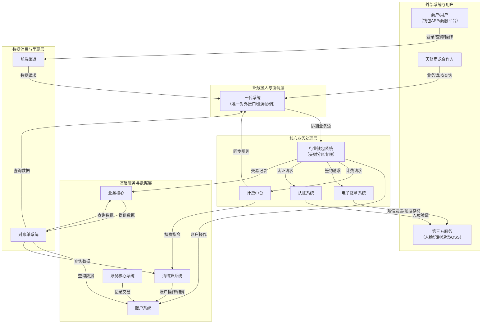
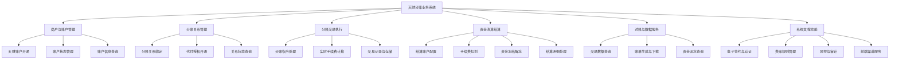
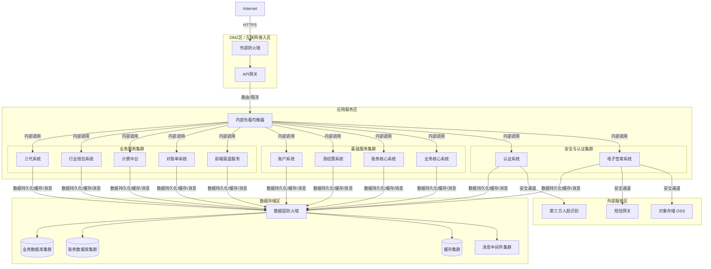
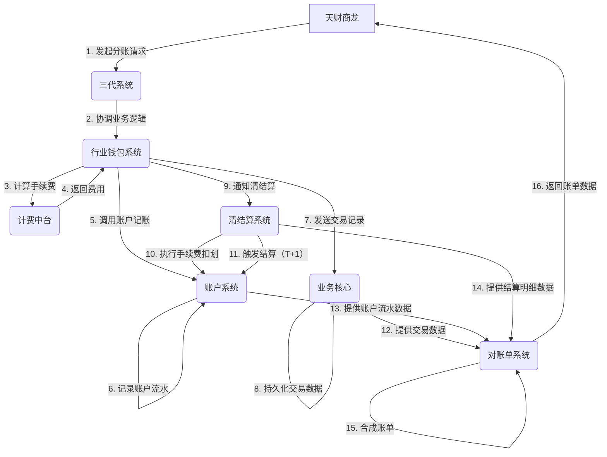
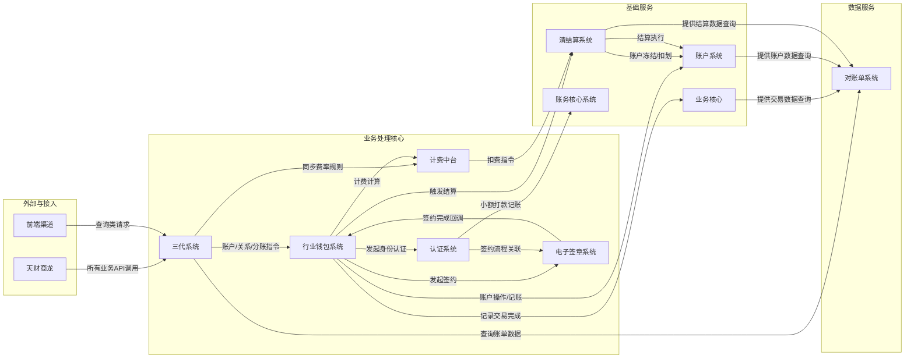

# 天财分账业务系统级设计文档

## 2.1 系统结构

天财分账业务系统采用分层、模块化的微服务架构，旨在为天财商龙合作方提供合规、高效、可追溯的资金分账服务。系统以**三代系统**作为统一对外接口和业务协调中心，以**行业钱包系统**为核心业务逻辑处理引擎，底层依赖**账户系统**、**清结算系统**等基础金融能力，并通过**电子签章**与**认证系统**确保业务关系的真实合法。整体架构遵循高内聚、低耦合原则，确保系统的可扩展性、可维护性和高可用性。

**架构说明**:
1.  **外部接入层**: 三代系统作为唯一入口，屏蔽内部复杂度，提供稳定API。
2.  **核心业务层**: 行业钱包系统串联开户、绑关系、分账等核心流程，依赖认证、签章、计费等专项服务完成特定环节。
3.  **基础服务层**: 提供账户、清算、记账等金融系统核心能力，是资金安全、准确流转的基石。
4.  **数据层**: 业务核心与账务核心分别记录业务与账务数据，为对账单系统提供可靠数据源。
5.  **呈现层**: 对账单系统满足机构对账需求，前端渠道为商户提供自助服务。

## 2.2 功能结构

系统功能围绕“天财分账”业务的生命周期进行组织，涵盖商户准入、关系建立、交易执行、资金结算及数据服务全流程。

**功能模块说明**:
- **商户与账户管理**: 负责天财专用账户的创建、升级、状态维护与查询，是业务参与方的准入基础。
- **分账关系管理**: 通过电子签约、小额打款/人脸认证建立并管理付方与收方之间的分账授权关系。
- **分账交易执行**: 处理归集、批量付款、会员结算等场景下的资金划转，协调计费并记录交易。
- **资金清算结算**: 执行资金的实际清算、手续费扣收、账户冻结及结算到银行卡等操作。
- **对账与数据服务**: 整合多源数据，为天财机构提供交易明细、汇总账单及资金流水查询。
- **系统支撑功能**: 提供签约、认证、计费规则、风控、前端交互等支撑业务运行的必要能力。

## 2.3 网络拓扑图

系统部署在私有云或金融级云平台内，采用分区隔离策略，确保不同安全等级模块间的访问可控。外部访问通过API网关接入，内部服务间通过服务网格或内网负载均衡进行通信。

**部署说明**:
1.  **安全隔离**: 网络分为DMZ区、应用区、数据区，通过防火墙严格管控流量。
2.  **高可用**: 关键服务与中间件均采用集群部署，消除单点故障。
3.  **外部集成**: 与第三方服务通过专线或VPN建立安全、稳定的连接。
4.  **内部通信**: 服务间通过内网域名和负载均衡器调用，保证高效与可靠。

## 2.4 数据流转

数据流转核心围绕“一笔分账交易”的生命周期展开，涉及业务数据、资金指令和账务记录在多系统间的传递与同步。

**关键数据流说明**:
1.  **业务请求流**: 外部请求经三代系统路由至行业钱包系统，驱动核心业务流程。
2.  **资金处理流**: 行业钱包系统驱动账户系统完成实时记账，清结算系统在事后完成手续费扣划和资金结算。
3.  **数据记录流**: 交易数据由业务核心持久化，账户流水、结算明细由各自系统记录，共同构成完整的业务视图。
4.  **对账数据流**: 对账单系统作为数据消费者，从业务核心、账户系统、清结算系统拉取数据，加工后提供给天财机构。

## 2.5 系统模块交互关系

各模块通过清晰的接口契约进行协作，形成松耦合的依赖关系。下图展示了核心的业务交互场景。

**交互关系详解**:
- **三代系统**是枢纽，对外统一，对内协调，重度依赖**行业钱包系统**处理具体业务。
- **行业钱包系统**是业务流程的“总导演”，串联起**账户系统**（资金操作）、**认证/签章系统**（合规保障）、**计费中台**（费用计算）、**业务核心**（数据留存）和**清结算系统**（事后结算）。
- **认证系统**与**电子签章系统**协作，共同完成关系绑定的合规流程，并依赖**账务核心系统**完成小额打款。
- **对账单系统**是主要的数据消费者，从**业务核心**、**账户系统**、**清结算系统**和**三代系统**获取原始数据，加工后输出。
- **清结算系统**和**计费中台**作为资金处理的关键环节，最终通过**账户系统**完成所有资金变动。