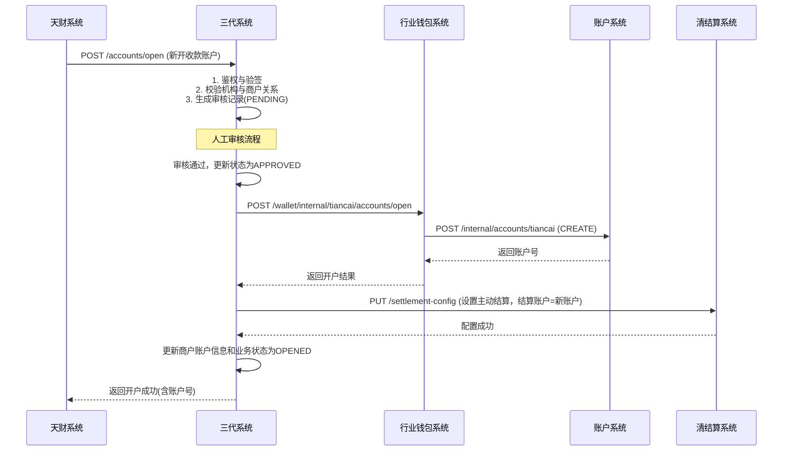
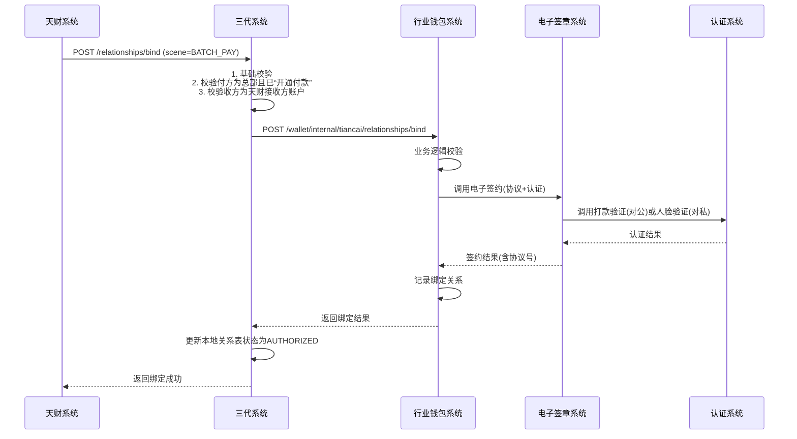
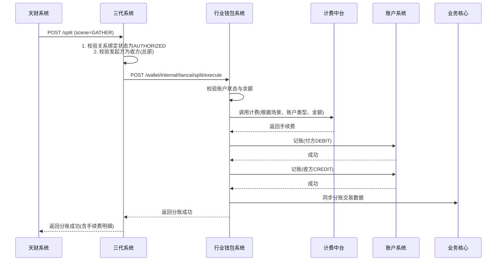

# 模块设计: 三代系统

生成时间: 2026-01-16 17:46:58

---

# 三代系统模块设计文档（天财分账专项）

## 1. 概述

### 1.1 目的
本模块（三代系统）作为拉卡拉支付系统的核心业务层和网关，是“天财分账”业务对外部合作方（天财商龙）的唯一接口入口和内部业务协调中心。核心目的是：
1.  **对外接口网关**：为天财系统提供开户、关系绑定、分账等所有业务接口，并负责身份鉴权、流量控制、参数校验和协议转换。
2.  **业务协调与路由**：接收天财请求后，根据业务场景协调调用下游子系统（行业钱包、清结算、电子签章等），驱动业务流程流转。
3.  **业务配置与管理**：负责天财机构下商户的结算模式配置、分账手续费配置、以及业务开通的审核流程管理。
4.  **数据同步与标记**：在关键业务节点（如开户）为请求打上“天财”标记，并确保相关信息在上下游系统间同步。

### 1.2 范围
- **对外接口服务**：面向天财系统的RESTful API，涵盖开户、关系绑定、分账、查询等。
- **机构与商户管理**：管理天财机构号及其下属商户，控制业务开通权限。
- **业务审核流程**：处理天财提交的业务开通申请（线上/线下），审核通过后触发系统配置。
- **内部服务调用**：调用行业钱包、清结算等内部系统，完成具体业务操作。
- **配置管理**：配置商户结算模式（主动/被动）、分账手续费规则等。
- **数据标记与透传**：确保天财业务请求在系统链路中带有明确标识。

## 2. 接口设计

### 2.1 对外API端点 (RESTful - 供天财系统调用)

所有接口需通过机构号(`orgNo`)和AppID进行身份鉴权。请求和响应体均采用JSON格式。

#### 2.1.1 开户接口
- **端点**：`POST /api/v1/tiancai/accounts/open`
- **描述**：为天财机构下的商户开通天财专用账户（收款账户或接收方账户）。支持新开和升级。
- **请求头**：`X-App-Id`, `X-Org-No`, `X-Signature` (签名)
- **请求体**：
```json
{
  "requestId": "TC202501160001", // 天财请求流水号
  "merchantNo": "866123456789", // 目标商户号
  "accountType": "COLLECT" | "RECEIVER", // 账户类型：收款账户 | 接收方账户
  "role": "HEADQUARTERS" | "STORE", // 角色：总部 | 门店 (仅收款账户有效)
  "operationType": "CREATE" | "UPGRADE", // 操作类型：新开 | 升级
  "effectiveTime": "2025-01-17 00:00:00" // 期望生效时间（用于切换结算模式）
}
```
- **响应体**：
```json
{
  "code": "SUCCESS",
  "message": "开户成功",
  "data": {
    "requestId": "TC202501160001",
    "accountNo": "TC_C_LKL00120250116000001", // 生成的天财专用账户号
    "accountType": "TIANCAI_COLLECT",
    "status": "ACTIVE",
    "effectiveTime": "2025-01-17 00:00:00"
  }
}
```

#### 2.1.2 关系绑定/归集授权接口
- **端点**：`POST /api/v1/tiancai/relationships/bind`
- **描述**：建立分账付方与收方之间的授权关系，触发协议签署和身份认证流程。
- **请求体**：
```json
{
  "requestId": "TC202501160002",
  "scene": "GATHER" | "BATCH_PAY" | "MEMBER_SETTLE", // 场景：归集 | 批量付款 | 会员结算
  "initiatorMerchantNo": "866123456789", // 发起方商户号（总部）
  "initiatorMerchantName": "XX餐饮总部有限公司",
  "payerMerchantNo": "866123456790", // 付方商户号
  "payerAccountNo": "TC_C_...", // 付方账户号（天财收款账户）
  "payeeMerchantNo": "866123456791", // 收方商户号（接收方或门店）
  "payeeAccountNo": "TC_R_...", // 收方账户号
  "fundPurpose": "资金归集", // 资金用途
  "authContactPhone": "13800138000", // 授权联系人手机号（归集场景为门店联系人）
  "authContactName": "张三" // 授权联系人姓名
}
```
- **响应体**：
```json
{
  "code": "SUCCESS",
  "message": "关系绑定请求已受理，请等待短信认证",
  "data": {
    "requestId": "TC202501160002",
    "bindRequestNo": "BRN20250116000001", // 三代生成的绑定请求流水号
    "status": "PROCESSING",
    "nextStep": "SMS_VERIFICATION" // 下一步：短信验证
  }
}
```

#### 2.1.3 开通付款接口
- **端点**：`POST /api/v1/tiancai/payment/enable`
- **描述**：在批量付款和会员结算场景下，付方（总部）需额外进行的代付授权流程。
- **请求体**：
```json
{
  "requestId": "TC202501160003",
  "payerMerchantNo": "866123456789", // 付方商户号（总部）
  "payerAccountNo": "TC_C_...",
  "scene": "BATCH_PAY" | "MEMBER_SETTLE", // 适用场景
  "fundPurpose": "供应商付款" // 资金用途
}
```
- **响应体**：同关系绑定接口。

#### 2.1.4 分账（转账）接口
- **端点**：`POST /api/v1/tiancai/split`
- **描述**：执行天财专用账户间的资金划转，支持归集、批量付款、会员结算三种场景。
- **请求体**：
```json
{
  "requestId": "TC202501160004",
  "scene": "GATHER" | "BATCH_PAY" | "MEMBER_SETTLE",
  "initiatorMerchantNo": "866123456789", // 发起指令的商户号（总部）
  "payerMerchantNo": "866123456790",
  "payerAccountNo": "TC_C_...",
  "payeeMerchantNo": "866123456791",
  "payeeAccountNo": "TC_R_...",
  "amount": 10000, // 分账金额（单位：分）
  "feeBearer": "PAYER" | "PAYEE", // 手续费承担方：付方 | 收方
  "remark": "1月品牌管理费" // 业务备注
}
```
- **响应体**：
```json
{
  "code": "SUCCESS",
  "message": "分账成功",
  "data": {
    "requestId": "TC202501160004",
    "splitOrderNo": "SON20250116000001", // 分账订单号
    "amount": 10000,
    "fee": 10, // 手续费
    "netAmount": 9990, // 净额
    "status": "SUCCESS",
    "completeTime": "2025-01-16 14:30:00"
  }
}
```

#### 2.1.5 业务开通审核状态查询接口
- **端点**：`GET /api/v1/tiancai/audit/status`
- **描述**：查询商户开通天财分账业务的审核状态。
- **查询参数**：`merchantNo` (商户号), `auditRequestNo` (审核流水号，可选)
- **响应体**：
```json
{
  "code": "SUCCESS",
  "data": {
    "merchantNo": "866123456789",
    "auditRequestNo": "ARN202501150001",
    "auditStatus": "PENDING" | "APPROVED" | "REJECTED",
    "applyTime": "2025-01-15 10:00:00",
    "auditTime": "2025-01-16 09:30:00",
    "auditComment": "审核通过",
    "effectiveAccountNo": "TC_C_..." // 审核通过后生效的账户号
  }
}
```

#### 2.1.6 账户信息查询接口
- **端点**：`GET /api/v1/tiancai/accounts/{accountNo}`
- **描述**：查询天财专用账户的详细信息。
- **响应体**：
```json
{
  "code": "SUCCESS",
  "data": {
    "accountNo": "TC_C_...",
    "merchantNo": "866123456789",
    "accountType": "TIANCAI_COLLECT",
    "role": "HEADQUARTERS",
    "status": "ACTIVE",
    "balance": 1000000,
    "settlementMode": "ACTIVE", // 结算模式：ACTIVE-主动， PASSIVE-被动
    "defaultSettlementAccount": "TC_C_...", // 默认结算账户
    "createdTime": "2025-01-16 10:00:00"
  }
}
```

### 2.2 内部接口（供三代系统内部服务调用）

#### 2.2.1 调用行业钱包系统
- **开户请求**：`POST /wallet/internal/tiancai/accounts/open` (转发天财开户请求)
- **关系绑定请求**：`POST /wallet/internal/tiancai/relationships/bind`
- **分账请求**：`POST /wallet/internal/tiancai/split/execute`

#### 2.2.2 调用清结算系统
- **结算模式配置**：`PUT /settlement/internal/merchants/{merchantNo}/settlement-config`
- **退货模式查询**：`GET /settlement/internal/merchants/{merchantNo}/refund-mode`

### 2.3 发布/消费的事件

#### 2.3.1 消费的事件
- **AccountOpenedEvent** (来自行业钱包)：监听天财专用账户开户成功事件，更新本地商户的账户信息和结算配置。
- **RelationshipBoundEvent** (来自行业钱包)：监听关系绑定完成事件，更新本地绑定关系状态。
- **SplitCompletedEvent** (来自行业钱包)：监听分账完成事件，用于业务监控和统计。

#### 2.3.2 发布的事件
- **TiancaiAuditApprovedEvent**：当天财业务开通审核通过时发布，触发开户流程。
  - **主题**：`tiancai.audit.approved`
  - **数据**：`{“auditRequestNo”: “xxx”, “merchantNo”: “xxx”, “accountType”: “COLLECT”, “role”: “HEADQUARTERS”, “operator”: “admin”}`
- **MerchantSettlementModeChangedEvent**：当商户结算模式变更时发布。
  - **主题**：`merchant.settlement.mode.changed`
  - **数据**：`{“merchantNo”: “xxx”, “oldMode”: “PASSIVE”, “newMode”: “ACTIVE”, “settlementAccount”: “TC_C_...”, “changeTime”: “...”}`

## 3. 数据模型

### 3.1 核心表设计

**1. 天财机构商户关系表 (tiancai_org_merchant)**
存储天财机构与其下属商户的关联及业务开通状态。
```sql
CREATE TABLE `tiancai_org_merchant` (
  `id` bigint(20) NOT NULL AUTO_INCREMENT,
  `org_no` varchar(32) NOT NULL COMMENT '天财机构号',
  `merchant_no` varchar(32) NOT NULL COMMENT '商户号',
  `merchant_name` varchar(128) NOT NULL COMMENT '商户名称',
  `merchant_type` varchar(32) NOT NULL COMMENT '商户性质: ENTERPRISE, INDIVIDUAL, ...',
  `tiancai_account_no` varchar(32) DEFAULT NULL COMMENT '天财专用账户号',
  `account_role` varchar(32) DEFAULT NULL COMMENT '账户角色: HEADQUARTERS, STORE',
  `business_status` varchar(32) NOT NULL DEFAULT 'NOT_OPENED' COMMENT '业务状态: NOT_OPENED, AUDITING, OPENED, CLOSED',
  `settlement_mode` varchar(32) NOT NULL DEFAULT 'PASSIVE' COMMENT '结算模式: ACTIVE, PASSIVE',
  `default_settlement_account` varchar(32) DEFAULT NULL COMMENT '默认结算账户号',
  `audit_request_no` varchar(64) DEFAULT NULL COMMENT '最近一次审核流水号',
  `created_time` datetime NOT NULL DEFAULT CURRENT_TIMESTAMP,
  `updated_time` datetime NOT NULL DEFAULT CURRENT_TIMESTAMP ON UPDATE CURRENT_TIMESTAMP,
  PRIMARY KEY (`id`),
  UNIQUE KEY `uk_org_merchant` (`org_no`, `merchant_no`),
  KEY `idx_merchant_no` (`merchant_no`),
  KEY `idx_account_no` (`tiancai_account_no`)
) ENGINE=InnoDB COMMENT='天财机构商户关系表';
```

**2. 天财业务审核表 (tiancai_audit_request)**
记录天财业务开通的审核流程。
```sql
CREATE TABLE `tiancai_audit_request` (
  `id` bigint(20) NOT NULL AUTO_INCREMENT,
  `audit_request_no` varchar(64) NOT NULL COMMENT '审核流水号',
  `org_no` varchar(32) NOT NULL,
  `merchant_no` varchar(32) NOT NULL,
  `apply_type` varchar(32) NOT NULL COMMENT '申请类型: OPEN_ACCOUNT, UPGRADE_ACCOUNT',
  `account_type` varchar(32) NOT NULL COMMENT '申请账户类型: COLLECT, RECEIVER',
  `role` varchar(32) DEFAULT NULL COMMENT '申请角色',
  `apply_materials` json DEFAULT NULL COMMENT '申请材料信息(JSON)',
  `apply_time` datetime NOT NULL,
  `audit_status` varchar(32) NOT NULL DEFAULT 'PENDING' COMMENT '审核状态: PENDING, APPROVED, REJECTED',
  `auditor` varchar(64) DEFAULT NULL COMMENT '审核人',
  `audit_time` datetime DEFAULT NULL,
  `audit_comment` varchar(512) DEFAULT NULL COMMENT '审核意见',
  `effective_time` datetime DEFAULT NULL COMMENT '期望生效时间',
  `created_time` datetime NOT NULL DEFAULT CURRENT_TIMESTAMP,
  PRIMARY KEY (`id`),
  UNIQUE KEY `uk_audit_request_no` (`audit_request_no`),
  KEY `idx_merchant_status` (`merchant_no`, `audit_status`)
) ENGINE=InnoDB COMMENT='天财业务审核表';
```

**3. 天财分账关系表 (tiancai_split_relationship)**
存储已建立的分账授权关系。
```sql
CREATE TABLE `tiancai_split_relationship` (
  `id` bigint(20) NOT NULL AUTO_INCREMENT,
  `relationship_no` varchar(64) NOT NULL COMMENT '关系编号',
  `scene` varchar(32) NOT NULL COMMENT '场景: GATHER, BATCH_PAY, MEMBER_SETTLE',
  `payer_merchant_no` varchar(32) NOT NULL COMMENT '付方商户号',
  `payer_account_no` varchar(32) NOT NULL COMMENT '付方账户号',
  `payee_merchant_no` varchar(32) NOT NULL COMMENT '收方商户号',
  `payee_account_no` varchar(32) NOT NULL COMMENT '收方账户号',
  `fund_purpose` varchar(64) NOT NULL COMMENT '资金用途',
  `protocol_no` varchar(64) NOT NULL COMMENT '协议编号',
  `auth_status` varchar(32) NOT NULL DEFAULT 'UNAUTHORIZED' COMMENT '授权状态: UNAUTHORIZED, AUTHORIZED, EXPIRED, REVOKED',
  `auth_time` datetime DEFAULT NULL COMMENT '授权时间',
  `expire_time` datetime DEFAULT NULL COMMENT '授权过期时间',
  `created_time` datetime NOT NULL DEFAULT CURRENT_TIMESTAMP,
  `updated_time` datetime NOT NULL DEFAULT CURRENT_TIMESTAMP ON UPDATE CURRENT_TIMESTAMP,
  PRIMARY KEY (`id`),
  UNIQUE KEY `uk_relationship` (`scene`, `payer_account_no`, `payee_account_no`, `fund_purpose`),
  KEY `idx_payer` (`payer_merchant_no`),
  KEY `idx_payee` (`payee_merchant_no`)
) ENGINE=InnoDB COMMENT='天财分账关系表';
```

**4. 天财分账手续费配置表 (tiancai_split_fee_config)**
存储不同场景下的分账手续费规则。
```sql
CREATE TABLE `tiancai_split_fee_config` (
  `id` bigint(20) NOT NULL AUTO_INCREMENT,
  `config_no` varchar(64) NOT NULL,
  `scene` varchar(32) NOT NULL COMMENT '场景',
  `payer_account_type` varchar(32) NOT NULL COMMENT '付方账户类型: TIANCAI_COLLECT',
  `payee_account_type` varchar(32) NOT NULL COMMENT '收方账户类型: TIANCAI_COLLECT, TIANCAI_RECEIVER',
  `fee_mode` varchar(32) NOT NULL COMMENT '计费模式: RATE, FIXED',
  `fee_rate` decimal(10,4) DEFAULT NULL COMMENT '费率(百分比)',
  `fixed_fee` decimal(20,2) DEFAULT NULL COMMENT '固定费用(分)',
  `fee_bearer_options` varchar(32) NOT NULL DEFAULT 'PAYER,PAYEE' COMMENT '手续费承担方选项: PAYER,PAYEE',
  `min_amount` decimal(20,2) DEFAULT NULL COMMENT '最低收费金额',
  `max_amount` decimal(20,2) DEFAULT NULL COMMENT '最高收费金额',
  `arrival_mode` varchar(32) NOT NULL DEFAULT 'NET' COMMENT '到账模式: NET-净额, GROSS-全额',
  `status` varchar(32) NOT NULL DEFAULT 'ACTIVE' COMMENT '状态',
  `effective_time` datetime NOT NULL COMMENT '生效时间',
  `expire_time` datetime DEFAULT NULL COMMENT '失效时间',
  `created_time` datetime NOT NULL DEFAULT CURRENT_TIMESTAMP,
  PRIMARY KEY (`id`),
  UNIQUE KEY `uk_config` (`scene`, `payer_account_type`, `payee_account_type`, `status`, `effective_time`),
  KEY `idx_scene` (`scene`)
) ENGINE=InnoDB COMMENT='天财分账手续费配置表';
```

**5. 天财接口调用日志表 (tiancai_api_log)**
记录所有天财接口的请求和响应，用于对账和排查。
```sql
CREATE TABLE `tiancai_api_log` (
  `id` bigint(20) NOT NULL AUTO_INCREMENT,
  `log_id` varchar(64) NOT NULL COMMENT '日志ID',
  `org_no` varchar(32) NOT NULL,
  `api_path` varchar(255) NOT NULL COMMENT '接口路径',
  `request_id` varchar(64) NOT NULL COMMENT '天财请求ID',
  `request_body` json DEFAULT NULL COMMENT '请求体(脱敏后)',
  `response_body` json DEFAULT NULL COMMENT '响应体',
  `http_status` int(11) NOT NULL COMMENT 'HTTP状态码',
  `biz_code` varchar(32) NOT NULL COMMENT '业务返回码',
  `cost_time` int(11) NOT NULL COMMENT '耗时(ms)',
  `client_ip` varchar(64) DEFAULT NULL COMMENT '调用方IP',
  `created_time` datetime NOT NULL DEFAULT CURRENT_TIMESTAMP,
  PRIMARY KEY (`id`),
  UNIQUE KEY `uk_log_id` (`log_id`),
  KEY `idx_request_id` (`request_id`),
  KEY `idx_org_time` (`org_no`, `created_time`)
) ENGINE=InnoDB COMMENT='天财接口调用日志表';
```

### 3.2 与其他模块的关系
- **行业钱包系统**：三代的核心下游。三代将天财的请求转发给行业钱包，由其执行具体的开户、关系绑定、分账等业务逻辑。
- **账户系统**：通过行业钱包间接交互。三代关注账户开通结果，并更新本地商户的账户信息。
- **清结算系统**：三代在开户或结算模式变更时，调用清结算配置商户的结算账户和退货模式。
- **电子签章系统**：通过行业钱包间接交互。三代关注关系绑定的最终状态。
- **对账单系统**：三代提供机构-商户关系数据，协助对账单系统匹配账户和交易。
- **风控系统**：三代接收风控指令，对商户进行业务层面的控制（如暂停分账能力）。

## 4. 业务逻辑

### 4.1 核心算法
1. **账户号映射**：维护`merchant_no`与`tiancai_account_no`的映射关系，快速定位商户的天财账户。
2. **审核流水号生成**：`ARN{yyyymmdd}{8位序列}`，保证全局唯一。
3. **关系唯一性校验**：基于`(scene, payer_account_no, payee_account_no, fund_purpose)`复合唯一键，防止重复绑定。
4. **手续费计算**：根据`tiancai_split_fee_config`配置，结合金额、场景、账户类型计算手续费。

### 4.2 业务规则
1. **接口调用权限**：
   - 所有接口必须通过机构号(`orgNo`)和AppID鉴权。
   - 只能操作本机构号下的商户。
2. **开户规则**：
   - 新开天财收款账户时，自动将商户结算模式设置为“主动结算”，结算账户设置为新开的天财收款账户。
   - 升级账户时，原账户号不变，仅底层标记变更。
   - 一个商户只能有一个天财收款账户。
   - 天财接收方账户开户需完成4要素验证（由行业钱包/三代处理）。
3. **审核流程规则**：
   - 天财提交业务开通申请（附协议等材料）。
   - 三代运营人员审核，审核通过后系统自动执行开户/升级操作。
   - 可设置生效时间（如次日0点），用于切换结算模式。
4. **关系绑定规则**：
   - **归集场景**：付方必须是门店(`STORE`)，收方必须是总部(`HEADQUARTERS`)，且发起方必须是收方（总部）。
   - **批量付款/会员结算场景**：付方必须是总部(`HEADQUARTERS`)，且发起方必须是付方（总部）。
   - 必须先完成“开通付款”授权（针对批量付款和会员结算的企业付方），才能进行关系绑定。
   - 绑定关系状态变为`AUTHORIZED`后，方可进行分账。
5. **分账规则**：
   - 分账前必须校验关系绑定状态为`AUTHORIZED`。
   - 手续费承担方(`feeBearer`)必须在配置允许的范围内。
   - 分账金额必须大于0。
6. **结算模式管理规则**：
   - 天财机构下的新商户，默认开通“主动结算”至天财收款账户。
   - 支持“主动结算”与“被动结算”切换，但仅允许天财发起切换请求。
   - 切换结算模式时，需同步更新清结算系统配置。

### 4.3 验证逻辑
1. **请求基础校验**：
   - 校验`requestId`唯一性（防重）。
   - 校验必填字段。
   - 校验金额格式和范围。
2. **业务状态校验**：
   - 开户前校验商户是否已开通天财业务，防止重复开通。
   - 关系绑定前校验付方和收方账户是否存在且状态正常。
   - 分账前校验付方账户余额是否充足。
3. **一致性校验**：
   - 校验发起方商户号(`initiatorMerchantNo`)与业务规则要求的付方/收方商户号是否一致。
   - 校验接口中的商户号是否属于调用方机构号。
4. **配置校验**：
   - 分账时校验当前时间是否有生效的手续费配置。

## 5. 时序图

### 5.1 天财开户（新开）时序图


### 5.2 关系绑定（批量付款场景）时序图


### 5.3 分账（归集场景）时序图


## 6. 错误处理

| 错误场景 | 错误码 | HTTP状态码 | 处理策略 |
| :--- | :--- | :--- | :--- |
| 鉴权失败（机构号/AppID无效） | `AUTH_FAILED` | 401 | 拒绝请求，记录安全日志。 |
| 签名错误 | `INVALID_SIGNATURE` | 401 | 拒绝请求。 |
| 请求参数缺失或格式错误 | `INVALID_PARAMETER` | 400 | 返回具体字段错误信息。 |
| 商户不存在或不属于本机构 | `MERCHANT_NOT_FOUND` | 400 | 返回错误，提示检查商户号。 |
| 商户业务未开通 | `BUSINESS_NOT_OPENED` | 400 | 引导先进行业务开通申请。 |
| 账户不存在或状态异常 | `ACCOUNT_INVALID` | 400 | 返回具体账户状态问题。 |
| 关系未绑定或未授权 | `RELATIONSHIP_UNAUTHORIZED` | 400 | 引导先完成关系绑定流程。 |
| 付方余额不足 | `INSUFFICIENT_BALANCE` | 400 | 拒绝分账。 |
| 重复请求（requestId重复） | `DUPLICATE_REQUEST` | 409 | 幂等返回原请求结果。 |
| 下游系统调用超时或异常 | `DOWNSTREAM_ERROR` | 502 | 记录详细日志，告警，返回“系统繁忙”，建议重试。 |
| 数据库异常 | `DB_ERROR` | 500 | 告警，返回系统错误。 |

**通用策略**：
- **对外接口**：所有写操作接口必须支持幂等，基于天财的`requestId`防重。
- **优雅降级**：非核心查询接口在下游异常时可返回降级数据（如缓存）；核心交易接口必须保证强一致性。
- **重试机制**：对下游调用配置合理重试策略（如超时重试2次）。
- **监控告警**：对错误率、响应时间、下游健康状态进行监控。

## 7. 依赖说明

### 7.1 上游依赖（天财系统）
- **交互方式**：同步HTTP调用。
- **职责**：三代作为服务提供方，需保证接口高可用、低延迟。需提供明确的API文档和错误码说明。
- **关键点**：
  - 接口需具备幂等性，依赖天财传递`requestId`。
  - 需制定流量控制策略，防止天财异常调用冲击系统。
  - 所有请求和响应需全量日志记录，用于对账和问题排查。

### 7.2 下游依赖（内部系统）
1. **行业钱包系统**：
   - **交互方式**：同步RPC调用（HTTP）。
   - **职责**：三代将天财请求转换为内部标准格式，调用行业钱包执行核心业务逻辑。三代需处理行业钱包返回的业务异常并转换为对天财友好的错误信息。
   - **关键点**：调用需设置超时时间，并实现熔断机制，防止行业钱包故障导致三代服务雪崩。

2. **清结算系统**：
   - **交互方式**：同步RPC调用。
   - **职责**：在开户、结算模式变更时，三代调用清结算进行配置。三代需确保配置的准确性和最终一致性。
   - **关键点**：配置操作需有确认机制，失败时需有补偿或人工干预流程。

3. **消息中间件（如Kafka）**：
   - **交互方式**：异步事件发布/订阅。
   - **职责**：三代消费下游业务完成事件，更新本地状态；发布审核通过等事件，驱动其他系统流程。
   - **关键点**：确保事件发布的可靠性（至少一次投递），消费者需处理幂等。

### 7.3 设计要点
- **松耦合与清晰边界**：三代作为网关和协调者，不应包含过多业务逻辑，业务规则应下沉到行业钱包。三代主要负责路由、校验、协议转换和状态管理。
- **数据一致性**：本地状态（如关系绑定状态）需与行业钱包保持最终一致。通过监听事件或定时对账任务解决不一致问题。
- **可观测性**：全链路日志追踪（TraceID）、关键业务指标监控（开户成功率、分账成功率、平均耗时）。
- **安全性**：接口鉴权、参数防篡改（签名）、敏感信息脱敏、防重放攻击。