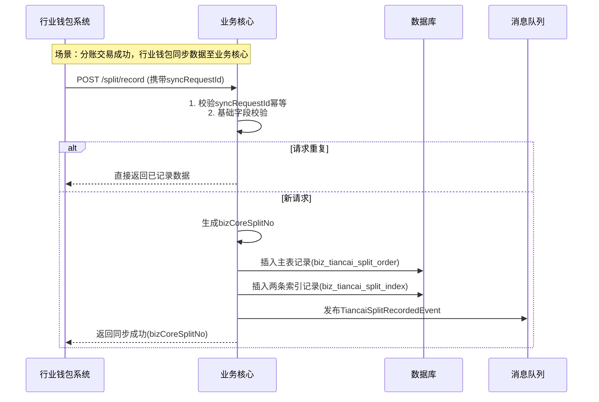
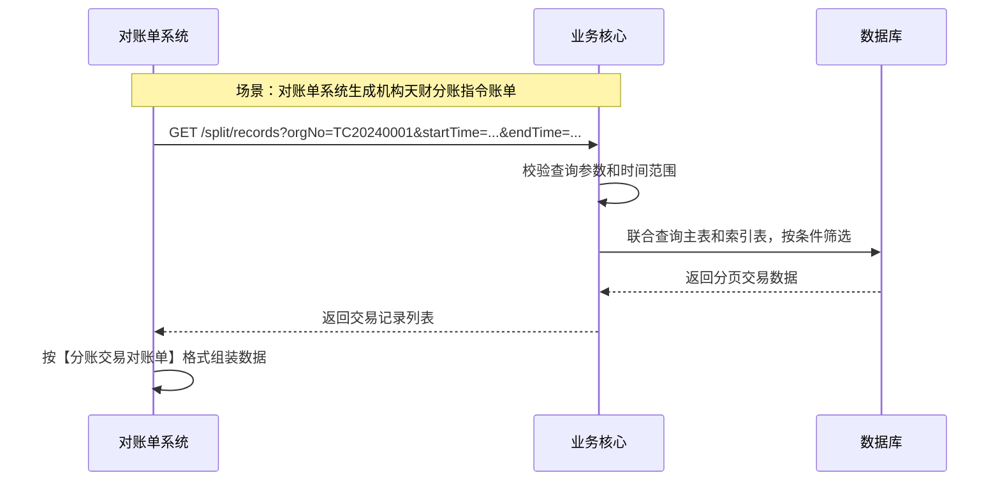
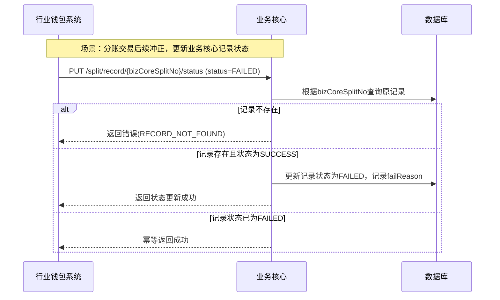

# 模块设计: 业务核心

生成时间: 2026-01-16 17:51:35

---

# 模块设计: 业务核心（天财分账专项）

生成时间: 2026-01-16 18:30:00

---

## 1. 概述

### 1.1 目的
本模块（业务核心）是“天财分账”业务的核心交易数据记录与分发中心。其主要职责是接收并持久化来自行业钱包系统的分账交易数据，为下游的对账单系统提供准确、完整、可追溯的交易数据源。业务核心不处理具体的业务逻辑（如账户操作、计费、认证），而是作为交易事实的“记录者”，确保所有天财分账交易（归集、批量付款、会员结算）都有据可查，并支持按机构、商户、账户、时间等多维度进行数据查询和账单生成。

### 1.2 范围
- **交易数据接收与存储**：通过同步接口接收行业钱包系统推送的“天财分账”交易完成数据，并持久化到本地数据库。
- **数据模型映射与丰富**：将行业钱包推送的数据，映射并丰富为业务核心内部统一的交易数据模型，便于后续查询和对账。
- **数据查询服务**：为对账单系统提供天财分账交易数据的查询接口，支持按机构、商户、时间范围、交易状态等条件进行筛选。
- **数据一致性保障**：通过幂等处理、状态同步和补偿机制，确保与行业钱包系统的交易数据最终一致。
- **交易数据归档**：管理交易数据的生命周期，支持历史数据的归档和冷热分离。

## 2. 接口设计

### 2.1 内部API端点 (RESTful - 供行业钱包系统调用)

所有接口需进行内部鉴权（如服务间Token）。

#### 2.1.1 分账交易记录同步接口
- **端点**：`POST /internal/tiancai/split/record`
- **描述**：接收行业钱包系统推送的天财分账交易完成数据。此接口为异步通知，业务核心接收后需返回确认，并保证数据最终落地。
- **调用方**：行业钱包系统
- **请求体**：
```json
{
  "syncRequestId": "SYNC_TC202501160001", // 同步请求ID，用于幂等
  "splitOrderNo": "SON20250116000001", // 三代分账订单号
  "walletSplitNo": "WSN20250116000001", // 钱包分账流水号
  "scene": "GATHER", // GATHER, BATCH_PAY, MEMBER_SETTLE
  "payerMerchantNo": "866123456790",
  "payerMerchantName": "XX餐饮XX门店",
  "payerAccountNo": "TC_C_LKL00120250115000002",
  "payerAccountType": "TIANCAI_COLLECT",
  "payerRole": "STORE", // HEADQUARTERS, STORE
  "payeeMerchantNo": "866123456789",
  "payeeMerchantName": "XX餐饮总部有限公司",
  "payeeAccountNo": "TC_C_LKL00120250115000001",
  "payeeAccountType": "TIANCAI_COLLECT", // TIANCAI_COLLECT, TIANCAI_RECEIVER
  "payeeRole": "HEADQUARTERS", // HEADQUARTERS, STORE, N/A(接收方账户)
  "amount": 10000, // 分账金额(分)
  "fee": 10, // 手续费(分)
  "feeBearer": "PAYER", // PAYER, PAYEE
  "netAmount": 9990, // 净额(分)
  "fundPurpose": "资金归集", // 资金用途
  "status": "SUCCESS", // SUCCESS, FAILED
  "failReason": "", // 失败原因
  "completeTime": "2025-01-16 14:30:00", // 交易完成时间
  "relationShipNo": "TRN202501150001", // 关联的关系编号
  "orgNo": "TC20240001", // 天财机构号
  "remark": "1月品牌管理费", // 备注
  "extInfo": { // 扩展信息，用于未来扩展
    "originalRequestId": "TC202501160003" // 三代原始请求ID
  }
}
```
- **响应体**：
```json
{
  "code": "SUCCESS",
  "message": "同步成功",
  "data": {
    "syncRequestId": "SYNC_TC202501160001",
    "bizCoreSplitNo": "BCSN20250116000001", // 业务核心分账流水号
    "syncStatus": "ACCEPTED"
  }
}
```

#### 2.1.2 分账交易状态更新接口
- **端点**：`PUT /internal/tiancai/split/record/{bizCoreSplitNo}/status`
- **描述**：允许行业钱包系统在交易状态发生变更（如冲正、失败）时，更新业务核心已记录的交易状态。主要用于异常场景的补偿。
- **调用方**：行业钱包系统
- **请求体**：
```json
{
  "syncRequestId": "SYNC_TC202501160001_U",
  "status": "FAILED", // 新状态
  "failReason": "账户系统冲正", // 失败原因
  "updateTime": "2025-01-16 14:35:00"
}
```
- **响应体**：
```json
{
  "code": "SUCCESS",
  "message": "状态更新成功"
}
```

### 2.2 内部API端点 (RESTful - 供对账单系统调用)

#### 2.2.1 天财分账交易查询接口
- **端点**：`GET /internal/tiancai/split/records`
- **描述**：为对账单系统提供天财分账交易数据的查询能力，支持多条件筛选和分页。
- **调用方**：对账单系统
- **查询参数**：
  - `orgNo` (可选): 天财机构号
  - `merchantNo` (可选): 商户号（付方或收方）
  - `accountNo` (可选): 账户号（付方或收方）
  - `scene` (可选): 场景 (GATHER, BATCH_PAY, MEMBER_SETTLE)
  - `status` (可选): 状态 (SUCCESS, FAILED)
  - `startTime` (必填): 查询开始时间 (yyyy-MM-dd HH:mm:ss)
  - `endTime` (必填): 查询结束时间 (yyyy-MM-dd HH:mm:ss)
  - `pageNo` (默认1): 页码
  - `pageSize` (默认100): 每页大小
- **响应体**：
```json
{
  "code": "SUCCESS",
  "data": {
    "total": 150,
    "pageNo": 1,
    "pageSize": 100,
    "records": [
      {
        "bizCoreSplitNo": "BCSN20250116000001",
        "splitOrderNo": "SON20250116000001",
        "walletSplitNo": "WSN20250116000001",
        "scene": "GATHER",
        "payerMerchantNo": "866123456790",
        "payerMerchantName": "XX餐饮XX门店",
        "payerAccountNo": "TC_C_LKL00120250115000002",
        "payerAccountType": "TIANCAI_COLLECT",
        "payerRole": "STORE",
        "payeeMerchantNo": "866123456789",
        "payeeMerchantName": "XX餐饮总部有限公司",
        "payeeAccountNo": "TC_C_LKL00120250115000001",
        "payeeAccountType": "TIANCAI_COLLECT",
        "payeeRole": "HEADQUARTERS",
        "amount": 10000,
        "fee": 10,
        "feeBearer": "PAYER",
        "netAmount": 9990,
        "fundPurpose": "资金归集",
        "status": "SUCCESS",
        "completeTime": "2025-01-16 14:30:00",
        "relationShipNo": "TRN202501150001",
        "orgNo": "TC20240001",
        "remark": "1月品牌管理费",
        "createdTime": "2025-01-16 14:31:00"
      }
      // ... 更多记录
    ]
  }
}
```

#### 2.2.2 天财分账交易汇总查询接口
- **端点**：`GET /internal/tiancai/split/summary`
- **描述**：为对账单系统提供天财分账交易的汇总数据，用于生成机构层账单的汇总信息。
- **调用方**：对账单系统
- **查询参数**：
  - `orgNo` (必填): 天财机构号
  - `date` (必填): 汇总日期 (yyyy-MM-dd)
  - `scene` (可选): 场景，不传则汇总所有场景
- **响应体**：
```json
{
  "code": "SUCCESS",
  "data": {
    "orgNo": "TC20240001",
    "summaryDate": "2025-01-16",
    "scene": "GATHER", // 若未指定场景，此字段为“ALL”
    "totalCount": 50, // 交易总笔数
    "totalAmount": 5000000, // 分账总金额(分)
    "totalFee": 5000, // 手续费总金额(分)
    "successCount": 48,
    "failedCount": 2,
    "detailsByFundPurpose": [ // 按资金用途细分
      {
        "fundPurpose": "资金归集",
        "count": 30,
        "amount": 3000000,
        "fee": 3000
      },
      {
        "fundPurpose": "缴纳管理费",
        "count": 20,
        "amount": 2000000,
        "fee": 2000
      }
    ]
  }
}
```

### 2.3 发布/消费的事件

#### 2.3.1 消费的事件
- **SplitCompletedEvent** (来自行业钱包系统)：监听分账交易完成事件。作为接收交易数据的另一种方式（与同步接口互为备份或用于数据校验）。
  - **主题**：`wallet.tiancai.split.completed`
  - **数据**：`{“splitOrderNo”: “xxx”, “walletSplitNo”: “xxx”, “scene”: “GATHER”, “payerAccountNo”: “xxx”, “payeeAccountNo”: “xxx”, “amount”: 10000, “fee”: 10, “status”: “SUCCESS”, “completeTime”: “...”}`

#### 2.3.2 发布的事件
- **TiancaiSplitRecordedEvent**：当成功接收并持久化一条天财分账交易记录时发布。可用于通知其他关心此数据的内部系统（如风控、数据分析）。
  - **主题**：`bizcore.tiancai.split.recorded`
  - **数据**：`{“bizCoreSplitNo”: “BCSN...”, “splitOrderNo”: “SON...”, “scene”: “GATHER”, “orgNo”: “TC20240001”, “payerMerchantNo”: “...”, “payeeMerchantNo”: “...”, “amount”: 10000, “status”: “SUCCESS”, “completeTime”: “...”}`

## 3. 数据模型

### 3.1 核心表设计

**1. 天财分账交易主表 (biz_tiancai_split_order)**
存储天财分账交易的核心信息。
```sql
CREATE TABLE `biz_tiancai_split_order` (
  `id` bigint(20) NOT NULL AUTO_INCREMENT,
  `biz_core_split_no` varchar(64) NOT NULL COMMENT '业务核心分账流水号',
  `sync_request_id` varchar(64) NOT NULL COMMENT '同步请求ID(幂等键)',
  `split_order_no` varchar(64) NOT NULL COMMENT '三代分账订单号',
  `wallet_split_no` varchar(64) NOT NULL COMMENT '钱包分账流水号',
  `scene` varchar(32) NOT NULL COMMENT 'GATHER, BATCH_PAY, MEMBER_SETTLE',
  `payer_merchant_no` varchar(32) NOT NULL COMMENT '付方商户号',
  `payer_merchant_name` varchar(128) NOT NULL COMMENT '付方商户名称',
  `payer_account_no` varchar(32) NOT NULL COMMENT '付方账户号',
  `payer_account_type` varchar(32) NOT NULL COMMENT 'TIANCAI_COLLECT, TIANCAI_RECEIVER',
  `payer_role` varchar(32) DEFAULT NULL COMMENT 'HEADQUARTERS, STORE',
  `payee_merchant_no` varchar(32) NOT NULL COMMENT '收方商户号',
  `payee_merchant_name` varchar(128) NOT NULL COMMENT '收方商户名称',
  `payee_account_no` varchar(32) NOT NULL COMMENT '收方账户号',
  `payee_account_type` varchar(32) NOT NULL COMMENT 'TIANCAI_COLLECT, TIANCAI_RECEIVER',
  `payee_role` varchar(32) DEFAULT NULL COMMENT 'HEADQUARTERS, STORE',
  `amount` decimal(20,2) NOT NULL COMMENT '分账金额(分)',
  `fee` decimal(20,2) NOT NULL DEFAULT '0.00' COMMENT '手续费(分)',
  `fee_bearer` varchar(32) NOT NULL COMMENT 'PAYER, PAYEE',
  `net_amount` decimal(20,2) NOT NULL COMMENT '净额(分)',
  `fund_purpose` varchar(64) NOT NULL COMMENT '资金用途',
  `status` varchar(32) NOT NULL DEFAULT 'SUCCESS' COMMENT 'SUCCESS, FAILED',
  `fail_reason` varchar(512) DEFAULT NULL COMMENT '失败原因',
  `complete_time` datetime NOT NULL COMMENT '交易完成时间',
  `relation_ship_no` varchar(64) DEFAULT NULL COMMENT '关联的关系编号',
  `org_no` varchar(32) NOT NULL COMMENT '天财机构号',
  `remark` varchar(256) DEFAULT NULL COMMENT '备注',
  `ext_info` json DEFAULT NULL COMMENT '扩展信息(JSON)',
  `created_time` datetime NOT NULL DEFAULT CURRENT_TIMESTAMP,
  `updated_time` datetime NOT NULL DEFAULT CURRENT_TIMESTAMP ON UPDATE CURRENT_TIMESTAMP,
  PRIMARY KEY (`id`),
  UNIQUE KEY `uk_biz_core_split_no` (`biz_core_split_no`),
  UNIQUE KEY `uk_sync_request_id` (`sync_request_id`),
  UNIQUE KEY `uk_split_order_no` (`split_order_no`),
  UNIQUE KEY `uk_wallet_split_no` (`wallet_split_no`),
  KEY `idx_org_complete_time` (`org_no`, `complete_time`),
  KEY `idx_payer_account_time` (`payer_account_no`, `complete_time`),
  KEY `idx_payee_account_time` (`payee_account_no`, `complete_time`),
  KEY `idx_scene_status` (`scene`, `status`, `complete_time`)
) ENGINE=InnoDB COMMENT='天财分账交易主表';
```

**2. 天财分账交易索引表 (biz_tiancai_split_index)**
为高频查询场景建立的索引表，支持按商户、账户、日期快速定位交易。
```sql
CREATE TABLE `biz_tiancai_split_index` (
  `id` bigint(20) NOT NULL AUTO_INCREMENT,
  `biz_core_split_no` varchar(64) NOT NULL COMMENT '业务核心分账流水号',
  `org_no` varchar(32) NOT NULL COMMENT '天财机构号',
  `merchant_no` varchar(32) NOT NULL COMMENT '关联商户号(付方或收方)',
  `account_no` varchar(32) NOT NULL COMMENT '关联账户号(付方或收方)',
  `trade_date` date NOT NULL COMMENT '交易日期(基于complete_time)',
  `scene` varchar(32) NOT NULL COMMENT '场景',
  `role` varchar(32) DEFAULT NULL COMMENT '在该交易中的角色: PAYER, PAYEE',
  `created_time` datetime NOT NULL DEFAULT CURRENT_TIMESTAMP,
  PRIMARY KEY (`id`),
  UNIQUE KEY `uk_index` (`biz_core_split_no`, `merchant_no`, `account_no`),
  KEY `idx_org_merchant_date` (`org_no`, `merchant_no`, `trade_date`),
  KEY `idx_account_date` (`account_no`, `trade_date`),
  KEY `idx_org_date_scene` (`org_no`, `trade_date`, `scene`)
) ENGINE=InnoDB COMMENT='天财分账交易索引表';
```
*说明：每笔交易会生成两条索引记录（付方和收方），便于快速查询某个商户或账户的所有交易。*

### 3.2 与其他模块的关系
- **行业钱包系统**：核心上游数据源。通过同步接口或事件接收天财分账交易数据。业务核心信任行业钱包推送的数据准确性。
- **对账单系统**：核心下游消费者。提供查询接口，供对账单系统拉取天财分账交易数据，以生成机构层的“天财分账指令账单”。
- **三代系统**：间接关联。业务核心存储的 `splitOrderNo` 与三代系统关联，可用于问题追溯。
- **账户系统**：无直接交互。但交易数据中的账户信息需与账户系统底层数据保持一致（通过行业钱包保证）。

## 4. 业务逻辑

### 4.1 核心算法
1. **分账流水号生成**：`biz_core_split_no` 生成规则：`BCSN` + 日期(yyyyMMdd) + 6位序列号（如 `BCSN20250116000001`）。
2. **同步请求幂等**：基于 `sync_request_id` 实现幂等。重复请求直接返回已记录的数据。
3. **索引记录生成**：每接收一笔成功交易，自动向索引表插入两条记录（付方和收方），以优化查询性能。
4. **数据归档策略**：交易数据按 `complete_time` 进行分区或分表（如按月），并制定策略将超过一定时间（如13个月）的数据迁移至历史表或冷存储。

### 4.2 业务规则
1. **数据接收规则**：
   - 只接收状态为 `SUCCESS` 或 `FAILED` 的最终态交易数据。`PROCESSING` 状态的数据由行业钱包维护，业务核心不记录中间状态。
   - 必须包含 `orgNo`（天财机构号），用于数据归属和隔离。
   - `sync_request_id` 必须全局唯一，由行业钱包生成并保证。
2. **数据校验规则**：
   - 基础字段非空校验：`splitOrderNo`, `walletSplitNo`, `scene`, `payerAccountNo`, `payeeAccountNo`, `amount`, `completeTime`。
   - 金额逻辑校验：`amount` > 0；`netAmount` = `amount` - `fee` (当 `feeBearer=PAYER`) 或 `netAmount` = `amount` (当 `feeBearer=PAYEE`)。
   - 场景与账户类型一致性校验（参考行业钱包规则，此处为防御性校验）：
     - `GATHER`: 付方和收方账户类型必须为 `TIANCAI_COLLECT`。
     - `BATCH_PAY`: 付方账户类型为 `TIANCAI_COLLECT`，收方为 `TIANCAI_RECEIVER`。
     - `MEMBER_SETTLE`: 付方和收方账户类型必须为 `TIANCAI_COLLECT`。
3. **数据更新规则**：
   - 交易记录一旦创建，核心字段（如金额、双方账户、场景）不允许修改。
   - 仅允许通过状态更新接口修改 `status` 和 `fail_reason` 字段，且只能从 `SUCCESS` 变更为 `FAILED`（冲正场景），不允许反向修改。
   - 状态更新也需要幂等，基于 `sync_request_id` 或 `biz_core_split_no`。

### 4.3 验证逻辑
1. **接收同步请求时**：
   - 校验 `sync_request_id` 是否已存在。若存在，直接返回已记录的数据。
   - 校验必要字段格式和有效性（如日期格式、金额为正数）。
   - 校验 `orgNo` 是否在系统允许的天财机构号白名单内（可配置）。
2. **生成索引时**：
   - 确保付方和收方的商户号、账户号在索引表中各生成一条记录。
   - 索引中的 `trade_date` 基于 `complete_time` 转换，用于按日期快速查询。
3. **响应查询请求时**：
   - 校验查询时间范围是否合理（如不能超过90天）。
   - 校验调用方（对账单系统）是否有权查询指定 `orgNo` 的数据。

## 5. 时序图

### 5.1 分账交易数据同步时序图


### 5.2 对账单系统查询分账数据时序图


### 5.3 交易状态更新（冲正）时序图


## 6. 错误处理

| 错误场景 | 错误码 | 处理策略 |
| :--- | :--- | :--- |
| 同步请求ID重复 (`sync_request_id`重复) | `DUPLICATE_SYNC_REQUEST` | 查询已记录的数据，幂等返回。 |
| 请求参数缺失或格式错误 | `INVALID_PARAMETER` | 拒绝请求，返回具体错误字段和原因。 |
| 天财机构号不在白名单内 | `ORG_NOT_ALLOWED` | 拒绝请求，记录安全日志。 |
| 金额逻辑校验失败（如netAmount计算错误） | `AMOUNT_VALIDATION_FAILED` | 拒绝请求，返回详细校验错误。 |
| 数据库写入失败（主表或索引表） | `DB_INSERT_ERROR` | 系统告警，返回系统错误。需保证事务性，主表和索引表插入应在同一事务中。 |
| 查询时间范围过大（如超过90天） | `QUERY_RANGE_TOO_LARGE` | 拒绝查询，提示缩小时间范围。 |
| 更新状态时记录不存在 | `RECORD_NOT_FOUND` | 返回错误，提示检查流水号。 |
| 更新状态违反规则（如SUCCESS->SUCCESS） | `STATUS_UPDATE_NOT_ALLOWED` | 返回错误，说明状态流转规则。 |

**通用策略**：
- **幂等性**：所有写操作接口（同步、状态更新）必须基于唯一ID实现幂等。
- **最终一致性**：与行业钱包的数据同步允许短暂延迟，但需保证最终一致。可通过定期对账任务检查数据差异。
- **优雅降级**：当数据库或下游依赖出现问题时，查询接口可返回降级结果（如仅返回基础字段），但写接口必须保证数据不丢失（可先写入本地队列或缓存）。
- **监控告警**：对同步失败率、查询超时、数据不一致告警进行监控。

## 7. 依赖说明

### 7.1 上游依赖（行业钱包系统）
- **交互方式**：同步RPC调用（HTTP）为主，异步事件（MQ）为辅。
- **职责**：业务核心被动接收行业钱包推送的最终态交易数据。行业钱包需保证数据的准确性、完整性和及时性。
- **关键点**：
  - 依赖行业钱包生成全局唯一的 `sync_request_id` 以实现幂等。
  - 依赖行业钱包在交易完成（包括失败）后及时推送数据，以确保对账单数据的时效性。
  - 行业钱包推送的数据应包含足够的信息（如机构号、商户名、账户类型、角色），以支持业务核心直接使用，避免二次查询。
  - 需与行业钱包约定数据格式版本，并考虑向前兼容。

### 7.2 下游依赖（对账单系统）
- **交互方式**：同步RPC调用（HTTP）。
- **职责**：对账单系统调用业务核心的查询接口，获取天财分账交易数据，用于生成“机构天财分账指令账单”。
- **关键点**：
  - 业务核心的查询接口需满足对账单系统的性能要求，特别是按日期范围查询大量数据时。
  - 查询结果的数据格式需与对账单系统所需的账单格式对齐，减少对账单系统的转换逻辑。
  - 需支持对账单系统可能需要的多种维度的汇总查询（如按机构、按场景、按资金用途）。

### 7.3 设计要点
- **高性能查询**：通过索引表 (`biz_tiancai_split_index`) 和合理的索引设计，优化按商户、账户、日期等维度的查询速度。考虑对大数据量表进行分区。
- **数据一致性**：作为记录系统，数据准确性至关重要。需有定期对账任务，将业务核心的记录与行业钱包、账户系统的底层流水进行比对，发现并修复不一致。
- **可扩展性**：数据模型设计应能容纳未来可能新增的天财业务场景或字段。使用 `ext_info` (JSON) 字段存储扩展信息。
- **审计与追溯**：所有交易记录不可篡改（核心字段），`updated_time` 仅用于状态更新。提供完整的操作日志，便于审计。