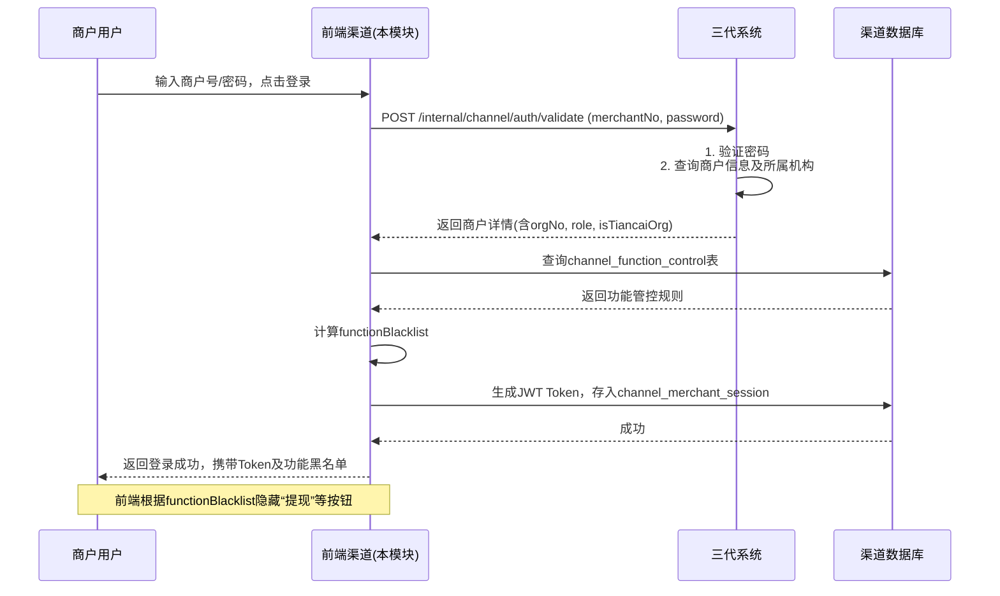
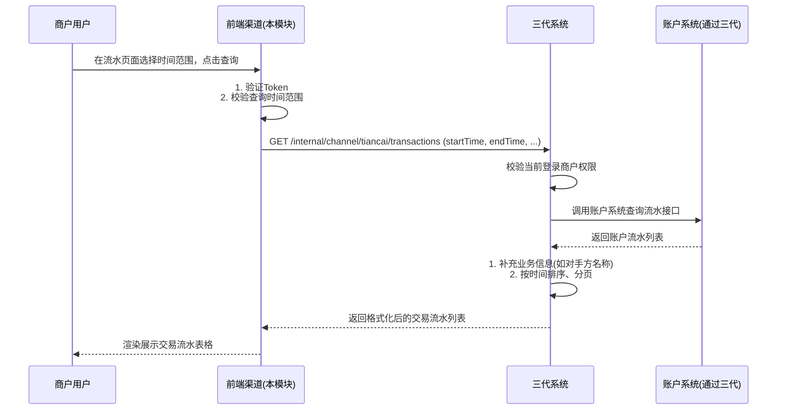
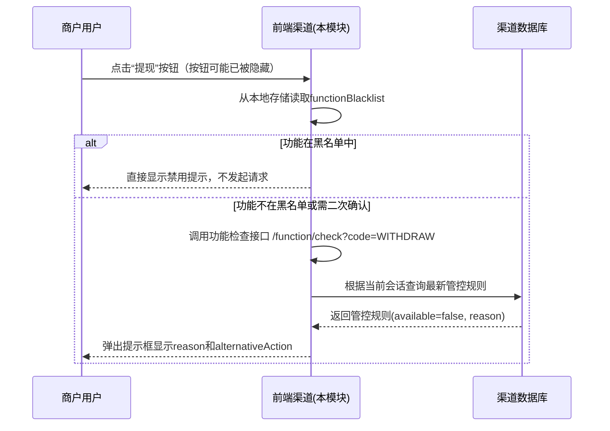

# 模块设计: 前端渠道（钱包APP/商服平台）

生成时间: 2026-01-16 17:52:41

---

# 模块设计: 前端渠道（钱包APP/商服平台）

生成时间: 2026-01-16 18:30:00

---

## 1. 概述

### 1.1 目的
本模块（前端渠道）是面向“天财分账”业务中特定机构号下商户的 **用户交互与自助服务入口**。其主要目的是为已开通天财业务的商户（总部/门店）提供便捷的账户管理、资金查询、业务状态跟踪等功能，同时根据业务要求，对特定机构号（天财机构）的商户**屏蔽或限制**标准钱包APP/商服平台中的部分功能（如提现、结算模式切换），确保资金流转严格遵循天财业务规则和流程。

### 1.2 范围
- **用户登录与权限控制**：支持天财机构号下商户使用其商户号/账户号登录，并根据其角色（总部/门店）和所属机构号展示差异化功能。
- **账户信息展示**：展示天财专用账户（收款账户/接收方账户）的余额、状态、关联银行卡、结算模式等核心信息。
- **交易流水查询**：提供天财分账交易（归集、批量付款、会员结算）、收单结算、提现等资金动账明细的查询与导出。
- **业务状态查询**：查询开户、关系绑定、分账等业务的申请与处理状态。
- **功能入口管控**：
  - **全局管控**：对于标记为“天财机构”的商户，在前端渠道**隐藏或禁用**“主动提现”和“结算模式切换”功能入口。
  - **差异化展示**：根据商户角色（总部/门店）展示不同的功能模块和信息。
- **信息通知**：展示来自系统（如认证短信、业务审核结果）的重要通知。

## 2. 接口设计

### 2.1 内部API端点 (RESTful - 供前端调用)

所有接口需进行用户会话鉴权（Token）。

#### 2.1.1 用户登录与信息获取
- **端点**：`POST /api/v1/channel/auth/login`
- **描述**：商户使用商户号/账户号及密码登录，系统识别其所属机构号及角色。
- **请求体**：
```json
{
  "loginId": "866123456789", // 商户号或天财账户号
  "password": "加密密码",
  "channel": "APP" | "WEB" // 渠道：钱包APP | 商服平台
}
```
- **响应体**：
```json
{
  "code": "SUCCESS",
  "data": {
    "token": "JWT_TOKEN",
    "merchantNo": "866123456789",
    "merchantName": "XX餐饮总部有限公司",
    "accountNo": "TC_C_LKL00120250116000001",
    "accountType": "TIANCAI_COLLECT",
    "role": "HEADQUARTERS",
    "orgNo": "TC20240001",
    "orgName": "天财商龙",
    "isTiancaiOrg": true, // 关键标识：是否属于天财机构
    "functionBlacklist": ["WITHDRAW", "SETTLEMENT_MODE_SWITCH"], // 功能黑名单
    "permissions": ["VIEW_ACCOUNT", "VIEW_TRADE", "QUERY_BIND_STATUS"] // 可用权限列表
  }
}
```

#### 2.1.2 账户概览信息查询
- **端点**：`GET /api/v1/channel/tiancai/account/overview`
- **描述**：获取天财专用账户的核心概览信息，包括余额、状态、结算账户等。
- **响应体**：
```json
{
  "code": "SUCCESS",
  "data": {
    "accountNo": "TC_C_...",
    "accountType": "TIANCAI_COLLECT",
    "role": "HEADQUARTERS",
    "balance": 1500000, // 可用余额（分）
    "frozenBalance": 0, // 冻结金额（分）
    "status": "ACTIVE",
    "settlementMode": "ACTIVE",
    "defaultSettlementAccount": "TC_C_...",
    "bankCard": {
      "cardNoSuffix": "4567",
      "bankName": "建设银行",
      "cardholderName": "XX公司"
    },
    "todayIncome": 500000, // 今日收入（分）
    "todayExpenditure": 300000 // 今日支出（分）
  }
}
```

#### 2.1.3 交易流水查询
- **端点**：`GET /api/v1/channel/tiancai/transactions`
- **描述**：分页查询账户的资金流水，包括分账、收单结算、提现等。
- **查询参数**：
  - `startTime` (必填): 查询开始时间，格式 `yyyy-MM-dd HH:mm:ss`
  - `endTime` (必填): 查询结束时间
  - `pageNo`: 页码，默认1
  - `pageSize`: 页大小，默认20
  - `tradeType` (可选): 交易类型 `TIANCAI_SPLIT`(天财分账), `SETTLEMENT`(收单结算), `WITHDRAW`(提现), `REFUND`(退货)
  - `scene` (可选，仅对天财分账有效): `GATHER`, `BATCH_PAY`, `MEMBER_SETTLE`
- **响应体**：
```json
{
  "code": "SUCCESS",
  "data": {
    "total": 150,
    "pageNo": 1,
    "pageSize": 20,
    "list": [
      {
        "tradeNo": "SON20250116000001",
        "tradeTime": "2025-01-16 14:30:00",
        "tradeType": "TIANCAI_SPLIT",
        "scene": "GATHER",
        "counterpartyName": "XX餐饮杭州店",
        "counterpartyAccountNo": "TC_C_...",
        "amount": -10000, // 负数为支出，正数为收入
        "fee": 10,
        "feeBearer": "PAYER",
        "balance": 1490000, // 交易后余额
        "fundPurpose": "资金归集",
        "status": "SUCCESS",
        "remark": "1月品牌管理费"
      },
      {
        "tradeNo": "ST20250116000001",
        "tradeTime": "2025-01-17 09:00:00",
        "tradeType": "SETTLEMENT",
        "counterpartyName": "拉卡拉清算中心",
        "amount": 500000,
        "balance": 1990000,
        "status": "SUCCESS",
        "remark": "D+1收单结算"
      }
    ]
  }
}
```

#### 2.1.4 业务状态查询
- **端点**：`GET /api/v1/channel/tiancai/business/status`
- **描述**：查询与当前商户相关的关键业务处理状态，如开户审核、关系绑定等。
- **查询参数**：
  - `bizType` (可选): `ACCOUNT_OPEN`, `RELATIONSHIP_BIND`, `SPLIT_ORDER`
  - `bizNo` (可选): 业务流水号，如审核流水号、绑定请求号、分账订单号
- **响应体**：
```json
{
  "code": "SUCCESS",
  "data": {
    "bizType": "ACCOUNT_OPEN",
    "bizNo": "ARN202501150001",
    "applyTime": "2025-01-15 10:00:00",
    "status": "APPROVED",
    "statusDesc": "审核通过",
    "auditTime": "2025-01-16 09:30:00",
    "auditComment": "材料齐全，符合要求",
    "effectiveAccountNo": "TC_C_...",
    "effectiveTime": "2025-01-17 00:00:00"
  }
}
```

#### 2.1.5 绑定关系查询
- **端点**：`GET /api/v1/channel/tiancai/relationships`
- **描述**：查询当前商户作为付方或收方已建立的绑定关系。
- **查询参数**：
  - `role` (可选): `PAYER`(作为付方), `PAYEE`(作为收方)
  - `scene` (可选): `GATHER`, `BATCH_PAY`, `MEMBER_SETTLE`
- **响应体**：
```json
{
  "code": "SUCCESS",
  "data": [
    {
      "relationshipNo": "TRN202501150001",
      "scene": "GATHER",
      "role": "PAYEE", // 当前商户在此关系中的角色
      "counterpartyName": "XX餐饮杭州店",
      "counterpartyAccountNo": "TC_C_...",
      "fundPurpose": "资金归集",
      "authStatus": "AUTHORIZED",
      "authTime": "2025-01-15 15:30:00",
      "expireTime": "2026-01-15 15:30:00",
      "protocolNo": "EP202501150001"
    }
  ]
}
```

#### 2.1.6 功能权限检查接口
- **端点**：`GET /api/v1/channel/function/check`
- **描述**：检查特定功能对当前登录商户是否可用。前端根据此接口动态控制按钮显示/隐藏、页面跳转。
- **查询参数**：`functionCode` (必填): 功能代码，如 `WITHDRAW`, `SETTLEMENT_MODE_SWITCH`
- **响应体**：
```json
{
  "code": "SUCCESS",
  "data": {
    "functionCode": "WITHDRAW",
    "available": false, // 是否可用
    "reason": "当前账户为天财专用账户，提现功能已由天财系统统一管理。", // 不可用时的提示信息
    "alternativeAction": "如需提现，请通过天财系统发起指令。" // 替代操作指引
  }
}
```

### 2.2 发布/消费的事件

#### 2.2.1 消费的事件
- **AccountOpenedEvent** (来自行业钱包/三代)：监听天财账户开户/升级成功事件，更新本地缓存的账户信息。
- **SplitCompletedEvent** (来自行业钱包)：监听分账完成事件，可用于实时刷新交易流水页面或推送通知。
- **MerchantSettlementModeChangedEvent** (来自三代)：监听结算模式变更事件，更新本地账户概览中的结算模式信息。
- **RelationshipBoundEvent** (来自行业钱包)：监听关系绑定完成事件，更新本地绑定关系列表。

#### 2.2.2 发布的事件
本模块主要为展示层，通常不发布业务事件。但可发布用户行为事件用于运营分析。
- **UserLoginEvent**：用户登录成功时发布。
  - **主题**：`channel.user.login`
  - **数据**：`{“merchantNo”: “xxx”, “accountNo”: “xxx”, “channel”: “APP”, “loginTime”: “...”}` (需脱敏)

## 3. 数据模型

### 3.1 核心表设计

**1. 渠道商户会话表 (channel_merchant_session)**
存储商户登录会话信息，用于鉴权和功能管控。
```sql
CREATE TABLE `channel_merchant_session` (
  `id` bigint(20) NOT NULL AUTO_INCREMENT,
  `session_id` varchar(64) NOT NULL COMMENT '会话ID (JWT Token payload ID)',
  `merchant_no` varchar(32) NOT NULL COMMENT '商户号',
  `account_no` varchar(32) NOT NULL COMMENT '当前登录的账户号',
  `org_no` varchar(32) NOT NULL COMMENT '所属机构号',
  `is_tiancai_org` tinyint(1) NOT NULL DEFAULT 0 COMMENT '是否天财机构',
  `function_blacklist` json DEFAULT NULL COMMENT '功能黑名单列表，JSON数组',
  `login_channel` varchar(16) NOT NULL COMMENT '登录渠道: APP, WEB',
  `login_ip` varchar(64) DEFAULT NULL,
  `login_time` datetime NOT NULL DEFAULT CURRENT_TIMESTAMP,
  `last_active_time` datetime NOT NULL DEFAULT CURRENT_TIMESTAMP ON UPDATE CURRENT_TIMESTAMP,
  `expire_time` datetime NOT NULL COMMENT '会话过期时间',
  PRIMARY KEY (`id`),
  UNIQUE KEY `uk_session_id` (`session_id`),
  KEY `idx_merchant_session` (`merchant_no`, `account_no`, `expire_time`),
  KEY `idx_expire_time` (`expire_time`) COMMENT '用于清理过期会话'
) ENGINE=InnoDB COMMENT='渠道商户会话表';
```

**2. 渠道功能管控配置表 (channel_function_control)**
配置不同机构类型、商户角色下的功能可用性。
```sql
CREATE TABLE `channel_function_control` (
  `id` bigint(20) NOT NULL AUTO_INCREMENT,
  `function_code` varchar(64) NOT NULL COMMENT '功能代码',
  `function_name` varchar(128) NOT NULL COMMENT '功能名称',
  `channel` varchar(16) NOT NULL COMMENT '适用渠道: ALL, APP, WEB',
  `org_type` varchar(32) NOT NULL DEFAULT 'ALL' COMMENT '机构类型: ALL, TIANCAI, NON_TIANCAI',
  `merchant_role` varchar(32) DEFAULT NULL COMMENT '商户角色: HEADQUARTERS, STORE, ALL',
  `is_available` tinyint(1) NOT NULL DEFAULT 1 COMMENT '是否可用',
  `unavailable_reason` varchar(512) DEFAULT NULL COMMENT '不可用时的提示原因',
  `alternative_action` varchar(512) DEFAULT NULL COMMENT '替代操作指引',
  `priority` int(11) NOT NULL DEFAULT 0 COMMENT '优先级，数值越大优先级越高',
  `status` varchar(32) NOT NULL DEFAULT 'ACTIVE' COMMENT '状态',
  `created_time` datetime NOT NULL DEFAULT CURRENT_TIMESTAMP,
  `updated_time` datetime NOT NULL DEFAULT CURRENT_TIMESTAMP ON UPDATE CURRENT_TIMESTAMP,
  PRIMARY KEY (`id`),
  UNIQUE KEY `uk_function_control` (`function_code`, `channel`, `org_type`, `merchant_role`, `status`),
  KEY `idx_function_code` (`function_code`)
) ENGINE=InnoDB COMMENT='渠道功能管控配置表';
```
**示例配置数据**：
| function_code | org_type | merchant_role | is_available | unavailable_reason |
| :--- | :--- | :--- | :--- | :--- |
| WITHDRAW | TIANCAI | ALL | 0 | 当前账户为天财专用账户，提现功能已由天财系统统一管理。 |
| SETTLEMENT_MODE_SWITCH | TIANCAI | ALL | 0 | 天财专用账户的结算模式由天财系统统一配置，不可自行切换。 |
| WITHDRAW | NON_TIANCAI | ALL | 1 | NULL |
| ACCOUNT_UPGRADE | TIANCAI | HEADQUARTERS | 0 | 天财总部账户升级需通过天财系统申请。 |

**3. 渠道操作日志表 (channel_operation_log)**
记录用户在前端的关键操作，用于审计和问题排查。
```sql
CREATE TABLE `channel_operation_log` (
  `id` bigint(20) NOT NULL AUTO_INCREMENT,
  `log_no` varchar(64) NOT NULL COMMENT '日志流水号',
  `merchant_no` varchar(32) NOT NULL,
  `account_no` varchar(32) NOT NULL,
  `channel` varchar(16) NOT NULL,
  `operation` varchar(64) NOT NULL COMMENT '操作类型: LOGIN, QUERY_ACCOUNT, QUERY_TRADE',
  `operation_detail` varchar(512) DEFAULT NULL COMMENT '操作详情',
  `request_params` json DEFAULT NULL COMMENT '请求参数(脱敏)',
  `ip_address` varchar(64) DEFAULT NULL,
  `user_agent` varchar(512) DEFAULT NULL,
  `result` varchar(32) NOT NULL COMMENT 'SUCCESS, FAILED',
  `error_code` varchar(64) DEFAULT NULL,
  `cost_time` int(11) NOT NULL COMMENT '耗时(ms)',
  `created_time` datetime NOT NULL DEFAULT CURRENT_TIMESTAMP,
  PRIMARY KEY (`id`),
  UNIQUE KEY `uk_log_no` (`log_no`),
  KEY `idx_merchant_time` (`merchant_no`, `created_time`),
  KEY `idx_operation` (`operation`, `created_time`)
) ENGINE=InnoDB COMMENT='渠道操作日志表';
```

### 3.2 与其他模块的关系
- **三代系统**：**核心数据源**。通过内部接口调用，获取商户的机构信息、账户详情、业务状态、绑定关系等。是判断“是否天财机构”和获取业务数据的权威来源。
- **行业钱包系统**：通过三代间接获取数据。前端渠道不直接调用行业钱包。
- **账户系统**：通过三代间接获取账户余额、流水等核心账务信息。
- **对账单系统**：可能直接或间接调用，获取更详细的账单数据（如结算明细）。
- **清结算系统**：无直接交互，结算信息通过账户流水体现。

## 4. 业务逻辑

### 4.1 核心算法
1. **功能可用性决策算法**：
   - 用户登录后，根据其 `org_no` 判断 `is_tiancai_org`。
   - 查询 `channel_function_control` 表，根据 `function_code`、`channel`、`org_type` (`TIANCAI`/`NON_TIANCAI`)、`merchant_role` 匹配规则。
   - 按 `priority` 降序排序，取第一条匹配的记录作为最终控制规则。
   - 将不可用的功能码列表存入会话 (`function_blacklist`)，前端据此控制UI。
2. **交易流水合并展示算法**：
   - 前端需要展示统一的资金流水，数据来源于多个业务（分账、收单结算、提现）。
   - 通过调用三代/账户系统接口，获取不同交易类型的流水，按时间倒序合并后返回给前端。
   - 对于“天财分账”交易，需将 `scene`、`fundPurpose` 等业务属性转换为前端可读的描述。

### 4.2 业务规则
1. **登录规则**：
   - 支持使用 **商户号** 或 **天财专用账户号** 登录。
   - 登录时，必须调用三代接口验证商户/账户状态，并获取其所属 `org_no` 和 `role`。
   - 天财机构下的商户，登录后必须设置 `is_tiancai_org=true` 和 `function_blacklist`。
2. **信息展示规则**：
   - **总部商户**：可查看自身账户信息、作为付方/收方的绑定关系、所有交易流水。
   - **门店商户**：可查看自身账户信息、作为付方（归集）/收方（会员结算）的绑定关系、自身交易流水。
   - **敏感信息脱敏**：银行卡号、身份证号等敏感信息在前端展示时必须脱敏。
3. **功能管控规则**：
   - **全局禁止**：对于所有天财机构商户 (`org_type='TIANCAI'`)，在前端渠道**必须隐藏**“主动提现”和“结算模式切换”的入口（按钮、菜单）。
   - **权限控制**：某些查询类功能（如查看其他门店绑定关系）需根据商户角色进行权限控制。
   - **提示信息**：当用户尝试访问被禁止的功能时（如通过直接URL），应返回清晰的提示信息，说明原因并提供替代方案（如联系天财客服）。
4. **数据一致性规则**：
   - 前端展示的账户余额、交易状态等应与三代/账户系统保持实时一致。对于分账等异步业务，状态查询需反映最新结果。

### 4.3 验证逻辑
1. **会话验证**：
   - 所有接口（除登录外）必须验证 `Authorization` Token 的有效性和过期时间。
   - 验证 Token 中的 `merchantNo`、`accountNo` 与当前会话存储的一致性。
2. **权限验证**：
   - 在访问特定功能接口前，检查该功能码是否在用户的 `function_blacklist` 中。
   - 对于查询类接口，校验查询的 `merchantNo` 或 `accountNo` 必须属于当前登录商户（防止越权查询）。
3. **参数验证**：
   - 时间范围查询需限制最大跨度（如不超过3个月）。
   - 分页参数需有合理限制。

## 5. 时序图

### 5.1 用户登录与功能管控时序图


### 5.2 查询账户交易流水时序图


### 5.3 功能可用性检查时序图（动态控制）


## 6. 错误处理

| 错误场景 | 错误码 | HTTP状态码 | 处理策略（前端渠道） |
| :--- | :--- | :--- | :--- |
| 登录失败（密码错误） | `LOGIN_FAILED` | 401 | 返回“商户号或密码错误”，提示重试。 |
| 账户被冻结或业务未开通 | `ACCOUNT_FROZEN` / `BUSINESS_NOT_OPENED` | 403 | 返回明确提示，如“账户已被冻结，请联系客服”或“天财分账业务未开通”。 |
| Token无效或过期 | `INVALID_TOKEN` / `TOKEN_EXPIRED` | 401 | 清除本地Token，跳转至登录页。 |
| 功能不可用（黑名单） | `FUNCTION_UNAVAILABLE` | 403 | 返回配置的 `unavailable_reason` 和 `alternative_action`，前端友好提示。 |
| 查询时间范围超限 | `TIME_RANGE_EXCEEDED` | 400 | 返回“查询时间范围不能超过3个月”。 |
| 越权访问（查询非本商户数据） | `UNAUTHORIZED_ACCESS` | 403 | 记录安全日志，返回“无权访问”。 |
| 下游系统（三代）调用超时或异常 | `DOWNSTREAM_ERROR` | 502 | 返回“系统繁忙，请稍后重试”，并记录日志告警。 |
| 数据库异常 | `DB_ERROR` | 500 | 系统告警，返回“系统错误”。 |

**通用策略**：
- **前端友好提示**：所有错误应转换为用户可理解的语言，避免直接暴露技术细节。
- **安全日志**：所有认证失败、越权访问尝试必须记录详细日志。
- **优雅降级**：非核心查询功能（如流水详情）在下游异常时，可返回降级页面或缓存数据。
- **会话管理**：定期清理过期会话，防止数据库膨胀。

## 7. 依赖说明

### 7.1 上游依赖（三代系统）
- **交互方式**：同步HTTP调用（内部接口）。
- **职责**：三代系统是前端渠道的**核心数据提供方和权限仲裁方**。前端渠道几乎所有业务数据（账户、交易、关系、状态）都通过调用三代接口获取。三代负责校验商户身份、权限，并聚合下游（账户、行业钱包）的数据。
- **关键点**：
  - 依赖三代提供**准确的机构号(`orgNo`)和角色(`role`)** 信息，这是功能管控的基础。
  - 依赖三代接口的**高性能和高可用**，直接影响前端用户体验。
  - 需与三代约定清晰的**内部接口协议和错误码体系**。
  - 对于交易流水等复杂查询，三代需提供**高效的数据聚合和分页能力**。

### 7.2 设计要点
- **前后端分离**：前端渠道模块主要指后端服务，负责API提供、会话管理、业务逻辑聚合。前端UI（钱包APP、商服平台Web页面）是独立的客户端。
- **静态管控与动态检查结合**：
  - **静态**：登录时计算`functionBlacklist`，前端据此初始隐藏菜单/按钮。
  - **动态**：关键操作前调用检查接口二次确认，防止直接URL访问或缓存失效。
- **用户体验**：
  - 对天财商户，在界面适当位置增加标识（如“天财专用账户”）。
  - 提供清晰的操作指引和客服入口，解释功能限制的原因。
- **可配置化**：功能管控规则配置在数据库表中，便于运营人员根据业务需要动态调整，无需发布代码。
- **监控**：监控登录成功率、接口响应时间、错误率，特别是下游依赖的可用性。