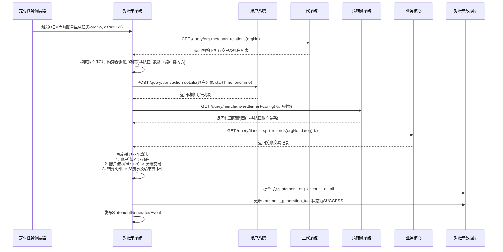
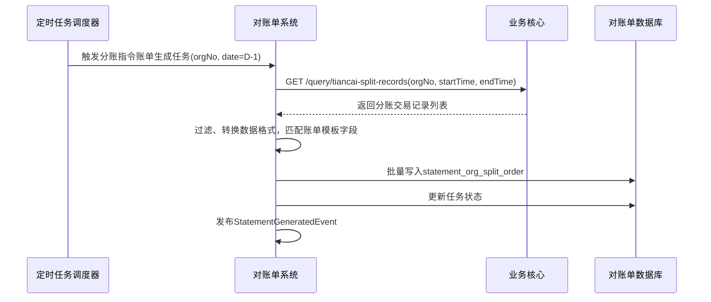
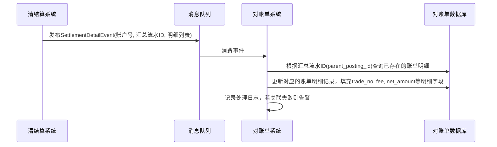

# 模块设计: 对账单系统

生成时间: 2026-01-16 17:54:16

---

# 模块设计: 对账单系统（天财分账专项）

生成时间: 2026-01-16 19:00:00

---

## 1. 概述

### 1.1 目的
本模块（对账单系统）是“天财分账”业务的核心数据整合与账单生成中心。其主要目的是为天财机构提供其下属所有商户的资金动账明细和汇总账单，满足其总部对资金流转的监控、对账和财务核算需求。系统通过整合来自账户系统（底层动账流水）、业务核心（分账交易数据）、清结算系统（结算配置）和三代系统（机构-商户关系）的多源数据，按照天财要求的格式和时效，生成机构维度的各类对账单。

### 1.2 范围
- **数据采集与整合**：定时或实时从账户系统、业务核心等上游系统拉取或接收天财相关的动账明细和交易数据。
- **账单生成**：根据天财业务需求，生成以下机构层账单：
  1.  **账户维度对账单**：针对01待结算账户、04退货账户、天财收款账户、天财接收方账户的动账明细及余额变动账单。
  2.  **交易维度对账单**：
      - **机构天财分账指令账单**：基于业务核心提供的分账交易数据生成。
      - **机构提款指令账单**：涵盖收款账户和接收方账户的提款记录。
      - **机构交易、结算账单**：整合收单交易与结算信息（现有功能扩展）。
- **数据匹配与关联**：将账户系统的底层流水与业务核心的交易数据、三代系统的商户关系进行关联匹配，形成完整的、可读性强的账单条目。
- **接口服务**：为天财系统（通过三代）或内部运营提供账单查询和下载接口。
- **数据推送**：按照约定时效（如D日9点前），将D-1日的账单数据推送或提供给天财系统。

## 2. 接口设计

### 2.1 内部API端点 (RESTful - 供上游系统调用/对账单主动拉取)

#### 2.1.1 动账明细批量查询接口（调用账户系统）
- **端点**：`POST /internal/accounting/query/transaction-details` (代理或封装对账户系统的调用)
- **描述**：根据账户列表和时间范围，从账户系统批量查询动账明细。这是生成账户维度对账单的核心数据来源。
- **调用方**：对账单系统内部定时任务
- **请求体**：同账户系统接口 `POST /internal/accounts/transaction-details/batch`
```json
{
  "accountNos": ["TC_C_001", "SETTLEMENT_01_001", "REFUND_04_001", "TC_R_001"],
  "startTime": "2025-01-15 00:00:00",
  "endTime": "2025-01-16 00:00:00",
  "pageNo": 1,
  "pageSize": 2000
}
```
- **响应体**：同账户系统响应，包含动账明细列表。

#### 2.1.2 天财分账交易查询接口（调用业务核心）
- **端点**：`GET /internal/accounting/query/tiancai-split-records` (代理或封装对业务核心的调用)
- **描述**：从业务核心查询天财分账交易数据，用于生成“机构天财分账指令账单”。
- **调用方**：对账单系统内部定时任务
- **查询参数**：同业务核心接口 `GET /internal/tiancai/split/records`
- **响应体**：同业务核心响应，包含分账交易记录列表。

#### 2.1.3 机构-商户关系查询接口（调用三代系统）
- **端点**：`GET /internal/accounting/query/org-merchant-relations`
- **描述**：查询指定天财机构号下的所有商户及其关联的天财账户信息。用于数据归属和匹配。
- **调用方**：对账单系统内部任务
- **查询参数**：`orgNo` (天财机构号)
- **响应体**：
```json
{
  "code": "SUCCESS",
  "data": {
    "orgNo": "TC20240001",
    "merchants": [
      {
        "merchantNo": "866123456789",
        "merchantName": "XX餐饮总部有限公司",
        "merchantType": "ENTERPRISE",
        "tiancaiAccountNo": "TC_C_LKL00120250115000001",
        "accountRole": "HEADQUARTERS",
        "settlementAccountNo": "TC_C_LKL00120250115000001",
        "refundAccountNo": "REFUND_04_001"
      },
      {
        "merchantNo": "866123456790",
        "merchantName": "XX餐饮XX门店",
        "merchantType": "INDIVIDUAL",
        "tiancaiAccountNo": "TC_C_LKL00120250115000002",
        "accountRole": "STORE",
        "settlementAccountNo": "TC_C_LKL00120250115000002",
        "refundAccountNo": "REFUND_04_002"
      }
    ]
  }
}
```

#### 2.1.4 商户结算配置查询接口（调用清结算系统）
- **端点**：`GET /internal/accounting/query/merchant-settlement-config`
- **描述**：批量查询商户的结算账户配置，用于确认待结算账户与商户的关联关系。
- **调用方**：对账单系统内部任务
- **查询参数**：`merchantNos` (商户号列表，逗号分隔)
- **响应体**：
```json
{
  "code": "SUCCESS",
  "data": {
    "configs": [
      {
        "merchantNo": "866123456789",
        "settlementMode": "ACTIVE",
        "settlementAccountNo": "TC_C_LKL00120250115000001",
        "relatedSettlementAccountNo": "SETTLEMENT_01_001" // 关联的01待结算账户
      }
    ]
  }
}
```

### 2.2 对外/对三代API端点 (RESTful - 提供账单数据)

#### 2.2.1 机构账单数据查询接口
- **端点**：`GET /api/v1/tiancai/statements`
- **描述**：为三代系统提供天财机构维度的账单数据查询入口。三代可进一步封装给天财。
- **调用方**：三代系统
- **查询参数**：
  - `orgNo` (必填): 天财机构号
  - `statementType` (必填): 账单类型 `ACCOUNT_DETAIL`(账户明细), `SPLIT_ORDER`(分账指令), `WITHDRAW_ORDER`(提款指令), `TRADE_SETTLEMENT`(交易结算)
  - `accountType` (可选，账户明细时必填): 账户类型 `SETTLEMENT_01`, `REFUND_04`, `TIANCAI_COLLECT`, `TIANCAI_RECEIVER`
  - `date` (必填): 账单日期，格式 yyyy-MM-dd (查询D-1日数据)
  - `batch` (可选): 批次，用于天财收款账户当日补结算数据，如 `BATCH_1`(0-3点), `BATCH_2`(3-12点)
- **响应体**：
```json
{
  "code": "SUCCESS",
  "data": {
    "orgNo": "TC20240001",
    "statementType": "ACCOUNT_DETAIL",
    "accountType": "TIANCAI_COLLECT",
    "date": "2025-01-15",
    "batch": "BATCH_1",
    "generatedTime": "2025-01-16 08:30:00",
    "items": [ ... ] // 具体账单条目，格式见下文数据模型
  }
}
```

#### 2.2.2 账单文件生成与下载接口
- **端点**：`POST /api/v1/tiancai/statements/file`
- **描述**：按天财要求的文件格式（如CSV）生成账单文件，并返回下载链接。
- **调用方**：三代系统（定时任务或天财触发）
- **请求体**：
```json
{
  "orgNo": "TC20240001",
  "statementType": "ACCOUNT_DETAIL",
  "accountType": "TIANCAI_COLLECT",
  "date": "2025-01-15",
  "fileFormat": "CSV",
  "callbackUrl": "https://tiancai.com/callback" // 文件生成后回调通知
}
```
- **响应体**：
```json
{
  "code": "SUCCESS",
  "data": {
    "fileTaskId": "FILE_TASK_001",
    "status": "PROCESSING",
    "estimatedCompletionTime": "2025-01-16 09:00:00"
  }
}
```

### 2.3 发布/消费的事件

#### 2.3.1 消费的事件
- **SettlementDetailEvent** (来自清结算系统)：监听结算明细事件，用于实时或准实时更新天财收款账户的结算明细关联关系，确保账单中能正确展示“结算明细收支余”。
- **TiancaiSplitRecordedEvent** (来自业务核心)：监听天财分账交易记录事件，可作为触发生成“机构天财分账指令账单”的补充机制。
- **AccountStatusChangedEvent** (来自账户系统)：监听账户冻结等状态变更，确保账单中账户状态信息的准确性。

#### 2.3.2 发布的事件
- **StatementGeneratedEvent**：当一批次账单数据生成完成并持久化后发布，可用于通知下游数据就绪或触发文件生成。
  - **主题**：`accounting.statement.generated`
  - **数据**：`{“orgNo”: “TC20240001”, “statementType”: “ACCOUNT_DETAIL”, “accountType”: “TIANCAI_COLLECT”, “date”: “2025-01-15”, “batch”: “BATCH_1”, “itemCount”: 150, “generatedTime”: “...”}`
- **StatementDataInconsistentEvent**：当对账过程中发现上游数据不一致时发布（如账户流水与业务核心交易无法匹配），触发告警和人工干预。
  - **主题**：`accounting.data.inconsistent`
  - **数据**：`{“orgNo”: “xxx”, “date”: “xxx”, “inconsistentType”: “SPLIT_TRADE_MISMATCH”, “details”: “业务核心记录SN001在账户流水缺失”, “severity”: “HIGH”}`

## 3. 数据模型

### 3.1 核心表设计

**1. 账单生成任务表 (statement_generation_task)**
记录每次账单生成任务的状态和元数据。
```sql
CREATE TABLE `statement_generation_task` (
  `id` bigint(20) NOT NULL AUTO_INCREMENT,
  `task_id` varchar(64) NOT NULL COMMENT '任务ID',
  `org_no` varchar(32) NOT NULL COMMENT '天财机构号',
  `statement_type` varchar(32) NOT NULL COMMENT '账单类型',
  `account_type` varchar(32) DEFAULT NULL COMMENT '账户类型(账户明细账单使用)',
  `statement_date` date NOT NULL COMMENT '账单日期',
  `batch` varchar(32) DEFAULT NULL COMMENT '批次',
  `status` varchar(32) NOT NULL DEFAULT 'PENDING' COMMENT 'PENDING, PROCESSING, SUCCESS, FAILED',
  `data_source_time_range` varchar(64) NOT NULL COMMENT '数据源时间范围，如2025-01-15 00:00:00~2025-01-16 00:00:00',
  `item_count` int(11) DEFAULT NULL COMMENT '生成的账单条目数',
  `file_task_id` varchar(64) DEFAULT NULL COMMENT '关联的文件生成任务ID',
  `error_message` text COMMENT '失败原因',
  `start_time` datetime DEFAULT NULL COMMENT '任务开始时间',
  `end_time` datetime DEFAULT NULL COMMENT '任务结束时间',
  `created_time` datetime NOT NULL DEFAULT CURRENT_TIMESTAMP,
  PRIMARY KEY (`id`),
  UNIQUE KEY `uk_task` (`task_id`),
  KEY `idx_org_date_type` (`org_no`, `statement_date`, `statement_type`, `account_type`),
  KEY `idx_status` (`status`)
) ENGINE=InnoDB COMMENT='账单生成任务表';
```

**2. 机构账户明细账单表 (statement_org_account_detail)**
存储生成的机构层各类账户维度明细账单数据。
```sql
CREATE TABLE `statement_org_account_detail` (
  `id` bigint(20) NOT NULL AUTO_INCREMENT,
  `task_id` varchar(64) NOT NULL COMMENT '关联的任务ID',
  `org_no` varchar(32) NOT NULL,
  `account_type` varchar(32) NOT NULL COMMENT 'SETTLEMENT_01, REFUND_04, TIANCAI_COLLECT, TIANCAI_RECEIVER',
  `statement_date` date NOT NULL,
  `batch` varchar(32) DEFAULT NULL,
  `account_no` varchar(32) NOT NULL COMMENT '账户号',
  `related_merchant_no` varchar(32) DEFAULT NULL COMMENT '关联商户号(通过配置或关系匹配)',
  `related_merchant_name` varchar(128) DEFAULT NULL,
  `posting_id` varchar(64) NOT NULL COMMENT '账户流水ID',
  `biz_type` varchar(32) NOT NULL COMMENT '业务类型',
  `biz_no` varchar(64) NOT NULL COMMENT '业务流水号',
  `trade_no` varchar(64) DEFAULT NULL COMMENT '交易流水号(匹配后)',
  `counterparty_account_no` varchar(32) DEFAULT NULL COMMENT '对方账户号',
  `counterparty_merchant_no` varchar(32) DEFAULT NULL COMMENT '对方商户号',
  `counterparty_merchant_name` varchar(128) DEFAULT NULL,
  `amount` decimal(20,2) NOT NULL COMMENT '变动金额(分)',
  `direction` varchar(10) NOT NULL COMMENT 'CREDIT, DEBIT',
  `balance` decimal(20,2) NOT NULL COMMENT '变动后余额(分)',
  `currency` varchar(3) NOT NULL DEFAULT 'CNY',
  `trade_time` datetime DEFAULT NULL COMMENT '交易时间(从业务数据获取)',
  `posting_time` datetime NOT NULL COMMENT '动账时间',
  `fee` decimal(20,2) DEFAULT NULL COMMENT '手续费(分)',
  `net_amount` decimal(20,2) DEFAULT NULL COMMENT '净额(分)',
  `remark` varchar(512) DEFAULT NULL COMMENT '备注',
  `fund_purpose` varchar(64) DEFAULT NULL COMMENT '资金用途(分账场景)',
  `settlement_detail_flag` tinyint(1) NOT NULL DEFAULT 0 COMMENT '是否为结算明细流水',
  `parent_posting_id` varchar(64) DEFAULT NULL COMMENT '父流水ID(结算汇总流水)',
  `created_time` datetime NOT NULL DEFAULT CURRENT_TIMESTAMP,
  PRIMARY KEY (`id`),
  KEY `idx_task_id` (`task_id`),
  KEY `idx_org_account_date` (`org_no`, `account_no`, `statement_date`),
  KEY `idx_posting_time` (`posting_time`),
  KEY `idx_biz_no` (`biz_no`)
) ENGINE=InnoDB COMMENT='机构账户明细账单表';
```

**3. 机构分账指令账单表 (statement_org_split_order)**
存储生成的“机构天财分账指令账单”数据。
```sql
CREATE TABLE `statement_org_split_order` (
  `id` bigint(20) NOT NULL AUTO_INCREMENT,
  `task_id` varchar(64) NOT NULL,
  `org_no` varchar(32) NOT NULL,
  `statement_date` date NOT NULL,
  `biz_core_split_no` varchar(64) NOT NULL COMMENT '业务核心分账流水号',
  `split_order_no` varchar(64) NOT NULL COMMENT '三代分账订单号',
  `wallet_split_no` varchar(64) NOT NULL COMMENT '钱包分账流水号',
  `scene` varchar(32) NOT NULL COMMENT 'GATHER, BATCH_PAY, MEMBER_SETTLE',
  `payer_merchant_no` varchar(32) NOT NULL,
  `payer_merchant_name` varchar(128) NOT NULL,
  `payer_account_no` varchar(32) NOT NULL,
  `payer_role` varchar(32) DEFAULT NULL,
  `payee_merchant_no` varchar(32) NOT NULL,
  `payee_merchant_name` varchar(128) NOT NULL,
  `payee_account_no` varchar(32) NOT NULL,
  `payee_role` varchar(32) DEFAULT NULL,
  `amount` decimal(20,2) NOT NULL,
  `fee` decimal(20,2) NOT NULL,
  `fee_bearer` varchar(32) NOT NULL,
  `net_amount` decimal(20,2) NOT NULL,
  `fund_purpose` varchar(64) NOT NULL,
  `status` varchar(32) NOT NULL,
  `complete_time` datetime NOT NULL,
  `relation_ship_no` varchar(64) DEFAULT NULL,
  `remark` varchar(256) DEFAULT NULL,
  `created_time` datetime NOT NULL DEFAULT CURRENT_TIMESTAMP,
  PRIMARY KEY (`id`),
  KEY `idx_task_id` (`task_id`),
  KEY `idx_org_date` (`org_no`, `statement_date`),
  KEY `idx_complete_time` (`complete_time`)
) ENGINE=InnoDB COMMENT='机构分账指令账单表';
```

**4. 数据匹配关系缓存表 (statement_data_mapping_cache)**
缓存从上游系统查询的关联关系，加速账单生成过程中的数据匹配。
```sql
CREATE TABLE `statement_data_mapping_cache` (
  `id` bigint(20) NOT NULL AUTO_INCREMENT,
  `mapping_type` varchar(32) NOT NULL COMMENT 'MERCHANT_ACCOUNT, SETTLEMENT_CONFIG, ORG_MERCHANT',
  `key_1` varchar(64) NOT NULL COMMENT '键1，如merchantNo',
  `key_2` varchar(64) DEFAULT NULL COMMENT '键2，如accountType',
  `value_json` json NOT NULL COMMENT '映射值JSON',
  `expire_time` datetime NOT NULL COMMENT '缓存过期时间',
  `created_time` datetime NOT NULL DEFAULT CURRENT_TIMESTAMP,
  PRIMARY KEY (`id`),
  UNIQUE KEY `uk_mapping_key` (`mapping_type`, `key_1`, `key_2`),
  KEY `idx_expire_time` (`expire_time`)
) ENGINE=InnoDB COMMENT='数据匹配关系缓存表';
```

### 3.2 与其他模块的关系
- **账户系统**：核心上游数据源。提供所有账户（01待结算、04退货、天财收款、天财接收方）的底层动账明细流水。对账单系统定时批量拉取数据。
- **业务核心**：核心上游数据源。提供天财分账交易数据，用于生成“机构天财分账指令账单”。
- **三代系统**：提供机构-商户关系映射、商户基础信息。是账单数据归属和匹配的关键。
- **清结算系统**：提供商户结算配置（商户与待结算账户的关联）、退货账户配置。其发布的`SettlementDetailEvent`用于关联结算明细。
- **行业钱包系统**：间接通过业务核心获取分账数据，但其维护的商户-账户关系可通过三代或缓存获取。

## 4. 业务逻辑

### 4.1 核心算法
1. **多源数据关联匹配算法**：
   - **输入**：账户流水(`account_transaction`)、分账交易(`biz_tiancai_split_order`)、商户关系(`tiancai_org_merchant`)、结算配置(`merchant_settlement_config`)。
   - **步骤**：
     1.  以账户流水为主驱动，根据`account_no`匹配商户（通过缓存的关系：账户->商户）。
     2.  根据`biz_no`和`biz_type`，尝试匹配业务核心的分账交易记录，获取交易维度信息（如资金用途、对手方商户名）。
     3.  对于待结算账户(`SETTLEMENT_01`)的流水，通过结算配置匹配到对应的商户。
     4.  对于结算明细流水(`settlement_detail_flag=1`)，通过`parent_posting_id`找到汇总流水，并关联清结算事件中的明细信息（交易号、手续费、净额）。
   - **输出**：一条 enriched 的账单明细记录，包含账户、商户、交易、对手方完整信息。
2. **账单分批次生成策略**：
   - **天财收款账户**：D日生成多批次。
     - **批次1 (BATCH_1)**：D日9点前，生成D-1日0-24点 + D日0-3点的数据。
     - **批次2 (BATCH_2)**：D日12点后，生成D日3-12点的补结算数据。
     - **批次3 (BATCH_3)**：D日18点后，生成D日12-18点的补结算数据。
   - **其他账户**：D日9点前，一次性生成D-1日0-24点的数据。
3. **数据一致性校验算法**：定时任务比对`statement_org_account_detail`中`biz_no`对应的金额、方向与业务核心`biz_tiancai_split_order`记录是否一致，发现差异则发布`StatementDataInconsistentEvent`。

### 4.2 业务规则
1. **账单生成触发规则**：
   - 基于定时任务触发，而非实时触发。
   - 任务执行前，检查上游系统数据就绪状态（如账户系统D-1日数据是否已全部入库）。
2. **数据匹配与展示规则**：
   - **01待结算账户**：正向交易（收款）显示为收款方；反向交易（付款/结算出款）显示为付款方。需通过结算配置关联到具体商户。
   - **04退货账户**：动账明细需关联到具体商户（通过商户配置的退货账户关系）。
   - **天财收款账户**：
     - 结算交易需展示明细：当账户流水`settlement_detail_flag=1`时，需展示关联的`trade_no`, `fee`, `net_amount`，并正确计算收支余。
     - 分账交易需匹配业务核心数据，展示`fund_purpose`、对手方详细信息。
   - **天财接收方账户**：仅展示动账明细，包含对手方（付款方）信息。
   - **分账指令账单**：直接来源于业务核心，按机构、日期筛选后输出。
3. **数据推送时效规则**：
   - D日9点前，必须完成所有账户D-1日账单数据的生成，并可通过接口查询。
   - 天财收款账户的当日补结算批次数据，在批次截止时间后1小时内应可查询。
4. **缓存策略规则**：
   - 机构-商户关系、商户-账户映射等低频变更数据，缓存时间可设置较长（如24小时）。
   - 缓存失效时，需回源到三代、清结算等系统查询。

### 4.3 验证逻辑
1. **账单生成任务启动前**：
   - 校验`orgNo`是否有效。
   - 校验`statement_date`是否为过去日期（不能生成未来日期账单）。
   - 校验是否已有同类型、同日期、同批次的成功任务，避免重复生成（幂等）。
2. **数据拉取过程中**：
   - 校验从账户系统拉取的流水时间范围是否连续、无遗漏。
   - 校验业务核心的分账记录与账户流水的`biz_no`是否能匹配，对无法匹配的记录进行标记和告警。
3. **账单数据持久化前**：
   - 校验必填字段是否完整。
   - 校验金额平衡关系（如`balance`字段的连续性）。
   - 校验关联的外部ID（如`merchant_no`, `trade_no`）是否存在。

## 5. 时序图

### 5.1 账户维度账单生成（D-1日数据）时序图


### 5.2 天财分账指令账单生成时序图


### 5.3 结算明细关联处理时序图


## 6. 错误处理

| 错误场景 | 错误码 | 处理策略 |
| :--- | :--- | :--- |
| 上游系统调用超时或服务不可用 | `UPSTREAM_SERVICE_UNAVAILABLE` | 任务标记为失败，记录错误日志并告警。根据重试策略（如指数退避）进行重试。对于非实时账单，可延迟一段时间后重试。 |
| 从账户系统拉取的数据存在缺失时段 | `DATA_RANGE_GAP` | 记录告警，尝试拉取更宽时间范围的数据进行补全。若无法补全，任务部分成功，在任务记录中注明数据不完整。 |
| 数据匹配失败（如流水找不到对应商户或交易） | `DATA_MATCH_FAILED` | 将无法匹配的记录存入特殊表（如 `statement_unmatched_records`）供人工排查。任务继续执行，生成大部分账单，但发布不一致事件告警。 |
| 账单重复生成（相同任务标识） | `DUPLICATE_TASK` | 幂等处理：检查是否存在成功的相同任务，若存在则直接跳过并返回已有结果。 |
| 数据库写入失败（唯一键冲突、空间不足等） | `DB_WRITE_ERROR` | 任务标记为失败，详细日志记录错误。检查数据库状态，人工干预后重试任务。 |
| 生成的文件格式错误或上传失败 | `FILE_GENERATION_ERROR` | 文件生成任务标记为失败，通知运营人员。提供手动重新生成文件的接口。 |
| 缓存数据过期且回源查询失败 | `CACHE_REFRESH_FAILED` | 使用旧的缓存数据继续执行（如果可用），并记录降级日志。若旧数据不可用，则任务失败。 |

**通用策略**：
- **任务状态机**：每个账单生成任务有明确状态（PENDING, PROCESSING, SUCCESS, FAILED），便于监控和重试。
- **优雅降级**：在非核心数据缺失时（如商户名称），允许使用默认值或空值，保证账单主体生成，同时记录日志。
- **监控与告警**：对任务失败率、数据匹配失败率、上游调用延迟进行监控。关键错误实时告警。
- **人工干预通道**：提供管理界面，允许运营人员查看失败任务、手动重试、查询未匹配数据。

## 7. 依赖说明

### 7.1 上游依赖
1. **账户系统**：
   - **交互方式**：同步RPC调用（HTTP），由对账单系统主动拉取。
   - **职责**：提供最权威的底层资金动账流水。对账单系统依赖其数据的完整性、准确性和时效性。
   - **关键点**：
     - 需明确约定数据就绪时间（如D日8点前提供D-1日完整数据）。
     - 批量查询接口需支持大分页和高性能，以应对海量流水数据。
     - `settlement_detail_flag` 和 `parent_posting_id` 字段是展示结算明细的关键。
2. **业务核心**：
   - **交互方式**：同步RPC调用（HTTP），主动拉取。
   - **职责**：提供天财分账交易数据，是生成“分账指令账单”的唯一数据源。
   - **关键点**：数据需包含足够的关联信息（如`orgNo`, `payer/payee MerchantName`），减少对账单系统的二次查询。
3. **三代系统**：
   - **交互方式**：同步RPC调用（HTTP）。
   - **职责**：提供机构-商户-账户的关联关系，是数据匹配和账单归属的核心。
   - **关键点**：关系数据变更（如商户增减、账户变更）需及时生效，对账单系统依赖缓存的时效性。
4. **清结算系统**：
   - **交互方式**：同步RPC调用（查询配置） + 异步事件（结算明细）。
   - **职责**：提供商户-待结算账户配置，并通过事件驱动结算明细的丰富。
   - **关键点**：`SettlementDetailEvent` 的及时性和准确性直接影响天财收款账户账单的质量。

### 7.2 下游依赖
1. **三代系统（作为网关）**：
   - **交互方式**：同步RPC调用（HTTP）。
   - **职责**：调用对账单系统提供的接口，获取账单数据，并可能封装后提供给天财系统。
   - **关键点**：接口需稳定、高效，响应格式需便于三代系统解析和转发。
2. **文件存储服务/对象存储**：
   - **交互方式**：SDK调用。
   - **职责**：存储生成的账单文件（CSV等）。
3. **消息中间件**：
   - 用于发布账单生成完成等事件。

### 7.3 设计要点
- **数据聚合而非事务**：对账单系统是典型的OLAP场景，强调数据聚合和查询能力，而非OLTP事务。设计应偏向读优化。
- **最终一致性**：与上游多个系统的数据同步是最终一致的。通过定时任务和补偿机制解决短期不一致。
- **可扩展性**：账单生成任务应可水平扩展，以应对未来天财机构数量和数据量的增长。考虑使用分布式任务调度。
- **可配置性**：账单模板、生成频率、数据源映射关系等应尽量可配置，以快速适应业务变化。