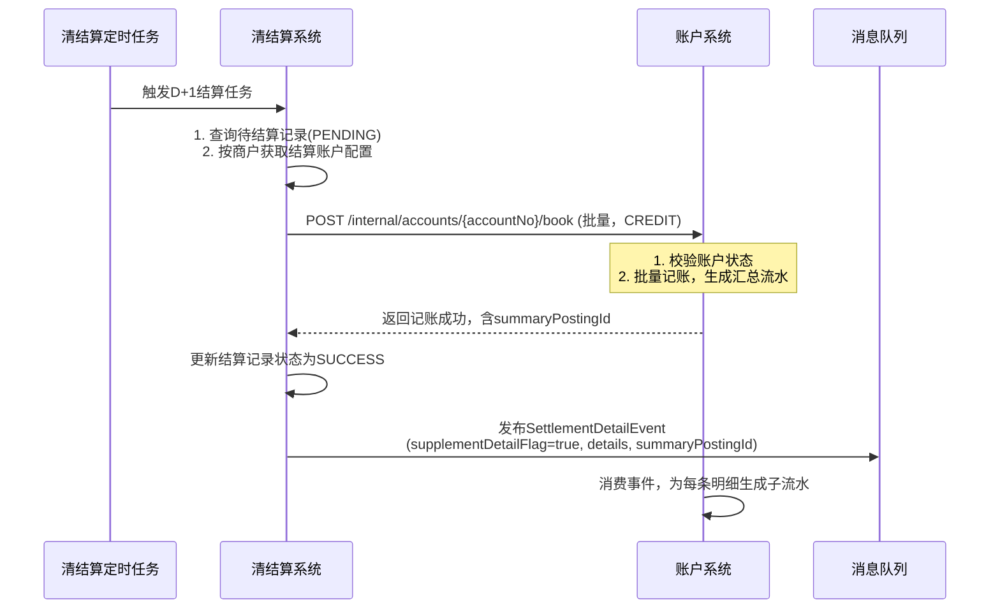
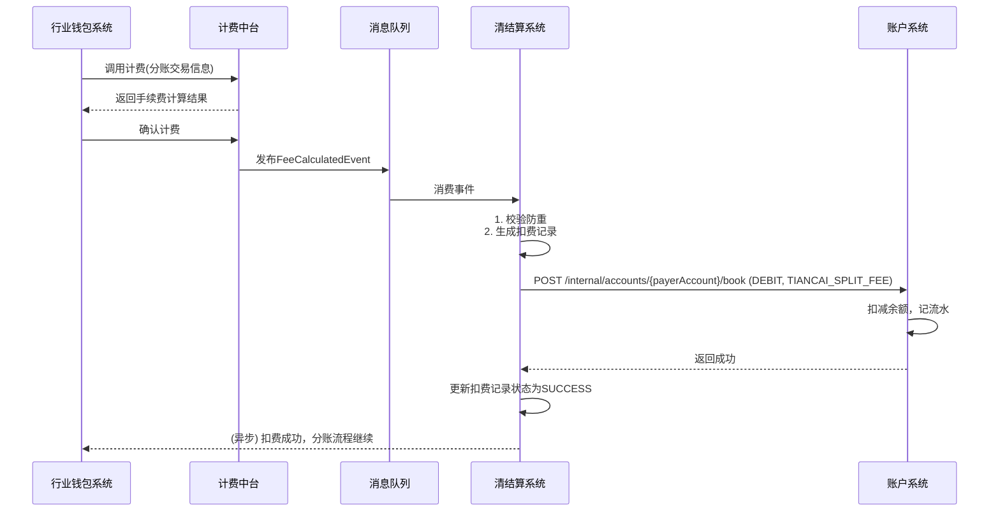
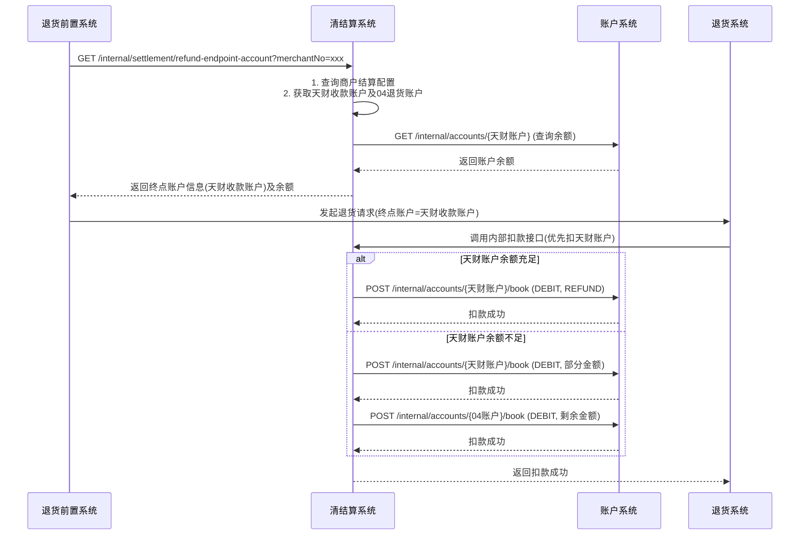
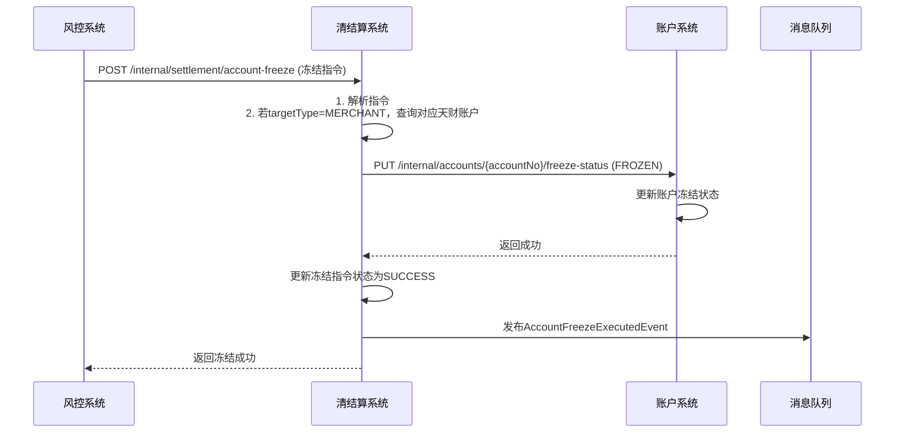

# 模块设计: 清结算系统

生成时间: 2026-01-16 17:48:04

---

# 清结算系统模块设计文档（天财分账专项）

## 1. 概述

### 1.1 目的
本模块（清结算系统）作为拉卡拉支付的核心资金处理系统，为“天财分账”业务提供资金清算、结算、计费执行及退货处理能力。核心目的是确保天财业务场景下的收单资金能够准确、合规地结算至指定的“天财收款账户”，并支持基于该账户的资金流转（分账、退货）所涉及的计费、资金冻结等操作。

### 1.2 范围
- **收单资金结算**：将商户的收单交易资金，根据其配置的结算模式（主动/被动）和结算账户（天财收款账户），在D+1日完成资金清算与结算。
- **计费执行**：接收并执行由计费中台计算出的天财分账交易手续费，完成资金扣划。
- **退货处理**：支持天财场景下的退货流程，包括查询“天财收款账户”作为终点账户、执行扣款（优先扣天财收款账户，不足时扣04退货账户）。
- **账户冻结**：接收风控指令，对“天财收款账户”执行资金冻结/解冻操作，并通知账户系统。
- **结算明细推送**：在结算完成后，向账户系统推送包含明细的结算事件，支持对账单系统生成带明细的账单。
- **信息同步**：接收三代系统同步的商户结算账户配置（天财收款账户）。

## 2. 接口设计

### 2.1 API端点 (RESTful)

#### 2.1.1 内部接口（供三代、行业钱包、风控等系统调用）

**1. 同步结算账户配置**
- **端点**：`POST /internal/settlement/account-config`
- **描述**：接收三代系统同步的商户结算账户配置。当商户开通或变更天财业务时，三代调用此接口更新其结算终点账户为天财收款账户。
- **调用方**：三代系统
- **请求体**：
```json
{
  "requestId": "UUID",
  "merchantNo": "商户号",
  "settlementMode": "ACTIVE", // 结算模式: ACTIVE-主动结算, PASSIVE-被动结算
  "settlementAccountNo": "天财收款账户号", // 当settlementMode=ACTIVE时必填
  "effectiveTime": "2023-01-01 00:00:00", // 配置生效时间
  "operator": "三代系统"
}
```
- **响应体**：
```json
{
  "code": "SUCCESS",
  "message": "成功",
  "data": {
    "configId": "配置记录ID"
  }
}
```

**2. 查询退货终点账户信息**
- **端点**：`GET /internal/settlement/refund-endpoint-account`
- **描述**：退货前置流程中，查询指定商户的退货终点账户信息及余额。对于天财商户，返回其天财收款账户信息。
- **调用方**：退货前置系统
- **请求参数**：
  - `merchantNo` (必填): 商户号
- **响应体**：
```json
{
  "code": "SUCCESS",
  "data": {
    "endpointAccountNo": "天财收款账户号",
    "endpointAccountType": "TIANCAI_COLLECT", // 账户类型
    "balance": 10000, // 账户当前余额
    "availableBalance": 10000, // 账户可用余额
    "relatedRefundAccountNo": "04退货账户号", // 关联的04退货账户
    "refundAccountBalance": 5000 // 04退货账户余额
  }
}
```

**3. 执行分账手续费扣划**
- **端点**：`POST /internal/settlement/fee-deduction`
- **描述**：接收计费中台的计算结果，执行天财分账交易手续费的扣划。从手续费承担方指定的账户扣取费用。
- **调用方**：行业钱包系统（在分账交易计费后调用）
- **请求体**：
```json
{
  "requestId": "UUID",
  "bizType": "TIANCAI_SPLIT_FEE", // 业务类型
  "bizNo": "分账交易流水号", // 关联的分账业务流水
  "payerAccountNo": "付方账户号", // 手续费承担方账户（天财收款账户）
  "payerMerchantNo": "付方商户号",
  "feeAmount": 100, // 手续费金额（单位：分）
  "feeRate": "0.0038", // 费率（如按比例）
  "feeMode": "NET", // 计费模式: NET-净额, GROSS-全额
  "currency": "CNY",
  "operator": "行业钱包"
}
```
- **响应体**：
```json
{
  "code": "SUCCESS",
  "message": "成功",
  "data": {
    "deductionId": "扣费流水ID",
    "actualDeductedAmount": 100
  }
}
```

**4. 账户冻结/解冻**
- **端点**：`POST /internal/settlement/account-freeze`
- **描述**：接收风控系统的指令，对指定的天财收款账户执行冻结或解冻操作，并同步通知账户系统。
- **调用方**：风控系统
- **请求体**：
```json
{
  "requestId": "UUID",
  "freezeType": "MERCHANT_FREEZE" | "TRANSACTION_FREEZE", // 商户冻结 | 交易冻结
  "freezeStatus": "FROZEN" | "UNFROZEN",
  "targetType": "MERCHANT" | "ACCOUNT", // 目标类型: 按商户 | 按账户
  "targetValue": "商户号 或 账户号",
  "freezeAmount": 0, // 交易冻结时，需冻结的金额（单位：分）。商户冻结时为0。
  "freezeReason": "风险交易",
  "operator": "风控系统"
}
```
- **响应体**：
```json
{
  "code": "SUCCESS",
  "message": "成功",
  "data": {
    "freezeOrderNo": "冻结指令流水号"
  }
}
```

**5. 结算明细查询（供对账）**
- **端点**：`POST /internal/settlement/detail/batch`
- **描述**：根据时间范围和商户列表，批量查询结算明细（汇总及明细数据）。供内部对账或问题排查使用。
- **调用方**：对账单系统、运营平台
- **请求体**：
```json
{
  "merchantNos": ["商户1", "商户2"],
  "accountNos": ["账户1", "账户2"], // 可选，与merchantNos二选一
  "startSettleDate": "2023-10-01", // 结算日期起
  "endSettleDate": "2023-10-01", // 结算日期止
  "bizType": "SETTLEMENT" // 业务类型: SETTLEMENT-结算, FEE-手续费, REFUND-退货
}
```
- **响应体**：
```json
{
  "code": "SUCCESS",
  "data": {
    "details": [
      {
        "settleDate": "2023-10-01",
        "merchantNo": "商户号",
        "accountNo": "天财收款账户号",
        "bizType": "SETTLEMENT",
        "bizNo": "原交易流水号",
        "amount": 10000,
        "fee": 38,
        "netAmount": 9962,
        "currency": "CNY",
        "tradeTime": "2023-09-30 12:00:00",
        "settleTime": "2023-10-01 09:00:00",
        "detailFlag": "SUMMARY" // SUMMARY-汇总, DETAIL-明细
      }
    ]
  }
}
```

#### 2.1.2 发布/消费的事件

#### 2.2.1 消费的事件
- **FeeCalculatedEvent**：计费中台发布。当分账交易计费完成后，清结算系统消费此事件，执行手续费的实际扣划。
  - **主题**：`fee.calculated.tiancai.split`
  - **数据**：`{“bizNo”: “分账流水号”, “payerAccountNo”: “付方账户”, “feeAmount”: 100, “currency”: “CNY”, “calcTime”: “...”}`
- **AccountStatusChangedEvent**：账户系统发布。清结算系统监听此事件，用于同步账户冻结状态，确保清结算内部状态与账户系统一致。
  - **主题**：`account.status.changed`
  - **数据**：`{“accountNo”: “xxx”, “oldStatus”: “ACTIVE”, “newStatus”: “FROZEN”, “changeTime”: “...”, “reason”: “...”}`

#### 2.2.2 发布的事件
- **SettlementDetailEvent**：当收单交易资金结算到天财收款账户时发布。此事件包含“补明细账单”标识，驱动账户系统生成子账单流水。
  - **主题**：`settlement.detail.tiancai`
  - **数据**：
```json
{
  "eventId": "UUID",
  "settleDate": "2023-10-01",
  "merchantNo": "商户号",
  "accountNo": "天财收款账户号",
  "summaryPostingId": "汇总记账流水ID", // 账户系统中对应的汇总流水ID
  "supplementDetailFlag": true, // 补明细账单标识
  "details": [
    {
      "tradeNo": "交易流水号1",
      "amount": 5000,
      "fee": 19,
      "netAmount": 4981,
      "tradeTime": "2023-09-30 10:00:00"
    },
    {
      "tradeNo": "交易流水号2",
      "amount": 5000,
      "fee": 19,
      "netAmount": 4981,
      "tradeTime": "2023-09-30 11:00:00"
    }
  ]
}
```
- **AccountFreezeExecutedEvent**：当清结算系统成功执行账户冻结/解冻指令后发布，通知相关系统。
  - **主题**：`account.freeze.executed`
  - **数据**：`{“freezeOrderNo”: “指令号”, “accountNo”: “xxx”, “freezeStatus”: “FROZEN”, “freezeAmount”: 1000, “executedTime”: “...”, “operator”: “风控”}`

## 3. 数据模型

### 3.1 核心表设计

**1. 商户结算配置表 (merchant_settlement_config)**
存储商户的结算模式与终点账户配置。
```sql
CREATE TABLE `merchant_settlement_config` (
  `id` bigint(20) NOT NULL AUTO_INCREMENT COMMENT '主键ID',
  `merchant_no` varchar(32) NOT NULL COMMENT '商户号',
  `settlement_mode` varchar(32) NOT NULL COMMENT '结算模式: ACTIVE-主动结算, PASSIVE-被动结算',
  `settlement_account_no` varchar(32) DEFAULT NULL COMMENT '结算账户号 (主动结算时必填)',
  `settlement_account_type` varchar(32) DEFAULT NULL COMMENT '结算账户类型: TIANCAI_COLLECT, GENERAL_COLLECT',
  `effective_time` datetime NOT NULL COMMENT '配置生效时间',
  `status` varchar(32) NOT NULL DEFAULT 'VALID' COMMENT '状态: VALID-有效, INVALID-无效',
  `created_time` datetime NOT NULL DEFAULT CURRENT_TIMESTAMP COMMENT '创建时间',
  `updated_time` datetime NOT NULL DEFAULT CURRENT_TIMESTAMP ON UPDATE CURRENT_TIMESTAMP COMMENT '更新时间',
  PRIMARY KEY (`id`),
  UNIQUE KEY `uk_merchant_effective` (`merchant_no`, `effective_time`),
  KEY `idx_account_no` (`settlement_account_no`)
) ENGINE=InnoDB COMMENT='商户结算配置表';
```

**2. 结算执行记录表 (settlement_execution)**
记录每笔收单交易的结算执行结果。
```sql
CREATE TABLE `settlement_execution` (
  `id` bigint(20) NOT NULL AUTO_INCREMENT COMMENT '主键ID',
  `settle_date` date NOT NULL COMMENT '结算日期',
  `trade_no` varchar(64) NOT NULL COMMENT '原交易流水号',
  `merchant_no` varchar(32) NOT NULL COMMENT '商户号',
  `account_no` varchar(32) NOT NULL COMMENT '结算入账账户号 (天财收款账户)',
  `trade_amount` decimal(20,2) NOT NULL COMMENT '交易金额',
  `trade_fee` decimal(20,2) NOT NULL DEFAULT '0.00' COMMENT '交易手续费',
  `settlement_amount` decimal(20,2) NOT NULL COMMENT '实际结算金额 (净额)',
  `currency` varchar(3) NOT NULL DEFAULT 'CNY' COMMENT '币种',
  `trade_time` datetime NOT NULL COMMENT '交易时间',
  `settlement_time` datetime NOT NULL COMMENT '结算执行时间',
  `status` varchar(32) NOT NULL DEFAULT 'SUCCESS' COMMENT '状态: SUCCESS-成功, FAILED-失败, PENDING-待处理',
  `summary_posting_id` varchar(64) DEFAULT NULL COMMENT '关联的账户系统汇总流水ID',
  `supplement_detail_flag` tinyint(1) NOT NULL DEFAULT 0 COMMENT '补明细账单标识: 0-否, 1-是',
  `created_time` datetime NOT NULL DEFAULT CURRENT_TIMESTAMP COMMENT '创建时间',
  PRIMARY KEY (`id`),
  UNIQUE KEY `uk_trade_settle` (`trade_no`, `settle_date`),
  KEY `idx_merchant_date` (`merchant_no`, `settle_date`),
  KEY `idx_account_date` (`account_no`, `settle_date`),
  KEY `idx_settlement_time` (`settlement_time`)
) ENGINE=InnoDB COMMENT='结算执行记录表';
```

**3. 手续费扣划记录表 (fee_deduction_record)**
记录天财分账手续费扣划明细。
```sql
CREATE TABLE `fee_deduction_record` (
  `id` bigint(20) NOT NULL AUTO_INCREMENT COMMENT '主键ID',
  `deduction_no` varchar(64) NOT NULL COMMENT '扣费流水号',
  `biz_type` varchar(32) NOT NULL COMMENT '业务类型: TIANCAI_SPLIT_FEE',
  `biz_no` varchar(64) NOT NULL COMMENT '关联业务流水号 (分账流水)',
  `payer_account_no` varchar(32) NOT NULL COMMENT '付费方账户号',
  `payer_merchant_no` varchar(32) NOT NULL COMMENT '付费方商户号',
  `fee_amount` decimal(20,2) NOT NULL COMMENT '手续费金额',
  `fee_rate` varchar(20) DEFAULT NULL COMMENT '费率',
  `fee_mode` varchar(32) DEFAULT NULL COMMENT '计费模式: NET, GROSS',
  `currency` varchar(3) NOT NULL DEFAULT 'CNY' COMMENT '币种',
  `deduction_time` datetime NOT NULL COMMENT '扣费时间',
  `status` varchar(32) NOT NULL DEFAULT 'SUCCESS' COMMENT '状态: SUCCESS-成功, FAILED-失败',
  `account_posting_id` varchar(64) DEFAULT NULL COMMENT '账户系统扣费流水ID',
  `created_time` datetime NOT NULL DEFAULT CURRENT_TIMESTAMP COMMENT '创建时间',
  PRIMARY KEY (`id`),
  UNIQUE KEY `uk_deduction_no` (`deduction_no`),
  UNIQUE KEY `uk_biz_no_type` (`biz_no`, `biz_type`),
  KEY `idx_payer_account` (`payer_account_no`, `deduction_time`)
) ENGINE=InnoDB COMMENT='手续费扣划记录表';
```

**4. 账户冻结指令表 (account_freeze_order)**
记录风控发起的账户冻结/解冻指令及执行结果。
```sql
CREATE TABLE `account_freeze_order` (
  `id` bigint(20) NOT NULL AUTO_INCREMENT COMMENT '主键ID',
  `freeze_order_no` varchar(64) NOT NULL COMMENT '冻结指令流水号',
  `freeze_type` varchar(32) NOT NULL COMMENT '冻结类型: MERCHANT_FREEZE, TRANSACTION_FREEZE',
  `target_type` varchar(32) NOT NULL COMMENT '目标类型: MERCHANT, ACCOUNT',
  `target_value` varchar(32) NOT NULL COMMENT '目标值 (商户号或账户号)',
  `freeze_status` varchar(32) NOT NULL COMMENT '指令状态: FROZEN, UNFROZEN',
  `freeze_amount` decimal(20,2) NOT NULL DEFAULT '0.00' COMMENT '冻结金额 (交易冻结时>0)',
  `freeze_reason` varchar(255) DEFAULT NULL COMMENT '冻结原因',
  `operator` varchar(64) NOT NULL COMMENT '操作方',
  `order_status` varchar(32) NOT NULL DEFAULT 'PROCESSING' COMMENT '指令执行状态: PROCESSING-处理中, SUCCESS-成功, FAILED-失败, PARTIAL-部分成功',
  `account_sync_status` varchar(32) DEFAULT NULL COMMENT '账户系统同步状态: SYNCED-已同步, FAILED-同步失败',
  `executed_time` datetime DEFAULT NULL COMMENT '指令执行时间',
  `created_time` datetime NOT NULL DEFAULT CURRENT_TIMESTAMP COMMENT '创建时间',
  `updated_time` datetime NOT NULL DEFAULT CURRENT_TIMESTAMP ON UPDATE CURRENT_TIMESTAMP COMMENT '更新时间',
  PRIMARY KEY (`id`),
  UNIQUE KEY `uk_freeze_order_no` (`freeze_order_no`),
  KEY `idx_target_value` (`target_value`, `freeze_status`),
  KEY `idx_created_time` (`created_time`)
) ENGINE=InnoDB COMMENT='账户冻结指令表';
```

### 3.2 与其他模块的关系
- **三代系统**：上游调用方。同步商户结算账户配置（天财收款账户）。
- **行业钱包系统**：上游调用方。请求执行分账手续费扣划。
- **计费中台**：事件上游。发布计费结果事件，触发清结算扣费。
- **账户系统**：下游调用方。清结算调用其接口执行账户冻结；消费其发布的账户状态事件；向其发布结算明细事件。
- **风控系统**：上游调用方。发起账户冻结/解冻指令。
- **退货前置系统**：上游调用方。查询退货终点账户（天财收款账户）信息。
- **对账单系统**：下游调用方。提供结算明细查询接口。

## 4. 业务逻辑

### 4.1 核心算法
1. **D+1结算调度算法**：
   - 每日凌晨定时任务，扫描`settlement_execution`表中`settle_date`为当日且`status='PENDING'`的记录。
   - 根据`merchant_settlement_config`获取商户的结算账户（天财收款账户）。
   - 按账户分组，批量生成结算指令，调用账户系统进行批量记账。
   - 对于结算到天财收款账户的，在记账成功后，发布`SettlementDetailEvent`事件，并标记`supplement_detail_flag=true`。
2. **手续费扣划执行**：
   - 监听`FeeCalculatedEvent`消息。
   - 根据事件中的`payerAccountNo`，调用账户系统的记账接口（`bizType='TIANCAI_SPLIT_FEE'`）执行扣款。
   - 扣款成功，更新`fee_deduction_record`状态。
3. **账户冻结执行**：
   - 接收风控冻结指令。
   - 解析`targetType`和`targetValue`，若为`MERCHANT`，需通过商户号查询出其对应的天财收款账户号。
   - 调用账户系统的冻结接口，并更新`account_freeze_order`表状态。

### 4.2 业务规则
1. **结算规则**：
   - 天财商户默认配置为“主动结算”，结算账户为其“天财收款账户”。
   - 结算时效为D+1，即T日交易，T+1日结算。
   - 结算时，需扣除交易手续费，将净额结算至天财收款账户。
2. **手续费规则**：
   - 手续费承担方由天财接口传入，清结算根据计费中台结果从指定账户扣划。
   - 扣费失败会导致分账交易失败，需有明确错误返回。
3. **退货规则**：
   - 天财商户的退货模式为“终点账户+退货账户模式”。
   - 退货前置查询时，返回该商户的“天财收款账户”作为终点账户。
   - 执行退货时，优先扣除“天财收款账户”余额，不足部分扣除关联的“04退货账户”余额。
4. **冻结规则**：
   - “商户冻结”：冻结该商户对应的天财收款账户的全部资金。调用账户系统进行账户状态冻结。
   - “交易冻结”：冻结指定天财收款账户中的特定金额资金。需在清结算层面记录冻结金额明细，并调用账户系统进行账户状态冻结（账户系统可能需配合记录冻结金额）。
5. **明细推送规则**：
   - 结算到天财收款账户的每一笔交易，都需要生成明细记录。
   - 发布`SettlementDetailEvent`时，`details`数组需包含所有明细，并关联正确的`summaryPostingId`。

### 4.3 验证逻辑
1. **同步结算配置时**：
   - 校验商户号是否存在且有效。
   - 校验`settlementAccountNo`是否为有效的天财收款账户（可通过缓存或调用账户系统查询）。
   - 校验生效时间不能晚于当前时间。
2. **执行手续费扣划时**：
   - 校验`bizNo`是否已存在成功扣费记录（防重）。
   - 校验付费方账户状态是否正常（ACTIVE & UNFROZEN）。
   - 校验账户余额是否充足。
3. **处理冻结指令时**：
   - 校验指令格式及必填字段。
   - 校验目标商户或账户是否存在。
   - 对于解冻指令，校验是否存在对应的冻结指令。
4. **发布结算事件时**：
   - 校验`summaryPostingId`在账户系统中是否存在。
   - 校验明细金额之和与汇总金额一致。

## 5. 时序图

### 5.1 D+1结算至天财收款账户时序图


### 5.2 分账手续费扣划时序图


### 5.3 天财商户退货查询与执行时序图


### 5.4 账户冻结时序图


## 6. 错误处理

| 错误场景 | 错误码 | 处理策略 |
| :--- | :--- | :--- |
| 商户结算配置不存在 | `SETTLEMENT_CONFIG_NOT_FOUND` | 结算任务暂停，发出告警，需运营介入检查商户配置。 |
| 天财收款账户状态异常（冻结/非ACTIVE） | `ACCOUNT_STATUS_INVALID` | 结算失败，记录失败原因。需通知商户或运营处理账户状态。 |
| 手续费扣划时余额不足 | `INSUFFICIENT_BALANCE_FOR_FEE` | 扣费失败，导致分账交易整体失败。向行业钱包返回明确错误。 |
| 重复的业务流水号（扣费防重） | `DUPLICATE_BIZ_NO` | 幂等处理：查询已存在的扣费记录，若金额一致则返回成功；否则返回错误。 |
| 风控冻结指令目标不存在 | `FREEZE_TARGET_NOT_FOUND` | 返回指令失败，风控系统需检查目标商户/账户号。 |
| 账户系统调用超时或失败 | `ACCOUNT_SYSTEM_UNAVAILABLE` | 记录日志，根据操作类型决定重试策略（结算任务可重试，实时扣费需快速失败）。 |
| 消息队列投递失败（结算事件） | `MQ_PUBLISH_FAILED` | 重试投递，超过重试次数后入库，启动补偿任务定时重推。 |

**通用策略**：
- **幂等性**：所有写接口通过`requestId`或`bizNo`保证幂等。
- **异步补偿**：对于结算、事件推送等异步操作，需有定时补偿任务处理失败或超时记录。
- **事务一致性**：涉及资金变动的操作（如扣费），需与账户系统交互保证最终一致性。本地记录状态，便于对账和排查。
- **监控告警**：对结算失败率、扣费失败、系统间调用异常等设置监控告警。

## 7. 依赖说明

### 7.1 上游依赖
1. **三代系统**：
   - **交互方式**：同步RPC调用（HTTP）。
   - **职责**：提供商户结算账户配置（天财收款账户）。清结算信任此配置的准确性。
   - **关键点**：配置生效时间需精确，支持即时生效或次日生效。
2. **行业钱包系统**：
   - **交互方式**：同步RPC调用（HTTP）。
   - **职责**：请求执行分账手续费扣划。清结算需确保扣费实时性和成功率，直接影响分账交易。
3. **计费中台**：
   - **交互方式**：异步事件（消息队列）。
   - **职责**：提供准确的手续费计算结果。清结算消费事件执行扣划。
   - **关键点**：事件格式需包含完整的计费信息和业务关联号。
4. **风控系统**：
   - **交互方式**：同步RPC调用（HTTP）。
   - **职责**：发起账户冻结/解冻指令。清结算需快速响应并执行。
5. **退货前置系统**：
   - **交互方式**：同步RPC调用（HTTP）。
   - **职责**：查询退货终点账户。清结算需快速返回账户信息及余额。

### 7.2 下游依赖
1. **账户系统**：
   - **交互方式**：同步RPC调用（HTTP） + 异步事件（消费）。
   - **职责**：执行资金记账、账户冻结、提供账户信息查询。是清结算资金操作的核心依赖。
   - **关键点**：调用需高性能、高可用。记账接口必须幂等。
2. **消息中间件（如Kafka/RocketMQ）**：
   - 用于发布结算明细、冻结执行等事件。

### 7.3 设计要点
- **性能与批量**：D+1结算涉及大量数据处理，需采用批量查询、批量记账优化性能。
- **数据一致性**：清结算记录需与账户系统流水通过`bizNo`、`postingId`等强关联，确保对账无误。
- **可追溯性**：所有资金操作（结算、扣费、冻结）必须有完整记录，支持审计和问题排查。
- **配置化管理**：结算规则、重试策略、开关等应支持动态配置。