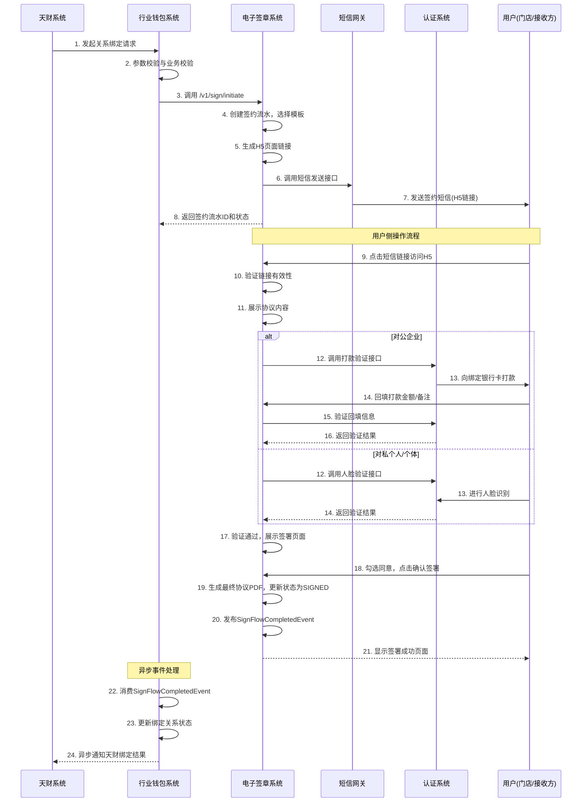
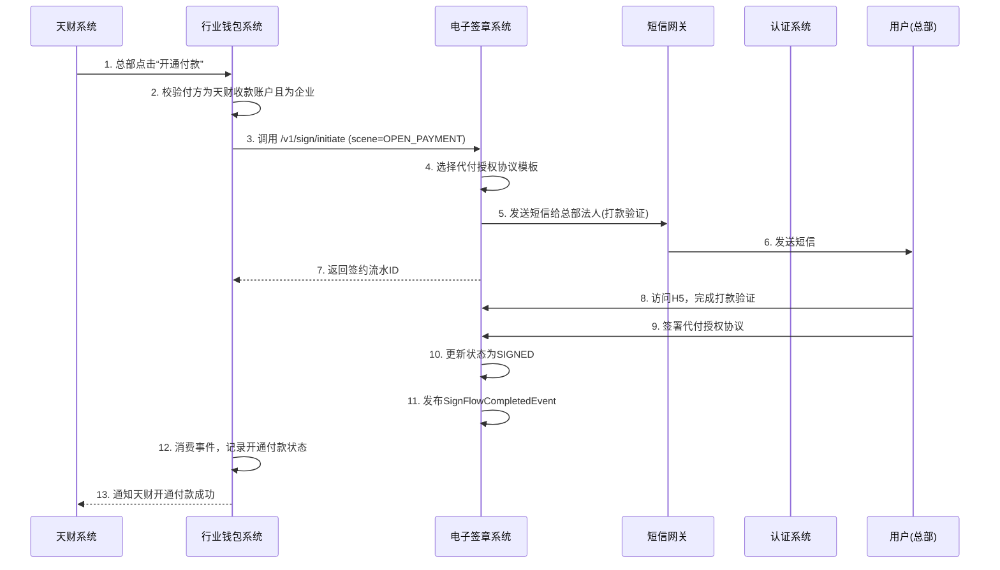

# 模块设计: 电子签章系统

生成时间: 2026-01-16 17:44:20

---

# 电子签章系统模块设计文档

## 1. 概述

### 1.1 目的
电子签章系统（电子签约平台）是天财分账业务中的核心认证与协议管理模块。其主要目的是为“关系绑定”、“开通付款”等业务流程提供全流程的电子协议签署、身份认证（打款验证/人脸验证）、短信通知及H5页面封装能力，并留存完整的证据链数据，确保分账业务的法律合规性与操作安全性。

### 1.2 范围
本模块负责处理以下核心业务：
- **协议模板管理**：根据业务场景（归集、批量付款、会员结算）和签约方身份（对公/对私）配置和管理不同的电子协议模板。
- **签约流程驱动**：接收行业钱包系统的调用，驱动短信发送、H5页面生成、身份认证和协议签署的完整流程。
- **身份认证集成**：集成认证系统，根据场景调用打款验证或人脸验证服务。
- **证据链留存**：完整记录并存储协议内容、认证过程（验证金额、时间、类型）、认证结果等全流程数据。
- **签约状态管理**：管理每笔签约请求的状态流转，并向调用方（行业钱包）返回最终结果。

### 1.3 设计原则
- **合规性优先**：所有协议模板、认证流程需符合相关法律法规及公司合规要求。
- **可配置性**：协议内容、短信模板、H5页面应支持灵活配置，以适应业务变化。
- **高可靠性**：签约过程及证据链数据必须保证高可靠存储与防篡改。
- **松耦合**：通过清晰的API与事件与其他系统（行业钱包、认证系统）交互。

## 2. 接口设计

### 2.1 API端点 (RESTful)

#### 2.1.1 发起签约认证 (`POST /v1/sign/initiate`)
**描述**：行业钱包系统在校验通过后，调用此接口发起签约认证流程。
**请求方**：行业钱包系统

**请求体 (Request Body):**
```json
{
  "requestId": "WALLET_REQ_202405201200001", // 行业钱包生成的唯一请求ID
  "scene": "COLLECTION", // 场景枚举: COLLECTION(归集), BATCH_PAYMENT(批量付款), MEMBER_SETTLEMENT(会员结算), OPEN_PAYMENT(开通付款)
  "payerInfo": {
    "merchantNo": "PAYER_MCH_001", // 付方商户号
    "merchantName": "XX餐饮总部有限公司", // 付方商户全称
    "accountNo": "TC_PAY_ACC_001", // 付方账户号 (天财收款账户)
    "merchantType": "ENTERPRISE", // 付方商户性质: ENTERPRISE(企业), INDIVIDUAL(个体), PERSONAL(个人)
    "legalPersonName": "张三", // 法人/负责人姓名 (对公/对私)
    "legalPersonIdNo": "110101199001011234" // 法人/负责人身份证号
  },
  "payeeInfo": {
    "merchantNo": "PAYEE_MCH_002", // 收方商户号 (归集时为门店，批量付款时为接收方，会员结算时为门店)
    "merchantName": "XX餐饮西湖店", // 收方商户全称
    "accountNo": "TC_PAY_ACC_002", // 收方账户号 (天财收款账户 或 天财接收方账户)
    "accountType": "TC_PAYMENT_ACCOUNT", // 账户类型: TC_PAYMENT_ACCOUNT(天财收款账户), TC_RECEIVER_ACCOUNT(天财接收方账户)
    "merchantType": "ENTERPRISE", // 收方商户性质
    "legalPersonName": "李四",
    "legalPersonIdNo": "110101199002022345",
    "defaultBankCardNo": "6228480012345678901", // 默认银行卡号 (用于打款验证)
    "defaultBankCardName": "李四" // 默认银行卡户名
  },
  "initiatorInfo": {
    "merchantNo": "INITIATOR_MCH_001", // 发起方商户号 (天财接口中的发起方，通常与付方一致)
    "merchantName": "XX餐饮总部有限公司"
  },
  "fundPurpose": "缴纳管理费", // 资金用途 (归集场景用)
  "callbackUrl": "https://wallet.lakala.com/callback/sign/result" // 行业钱包回调地址 (用于异步通知)
}
```

**响应体 (Success Response 200):**
```json
{
  "code": "SUCCESS",
  "message": "签约流程已发起",
  "data": {
    "signFlowId": "SIGN_FLOW_202405201200001", // 电子签章系统生成的签约流水ID
    "status": "SMS_SENT", // 当前状态: SMS_SENT(短信已发送), AUTH_PENDING(待认证), SIGNED(已签署), FAILED(失败)
    "estimatedExpireTime": "2024-05-20T12:10:00Z" // H5链接预计过期时间
  }
}
```

#### 2.1.2 查询签约状态 (`GET /v1/sign/status/{signFlowId}`)
**描述**：行业钱包或天财系统查询指定签约流程的当前状态。
**请求方**：行业钱包系统 / 天财系统

**响应体 (Success Response 200):**
```json
{
  "code": "SUCCESS",
  "message": "查询成功",
  "data": {
    "signFlowId": "SIGN_FLOW_202405201200001",
    "requestId": "WALLET_REQ_202405201200001",
    "scene": "COLLECTION",
    "status": "SIGNED",
    "authType": "REMITTANCE_VERIFICATION", // 认证类型: REMITTANCE_VERIFICATION(打款验证), FACE_VERIFICATION(人脸验证)
    "authResult": "SUCCESS", // 认证结果: SUCCESS, FAILED, PENDING
    "signTime": "2024-05-20T12:05:30Z", // 协议签署时间
    "evidenceChainId": "EVIDENCE_CHAIN_001", // 证据链ID，可用于查询完整证据
    "failureReason": "" // 失败原因，成功时为空
  }
}
```

#### 2.1.3 获取证据链数据 (`GET /v1/evidence/{evidenceChainId}`) (内部/审计接口)
**描述**：获取指定签约流程的完整证据链数据，供内部审计或合规检查使用。
**请求方**：内部管理系统 / 合规系统

**响应体 (Success Response 200):**
```json
{
  "code": "SUCCESS",
  "message": "查询成功",
  "data": {
    "evidenceChainId": "EVIDENCE_CHAIN_001",
    "signFlowId": "SIGN_FLOW_202405201200001",
    "protocolContent": "{\"title\":\"资金归集授权协议\",\"content\":\"...完整协议HTML/PDF存储路径...\"}", // 协议内容或存储路径
    "authRecords": [
      {
        "authType": "REMITTANCE_VERIFICATION",
        "requestTime": "2024-05-20T12:01:00Z",
        "completeTime": "2024-05-20T12:03:15Z",
        "authResult": "SUCCESS",
        "detail": {
          "remittanceAmount": "0.23", // 打款金额
          "remittanceRemark": "123456", // 打款备注
          "userInputAmount": "0.23",
          "userInputRemark": "123456"
        }
      }
    ],
    "smsRecords": [
      {
        "templateId": "SMS_TEMP_COLLECTION_ENTERPRISE",
        "mobile": "13800138000",
        "content": "【拉卡拉】尊敬的商户，您有一份资金归集授权协议待签署，请点击链接：https://esign.lakala.com/h5/xxxx",
        "sendTime": "2024-05-20T12:00:30Z"
      }
    ],
    "h5AccessLogs": [
      {
        "accessTime": "2024-05-20T12:02:00Z",
        "userAgent": "Mozilla/5.0...",
        "ipAddress": "192.168.1.1"
      }
    ],
    "finalResult": "SIGNED",
    "createTime": "2024-05-20T12:00:00Z",
    "updateTime": "2024-05-20T12:05:30Z"
  }
}
```

### 2.2 发布/消费的事件

#### 2.2.1 消费的事件
- **无直接消费事件**：本模块主要通过同步API被行业钱包调用，驱动流程。

#### 2.2.2 发布的事件
- **SignFlowCompletedEvent** (签约流程完成事件)
  - **Topic**: `esign.flow.completed`
  - **触发条件**: 签约流程达到终态（`SIGNED` 或 `FAILED`）
  - **事件内容**:
    ```json
    {
      "eventId": "EVENT_20240520120530001",
      "eventType": "SIGN_FLOW_COMPLETED",
      "timestamp": "2024-05-20T12:05:30Z",
      "data": {
        "signFlowId": "SIGN_FLOW_202405201200001",
        "requestId": "WALLET_REQ_202405201200001",
        "scene": "COLLECTION",
        "status": "SIGNED", // 或 FAILED
        "payerMerchantNo": "PAYER_MCH_001",
        "payeeMerchantNo": "PAYEE_MCH_002",
        "evidenceChainId": "EVIDENCE_CHAIN_001",
        "failureReason": "" // 失败时有值
      }
    }
    ```
  - **订阅方**: 行业钱包系统（用于异步更新绑定关系状态）

## 3. 数据模型

### 3.1 核心数据库表设计

#### 表1: `esign_sign_flow` (签约流水主表)
| 字段名 | 类型 | 必填 | 描述 | 索引 |
|--------|------|------|------|------|
| `sign_flow_id` | VARCHAR(64) | Y | 主键，签约流水ID | PK |
| `request_id` | VARCHAR(64) | Y | 行业钱包请求ID | UK |
| `scene` | VARCHAR(32) | Y | 业务场景 | IDX |
| `status` | VARCHAR(32) | Y | 状态: INIT, SMS_SENT, AUTH_PENDING, SIGNED, FAILED, EXPIRED | IDX |
| `auth_type` | VARCHAR(32) | N | 认证类型: REMITTANCE_VERIFICATION, FACE_VERIFICATION | |
| `auth_result` | VARCHAR(32) | N | 认证结果: SUCCESS, FAILED, PENDING | |
| `payer_merchant_no` | VARCHAR(32) | Y | 付方商户号 | IDX |
| `payer_account_no` | VARCHAR(64) | Y | 付方账户号 | |
| `payer_merchant_type` | VARCHAR(16) | Y | 付方商户性质 | |
| `payee_merchant_no` | VARCHAR(32) | Y | 收方商户号 | IDX |
| `payee_account_no` | VARCHAR(64) | Y | 收方账户号 | |
| `payee_account_type` | VARCHAR(32) | Y | 收方账户类型 | |
| `payee_merchant_type` | VARCHAR(16) | Y | 收方商户性质 | |
| `initiator_merchant_no` | VARCHAR(32) | Y | 发起方商户号 | |
| `fund_purpose` | VARCHAR(128) | N | 资金用途 | |
| `evidence_chain_id` | VARCHAR(64) | N | 证据链ID | UK |
| `callback_url` | VARCHAR(512) | Y | 回调地址 | |
| `expire_time` | DATETIME | Y | 流程过期时间 | IDX |
| `failure_reason` | VARCHAR(512) | N | 失败原因 | |
| `create_time` | DATETIME | Y | 创建时间 | IDX |
| `update_time` | DATETIME | Y | 更新时间 | |
| `sign_time` | DATETIME | N | 签署时间 | |

#### 表2: `esign_protocol_template` (协议模板表)
| 字段名 | 类型 | 必填 | 描述 | 索引 |
|--------|------|------|------|------|
| `template_id` | VARCHAR(64) | Y | 主键，模板ID | PK |
| `template_name` | VARCHAR(128) | Y | 模板名称 | |
| `scene` | VARCHAR(32) | Y | 适用场景 | IDX |
| `payer_type` | VARCHAR(16) | Y | 付方类型: ENTERPRISE, INDIVIDUAL, PERSONAL, ALL | IDX |
| `payee_type` | VARCHAR(16) | Y | 收方类型: ENTERPRISE, INDIVIDUAL, PERSONAL, ALL | IDX |
| `protocol_type` | VARCHAR(32) | Y | 协议类型: COLLECTION_AUTH(归集授权), BATCH_PAY_AUTH(批量付款授权), MEMBER_SETTLE_AUTH(会员结算授权), OPEN_PAY_AUTH(开通付款授权) | |
| `content_html` | TEXT | Y | HTML格式协议内容 | |
| `content_variables` | JSON | Y | 协议内容变量定义，如：`["payerName", "payeeName", "bankCardNo"]` | |
| `is_active` | TINYINT(1) | Y | 是否启用: 1启用，0禁用 | |
| `version` | VARCHAR(16) | Y | 模板版本 | |
| `effective_time` | DATETIME | Y | 生效时间 | |
| `expire_time` | DATETIME | N | 失效时间 | |
| `create_time` | DATETIME | Y | 创建时间 | |

#### 表3: `esign_sms_template` (短信模板表)
| 字段名 | 类型 | 必填 | 描述 | 索引 |
|--------|------|------|------|------|
| `sms_template_id` | VARCHAR(64) | Y | 主键，短信模板ID | PK |
| `template_name` | VARCHAR(128) | Y | 模板名称 | |
| `scene` | VARCHAR(32) | Y | 适用场景 | IDX |
| `receiver_type` | VARCHAR(16) | Y | 接收方类型: ENTERPRISE(对公), PERSONAL(对私) | IDX |
| `content_template` | VARCHAR(512) | Y | 短信内容模板，支持变量替换，如：`【拉卡拉】尊敬的{merchantName}，您有一份{protocolName}待签署，请点击链接：{h5Url}` | |
| `h5_page_type` | VARCHAR(32) | Y | 关联的H5页面类型 | |
| `is_active` | TINYINT(1) | Y | 是否启用 | |
| `create_time` | DATETIME | Y | 创建时间 | |

#### 表4: `esign_evidence_chain` (证据链表)
| 字段名 | 类型 | 必填 | 描述 | 索引 |
|--------|------|------|------|------|
| `evidence_chain_id` | VARCHAR(64) | Y | 主键，证据链ID | PK |
| `sign_flow_id` | VARCHAR(64) | Y | 关联的签约流水ID | UK |
| `protocol_content_ref` | VARCHAR(512) | Y | 协议内容存储路径（OSS路径或数据库大字段引用） | |
| `auth_records` | JSON | Y | 认证记录JSON数组 | |
| `sms_records` | JSON | Y | 短信发送记录JSON数组 | |
| `h5_access_logs` | JSON | Y | H5页面访问日志JSON数组 | |
| `final_protocol_pdf_ref` | VARCHAR(512) | N | 最终签署的协议PDF存储路径 | |
| `create_time` | DATETIME | Y | 创建时间 | |

### 3.2 与其他模块的关系
- **行业钱包系统**：上游调用方，通过API发起签约请求，并消费`SignFlowCompletedEvent`事件。
- **认证系统**：下游服务提供方，提供打款验证和人脸验证的原子能力。
- **短信网关**：下游服务提供方，用于发送签约通知短信。
- **对象存储服务(OSS)**：用于存储生成的协议PDF、H5页面静态资源等。
- **消息中间件**：用于发布签约完成事件。

## 4. 业务逻辑

### 4.1 核心算法与流程

#### 4.1.1 签约流程驱动引擎
```python
def process_sign_flow(request_data):
    # 1. 参数校验与标准化
    validate_request(request_data)
    
    # 2. 生成签约流水并保存初始状态
    sign_flow = create_sign_flow_record(request_data)
    
    # 3. 根据场景和签约方身份，选择协议模板和短信模板
    protocol_template = select_protocol_template(
        scene=request_data.scene,
        payer_type=request_data.payerInfo.merchantType,
        payee_type=request_data.payeeInfo.merchantType
    )
    
    sms_template = select_sms_template(
        scene=request_data.scene,
        receiver_type=request_data.payeeInfo.merchantType
    )
    
    # 4. 生成个性化协议内容（变量替换）
    personalized_protocol = render_protocol_content(
        template=protocol_template,
        variables={
            "payerName": request_data.payerInfo.merchantName,
            "payeeName": request_data.payeeInfo.merchantName,
            "bankCardNo": mask_bank_card(request_data.payeeInfo.defaultBankCardNo),
            # ... 其他变量
        }
    )
    
    # 5. 生成H5页面URL（包含签约流水ID和临时token）
    h5_url = generate_h5_url(sign_flow_id=sign_flow.sign_flow_id)
    
    # 6. 发送短信（包含H5链接）
    send_sms(
        template=sms_template,
        mobile=get_receiver_mobile(request_data), # 根据业务规则获取接收方手机号
        variables={
            "merchantName": request_data.payeeInfo.merchantName,
            "protocolName": protocol_template.template_name,
            "h5Url": h5_url
        }
    )
    
    # 7. 更新签约流水状态为"SMS_SENT"，并设置过期时间（如30分钟）
    update_sign_flow_status(sign_flow.sign_flow_id, "SMS_SENT")
    
    # 8. 返回结果给调用方
    return build_response(sign_flow)
```

#### 4.1.2 H5页面处理逻辑
当用户点击短信中的H5链接时：
1. 验证链接中的token和签约流水ID有效性。
2. 检查签约流程是否已过期或已完成。
3. 根据场景和签约方身份，展示对应的协议内容。
4. 引导用户进行身份认证：
   - **对公企业**：触发打款验证流程，调用认证系统发起小额打款。
   - **对私个人/个体户**：触发人脸验证流程，调用认证系统进行人脸核验。
5. 用户完成认证后，展示协议签署页面，要求用户确认并签署（勾选同意）。
6. 签署后，生成最终的协议PDF（包含签署时间、双方信息、认证记录等）。
7. 更新签约流水状态为`SIGNED`，并发布`SignFlowCompletedEvent`事件。
8. 通知行业钱包系统（通过回调或事件）。

### 4.2 业务规则

#### 4.2.1 模板选择规则
| 场景 | 付方类型 | 收方类型 | 协议模板类型 | 认证类型 | 短信接收方 |
|------|----------|----------|--------------|----------|------------|
| 归集 | 企业 | 企业 | 归集授权协议 | 打款验证 | 收方（门店） |
| 归集 | 企业 | 个体 | 归集授权协议 | 人脸验证 | 收方（门店） |
| 批量付款 | 企业 | 企业 | 总部&接收方协议 | 打款验证 | 收方（接收方） |
| 批量付款 | 企业 | 个人 | 总部&接收方协议 | 人脸验证 | 收方（接收方） |
| 会员结算 | 企业 | 企业 | 会员结算协议 | 打款验证 | 收方（门店） |
| 会员结算 | 企业 | 个体 | 会员结算协议 | 人脸验证 | 收方（门店） |
| 开通付款 | 企业 | - | 代付授权协议 | 打款验证 | 付方（总部） |

#### 4.2.2 验证规则
1. **打款验证**：
   - 调用认证系统，向收方默认银行卡打入随机金额（0.01-0.99元）和6位数字备注。
   - 用户在H5页面回填金额和备注，系统调用认证系统验证。
   - 验证通过后，方可进行协议签署。

2. **人脸验证**：
   - 调用认证系统，引导用户进行人脸识别。
   - 验证姓名、身份证号、人脸特征一致性。
   - 验证通过后，方可进行协议签署。

#### 4.2.3 状态流转规则
```
INIT → SMS_SENT → AUTH_PENDING → SIGNED
    ↘              ↘
     → FAILED       → FAILED
     → EXPIRED
```
- 每个状态都有超时时间（如SMS_SENT状态30分钟超时）。
- 认证失败可重试（有最大重试次数限制，如3次）。
- 最终状态（SIGNED/FAILED/EXPIRED）为终态，不可再变更。

### 4.3 验证逻辑
1. **请求参数验证**：
   - 必填字段检查。
   - 商户号、账户号格式验证。
   - 场景枚举值有效性检查。
   - 付方与发起方一致性检查（由行业钱包主要校验，此处做防御性校验）。

2. **业务状态验证**：
   - 防止重复发起相同签约请求（通过`request_id`去重）。
   - 检查付方是否已开通付款（针对批量付款和会员结算场景，依赖行业钱包的校验结果）。

3. **安全验证**：
   - H5链接中的token防篡改验证。
   - 访问频率限制，防止恶意刷接口。

## 5. 时序图

### 5.1 关系绑定/归集授权时序图



### 5.2 开通付款时序图（简化版）



## 6. 错误处理

### 6.1 预期错误及HTTP状态码

| 错误码 | HTTP状态码 | 描述 | 处理建议 |
|--------|------------|------|----------|
| `PARAM_INVALID` | 400 | 请求参数无效或缺失 | 检查请求参数格式和必填项 |
| `SCENE_NOT_SUPPORTED` | 400 | 不支持的业务场景 | 检查scene枚举值 |
| `TEMPLATE_NOT_FOUND` | 500 | 未找到合适的协议模板 | 检查模板配置，确保对应场景有启用模板 |
| `SIGN_FLOW_EXISTS` | 409 | 相同request_id的签约流程已存在 | 使用已存在的签约流水，或更换request_id |
| `SIGN_FLOW_EXPIRED` | 410 | 签约流程已过期 | 重新发起签约请求 |
| `AUTH_FAILED` | 403 | 身份认证失败 | 提示用户认证失败原因，允许重试（有限次数） |
| `SMS_SEND_FAILED` | 500 | 短信发送失败 | 记录日志，告警，可自动重试或人工处理 |
| `CALLBACK_FAILED` | 500 | 回调行业钱包失败 | 记录日志，通过事件补偿机制确保状态同步 |
| `SYSTEM_ERROR` | 500 | 系统内部错误 | 记录详细日志，告警，人工介入 |

### 6.2 重试与补偿机制
1. **短信发送重试**：首次失败后，最多重试2次，间隔1分钟。
2. **认证系统调用重试**：网络超时等临时故障，最多重试3次。
3. **回调补偿**：如果回调行业钱包失败，除了记录日志外，还依赖行业钱包消费`SignFlowCompletedEvent`事件作为补偿机制。
4. **定时任务补偿**：
   - 定期扫描状态为`SMS_SENT`但已过期的签约流水，自动更新为`EXPIRED`。
   - 定期扫描状态为`AUTH_PENDING`但长时间无进展的流水，发送提醒或自动置为失败。

### 6.3 监控与告警
- **关键指标监控**：
  - 签约成功率、失败率、各场景分布。
  - 短信发送成功率、到达率。
  - 认证通过率、平均认证耗时。
  - H5页面访问PV/UV，转化率。
- **错误告警**：
  - 连续短信发送失败超过阈值。
  - 认证系统调用失败率升高。
  - 签约流程失败率异常升高。

## 7. 依赖说明

### 7.1 上游依赖

#### 7.1.1 行业钱包系统
- **交互方式**：同步API调用 (`/v1/sign/initiate`)
- **依赖职责**：
  - 提供完整的签约请求参数，包括付方、收方、发起方信息。
  - 完成必要的业务校验（如付方与发起方一致性、是否已开通付款等）。
  - 提供回调URL用于异步通知签约结果。
- **SLA要求**：接口响应时间P99 < 2s，可用性 > 99.9%。

#### 7.1.2 天财系统（间接）
- **交互方式**：通过行业钱包系统间接交互
- **依赖职责**：
  - 提供正确的业务场景和资金用途信息。
  - 确保发起的签约请求符合业务规则。

### 7.2 下游依赖

#### 7.2.1 认证系统
- **交互方式**：同步API调用
- **提供能力**：
  - 打款验证：发起小额打款、验证回填信息。
  - 人脸验证：发起人脸识别、验证身份信息。
- **SLA要求**：接口响应时间P99 < 3s，可用性 > 99.5%。

#### 7.2.2 短信网关
- **交互方式**：同步API调用
- **提供能力**：发送签约通知短信。
- **SLA要求**：接口响应时间P99 < 1s，到达率 > 95%。

#### 7.2.3 对象存储服务 (OSS)
- **交互方式**：SDK调用
- **提供能力**：存储协议PDF、H5页面静态资源。
- **SLA要求**：读写可用性 > 99.9%，持久性 > 99.9999999%。

#### 7.2.4 消息中间件
- **交互方式**：SDK调用
- **提供能力**：发布`SignFlowCompletedEvent`事件。
- **SLA要求**：消息投递可靠性 > 99.9%。

### 7.3 容错与降级策略
1. **认证系统降级**：如果认证系统不可用，签约流程无法进行，应明确提示用户“系统维护中，请稍后重试”。
2. **短信网关降级**：如果短信发送失败，可记录日志并告警，但签约流程无法继续（无替代方案）。
3. **OSS降级**：如果OSS不可用，可将协议内容临时存储在数据库（仅限文本），但PDF生成功能受影响。
4. **异步事件补偿**：如果消息中间件不可用，可先将事件持久化到本地数据库，通过定时任务重试发送。

---
**文档版本**: 1.0  
**最后更新**: 2024-05-20  
**评审人**: 架构评审委员会、合规部、法务部