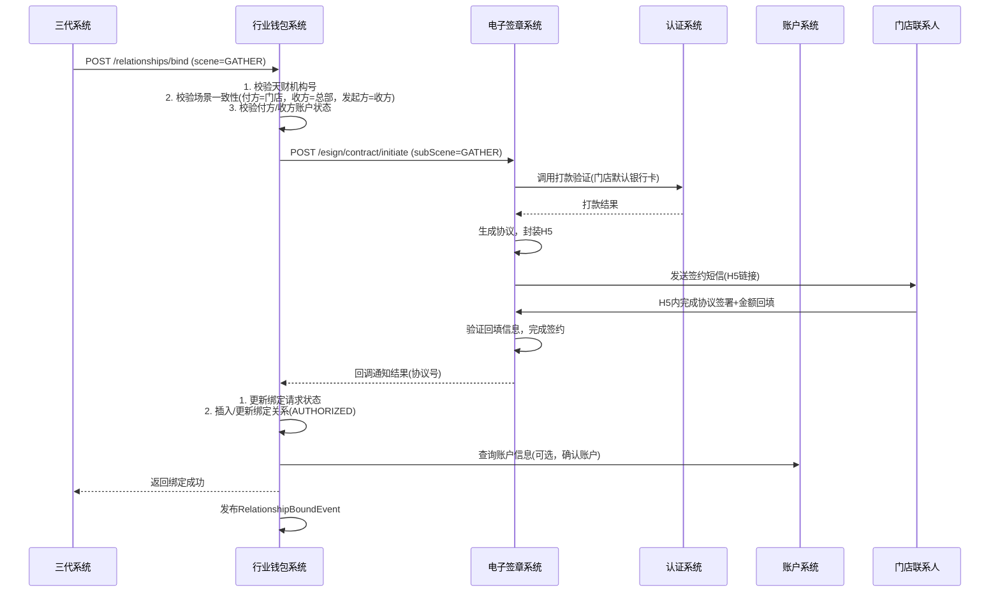
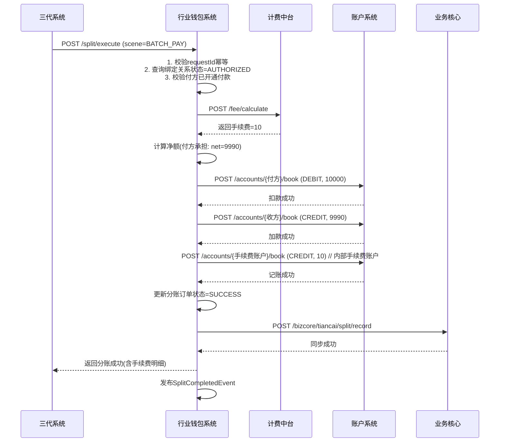
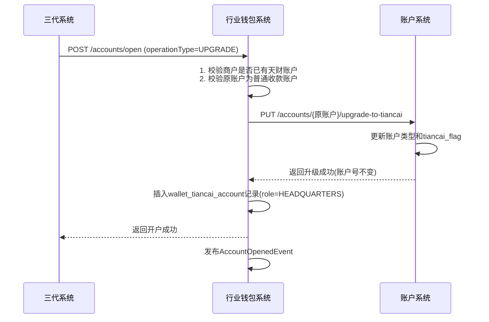

# 模块设计: 行业钱包系统

生成时间: 2026-01-16 17:50:23

---

# 模块设计: 行业钱包系统（天财分账专项）

生成时间: 2026-01-16 18:00:00

---

## 1. 概述

### 1.1 目的
本模块（行业钱包系统）是“天财分账”业务的核心业务逻辑处理中心。它基于钱包账户模型，负责处理天财业务场景下的账户管理、关系绑定、分账转账、计费协调等核心业务逻辑。作为连接三代系统（网关）与账户系统（底层记账）的桥梁，行业钱包系统确保天财专用账户的资金流转符合复杂的业务规则、法务要求和风控策略。

### 1.2 范围
- **账户管理**：接收三代系统的开户指令，校验业务规则后，调用账户系统创建或升级天财专用账户（收款账户/接收方账户），并维护账户的附加信息（如角色、关联银行卡）。
- **关系绑定与认证**：处理“归集”、“批量付款”、“会员结算”三种场景下的授权关系建立。协调电子签章系统完成协议签署和身份认证（打款验证/人脸验证），是分账交易的前置条件。
- **分账（转账）执行**：接收三代系统的分账指令，校验关系绑定状态、账户能力、余额后，协调计费中台计算手续费，并调用账户系统完成资金划转。
- **业务逻辑校验**：作为业务规则执行的“守门员”，对天财机构号、商户角色、场景一致性、发起方权限等进行严格校验。
- **数据同步与状态管理**：维护分账关系、绑定请求等业务状态，并向业务核心同步分账交易数据，为对账单提供数据源。
- **风控指令执行**：接收并执行来自风控或清结算的账户冻结指令（业务层面）。

## 2. 接口设计

### 2.1 内部API端点 (RESTful - 供三代系统调用)

所有接口需进行内部鉴权（如服务间Token）。

#### 2.1.1 开户接口
- **端点**：`POST /internal/tiancai/accounts/open`
- **描述**：为天财机构下的商户开通天财专用账户。支持新开和升级。
- **调用方**：三代系统
- **请求体**：
```json
{
  "requestId": "TC202501160001",
  "orgNo": "TC20240001", // 天财机构号
  "merchantNo": "866123456789",
  "merchantName": "XX餐饮总部有限公司",
  "merchantType": "ENTERPRISE", // 企业、个体工商户、个人
  "accountType": "COLLECT" | "RECEIVER", // 收款账户 | 接收方账户
  "role": "HEADQUARTERS" | "STORE", // 角色（仅收款账户有效）
  "operationType": "CREATE" | "UPGRADE", // 新开 | 升级
  "baseAccountNo": "原普通收款账户号", // 升级时传入
  "operator": "三代系统"
}
```
- **响应体**：
```json
{
  "code": "SUCCESS",
  "message": "成功",
  "data": {
    "requestId": "TC202501160001",
    "accountNo": "TC_C_LKL00120250116000001",
    "accountType": "TIANCAI_COLLECT",
    "status": "ACTIVE",
    "tiancaiFlag": true
  }
}
```

#### 2.1.2 关系绑定/开通付款接口
- **端点**：`POST /internal/tiancai/relationships/bind`
- **描述**：建立分账付方与收方之间的授权关系，或为批量付款/会员结算场景的付方开通代付授权。
- **调用方**：三代系统
- **请求体**：
```json
{
  "requestId": "TC202501160002",
  "scene": "GATHER" | "BATCH_PAY" | "MEMBER_SETTLE" | "ENABLE_PAYMENT", // 场景 + 开通付款
  "initiatorMerchantNo": "866123456789", // 发起方商户号（天财指令发起者）
  "initiatorMerchantName": "XX餐饮总部有限公司",
  "payerMerchantNo": "866123456790", // 付方商户号
  "payerAccountNo": "TC_C_...",
  "payerMerchantType": "ENTERPRISE",
  "payeeMerchantNo": "866123456791", // 收方商户号
  "payeeAccountNo": "TC_R_...",
  "payeeMerchantType": "ENTERPRISE",
  "fundPurpose": "资金归集", // 资金用途
  "authContactPhone": "13800138000", // 授权联系人手机（归集场景为门店联系人）
  "authContactName": "张三",
  "bankCardInfo": { // 认证打款目标卡信息（可选，钱包可查询）
    "cardNo": "6217000010001234567",
    "cardholderName": "李四"
  }
}
```
- **响应体**：
```json
{
  "code": "SUCCESS",
  "message": "关系绑定请求已受理",
  "data": {
    "requestId": "TC202501160002",
    "bindRequestNo": "WBRN20250116000001", // 钱包生成的绑定请求流水号
    "status": "PROCESSING",
    "nextStep": "SMS_VERIFICATION"
  }
}
```

#### 2.1.3 分账（转账）执行接口
- **端点**：`POST /internal/tiancai/split/execute`
- **描述**：执行天财专用账户间的资金划转。
- **调用方**：三代系统
- **请求体**：
```json
{
  "requestId": "TC202501160003",
  "scene": "GATHER" | "BATCH_PAY" | "MEMBER_SETTLE",
  "initiatorMerchantNo": "866123456789",
  "splitOrderNo": "SON20250116000001", // 三代分账订单号
  "payerMerchantNo": "866123456790",
  "payerAccountNo": "TC_C_...",
  "payeeMerchantNo": "866123456791",
  "payeeAccountNo": "TC_R_...",
  "amount": 10000,
  "feeBearer": "PAYER" | "PAYEE",
  "remark": "1月品牌管理费",
  "fundPurpose": "资金归集"
}
```
- **响应体**：
```json
{
  "code": "SUCCESS",
  "message": "分账成功",
  "data": {
    "requestId": "TC202501160003",
    "splitOrderNo": "SON20250116000001",
    "walletSplitNo": "WSN20250116000001", // 钱包分账流水号
    "amount": 10000,
    "fee": 10,
    "netAmount": 9990,
    "status": "SUCCESS",
    "completeTime": "2025-01-16 14:30:00"
  }
}
```

#### 2.1.4 绑定状态查询接口
- **端点**：`GET /internal/tiancai/relationships/status`
- **描述**：查询特定付方-收方-场景-资金用途下的绑定关系状态。
- **查询参数**：`payerAccountNo`, `payeeAccountNo`, `scene`, `fundPurpose`
- **响应体**：
```json
{
  "code": "SUCCESS",
  "data": {
    "relationshipNo": "TRN202501150001",
    "scene": "GATHER",
    "payerAccountNo": "TC_C_...",
    "payeeAccountNo": "TC_C_...",
    "fundPurpose": "资金归集",
    "protocolNo": "EP202501150001",
    "authStatus": "AUTHORIZED", // UNAUTHORIZED, AUTHORIZED, EXPIRED, REVOKED
    "authTime": "2025-01-15 15:30:00",
    "expireTime": "2026-01-15 15:30:00"
  }
}
```

#### 2.1.5 账户信息查询接口
- **端点**：`GET /internal/tiancai/accounts/{accountNo}/detail`
- **描述**：查询天财账户的详细信息，包括钱包层维护的附加信息。
- **响应体**：
```json
{
  "code": "SUCCESS",
  "data": {
    "accountNo": "TC_C_...",
    "merchantNo": "866123456789",
    "accountType": "TIANCAI_COLLECT",
    "role": "HEADQUARTERS",
    "status": "ACTIVE",
    "tiancaiFlag": true,
    "settlementMode": "ACTIVE",
    "boundBankCards": [ // 绑定的银行卡列表
      {
        "cardNo": "621700*******4567",
        "cardholderName": "XX公司",
        "bankName": "建设银行",
        "isDefault": true
      }
    ],
    "createdTime": "2025-01-16 10:00:00"
  }
}
```

### 2.2 外部依赖接口（行业钱包系统调用）

#### 2.2.1 调用账户系统
- 同《账户系统模块设计文档》中定义的接口。
- **关键接口**：`POST /internal/accounts/tiancai`, `POST /internal/accounts/{accountNo}/book`

#### 2.2.2 调用电子签章系统
- **端点**：`POST /api/v1/esign/contract/initiate`
- **描述**：发起电子协议签署和身份认证流程。
- **请求体**：
```json
{
  "requestId": "UUID",
  "bizScene": "TIANCAI_SPLIT",
  "subScene": "GATHER" | "BATCH_PAY" | "MEMBER_SETTLE" | "ENABLE_PAYMENT",
  "payerMerchantNo": "...",
  "payerMerchantName": "...",
  "payerMerchantType": "ENTERPRISE",
  "payeeMerchantNo": "...",
  "payeeMerchantName": "...",
  "payeeMerchantType": "INDIVIDUAL",
  "fundPurpose": "资金归集",
  "authContactPhone": "13800138000",
  "authContactName": "张三",
  "bankCardInfo": { ... },
  "callbackUrl": "https://wallet.lakala.com/internal/callback/esign"
}
```

#### 2.2.3 调用计费中台
- **端点**：`POST /api/v1/fee/calculate`
- **描述**：计算分账交易手续费。
- **请求体**：
```json
{
  "bizType": "TIANCAI_SPLIT",
  "scene": "GATHER",
  "payerAccountType": "TIANCAI_COLLECT",
  "payeeAccountType": "TIANCAI_COLLECT",
  "amount": 10000,
  "feeBearer": "PAYER",
  "merchantNo": "866123456789"
}
```

#### 2.2.4 调用业务核心
- **端点**：`POST /api/v1/bizcore/tiancai/split/record`
- **描述**：同步分账交易数据，供对账单系统使用。
- **请求体**：
```json
{
  "splitOrderNo": "SON...",
  "walletSplitNo": "WSN...",
  "scene": "GATHER",
  "payerMerchantNo": "...",
  "payerAccountNo": "...",
  "payeeMerchantNo": "...",
  "payeeAccountNo": "...",
  "amount": 10000,
  "fee": 10,
  "feeBearer": "PAYER",
  "netAmount": 9990,
  "fundPurpose": "资金归集",
  "status": "SUCCESS",
  "completeTime": "..."
}
```

### 2.3 发布/消费的事件

#### 2.3.1 消费的事件
- **TiancaiAuditApprovedEvent** (来自三代)：监听天财业务审核通过事件，触发开户流程（三代已直接调用，此事件为备用或通知）。
- **AccountStatusChangedEvent** (来自账户系统)：监听账户冻结/解冻事件，更新本地账户状态，并可能影响分账能力。

#### 2.3.2 发布的事件
- **AccountOpenedEvent**：当天财专用账户开户/升级成功时发布。
  - **主题**：`wallet.tiancai.account.opened`
  - **数据**：`{“requestId”: “xxx”, “merchantNo”: “xxx”, “accountNo”: “xxx”, “accountType”: “TIANCAI_COLLECT”, “role”: “HEADQUARTERS”, “tiancaiFlag”: true, “operationType”: “CREATE”}`
- **RelationshipBoundEvent**：当关系绑定（含开通付款）完成时发布。
  - **主题**：`wallet.tiancai.relationship.bound`
  - **数据**：`{“bindRequestNo”: “xxx”, “relationshipNo”: “xxx”, “scene”: “GATHER”, “payerAccountNo”: “xxx”, “payeeAccountNo”: “xxx”, “fundPurpose”: “xxx”, “protocolNo”: “xxx”, “authStatus”: “AUTHORIZED”, “authTime”: “...”}`
- **SplitCompletedEvent**：当分账交易完成时发布。
  - **主题**：`wallet.tiancai.split.completed`
  - **数据**：`{“splitOrderNo”: “xxx”, “walletSplitNo”: “xxx”, “scene”: “GATHER”, “payerAccountNo”: “xxx”, “payeeAccountNo”: “xxx”, “amount”: 10000, “fee”: 10, “status”: “SUCCESS”, “completeTime”: “...”}`
- **AccountFrozenEvent**：当执行账户冻结指令时发布（通知其他系统）。
  - **主题**：`wallet.account.frozen`
  - **数据**：`{“accountNo”: “xxx”, “freezeType”: “MERCHANT_FREEZE”, “freezeReason”: “风控指令”, “operator”: “wallet”}`

## 3. 数据模型

### 3.1 核心表设计

**1. 天财账户信息表 (wallet_tiancai_account)**
存储天财专用账户在钱包层的附加信息。
```sql
CREATE TABLE `wallet_tiancai_account` (
  `id` bigint(20) NOT NULL AUTO_INCREMENT,
  `account_no` varchar(32) NOT NULL COMMENT '账户号（与账户系统一致）',
  `merchant_no` varchar(32) NOT NULL COMMENT '商户号',
  `account_type` varchar(32) NOT NULL COMMENT 'TIANCAI_COLLECT, TIANCAI_RECEIVER',
  `role` varchar(32) DEFAULT NULL COMMENT 'HEADQUARTERS, STORE',
  `settlement_mode` varchar(32) NOT NULL DEFAULT 'ACTIVE' COMMENT '结算模式',
  `status` varchar(32) NOT NULL DEFAULT 'ACTIVE' COMMENT '钱包层状态',
  `tiancai_flag` tinyint(1) NOT NULL DEFAULT 1 COMMENT '天财标记',
  `org_no` varchar(32) NOT NULL COMMENT '所属天财机构号',
  `created_time` datetime NOT NULL DEFAULT CURRENT_TIMESTAMP,
  `updated_time` datetime NOT NULL DEFAULT CURRENT_TIMESTAMP ON UPDATE CURRENT_TIMESTAMP,
  PRIMARY KEY (`id`),
  UNIQUE KEY `uk_account_no` (`account_no`),
  KEY `idx_merchant_no` (`merchant_no`),
  KEY `idx_org_no` (`org_no`)
) ENGINE=InnoDB COMMENT='天财账户信息表（钱包层）';
```

**2. 天财绑定关系表 (wallet_tiancai_relationship)**
存储已建立的分账授权关系。
```sql
CREATE TABLE `wallet_tiancai_relationship` (
  `id` bigint(20) NOT NULL AUTO_INCREMENT,
  `relationship_no` varchar(64) NOT NULL COMMENT '关系编号',
  `scene` varchar(32) NOT NULL COMMENT 'GATHER, BATCH_PAY, MEMBER_SETTLE',
  `payer_account_no` varchar(32) NOT NULL COMMENT '付方账户号',
  `payer_merchant_no` varchar(32) NOT NULL,
  `payee_account_no` varchar(32) NOT NULL COMMENT '收方账户号',
  `payee_merchant_no` varchar(32) NOT NULL,
  `fund_purpose` varchar(64) NOT NULL COMMENT '资金用途',
  `protocol_no` varchar(64) NOT NULL COMMENT '协议编号',
  `auth_status` varchar(32) NOT NULL DEFAULT 'UNAUTHORIZED' COMMENT 'UNAUTHORIZED, AUTHORIZED, EXPIRED, REVOKED',
  `auth_time` datetime DEFAULT NULL COMMENT '授权时间',
  `expire_time` datetime DEFAULT NULL COMMENT '授权过期时间',
  `enable_payment_flag` tinyint(1) NOT NULL DEFAULT 0 COMMENT '是否已开通付款（针对BATCH_PAY/MEMBER_SETTLE）',
  `created_time` datetime NOT NULL DEFAULT CURRENT_TIMESTAMP,
  `updated_time` datetime NOT NULL DEFAULT CURRENT_TIMESTAMP ON UPDATE CURRENT_TIMESTAMP,
  PRIMARY KEY (`id`),
  UNIQUE KEY `uk_relationship` (`scene`, `payer_account_no`, `payee_account_no`, `fund_purpose`),
  KEY `idx_payer` (`payer_merchant_no`),
  KEY `idx_payee` (`payee_merchant_no`),
  KEY `idx_auth_status` (`auth_status`)
) ENGINE=InnoDB COMMENT='天财绑定关系表';
```

**3. 天财绑定请求表 (wallet_tiancai_bind_request)**
记录关系绑定/开通付款的请求流程状态。
```sql
CREATE TABLE `wallet_tiancai_bind_request` (
  `id` bigint(20) NOT NULL AUTO_INCREMENT,
  `bind_request_no` varchar(64) NOT NULL COMMENT '钱包绑定请求流水号',
  `request_id` varchar(64) NOT NULL COMMENT '三代请求ID',
  `scene` varchar(32) NOT NULL COMMENT '场景',
  `initiator_merchant_no` varchar(32) NOT NULL,
  `payer_account_no` varchar(32) NOT NULL,
  `payee_account_no` varchar(32) NOT NULL,
  `fund_purpose` varchar(64) NOT NULL,
  `status` varchar(32) NOT NULL DEFAULT 'PROCESSING' COMMENT 'PROCESSING, SUCCESS, FAILED',
  `esign_request_id` varchar(64) DEFAULT NULL COMMENT '电子签章请求ID',
  `fail_reason` varchar(512) DEFAULT NULL COMMENT '失败原因',
  `callback_time` datetime DEFAULT NULL COMMENT '电子签章回调时间',
  `created_time` datetime NOT NULL DEFAULT CURRENT_TIMESTAMP,
  PRIMARY KEY (`id`),
  UNIQUE KEY `uk_bind_request_no` (`bind_request_no`),
  UNIQUE KEY `uk_request_id` (`request_id`),
  KEY `idx_status` (`status`)
) ENGINE=InnoDB COMMENT='天财绑定请求表';
```

**4. 天财分账订单表 (wallet_tiancai_split_order)**
记录分账交易订单。
```sql
CREATE TABLE `wallet_tiancai_split_order` (
  `id` bigint(20) NOT NULL AUTO_INCREMENT,
  `wallet_split_no` varchar(64) NOT NULL COMMENT '钱包分账流水号',
  `split_order_no` varchar(64) NOT NULL COMMENT '三代分账订单号',
  `request_id` varchar(64) NOT NULL COMMENT '三代请求ID',
  `scene` varchar(32) NOT NULL,
  `payer_account_no` varchar(32) NOT NULL,
  `payee_account_no` varchar(32) NOT NULL,
  `amount` decimal(20,2) NOT NULL COMMENT '分账金额(分)',
  `fee` decimal(20,2) NOT NULL DEFAULT '0.00' COMMENT '手续费(分)',
  `fee_bearer` varchar(32) NOT NULL COMMENT 'PAYER, PAYEE',
  `net_amount` decimal(20,2) NOT NULL COMMENT '净额(分)',
  `fund_purpose` varchar(64) NOT NULL,
  `status` varchar(32) NOT NULL DEFAULT 'PROCESSING' COMMENT 'PROCESSING, SUCCESS, FAILED',
  `fail_reason` varchar(512) DEFAULT NULL,
  `relation_ship_no` varchar(64) DEFAULT NULL COMMENT '关联的关系编号',
  `biz_core_sync_status` varchar(32) NOT NULL DEFAULT 'PENDING' COMMENT '业务核心同步状态',
  `complete_time` datetime DEFAULT NULL,
  `created_time` datetime NOT NULL DEFAULT CURRENT_TIMESTAMP,
  PRIMARY KEY (`id`),
  UNIQUE KEY `uk_wallet_split_no` (`wallet_split_no`),
  UNIQUE KEY `uk_split_order_no` (`split_order_no`),
  UNIQUE KEY `uk_request_id` (`request_id`),
  KEY `idx_payer_account` (`payer_account_no`, `created_time`),
  KEY `idx_status` (`status`)
) ENGINE=InnoDB COMMENT='天财分账订单表';
```

**5. 账户银行卡绑定表 (wallet_account_bank_card)**
存储账户绑定的银行卡信息（用于打款验证和提现）。
```sql
CREATE TABLE `wallet_account_bank_card` (
  `id` bigint(20) NOT NULL AUTO_INCREMENT,
  `account_no` varchar(32) NOT NULL,
  `card_no` varchar(32) NOT NULL COMMENT '银行卡号（加密存储）',
  `cardholder_name` varchar(64) NOT NULL COMMENT '持卡人姓名',
  `bank_name` varchar(64) NOT NULL COMMENT '银行名称',
  `bank_code` varchar(16) DEFAULT NULL COMMENT '银行编码',
  `is_default` tinyint(1) NOT NULL DEFAULT 0 COMMENT '是否默认提现卡',
  `verification_status` varchar(32) NOT NULL DEFAULT 'UNVERIFIED' COMMENT '验证状态',
  `created_time` datetime NOT NULL DEFAULT CURRENT_TIMESTAMP,
  `updated_time` datetime NOT NULL DEFAULT CURRENT_TIMESTAMP ON UPDATE CURRENT_TIMESTAMP,
  PRIMARY KEY (`id`),
  UNIQUE KEY `uk_account_card` (`account_no`, `card_no`),
  KEY `idx_account` (`account_no`)
) ENGINE=InnoDB COMMENT='账户银行卡绑定表';
```

### 3.2 与其他模块的关系
- **三代系统**：上游调用方。接收其业务指令（开户、绑定、分账），进行业务逻辑处理后，调用下游系统执行。需将结果返回三代。
- **账户系统**：核心下游。调用其进行账户的创建、升级和资金记账。行业钱包信任账户系统的底层记账结果。
- **电子签章系统**：下游。调用其发起协议签署和身份认证流程，并接收其异步回调。
- **计费中台**：下游。在分账前调用，获取手续费计算结果。
- **业务核心**：下游。分账成功后，同步交易数据，供对账单系统使用。
- **清结算系统**：间接交互。通过账户系统的事件或直接调用（如冻结指令）进行交互。

## 4. 业务逻辑

### 4.1 核心算法
1. **绑定关系唯一键**：`(scene, payer_account_no, payee_account_no, fund_purpose)`。用于防止重复绑定和快速校验。
2. **分账幂等键**：使用三代传递的 `requestId` 作为幂等键，防止重复分账。
3. **手续费计算协调**：根据场景、账户类型、金额、承担方，调用计费中台获取手续费。若计费失败，分账流程中断。
4. **资金划转原子性**：通过顺序调用账户系统完成付方扣款和收方加款，并记录本地订单状态。需考虑异常情况下的冲正逻辑。

### 4.2 业务规则
1. **开户规则**：
   - 校验请求必须来自天财机构号（`orgNo`）下的商户。
   - 一个商户只能有一个天财收款账户。
   - 升级时，原账户必须为普通收款账户(`GENERAL_COLLECT`)。
   - 开户成功后，在钱包层记录账户角色和机构号。
2. **关系绑定规则**：
   - **场景一致性校验**：
     - `GATHER`：付方角色=`STORE`，收方角色=`HEADQUARTERS`。发起方商户号必须等于收方商户号。
     - `BATCH_PAY`/`MEMBER_SETTLE`：付方角色=`HEADQUARTERS`。发起方商户号必须等于付方商户号。
   - **开通付款前置条件**：对于 `BATCH_PAY` 和 `MEMBER_SETTLE` 场景，付方（总部）必须已成功完成 `ENABLE_PAYMENT` 流程（即 `enable_payment_flag=1`）。
   - **商户性质校验**：归集收方、批量付款/会员结算付方必须为企业(`ENTERPRISE`)。
   - **认证方式**：
     - 对公商户：打款验证。
     - 个人/个体工商户：人脸验证。
3. **分账规则**：
   - 前置校验：关系绑定状态必须为 `AUTHORIZED` 且在有效期内。
   - 账户校验：付方和收方账户必须都是天财专用账户(`tiancai_flag=1`)。
   - 余额校验：调用账户系统前，需确认付方账户余额充足（可查询账户系统）。
   - 手续费承担：支持付方或收方承担。计算净额时需准确扣除。
4. **状态同步规则**：
   - 分账成功后，必须同步数据至业务核心，并更新本地订单的同步状态。
   - 监听账户系统冻结事件，更新本地账户状态，并阻止被冻结账户作为付方进行分账。

### 4.3 验证逻辑
1. **接收三代请求时**：
   - 校验 `requestId` 唯一性（防重）。
   - 校验 `orgNo` 是否与本地记录的商户所属机构一致。
   - 校验商户是否已开通天财业务（存在 `wallet_tiancai_account` 记录）。
2. **绑定关系时**：
   - 校验付方、收方账户是否存在且状态正常。
   - 校验资金用途是否在允许的枚举范围内。
   - 校验是否已存在相同的有效绑定关系（防重复）。
3. **分账时**：
   - 校验绑定关系是否存在且有效。
   - 校验金额大于0。
   - 校验手续费承担方是否在配置允许范围内（需查询三代配置或本地缓存）。
4. **电子签章回调时**：
   - 校验回调签名。
   - 根据 `esign_request_id` 找到原绑定请求，更新状态。
   - 认证成功则创建或更新绑定关系记录；失败则记录原因。

## 5. 时序图

### 5.1 关系绑定（归集场景）时序图


### 5.2 分账执行（批量付款）时序图


### 5.3 开户（升级）时序图


## 6. 错误处理

| 错误场景 | 错误码 | 处理策略 |
| :--- | :--- | :--- |
| 请求重复 (`requestId`重复) | `DUPLICATE_REQUEST` | 查询原请求结果，幂等返回。 |
| 非天财机构请求 | `NOT_TIANCAI_ORG` | 拒绝请求，记录安全日志。 |
| 商户未开通天财业务 | `BUSINESS_NOT_OPENED` | 返回错误，引导先开户。 |
| 账户不存在或状态异常 | `ACCOUNT_INVALID` | 返回具体原因（冻结、非天财账户等）。 |
| 绑定关系不存在或未授权 | `RELATIONSHIP_UNAUTHORIZED` | 返回错误，引导先完成绑定。 |
| 场景一致性校验失败 | `SCENE_VALIDATION_FAILED` | 返回具体校验失败原因（如付方非门店）。 |
| 付方未开通付款（批量付款/会员结算） | `PAYMENT_NOT_ENABLED` | 返回错误，引导先进行“开通付款”。 |
| 余额不足 | `INSUFFICIENT_BALANCE` | 拒绝分账。需先查询账户余额。 |
| 计费服务调用失败 | `FEE_CALCULATION_ERROR` | 分账流程中断，返回系统错误，记录日志告警。 |
| 账户系统记账失败 | `ACCOUNT_BOOKING_ERROR` | 尝试冲正已完成的扣款（如付方扣款成功，收方加款失败），返回系统错误，需人工介入对账。 |
| 电子签章回调超时或失败 | `ESIGN_CALLBACK_FAILED` | 标记绑定请求为失败，记录原因。需有定时任务查询超时请求状态。 |
| 数据库异常 | `DB_ERROR` | 系统告警，返回系统错误，依赖上游重试（请求需幂等）。 |

**通用策略**：
- **幂等性**：所有写操作接口基于 `requestId` 实现幂等。
- **最终一致性**：分账涉及多系统，通过本地订单状态、同步状态和定期对账任务保证最终一致。
- **冲正机制**：分账过程中，若付方扣款成功但后续步骤失败，需尝试发起冲正交易（反向记账），并标记订单为失败/待处理。
- **监控告警**：对失败错误码、下游调用超时、状态不一致进行监控告警。

## 7. 依赖说明

### 7.1 上游依赖（三代系统）
- **交互方式**：同步RPC调用（HTTP）。
- **职责**：行业钱包接收三代转发的天财业务请求。三代已完成基础鉴权、参数校验和机构号校验。
- **关键点**：
  - 依赖三代传递准确的 `orgNo`、`merchantNo`、`scene`、`requestId`。
  - 行业钱包需高效处理请求，核心交易接口（分账）性能要求高。
  - 错误信息需清晰，能引导三代返回给天财合适的提示。

### 7.2 下游依赖（内部系统）
1. **账户系统**：
   - **交互方式**：同步RPC调用。
   - **职责**：执行最终的账户操作。行业钱包必须处理账户系统返回的所有业务异常（余额不足、账户冻结等）。
   - **关键点**：记账调用需有超时和重试机制。重试必须幂等。需考虑部分失败场景的补偿。

2. **电子签章系统**：
   - **交互方式**：同步调用 + 异步回调。
   - **职责**：完成法务要求的认证和签约流程。行业钱包需维护绑定请求状态，处理回调并更新状态。
   - **关键点**：回调接口需安全（验签）、幂等。需设置回调超时处理机制。

3. **计费中台**：
   - **交互方式**：同步RPC调用。
   - **职责**：提供实时手续费计算。行业钱包需缓存费率配置或快速失败策略，防止计费服务不可用阻塞核心分账流程（可考虑降级为固定费率）。
   - **关键点**：计费结果是分账金额计算的依据，必须准确。

4. **业务核心**：
   - **交互方式**：同步RPC调用。
   - **职责**：同步分账交易数据。此同步影响对账单生成，需保证最终一致。
   - **关键点**：同步失败需有重试队列或定时任务补推。

### 7.3 设计要点
- **业务规则集中化**：行业钱包是业务规则执行的焦点，确保规则一致且可维护。
- **状态机驱动**：绑定请求、分账订单等实体应有明确的状态机，便于跟踪和管理。
- **可追溯性**：所有业务操作需记录详细日志，关联 `requestId`、`bindRequestNo`、`walletSplitNo`，便于全链路追踪。
- **性能与扩展性**：分账接口可能面临批量请求，需考虑异步化、批量处理等优化手段。数据库设计需考虑索引和分表（如按时间分表）。