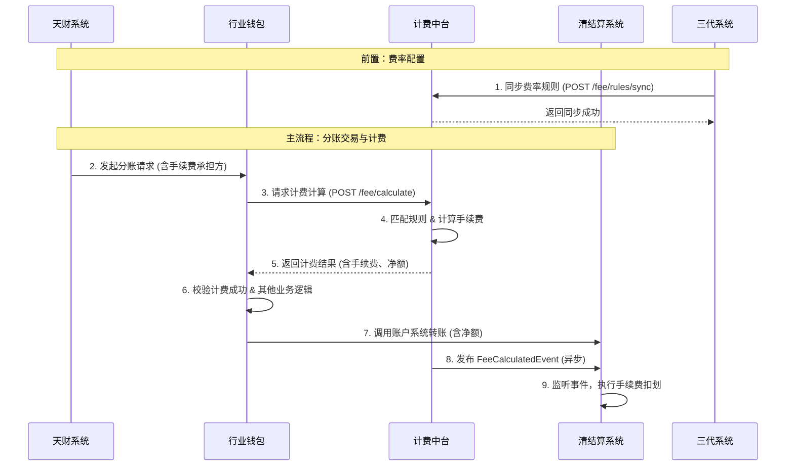

# 模块设计: 计费中台

生成时间: 2026-01-16 17:45:55

---

# 计费中台模块设计文档

## 1. 概述

### 1.1 目的
计费中台模块是“天财分账”业务的核心计费引擎，负责根据预先配置的规则，计算天财专用账户之间进行分账（转账）交易时产生的手续费。其核心目标是提供**实时、准确、可配置**的计费能力，确保手续费计算与业务规则、账户类型、场景完全匹配，并将计费结果同步至清结算系统执行扣费。

### 1.2 范围
本模块的职责范围包括：
- **费率配置管理**：接收并存储来自三代系统的计费规则配置。
- **实时计费计算**：在分账交易执行前，根据交易要素（场景、付方、收方、金额等）实时计算应收手续费。
- **计费结果同步**：将计算出的手续费明细（金额、承担方等）同步至清结算系统，作为资金划扣的依据。
- **一致性保障**：确保自身存储的费率信息与三代配置源、清结算执行端保持强一致性，避免因信息不同步导致的资损或客诉。
- **为对账单提供数据**：记录计费流水，为对账单系统提供手续费明细数据。

**边界说明**：
- **不负责**：费率的业务规则定义与商户界面配置（由三代负责）。
- **不负责**：手续费的实际资金扣划与记账（由清结算与账户系统负责）。
- **不负责**：分账交易本身的业务校验与执行（由行业钱包负责）。

## 2. 接口设计

### 2.1 API端点 (RESTful)

#### 2.1.1 计费计算接口
- **端点**: `POST /api/v1/fee/calculate`
- **描述**: 行业钱包在分账交易执行前调用此接口，计算该笔交易的手续费。
- **请求头**:
    - `X-Request-ID`: 请求唯一标识，用于全链路追踪。
    - `Content-Type: application/json`
- **请求体**:
```json
{
  "requestId": "req_1234567890", // 请求流水号，全局唯一
  "scene": "COLLECTION", // 业务场景: COLLECTION-归集, BATCH_PAY-批量付款, MEMBER_SETTLEMENT-会员结算
  "payerMerchantNo": "M100001", // 付方商户号
  "payerAccountNo": "ACCT_TIANCAI_PAY_001", // 付方账户号 (天财收款账户)
  "payerAccountType": "TIANCAI_PAYEE_ACCOUNT", // 付方账户类型
  "payeeMerchantNo": "M100002", // 收方商户号 (可为空，如接收方无商户号)
  "payeeAccountNo": "ACCT_TIANCAI_RCV_001", // 收方账户号
  "payeeAccountType": "TIANCAI_RECEIVER_ACCOUNT", // 收方账户类型: TIANCAI_PAYEE_ACCOUNT, TIANCAI_RECEIVER_ACCOUNT
  "transferAmount": 10000, // 分账金额，单位：分
  "feeBearer": "PAYER", // 手续费承担方: PAYER-付方承担, PAYEE-收方承担。由天财接口传入。
  "transactionTime": "2023-10-01T10:00:00Z" // 交易时间，用于匹配生效的费率
}
```
- **响应体 (成功)**:
```json
{
  "code": "SUCCESS",
  "message": "成功",
  "data": {
    "requestId": "req_1234567890",
    "feeCalculationId": "FEE_CAL_202310011000001", // 计费流水ID
    "totalFee": 30, // 计算出的总手续费，单位：分
    "feeDetails": [
      {
        "feeItem": "TRANSFER_FEE", // 费用项
        "calculateMode": "RATIO", // 计费模式: RATIO-比例, FIXED-固定金额
        "calculateBasis": 10000, // 计费基数 (流水金额)，单位：分
        "rate": 0.003, // 费率 (当模式为RATIO时有效)
        "fixedAmount": null, // 固定金额 (当模式为FIXED时有效)
        "calculatedAmount": 30 // 计算出的该费用项金额，单位：分
      }
    ],
    "feeBearer": "PAYER", // 手续费承担方
    "netAmount": 9970, // 净额 (当到账模式为净额转账时，收方实际到账金额)
    "arrivalMode": "NET", // 到账模式: NET-净额转账, FULL-全额转账
    "effectiveFeeRuleId": "RULE_20230901_001" // 生效的计费规则ID
  }
}
```
- **响应体 (失败)**:
```json
{
  "code": "FEE_RULE_NOT_FOUND",
  "message": "未找到适用的计费规则",
  "data": null
}
```

#### 2.1.2 费率配置同步接口 (供三代调用)
- **端点**: `POST /api/v1/fee/rules/sync`
- **描述**: 三代系统在商户配置或修改天财分账手续费规则后，调用此接口同步至计费中台。
- **请求体**:
```json
{
  "operation": "UPSERT", // 操作类型: UPSERT-新增或更新, INVALIDATE-失效
  "ruleId": "RULE_20230901_001", // 规则ID，三代生成，全局唯一
  "ruleData": {
    "payerMerchantNo": "M100001", // 付方商户号 (维度)
    "payerAccountNo": "ACCT_TIANCAI_PAY_001", // 付方账户号 (维度)
    "businessType": "TIANCAI_TRANSFER", // 业务类型: TIANCAI_TRANSFER (固定)
    "payeeAccountType": "TIANCAI_RECEIVER_ACCOUNT", // 收方账户类型 (维度)
    "scene": "BATCH_PAY", // 适用场景 (维度，可多个，逗号分隔)
    "feeCalculateMode": "RATIO", // 计费模式: RATIO, FIXED
    "feeRate": 0.003, // 费率 (当模式为RATIO时)
    "fixedFeeAmount": null, // 固定费用 (当模式为FIXED时)，单位：分
    "calculateRange": "FULL_AMOUNT", // 计费范围: FULL_AMOUNT-按流水金额计费
    "arrivalMode": "NET", // 到账模式: NET, FULL
    "effectiveTime": "2023-09-01T00:00:00Z", // 生效时间
    "invalidTime": "2099-12-31T23:59:59Z", // 失效时间
    "creator": "admin@lkl" // 操作人
  }
}
```
- **响应体**:
```json
{
  "code": "SUCCESS",
  "message": "同步成功",
  "data": {
    "ruleId": "RULE_20230901_001",
    "version": 2 // 规则版本号，用于乐观锁控制
  }
}
```

### 2.2 发布/消费的事件

#### 2.2.1 消费的事件
- **FeeRuleSyncedEvent**: 监听来自三代的费率配置变更消息，触发本地规则缓存更新。
    - 来源: 三代系统 (消息队列)
    - 载荷: 同`费率配置同步接口`的请求体。

#### 2.2.2 发布的事件
- **FeeCalculatedEvent**: 当一笔分账交易计费成功时发布，供清结算系统订阅并执行资金处理。
    - 目的地: 清结算系统 (消息队列)
    - 载荷:
    ```json
    {
      "eventId": "event_fee_123456",
      "type": "FEE_CALCULATED",
      "timestamp": "2023-10-01T10:00:05Z",
      "data": {
        "feeCalculationId": "FEE_CAL_202310011000001",
        "originalRequestId": "req_1234567890",
        "scene": "BATCH_PAY",
        "payerAccountNo": "ACCT_TIANCAI_PAY_001",
        "payeeAccountNo": "ACCT_TIANCAI_RCV_001",
        "transferAmount": 10000,
        "totalFee": 30,
        "feeBearer": "PAYER",
        "arrivalMode": "NET",
        "transactionTime": "2023-10-01T10:00:00Z"
      }
    }
    ```

## 3. 数据模型

### 3.1 核心数据库表设计

#### 表: `fee_rule` (计费规则表)
存储从三代同步的计费规则。
```sql
CREATE TABLE `fee_rule` (
  `id` bigint(20) NOT NULL AUTO_INCREMENT COMMENT '自增主键',
  `rule_id` varchar(64) NOT NULL COMMENT '规则业务ID，三代生成，唯一',
  `version` int(11) NOT NULL DEFAULT '1' COMMENT '版本号，用于乐观锁',
  `payer_merchant_no` varchar(32) NOT NULL COMMENT '付方商户号',
  `payer_account_no` varchar(64) DEFAULT NULL COMMENT '付方账户号',
  `business_type` varchar(32) NOT NULL DEFAULT 'TIANCAI_TRANSFER' COMMENT '业务类型',
  `payee_account_type` varchar(32) NOT NULL COMMENT '收方账户类型',
  `scene` varchar(512) NOT NULL COMMENT '适用场景，多个用逗号分隔',
  `fee_calculate_mode` varchar(16) NOT NULL COMMENT '计费模式: RATIO, FIXED',
  `fee_rate` decimal(10,6) DEFAULT NULL COMMENT '费率(比例)，当模式为RATIO时有效',
  `fixed_fee_amount` bigint(20) DEFAULT NULL COMMENT '固定费用(分)，当模式为FIXED时有效',
  `calculate_range` varchar(32) NOT NULL DEFAULT 'FULL_AMOUNT' COMMENT '计费范围',
  `arrival_mode` varchar(16) NOT NULL COMMENT '到账模式: NET, FULL',
  `effective_time` datetime NOT NULL COMMENT '生效时间',
  `invalid_time` datetime NOT NULL COMMENT '失效时间',
  `status` varchar(16) NOT NULL DEFAULT 'ACTIVE' COMMENT '状态: ACTIVE, INACTIVE',
  `creator` varchar(64) DEFAULT NULL COMMENT '创建人',
  `create_time` datetime NOT NULL DEFAULT CURRENT_TIMESTAMP COMMENT '创建时间',
  `update_time` datetime NOT NULL DEFAULT CURRENT_TIMESTAMP ON UPDATE CURRENT_TIMESTAMP COMMENT '更新时间',
  PRIMARY KEY (`id`),
  UNIQUE KEY `uk_rule_id` (`rule_id`),
  KEY `idx_payer_merchant` (`payer_merchant_no`, `payer_account_no`, `payee_account_type`, `status`, `effective_time`, `invalid_time`),
  KEY `idx_effective` (`status`, `effective_time`, `invalid_time`)
) ENGINE=InnoDB DEFAULT CHARSET=utf8mb4 COMMENT='天财分账计费规则表';
```

#### 表: `fee_calculation_record` (计费流水表)
记录每一笔计费请求的详细过程和结果。
```sql
CREATE TABLE `fee_calculation_record` (
  `id` bigint(20) NOT NULL AUTO_INCREMENT COMMENT '自增主键',
  `fee_calculation_id` varchar(64) NOT NULL COMMENT '计费流水业务ID',
  `request_id` varchar(64) NOT NULL COMMENT '原始计费请求ID',
  `scene` varchar(32) NOT NULL COMMENT '业务场景',
  `payer_merchant_no` varchar(32) NOT NULL COMMENT '付方商户号',
  `payer_account_no` varchar(64) NOT NULL COMMENT '付方账户号',
  `payee_account_no` varchar(64) NOT NULL COMMENT '收方账户号',
  `payee_account_type` varchar(32) NOT NULL COMMENT '收方账户类型',
  `transfer_amount` bigint(20) NOT NULL COMMENT '分账金额(分)',
  `fee_bearer` varchar(16) NOT NULL COMMENT '手续费承担方',
  `effective_fee_rule_id` varchar(64) NOT NULL COMMENT '生效的计费规则ID',
  `total_fee` bigint(20) NOT NULL COMMENT '总手续费(分)',
  `arrival_mode` varchar(16) NOT NULL COMMENT '到账模式',
  `net_amount` bigint(20) DEFAULT NULL COMMENT '净额(分)',
  `calculation_detail` json NOT NULL COMMENT '计费明细(JSON，存储feeDetails)',
  `status` varchar(16) NOT NULL DEFAULT 'CALCULATED' COMMENT '状态: CALCULATED-已计算, SYNCED-已同步至清结算, FAILED-计费失败',
  `sync_remark` varchar(255) DEFAULT NULL COMMENT '同步备注或错误信息',
  `transaction_time` datetime NOT NULL COMMENT '交易时间',
  `create_time` datetime NOT NULL DEFAULT CURRENT_TIMESTAMP COMMENT '创建时间',
  `update_time` datetime NOT NULL DEFAULT CURRENT_TIMESTAMP ON UPDATE CURRENT_TIMESTAMP COMMENT '更新时间',
  PRIMARY KEY (`id`),
  UNIQUE KEY `uk_fee_calculation_id` (`fee_calculation_id`),
  UNIQUE KEY `uk_request_id` (`request_id`),
  KEY `idx_payer_account` (`payer_account_no`, `transaction_time`),
  KEY `idx_status` (`status`, `create_time`)
) ENGINE=InnoDB DEFAULT CHARSET=utf8mb4 COMMENT='天财分账计费流水表';
```

### 3.2 与其他模块的关系
- **三代系统**: 上游配置源。通过接口同步费率规则，是计费规则的权威来源。
- **行业钱包系统**: 上游调用方。在分账交易前调用计费接口，并依赖返回结果决定是否继续交易。
- **清结算系统**: 下游执行方。消费`FeeCalculatedEvent`，根据计费结果进行实际资金扣划和结算。
- **业务核心/对账单系统**: 下游数据消费方。计费流水作为手续费明细的数据源，被同步或查询以生成对账单。

## 4. 业务逻辑

### 4.1 核心算法：费率匹配与计算
1. **输入**: 计费请求 (`FeeCalculateRequest`)。
2. **匹配规则**:
    - 根据 `payerMerchantNo`, `payerAccountNo` (可选), `payeeAccountType`, `scene`, `transactionTime` 作为关键维度。
    - 查询 `fee_rule` 表，找到一条同时满足以下条件的 **唯一有效规则**：
        a. `payer_merchant_no` 匹配。
        b. `payer_account_no` 为NULL或与请求匹配。
        c. `payee_account_type` 匹配。
        d. `scene` 字段包含请求的场景。
        e. `status = 'ACTIVE'`。
        f. `transactionTime` 介于 `effective_time` 和 `invalid_time` 之间。
    - 如果找到多条，按 `payer_account_no` 非空优先、`create_time` 最新优先的规则选择。
3. **计算手续费**:
    - **比例模式 (`RATIO`)**:
        ```
        totalFee = round(transferAmount * feeRate)
        ```
        *注：采用四舍五入到分。*
    - **固定金额模式 (`FIXED`)**:
        ```
        totalFee = fixedFeeAmount
        ```
4. **计算净额**:
    - **净额到账 (`NET`)**:
        - 如果 `feeBearer = 'PAYER'`: `netAmount = transferAmount`
        - 如果 `feeBearer = 'PAYEE'`: `netAmount = transferAmount - totalFee`
    - **全额到账 (`FULL`)**:
        - `netAmount = transferAmount` (手续费额外向承担方收取)

### 4.2 业务规则
1. **唯一规则匹配**: 确保任意一笔交易在特定时间点只匹配一条有效计费规则，避免重复计费或计费冲突。
2. **实时性**: 计费计算必须实时完成，性能要求高（P99 < 50ms）。
3. **幂等性**: 基于 `requestId` 实现计费请求的幂等处理，避免重复计算。
4. **一致性保证**: 费率规则同步需保证最终一致性。在规则同步过程中，如有交易计费，采用**短时降级**策略（如使用上一次生效的规则），并记录告警。
5. **到账模式与承担方联动**: 根据需求，`arrivalMode` 和 `feeBearer` 的组合决定最终的资金流。需在返回结果中明确 `netAmount`。

### 4.3 验证逻辑
1. **请求参数校验**:
    - 必填字段非空。
    - `transferAmount` > 0。
    - `scene`, `feeBearer`, `payeeAccountType` 等枚举值有效。
    - `payerAccountType` 必须为 `TIANCAI_PAYEE_ACCOUNT`。
2. **规则存在性校验**: 如果未匹配到任何有效规则，立即返回明确错误 `FEE_RULE_NOT_FOUND`，阻止交易进行。
3. **计费结果合理性校验**: 计算出的 `totalFee` 不能大于 `transferAmount`（在收方承担场景下，需保证 `netAmount > 0`）。

## 5. 时序图

### 5.1 关键工作流：分账交易计费时序图



## 6. 错误处理

| 错误码 | 描述 | 触发条件 | 处理策略 |
| :--- | :--- | :--- | :--- |
| `INVALID_PARAMETER` | 请求参数无效 | 参数校验失败（格式、枚举值、必填） | 返回详细错误信息，请求方修正后重试。 |
| `FEE_RULE_NOT_FOUND` | 未找到适用的计费规则 | 根据交易维度未匹配到任何ACTIVE规则 | **阻断交易**。需由商户在三代检查配置。记录告警。 |
| `FEE_CALCULATION_ERROR` | 手续费计算错误 | 计算过程出现异常（如除零、溢出） | 记录详细日志和上下文，告警通知运维。返回系统错误。 |
| `DUPLICATE_REQUEST` | 重复的请求ID | `requestId` 已存在且状态为 `CALCULATED` | 返回之前已计算成功的结果，保证幂等性。 |
| `RULE_SYNC_CONFLICT` | 规则同步冲突 | 同步规则时版本冲突或数据不一致 | 记录冲突详情，告警通知运维人工介入。确保三代为权威源，可覆盖本地。 |
| `DOWNSTREAM_UNAVAILABLE` | 下游系统不可用 | 发布事件到消息队列失败 | 重试机制（如3次）。若最终失败，将计费记录状态标记为`SYNC_FAILED`，启动后台补偿任务。 |

**降级策略**:
- 在费率规则同步短暂延迟时，为保障交易进行，可短暂（如5分钟）继续使用旧的缓存规则，并发出业务告警。
- 若计费中台完全不可用，行业钱包应具备**应急开关**，可跳过计费环节（需记录日志），但此操作需严格审批，后续需人工核对与清算。

## 7. 依赖说明

### 7.1 上游模块依赖
1. **三代系统**:
    - **交互方式**: 同步HTTP接口 (`/fee/rules/sync`)、异步消息 (`FeeRuleSyncedEvent`)。
    - **依赖内容**: 计费规则的权威配置信息。
    - **强一致性要求**: 是。规则不一致会导致计费错误和资损。通过**同步接口+消息确认+定期对账**保障。

2. **行业钱包系统**:
    - **交互方式**: 同步HTTP接口 (`/fee/calculate`)。
    - **依赖内容**: 提供实时计费服务。
    - **性能要求**: 高。需保证低延迟和高可用，否则会阻塞分账交易主流程。

### 7.2 下游模块依赖
1. **清结算系统**:
    - **交互方式**: 异步消息 (`FeeCalculatedEvent`)。
    - **提供内容**: 计费结果明细，作为资金扣划依据。
    - **最终一致性要求**: 是。必须保证事件至少成功投递一次，清结算需幂等消费。

2. **业务核心/对账单系统**:
    - **交互方式**: 数据库同步（通过数据同步工具）或异步消息。
    - **提供内容**: `fee_calculation_record` 表中的计费流水数据。
    - **时效性要求**: 准实时。T+1对账单生成前数据必须就绪。

### 7.3 基础设施依赖
- **数据库**: MySQL，用于持久化规则和流水。
- **缓存**: Redis，用于缓存热点计费规则，提升匹配性能。
- **消息队列**: Kafka/RocketMQ，用于与清结算等系统异步解耦。
- **配置中心**: 用于管理开关、降级策略等运行时配置。