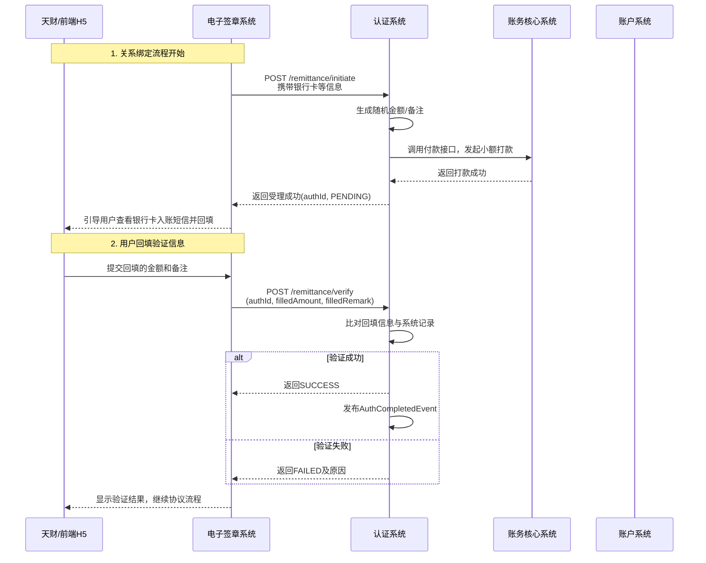
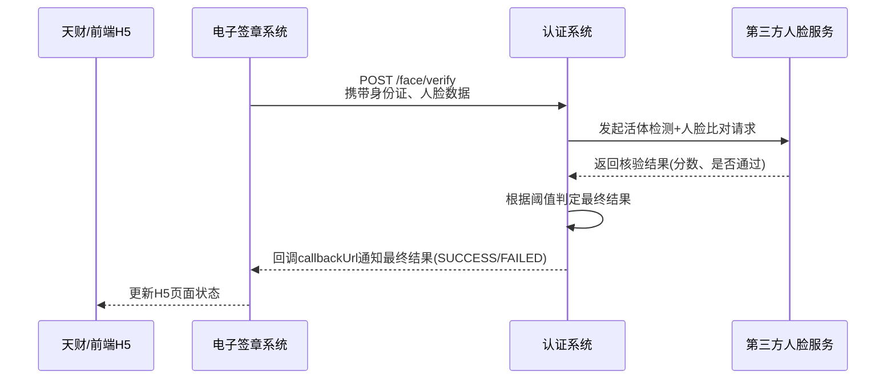

# 模块设计: 认证系统

生成时间: 2026-01-16 17:45:08

---

# 认证系统模块设计文档

## 1. 概述

### 1.1 目的
认证系统模块旨在为“天财分账”业务提供统一、安全、可审计的身份验证服务。核心职责是执行两种关键的身份认证方式：**小额打款验证**和**人脸验证**，以确保分账业务中资金付方与收方关系的真实性与合法性，满足法务合规要求。本模块作为底层能力提供方，被电子签章系统调用，是关系绑定流程中的关键一环。

### 1.2 范围
- **核心功能**：
    1.  **打款验证**：向指定银行卡发起小额随机打款，并验证用户回填的金额与备注信息。
    2.  **人脸验证**：调用第三方人脸识别服务，验证个人或个体工商户的姓名、身份证号与人脸生物特征是否一致。
- **服务对象**：主要为电子签章系统，在关系绑定流程中调用。
- **数据管理**：记录并管理每次验证请求的流水、状态、验证要素及结果，为电子签章平台提供全证据链数据支持。
- **不包含**：协议生成、短信发送、H5页面封装、业务规则校验（如商户一致性校验）。这些职责由电子签章系统或行业钱包系统承担。

## 2. 接口设计

### 2.1 API端点 (RESTful)

#### 2.1.1 发起打款验证
- **端点**：`POST /api/v1/auth/remittance/initiate`
- **描述**：接收验证请求，向指定银行卡发起一笔小额随机金额的打款。
- **请求头**：`Content-Type: application/json`
- **请求体**：
    ```json
    {
        "requestId": "REQ_202310270001", // 唯一请求流水号，由调用方（电子签章）生成
        "businessType": "TIANCAI_SPLIT_ACCOUNT", // 业务类型，固定值
        "authScene": "BINDING_RELATION", // 认证场景：BINDING_RELATION（关系绑定）
        "targetType": "CORPORATE", // 验证对象类型：CORPORATE（企业）/INDIVIDUAL（个人）
        "bankCardInfo": {
            "accountName": "北京某某科技有限公司",
            "accountNo": "6228480012345678901",
            "bankCode": "ICBC"
        },
        "callbackUrl": "https://esign.example.com/callback", // 验证结果回调地址
        "extInfo": { // 扩展信息，用于关联业务
            "merchantNo": "888000000001",
            "accountNo": "TC_RCV_ACC_001",
            "relationType": "HEADQUARTERS_TO_STORE" // HEADQUARTERS_TO_STORE, HEADQUARTERS_TO_RECEIVER, STORE_TO_HEADQUARTERS
        }
    }
    ```
- **响应体** (成功)：
    ```json
    {
        "code": "SUCCESS",
        "message": "打款指令已受理",
        "data": {
            "authId": "AUTH_RMT_202310270001", // 认证系统生成的唯一流水号
            "requestId": "REQ_202310270001",
            "status": "PENDING", // 状态：PENDING（待回填）
            "expireTime": "2023-10-27 15:30:00" // 回填截止时间
        }
    }
    ```

#### 2.1.2 验证打款回填信息
- **端点**：`POST /api/v1/auth/remittance/verify`
- **描述**：验证用户回填的小额打款金额和备注。
- **请求体**：
    ```json
    {
        "authId": "AUTH_RMT_202310270001",
        "filledAmount": "0.23", // 用户回填金额
        "filledRemark": "529874" // 用户回填备注（6位数字或2汉字）
    }
    ```
- **响应体** (成功)：
    ```json
    {
        "code": "SUCCESS",
        "message": "验证成功",
        "data": {
            "authId": "AUTH_RMT_202310270001",
            "status": "SUCCESS",
            "verifyTime": "2023-10-27 14:25:30"
        }
    }
    ```

#### 2.1.3 发起人脸验证
- **端点**：`POST /api/v1/auth/face/verify`
- **描述**：提交用户信息与人脸图像/视频，进行活体检测与身份核验。
- **请求体**：
    ```json
    {
        "requestId": "REQ_202310270002",
        "businessType": "TIANCAI_SPLIT_ACCOUNT",
        "authScene": "BINDING_RELATION",
        "targetType": "INDIVIDUAL", // INDIVIDUAL（个人/个体户）
        "identityInfo": {
            "name": "张三",
            "idCardNo": "110101199003071234"
        },
        "faceData": {
            "type": "IMAGE_BASE64", // IMAGE_BASE64 / VIDEO_URL / LIVENESS_DATA
            "content": "/9j/4AAQSkZJRgABAQEAYABgAAD/2wBDAA..." // Base64编码的图片或视频URL
        },
        "livenessCheck": true, // 是否进行活体检测
        "callbackUrl": "https://esign.example.com/callback",
        "extInfo": {
            "merchantNo": "888000000002",
            "accountNo": "TC_RCV_ACC_002"
        }
    }
    ```
- **响应体** (成功)：
    ```json
    {
        "code": "SUCCESS",
        "message": "人脸验证请求已受理",
        "data": {
            "authId": "AUTH_FACE_202310270001",
            "requestId": "REQ_202310270002",
            "status": "PROCESSING"
        }
    }
    ```
    *注：由于人脸识别可能涉及异步处理，首次响应可能只表示请求受理。最终结果通过回调通知。*

#### 2.1.4 查询认证结果
- **端点**：`GET /api/v1/auth/result/{authId}`
- **描述**：根据认证流水号查询最终的认证结果。
- **响应体**：
    ```json
    {
        "code": "SUCCESS",
        "message": "查询成功",
        "data": {
            "authId": "AUTH_RMT_202310270001",
            "requestId": "REQ_202310270001",
            "authType": "REMITTANCE",
            "targetType": "CORPORATE",
            "status": "SUCCESS", // SUCCESS, FAILED, EXPIRED, PENDING
            "initiateTime": "2023-10-27 14:00:00",
            "verifyTime": "2023-10-27 14:25:30",
            "failureReason": "", // 失败原因，如“回填金额不符”
            "extInfo": { ... } // 请求时的扩展信息
        }
    }
    ```

### 2.2 发布/消费的事件

#### 2.2.1 消费的事件
- **账户系统事件**：`BankCardBoundEvent`（银行卡绑定事件）。当账户系统为天财接收方账户绑定或更新默认银行卡时，认证系统可监听此事件，以获取最新、准确的银行卡信息，确保打款验证的准确性。

#### 2.2.2 发布的事件
- **认证完成事件**：`AuthCompletedEvent`。当一笔认证（打款或人脸）最终状态确定（成功/失败/过期）时发布，供电子签章系统或其他关心认证结果的系统订阅。
    ```json
    {
        "eventId": "EVT_AUTH_202310270001",
        "eventType": "AUTH_COMPLETED",
        "timestamp": "2023-10-27T14:25:30Z",
        "payload": {
            "authId": "AUTH_RMT_202310270001",
            "requestId": "REQ_202310270001",
            "authType": "REMITTANCE",
            "status": "SUCCESS",
            "targetType": "CORPORATE",
            "extInfo": { ... }
        }
    }
    ```

## 3. 数据模型

### 3.1 数据库表设计

#### 表：`auth_request` (认证请求主表)
| 字段名 | 类型 | 必填 | 默认值 | 描述 |
| :--- | :--- | :--- | :--- | :--- |
| `id` | bigint(20) | Y | AUTO_INCREMENT | 主键 |
| `auth_id` | varchar(32) | Y | | **业务唯一流水号**，格式：`AUTH_{TYPE}_{日期}_{序列}` |
| `request_id` | varchar(32) | Y | | 调用方请求流水号 |
| `auth_type` | varchar(20) | Y | | 认证类型：`REMITTANCE`(打款), `FACE`(人脸) |
| `auth_scene` | varchar(50) | Y | | 认证场景：`BINDING_RELATION` |
| `business_type` | varchar(50) | Y | | 业务类型：`TIANCAI_SPLIT_ACCOUNT` |
| `target_type` | varchar(20) | Y | | 验证对象类型：`CORPORATE`, `INDIVIDUAL` |
| `status` | varchar(20) | Y | `INIT` | 状态：`INIT`, `PENDING`, `PROCESSING`, `SUCCESS`, `FAILED`, `EXPIRED` |
| `callback_url` | varchar(512) | Y | | 结果回调地址 |
| `ext_info` | json | N | | 扩展信息，存储请求中的extInfo |
| `create_time` | datetime | Y | CURRENT_TIMESTAMP | 创建时间 |
| `update_time` | datetime | Y | CURRENT_TIMESTAMP ON UPDATE | 更新时间 |
| **索引** | | | | |
| `uk_auth_id` | UNIQUE (`auth_id`) | | | |
| `idx_request_id` | INDEX (`request_id`) | | | |
| `idx_status_createtime` | INDEX (`status`, `create_time`) | | | 用于清理过期任务 |

#### 表：`auth_remittance_detail` (打款验证详情表)
| 字段名 | 类型 | 必填 | 默认值 | 描述 |
| :--- | :--- | :--- | :--- | :--- |
| `id` | bigint(20) | Y | AUTO_INCREMENT | 主键 |
| `auth_id` | varchar(32) | Y | | 关联`auth_request.auth_id` |
| `bank_account_name` | varchar(100) | Y | | 银行卡户名 |
| `bank_account_no` | varchar(32) | Y | | 银行卡号（加密存储） |
| `bank_code` | varchar(20) | Y | | 银行编码 |
| `remit_amount` | decimal(10,2) | Y | | **系统打出的随机金额** |
| `remit_remark` | varchar(10) | Y | | **系统生成的随机备注**（6位数字或2汉字） |
| `filled_amount` | decimal(10,2) | N | | 用户回填金额 |
| `filled_remark` | varchar(10) | N | | 用户回填备注 |
| `remit_order_no` | varchar(64) | N | | 打款通道订单号，关联账务核心 |
| `remit_status` | varchar(20) | Y | `INIT` | 打款状态：`INIT`, `SUCCESS`, `FAILED` |
| `expire_time` | datetime | Y | | 回填截止时间（创建时间+24小时） |
| `verify_time` | datetime | N | | 验证时间 |
| `failure_reason` | varchar(200) | N | | 失败原因 |
| **索引** | | | | |
| `uk_auth_id` | UNIQUE (`auth_id`) | | | |
| `idx_expire_time` | INDEX (`expire_time`) | | | 用于过期处理 |

#### 表：`auth_face_detail` (人脸验证详情表)
| 字段名 | 类型 | 必填 | 默认值 | 描述 |
| :--- | :--- | :--- | :--- | :--- |
| `id` | bigint(20) | Y | AUTO_INCREMENT | 主键 |
| `auth_id` | varchar(32) | Y | | 关联`auth_request.auth_id` |
| `name` | varchar(50) | Y | | 姓名 |
| `id_card_no` | varchar(20) | Y | | 身份证号（加密存储） |
| `face_data_ref` | varchar(512) | N | | 人脸图像/视频存储引用（OSS路径或URL） |
| `liveness_score` | decimal(5,2) | N | | 活体检测分数 |
| `similarity_score` | decimal(5,2) | N | | 人脸比对相似度分数 |
| `thirdparty_request_id` | varchar(64) | N | | 第三方人脸服务请求ID |
| `thirdparty_response` | json | N | | 第三方服务原始响应 |
| `verify_time` | datetime | N | | 验证完成时间 |
| `failure_reason` | varchar(200) | N | | 失败原因 |
| **索引** | | | | |
| `uk_auth_id` | UNIQUE (`auth_id`) | | | |

### 3.2 与其他模块的关系
- **电子签章系统**：核心调用方。认证系统为其提供“验证”能力，电子签章系统负责整合协议、短信、H5页面，并调用本系统完成认证环节。
- **账户系统**：数据依赖方。打款验证需要准确的银行卡信息，这些信息来源于账户系统维护的“天财接收方账户”绑定的默认银行卡。
- **账务核心系统**：协作方。发起小额打款时，需要调用账务核心的付款接口完成出款记账。
- **行业钱包系统**：间接关联方。行业钱包发起关系绑定流程，触发电子签章调用本系统。本系统发布的认证结果事件可供行业钱包订阅，用于更新绑定关系状态。

## 4. 业务逻辑

### 4.1 核心算法

#### 4.1.1 打款验证随机数生成
- **随机金额**：生成一个在 `[0.01, 0.99]` 元范围内的随机金额，精确到分。算法需保证在并发下的唯一性与随机性。
- **随机备注**：
    - **数字模式**：生成6位纯数字随机字符串。
    - **汉字模式**：从一个预定义的常用汉字库中随机选取2个汉字。
    - 模式选择可根据配置或请求参数决定，天财场景可能固定使用数字模式。

#### 4.1.2 人脸验证流程
1.  **活体检测**：如果请求要求活体检测(`livenessCheck=true`)，优先对传入的`faceData`进行活体判断，防止照片、视频攻击。未通过则直接失败。
2.  **特征提取与比对**：调用第三方人脸识别服务（如阿里云、腾讯云），将待验证人脸特征与公安库或传入的身份证信息进行比对。
3.  **结果判定**：综合`liveness_score`（需大于阈值，如0.9）和`similarity_score`（需大于阈值，如0.8）判断最终结果。

### 4.2 业务规则与验证逻辑

#### 4.2.1 打款验证流程规则
1.  **接收请求**：从电子签章系统接收`initiate`请求。
2.  **参数校验**：检查必要参数，`bankCardInfo`中的卡号、户名需通过基础格式校验。
3.  **生成验证要素**：调用随机数生成算法，产生`remit_amount`和`remit_remark`。
4.  **发起打款**：
    - 调用**账务核心系统**的付款接口，向`bankCardInfo`指定卡号打款`remit_amount`元，备注为`remit_remark`。
    - 记录`remit_order_no`，更新`remit_status`为`PROCESSING`。
5.  **等待回填**：打款成功后，状态变为`PENDING`，等待用户回填。
6.  **验证回填**：
    - 用户通过H5页面回填后，电子签章调用`verify`接口。
    - **验证逻辑**：严格比对 `filledAmount` 是否等于 `remit_amount`，且 `filledRemark` 是否等于 `remit_remark`。
    - **容错考虑**：金额比较需考虑浮点数精度，应转换为`BigDecimal`进行等值比较。备注区分大小写。
7.  **结果处理**：验证成功则状态为`SUCCESS`，失败则为`FAILED`并记录原因。无论成功失败，均通过`callbackUrl`通知电子签章系统。

#### 4.2.2 人脸验证流程规则
1.  **接收请求**：接收电子签章系统的`verify`请求。
2.  **参数校验**：校验`identityInfo`和`faceData`的合法性。
3.  **调用第三方服务**：封装请求参数，调用选定的人脸识别服务商API。
4.  **处理异步响应**：部分服务为异步，需处理回调或轮询获取结果。
5.  **结果解析与判定**：根据4.1.2的算法判定最终结果。
6.  **回调通知**：将最终结果（`SUCCESS`/`FAILED`）回调至`callbackUrl`。

#### 4.2.3 通用规则
- **幂等性**：所有接口需支持幂等，基于`requestId`或`authId`防止重复处理。
- **有效期**：打款验证回填有效期通常为24小时，超时后状态自动变更为`EXPIRED`。
- **安全**：银行卡号、身份证号等敏感信息在数据库中加密存储。人脸原始数据不落本地库，仅存储于安全的对象存储中。

## 5. 时序图

### 5.1 打款验证时序图 (以批量付款场景为例)



### 5.2 人脸验证时序图



## 6. 错误处理

| 错误场景 | 错误码 | HTTP状态码 | 处理策略 |
| :--- | :--- | :--- | :--- |
| 请求参数缺失或格式错误 | `PARAM_INVALID` | 400 | 返回具体字段错误信息，请求方修正后重试。 |
| 重复的请求ID (`requestId`) | `REQUEST_DUPLICATED` | 409 | 返回首次请求已受理的结果，保证幂等性。 |
| 银行卡信息无效（如卡号不存在） | `BANK_CARD_INVALID` | 400 | 记录失败原因，通知调用方检查账户系统数据。 |
| 小额打款失败（如账户余额不足） | `REMITTANCE_FAILED` | 500 | 更新`remit_status`为`FAILED`，通知调用方，建议用户重试或更换验证方式。 |
| 验证信息不匹配 | `VERIFICATION_MISMATCH` | 200 (业务失败) | 更新状态为`FAILED`，记录`failure_reason`。可配置允许重试次数。 |
| 认证记录已过期 | `AUTH_EXPIRED` | 410 | 不允许再验证，需重新发起整个认证流程。 |
| 第三方人脸服务异常 | `THIRDPARTY_SERVICE_ERROR` | 502 | 记录日志，告警，返回系统繁忙，建议稍后重试。 |
| 系统内部错误（DB、网络） | `INTERNAL_ERROR` | 500 | 记录详细日志，触发告警，返回通用错误信息。 |

**通用策略**：
- 所有错误均有明确的业务错误码和用户/调用方可理解的信息。
- 涉及资金的操作（如打款）必须有完备的核对与冲正机制。
- 设置异步任务（如Job）定期扫描`PENDING`超时的记录，自动更新为`EXPIRED`。

## 7. 依赖说明

### 7.1 上游依赖
1.  **电子签章系统**：
    - **交互方式**：同步HTTP API调用（发起验证、查询结果） + 异步事件回调/发布。
    - **职责**：电子签章系统是本模块的主要驱动者，负责组装业务上下文（如商户信息、场景），并在适当时机调用本模块。本模块需确保接口稳定、响应及时。

2.  **账户系统**：
    - **交互方式**：异步事件订阅 (`BankCardBoundEvent`)。
    - **职责**：提供准确的、最新的银行卡信息。本模块在发起打款验证前，应确保所使用的银行卡信息是最新绑定的，避免向旧卡打款。

3.  **账务核心系统**：
    - **交互方式**：同步HTTP API调用。
    - **职责**：提供小额付款能力，并返回付款流水号。本模块需处理付款可能失败的各种情况。

4.  **第三方人脸识别服务**：
    - **交互方式**：同步/异步HTTP API调用。
    - **职责**：提供专业的活体检测与人脸比对能力。本模块需封装不同服务商的差异，提供统一接口，并处理网络超时、服务不可用等异常。

### 7.2 下游依赖
1.  **行业钱包系统**：
    - **交互方式**：异步事件发布 (`AuthCompletedEvent`)。
    - **职责**：订阅认证结果事件，用于更新“关系绑定”流程的状态，或作为后续分账交易的校验依据之一。

### 7.3 依赖管理
- **强依赖**：账务核心、第三方人脸服务。这些服务不可用将导致核心功能失效。需要实现**熔断、降级和重试机制**。例如，人脸服务不可用时，可考虑降级为仅提示或引导用户使用打款验证（如果业务允许）。
- **弱依赖**：账户系统的事件。即使事件暂时丢失，也可以通过查询接口获取最新银行卡信息，或由电子签章系统在请求中传递准确的卡信息。
- **配置中心**：依赖配置中心管理第三方服务的端点、密钥、阈值（如人脸比对分数）等。
- **监控与告警**：对所有外部依赖的调用成功率、耗时进行监控，设置阈值告警。