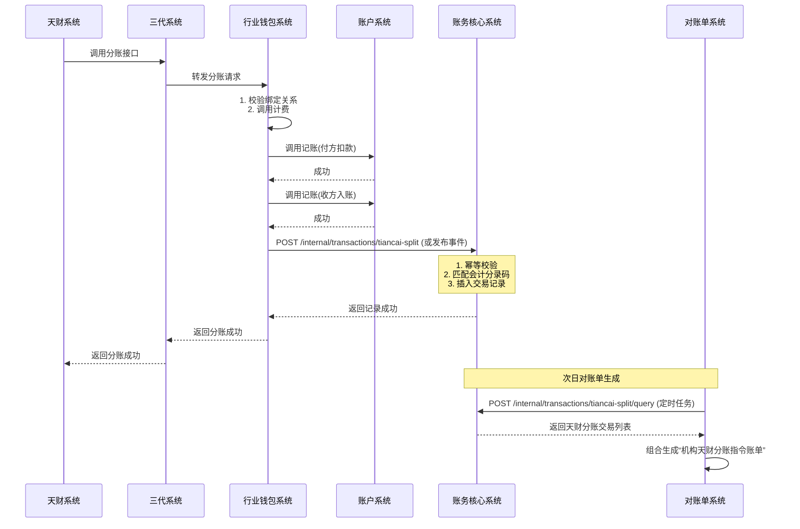
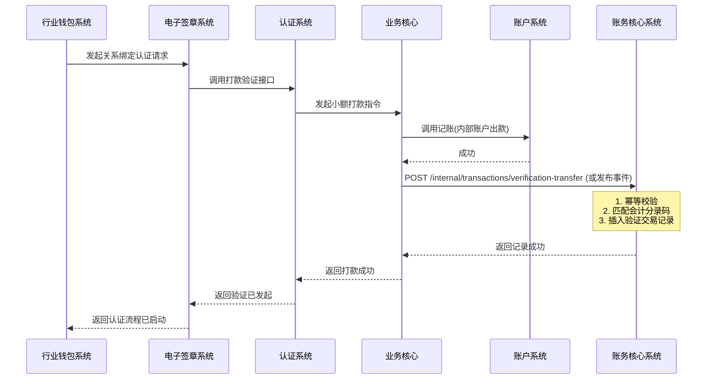

# 模块设计: 账务核心系统

生成时间: 2026-01-16 17:49:02

---

# 账务核心系统模块设计文档（天财分账专项）

## 1. 概述

### 1.1 目的
本模块（账务核心系统）作为拉卡拉支付系统的核心交易记录中心，为“天财分账”业务提供交易数据的接收、记录和存储服务。核心目的是确保所有天财分账交易（包括归集、批量付款、会员结算）以及相关打款验证交易，都能被准确、完整地记录，形成标准化的交易流水，为下游的对账单系统提供可靠、可追溯的数据源。

### 1.2 范围
- **交易数据接收**：接收来自行业钱包系统的“天财分账”交易数据，并持久化存储。
- **交易数据接收**：接收来自业务核心或认证系统的“打款验证”交易数据，并持久化存储。
- **分录码管理**：为天财分账及打款验证业务定义并使用专用的会计分录码，确保财务核算的准确性。
- **数据查询与提供**：为对账单系统提供标准化的天财分账交易数据，支持按机构、时间等维度查询。
- **数据一致性保障**：通过幂等性设计，确保交易数据不重不漏，并与账户系统的资金流水通过业务流水号（`bizNo`）强关联。

## 2. 接口设计

### 2.1 API端点 (RESTful)

#### 2.1.1 内部接口（供行业钱包、业务核心等系统调用）

**1. 接收天财分账交易**
- **端点**：`POST /internal/transactions/tiancai-split`
- **描述**：接收并记录一笔天财分账交易。此接口必须幂等。
- **调用方**：行业钱包系统
- **请求体**：
```json
{
  "requestId": "UUID",
  "bizNo": "天财分账业务流水号",
  "bizType": "TIANCAI_SPLIT",
  "splitScene": "COLLECTION" | "BATCH_PAYMENT" | "MEMBER_SETTLEMENT", // 归集 | 批量付款 | 会员结算
  "payerMerchantNo": "付方商户号",
  "payerAccountNo": "付方天财账户号",
  "payeeMerchantNo": "收方商户号",
  "payeeAccountNo": "收方天财账户号",
  "amount": 10000,
  "fee": 10,
  "feeBearer": "PAYER" | "PAYEE", // 付方承担 | 收方承担
  "transferMode": "NET" | "GROSS", // 净额转账 | 全额转账
  "currency": "CNY",
  "scenePurpose": "缴纳品牌费", // 场景资金用途
  "splitRequestTime": "2023-10-01 12:00:00", // 天财发起请求时间
  "splitCompleteTime": "2023-10-01 12:00:05", // 分账完成时间
  "operator": "wallet_system"
}
```
- **响应体**：
```json
{
  "code": "SUCCESS",
  "message": "成功",
  "data": {
    "transactionId": "账务核心交易流水ID",
    "bizNo": "业务流水号",
    "status": "RECORDED"
  }
}
```

**2. 接收打款验证交易**
- **端点**：`POST /internal/transactions/verification-transfer`
- **描述**：接收并记录一笔用于身份验证的小额打款交易。此接口必须幂等。
- **调用方**：业务核心 或 认证系统（根据流程设计）
- **请求体**：
```json
{
  "requestId": "UUID",
  "bizNo": "打款验证业务流水号",
  "bizType": "VERIFICATION_TRANSFER",
  "verificationType": "REMITTANCE", // 打款验证
  "payerAccountNo": "付款账户号（内部账户）",
  "payeeBankCardNo": "收款方银行卡号",
  "payeeBankCardName": "收款方姓名",
  "amount": 0.01, // 随机小额金额
  "remark": "6位随机数字或2汉字",
  "currency": "CNY",
  "purpose": "RELATION_BINDING_AUTH", // 关系绑定认证
  "bindScene": "COLLECTION" | "BATCH_PAYMENT" | "MEMBER_SETTLEMENT", // 关联的分账场景
  "bindPayerMerchantNo": "关联付方商户号",
  "bindPayeeMerchantNo": "关联收方商户号",
  "transferTime": "2023-10-01 12:00:00",
  "operator": "auth_system"
}
```
- **响应体**：同分账接口。

**3. 天财分账交易查询（供对账单系统）**
- **端点**：`POST /internal/transactions/tiancai-split/query`
- **描述**：根据时间范围和机构号，批量查询天财分账交易记录。
- **调用方**：对账单系统
- **请求体**：
```json
{
  "orgNo": "天财机构号",
  "startTime": "2023-10-01 00:00:00",
  "endTime": "2023-10-02 00:00:00",
  "splitScene": "COLLECTION", // 可选，按场景过滤
  "pageNo": 1,
  "pageSize": 1000
}
```
- **响应体**：
```json
{
  "code": "SUCCESS",
  "data": {
    "transactions": [
      {
        "transactionId": "账务核心交易流水ID",
        "bizNo": "业务流水号",
        "splitScene": "COLLECTION",
        "payerMerchantNo": "付方商户号",
        "payerAccountNo": "付方账户号",
        "payeeMerchantNo": "收方商户号",
        "payeeAccountNo": "收方账户号",
        "amount": 10000,
        "fee": 10,
        "feeBearer": "PAYER",
        "transferMode": "NET",
        "currency": "CNY",
        "scenePurpose": "缴纳品牌费",
        "splitRequestTime": "2023-10-01 12:00:00",
        "splitCompleteTime": "2023-10-01 12:00:05",
        "createdTime": "2023-10-01 12:00:05"
      }
    ],
    "total": 1500
  }
}
```

### 2.2 发布/消费的事件

#### 2.2.1 消费的事件
- **TiancaiSplitExecutedEvent**：由行业钱包系统在分账成功后发布。账务核心监听此事件并记录交易。
  - **主题**：`tiancai.split.executed`
  - **数据**：包含 `bizNo`, `splitScene`, `payerAccountNo`, `payeeAccountNo`, `amount`, `fee`, `feeBearer`, `splitCompleteTime` 等关键字段。
- **VerificationTransferExecutedEvent**：由业务核心或认证系统在小额打款成功后发布。账务核心监听此事件并记录交易。
  - **主题**：`verification.transfer.executed`
  - **数据**：包含 `bizNo`, `payerAccountNo`, `payeeBankCardNo`, `amount`, `remark`, `purpose` 等关键字段。

#### 2.2.2 发布的事件
- **TransactionRecordedEvent**：当成功记录一笔交易（分账或打款验证）后发布。可用于下游系统（如监控、审计）订阅。
  - **主题**：`transaction.recorded`
  - **数据**：`{“transactionId”: “xxx”, “bizNo”: “yyy”, “bizType”: “TIANCAI_SPLIT”, “amount”: 100, “recordTime”: “...”}`

## 3. 数据模型

### 3.1 核心表设计

**1. 天财分账交易主表 (tiancai_split_transaction)**
存储所有天财分账交易的核心信息。
```sql
CREATE TABLE `tiancai_split_transaction` (
  `id` bigint(20) NOT NULL AUTO_INCREMENT COMMENT '主键ID',
  `transaction_id` varchar(32) NOT NULL COMMENT '账务核心交易流水ID，唯一',
  `biz_no` varchar(64) NOT NULL COMMENT '业务流水号（行业钱包生成），与biz_type组成唯一键',
  `biz_type` varchar(32) NOT NULL DEFAULT 'TIANCAI_SPLIT' COMMENT '业务类型',
  `split_scene` varchar(32) NOT NULL COMMENT '分账场景: COLLECTION-归集, BATCH_PAYMENT-批量付款, MEMBER_SETTLEMENT-会员结算',
  `payer_merchant_no` varchar(32) NOT NULL COMMENT '付方商户号',
  `payer_account_no` varchar(32) NOT NULL COMMENT '付方账户号（天财收款账户）',
  `payee_merchant_no` varchar(32) NOT NULL COMMENT '收方商户号',
  `payee_account_no` varchar(32) NOT NULL COMMENT '收方账户号（天财收款账户/接收方账户）',
  `amount` decimal(20,2) NOT NULL COMMENT '分账金额（元）',
  `fee` decimal(20,2) NOT NULL DEFAULT '0.00' COMMENT '手续费（元）',
  `fee_bearer` varchar(10) NOT NULL COMMENT '手续费承担方: PAYER-付方, PAYEE-收方',
  `transfer_mode` varchar(10) NOT NULL COMMENT '到账模式: NET-净额, GROSS-全额',
  `currency` varchar(3) NOT NULL DEFAULT 'CNY' COMMENT '币种',
  `scene_purpose` varchar(64) NOT NULL COMMENT '场景资金用途',
  `split_request_time` datetime NOT NULL COMMENT '天财发起请求时间',
  `split_complete_time` datetime NOT NULL COMMENT '分账完成时间',
  `status` varchar(32) NOT NULL DEFAULT 'SUCCESS' COMMENT '交易状态: SUCCESS, FAILED',
  `accounting_entry_code` varchar(32) NOT NULL COMMENT '会计分录码',
  `version` int(11) NOT NULL DEFAULT 0 COMMENT '版本号，用于乐观锁',
  `created_time` datetime NOT NULL DEFAULT CURRENT_TIMESTAMP COMMENT '创建时间',
  `updated_time` datetime NOT NULL DEFAULT CURRENT_TIMESTAMP ON UPDATE CURRENT_TIMESTAMP COMMENT '更新时间',
  PRIMARY KEY (`id`),
  UNIQUE KEY `uk_biz_no_type` (`biz_no`, `biz_type`),
  UNIQUE KEY `uk_transaction_id` (`transaction_id`),
  KEY `idx_payer_merchant_time` (`payer_merchant_no`, `split_complete_time`),
  KEY `idx_payee_merchant_time` (`payee_merchant_no`, `split_complete_time`),
  KEY `idx_complete_time` (`split_complete_time`),
  KEY `idx_scene` (`split_scene`)
) ENGINE=InnoDB COMMENT='天财分账交易主表';
```

**2. 打款验证交易表 (verification_transfer_transaction)**
存储所有用于关系绑定认证的小额打款交易信息。
```sql
CREATE TABLE `verification_transfer_transaction` (
  `id` bigint(20) NOT NULL AUTO_INCREMENT COMMENT '主键ID',
  `transaction_id` varchar(32) NOT NULL COMMENT '账务核心交易流水ID，唯一',
  `biz_no` varchar(64) NOT NULL COMMENT '业务流水号（认证系统生成），与biz_type组成唯一键',
  `biz_type` varchar(32) NOT NULL DEFAULT 'VERIFICATION_TRANSFER' COMMENT '业务类型',
  `verification_type` varchar(32) NOT NULL COMMENT '验证类型: REMITTANCE-打款验证',
  `payer_account_no` varchar(32) NOT NULL COMMENT '付款账户号（内部账户）',
  `payee_bank_card_no` varchar(32) NOT NULL COMMENT '收款方银行卡号',
  `payee_bank_card_name` varchar(128) NOT NULL COMMENT '收款方姓名',
  `amount` decimal(20,2) NOT NULL COMMENT '打款金额（元）',
  `remark` varchar(32) NOT NULL COMMENT '打款备注（6位随机数字或2汉字）',
  `currency` varchar(3) NOT NULL DEFAULT 'CNY' COMMENT '币种',
  `purpose` varchar(64) NOT NULL COMMENT '用途: RELATION_BINDING_AUTH-关系绑定认证',
  `bind_scene` varchar(32) DEFAULT NULL COMMENT '关联的分账场景',
  `bind_payer_merchant_no` varchar(32) DEFAULT NULL COMMENT '关联付方商户号',
  `bind_payee_merchant_no` varchar(32) DEFAULT NULL COMMENT '关联收方商户号',
  `transfer_time` datetime NOT NULL COMMENT '打款时间',
  `status` varchar(32) NOT NULL DEFAULT 'SUCCESS' COMMENT '交易状态: SUCCESS, FAILED',
  `accounting_entry_code` varchar(32) NOT NULL COMMENT '会计分录码',
  `created_time` datetime NOT NULL DEFAULT CURRENT_TIMESTAMP COMMENT '创建时间',
  `updated_time` datetime NOT NULL DEFAULT CURRENT_TIMESTAMP ON UPDATE CURRENT_TIMESTAMP COMMENT '更新时间',
  PRIMARY KEY (`id`),
  UNIQUE KEY `uk_biz_no_type` (`biz_no`, `biz_type`),
  UNIQUE KEY `uk_transaction_id` (`transaction_id`),
  KEY `idx_bind_merchant` (`bind_payer_merchant_no`, `bind_payee_merchant_no`),
  KEY `idx_transfer_time` (`transfer_time`)
) ENGINE=InnoDB COMMENT='打款验证交易表';
```

**3. 会计分录码配置表 (accounting_entry_config)**
管理各类业务对应的会计分录码。
```sql
CREATE TABLE `accounting_entry_config` (
  `id` bigint(20) NOT NULL AUTO_INCREMENT,
  `biz_type` varchar(32) NOT NULL COMMENT '业务类型: TIANCAI_SPLIT, VERIFICATION_TRANSFER',
  `scene` varchar(32) DEFAULT NULL COMMENT '场景: COLLECTION, BATCH_PAYMENT, MEMBER_SETTLEMENT',
  `payer_account_type` varchar(32) DEFAULT NULL COMMENT '付方账户类型',
  `payee_account_type` varchar(32) DEFAULT NULL COMMENT '收方账户类型',
  `accounting_entry_code` varchar(32) NOT NULL COMMENT '会计分录码',
  `entry_desc` varchar(255) NOT NULL COMMENT '分录描述',
  `is_active` tinyint(1) NOT NULL DEFAULT 1 COMMENT '是否生效',
  PRIMARY KEY (`id`),
  UNIQUE KEY `uk_biz_scene_account` (`biz_type`, `scene`, `payer_account_type`, `payee_account_type`)
) ENGINE=InnoDB COMMENT='会计分录码配置表';
```
*示例数据*：
- `(‘TIANCAI_SPLIT’, ‘COLLECTION’, ‘TIANCAI_COLLECT’, ‘TIANCAI_COLLECT’, ‘TC_SPLIT_COLLECT’, ‘天财归集分账’)`
- `(‘VERIFICATION_TRANSFER’, NULL, ‘INTERNAL_SETTLEMENT’, ‘BANK_CARD’, ‘AUTH_VERIFY_REMIT’, ‘认证打款验证’)`

### 3.2 与其他模块的关系
- **行业钱包系统**：账务核心的上游数据源。行业钱包在成功执行分账后，同步调用接口或发布事件，将交易数据发送至账务核心。
- **业务核心/认证系统**：账务核心的上游数据源。在完成小额打款验证后，将打款交易数据发送至账务核心。
- **对账单系统**：账务核心的核心下游。对账单系统定时调用账务核心的查询接口，获取天财分账交易数据，用于生成“机构天财分账指令账单”。
- **账户系统**：通过业务流水号 (`bizNo`) 与账户流水 (`account_transaction`) 关联，实现交易流与资金流的一一对应。

## 4. 业务逻辑

### 4.1 核心算法
1. **交易流水ID生成算法**：采用“前缀 + 日期 + 序列号”的方式生成唯一交易流水ID。
   - 天财分账：`TST_{日期}{8位序列}`
   - 打款验证：`VTT_{日期}{8位序列}`
2. **会计分录码匹配算法**：根据 `biz_type`, `scene`, `payer_account_type`, `payee_account_type` 从 `accounting_entry_config` 表中匹配出唯一的会计分录码。匹配失败则使用默认码并告警。
3. **幂等性校验算法**：以 `biz_no` + `biz_type` 为唯一键。收到请求时，先查询是否存在相同记录。若存在且关键字段（金额、账户）一致，则返回成功；若关键字段不一致，则返回错误。

### 4.2 业务规则
1. **数据记录规则**：
   - 只记录成功的交易。失败的交易由上游系统（行业钱包）记录和重试，账务核心不记录失败流水。
   - 每笔分账交易必须关联明确的场景 (`splitScene`) 和资金用途 (`scenePurpose`)。
   - 每笔打款验证交易必须关联其服务的分账绑定场景 (`bindScene`) 和关联商户。
2. **会计分录规则**：
   - 天财分账业务使用独立的会计分录码，与普通转账区分。
   - 会计分录码需根据分账场景和收付方账户类型动态匹配。
3. **数据一致性规则**：
   - 账务核心记录的 `bizNo` 必须与账户系统记账流水中的 `bizNo` 完全一致，确保交易流与资金流可对账。
   - 交易记录一旦创建，核心字段（金额、账户、场景）不可修改，仅状态可更新（如从SUCCESS标记为已冲正）。
4. **数据提供规则**：
   - 为对账单系统提供数据时，需按天财机构号 (`orgNo`) 进行过滤。机构与商户的映射关系由对账单系统从三代获取，账务核心不存储机构信息。

### 4.3 验证逻辑
1. **接收交易数据时**：
   - **基础校验**：校验必填字段是否齐全，金额是否为正数，时间格式是否正确。
   - **幂等校验**：根据 `biz_no` 和 `biz_type` 查询是否已存在记录。若存在，进行一致性比对。
   - **业务逻辑校验**：校验分账场景枚举值是否合法；校验手续费承担方是否合法。
   - **关联性校验（打款验证）**：校验 `bind_scene` 与关联的商户号是否匹配业务规则（如归集场景下，付方应为门店，收方应为总部）。
2. **查询交易数据时**：
   - **权限校验**：校验调用方（对账单系统）IP或Token，确保是可信内部系统。
   - **参数校验**：校验时间范围是否合理（如不能超过30天），分页参数是否合法。

## 5. 时序图

### 5.1 天财分账交易记录时序图



### 5.2 打款验证交易记录时序图



## 6. 错误处理

| 错误场景 | 错误码 | 处理策略 |
| :--- | :--- | :--- |
| 重复业务流水号（数据一致） | `DUPLICATE_BIZ_NO_CONSISTENT` | 幂等处理，直接返回已存在交易的成功响应。 |
| 重复业务流水号（数据不一致） | `DUPLICATE_BIZ_NO_INCONSISTENT` | 返回明确错误，记录告警日志。需人工介入核查。 |
| 请求参数非法（缺失、格式错误） | `INVALID_PARAMETER` | 拒绝请求，返回具体错误信息。 |
| 会计分录码匹配失败 | `ACCOUNTING_ENTRY_NOT_FOUND` | 使用默认码记录交易，同时触发告警通知运维配置。 |
| 数据库异常（死锁、超时） | `DB_ERROR` | 记录详细日志，向上抛出系统异常。调用方应具备重试机制。 |
| 下游系统（对账单）查询超时 | `QUERY_TIMEOUT` | 记录日志，返回系统繁忙。对账单系统应具备重试和降级策略。 |

**通用策略**：
- **幂等性保障**：所有写接口必须基于 `biz_no` + `biz_type` 实现幂等，这是数据不重不漏的核心。
- **异步补偿**：对于事件消费模式，若消费失败，依赖消息中间件的重试机制。需保证消费逻辑的幂等性。
- **监控告警**：对 `DUPLICATE_BIZ_NO_INCONSISTENT` 和 `ACCOUNTING_ENTRY_NOT_FOUND` 等业务异常进行监控告警。
- **数据核对**：定期与账户系统的流水按 `biz_no` 对账，确保交易记录与资金流水数量一致。

## 7. 依赖说明

### 7.1 上游依赖
1. **行业钱包系统**：
   - **交互方式**：同步RPC调用（HTTP）或异步事件（消息队列）。建议采用同步调用，确保交易记录与业务执行强一致。
   - **职责**：提供完整、准确的天财分账交易数据。必须保证 `bizNo` 全局唯一且与账户系统记账使用的 `bizNo` 一致。
   - **关键点**：行业钱包需在分账资金操作全部成功后，再调用账务核心记录交易。

2. **业务核心/认证系统**：
   - **交互方式**：同步RPC调用（HTTP）或异步事件（消息队列）。
   - **职责**：提供打款验证交易数据，并关联到具体的分账绑定场景和商户。
   - **关键点**：需明确打款验证交易的业务归属，以便账务核心正确记录关联信息。

### 7.2 下游依赖
1. **对账单系统**：
   - **交互方式**：同步RPC调用（HTTP）。
   - **职责**：定时拉取天财分账交易数据，生成机构维度的分账指令账单。
   - **关键点**：账务核心需提供高性能的批量查询接口，支持按机构号和时间范围过滤。数据模型需与对账单系统的“机构天财分账指令账单”格式对齐。

2. **数据库（MySQL）**：
   - 存储交易记录。交易表数据增长快，需考虑按 `split_complete_time` 或 `created_time` 进行分表（如按月分表）。

### 7.3 设计要点
- **职责单一**：账务核心仅负责交易数据的记录和提供，不涉及任何资金操作和业务逻辑校验。
- **数据可靠性**：通过幂等性设计和与账户流水的强关联，确保每笔资金变动都有对应的交易记录，满足审计要求。
- **查询性能**：为对账单系统设计的查询接口是性能关键点，需在 `payer_merchant_no`, `split_complete_time` 等字段建立复合索引。
- **可扩展性**：通过 `accounting_entry_config` 表配置会计分录码，便于未来新增业务场景时快速扩展。