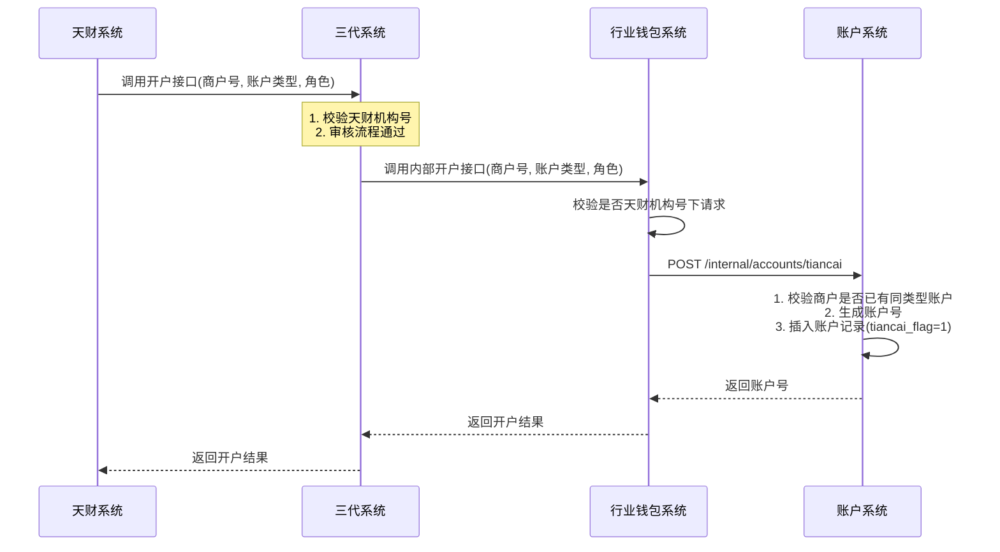
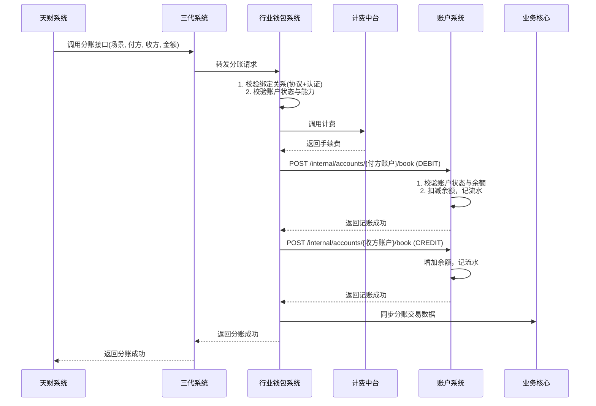
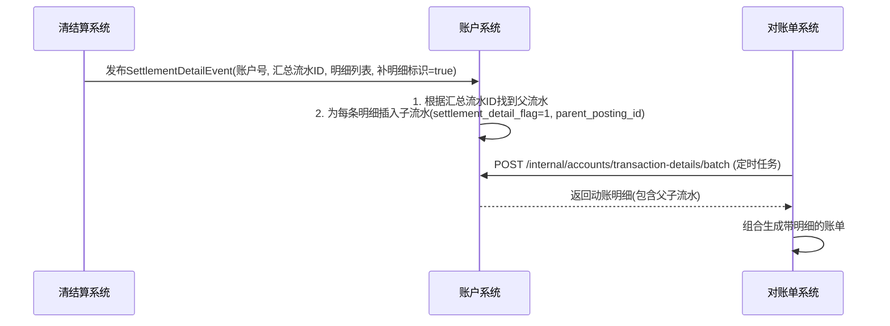

# 模块设计: 账户系统

生成时间: 2026-01-16 17:43:16

---

# 账户系统模块设计文档（天财分账专项）

## 1. 概述

### 1.1 目的
本模块（账户系统）作为拉卡拉支付底层核心系统之一，为“天财分账”业务提供底层账户支撑。核心目的是为天财业务场景创建和管理专用的账户类型（天财收款账户、天财接收方账户），并在账户底层进行特殊标记和能力控制，确保天财专用账户的资金流转符合业务规则，并与其他普通账户有效隔离。

### 1.2 范围
- **账户创建与升级**：支持为天财机构下的商户新开或升级“天财专用账户”。
- **账户标记与能力控制**：在账户底层对天财专用账户进行特殊标记，并控制其转账、结算等能力（例如，仅允许在天财专用账户间转账）。
- **账户信息存储**：存储账户基础信息、标记、角色（总部/门店）及关联关系。
- **资金记账**：接收并处理来自行业钱包系统的天财分账、打款验证等业务的资金记账请求。
- **账单数据提供**：为对账单系统提供底层账户动账明细数据。
- **账户冻结**：支持接收风控指令，对天财收款账户进行冻结/解冻。

## 2. 接口设计

### 2.1 API端点 (RESTful)

#### 2.1.1 内部接口（供行业钱包、清结算等系统调用）

**1. 创建天财专用账户**
- **端点**：`POST /internal/accounts/tiancai`
- **描述**：为指定商户创建天财收款账户或天财接收方账户。
- **调用方**：行业钱包系统
- **请求体**：
```json
{
  "requestId": "UUID",
  "merchantNo": "商户号",
  "accountType": "TIANCAI_COLLECT" | "TIANCAI_RECEIVER", // 天财收款账户 | 天财接收方账户
  "role": "HEADQUARTERS" | "STORE", // 总部 | 门店 (仅对收款账户有效)
  "baseAccountNo": "原普通收款账户号", // 升级场景下传入
  "operator": "系统标识"
}
```
- **响应体**：
```json
{
  "code": "SUCCESS",
  "message": "成功",
  "data": {
    "accountNo": "生成的天财专用账户号",
    "accountType": "TIANCAI_COLLECT",
    "status": "ACTIVE"
  }
}
```

**2. 账户升级（普通账户 -> 天财专用账户）**
- **端点**：`PUT /internal/accounts/{accountNo}/upgrade-to-tiancai`
- **描述**：将已存在的普通收款账户升级为天财收款账户。
- **调用方**：行业钱包系统
- **请求体**：
```json
{
  "requestId": "UUID",
  "targetAccountType": "TIANCAI_COLLECT",
  "role": "HEADQUARTERS" | "STORE",
  "operator": "系统标识"
}
```
- **响应体**：同创建接口。

**3. 账户记账**
- **端点**：`POST /internal/accounts/{accountNo}/book`
- **描述**：执行账户资金的借记或贷记操作。
- **调用方**：行业钱包系统（分账）、业务核心（打款验证）
- **请求体**：
```json
{
  "requestId": "UUID",
  "bizType": "TIANCAI_SPLIT" | "VERIFICATION_TRANSFER", // 天财分账 | 打款验证
  "bizNo": "业务流水号",
  "amount": 10000,
  "direction": "CREDIT" | "DEBIT",
  "currency": "CNY",
  "memo": "业务备注",
  "oppositeAccountNo": "对方账户号",
  "operator": "系统标识"
}
```
- **响应体**：
```json
{
  "code": "SUCCESS",
  "message": "成功",
  "data": {
    "accountNo": "账户号",
    "balance": "当前余额",
    "postingId": "记账流水ID"
  }
}
```

**4. 账户冻结/解冻**
- **端点**：`PUT /internal/accounts/{accountNo}/freeze-status`
- **描述**：更新账户的冻结状态。
- **调用方**：风控系统（通过清结算或直接调用）
- **请求体**：
```json
{
  "requestId": "UUID",
  "freezeType": "MERCHANT_FREEZE" | "TRANSACTION_FREEZE", // 商户冻结 | 交易冻结
  "freezeStatus": "FROZEN" | "UNFROZEN",
  "freezeReason": "冻结原因",
  "operator": "系统标识"
}
```

**5. 账户信息查询**
- **端点**：`GET /internal/accounts/{accountNo}`
- **描述**：查询账户详情，包含天财标记和角色。
- **调用方**：行业钱包、清结算、对账单系统
- **响应体**：
```json
{
  "code": "SUCCESS",
  "data": {
    "accountNo": "账户号",
    "merchantNo": "商户号",
    "accountType": "TIANCAI_COLLECT | TIANCAI_RECEIVER | GENERAL_COLLECT ...",
    "tiancaiFlag": true,
    "role": "HEADQUARTERS",
    "status": "ACTIVE",
    "freezeStatus": "UNFROZEN",
    "balance": 100000,
    "createdTime": "2023-01-01 10:00:00"
  }
}
```

**6. 动账明细查询（批量）**
- **端点**：`POST /internal/accounts/transaction-details/batch`
- **描述**：根据时间范围和账户列表，批量查询动账明细。供对账单系统拉取数据。
- **调用方**：对账单系统
- **请求体**：
```json
{
  "accountNos": ["账户1", "账户2"],
  "startTime": "2023-10-01 00:00:00",
  "endTime": "2023-10-02 00:00:00",
  "pageNo": 1,
  "pageSize": 1000
}
```
- **响应体**：
```json
{
  "code": "SUCCESS",
  "data": {
    "details": [
      {
        "postingId": "记账流水ID",
        "accountNo": "账户号",
        "bizType": "业务类型",
        "bizNo": "业务流水号",
        "amount": 100,
        "direction": "CREDIT",
        "balance": 1000,
        "currency": "CNY",
        "memo": "备注",
        "oppositeAccountNo": "对方账户",
        "createdTime": "2023-10-01 12:00:00"
      }
    ],
    "total": 1500
  }
}
```

### 2.2 发布/消费的事件

#### 2.2.1 消费的事件
- **AccountCreatedEvent**：由行业钱包发布。账户系统监听此事件，用于同步账户基础信息（非核心，主要依赖直接调用）。
- **SettlementDetailEvent**：由清结算系统发布。当有资金结算到天财收款账户时，账户系统根据事件中的“补明细账单”标识，生成更详细的子账单流水。

#### 2.2.2 发布的事件
- **AccountStatusChangedEvent**：当账户状态（如冻结状态）发生变化时发布。
  - **主题**：`account.status.changed`
  - **数据**：`{“accountNo”: “xxx”, “oldStatus”: “ACTIVE”, “newStatus”: “FROZEN”, “changeTime”: “...”, “reason”: “...”}`
- **BalanceChangedEvent**：当账户余额发生变动时发布（可选，用于监控或风控）。
  - **主题**：`account.balance.changed`
  - **数据**：`{“accountNo”: “xxx”, “changeAmount”: 100, “newBalance”: 1000, “bizNo”: “...”, “time”: “...”}`

## 3. 数据模型

### 3.1 核心表设计

**1. 账户主表 (account)**
存储所有账户的核心信息。
```sql
CREATE TABLE `account` (
  `id` bigint(20) NOT NULL AUTO_INCREMENT COMMENT '主键ID',
  `account_no` varchar(32) NOT NULL COMMENT '账户号，唯一',
  `merchant_no` varchar(32) NOT NULL COMMENT '所属商户号',
  `account_type` varchar(32) NOT NULL COMMENT '账户类型: GENERAL_COLLECT, TIANCAI_COLLECT, TIANCAI_RECEIVER, SETTLEMENT, REFUND ...',
  `tiancai_flag` tinyint(1) NOT NULL DEFAULT 0 COMMENT '是否天财专用账户标记: 0-否, 1-是',
  `role` varchar(32) DEFAULT NULL COMMENT '角色: HEADQUARTERS-总部, STORE-门店 (仅天财收款账户有效)',
  `currency` varchar(3) NOT NULL DEFAULT 'CNY' COMMENT '币种',
  `balance` decimal(20,2) NOT NULL DEFAULT '0.00' COMMENT '当前余额',
  `available_balance` decimal(20,2) NOT NULL DEFAULT '0.00' COMMENT '可用余额',
  `freeze_status` varchar(32) NOT NULL DEFAULT 'UNFROZEN' COMMENT '冻结状态: UNFROZEN, FROZEN',
  `freeze_reason` varchar(255) DEFAULT NULL COMMENT '冻结原因',
  `status` varchar(32) NOT NULL DEFAULT 'ACTIVE' COMMENT '账户状态: ACTIVE, INACTIVE, CLOSED',
  `version` int(11) NOT NULL DEFAULT 0 COMMENT '版本号，用于乐观锁',
  `created_time` datetime NOT NULL DEFAULT CURRENT_TIMESTAMP COMMENT '创建时间',
  `updated_time` datetime NOT NULL DEFAULT CURRENT_TIMESTAMP ON UPDATE CURRENT_TIMESTAMP COMMENT '更新时间',
  PRIMARY KEY (`id`),
  UNIQUE KEY `uk_account_no` (`account_no`),
  KEY `idx_merchant_no` (`merchant_no`),
  KEY `idx_tiancai_flag` (`tiancai_flag`),
  KEY `idx_account_type` (`account_type`)
) ENGINE=InnoDB COMMENT='账户主表';
```

**2. 账户流水表 (account_transaction)**
记录所有资金变动流水。
```sql
CREATE TABLE `account_transaction` (
  `id` bigint(20) NOT NULL AUTO_INCREMENT COMMENT '主键ID',
  `posting_id` varchar(64) NOT NULL COMMENT '记账流水ID，业务唯一',
  `account_no` varchar(32) NOT NULL COMMENT '账户号',
  `biz_type` varchar(32) NOT NULL COMMENT '业务类型: TIANCAI_SPLIT, VERIFICATION_TRANSFER, SETTLEMENT, WITHDRAW ...',
  `biz_no` varchar(64) NOT NULL COMMENT '业务流水号',
  `amount` decimal(20,2) NOT NULL COMMENT '变动金额，正数',
  `direction` varchar(10) NOT NULL COMMENT '方向: CREDIT-入账, DEBIT-出账',
  `balance` decimal(20,2) NOT NULL COMMENT '变动后余额',
  `currency` varchar(3) NOT NULL DEFAULT 'CNY' COMMENT '币种',
  `memo` varchar(512) DEFAULT NULL COMMENT '备注',
  `opposite_account_no` varchar(32) DEFAULT NULL COMMENT '对方账户号',
  `settlement_detail_flag` tinyint(1) NOT NULL DEFAULT 0 COMMENT '是否为结算明细流水: 0-否, 1-是',
  `parent_posting_id` varchar(64) DEFAULT NULL COMMENT '父记账流水ID (用于结算明细关联汇总流水)',
  `created_time` datetime NOT NULL DEFAULT CURRENT_TIMESTAMP COMMENT '创建时间',
  PRIMARY KEY (`id`),
  UNIQUE KEY `uk_posting_id` (`posting_id`),
  KEY `idx_account_no_time` (`account_no`, `created_time`),
  KEY `idx_biz_no_type` (`biz_no`, `biz_type`),
  KEY `idx_settlement_flag` (`settlement_detail_flag`)
) ENGINE=InnoDB COMMENT='账户流水表';
```

**3. 账户能力控制表 (account_capability)**
控制不同类型账户的能力。
```sql
CREATE TABLE `account_capability` (
  `id` bigint(20) NOT NULL AUTO_INCREMENT,
  `account_type` varchar(32) NOT NULL COMMENT '账户类型',
  `tiancai_flag` tinyint(1) NOT NULL DEFAULT 0 COMMENT '天财标记',
  `capability_code` varchar(64) NOT NULL COMMENT '能力编码: TRANSFER_OUT, TRANSFER_IN, WITHDRAW, ...',
  `is_allowed` tinyint(1) NOT NULL DEFAULT 1 COMMENT '是否允许: 0-否, 1-是',
  `allowed_target_types` varchar(512) DEFAULT NULL COMMENT '允许交易的目标账户类型列表 (JSON数组)',
  `description` varchar(255) DEFAULT NULL COMMENT '描述',
  PRIMARY KEY (`id`),
  UNIQUE KEY `uk_type_capability` (`account_type`, `tiancai_flag`, `capability_code`)
) ENGINE=InnoDB COMMENT='账户能力控制表';
```
*示例数据*：`(‘TIANCAI_COLLECT’, 1, ‘TRANSFER_OUT’, 1, ‘[“TIANCAI_COLLECT”, “TIANCAI_RECEIVER”]’)` 表示天财收款账户只允许向天财收款账户和天财接收方账户转账。

### 3.2 与其他模块的关系
- **行业钱包系统**：账户系统的直接上游调用方。负责业务逻辑校验后，调用账户系统进行账户创建、升级和记账。
- **清结算系统**：向账户系统推送结算明细事件；调用账户系统进行账户冻结。
- **对账单系统**：调用账户系统的批量查询接口，获取底层动账明细数据。
- **业务核心**：调用账户系统进行打款验证等业务的记账。
- **风控系统**：通过清结算或直接调用账户系统，触发账户冻结。

## 4. 业务逻辑

### 4.1 核心算法
1. **账户号生成算法**：采用“前缀 + 序列号”的方式生成唯一账户号。
   - 天财收款账户：`TC_C_{机构简码}{日期}{8位序列}`
   - 天财接收方账户：`TC_R_{机构简码}{日期}{8位序列}`
2. **余额更新**：采用乐观锁 (`version`字段) 保证在高并发记账场景下的余额一致性。
3. **动账明细插入**：记账操作必须在同一事务中完成余额更新和流水插入，保证数据一致性。

### 4.2 业务规则
1. **账户创建规则**：
   - 一个收单商户只能拥有一个天财收款账户。
   - 天财收款账户需标记角色（总部/门店）。
   - 天财接收方账户支持绑定多张银行卡（此信息存储在行业钱包或三代，账户系统不直接存储）。
2. **账户升级规则**：
   - 仅支持普通收款账户 (`GENERAL_COLLECT`) 升级为天财收款账户 (`TIANCAI_COLLECT`)。
   - 升级后，原账户号不变，但 `account_type` 和 `tiancai_flag` 被更新。
3. **转账能力规则**：
   - 天财专用账户 (`tiancai_flag=1`) 只能向其他天财专用账户转账。此规则通过 `account_capability` 表配置，在行业钱包发起转账前校验，账户系统记账时做最终防线校验。
4. **记账规则**：
   - “天财分账”业务使用特定的分录码。
   - 结算到天财收款账户时，若清结算推送的 `SettlementDetailEvent` 带有“补明细账单”标识，则需为每一笔结算明细生成一条 `settlement_detail_flag=1` 的子流水，并关联到汇总流水 (`parent_posting_id`)。
5. **冻结规则**：
   - “商户冻结”时，冻结该商户对应的天财收款账户。
   - “交易冻结”时，冻结指定天财收款账户中的特定资金（需行业钱包或清结算配合记录冻结金额，账户系统层面将账户状态置为冻结）。

### 4.3 验证逻辑
1. **创建/升级账户时**：
   - 校验调用方是否来自天财机构（此校验主要在行业钱包和三代完成，账户系统信任上游校验）。
   - 校验目标商户是否已存在同类型天财账户（防重复开户）。
   - 升级时，校验原账户是否存在且为普通收款账户。
2. **记账时**：
   - 校验账户状态是否为 `ACTIVE` 且 `freeze_status` 为 `UNFROZEN`。
   - 校验余额是否充足（借记时）。
   - 对于转账交易，校验转出账户和转入账户的 `tiancai_flag` 是否符合能力规则（作为最终防线）。
3. **查询时**：
   - 校验调用方是否有权限查询目标账户信息（通过内部服务间Token或IP白名单机制）。

## 5. 时序图

### 5.1 天财专用账户开户时序图



### 5.2 天财分账记账时序图



### 5.3 结算明细生成时序图



## 6. 错误处理

| 错误场景 | 错误码 | 处理策略 |
| :--- | :--- | :--- |
| 账户不存在 | `ACCOUNT_NOT_FOUND` | 返回明确错误，由调用方处理（如检查商户号是否正确）。 |
| 账户状态异常（非ACTIVE或已冻结） | `ACCOUNT_STATUS_INVALID` | 拒绝操作，返回错误。需调用方引导商户处理账户状态。 |
| 余额不足 | `INSUFFICIENT_BALANCE` | 拒绝借记操作。 |
| 账户类型不允许此操作 | `OPERATION_NOT_ALLOWED` | 根据`account_capability`表配置返回。例如天财账户向普通账户转账。 |
| 重复业务流水号 | `DUPLICATE_BIZ_NO` | 幂等处理：查询已存在的流水，若业务类型和金额一致则返回成功；否则返回错误。 |
| 数据库异常（死锁、超时） | `DB_ERROR` | 记录详细日志，向上抛出系统异常，由框架进行重试或降级处理。 |
| 网络超时 | `NETWORK_TIMEOUT` | 接口设计为幂等，调用方应具备重试机制。账户系统需做好防重校验。 |

**通用策略**：
- **内部接口**：使用唯一请求ID (`requestId`) 实现幂等性。
- **异常分类**：区分业务异常（返回给调用方）和系统异常（内部告警、重试）。
- **事务管理**：核心记账操作必须在数据库事务内完成，确保流水和余额一致。
- **监控告警**：对错误码 `DB_ERROR`, `NETWORK_TIMEOUT` 等系统级错误进行监控和告警。

## 7. 依赖说明

### 7.1 上游依赖
1. **行业钱包系统**：
   - **交互方式**：同步RPC调用（HTTP）。
   - **职责**：账户系统接收其开户、升级、记账指令。账户系统信任行业钱包已完成业务逻辑校验（如天财机构校验、关系绑定校验）。
   - **关键点**：行业钱包需传递清晰的业务类型 (`bizType`) 和唯一业务流水号 (`bizNo`)。

2. **清结算系统**：
   - **交互方式**：异步事件（消息队列） + 同步调用（冻结）。
   - **职责**：接收其发布的结算明细事件，以生成子账单流水；接收其发起的账户冻结/解冻指令。
   - **关键点**：事件格式需明确包含“补明细账单”标识和明细数据。

3. **对账单系统**：
   - **交互方式**：同步RPC调用（HTTP）。
   - **职责**：提供批量动账明细查询接口。需支持大数据量分页查询，性能要求高。
   - **关键点**：需明确数据推送时间点（如D日9点前提供D-1日数据）和查询频率。

### 7.2 下游依赖
1. **数据库（MySQL）**：
   - 存储账户和流水数据。要求高可用、高性能。流水表需考虑按月分表。
2. **消息中间件（如Kafka/RocketMQ）**：
   - 用于发布账户状态、余额变更等事件。

### 7.3 设计要点
- **松耦合**：通过明确接口和事件与上下游交互，避免直接数据库耦合。
- **幂等性**：所有写接口必须支持幂等，防止重试导致重复操作。
- **性能**：动账明细查询接口是性能关键点，需依赖`(account_no, created_time)`复合索引，并考虑历史数据归档。
- **可追溯**：所有资金变动必须记录不可变的流水，并关联业务流水号，满足审计和对账要求。