# DocuFlow-AI Project - 软件设计文档
生成时间: 2026-01-19 14:56:57

## 目录
1. [概述说明](#1-概述说明)
   - 1.1 [术语与缩略词](#11-术语与缩略词)
2. [系统设计](#2-系统设计)
3. [模块设计](#3-模块设计)
   - 3.1 [账户系统](#31-账户系统)
   - 3.2 [电子签约平台](#32-电子签约平台)
   - 3.3 [认证系统](#33-认证系统)
   - 3.4 [三代系统](#34-三代系统)
   - 3.5 [账务核心系统](#35-账务核心系统)
   - 3.6 [行业钱包系统](#36-行业钱包系统)
   - 3.7 [清结算系统](#37-清结算系统)
   - 3.8 [计费中台](#38-计费中台)
   - 3.9 [钱包APP/商服平台](#39-钱包APP/商服平台)
   - 3.10 [业务核心](#310-业务核心)
   - 3.11 [对账单系统](#311-对账单系统)
4. [接口设计](#4-接口设计)
5. [数据库设计](#5-数据库设计)

---
# 1 概述说明

## 1.1 术语与缩略词


## 角色

- **天财** (别名: 天财商龙): 本需求文档中的核心业务合作方或系统名称，指代“天财商龙”。它是一个提供门店管理、会员结算等服务的系统，本需求旨在为其开放专用的账户和分账接口。
- **总部** (别名: 总店, 发起方): 在天财分账业务中扮演资金归集方或分账发起方的角色。通常是一个企业性质的商户，负责管理下属门店，发起归集、批量付款、会员结算等操作。
- **门店** (别名: 被归集方): 在天财分账业务中，通常作为被归集方（付方）或会员结算的收方。是总部下属的经营单元。

## 业务实体

- **收单商户** (别名: 商户): 通过支付系统进行收款业务的商户实体。在本需求中，特指与天财系统关联，需要进行分账处理的商户。
- **天财收款账户** (别名: 专用收款账户, 天财专用账户): 为天财业务场景下的收单商户开立的专用账户，类型为“行业钱包（非小微钱包）”。用于接收交易结算资金，并作为分账的转出方或接收方。
- **天财接收方账户** (别名: 接收方账户, 专用接收方账户): 为天财业务场景下的资金接收方（如供应商、股东、门店作为收款方时）开立的专用账户。用于接收从天财收款账户分账而来的资金。
- **01待结算账户** (别名: 待结算账户): 用于临时存放收单交易待结算资金的内部账户。在退货、对账单等流程中会涉及对此账户的操作和查询。
- **04退货账户** (别名: 退货账户): 用于处理退货资金的内部账户。在天财业务中，支持与天财收款账户联动进行退货扣款。

## 技术术语

- **三代系统**: 文档中提到的核心支付或商户管理系统，负责商户进件、账户管理、交易处理等。它是连接天财、行业钱包、账户系统等各模块的枢纽。
- **行业钱包系统** (别名: 钱包系统): 负责处理钱包类账户业务（如天财专用账户）的系统。承担开户流转、关系绑定校验、分账请求处理、数据同步等核心业务逻辑。
- **账户系统**: 底层账户管理系统，负责实际账户的创建、升级、标记以及资金记账等底层操作。对天财专用账户有特殊的底层控制和标记。
- **清结算系统** (别名: 清结算): 负责交易资金的清算、结算、计费以及退货资金处理的系统。
- **打款验证**: 一种身份认证方式。认证系统向待验证方的绑定银行卡打入随机金额，验证方回填正确金额即通过验证。主要用于对公企业或个体的认证。
- **人脸验证**: 一种身份认证方式。通过比对姓名、身份证号和人脸信息是否一致来完成验证。主要用于个人或个体户的认证。
- **电子签约平台** (别名: 电子签章系统): 提供电子协议签署、短信模板管理、H5页面封装、并集成打款/人脸认证服务的系统。负责留存协议和认证的全证据链。
- **主动结算**: 一种结算模式，指收单交易资金直接结算到商户指定的收款账户（如天财收款账户）。与“被动结算”相对。
- **被动结算**: 一种结算模式，指收单交易资金先停留在待结算账户，需要商户手动发起提款。文档中提及老商户可能从被动结算切换为主动结算至天财专用账户。
- **计费中台**: 独立的计费服务系统，负责计算分账交易产生的手续费。费率等信息在三代配置，由清结算同步至计费中台。
- **对账单系统**: 生成并提供各类账户和交易维度对账单的系统。为本需求专门提供“天财分账”指令账单及机构层级的动账明细。
- **业务核心**: 支付系统的核心交易处理模块。在本需求中接收行业钱包同步的“天财分账”交易数据，并为对账单系统提供数据源。

## 流程

- **归集** (别名: 资金归集): 一种资金流转流程，指门店（付方）将交易结算资金按约定比例或金额上交给总部（收方）。
- **批量付款** (别名: 批付): 一种资金流转流程，指总部（付方）向其供应商、股东等接收方（天财接收方账户）进行批量分账付款。
- **会员结算**: 一种资金流转流程，特指总部（付方）向门店（收方）就会员消费相关的资金进行分账结算。
- **关系绑定** (别名: 签约与认证, 绑定): 在分账前，建立并验证资金付方与收方之间授权关系的关键流程。包括协议签署和身份认证（打款验证或人脸验证），是分账交易的前提。
- **开通付款**: 在批量付款和会员结算场景下，付方（总部）需要额外进行的一个授权流程。付方需与拉卡拉签署代付授权协议，完成后才能生效其名下的关系绑定。
- **分账** (别名: 转账): 核心的资金划转流程。指从天财收款账户向另一个天财收款账户或天财接收方账户进行资金划拨。文档中“转账”特指此分账操作。

---
# 2 系统设计
# 天财商龙分账业务系统设计文档

## 2.1 系统结构

本系统采用分层、模块化的微服务架构，旨在为“天财商龙”业务提供合规、高效、可追溯的分账解决方案。整体架构遵循业务边界清晰、职责单一的原则，通过服务间API调用和异步消息机制进行协作。

```mermaid
graph TB
    subgraph “外部系统/渠道”
        TC[天财商龙商户端]
        H5[H5签约页面]
        ExtAuth[外部认证服务]
        MQ[消息队列]
        SMS[短信平台]
        Storage[文件存储]
    end

    subgraph “业务接入与流程编排层”
        TDS[三代系统]
    end

    subgraph “核心业务处理层”
        WBS[行业钱包系统]
        ACS[账务核心系统]
        AuthS[认证系统]
        ESP[电子签约平台]
    end

    subgraph “基础服务与支撑层”
        AS[账户系统]
        CSS[清结算系统]
        FCS[计费中台]
        BCS[业务核心]
    end

    subgraph “数据聚合与呈现层”
        SS[对账单系统]
    end

    TC --> TDS
    H5 --> ESP
    TDS --> WBS
    TDS --> AuthS
    TDS --> ESP
    WBS --> ACS
    AuthS --> ESP
    WBS --> AS
    WBS --> CSS
    WBS --> BCS
    WBS --> MQ
    ACS --> AS
    ACS --> CSS
    ACS --> FCS
    CSS --> AS
    CSS --> FCS
    FCS --> AS
    BCS --> AS
    ESP --> ExtAuth
    ESP --> SMS
    ESP --> Storage
    SS --> BCS
    SS --> AS
    SS --> CSS
```

**架构说明**：
1.  **业务接入与流程编排层（三代系统）**：作为面向“天财商龙”商户的统一业务入口，负责商户进件、业务关系绑定、分账指令（归集、付款、结算）的发起与全流程状态管理。
2.  **核心业务处理层**：
    *   **行业钱包系统**：资金处理与业务逻辑中枢，负责校验分账关系、执行分账指令、驱动底层资金划转。
    *   **账务核心系统**：分账业务的核心处理引擎，处理复杂的业务逻辑（如批量分账、冲正）并调用底层服务完成资金处理。
    *   **认证系统**：负责建立并管理付方（总部）与收方（门店/会员）之间合法、可信的授权关系，是分账业务的法律与风控基础。
    *   **电子签约平台**：提供电子协议签署、身份认证及证据链留存服务，为授权关系提供法律保障。
3.  **基础服务与支撑层**：
    *   **账户系统**：系统的资金基石，提供底层账户的全生命周期管理、状态控制及原子化的资金记账服务。
    *   **清结算系统**：资金处理中枢，负责交易资金的清算、结算、计费及退货处理。
    *   **计费中台**：专门负责分账交易手续费的精确计算与策略管理。
    *   **业务核心**：支付系统的核心交易流水记录中心，接收并持久化所有标准化的分账交易数据，为对账、查询提供统一视图。
4.  **数据聚合与呈现层（对账单系统）**：聚合各业务模块数据，生成统一、清晰的对账单和资金流水明细，服务于运营与财务。
5.  **外部依赖**：包括外部认证、短信、文件存储等服务，以及作为异步通信枢纽的消息队列。

## 2.2 功能结构

系统功能围绕分账业务的全生命周期进行组织，涵盖从商户入驻、关系建立、资金操作到对账清算的完整闭环。

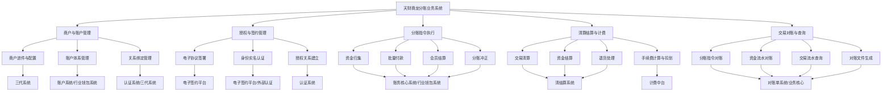
```mermaid
graph TD
    A[天财商龙分账业务系统] --> B1[商户与账户管理]
    A --> B2[授权与签约管理]
    A --> B3[分账指令执行]
    A --> B4[清算结算与计费]
    A --> B5[交易对账与查询]

    B1 --> C1_1[商户进件与配置]
    B1 --> C1_2[账户体系管理]
    B1 --> C1_3[关系绑定管理]

    B2 --> C2_1[电子协议签署]
    B2 --> C2_2[身份实名认证]
    B2 --> C2_3[授权关系建立]

    B3 --> C3_1[资金归集]
    B3 --> C3_2[批量付款]
    B3 --> C3_3[会员结算]
    B3 --> C3_4[分账冲正]

    B4 --> C4_1[交易清算]
    B4 --> C4_2[资金结算]
    B4 --> C4_3[手续费计算与扣划]
    B4 --> C4_4[退货处理]

    B5 --> C5_1[分账指令对账]
    B5 --> C5_2[资金流水对账]
    B5 --> C5_3[交易流水查询]
    B5 --> C5_4[对账文件生成]

    C1_1 --> D1[三代系统]
    C1_2 --> D2[账户系统/行业钱包系统]
    C1_3 --> D3[认证系统/三代系统]

    C2_1 --> D4[电子签约平台]
    C2_2 --> D5[电子签约平台/外部认证]
    C2_3 --> D6[认证系统]

    C3_1 & C3_2 & C3_3 & C3_4 --> D7[账务核心系统/行业钱包系统]

    C4_1 & C4_2 & C4_4 --> D8[清结算系统]
    C4_3 --> D9[计费中台]

    C5_1 & C5_2 & C5_3 & C5_4 --> D10[对账单系统/业务核心]
```

**功能模块说明**：
*   **商户与账户管理**：完成商户入驻、配置其结算模式，并为其开立底层资金账户和业务层钱包账户，管理付方与收方的绑定关系。
*   **授权与签约管理**：通过电子签约、身份认证（打款/人脸/短信）等合规手段，建立具有法律效力的分账授权关系。
*   **分账指令执行**：支持资金从收方归集至付方、从付方向多收方批量付款、以及针对会员的结算等多种分账场景，并提供冲正能力。
*   **清算结算与计费**：对分账交易进行资金清算，按配置完成资金结算到商户账户，并准确计算、扣划交易产生的手续费，处理退货场景。
*   **交易对账与查询**：聚合各模块数据，提供多维度的业务对账（指令流）、资金对账（资金流）能力，并生成标准对账文件。

## 2.3 网络拓扑图

系统部署在私有云或金融云环境内，采用分区隔离策略，确保业务安全与合规。

```mermaid
graph TB
    subgraph “互联网区 (DMZ)”
        LB[负载均衡集群]
        H5_GW[H5签约网关]
        API_GW[API网关集群]
    end

    subgraph “核心业务区”
        subgraph “应用集群”
            APP_TDS[三代系统]
            APP_WBS[行业钱包系统]
            APP_ACS[账务核心系统]
            APP_AuthS[认证系统]
            APP_ESP[电子签约平台]
            APP_SS[对账单系统]
        end
        subgraph “数据存储集群”
            DB[(主数据库集群)]
            Redis_Cache[Redis缓存集群]
            MQ_Cluster[消息队列集群]
        end
        subgraph “基础服务集群”
            APP_AS[账户系统]
            APP_CSS[清结算系统]
            APP_FCS[计费中台]
            APP_BCS[业务核心]
        end
    end

    subgraph “外部服务区”
        Ext_SMS[短信服务]
        Ext_Auth[外部认证服务]
        Ext_Storage[文件存储服务]
    end

    Internet --> LB
    LB --> H5_GW
    LB --> API_GW
    H5_GW --> APP_ESP
    API_GW --> APP_TDS
    API_GW --> APP_SS
    
    APP_TDS --> APP_WBS
    APP_TDS --> APP_AuthS
    APP_TDS --> APP_ESP
    APP_WBS --> APP_ACS
    APP_WBS --> APP_AS
    APP_WBS --> APP_CSS
    APP_WBS --> APP_BCS
    APP_WBS --> MQ_Cluster
    APP_ACS --> APP_AS
    APP_ACS --> APP_CSS
    APP_ACS --> APP_FCS
    APP_AuthS --> APP_ESP
    APP_CSS --> APP_AS
    APP_CSS --> APP_FCS
    APP_FCS --> APP_AS
    APP_BCS --> APP_AS
    APP_SS --> APP_BCS
    APP_SS --> APP_AS
    APP_SS --> APP_CSS

    APP_ESP --> Ext_SMS
    APP_ESP --> Ext_Auth
    APP_ESP --> Ext_Storage

    APP_AS & APP_CSS & APP_FCS & APP_BCS & APP_WBS & APP_ACS & APP_AuthS & APP_ESP & APP_TDS & APP_SS --> DB
    APP_AS & APP_CSS & APP_FCS & APP_BCS & APP_WBS & APP_ACS & APP_AuthS & APP_ESP & APP_TDS & APP_SS --> Redis_Cache
```

**部署说明**：
1.  **互联网区**：部署负载均衡、API网关和H5网关，作为系统对外统一入口，负责路由、限流、鉴权等。
2.  **核心业务区**：
    *   **应用集群**：所有业务微服务以集群方式部署，实现高可用和水平扩展。
    *   **数据存储集群**：核心业务数据使用高可用数据库集群；高频访问数据（如关系缓存）使用Redis集群；模块间异步解耦通过消息队列实现。
    *   **基础服务集群**：账户、清结算等底层服务独立部署，为上层业务提供稳定支撑。
3.  **外部服务区**：通过专线或安全网关与第三方服务（短信、认证、存储）通信，满足业务需求。
4.  **安全隔离**：各区域间通过防火墙进行严格隔离，仅开放必要的服务端口，确保网络安全。

## 2.4 数据流转

数据流转贯穿分账业务的全过程，主要分为业务指令流和资金流两条主线。

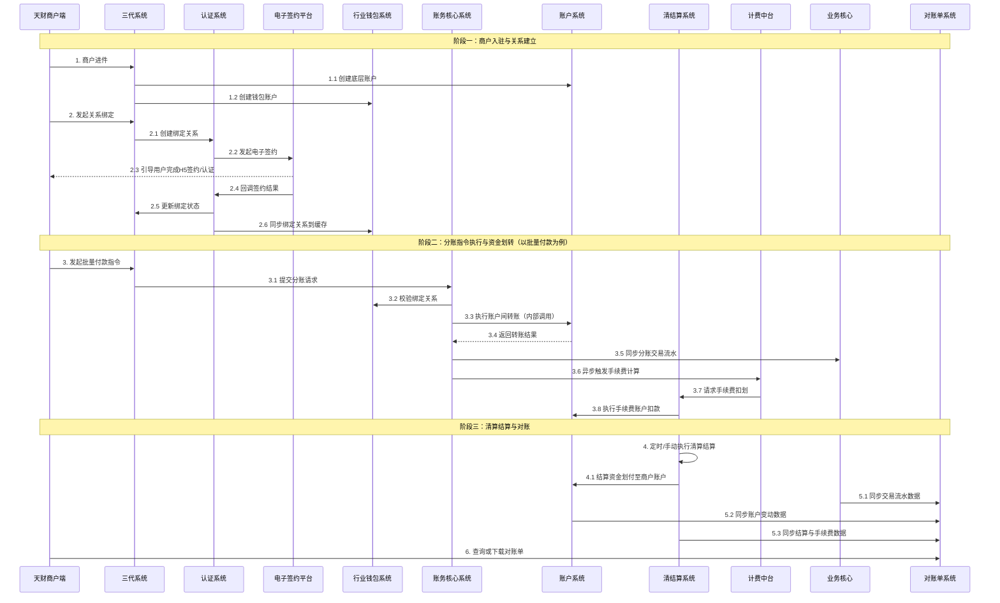
```mermaid
sequenceDiagram
    participant T as 天财商户端
    participant TDS as 三代系统
    participant AuthS as 认证系统
    participant ESP as 电子签约平台
    participant WBS as 行业钱包系统
    participant ACS as 账务核心系统
    participant AS as 账户系统
    participant CSS as 清结算系统
    participant FCS as 计费中台
    participant BCS as 业务核心
    participant SS as 对账单系统

    Note over T, SS: 阶段一：商户入驻与关系建立
    T->>TDS: 1. 商户进件
    TDS->>AS: 1.1 创建底层账户
    TDS->>WBS: 1.2 创建钱包账户
    T->>TDS: 2. 发起关系绑定
    TDS->>AuthS: 2.1 创建绑定关系
    AuthS->>ESP: 2.2 发起电子签约
    ESP-->>T: 2.3 引导用户完成H5签约/认证
    ESP->>AuthS: 2.4 回调签约结果
    AuthS->>TDS: 2.5 更新绑定状态
    AuthS->>WBS: 2.6 同步绑定关系到缓存

    Note over T, SS: 阶段二：分账指令执行与资金划转（以批量付款为例）
    T->>TDS: 3. 发起批量付款指令
    TDS->>ACS: 3.1 提交分账请求
    ACS->>WBS: 3.2 校验绑定关系
    ACS->>AS: 3.3 执行账户间转账（内部调用）
    AS-->>ACS: 3.4 返回转账结果
    ACS->>BCS: 3.5 同步分账交易流水
    ACS->>FCS: 3.6 异步触发手续费计算
    FCS->>CSS: 3.7 请求手续费扣划
    CSS->>AS: 3.8 执行手续费账户扣款

    Note over T, SS: 阶段三：清算结算与对账
    CSS->>CSS: 4. 定时/手动执行清算结算
    CSS->>AS: 4.1 结算资金划付至商户账户
    BCS->>SS: 5.1 同步交易流水数据
    AS->>SS: 5.2 同步账户变动数据
    CSS->>SS: 5.3 同步结算与手续费数据
    T->>SS: 6. 查询或下载对账单
```

**数据流关键路径说明**：
1.  **业务指令流**：`商户端 -> 三代系统 -> (认证系统/电子签约平台) -> 账务核心系统 -> 行业钱包系统 -> 业务核心`。此路径承载业务请求的发起、校验、处理与最终状态落地。
2.  **资金流**：`账务核心系统/清结算系统 -> 账户系统`。所有资金变动（分账转账、手续费扣划、结算出款）最终都通过调用账户系统的原子化接口完成，确保资金账务的一致性。
3.  **数据聚合流**：`业务核心 + 账户系统 + 清结算系统 -> 对账单系统`。各核心模块将标准化后的业务、资金、结算数据提供给对账单系统，生成统一视图。

## 2.5 系统模块交互关系

各模块通过同步API调用和异步消息机制紧密协作，共同完成分账业务。下图概括了核心的调用依赖关系。

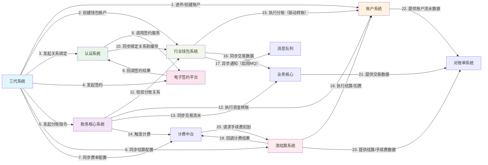
```mermaid
graph LR
    TDS[三代系统] -->|1. 进件/创建账户| AS[账户系统]
    TDS -->|2. 创建钱包账户| WBS[行业钱包系统]
    TDS -->|3. 发起关系绑定| AuthS[认证系统]
    TDS -->|4. 发起签约| ESP[电子签约平台]
    TDS -->|5. 发起分账指令| ACS[账务核心系统]
    TDS -->|6. 同步结算配置| CSS[清结算系统]
    TDS -->|7. 同步费率配置| FCS[计费中台]

    AuthS -->|8. 调用签约服务| ESP
    ESP -->|9. 回调签约结果| AuthS
    AuthS -->|10. 同步绑定关系到缓存| WBS

    ACS -->|11. 校验分账关系| WBS
    ACS -->|12. 执行资金转账| AS
    ACS -->|13. 同步交易流水| BCS[业务核心]
    ACS -->|14. 触发计费| FCS

    WBS -->|15. 执行分账（驱动转账）| AS
    WBS -->|16. 同步交易数据| BCS
    WBS -->|17. 异步通知（如用MQ）| MQ[消息队列]

    CSS -->|18. 执行结算/扣费| AS
    CSS -->|19. 回调计费结果| FCS
    FCS -->|20. 请求手续费扣划| CSS

    BCS -->|21. 提供交易数据| SS[对账单系统]
    AS -->|22. 提供账户流水数据| SS
    CSS -->|23. 提供结算/手续费数据| SS

    style TDS fill:#e1f5fe
    style ACS fill:#f3e5f5
    style WBS fill:#f1f8e9
    style AS fill:#fff3e0
    style CSS fill:#ffebee
    style AuthS fill:#e8f5e8
    style ESP fill:#fce4ec
```

**核心交互关系说明**：
1.  **三代系统作为总入口**：几乎与所有其他核心业务模块交互，负责启动业务流程。
2.  **账户系统作为资金底座**：被**行业钱包系统**、**账务核心系统**、**清结算系统**、**计费中台**直接调用，是所有资金变动的最终执行者。
3.  **行业钱包系统与账务核心系统的协作**：两者都处理分账，但侧重点不同。**账务核心**侧重复杂业务逻辑处理（批量、冲正），而**行业钱包**侧重关系校验和驱动底层账户操作。两者都可能调用账户系统。
4.  **认证与签约的闭环**：**认证系统**依赖**电子签约平台**完成法律授权过程，签约结果回调至认证系统，形成闭环。
5.  **清结算与计费的协作**：**计费中台**负责计算手续费，但实际资金扣划请求发往**清结算系统**，由后者调用账户系统执行，体现了职责分离。
6.  **数据汇聚到对账与业务核心**：**业务核心**接收来自**行业钱包系统**的交易流水，成为权威数据源。**对账单系统**则从**业务核心**、**账户系统**、**清结算系统**拉取数据，完成对账聚合。
---
# 3 模块设计

## 3.1 账户系统


# 账户系统模块设计文档

## 1. 概述

### 1.1 目的
本模块是支付平台的底层账户核心，负责为“天财商龙”业务场景下的各类专用账户提供全生命周期的管理、状态控制及资金记账服务。它向上层（如行业钱包系统、清结算系统）提供稳定、原子化的账户操作接口，是支撑“归集”、“批量付款”、“会员结算”等分账业务流程的基石。

### 1.2 范围
- **账户创建与维护**：为“天财收款账户”和“天财接收方账户”提供开户、状态变更（冻结/解冻/注销）、属性标记（如标记为天财专用账户）等功能。
- **资金记账**：处理与天财账户相关的所有资金变动，包括交易结算入账、分账出账/入账、退货扣款等，确保账务准确。
- **账户查询**：提供账户余额、状态、流水等信息的查询服务。
- **内部账户联动**：与“01待结算账户”、“04退货账户”等内部账户进行资金划转和联动记账。
- **数据同步**：响应上层系统的状态变更请求，并发布账户变动事件，供其他系统（如三代系统、对账单系统）订阅。

### 1.3 非范围
- 分账业务逻辑（由行业钱包系统处理）。
- 商户进件、协议签署与身份认证（由三代系统、电子签约平台处理）。
- 费率计算（由计费中台处理）。
- 交易处理（由业务核心处理）。

## 2. 接口设计

### 2.1 REST API 端点

#### 2.1.1 账户管理接口
- **POST /api/v1/accounts**：创建账户
    - **请求体**：`CreateAccountRequest`
    - **响应**：`AccountDetailResponse`
- **PUT /api/v1/accounts/{accountNo}/status**：更新账户状态
    - **请求体**：`UpdateAccountStatusRequest`
    - **响应**：`BaseResponse`
- **GET /api/v1/accounts/{accountNo}**：查询账户详情
    - **响应**：`AccountDetailResponse`
- **POST /api/v1/accounts/batch-query**：批量查询账户信息
    - **请求体**：`BatchQueryAccountRequest`
    - **响应**：`List<AccountSimpleResponse>`

#### 2.1.2 资金操作接口
- **POST /api/v1/accounts/transfer**：账户间转账（内部调用，用于分账等场景）
    - **请求体**：`InternalTransferRequest`
    - **响应**：`TransferResponse`
- **POST /api/v1/accounts/adjust**：账户调账（内部调用，用于差错处理）
    - **请求体**：`AdjustAccountRequest`
    - **响应**：`BaseResponse`
- **GET /api/v1/accounts/{accountNo}/balance**：查询账户余额
    - **响应**：`AccountBalanceResponse`
- **GET /api/v1/accounts/{accountNo}/transactions**：查询账户流水
    - **查询参数**：`startTime`, `endTime`, `page`, `size`
    - **响应**：`PagedResponse<TransactionRecordResponse>`

### 2.2 数据结构

```json
// CreateAccountRequest
{
  "requestId": "REQ202310270001", // 请求流水号，幂等键
  "merchantNo": "M100001", // 所属收单商户号
  "accountType": "TIANCAI_COLLECT", // 账户类型：TIANCAI_COLLECT(天财收款账户), TIANCAI_RECEIVE(天财接收方账户)
  "accountName": "北京总店专用账户",
  "currency": "CNY",
  "attributes": { // 扩展属性
    "isTiancaiSpecial": true, // 标记为天财专用账户
    "parentMerchantNo": "M100000", // 所属总部商户号（门店账户时填写）
    "walletSystemAccountId": "WALLET_ACC_001" // 对应的行业钱包账户ID，用于关联
  }
}

// AccountDetailResponse
{
  "accountNo": "ACC202310270001",
  "merchantNo": "M100001",
  "accountType": "TIANCAI_COLLECT",
  "accountName": "北京总店专用账户",
  "balance": "10000.00",
  "availableBalance": "9800.00",
  "frozenBalance": "200.00",
  "status": "ACTIVE", // ACTIVE, FROZEN, CLOSED
  "currency": "CNY",
  "attributes": { ... },
  "createTime": "2023-10-27T10:00:00Z",
  "updateTime": "2023-10-27T10:00:00Z"
}

// InternalTransferRequest
{
  "requestId": "TRANS202310270001", // 请求流水号，幂等键
  "fromAccountNo": "ACC202310270001",
  "toAccountNo": "ACC202310270002",
  "amount": "500.00",
  "currency": "CNY",
  "bizType": "TIANCAI_SPLIT", // 业务类型：TIANCAI_SPLIT(天财分账), COLLECTION(归集), MEMBER_SETTLE(会员结算)
  "bizOrderNo": "SPLIT202310270001", // 关联的业务订单号
  "memo": "会员结算分账"
}
```

### 2.3 发布的事件
账户系统作为事件生产者，通过消息中间件发布以下领域事件：

- **AccountCreatedEvent**：账户创建成功。
    ```json
    {
      "eventId": "EVT_ACC_CREATED_001",
      "eventType": "ACCOUNT_CREATED",
      "timestamp": "2023-10-27T10:00:00Z",
      "data": {
        "accountNo": "ACC202310270001",
        "merchantNo": "M100001",
        "accountType": "TIANCAI_COLLECT",
        "walletSystemAccountId": "WALLET_ACC_001"
      }
    }
    ```
- **AccountStatusChangedEvent**：账户状态变更（冻结/解冻/注销）。
- **AccountBalanceChangedEvent**：账户余额发生变动（含变动金额、变动后余额、业务类型）。
- **InternalTransferCompletedEvent**：内部转账完成（供对账单系统等订阅）。

## 3. 数据模型

### 3.1 核心表设计

#### 表：`account` (账户主表)
| 字段名 | 类型 | 必填 | 描述 | 索引 |
|--------|------|------|------|------|
| id | bigint(20) | Y | 自增主键 | PK |
| account_no | varchar(32) | Y | 账户号，全局唯一 | UK |
| merchant_no | varchar(32) | Y | 所属商户号 | IDX |
| account_type | varchar(32) | Y | 账户类型 | IDX |
| account_name | varchar(128) | Y | 账户名称 | |
| balance | decimal(15,2) | Y | 账户余额 | |
| available_balance | decimal(15,2) | Y | 可用余额 | |
| frozen_balance | decimal(15,2) | Y | 冻结余额 | |
| currency | char(3) | Y | 币种 | |
| status | varchar(16) | Y | 状态 | IDX |
| attributes | json | N | 扩展属性（JSON格式） | |
| version | int(11) | Y | 版本号，用于乐观锁 | |
| create_time | datetime | Y | 创建时间 | IDX |
| update_time | datetime | Y | 更新时间 | |

#### 表：`account_transaction` (账户流水表)
| 字段名 | 类型 | 必填 | 描述 | 索引 |
|--------|------|------|------|------|
| id | bigint(20) | Y | 自增主键 | PK |
| transaction_no | varchar(32) | Y | 流水号，全局唯一 | UK |
| account_no | varchar(32) | Y | 账户号 | IDX |
| opposite_account_no | varchar(32) | N | 对手方账户号 | IDX |
| amount | decimal(15,2) | Y | 变动金额（正为入账，负为出账） | |
| balance_before | decimal(15,2) | Y | 变动前余额 | |
| balance_after | decimal(15,2) | Y | 变动后余额 | |
| currency | char(3) | Y | 币种 | |
| biz_type | varchar(32) | Y | 业务类型 | IDX |
| biz_order_no | varchar(32) | Y | 关联业务订单号 | IDX |
| request_id | varchar(32) | Y | 请求流水号，幂等键 | UK |
| memo | varchar(256) | N | 备注 | |
| create_time | datetime | Y | 创建时间 | IDX |

#### 表：`internal_account` (内部账户表)
| 字段名 | 类型 | 必填 | 描述 | 索引 |
|--------|------|------|------|------|
| id | bigint(20) | Y | 自增主键 | PK |
| account_no | varchar(32) | Y | 内部账户号 | UK |
| account_name | varchar(128) | Y | 账户名称（如“01待结算账户”、“04退货账户”） | |
| account_type | varchar(32) | Y | 内部账户类型 | |
| balance | decimal(15,2) | Y | 余额 | |
| ... | ... | ... | ... | ... |

### 3.2 与其他模块的关系
- **行业钱包系统**：行业钱包系统持有业务层的账户模型，通过 `walletSystemAccountId` 与账户系统的底层账户关联。行业钱包系统调用账户系统进行实际的账户创建、状态更新和资金划转。
- **三代系统**：三代系统在商户进件时，通过行业钱包系统间接触发天财专用账户的创建。账户系统将账户创建成功事件同步给三代系统。
- **清结算系统**：清结算系统将交易结算资金主动结算到天财收款账户，或从退货账户扣款，需调用账户系统的转账接口。
- **对账单系统**：订阅账户系统的 `AccountBalanceChangedEvent` 和 `InternalTransferCompletedEvent`，生成动账明细和对账单。
- **业务核心**：业务核心处理分账交易时，需要验证账户状态和余额，并记录交易流水。

## 4. 业务逻辑

### 4.1 核心算法
- **账户号生成**：采用 `ACC` + `年月日` + `7位序列号` 的规则（如 `ACC2023102700000001`），确保全局唯一。
- **余额更新**：采用“先记流水，后更新余额”的模式，保证资金变动可追溯。更新主账户余额时使用乐观锁（`version`字段）防止并发更新导致余额错误。
- **幂等控制**：所有写操作（创建、转账、调账）均需携带唯一的 `requestId`，系统会校验 `requestId` 是否已处理，避免重复操作。

### 4.2 业务规则
1. **账户创建规则**：
    - 只有 `accountType` 为 `TIANCAI_COLLECT` 或 `TIANCAI_RECEIVE` 的账户，其 `attributes.isTiancaiSpecial` 才必须为 `true`。
    - 创建天财收款账户时，必须关联有效的 `merchantNo`（收单商户）。
    - 创建天财接收方账户时，`attributes` 中可记录其关联的总部或门店信息。

2. **状态流转规则**：
    ```
    CREATED -> ACTIVE -> (FROZEN <-> ACTIVE) -> CLOSED
    ```
    - 账户创建后初始状态为 `ACTIVE`。
    - 只有余额为0且无在途交易的 `ACTIVE` 或 `FROZEN` 账户可被 `CLOSED`。

3. **资金操作规则**：
    - 转账时，付方账户状态必须为 `ACTIVE`，且可用余额充足。
    - 转账操作必须同时记录付方和收方的流水，并在一个本地事务中完成余额更新，保证借贷平衡。
    - 涉及“04退货账户”的扣款，需校验对应的天财收款账户是否允许退货。

### 4.3 验证逻辑
- **开户请求验证**：检查商户号是否存在、账户类型是否支持、必要属性是否齐全。
- **转账请求验证**：
    - 校验付方和收方账户是否存在、状态是否正常、币种是否一致。
    - 校验 `requestId` 是否重复。
    - 校验付方可用余额是否大于等于转账金额。
- **状态变更验证**：检查目标状态是否允许，如冻结已冻结账户、解冻非冻结账户应返回错误。

## 5. 时序图

### 5.1 天财专用账户创建流程
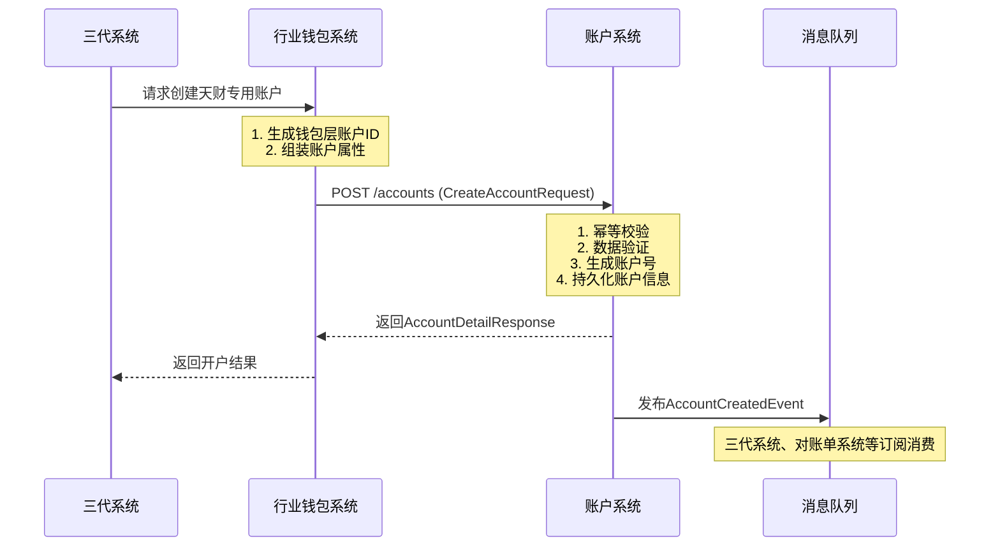
```mermaid
sequenceDiagram
    participant C as 三代系统
    participant W as 行业钱包系统
    participant A as 账户系统
    participant MQ as 消息队列

    C->>W: 请求创建天财专用账户
    Note over W: 1. 生成钱包层账户ID<br/>2. 组装账户属性
    W->>A: POST /accounts (CreateAccountRequest)
    Note over A: 1. 幂等校验<br/>2. 数据验证<br/>3. 生成账户号<br/>4. 持久化账户信息
    A-->>W: 返回AccountDetailResponse
    W-->>C: 返回开户结果
    A->>MQ: 发布AccountCreatedEvent
    Note over MQ: 三代系统、对账单系统等订阅消费
```

### 5.2 天财分账资金划转流程
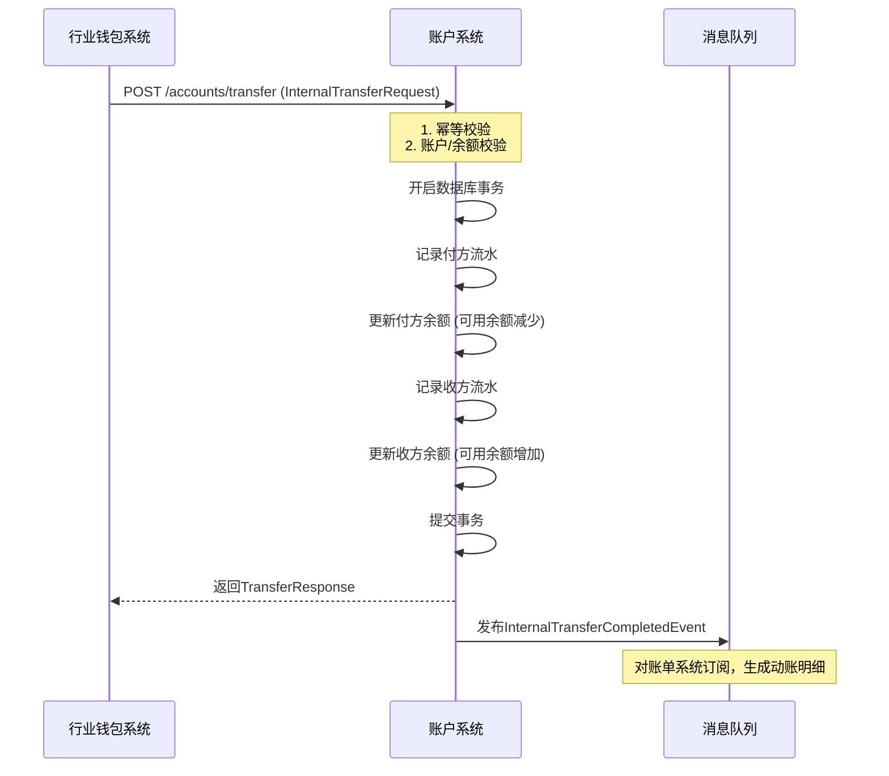
```mermaid
sequenceDiagram
    participant W as 行业钱包系统
    participant A as 账户系统
    participant MQ as 消息队列

    W->>A: POST /accounts/transfer (InternalTransferRequest)
    Note over A: 1. 幂等校验<br/>2. 账户/余额校验
    A->>A: 开启数据库事务
    A->>A: 记录付方流水
    A->>A: 更新付方余额 (可用余额减少)
    A->>A: 记录收方流水
    A->>A: 更新收方余额 (可用余额增加)
    A->>A: 提交事务
    A-->>W: 返回TransferResponse
    A->>MQ: 发布InternalTransferCompletedEvent
    Note over MQ: 对账单系统订阅，生成动账明细
```

## 6. 错误处理

### 6.1 预期错误及HTTP状态码
- **400 Bad Request**：请求参数无效、格式错误。
- **404 Not Found**：指定的账户不存在。
- **409 Conflict**：
    - `ACCOUNT_STATUS_INVALID`：账户状态不允许此操作（如非ACTIVE账户进行转账）。
    - `DUPLICATE_REQUEST_ID`：重复的请求流水号。
- **422 Unprocessable Entity**：
    - `INSUFFICIENT_BALANCE`：付方账户可用余额不足。
    - `TRANSFER_LIMIT_EXCEEDED`：转账金额超限。
- **500 Internal Server Error**：系统内部错误。

### 6.2 处理策略
- **重试策略**：对于网络超时等暂时性错误，调用方（如行业钱包系统）应实现幂等重试。
- **补偿机制**：对于记账类操作，如因系统故障导致事务部分成功，需有对账和人工调账入口进行差错处理。
- **监控告警**：对高频错误（如余额不足、账户状态异常）进行监控，并通知业务方排查。

## 7. 依赖说明

### 7.1 上游模块交互
1. **行业钱包系统**：
    - **调用本模块**：用于所有底层账户操作（创建、状态管理、转账）。
    - **交互方式**：同步RPC调用（HTTP REST）。行业钱包系统需处理本模块返回的错误，并决定是否重试或向上抛错。
    - **关键点**：行业钱包系统需保证其 `requestId` 的全局唯一性，以实现幂等。

2. **清结算系统**：
    - **调用本模块**：将交易结算资金从“01待结算账户”划转至天财收款账户；退货时从“04退货账户”扣款。
    - **交互方式**：同步RPC调用。清结算系统需确保其结算指令与账户操作的一致性。

### 7.2 下游模块交互
1. **对账单系统**：
    - **消费本模块事件**：订阅 `AccountBalanceChangedEvent` 和 `InternalTransferCompletedEvent`，用于生成明细。
    - **交互方式**：异步消息（MQ）。需保证消息至少投递一次，消费端需实现幂等。

2. **三代系统**：
    - **消费本模块事件**：订阅 `AccountCreatedEvent`，更新其侧账户状态。
    - **交互方式**：异步消息（MQ）。

### 7.3 内部依赖
- **数据库**：MySQL集群，要求高可用，支持事务。
- **缓存**：Redis集群，用于缓存热点账户信息（如余额）和 `requestId` 幂等校验结果。
- **消息中间件**：Kafka/RocketMQ，用于事件发布。

**文档版本**：1.0  
**最后更新**：2023-10-27  
**设计者**：软件架构师

## 3.2 电子签约平台


# 电子签约平台模块设计文档

## 1. 概述

### 1.1 目的
电子签约平台模块是“天财分账”业务的核心前置模块，负责为分账关系建立提供合法、合规、可追溯的授权基础。其主要目的是：
1.  **协议签署**：为总部与门店（或其他接收方）之间的分账授权关系提供标准化的电子协议签署流程。
2.  **身份认证**：集成打款验证和人脸验证服务，对协议签署方（尤其是接收方）进行强身份认证，确保资金流转安全。
3.  **证据链留存**：完整记录并存储协议签署、身份认证过程中的所有关键数据、文件和时间戳，形成不可篡改的证据链，满足监管和审计要求。
4.  **流程封装**：将复杂的签约与认证流程封装成简洁的H5页面或API，供上游系统（如行业钱包系统）调用，提升用户体验和集成效率。

### 1.2 范围
本模块负责：
-   电子协议的模板管理、生成、发起签署、状态同步与归档。
-   调用外部认证服务（打款验证/人脸验证）并管理其流程与结果。
-   提供签约流程的H5页面嵌入和API接口。
-   管理短信验证码的发送（用于签署确认或认证环节）。
-   与上游的**行业钱包系统**紧密交互，接收签约任务，反馈签约结果。
-   与底层的**账户系统**交互，获取必要的账户信息以支持打款验证。

**不在本模块范围**：
-   具体的分账交易执行（由行业钱包系统处理）。
-   商户进件与账户开立（由三代系统与账户系统处理）。
-   费率计算与资金结算（由计费中台与清结算系统处理）。

## 2. 接口设计

### 2.1 API端点 (RESTful)

#### 2.1.1 内部接口 (供行业钱包系统调用)

**1. 发起签约认证**
-   **端点**: `POST /api/v1/contract/initiate`
-   **描述**: 行业钱包系统在需要建立分账关系时调用，创建签约任务并返回签约流程入口。
-   **请求头**: `X-Request-ID`, `Authorization (Bearer Token)`
-   **请求体**:
    ```json
    {
      "taskId": "string", // 行业钱包系统生成的唯一任务ID，用于关联
      "merchantNo": "string", // 付方（总部）商户号
      "payerAccountNo": "string", // 付方天财收款账户号
      "receiverType": "ENTERPRISE|INDIVIDUAL|STORE", // 接收方类型：企业、个人、门店
      "receiverName": "string", // 接收方名称
      "receiverCertNo": "string", // 接收方证件号（企业为统一社会信用代码，个人为身份证号）
      "receiverAccountNo": "string", // 接收方天财接收方账户号（可选，打款验证时需要）
      "receiverMobile": "string", // 接收方联系手机号（用于短信和H5链接）
      "scene": "POOLING|BATCH_PAY|MEMBER_SETTLE", // 业务场景：归集、批量付款、会员结算
      "authMode": "TRANSFER|FACE", // 认证方式：打款验证、人脸验证
      "callbackUrl": "string" // 签约最终状态回调地址
    }
    ```
-   **响应体 (成功)**:
    ```json
    {
      "code": "SUCCESS",
      "msg": "成功",
      "data": {
        "signTaskId": "string", // 电子签约平台生成的签约任务ID
        "signUrl": "string", // 签约认证H5页面URL，需发送给接收方
        "expireTime": "2023-10-01T12:00:00Z" // 链接过期时间
      }
    }
    ```

**2. 查询签约任务状态**
-   **端点**: `GET /api/v1/contract/task/{signTaskId}`
-   **描述**: 行业钱包系统轮询或根据回调查询签约任务详细状态。
-   **响应体**:
    ```json
    {
      "code": "SUCCESS",
      "msg": "成功",
      "data": {
        "signTaskId": "string",
        "taskId": "string",
        "status": "INIT|SIGNING|AUTHING|SUCCESS|FAIL|EXPIRED",
        "merchantNo": "string",
        "payerAccountNo": "string",
        "receiverName": "string",
        "receiverAccountNo": "string",
        "scene": "POOLING",
        "authMode": "TRANSFER",
        "contractId": "string", // 已签署的协议ID
        "authResult": "PENDING|SUCCESS|FAIL",
        "failReason": "string", // 失败原因
        "createTime": "2023-10-01T10:00:00Z",
        "updateTime": "2023-10-01T11:30:00Z"
      }
    }
    ```

**3. 开通付款授权（总部侧）**
-   **端点**: `POST /api/v1/contract/open-payment-auth`
-   **描述**: 在批量付款和会员结算场景下，为付方（总部）发起额外的代付协议签署。
-   **请求体**:
    ```json
    {
      "taskId": "string",
      "merchantNo": "string", // 总部商户号
      "payerAccountNo": "string", // 总部天财收款账户号
      "contactName": "string", // 总部联系人
      "contactMobile": "string", // 总部联系人手机
      "callbackUrl": "string"
    }
    ```
-   **响应体**: 类似 `/initiate`，返回总部签约链接。

#### 2.1.2 外部接口 (供H5页面调用)

**1. 获取签约页面数据**
-   **端点**: `GET /h5/v1/contract/data?signTaskId=xxx&token=yyy`
-   **描述**: H5页面加载时调用，获取协议内容、认证方式等信息。
-   **响应体**: 包含协议HTML片段、接收方信息、认证步骤说明等。

**2. 提交短信验证码**
-   **端点**: `POST /h5/v1/contract/verify-sms`
-   **描述**: 用户（接收方）在H5页面输入短信验证码进行确认。
-   **请求体**: `{"signTaskId": "string", "smsCode": "string"}`

**3. 触发/查询认证**
-   **端点**: `POST /h5/v1/auth/transfer/trigger` (打款验证)
-   **端点**: `GET /h5/v1/auth/face/url` (获取人脸验证SDK参数)
-   **描述**: H5页面引导用户进行相应认证。

**4. 确认签署协议**
-   **端点**: `POST /h5/v1/contract/confirm-sign`
-   **描述**: 用户完成认证后，最终确认签署协议。

### 2.2 发布/消费的事件

#### 消费的事件
-   `AccountCreatedEvent` (来自账户系统)：监听天财专用账户的开户成功事件，为后续可能的打款验证准备账户信息。

#### 发布的事件
-   `ContractSignedEvent`：当一份分账协议签署并认证成功时发布。
    ```json
    {
      "eventId": "uuid",
      "type": "CONTRACT_SIGNED",
      "timestamp": "2023-10-01T12:00:00Z",
      "data": {
        "signTaskId": "string",
        "contractId": "string",
        "merchantNo": "string",
        "payerAccountNo": "string",
        "receiverName": "string",
        "receiverAccountNo": "string",
        "receiverCertNo": "string",
        "scene": "POOLING",
        "authMode": "TRANSFER",
        "signedTime": "2023-10-01T11:59:00Z"
      }
    }
    ```
-   `PaymentAuthOpenedEvent`：当总部开通付款授权成功时发布。
-   `ContractSignFailedEvent`：当签约任务失败时发布，包含失败原因。

## 3. 数据模型

### 3.1 核心数据库表设计

```sql
-- 签约任务主表
CREATE TABLE `t_sign_task` (
  `id` bigint(20) NOT NULL AUTO_INCREMENT,
  `sign_task_id` varchar(64) NOT NULL COMMENT '平台生成唯一任务ID',
  `external_task_id` varchar(64) NOT NULL COMMENT '外部系统任务ID',
  `merchant_no` varchar(32) NOT NULL COMMENT '付方商户号',
  `payer_account_no` varchar(32) NOT NULL COMMENT '付方账户号',
  `receiver_type` varchar(20) NOT NULL COMMENT '接收方类型',
  `receiver_name` varchar(128) NOT NULL COMMENT '接收方名称',
  `receiver_cert_no` varchar(64) NOT NULL COMMENT '接收方证件号',
  `receiver_account_no` varchar(32) COMMENT '接收方账户号',
  `receiver_mobile` varchar(20) NOT NULL COMMENT '接收方手机',
  `scene` varchar(32) NOT NULL COMMENT '业务场景',
  `auth_mode` varchar(20) NOT NULL COMMENT '认证方式',
  `status` varchar(20) NOT NULL DEFAULT 'INIT' COMMENT '任务状态',
  `contract_id` varchar(64) COMMENT '签署后的协议ID',
  `contract_file_url` varchar(512) COMMENT '协议文件存储地址',
  `auth_result` varchar(20) DEFAULT 'PENDING' COMMENT '认证结果',
  `callback_url` varchar(512) NOT NULL COMMENT '回调地址',
  `expire_time` datetime NOT NULL COMMENT '任务过期时间',
  `fail_reason` varchar(512) COMMENT '失败原因',
  `created_at` datetime NOT NULL DEFAULT CURRENT_TIMESTAMP,
  `updated_at` datetime NOT NULL DEFAULT CURRENT_TIMESTAMP ON UPDATE CURRENT_TIMESTAMP,
  PRIMARY KEY (`id`),
  UNIQUE KEY `uk_sign_task_id` (`sign_task_id`),
  KEY `idx_external_task` (`external_task_id`),
  KEY `idx_merchant` (`merchant_no`),
  KEY `idx_receiver` (`receiver_cert_no`, `receiver_account_no`),
  KEY `idx_status_expire` (`status`, `expire_time`)
) ENGINE=InnoDB COMMENT='签约任务表';

-- 协议签署记录表
CREATE TABLE `t_contract_record` (
  `id` bigint(20) NOT NULL AUTO_INCREMENT,
  `contract_id` varchar(64) NOT NULL COMMENT '协议唯一ID',
  `sign_task_id` varchar(64) NOT NULL COMMENT '关联签约任务',
  `template_id` varchar(32) NOT NULL COMMENT '协议模板ID',
  `template_version` varchar(16) NOT NULL COMMENT '模板版本',
  `content_hash` varchar(128) NOT NULL COMMENT '协议内容哈希值',
  `signer_name` varchar(128) NOT NULL COMMENT '签署方名称',
  `signer_cert_no` varchar(64) NOT NULL COMMENT '签署方证件号',
  `signer_role` varchar(20) NOT NULL COMMENT '签署方角色(PAYER/RECEIVER)',
  `sign_ip` varchar(45) COMMENT '签署IP',
  `sign_user_agent` varchar(512) COMMENT '签署终端UA',
  `sign_time` datetime NOT NULL COMMENT '签署时间',
  `created_at` datetime NOT NULL DEFAULT CURRENT_TIMESTAMP,
  PRIMARY KEY (`id`),
  UNIQUE KEY `uk_contract_id` (`contract_id`),
  KEY `idx_sign_task` (`sign_task_id`),
  KEY `idx_signer` (`signer_cert_no`)
) ENGINE=InnoDB COMMENT='协议签署记录表';

-- 身份认证记录表
CREATE TABLE `t_auth_record` (
  `id` bigint(20) NOT NULL AUTO_INCREMENT,
  `auth_id` varchar(64) NOT NULL COMMENT '认证记录ID',
  `sign_task_id` varchar(64) NOT NULL COMMENT '关联签约任务',
  `auth_mode` varchar(20) NOT NULL COMMENT '认证方式',
  `auth_target` varchar(64) NOT NULL COMMENT '认证对象证件号',
  `auth_status` varchar(20) NOT NULL DEFAULT 'PROCESSING' COMMENT '认证状态',
  `request_param` json COMMENT '请求参数',
  `response_data` json COMMENT '响应数据',
  `auth_time` datetime COMMENT '认证完成时间',
  `created_at` datetime NOT NULL DEFAULT CURRENT_TIMESTAMP,
  `updated_at` datetime NOT NULL DEFAULT CURRENT_TIMESTAMP ON UPDATE CURRENT_TIMESTAMP,
  PRIMARY KEY (`id`),
  UNIQUE KEY `uk_auth_id` (`auth_id`),
  KEY `idx_sign_task` (`sign_task_id`),
  KEY `idx_target` (`auth_target`)
) ENGINE=InnoDB COMMENT='身份认证记录表';

-- 短信验证记录表
CREATE TABLE `t_sms_record` (
  `id` bigint(20) NOT NULL AUTO_INCREMENT,
  `sign_task_id` varchar(64) NOT NULL,
  `mobile` varchar(20) NOT NULL,
  `sms_code` varchar(12) NOT NULL,
  `sms_type` varchar(32) NOT NULL COMMENT 'SIGN_CONFIRM/AUTH_VERIFY',
  `biz_id` varchar(64) COMMENT '外部短信服务ID',
  `status` varchar(20) NOT NULL DEFAULT 'SENT' COMMENT 'SENT/USED/EXPIRED',
  `expire_time` datetime NOT NULL,
  `created_at` datetime NOT NULL DEFAULT CURRENT_TIMESTAMP,
  PRIMARY KEY (`id`),
  KEY `idx_task_mobile` (`sign_task_id`, `mobile`, `status`),
  KEY `idx_expire` (`expire_time`)
) ENGINE=InnoDB COMMENT='短信验证记录表';
```

### 3.2 与其他模块的关系
-   **行业钱包系统**：上游调用方。电子签约平台接收其发起的签约任务，完成后通过回调或事件通知其结果。
-   **账户系统**：下游依赖。进行打款验证时，需要查询或验证接收方账户信息，并监听账户创建事件。
-   **外部认证服务**：下游依赖。调用第三方打款验证或人脸验证服务。
-   **短信服务平台**：下游依赖。调用内部或第三方短信服务发送验证码。
-   **文件存储服务**：下游依赖。用于存储已签署的电子协议PDF文件。

## 4. 业务逻辑

### 4.1 核心流程算法

**签约认证总流程：**
1.  **任务接收与初始化**：验证入参，创建签约任务，根据`receiverType`和`scene`选择协议模板。
2.  **H5页面生成**：生成带有时效性和防篡改Token的签约链接。
3.  **接收方操作流**：
    a. **协议查看与短信验证**：接收方查看协议，通过短信验证码确认身份。
    b. **身份认证**：
        - 打款验证：调用账户系统，向`receiverAccountNo`打款（小额随机），引导用户回填金额。
        - 人脸验证：调用人脸识别SDK，引导用户刷脸。
    c. **协议签署**：认证成功后，用户进行最终签署确认，系统生成带时间戳的电子签名。
4.  **证据链固化**：将协议原文、签署记录、认证结果、操作日志打包，计算哈希值，并可能上链或存证。
5.  **结果通知**：更新任务状态，回调行业钱包系统，发布`ContractSignedEvent`。

### 4.2 业务规则
1.  **签约关系唯一性**：同一付方账户与同一接收方账户，在同一业务场景下，只允许存在一份`SUCCESS`状态的协议。
2.  **认证方式规则**：
    - `receiverType`为`ENTERPRISE`（企业），强制使用**打款验证**。
    - `receiverType`为`INDIVIDUAL`（个人/个体户），强制使用**人脸验证**。
    - `receiverType`为`STORE`（门店），可由业务方指定，默认推荐打款验证。
3.  **协议模板管理**：不同`scene`和`receiverType`组合对应不同的协议模板。模板的任何变更需生成新版本，旧任务仍使用旧版本。
4.  **链接安全**：H5链接需包含一次性Token和有效期（如30分钟），防止重放攻击。
5.  **短信防刷**：同一手机号在短时间内（如1分钟）只能请求一次短信，每日有上限。

### 4.3 验证逻辑
-   **入参校验**：必填字段、商户号与账户号是否存在且匹配、接收方证件号格式等。
-   **业务状态校验**：发起签约时，付方账户状态必须正常；接收方账户（如果已存在）状态必须正常。
-   **认证结果校验**：严格依赖外部认证服务的返回结果，只有明确成功时才可推进流程。
-   **防重复签署**：签署前校验是否已存在生效的同类协议。

## 5. 时序图

### 5.1 核心流程：发起并完成签约认证

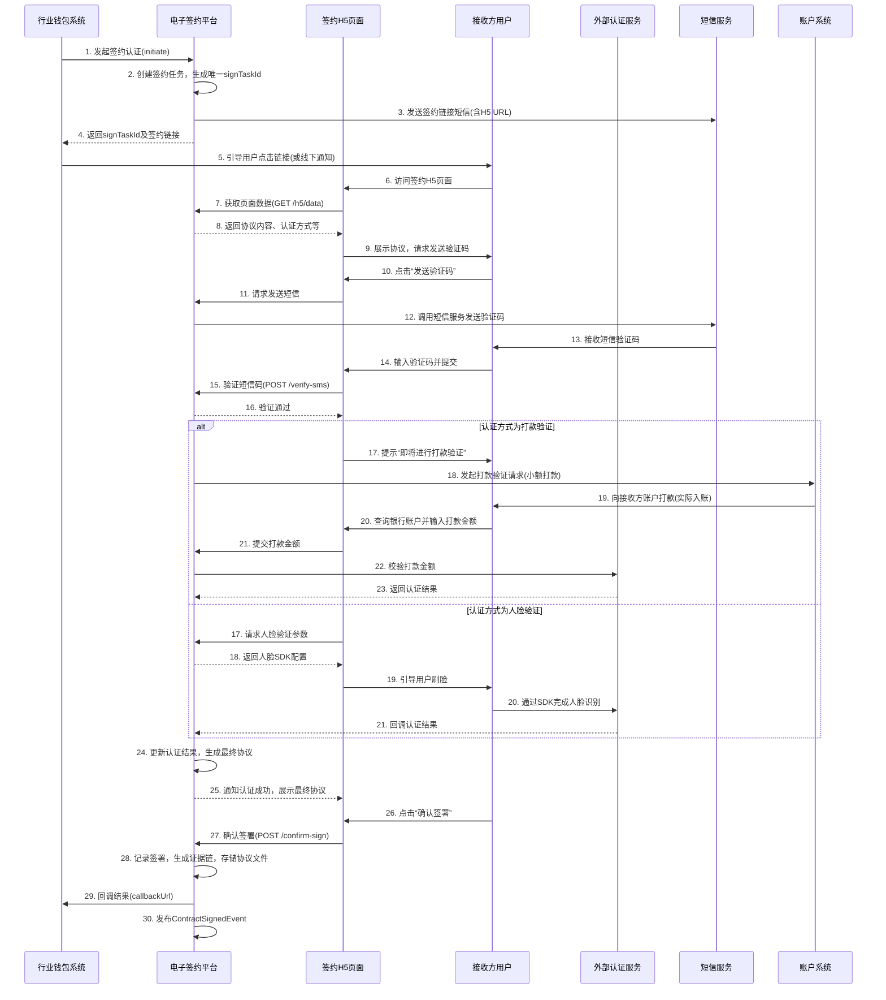
```mermaid
sequenceDiagram
    participant Wallet as 行业钱包系统
    participant ES as 电子签约平台
    participant H5 as 签约H5页面
    participant Receiver as 接收方用户
    participant AuthSvc as 外部认证服务
    participant SMS as 短信服务
    participant Acct as 账户系统

    Wallet->>ES: 1. 发起签约认证(initiate)
    ES->>ES: 2. 创建签约任务，生成唯一signTaskId
    ES->>SMS: 3. 发送签约链接短信(含H5 URL)
    ES-->>Wallet: 4. 返回signTaskId及签约链接
    Wallet->>Receiver: 5. 引导用户点击链接(或线下通知)

    Receiver->>H5: 6. 访问签约H5页面
    H5->>ES: 7. 获取页面数据(GET /h5/data)
    ES-->>H5: 8. 返回协议内容、认证方式等
    H5->>Receiver: 9. 展示协议，请求发送验证码
    Receiver->>H5: 10. 点击“发送验证码”
    H5->>ES: 11. 请求发送短信
    ES->>SMS: 12. 调用短信服务发送验证码
    SMS->>Receiver: 13. 接收短信验证码
    Receiver->>H5: 14. 输入验证码并提交
    H5->>ES: 15. 验证短信码(POST /verify-sms)
    ES-->>H5: 16. 验证通过

    alt 认证方式为打款验证
        H5->>Receiver: 17. 提示“即将进行打款验证”
        ES->>Acct: 18. 发起打款验证请求(小额打款)
        Acct->>Receiver: 19. 向接收方账户打款(实际入账)
        Receiver->>H5: 20. 查询银行账户并输入打款金额
        H5->>ES: 21. 提交打款金额
        ES->>AuthSvc: 22. 校验打款金额
        AuthSvc-->>ES: 23. 返回认证结果
    else 认证方式为人脸验证
        H5->>ES: 17. 请求人脸验证参数
        ES-->>H5: 18. 返回人脸SDK配置
        H5->>Receiver: 19. 引导用户刷脸
        Receiver->>AuthSvc: 20. 通过SDK完成人脸识别
        AuthSvc-->>ES: 21. 回调认证结果
    end

    ES->>ES: 24. 更新认证结果，生成最终协议
    ES-->>H5: 25. 通知认证成功，展示最终协议
    Receiver->>H5: 26. 点击“确认签署”
    H5->>ES: 27. 确认签署(POST /confirm-sign)
    ES->>ES: 28. 记录签署，生成证据链，存储协议文件
    ES->>Wallet: 29. 回调结果(callbackUrl)
    ES->>ES: 30. 发布ContractSignedEvent
```

## 6. 错误处理

| 错误类型 | 错误码 | 处理策略 |
| :--- | :--- | :--- |
| **参数校验失败** | `4000` | 请求参数格式错误或缺失，返回具体错误字段，调用方需修正后重试。 |
| **业务校验失败** | `4001` | 如商户不存在、账户状态异常、重复签约等。记录日志，返回明确业务错误信息。 |
| **认证服务异常** | `5001` | 调用打款/人脸验证服务超时或失败。记录详细日志，任务状态置为`AUTHING_FAIL`，支持异步重试机制。 |
| **短信发送失败** | `5002` | 短信服务不可用。可重试数次，若最终失败，任务状态置为`FAIL`。 |
| **回调通知失败** | `5003` | 通知行业钱包系统回调失败。启用重试队列，按指数退避策略重试，并监控告警。 |
| **系统内部错误** | `5000` | 数据库异常、未知异常等。记录完整错误堆栈，告警，任务状态置为`FAIL`。 |

**通用策略**：
-   **幂等性**：所有接口通过`taskId`或`signTaskId`保证幂等。
-   **异步与重试**：对于外部依赖调用（认证、回调）采用异步化处理，并配备可靠的重试机制。
-   **状态机**：签约任务有明确的状态机，防止状态混乱。任何失败都应有明确的状态和原因记录。
-   **监控与告警**：对错误率、延迟、任务积压进行监控，关键错误实时告警。

## 7. 依赖说明

### 7.1 上游模块交互
-   **行业钱包系统**是**主要上游调用方**。
    -   **交互方式**：同步API调用 (`/initiate`) + 异步回调 (`callbackUrl`) + 事件监听（可选）。
    -   **职责**：钱包系统负责业务逻辑判断（何时需要签约），并携带正确的业务参数发起调用。电子签约平台负责执行具体的签约与认证流程，并将最终结果返回。

### 7.2 下游模块/服务交互
1.  **账户系统**：
    -   **用途**：打款验证时，需要验证`receiverAccountNo`的有效性，并触发小额打款。
    -   **交互方式**：同步RPC调用。
2.  **外部认证服务**：
    -   **用途**：执行打款金额校验或人脸识别。
    -   **交互方式**：HTTP API调用 + 异步回调（针对人脸验证）。
3.  **短信服务平台**：
    -   **用途**：发送签约链接和验证码短信。
    -   **交互方式**：异步消息队列或HTTP API。
4.  **文件存储服务 (如OSS)**：
    -   **用途**：永久存储已签署的电子协议PDF文件。
    -   **交互方式**：SDK上传。

### 7.3 关键依赖管理
-   **降级策略**：对于非核心依赖（如短信服务的非关键通知），可考虑降级（如记录日志后跳过）。但对于**认证服务**，无法降级，失败即导致整个签约流程失败。
-   **超时与熔断**：所有外部调用必须设置合理的超时时间，并配置熔断器（如Hystrix或Resilience4j），防止因下游故障导致系统资源耗尽。
-   **数据一致性**：采用“最终一致性”。签约任务状态为主，通过重试确保回调成功。证据链数据在平台内部确保强一致性。

## 3.3 认证系统


# 认证系统模块设计文档

## 1. 概述

### 1.1 目的
本模块是“天财分账业务”的核心前置模块，负责为分账业务的资金付方与收方建立合法、可信的授权关系。其核心目的是通过电子协议签署与身份认证，确保分账指令的发起方（如总部）拥有对资金转出账户的合法支配权，并确认接收方（如门店、供应商）的身份真实有效，从而构建分账业务的法律与风控基础。

### 1.2 范围
本模块涵盖以下核心流程：
1. **关系绑定**：引导付方与收方完成电子协议签署与身份认证，建立分账授权关系。
2. **开通付款**：为总部（付方）开通批量付款与会员结算权限，需额外签署代付授权协议。
3. **认证状态管理**：管理绑定关系的全生命周期状态（如待签约、待认证、已生效、已失效）。
4. **证据链管理**：与电子签约平台集成，完整留存协议文件、认证过程记录等法律证据。

**边界说明**：
- **负责**：认证流程的编排、状态管理、与电子签约平台的交互。
- **不负责**：具体的账户开立（由行业钱包/账户系统负责）、分账交易执行（由行业钱包/清结算负责）、费率计算（由计费中台负责）。

## 2. 接口设计

### 2.1 REST API 端点

#### 2.1.1 发起关系绑定
- **端点**: `POST /api/v1/auth/bindings`
- **描述**: 为指定的付方与收方发起绑定流程。系统将创建绑定记录，并调用电子签约平台生成签约链接。
- **请求头**: `Authorization: Bearer <token>`, `Content-Type: application/json`
- **请求体**:
```json
{
  "requestId": "REQ202310250001", // 请求流水号，用于幂等
  "payerMerchantNo": "PAYER88888888", // 付方商户号（总部）
  "payerAccountNo": "WALLET_P001", // 付方天财收款账户号
  "payeeMerchantNo": "PAYEE9999999", // 收方商户号（门店/供应商）
  "payeeAccountNo": "WALLET_R001", // 收方天财接收方账户号
  "bindType": "COLLECTION", // 绑定类型：COLLECTION-归集, BATCH_PAY-批量付款, MEMBER_SETTLE-会员结算
  "authMethod": "TRANSFER_VERIFY", // 认证方式：TRANSFER_VERIFY-打款验证, FACE_VERIFY-人脸验证
  "extraInfo": { // 扩展信息，根据bindType不同而不同
    "collectionRule": { // 归集场景：归集规则
      "ratio": 0.7,
      "fixedAmount": null
    },
    "validityPeriod": { // 协议有效期（可选）
      "startTime": "2024-01-01 00:00:00",
      "endTime": "2024-12-31 23:59:59"
    }
  }
}
```
- **响应体** (成功 200):
```json
{
  "code": "SUCCESS",
  "message": "绑定流程发起成功",
  "data": {
    "bindingId": "BIND202310250001", // 系统生成的绑定关系唯一ID
    "status": "PENDING_SIGN", // 当前状态：待签约
    "signUrl": "https://esign.lakala.com/h5/contract?token=xyz", // 电子签约H5页面URL（给收方）
    "expireTime": "2024-01-02 12:00:00" // 签约链接过期时间
  }
}
```

#### 2.1.2 查询绑定状态
- **端点**: `GET /api/v1/auth/bindings/{bindingId}`
- **描述**: 根据绑定ID查询关系绑定的详细状态。
- **响应体**:
```json
{
  "code": "SUCCESS",
  "data": {
    "bindingId": "BIND202310250001",
    "payerMerchantNo": "PAYER88888888",
    "payeeMerchantNo": "PAYEE9999999",
    "bindType": "COLLECTION",
    "status": "PENDING_VERIFY", // 状态：PENDING_SIGN, PENDING_VERIFY, EFFECTIVE, INVALID, EXPIRED
    "authMethod": "TRANSFER_VERIFY",
    "signTime": "2024-01-01 10:30:00", // 签约完成时间
    "verifyTime": null, // 认证完成时间
    "contractId": "CONTRACT001", // 电子签约平台返回的协议ID
    "invalidReason": null // 失效原因（如：MANUAL_CANCEL, VERIFY_FAILED）
  }
}
```

#### 2.1.3 处理电子签约回调
- **端点**: `POST /api/v1/auth/callback/esign` （电子签约平台回调）
- **描述**: 接收电子签约平台发送的签约结果回调，更新绑定状态。**此端点需进行签名验证**。
- **请求体** (示例):
```json
{
  "event": "SIGN_SUCCESS", // SIGN_SUCCESS, SIGN_FAILED
  "contractId": "CONTRACT001",
  "signerRole": "PAYEE", // 签署方角色：PAYER, PAYEE
  "signTime": "2024-01-01 10:30:00",
  "bindingId": "BIND202310250001", // 回传的业务ID
  "timestamp": 1704078600000,
  "signature": "xxxx" // 对以上内容的签名
}
```
- **响应体**: 固定返回 `{"code": "SUCCESS"}`

#### 2.1.4 发起开通付款
- **端点**: `POST /api/v1/auth/payment-enable`
- **描述**: 为总部商户开通批量付款与会员结算权限。此操作需总部签署额外的代付授权协议。
- **请求体**:
```json
{
  "requestId": "ENABLE_REQ001",
  "payerMerchantNo": "PAYER88888888",
  "payerAccountNo": "WALLET_P001",
  "operator": { // 操作人信息（用于协议签署）
    "name": "张三",
    "idCardNo": "110101199001011234",
    "mobile": "13800138000"
  }
}
```
- **响应体**:
```json
{
  "code": "SUCCESS",
  "data": {
    "enableId": "ENABLE001",
    "status": "PENDING_SIGN",
    "signUrl": "https://esign.lakala.com/h5/proxy-payment?token=abc", // 代付协议签署URL
    "expireTime": "2024-01-02 12:00:00"
  }
}
```

### 2.2 发布/消费的事件

#### 2.2.1 发布的事件
1. **BindingStatusChangedEvent** (绑定状态变更)
   - **Topic**: `auth.binding.status.changed`
   - **触发时机**: 绑定关系状态发生变更时（如变为`EFFECTIVE`, `INVALID`）
   - **Payload**:
   ```json
   {
     "bindingId": "BIND202310250001",
     "oldStatus": "PENDING_VERIFY",
     "newStatus": "EFFECTIVE",
     "changeTime": "2024-01-01 11:00:00",
     "payerAccountNo": "WALLET_P001",
     "payeeAccountNo": "WALLET_R001",
     "bindType": "COLLECTION"
   }
   ```
   - **消费者**: 行业钱包系统（用于更新其内部的关系映射，作为分账交易的前置校验依据）。

2. **PaymentEnabledEvent** (付款权限开通)
   - **Topic**: `auth.payment.enabled`
   - **触发时机**: 总部成功开通批量付款/会员结算权限时。
   - **Payload**:
   ```json
   {
     "enableId": "ENABLE001",
     "payerMerchantNo": "PAYER88888888",
     "payerAccountNo": "WALLET_P001",
     "effectiveTime": "2024-01-01 12:00:00"
   }
   ```
   - **消费者**: 行业钱包系统（用于允许该账户发起批量付款和会员结算类分账）。

#### 2.2.2 消费的事件
1. **AccountCreatedEvent** (账户创建事件)
   - **Topic**: `wallet.account.created`
   - **来源**: 行业钱包系统
   - **用途**: 当新的天财专用账户（收款账户或接收方账户）创建成功后，认证系统可监听此事件，用于关联或校验绑定请求中的账户信息是否有效。

## 3. 数据模型

### 3.1 数据库表设计

#### 表：`auth_binding` (关系绑定主表)
| 字段名 | 类型 | 必填 | 描述 | 索引 |
| :--- | :--- | :--- | :--- | :--- |
| `binding_id` | varchar(32) | Y | 主键，绑定关系唯一ID | PK |
| `request_id` | varchar(64) | Y | 请求流水号，用于幂等控制 | UK |
| `payer_merchant_no` | varchar(32) | Y | 付方商户号 | IDX1 |
| `payer_account_no` | varchar(64) | Y | 付方天财账户号 | IDX1 |
| `payee_merchant_no` | varchar(32) | Y | 收方商户号 | IDX2 |
| `payee_account_no` | varchar(64) | Y | 收方天财账户号 | IDX2 |
| `bind_type` | varchar(32) | Y | 绑定类型：COLLECTION, BATCH_PAY, MEMBER_SETTLE | |
| `auth_method` | varchar(32) | Y | 认证方式：TRANSFER_VERIFY, FACE_VERIFY | |
| `status` | varchar(32) | Y | 状态：PENDING_SIGN, PENDING_VERIFY, EFFECTIVE, INVALID, EXPIRED | IDX3 |
| `contract_id` | varchar(64) | N | 电子签约协议ID | UK |
| `sign_time` | datetime | N | 签约完成时间 | |
| `verify_time` | datetime | N | 认证完成时间 | |
| `invalid_reason` | varchar(128) | N | 失效原因 | |
| `extra_info` | json | N | 扩展信息（如归集规则、有效期） | |
| `created_time` | datetime | Y | 创建时间 | |
| `updated_time` | datetime | Y | 更新时间 | |

#### 表：`payment_enable` (付款开通表)
| 字段名 | 类型 | 必填 | 描述 | 索引 |
| :--- | :--- | :--- | :--- | :--- |
| `enable_id` | varchar(32) | Y | 主键 | PK |
| `request_id` | varchar(64) | Y | 请求流水号 | UK |
| `payer_merchant_no` | varchar(32) | Y | 付方商户号 | UK |
| `payer_account_no` | varchar(64) | Y | 付方天财账户号 | |
| `operator_name` | varchar(64) | Y | 操作人姓名 | |
| `operator_id_card` | varchar(32) | Y | 操作人身份证号 | |
| `operator_mobile` | varchar(16) | Y | 操作人手机号 | |
| `status` | varchar(32) | Y | 状态：PENDING_SIGN, EFFECTIVE, INVALID | |
| `contract_id` | varchar(64) | N | 代付协议ID | |
| `effective_time` | datetime | N | 生效时间 | |
| `created_time` | datetime | Y | 创建时间 | |
| `updated_time` | datetime | Y | 更新时间 | |

#### 表：`auth_evidence` (认证证据链表)
| 字段名 | 类型 | 必填 | 描述 | 索引 |
| :--- | :--- | :--- | :--- | :--- |
| `id` | bigint | Y | 自增主键 | PK |
| `binding_id` | varchar(32) | Y | 关联的绑定ID | IDX |
| `evidence_type` | varchar(32) | Y | 证据类型：CONTRACT(协议), VERIFY_RECORD(认证记录), CALLBACK_LOG(回调日志) | |
| `external_id` | varchar(64) | Y | 外部系统ID（如合同ID、认证流水号） | |
| `content` | json | Y | 证据内容或快照 | |
| `storage_path` | varchar(512) | N | 文件存储路径（如PDF协议） | |
| `created_time` | datetime | Y | 创建时间 | |

### 3.2 与其他模块的关系
- **行业钱包系统**: 核心下游。认证系统将生效的绑定关系与付款权限通过事件同步给钱包系统，钱包系统在执行分账交易前必须校验对应关系是否存在且有效。
- **电子签约平台**: 核心依赖。认证系统通过API调用其生成签约链接、获取协议文件，并接收其回调通知。
- **三代系统**: 上游入口。三代系统作为商户进件和业务发起方，会调用本模块的API发起绑定和开通付款流程。
- **账户系统**: 弱依赖。通过消费`AccountCreatedEvent`来校验账户有效性，但主要依赖行业钱包系统保证账户状态。

## 4. 业务逻辑

### 4.1 核心算法与流程

#### 4.1.1 关系绑定状态机
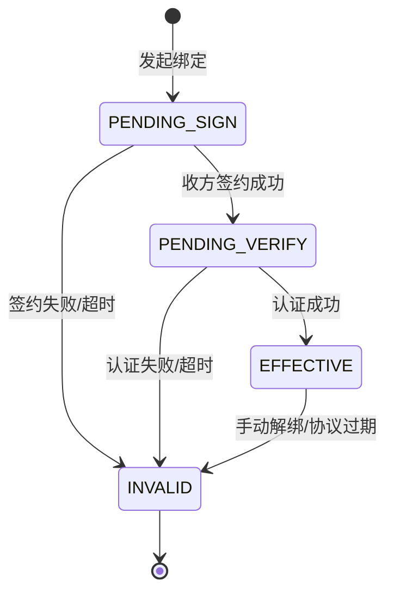
```mermaid
stateDiagram-v2
    [*] --> PENDING_SIGN : 发起绑定
    PENDING_SIGN --> PENDING_VERIFY : 收方签约成功
    PENDING_SIGN --> INVALID : 签约失败/超时
    PENDING_VERIFY --> EFFECTIVE : 认证成功
    PENDING_VERIFY --> INVALID : 认证失败/超时
    EFFECTIVE --> INVALID : 手动解绑/协议过期
    INVALID --> [*]
```
- **PENDING_SIGN**: 初始状态。调用电子签约平台生成H5签约链接，链接有效期24小时。
- **PENDING_VERIFY**: 收方签约完成后，根据`authMethod`调用相应认证服务。
  - `TRANSFER_VERIFY`: 通知电子签约平台发起打款验证（向收方绑卡打款）。
  - `FACE_VERIFY`: 引导收方进入人脸识别H5页面。
- **EFFECTIVE**: 认证成功。发布`BindingStatusChangedEvent`，关系生效。
- **INVALID**: 终止状态。签约/认证失败、超时、手动解绑或协议到期。

#### 4.1.2 开通付款流程
1. 校验该商户是否已存在有效的开通记录，避免重复开通。
2. 调用电子签约平台，生成**代付授权协议**签署链接（签署方为付方/总部）。
3. 总部操作人完成签署后，电子签约平台回调本系统。
4. 更新开通状态为`EFFECTIVE`，记录生效时间，并发布`PaymentEnabledEvent`。

### 4.2 业务规则
1. **唯一性规则**：
   - 同一对`payer_account_no`和`payee_account_no`，在相同的`bind_type`下，只能存在一条`EFFECTIVE`状态的绑定关系。
   - 同一`payer_merchant_no`只能有一条`EFFECTIVE`状态的开通付款记录。

2. **依赖规则**：
   - 发起`BATCH_PAY`或`MEMBER_SETTLE`类型的绑定前，付方必须已完成**开通付款**流程。
   - `COLLECTION`（归集）类型的绑定无需开通付款。

3. **认证方式规则**：
   - 若收方为企业，强制使用**打款验证**。
   - 若收方为个体工商户或个人，可使用**人脸验证**。

4. **生效规则**：
   - 绑定关系生效后，才允许行业钱包系统处理对应的分账指令。
   - 开通付款生效后，才允许行业钱包系统处理批量付款和会员结算类分账。

### 4.3 验证逻辑
1. **请求幂等性**：所有创建类接口（如发起绑定、开通付款）必须携带`request_id`，系统会校验`request_id`是否已处理过，防止重复创建。
2. **账户状态校验**：在发起绑定时，需通过查询行业钱包系统或消费账户事件，确认`payer_account_no`和`payee_account_no`存在且状态正常（非冻结、注销）。
3. **商户关系校验**：对于归集场景，需通过三代系统提供的接口，校验门店是否确实归属于该总部旗下。
4. **回调签名验证**：所有来自电子签约平台的回调请求，必须使用预共享密钥进行签名验证，防止伪造请求。

## 5. 时序图

### 5.1 关系绑定与认证流程（以打款验证为例）

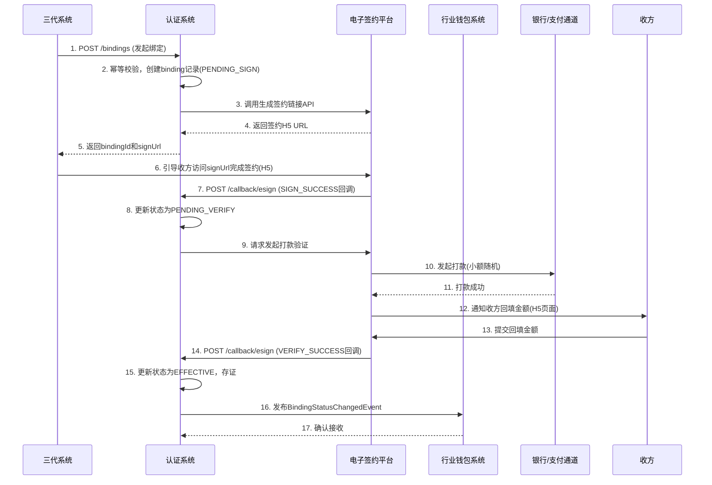
```mermaid
sequenceDiagram
    participant C as 三代系统
    participant A as 认证系统
    participant E as 电子签约平台
    participant W as 行业钱包系统
    participant B as 银行/支付通道

    C->>A: 1. POST /bindings (发起绑定)
    A->>A: 2. 幂等校验，创建binding记录(PENDING_SIGN)
    A->>E: 3. 调用生成签约链接API
    E-->>A: 4. 返回签约H5 URL
    A-->>C: 5. 返回bindingId和signUrl
    C->>E: 6. 引导收方访问signUrl完成签约(H5)
    E->>A: 7. POST /callback/esign (SIGN_SUCCESS回调)
    A->>A: 8. 更新状态为PENDING_VERIFY
    A->>E: 9. 请求发起打款验证
    E->>B: 10. 发起打款(小额随机)
    B-->>E: 11. 打款成功
    E->>收方: 12. 通知收方回填金额(H5页面)
    收方->>E: 13. 提交回填金额
    E->>A: 14. POST /callback/esign (VERIFY_SUCCESS回调)
    A->>A: 15. 更新状态为EFFECTIVE，存证
    A->>W: 16. 发布BindingStatusChangedEvent
    W-->>A: 17. 确认接收
```

## 6. 错误处理

| 错误场景 | 错误码 | 处理策略 | 是否重试 |
| :--- | :--- | :--- | :--- |
| 请求幂等冲突 (`request_id`重复) | `DUPLICATE_REQUEST` | 返回已存在的业务结果（如bindingId） | 否 |
| 账户不存在或状态异常 | `ACCOUNT_INVALID` | 拒绝请求，返回具体原因 | 否（需用户修正） |
| 电子签约平台调用超时/失败 | `ESIGN_SERVICE_UNAVAILABLE` | 异步重试3次，记录告警 | 是 |
| 电子签约回调签名验证失败 | `INVALID_SIGNATURE` | 记录安全日志，直接拒绝 | 否 |
| 认证失败（打款金额错误） | `VERIFICATION_FAILED` | 更新绑定状态为`INVALID`，通知业务方 | 否 |
| 数据库异常 | `DATABASE_ERROR` | 依赖框架重试机制，记录告警 | 是（事务性操作） |
| 消息发布失败 | `EVENT_PUBLISH_FAILED` | 本地建表存储失败事件，定时任务补偿推送 | 是 |

**通用策略**：
- **客户端错误（4xx）**：由调用方参数错误或业务状态不满足导致，需调用方修正后重试。
- **服务端错误（5xx）**：系统内部错误，记录详细日志和告警，对于可重试操作（如调用外部API）实施指数退避重试。
- **补偿机制**：对于关键状态同步（如事件发布），采用本地事件表+定时任务扫描重推的机制，保证最终一致性。

## 7. 依赖说明

### 7.1 上游模块交互
1. **三代系统**
   - **交互方式**: 同步REST API调用。
   - **职责**: 作为业务入口，发起`发起关系绑定`、`开通付款`等请求。认证系统为其提供清晰的API和状态查询能力。
   - **数据流**: 三代系统传递商户号、账户号、绑定类型等业务参数。

2. **电子签约平台**
   - **交互方式**: 同步API调用 + 异步回调。
   - **职责**:
     - 提供协议模板、生成签约H5页面。
     - 集成打款验证、人脸验证服务并返回结果。
     - 提供已签署协议的下载和存证查询。
   - **数据流**: 认证系统传递签约方信息、业务标识；接收签约/认证结果回调。

### 7.2 下游模块交互
1. **行业钱包系统**
   - **交互方式**: 异步事件发布（消息队列）。
   - **职责**: 消费`BindingStatusChangedEvent`和`PaymentEnabledEvent`，在其内部维护关系映射和权限白名单，作为执行分账交易的前置校验依据。
   - **数据流**: 认证系统推送绑定ID、双方账户、绑定类型、状态变更等信息。

### 7.3 外部服务依赖
- **银行/支付通道**：由电子签约平台封装打款验证能力，认证系统不直接交互。
- **人脸识别服务**：由电子签约平台集成，认证系统通过调用电子签约平台间接使用。

### 7.4 依赖管理
- **强依赖**：电子签约平台。若其不可用，则所有新的绑定和开通流程无法进行。需有熔断机制和醒目告警。
- **弱依赖**：行业钱包系统（事件消费）。若消息暂时发送失败，有本地补偿机制，不影响主流程，但可能导致分账交易短暂延迟生效。
- **监控要点**：
  - 电子签约平台API调用成功率与延迟。
  - 消息发布成功率和积压情况。
  - 绑定流程各阶段转化率及平均耗时。

## 3.4 三代系统


# 三代系统模块设计文档

## 1. 概述

### 1.1 目的
本模块是“天财商龙”分账业务的**核心业务入口和流程编排中枢**。它负责面向商户（总部/门店）提供统一的业务接口，管理商户进件、账户配置、关系绑定、分账指令发起等全流程业务。三代系统作为上层业务系统，向下游（行业钱包系统、电子签约平台等）编排复杂的业务流程，并维护业务状态的一致性。

### 1.2 范围
- **商户进件与账户配置**：为总部和门店商户开通天财业务，配置分账模式（主动/被动结算），并触发天财专用账户的开立。
- **关系绑定流程编排**：为“归集”、“批量付款”、“会员结算”等场景，编排协议签署与身份认证（打款/人脸验证）流程，建立并验证付方与收方的授权关系。
- **分账业务发起**：接收商户的“归集”、“批量付款”、“会员结算”等业务请求，进行业务校验后，调用行业钱包系统执行分账。
- **开通付款授权**：为总部商户编排“开通付款”流程，完成与拉卡拉的代付授权协议签署，使其具备付款资格。
- **业务状态与数据管理**：维护商户、账户、绑定关系、分账指令等核心业务实体的状态和关联关系。
- **查询与对账**：为商户提供业务进度、账户信息、分账记录等查询功能，并整合对账单。

### 1.3 非范围
- 底层账户的创建与资金操作（由账户系统处理）。
- 钱包层业务逻辑处理与分账执行（由行业钱包系统处理）。
- 电子协议生成、签署及认证服务执行（由电子签约平台处理）。
- 交易核心处理与计费（由业务核心、计费中台处理）。
- 底层动账明细生成（由对账单系统处理）。

## 2. 接口设计

### 2.1 REST API 端点（商户侧）

#### 2.1.1 商户进件与账户管理
- **POST /api/v1/tiancai/merchants/onboarding**：天财业务商户进件
    - **请求体**：`MerchantOnboardingRequest`
    - **响应**：`MerchantOnboardingResponse`
- **PUT /api/v1/tiancai/merchants/{merchantNo}/settlement-mode**：更新结算模式（主动/被动）
    - **请求体**：`UpdateSettlementModeRequest`
    - **响应**：`BaseResponse`
- **GET /api/v1/tiancai/merchants/{merchantNo}/accounts**：查询商户名下的天财专用账户列表
    - **响应**：`List<AccountInfoResponse>`

#### 2.1.2 关系绑定管理
- **POST /api/v1/tiancai/bindings**：发起关系绑定（签约与认证）
    - **请求体**：`CreateBindingRequest`
    - **响应**：`CreateBindingResponse` (包含签约H5链接或认证任务ID)
- **GET /api/v1/tiancai/bindings/{bindingId}**：查询绑定关系状态
    - **响应**：`BindingDetailResponse`
- **POST /api/v1/tiancai/bindings/{bindingId}/cancel**：取消进行中的绑定流程
    - **响应**：`BaseResponse`
- **GET /api/v1/tiancai/merchants/{payerMerchantNo}/bindings**：查询付方名下的所有有效绑定关系
    - **查询参数**：`bizType` (归集/批量付款/会员结算)
    - **响应**：`List<BindingSimpleResponse>`

#### 2.1.3 分账业务发起
- **POST /api/v1/tiancai/split-orders/collection**：发起资金归集
    - **请求体**：`CreateCollectionOrderRequest`
    - **响应**：`CreateSplitOrderResponse`
- **POST /api/v1/tiancai/split-orders/batch-payment**：发起批量付款
    - **请求体**：`CreateBatchPaymentOrderRequest`
    - **响应**：`CreateSplitOrderResponse`
- **POST /api/v1/tiancai/split-orders/member-settlement**：发起会员结算
    - **请求体**：`CreateMemberSettleOrderRequest`
    - **响应**：`CreateSplitOrderResponse`
- **GET /api/v1/tiancai/split-orders/{orderNo}**：查询分账指令状态
    - **响应**：`SplitOrderDetailResponse`

#### 2.1.4 开通付款授权
- **POST /api/v1/tiancai/merchants/{merchantNo}/enable-payment**：为总部商户发起“开通付款”流程
    - **请求体**：`EnablePaymentRequest`
    - **响应**：`EnablePaymentResponse` (包含授权协议签署H5链接)

### 2.2 内部接口（供下游系统回调）

- **POST /internal/api/v1/tiancai/callback/binding-status**：电子签约平台回调绑定状态
    - **请求体**：`BindingCallbackRequest`
    - **响应**：`BaseResponse`
- **POST /internal/api/v1/tiancai/callback/payment-auth-status**：电子签约平台回调开通付款状态
    - **请求体**：`PaymentAuthCallbackRequest`
    - **响应**：`BaseResponse`
- **POST /internal/api/v1/tiancai/callback/split-result**：行业钱包系统回调分账结果
    - **请求体**：`SplitResultCallbackRequest`
    - **响应**：`BaseResponse`

### 2.3 数据结构

```json
// MerchantOnboardingRequest
{
  "requestId": "ONBOARD_REQ_001",
  "merchantNo": "M100001",
  "merchantType": "HEADQUARTERS", // HEADQUARTERS, STORE
  "parentMerchantNo": "M100000", // 门店进件时必填，其总部商户号
  "settlementMode": "ACTIVE", // ACTIVE(主动结算至天财账户), PASSIVE(被动结算)
  "contactInfo": {
    "name": "张三",
    "phone": "13800138000",
    "email": "zhangsan@example.com"
  }
}

// CreateBindingRequest (以归集为例)
{
  "requestId": "BIND_REQ_001",
  "bizType": "COLLECTION",
  "payerMerchantNo": "M100000", // 总部
  "payerAccountNo": "ACC_HQ_001", // 总部天财收款账户
  "receiverMerchantNo": "M100001", // 门店
  "receiverAccountNo": "ACC_STORE_001", // 门店天财收款账户
  "authMethod": "REMITTANCE_VERIFICATION", // 打款验证
  "extraInfo": { // 业务相关扩展信息
    "collectionRatio": "0.3", // 归集比例 30%
    "effectiveDate": "2023-11-01",
    "expiryDate": "2024-10-31"
  }
}

// CreateCollectionOrderRequest
{
  "requestId": "COLLECT_ORDER_001",
  "payerMerchantNo": "M100001", // 门店（付方）
  "payerAccountNo": "ACC_STORE_001",
  "receiverMerchantNo": "M100000", // 总部（收方）
  "receiverAccountNo": "ACC_HQ_001",
  "amount": "10000.00",
  "currency": "CNY",
  "bindingId": "BIND_001", // 关联的已生效绑定关系ID
  "memo": "2023年10月营业款归集"
}

// BindingCallbackRequest
{
  "eventId": "CALLBACK_EVT_001",
  "bindingId": "BIND_001",
  "taskId": "ESIGN_TASK_001", // 电子签约平台任务ID
  "status": "SUCCESS", // SUCCESS, FAILED, CANCELED
  "authMethod": "REMITTANCE_VERIFICATION",
  "signedDocumentUrl": "https://esign.example.com/doc/xxx",
  "failedReason": "验证金额回填错误",
  "timestamp": "2023-10-27T14:30:00Z"
}
```

### 2.4 发布的事件
三代系统作为事件生产者，发布业务领域事件：

- **TiancaiAccountConfiguredEvent**：商户天财业务配置完成（包括账户开立结果）。
    ```json
    {
      "eventId": "EVT_TC_ACC_CFG_001",
      "eventType": "TIANCAI_ACCOUNT_CONFIGURED",
      "timestamp": "2023-10-27T10:05:00Z",
      "data": {
        "merchantNo": "M100001",
        "accountNo": "ACC202310270001",
        "accountType": "TIANCAI_COLLECT",
        "settlementMode": "ACTIVE",
        "walletSystemAccountId": "WALLET_ACC_001"
      }
    }
    ```
- **BindingRelationshipEstablishedEvent**：绑定关系生效。
- **SplitOrderCreatedEvent**：分账指令已创建（待执行）。
- **SplitOrderCompletedEvent**：分账指令执行完成（成功/失败）。

### 2.5 消费的事件
三代系统作为事件消费者，订阅以下事件以更新自身状态：

- **AccountCreatedEvent** (来自账户系统)：更新本地账户状态为“已开立”。
- **AccountStatusChangedEvent** (来自账户系统)：同步底层账户状态（冻结/解冻/注销）。

## 3. 数据模型

### 3.1 核心表设计

#### 表：`tiancai_merchant_config` (天财商户配置表)
| 字段名 | 类型 | 必填 | 描述 | 索引 |
|--------|------|------|------|------|
| id | bigint(20) | Y | 自增主键 | PK |
| merchant_no | varchar(32) | Y | 商户号 | UK |
| merchant_type | varchar(16) | Y | 商户类型：HEADQUARTERS, STORE | IDX |
| parent_merchant_no | varchar(32) | N | 上级总部商户号（门店时必填） | IDX |
| settlement_mode | varchar(16) | Y | 结算模式：ACTIVE, PASSIVE | |
| payment_enabled | tinyint(1) | Y | 是否已开通付款（总部） | |
| status | varchar(16) | Y | 状态：PROCESSING, ACTIVE, SUSPENDED | IDX |
| contact_info | json | N | 联系人信息（JSON） | |
| config_time | datetime | Y | 配置时间 | |
| create_time | datetime | Y | 创建时间 | IDX |
| update_time | datetime | Y | 更新时间 | |

#### 表：`tiancai_account` (天财账户关联表)
| 字段名 | 类型 | 必填 | 描述 | 索引 |
|--------|------|------|------|------|
| id | bigint(20) | Y | 自增主键 | PK |
| merchant_no | varchar(32) | Y | 所属商户号 | IDX |
| account_no | varchar(32) | Y | 底层账户号（账户系统） | UK |
| wallet_account_id | varchar(64) | Y | 行业钱包账户ID | UK |
| account_type | varchar(32) | Y | 账户类型：COLLECT, RECEIVE | |
| account_name | varchar(128) | Y | 账户名称 | |
| status | varchar(16) | Y | 状态：CREATING, ACTIVE, FROZEN, CLOSED | IDX |
| create_time | datetime | Y | 创建时间 | IDX |
| update_time | datetime | Y | 更新时间 | |

#### 表：`binding_relationship` (绑定关系表)
| 字段名 | 类型 | 必填 | 描述 | 索引 |
|--------|------|------|------|------|
| id | bigint(20) | Y | 自增主键 | PK |
| binding_id | varchar(32) | Y | 绑定关系业务ID | UK |
| biz_type | varchar(32) | Y | 业务类型：COLLECTION, BATCH_PAYMENT, MEMBER_SETTLE | IDX |
| payer_merchant_no | varchar(32) | Y | 付方商户号 | IDX |
| payer_account_no | varchar(32) | Y | 付方账户号 | |
| receiver_merchant_no | varchar(32) | Y | 收方商户号 | IDX |
| receiver_account_no | varchar(32) | Y | 收方账户号 | |
| auth_method | varchar(32) | Y | 认证方式：REMITTANCE_VERIFY, FACE_VERIFY | |
| status | varchar(16) | Y | 状态：INIT, SIGNING, VERIFYING, SUCCESS, FAILED, CANCELED | IDX |
| e_sign_task_id | varchar(64) | N | 电子签约任务ID | |
| extra_info | json | N | 扩展信息（比例、有效期等） | |
| effective_date | date | N | 生效日期 | |
| expiry_date | date | N | 失效日期 | |
| create_time | datetime | Y | 创建时间 | IDX |
| update_time | datetime | Y | 更新时间 | |

#### 表：`split_order` (分账指令表)
| 字段名 | 类型 | 必填 | 描述 | 索引 |
|--------|------|------|------|------|
| id | bigint(20) | Y | 自增主键 | PK |
| order_no | varchar(32) | Y | 分账指令号 | UK |
| biz_type | varchar(32) | Y | 业务类型：COLLECTION, BATCH_PAYMENT, MEMBER_SETTLE | IDX |
| payer_merchant_no | varchar(32) | Y | 付方商户号 | IDX |
| payer_account_no | varchar(32) | Y | 付方账户号 | |
| receiver_merchant_no | varchar(32) | Y | 收方商户号 | IDX |
| receiver_account_no | varchar(32) | Y | 收方账户号 | |
| amount | decimal(15,2) | Y | 分账金额 | |
| currency | char(3) | Y | 币种 | |
| binding_id | varchar(32) | Y | 关联的绑定关系ID | IDX |
| status | varchar(16) | Y | 状态：CREATED, PROCESSING, SUCCESS, FAILED | IDX |
| wallet_request_id | varchar(64) | N | 行业钱包系统请求ID | |
| fail_reason | varchar(256) | N | 失败原因 | |
| memo | varchar(256) | N | 备注 | |
| create_time | datetime | Y | 创建时间 | IDX |
| update_time | datetime | Y | 更新时间 | |

### 3.2 与其他模块的关系
- **行业钱包系统**：三代系统是行业钱包系统的**主要调用方**。通过同步RPC调用，触发钱包账户开立、关系绑定校验、分账指令执行。
- **账户系统**：**间接依赖**。通过消费账户系统的事件，同步底层账户状态。不直接调用其接口，资金操作通过行业钱包系统代理。
- **电子签约平台**：**服务调用方与回调接收方**。调用其服务获取签约H5链接、发起认证；接收其回调以更新绑定和授权状态。
- **清结算系统**：**配置同步**。将商户的“主动结算”配置同步至清结算，使其能将资金结算至指定天财收款账户。
- **对账单系统**：**数据提供方**。提供分账指令数据，作为生成“天财分账”指令账单的数据源之一。
- **业务核心**：**数据消费者**。行业钱包系统将分账交易同步至业务核心，三代系统不直接交互。

## 4. 业务逻辑

### 4.1 核心算法
- **分账指令号生成**：`SPLIT` + `年月日` + `6位序列号` (如 `SPLIT20231027000001`)。
- **绑定关系ID生成**：`BIND` + `年月日` + `6位序列号`。
- **状态机管理**：为`binding_relationship`和`split_order`设计严格的状态流转图，确保业务流程不可逆且状态明确。
- **幂等控制**：所有创建类接口（进件、绑定、下单）必须携带`requestId`，在数据库层级或缓存中实现幂等校验。

### 4.2 业务规则
1. **商户进件规则**：
    - 总部商户进件，必须开立一个`TIANCAI_COLLECT`类型的天财收款账户。
    - 门店商户进件，必须关联一个已存在的总部商户，并开立一个`TIANCAI_COLLECT`类型的天财收款账户。
    - 若结算模式为`ACTIVE`，需同步该配置至清结算系统。

2. **关系绑定规则**：
    - 绑定关系是分账的前置条件，`split_order`必须关联一个状态为`SUCCESS`的`binding_id`。
    - “归集”场景：付方是门店（天财收款账户），收方是总部（天财收款账户）。
    - “批量付款”场景：付方是总部（天财收款账户），收方是供应商等（天财接收方账户）。
    - “会员结算”场景：付方是总部（天财收款账户），收方是门店（天财收款账户）。
    - “开通付款”是总部进行“批量付款”和“会员结算”的**前置全局授权**，只需办理一次。

3. **分账执行规则**：
    - 发起分账前，校验：付方账户状态正常、收方账户状态正常、绑定关系在有效期内、总部付款权限已开通（如适用）。
    - 调用行业钱包系统执行分账，并异步等待回调更新指令状态。

### 4.3 验证逻辑
- **进件请求验证**：校验商户号合法性、商户类型是否支持、门店的总部是否存在、结算模式是否有效。
- **绑定请求验证**：
    - 校验付方和收方商户是否存在且已开通天财业务。
    - 校验指定的付方和收方账户是否存在且属于对应商户。
    - 校验相同的付方、收方、业务类型是否存在重复的生效中绑定。
    - 校验认证方式是否与收方商户类型匹配（如对公通常用打款验证）。
- **分账请求验证**：
    - 校验绑定关系是否`SUCCESS`且在有效期内。
    - 对于“批量付款”和“会员结算”，校验付方总部是否已`payment_enabled`。
    - 金额必须大于0。

## 5. 时序图

### 5.1 天财商户进件与账户开立流程
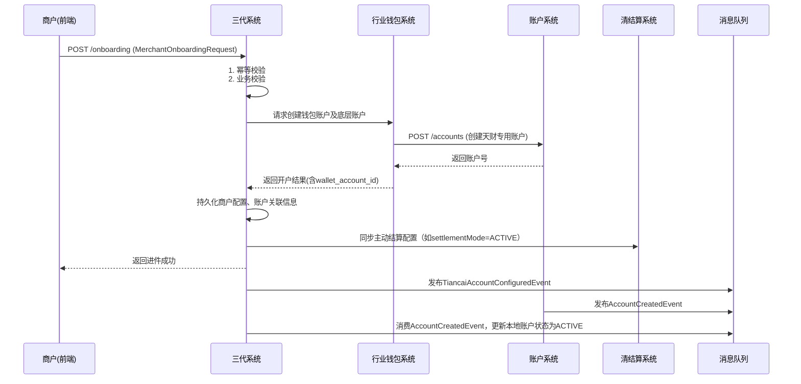
```mermaid
sequenceDiagram
    participant M as 商户(前端)
    participant C as 三代系统
    participant W as 行业钱包系统
    participant A as 账户系统
    participant S as 清结算系统
    participant MQ as 消息队列

    M->>C: POST /onboarding (MerchantOnboardingRequest)
    C->>C: 1. 幂等校验<br>2. 业务校验
    C->>W: 请求创建钱包账户及底层账户
    W->>A: POST /accounts (创建天财专用账户)
    A-->>W: 返回账户号
    W-->>C: 返回开户结果(含wallet_account_id)
    C->>C: 持久化商户配置、账户关联信息
    C->>S: 同步主动结算配置（如settlementMode=ACTIVE）
    C-->>M: 返回进件成功
    C->>MQ: 发布TiancaiAccountConfiguredEvent
    A->>MQ: 发布AccountCreatedEvent
    C->>MQ: 消费AccountCreatedEvent，更新本地账户状态为ACTIVE
```

### 5.2 关系绑定（签约与认证）流程
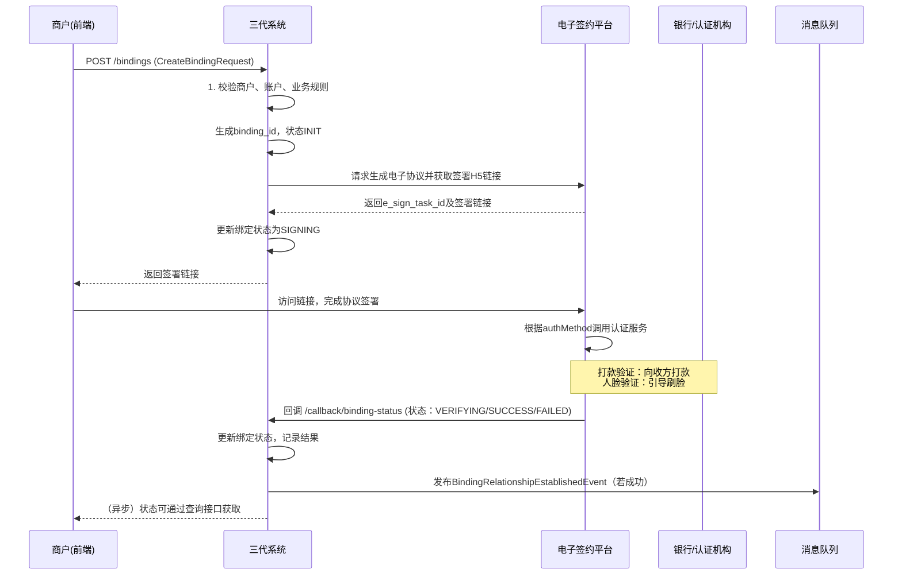
```mermaid
sequenceDiagram
    participant M as 商户(前端)
    participant C as 三代系统
    participant E as 电子签约平台
    participant B as 银行/认证机构
    participant MQ as 消息队列

    M->>C: POST /bindings (CreateBindingRequest)
    C->>C: 1. 校验商户、账户、业务规则
    C->>C: 生成binding_id，状态INIT
    C->>E: 请求生成电子协议并获取签署H5链接
    E-->>C: 返回e_sign_task_id及签署链接
    C->>C: 更新绑定状态为SIGNING
    C-->>M: 返回签署链接
    M->>E: 访问链接，完成协议签署
    E->>E: 根据authMethod调用认证服务
    Note over E,B: 打款验证：向收方打款<br>人脸验证：引导刷脸
    E->>C: 回调 /callback/binding-status (状态：VERIFYING/SUCCESS/FAILED)
    C->>C: 更新绑定状态，记录结果
    C->>MQ: 发布BindingRelationshipEstablishedEvent（若成功）
    C-->>M: （异步）状态可通过查询接口获取
```

### 5.3 发起资金归集流程
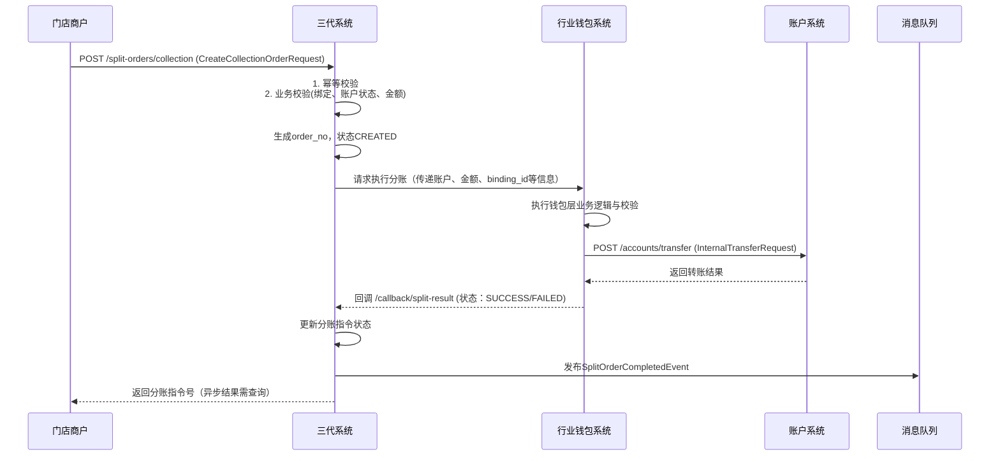
```mermaid
sequenceDiagram
    participant M as 门店商户
    participant C as 三代系统
    participant W as 行业钱包系统
    participant A as 账户系统
    participant MQ as 消息队列

    M->>C: POST /split-orders/collection (CreateCollectionOrderRequest)
    C->>C: 1. 幂等校验<br>2. 业务校验(绑定、账户状态、金额)
    C->>C: 生成order_no，状态CREATED
    C->>W: 请求执行分账（传递账户、金额、binding_id等信息）
    W->>W: 执行钱包层业务逻辑与校验
    W->>A: POST /accounts/transfer (InternalTransferRequest)
    A-->>W: 返回转账结果
    W-->>C: 回调 /callback/split-result (状态：SUCCESS/FAILED)
    C->>C: 更新分账指令状态
    C->>MQ: 发布SplitOrderCompletedEvent
    C-->>M: 返回分账指令号（异步结果需查询）
```

## 6. 错误处理

### 6.1 预期错误及HTTP状态码
- **400 Bad Request**：请求参数缺失、格式错误、业务逻辑校验不通过（如绑定关系不存在）。
- **403 Forbidden**：权限不足（如门店试图发起批量付款）。
- **404 Not Found**：商户、账户或订单不存在。
- **409 Conflict**：
    - `DUPLICATE_REQUEST_ID`：重复请求。
    - `BINDING_NOT_EFFECTIVE`：绑定关系未生效或已过期。
    - `PAYMENT_NOT_ENABLED`：总部未开通付款权限。
- **422 Unprocessable Entity**：
    - `INSUFFICIENT_BALANCE`：付方账户余额不足（由下游返回）。
    - `ACCOUNT_STATUS_INVALID`：账户状态异常。
- **502 Bad Gateway**：调用下游系统（行业钱包、电子签）超时或失败。
- **500 Internal Server Error**：系统内部错误。

### 6.2 处理策略
- **同步调用错误**：对下游系统（如行业钱包）的同步调用，采用有限次数的重试（如3次），重试失败则更新业务订单状态为`FAILED`，并记录失败原因。
- **异步回调缺失**：对于重要的异步回调（如分账结果），设置定时任务扫描长时间处于`PROCESSING`状态的订单，主动向下游系统查询状态。
- **状态不一致补偿**：通过消费底层系统（账户系统）的事件，与本地状态进行比对，发现不一致时触发告警并生成工单，支持人工干预修复。
- **监控告警**：对关键接口错误率、下游调用延迟、长时间未处理订单进行监控和告警。

## 7. 依赖说明

### 7.1 上游模块交互（调用方）
1. **行业钱包系统**：
    - **调用关系**：**同步RPC调用**。
    - **关键接口**：开户、关系绑定校验、执行分账。
    - **交互要点**：
        - 三代系统负责组装完整的业务上下文（商户、账户、绑定关系）。
        - 需处理行业钱包返回的业务错误（如校验不通过）和系统错误（超时、宕机）。
        - 分账指令为异步回调模式，需维护`wallet_request_id`以关联回调。

2. **电子签约平台**：
    - **调用关系**：**同步RPC调用 + 异步HTTP回调**。
    - **关键接口**：生成签署链接、查询任务状态。
    - **交互要点**：
        - 调用生成链接后，需保存`e_sign_task_id`。
        - 提供高可用的回调端点，处理签约及认证结果，并实现回调幂等。

3. **清结算系统**：
    - **调用关系**：**同步RPC调用**（配置同步）。
    - **关键接口**：更新商户结算账户配置。
    - **交互要点**：在商户进件或变更结算模式为`ACTIVE`时调用，确保交易资金结算至正确的天财收款账户。

### 7.2 下游模块交互（被调用/消费事件）
1. **账户系统**：
    - **交互关系**：**异步消息消费**。
    - **消费事件**：`AccountCreatedEvent`, `AccountStatusChangedEvent`。
    - **交互要点**：用于更新本地`tiancai_account`表的状态，确保与底层一致。

2. **对账单系统**：
    - **交互关系**：**数据提供方**（可能通过DB对接或接口）。
    - **提供数据**：`split_order`表数据。
    - **交互要点**：按约定格式或接口提供分账指令数据，用于生成业务对账单。

3. **业务核心**：
    - **交互关系**：**无直接交互**。数据通过行业钱包系统同步。

### 7.3 内部依赖
- **数据库**：MySQL集群，存储所有业务实体数据，要求高可用和事务支持。
- **缓存**：Redis集群，用于缓存商户配置、热点绑定关系、以及`requestId`幂等校验。
- **消息中间件**：Kafka/RocketMQ，用于发布业务事件和消费系统间事件。
- **配置中心**：管理下游系统接口地址、超时时间、重试策略等配置。

**文档版本**：1.0  
**最后更新**：2023-10-27  
**设计者**：软件架构师

## 3.5 账务核心系统


# 账务核心系统模块设计文档

## 1. 概述

### 1.1 目的
本模块是“天财商龙”分账业务的核心账务处理引擎，负责处理所有与资金分账相关的核心业务逻辑。它作为业务逻辑层，向上承接行业钱包系统的分账指令，向下驱动账户系统完成实际的资金划转，并协调清结算、计费中台等系统，确保“归集”、“批量付款”、“会员结算”等分账业务流程的完整、准确和一致。

### 1.2 范围
- **分账交易处理**：接收并处理来自行业钱包系统的分账请求（归集、批量付款、会员结算），执行完整的业务校验和账务处理流程。
- **手续费计算与扣收**：联动计费中台，计算分账交易产生的手续费，并完成手续费账户的扣划。
- **业务状态机管理**：维护分账订单的生命周期状态（创建、处理中、成功、失败、部分成功等），确保流程可追溯。
- **关系绑定校验**：在执行分账前，校验付方与收方之间是否已完成有效的“关系绑定”及“开通付款”授权。
- **资金路由与指令组装**：根据分账类型，正确路由资金路径（如涉及内部账户），并组装调用底层账户系统的转账指令。
- **异常处理与冲正**：处理分账过程中的各类异常（如余额不足、账户冻结），并支持失败交易的冲正流程。
- **数据同步与对账**：向业务核心同步分账交易数据，并为对账单系统提供“天财分账”指令账单的源数据。

### 1.3 非范围
- 底层账户的创建、余额管理（由账户系统负责）。
- 商户进件、协议签署与身份认证（由三代系统、电子签约平台负责）。
- 行业钱包账户层的业务逻辑（如开户流转、绑定校验触发，由行业钱包系统负责）。
- 交易资金的清算与结算（由清结算系统负责）。
- 前端页面或接口的暴露（由行业钱包系统或网关层负责）。

## 2. 接口设计

### 2.1 REST API 端点 (内部接口，供行业钱包系统调用)

#### 2.1.1 分账交易接口
- **POST /api/v1/split/execute**: 执行单笔分账
    - **请求体**: `ExecuteSplitRequest`
    - **响应**: `SplitOrderResponse`
- **POST /api/v1/split/batch-execute**: 执行批量分账（如批量付款场景）
    - **请求体**: `BatchExecuteSplitRequest`
    - **响应**: `BatchSplitOrderResponse`
- **POST /api/v1/split/{splitOrderNo}/reverse**: 分账冲正
    - **请求体**: `ReverseSplitRequest`
    - **响应**: `BaseResponse`
- **GET /api/v1/split/orders/{splitOrderNo}**: 查询分账订单详情
    - **响应**: `SplitOrderDetailResponse`

#### 2.1.2 查询与校验接口
- **POST /api/v1/split/validate-relationship**: 校验分账关系
    - **请求体**: `ValidateRelationshipRequest`
    - **响应**: `ValidateRelationshipResponse`
- **GET /api/v1/split/fee-calculate**: 试算手续费
    - **查询参数**: `bizType`, `fromAccountNo`, `toAccountNo`, `amount`
    - **响应**: `FeeCalculateResponse`

### 2.2 数据结构

```json
// ExecuteSplitRequest - 执行单笔分账请求
{
  "requestId": "SPLIT_REQ_202310270001", // 请求流水号，幂等键
  "bizType": "COLLECTION", // 业务类型: COLLECTION(归集), BATCH_PAY(批量付款), MEMBER_SETTLE(会员结算)
  "bizOrderNo": "BIZ_ORDER_001", // 上游业务订单号（如归集单号）
  "payer": {
    "accountNo": "ACC202310270001", // 付方账户号（天财收款账户）
    "merchantNo": "M100001", // 付方商户号
    "merchantName": "北京总店"
  },
  "payee": {
    "accountNo": "ACC202310270002", // 收方账户号（天财收款/接收方账户）
    "merchantNo": "M100002", // 收方商户号
    "merchantName": "上海分店"
  },
  "amount": "1000.00", // 分账金额
  "currency": "CNY",
  "memo": "2023年10月归集款",
  "extInfo": { // 扩展信息
    "splitRatio": "0.30", // 分账比例（如适用）
    "originalTradeNo": "TRADE_001" // 原交易号（会员结算关联用）
  }
}

// SplitOrderResponse - 分账订单响应
{
  "splitOrderNo": "SPLIT_ORDER_202310270001", // 本系统分账订单号
  "status": "PROCESSING", // 订单状态: PROCESSING, SUCCESS, FAILED, PARTIAL_SUCCESS
  "requestId": "SPLIT_REQ_202310270001",
  "bizOrderNo": "BIZ_ORDER_001",
  "estimatedFinishTime": "2023-10-27T10:05:00Z" // 预计完成时间（用于异步处理）
}

// SplitOrderDetailResponse - 分账订单详情
{
  "splitOrderNo": "SPLIT_ORDER_202310270001",
  "bizType": "COLLECTION",
  "status": "SUCCESS",
  "payer": { ... },
  "payee": { ... },
  "amount": "1000.00",
  "actualAmount": "995.00", // 实际划账金额（扣除手续费后）
  "fee": "5.00", // 手续费
  "feeDeductAccountNo": "FEE_ACCOUNT_001", // 手续费扣收账户
  "currency": "CNY",
  "memo": "2023年10月归集款",
  "relatedAccountTransNos": ["TRANS001", "TRANS002"], // 关联的底层账户流水号
  "errorCode": "",
  "errorMsg": "",
  "createTime": "2023-10-27T10:00:00Z",
  "finishTime": "2023-10-27T10:00:30Z"
}

// BatchExecuteSplitRequest - 批量分账请求
{
  "batchRequestId": "BATCH_SPLIT_REQ_202310270001",
  "bizType": "BATCH_PAY",
  "bizBatchNo": "BATCH_PAY_001", // 上游批量业务批次号
  "payer": { ... }, // 统一的付方
  "items": [ // 分账明细列表
    {
      "itemRequestId": "ITEM_REQ_001",
      "payee": { ... },
      "amount": "500.00",
      "memo": "供应商A货款"
    },
    ... // 最多支持1000条
  ],
  "currency": "CNY",
  "extInfo": { ... }
}
```

### 2.3 发布的事件
账务核心系统作为事件生产者，发布以下领域事件：

- **SplitOrderCreatedEvent**: 分账订单创建。
    ```json
    {
      "eventId": "EVT_SPLIT_CREATED_001",
      "eventType": "SPLIT_ORDER_CREATED",
      "timestamp": "2023-10-27T10:00:00Z",
      "data": {
        "splitOrderNo": "SPLIT_ORDER_202310270001",
        "bizType": "COLLECTION",
        "payerAccountNo": "ACC202310270001",
        "payeeAccountNo": "ACC202310270002",
        "amount": "1000.00",
        "bizOrderNo": "BIZ_ORDER_001"
      }
    }
    ```
- **SplitOrderCompletedEvent**: 分账订单完成（成功/失败）。
- **SplitOrderStatusChangedEvent**: 分账订单状态变更。

### 2.4 消费的事件
账务核心系统作为事件消费者，订阅以下事件以触发或更新业务：

- **RelationshipBoundEvent** (来自行业钱包系统): 关系绑定完成，更新本地缓存。
- **AccountStatusChangedEvent** (来自账户系统): 账户状态变更，影响后续分账校验。

## 3. 数据模型

### 3.1 核心表设计

#### 表：`split_order` (分账订单主表)
| 字段名 | 类型 | 必填 | 描述 | 索引 |
|--------|------|------|------|------|
| id | bigint(20) | Y | 自增主键 | PK |
| split_order_no | varchar(32) | Y | 分账订单号，全局唯一 | UK |
| request_id | varchar(64) | Y | 请求流水号，幂等键 | UK |
| biz_type | varchar(32) | Y | 业务类型 | IDX |
| biz_order_no | varchar(64) | Y | 上游业务订单号 | IDX |
| batch_request_id | varchar(64) | N | 批量请求ID（批量付款时） | IDX |
| payer_account_no | varchar(32) | Y | 付方账户号 | IDX |
| payer_merchant_no | varchar(32) | Y | 付方商户号 | IDX |
| payee_account_no | varchar(32) | Y | 收方账户号 | IDX |
| payee_merchant_no | varchar(32) | Y | 收方商户号 | IDX |
| amount | decimal(15,2) | Y | 分账金额 | |
| actual_amount | decimal(15,2) | Y | 实际划账金额 | |
| currency | char(3) | Y | 币种 | |
| fee | decimal(15,2) | Y | 手续费 | |
| fee_deduct_account_no | varchar(32) | N | 手续费扣收账户 | |
| status | varchar(16) | Y | 状态 | IDX |
| memo | varchar(256) | N | 备注 | |
| ext_info | json | N | 扩展信息（JSON） | |
| error_code | varchar(32) | N | 错误码 | |
| error_msg | varchar(512) | N | 错误信息 | |
| version | int(11) | Y | 版本号，乐观锁 | |
| create_time | datetime | Y | 创建时间 | IDX |
| update_time | datetime | Y | 更新时间 | |
| finish_time | datetime | N | 完成时间 | IDX |

#### 表：`split_order_item` (分账订单明细表，用于批量付款)
| 字段名 | 类型 | 必填 | 描述 | 索引 |
|--------|------|------|------|------|
| id | bigint(20) | Y | 自增主键 | PK |
| split_order_no | varchar(32) | Y | 分账订单号 | IDX |
| item_request_id | varchar(64) | Y | 明细项请求ID | UK |
| payee_account_no | varchar(32) | Y | 收方账户号 | IDX |
| amount | decimal(15,2) | Y | 分账金额 | |
| actual_amount | decimal(15,2) | Y | 实际划账金额 | |
| fee | decimal(15,2) | Y | 手续费 | |
| status | varchar(16) | Y | 状态 | IDX |
| memo | varchar(256) | N | 备注 | |
| error_code | varchar(32) | N | 错误码 | |
| error_msg | varchar(512) | N | 错误信息 | |
| create_time | datetime | Y | 创建时间 | |

#### 表：`split_relationship_cache` (分账关系缓存表)
| 字段名 | 类型 | 必填 | 描述 | 索引 |
|--------|------|------|------|------|
| id | bigint(20) | Y | 自增主键 | PK |
| payer_account_no | varchar(32) | Y | 付方账户号 | UK1 |
| payee_account_no | varchar(32) | Y | 收方账户号 | UK1 |
| relationship_status | varchar(16) | Y | 关系状态：BOUND, UNBOUND | |
| auth_status | varchar(16) | Y | 开通付款授权状态：GRANTED, REVOKED | |
| biz_types | json | Y | 允许的业务类型列表 | |
| expire_time | datetime | N | 缓存过期时间 | IDX |
| create_time | datetime | Y | 创建时间 | |
| update_time | datetime | Y | 更新时间 | |

#### 表：`split_account_trans_rel` (分账与账户流水关联表)
| 字段名 | 类型 | 必填 | 描述 | 索引 |
|--------|------|------|------|------|
| id | bigint(20) | Y | 自增主键 | PK |
| split_order_no | varchar(32) | Y | 分账订单号 | IDX |
| account_trans_no | varchar(32) | Y | 账户系统流水号 | UK |
| account_role | varchar(16) | Y | 账户角色：PAYER, PAYEE, FEE | |
| create_time | datetime | Y | 创建时间 | |

### 3.2 与其他模块的关系
- **行业钱包系统**：上游调用方。行业钱包系统处理业务层逻辑后，调用本模块执行核心分账。本模块需消费其发布的`RelationshipBoundEvent`。
- **账户系统**：下游被调用方。本模块组装指令调用账户系统完成资金划转，并消费其`AccountStatusChangedEvent`。
- **计费中台**：下游被调用方。分账前调用计费中台试算手续费，分账成功后通知其记录手续费。
- **清结算系统**：下游被调用方。在涉及“主动结算”资金入账天财收款账户后，或退货场景，清结算系统会调用本模块触发分账。
- **业务核心**：下游事件消费者。本模块发布分账完成事件，业务核心订阅后记录交易数据。
- **对账单系统**：下游事件消费者。订阅本模块的分账事件，生成“天财分账”指令账单。

## 4. 业务逻辑

### 4.1 核心算法
- **分账订单号生成**：`SPLIT_ORDER` + `年月日` + `6位序列号` (如 `SPLIT_ORDER20231027000001`)。
- **手续费计算路由**：
    1. 根据 `bizType`, `payer` 和 `payee` 信息，构造计费请求。
    2. 同步调用计费中台试算接口获取手续费金额和扣收账户。
    3. 若手续费>0，则实际划账金额 = 分账金额 - 手续费。
- **批量分账处理**：
    - 采用“整体创建，逐笔处理”模式。主订单状态为`PROCESSING`，明细项独立处理。
    - 支持部分成功，最终主订单状态根据明细结果聚合（全部成功->SUCCESS，全部失败->FAILED，其他->PARTIAL_SUCCESS）。
- **幂等控制**：所有接口通过`requestId`（或`itemRequestId`）实现幂等，利用数据库唯一索引防重。

### 4.2 业务规则
1. **分账前置校验规则**：
    - **关系绑定**：校验 `split_relationship_cache` 中对应付方和收方的 `relationship_status` 为 `BOUND`。
    - **开通付款**：对于 `bizType` 为 `BATCH_PAY` 或 `MEMBER_SETTLE`，需额外校验 `auth_status` 为 `GRANTED`。
    - **账户状态**：付方账户必须为 `ACTIVE` 且可用余额充足（金额+手续费）。收方账户必须为 `ACTIVE`。
    - **业务类型匹配**：校验当前分账业务类型在关系缓存的 `biz_types` 列表中。

2. **资金处理规则**：
    - **归集(COLLECTION)**：门店(付方) -> 总部(收方)。通常无手续费或手续费由门店承担。
    - **批量付款(BATCH_PAY)**：总部(付方) -> 供应商/股东(收方)。手续费通常由总部承担。
    - **会员结算(MEMBER_SETTLE)**：总部(付方) -> 门店(收方)。手续费规则可配置。
    - **手续费扣划**：若手续费由付方承担，则从付方账户划出“分账金额+手续费”，其中手续费划入指定手续费账户。

3. **状态流转规则**：
    ```
    单笔分账: CREATED -> PROCESSING -> (SUCCESS / FAILED)
    批量分账主单: CREATED -> PROCESSING -> (SUCCESS / PARTIAL_SUCCESS / FAILED)
    批量分账明细: CREATED -> PROCESSING -> (SUCCESS / FAILED)
    ```
    - 订单创建后即为`PROCESSING`状态。
    - 只有`PROCESSING`状态的订单允许冲正。

### 4.3 验证逻辑
- **请求基础验证**：必填字段、金额有效性（>0）、账户号格式、币种支持性。
- **业务一致性验证**：
    - 付方账户的`merchantNo`与请求中的`payer.merchantNo`一致。
    - 收方账户类型符合业务场景（如批量付款的收方应为天财接收方账户）。
- **风控验证**：
    - 单笔分账金额限额。
    - 付方当日累计分账限额。
    - 敏感商户/账户监控名单校验。

## 5. 时序图

### 5.1 单笔归集分账流程
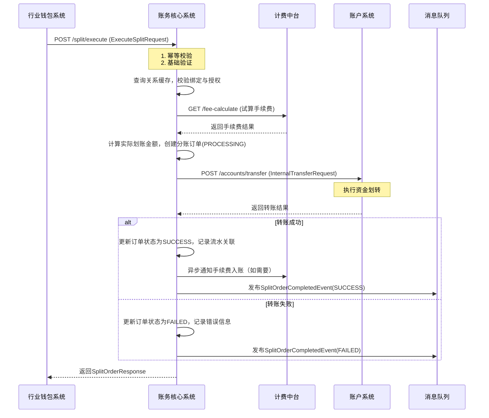
```mermaid
sequenceDiagram
    participant W as 行业钱包系统
    participant S as 账务核心系统
    participant C as 计费中台
    participant A as 账户系统
    participant MQ as 消息队列

    W->>S: POST /split/execute (ExecuteSplitRequest)
    Note over S: 1. 幂等校验<br/>2. 基础验证
    S->>S: 查询关系缓存，校验绑定与授权
    S->>C: GET /fee-calculate (试算手续费)
    C-->>S: 返回手续费结果
    S->>S: 计算实际划账金额，创建分账订单(PROCESSING)
    S->>A: POST /accounts/transfer (InternalTransferRequest)
    Note over A: 执行资金划转
    A-->>S: 返回转账结果
    alt 转账成功
        S->>S: 更新订单状态为SUCCESS，记录流水关联
        S->>C: 异步通知手续费入账（如需要）
        S->>MQ: 发布SplitOrderCompletedEvent(SUCCESS)
    else 转账失败
        S->>S: 更新订单状态为FAILED，记录错误信息
        S->>MQ: 发布SplitOrderCompletedEvent(FAILED)
    end
    S-->>W: 返回SplitOrderResponse
```

### 5.2 批量付款分账流程
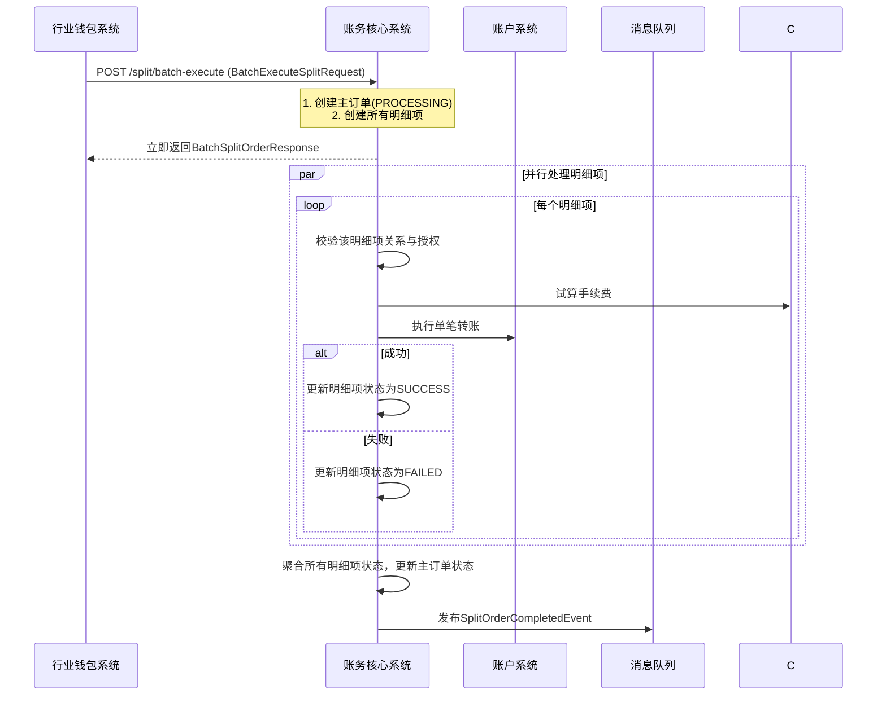
```mermaid
sequenceDiagram
    participant W as 行业钱包系统
    participant S as 账务核心系统
    participant A as 账户系统
    participant MQ as 消息队列

    W->>S: POST /split/batch-execute (BatchExecuteSplitRequest)
    Note over S: 1. 创建主订单(PROCESSING)<br/>2. 创建所有明细项
    S-->>W: 立即返回BatchSplitOrderResponse
    par 并行处理明细项
        loop 每个明细项
            S->>S: 校验该明细项关系与授权
            S->>C: 试算手续费
            S->>A: 执行单笔转账
            alt 成功
                S->>S: 更新明细项状态为SUCCESS
            else 失败
                S->>S: 更新明细项状态为FAILED
            end
        end
    end
    S->>S: 聚合所有明细项状态，更新主订单状态
    S->>MQ: 发布SplitOrderCompletedEvent
```

## 6. 错误处理

### 6.1 预期错误及HTTP状态码
- **400 Bad Request**：请求参数无效、格式错误、金额非正。
- **403 Forbidden**：
    - `RELATIONSHIP_NOT_BOUND`：付方与收方未绑定有效关系。
    - `PAYMENT_AUTH_REQUIRED`：未开通付款授权。
    - `ACCOUNT_STATUS_INVALID`：账户状态异常（非ACTIVE、已冻结等）。
- **409 Conflict**：
    - `DUPLICATE_REQUEST_ID`：重复的请求流水号。
    - `ORDER_STATUS_CANNOT_REVERSE`：订单状态不允许冲正。
- **422 Unprocessable Entity**：
    - `INSUFFICIENT_BALANCE`：付方账户余额不足。
    - `EXCEED_DAILY_LIMIT`：超过当日分账限额。
    - `FEE_CALCULATE_FAILED`：手续费计算失败。
- **500 Internal Server Error**：系统内部错误、依赖服务超时或异常。

### 6.2 处理策略
- **同步调用失败**：对于账户系统、计费中台的同步调用，采用有限次重试（如3次），重试间隔递增。若最终失败，将分账订单置为`FAILED`。
- **异步补偿**：对于“最终一致性”场景（如通知计费中台记录手续费），采用异步消息+本地事务表确保至少一次投递，消费端需幂等。
- **冲正机制**：对于`PROCESSING`状态下因系统故障导致的不确定状态订单，提供手动/自动冲正接口，调用账户系统进行反向划账。
- **对账与差错处理**：每日与账户系统、计费中台进行对账，发现不平账目，触发差错处理流程，支持人工调账。

## 7. 依赖说明

### 7.1 上游模块交互
1. **行业钱包系统**：
    - **调用本模块**：所有分账请求的入口。行业钱包系统完成业务层校验（如门店归属校验）后，调用本模块执行分账。
    - **交互方式**：同步RPC调用（HTTP REST）。本模块应快速响应（创建订单后即返回），实际处理可异步。
    - **关键点**：行业钱包系统需保证其`requestId`的全局唯一性。本模块消费其发布的`RelationshipBoundEvent`以更新本地缓存。

### 7.2 下游模块交互
1. **账户系统**：
    - **调用该模块**：执行所有资金划转操作。这是本模块最核心的依赖。
    - **交互方式**：同步RPC调用。必须处理其返回的各类错误（余额不足、账户冻结等），并转化为业务侧错误码。
    - **关键点**：需维护账户系统接口的熔断降级机制，防止其故障导致本模块雪崩。

2. **计费中台**：
    - **调用该模块**：分账前试算手续费，分账成功后异步通知其记录。
    - **交互方式**：试算为同步RPC调用，通知为异步消息。
    - **关键点**：手续费试算失败应阻断分账流程。通知消息需确保可靠投递。

3. **清结算系统**：
    - **被该模块调用**：在特定场景（如交易结算触发分账），清结算系统会调用本模块。
    - **交互方式**：同步RPC调用。需校验调用方的身份和权限。

### 7.3 内部依赖
- **数据库**：MySQL集群，要求高可用，支持事务。`split_order`表是核心，读写频繁。
- **缓存**：Redis集群，用于缓存热点数据：
    - 分账关系状态（`split_relationship_cache` 的热点数据）。
    - 账户基础信息（状态、余额快照，用于快速校验）。
- **消息中间件**：Kafka/RocketMQ，用于事件发布和异步任务。
- **配置中心**：动态配置分账限额、手续费承担方等业务规则。

**文档版本**：1.0  
**最后更新**：2023-10-27  
**设计者**：软件架构师

## 3.6 行业钱包系统


# 行业钱包系统模块设计文档

## 1. 概述

### 1.1 目的
本模块是“天财商龙”分账业务的**核心资金处理与业务逻辑中枢**。它作为三代系统与底层账户系统之间的桥梁，负责管理钱包层级的业务实体（账户、关系、分账指令），执行复杂的业务校验与流程编排，并最终驱动底层账户完成资金划转。其核心价值在于封装了天财业务特有的分账规则、状态管理和数据一致性保障。

### 1.2 范围
- **钱包账户管理**：接收三代系统指令，为天财商户开立并管理钱包层级的账户模型，并与底层账户系统（账户系统）的实体进行关联映射。
- **关系绑定校验**：在分账指令执行前，对三代系统发起的绑定关系进行最终的业务逻辑校验，确保付方与收方的关系合法、有效且具备分账权限。
- **分账指令处理**：接收三代系统的分账请求（归集、批量付款、会员结算），执行钱包层级的业务校验、状态流转，并调用账户系统完成资金划转。
- **数据同步**：将分账交易的核心数据同步至业务核心，确保交易流水完整；并响应三代系统的各类查询请求。
- **状态机管理**：维护分账指令在钱包层的完整状态流转，确保业务过程可追溯、可监控。

### 1.3 非范围
- 商户进件、协议签署与身份认证流程编排（由三代系统处理）。
- 底层账户的物理创建、状态标记与原子化记账操作（由账户系统处理）。
- 电子协议的生成、签署与认证服务执行（由电子签约平台处理）。
- 交易资金的清算、结算与计费（由清结算系统、计费中台处理）。
- 对账单的最终生成与提供（由对账单系统处理）。

## 2. 接口设计

### 2.1 REST API 端点（供三代系统调用）

#### 2.1.1 账户管理
- **POST /api/v1/wallet/accounts**：创建天财专用钱包账户
    - **请求体**：`CreateWalletAccountRequest`
    - **响应**：`WalletAccountResponse`
- **GET /api/v1/wallet/accounts/{walletAccountId}**：查询钱包账户详情
    - **响应**：`WalletAccountDetailResponse`
- **GET /api/v1/wallet/accounts/by-merchant/{merchantNo}**：查询商户名下所有钱包账户
    - **响应**：`List<WalletAccountSimpleResponse>`

#### 2.1.2 关系绑定校验
- **POST /api/v1/wallet/bindings/validate**：校验绑定关系有效性（分账前置调用）
    - **请求体**：`ValidateBindingRequest`
    - **响应**：`ValidateBindingResponse`

#### 2.1.3 分账指令执行
- **POST /api/v1/wallet/transfer**：执行分账（资金划转）
    - **请求体**：`ExecuteTransferRequest`
    - **响应**：`ExecuteTransferResponse` (返回钱包侧指令号，结果异步回调)
- **GET /api/v1/wallet/transfer-orders/{walletOrderNo}**：查询分账指令状态
    - **响应**：`WalletTransferOrderDetailResponse`
- **POST /api/v1/wallet/transfer-orders/{walletOrderNo}/query**：主动向下游（账户系统）查询指令状态（用于补偿）
    - **响应**：`BaseResponse`

#### 2.1.4 数据同步
- **POST /api/v1/wallet/sync/split-trade**：同步分账交易数据至业务核心（内部接口，可由业务核心或定时任务触发）
    - **请求体**：`SyncSplitTradeRequest`
    - **响应**：`BaseResponse`

### 2.2 内部接口（供下游系统回调/供本系统调用下游）

- **POST /internal/api/v1/wallet/callback/account-transfer**：账户系统转账结果回调
    - **请求体**：`AccountTransferCallbackRequest`
    - **响应**：`BaseResponse`

### 2.3 数据结构

```json
// CreateWalletAccountRequest (来自三代系统)
{
  "requestId": "WALLET_ACC_REQ_001",
  "merchantNo": "M100001",
  "accountType": "TIANCAI_COLLECT", // COLLECT, RECEIVE
  "accountName": "北京总店天财收款账户",
  "parentMerchantNo": "M100000", // 门店账户时必填
  "settlementMode": "ACTIVE" // 结算模式
}

// WalletAccountResponse
{
  "walletAccountId": "WACC202310270001",
  "merchantNo": "M100001",
  "accountType": "TIANCAI_COLLECT",
  "accountName": "北京总店天财收款账户",
  "underlyingAccountNo": "ACC202310270001", // 底层账户号
  "status": "ACTIVE",
  "createTime": "2023-10-27T10:05:00Z"
}

// ValidateBindingRequest
{
  "requestId": "VALIDATE_BIND_REQ_001",
  "bindingId": "BIND_001",
  "bizType": "COLLECTION",
  "payerWalletAccountId": "WACC_STORE_001",
  "receiverWalletAccountId": "WACC_HQ_001",
  "payerMerchantNo": "M100001",
  "receiverMerchantNo": "M100000"
}

// ExecuteTransferRequest
{
  "requestId": "EXEC_TRANSFER_REQ_001",
  "bizOrderNo": "SPLIT202310270001", // 三代系统分账指令号
  "bizType": "COLLECTION",
  "payerWalletAccountId": "WACC_STORE_001",
  "receiverWalletAccountId": "WACC_HQ_001",
  "amount": "10000.00",
  "currency": "CNY",
  "bindingId": "BIND_001",
  "memo": "2023年10月营业款归集"
}

// AccountTransferCallbackRequest (来自账户系统)
{
  "requestId": "ACC_CALLBACK_001", // 账户系统转账请求的requestId
  "transferStatus": "SUCCESS", // SUCCESS, FAILED
  "walletSystemAccountId": "WACC_STORE_001", // 付方钱包账户ID（用于关联）
  "bizOrderNo": "SPLIT202310270001", // 关联的业务订单号
  "underlyingTransactionNo": "TX202310270001", // 底层流水号
  "failReason": "余额不足",
  "timestamp": "2023-10-27T14:35:00Z"
}
```

### 2.4 发布的事件
行业钱包系统作为事件生产者，发布以下领域事件：

- **WalletTransferOrderCreatedEvent**：钱包分账指令已创建（待执行）。
    ```json
    {
      "eventId": "EVT_WALLET_ORDER_CREATED_001",
      "eventType": "WALLET_TRANSFER_ORDER_CREATED",
      "timestamp": "2023-10-27T14:30:00Z",
      "data": {
        "walletOrderNo": "WTO202310270001",
        "bizOrderNo": "SPLIT202310270001",
        "bizType": "COLLECTION",
        "payerWalletAccountId": "WACC_STORE_001",
        "receiverWalletAccountId": "WACC_HQ_001",
        "amount": "10000.00",
        "status": "CREATED"
      }
    }
    ```
- **WalletTransferOrderCompletedEvent**：钱包分账指令执行完成（成功/失败）。
- **SplitTradeDataPreparedEvent**：分账交易数据已准备就绪，可供业务核心同步。

### 2.5 消费的事件
行业钱包系统作为事件消费者，订阅以下事件以触发或更新业务：

- **BindingRelationshipEstablishedEvent** (来自三代系统)：缓存绑定关系信息，用于后续校验。
- **AccountCreatedEvent** (来自账户系统)：更新本地钱包账户的底层账户号映射及状态。
- **AccountStatusChangedEvent** (来自账户系统)：同步底层账户状态至钱包账户，若账户冻结则可能影响分账。

## 3. 数据模型

### 3.1 核心表设计

#### 表：`wallet_account` (钱包账户表)
| 字段名 | 类型 | 必填 | 描述 | 索引 |
|--------|------|------|------|------|
| id | bigint(20) | Y | 自增主键 | PK |
| wallet_account_id | varchar(32) | Y | 钱包账户ID，全局唯一 | UK |
| merchant_no | varchar(32) | Y | 所属商户号 | IDX |
| account_type | varchar(32) | Y | 账户类型：TIANCAI_COLLECT, TIANCAI_RECEIVE | IDX |
| account_name | varchar(128) | Y | 账户名称 | |
| underlying_account_no | varchar(32) | Y | 底层账户号（账户系统） | UK |
| parent_merchant_no | varchar(32) | N | 上级总部商户号（门店账户时必填） | IDX |
| settlement_mode | varchar(16) | Y | 结算模式：ACTIVE, PASSIVE | |
| status | varchar(16) | Y | 状态：CREATING, ACTIVE, FROZEN, CLOSED | IDX |
| create_time | datetime | Y | 创建时间 | IDX |
| update_time | datetime | Y | 更新时间 | |

#### 表：`wallet_binding_cache` (绑定关系缓存表)
| 字段名 | 类型 | 必填 | 描述 | 索引 |
|--------|------|------|------|------|
| id | bigint(20) | Y | 自增主键 | PK |
| binding_id | varchar(32) | Y | 绑定关系ID | UK |
| biz_type | varchar(32) | Y | 业务类型 | IDX |
| payer_wallet_account_id | varchar(32) | Y | 付方钱包账户ID | IDX |
| receiver_wallet_account_id | varchar(32) | Y | 收方钱包账户ID | IDX |
| status | varchar(16) | Y | 状态：SUCCESS, FAILED, CANCELED | IDX |
| effective_date | date | N | 生效日期 | |
| expiry_date | date | N | 失效日期 | |
| extra_info | json | N | 扩展信息（如归集比例） | |
| last_validated_time | datetime | N | 最后校验时间 | |
| create_time | datetime | Y | 创建时间 | |
| update_time | datetime | Y | 更新时间 | |

#### 表：`wallet_transfer_order` (钱包分账指令表)
| 字段名 | 类型 | 必填 | 描述 | 索引 |
|--------|------|------|------|------|
| id | bigint(20) | Y | 自增主键 | PK |
| wallet_order_no | varchar(32) | Y | 钱包侧分账指令号 | UK |
| biz_order_no | varchar(32) | Y | 三代系统业务订单号 | UK |
| biz_type | varchar(32) | Y | 业务类型 | IDX |
| payer_wallet_account_id | varchar(32) | Y | 付方钱包账户ID | IDX |
| receiver_wallet_account_id | varchar(32) | Y | 收方钱包账户ID | IDX |
| amount | decimal(15,2) | Y | 分账金额 | |
| currency | char(3) | Y | 币种 | |
| binding_id | varchar(32) | Y | 关联的绑定关系ID | IDX |
| status | varchar(16) | Y | 状态：CREATED, VALIDATING, PROCESSING, SUCCESS, FAILED | IDX |
| underlying_request_id | varchar(32) | N | 调用账户系统的请求ID | UK |
| underlying_transaction_no | varchar(32) | N | 底层流水号 | |
| fail_reason | varchar(256) | N | 失败原因 | |
| memo | varchar(256) | N | 备注 | |
| create_time | datetime | Y | 创建时间 | IDX |
| update_time | datetime | Y | 更新时间 | |

#### 表：`split_trade_sync_record` (分账交易同步记录表)
| 字段名 | 类型 | 必填 | 描述 | 索引 |
|--------|------|------|------|------|
| id | bigint(20) | Y | 自增主键 | PK |
| wallet_order_no | varchar(32) | Y | 钱包侧分账指令号 | UK |
| biz_order_no | varchar(32) | Y | 三代系统业务订单号 | IDX |
| sync_status | varchar(16) | Y | 同步状态：PENDING, SUCCESS, FAILED | IDX |
| sync_target | varchar(32) | Y | 同步目标系统：BUSINESS_CORE | |
| retry_count | int(11) | Y | 重试次数 | |
| last_sync_time | datetime | N | 最后同步时间 | |
| fail_reason | varchar(256) | N | 同步失败原因 | |
| create_time | datetime | Y | 创建时间 | |
| update_time | datetime | Y | 更新时间 | |

### 3.2 与其他模块的关系
- **三代系统**：**主要服务调用方**。接收其开户、分账等指令，并异步回调分账结果。两者通过 `biz_order_no` 和 `binding_id` 等字段强关联。
- **账户系统**：**核心下游依赖**。通过同步RPC调用，驱动账户系统完成账户创建和资金划转。通过 `underlying_account_no` 和 `underlying_request_id` 关联。
- **业务核心**：**数据同步下游**。通过异步消息或接口调用，将分账交易数据同步至业务核心，确保交易流水完整。
- **清结算系统**：**配置关联方**。钱包账户的 `settlement_mode` 配置需与清结算系统保持一致，但无直接接口调用。
- **对账单系统**：**间接数据提供方**。通过账户系统发布的动账事件生成明细，本模块不直接交互。
- **电子签约平台**：**无直接交互**。绑定关系信息通过三代系统传递。

## 4. 业务逻辑

### 4.1 核心算法
- **钱包账户ID生成**：`WACC` + `年月日` + `6位序列号` (如 `WACC20231027000001`)。
- **钱包分账指令号生成**：`WTO` + `年月日` + `6位序列号` (如 `WTO20231027000001`)。
- **绑定关系缓存更新策略**：消费 `BindingRelationshipEstablishedEvent` 事件，仅缓存状态为 `SUCCESS` 的关系。定期清理过期和失效的缓存。
- **分账指令状态机**：
    ```
    CREATED -> VALIDATING -> PROCESSING -> SUCCESS
                              |         -> FAILED
                              |-> FAILED (校验失败)
    ```
- **同步重试策略**：向业务核心同步数据失败时，采用指数退避策略重试，最大重试次数可配置（如5次），仍失败则告警人工介入。

### 4.2 业务规则
1. **账户开立规则**：
    - 收到三代系统开户请求后，首先在本地创建 `CREATING` 状态的钱包账户记录。
    - 组装参数调用账户系统创建底层账户，并将返回的 `underlying_account_no` 关联至钱包账户。
    - 若底层账户创建失败，钱包账户状态置为 `CREATING_FAILED`。

2. **分账执行前校验规则（VALIDATING）**：
    - **绑定关系校验**：根据 `binding_id` 查询缓存，确认关系状态为 `SUCCESS` 且在有效期内。
    - **账户状态校验**：付方与收方钱包账户状态必须为 `ACTIVE`，且底层账户状态正常（通过缓存或事件同步得知）。
    - **业务类型校验**：校验付方与收方的账户类型组合是否符合当前 `bizType`（如归集场景，付方应为门店收款账户，收方应为总部收款账户）。
    - **付款权限校验**：对于“批量付款”和“会员结算”，需校验付方商户（总部）是否已开通付款（此信息可从三代系统请求中携带或通过缓存获取）。
    - 任一校验失败，分账指令状态直接转为 `FAILED`。

3. **分账执行规则（PROCESSING）**：
    - 校验通过后，组装 `InternalTransferRequest` 调用账户系统。
    - 必须保存账户系统返回的 `requestId` (`underlying_request_id`)，用于关联回调。
    - 调用账户系统成功后，指令状态转为 `PROCESSING`，等待异步回调。

4. **数据同步规则**：
    - 分账指令成功后 (`SUCCESS`)，生成 `SplitTradeDataPreparedEvent` 事件，并创建 `split_trade_sync_record` 记录。
    - 由独立的同步处理器消费事件，或由定时任务扫描 `PENDING` 记录，调用内部接口将数据推送至业务核心。

### 4.3 验证逻辑
- **开户请求验证**：校验 `requestId` 幂等、商户号是否存在、账户类型是否支持。
- **分账请求验证**：
    - 基础校验：金额>0，币种支持，必要字段齐全。
    - `requestId` 和 `bizOrderNo` 幂等校验，防止重复创建指令。
- **回调验证**：
    - 账户系统回调时，需验证签名（如有）。
    - 根据 `underlying_request_id` 或 `bizOrderNo` 找到对应的 `wallet_transfer_order` 记录，确保状态为 `PROCESSING`，防止重复或错误回调。

## 5. 时序图

### 5.1 天财专用钱包账户开立流程
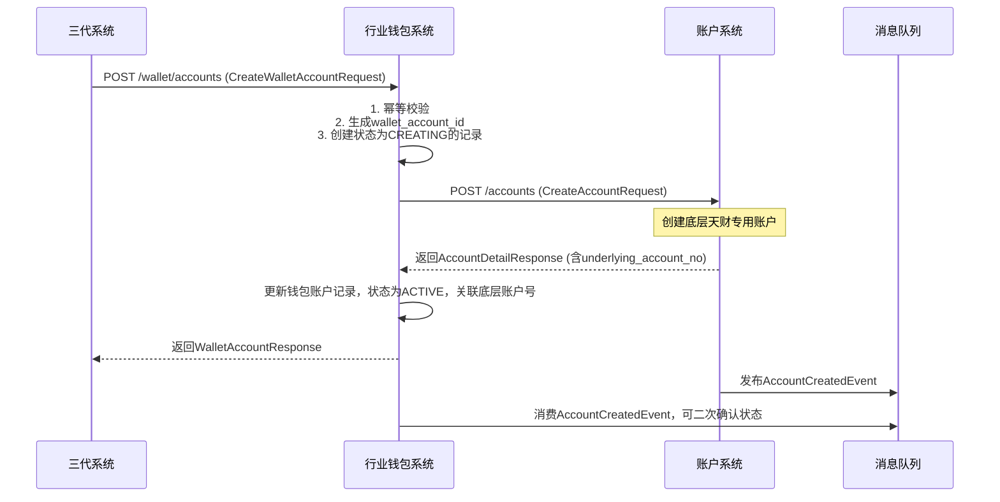
```mermaid
sequenceDiagram
    participant C as 三代系统
    participant W as 行业钱包系统
    participant A as 账户系统
    participant MQ as 消息队列

    C->>W: POST /wallet/accounts (CreateWalletAccountRequest)
    W->>W: 1. 幂等校验<br>2. 生成wallet_account_id<br>3. 创建状态为CREATING的记录
    W->>A: POST /accounts (CreateAccountRequest)
    Note over A: 创建底层天财专用账户
    A-->>W: 返回AccountDetailResponse (含underlying_account_no)
    W->>W: 更新钱包账户记录，状态为ACTIVE，关联底层账户号
    W-->>C: 返回WalletAccountResponse
    A->>MQ: 发布AccountCreatedEvent
    W->>MQ: 消费AccountCreatedEvent，可二次确认状态
```

### 5.2 分账指令执行与回调流程
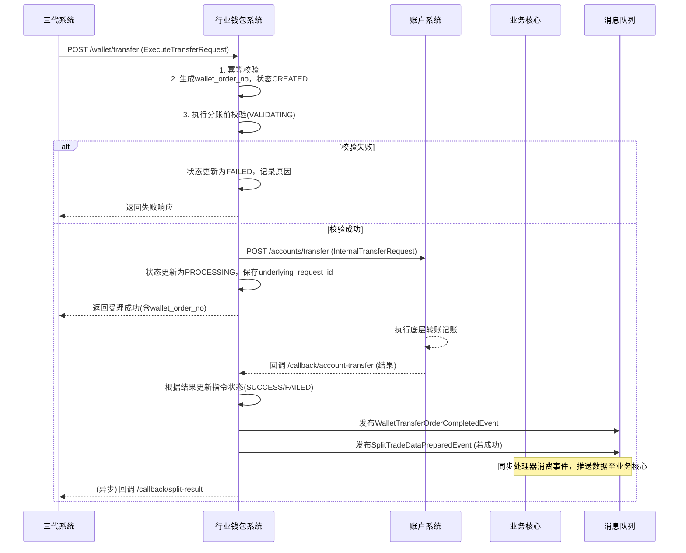
```mermaid
sequenceDiagram
    participant C as 三代系统
    participant W as 行业钱包系统
    participant A as 账户系统
    participant BC as 业务核心
    participant MQ as 消息队列

    C->>W: POST /wallet/transfer (ExecuteTransferRequest)
    W->>W: 1. 幂等校验<br>2. 生成wallet_order_no，状态CREATED
    W->>W: 3. 执行分账前校验(VALIDATING)
    alt 校验失败
        W->>W: 状态更新为FAILED，记录原因
        W-->>C: 返回失败响应
    else 校验成功
        W->>A: POST /accounts/transfer (InternalTransferRequest)
        W->>W: 状态更新为PROCESSING，保存underlying_request_id
        W-->>C: 返回受理成功(含wallet_order_no)
        A-->>A: 执行底层转账记账
        A-->>W: 回调 /callback/account-transfer (结果)
        W->>W: 根据结果更新指令状态(SUCCESS/FAILED)
        W->>MQ: 发布WalletTransferOrderCompletedEvent
        W->>MQ: 发布SplitTradeDataPreparedEvent (若成功)
        Note over MQ,BC: 同步处理器消费事件，推送数据至业务核心
        W-->>C: (异步) 回调 /callback/split-result
    end
```

### 5.3 绑定关系校验流程（分账前置）
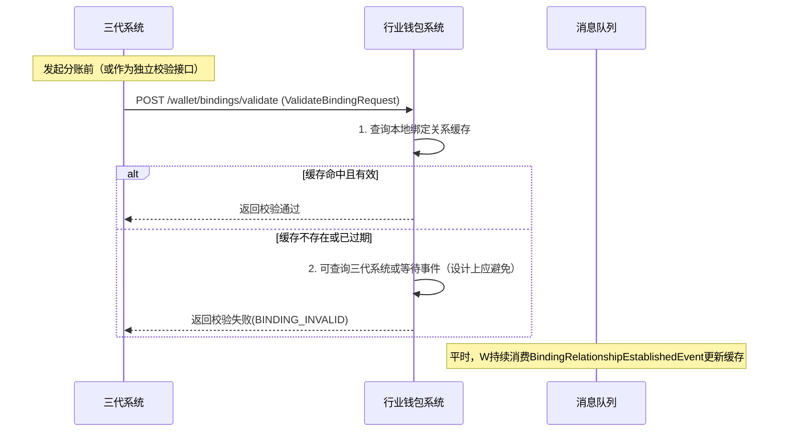
```mermaid
sequenceDiagram
    participant C as 三代系统
    participant W as 行业钱包系统
    participant MQ as 消息队列

    Note over C: 发起分账前（或作为独立校验接口）
    C->>W: POST /wallet/bindings/validate (ValidateBindingRequest)
    W->>W: 1. 查询本地绑定关系缓存
    alt 缓存命中且有效
        W-->>C: 返回校验通过
    else 缓存不存在或已过期
        W->>W: 2. 可查询三代系统或等待事件（设计上应避免）
        W-->>C: 返回校验失败(BINDING_INVALID)
    end
    Note over MQ: 平时，W持续消费BindingRelationshipEstablishedEvent更新缓存
```

## 6. 错误处理

### 6.1 预期错误及HTTP状态码
- **400 Bad Request**：请求参数缺失、格式错误。
- **404 Not Found**：钱包账户或分账指令不存在。
- **409 Conflict**：
    - `DUPLICATE_REQUEST_ID` / `DUPLICATE_BIZ_ORDER_NO`：请求重复。
    - `BINDING_INVALID`：绑定关系无效或过期。
    - `PAYER_PERMISSION_DENIED`：付方无付款权限。
- **422 Unprocessable Entity**：
    - `ACCOUNT_STATUS_INVALID`：付方或收方账户状态异常。
    - `ACCOUNT_TYPE_MISMATCH`：账户类型与业务场景不匹配。
    - `INSUFFICIENT_BALANCE`：付方余额不足（通常由账户系统返回后转换）。
- **502 Bad Gateway**：调用账户系统超时或返回不可用状态。
- **500 Internal Server Error**：系统内部错误。

### 6.2 处理策略
- **同步调用错误**：
    - 调用账户系统开户或转账时，采用有限次数重试（如3次），重试间隔递增。
    - 重试失败后，更新业务状态为失败，并记录详细错误信息。对于开户，钱包账户状态为`CREATING_FAILED`；对于分账，指令状态为`FAILED`。
- **异步回调缺失**：
    - 设置定时任务，扫描长时间处于`PROCESSING`状态的分账指令（如超过5分钟）。
    - 调用账户系统的查询接口（需账户系统提供），或通过`underlying_request_id`主动查询，根据查询结果更新本地状态。
- **数据同步失败**：
    - 同步业务核心失败时，记录于`split_trade_sync_record`，由重试机制处理。
    - 达到最大重试次数后告警，需人工排查业务核心接口或网络问题。
- **状态一致性保障**：
    - 通过消费`AccountStatusChangedEvent`等事件，定期比对钱包账户与底层账户状态，发现不一致时告警。
    - 关键状态变更（如`SUCCESS`）需记录操作日志，便于审计和问题追溯。

## 7. 依赖说明

### 7.1 上游模块交互（调用方）
1. **三代系统**：
    - **调用关系**：**同步RPC调用（HTTP REST）**。
    - **关键接口**：`POST /wallet/accounts`, `POST /wallet/transfer`。
    - **交互要点**：
        - 三代系统是业务的发起方，需携带完整的业务上下文。
        - 本模块需对三代系统的请求做严格幂等和业务校验。
        - 分账执行为异步模式，需立即返回受理结果，并通过回调通知三代系统最终结果。

### 7.2 下游模块交互（被调用方/消费事件）
1. **账户系统**：
    - **调用关系**：**同步RPC调用（HTTP REST）**。
    - **关键接口**：`POST /accounts`, `POST /accounts/transfer`。
    - **交互要点**：
        - 本模块是账户系统的主要调用方之一，调用需保证`requestId`全局唯一。
        - 必须妥善处理账户系统返回的业务错误（如余额不足）和系统错误（超时），并转换为上层业务语义。
        - 依赖账户系统的异步回调来最终确定分账结果，需实现可靠的回调处理接口。

2. **业务核心**：
    - **调用关系**：**异步消息驱动 + 可选同步接口调用**。
    - **关键接口**：`POST /wallet/sync/split-trade` (内部)。
    - **交互要点**：
        - 通过发布`SplitTradeDataPreparedEvent`事件触发同步流程。
        - 同步处理器调用业务核心提供的接口推送数据，需处理失败重试。
        - 目标是确保每一笔成功的分账，在业务核心都有对应的交易流水记录。

3. **消息队列 (MQ)**：
    - **交互关系**：**发布与订阅**。
    - **消费事件**：`BindingRelationshipEstablishedEvent`, `AccountCreatedEvent`, `AccountStatusChangedEvent`。
    - **发布事件**：`WalletTransferOrderCompletedEvent`, `SplitTradeDataPreparedEvent`。
    - **交互要点**：确保消息的可靠投递与消费的幂等性。

### 7.3 内部依赖
- **数据库**：MySQL集群，存储所有钱包层业务数据，要求高可用和事务支持（用于创建指令、更新状态）。
- **缓存**：Redis集群，用于缓存热点账户信息、有效的绑定关系、以及`requestId`幂等校验结果，提升校验性能。
- **配置中心**：管理下游系统（账户系统、业务核心）的接口地址、超时时间、重试策略、开关配置等。

**文档版本**：1.0  
**最后更新**：2023-10-27  
**设计者**：软件架构师

## 3.7 清结算系统


# 清结算系统模块设计文档

## 1. 概述

### 1.1 目的
本模块是支付平台的资金处理中枢，负责为“天财商龙”业务场景提供交易资金的**清算、结算、计费以及退货资金处理**服务。它确保收单交易资金能够按照商户配置（主动/被动结算）准确、及时地流入指定的天财专用账户，并为分账业务提供手续费计算支持。

### 1.2 范围
- **资金结算**：根据商户配置，将“01待结算账户”中的交易资金，结算至商户指定的收款账户（如天财收款账户）或保留在待结算账户中（被动结算）。
- **退货资金处理**：处理从天财收款账户发起的退货请求，联动“04退货账户”完成资金扣款与返还。
- **计费处理**：接收并执行分账交易的手续费计算与扣划。
- **配置管理**：接收并管理商户的结算模式（主动/被动）与结算账户配置。
- **对账支持**：为对账单系统提供结算、退货、计费相关的动账明细数据。

### 1.3 非范围
- 商户进件与账户开立（由三代系统、行业钱包系统、账户系统处理）。
- 分账业务逻辑与指令执行（由行业钱包系统处理）。
- 电子协议签署与身份认证（由电子签约平台处理）。
- 底层账户的资金记账操作（由账户系统执行）。

## 2. 接口设计

### 2.1 REST API 端点（内部调用）

#### 2.1.1 结算配置管理
- **PUT /internal/api/v1/settlement/config**：更新商户结算配置（由三代系统调用）
    - **请求体**：`UpdateSettlementConfigRequest`
    - **响应**：`BaseResponse`
- **GET /internal/api/v1/settlement/config/{merchantNo}**：查询商户结算配置
    - **响应**：`SettlementConfigResponse`

#### 2.1.2 资金结算触发
- **POST /internal/api/v1/settlement/execute**：执行指定批次或商户的结算（可由定时任务或手动触发）
    - **请求体**：`ExecuteSettlementRequest`
    - **响应**：`ExecuteSettlementResponse`

#### 2.1.3 退货处理
- **POST /internal/api/v1/refund/process**：处理从天财收款账户发起的退货（由业务核心或退货网关调用）
    - **请求体**：`ProcessRefundRequest`
    - **响应**：`ProcessRefundResponse`

#### 2.1.4 计费触发
- **POST /internal/api/v1/fee/calculate**：计算并扣划分账交易手续费（由行业钱包系统在分账成功后异步调用）
    - **请求体**：`CalculateFeeRequest`
    - **响应**：`CalculateFeeResponse`

### 2.2 数据结构

```json
// UpdateSettlementConfigRequest (来自三代系统)
{
  "requestId": "SETTLE_CFG_REQ_001",
  "merchantNo": "M100001",
  "settlementMode": "ACTIVE", // ACTIVE, PASSIVE
  "settlementAccountNo": "ACC202310270001", // 当mode=ACTIVE时，指定结算至哪个天财收款账户
  "effectiveTime": "2023-11-01T00:00:00Z" // 配置生效时间
}

// SettlementConfigResponse
{
  "merchantNo": "M100001",
  "settlementMode": "ACTIVE",
  "settlementAccountNo": "ACC202310270001",
  "status": "VALID", // VALID, INVALID
  "effectiveTime": "2023-11-01T00:00:00Z",
  "createTime": "2023-10-27T10:05:00Z"
}

// ExecuteSettlementRequest
{
  "requestId": "SETTLE_EXEC_REQ_001",
  "batchNo": "BATCH20231027", // 结算批次号
  "merchantNoList": ["M100001", "M100002"], // 指定商户，为空则处理所有待结算商户
  "settleDate": "2023-10-26", // 结算日期（T-1）
  "triggerType": "SCHEDULED" // SCHEDULED(定时), MANUAL(手动)
}

// ProcessRefundRequest
{
  "requestId": "REFUND_REQ_001",
  "refundOrderNo": "REF202310270001",
  "originalOrderNo": "PAY202310260001",
  "merchantNo": "M100001",
  "accountNo": "ACC202310270001", // 发起退货的天财收款账户
  "refundAmount": "100.00",
  "currency": "CNY",
  "reason": "商品质量问题"
}

// CalculateFeeRequest (来自行业钱包系统)
{
  "requestId": "FEE_CALC_REQ_001",
  "bizOrderNo": "SPLIT202310270001", // 分账指令号
  "bizType": "COLLECTION", // 业务类型
  "payerMerchantNo": "M100001",
  "payerAccountNo": "ACC202310270001",
  "receiverMerchantNo": "M100000",
  "receiverAccountNo": "ACC202310270002",
  "splitAmount": "10000.00",
  "currency": "CNY",
  "splitTime": "2023-10-27T14:30:00Z"
}
```

### 2.3 发布的事件
清结算系统作为事件生产者，发布以下领域事件：

- **SettlementCompletedEvent**：一批次或一个商户的结算任务完成。
    ```json
    {
      "eventId": "EVT_SETTLE_COMP_001",
      "eventType": "SETTLEMENT_COMPLETED",
      "timestamp": "2023-10-27T02:05:00Z",
      "data": {
        "batchNo": "BATCH20231027",
        "settleDate": "2023-10-26",
        "merchantNo": "M100001",
        "settlementMode": "ACTIVE",
        "settledAmount": "150000.00",
        "settlementAccountNo": "ACC202310270001",
        "feeAmount": "150.00",
        "status": "SUCCESS" // SUCCESS, PARTIAL_SUCCESS, FAILED
      }
    }
    ```
- **RefundProcessedEvent**：退货处理完成。
- **FeeCalculatedEvent**：手续费计算并扣划完成。

### 2.4 消费的事件
清结算系统作为事件消费者，订阅以下事件以触发或关联业务：

- **TradeSettledEvent** (来自业务核心)：交易已清算完成，资金进入“01待结算账户”，可触发结算。
- **TiancaiAccountConfiguredEvent** (来自三代系统)：感知新开通的天财商户及账户，用于初始化配置。

## 3. 数据模型

### 3.1 核心表设计

#### 表：`settlement_config` (商户结算配置表)
| 字段名 | 类型 | 必填 | 描述 | 索引 |
|--------|------|------|------|------|
| id | bigint(20) | Y | 自增主键 | PK |
| merchant_no | varchar(32) | Y | 商户号 | UK |
| settlement_mode | varchar(16) | Y | 结算模式：ACTIVE, PASSIVE | |
| settlement_account_no | varchar(32) | N | 结算账户号（当mode=ACTIVE时必填） | IDX |
| status | varchar(16) | Y | 状态：VALID, INVALID | |
| effective_time | datetime | Y | 生效时间 | IDX |
| create_time | datetime | Y | 创建时间 | |
| update_time | datetime | Y | 更新时间 | |

#### 表：`settlement_task` (结算任务表)
| 字段名 | 类型 | 必填 | 描述 | 索引 |
|--------|------|------|------|------|
| id | bigint(20) | Y | 自增主键 | PK |
| batch_no | varchar(32) | Y | 结算批次号 | IDX |
| task_no | varchar(32) | Y | 结算任务号（批次内唯一） | UK |
| merchant_no | varchar(32) | Y | 商户号 | IDX |
| settle_date | date | Y | 结算日期（T-1） | IDX |
| settlement_mode | varchar(16) | Y | 结算模式 | |
| total_amount | decimal(15,2) | Y | 应结算总金额 | |
| fee_amount | decimal(15,2) | Y | 手续费金额 | |
| settled_amount | decimal(15,2) | Y | 实际结算金额 | |
| settlement_account_no | varchar(32) | N | 结算账户号 | |
| status | varchar(16) | Y | 状态：PENDING, PROCESSING, SUCCESS, FAILED | IDX |
| detail_count | int | Y | 关联的动账明细条数 | |
| start_time | datetime | N | 处理开始时间 | |
| end_time | datetime | N | 处理完成时间 | |
| error_msg | varchar(512) | N | 失败原因 | |
| create_time | datetime | Y | 创建时间 | IDX |

#### 表：`settlement_detail` (结算动账明细表)
| 字段名 | 类型 | 必填 | 描述 | 索引 |
|--------|------|------|------|------|
| id | bigint(20) | Y | 自增主键 | PK |
| task_no | varchar(32) | Y | 所属结算任务号 | IDX |
| merchant_no | varchar(32) | Y | 商户号 | IDX |
| trade_no | varchar(32) | Y | 原交易订单号 | IDX |
| trade_amount | decimal(15,2) | Y | 交易金额 | |
| settle_amount | decimal(15,2) | Y | 结算金额 | |
| fee_amount | decimal(15,2) | Y | 手续费金额 | |
| settle_date | date | Y | 结算日期 | IDX |
| account_transaction_no | varchar(32) | Y | 关联的账户系统流水号 | UK |
| status | varchar(16) | Y | 状态：PENDING, SETTLED, FAILED | |
| create_time | datetime | Y | 创建时间 | |

#### 表：`refund_order` (退货订单表)
| 字段名 | 类型 | 必填 | 描述 | 索引 |
|--------|------|------|------|------|
| id | bigint(20) | Y | 自增主键 | PK |
| refund_order_no | varchar(32) | Y | 退货订单号 | UK |
| original_order_no | varchar(32) | Y | 原支付订单号 | IDX |
| merchant_no | varchar(32) | Y | 商户号 | IDX |
| account_no | varchar(32) | Y | 发起退货的天财收款账户 | IDX |
| refund_amount | decimal(15,2) | Y | 退货金额 | |
| currency | char(3) | Y | 币种 | |
| status | varchar(16) | Y | 状态：CREATED, PROCESSING, SUCCESS, FAILED | IDX |
| refund_account_transaction_no | varchar(32) | N | 退货资金扣款流水号 | |
| return_account_transaction_no | varchar(32) | N | 资金返还给用户的流水号 | |
| fail_reason | varchar(256) | N | 失败原因 | |
| create_time | datetime | Y | 创建时间 | IDX |
| update_time | datetime | Y | 更新时间 | |

#### 表：`fee_order` (手续费订单表)
| 字段名 | 类型 | 必填 | 描述 | 索引 |
|--------|------|------|------|------|
| id | bigint(20) | Y | 自增主键 | PK |
| fee_order_no | varchar(32) | Y | 手续费订单号 | UK |
| biz_order_no | varchar(32) | Y | 业务订单号（分账指令号） | UK |
| biz_type | varchar(32) | Y | 业务类型 | IDX |
| payer_merchant_no | varchar(32) | Y | 付方商户号 | IDX |
| payer_account_no | varchar(32) | Y | 付方账户号 | |
| fee_amount | decimal(15,2) | Y | 手续费金额 | |
| currency | char(3) | Y | 币种 | |
| account_transaction_no | varchar(32) | N | 手续费扣款流水号 | |
| status | varchar(16) | Y | 状态：PENDING, SUCCESS, FAILED, WAIVED | IDX |
| calculate_time | datetime | Y | 计算时间 | |
| create_time | datetime | Y | 创建时间 | IDX |

### 3.2 与其他模块的关系
- **三代系统**：**配置提供方**。接收三代系统同步的商户结算模式与结算账户配置，是结算执行的依据。
- **账户系统**：**资金操作执行方**。调用账户系统的转账接口，完成从“01待结算账户”到天财收款账户的资金划转，以及退货、手续费扣划等操作。
- **行业钱包系统**：**计费触发方**。接收行业钱包系统的计费请求，计算分账手续费。
- **业务核心**：**数据源与触发源**。消费业务核心的`TradeSettledEvent`，感知可结算的交易；接收来自业务核心或退货网关的退货请求。
- **计费中台**：**费率服务依赖**。调用计费中台获取费率并计算手续费（或由计费中台计算后返回结果）。费率基础数据由三代系统配置后同步至计费中台。
- **对账单系统**：**数据提供方**。`settlement_detail`, `refund_order`, `fee_order` 表的数据是对账单系统生成“机构层级动账明细”和“天财分账指令账单”的重要数据源。

## 4. 业务逻辑

### 4.1 核心算法
- **结算批次号生成**：`BATCH` + `结算日期(YYYYMMDD)` + `2位序列号` (如 `BATCH2023102701`)。
- **结算任务号生成**：`ST` + `结算日期(YYYYMMDD)` + `商户号后6位` + `4位序列号`。
- **退货订单号生成**：`REF` + `年月日` + `6位序列号`。
- **手续费订单号生成**：`FEE` + `年月日` + `6位序列号`。
- **结算执行**：采用“任务分片”机制。每个结算批次(`batch_no`)下，为每个符合条件的商户创建一个结算任务(`task_no`)，并行处理，提高效率。

### 4.2 业务规则
1. **结算规则**：
    - **主动结算 (ACTIVE)**：定时（如T+1日凌晨）扫描`settlement_config`中状态为`VALID`且模式为`ACTIVE`的商户，将其在“01待结算账户”中`settle_date`为T-1的交易资金，扣除手续费后，结算至配置的`settlement_account_no`（天财收款账户）。
    - **被动结算 (PASSIVE)**：资金保留在“01待结算账户”中，不清算系统不执行自动划转，由商户手动发起提款。
    - 结算前需通过账户系统校验目标天财收款账户状态为`ACTIVE`。

2. **退货规则**：
    - 仅支持从天财收款账户(`TIANCAI_COLLECT`)发起退货。
    - 退货时，先从发起退货的天财收款账户扣减相应金额至“04退货账户”，然后由“04退货账户”将资金返还给用户原支付账户。
    - 需校验天财收款账户的可用余额是否充足。

3. **计费规则**：
    - 分账交易产生手续费，由付方承担。
    - 费率信息由三代系统配置，并同步至计费中台。清结算系统调用计费中台计算具体金额。
    - 手续费从天财收款账户（付方）的可用余额中实时扣划。

### 4.3 验证逻辑
- **结算配置验证**：接收三代系统配置时，需校验指定的`settlement_account_no`是否存在、是否为天财收款账户、是否属于该商户。
- **结算执行验证**：执行每个结算任务前，复核商户配置是否仍有效、结算账户状态是否正常。
- **退货请求验证**：校验退货金额是否小于等于原订单金额、原订单是否已结算、天财收款账户状态和余额是否允许扣款。
- **计费请求验证**：校验业务订单号是否已计算过手续费（幂等）、付方账户信息是否有效。

## 5. 时序图

### 5.1 主动结算流程 (T+1日定时任务)
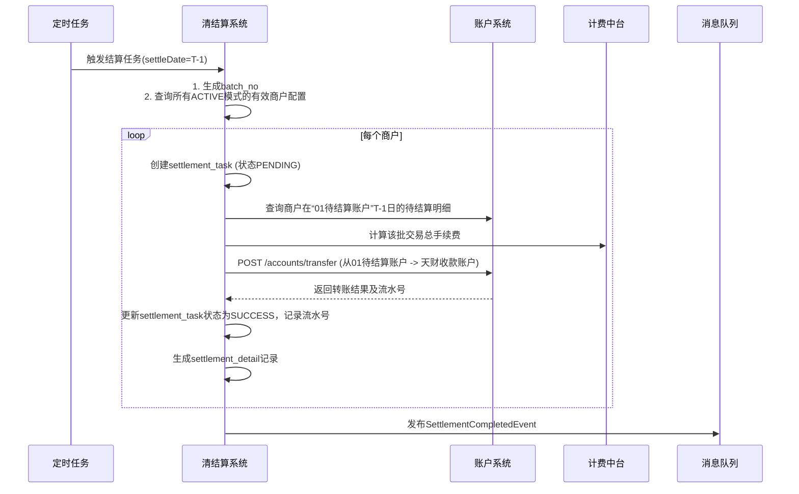
```mermaid
sequenceDiagram
    participant Scheduler as 定时任务
    participant S as 清结算系统
    participant A as 账户系统
    participant Fee as 计费中台
    participant MQ as 消息队列

    Scheduler->>S: 触发结算任务(settleDate=T-1)
    S->>S: 1. 生成batch_no<br>2. 查询所有ACTIVE模式的有效商户配置
    loop 每个商户
        S->>S: 创建settlement_task (状态PENDING)
        S->>A: 查询商户在“01待结算账户”T-1日的待结算明细
        S->>Fee: 计算该批交易总手续费
        S->>A: POST /accounts/transfer (从01待结算账户 -> 天财收款账户)
        A-->>S: 返回转账结果及流水号
        S->>S: 更新settlement_task状态为SUCCESS，记录流水号
        S->>S: 生成settlement_detail记录
    end
    S->>MQ: 发布SettlementCompletedEvent
```

### 5.2 天财账户退货流程
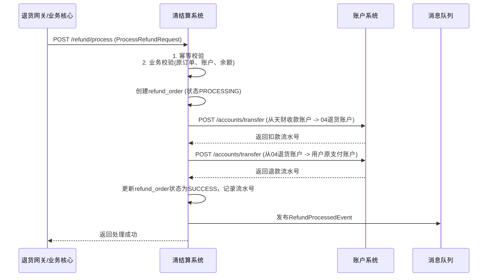
```mermaid
sequenceDiagram
    participant Gateway as 退货网关/业务核心
    participant S as 清结算系统
    participant A as 账户系统
    participant MQ as 消息队列

    Gateway->>S: POST /refund/process (ProcessRefundRequest)
    S->>S: 1. 幂等校验<br>2. 业务校验(原订单、账户、余额)
    S->>S: 创建refund_order (状态PROCESSING)
    S->>A: POST /accounts/transfer (从天财收款账户 -> 04退货账户)
    A-->>S: 返回扣款流水号
    S->>A: POST /accounts/transfer (从04退货账户 -> 用户原支付账户)
    A-->>S: 返回退款流水号
    S->>S: 更新refund_order状态为SUCCESS，记录流水号
    S->>MQ: 发布RefundProcessedEvent
    S-->>Gateway: 返回处理成功
```

### 5.3 分账手续费计算流程
```mermaid
sequenceDiagram
    participant W as 行业钱包系统
    participant S as 清结算系统
    participant Fee as 计费中台
    participant A as 账户系统
    participant MQ as 消息队列

    W->>S: POST /fee/calculate (CalculateFeeRequest)
    S->>S: 幂等校验，防止重复计费
    S->>Fee: 查询费率并计算手续费金额
    Fee-->>S: 返回feeAmount
    S->>S: 创建fee_order (状态PENDING)
    S->>A: POST /accounts/transfer (从天财收款账户 -> 内部手续费收入账户)
    A-->>S: 返回扣款流水号
    S->>S: 更新fee_order状态为SUCCESS
    S->>MQ: 发布FeeCalculatedEvent
    S-->>W: 返回计费成功
```

## 6. 错误处理

### 6.1 预期错误及HTTP状态码
- **400 Bad Request**：请求参数错误、格式无效。
- **404 Not Found**：商户结算配置、原交易订单不存在。
- **409 Conflict**：
    - `DUPLICATE_REQUEST_ID`：重复请求。
    - `SETTLEMENT_CONFIG_INVALID`：结算配置无效或已过期。
- **422 Unprocessable Entity**：
    - `INSUFFICIENT_BALANCE`：账户余额不足（退货或手续费扣划时）。
    - `ACCOUNT_STATUS_INVALID`：账户状态异常（冻结、注销）。
    - `ORIGINAL_ORDER_NOT_SETTLED`：原订单未结算，不能退货。
- **502 Bad Gateway**：调用账户系统、计费中台超时或失败。
- **500 Internal Server Error**：系统内部错误。

### 6.2 处理策略
- **结算任务失败**：单个商户结算任务失败（如账户异常），记录错误原因，任务状态置为`FAILED`，不影响批次内其他任务。触发告警，并生成差错处理工单。
- **异步调用重试**：对于调用账户系统、计费中台等外部依赖，采用指数退避策略进行重试（如3次）。重试失败后，业务订单（结算、退货、计费）状态置为`FAILED`。
- **数据一致性**：结算、退货涉及多账户划转，必须在一个本地事务中更新`refund_order`状态和记录流水号，但账户操作本身依赖外部系统。采用“本地事务+异步校对”机制，通过定时任务核对本地订单状态与账户流水状态，发现不一致时告警并支持人工干预。
- **监控与告警**：对定时结算任务的执行时长、成功率、下游系统调用延迟及错误率进行监控。

## 7. 依赖说明

### 7.1 上游模块交互（调用方）
1. **三代系统**：
    - **调用关系**：**同步RPC调用**（配置接收）。
    - **关键接口**：`PUT /internal/api/v1/settlement/config`。
    - **交互要点**：接收商户的结算模式与账户配置，作为结算执行的唯一依据。需验证配置的合法性。

2. **行业钱包系统**：
    - **调用关系**：**同步RPC调用**（计费触发）。
    - **关键接口**：`POST /internal/api/v1/fee/calculate`。
    - **交互要点**：接收分账完成后的计费请求，需实现幂等处理，防止因网络重试导致重复扣费。

3. **业务核心/退货网关**：
    - **调用关系**：**同步RPC调用**（退货处理）。
    - **关键接口**：`POST /internal/api/v1/refund/process`。
    - **交互要点**：处理从天财收款账户发起的退货，需严格校验业务规则。

### 7.2 下游模块交互（被调用/消费事件）
1. **账户系统**：
    - **调用关系**：**同步RPC调用**（资金操作）。
    - **关键接口**：`POST /api/v1/accounts/transfer`。
    - **交互要点**：所有资金划转（结算、退货、手续费扣划）的最终执行者。必须处理其返回的各类业务错误（如余额不足）和系统错误。

2. **计费中台**：
    - **调用关系**：**同步RPC调用**（费率计算）。
    - **关键接口**：计费计算接口。
    - **交互要点**：获取分账业务的费率并计算手续费。需处理服务降级，在计费中台不可用时，可采用默认费率或记录日志后人工处理。

3. **业务核心**：
    - **消费事件**：`TradeSettledEvent`。
    - **交互要点**：监听交易清算完成事件，作为触发T+1日结算的源头之一（另一种是定时扫描）。

### 7.3 内部依赖
- **数据库**：MySQL集群，存储结算配置、任务、明细、退货及手续费订单，要求高可用。
- **缓存**：Redis集群，用于缓存商户结算配置、热点查询、以及`requestId`幂等校验。
- **消息中间件**：Kafka/RocketMQ，用于发布业务事件和消费上游事件。
- **定时任务调度**：分布式调度框架（如XXL-Job），用于触发每日定时结算任务。

**文档版本**：1.0  
**最后更新**：2023-10-27  
**设计者**：软件架构师

## 3.8 计费中台


# 计费中台模块设计文档

## 1. 概述

### 1.1 目的
本模块是“天财商龙”分账业务的**独立计费服务核心**。它负责精确计算分账交易（归集、批量付款、会员结算）产生的手续费，并提供灵活的计费策略管理能力。计费中台与清结算系统紧密协作，接收费率配置，在分账指令执行时进行实时或异步计费，确保手续费计算的准确性、一致性和可追溯性。

### 1.2 范围
- **费率配置管理**：接收并存储从三代系统同步的商户/业务维度的分账手续费费率配置。
- **实时计费计算**：在分账指令执行时，根据业务类型、参与方、金额等信息，实时计算应收手续费。
- **计费指令生成与执行**：生成独立的计费指令，并调用清结算系统完成实际的手续费扣划（从指定账户扣款）。
- **计费结果同步**：将计费结果（成功/失败）同步回业务发起方（三代系统/行业钱包系统），并更新分账指令的计费状态。
- **计费对账与查询**：提供计费记录查询、对账文件生成能力，支持财务核对。
- **计费规则引擎**：支持基于多层条件（商户、业务类型、金额区间、时间等）的复杂费率规则匹配。

### 1.3 非范围
- 商户费率的商业定价与配置（由三代系统负责）。
- 底层账户的资金扣划操作（由清结算系统执行）。
- 分账交易的核心资金流转（由行业钱包系统和账户系统处理）。
- 面向商户的账单展示与发布（由对账单系统处理）。

## 2. 接口设计

### 2.1 REST API 端点

#### 2.1.1 计费执行
- **POST /api/v1/fee/calculate-and-charge**：计算并执行手续费扣划（主要入口）
    - **请求体**：`FeeCalculateRequest`
    - **响应**：`FeeCalculateResponse`（包含计费流水号，结果异步返回）
- **GET /api/v1/fee/orders/{feeOrderNo}**：查询计费指令状态
    - **响应**：`FeeOrderDetailResponse`
- **POST /api/v1/fee/orders/{feeOrderNo}/retry**：重试失败的计费指令
    - **响应**：`BaseResponse`

#### 2.1.2 费率配置查询（供内部校验使用）
- **GET /api/v1/fee/configs**：查询生效的费率配置
    - **查询参数**：`merchantNo`, `bizType`, `effectiveDate`
    - **响应**：`List<FeeConfigResponse>`

#### 2.1.3 对账与查询
- **GET /api/v1/fee/orders**：分页查询计费指令
    - **查询参数**：`merchantNo`, `bizType`, `status`, `startTime`, `endTime`, `page`, `size`
    - **响应**：`PageResponse<FeeOrderSimpleResponse>`
- **GET /api/v1/fee/reconciliation/{date}**：生成指定日期的计费对账文件
    - **响应**：`ReconciliationResponse`（包含文件下载链接）

### 2.2 内部接口（供上下游系统调用/回调）

- **POST /internal/api/v1/fee/callback/charge-result**：清结算系统回调手续费扣划结果
    - **请求体**：`ChargeResultCallbackRequest`
    - **响应**：`BaseResponse`
- **POST /internal/api/v1/fee/sync/config**：接收从三代系统同步的费率配置（变更时触发）
    - **请求体**：`FeeConfigSyncRequest`
    - **响应**：`BaseResponse`

### 2.3 数据结构

```json
// FeeCalculateRequest - 计费请求
{
  "requestId": "FEE_CALC_REQ_001",
  "sourceSystem": "WALLET", // 请求来源系统: WALLET(行业钱包), CORE(三代核心)
  "sourceOrderNo": "SPLIT20231027000001", // 来源业务订单号（分账指令号）
  "bizType": "COLLECTION", // COLLECTION, BATCH_PAYMENT, MEMBER_SETTLE
  "payerMerchantNo": "M100001",
  "payerAccountNo": "ACC_STORE_001",
  "receiverMerchantNo": "M100000",
  "receiverAccountNo": "ACC_HQ_001",
  "amount": "10000.00", // 分账金额
  "currency": "CNY",
  "chargeParty": "PAYER", // 手续费承担方: PAYER(付方), RECEIVER(收方), SHARED(双方分摊)
  "sharedRatio": "0.5", // 当chargeParty=SHARED时，付方承担比例（0-1）
  "extInfo": {
    "originalTradeNo": "T202310270001", // 原始交易号（如有）
    "storeRegion": "BEIJING" // 门店区域等扩展信息，用于规则匹配
  }
}

// FeeCalculateResponse - 计费响应
{
  "success": true,
  "code": "SUCCESS",
  "message": "计费请求已受理",
  "data": {
    "feeOrderNo": "FEE20231027000001", // 计费指令号
    "status": "PROCESSING", // 初始状态
    "estimatedFee": "5.00", // 预估手续费（基于缓存费率）
    "estimatedFeeCurrency": "CNY"
  }
}

// FeeOrderDetailResponse - 计费指令详情
{
  "feeOrderNo": "FEE20231027000001",
  "sourceOrderNo": "SPLIT20231027000001",
  "bizType": "COLLECTION",
  "payerMerchantNo": "M100001",
  "receiverMerchantNo": "M100000",
  "amount": "10000.00",
  "currency": "CNY",
  "calculatedFee": "5.00", // 实际计算的手续费
  "feeCurrency": "CNY",
  "chargeParty": "PAYER",
  "sharedRatio": null,
  "feeConfigId": "FC_001", // 匹配到的费率配置ID
  "feeRate": "0.0005", // 实际应用的费率
  "feeRateType": "RATIO", // RATIO(比例), FIXED(固定额), TIERED(阶梯)
  "status": "SUCCESS", // PROCESSING, SUCCESS, FAILED, PARTIAL_FAIL
  "chargeStatus": "CHARGED", // 扣费状态: PENDING, CHARGING, CHARGED, FAILED
  "chargeOrderNo": "CHARGE202310270001", // 清结算扣费订单号
  "failReason": null,
  "calculateTime": "2023-10-27T14:30:00Z",
  "chargeCompleteTime": "2023-10-27T14:30:05Z",
  "createTime": "2023-10-27T14:30:00Z"
}

// FeeConfigSyncRequest - 费率配置同步
{
  "eventId": "FEE_CONFIG_SYNC_001",
  "operation": "UPSERT", // UPSERT, DELETE
  "feeConfig": {
    "feeConfigId": "FC_001",
    "merchantNo": "M100000", // 为空表示全局默认
    "bizType": "COLLECTION",
    "feeRateType": "RATIO",
    "feeRate": "0.0005", // 比例费率
    "fixedAmount": null, // 固定金额
    "minFee": "0.01",
    "maxFee": "100.00",
    "chargeParty": "PAYER",
    "sharedRatio": null,
    "effectiveDate": "2023-11-01",
    "expiryDate": "2024-10-31",
    "priority": 10, // 优先级，数字越大优先级越高
    "conditions": [ // 条件列表，全部满足时生效
      {
        "field": "amount",
        "operator": "GE",
        "value": "1000.00"
      },
      {
        "field": "storeRegion",
        "operator": "IN",
        "value": "BEIJING,SHANGHAI"
      }
    ],
    "status": "ACTIVE" // ACTIVE, INACTIVE
  }
}

// ChargeResultCallbackRequest - 扣费结果回调
{
  "chargeOrderNo": "CHARGE202310270001",
  "feeOrderNo": "FEE20231027000001",
  "status": "SUCCESS", // SUCCESS, FAILED
  "actualDeductAmount": "5.00", // 实际扣划金额
  "actualDeductCurrency": "CNY",
  "deductAccountNo": "ACC_STORE_001", // 实际扣款账户
  "deductTime": "2023-10-27T14:30:05Z",
  "failReason": "余额不足",
  "callbackTime": "2023-10-27T14:30:06Z"
}
```

### 2.4 发布的事件
计费中台作为事件生产者，发布以下领域事件：

- **FeeCalculatedEvent**：手续费计算完成（扣费前）。
    ```json
    {
      "eventId": "EVT_FEE_CALC_001",
      "eventType": "FEE_CALCULATED",
      "timestamp": "2023-10-27T14:30:01Z",
      "data": {
        "feeOrderNo": "FEE20231027000001",
        "sourceOrderNo": "SPLIT20231027000001",
        "bizType": "COLLECTION",
        "payerMerchantNo": "M100001",
        "receiverMerchantNo": "M100000",
        "amount": "10000.00",
        "calculatedFee": "5.00",
        "chargeParty": "PAYER",
        "feeConfigId": "FC_001"
      }
    }
    ```
- **FeeChargedEvent**：手续费扣划完成（成功/失败）。
- **FeeConfigUpdatedEvent**：费率配置变更（供其他系统感知）。

### 2.5 消费的事件
计费中台作为事件消费者，订阅以下事件以触发计费或更新状态：

- **SplitOrderCompletedEvent** (来自三代系统)：分账指令执行完成时，触发计费计算。
- **AccountStatusChangedEvent** (来自账户系统)：当手续费扣款账户状态异常时，更新计费指令状态。

## 3. 数据模型

### 3.1 核心表设计

#### 表：`fee_config` (费率配置表)
| 字段名 | 类型 | 必填 | 描述 | 索引 |
|--------|------|------|------|------|
| id | bigint(20) | Y | 自增主键 | PK |
| fee_config_id | varchar(32) | Y | 费率配置业务ID | UK |
| merchant_no | varchar(32) | N | 适用商户号，为空表示全局默认 | IDX |
| biz_type | varchar(32) | Y | 业务类型：COLLECTION, BATCH_PAYMENT, MEMBER_SETTLE | IDX |
| fee_rate_type | varchar(16) | Y | 费率类型：RATIO, FIXED, TIERED | |
| fee_rate | decimal(10,6) | N | 比例费率（如0.0005） | |
| fixed_amount | decimal(15,2) | N | 固定金额 | |
| min_fee | decimal(15,2) | Y | 最低手续费 | |
| max_fee | decimal(15,2) | Y | 最高手续费 | |
| charge_party | varchar(16) | Y | 承担方：PAYER, RECEIVER, SHARED | |
| shared_ratio | decimal(5,4) | N | 分摊比例（0-1，付方承担比例） | |
| effective_date | date | Y | 生效日期 | IDX |
| expiry_date | date | Y | 失效日期 | IDX |
| priority | int(11) | Y | 优先级 | |
| conditions | json | N | 生效条件（JSON数组） | |
| status | varchar(16) | Y | 状态：ACTIVE, INACTIVE | IDX |
| version | int(11) | Y | 版本号（乐观锁） | |
| create_time | datetime | Y | 创建时间 | |
| update_time | datetime | Y | 更新时间 | |
| operator | varchar(64) | Y | 最后操作人 | |

#### 表：`fee_order` (计费指令表)
| 字段名 | 类型 | 必填 | 描述 | 索引 |
|--------|------|------|------|------|
| id | bigint(20) | Y | 自增主键 | PK |
| fee_order_no | varchar(32) | Y | 计费指令号 | UK |
| request_id | varchar(64) | Y | 请求ID（幂等） | UK |
| source_system | varchar(16) | Y | 来源系统：WALLET, CORE | IDX |
| source_order_no | varchar(32) | Y | 来源业务订单号 | IDX |
| biz_type | varchar(32) | Y | 业务类型 | IDX |
| payer_merchant_no | varchar(32) | Y | 付方商户号 | IDX |
| payer_account_no | varchar(32) | Y | 付方账户号 | |
| receiver_merchant_no | varchar(32) | Y | 收方商户号 | IDX |
| receiver_account_no | varchar(32) | Y | 收方账户号 | |
| amount | decimal(15,2) | Y | 分账金额 | |
| currency | char(3) | Y | 币种 | |
| charge_party | varchar(16) | Y | 承担方 | |
| shared_ratio | decimal(5,4) | N | 分摊比例 | |
| calculated_fee | decimal(15,2) | N | 计算出的手续费 | |
| fee_currency | char(3) | Y | 手续费币种 | |
| fee_config_id | varchar(32) | N | 匹配的费率配置ID | IDX |
| fee_rate | decimal(10,6) | N | 实际费率 | |
| fee_rate_type | varchar(16) | N | 费率类型 | |
| status | varchar(16) | Y | 状态：PROCESSING, SUCCESS, FAILED, PARTIAL_FAIL | IDX |
| charge_status | varchar(16) | Y | 扣费状态：PENDING, CHARGING, CHARGED, FAILED | IDX |
| charge_order_no | varchar(32) | N | 清结算扣费订单号 | IDX |
| fail_reason | varchar(512) | N | 失败原因 | |
| ext_info | json | N | 扩展信息（原始请求中的extInfo） | |
| calculate_time | datetime | N | 计算时间 | |
| charge_complete_time | datetime | N | 扣费完成时间 | |
| retry_count | int(11) | Y | 重试次数 | |
| next_retry_time | datetime | N | 下次重试时间 | |
| create_time | datetime | Y | 创建时间 | IDX |
| update_time | datetime | Y | 更新时间 | |

#### 表：`fee_charge_detail` (手续费扣费明细表)
| 字段名 | 类型 | 必填 | 描述 | 索引 |
|--------|------|------|------|------|
| id | bigint(20) | Y | 自增主键 | PK |
| fee_order_no | varchar(32) | Y | 计费指令号 | IDX |
| charge_party | varchar(16) | Y | 承担方：PAYER, RECEIVER | IDX |
| deduct_account_no | varchar(32) | Y | 扣款账户号 | IDX |
| deduct_amount | decimal(15,2) | Y | 扣款金额 | |
| deduct_currency | char(3) | Y | 扣款币种 | |
| charge_order_no | varchar(32) | Y | 清结算扣费订单号 | UK |
| charge_status | varchar(16) | Y | 扣费状态 | |
| deduct_time | datetime | N | 扣款时间 | |
| fail_reason | varchar(512) | N | 失败原因 | |
| create_time | datetime | Y | 创建时间 | |
| update_time | datetime | Y | 更新时间 | |

#### 表：`fee_reconciliation` (计费对账表)
| 字段名 | 类型 | 必填 | 描述 | 索引 |
|--------|------|------|------|------|
| id | bigint(20) | Y | 自增主键 | PK |
| recon_date | date | Y | 对账日期 | UK |
| total_count | int(11) | Y | 总笔数 | |
| total_fee_amount | decimal(20,2) | Y | 总手续费金额 | |
| success_count | int(11) | Y | 成功笔数 | |
| failed_count | int(11) | Y | 失败笔数 | |
| file_path | varchar(512) | N | 对账文件存储路径 | |
| file_hash | varchar(128) | N | 文件哈希值 | |
| status | varchar(16) | Y | 状态：GENERATING, COMPLETED, FAILED | |
| complete_time | datetime | N | 完成时间 | |
| create_time | datetime | Y | 创建时间 | |
| update_time | datetime | Y | 更新时间 | |

### 3.2 与其他模块的关系
- **三代系统**：**配置提供方与事件发布方**。接收三代系统同步的费率配置；消费其发布的`SplitOrderCompletedEvent`触发计费。
- **行业钱包系统**：**直接调用方**。行业钱包在执行分账后，同步调用计费中台进行手续费计算。
- **清结算系统**：**服务调用方与回调接收方**。调用清结算执行实际手续费扣划；接收其扣划结果回调。
- **账户系统**：**事件消费者**。消费账户状态变更事件，用于判断扣款账户是否可用。
- **对账单系统**：**数据提供方**。提供计费明细数据，用于生成财务对账单。

## 4. 业务逻辑

### 4.1 核心算法

#### 4.1.1 费率匹配算法
```java
// 伪代码：为给定计费请求匹配最优费率配置
function matchFeeConfig(request) {
    configs = queryActiveConfigs(request.bizType, request.merchantNo, request.date);
    
    // 按优先级降序排序
    sortedConfigs = sortByPriorityDesc(configs);
    
    for config in sortedConfigs {
        // 检查商户匹配
        if (config.merchantNo != null && config.merchantNo != request.payerMerchantNo) {
            continue;
        }
        
        // 检查条件匹配
        if (!matchConditions(config.conditions, request)) {
            continue;
        }
        
        // 检查有效期
        if (request.date < config.effectiveDate || request.date > config.expiryDate) {
            continue;
        }
        
        return config; // 返回第一个完全匹配的配置
    }
    
    return getDefaultConfig(request.bizType); // 返回全局默认配置
}
```

#### 4.1.2 手续费计算算法
```java
function calculateFee(amount, feeConfig) {
    switch (feeConfig.feeRateType) {
        case "RATIO":
            fee = amount * feeConfig.feeRate;
            break;
        case "FIXED":
            fee = feeConfig.fixedAmount;
            break;
        case "TIERED":
            fee = calculateTieredFee(amount, feeConfig.tierRules);
            break;
        default:
            throw new UnsupportedFeeRateType();
    }
    
    // 应用上下限
    fee = max(fee, feeConfig.minFee);
    fee = min(fee, feeConfig.maxFee);
    
    return round(fee, 2); // 四舍五入到分
}
```

#### 4.1.3 计费指令号生成
- **计费指令号**：`FEE` + `年月日` + `6位序列号` (如 `FEE20231027000001`)。
- **扣费订单号**：`CHARGE` + `年月日` + `6位序列号`。

### 4.2 业务规则

1. **计费触发规则**：
    - 主要触发方式：行业钱包系统在分账执行成功后**同步调用**计费中台。
    - 备用触发方式：消费`SplitOrderCompletedEvent`事件，进行异步计费（确保最终一致性）。
    - 同一笔分账指令只应计费一次，通过`source_order_no` + `request_id`实现幂等。

2. **费率匹配规则**：
    - 费率配置按`优先级`排序，优先级数字越大越优先。
    - 匹配顺序：特定商户配置 > 全局默认配置。
    - 所有`conditions`必须全部满足，配置才生效。
    - 支持的条件运算符：`EQ`(等于), `NE`(不等于), `GT`(大于), `GE`(大于等于), `LT`(小于), `LE`(小于等于), `IN`(在集合中), `NOT_IN`(不在集合中)。

3. **手续费承担规则**：
    - `PAYER`：手续费从付方账户扣除。
    - `RECEIVER`：手续费从收方账户扣除。
    - `SHARED`：手续费由双方分摊，按`sharedRatio`比例从付方扣除，剩余部分从收方扣除。
    - 扣款账户必须为天财专用账户（收款账户或接收方账户）。

4. **重试与补偿规则**：
    - 计费计算失败：立即返回失败，不重试（通常为配置错误）。
    - 扣费调用失败：自动重试最多3次，每次间隔指数退避。
    - 最终扣费失败：将计费指令标记为`FAILED`，并发布`FeeChargedEvent`供业务方感知。

### 4.3 验证逻辑

1. **计费请求验证**：
    - 校验`requestId`幂等性。
    - 校验必填字段：`sourceOrderNo`, `bizType`, `payerMerchantNo`, `receiverMerchantNo`, `amount`。
    - 校验金额大于0。
    - 校验`chargeParty`和`sharedRatio`的合法性。

2. **费率配置验证**（同步时）：
    - 校验费率配置ID唯一性。
    - 校验费率类型与对应字段的匹配（如`RATIO`类型必须有`feeRate`）。
    - 校验`effectiveDate` <= `expiryDate`。
    - 校验`sharedRatio`在0-1之间（当`chargeParty=SHARED`时）。

3. **扣费前验证**：
    - 校验计费指令状态为`PROCESSING`。
    - 校验扣款账户状态正常（通过缓存或事件感知）。
    - 校验手续费金额大于0。

## 5. 时序图

### 5.1 分账后实时计费流程（主流程）
```mermaid
sequenceDiagram
    participant W as 行业钱包系统
    participant F as 计费中台
    participant S as 清结算系统
    participant A as 账户系统
    participant MQ as 消息队列
    participant C as 三代系统

    Note over W: 分账执行成功
    W->>F: POST /fee/calculate-and-charge (FeeCalculateRequest)
    F->>F: 1. 幂等校验(requestId)<br>2. 业务参数校验
    F->>F: 匹配费率配置(feeConfig)
    F->>F: 计算手续费金额
    F->>F: 生成fee_order_no，状态PROCESSING
    F->>MQ: 发布FeeCalculatedEvent
    F->>S: 请求手续费扣划(chargeOrderNo,账户,金额)
    S->>A: 执行账户扣款
    A-->>S: 返回扣款结果
    S-->>F: 回调 /callback/charge-result
    F->>F: 更新fee_order状态为SUCCESS/FAILED
    F->>MQ: 发布FeeChargedEvent
    F-->>W: 返回feeOrderNo（异步结果需查询）
    C->>MQ: 消费FeeChargedEvent，更新分账指令计费状态
```

### 5.2 费率配置同步流程
```mermaid
sequenceDiagram
    participant C as 三代系统
    participant F as 计费中台
    participant DB as 数据库
    participant MQ as 消息队列

    C->>F: POST /internal/fee/sync/config (FeeConfigSyncRequest)
    F->>F: 校验配置合法性
    alt operation=UPSERT
        F->>DB: 插入或更新fee_config记录
        F->>F: 刷新本地/缓存中的费率配置
        F->>MQ: 发布FeeConfigUpdatedEvent
    else operation=DELETE
        F->>DB: 标记配置为INACTIVE（软删除）
        F->>F: 清理相关缓存
        F->>MQ: 发布FeeConfigUpdatedEvent
    end
    F-->>C: 返回同步结果
```

### 5.3 计费指令重试流程（补偿机制）
```mermaid
sequenceDiagram
    participant Job as 定时任务
    participant F as 计费中台
    participant S as 清结算系统
    participant MQ as 消息队列

    Job->>F: 扫描状态为PROCESSING且超过30秒未完成的fee_order
    loop 每次重试
        F->>F: 检查重试次数<3且next_retry_time<=当前时间
        F->>S: 查询扣费订单状态(chargeOrderNo)
        alt 扣费成功
            S-->>F: 返回成功状态
            F->>F: 更新fee_order为SUCCESS
            F->>MQ: 发布FeeChargedEvent
        else 扣费失败可重试
            F->>F: 增加retry_count，计算next_retry_time
            F->>S: 重新发起扣费请求
        else 最终失败
            F->>F: 更新fee_order为FAILED
            F->>MQ: 发布FeeChargedEvent(失败)
        end
    end
```

## 6. 错误处理

### 6.1 预期错误及HTTP状态码

- **400 Bad Request**：
    - `INVALID_PARAMETER`：请求参数缺失或格式错误。
    - `INVALID_FEE_CONFIG`：费率配置不合法。
- **409 Conflict**：
    - `DUPLICATE_REQUEST_ID`：重复的计费请求。
- **422 Unprocessable Entity**：
    - `NO_AVAILABLE_FEE_CONFIG`：找不到适用的费率配置。
    - `INSUFFICIENT_BALANCE`：扣款账户余额不足（清结算返回）。
    - `ACCOUNT_STATUS_INVALID`：扣款账户状态异常。
- **424 Failed Dependency**：
    - `CHARGE_SYSTEM_UNAVAILABLE`：清结算系统不可用。
    - `CHARGE_REQUEST_FAILED`：扣费请求失败。
- **500 Internal Server Error**：系统内部错误。

### 6.2 处理策略

1. **同步调用错误处理**：
    - 对清结算系统的扣费调用，采用指数退避重试（最多3次）。
    - 重试失败后，将计费指令标记为`FAILED`，记录详细失败原因。
    - 提供手动重试接口，支持运营介入。

2. **异步一致性保障**：
    - 消费`SplitOrderCompletedEvent`时，需处理重复消费（幂等）。
    - 定期扫描`PROCESSING`状态超时的计费指令，触发主动查询或重试。
    - 与清结算系统对账，发现状态不一致时告警并生成工单。

3. **降级与熔断**：
    - 当清结算系统不可用时，进入降级模式：记录计费指令但暂不扣费，标记为`PENDING`，待系统恢复后由定时任务处理。
    - 配置熔断器，防止下游系统故障导致计费中台线程池耗尽。

4. **监控与告警**：
    - 监控关键指标：计费成功率、平均处理时长、费率缓存命中率、下游系统调用错误率。
    - 设置告警：连续计费失败、大量指令积压、费率配置缺失。

## 7. 依赖说明

### 7.1 上游模块交互（调用方）

1. **行业钱包系统**：
    - **调用关系**：**同步RPC调用**（主要入口）。
    - **关键交互**：接收分账后的计费请求，实时返回受理结果。
    - **交互要点**：
        - 需保证接口高性能（平均RT<100ms）。
        - 严格校验`requestId`实现幂等。
        - 返回`feeOrderNo`供后续查询。

2. **三代系统**：
    - **调用关系**：**同步RPC调用**（配置同步） + **异步消息消费**。
    - **关键交互**：
        - 接收费率配置的同步更新。
        - 消费`SplitOrderCompletedEvent`作为备用计费触发路径。
    - **交互要点**：
        - 配置同步需保证最终一致性。
        - 事件消费需处理重复和乱序。

### 7.2 下游模块交互（被调用方/服务提供方）

1. **清结算系统**：
    - **调用关系**：**同步RPC调用** + **异步HTTP回调**。
    - **关键接口**：手续费扣划请求、扣费状态查询。
    - **交互要点**：
        - 扣划请求需包含完整的账户、金额、业务标识。
        - 处理回调时需校验签名，实现幂等。
        - 需维护`chargeOrderNo`与`feeOrderNo`的映射关系。

2. **对账单系统**：
    - **交互关系**：**数据提供方**（通过DB视图或数据同步）。
    - **提供数据**：`fee_order`和`fee_charge_detail`的关联数据。
    - **交互要点**：提供按日增量或全量的数据访问接口。

### 7.3 内部依赖

- **数据库**：MySQL集群，存储费率配置和计费记录，要求高可用。`fee_order`表需按`create_time`分库分表。
- **缓存**：Redis集群，两级缓存：
    - 本地缓存（Caffeine）：缓存热点费率配置，TTL=5分钟。
    - 分布式缓存（Redis）：缓存全量有效费率配置，TTL=1小时。
- **消息中间件**：Kafka，用于发布计费事件和消费业务事件。
- **配置中心**：管理清结算系统地址、重试策略、熔断阈值等。
- **定时任务框架**：用于重试、对账、数据清理等后台作业。

**文档版本**：1.0  
**最后更新**：2023-10-27  
**设计者**：软件架构师

## 3.9 钱包APP/商服平台


# 钱包APP/商服平台模块设计文档

## 1. 概述

### 1.1 目的
本模块是“天财商龙”分账业务的**钱包层业务处理与执行中心**。它作为三代系统与底层账户系统之间的核心桥梁，负责处理天财专用账户的开户流转、关系绑定校验、分账指令的执行与资金划转等核心钱包业务逻辑。本模块向上为三代系统提供标准化的钱包服务接口，向下调用账户系统执行实际的资金操作，并确保业务合规性与数据一致性。

### 1.2 范围
- **账户管理**：接收三代系统的开户请求，编排底层账户创建流程，生成钱包层账户标识，并维护钱包账户与底层账户的映射关系。
- **关系绑定校验**：在分账执行前，对三代系统传入的绑定关系（`binding_id`）进行有效性校验，确保付方与收方已建立合规的授权关系。
- **分账指令处理**：接收三代系统的分账请求，执行钱包层业务逻辑（如余额校验、风控检查），调用账户系统完成资金划转，并异步回调通知结果。
- **数据同步**：将分账交易数据同步至业务核心，确保交易流水完整。
- **状态管理**：维护钱包账户的业务状态，并与底层账户状态保持同步。
- **查询服务**：为三代系统提供账户余额、交易状态等查询能力。

### 1.3 非范围
- 商户进件、业务配置与流程编排（由三代系统处理）。
- 电子协议签署与身份认证（由电子签约平台处理）。
- 底层账户的物理创建、记账与状态管理（由账户系统处理）。
- 交易清算、结算与计费（由清结算系统、计费中台处理）。
- 对账单的生成与提供（由对账单系统处理）。

## 2. 接口设计

### 2.1 REST API 端点（供三代系统调用）

#### 2.1.1 账户管理
- **POST /api/v1/wallet/accounts/create**：创建天财专用钱包账户
    - **请求体**：`CreateWalletAccountRequest`
    - **响应**：`CreateWalletAccountResponse`
- **GET /api/v1/wallet/accounts/{walletAccountId}**：查询钱包账户详情
    - **响应**：`WalletAccountDetailResponse`
- **GET /api/v1/wallet/accounts/by-merchant/{merchantNo}**：查询商户下所有钱包账户
    - **响应**：`List<WalletAccountSimpleResponse>`

#### 2.1.2 分账业务执行
- **POST /api/v1/wallet/transfers/execute**：执行分账（转账）
    - **请求体**：`ExecuteTransferRequest`
    - **响应**：`ExecuteTransferResponse` (包含异步任务ID)
- **GET /api/v1/wallet/transfers/{requestId}**：查询分账执行状态
    - **响应**：`TransferDetailResponse`
- **POST /api/v1/wallet/transfers/batch-validate**：批量校验分账可行性（预检查）
    - **请求体**：`BatchValidateRequest`
    - **响应**：`BatchValidateResponse`

#### 2.1.3 绑定关系校验
- **POST /api/v1/wallet/bindings/validate**：校验绑定关系有效性
    - **请求体**：`ValidateBindingRequest`
    - **响应**：`ValidateBindingResponse`

### 2.2 内部接口（供其他系统调用/回调）

- **POST /internal/api/v1/wallet/callback/account-status**：账户系统回调账户状态变更
    - **请求体**：`AccountStatusCallbackRequest`
    - **响应**：`BaseResponse`
- **POST /internal/api/v1/wallet/sync/split-record**：业务核心拉取分账交易数据（可选，或通过消息同步）
    - **请求体**：`SyncSplitRecordRequest`
    - **响应**：`SyncSplitRecordResponse`

### 2.3 数据结构

```json
// CreateWalletAccountRequest
{
  "requestId": "WALLET_ACC_CREATE_001",
  "merchantNo": "M100001",
  "merchantName": "示例商户",
  "accountType": "TIANCAI_COLLECT", // TIANCAI_COLLECT, TIANCAI_RECEIVE
  "settlementMode": "ACTIVE",
  "contactPhone": "13800138000",
  "certInfo": {
    "certType": "UNIFIED_SOCIAL_CREDIT_CODE",
    "certNo": "91310101MA1FL2345X"
  }
}

// ExecuteTransferRequest
{
  "requestId": "WALLET_TRANSFER_001",
  "bizType": "COLLECTION",
  "payerWalletAccountId": "WALLET_ACC_STORE_001",
  "receiverWalletAccountId": "WALLET_ACC_HQ_001",
  "amount": "10000.00",
  "currency": "CNY",
  "bindingId": "BIND_001",
  "bindingBizType": "COLLECTION",
  "merchantInfo": {
    "payerMerchantNo": "M100001",
    "receiverMerchantNo": "M100000"
  },
  "memo": "营业款归集",
  "callbackUrl": "https://third-gen.example.com/callback/split-result"
}

// ExecuteTransferResponse
{
  "code": "SUCCESS",
  "message": "请求已接收",
  "data": {
    "walletRequestId": "WALLET_REQ_20231027001",
    "status": "PROCESSING",
    "estimatedFinishTime": "2023-10-27T15:00:00Z"
  }
}

// ValidateBindingRequest
{
  "bindingId": "BIND_001",
  "bizType": "COLLECTION",
  "payerWalletAccountId": "WALLET_ACC_STORE_001",
  "receiverWalletAccountId": "WALLET_ACC_HQ_001",
  "validateDate": "2023-10-27" // 校验生效日期，默认当天
}

// AccountStatusCallbackRequest
{
  "eventId": "ACC_EVT_001",
  "accountNo": "ACC202310270001",
  "walletAccountId": "WALLET_ACC_001",
  "oldStatus": "ACTIVE",
  "newStatus": "FROZEN",
  "changeReason": "风险控制",
  "changeTime": "2023-10-27T14:30:00Z"
}
```

### 2.4 发布的事件
钱包系统作为事件生产者，发布以下事件：

- **WalletAccountCreatedEvent**：钱包账户创建成功。
    ```json
    {
      "eventId": "EVT_WALLET_ACC_CREATED_001",
      "eventType": "WALLET_ACCOUNT_CREATED",
      "timestamp": "2023-10-27T10:10:00Z",
      "data": {
        "walletAccountId": "WALLET_ACC_001",
        "accountNo": "ACC202310270001",
        "merchantNo": "M100001",
        "accountType": "TIANCAI_COLLECT",
        "status": "ACTIVE"
      }
    }
    ```
- **WalletTransferExecutedEvent**：分账执行完成（成功/失败）。
- **BindingValidationFailedEvent**：绑定关系校验失败（用于监控与告警）。

### 2.5 消费的事件
钱包系统作为事件消费者，订阅以下事件：

- **TiancaiAccountConfiguredEvent** (来自三代系统)：触发钱包账户创建流程。
- **BindingRelationshipEstablishedEvent** (来自三代系统)：缓存生效的绑定关系，加速校验。
- **AccountStatusChangedEvent** (来自账户系统)：同步底层账户状态至钱包账户。

## 3. 数据模型

### 3.1 核心表设计

#### 表：`wallet_account` (钱包账户表)
| 字段名 | 类型 | 必填 | 描述 | 索引 |
|--------|------|------|------|------|
| id | bigint(20) | Y | 自增主键 | PK |
| wallet_account_id | varchar(64) | Y | 钱包账户唯一标识 | UK |
| merchant_no | varchar(32) | Y | 所属商户号 | IDX |
| account_no | varchar(32) | Y | 底层账户号（账户系统） | UK |
| account_type | varchar(32) | Y | 账户类型：TIANCAI_COLLECT, TIANCAI_RECEIVE | IDX |
| account_name | varchar(128) | Y | 账户名称 | |
| status | varchar(16) | Y | 状态：CREATING, ACTIVE, FROZEN, CLOSED | IDX |
| balance | decimal(15,2) | Y | 账户余额（缓存，最终以账户系统为准） | |
| freeze_amount | decimal(15,2) | Y | 冻结金额 | |
| settlement_mode | varchar(16) | N | 结算模式（仅COLLECT账户有） | |
| cert_info | json | Y | 认证信息（证件类型、号码） | |
| create_time | datetime | Y | 创建时间 | IDX |
| update_time | datetime | Y | 更新时间 | |

#### 表：`wallet_transfer_order` (钱包分账指令表)
| 字段名 | 类型 | 必填 | 描述 | 索引 |
|--------|------|------|------|------|
| id | bigint(20) | Y | 自增主键 | PK |
| wallet_request_id | varchar(64) | Y | 钱包系统请求ID | UK |
| third_request_id | varchar(64) | Y | 三代系统请求ID | IDX |
| biz_type | varchar(32) | Y | 业务类型：COLLECTION, BATCH_PAYMENT, MEMBER_SETTLE | IDX |
| payer_wallet_account_id | varchar(64) | Y | 付方钱包账户ID | IDX |
| receiver_wallet_account_id | varchar(64) | Y | 收方钱包账户ID | IDX |
| amount | decimal(15,2) | Y | 分账金额 | |
| currency | char(3) | Y | 币种 | |
| binding_id | varchar(32) | Y | 绑定关系ID | IDX |
| status | varchar(16) | Y | 状态：RECEIVED, VALIDATING, PROCESSING, SUCCESS, FAILED | IDX |
| account_system_trace_no | varchar(64) | N | 账户系统流水号 | |
| fail_reason | varchar(256) | N | 失败原因 | |
| memo | varchar(256) | N | 备注 | |
| callback_url | varchar(512) | Y | 三代系统回调地址 | |
| callback_status | varchar(16) | Y | 回调状态：PENDING, SUCCESS, FAILED | IDX |
| callback_retry_count | int(3) | Y | 回调重试次数 | |
| create_time | datetime | Y | 创建时间 | IDX |
| update_time | datetime | Y | 更新时间 | |

#### 表：`binding_validation_cache` (绑定关系校验缓存表)
| 字段名 | 类型 | 必填 | 描述 | 索引 |
|--------|------|------|------|------|
| id | bigint(20) | Y | 自增主键 | PK |
| binding_id | varchar(32) | Y | 绑定关系ID | UK |
| biz_type | varchar(32) | Y | 业务类型 | IDX |
| payer_wallet_account_id | varchar(64) | Y | 付方钱包账户ID | IDX |
| receiver_wallet_account_id | varchar(64) | Y | 收方钱包账户ID | IDX |
| validation_result | varchar(16) | Y | 校验结果：VALID, INVALID | |
| invalid_reason | varchar(128) | N | 无效原因 | |
| effective_date | date | Y | 生效日期 | |
| expiry_date | date | Y | 失效日期 | |
| last_validated_time | datetime | Y | 最后校验时间 | |
| create_time | datetime | Y | 创建时间 | IDX |

#### 表：`wallet_account_balance_log` (钱包账户余额变更日志表)
| 字段名 | 类型 | 必填 | 描述 | 索引 |
|--------|------|------|------|------|
| id | bigint(20) | Y | 自增主键 | PK |
| wallet_account_id | varchar(64) | Y | 钱包账户ID | IDX |
| change_type | varchar(32) | Y | 变更类型：TRANSFER_OUT, TRANSFER_IN, ADJUST, SYNC | |
| related_request_id | varchar(64) | N | 关联请求ID | IDX |
| before_balance | decimal(15,2) | Y | 变更前余额 | |
| change_amount | decimal(15,2) | Y | 变更金额（正负） | |
| after_balance | decimal(15,2) | Y | 变更后余额 | |
| remark | varchar(256) | N | 备注 | |
| create_time | datetime | Y | 创建时间 | IDX |

### 3.2 与其他模块的关系
- **三代系统**：**主要服务调用方**。接收其开户、分账、校验等请求，并异步回调结果。是本模块业务数据的主要来源。
- **账户系统**：**核心下游依赖**。通过同步RPC调用，执行实际的账户创建、状态变更、资金划转等底层操作。是本模块指令的最终执行者。
- **业务核心**：**数据同步下游**。将成功的分账交易数据同步至业务核心，确保交易流水完整。
- **清结算系统**：**配置信息同步来源**。接收清结算同步的费率等信息，用于风控或校验（如手续费预估）。
- **对账单系统**：**无直接交互**。分账数据通过业务核心间接提供。
- **电子签约平台**：**无直接交互**。绑定关系信息通过三代系统传递。

## 4. 业务逻辑

### 4.1 核心算法
- **钱包账户ID生成**：`WALLET_ACC` + `商户号后6位` + `账户类型简写` + `6位随机数` (如 `WALLET_ACC_0001TC_AB12CD`)。
- **钱包请求ID生成**：`WALLET_REQ` + `年月日` + `8位序列号`。
- **余额缓存更新**：
    - 分账成功时，本地更新付方和收方的`balance`字段（`balance = balance ± amount`）。
    - 定时任务定期与账户系统核对余额，修正差异。
- **绑定关系缓存刷新策略**：
    - 收到`BindingRelationshipEstablishedEvent`时，新增或更新缓存。
    - 校验时，若缓存不存在或已过期，则向三代系统发起查询（或访问其提供的只读接口）获取最新绑定关系并更新缓存。
    - 每日凌晨清理过期缓存。

### 4.2 业务规则
1. **账户开立规则**：
    - 根据`accountType`，调用账户系统开立对应的“行业钱包（非小微钱包）”账户。
    - 必须记录账户系统返回的`accountNo`，建立`wallet_account_id`与`accountNo`的映射。
    - 开立成功后，发布`WalletAccountCreatedEvent`。

2. **分账执行规则**：
    - **前置校验**（同步进行）：
        a. 校验付方、收方钱包账户状态均为`ACTIVE`。
        b. 调用`绑定关系校验`流程，确保`binding_id`有效。
        c. （可选）风控检查：单笔/日累计限额、交易频次等。
    - **余额检查**：调用账户系统接口查询付方账户可用余额，确保大于等于分账金额。
    - **执行转账**：调用账户系统内部转账接口，指定付方`accountNo`、收方`accountNo`、金额。
    - **结果处理**：根据账户系统返回结果，更新订单状态，并异步回调三代系统。

3. **绑定关系校验规则**：
    - 校验绑定关系是否存在于缓存且状态为`VALID`。
    - 校验当前日期是否在绑定关系的`effective_date`与`expiry_date`之间。
    - 校验绑定的付方、收方钱包账户ID与请求中的是否一致。
    - 校验绑定的`bizType`与当前分账业务类型是否匹配。

### 4.3 验证逻辑
- **开户请求验证**：校验商户号、账户类型合法性，防止重复开户（通过`requestId`和`merchantNo`+`accountType`唯一性判断）。
- **分账请求验证**：
    - 金额必须大于0且符合金额精度要求。
    - 付方与收方账户不能相同。
    - `callbackUrl`格式校验。
- **回调请求验证**：
    - 验证签名，确保回调来源可信（账户系统、三代系统回调需配置白名单或签名密钥）。
    - 实现回调幂等，防止重复处理。

## 5. 时序图

### 5.1 创建天财专用钱包账户
```mermaid
sequenceDiagram
    participant G as 三代系统
    participant W as 钱包APP/商服平台
    participant A as 账户系统
    participant MQ as 消息队列

    G->>W: POST /accounts/create (CreateWalletAccountRequest)
    W->>W: 1. 幂等校验<br>2. 参数校验
    W->>W: 生成wallet_account_id，状态CREATING
    W->>A: POST /accounts (创建行业钱包账户)
    A-->>W: 返回accountNo及初始状态
    W->>W: 持久化wallet_account记录，状态更新为ACTIVE
    W->>MQ: 发布WalletAccountCreatedEvent
    W-->>G: 返回开户成功(含wallet_account_id)
```

### 5.2 执行分账（转账）流程
```mermaid
sequenceDiagram
    participant G as 三代系统
    participant W as 钱包APP/商服平台
    participant A as 账户系统
    participant BC as 绑定关系缓存/校验服务
    participant MQ as 消息队列
    participant Core as 业务核心

    G->>W: POST /transfers/execute (ExecuteTransferRequest)
    W->>W: 1. 幂等校验<br>2. 基础参数校验
    W->>W: 生成wallet_request_id，状态RECEIVED
    par 并行校验
        W->>BC: 校验绑定关系有效性
        BC-->>W: 返回VALID/INVALID
        W->>A: 查询付方账户可用余额
        A-->>W: 返回余额信息
    end
    W->>W: 综合校验结果，若失败则更新状态为FAILED并回调
    W->>W: 状态更新为PROCESSING
    W->>A: POST /accounts/transfer (内部转账)
    A-->>W: 返回转账结果(含trace_no)
    alt 转账成功
        W->>W: 更新订单状态为SUCCESS，更新本地余额缓存
        W->>Core: 同步分账交易数据
        W->>MQ: 发布WalletTransferExecutedEvent(SUCCESS)
    else 转账失败
        W->>W: 更新订单状态为FAILED，记录原因
        W->>MQ: 发布WalletTransferExecutedEvent(FAILED)
    end
    W->>G: 异步回调callbackUrl (重试机制保障)
```

### 5.3 绑定关系校验流程
```mermaid
sequenceDiagram
    participant W as 钱包APP/商服平台(校验服务)
    participant Cache as 本地缓存
    participant G as 三代系统(可选查询)

    W->>Cache: 查询binding_id对应的缓存记录
    alt 缓存命中且有效
        Cache-->>W: 返回VALID及详细信息
    else 缓存不存在或已过期
        W->>G: 查询绑定关系详情 (GET /bindings/{bindingId})
        G-->>W: 返回绑定关系状态、有效期、账户信息
        W->>W: 校验返回的数据：状态是否为SUCCESS，日期是否有效
        W->>Cache: 更新或新增缓存记录
        W->>W: 返回校验结果
    end
```

## 6. 错误处理

### 6.1 预期错误及HTTP状态码
- **400 Bad Request**：请求参数错误、格式非法。
- **403 Forbidden**：签名验证失败、IP不在白名单。
- **404 Not Found**：钱包账户不存在。
- **409 Conflict**：
    - `DUPLICATE_REQUEST_ID`：重复请求。
    - `DUPLICATE_ACCOUNT`：重复开户。
- **422 Unprocessable Entity**：
    - `BINDING_INVALID`：绑定关系无效或过期。
    - `INSUFFICIENT_BALANCE`：付方余额不足。
    - `ACCOUNT_STATUS_INVALID`：账户非ACTIVE状态。
    - `TRANSFER_LIMIT_EXCEEDED`：超过单笔或日累计限额。
- **502 Bad Gateway**：调用账户系统失败。
- **504 Gateway Timeout**：调用下游系统超时。
- **500 Internal Server Error**：系统内部错误。

### 6.2 处理策略
- **同步调用重试**：对账户系统的调用（查询余额、转账）配置可重试异常（如网络超时），最多重试3次。若重试后仍失败，则将分账订单置为`FAILED`。
- **异步回调重试**：对三代系统的回调，若失败（非2xx响应），进入重试队列。采用指数退避策略重试，最多重试5次，超过后标记为`FAILED`并发出告警，需人工介入。
- **状态一致性保障**：
    - 通过消费`AccountStatusChangedEvent`，及时更新本地钱包账户状态。
    - 定时任务扫描长时间处于`PROCESSING`状态的分账订单，主动查询账户系统交易结果进行冲正或状态同步。
    - 每日对账：将本地`wallet_account`的余额与账户系统进行核对，记录差异并告警。
- **熔断与降级**：对账户系统、三代系统查询接口配置熔断器，防止下游故障导致系统雪崩。降级策略：如绑定关系校验降级为只校验缓存，缓存不存在则返回“需人工确认”。
- **监控与告警**：监控关键接口成功率、下游调用延迟、订单积压数、余额差异率等指标。

## 7. 依赖说明

### 7.1 上游模块交互（调用方）
1. **三代系统**：
    - **调用关系**：**同步RPC调用（主） + 异步HTTP回调**。
    - **关键交互**：接收开户、分账、校验请求；回调分账结果。
    - **交互要点**：
        - 接口需高性能、高可用，支持高并发分账请求。
        - 严格校验请求的合法性，防止非法调用。
        - 回调机制需可靠，确保三代系统能最终感知分账结果。

### 7.2 下游模块交互（被调用/消费事件）
1. **账户系统**：
    - **调用关系**：**同步RPC调用（核心依赖）**。
    - **关键接口**：创建账户、查询账户详情/余额、内部转账、查询交易结果。
    - **交互要点**：
        - 这是资金操作的核心通道，必须保证接口的幂等性和事务性。
        - 需处理所有可能的业务错误码（如余额不足、账户冻结），并转化为业务语义错误返回给上游。
        - 网络超时和系统异常需有明确的处理与补偿机制。

2. **业务核心**：
    - **交互关系**：**同步RPC调用或异步消息**。
    - **关键接口**：同步分账交易记录。
    - **交互要点**：确保每笔成功分账都有对应的交易流水同步，数据格式需符合业务核心要求。

3. **清结算系统**：
    - **交互关系**：**配置同步（消息或接口）**。
    - **关键交互**：获取商户/产品的费率、限额配置。
    - **交互要点**：用于分账前的风控检查，需确保配置信息的及时性。

### 7.3 内部依赖
- **数据库**：MySQL集群，存储业务状态数据，要求强一致性。
- **缓存**：Redis集群，用于存储绑定关系缓存、账户余额快照、请求幂等键，要求高并发低延迟。
- **消息中间件**：Kafka/RocketMQ，用于事件发布与订阅，实现系统解耦。
- **配置中心**：管理下游系统地址、超时时间、重试策略、风控规则等。

**文档版本**：1.0  
**最后更新**：2023-10-27  
**设计者**：软件架构师

## 3.10 业务核心


## 1. 概述

### 1.1 目的
本模块是支付系统的**核心交易流水记录与对账数据源**。在“天财商龙”分账业务中，它作为交易数据的汇聚点，负责接收并持久化来自行业钱包系统的分账交易数据，为下游对账单系统提供完整、准确的“天财分账”指令账单及机构层级的动账明细。其核心价值在于构建统一、标准化的交易流水视图，确保资金流转在交易层面可追溯、可对账。

### 1.2 范围
- **分账交易数据接收与存储**：提供标准接口，接收行业钱包系统同步的“天财分账”交易数据，并将其转化为本模块内部的标准化交易流水记录。
- **交易流水标准化**：将不同业务类型（归集、批量付款、会员结算）的分账指令，映射为统一的交易模型，包含完整的交易双方、金额、状态、关联业务单号等信息。
- **对账单数据供给**：作为对账单系统的上游数据源，提供基于“天财分账”指令维度的交易流水查询与导出能力，支持生成机构层级的动账明细。
- **交易流水查询**：为内部运营、风控或问题排查提供交易流水查询接口。

### 1.3 非范围
- 钱包账户管理、关系绑定校验、分账指令执行（由行业钱包系统处理）。
- 底层账户的资金记账与余额管理（由账户系统处理）。
- 交易资金的清算、结算与计费（由清结算系统、计费中台处理）。
- 对账单的最终生成、格式化和对外提供（由对账单系统处理）。
- 商户进件、协议签署等业务流程（由三代系统处理）。

## 2. 接口设计

### 2.1 REST API 端点

#### 2.1.1 交易数据同步接口（供行业钱包系统调用）
- **POST /api/v1/biz-core/trades/sync-split**：同步分账交易数据
    - **描述**：行业钱包系统在分账指令成功后，调用此接口同步交易核心数据。本接口需保证幂等性。
    - **请求体**：`SyncSplitTradeRequest`
    - **响应**：`SyncTradeResponse`

#### 2.1.2 交易流水查询接口（内部/运营使用）
- **GET /api/v1/biz-core/trades**：查询分账交易流水
    - **查询参数**:
        - `bizOrderNo`: 三代系统业务订单号
        - `walletOrderNo`: 钱包侧分账指令号
        - `underlyingTransactionNo`: 底层流水号
        - `payerMerchantNo`: 付方商户号
        - `receiverMerchantNo`: 收方商户号
        - `bizType`: 业务类型
        - `tradeDateStart`/`tradeDateEnd`: 交易日期范围
        - `status`: 交易状态
    - **响应**：`PageResponse<SplitTradeDetailResponse>`

- **GET /api/v1/biz-core/trades/{tradeNo}**：根据交易流水号查询详情
    - **响应**：`SplitTradeDetailResponse`

### 2.2 数据结构

```json
// SyncSplitTradeRequest (来自行业钱包系统)
{
  "requestId": "SYNC_SPLIT_REQ_001", // 同步请求唯一ID，用于幂等
  "syncTimestamp": "2023-10-27T14:40:00Z",
  "tradeData": {
    "tradeNo": "TC202310270001", // 业务核心生成的交易流水号（可为空，由本模块生成）
    "bizOrderNo": "SPLIT202310270001", // 三代系统业务订单号
    "walletOrderNo": "WTO202310270001", // 钱包侧分账指令号
    "underlyingTransactionNo": "TX202310270001", // 底层账户系统流水号
    "bizType": "COLLECTION", // 业务类型: COLLECTION, BATCH_PAY, MEMBER_SETTLEMENT
    "payerInfo": {
      "merchantNo": "M100001",
      "merchantName": "北京朝阳门店",
      "walletAccountId": "WACC_STORE_001",
      "accountNo": "ACC202310270001" // 底层账户号
    },
    "receiverInfo": {
      "merchantNo": "M100000",
      "merchantName": "北京总部",
      "walletAccountId": "WACC_HQ_001",
      "accountNo": "ACC202310270000"
    },
    "amount": "10000.00",
    "currency": "CNY",
    "tradeStatus": "SUCCESS", // 交易最终状态: SUCCESS, FAILED
    "tradeTime": "2023-10-27T14:35:00Z", // 交易完成时间
    "memo": "2023年10月营业款归集",
    "feeInfo": { // 手续费信息（如有）
      "feeAmount": "5.00",
      "feeType": "SPLIT_FEE"
    },
    "extInfo": { // 扩展信息
      "bindingId": "BIND_001",
      "settlementDate": "2023-10-28" // 预期结算日期
    }
  }
}

// SyncTradeResponse
{
  "code": "SUCCESS",
  "message": "同步成功",
  "data": {
    "tradeNo": "TC202310270001", // 业务核心生成的交易流水号
    "syncStatus": "SUCCESS"
  }
}

// SplitTradeDetailResponse
{
  "tradeNo": "TC202310270001",
  "bizOrderNo": "SPLIT202310270001",
  "walletOrderNo": "WTO202310270001",
  "underlyingTransactionNo": "TX202310270001",
  "bizType": "COLLECTION",
  "bizTypeDesc": "资金归集",
  "payerMerchantNo": "M100001",
  "payerMerchantName": "北京朝阳门店",
  "payerWalletAccountId": "WACC_STORE_001",
  "payerAccountNo": "ACC202310270001",
  "receiverMerchantNo": "M100000",
  "receiverMerchantName": "北京总部",
  "receiverWalletAccountId": "WACC_HQ_001",
  "receiverAccountNo": "ACC202310270000",
  "amount": "10000.00",
  "currency": "CNY",
  "tradeStatus": "SUCCESS",
  "tradeStatusDesc": "成功",
  "tradeTime": "2023-10-27T14:35:00Z",
  "memo": "2023年10月营业款归集",
  "feeAmount": "5.00",
  "settlementDate": "2023-10-28",
  "createTime": "2023-10-27T14:40:05Z",
  "updateTime": "2023-10-27T14:40:05Z"
}
```

### 2.3 发布的事件
业务核心作为事件生产者，发布以下领域事件：

- **SplitTradeRecordedEvent**：分账交易流水已记录。
    ```json
    {
      "eventId": "EVT_SPLIT_TRADE_RECORDED_001",
      "eventType": "SPLIT_TRADE_RECORDED",
      "timestamp": "2023-10-27T14:40:05Z",
      "data": {
        "tradeNo": "TC202310270001",
        "bizOrderNo": "SPLIT202310270001",
        "bizType": "COLLECTION",
        "payerMerchantNo": "M100001",
        "receiverMerchantNo": "M100000",
        "amount": "10000.00",
        "tradeStatus": "SUCCESS",
        "tradeTime": "2023-10-27T14:35:00Z",
        "settlementDate": "2023-10-28"
      }
    }
    ```

### 2.4 消费的事件
业务核心作为事件消费者，可订阅以下事件以丰富交易数据或触发后续流程（非必需，根据架构设计可选）：

- **FeeCalculatedEvent** (来自计费中台)：更新交易流水中的手续费信息。
- **SettlementCompletedEvent** (来自清结算系统)：更新交易流水的结算状态和实际结算日期。

## 3. 数据模型

### 3.1 核心表设计

#### 表：`split_trade` (分账交易流水表)
| 字段名 | 类型 | 必填 | 描述 | 索引 |
|--------|------|------|------|------|
| id | bigint(20) | Y | 自增主键 | PK |
| trade_no | varchar(32) | Y | 业务核心交易流水号，全局唯一 | UK |
| biz_order_no | varchar(32) | Y | 三代系统业务订单号 | UK |
| wallet_order_no | varchar(32) | Y | 钱包侧分账指令号 | UK |
| underlying_transaction_no | varchar(32) | Y | 底层账户系统流水号 | UK |
| biz_type | varchar(32) | Y | 业务类型: COLLECTION, BATCH_PAY, MEMBER_SETTLEMENT | IDX |
| payer_merchant_no | varchar(32) | Y | 付方商户号 | IDX |
| payer_merchant_name | varchar(128) | Y | 付方商户名称 | |
| payer_wallet_account_id | varchar(32) | Y | 付方钱包账户ID | IDX |
| payer_account_no | varchar(32) | Y | 付方底层账户号 | IDX |
| receiver_merchant_no | varchar(32) | Y | 收方商户号 | IDX |
| receiver_merchant_name | varchar(128) | Y | 收方商户名称 | |
| receiver_wallet_account_id | varchar(32) | Y | 收方钱包账户ID | IDX |
| receiver_account_no | varchar(32) | Y | 收方底层账户号 | IDX |
| amount | decimal(15,2) | Y | 分账金额 | |
| currency | char(3) | Y | 币种，默认CNY | |
| trade_status | varchar(16) | Y | 交易状态: SUCCESS, FAILED | IDX |
| trade_time | datetime | Y | 交易完成时间（底层） | IDX |
| memo | varchar(256) | N | 备注 | |
| fee_amount | decimal(15,2) | N | 手续费金额 | |
| fee_type | varchar(32) | N | 手续费类型 | |
| settlement_date | date | N | 预期/实际结算日期 | IDX |
| ext_info | json | N | 扩展信息（存储binding_id等） | |
| create_time | datetime | Y | 创建时间 | IDX |
| update_time | datetime | Y | 更新时间 | |

#### 表：`sync_request_log` (同步请求日志表)
| 字段名 | 类型 | 必填 | 描述 | 索引 |
|--------|------|------|------|------|
| id | bigint(20) | Y | 自增主键 | PK |
| request_id | varchar(64) | Y | 同步请求唯一ID（来自行业钱包） | UK |
| source_system | varchar(32) | Y | 来源系统: WALLET_SYSTEM | IDX |
| biz_order_no | varchar(32) | Y | 关联的业务订单号 | IDX |
| trade_no | varchar(32) | N | 生成的交易流水号 | IDX |
| sync_status | varchar(16) | Y | 同步状态: SUCCESS, FAILED | IDX |
| request_body | json | Y | 原始请求体 | |
| response_body | json | N | 响应体 | |
| fail_reason | varchar(512) | N | 失败原因 | |
| create_time | datetime | Y | 创建时间 | IDX |

### 3.2 与其他模块的关系
- **行业钱包系统**：**主要数据上游**。通过同步接口接收分账交易数据。两者通过 `biz_order_no` 和 `wallet_order_no` 强关联。本模块是行业钱包系统 `SplitTradeDataPreparedEvent` 事件的消费者（通过接口调用形式）。
- **对账单系统**：**主要数据下游**。对账单系统将定期或实时从本表 (`split_trade`) 拉取或接收事件 (`SplitTradeRecordedEvent`)，以生成“天财分账”指令账单和机构动账明细。
- **账户系统**：**间接关联**。通过 `underlying_transaction_no` 关联底层资金流水，用于对账和问题追溯。
- **三代系统**：**间接关联**。通过 `biz_order_no` 关联业务源头。
- **计费中台/清结算系统**：**可选数据丰富源**。通过订阅其事件，可以完善交易流水的手续费和结算信息。

## 4. 业务逻辑

### 4.1 核心算法
- **交易流水号生成**：`TC` + `年月日` + `6位序列号` (如 `TC20231027000001`)。
- **幂等性校验**：基于 `sync_request_log.request_id` 实现接口级幂等。对于同一 `request_id` 的请求，直接返回已记录的结果。
- **数据标准化映射**：将行业钱包同步的 `SyncSplitTradeRequest.tradeData` 映射为 `split_trade` 表的标准字段，确保数据结构统一。
- **批量查询优化**：对账单系统可能进行大批量数据拉取，需基于 `trade_time` 和 `settlement_date` 设计高效的分页查询。

### 4.2 业务规则
1. **数据同步规则**：
    - 只接收状态为 `SUCCESS` 或 `FAILED` 的最终态分账交易数据。`PROCESSING` 等中间状态数据不应同步。
    - 必须校验关键字段非空：`bizOrderNo`, `walletOrderNo`, `underlyingTransactionNo`, `payerInfo`, `receiverInfo`, `amount`, `tradeStatus`, `tradeTime`。
    - 交易流水号 (`tradeNo`) 优先使用请求中携带的（如果行业钱包预生成），否则由本模块按规则生成。

2. **数据一致性规则**：
    - 对于同一笔分账业务（相同的 `bizOrderNo`），应只存在一条成功的交易流水记录。
    - 通过 `sync_request_log` 的幂等控制，防止重复同步导致数据重复。
    - 若收到同一 `bizOrderNo` 但交易状态更新的数据（如从 FAILED 变更为 SUCCESS 的重试成功），应更新原记录并记录日志。

3. **对账数据准备规则**：
    - `settlement_date` 字段至关重要，是对账单系统按日汇总的关键维度。需确保其准确性，优先使用同步数据中的 `settlementDate`，若无则根据 `tradeTime` 和业务规则推导。
    - 交易金额 (`amount`) 为实际划转的资金额，不包含手续费。手续费单独记录在 `fee_amount` 中。

### 4.3 验证逻辑
- **接口请求验证**：
    - 验证 `requestId` 和 `tradeData` 必填。
    - 验证 `tradeData` 中金额为正数，币种为支持的类型。
    - 验证 `tradeStatus` 为枚举允许的值。
    - 验证 `tradeTime` 不为未来时间。
- **业务逻辑验证**：
    - 校验 `bizOrderNo`、`walletOrderNo`、`underlyingTransactionNo` 三者组合在系统中是否已存在，避免产生冲突记录。
    - 校验付方和收方商户号是否存在于内部商户库（可缓存或异步校验，不影响主流程）。

## 5. 时序图

### 5.1 分账交易数据同步流程
```mermaid
sequenceDiagram
    participant W as 行业钱包系统
    participant BC as 业务核心
    participant DB as 数据库
    participant MQ as 消息队列

    Note over W: 分账指令执行成功
    W->>BC: POST /trades/sync-split (SyncSplitTradeRequest)
    BC->>BC: 1. 解析并验证请求
    BC->>DB: 查询sync_request_log by request_id (幂等校验)
    alt 请求已处理过 (幂等)
        BC->>DB: 获取已生成的trade_no
        BC-->>W: 返回成功(含已有trade_no)
    else 新请求
        BC->>BC: 2. 生成trade_no (若请求中未提供)
        BC->>DB: 3. 插入split_trade记录 (事务)
        BC->>DB: 4. 插入sync_request_log记录 (事务)
        BC->>MQ: 发布SplitTradeRecordedEvent
        BC-->>W: 返回成功(含生成的trade_no)
    end
    Note over MQ: 对账单系统消费事件，触发对账单生成
```

### 5.2 对账单系统拉取数据流程
```mermaid
sequenceDiagram
    participant BS as 对账单系统
    participant BC as 业务核心
    participant DB as 数据库

    Note over BS: 定时任务或手动触发
    BS->>BC: GET /trades?settlementDate=2023-10-28&bizType=COLLECTION...
    BC->>DB: 执行分页查询split_trade表
    DB-->>BC: 返回分账交易流水列表
    BC-->>BS: 返回PageResponse<SplitTradeDetailResponse>
    Note over BS: 基于流水数据生成“天财分账”指令账单
```

## 6. 错误处理

### 6.1 预期错误及HTTP状态码
- **400 Bad Request**：
    - `INVALID_REQUEST_BODY`：请求体JSON解析失败或格式错误。
    - `MISSING_REQUIRED_FIELD`：缺少必填字段。
    - `INVALID_PARAMETER`：参数值无效（如金额非正、状态非法、时间为未来）。
- **409 Conflict**：
    - `DUPLICATE_REQUEST`：`requestId` 重复（幂等返回，实际为成功语义，但用409标识冲突）。
    - `TRADE_CONFLICT`：`bizOrderNo`等业务标识与现有记录冲突且状态不一致。
- **500 Internal Server Error**：数据库操作失败、系统内部异常。

### 6.2 处理策略
- **同步接口错误**：
    - 对于参数校验错误，立即返回 `400` 并描述具体错误字段，方便调用方排查。
    - 对于数据库唯一键冲突（如 `trade_no` 重复，极小概率），记录告警日志，尝试生成新的流水号重试插入。
    - 对于数据库连接超时等临时错误，可进行短暂重试（如2次），重试失败后返回 `500`，依赖行业钱包系统的同步重试机制。
- **数据不一致处理**：
    - 监控 `split_trade` 表与 `sync_request_log` 表的一致性，定期运行核对脚本。
    - 如果发现同一 `bizOrderNo` 存在多条 `SUCCESS` 记录（异常情况），发出严重告警，需人工介入核查并修复数据。
- **下游依赖**：
    - 事件发布 (`SplitTradeRecordedEvent`) 采用异步且尽力而为的模式。如果消息队列暂时不可用，记录本地日志并告警，由后续补偿任务重新发布。不影响主同步流程的响应。

## 7. 依赖说明

### 7.1 上游模块交互（数据提供方）
1. **行业钱包系统**：
    - **调用关系**：**同步RPC调用（HTTP REST）**。行业钱包系统作为调用方。
    - **关键接口**：`POST /api/v1/biz-core/trades/sync-split`
    - **交互要点**：
        - 本模块需提供高可用、高性能的同步接口，确保行业钱包系统能及时送达数据。
        - 接口设计必须幂等，以应对行业钱包系统可能因网络超时等原因发起的重试。
        - 响应应明确，成功则返回 `trade_no`，失败则给出具体错误码和原因。
        - 本模块是行业钱包系统数据流的终点之一，负责交易数据的最终落地。

### 7.2 下游模块交互（数据消费方）
1. **对账单系统**：
    - **调用关系**：**同步RPC调用（HTTP REST） + 异步消息驱动**。
    - **数据提供方式**：
        - **主动拉取**：对账单系统通过查询接口 (`GET /trades`) 主动拉取指定日期、类型的交易流水。
        - **事件驱动**：对账单系统消费 `SplitTradeRecordedEvent` 事件，实现近实时对账单更新。
    - **交互要点**：
        - 查询接口需支持灵活的组合条件筛选和高效的分页，以应对大数据量导出场景。
        - 事件数据应包含对账单生成所需的核心字段，如 `tradeNo`, `settlementDate`, `amount` 等。
        - 双方需约定数据字段的含义和格式，确保对账单的准确性。

### 7.3 内部依赖
- **数据库**：MySQL集群，存储所有交易流水和同步日志。`split_trade` 表可能增长迅速，需考虑按 `settlement_date` 或 `trade_time` 进行分表或归档策略。
- **缓存**：Redis集群，可选用于缓存热点商户信息、或作为查询结果的临时缓存，提升查询性能。
- **消息队列**：用于发布 `SplitTradeRecordedEvent` 事件，需保证至少成功投递一次。
- **配置中心**：管理接口限流、开关、序列号生成器等配置。

**文档版本**：1.0  
**最后更新**：2023-10-27  
**设计者**：软件架构师

## 3.11 对账单系统


## 1. 概述

### 1.1 目的
本模块是“天财商龙”分账业务的**统一对账数据聚合与账单生成中心**。它负责从各相关业务系统（业务核心、账户系统、清结算系统）汇聚交易、资金、结算、手续费等动账明细数据，按照商户（机构）维度进行清洗、关联、汇总，生成并提供标准化的“天财分账”指令账单及机构层级的动账明细。其核心价值在于为商户（总部/门店）和内部运营提供清晰、准确、可追溯的资金流转视图，是业务对账、资金核对和财务审计的关键支撑。

### 1.2 范围
- **多源数据汇聚**：通过接口拉取或事件订阅，从业务核心、账户系统、清结算系统获取分账交易流水、账户动账流水、结算明细、退货记录、手续费记录等原始数据。
- **数据关联与清洗**：基于业务订单号、账户流水号等关键字段，将来自不同系统的异构数据关联整合，形成完整的“一笔业务，全链路视图”，并清洗异常或重复数据。
- **账单生成**：
    - **天财分账指令账单**：以三代系统的分账指令 (`split_order`) 为核心，关联其对应的资金流水、手续费、结算状态，生成面向商户的业务对账单。
    - **机构动账明细**：以账户系统的动账流水 (`account_transaction`) 为基础，按机构（商户）维度，整合所有资金流入流出明细（含分账、结算、退货、手续费等），生成资金流水账。
- **账单查询与导出**：为商户（通过三代系统）和内部运营提供多维度（时间、商户、业务类型）的账单查询、明细查看及文件导出（CSV/Excel）功能。
- **对账文件生成**：按约定格式和周期（如T+1日）生成供商户下载或推送的对账文件。

### 1.3 非范围
- 原始交易的处理与记录（由业务核心、账户系统、清结算系统负责）。
- 商户进件、关系绑定、分账指令发起等业务流程（由三代系统负责）。
- 钱包层业务逻辑与分账执行（由行业钱包系统负责）。
- 底层账户的记账操作（由账户系统负责）。
- 费率的计算（由计费中台负责）。

## 2. 接口设计

### 2.1 REST API 端点

#### 2.1.1 账单查询接口（供三代系统/内部运营调用）
- **GET /api/v1/statement/split-orders**：查询“天财分账”指令账单
    - **查询参数**:
        - `merchantNo`: 商户号（付方或收方）
        - `bizOrderNo`: 三代系统分账指令号
        - `bizType`: 业务类型 (COLLECTION, BATCH_PAYMENT, MEMBER_SETTLE)
        - `tradeDateStart`/`tradeDateEnd`: 交易日期范围（指分账执行日期）
        - `settlementDate`: 结算日期
        - `status`: 指令状态 (SUCCESS, FAILED)
        - `page`, `size`: 分页参数
    - **响应**: `PageResponse<SplitOrderStatementResponse>`

- **GET /api/v1/statement/account-transactions**：查询机构动账明细
    - **查询参数**:
        - `merchantNo`: 商户号
        - `accountNo`: 账户号（可选，不填则查询该商户所有账户）
        - `bizType`: 业务类型 (TIANCAI_SPLIT, SETTLEMENT, REFUND, FEE)
        - `transactionDateStart`/`transactionDateEnd`: 交易发生日期范围
        - `page`, `size`: 分页参数
    - **响应**: `PageResponse<AccountTransactionDetailResponse>`

- **GET /api/v1/statement/split-orders/{bizOrderNo}/detail**：查询指定分账指令的完整明细
    - **响应**: `SplitOrderFullDetailResponse`

#### 2.1.2 对账文件生成与下载接口
- **POST /api/v1/statement/files/generate**：触发生成指定日期的对账文件
    - **请求体**: `GenerateStatementFileRequest`
    - **响应**: `GenerateStatementFileResponse`
- **GET /api/v1/statement/files**：查询已生成的对账文件列表
    - **查询参数**: `merchantNo`, `fileDate`, `fileType`
    - **响应**: `PageResponse<StatementFileInfoResponse>`
- **GET /api/v1/statement/files/{fileId}/download**：下载对账文件
    - **响应**: 文件流

#### 2.1.3 数据同步接口（内部，可选）
- **POST /internal/api/v1/statement/sync/trigger**：手动触发数据同步任务（用于补数据或测试）
    - **请求体**: `TriggerSyncRequest`
    - **响应**: `BaseResponse`

### 2.2 数据结构

```json
// SplitOrderStatementResponse (分账指令账单条目)
{
  "bizOrderNo": "SPLIT202310270001",
  "bizType": "COLLECTION",
  "bizTypeDesc": "资金归集",
  "payerMerchantNo": "M100001",
  "payerMerchantName": "北京朝阳门店",
  "payerAccountNo": "ACC202310270001",
  "receiverMerchantNo": "M100000",
  "receiverMerchantName": "北京总部",
  "receiverAccountNo": "ACC202310270000",
  "splitAmount": "10000.00",
  "currency": "CNY",
  "tradeStatus": "SUCCESS",
  "tradeTime": "2023-10-27T14:35:00Z",
  "settlementDate": "2023-10-28",
  "feeAmount": "5.00",
  "feeType": "SPLIT_FEE",
  "underlyingTransactionNo": "TX202310270001", // 资金流水号
  "walletOrderNo": "WTO202310270001",
  "createTime": "2023-10-27T14:30:00Z" // 指令创建时间
}

// AccountTransactionDetailResponse (机构动账明细条目)
{
  "transactionNo": "TX202310270001",
  "accountNo": "ACC202310270001",
  "merchantNo": "M100001",
  "merchantName": "北京朝阳门店",
  "oppositeAccountNo": "ACC202310270000",
  "oppositeMerchantNo": "M100000",
  "oppositeMerchantName": "北京总部",
  "amount": "-10000.00", // 正为入账，负为出账
  "balanceBefore": "50000.00",
  "balanceAfter": "40000.00",
  "currency": "CNY",
  "bizType": "TIANCAI_SPLIT",
  "bizTypeDesc": "天财分账-归集",
  "bizOrderNo": "SPLIT202310270001",
  "memo": "2023年10月营业款归集",
  "transactionTime": "2023-10-27T14:35:00Z",
  "createTime": "2023-10-27T14:35:01Z"
}

// SplitOrderFullDetailResponse
{
  "orderInfo": { ... }, // 同 SplitOrderStatementResponse
  "accountTransactions": [ // 关联的所有账户流水
    {
      "transactionNo": "TX202310270001",
      "accountNo": "ACC202310270001",
      "amount": "-10000.00",
      "bizType": "TIANCAI_SPLIT",
      "transactionTime": "2023-10-27T14:35:00Z"
    },
    {
      "transactionNo": "TX202310270002",
      "accountNo": "ACC202310270000",
      "amount": "10000.00",
      "bizType": "TIANCAI_SPLIT",
      "transactionTime": "2023-10-27T14:35:00Z"
    }
  ],
  "feeDetail": { // 手续费明细
    "feeOrderNo": "FEE202310270001",
    "feeAmount": "5.00",
    "deductAccountNo": "ACC202310270001",
    "deductTransactionNo": "TX202310270003",
    "calculateTime": "2023-10-27T14:36:00Z"
  },
  "settlementDetail": { // 结算明细（如果该笔资金后来被结算）
    "settlementTaskNo": "ST202310280001",
    "settledAmount": "9995.00", // 分账金额 - 手续费
    "settlementTime": "2023-10-28T02:05:00Z"
  }
}

// GenerateStatementFileRequest
{
  "fileDate": "2023-10-27", // 账单日期
  "fileType": "SPLIT_ORDER_STATEMENT", // SPLIT_ORDER_STATEMENT, ACCOUNT_TRANSACTION_DETAIL
  "merchantNoList": ["M100000", "M100001"] // 为空则生成所有商户
}
```

### 2.3 发布的事件
对账单系统作为事件生产者，可发布以下事件（主要用于内部监控或触发下游流程）：

- **StatementFileGeneratedEvent**：对账文件生成完成。
    ```json
    {
      "eventId": "EVT_STMT_FILE_GEN_001",
      "eventType": "STATEMENT_FILE_GENERATED",
      "timestamp": "2023-10-28T03:00:00Z",
      "data": {
        "fileId": "FILE20231028001",
        "fileType": "SPLIT_ORDER_STATEMENT",
        "fileDate": "2023-10-27",
        "merchantNo": "M100000",
        "fileUrl": "https://bucket.example.com/statements/20231027/M100000_split.csv",
        "generateStatus": "SUCCESS"
      }
    }
    ```

### 2.4 消费的事件
对账单系统作为事件消费者，订阅以下事件以实时或准实时地更新对账数据：

- **SplitTradeRecordedEvent** (来自业务核心)：**核心数据源**。消费此事件，获取分账交易流水，用于生成“天财分账指令账单”。
- **AccountBalanceChangedEvent** (来自账户系统)：**核心数据源**。消费此事件，获取所有天财专用账户的资金动账流水，用于生成“机构动账明细”。
- **InternalTransferCompletedEvent** (来自账户系统)：**补充数据源**。可作为`AccountBalanceChangedEvent`的补充或替代，明确转账业务上下文。
- **SettlementCompletedEvent** (来自清结算系统)：**关联数据源**。获取结算任务完成信息，用于关联和丰富分账指令的结算状态。
- **FeeCalculatedEvent** (来自清结算系统)：**关联数据源**。获取手续费扣款信息，用于关联到分账指令。
- **RefundProcessedEvent** (来自清结算系统)：**补充数据源**。获取退货动账信息，纳入机构动账明细。

## 3. 数据模型

### 3.1 核心表设计

#### 表：`split_order_statement` (分账指令账单表)
| 字段名 | 类型 | 必填 | 描述 | 索引 |
|--------|------|------|------|------|
| id | bigint(20) | Y | 自增主键 | PK |
| biz_order_no | varchar(32) | Y | 三代系统分账指令号 | UK |
| wallet_order_no | varchar(32) | Y | 钱包侧分账指令号 | IDX |
| biz_type | varchar(32) | Y | 业务类型 | IDX |
| payer_merchant_no | varchar(32) | Y | 付方商户号 | IDX |
| payer_merchant_name | varchar(128) | Y | 付方商户名称 | |
| payer_account_no | varchar(32) | Y | 付方账户号 | IDX |
| receiver_merchant_no | varchar(32) | Y | 收方商户号 | IDX |
| receiver_merchant_name | varchar(128) | Y | 收方商户名称 | |
| receiver_account_no | varchar(32) | Y | 收方账户号 | IDX |
| split_amount | decimal(15,2) | Y | 分账金额 | |
| currency | char(3) | Y | 币种 | |
| trade_status | varchar(16) | Y | 交易状态 | IDX |
| trade_time | datetime | Y | 交易完成时间 | IDX |
| settlement_date | date | Y | 结算日期（关键对账维度） | IDX |
| fee_amount | decimal(15,2) | N | 手续费金额 | |
| fee_type | varchar(32) | N | 手续费类型 | |
| underlying_transaction_no | varchar(32) | Y | 核心资金流水号（付方或收方） | UK |
| memo | varchar(256) | N | 备注 | |
| data_source | varchar(32) | Y | 数据来源: BIZ_CORE | |
| version | int(11) | Y | 版本号，用于乐观锁及数据更新 | |
| create_time | datetime | Y | 创建时间 | IDX |
| update_time | datetime | Y | 更新时间 | |

#### 表：`account_transaction_statement` (机构动账明细表)
| 字段名 | 类型 | 必填 | 描述 | 索引 |
|--------|------|------|------|------|
| id | bigint(20) | Y | 自增主键 | PK |
| transaction_no | varchar(32) | Y | 账户系统流水号 | UK |
| account_no | varchar(32) | Y | 账户号 | IDX |
| merchant_no | varchar(32) | Y | 所属商户号 | IDX |
| merchant_name | varchar(128) | Y | 商户名称 | |
| opposite_account_no | varchar(32) | N | 对手方账户号 | IDX |
| opposite_merchant_no | varchar(32) | N | 对手方商户号 | IDX |
| opposite_merchant_name | varchar(128) | N | 对手方商户名称 | |
| amount | decimal(15,2) | Y | 变动金额（正入负出） | |
| balance_before | decimal(15,2) | Y | 变动前余额 | |
| balance_after | decimal(15,2) | Y | 变动后余额 | |
| currency | char(3) | Y | 币种 | |
| biz_type | varchar(32) | Y | 业务类型 | IDX |
| biz_type_desc | varchar(64) | Y | 业务类型描述 | |
| biz_order_no | varchar(32) | N | 关联业务订单号 | IDX |
| memo | varchar(256) | N | 备注 | |
| transaction_time | datetime | Y | 交易时间（账户系统） | IDX |
| settlement_date | date | N | 结算日期（从关联业务推导） | IDX |
| data_source | varchar(32) | Y | 数据来源: ACCOUNT_SYS, SETTLEMENT_SYS | |
| create_time | datetime | Y | 创建时间 | IDX |
| update_time | datetime | Y | 更新时间 | |

#### 表：`statement_file` (对账文件表)
| 字段名 | 类型 | 必填 | 描述 | 索引 |
|--------|------|------|------|------|
| id | bigint(20) | Y | 自增主键 | PK |
| file_id | varchar(32) | Y | 文件唯一ID | UK |
| file_type | varchar(32) | Y | 文件类型 | IDX |
| file_date | date | Y | 文件对应账单日期 | IDX |
| merchant_no | varchar(32) | Y | 商户号 | IDX |
| file_name | varchar(256) | Y | 文件名 | |
| file_url | varchar(512) | Y | 文件存储地址 | |
| file_size | bigint(20) | Y | 文件大小(字节) | |
| row_count | int(11) | Y | 文件行数（数据条数） | |
| generate_status | varchar(16) | Y | 生成状态 | IDX |
| generate_time | datetime | Y | 生成时间 | IDX |
| create_time | datetime | Y | 创建时间 | |

#### 表：`data_sync_log` (数据同步日志表)
| 字段名 | 类型 | 必填 | 描述 | 索引 |
|--------|------|------|------|------|
| id | bigint(20) | Y | 自增主键 | PK |
| sync_batch_no | varchar(32) | Y | 同步批次号 | IDX |
| data_source | varchar(32) | Y | 数据源系统 | IDX |
| sync_type | varchar(32) | Y | 同步类型: EVENT, SCHEDULED | |
| sync_date | date | Y | 同步数据日期 | IDX |
| sync_status | varchar(16) | Y | 状态 | IDX |
| start_time | datetime | Y | 开始时间 | |
| end_time | datetime | N | 结束时间 | |
| success_count | int(11) | N | 成功条数 | |
| fail_count | int(11) | N | 失败条数 | |
| error_message | text | N | 错误信息 | |
| create_time | datetime | Y | 创建时间 | |

### 3.2 与其他模块的关系
- **业务核心**：**核心数据上游**。`split_order_statement` 表的主要数据来源于业务核心的 `split_trade` 表（通过事件或接口）。两者通过 `biz_order_no` 和 `underlying_transaction_no` 强关联。
- **账户系统**：**核心数据上游**。`account_transaction_statement` 表的主要数据来源于账户系统的 `account_transaction` 表（通过事件）。两者通过 `transaction_no` 强关联。
- **清结算系统**：**重要关联数据上游**。`settlement_detail`, `fee_order`, `refund_order` 表的数据用于丰富和关联 `split_order_statement` 和 `account_transaction_statement` 的记录（如关联手续费、结算批次）。
- **三代系统**：**数据消费者与服务对象**。三代系统调用本模块的查询接口，为商户呈现账单；同时，三代系统的 `split_order` 表是业务源头，但其最终交易数据已由业务核心同步。
- **行业钱包系统**：**间接关联**。通过 `wallet_order_no` 关联，但数据已通过业务核心同步，无直接交互。

## 4. 业务逻辑

### 4.1 核心算法
- **数据关联算法**：
    - **分账指令关联资金流水**：通过 `underlying_transaction_no` (业务核心提供) 关联到账户系统的 `transaction_no`，找到付方和收方的两条流水记录。
    - **资金流水关联业务**：通过 `biz_order_no` (账户流水携带) 关联回分账指令，补充业务语义。
    - **关联手续费与结算**：通过 `biz_order_no` 查询清结算系统的 `fee_order` 和 `settlement_detail` 表（或消费对应事件），将信息挂载到分账指令账单下。
- **数据去重与合并**：基于 `transaction_no` 和 `biz_order_no` 等唯一键，对来自事件的数据进行幂等处理，防止重复记录。
- **批量文件生成**：采用“分页查询 -> 内存组装 -> 流式写入文件”的方式生成大型对账文件，避免内存溢出。

### 4.2 业务规则
1. **数据同步规则**：
    - **事件驱动为主，定时补漏为辅**：优先通过消费领域事件获取实时数据。同时，设立定时任务（如每日凌晨）扫描上游系统，补全可能因事件丢失而缺失的数据。
    - **数据最终一致性**：允许数据在T+1日内达到最终一致。T+1日生成的对账文件应包含T日所有最终状态的交易。
    - **状态同步**：当消费到业务核心的 `SplitTradeRecordedEvent` 时，若该 `biz_order_no` 已存在，且事件中的状态更新（如从FAILED变为SUCCESS），应更新本地账单记录。

2. **账单生成规则**：
    - **分账指令账单**：以“交易完成时间 (`trade_time`)”所在自然日作为“交易日期”，以“结算日期 (`settlement_date`)”作为“结算批次”维度。一笔分账指令对应一条账单记录。
    - **机构动账明细**：以“交易时间 (`transaction_time`)”所在自然日作为“交易日期”。一笔账户流水对应一条明细记录。需根据 `amount` 正负和 `biz_type` 生成易于理解的“收支类型”描述。
    - **文件生成**：按“商户+账单日期+文件类型”生成唯一文件。文件内容应包含表头，格式为CSV（默认）或Excel。

3. **数据展示规则**：
    - 对商户查询时，默认只展示该商户作为付方或收方的记录。
    - 动账明细的“对方商户/账户”信息应尽可能填充，对于系统内部账户（如01、04账户）可显示为固定名称。

### 4.3 验证逻辑
- **事件数据验证**：消费事件时，校验必要字段（如ID、金额、时间）是否存在且有效。无效事件记录日志并告警，但不应阻塞正常流程。
- **数据一致性校验**：定时运行校验任务，比对本模块 `split_order_statement` 与业务核心 `split_trade` 表在关键日期范围内的数据量、金额总和，发现差异时告警。
- **文件生成验证**：文件生成后，校验文件行数与数据库查询结果是否一致，文件大小是否正常，并可进行抽样数据对比。

## 5. 时序图

### 5.1 事件驱动数据同步流程
```mermaid
sequenceDiagram
    participant MQ as 消息队列
    participant BS as 对账单系统
    participant DB as 数据库

    Note over MQ: 业务核心发布SplitTradeRecordedEvent
    MQ->>BS: 消费 SplitTradeRecordedEvent
    BS->>BS: 1. 解析事件，提取核心数据
    BS->>DB: 2. 根据biz_order_no查询是否已存在
    alt 记录不存在
        BS->>DB: 3. 插入split_order_statement记录
        BS->>BS: 4. 根据underlying_transaction_no，异步查询账户系统<br>获取关联的account_transaction记录
        BS->>DB: 5. 插入/更新account_transaction_statement记录
    else 记录已存在
        BS->>DB: 3. 对比版本/状态，决定是否更新
    end
    BS->>DB: 记录data_sync_log (EVENT类型)
```

### 5.2 T+1日对账文件生成流程
```mermaid
sequenceDiagram
    participant Scheduler as 定时任务
    participant BS as 对账单系统
    participant DB as 数据库
    participant FS as 文件存储(OSS/S3)
    participant MQ as 消息队列

    Scheduler->>BS: 触发T-1日对账文件生成任务 (fileDate=T-1)
    BS->>DB: 1. 查询需要生成文件的商户列表
    loop 每个商户
        BS->>DB: 2. 查询该商户T-1日的split_order_statement数据
        BS->>DB: 3. 查询该商户T-1日的account_transaction_statement数据
        BS->>BS: 4. 数据组装、格式化
        BS->>FS: 5. 上传生成的对账文件(CSV)
        BS->>DB: 6. 插入statement_file记录
        BS->>MQ: 发布StatementFileGeneratedEvent
    end
    BS->>DB: 7. 记录data_sync_log (SCHEDULED类型)
```

### 5.3 商户查询分账指令账单流程
```mermaid
sequenceDiagram
    participant M as 商户(通过三代系统)
    participant C as 三代系统
    participant BS as 对账单系统
    participant DB as 数据库

    M->>C: 请求查看分账账单
    C->>BS: GET /statement/split-orders?merchantNo=M100001&tradeDateStart=...
    BS->>DB: 执行分页查询split_order_statement表
    DB-->>BS: 返回账单数据
    BS-->>C: 返回PageResponse<SplitOrderStatementResponse>
    C-->>M: 渲染展示账单列表
```

## 6. 错误处理

### 6.1 预期错误及HTTP状态码
- **400 Bad Request**：查询参数无效（如日期格式错误、不支持的业务类型）。
- **404 Not Found**：请求的对账文件不存在。
- **409 Conflict**：正在生成对账文件，重复触发。
- **422 Unprocessable Entity**：文件生成失败（如数据异常、存储不可用）。
- **500 Internal Server Error**：数据同步内部错误、数据库异常。

### 6.2 处理策略
- **事件消费失败**：消息队列应配置死信队列。对于因数据格式错误导致的永久失败，事件进入死信队列并告警，由人工排查。对于暂时性失败（如网络抖动），依靠消息队列的重试机制。
- **数据同步补漏**：定时补漏任务发现数据缺失时，首先尝试调用上游系统的查询接口补数据。补数据失败应记录详细日志并告警，但不影响当日已生成文件的正确性（缺失数据纳入次日文件或生成差错文件）。
- **文件生成失败**：
    - 若单个商户文件生成失败（如存储上传失败），记录失败状态，不影响其他商户文件生成。任务可配置重试机制。
    - 若全局性失败（如数据库连接不上），整个生成任务失败，发出高级别告警。
- **查询性能下降**：`split_order_statement` 和 `account_transaction_statement` 表数据量巨大，需通过 `settlement_date`, `trade_time`, `merchant_no` 等索引优化查询。对于历史数据，提供归档或分表策略。

## 7. 依赖说明

### 7.1 上游模块交互（数据提供方）
1. **业务核心**：
    - **交互关系**：**异步消息消费 + 可选同步RPC调用**。
    - **数据流**：消费 `SplitTradeRecordedEvent` 事件，获取分账交易流水。这是 `split_order_statement` 表的主数据源。
    - **交互要点**：需理解事件数据的完整语义，并实现消费幂等。网络隔离等情况下，可提供查询接口供本模块主动拉取补数。

2. **账户系统**：
    - **交互关系**：**异步消息消费 + 同步RPC调用**。
    - **数据流**：消费 `AccountBalanceChangedEvent` 或 `InternalTransferCompletedEvent`，获取资金动账流水。这是 `account_transaction_statement` 表的主数据源。
    - **交互要点**：动账事件频率可能很高，需保证消费端处理性能。同时，需提供按流水号或时间范围查询的接口，用于数据补全和关联查询。

3. **清结算系统**：
    - **交互关系**：**异步消息消费 + 同步RPC调用**。
    - **数据流**：消费 `SettlementCompletedEvent`, `FeeCalculatedEvent`, `RefundProcessedEvent`，获取结算、手续费、退货的关联信息。
    - **交互要点**：这些事件用于丰富账单细节，非必需。消费失败可降级处理，不影响主体账单生成。需提供按 `biz_order_no` 查询相关详情的接口。

### 7.2 下游模块交互（数据消费方）
1. **三代系统**：
    - **交互关系**：**同步RPC调用（HTTP REST）**。
    - **服务提供**：提供账单查询、明细查看、文件下载接口。
    - **交互要点**：接口需考虑商户隔离和数据权限。对于大量数据导出，需支持异步文件生成和下载。响应格式应便于前端展示。

2. **内部运营/风控系统**：
    - **交互关系**：**同步RPC调用**。
    - **服务提供**：提供更全面的查询和分析接口，可能涉及多商户、全量数据。

### 7.3 内部依赖
- **数据库**：MySQL集群，存储所有账单和明细数据。考虑按 `settlement_date` 进行分表，以应对海量数据。
- **缓存**：Redis集群，用于缓存热点商户的账单摘要、文件生成状态、以及查询结果缓存（短时间）。
- **消息队列**：Kafka/RocketMQ，消费上游系统事件。
- **文件存储**：对象存储服务（如OSS、S3），用于存储生成的对账文件。
- **定时任务调度**：分布式调度框架，用于触发每日定时同步补漏和文件生成任务。

**文档版本**：1.0  
**最后更新**：2023-10-27  
**设计者**：软件架构师

---
# 4 接口设计
# 4. 接口设计

## 4.1 对外接口

本系统对外暴露的接口主要服务于“天财商龙”业务、商户及运营管理，是外部系统与分账平台交互的入口。所有接口均需遵循统一的认证、鉴权、限流及数据安全规范。

### 4.1.1 商户与业务管理接口

此类接口主要由三代系统提供，是天财商龙业务的核心入口，负责商户进件、关系绑定及分账指令发起。

| 接口路径与方法 | 所属模块 | 功能说明 | 请求/响应格式 |
| :--- | :--- | :--- | :--- |
| `POST /api/v1/tiancai/merchants/onboarding` | 三代系统 | **天财业务商户进件**。为商户开通分账业务，配置结算模式、费率等信息。 | 请求：商户基本信息、业务配置。<br>响应：商户号、进件状态。 |
| `POST /api/v1/tiancai/bindings` | 三代系统 | **发起关系绑定**。触发付方（总部）与收方（门店/会员）的签约与认证流程，建立分账授权关系。 | 请求：付方、收方标识，业务场景。<br>响应：绑定任务ID、状态。 |
| `POST /api/v1/tiancai/split-orders/collection` | 三代系统 | **发起资金归集**。将门店的收款资金归集至总部账户。 | 请求：归集订单号、付方（门店）、收方（总部）、金额。<br>响应：分账指令号、状态。 |
| `POST /api/v1/tiancai/split-orders/batch-payment` | 三代系统 | **发起批量付款**。总部向其绑定的多个门店进行批量付款。 | 请求：批量付款订单号、付方（总部）、付款明细列表。<br>响应：分账指令号、状态。 |
| `POST /api/v1/tiancai/split-orders/member-settlement` | 三代系统 | **发起会员结算**。为会员消费进行结算，将资金从总部账户划转至会员账户。 | 请求：结算订单号、付方（总部）、收方（会员）、金额。<br>响应：分账指令号、状态。 |

### 4.1.2 电子签约与认证接口

此类接口由电子签约平台提供，为分账关系建立提供法律合规的授权基础，包括H5页面交互接口。

| 接口路径与方法 | 所属模块 | 功能说明 | 请求/响应格式 |
| :--- | :--- | :--- | :--- |
| `POST /api/v1/contract/initiate` | 电子签约平台 | **发起签约认证**。由行业钱包系统调用，为指定用户创建签约任务。 | 请求：用户标识、签约类型。<br>响应：签约任务ID。 |
| `GET /api/v1/contract/task/{signTaskId}` | 电子签约平台 | **查询签约任务状态**。查询指定签约任务的当前状态与结果。 | 请求：路径参数 `signTaskId`。<br>响应：任务状态、协议信息、认证结果。 |
| `POST /api/v1/contract/open-payment-auth` | 电子签约平台 | **发起代付协议签署**。为付方（总部）发起开通批量付款权限的协议签署流程。 | 请求：付方商户信息、协议模板。<br>响应：签约流程ID。 |
| `GET /h5/v1/contract/data` | 电子签约平台 | **H5页面获取签约数据**。供前端H5页面加载签约所需的初始化数据。 | 请求：查询参数（如临时令牌）。<br>响应：用户信息、待签协议内容。 |
| `POST /h5/v1/contract/verify-sms` | 电子签约平台 | **H5页面提交短信验证码**。用户在H5页面完成短信验证码校验。 | 请求：短信验证码、会话标识。<br>响应：验证结果。 |

### 4.1.3 账户与账单查询接口

此类接口面向商户或运营人员，提供账户信息、交易流水及对账单的查询与下载服务。

| 接口路径与方法 | 所属模块 | 功能说明 | 请求/响应格式 |
| :--- | :--- | :--- | :--- |
| `GET /api/v1/accounts/{accountNo}` | 账户系统 | **查询账户详情**。查询指定账户的余额、状态等核心信息。 | 请求：路径参数 `accountNo`。<br>响应：账户详情、余额。 |
| `POST /api/v1/accounts/batch-query` | 账户系统 | **批量查询账户信息**。根据账户号列表批量查询账户信息。 | 请求：账户号列表。<br>响应：账户信息列表。 |
| `GET /api/v1/statement/split-orders` | 对账单系统 | **查询‘天财分账’指令账单**。按条件查询分账指令的汇总账单。 | 请求：查询条件（商户号、日期、状态等）。<br>响应：分账指令账单列表。 |
| `GET /api/v1/statement/account-transactions` | 对账单系统 | **查询机构动账明细**。查询指定商户的资金流水明细。 | 请求：查询条件（账户、时间范围）。<br>响应：资金流水明细列表。 |
| `GET /api/v1/statement/split-orders/{bizOrderNo}/detail` | 对账单系统 | **查询指定分账指令的完整明细**。查询单笔分账指令下的所有子订单或资金明细。 | 请求：路径参数 `bizOrderNo`。<br>响应：分账指令的完整明细。 |
| `POST /api/v1/statement/files/generate` | 对账单系统 | **触发生成指定日期的对账文件**。手动触发生成某日的对账汇总文件。 | 请求：对账日期、文件类型。<br>响应：文件生成任务ID。 |
| `GET /api/v1/statement/files` | 对账单系统 | **查询已生成的对账文件列表**。查询历史对账文件的生成记录及下载链接。 | 请求：查询条件（日期、状态）。<br>响应：对账文件信息列表。 |

## 4.2 模块间接口

模块间接口用于系统内部各微服务或组件之间的通信，通常通过内部网络调用，不直接对外暴露。接口设计强调稳定性、幂等性和清晰的职责边界。

### 4.2.1 账户与资金处理接口

此类接口围绕底层账户操作和资金划转，是分账业务资金流的基础。

| 接口路径与方法 | 调用方 -> 提供方 | 功能说明 | 请求/响应格式 |
| :--- | :--- | :--- | :--- |
| `POST /api/v1/accounts` | 三代系统/钱包APP -> **账户系统** | **创建账户**。为商户或用户创建底层资金账户。 | 请求：账户类型、所属主体信息。<br>响应：账户号、状态。 |
| `PUT /api/v1/accounts/{accountNo}/status` | 三代系统 -> **账户系统** | **更新账户状态**。冻结、解冻或注销指定账户。 | 请求：路径参数 `accountNo`， 请求体：目标状态。<br>响应：操作结果。 |
| `POST /api/v1/accounts/transfer` | 行业钱包系统/账务核心 -> **账户系统** | **账户间转账（内部调用）**。执行两底层账户之间的资金划转，保证事务性。 | 请求：付款账户、收款账户、金额、业务订单号。<br>响应：流水号、划转结果。 |
| `POST /api/v1/wallet/accounts`<br>`POST /api/v1/wallet/accounts/create` | 三代系统 -> **行业钱包系统**/**钱包APP** | **创建天财专用钱包账户**。在钱包层创建账户，并映射底层账户。 | 请求：商户信息、账户类型。<br>响应：钱包账户ID、状态。 |
| `POST /api/v1/wallet/transfer`<br>`POST /api/v1/wallet/transfers/execute` | 账务核心 -> **行业钱包系统**/**钱包APP** | **执行分账（资金划转）**。驱动钱包层及底层账户完成分账资金的实际划转。 | 请求：分账指令号、付方收方信息、金额。<br>响应：钱包订单号、受理状态。 |

### 4.2.2 分账业务与流程编排接口

此类接口用于驱动分账业务流程，涉及关系校验、指令执行、状态同步等。

| 接口路径与方法 | 调用方 -> 提供方 | 功能说明 | 请求/响应格式 |
| :--- | :--- | :--- | :--- |
| `POST /api/v1/auth/bindings` | 三代系统 -> **认证系统** | **发起付方与收方的关系绑定流程**。整合签约与认证，建立法律授权关系。 | 请求：付方、收方标识，业务场景。<br>响应：绑定关系ID、流程状态。 |
| `POST /api/v1/wallet/bindings/validate` | 账务核心 -> **行业钱包系统**/**钱包APP** | **校验绑定关系有效性**。在执行分账前，快速校验付方与收方是否存在有效授权。 | 请求：付方、收方标识，业务类型。<br>响应：校验结果（有效/无效）、失效原因。 |
| `POST /api/v1/split/execute`<br>`POST /api/v1/split/batch-execute` | 三代系统 -> **账务核心系统** | **执行（批量）分账**。接收业务指令，处理分账核心逻辑，并驱动资金划转。 | 请求：分账订单详情（付方、收方列表、金额）。<br>响应：分账处理结果、内部订单号。 |
| `POST /api/v1/split/validate-relationship` | 账务核心系统 -> **账务核心系统** (内部) | **校验分账关系**。内部逻辑接口，用于复核分账关系的合法性。 | 请求：付方、收方、业务场景。<br>响应：校验结果。 |
| `POST /api/v1/biz-core/trades/sync-split` | 行业钱包系统 -> **业务核心** | **同步分账交易数据**。将成功的分账交易数据同步至核心交易流水，需保证幂等。 | 请求：标准化的分账交易数据、唯一请求ID。<br>响应：同步状态、核心流水号。 |

### 4.2.3 清结算与计费接口

此类接口处理资金清算、结算、手续费计算等后端资金处理流程。

| 接口路径与方法 | 调用方 -> 提供方 | 功能说明 | 请求/响应格式 |
| :--- | :--- | :--- | :--- |
| `PUT /internal/api/v1/settlement/config` | 三代系统 -> **清结算系统** | **更新商户结算配置**。设置或修改商户的结算周期、结算账户等配置。 | 请求：商户号、结算配置信息。<br>响应：更新结果。 |
| `POST /internal/api/v1/settlement/execute` | 定时任务/运营后台 -> **清结算系统** | **执行结算**。触发指定批次或商户的结算任务，完成资金出款。 | 请求：结算批次号或商户号、结算日期。<br>响应：结算任务ID。 |
| `POST /internal/api/v1/refund/process` | 业务核心/退货网关 -> **清结算系统** | **处理退货**。处理从天财收款账户发起的退货请求，进行资金逆向处理。 | 请求：原交易号、退货金额、退货原因。<br>响应：退货订单号、处理状态。 |
| `POST /api/v1/fee/calculate-and-charge` | 清结算系统 -> **计费中台** | **计算并执行手续费扣划**。基于分账交易信息计算手续费，并发起扣款。 | 请求：交易信息、商户费率标识。<br>响应：手续费订单号、计算金额。 |
| `POST /internal/api/v1/fee/callback/charge-result` | 清结算系统 -> **计费中台** | **手续费扣划结果回调**。通知计费中台手续费账户扣款的实际结果。 | 请求：手续费订单号、扣款状态、流水号。<br>响应：确认接收。 |
| `POST /internal/api/v1/fee/sync/config` | 三代系统 -> **计费中台** | **同步费率配置**。将商户进件或变更的费率规则同步至计费中台。 | 请求：商户号、费率规则详情。<br>响应：同步结果。 |

### 4.2.4 回调与状态同步接口

此类接口用于模块间的异步通知和状态同步，确保流程状态的一致性。

| 接口路径与方法 | 调用方 -> 提供方 | 功能说明 | 请求/响应格式 |
| :--- | :--- | :--- | :--- |
| `POST /api/v1/auth/callback/esign` | 电子签约平台 -> **认证系统** | **电子签约结果回调**。通知认证系统签约或身份认证的最终结果。 | 请求：签约任务ID、认证结果、证据文件。<br>响应：处理状态。 |
| `GET /api/v1/wallet/transfer-orders/{walletOrderNo}`<br>`GET /api/v1/wallet/transfers/{requestId}` | 账务核心/三代系统 -> **行业钱包系统**/**钱包APP** | **查询分账指令状态**。查询由钱包系统处理的资金划转指令的当前状态。 | 请求：路径参数（钱包订单号/请求ID）。<br>响应：指令状态、失败原因、完成时间。 |
| `GET /api/v1/split/orders/{splitOrderNo}` | 三代系统/对账单系统 -> **账务核心系统** | **查询分账订单详情**。查询分账核心系统处理的分账订单详细信息及资金明细。 | 请求：路径参数 `splitOrderNo`。<br>响应：订单详情、关联流水、状态历史。 |
| `GET /api/v1/fee/orders/{feeOrderNo}` | 清结算系统/运营后台 -> **计费中台** | **查询计费指令状态**。查询某笔手续费计算与扣款的详细状态。 | 请求：路径参数 `feeOrderNo`。<br>响应：计费详情、扣款状态、关联交易。 |
---
# 5 数据库设计
# 5. 数据库设计

## 5.1 ER图

```mermaid
erDiagram
    account {
        string account_no PK "账户号"
        string merchant_no "商户号"
        string account_type "账户类型"
        decimal balance "余额"
        string status "状态"
        datetime create_time "创建时间"
    }

    account_transaction {
        bigint id PK "流水ID"
        string account_no FK "账户号"
        string trade_no "关联交易号"
        decimal amount "变动金额"
        decimal balance_after "变动后余额"
        string trans_type "交易类型"
        datetime create_time "创建时间"
    }

    internal_account {
        string account_no PK "账户号"
        string account_name "账户名称"
        string account_type "账户类型"
        string status "状态"
    }

    t_sign_task {
        string sign_task_id PK "签约任务ID"
        string merchant_no "商户号"
        string sign_type "签约类型"
        string status "任务状态"
        datetime create_time "创建时间"
    }

    t_contract_record {
        string contract_id PK "协议ID"
        string sign_task_id FK "签约任务ID"
        string signer_id "签署方ID"
        string contract_file_url "协议文件地址"
        string status "签署状态"
        datetime sign_time "签署时间"
    }

    t_auth_record {
        string auth_id PK "认证ID"
        string sign_task_id FK "签约任务ID"
        string auth_type "认证类型"
        string auth_result "认证结果"
        datetime auth_time "认证时间"
    }

    auth_binding {
        string binding_id PK "绑定关系ID"
        string payer_id "付方ID"
        string payee_id "收方ID"
        string auth_status "授权状态"
        datetime effective_time "生效时间"
        datetime expire_time "失效时间"
    }

    payment_enable {
        string merchant_no PK "商户号"
        string batch_payment_status "批量付款状态"
        string member_settlement_status "会员结算状态"
        datetime enable_time "开通时间"
    }

    auth_evidence {
        string evidence_id PK "证据ID"
        string binding_id FK "绑定关系ID"
        string evidence_type "证据类型"
        string evidence_content "证据内容"
        datetime create_time "创建时间"
    }

    tiancai_merchant_config {
        string merchant_no PK "商户号"
        string merchant_type "商户类型"
        string settlement_mode "结算模式"
        string status "状态"
        datetime create_time "创建时间"
    }

    tiancai_account {
        string merchant_no PK "商户号"
        string account_no FK "账户号"
        string wallet_account_id FK "钱包账户ID"
        datetime bind_time "绑定时间"
    }

    binding_relationship {
        string relationship_id PK "关系ID"
        string payer_merchant_no "付方商户号"
        string payee_merchant_no "收方商户号"
        string scene_type "场景类型"
        string status "状态"
        datetime create_time "创建时间"
    }

    split_order {
        string split_order_no PK "分账指令号"
        string biz_order_no "业务订单号"
        string payer_merchant_no "付方商户号"
        string order_type "指令类型"
        decimal total_amount "总金额"
        string status "状态"
        datetime create_time "创建时间"
    }

    split_order_item {
        bigint id PK "明细ID"
        string split_order_no FK "分账指令号"
        string payee_merchant_no "收方商户号"
        decimal amount "分账金额"
        string status "状态"
    }

    split_relationship_cache {
        string cache_key PK "缓存键"
        string payer_id "付方ID"
        string payee_id "收方ID"
        json relationship_data "关系数据"
        datetime expire_time "过期时间"
    }

    split_account_trans_rel {
        string split_order_no FK "分账指令号"
        string account_trans_id FK "账户流水ID"
        string rel_type "关联类型"
    }

    wallet_account {
        string wallet_account_id PK "钱包账户ID"
        string merchant_no "商户号"
        string account_no FK "账户号"
        string wallet_type "钱包类型"
        string status "状态"
        datetime create_time "创建时间"
    }

    wallet_binding_cache {
        string cache_key PK "缓存键"
        string payer_id "付方ID"
        string payee_id "收方ID"
        json binding_data "绑定数据"
        datetime expire_time "过期时间"
    }

    wallet_transfer_order {
        string wallet_order_no PK "钱包指令号"
        string split_order_no FK "分账指令号"
        string payer_wallet_id FK "付方钱包ID"
        string payee_wallet_id FK "收方钱包ID"
        decimal amount "金额"
        string status "状态"
        datetime create_time "创建时间"
    }

    split_trade_sync_record {
        string sync_id PK "同步ID"
        string wallet_order_no FK "钱包指令号"
        string trade_no "交易流水号"
        string sync_status "同步状态"
        datetime sync_time "同步时间"
    }

    settlement_config {
        string merchant_no PK "商户号"
        string settlement_account_no FK "结算账户号"
        string settlement_cycle "结算周期"
        string status "状态"
        datetime update_time "更新时间"
    }

    settlement_task {
        string task_id PK "任务ID"
        string merchant_no FK "商户号"
        string batch_no "结算批次号"
        decimal settle_amount "结算金额"
        string status "状态"
        datetime settle_time "结算时间"
    }

    settlement_detail {
        string detail_id PK "明细ID"
        string task_id FK "任务ID"
        string trade_no "关联交易号"
        decimal amount "结算金额"
        datetime create_time "创建时间"
    }

    refund_order {
        string refund_no PK "退货单号"
        string original_trade_no "原交易号"
        string merchant_no FK "商户号"
        decimal refund_amount "退货金额"
        string status "状态"
        datetime create_time "创建时间"
    }

    fee_order {
        string fee_order_no PK "手续费订单号"
        string split_order_no FK "分账指令号"
        string merchant_no FK "商户号"
        decimal fee_amount "手续费金额"
        string status "状态"
        datetime create_time "创建时间"
    }

    fee_config {
        string config_id PK "配置ID"
        string merchant_no "商户号"
        string fee_type "费用类型"
        decimal fee_rate "费率"
        datetime effective_time "生效时间"
    }

    fee_charge_detail {
        string charge_id PK "扣费ID"
        string fee_order_no FK "手续费订单号"
        string account_no FK "账户号"
        decimal charge_amount "扣费金额"
        datetime charge_time "扣费时间"
    }

    fee_reconciliation {
        string recon_id PK "对账ID"
        date recon_date "对账日期"
        string merchant_no FK "商户号"
        decimal total_fee "总手续费"
        string file_path "文件路径"
    }

    binding_validation_cache {
        string cache_key PK "缓存键"
        string payer_id "付方ID"
        string payee_id "收方ID"
        boolean is_valid "是否有效"
        datetime expire_time "过期时间"
    }

    wallet_account_balance_log {
        bigint id PK "日志ID"
        string wallet_account_id FK "钱包账户ID"
        decimal balance_before "变动前余额"
        decimal balance_after "变动后余额"
        decimal change_amount "变动金额"
        datetime create_time "创建时间"
    }

    split_trade {
        string trade_no PK "交易流水号"
        string split_order_no FK "分账指令号"
        string payer_merchant_no "付方商户号"
        string payee_merchant_no "收方商户号"
        decimal amount "交易金额"
        string trade_type "交易类型"
        datetime trade_time "交易时间"
    }

    sync_request_log {
        string request_id PK "请求ID"
        string biz_unique_key "业务唯一键"
        string sync_status "同步状态"
        datetime create_time "创建时间"
    }

    split_order_statement {
        string statement_id PK "账单ID"
        string split_order_no FK "分账指令号"
        date statement_date "账单日期"
        decimal total_amount "总金额"
        string file_path "文件路径"
        datetime generate_time "生成时间"
    }

    account_transaction_statement {
        string statement_id PK "账单ID"
        string merchant_no FK "商户号"
        date statement_date "账单日期"
        decimal total_income "总收入"
        decimal total_expenditure "总支出"
        string file_path "文件路径"
    }

    statement_file {
        string file_id PK "文件ID"
        string file_type "文件类型"
        date file_date "文件日期"
        string file_path "文件路径"
        string status "状态"
        datetime generate_time "生成时间"
    }

    data_sync_log {
        string log_id PK "日志ID"
        string sync_type "同步类型"
        date sync_date "同步日期"
        string status "状态"
        datetime create_time "创建时间"
    }

    account ||--o{ account_transaction : "产生"
    account ||--o{ tiancai_account : "关联"
    internal_account ||--o{ account_transaction : "参与"
    t_sign_task ||--o{ t_contract_record : "包含"
    t_sign_task ||--o{ t_auth_record : "包含"
    auth_binding ||--o{ auth_evidence : "关联"
    tiancai_merchant_config ||--o{ tiancai_account : "配置"
    tiancai_account ||--o{ wallet_account : "映射"
    binding_relationship ||--o{ split_order : "授权"
    split_order ||--o{ split_order_item : "包含"
    split_order ||--o{ split_account_trans_rel : "关联"
    split_order ||--o{ wallet_transfer_order : "驱动"
    split_order ||--o{ fee_order : "产生"
    wallet_account ||--o{ wallet_transfer_order : "参与"
    wallet_account ||--o{ wallet_account_balance_log : "记录"
    wallet_transfer_order ||--o{ split_trade_sync_record : "同步"
    settlement_config ||--o{ settlement_task : "配置"
    settlement_task ||--o{ settlement_detail : "包含"
    fee_order ||--o{ fee_charge_detail : "包含"
    fee_config ||--o{ fee_order : "依据"
    split_order ||--o{ split_trade : "对应"
    split_order ||--o{ split_order_statement : "对账"
    account ||--o{ account_transaction_statement : "对账"
```

## 5.2 表结构

### 账户系统模块

#### 表: account (账户主表)
- **所属模块**: 账户系统
- **主要字段说明**:
  - `account_no` (PK): 账户号，唯一标识
  - `merchant_no`: 所属商户号
  - `account_type`: 账户类型（如：基本户、结算户、待结算户）
  - `balance`: 账户余额
  - `status`: 账户状态（正常、冻结、注销等）
  - `create_time`: 创建时间
- **与其他表的关系**:
  - 一对多关联 `account_transaction` 表，记录所有资金流水
  - 一对一关联 `tiancai_account` 表，与天财商户关联
  - 一对多关联 `wallet_account` 表，作为底层账户映射

#### 表: account_transaction (账户流水表)
- **所属模块**: 账户系统
- **主要字段说明**:
  - `id` (PK): 流水ID，自增主键
  - `account_no` (FK): 关联的账户号
  - `trade_no`: 关联的业务交易号
  - `amount`: 资金变动金额（正为入账，负为出账）
  - `balance_after`: 变动后余额
  - `trans_type`: 交易类型（分账、结算、退款、手续费等）
  - `create_time`: 创建时间
- **与其他表的关系**:
  - 多对一关联 `account` 表，属于某个账户
  - 多对一关联 `internal_account` 表，可能涉及内部账户
  - 通过 `split_account_trans_rel` 表与分账指令关联

#### 表: internal_account (内部账户表)
- **所属模块**: 账户系统
- **主要字段说明**:
  - `account_no` (PK): 内部账户号
  - `account_name`: 内部账户名称
  - `account_type`: 账户类型（如：待结算账户、手续费账户）
  - `status`: 状态
- **与其他表的关系**:
  - 一对多关联 `account_transaction` 表，参与资金流水记录

### 电子签约平台模块

#### 表: t_sign_task (签约任务主表)
- **所属模块**: 电子签约平台
- **主要字段说明**:
  - `sign_task_id` (PK): 签约任务ID
  - `merchant_no`: 关联商户号
  - `sign_type`: 签约类型（个人/企业）
  - `status`: 任务状态（初始化、进行中、成功、失败）
  - `create_time`: 创建时间
- **与其他表的关系**:
  - 一对多关联 `t_contract_record` 表，包含多个协议签署记录
  - 一对多关联 `t_auth_record` 表，包含多个认证记录

#### 表: t_contract_record (协议签署记录表)
- **所属模块**: 电子签约平台
- **主要字段说明**:
  - `contract_id` (PK): 协议ID
  - `sign_task_id` (FK): 关联的签约任务ID
  - `signer_id`: 签署方ID（商户号或个人ID）
  - `contract_file_url`: 协议文件存储地址
  - `status`: 签署状态（待签署、已签署、失效）
  - `sign_time`: 签署时间
- **与其他表的关系**:
  - 多对一关联 `t_sign_task` 表，属于某个签约任务
  - 可能作为证据关联到 `auth_evidence` 表

#### 表: t_auth_record (身份认证记录表)
- **所属模块**: 电子签约平台
- **主要字段说明**:
  - `auth_id` (PK): 认证ID
  - `sign_task_id` (FK): 关联的签约任务ID
  - `auth_type`: 认证类型（打款认证、人脸识别、短信验证）
  - `auth_result`: 认证结果（成功/失败）
  - `auth_time`: 认证时间
- **与其他表的关系**:
  - 多对一关联 `t_sign_task` 表，属于某个签约任务
  - 可能作为证据关联到 `auth_evidence` 表

#### 表: t_sms_record (短信验证记录表)
- **所属模块**: 电子签约平台
- **主要字段说明**:
  - `sms_id` (PK): 短信记录ID
  - `mobile`: 手机号
  - `sms_code`: 验证码
  - `biz_type`: 业务类型
  - `status`: 状态（已发送、已验证、已失效）
  - `create_time`: 创建时间
  - `verify_time`: 验证时间
- **与其他表的关系**:
  - 支持 `t_auth_record` 表的短信认证流程

### 认证系统模块

#### 表: auth_binding (关系绑定主表)
- **所属模块**: 认证系统
- **主要字段说明**:
  - `binding_id` (PK): 绑定关系ID
  - `payer_id`: 付方ID（商户号）
  - `payee_id`: 收方ID（商户号或个人ID）
  - `auth_status`: 授权状态（待认证、已授权、已失效）
  - `effective_time`: 生效时间
  - `expire_time`: 失效时间
- **与其他表的关系**:
  - 一对多关联 `auth_evidence` 表，存储相关法律证据
  - 与 `binding_relationship` 表业务上对应

#### 表: payment_enable (付款开通表)
- **所属模块**: 认证系统
- **主要字段说明**:
  - `merchant_no` (PK): 商户号
  - `batch_payment_status`: 批量付款开通状态
  - `member_settlement_status`: 会员结算开通状态
  - `enable_time`: 开通时间
- **与其他表的关系**:
  - 一对一关联商户，控制其分账业务权限

#### 表: auth_evidence (认证证据链表)
- **所属模块**: 认证系统
- **主要字段说明**:
  - `evidence_id` (PK): 证据ID
  - `binding_id` (FK): 关联的绑定关系ID
  - `evidence_type`: 证据类型（协议、认证记录、日志等）
  - `evidence_content`: 证据内容或存储地址
  - `create_time`: 创建时间
- **与其他表的关系**:
  - 多对一关联 `auth_binding` 表，为绑定关系提供法律证据

### 三代系统模块

#### 表: tiancai_merchant_config (天财商户配置表)
- **所属模块**: 三代系统
- **主要字段说明**:
  - `merchant_no` (PK): 商户号
  - `merchant_type`: 商户类型（总部、门店、会员等）
  - `settlement_mode`: 结算模式（T+1、D+0等）
  - `status`: 状态（正常、禁用）
  - `create_time`: 创建时间
- **与其他表的关系**:
  - 一对一关联 `tiancai_account` 表，配置账户信息
  - 一对一关联 `settlement_config` 表，配置结算信息

#### 表: tiancai_account (天财账户关联表)
- **所属模块**: 三代系统
- **主要字段说明**:
  - `merchant_no` (PK): 商户号
  - `account_no` (FK): 关联的底层账户号
  - `wallet_account_id` (FK): 关联的钱包账户ID
  - `bind_time`: 绑定时间
- **与其他表的关系**:
  - 一对一关联 `tiancai_merchant_config` 表，属于某个商户
  - 一对一关联 `account` 表，映射到底层账户
  - 一对一关联 `wallet_account` 表，映射到钱包账户

#### 表: binding_relationship (绑定关系表)
- **所属模块**: 三代系统
- **主要字段说明**:
  - `relationship_id` (PK): 关系ID
  - `payer_merchant_no`: 付方商户号
  - `payee_merchant_no`: 收方商户号
  - `scene_type`: 场景类型（归集、批量付款、会员结算）
  - `status`: 状态（有效、无效）
  - `create_time`: 创建时间
- **与其他表的关系**:
  - 一对多关联 `split_order` 表，授权分账指令执行
  - 与 `auth_binding` 表业务上对应

#### 表: split_order (分账指令表)
- **所属模块**: 三代系统
- **主要字段说明**:
  - `split_order_no` (PK): 分账指令号
  - `biz_order_no`: 业务订单号（上游系统传入）
  - `payer_merchant_no`: 付方商户号
  - `order_type`: 指令类型（归集、批量付款、会员结算）
  - `total_amount`: 总金额
  - `status`: 指令状态（初始化、处理中、成功、失败）
  - `create_time`: 创建时间
- **与其他表的关系**:
  - 一对多关联 `split_order_item` 表，包含多个分账明细
  - 一对多关联 `wallet_transfer_order` 表，驱动钱包层执行
  - 一对多关联 `fee_order` 表，产生手续费订单
  - 一对一关联 `split_trade` 表，对应核心交易流水

### 账务核心系统模块

#### 表: split_order_item (分账订单明细表)
- **所属模块**: 账务核心系统
- **主要字段说明**:
  - `id` (PK): 明细ID，自增主键
  - `split_order_no` (FK): 关联的分账指令号
  - `payee_merchant_no`: 收方商户号
  - `amount`: 分账金额
  - `status`: 状态
- **与其他表的关系**:
  - 多对一关联 `split_order` 表，属于某个分账指令

#### 表: split_relationship_cache (分账关系缓存表)
- **所属模块**: 账务核心系统
- **主要字段说明**:
  - `cache_key` (PK): 缓存键（如：payer:payee:scene）
  - `payer_id`: 付方ID
  - `payee_id`: 收方ID
  - `relationship_data`: 关系数据（JSON格式）
  - `expire_time`: 缓存过期时间
- **与其他表的关系**:
  - 缓存 `binding_relationship` 或 `auth_binding` 表的数据

#### 表: split_account_trans_rel (分账与底层账户流水关联表)
- **所属模块**: 账务核心系统
- **主要字段说明**:
  - `split_order_no` (FK): 分账指令号
  - `account_trans_id` (FK): 账户流水ID
  - `rel_type`: 关联类型（付款、收款、手续费等）
- **与其他表的关系**:
  - 多对一关联 `split_order` 表，属于某个分账指令
  - 多对一关联 `account_transaction` 表，关联具体流水

### 行业钱包系统模块

#### 表: wallet_account (钱包账户表)
- **所属模块**: 行业钱包系统
- **主要字段说明**:
  - `wallet_account_id` (PK): 钱包账户ID
  - `merchant_no`: 关联商户号
  - `account_no` (FK): 映射的底层账户号
  - `wallet_type`: 钱包类型（天财专用）
  - `status`: 状态（正常、冻结）
  - `create_time`: 创建时间
- **与其他表的关系**:
  - 一对一关联 `tiancai_account` 表，与天财商户关联
  - 一对多关联 `wallet_transfer_order` 表，参与分账指令
  - 一对多关联 `wallet_account_balance_log` 表，记录余额变更

#### 表: wallet_binding_cache (绑定关系缓存表)
- **所属模块**: 行业钱包系统
- **主要字段说明**:
  - `cache_key` (PK): 缓存键
  - `payer_id`: 付方ID
  - `payee_id`: 收方ID
  - `binding_data`: 绑定数据（JSON格式）
  - `expire_time`: 缓存过期时间
- **与其他表的关系**:
  - 缓存 `auth_binding` 或 `binding_relationship` 表的数据

#### 表: wallet_transfer_order (钱包分账指令表)
- **所属模块**: 行业钱包系统
- **主要字段说明**:
  - `wallet_order_no` (PK): 钱包指令号
  - `split_order_no` (FK): 关联的分账指令号
  - `payer_wallet_id` (FK): 付方钱包账户ID
  - `payee_wallet_id` (FK): 收方钱包账户ID
  - `amount`: 转账金额
  - `status`: 状态（待处理、处理中、成功、失败）
  - `create_time`: 创建时间
- **与其他表的关系**:
  - 多对一关联 `split_order` 表，由分账指令驱动
  - 多对一关联 `wallet_account` 表（付方）
  - 多对一关联 `wallet_account` 表（收方）
  - 一对多关联 `split_trade_sync_record` 表，同步到业务核心

#### 表: split_trade_sync_record (分账交易同步记录表)
- **所属模块**: 行业钱包系统
- **主要字段说明**:
  - `sync_id` (PK): 同步ID
  - `wallet_order_no` (FK): 关联的钱包指令号
  - `trade_no`: 同步生成的交易流水号
  - `sync_status`: 同步状态（成功、失败）
  - `sync_time`: 同步时间
- **与其他表的关系**:
  - 多对一关联 `wallet_transfer_order` 表，同步其数据
  - 与 `split_trade` 表业务上对应

### 清结算系统模块

#### 表: settlement_config (商户结算配置表)
- **所属模块**: 清结算系统
- **主要字段说明**:
  - `merchant_no` (PK): 商户号
  - `settlement_account_no` (FK): 结算账户号
  - `settlement_cycle`: 结算周期（T+1、D+0等）
  - `status`: 状态（启用、停用）
  - `update_time`: 更新时间
- **与其他表的关系**:
  - 一对一关联 `tiancai_merchant_config` 表，同步结算配置
  - 一对多关联 `settlement_task` 表，生成结算任务

#### 表: settlement_task (结算任务表)
- **所属模块**: 清结算系统
- **主要字段说明**:
  - `task_id` (PK): 任务ID
  - `merchant_no` (FK): 商户号
  - `batch_no`: 结算批次号
  - `settle_amount`: 结算金额
  - `status`: 任务状态（待结算、结算中、已结算、失败）
  - `settle_time`: 结算时间
- **与其他表的关系**:
  - 多对一关联 `settlement_config` 表，依据配置执行
  - 一对多关联 `settlement_detail` 表，包含结算明细

#### 表: settlement_detail (结算动账明细表)
- **所属模块**: 清结算系统
- **主要字段说明**:
  - `detail_id` (PK): 明细ID
  - `task_id` (FK): 关联的结算任务ID
  - `trade_no`: 关联的交易流水号
  - `amount`: 结算金额
  - `create_time`: 创建时间
- **与其他表的关系**:
  - 多对一关联 `settlement_task` 表，属于某个结算任务
  - 关联 `split_trade` 表，结算具体交易

#### 表: refund_order (退货订单表)
- **所属模块**: 清结算系统
- **主要字段说明**:
  - `refund_no` (PK): 退货单号
  - `original_trade_no`: 原交易流水号
  - `merchant_no` (FK): 商户号
  - `refund_amount`: 退货金额
  - `status`: 状态（待处理、处理中、成功、失败）
  - `create_time`: 创建时间
- **与其他表的关系**:
  - 关联 `split_trade` 表，处理原交易退货

#### 表: fee_order (手续费订单表)
- **所属模块**: 清结算系统
- **主要字段说明**:
  - `fee_order_no` (PK): 手续费订单号
  - `split_order_no` (FK): 关联的分账指令号
  - `merchant_no` (FK): 商户号（承担手续费的商户）
  - `fee_amount`: 手续费金额
  - `status`: 状态（待计算、待扣划、已扣划、失败）
  - `create_time`: 创建时间
- **与其他表的关系**:
  - 多对一关联 `split_order` 表，由分账指令产生
  - 一对多关联 `fee_charge_detail` 表，记录扣费明细

### 计费中台模块

#### 表: fee_config (费率配置表)
- **所属模块**: 计费中台
- **主要字段说明**:
  - `config_id` (PK): 配置ID
  - `merchant_no`: 商户号
  - `fee_type`: 费用类型（分账手续费、结算手续费等）
  - `fee_rate`: 费率（百分比或固定值）
  - `effective_time`: 生效时间
- **与其他表的关系**:
  - 一对多关联 `fee_order` 表，作为计费依据

#### 表: fee_charge_detail (手续费扣费明细表)
- **所属模块**: 计费中台
- **主要字段说明**:
  - `charge_id` (PK): 扣费ID
  - `fee_order_no` (FK): 关联的手续费订单号
  - `account_no` (FK): 扣费账户号
  - `charge_amount`: 实际扣费金额
  - `charge_time`: 扣费时间
- **与其他表的关系**:
  - 多对一关联 `fee_order` 表，属于某个手续费订单
  - 多对一关联 `account` 表，从指定账户扣费

#### 表: fee_reconciliation (计费对账表)
- **所属模块**: 计费中台
- **主要字段说明**:
  - `recon_id` (PK): 对账ID
  - `recon_date`: 对账日期
  - `merchant_no` (FK): 商户号
  - `total_fee`: 总手续费金额
  - `file_path`: 对账文件存储路径
- **与其他表的关系**:
  - 关联 `fee_order` 表，汇总手续费数据

### 钱包APP/商服平台模块

#### 表: binding_validation_cache (绑定关系校验缓存表)
- **所属模块**: 钱包APP/商服平台
- **主要字段说明**:
  - `cache_key` (PK): 缓存键
  - `payer_id`: 付方ID
  - `payee_id`: 收方ID
  - `is_valid`: 是否有效
  - `expire_time`: 缓存过期时间
- **与其他表的关系**:
  - 缓存绑定关系校验结果，加速分账前校验

#### 表: wallet_account_balance_log (钱包账户余额变更日志表)
- **所属模块**: 钱包APP/商服平台
- **主要字段说明**:
  - `id` (PK): 日志ID，自增主键
  - `wallet_account_id` (FK): 钱包账户ID
  - `balance_before`: 变动前余额
  - `balance_after`: 变动后余额
  - `change_amount`: 变动金额
  - `create_time`: 创建时间
- **与其他表的关系**:
  - 多对一关联 `wallet_account` 表，记录某个钱包的余额变更

### 业务核心模块

#### 表: split_trade (分账交易流水表)
- **所属模块**: 业务核心
- **主要字段说明**:
  - `trade_no` (PK): 交易流水号
  - `split_order_no` (FK): 关联的分账指令号
  - `payer_merchant_no`: 付方商户号
  - `payee_merchant_no`: 收方商户号
  - `amount`: 交易金额
  - `trade_type`: 交易类型（分账、退款、结算等）
  - `trade_time`: 交易时间
- **与其他表的关系**:
  - 一对一关联 `split_order` 表，对应分账指令
  - 作为核心数据源供对账单系统使用

#### 表: sync_request_log (同步请求日志表)
- **所属模块**: 业务核心
- **主要字段说明**:
  - `request_id` (PK): 请求ID
  - `biz_unique_key`: 业务唯一键（用于幂等性校验）
  - `sync_status`: 同步状态
  - `create_time`: 创建时间
- **与其他表的关系**:
  - 记录来自行业钱包系统的同步请求，确保接口幂等性

### 对账单系统模块

#### 表: split_order_statement (分账指令账单表)
- **所属模块**: 对账单系统
- **主要字段说明**:
  - `statement_id` (PK): 账单ID
  - `split_order_no` (FK): 关联的分账指令号
  - `statement_date`: 账单日期
  - `total_amount`: 总金额
  - `file_path`: 对账文件存储路径
  - `generate_time`: 生成时间
- **与其他表的关系**:
  - 多对一关联 `split_order` 表，对账分账指令数据

#### 表: account_transaction_statement (机构动账明细表)
- **所属模块**: 对账单系统
- **主要字段说明**:
  - `statement_id` (PK): 账单ID
  - `merchant_no` (FK): 商户号
  - `statement_date`: 账单日期
  - `total_income`: 总收入
  - `total_expenditure`: 总支出
  - `file_path`: 对账文件存储路径
- **与其他表的关系**:
  - 多对一关联 `account` 表，对账商户资金流水

#### 表: statement_file (对账文件表)
- **所属模块**: 对账单系统
- **主要字段说明**:
  - `file_id` (PK): 文件ID
  - `file_type`: 文件类型（分账指令、动账明细等）
  - `file_date`: 文件日期
  - `file_path`: 文件存储路径
  - `status`: 状态（生成中、已生成、已下载）
  - `generate_time`: 生成时间
- **与其他表的关系**:
  - 存储各类对账文件的元数据信息

#### 表: data_sync_log (数据同步日志表)
- **所属模块**: 对账单系统
- **主要字段说明**:
  - `log_id` (PK): 日志ID
  - `sync_type`: 同步类型（分账指令、交易流水、账户流水等）
  - `sync_date`: 同步日期
  - `status`: 同步状态（成功、失败）
  - `create_time`: 创建时间
- **与其他表的关系**:
  - 记录从各源系统同步数据的任务状态