# DocuFlow-AI Project - 软件设计文档
生成时间: 2026-01-22 17:50:54

## 目录
1. [概述说明](#1-概述说明)
   - 1.1 [术语与缩略词](#11-术语与缩略词)
2. [系统设计](#2-系统设计)
3. [模块设计](#3-模块设计)
   - 3.1 [三代](#module-1)
   - 3.2 [行业钱包](#module-2)
   - 3.3 [清结算](#module-3)
   - 3.4 [账户系统](#module-4)
   - 3.5 [账务核心](#module-5)
   - 3.6 [电子签约平台](#module-6)
   - 3.7 [认证系统](#module-7)
   - 3.8 [计费中台](#module-8)
   - 3.9 [业务核心](#module-9)
   - 3.10 [对账单系统](#module-10)
   - 3.11 [风控](#module-11)
   - 3.12 [用户中心](#module-12)
   - 3.13 [代付系统](#module-13)
   - 3.14 [交易系统](#module-14)
   - 3.15 [钱包APP/商服平台](#module-15)
4. [接口设计](#4-接口设计)
5. [数据库设计](#5-数据库设计)

---
# 1 概述说明

## 1.1 术语与缩略词


## 业务实体

- **天财**: 提出分账、会员结算、批量付款等需求的业务平台方，负责发起开户、分账等指令。
- **天财收款账户** (别名: 天财专用账户): 为收单商户开立的专用账户类型，支持转账、分账给其他绑定账户以及提现等资金能力。
- **天财接收方账户** (别名: 接收方账户): 为非收单商户或个人开立的专用账户类型，仅支持提现能力，用于接收来自天财收款账户的分账资金。
- **收单商户**: 通过拉卡拉进行收款交易的商户，具备01待结算账户和04退货账户，可以开通天财收款账户。
- **非收单商户**: 不通过拉卡拉进行收款交易，但作为资金接收方的商户或个人，可以开通天财接收方账户。
- **总部** (别名: 品牌, 总店): 在分账业务架构中处于上层管理角色的商户，通常为企业资质，负责对下属门店进行资金归集或分账。
- **门店**: 在分账业务架构中隶属于总部的下属商户，可以是收单商户，接收来自总部的分账或向总部归集资金。
- **一般接收方**: 非门店性质的资金接收方，通常开通天财接收方账户，用于接收来自总部的批量付款等。
- **01待结算账户** (别名: 待结算账户): 收单商户用于暂存待结算交易资金的账户类型。
- **04退货账户** (别名: 退货账户): 收单商户用于处理退货交易资金的专用账户类型。
- **对账单**: 系统按日生成的用于资金核对的文件，包括交易明细、结算明细、账户动账明细等不同类型。

## 系统角色/参与者

- **三代**: 一个系统角色，负责处理天财发起的指令，进行开户审核、关系绑定、计费配置等业务逻辑处理。
- **行业钱包**: 一个系统角色，负责用户ID生成、账户开户、关系绑定校验、分账请求处理等核心钱包业务逻辑。
- **清结算**: 一个系统角色，负责交易清分、结算、计费处理、账户冻结以及退货流程中的资金扣减等资金清算与结算业务。
- **账户系统**: 一个系统角色，负责底层账户的创建、升级、余额管理、资金扣减/增加、冻结等账户核心操作。
- **账务核心**: 一个系统角色，负责记录所有资金变动相关的会计分录，如收单记账、结算记账、分账记账等。
- **电子签约平台** (别名: 电子签章系统): 负责协议模板管理、短信H5封装、调用认证系统、完成电子协议签署并留存证据链的系统。
- **认证系统**: 提供打款验证和人脸验证等身份核验能力的系统。
- **计费中台**: 提供统一的计费能力，根据配置生成计费流水，计算转账/分账手续费的系统中台。
- **业务核心**: 接收并存储天财分账等交易数据的系统。
- **对账单系统**: 负责生成和提供各类对账单（如分账、提款、交易结算账单）的系统。
- **风控**: 负责判定交易或商户风险，并发起冻结指令的系统或角色。
- **用户中心**: 负责生成用户唯一标识（userid）的系统模块。
- **代付系统**: 负责调用代付通道，执行提现出款指令的系统。

## 领域特定术语

- **机构号**: 由三代运营分配给天财或其下属商户的唯一标识，用于区分业务归属和进行系统级权限控制。
- **APPID**: 由ISV或开放平台分配的应用标识，与机构号结合用于限制接口调用方身份。
- **主动结算**: 一种结算模式，交易资金会结算到商户指定的结算账户（如天财收款账户）。
- **被动结算**: 一种结算模式，交易资金结算到系统默认的账户，商户无法指定结算账户。

## 关键流程/工作流名称

- **分账** (别名: 天财分账, 转账): 资金从一个天财收款账户向另一个绑定的天财收款账户或天财接收方账户进行划转的业务过程。
- **归集** (别名: 资金归集): 资金从下属门店的天财收款账户向上级总部的天财收款账户进行汇总的业务场景。
- **会员结算**: 用户支付后，资金先到品牌总部，再按规则分账到各门店的业务场景。
- **批量付款** (别名: 批付): 总部从其天财收款账户向多个入驻方或合作方（天财接收方账户）进行批量资金支付的业务场景。
- **关系绑定** (别名: 绑定关系): 在总部与门店、或付款方与接收方之间建立授权关系的过程，通常涉及签约与认证，是执行分账的前提。
- **开通付款**: 在批量付款或会员结算场景下，付款方（总部/门店）需要额外完成的签约与认证流程，以授权其付款能力。
- **打款验证**: 通过向目标银行卡打入随机小额款项并验证回填金额的方式，确认银行卡有效性和用户身份的真实性。
- **人脸验证**: 通过比对姓名、身份证信息与人脸生物特征，确认个人或个体接收方身份真实性的认证方式。
- **电子协议签署** (别名: 电子签章): 通过电子签约平台在线完成协议签署的过程，系统会留存协议、认证过程及结果等全证据链数据。
- **计费** (别名: 转账计费): 对分账/转账交易计算手续费的过程，涉及计费中台生成计费流水，并决定手续费由付方或收方承担。
- **提现** (别名: 实时提款): 从天财收款账户或天财接收方账户将资金实时提款到绑定银行卡的资金操作。
- **退货**: 发生交易撤销时，系统按照配置的退货模式，从待结算账户、收款账户或退货账户中扣回资金的过程。
- **冻结** (别名: 风控冻结): 由风控发起，对存在风险的商户账户或已结算交易资金进行限制使用的操作，分为商户冻结和交易冻结。

---
# 2 系统设计
## 2.1 系统结构
系统采用分层架构与领域驱动设计相结合的模式，以“三代”作为业务指令的统一入口和协调层，以“行业钱包”作为核心业务逻辑层，以“清结算”和“账户系统”作为资金处理与账户操作层，以“账务核心”作为最终的账务记录层。各系统角色通过清晰的接口契约进行交互，确保业务、资金、账务的解耦与职责分离。

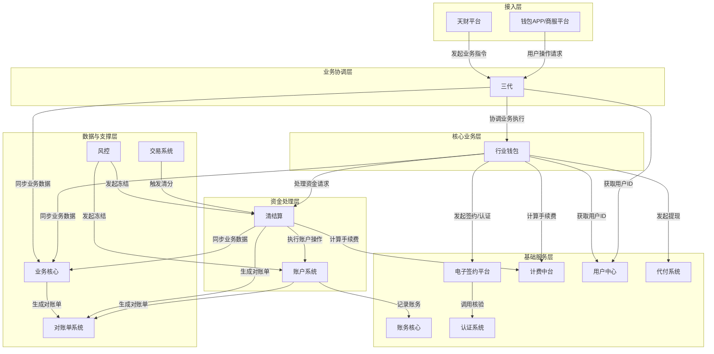
```mermaid
graph TB
    subgraph "接入层"
        A[天财平台]
        B[钱包APP/商服平台]
    end

    subgraph "业务协调层"
        C[三代]
    end

    subgraph "核心业务层"
        D[行业钱包]
    end

    subgraph "资金处理层"
        E[清结算]
        F[账户系统]
    end

    subgraph "基础服务层"
        G[账务核心]
        H[电子签约平台]
        I[认证系统]
        J[计费中台]
        K[用户中心]
        L[代付系统]
    end

    subgraph "数据与支撑层"
        M[业务核心]
        N[对账单系统]
        O[风控]
        P[交易系统]
    end

    A -->|发起业务指令| C
    B -->|用户操作请求| C
    C -->|协调业务执行| D
    D -->|处理资金请求| E
    E -->|执行账户操作| F
    F -->|记录账务| G
    D -->|发起签约/认证| H
    H -->|调用核验| I
    E & D -->|计算手续费| J
    D & C -->|获取用户ID| K
    D -->|发起提现| L
    C & D & E -->|同步业务数据| M
    M & E & F -->|生成对账单| N
    O -->|发起冻结| E & F
    P -->|触发清分| E
```

## 2.2 功能结构
系统功能围绕“账户管理”、“关系绑定”、“资金操作”、“对账与风控”四大核心领域展开。每个领域由相应的模块提供服务，共同支撑分账、归集、会员结算、批量付款等核心业务场景。

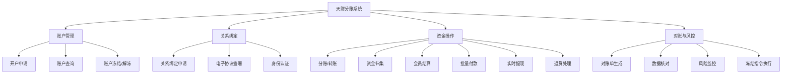
```mermaid
graph TD
    A[天财分账系统]

    B1[账户管理]
    B2[关系绑定]
    B3[资金操作]
    B4[对账与风控]

    A --> B1
    A --> B2
    A --> B3
    A --> B4

    B1 --> C1[开户申请]
    B1 --> C2[账户查询]
    B1 --> C3[账户冻结/解冻]

    B2 --> C4[关系绑定申请]
    B2 --> C5[电子协议签署]
    B2 --> C6[身份认证]

    B3 --> C7[分账/转账]
    B3 --> C8[资金归集]
    B3 --> C9[会员结算]
    B3 --> C10[批量付款]
    B3 --> C11[实时提现]
    B3 --> C12[退货处理]

    B4 --> C13[对账单生成]
    B4 --> C14[数据核对]
    B4 --> C15[风险监控]
    B4 --> C16[冻结指令执行]
```

## 2.3 网络拓扑图
TBD

## 2.4 数据流转
数据流转以“业务指令”和“资金流”为主线。业务指令由天财或前端发起，经三代协调，在行业钱包进行业务逻辑处理，最终由清结算驱动账户系统完成资金变动，并由账务核心记录。关键业务数据同步至业务核心，用于对账和查询。

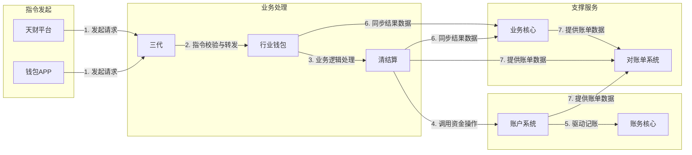
```mermaid
flowchart LR
    subgraph S1 [指令发起]
        direction LR
        A1[天财平台]
        A2[钱包APP]
    end

    subgraph S2 [业务处理]
        direction TB
        B[三代]
        C[行业钱包]
        D[清结算]
    end

    subgraph S3 [资金与账务]
        direction LR
        E[账户系统]
        F[账务核心]
    end

    subgraph S4 [支撑服务]
        direction LR
        G[业务核心]
        H[对账单系统]
    end

    A1 & A2 -->|1. 发起请求| B
    B -->|2. 指令校验与转发| C
    C -->|3. 业务逻辑处理| D
    D -->|4. 调用资金操作| E
    E -->|5. 驱动记账| F
    C & D -->|6. 同步结果数据| G
    G & E & D -->|7. 提供账单数据| H
```

## 2.5 系统模块交互关系
模块间主要通过同步API调用和异步事件进行交互。三代作为总协调者，依赖多个下游系统完成业务；行业钱包是核心业务枢纽；清结算和账户系统构成资金处理链路；电子签约、认证、计费等作为能力中台被上层业务调用。

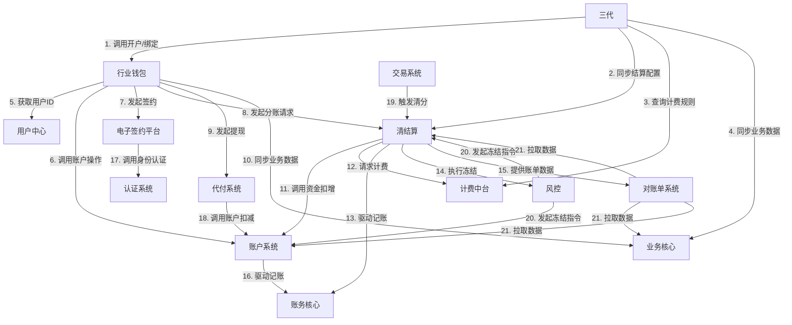
```mermaid
flowchart TD
    A[三代]
    B[行业钱包]
    C[清结算]
    D[账户系统]
    E[账务核心]
    F[电子签约平台]
    G[认证系统]
    H[计费中台]
    I[业务核心]
    J[对账单系统]
    K[风控]
    L[用户中心]
    M[代付系统]
    N[交易系统]

    A -->|1. 调用开户/绑定| B
    A -->|2. 同步结算配置| C
    A -->|3. 查询计费规则| H
    A -->|4. 同步业务数据| I
    B -->|5. 获取用户ID| L
    B -->|6. 调用账户操作| D
    B -->|7. 发起签约| F
    B -->|8. 发起分账请求| C
    B -->|9. 发起提现| M
    B -->|10. 同步业务数据| I
    C -->|11. 调用资金扣增| D
    C -->|12. 请求计费| H
    C -->|13. 驱动记账| E
    C -->|14. 执行冻结| K
    C -->|15. 提供账单数据| J
    D -->|16. 驱动记账| E
    F -->|17. 调用身份认证| G
    M -->|18. 调用账户扣减| D
    N -->|19. 触发清分| C
    K -->|20. 发起冻结指令| C & D
    J -->|21. 拉取数据| I & C & D
```
---
# 3 模块设计

<a id="module-1"></a>

## 3.1 三代


### 1. 概述
- **目的与范围**: 三代模块是天财平台业务指令的处理入口与协调服务。它负责接收并处理来自天财的开户、关系绑定、分账、计费配置等业务请求，执行核心的业务逻辑校验、审核与流程编排，并协调行业钱包、清结算、账户系统、电子签约平台等下游系统角色完成具体操作。其核心职责是业务指令的生命周期管理，包括接收、校验、路由、状态持久化与最终结果反馈，不直接执行底层的账户操作、资金变动或用户ID生成。

### 2. 接口设计
- **API端点 (REST)**: TBD
- **请求/响应结构**: TBD
- **发布/消费的事件**:
    - **消费事件**:
        - `merchant.frozen` (来自风控): 接收商户冻结/解冻指令，更新本地商户状态并拦截后续业务。
    - **发布事件**:
        - `instruction.created` (指令已创建): 当成功接收并校验天财指令后发布。
        - `instruction.status.updated` (指令状态已更新): 当指令状态（如审核中、处理中、成功、失败）变更时发布。
        - `relationship.bound` (关系绑定完成): 当关系绑定流程最终完成时发布。

### 3. 数据模型
- **表/集合**:
    - **业务指令表 (`biz_instruction`)**:
        - 用于持久化所有来自天财的业务请求，记录指令内容、状态、执行历史，用于状态管理、审计与对账。
    - **商户状态表 (`merchant_status`)**:
        - 缓存从风控同步的商户冻结状态，用于业务逻辑中的快速校验。
    - **关系绑定记录表 (`relationship_record`)**:
        - 记录已成功建立的关系绑定详情，作为分账等业务的前置校验依据。
- **关键字段**:
    - `biz_instruction` 表: `instruction_id` (指令唯一ID), `biz_type` (业务类型: 开户/绑定/分账等), `org_code` (机构号), `app_id` (APPID), `request_data` (原始请求), `status` (状态), `retry_count` (重试次数), `result_data` (最终结果), `created_at`, `updated_at`。
    - `merchant_status` 表: `merchant_id` (商户ID), `frozen` (是否冻结), `frozen_reason`, `synced_at`。
    - `relationship_record` 表: `relationship_id` (关系ID), `payer_id` (付款方ID), `receiver_id` (接收方ID), `bind_status` (绑定状态), `protocol_id` (协议ID), `verified_at` (认证完成时间)。
- **与其他模块的关系**: 业务指令表与业务核心的交易数据通过`instruction_id`关联。关系绑定记录表与行业钱包中的绑定关系数据保持一致。商户状态表的数据源来自风控系统。

### 4. 业务逻辑
- **核心工作流/算法**:
    1.  **通用指令处理流程**:
        - **接收与校验**: 接收天财请求，校验机构号、APPID合法性、请求参数格式与必填项。
        - **状态检查**: 根据请求涉及的商户ID，查询本地`merchant_status`表，校验商户是否被风控冻结。
        - **指令持久化**: 创建`biz_instruction`记录，初始状态为“待处理”。
        - **业务路由与执行**: 根据`biz_type`路由到具体的子流程（开户、绑定、分账等）。
        - **结果处理与响应**: 更新指令状态，记录结果，向天财返回响应。
    2.  **开户审核流程**:
        - 校验机构信息与商户资质。
        - 调用行业钱包创建账户（天财收款账户或天财接收方账户）。
        - 如需电子签约，则调用电子签约平台完成协议签署。
        - 更新指令状态为“成功”或“失败”。
    3.  **关系绑定流程**:
        - 校验付款方与接收方身份及状态。
        - 调用电子签约平台完成协议签署，获取协议ID。
        - 调用认证系统完成打款验证或人脸验证。
        - 调用行业钱包建立绑定关系。
        - 在本地`relationship_record`表中创建记录。
    4.  **分账/转账指令处理**:
        - 校验付款方与接收方关系是否在`relationship_record`表中存在且有效。
        - 校验双方账户状态（通过行业钱包）。
        - 调用计费中台计算手续费。
        - 调用行业钱包执行分账请求。
        - 通知业务核心记录交易数据。
    5.  **计费配置流程**:
        - 接收计费规则配置请求。
        - 调用计费中台完成规则配置。
- **业务规则与验证**:
    - 机构号与APPID需在白名单内且状态有效。
    - 同一笔业务请求需支持幂等性处理（基于天财提供的唯一请求ID）。
    - 关系绑定是执行分账的必要前置条件。
    - 被风控冻结的商户，所有出款类指令（如分账、提现）将被拦截。
- **关键边界情况处理**:
    - **下游调用失败**: 对行业钱包、清结算等关键下游调用设置重试机制（如最多3次，指数退避）。记录重试次数于`biz_instruction.retry_count`。
    - **部分成功（补偿）**: 若分账流程中行业钱包调用成功但计费中台调用失败，需记录异常状态，支持人工或定时任务触发补偿流程（如冲正交易或补计费）。
    - **状态同步**: 定时或监听事件，从风控同步最新商户冻结状态至`merchant_status`表。

### 5. 时序图

#### 5.1 关系绑定流程时序图
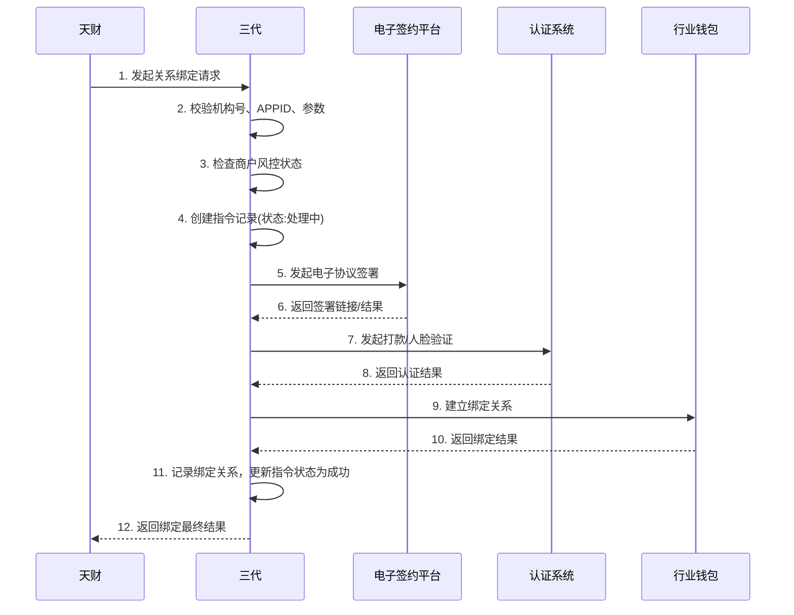
```mermaid
sequenceDiagram
    participant 天财
    participant 三代
    participant 电子签约平台
    participant 认证系统
    participant 行业钱包

    天财->>三代: 1. 发起关系绑定请求
    三代->>三代: 2. 校验机构号、APPID、参数
    三代->>三代: 3. 检查商户风控状态
    三代->>三代: 4. 创建指令记录(状态:处理中)
    三代->>电子签约平台: 5. 发起电子协议签署
    电子签约平台-->>三代: 6. 返回签署链接/结果
    三代->>认证系统: 7. 发起打款/人脸验证
    认证系统-->>三代: 8. 返回认证结果
    三代->>行业钱包: 9. 建立绑定关系
    行业钱包-->>三代: 10. 返回绑定结果
    三代->>三代: 11. 记录绑定关系，更新指令状态为成功
    三代-->>天财: 12. 返回绑定最终结果
```

#### 5.2 分账指令处理时序图
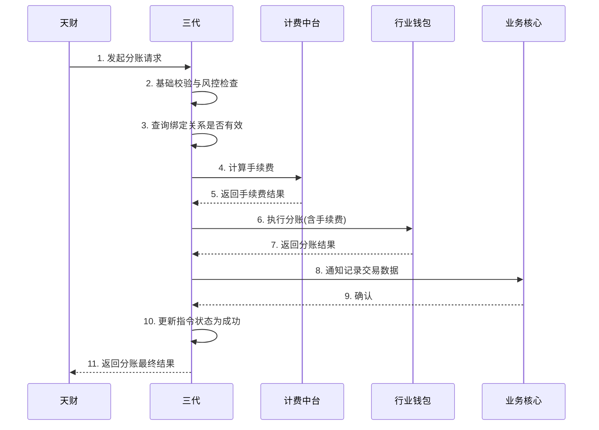
```mermaid
sequenceDiagram
    participant 天财
    participant 三代
    participant 计费中台
    participant 行业钱包
    participant 业务核心

    天财->>三代: 1. 发起分账请求
    三代->>三代: 2. 基础校验与风控检查
    三代->>三代: 3. 查询绑定关系是否有效
    三代->>计费中台: 4. 计算手续费
    计费中台-->>三代: 5. 返回手续费结果
    三代->>行业钱包: 6. 执行分账(含手续费)
    行业钱包-->>三代: 7. 返回分账结果
    三代->>业务核心: 8. 通知记录交易数据
    业务核心-->>三代: 9. 确认
    三代->>三代: 10. 更新指令状态为成功
    三代-->>天财: 11. 返回分账最终结果
```

#### 5.3 开户审核流程时序图
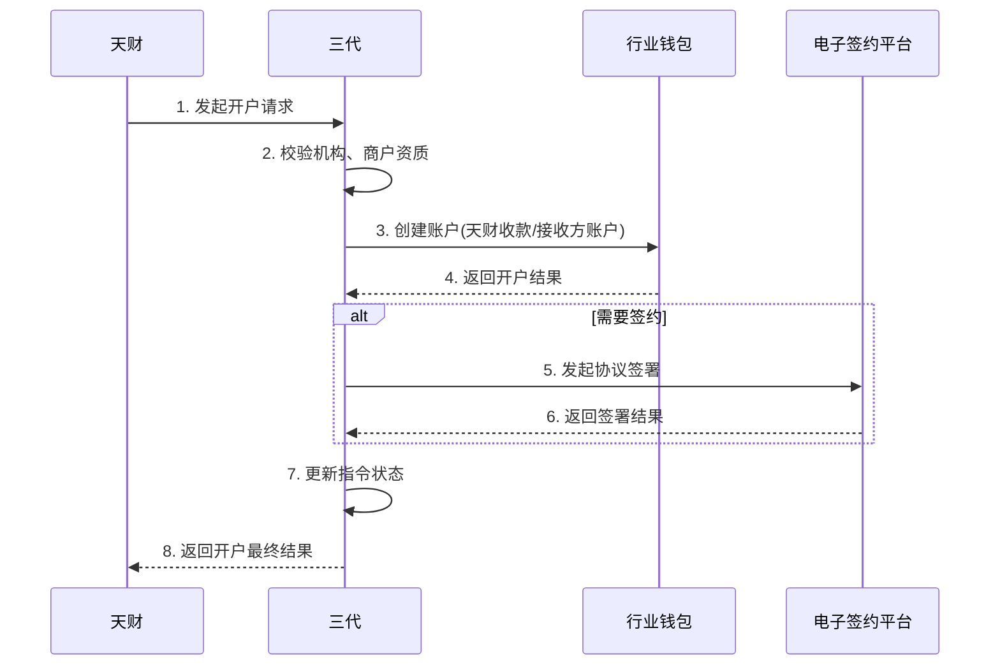
```mermaid
sequenceDiagram
    participant 天财
    participant 三代
    participant 行业钱包
    participant 电子签约平台

    天财->>三代: 1. 发起开户请求
    三代->>三代: 2. 校验机构、商户资质
    三代->>行业钱包: 3. 创建账户(天财收款/接收方账户)
    行业钱包-->>三代: 4. 返回开户结果
    alt 需要签约
        三代->>电子签约平台: 5. 发起协议签署
        电子签约平台-->>三代: 6. 返回签署结果
    end
    三代->>三代: 7. 更新指令状态
    三代-->>天财: 8. 返回开户最终结果
```

### 6. 错误处理
- **预期错误情况**:
    - **输入错误**: 参数缺失、格式错误、机构号/APPID无效。
    - **业务规则错误**: 商户已冻结、关系绑定不存在、账户状态异常、余额不足。
    - **下游依赖错误**: 电子签约平台、认证系统、行业钱包、计费中台等服务调用超时、网络异常或返回业务失败。
    - **系统内部错误**: 数据库异常、内部逻辑错误。
- **处理策略**:
    - **输入与业务错误**: 立即失败，返回明确的错误码与信息，不重试。
    - **下游暂时性失败**: 对行业钱包、清结算等核心下游调用实施重试。重试策略可配置（如最大次数、退避间隔），重试后仍失败则更新指令状态为“失败”，记录详细错误日志。
    - **幂等性**: 所有关键业务接口需支持基于请求唯一ID的幂等调用，防止重复处理。
    - **补偿与对账**: 对于涉及资金的状态不一致风险（如分账成功但计费失败），记录异常状态，提供管理界面供运营人工处理，并依赖日终对账单进行财务核对。
    - **监控与告警**: 对失败率、超时率设置监控阈值，及时告警。

### 7. 依赖关系
- **上游模块/角色**:
    - **天财**: 业务指令的发起方。
    - **风控**: 提供商户冻结/解冻指令（通过事件）。
- **下游模块/角色**:
    - **行业钱包**: 被调用以执行账户开户、关系绑定校验与建立、分账资金划转。
    - **清结算**: 被调用以处理结算、计费处理（部分计费可能通过计费中台）及资金冻结。
    - **账户系统**: 被行业钱包或清结算底层调用，三代不直接调用。
    - **电子签约平台**: 被调用以完成协议签署流程。
    - **认证系统**: 被调用以完成打款验证或人脸验证。
    - **计费中台**: 被调用以计算分账/转账手续费。
    - **业务核心**: 被调用以存储分账等交易数据。
    - **用户中心**: 被行业钱包底层调用以生成用户ID，三代不直接调用。

<a id="module-2"></a>

## 3.2 行业钱包


### 1. 概述
- **目的与范围**：本模块是处理钱包业务逻辑的核心服务层。它接收来自上游业务处理模块（三代）的指令，负责执行用户ID生成、账户开户、关系绑定校验、分账/转账请求处理等核心逻辑，并协调调用下游系统（账户系统、电子签约平台等）完成具体操作。它确保所有资金操作在正确的账户关系和授权下执行，是连接业务指令与底层资金操作的关键枢纽。
- **模块边界澄清**：本模块不负责业务审核、计费配置等业务管理逻辑（由三代负责），也不直接管理底层账户余额或执行会计分录（由账户系统和账务核心负责）。其核心职责是执行业务指令并确保其合规性。

### 2. 接口设计
- **API端点 (REST/GraphQL)**：TBD
- **请求/响应结构**：TBD
- **发布/消费的事件**：TBD

### 3. 数据模型
- **表/集合**：TBD
- **关键字段**：TBD
- **与其他模块的关系**：本模块处理的数据与**账户系统**（账户状态、余额）、**业务核心**（交易数据）、**用户中心**（用户ID）紧密关联。

### 4. 业务逻辑

#### 核心工作流
1.  **用户ID生成**：在接收到开户或关系绑定指令时，如需为新商户创建唯一标识，则调用**用户中心**的接口生成用户ID（userid）。本模块负责传递必要的商户信息并存储返回的userid。
2.  **账户开户**：
    *   **输入**：接收来自三代的商户开户指令，包含商户基本信息、机构号、商户类型（收单商户/非收单商户）。
    *   **逻辑**：
        *   校验请求参数完整性。
        *   根据`商户类型`决定账户类型：
            *   若为`收单商户`，则调用**账户系统**创建`天财收款账户`。
            *   若为`非收单商户`，则调用**账户系统**创建`天财接收方账户`。
        *   将开户结果（成功/失败，包含账户ID等信息）返回给三代。
3.  **关系绑定**：
    *   **输入**：接收来自三代的关系绑定指令，包含付款方信息、接收方信息、绑定场景（总部-门店、付款方-一般接收方等）。
    *   **逻辑**：
        *   校验付款方与接收方账户是否存在且状态正常。
        *   根据绑定场景，组装协议签署所需的参数（如双方身份信息、协议模板ID）。
        *   调用**电子签约平台**接口，发起协议签署流程。该流程可能内嵌调用**认证系统**完成打款验证或人脸验证。
        *   监听电子签约平台的回调或轮询签署结果。
        *   若签署成功，在本模块存储绑定关系记录，并标记为“有效”；若失败，记录失败原因并返回。
4.  **分账/转账请求处理**：
    *   **输入**：接收来自三代的分账/转账指令，包含交易流水号、付款方账户、接收方账户、金额、业务场景等。
    *   **逻辑**：
        *   **幂等性校验**：根据交易流水号检查是否已处理过相同请求。
        *   **绑定关系有效性校验**：查询本模块存储的绑定关系，校验付款方与接收方之间是否存在状态为“有效”的绑定记录。`有效绑定关系`的定义为：a) 绑定关系记录存在；b) 关系状态为“已签约”；c) 电子协议在有效期内（如有）；d) 未解除绑定。
        *   **账户状态与余额校验**：调用**账户系统**接口，校验付款方账户状态正常且可用余额充足。
        *   **执行资金划转**：通过调用**账户系统**的资金操作接口执行划转。
        *   **通知业务核心**：将分账交易结果（成功/失败）通知**业务核心**进行数据存储。
        *   返回处理结果给三代。

#### 业务规则与验证
1.  开户时需严格校验`商户类型`，以确定创建`天财收款账户`还是`天财接收方账户`。
2.  执行分账前，必须校验付款方账户（必须是`天财收款账户`）与接收方账户（`天财收款账户`或`天财接收方账户`）之间存在`有效绑定关系`（定义见上）。
3.  校验付款方账户状态是否正常、余额是否充足。
4.  所有关键操作（如资金划转）需支持幂等性，通常通过业务唯一流水号实现。

#### 数据一致性策略
涉及多个下游系统（账户系统、电子签约平台、业务核心）的操作，采用“最终一致性”策略。
*   **关键操作本地事务**：在本模块数据库内的数据更新（如记录绑定关系、更新请求状态）使用数据库事务保证原子性。
*   **异步补偿与重试**：对于调用下游系统失败的情况：
    *   记录详细日志和操作状态。
    *   对于可重试的错误（如网络超时），采用指数退避策略进行自动重试（例如，最大重试3次，退避间隔2秒、4秒、8秒）。
    *   对于业务性失败或最终重试失败，将操作标记为失败，并可能触发人工干预或通过告警通知运维。
*   **幂等性保障**：下游系统（如账户系统）需提供幂等接口，本模块传递唯一业务流水号，确保重复请求不会导致资金重复划转。

### 5. 时序图

#### 账户开户与关系绑定时序图
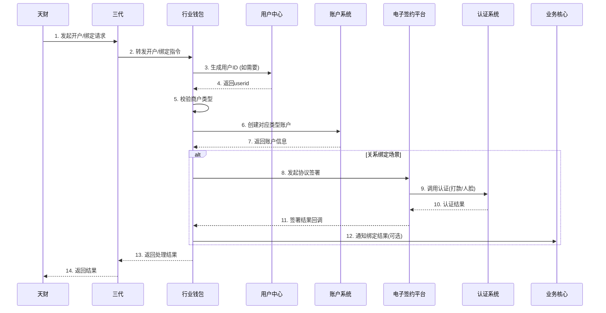
```mermaid
sequenceDiagram
    participant 天财
    participant 三代
    participant 行业钱包
    participant 用户中心
    participant 账户系统
    participant 电子签约平台
    participant 认证系统
    participant 业务核心

    天财->>三代: 1. 发起开户/绑定请求
    三代->>行业钱包: 2. 转发开户/绑定指令
    行业钱包->>用户中心: 3. 生成用户ID (如需要)
    用户中心-->>行业钱包: 4. 返回userid
    行业钱包->>行业钱包: 5. 校验商户类型
    行业钱包->>账户系统: 6. 创建对应类型账户
    账户系统-->>行业钱包: 7. 返回账户信息
    alt 关系绑定场景
        行业钱包->>电子签约平台: 8. 发起协议签署
        电子签约平台->>认证系统: 9. 调用认证(打款/人脸)
        认证系统-->>电子签约平台: 10. 认证结果
        电子签约平台-->>行业钱包: 11. 签署结果回调
        行业钱包->>业务核心: 12. 通知绑定结果(可选)
    end
    行业钱包-->>三代: 13. 返回处理结果
    三代-->>天财: 14. 返回结果
```

#### 分账请求处理时序图
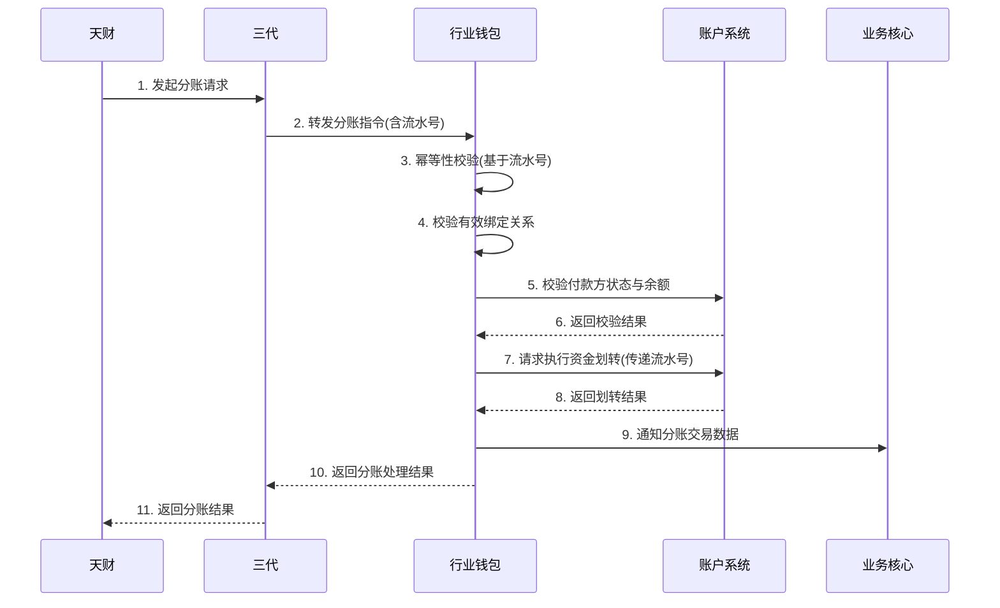
```mermaid
sequenceDiagram
    participant 天财
    participant 三代
    participant 行业钱包
    participant 账户系统
    participant 业务核心

    天财->>三代: 1. 发起分账请求
    三代->>行业钱包: 2. 转发分账指令(含流水号)
    行业钱包->>行业钱包: 3. 幂等性校验(基于流水号)
    行业钱包->>行业钱包: 4. 校验有效绑定关系
    行业钱包->>账户系统: 5. 校验付款方状态与余额
    账户系统-->>行业钱包: 6. 返回校验结果
    行业钱包->>账户系统: 7. 请求执行资金划转(传递流水号)
    账户系统-->>行业钱包: 8. 返回划转结果
    行业钱包->>业务核心: 9. 通知分账交易数据
    行业钱包-->>三代: 10. 返回分账处理结果
    三代-->>天财: 11. 返回分账结果
```

### 6. 错误处理
- **预期错误情况**：
    1.  **业务规则错误**：绑定关系不存在或无效、付款方账户余额不足、账户状态异常（如冻结）、商户类型错误。
    2.  **系统间调用错误**：调用用户中心、账户系统、电子签约平台、业务核心等下游服务超时、网络错误或返回业务失败。
    3.  **数据一致性错误**：在分布式操作过程中，部分系统成功部分失败。
- **处理策略**：
    1.  **业务错误**：立即中断流程，记录日志，并向调用方（三代）返回明确的业务错误码和提示信息。
    2.  **系统调用失败**：
        *   记录错误日志和上下文。
        *   区分错误类型：对于网络超时等可重试错误，启动**重试机制**（配置化重试次数，如3次；采用指数退避策略）。
        *   所有重试请求必须携带原业务流水号以保证下游幂等性处理。
        *   最终重试失败后，将操作标记为“系统失败”，并触发告警。
    3.  **数据一致性保障**：
        *   依赖**最终一致性**与**补偿机制**。例如，分账时若调用账户系统成功但通知业务核心失败，则记录异常状态，通过定时任务尝试重新通知或人工补单。
        *   关键操作（如资金划转）严格依赖下游系统的幂等性接口，防止重复执行。

### 7. 依赖关系
- **上游模块**：
    *   **三代**：核心上游，提供所有业务指令（开户、绑定、分账）的入口，并负责前置业务审核与配置。
    *   **用户中心**：提供生成全局唯一用户ID（userid）的能力。
- **下游模块**：
    *   **账户系统**：核心下游，负责底层账户的创建、余额查询与变更、状态管理。
    *   **电子签约平台**：负责完成关系绑定过程中的电子协议签署与认证流程。
    *   **业务核心**：用于持久化存储分账等业务交易数据。
    *   **认证系统**：（通过电子签约平台间接依赖）提供身份核验能力。
- **关键依赖说明**：本模块的可用性高度依赖账户系统和电子签约平台。与这些系统的接口需要明确约定超时时间、重试策略和幂等性保证。

<a id="module-3"></a>

## 3.3 清结算


### 1. 概述
- **目的与范围**: 本模块负责处理交易清分、资金结算、计费处理、账户冻结以及退货流程中的资金扣减等资金清算与结算业务。它是连接交易、账户与账务的核心资金处理中枢。核心业务包括：分账、会员结算、批量付款、资金归集、退货及账户冻结。

### 2. 接口设计
- **API端点 (REST/GraphQL)**:
    - `POST /api/v1/settlement/transfer`: 处理分账/转账请求。
    - `POST /api/v1/settlement/batch-payment`: 处理批量付款请求。
    - `POST /api/v1/settlement/member-settlement`: 处理会员结算请求。
    - `POST /api/v1/settlement/refund`: 处理退货资金扣减请求。
    - `POST /api/v1/settlement/freeze`: 处理风控发起的账户/交易冻结请求。
    - `GET /api/v1/settlement/orders/{orderId}`: 查询清结算订单状态。
- **请求/响应结构**:
    - 通用请求头包含：`X-Request-Id`（幂等键）、`X-App-Id`、`X-Org-Id`。
    - 通用响应体包含：`code`、`message`、`data`、`requestId`。
    - 分账请求体示例：`{“payerAccountNo”: “…”, “receiverAccountNo”: “…”, “amount”: 100, “bizOrderNo”: “…”, “feeBearer”: “PAYER”}`。
- **发布/消费的事件**:
    - 消费事件：`TransactionSettledEvent`（来自业务核心）、`FreezeCommandEvent`（来自风控）。
    - 发布事件：`SettlementCompletedEvent`、`SettlementFailedEvent`、`AccountFrozenEvent`。

### 3. 数据模型
- **表/集合**:
    - `settlement_orders`：清结算主订单表，记录所有清结算请求。
    - `fee_records`：计费流水记录表，关联计费中台返回的计费结果。
    - `settlement_batch_details`：批量付款明细表。
    - `retry_logs`：失败重试记录表。
- **关键字段**:
    - `settlement_orders`: `order_id`（主键）、`biz_order_no`（业务订单号）、`order_type`（分账/批量付款/会员结算/退货/冻结）、`payer_account_no`、`receiver_account_no`、`amount`、`fee_amount`、`fee_bearer`、`status`（初始化/处理中/成功/失败/已冲正）、`idempotent_key`、`created_at`、`updated_at`。
    - `fee_records`: `fee_id`、`settlement_order_id`、`fee_rule_id`、`calculated_amount`、`status`。
- **与其他模块的关系**:
    - 与账户系统交互进行账户余额操作。
    - 与账务核心交互记录会计分录。
    - 与计费中台交互获取计费流水。
    - 与业务核心交互获取交易数据。
    - 与对账单系统交互提供结算明细。

### 4. 业务逻辑
- **核心工作流/算法**:
    1.  **分账/转账**:
        - 校验付款方（天财收款账户）与接收方（天财收款账户或天财接收方账户）是否存在已生效的绑定关系。
        - 调用计费中台计算手续费。
        - 执行资金划转：扣减付款方账户余额，增加收款方账户余额。
        - 调用账务核心记录分账会计分录。
        - 状态更新为成功，发布完成事件。
    2.  **会员结算**:
        - 接收来自业务核心的交易结算事件。
        - 资金首先结算至品牌总部的天财收款账户（主动结算模式）。
        - 根据预设的分账规则，触发从总部账户向各门店账户的分账流程。
        - 处理并发分账请求，确保总部账户余额一致性。
    3.  **批量付款**:
        - 校验付款方（总部天财收款账户）是否已完成“开通付款”流程。
        - 校验每个接收方（天财接收方账户）状态正常。
        - 批量调用计费中台计算总手续费。
        - 执行批量资金划转（支持部分成功处理）。
        - 生成批量付款明细，供对账使用。
    4.  **资金归集**:
        - 作为分账的一种特例，资金从门店天财收款账户向总部天财收款账户划转。
        - 需校验上下级门店关系绑定状态。
    5.  **退货处理**:
        - 根据原交易配置的退货模式，确定扣款来源账户（01待结算账户、天财收款账户或**04退货账户**）。
        - 校验原交易状态及可退金额。
        - 执行资金扣减，并记录账务。
    6.  **账户冻结**:
        - 接收风控冻结指令（商户冻结或交易冻结）。
        - 调用账户系统执行对应账户的冻结操作。
        - 若为交易冻结，需锁定对应结算订单资金。
- **业务规则与验证**:
    - 结算前需校验目标账户状态是否正常（非冻结）。
    - 分账/转账前需校验付款方与接收方是否存在已生效的绑定关系。
    - 退货时需校验原交易状态及可退金额。
    - 批量付款要求付款方具备“开通付款”资质。
- **关键边界情况处理**:
    - **并发控制**：对同一付款账户的并发操作使用数据库乐观锁或分布式锁，防止超扣。
    - **状态机管理**：清结算订单状态严格流转（初始化->处理中->成功/失败->冲正），确保幂等性。
    - **部分成功**：批量付款中单笔失败不影响其他成功项，整体结果标记为部分成功。

### 5. 时序图

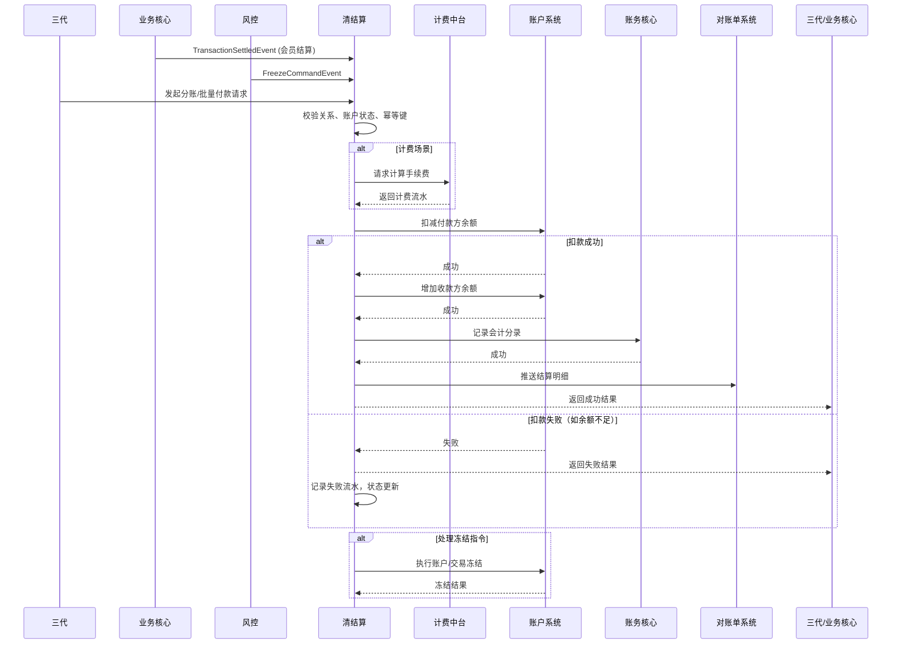
```mermaid
sequenceDiagram
    participant 三代
    participant 业务核心
    participant 风控
    participant 清结算
    participant 计费中台
    participant 账户系统
    participant 账务核心
    participant 对账单系统

    业务核心->>清结算: TransactionSettledEvent (会员结算)
    风控->>清结算: FreezeCommandEvent
    三代->>清结算: 发起分账/批量付款请求
    清结算->>清结算: 校验关系、账户状态、幂等键
    alt 计费场景
        清结算->>计费中台: 请求计算手续费
        计费中台-->>清结算: 返回计费流水
    end
    清结算->>账户系统: 扣减付款方余额
    alt 扣款成功
        账户系统-->>清结算: 成功
        清结算->>账户系统: 增加收款方余额
        账户系统-->>清结算: 成功
        清结算->>账务核心: 记录会计分录
        账务核心-->>清结算: 成功
        清结算->>对账单系统: 推送结算明细
        清结算-->>三代/业务核心: 返回成功结果
    else 扣款失败（如余额不足）
        账户系统-->>清结算: 失败
        清结算-->>三代/业务核心: 返回失败结果
        清结算->>清结算: 记录失败流水，状态更新
    end
    alt 处理冻结指令
        清结算->>账户系统: 执行账户/交易冻结
        账户系统-->>清结算: 冻结结果
    end
```

### 6. 错误处理
- **预期错误情况**:
    - 业务错误：账户余额不足、账户状态异常（冻结）、绑定关系无效、计费规则不存在。
    - 系统错误：计费中台服务不可用、下游系统（账户/账务）调用超时或失败、网络异常。
- **处理策略**:
    - **幂等性**：所有请求必须携带`X-Request-Id`，基于`settlement_orders.idempotent_key`防止重复处理。
    - **重试机制**：对于网络超时等可重试错误，采用指数退避策略，最多重试3次。
    - **补偿机制**：对于分布式事务失败（如扣款成功但记账失败），采用冲正（Reverse）操作，调用账户系统进行资金退回，并更新订单状态为“已冲正”。
    - **降级逻辑**：计费中台不可用时，可根据本地缓存的最低费率进行计算，并记录降级标识，后续人工核对。
    - **监控与告警**：记录所有失败流水至`retry_logs`，并设置关键错误（如连续冲正失败）的实时告警。

### 7. 依赖关系
- **上游模块**:
    - 三代：接收分账、批量付款等业务指令。
    - 风控：接收冻结指令。
    - 业务核心：获取交易数据，触发会员结算。
- **下游模块**:
    - 账户系统：执行账户余额的扣减、增加、冻结操作。
    - 账务核心：记录所有资金变动的会计分录。
    - 计费中台：计算分账/转账手续费。
    - 对账单系统：提供结算明细数据，用于生成对账单。

<a id="module-4"></a>

## 3.4 账户系统


### 1. 概述
- **目的与范围**: 账户系统负责底层账户的创建、升级、余额管理、资金扣减/增加、冻结等账户核心操作。其边界是处理与账户实体直接相关的操作，不涉及业务逻辑判断。本模块为行业钱包、清结算、风控等上游模块提供原子化的账户操作能力，并依赖账务核心完成资金变动的最终记录。

### 2. 接口设计
- **API端点 (REST/GraphQL)**: 提供基于RESTful风格的HTTP API。
    - `POST /api/v1/accounts`: 创建账户。
    - `GET /api/v1/accounts/{accountId}`: 查询账户信息。
    - `POST /api/v1/accounts/{accountId}/debit`: 执行资金扣减。
    - `POST /api/v1/accounts/{accountId}/credit`: 执行资金增加。
    - `POST /api/v1/accounts/{accountId}/freeze`: 冻结账户。
    - `POST /api/v1/accounts/{accountId}/unfreeze`: 解冻账户。
- **请求/响应结构**:
    - 创建账户请求：包含 `userId`、`accountType`（如“天财收款账户”、“天财接收方账户”、“01待结算账户”）、`institutionId` 等字段。
    - 资金操作请求：包含 `amount`（金额）、`bizOrderNo`（业务订单号，用于幂等）、`bizType`（业务类型，如“分账”、“结算”、“退货”）等字段。
    - 通用响应：包含 `code`（状态码）、`message`（消息）、`data`（业务数据）等字段。
- **发布/消费的事件**:
    - 消费事件：监听来自清结算的“结算完成指令”、来自风控的“账户冻结指令”、来自行业钱包的“开户指令”。
    - 发布事件：账户创建成功事件、账户余额变动事件（扣减/增加）、账户状态变更事件（冻结/解冻）。这些事件将供账务核心等下游模块消费。

### 3. 数据模型
- **表/集合**: 核心表为 `account`（账户主表）。
- **关键字段**:
    - `account_id`: 账户唯一标识（主键）。
    - `user_id`: 关联的用户ID，来自用户中心。
    - `account_type`: 账户类型，枚举值如 `TIANCAI_COLLECT`（天财收款账户）、`TIANCAI_RECEIVE`（天财接收方账户）、`SETTLEMENT_PENDING`（01待结算账户）、`REFUND`（04退货账户）。
    - `institution_id`: 机构号。
    - `balance`: 账户当前余额。
    - `available_balance`: 可用余额（余额减去冻结金额）。
    - `frozen_amount`: 冻结金额。
    - `status`: 账户状态，如 `ACTIVE`（正常）、`FROZEN`（冻结）、`CLOSED`（注销）。
    - `version`: 数据版本号，用于乐观锁控制并发。
    - `created_at` / `updated_at`: 创建/更新时间。
- **与其他模块的关系**: 账户系统通过 `user_id` 与用户中心关联；通过发布账户变动事件与账务核心关联，确保每笔资金操作都有对应的会计分录。

### 4. 业务逻辑
- **核心工作流/算法**:
    1. **账户创建**: 接收行业钱包的开户指令，校验参数后，创建指定类型的账户，初始化余额为0，并发布账户创建事件。
    2. **资金扣减/增加**: 接收上游（如清结算、行业钱包）的资金操作指令。核心流程：a) 通过 `bizOrderNo` 检查幂等性；b) 使用乐观锁（`version`字段）锁定账户记录；c) 校验账户状态、余额（扣减时需充足）；d) 更新账户余额；e) 发布账户余额变动事件（含变动金额、业务类型）；f) 异步通知账务核心记账。
    3. **账户冻结/解冻**: 接收风控或运营指令，更新账户状态和冻结金额，并发布状态变更事件。
- **业务规则与验证**:
    - 扣减操作必须校验：账户状态为 `ACTIVE`、可用余额 >= 扣减金额。
    - 天财接收方账户仅支持提现（一种特殊的资金扣减），不支持向其他账户转账。
    - 所有资金操作必须携带唯一的 `bizOrderNo` 实现幂等。
- **关键边界情况处理**:
    - **并发控制**: 使用数据库乐观锁（`version`字段）确保余额更新的原子性，防止超扣。
    - **数据一致性**: 采用“本地事务更新账户 + 可靠事件通知”的最终一致性方案。先在本数据库事务内完成账户余额更新，再异步发布事件。账务核心消费事件失败时会重试，确保记账最终完成。
    - **异常状态**: 账户不存在、已注销、已冻结时，直接拒绝操作并返回明确错误。

### 5. 时序图

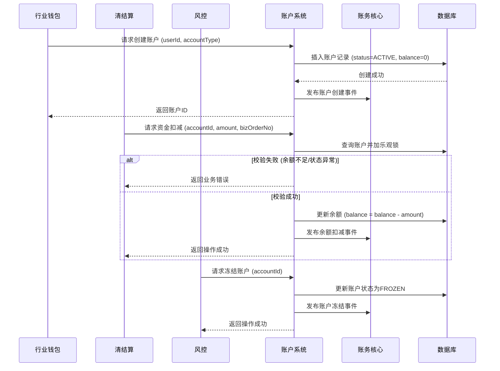
```mermaid
sequenceDiagram
    participant 行业钱包 as 行业钱包
    participant 清结算 as 清结算
    participant 风控 as 风控
    participant 账户系统 as 账户系统
    participant 账务核心 as 账务核心
    participant DB as 数据库

    行业钱包->>账户系统: 请求创建账户 (userId, accountType)
    账户系统->>DB: 插入账户记录 (status=ACTIVE, balance=0)
    DB-->>账户系统: 创建成功
    账户系统->>账务核心: 发布账户创建事件
    账户系统-->>行业钱包: 返回账户ID

    清结算->>账户系统: 请求资金扣减 (accountId, amount, bizOrderNo)
    账户系统->>DB: 查询账户并加乐观锁
    alt 校验失败 (余额不足/状态异常)
        账户系统-->>清结算: 返回业务错误
    else 校验成功
        账户系统->>DB: 更新余额 (balance = balance - amount)
        账户系统->>账务核心: 发布余额扣减事件
        账户系统-->>清结算: 返回操作成功
    end

    风控->>账户系统: 请求冻结账户 (accountId)
    账户系统->>DB: 更新账户状态为FROZEN
    账户系统->>账务核心: 发布账户冻结事件
    账户系统-->>风控: 返回操作成功
```

### 6. 错误处理
- **预期错误情况与错误码**:
    - `ACCOUNT_NOT_FOUND` (40001): 账户不存在。
    - `ACCOUNT_FROZEN` (40002): 账户已冻结。
    - `ACCOUNT_CLOSED` (40003): 账户已注销。
    - `INSUFFICIENT_BALANCE` (40004): 账户余额不足。
    - `DUPLICATED_REQUEST` (40005): 重复请求（`bizOrderNo`已处理）。
    - `CONCURRENT_CONFLICT` (40006): 并发操作冲突（乐观锁失败）。
    - `SYSTEM_ERROR` (50000): 系统内部错误。
- **处理策略**:
    - **业务错误**（4xxxx）：直接向上游返回对应错误码和描述，不进行重试。
    - **并发冲突**：返回明确错误码，建议上游使用原`bizOrderNo`重试。
    - **系统错误**：进行详细日志记录和告警，向上游返回通用系统错误。对于与下游（如账务核心）的事件通信失败，采用异步重试机制，确保事件最终送达。

### 7. 依赖关系
- **上游模块**:
    - **行业钱包**: 调用账户系统创建账户（天财收款账户、天财接收方账户）。
    - **清结算**: 调用账户系统进行资金扣减（如结算划拨、退货扣款）和增加。
    - **风控**: 调用账户系统执行账户冻结/解冻操作。
- **下游模块**:
    - **账务核心**: 消费账户系统发布的所有账户变动事件，进行会计分录记录，是数据一致性的关键下游。

<a id="module-5"></a>

## 3.5 账务核心


### 1. 概述
- **目的与范围**: 本模块负责记录所有资金变动相关的会计分录，是资金流水的核心记账中心。其职责包括但不限于记录收单记账、结算记账、分账记账等业务产生的资金变动凭证，确保账务数据的准确性、完整性和可追溯性。模块的核心边界是接收上游记账指令，执行必要的业务规则校验（如复式记账法），生成并持久化会计分录。模块不负责账户余额的实时计算与更新，也不执行实际的资金扣减或增加操作。

### 2. 接口设计
- **API端点 (REST)**: TBD
- **请求/响应结构**:
    - **请求体示例 (记账请求)**:
      ```json
      {
        "request_id": "unique_request_id_123", // 幂等键
        "business_type": "SETTLEMENT", // 业务类型，如分账、结算、退货
        "transaction_ref": "order_20240401001", // 关联业务单号
        "institution_id": "inst_001", // 机构号
        "entries": [
          {
            "account_id": "acc_01_merchantA",
            "amount": 100.00,
            "direction": "DEBIT" // 借贷方向：DEBIT/CREDIT
          },
          {
            "account_id": "acc_04_merchantA",
            "amount": 100.00,
            "direction": "CREDIT"
          }
        ],
        "metadata": {
          "operator": "system",
          "channel": "clearing"
        }
      }
      ```
    - **成功响应体**:
      ```json
      {
        "code": "SUCCESS",
        "message": "记账成功",
        "data": {
          "journal_entry_id": "je_202404010001",
          "status": "POSTED",
          "posted_at": "2024-04-01T10:00:00Z"
        }
      }
      ```
    - **失败响应体**:
      ```json
      {
        "code": "VALIDATION_ERROR",
        "message": "借贷金额不平衡",
        "details": {}
      }
      ```
- **发布/消费的事件**:
    - **消费事件**: TBD (例如，监听来自清结算模块的记账指令事件)
    - **发布事件**: `JournalEntryPosted` (会计分录已记账事件)，包含分录ID、业务单号、账户、金额等信息，供下游模块（如对账单系统）订阅。

### 3. 数据模型
- **表/集合**:
    1.  **journal_entries (会计分录主表)**
        - `id` (主键): 会计分录唯一标识。
        - `request_id`: 上游请求的幂等键，唯一索引。
        - `business_type`: 业务类型 (如 `SPLIT_ACCOUNT`, `SETTLEMENT`, `REFUND`)。
        - `transaction_ref`: 关联的业务交易参考号 (如订单号、结算批次号)。
        - `institution_id`: 机构号。
        - `status`: 状态 (`PENDING`, `POSTED`, `FAILED`, `COMPENSATED`)。
        - `total_debit`: 总借方金额。
        - `total_credit`: 总贷方金额。
        - `posted_by`: 记账操作者。
        - `posted_at`: 记账时间。
        - `created_at`: 记录创建时间。
    2.  **journal_entry_items (会计分录明细表)**
        - `id` (主键): 分录明细ID。
        - `journal_entry_id` (外键): 关联的会计分录ID。
        - `account_id`: 账户ID (需与账户系统保持一致)。
        - `amount`: 变动金额。
        - `direction`: 借贷方向 (`DEBIT`, `CREDIT`)。
        - `sequence`: 在同一分录中的顺序。
    3.  **idempotency_control (幂等控制表)**
        - `request_id` (主键): 请求幂等键。
        - `journal_entry_id`: 已成功处理的会计分录ID。
        - `processed_at`: 处理时间。
        - `response_snapshot`: 响应快照 (JSON格式)，用于直接返回重复请求的结果。
- **关键字段说明**:
    - `request_id`: 确保来自同一业务请求的重复调用不会导致重复记账。
    - `account_id`: 引用账户系统中的账户标识，记账前需验证其有效性。
    - `total_debit` 与 `total_credit`: 用于在应用层和数据库层（通过CHECK约束）强制保证借贷平衡。
- **与其他模块的关系**:
    - **清结算**: 主要上游，发起绝大部分记账请求。
    - **账户系统**: 作为只读依赖，用于在记账前验证 `account_id` 的有效性（账户是否存在、状态是否正常）。不直接接收其记账指令。
    - **对账单系统**: 主要下游，通过查询本模块的明细数据生成各类对账单。
    - **业务核心**: TBD (可能需要提供交易上下文信息，或消费业务核心的事件以触发记账)。

### 4. 业务逻辑
- **核心工作流/算法**:
    1.  **接收与校验**: 接收上游请求，首先进行基础数据校验（格式、必填项）。
    2.  **幂等性检查**: 使用 `request_id` 查询幂等控制表。若已存在成功记录，则直接返回存储的响应快照，流程结束。
    3.  **账户验证**: 调用**账户系统**的只读接口，验证请求中所有 `account_id` 的有效性和可用状态。
    4.  **借贷平衡校验**: 计算请求中所有明细的借方总额和贷方总额，必须相等。
    5.  **生成与存储分录**: 在一个数据库事务中：
        a. 插入 `journal_entries` 记录，状态为 `PENDING`。
        b. 插入 `journal_entry_items` 记录。
        c. 插入 `idempotency_control` 记录。
        d. 更新 `journal_entries` 状态为 `POSTED`。
    6.  **发布事件**: 事务成功后，异步发布 `JournalEntryPosted` 事件。
- **业务规则与验证**:
    - **复式记账法**: 强制每笔会计分录必须至少包含一借一贷，且借贷总额相等。
    - **幂等性**: 基于 `request_id` 实现，确保业务层面的请求仅被处理一次。
    - **关联性**: 必须记录 `transaction_ref` 和 `institution_id`，确保所有账务记录可追溯至具体业务和机构。
- **并发控制**:
    - 针对同一账户的并发记账请求，通过数据库事务的隔离级别（如 `READ COMMITTED`）和行级锁来保证数据一致性。
    - 在应用层，对关键操作（如幂等检查、插入分录）进行适当的锁或乐观锁控制，防止并发请求导致状态不一致。
- **关键边界情况处理**:
    - **重复请求**: 通过幂等性检查拦截。
    - **账户无效**: 在账户验证阶段失败，立即返回错误，不进行任何持久化操作。
    - **系统故障**: 在事务提交前发生故障，事务回滚，数据保持一致性。需由上游根据失败响应决定是否重试。

### 5. 时序图
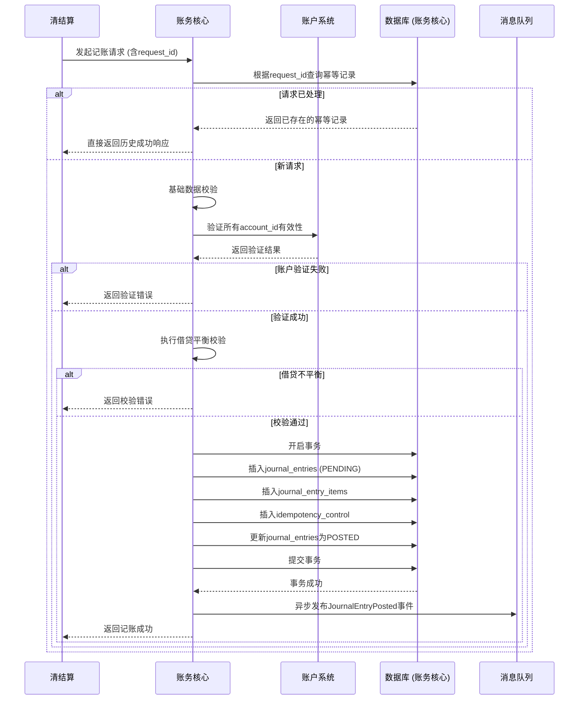
```mermaid
sequenceDiagram
    participant 上游 as 清结算
    participant 账务核心
    participant 账户系统
    participant DB as 数据库 (账务核心)
    participant MQ as 消息队列

    上游->>账务核心: 发起记账请求 (含request_id)
    账务核心->>DB: 根据request_id查询幂等记录
    alt 请求已处理
        DB-->>账务核心: 返回已存在的幂等记录
        账务核心-->>上游: 直接返回历史成功响应
    else 新请求
        账务核心->>账务核心: 基础数据校验
        账务核心->>账户系统: 验证所有account_id有效性
        账户系统-->>账务核心: 返回验证结果
        alt 账户验证失败
            账务核心-->>上游: 返回验证错误
        else 验证成功
            账务核心->>账务核心: 执行借贷平衡校验
            alt 借贷不平衡
                账务核心-->>上游: 返回校验错误
            else 校验通过
                账务核心->>DB: 开启事务
                账务核心->>DB: 插入journal_entries (PENDING)
                账务核心->>DB: 插入journal_entry_items
                账务核心->>DB: 插入idempotency_control
                账务核心->>DB: 更新journal_entries为POSTED
                账务核心->>DB: 提交事务
                DB-->>账务核心: 事务成功
                账务核心->>MQ: 异步发布JournalEntryPosted事件
                账务核心-->>上游: 返回记账成功
            end
        end
    end
```

### 6. 错误处理
- **预期错误情况**:
    1.  **客户端错误 (4xx)**: 请求数据格式错误、必填字段缺失、借贷金额不平衡、账户验证失败。
    2.  **服务器错误 (5xx)**: 数据库连接失败、事务提交失败、依赖服务（账户系统）不可用、消息队列发布失败。
- **处理策略**:
    - **立即失败**: 对于数据校验、业务规则校验（如借贷不平衡、账户无效）失败，立即返回明确的错误信息，不进行重试。
    - **重试机制**: 对于网络抖动、数据库死锁等瞬时系统错误，采用指数退避策略进行有限次重试（如最多3次）。
    - **补偿机制**: 对于已记账但因后续步骤（如事件发布）失败而整体标记为失败的情况，设计后台补偿任务，定期扫描状态异常的分录，尝试完成后续操作或进行人工干预。
    - **死信队列**: 对于重试多次仍失败的请求（如因账户系统长时间不可用），将请求信息转入死信队列，并触发告警，供运维人员排查。
    - **日志与监控**: 所有错误，无论等级，均需记录结构化日志，包含请求ID、错误码、堆栈信息。设置关键指标监控（如记账失败率、平均处理时长）。

### 7. 依赖关系
- **上游模块**:
    - **清结算**: **主要依赖**。发起记账请求的核心上游，需确保其传递正确的业务数据、账户信息和唯一的 `request_id`。
    - **账户系统**: **只读依赖**。用于记账前的账户有效性验证。本模块不直接修改账户余额。
- **下游模块**:
    - **对账单系统**: **主要服务对象**。通过查询本模块的明细数据，或订阅 `JournalEntryPosted` 事件，来生成和核对各类对账单。
    - **业务核心**: TBD (关系待明确，可能是数据提供方或事件消费者)。
- **外部依赖**:
    - 数据库 (PostgreSQL/MySQL)
    - 消息队列 (Kafka/RocketMQ) - 用于事件发布
    - 账户系统只读API

<a id="module-6"></a>

## 3.6 电子签约平台


### 1. 概述
- **目的与范围**: 本模块负责协议模板管理、短信H5封装、调用认证系统、完成电子协议签署并留存证据链。其核心职责是为“关系绑定”、“开通付款”等业务流程提供电子签约能力，确保协议签署的合法性、真实性与可追溯性。
- **系统角色澄清**: 根据术语表，本模块是“系统角色/参与者”之一。其上游依赖是提供身份核验能力的“认证系统”（同为系统角色）。其下游调用方是“三代”和“行业钱包”这两个系统角色，它们在执行业务流程（如“关系绑定”、“开通付款”）时需要调用本模块的服务。

### 2. 接口设计
- **API端点 (REST)**:
    - `POST /v1/agreements/initiate`: 发起签约流程。接收业务参数，生成签约会话。
    - `GET /v1/agreements/sessions/{sessionId}`: 查询签约会话状态及详情。
    - `POST /v1/agreements/sessions/{sessionId}/resend-sms`: 重新发送签约短信。
    - `POST /v1/agreements/callback/authentication`: 认证系统完成验证后的回调接口。
    - `GET /v1/agreements/{agreementId}`: 查询已签署的协议及证据链信息。
- **请求/响应结构**:
    - 发起签约请求 (`POST /v1/agreements/initiate`):
        - 请求体: `{“bizScene”: “RELATION_BINDING” | “PAYMENT_ENABLEMENT”, “bizId”: “string”, “templateId”: “string”, “parties”: [{“name”: “string”, “idCard”: “string”, “mobile”: “string”, “bankCardNo”: “string”}]}`
        - 响应体: `{“sessionId”: “string”, “expireAt”: “timestamp”}`
    - 认证回调请求 (`POST /v1/agreements/callback/authentication`):
        - 请求体: `{“sessionId”: “string”, “authToken”: “string”, “authResult”: “SUCCESS” | “FAILED”, “authMethod”: “PAYMENT” | “FACE”, “authTime”: “timestamp”, “metadata”: “object”}`
- **发布/消费的事件**:
    - 发布事件: `AgreementSignedEvent` (协议签署完成事件)，包含协议ID、签署方、签署时间、业务场景和业务ID。
    - 消费事件: TBD。

### 3. 数据模型
- **表/集合**:
    - `agreement_template`: 协议模板表。
        - 关键字段: `id`, `name`, `biz_scene`, `content`, `version`, `is_active`, `created_at`。
    - `signing_session`: 签约会话表，记录一次签约流程的完整状态。
        - 关键字段: `session_id`, `biz_scene`, `biz_id`, `template_id`, `parties_info` (JSON), `status` (`INIT`, `SMS_SENT`, `AUTH_SUCCESS`, `SIGNED`, `EXPIRED`, `CANCELLED`), `sms_h5_url`, `auth_token`, `expire_at`, `created_at`。
    - `signed_agreement`: 已签署协议表。
        - 关键字段: `agreement_id`, `session_id`, `final_content`, `signed_at`, `parties_signature` (JSON)，存储各方签署确认信息。
    - `evidence_record`: 证据链记录表，与 `signed_agreement` 一对一关联。
        - 关键字段: `agreement_id`, `auth_evidence` (JSON，包含认证方式、结果、时间、流水号等), `signing_evidence` (JSON，包含用户IP、User-Agent、时间戳、操作序列), `raw_protocol_data` (JSON，原始协议数据), `created_at`。
- **与其他模块的关系**: 本模块通过API调用“认证系统”。`signing_session.biz_id` 可能与“三代”或“行业钱包”模块的业务记录关联。

### 4. 业务逻辑
- **核心工作流/算法**:
    1.  **发起签约**: 接收调用方请求，根据`bizScene`和`templateId`获取协议模板，填充变量生成最终协议内容。创建`signing_session`记录，状态为`INIT`。
    2.  **生成并发送签约链接**: 为会话生成唯一、有时效性的H5链接。链接需包含防篡改签名（如HMAC）和防重放攻击的随机数（nonce）。通过短信发送给签约方。会话状态转为`SMS_SENT`。
    3.  **身份核验**: 用户点击链接访问H5页面。页面引导用户选择/进行认证。本模块将用户重定向至“认证系统”的认证页面，并携带`sessionId`和回调地址。用户在该系统完成打款验证或人脸验证。
    4.  **认证回调与确认签署**: “认证系统”验证完成后，重定向用户回本模块H5页面，并携带认证结果令牌(`authToken`)。本模块通过后端回调接口验证该令牌的有效性。验证成功后，会话状态转为`AUTH_SUCCESS`，并向用户展示协议内容供确认签署。
    5.  **完成签署与存证**: 用户确认签署后，更新会话状态为`SIGNED`。生成唯一的`agreement_id`，将最终协议内容存入`signed_agreement`。同时，将整个流程中产生的数据（协议文本、认证证据、用户操作日志、环境信息）结构化后存入`evidence_record`，形成证据链。
    6.  **通知调用方**: 签署完成后，发布`AgreementSignedEvent`事件，通知下游系统角色（如“三代”、“行业钱包”）。
- **业务规则与验证**:
    - 签约方必须通过“认证系统”完成指定方式的身份核验。
    - 签约链接具有时效性（如30分钟），过期后会话状态转为`EXPIRED`。
    - 同一`bizId`和签约方，在已有`INIT`或`SMS_SENT`状态的会话时，新的发起请求应返回现有会话ID，防止重复签约流程。
- **关键边界情况处理**:
    - **并发控制**: 对`signing_session`表的创建和状态更新操作使用乐观锁或分布式锁，防止同一会话被重复处理。
    - **认证失败**: 认证失败后，H5页面提供重新发起认证的入口，后端会话状态保持`SMS_SENT`。
    - **中途放弃**: 会话状态机支持超时(`EXPIRED`)和手动取消(`CANCELLED`)状态。
    - **安全措施**: H5链接使用HTTPS；链接参数签名防止篡改；`authToken`为一次性使用，验证后立即失效；敏感信息（如身份证号、银行卡号）在传输和存储时进行加密。
    - **证据链规范**: 证据链数据包含时间戳、操作动作、操作结果、系统环境（IP、UA）、业务数据快照，满足法律取证要求。存储策略为长期持久化，保留期限遵循相关法规（TBD）。

### 5. 时序图
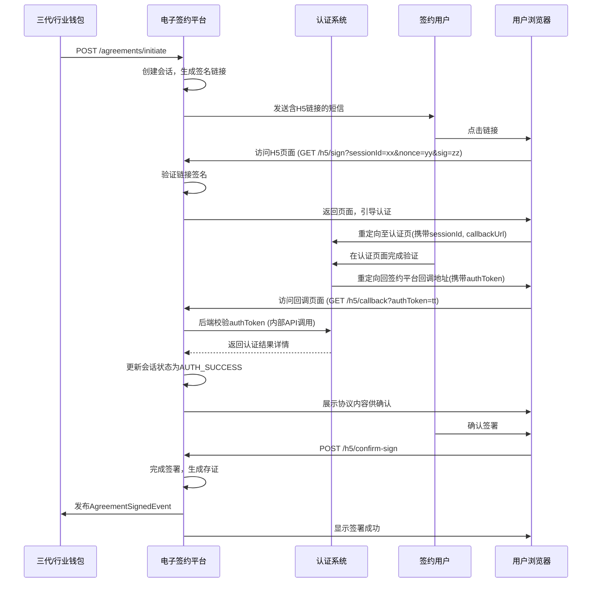
```mermaid
sequenceDiagram
    participant 调用方 as 三代/行业钱包
    participant 签约平台 as 电子签约平台
    participant 认证系统
    participant 用户 as 签约用户
    participant 浏览器 as 用户浏览器

    调用方->>签约平台: POST /agreements/initiate
    签约平台->>签约平台: 创建会话，生成签名链接
    签约平台->>用户: 发送含H5链接的短信
    用户->>浏览器: 点击链接
    浏览器->>签约平台: 访问H5页面 (GET /h5/sign?sessionId=xx&nonce=yy&sig=zz)
    签约平台->>签约平台: 验证链接签名
    签约平台->>浏览器: 返回页面，引导认证
    浏览器->>认证系统: 重定向至认证页(携带sessionId, callbackUrl)
    用户->>认证系统: 在认证页面完成验证
    认证系统->>浏览器: 重定向回签约平台回调地址(携带authToken)
    浏览器->>签约平台: 访问回调页面 (GET /h5/callback?authToken=tt)
    签约平台->>认证系统: 后端校验authToken (内部API调用)
    认证系统-->>签约平台: 返回认证结果详情
    签约平台->>签约平台: 更新会话状态为AUTH_SUCCESS
    签约平台->>浏览器: 展示协议内容供确认
    用户->>浏览器: 确认签署
    浏览器->>签约平台: POST /h5/confirm-sign
    签约平台->>签约平台: 完成签署，生成存证
    签约平台->>调用方: 发布AgreementSignedEvent
    签约平台->>浏览器: 显示签署成功
```

### 6. 错误处理
- **预期错误情况**:
    - 认证系统调用失败或超时。
    - 用户认证不通过。
    - 协议模板不存在或版本失效。
    - 短信服务发送失败。
    - 签约链接被篡改或重复使用。
    - 会话已过期或已被签署。
    - 数据存储异常。
- **处理策略**:
    - 对“认证系统”等外部依赖调用配置重试机制和熔断器。
    - 链接签名验证失败则直接拒绝访问，返回错误页面。
    - 会话状态不合法时，向用户展示明确的错误提示（如“链接已失效”）。
    - 所有错误记录详细日志，包含`sessionId`、`bizId`和错误上下文。
    - 向调用方返回明确的业务错误码和提示信息。

### 7. 依赖关系
- **上游依赖**:
    - **认证系统** (系统角色): 提供打款验证和人脸验证的身份核验能力，并通过回调通知结果。依赖其认证页面重定向及Token验证API。
- **下游服务对象**:
    - **三代** (系统角色): 在“关系绑定”等流程中调用本模块发起签约。
    - **行业钱包** (系统角色): 在“开通付款”等流程中调用本模块发起签约。
- **基础设施依赖**:
    - 短信发送服务。
    - 数据库。
    - 消息队列（用于发布事件）。

<a id="module-7"></a>

## 3.7 认证系统


### 1. 概述
- **目的与范围**: 本模块负责提供统一的身份核验能力，用于确认用户身份的真实性和银行卡的有效性。核心职责包括处理打款验证和人脸验证，为电子签约、关系绑定、开通付款等业务流程提供认证支持。本模块不负责业务逻辑处理，仅作为认证能力的提供方。

### 2. 接口设计
- **API端点 (REST)**:
    - `POST /api/v1/verification/payment`: 发起打款验证请求。
    - `POST /api/v1/verification/face`: 发起人脸验证请求。
    - `POST /api/v1/verification/{verification_id}/confirm`: 确认打款验证（回填金额）。
    - `GET /api/v1/verification/{verification_id}`: 查询验证状态与结果。
- **请求/响应结构**:
    - **打款验证请求**:
        - 请求体: `{“user_name”: “string”, “id_card_no”: “string”, “bank_card_no”: “string”, “mobile”: “string”, “request_source”: “string”}`
        - 响应体: `{“verification_id”: “string”, “status”: “PENDING”, “message”: “string”}`
    - **人脸验证请求**:
        - 请求体: `{“user_name”: “string”, “id_card_no”: “string”, “face_image_data”: “base64_string”, “request_source”: “string”}`
        - 响应体: `{“verification_id”: “string”, “status”: “PROCESSING”, “score”: “number”, “result”: “boolean”}`
    - **打款确认请求**:
        - 请求体: `{“amount”: “number”}`
        - 响应体: `{“verification_id”: “string”, “status”: “SUCCESS/FAILED”, “message”: “string”}`
- **发布/消费的事件**:
    - 发布事件: `VerificationCompleted` (包含 `verification_id`, `type`, `result`, `user_info`, `timestamp`)。
    - 消费事件: TBD。

### 3. 数据模型
- **表/集合**:
    - `verification_requests`: 存储所有验证请求的主表。
    - `payment_verification_details`: 存储打款验证的详细信息。
    - `face_verification_details`: 存储人脸验证的详细信息。
- **关键字段**:
    - `verification_requests`: `verification_id` (PK), `user_id`, `type` (PAYMENT/FACE), `status` (PENDING, PROCESSING, SUCCESS, FAILED, EXPIRED), `request_source`, `created_at`, `updated_at`。
    - `payment_verification_details`: `verification_id` (FK), `bank_card_no`, `random_amount`, `transaction_id`, `confirmed_amount`, `retry_count`, `bank_response`。
    - `face_verification_details`: `verification_id` (FK), `id_card_no`, `match_score`, `threshold`, `third_party_response`。
- **与其他模块的关系**: 本模块被电子签约平台调用，以完成协议签署前的身份核验。验证结果通过事件或API回调通知调用方。

### 4. 业务逻辑
- **核心工作流/算法**:
    1. **打款验证**:
        - 接收并校验请求参数（姓名、身份证号、银行卡号）。
        - 生成唯一 `verification_id` 并持久化请求记录，状态为 `PENDING`。
        - 调用银行打款接口，传入银行卡号及系统生成的随机小额金额（如0.01-0.99元），记录银行返回的交易流水号。
        - 等待用户回填金额。用户通过确认接口提交金额后，系统比对用户回填金额与系统打款金额。
        - 若金额一致，则更新验证状态为 `SUCCESS`；若不一致，则记录失败并更新状态为 `FAILED`，可配置允许重试次数。
        - 发布 `VerificationCompleted` 事件。
    2. **人脸验证**:
        - 接收并校验请求参数（姓名、身份证号、人脸图像）。
        - 生成唯一 `verification_id` 并持久化请求记录，状态为 `PROCESSING`。
        - 调用第三方人脸比对服务（如公安库或商业服务），传入姓名、身份证号及人脸图像。
        - 接收比对结果（通常包含相似度分数）。根据预设阈值判断验证成功或失败。
        - 更新验证状态为 `SUCCESS` 或 `FAILED`，并记录分数与原始响应。
        - 发布 `VerificationCompleted` 事件。
- **业务规则与验证**:
    - 验证请求必须包含必要的身份信息（如姓名、身份证号、银行卡号/人脸图像），并进行格式与有效性校验。
    - 打款验证的随机金额有效期为24小时，超时后状态置为 `EXPIRED`。
    - 同一用户（身份证号）在短时间内连续验证失败超过N次（如3次），系统将锁定该用户一段时间（如1小时），禁止发起新验证。
    - 所有验证结果、请求参数、第三方响应及证据链需可靠记录，用于审计。
- **关键边界情况处理**:
    - **网络超时或第三方服务不可用**: 设计指数退避重试机制（最多3次）。若最终失败，更新验证状态为 `FAILED`，并记录错误原因。
    - **数据一致性**: 使用数据库事务确保请求记录与详情记录同时创建或更新。
    - **幂等性**: 通过 `verification_id` 保证同一验证请求的重复提交不会产生副作用。

### 5. 时序图

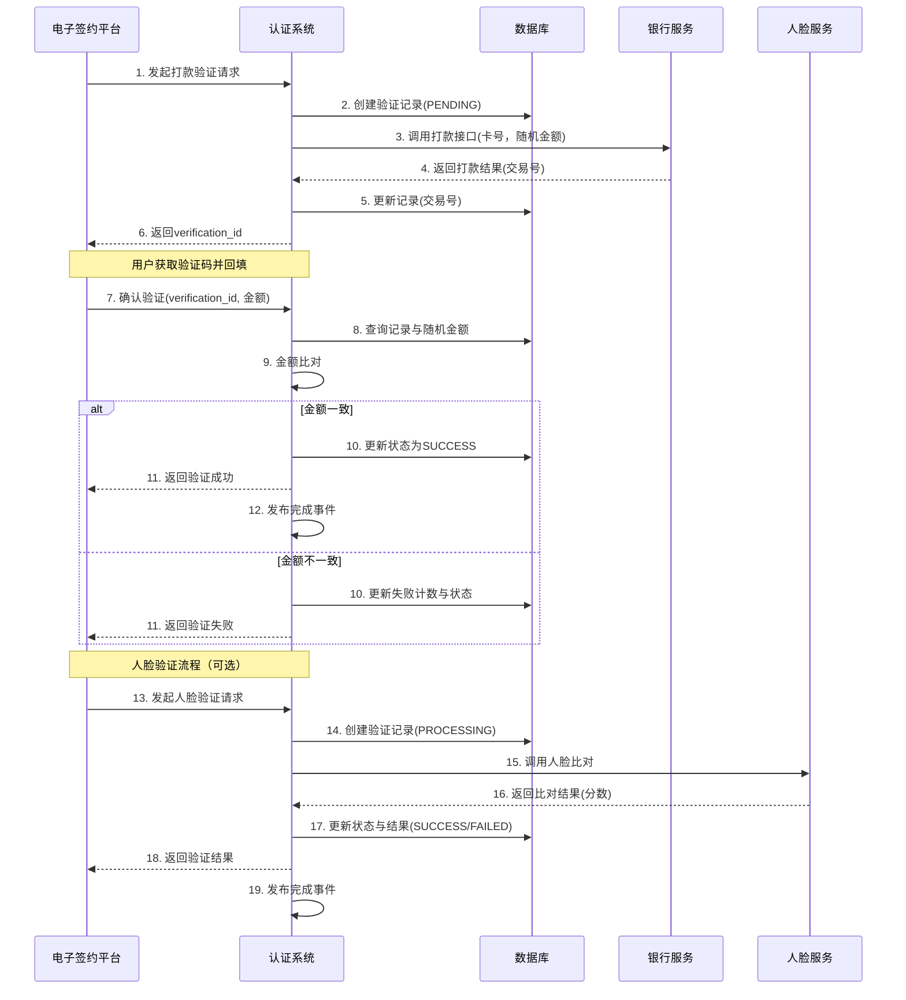
```mermaid
sequenceDiagram
    participant 调用方 as 电子签约平台
    participant 认证系统
    participant DB as 数据库
    participant 银行服务
    participant 人脸服务

    调用方->>认证系统: 1. 发起打款验证请求
    认证系统->>DB: 2. 创建验证记录(PENDING)
    认证系统->>银行服务: 3. 调用打款接口(卡号，随机金额)
    银行服务-->>认证系统: 4. 返回打款结果(交易号)
    认证系统->>DB: 5. 更新记录(交易号)
    认证系统-->>调用方: 6. 返回verification_id

    Note over 调用方,认证系统: 用户获取验证码并回填

    调用方->>认证系统: 7. 确认验证(verification_id, 金额)
    认证系统->>DB: 8. 查询记录与随机金额
    认证系统->>认证系统: 9. 金额比对
    alt 金额一致
        认证系统->>DB: 10. 更新状态为SUCCESS
        认证系统-->>调用方: 11. 返回验证成功
        认证系统->>认证系统: 12. 发布完成事件
    else 金额不一致
        认证系统->>DB: 10. 更新失败计数与状态
        认证系统-->>调用方: 11. 返回验证失败
    end

    Note over 调用方,认证系统: 人脸验证流程（可选）

    调用方->>认证系统: 13. 发起人脸验证请求
    认证系统->>DB: 14. 创建验证记录(PROCESSING)
    认证系统->>人脸服务: 15. 调用人脸比对
    人脸服务-->>认证系统: 16. 返回比对结果(分数)
    认证系统->>DB: 17. 更新状态与结果(SUCCESS/FAILED)
    认证系统-->>调用方: 18. 返回验证结果
    认证系统->>认证系统: 19. 发布完成事件
```

### 6. 错误处理
- **预期错误情况**:
    - **用户信息不完整或格式错误**: 返回400错误，附带具体字段校验失败信息。
    - **银行卡无效或打款失败**: 记录银行返回的具体错误码，返回业务失败响应，状态码为422。
    - **人脸比对失败或非本人**: 返回验证失败结果，包含失败原因（如“比对分数低于阈值”）。
    - **第三方服务（银行、公安库）调用异常**: 记录异常日志，根据重试策略处理，最终返回“系统繁忙，请稍后重试”或服务不可用状态。
    - **验证请求已过期或不存在**: 返回404或410状态码。
- **处理策略**:
    - 对输入参数进行严格校验，返回明确的错误码和提示信息。
    - 记录详细的错误日志，包含 `verification_id`、第三方响应和堆栈信息，便于排查。
    - 对可重试的错误（如网络超时）设计指数退避重试机制。
    - 实现全局异常处理器，将未捕获异常转换为通用的500错误响应，避免泄露内部信息。

### 7. 依赖关系
- **上游模块/调用方**: 电子签约平台（调用本模块进行认证，以完成关系绑定、开通付款等流程）。
- **下游服务/依赖**:
    - 银行系统（或支付通道）: 执行小额打款操作。
    - 第三方人脸比对服务（如公安系统或商业API）: 进行身份生物特征核验。
    - 内部消息队列: 用于发布验证完成事件。
- **数据存储**: 关系型数据库（如MySQL）用于持久化验证记录。

<a id="module-8"></a>

## 3.8 计费中台


### 1. 概述
- **目的与范围**: 本模块提供统一的计费能力，负责根据业务配置生成计费流水，并计算分账/转账交易的手续费。其核心职责是处理与资金划转相关的费用计算，并决定手续费由付款方或收款方承担。模块边界限定于计费规则的执行和计费流水记录，不涉及计费规则的配置管理。

### 2. 接口设计
- **API端点 (REST/GraphQL)**:
    - `POST /api/v1/fee/calculate`: 计算手续费接口。
    - `GET /api/v1/fee/record/{recordId}`: 查询计费流水详情接口。
- **请求/响应结构**:
    - 计算手续费请求 (`POST /api/v1/fee/calculate`):
        - `transactionId`: 交易唯一标识。
        - `transactionType`: 交易类型（如：分账、转账）。
        - `payerId`: 付款方标识。
        - `payeeId`: 收款方标识。
        - `amount`: 交易金额。
        - `institutionCode`: 机构号。
        - `appId`: 应用标识。
    - 计算手续费响应:
        - `feeRecordId`: 计费流水唯一标识。
        - `calculatedFee`: 计算出的手续费金额。
        - `feeBearer`: 手续费承担方（`PAYER` 或 `PAYEE`）。
        - `currency`: 币种。
- **发布/消费的事件**:
    - 发布事件: `FeeCalculatedEvent` (计费完成事件)，包含计费流水ID、交易ID、手续费金额、承担方等信息。
    - 消费事件: TBD。

### 3. 数据模型
- **表/集合**:
    - `fee_rule` (计费规则表): 存储计费规则配置。
    - `fee_record` (计费流水表): 记录每次计费的结果。
- **关键字段**:
    - `fee_rule` 表:
        - `id`: 规则ID。
        - `institution_code`: 机构号。
        - `app_id`: 应用标识。
        - `fee_type`: 计费类型（百分比、固定金额、阶梯费率）。
        - `fee_rate`: 费率值（如百分比为0.01表示1%）。
        - `fixed_fee`: 固定费用。
        - `fee_bearer_logic`: 承担方判定逻辑（如：固定为付方、固定为收方、按规则计算）。
        - `min_fee`: 最低手续费。
        - `max_fee`: 最高手续费。
        - `rounding_rule`: 舍入规则（如：四舍五入、向上取整、向下取整）。
        - `effective_start`: 规则生效时间。
        - `effective_end`: 规则失效时间。
        - `status`: 规则状态（启用/禁用）。
    - `fee_record` 表:
        - `id`: 计费流水ID。
        - `transaction_id`: 关联的交易ID。
        - `transaction_type`: 交易类型。
        - `fee_rule_id`: 应用的计费规则ID。
        - `original_amount`: 原始交易金额。
        - `calculated_fee`: 计算出的手续费金额。
        - `fee_bearer`: 手续费承担方。
        - `currency`: 币种。
        - `calculation_time`: 计算时间。
        - `status`: 流水状态（已计算、已核销）。
- **与其他模块的关系**: 接收来自“三代”或“行业钱包”的计费请求，生成的计费流水被“清结算”用于资金清算，被“账务核心”引用用于记账。

### 4. 业务逻辑
- **核心工作流/算法**:
    1.  **接收请求**: 接收来自上游（三代、行业钱包）的计费请求。
    2.  **规则查询与验证**: 根据请求中的机构号、应用标识、交易类型等信息，查询有效的计费规则。验证规则是否在有效期内且状态为启用。
    3.  **手续费计算**:
        - **算法**:
            - **百分比费率**: `手续费 = 交易金额 * 费率`。
            - **固定费用**: `手续费 = 固定费用`。
            - **阶梯费率**: 根据交易金额所在阶梯区间，应用对应的费率或固定费用。
        - **精度与舍入**: 计算过程中使用高精度小数。最终结果根据规则中的 `rounding_rule` 进行舍入，并遵守 `min_fee` 和 `max_fee` 的限制。
    4.  **承担方判定**:
        - 读取规则中的 `fee_bearer_logic` 字段。
        - 逻辑可能为：
            - `PAYER`: 固定由付款方承担。
            - `PAYEE`: 固定由收款方承担。
            - `CALCULATED`: 根据特定业务规则计算（例如，按交易类型、参与方身份等）。具体计算逻辑 TBD。
    5.  **生成流水**: 将交易信息、应用的规则ID、计算结果、承担方等信息持久化到 `fee_record` 表，并生成唯一流水ID。
    6.  **返回结果**: 将计费结果（含流水ID）返回给调用方。
- **业务规则与验证**:
    - 必须找到一条且仅一条在有效期内的有效计费规则，否则触发默认计费流程。
    - 计算出的手续费不能为负数。
    - 承担方必须明确为 `PAYER` 或 `PAYEE`。
- **关键边界情况处理**:
    - **零手续费场景**: 当计算出的手续费经过舍入和限制后为零时，仍生成一条手续费为零的计费流水。
    - **费率配置缺失或失效**: 触发默认计费策略。默认策略为：手续费为零，承担方为付款方 (`PAYER`)。
    - **金额过小导致计算异常**: 在应用百分比费率前，会检查交易金额和费率，避免因金额过小导致的计算下溢或除零错误。若计算出的手续费低于系统最小货币单位，则按零处理。

### 5. 时序图

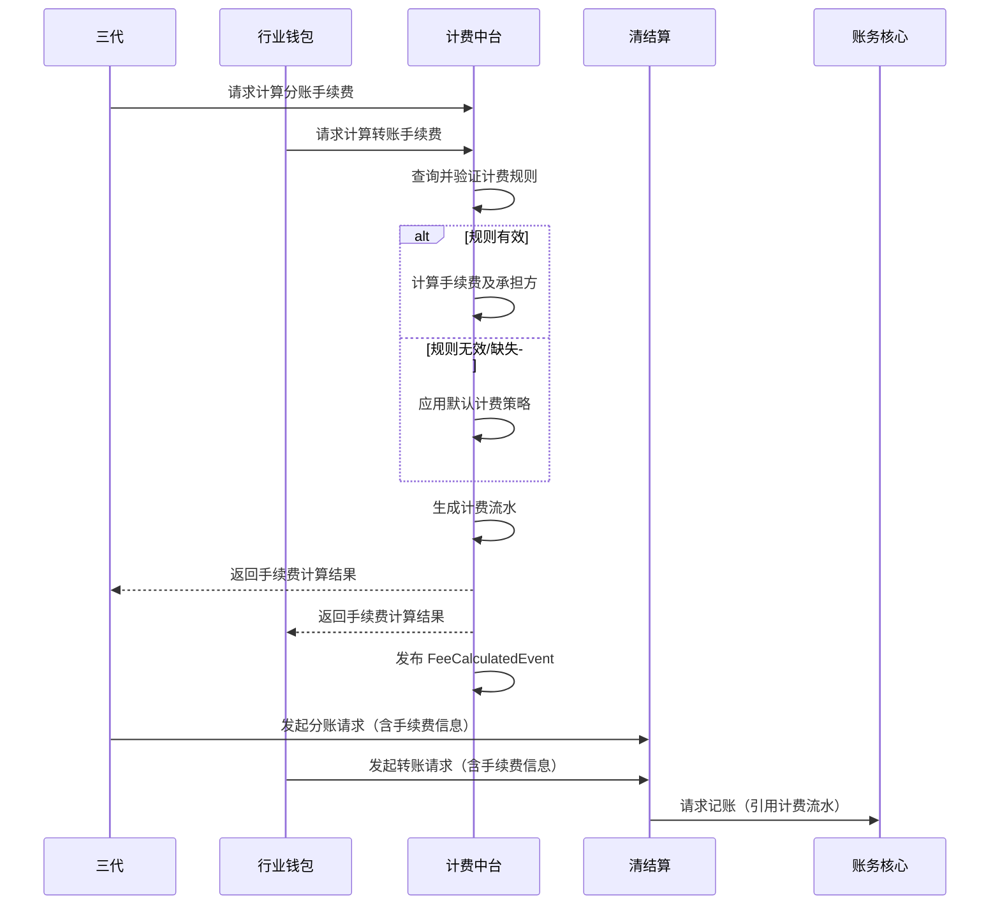
```mermaid
sequenceDiagram
    participant 三代
    participant 行业钱包
    participant 计费中台
    participant 清结算
    participant 账务核心

    三代->>计费中台: 请求计算分账手续费
    行业钱包->>计费中台: 请求计算转账手续费
    计费中台->>计费中台: 查询并验证计费规则
    alt 规则有效
        计费中台->>计费中台: 计算手续费及承担方
    else 规则无效/缺失
        计费中台->>计费中台: 应用默认计费策略
    end
    计费中台->>计费中台: 生成计费流水
    计费中台-->>三代: 返回手续费计算结果
    计费中台-->>行业钱包: 返回手续费计算结果
    计费中台->>计费中台: 发布 FeeCalculatedEvent
    三代->>清结算: 发起分账请求（含手续费信息）
    行业钱包->>清结算: 发起转账请求（含手续费信息）
    清结算->>账务核心: 请求记账（引用计费流水）
```

### 6. 错误处理
- **预期错误情况**:
    - `FEE_RULE_NOT_FOUND`: 未找到适用的有效计费规则。
    - `FEE_RULE_INVALID`: 找到的计费规则配置无效（如费率格式错误）。
    - `FEE_CALCULATION_ERROR`: 手续费计算过程出现算术异常。
    - `SYSTEM_ERROR`: 数据库连接失败、内部服务异常等系统级错误。
- **处理策略**:
    - 对于 `FEE_RULE_NOT_FOUND` 和 `FEE_RULE_INVALID`，触发默认计费流程（手续费为零，承担方为付款方），并记录警告日志。
    - 对于 `FEE_CALCULATION_ERROR`，记录详细错误日志和上下文信息，向上游返回计算失败错误，交易应被阻断。
    - 对于 `SYSTEM_ERROR`，记录错误日志，触发系统告警，并向上游返回系统暂时不可用错误。

### 7. 依赖关系
- **上游模块**:
    - **三代**: 在处理天财发起的“分账”、“批量付款”等指令时，调用计费中台计算手续费。
    - **行业钱包**: 在处理用户发起的“转账”等钱包内资金划转时，调用计费中台计算手续费。
- **下游模块**:
    - **清结算**: 在执行资金清算时，使用计费中台返回的手续费结果进行净额计算。
    - **账务核心**: 在记录会计分录时，引用计费中台生成的计费流水，记录手续费相关的账务明细。

<a id="module-9"></a>

## 3.9 业务核心


### 1. 概述
- **目的与范围**: 业务核心模块负责接收并存储天财发起的各类交易数据，特别是分账、批量付款等业务的核心交易记录。它是业务数据的持久化层，为下游的对账单生成、数据查询等提供数据支撑。其边界在于接收上游系统（如三代）的业务指令数据并落库，不涉及资金处理、账户操作或复杂的业务逻辑计算。

### 2. 接口设计
- **API端点 (REST/GraphQL)**: TBD
- **请求/响应结构**: TBD
- **发布/消费的事件**: TBD

### 3. 数据模型
- **表/集合**: TBD
- **关键字段**: TBD
- **与其他模块的关系**: 存储来自三代等上游模块的业务指令数据；为对账单系统提供原始交易数据以生成对账单。

### 4. 业务逻辑
- **核心工作流/算法**: 接收上游系统（如三代）传递的天财分账、批量付款等业务请求数据，进行必要的格式校验后，将交易信息（如交易流水号、机构号、金额、参与方信息、状态、时间戳等）持久化存储到数据库中。
- **业务规则与验证**: 对接收到的数据进行基础校验，如数据格式、必填字段、业务流水号唯一性等。
- **关键边界情况处理**: 处理数据重复提交、数据格式异常等场景，确保数据的一致性和完整性。

### 5. 时序图

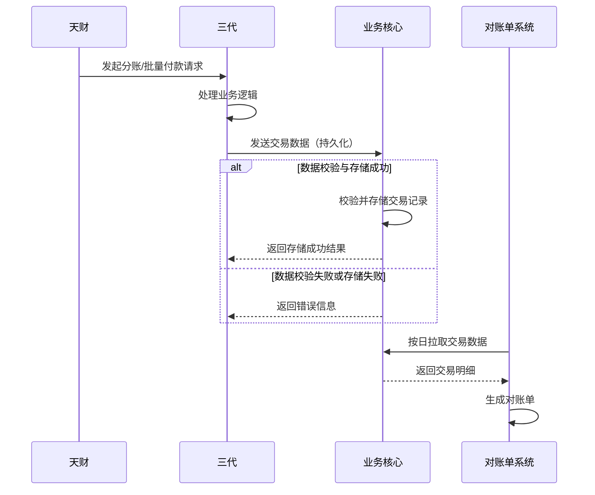
```mermaid
sequenceDiagram
    participant 天财
    participant 三代
    participant 业务核心
    participant 对账单系统

    天财->>三代: 发起分账/批量付款请求
    三代->>三代: 处理业务逻辑
    三代->>业务核心: 发送交易数据（持久化）
    alt 数据校验与存储成功
        业务核心->>业务核心: 校验并存储交易记录
        业务核心-->>三代: 返回存储成功结果
    else 数据校验失败或存储失败
        业务核心-->>三代: 返回错误信息
    end
    对账单系统->>业务核心: 按日拉取交易数据
    业务核心-->>对账单系统: 返回交易明细
    对账单系统->>对账单系统: 生成对账单
```

### 6. 错误处理
- **预期错误情况**: 数据存储失败（如数据库连接异常）、接收到的数据格式错误、关键字段缺失、业务流水号冲突。
- **处理策略**: 对数据格式错误和字段缺失的请求直接返回错误；对存储失败进行重试机制；对流水号冲突进行幂等处理，确保数据不重复。

### 7. 依赖关系
- **上游模块**: 三代
- **下游模块**: 对账单系统

<a id="module-10"></a>

## 3.10 对账单系统


### 1. 概述
- **目的与范围**: 本模块负责生成和提供各类对账单，包括交易明细、结算明细、账户动账明细以及分账、提款等特定业务账单，用于支持天财、商户及内部系统进行资金核对。核心职责包括按计划批量生成账单文件、提供账单查询与下载接口、确保账单数据与源系统的一致性。

### 2. 接口设计
- **API端点 (REST)**: 
  - `POST /api/v1/statements/generate`: 触发账单生成任务。请求体需包含账单类型、账单日期、机构号等参数。
  - `GET /api/v1/statements`: 查询账单列表。支持按机构号、账单类型、账单日期范围、状态等条件筛选。
  - `GET /api/v1/statements/{statementId}/download`: 获取指定账单的下载链接。
  - `GET /api/v1/statements/reconciliation/{date}`: 触发指定日期的对账核对，并返回核对结果摘要。
- **请求/响应结构**: TBD
- **发布/消费的事件**: 
  - 消费事件：`DailySettlementCompletedEvent`（来自清结算，触发日终账单生成）、`TransactionBatchImportedEvent`（来自业务核心，触发交易明细账单生成）。
  - 发布事件：`StatementGeneratedEvent`（账单生成完成事件，包含账单ID、类型、存储路径）。

### 3. 数据模型
- **表/集合**:
  - `statement_metadata`（账单元数据表）：存储账单生成任务的基本信息、状态和结果。
  - `statement_line_item`（账单明细表）：存储构成账单的每一行明细数据，关联到元数据。
  - `reconciliation_log`（对账日志表）：记录与上游系统数据核对的详细结果。
- **关键字段**:
  - `statement_metadata`: `statement_id`（主键）， `statement_type`（枚举：交易、结算、动账、分账、提款）， `statement_date`， `institution_id`（机构号）， `status`（生成中、成功、失败）， `file_path`， `generated_at`， `checksum`。
  - `statement_line_item`: `id`， `statement_id`（外键）， `line_data`（JSON，存储明细字段如交易流水号、金额、时间、对手方等）， `source_system`（数据来源系统）。
  - `reconciliation_log`: `log_id`， `reconciliation_date`， `statement_type`， `institution_id`， `source_total_amount`， `statement_total_amount`， `difference`， `status`（一致、不一致）， `detail`。
- **与其他模块的关系**: 本模块依赖**业务核心**获取交易数据，依赖**清结算**获取结算与动账数据，依赖**账户系统**获取账户信息，依赖**计费中台**获取计费流水。数据通过事件或API异步获取。

### 4. 业务逻辑
- **核心工作流/算法**:
  1.  **触发与调度**: 主要采用“按日”批量生成模式。通过定时任务（如每日凌晨01:00）扫描待生成账单日期，或监听上游系统（如清结算）发布的日终完成事件自动触发。支持“按需”通过管理API手动触发指定日期和类型的账单生成，并确保幂等性（基于`机构号+账单类型+账单日期`校验是否已存在成功账单）。
  2.  **数据获取与加工**: 根据账单类型，调用相应上游系统的数据接口或消费其事件消息，获取原始明细数据。对于分账、提款账单，需关联**业务核心**的交易数据、**清结算**的结算流水、**计费中台**的手续费流水以及**账户系统**的账户信息。进行必要的字段映射、格式转换与金额汇总（如按商户汇总交易总额、手续费总额、净结算额）。
  3.  **文件生成与存储**: 将加工后的数据按预设格式生成文件。格式包括CSV和Excel，字段模板根据账单类型预定义（例如，交易结算账单包含字段：交易日期、交易流水号、商户号、交易金额、手续费、结算金额、结算状态、结算时间）。文件生成后上传至对象存储服务，并记录元数据。
  4.  **数据核对**: 账单生成后，执行核对逻辑。将账单中的关键汇总数据（如总交易笔数、总金额）与从上游系统直接查询的原始汇总数据进行比对。若不一致，则记录差异详情至`reconciliation_log`表，并触发告警通知运营人员，账单状态标记为“待核查”。
- **业务规则与验证**: 账单数据需与上游系统源数据核对，确保金额、笔数一致。账单生成需遵循固定的时间窗口和频率。不同机构号的数据隔离。
- **关键边界情况处理**: 处理上游数据延迟或缺失的情况，采用指数退避策略进行重试，并支持次日的补单机制。账单生成失败时记录错误日志，发出告警，并提供手动重试界面。

### 5. 时序图

#### 5.1 批量生成流程（定时/事件触发）
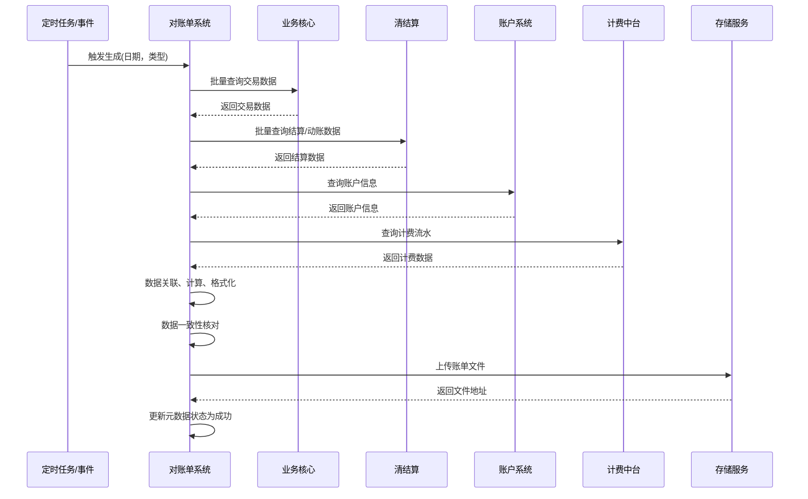
```mermaid
sequenceDiagram
    participant Scheduler as 定时任务/事件
    participant Statement as 对账单系统
    participant BizCore as 业务核心
    participant Clearing as 清结算
    participant Account as 账户系统
    participant Billing as 计费中台
    participant Storage as 存储服务

    Scheduler->>Statement: 触发生成(日期，类型)
    Statement->>BizCore: 批量查询交易数据
    BizCore-->>Statement: 返回交易数据
    Statement->>Clearing: 批量查询结算/动账数据
    Clearing-->>Statement: 返回结算数据
    Statement->>Account: 查询账户信息
    Account-->>Statement: 返回账户信息
    Statement->>Billing: 查询计费流水
    Billing-->>Statement: 返回计费数据
    Statement->>Statement: 数据关联、计算、格式化
    Statement->>Statement: 数据一致性核对
    Statement->>Storage: 上传账单文件
    Storage-->>Statement: 返回文件地址
    Statement->>Statement: 更新元数据状态为成功
```

#### 5.2 账单下载流程（用户请求）
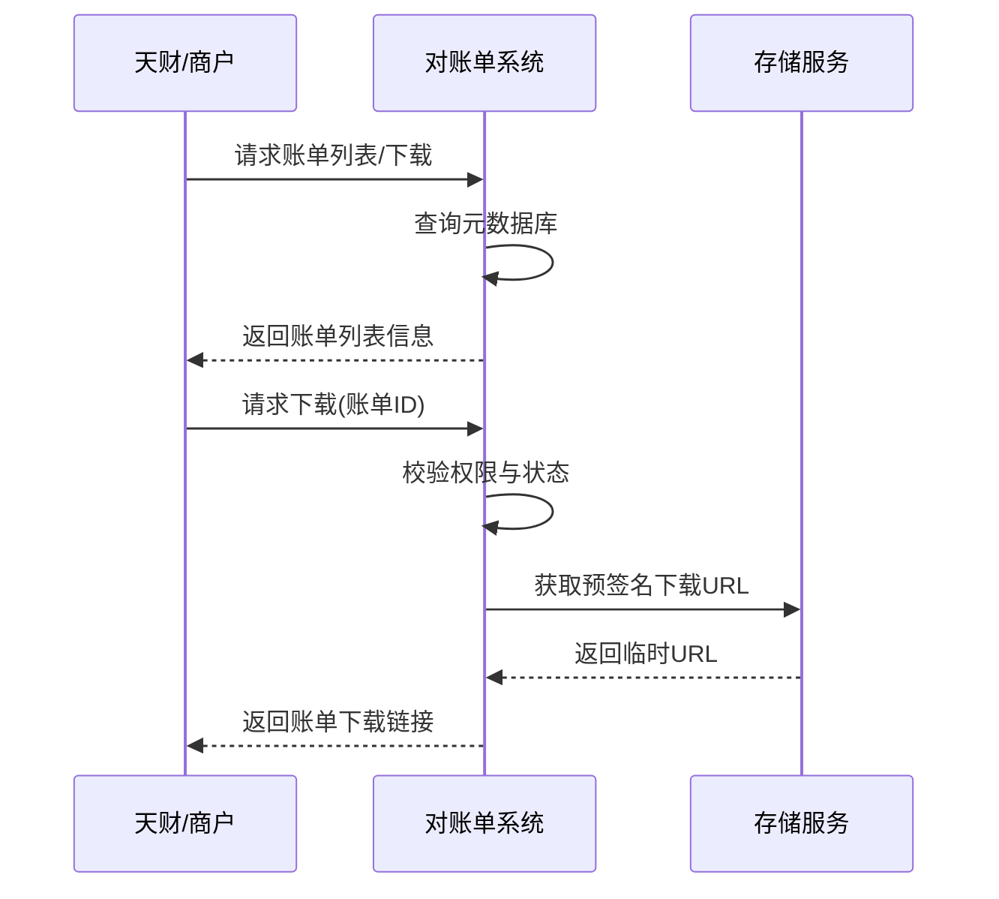
```mermaid
sequenceDiagram
    participant User as 天财/商户
    participant Statement as 对账单系统
    participant Storage as 存储服务

    User->>Statement: 请求账单列表/下载
    Statement->>Statement: 查询元数据库
    Statement-->>User: 返回账单列表信息
    User->>Statement: 请求下载(账单ID)
    Statement->>Statement: 校验权限与状态
    Statement->>Storage: 获取预签名下载URL
    Storage-->>Statement: 返回临时URL
    Statement-->>User: 返回账单下载链接
```

### 6. 错误处理
- **预期错误情况**: 上游数据源（业务核心、清结算等）服务不可用或超时；查询到的数据不一致；文件生成过程中发生IO错误；存储服务上传失败；核对结果不一致。
- **处理策略**: 
  - 对依赖服务调用设置合理超时，并实现带熔断机制的客户端重试。
  - 数据不一致时，记录详细差异至`reconciliation_log`，并触发高级别告警，通知相关人员介入处理。账单状态标记为异常，阻止自动推送。
  - 文件生成或上传失败时，任务状态标记为失败，记录错误信息。系统提供管理界面供运营手动查看失败任务并触发重试。
  - 所有未捕获异常均记录详细日志并触发系统告警。

### 7. 依赖关系
- **上游模块**: 
  - **业务核心**: 作为交易数据的权威来源，提供分账、提款等业务的原始交易记录。
  - **清结算**: 提供交易结算结果、资金动账明细的权威数据。
  - **账户系统**: 提供账户基础信息（如账户号、账户类型）。
  - **计费中台**: 提供与交易相关的计费流水，用于计算手续费并纳入账单。
- **下游模块**: 
  - **天财平台**: 主要账单消费方，下载对账文件进行资金核对。
  - **商户后台**: 商户查看和下载自身相关的对账单。
  - **内部运营系统**: 运营人员管理账单生成任务、查看核对异常。

<a id="module-11"></a>

## 3.11 风控


### 1. 概述
- **目的与范围**: 本模块负责对交易、商户及账户进行实时与离线的风险监控、判定，并基于判定结果发起冻结指令。其核心职责包括风险规则与模型的管理、风险事件的评估、以及冻结/解冻指令的生成与发布。模块边界止于风险指令的发起，不包含指令在账户系统或清结算系统中的具体执行。

### 2. 接口设计
- **API端点 (REST)**:
    - `POST /api/v1/risk/assessment/manual`: 手动触发对指定商户或交易的风险评估。
    - `GET /api/v1/risk/rules`: 查询当前生效的风险规则列表。
    - `POST /api/v1/risk/rules`: 创建新的风险规则（需授权）。
    - `PUT /api/v1/risk/rules/{ruleId}`: 更新指定风险规则（需授权）。
    - `POST /api/v1/freeze/manual`: 人工发起冻结指令（覆盖自动风控）。
    - `POST /api/v1/unfreeze/request`: 发起解冻申请（需审核）。
- **请求/响应结构**: TBD（需与调用方协商定义具体字段，如商户ID、交易号、冻结原因、申请备注等）。
- **发布/消费的事件**:
    - **发布的事件**:
        - `freeze_instruction_created`: 冻结指令已创建（包含指令ID、目标类型、目标ID、冻结原因、操作类型）。
        - `unfreeze_request_created`: 解冻申请已提交（包含申请ID、目标类型、目标ID、申请原因）。
    - **消费的事件**:
        - `transaction_created` (来自业务核心): 用于实时交易风险监控。
        - `settlement_completed` (来自清结算): 用于结算后资金风险监控。
        - `reconciliation_discrepancy` (来自对账单系统): 用于对账差异引发的风险判定。

### 3. 数据模型
- **表/集合**:
    - `risk_rules`: 风险规则定义表。
        - 关键字段: `rule_id`, `rule_name`, `rule_type` (实时/批量), `trigger_condition` (JSON), `action` (冻结/告警), `target_type` (商户/交易/账户), `priority`, `is_active`, `created_at`, `updated_by`。
    - `risk_events`: 风险事件记录表。
        - 关键字段: `event_id`, `trigger_source` (交易/结算/对账), `source_id`, `target_id`, `target_type`, `rule_id`, `risk_score`, `risk_level`, `event_data` (快照), `status` (待处理/已判定/已忽略), `created_at`。
    - `freeze_instructions`: 冻结指令表。
        - 关键字段: `instruction_id`, `target_type` (商户/交易), `target_id`, `freeze_type` (账户冻结/交易冻结), `reason`, `related_event_id`, `status` (已创建/已发送/已确认), `created_by` (系统/人工), `created_at`。
    - `merchant_risk_profiles`: 商户风险画像表。
        - 关键字段: `merchant_id`, `risk_level`, `last_risk_assessment_time`, `total_freeze_count`, `current_freeze_status`, `freeze_reason`, `frozen_until`, `profile_data` (JSON，存储行为指标), `updated_at`。
- **与其他模块的关系**: 风控模块通过`freeze_instructions`表记录发起的指令，并通过事件通知下游系统（账户系统、清结算）。`risk_events`表关联来自上游模块（业务核心、清结算、对账单系统）的数据源。

### 4. 业务逻辑
- **核心工作流/算法**:
    1. **规则管理与触发**:
        - 规则存储在`risk_rules`表中，支持实时规则（基于事件触发）和批量规则（定时任务扫描）。
        - 实时规则通过消费上游事件（如交易创建）触发评估。
        - 批量规则由调度任务定期执行，扫描历史数据（如商户单日交易额突增）。
    2. **风险判定**:
        - 事件触发后，调用规则引擎对输入数据（事件数据、商户画像）进行匹配与评分。
        - 生成`risk_events`记录，并根据规则配置的`action`决定后续操作（生成冻结指令或仅告警）。
    3. **指令发起与状态管理**:
        - 对于需冻结的情况，创建`freeze_instructions`记录，状态为“已创建”。
        - 发布`freeze_instruction_created`事件，由账户系统或清结算消费并执行。
        - 支持通过回调或事件确认更新指令状态为“已确认”。
    4. **解冻流程**:
        - 支持人工提交解冻申请（`POST /api/v1/unfreeze/request`），生成待审核任务。
        - 审核通过后，生成解冻指令（视为一种特殊的冻结指令，操作类型为“解冻”）并发布事件。
- **业务规则与验证**:
    - 冻结指令需幂等：通过`instruction_id`或`(target_type, target_id, freeze_type)`唯一键确保不会对同一目标重复创建有效的冻结指令。
    - 解冻申请需关联原冻结记录，并经过授权审核。
- **关键边界情况处理**:
    - **对已冻结目标的重复冻结**: 在创建指令前，检查`merchant_risk_profiles.current_freeze_status`或相关交易状态。若已冻结，则忽略或记录日志，不重复创建指令。
    - **风险判定数据不完整或延迟**: 设置规则评估超时与熔断机制。若核心数据（如交易金额）缺失，则判定结果为“数据不足”，风险事件状态为“已忽略”，并触发告警通知人工介入。
    - **冻结状态与有效期**: 冻结指令可包含`frozen_until`字段（在`merchant_risk_profiles`中体现）。过期后，需有定时任务自动发起解冻评估或通知人工复审。

### 5. 时序图
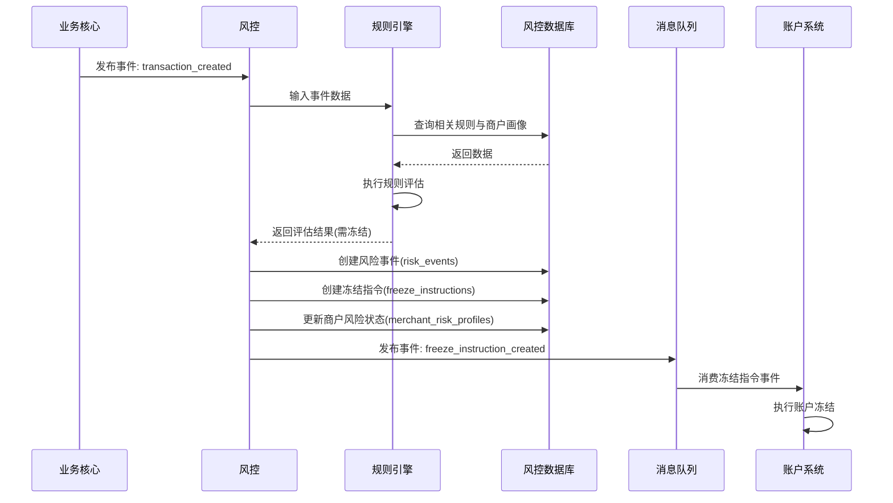
```mermaid
sequenceDiagram
    participant 业务核心
    participant 风控
    participant 规则引擎
    participant 风控DB as 风控数据库
    participant 消息队列
    participant 账户系统

    业务核心->>风控: 发布事件: transaction_created
    风控->>规则引擎: 输入事件数据
    规则引擎->>风控DB: 查询相关规则与商户画像
    风控DB-->>规则引擎: 返回数据
    规则引擎->>规则引擎: 执行规则评估
    规则引擎-->>风控: 返回评估结果(需冻结)
    风控->>风控DB: 创建风险事件(risk_events)
    风控->>风控DB: 创建冻结指令(freeze_instructions)
    风控->>风控DB: 更新商户风险状态(merchant_risk_profiles)
    风控->>消息队列: 发布事件: freeze_instruction_created
    消息队列->>账户系统: 消费冻结指令事件
    账户系统->>账户系统: 执行账户冻结
```

### 6. 错误处理
- **预期错误情况**:
    1. **规则引擎故障**: 规则解析或执行异常。
    2. **数据源访问失败**: 查询内部数据库或依赖上游服务超时/失败。
    3. **指令发布失败**: 向消息队列发布事件失败。
    4. **数据不一致**: 风险判定依赖的核心数据（如账户状态）与实际不一致。
- **处理策略**:
    - **规则引擎故障**: 捕获异常，记录错误日志并触发严重告警。当前风险事件判定中止，标记为“系统错误”，降级为人工审核流程。
    - **数据源访问失败**: 实现重试与熔断机制。若查询商户画像失败，可使用默认风险等级进行评估，并在风险事件中标记“数据源降级”。
    - **指令发布失败**: 采用本地事务与异步重试队列。确保`freeze_instructions`记录创建后，指令发布有至少一次（at-least-once）保证。
    - **数据不一致**: 在关键操作（如创建冻结指令）前，进行二次校验（如调用账户系统快照接口）。若状态已变更，则根据新状态决定是否继续。

### 7. 依赖关系
- **上游模块/数据源**:
    - **业务核心**: 提供实时交易数据，是实时风险监控的主要数据源。
    - **清结算**: 提供结算完成事件及结算明细，用于监控资金结算环节的风险。
    - **对账单系统**: 提供对账差异事件，用于识别交易与资金不匹配的风险。
- **下游模块**:
    - **账户系统**: 消费冻结指令事件，执行对底层账户的冻结/解冻操作。
    - **清结算**: 消费交易冻结指令，在清分结算环节对特定交易资金进行拦截或暂缓处理。
- **内部依赖**:
    - 规则引擎组件（可内嵌或独立服务）。
    - 消息队列/事件总线（用于内部事件驱动及对外通信）。

<a id="module-12"></a>

## 3.12 用户中心


### 1. 概述
- **目的与范围**: 用户中心模块负责生成和管理系统内的用户唯一标识（userid）。其核心职责是为所有业务实体（如收单商户、非收单商户、个人等）提供全局唯一的身份标识，作为关联账户、交易、关系绑定等业务数据的核心索引。其边界限定于用户标识的生成、查询与管理，不涉及具体的账户、资金或业务逻辑处理。

### 2. 接口设计
- **API端点 (REST/GraphQL)**:
    - `POST /v1/users`: 创建用户标识。请求方需提供来源系统标识和外部业务唯一标识。
    - `GET /v1/users/{userid}`: 根据用户标识查询用户信息。
    - `GET /v1/users`: 根据来源系统标识和外部业务唯一标识查询用户标识（幂等性查询）。
- **请求/响应结构**:
    - 创建请求: `{“source_system”: “string”, “external_ref”: “string”}`
    - 创建响应: `{“userid”: “string”, “created_at”: “timestamp”}`
    - 查询响应: `{“userid”: “string”, “source_system”: “string”, “external_ref”: “string”, “created_at”: “timestamp”}`
- **发布/消费的事件**: TBD

### 3. 数据模型
- **表/集合**: `user_identifiers`
- **关键字段**:
    - `userid` (主键): 全局唯一的用户标识，字符串类型。
    - `source_system`: 来源系统标识（如“merchant-service”、“wallet-core”），用于区分调用方。
    - `external_ref`: 外部业务唯一标识（如商户号、个人证件号），与`source_system`组成联合唯一约束。
    - `created_at`: 记录创建时间戳。
- **与其他模块的关系**: 用户中心生成的 `userid` 将被行业钱包、账户系统、业务核心等下游模块引用，作为关联用户、账户和交易记录的关键字段。

### 4. 业务逻辑
- **核心工作流/算法**:
    1. **唯一ID生成算法**: 采用雪花算法（Snowflake）生成分布式唯一ID。ID结构包含时间戳、数据中心ID、工作节点ID和序列号，确保在分布式环境下全局唯一、趋势递增。
    2. **创建流程**: 接收创建请求后，首先根据`source_system`和`external_ref`查询是否已存在记录。若存在，则直接返回已有的`userid`，确保幂等性。若不存在，则生成新的雪花ID，并尝试插入数据库。若因唯一约束冲突导致插入失败，则重新生成ID并重试（最多重试3次）。
- **业务规则与验证**:
    1. 生成的 `userid` 必须全局唯一。
    2. 对于同一业务实体（由`source_system` + `external_ref`唯一确定），必须保证返回的`userid`稳定且一致。
    3. 请求必须包含有效的`source_system`和`external_ref`参数。
- **关键边界情况处理**:
    1. **高并发ID生成**: 雪花算法的时间戳和序列号机制能有效支持高并发生成。工作节点ID需正确配置以避免冲突。
    2. **幂等性保证**: 通过`source_system`和`external_ref`的联合唯一索引，确保同一业务请求总是返回相同`userid`。
    3. **数据库写入冲突**: 尽管有唯一索引和雪花算法，极端情况下仍可能发生主键冲突。此时捕获唯一约束异常，进行有限次数的重试。

### 5. 时序图

```mermaid
sequenceDiagram
    participant 调用方 as 调用方服务(如商户服务)
    participant 用户中心
    participant DB as 用户标识存储

    调用方->>用户中心: POST /v1/users
    Note over 用户中心: 参数: source_system, external_ref
    用户中心->>DB: 根据(source_system, external_ref)查询
    alt 记录已存在
        DB-->>用户中心: 返回已存在userid
        用户中心-->>调用方: 200 OK，返回已有userid
    else 记录不存在
        用户中心->>用户中心: 生成雪花算法ID
        loop 最多重试3次
            用户中心->>DB: 插入新记录(userid, source_system, external_ref)
            alt 插入成功
                DB-->>用户中心: 确认
                用户中心-->>调用方: 201 Created，返回新userid
                break
            else 主键冲突
                DB-->>用户中心: 唯一约束错误
                用户中心->>用户中心: 重新生成ID
            end
        end
        opt 重试全部失败
            用户中心-->>调用方: 500 系统错误
        end
    end
```

### 6. 错误处理
- **预期错误情况**:
    1. **请求参数无效**: `source_system`或`external_ref`缺失或格式错误。
    2. **唯一ID冲突**: 雪花ID生成后，插入时发生主键冲突（极小概率事件）。
    3. **数据库错误**: 连接失败、写入失败等系统级错误。
    4. **幂等性冲突**: 并发请求下，对同一`source_system`和`external_ref`同时发起创建请求。
- **处理策略**:
    1. 参数无效返回 `400 Bad Request` 及具体错误信息。
    2. ID冲突触发内部重试机制（最多3次），若全部失败则返回 `500 Internal Server Error`。
    3. 数据库错误记录详细日志，并向上游返回 `503 Service Unavailable`。
    4. 幂等性冲突由数据库唯一索引保证，后到达的请求会因插入失败而触发查询逻辑，最终返回已创建的`userid`。

### 7. 依赖关系
- **上游模块/服务**: 本模块由扮演“三代”和“行业钱包”角色的具体服务调用，例如“商户服务”（负责商户开户审核）、“钱包核心服务”（负责账户开户）。这些服务通过调用 `POST /v1/users` 接口为其管理的业务实体申请唯一标识。
- **下游模块**: 行业钱包、账户系统、业务核心等模块依赖本模块提供的 `userid` 来关联其各自的业务数据。它们通过 `userid` 查询或关联用户相关的账户、交易等信息。

<a id="module-13"></a>

## 3.13 代付系统


### 1. 概述
- **目的与范围**：本模块负责调用外部代付通道，执行从天财收款账户或天财接收方账户到用户绑定银行卡的实时提款出款指令。其核心职责是接收上游模块的提现指令，与外部支付通道交互，完成资金出款，并同步出款结果。
- **模块边界**：本模块负责指令校验、通道调用、状态管理与结果同步。具体的账户状态、余额、绑定关系等校验逻辑需依赖**账户系统**与**行业钱包**模块提供的数据或接口。

### 2. 接口设计
- **API端点 (REST)**：
  - `POST /api/v1/payout/execute`：接收提现出款指令。
  - `POST /api/v1/payout/callback/{channel}`：接收代付通道的异步回调。
  - `GET /api/v1/payout/records/{payout_id}`：查询出款记录状态。
- **请求/响应结构**：
  - **执行出款请求 (`POST /api/v1/payout/execute`)**：
    ```json
    {
      "request_id": "string，上游请求唯一标识",
      "account_id": "string，出款账户ID（天财收款账户或天财接收方账户）",
      "amount": "integer，出款金额（单位：分）",
      "bank_card_ref": "string，绑定的银行卡标识",
      "channel_preference": "string，可选，通道偏好",
      "business_source": "string，业务来源（如：industry_wallet）"
    }
    ```
  - **执行出款响应**：
    ```json
    {
      "code": "string，响应码",
      "message": "string，响应消息",
      "data": {
        "payout_id": "string，代付系统内部出款流水号",
        "status": "string，受理状态（ACCEPTED, FAILED）",
        "channel_reference": "string，通道返回的参考号（如受理成功）"
      }
    }
    ```
  - **异步回调请求 (`POST /api/v1/payout/callback/{channel}`)**：
    - 结构由具体代付通道定义，本模块负责适配解析。
- **发布/消费的事件**：
  - **消费事件**：TBD（上游模块发出的提现指令事件，格式待定义）。
  - **发布事件**：
    - `PayoutFinalizedEvent`：出款最终结果（成功/失败）事件，包含 `payout_id`, `final_status`, `channel_response`, `completion_time`。

### 3. 数据模型
- **表/集合**：
  - **payout_instruction (出款指令表)**：存储接收到的原始出款指令。
  - **payout_record (出款记录表)**：存储每笔出款的核心执行记录与状态。
- **关键字段**：
  - **payout_instruction**:
    - `id` (主键),
    - `request_id` (上游请求ID，唯一索引),
    - `account_id`,
    - `amount`,
    - `bank_card_ref`,
    - `business_source`,
    - `original_request` (原始请求JSON),
    - `created_at`
  - **payout_record**:
    - `payout_id` (主键),
    - `instruction_id` (外键，关联payout_instruction.id),
    - `status` (状态: INIT, VALIDATING, PROCESSING, SUCCESS, FAILED, MANUAL),
    - `channel_code` (通道编码),
    - `channel_request` (发送给通道的请求),
    - `channel_response` (通道的响应),
    - `channel_reference` (通道流水号),
    - `retry_count` (重试次数),
    - `next_retry_time` (下次重试时间),
    - `finalized_at` (最终状态时间),
    - `error_code` (错误码),
    - `error_message` (错误信息),
    - `created_at`,
    - `updated_at`
- **与其他模块的关系**：
  - 通过 `account_id` 与 **账户系统** 管理的账户关联，用于余额扣减。
  - 通过 `business_source` 标识指令来源模块（如 **行业钱包**）。

### 4. 业务逻辑
- **核心工作流**：
  1.  **指令接收与持久化**：接收上游（如**行业钱包**）的提现指令，存入 `payout_instruction` 表，并创建初始状态的 `payout_record`。
  2.  **指令校验**：
      - 调用 **账户系统** 接口，验证 `account_id` 是否存在、状态是否正常（非冻结）、类型是否为天财收款账户或天财接收方账户。
      - 调用 **行业钱包** 或相关模块接口，验证 `account_id` 与 `bank_card_ref` 的绑定关系是否有效。
      - 调用 **账户系统** 接口，验证账户可用余额是否大于等于出款金额。
      - 任一校验失败，则出款记录状态置为 `FAILED`，并记录错误原因。
  3.  **通道调用**：校验通过后，状态转为 `PROCESSING`。组装通道特定参数，调用代付通道出款接口。
  4.  **结果处理**：
      - **同步返回**：处理通道接口的同步响应。若返回明确成功或失败，则更新记录状态为 `SUCCESS` 或 `FAILED`，并尝试通知上游。
      - **异步处理**：若通道返回“处理中”，则记录 `channel_reference`，等待异步回调或启动轮询。
  5.  **状态同步**：出款达到终态（`SUCCESS`/`FAILED`）后，发布 `PayoutFinalizedEvent` 通知上游模块，并更新 `finalized_at`。
- **业务规则与验证**：
  - 状态机：`INIT` -> `VALIDATING` -> `PROCESSING` -> (`SUCCESS` | `FAILED` | `MANUAL`)。
  - 仅当状态为 `PROCESSING` 且未超时前，才接受对应 `channel_reference` 的回调。
  - 对于“处理中”状态，若超过配置的超时时间（如30分钟）仍未收到回调，则将状态置为 `MANUAL`，需人工介入排查。
- **关键边界情况处理**：
  - **通道调用超时/网络异常**：触发重试机制。重试次数可配置（如3次），采用指数退避策略。
  - **通道返回“处理中”**：启动后台定时任务，根据 `channel_reference` 向通道查询订单状态，直到超时。
  - **余额不足**：校验阶段失败，直接返回失败，不调用通道。
  - **重复请求**：通过 `request_id` 唯一索引防止同一指令重复处理。

### 5. 时序图

```mermaid
sequenceDiagram
    participant Upstream as 上游模块(行业钱包)
    participant Payout as 代付系统
    participant Account as 账户系统
    participant Channel as 代付通道

    Upstream->>Payout: POST /payout/execute (提现指令)
    Payout->>Payout: 持久化指令 (payout_instruction/record)
    Payout->>Account: 校验账户状态与余额
    Account-->>Payout: 校验结果
    alt 校验失败
        Payout->>Payout: 更新记录状态为FAILED
        Payout-->>Upstream: 返回失败响应
    else 校验成功
        Payout->>Payout: 更新记录状态为PROCESSING
        Payout->>Channel: 调用代付出款接口
        Channel-->>Payout: 同步响应(成功/失败/处理中)
        Payout->>Payout: 更新通道响应与reference
        Payout-->>Upstream: 返回受理响应
        alt 响应为“处理中”
            loop 轮询或等待回调
                Channel-->>Payout: 异步回调/查询结果
                Payout->>Payout: 更新最终状态(SUCCESS/FAILED)
            end
        else 响应为明确成功/失败
            Payout->>Payout: 更新最终状态(SUCCESS/FAILED)
        end
        Payout->>Upstream: 发布PayoutFinalizedEvent
    end
```

### 6. 错误处理
- **预期错误情况**：
  - **校验错误**：账户不存在、账户冻结、余额不足、银行卡未绑定。处理：立即失败，状态 `FAILED`，错误码 `VALIDATION_FAILED`。
  - **通道调用错误**：网络超时、连接拒绝、通道系统异常。处理：触发重试机制。
  - **通道业务错误**：银行卡信息错误、账户受限、日限额超限。处理：记录具体错误码，状态 `FAILED`，不重试。
  - **异步结果超时**：未在约定时间内收到回调。处理：状态置为 `MANUAL`，错误码 `RESULT_TIMEOUT`。
- **处理策略**：
  - **重试策略**：仅对网络超时等可重试错误进行重试。最大重试次数：3次。重试间隔：指数退避（如 2s, 4s, 8s）。
  - **状态管理**：通过状态机确保逻辑一致性，终态记录不可变。
  - **监控与告警**：对 `FAILED` 和 `MANUAL` 状态记录进行监控，并设置阈值告警。

### 7. 依赖关系
- **上游模块**：
  - **行业钱包**：作为核心上游，发起会员结算、批量付款等场景下的提现指令。需提供 `account_id`, `bank_card_ref` 等关键信息。
- **下游模块**：
  - **账户系统**：提供账户信息、状态、余额的实时查询与扣减能力。
  - **代付通道**：外部支付服务提供商，提供资金出款接口。
- **内部依赖**：
  - 消息中间件（用于事件发布）。
  - 定时任务调度器（用于轮询“处理中”订单）。

<a id="module-14"></a>

## 3.14 交易系统


### 1. 概述
- **目的与范围**: 本模块（别名：交易系统）负责接收并存储由天财平台发起的各类交易数据，包括分账、批量付款、会员结算等交易结果。它是业务数据的核心存储节点，为下游的对账、查询等业务提供数据支撑。其边界在于接收并持久化交易数据，不涉及交易指令的处理、资金流转或账户操作。

### 2. 接口设计
- **API端点 (REST/GraphQL)**: TBD
- **请求/响应结构**: TBD
- **发布/消费的事件**: TBD

### 3. 数据模型
- **表/集合**: TBD
- **关键字段**: TBD
- **与其他模块的关系**: 本模块存储的交易数据，被“对账单系统”用于生成分账对账单、提款对账单等。

### 4. 业务逻辑
- **核心工作流/算法**: 接收来自上游（如“三代”或“行业钱包”）处理完成的分账、批量付款、会员结算等交易结果，将交易的核心信息进行持久化存储。
- **业务规则与验证**:
    - **数据完整性校验**: 验证请求中交易流水号、金额、参与方、状态、时间等关键字段是否齐全。
    - **重复记录检测**: 基于交易流水号进行幂等性校验，防止同一笔交易被重复记录。
    - **业务状态验证**: 验证交易状态是否符合业务预期（如“成功”、“失败”、“处理中”）。
- **关键边界情况处理**:
    - **数据存储失败**: 记录详细错误日志，并向上游返回明确的失败响应。
    - **数据冲突**: 当检测到重复交易流水号时，采用“最后写入优先”策略并记录审计日志。
    - **上游数据格式错误**: 拒绝处理并返回格式错误信息。

### 5. 时序图

```mermaid
sequenceDiagram
    participant 天财
    participant 三代
    participant 行业钱包
    participant 业务核心
    participant 对账单系统

    天财->>三代: 发起分账/批量付款指令
    三代->>行业钱包: 处理核心钱包业务逻辑
    行业钱包->>业务核心: 存储交易结果数据 (交易流水号、金额、状态等)
    alt 存储成功
        业务核心-->>行业钱包: 存储成功确认
    else 存储失败
        业务核心-->>行业钱包: 存储失败响应 (含错误码)
    end
    行业钱包-->>三代: 返回处理结果
    三代-->>天财: 返回最终结果
    对账单系统->>业务核心: 查询交易数据
    业务核心-->>对账单系统: 返回数据
```

### 6. 错误处理
- **预期错误情况**: 数据库连接异常、数据写入失败、上游数据格式错误、重复交易流水号。
- **处理策略**:
    - **重试机制**: 对于暂时性数据库错误，配置有限次数的重试。
    - **幂等性保证**: 依赖交易流水号作为幂等键，确保重复请求不会产生重复数据。
    - **告警策略**: 记录详细错误日志，并对持续性的存储失败或高频格式错误进行监控告警。

### 7. 依赖关系
- **上游模块**: 三代， 行业钱包
- **下游模块**: 对账单系统

<a id="module-15"></a>

## 3.15 钱包APP/商服平台


### 1. 概述
- **目的与范围**: 本模块是面向商户（包括收单商户、非收单商户、总部、门店）和一般接收方的用户交互平台。其核心职责是提供账户管理（如开户申请、账户信息查询）、关系绑定、分账/归集/批量付款等资金操作发起、交易记录查询、对账单下载以及提现申请等功能。它是业务指令的发起端和结果展示端，不处理核心业务逻辑。
- **架构角色澄清**: 本模块是一个**前端应用（Web/APP）**，其“业务逻辑”章节描述的是前端需要处理的用户交互流程、数据验证和状态管理，不包含后端的核心业务规则处理。它通过调用后端服务（如三代、电子签约平台等）的接口来完成业务功能。

### 2. 接口设计
- **API端点 (REST/GraphQL)**: 本模块作为前端应用，主要消费后端服务提供的接口。以下是关键的后端接口依赖：
    - **三代接口**:
        - `POST /api/v3/account/open`: 发起开户申请。
        - `POST /api/v3/relation/bind`: 发起关系绑定请求。
        - `POST /api/v3/split/apply`: 发起分账/归集/批量付款请求。
        - `POST /api/v3/withdraw/apply`: 发起提现申请。
        - `GET /api/v3/account/balance`: 查询账户余额。
        - `GET /api/v3/transactions`: 查询交易流水。
        - `GET /api/v3/operation/status`: 查询异步操作状态。
    - **电子签约平台接口**:
        - `GET /esign/h5/url`: 获取协议签署H5页面地址。
    - **认证系统接口**:
        - `GET /auth/h5/url`: 获取打款验证或人脸验证H5页面地址。
    - **对账单系统接口**:
        - `GET /statement/download/url`: 获取对账单文件下载链接。
    - **用户中心接口**:
        - `GET /user/profile`: 获取当前用户身份信息。
- **请求/响应结构**: TBD（由各后端服务定义）。
- **发布/消费的事件**: 本模块作为前端应用，不直接发布领域事件。它通过轮询或WebSocket监听后端服务推送的操作结果通知。

### 3. 数据模型
- **表/集合**: 作为前端应用，本模块不直接操作数据库。其数据模型为**前端状态与视图模型**，用于管理界面状态和展示数据。
- **关键视图模型**:
    - **用户会话 (UserSession)**: 存储登录态、用户ID、角色（总部/门店/一般接收方）、所属机构号、APPID等信息。
    - **账户信息视图 (AccountView)**: 用于展示的账户数据，包括账户号、账户类型（天财收款账户/天财接收方账户）、状态、余额。
    - **交易指令表单 (TransactionForm)**: 用于收集用户发起的操作数据，如分账指令（付款方账户、接收方账户列表、金额、备注、幂等键）。
    - **操作状态视图 (OperationStatusView)**: 展示异步操作（如分账、提现）的当前状态（处理中/成功/失败）、结果码、结果信息。
    - **关系绑定视图 (RelationView)**: 展示已建立的绑定关系列表（如总部-门店、付款方-接收方）。
- **与其他模块的关系**: 本模块的视图数据通过调用后端业务核心、用户中心、对账单系统等模块的接口获取并组装。

### 4. 业务逻辑
- **核心工作流/算法**:
    1.  **开户申请**: 引导商户提交资料，组装请求数据（包含机构号、APPID），调用三代接口发起天财收款账户或天财接收方账户的开户流程。前端跟踪申请状态。
    2.  **关系绑定/开通付款**:
        - 前端根据用户角色和业务场景，确定需要签署的协议类型。
        - 调用电子签约平台接口，获取协议签署H5页面地址并引导用户完成签署。
        - 在签署流程中，电子签约平台会调用认证系统完成打款验证或人脸验证。
        - 签署完成后，前端调用三代接口提交绑定关系建立请求。
    3.  **分账/归集/批量付款发起**:
        - 用户填写指令表单。前端生成唯一的幂等键（idempotency_key）附加到请求中。
        - 提交前，前端校验表单必填项、金额格式，并调用三代接口预校验付款方与接收方绑定关系（或依赖接口返回校验）。
        - 提交后，调用三代分账接口。对于异步处理的操作，启动轮询机制查询状态，直至终态（成功/失败）。
    4.  **提现申请**: 用户发起提现。前端校验账户状态（通过查询接口）、提现金额不大于余额、已绑定有效银行卡（通过查询接口）。调用三代提现接口并轮询状态。
    5.  **查询与对账**: 调用三代接口查询账户余额、交易流水。调用对账单系统接口获取对账单下载链接。
- **业务规则与验证 (前端部分)**:
    - **权限校验**: 所有API调用需在请求头中携带用户会话信息（userid、机构号、APPID）。后端负责鉴权，前端根据用户角色（总部、门店、一般接收方）动态展示或隐藏功能菜单与操作按钮。
    - **数据校验**: 对用户输入进行基础格式校验（如金额为正数、账户号格式）。
    - **状态一致性**: 对于异步操作，通过轮询接口 (`GET /api/v3/operation/status`) 保持前端状态与后端一致，避免用户重复提交。
    - **幂等性**: 为所有创建型指令（分账、提现）的请求自动生成并附加幂等键，防止网络重试导致重复交易。
- **关键边界情况处理**:
    - 网络超时或后端服务不可用: 展示友好提示，记录操作状态为“提交中”，提供手动重试按钮（重试时使用原幂等键）。
    - 操作结果未知: 提供“查询状态”功能，允许用户手动触发状态轮询。
    - 页面刷新或重启: 从本地存储恢复未完成的操作状态，并自动重新轮询。

### 5. 时序图
```mermaid
sequenceDiagram
    participant U as 商户用户
    participant APP as 钱包APP/商服平台(前端)
    participant Session as 用户会话
    participant G3 as 三代
    participant Esign as 电子签约平台
    participant Auth as 认证系统
    participant W as 行业钱包
    participant A as 账户系统
    participant Statement as 对账单系统

    Note over U,APP: 前置：用户已登录，会话包含机构号、APPID、userid
    U->>APP: 1. 发起分账请求（填写表单）
    APP->>Session: 2. 读取用户会话信息
    APP->>APP: 3. 生成幂等键，组装请求数据
    APP->>G3: 4. 调用预校验/分账接口 (含机构号、APPID、幂等键)
    alt 绑定关系校验不通过
        G3-->>APP: 4a. 返回错误：关系未绑定
        APP-->>U: 4b. 提示错误，引导去绑定
    else 校验通过，异步处理
        G3-->>APP: 4c. 返回受理成功，操作流水号
        APP->>APP: 5. 启动状态轮询
        loop 轮询直到终态
            APP->>G3: 6. 查询操作状态
            G3->>W: 7. 内部处理分账逻辑
            W->>A: 8. 处理账户余额变更
            A-->>W: 9. 处理结果
            W-->>G3: 10. 更新操作状态
            G3-->>APP: 11. 返回状态（处理中/成功/失败）
        end
        APP-->>U: 12. 展示最终结果
    end

    Note over U,APP: 关系绑定子流程
    U->>APP: A. 发起关系绑定
    APP->>Esign: B. 获取协议签署H5地址
    Esign-->>APP: C. 返回地址
    APP-->>U: D. 跳转至签署页面
    U->>Esign: E. 在H5页面完成签署
    Esign->>Auth: F. 调用认证系统完成验证
    Auth-->>Esign: G. 返回验证结果
    Esign-->>Esign: H. 生成签署证据链
    Esign-->>U: I. 签署完成，返回钱包APP
    U->>APP: J. 通知绑定完成
    APP->>G3: K. 提交绑定确认请求
    G3-->>APP: L. 返回绑定结果
    APP-->>U: M. 展示绑定结果

    Note over U,APP: 对账单下载子流程
    U->>APP: X. 请求下载对账单
    APP->>Statement: Y. 请求对账单下载链接
    Statement-->>APP: Z. 返回文件链接或数据
    APP-->>U: Z1. 展示或下载文件
```

### 6. 错误处理
- **预期错误情况**:
    - **网络与系统错误**: 接口调用超时、连接失败、网关错误（5xx）。
    - **业务逻辑错误**: 由后端返回，如：余额不足、账户冻结、绑定关系不存在、用户权限不足、重复请求（幂等键冲突）。
    - **用户输入错误**: 表单验证失败（前端拦截）、请求参数格式错误（后端返回4xx）。
    - **依赖服务错误**: 电子签约平台、认证系统等服务不可用或返回错误。
- **处理策略**:
    - **错误映射与展示**: 维护后端错误码到前端友好提示的映射表。对于未知错误，展示通用提示并记录错误ID供查询。
    - **重试机制**: 对于网络超时等可重试错误，提供“重试”按钮。重试请求必须携带原幂等键。
    - **状态恢复**: 因错误导致操作状态不明时，引导用户至“交易记录”页或提供专门的状态查询入口。
    - **降级方案**: 当非核心依赖（如对账单系统）不可用时，隐藏相关功能或提示“服务暂不可用”。
    - **日志记录**: 前端记录所有用户操作日志和接口错误日志（脱敏后），用于问题追踪。

### 7. 依赖关系
- **上游模块**:
    - **用户中心**: 提供用户登录认证和基础身份信息（userid）。**契约**: 用户登录态令牌、用户信息查询接口。
- **下游模块/服务 (本模块主动调用)**:
    - **三代**: 核心业务指令接口提供方。**契约**: 开户、绑定、分账、提现、查询等REST API。
    - **电子签约平台**: 电子协议签署服务提供方。**契约**: 协议签署H5页面地址接口。
    - **认证系统**: 身份核验服务提供方。**契约**: 通过电子签约平台间接调用，提供打款验证、人脸验证能力。
    - **对账单系统**: 对账单生成与下载服务提供方。**契约**: 对账单文件或下载链接接口。
    - **业务核心** (间接): 通过三代接口间接依赖，获取交易详情等数据。
- **横向依赖**:
    - **前端基础设施**: 如HTTP客户端、状态管理库、本地存储。

---
# 4 接口设计
## 4.1 对外接口
系统对外部（如天财平台、商户前端应用）暴露的接口。

| Method | Path | Module | Description | Request/Response |
| :--- | :--- | :--- | :--- | :--- |
| POST | TBD | 三代 | 接收天财发起的业务指令（如开户、分账、关系绑定等） | TBD |
| GET | TBD | 三代 | 查询业务指令执行状态 | TBD |
| POST | `/api/v3/account/open` | 钱包APP/商服平台 | 发起开户申请 | TBD |
| POST | `/api/v3/relation/bind` | 钱包APP/商服平台 | 发起关系绑定请求 | TBD |
| POST | `/api/v3/split/apply` | 钱包APP/商服平台 | 发起分账/归集/批量付款请求 | TBD |
| POST | `/api/v3/withdraw/apply` | 钱包APP/商服平台 | 发起提现申请 | TBD |
| GET | `/api/v3/account/balance` | 钱包APP/商服平台 | 查询账户余额 | TBD |
| GET | `/api/v3/transactions` | 钱包APP/商服平台 | 查询交易流水 | TBD |
| GET | `/api/v3/operation/status` | 钱包APP/商服平台 | 查询异步操作状态 | TBD |
| GET | `/esign/h5/url` | 钱包APP/商服平台 | 获取协议签署H5页面地址 | TBD |
| GET | `/auth/h5/url` | 钱包APP/商服平台 | 获取打款验证或人脸验证H5页面地址 | TBD |
| GET | `/statement/download/url` | 钱包APP/商服平台 | 获取对账单文件下载链接 | TBD |
| GET | `/user/profile` | 钱包APP/商服平台 | 获取当前用户身份信息 | TBD |

## 4.2 模块间接口
系统内部各模块之间的调用接口。

| Method | Path | Module (调用方) | Description | Request/Response |
| :--- | :--- | :--- | :--- | :--- |
| POST | `/api/v1/settlement/transfer` | 清结算 | 处理分账/转账请求 | TBD |
| POST | `/api/v1/settlement/batch-payment` | 清结算 | 处理批量付款请求 | TBD |
| POST | `/api/v1/settlement/member-settlement` | 清结算 | 处理会员结算请求 | TBD |
| POST | `/api/v1/settlement/refund` | 清结算 | 处理退货资金扣减请求 | TBD |
| POST | `/api/v1/settlement/freeze` | 清结算 | 处理风控发起的账户/交易冻结请求 | TBD |
| GET | `/api/v1/settlement/orders/{orderId}` | 清结算 | 查询清结算订单状态 | TBD |
| POST | `/api/v1/accounts` | 账户系统 | 创建账户 | TBD |
| GET | `/api/v1/accounts/{accountId}` | 账户系统 | 查询账户信息 | TBD |
| POST | `/api/v1/accounts/{accountId}/debit` | 账户系统 | 执行资金扣减 | TBD |
| POST | `/api/v1/accounts/{accountId}/credit` | 账户系统 | 执行资金增加 | TBD |
| POST | `/api/v1/accounts/{accountId}/freeze` | 账户系统 | 冻结账户 | TBD |
| POST | `/api/v1/accounts/{accountId}/unfreeze` | 账户系统 | 解冻账户 | TBD |
| POST | `/v1/agreements/initiate` | 电子签约平台 | 发起签约流程 | TBD |
| GET | `/v1/agreements/sessions/{sessionId}` | 电子签约平台 | 查询签约会话状态及详情 | TBD |
| POST | `/v1/agreements/sessions/{sessionId}/resend-sms` | 电子签约平台 | 重新发送签约短信 | TBD |
| POST | `/v1/agreements/callback/authentication` | 电子签约平台 | 认证系统完成验证后的回调接口 | TBD |
| GET | `/v1/agreements/{agreementId}` | 电子签约平台 | 查询已签署的协议及证据链信息 | TBD |
| POST | `/api/v1/verification/payment` | 认证系统 | 发起打款验证请求 | TBD |
| POST | `/api/v1/verification/face` | 认证系统 | 发起人脸验证请求 | TBD |
| POST | `/api/v1/verification/{verification_id}/confirm` | 认证系统 | 确认打款验证（回填金额） | TBD |
| GET | `/api/v1/verification/{verification_id}` | 认证系统 | 查询验证状态与结果 | TBD |
| POST | `/api/v1/fee/calculate` | 计费中台 | 计算手续费接口 | TBD |
| GET | `/api/v1/fee/record/{recordId}` | 计费中台 | 查询计费流水详情接口 | TBD |
| POST | `/api/v1/statements/generate` | 对账单系统 | 触发账单生成任务 | TBD |
| GET | `/api/v1/statements` | 对账单系统 | 查询账单列表 | TBD |
| GET | `/api/v1/statements/{statementId}/download` | 对账单系统 | 获取指定账单的下载链接 | TBD |
| GET | `/api/v1/statements/reconciliation/{date}` | 对账单系统 | 触发指定日期的对账核对，并返回核对结果摘要 | TBD |
| POST | `/api/v1/risk/assessment/manual` | 风控 | 手动触发对指定商户或交易的风险评估 | TBD |
| GET | `/api/v1/risk/rules` | 风控 | 查询当前生效的风险规则列表 | TBD |
| POST | `/api/v1/risk/rules` | 风控 | 创建新的风险规则（需授权） | TBD |
| PUT | `/api/v1/risk/rules/{ruleId}` | 风控 | 更新指定风险规则（需授权） | TBD |
| POST | `/api/v1/freeze/manual` | 风控 | 人工发起冻结指令（覆盖自动风控） | TBD |
| POST | `/api/v1/unfreeze/request` | 风控 | 发起解冻申请（需审核） | TBD |
| POST | `/v1/users` | 用户中心 | 创建用户标识 | TBD |
| GET | `/v1/users/{userid}` | 用户中心 | 根据用户标识查询用户信息 | TBD |
| GET | `/v1/users` | 用户中心 | 根据来源系统标识和外部业务唯一标识查询用户标识 | TBD |
| POST | `/api/v1/payout/execute` | 代付系统 | 接收提现出款指令 | TBD |
| POST | `/api/v1/payout/callback/{channel}` | 代付系统 | 接收代付通道的异步回调 | TBD |
| GET | `/api/v1/payout/records/{payout_id}` | 代付系统 | 查询出款记录状态 | TBD |
---
# 5 数据库设计
## 5.1 ER图

```mermaid
erDiagram
    biz_instruction {
        bigint id PK
        varchar instruction_type
        varchar status
        jsonb content
        datetime created_at
        datetime updated_at
    }

    merchant_status {
        bigint id PK
        varchar merchant_id
        varchar freeze_status
        datetime synced_at
    }

    relationship_record {
        bigint id PK
        varchar payer_userid
        varchar payee_userid
        varchar relation_type
        varchar agreement_id
        datetime bound_at
    }

    settlement_orders {
        bigint id PK
        varchar order_no
        varchar order_type
        varchar status
        decimal amount
        varchar payer_account_id
        varchar payee_account_id
        datetime created_at
    }

    fee_records {
        bigint id PK
        varchar fee_no
        bigint order_id FK
        decimal fee_amount
        varchar fee_bearer
        datetime created_at
    }

    settlement_batch_details {
        bigint id PK
        bigint batch_order_id FK
        varchar detail_no
        varchar payee_account_id
        decimal amount
        varchar status
    }

    retry_logs {
        bigint id PK
        varchar biz_id
        varchar biz_type
        varchar status
        text error_msg
        datetime created_at
    }

    account {
        bigint id PK
        varchar account_no
        varchar userid
        varchar account_type
        decimal balance
        varchar status
        datetime created_at
    }

    journal_entries {
        bigint id PK
        varchar request_id
        varchar biz_type
        varchar status
        datetime accounting_date
    }

    journal_entry_items {
        bigint id PK
        bigint journal_entry_id FK
        varchar account_no
        decimal debit_amount
        decimal credit_amount
    }

    idempotency_control {
        bigint id PK
        varchar request_id
        varchar biz_key
        varchar status
        datetime created_at
    }

    agreement_template {
        bigint id PK
        varchar template_code
        varchar template_name
        text template_content
        varchar status
    }

    signing_session {
        bigint id PK
        varchar session_id
        varchar template_code
        jsonb parties_info
        varchar status
        datetime expires_at
    }

    signed_agreement {
        bigint id PK
        varchar agreement_id
        bigint session_id FK
        text signed_content
        datetime signed_at
    }

    evidence_record {
        bigint id PK
        bigint agreement_id FK
        jsonb evidence_data
        datetime created_at
    }

    verification_requests {
        bigint id PK
        varchar verification_id
        varchar verification_type
        varchar status
        datetime created_at
    }

    payment_verification_details {
        bigint id PK
        bigint verification_id FK
        varchar bank_card_no
        decimal verification_amount
        varchar confirm_status
    }

    face_verification_details {
        bigint id PK
        bigint verification_id FK
        varchar id_card_no
        varchar name
        varchar face_compare_result
    }

    fee_rule {
        bigint id PK
        varchar rule_code
        varchar biz_scene
        decimal fee_rate
        varchar fee_bearer
        varchar status
    }

    fee_record {
        bigint id PK
        varchar fee_record_no
        varchar rule_code
        decimal calculated_fee
        varchar status
    }

    statement_metadata {
        bigint id PK
        varchar statement_no
        varchar statement_type
        date statement_date
        varchar status
        datetime generated_at
    }

    statement_line_item {
        bigint id PK
        bigint statement_id FK
        varchar item_type
        decimal amount
        varchar account_no
        datetime biz_time
    }

    reconciliation_log {
        bigint id PK
        date recon_date
        varchar source_system
        varchar recon_result
        text discrepancy_detail
        datetime executed_at
    }

    risk_rules {
        bigint id PK
        varchar rule_code
        text rule_condition
        varchar action
        varchar status
    }

    risk_events {
        bigint id PK
        varchar event_id
        varchar target_type
        varchar target_id
        varchar risk_level
        datetime triggered_at
    }

    freeze_instructions {
        bigint id PK
        varchar instruction_id
        varchar target_type
        varchar target_id
        varchar freeze_type
        varchar status
    }

    merchant_risk_profiles {
        bigint id PK
        varchar merchant_id
        jsonb risk_tags
        datetime updated_at
    }

    user_identifiers {
        bigint id PK
        bigint userid
        varchar source_system
        varchar external_id
        datetime created_at
    }

    payout_instruction {
        bigint id PK
        varchar instruction_id
        varchar account_no
        decimal amount
        varchar status
        datetime received_at
    }

    payout_record {
        bigint id PK
        bigint instruction_id FK
        varchar channel_order_no
        varchar channel
        varchar final_status
        datetime completed_at
    }

    biz_instruction ||--o{ settlement_orders : "生成"
    settlement_orders ||--o{ fee_records : "关联计费"
    settlement_orders ||--o{ settlement_batch_details : "包含明细"
    account ||--o{ journal_entry_items : "记录分录"
    journal_entries ||--o{ journal_entry_items : "包含明细"
    signing_session ||--o{ signed_agreement : "生成协议"
    signed_agreement ||--o|| evidence_record : "关联证据"
    verification_requests ||--o{ payment_verification_details : "包含打款详情"
    verification_requests ||--o{ face_verification_details : "包含人脸详情"
    statement_metadata ||--o{ statement_line_item : "包含明细"
    risk_events ||--o{ freeze_instructions : "触发冻结"
    payout_instruction ||--o{ payout_record : "生成出款记录"
    relationship_record }o--o| user_identifiers : "关联付款方/收款方"
    account }o--o| user_identifiers : "属于用户"
```

## 5.2 表结构

| 表名 | 所属模块 | 主要字段（简述） | 关联关系（简述） |
| :--- | :--- | :--- | :--- |
| biz_instruction | 三代 | id, instruction_type, status, content, created_at | 生成清结算订单(settlement_orders) |
| merchant_status | 三代 | id, merchant_id, freeze_status, synced_at | TBD |
| relationship_record | 三代 | id, payer_userid, payee_userid, relation_type, agreement_id, bound_at | 关联用户标识(user_identifiers) |
| settlement_orders | 清结算 | id, order_no, order_type, status, amount, payer_account_id, payee_account_id, created_at | 被biz_instruction生成，关联fee_records |
| fee_records | 清结算 | id, fee_no, order_id, fee_amount, fee_bearer, created_at | 关联settlement_orders |
| settlement_batch_details | 清结算 | id, batch_order_id, detail_no, payee_account_id, amount, status | 关联settlement_orders |
| retry_logs | 清结算 | id, biz_id, biz_type, status, error_msg, created_at | TBD |
| account | 账户系统 | id, account_no, userid, account_type, balance, status, created_at | 属于用户(user_identifiers)，记录分录(journal_entry_items) |
| journal_entries | 账务核心 | id, request_id, biz_type, status, accounting_date | 包含明细(journal_entry_items) |
| journal_entry_items | 账务核心 | id, journal_entry_id, account_no, debit_amount, credit_amount | 关联journal_entries和account |
| idempotency_control | 账务核心 | id, request_id, biz_key, status, created_at | TBD |
| agreement_template | 电子签约平台 | id, template_code, template_name, template_content, status | TBD |
| signing_session | 电子签约平台 | id, session_id, template_code, parties_info, status, expires_at | 生成协议(signed_agreement) |
| signed_agreement | 电子签约平台 | id, agreement_id, session_id, signed_content, signed_at | 关联signing_session和evidence_record |
| evidence_record | 电子签约平台 | id, agreement_id, evidence_data, created_at | 关联signed_agreement |
| verification_requests | 认证系统 | id, verification_id, verification_type, status, created_at | 包含payment_verification_details和face_verification_details |
| payment_verification_details | 认证系统 | id, verification_id, bank_card_no, verification_amount, confirm_status | 关联verification_requests |
| face_verification_details | 认证系统 | id, verification_id, id_card_no, name, face_compare_result | 关联verification_requests |
| fee_rule | 计费中台 | id, rule_code, biz_scene, fee_rate, fee_bearer, status | TBD |
| fee_record | 计费中台 | id, fee_record_no, rule_code, calculated_fee, status | TBD |
| statement_metadata | 对账单系统 | id, statement_no, statement_type, statement_date, status, generated_at | 包含明细(statement_line_item) |
| statement_line_item | 对账单系统 | id, statement_id, item_type, amount, account_no, biz_time | 关联statement_metadata |
| reconciliation_log | 对账单系统 | id, recon_date, source_system, recon_result, discrepancy_detail, executed_at | TBD |
| risk_rules | 风控 | id, rule_code, rule_condition, action, status | TBD |
| risk_events | 风控 | id, event_id, target_type, target_id, risk_level, triggered_at | 触发冻结(freeze_instructions) |
| freeze_instructions | 风控 | id, instruction_id, target_type, target_id, freeze_type, status | 被risk_events触发 |
| merchant_risk_profiles | 风控 | id, merchant_id, risk_tags, updated_at | TBD |
| user_identifiers | 用户中心 | id, userid, source_system, external_id, created_at | 被relationship_record和account关联 |
| payout_instruction | 代付系统 | id, instruction_id, account_no, amount, status, received_at | 生成出款记录(payout_record) |
| payout_record | 代付系统 | id, instruction_id, channel_order_no, channel, final_status, completed_at | 关联payout_instruction |