# DocuFlow-AI Project - 软件设计文档
生成时间: 2026-01-19 15:39:53

## 目录
1. [概述说明](#1-概述说明)
   - 1.1 [术语与缩略词](#11-术语与缩略词)
2. [系统设计](#2-系统设计)
3. [模块设计](#3-模块设计)
   - 3.1 [账户系统](#31-账户系统)
   - 3.2 [认证系统](#32-认证系统)
   - 3.3 [计费中台](#33-计费中台)
   - 3.4 [三代系统](#34-三代系统)
   - 3.5 [清结算系统](#35-清结算系统)
   - 3.6 [账务核心系统](#36-账务核心系统)
   - 3.7 [电子签约平台](#37-电子签约平台)
   - 3.8 [钱包APP/商服平台](#38-钱包APP/商服平台)
   - 3.9 [行业钱包系统](#39-行业钱包系统)
   - 3.10 [业务核心](#310-业务核心)
   - 3.11 [对账单系统](#311-对账单系统)
4. [接口设计](#4-接口设计)
5. [数据库设计](#5-数据库设计)

---
# 1 概述说明

## 1.1 术语与缩略词


## 角色

- **天财** (别名: 天财商龙): 一个特定的商户或机构（推测为“天财商龙”），是该分账系统的核心业务方和需求发起方。系统为其提供专用的账户和分账接口。
- **总部** (别名: 总店, 发起方): 在天财分账业务中，指品牌方或管理方，通常是分账指令的发起方、资金归集的收取方或会员结算/批量付款的付款方。角色类型为“总部”。
- **门店**: 在天财分账业务中，指具体的经营门店，可以是资金归集的付款方，或会员结算的收款方。角色类型为“门店”。

## 业务实体

- **天财专用账户**: 为满足天财分账业务需求而设立的专用账户类型，在账户系统底层做特殊标记和区分。包括天财收款账户和天财接收方账户。
- **天财收款账户**: 天财专用账户的一种，用于接收收单交易结算款。分为总部和门店两种角色类型，结算模式默认为主动结算至本账户。
- **天财接收方账户** (别名: 入账方账户): 天财专用账户的一种，用于接收从收款账户分账而来的资金（如供应商、股东等），支持绑定多张银行卡并设置默认提现卡。
- **收单商户** (别名: 商户): 通过支付系统进行收款业务的商户。在本系统中，天财机构下的收单商户可以开通天财专用账户。
- **待结算账户** (别名: 01账户): 用于临时存放收单交易资金的内部账户，类型代码为01。
- **退货账户** (别名: 04账户): 用于处理退货资金的内部账户，类型代码为04。在天财场景下，可与天财收款账户组合处理退货。

## 技术术语

- **三代**: 指代拉卡拉支付系统中的某一代核心系统，负责商户管理、开户、交易处理等核心功能，是本需求中关键的调用和协调系统。
- **行业钱包系统** (别名: 钱包系统): 负责处理钱包类账户业务（如天财专用账户）的系统，进行开户、关系绑定、分账指令处理、校验等核心逻辑。
- **账户系统**: 底层的账户管理核心系统，负责账户的创建、升级、标记、账务处理及能力控制。
- **清结算系统** (别名: 清结算): 负责交易清算、结算、计费以及退货资金处理的系统。
- **电子签约平台** (别名: 电子签章系统): 提供电子协议签署、短信验证、H5页面、人脸/打款认证集成的系统，用于完成关系绑定的法律流程和证据链留存。
- **认证系统**: 提供打款验证和人脸验证等身份核验能力的系统。
- **打款验证**: 一种身份/账户所有权认证方式。认证系统向目标银行卡打入随机金额，验证方回填正确金额即通过验证。主要用于对公账户或特定场景的验证。
- **人脸验证**: 一种身份认证方式，通过比对姓名、身份证和人脸信息是否一致来完成验证。主要用于对私账户的认证。
- **主动结算**: 一种结算模式，指收单交易资金结算到商户指定的收款账户（如天财收款账户）。与“被动结算”相对。
- **被动结算**: 一种结算模式，指收单交易资金停留在待结算账户，需要额外指令才可结算。本需求中不支持从天财专用账户切换至此模式。
- **对账单系统**: 生成和提供各类账户动账明细、交易账单的系统，为天财提供机构层面的分账、提款、收单等账单。

## 流程

- **分账** (别名: 转账): 本需求中的核心业务流程，指从天财收款账户向另一个天财收款账户或天财接收方账户进行资金划转。系统定义新的交易类型“天财分账”。
- **关系绑定** (别名: 签约与认证): 在分账前必须完成的流程，包括签约与认证，以建立资金转出方和转入方之间的合法授权关系。根据场景不同，流程和协议各异。
- **归集** (别名: 资金归集): 一种分账场景，指资金从门店（付方）的收款账户归集到总部（收方）的收款账户。
- **批量付款** (别名: 批付): 一种分账场景，指总部从其收款账户向多个天财接收方账户（如供应商、股东）进行付款。
- **会员结算**: 一种分账场景，指总部从其收款账户向门店的收款账户进行结算（推测为会员消费相关的分润）。
- **开通付款**: 在批量付款和会员结算场景下，付方（总部）需要额外进行的一个签约认证流程，签署《代付授权协议》，是关系绑定生效的前提。

---
# 2 系统设计
好的，作为资深的软件架构师，我将基于您提供的模块摘要信息，为您生成一份系统级设计文档。

# 天财分账系统 - 系统级设计文档

## 2.1 系统结构

天财分账系统采用分层、模块化的微服务架构设计，以业务核心为编排中枢，以账户系统和账务核心为资金处理基石，通过清晰的职责边界和标准化的接口，协同完成商户开通、账户绑定、分账执行、资金结算等全流程业务。系统整体遵循“前-中-后台”的架构思想，确保业务敏捷性、资金安全性与系统稳定性。

```mermaid
graph TB
    subgraph “用户交互层 (前端)”
        APP[钱包APP/商服平台模块]
    end

    subgraph “业务服务层 (中台)”
        subgraph “业务编排与流程”
            BIZ[业务核心]
            GEN3[三代系统]
        end
        subgraph “核心业务处理”
            WALLET[行业钱包系统]
            BILLING[计费中台]
        end
        subgraph “支撑服务”
            AUTH[认证系统]
            E_SIGN[电子签约平台]
        end
    end

    subgraph “基础服务层 (后台)”
        subgraph “资金与账户核心”
            ACCT[账户系统]
            LEDGER[账务核心系统]
        end
        subgraph “清结算与数据”
            SETTLE[清结算系统]
            RECON[对账单系统]
        end
    end

    subgraph “外部依赖系统”
        EXT_PAY[支付核心/三代系统]
        EXT_MSG[消息队列]
        EXT_FILE[文件存储]
        EXT_SMS[短信网关]
    end

    APP --> BIZ & GEN3
    BIZ --> GEN3 & WALLET & ACCT & E_SIGN
    GEN3 --> WALLET & ACCT & E_SIGN & LEDGER
    WALLET --> ACCT & GEN3 & E_SIGN & RECON
    BILLING --> ACCT & SETTLE & RECON
    AUTH --> SETTLE & E_SIGN
    LEDGER --> WALLET & SETTLE & ACCT
    SETTLE --> EXT_PAY & ACCT & RECON
    RECON --> ACCT & SETTLE & WALLET & EXT_FILE
    E_SIGN --> AUTH & EXT_SMS & EXT_FILE
    GEN3 -.-> EXT_MSG
    WALLET -.-> EXT_MSG
```

**架构说明**:
*   **用户交互层**: 提供统一的前端入口，面向天财机构、总部、门店等不同角色，封装复杂的后端流程。
*   **业务服务层**:
    *   **业务编排 (BIZ, GEN3)**: 负责接收、编排和驱动完整的业务流程，管理异步流程状态，是业务的“总指挥”。
    *   **核心业务处理 (WALLET, BILLING)**: 行业钱包系统是分账指令、账户绑定的具体执行者；计费中台独立负责所有费用计算与结算指令生成。
    *   **支撑服务 (AUTH, E_SIGN)**: 提供身份认证、协议签署等合规性能力，作为可复用的公共服务。
*   **基础服务层**:
    *   **资金与账户核心 (ACCT, LEDGER)**: 系统的基石。账户系统管理账户实体与关系；账务核心系统确保所有资金变动的原子性、一致性和可追溯性。
    *   **清结算与数据 (SETTLE, RECON)**: 清结算系统处理跨账户的资金结算与调拨；对账单系统提供统一的资金视图和对账能力。
*   **通信机制**: 同步调用以RESTful API为主，关键异步状态通知通过消息队列（如Kafka）实现松耦合通信。

## 2.2 功能结构

系统功能围绕“账户生命周期管理”、“分账业务流程”、“资金结算与对账”三大核心领域展开。

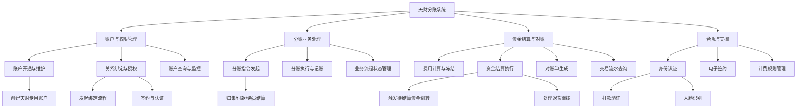

**功能模块说明**:
*   **账户与权限管理**: 提供天财专用账户的创建、查询、以及账户间（如总部与门店）授权绑定关系的建立与管理，是分账业务的前置条件。
*   **分账业务处理**: 覆盖从业务发起（通过前端或API）、指令执行（账务处理）、到全流程状态跟踪的核心业务链路。
*   **资金结算与对账**: 包含业务计费、将资金从待结算户结算至收款账户、生成对账文件以及提供明细查询，形成资金闭环。
*   **合规与支撑**: 为业务提供必需的身份核验、法律协议签署及灵活的费用计算能力，保障业务合规性。

## 2.3 网络拓扑图

系统部署在私有云或金融云环境内，采用典型的分区部署策略，确保网络安全与合规。

```mermaid
graph TB
    subgraph “互联网区 (DMZ)”
        FW1[防火墙]
        LB[负载均衡器]
        APP_SVR[Web应用服务器<br/>钱包APP/商服平台后端]
    end

    subgraph “核心生产区”
        FW2[内部防火墙]
        subgraph “微服务集群”
            GEN3_SVC[三代系统]
            BIZ_SVC[业务核心]
            WALLET_SVC[行业钱包系统]
            AUTH_SVC[认证系统]
            E_SIGN_SVC[电子签约平台]
        end
        subgraph “核心服务集群”
            ACCT_SVC[账户系统]
            LEDGER_SVC[账务核心系统]
            BILLING_SVC[计费中台]
            SETTLE_SVC[清结算系统]
        end
        subgraph “数据与中间件集群”
            DB[(主数据库集群)]
            CACHE[缓存集群]
            MQ[消息队列集群]
            ES[(Elasticsearch)]
            OSS[对象存储]
        end
    end

    subgraph “外部服务区”
        EXT_SMS[短信网关]
        EXT_TSA[时间戳服务]
        EXT_BANK[银行/支付通道]
    end

    Internet --> FW1 --> LB --> APP_SVR
    APP_SVR --> FW2 --> GEN3_SVC & BIZ_SVC
    微服务集群 <--> 核心服务集群
    微服务集群 <--> 数据与中间件集群
    核心服务集群 <--> 数据与中间件集群
    AUTH_SVC & E_SIGN_SVC --> EXT_SMS & EXT_TSA
    SETTLE_SVC --> EXT_BANK
    LEDGER_SVC --> EXT_BANK
```

**部署说明**:
*   **分区隔离**: 互联网区与核心生产区通过防火墙严格隔离，仅暴露必要的API网关或前端服务。
*   **集群化部署**: 所有微服务、数据库、中间件均采用集群部署，保证高可用和可扩展性。
*   **外部依赖**: 短信、时间戳、银行通道等外部服务通过专线或VPN在特定区域进行访问，确保通信安全与稳定。

## 2.4 数据流转

以“**门店营业收入分账至总部**”这一核心场景为例，描述关键数据在系统间的流转过程。

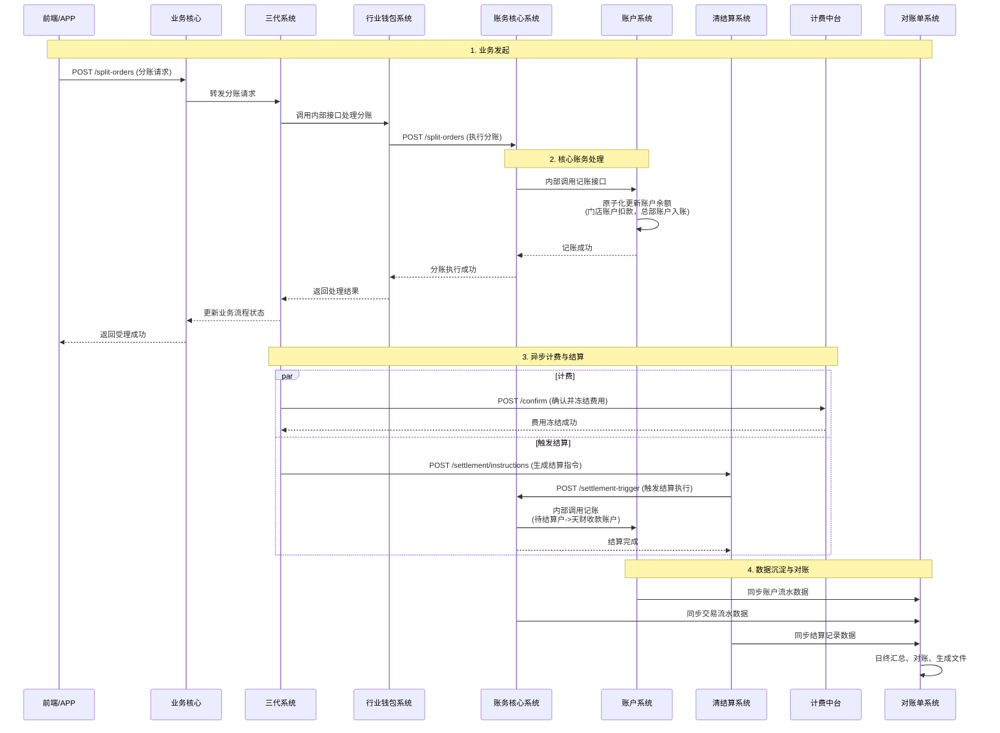

**数据流关键点**:
1.  **请求驱动**: 业务请求通过前端发起，经业务编排层路由至核心处理引擎。
2.  **资金变动唯一入口**: 所有涉及账户余额变更的操作，必须通过**账户系统**的原子化记账接口完成，确保数据强一致性。
3.  **异步化处理**: 计费、结算等后续环节与主业务链路解耦，通过异步方式处理，提升主链路性能与用户体验。
4.  **数据归集**: 账户系统、账务核心、清结算系统将各自的资金变动明细同步至**对账单系统**，形成唯一可信的资金数据源，用于对账与查询。

## 2.5 系统模块交互关系

以下模块交互图详细刻画了各微服务之间的静态依赖关系与核心接口调用方向。

```mermaid
graph LR
    subgraph “Key”
        direction LR
        S1[模块A] -->|依赖/调用| S2[模块B]
    end

    APP[钱包APP/商服平台] -->|发起业务/查询| BIZ[业务核心]
    APP -->|直接查询/操作| GEN3[三代系统]
    
    BIZ -->|驱动业务流程| GEN3
    BIZ -->|查询/驱动账户绑定| WALLET[行业钱包系统]
    BIZ -->|查询账户| ACCT[账户系统]
    BIZ -->|创建签约流程| E_SIGN[电子签约平台]
    
    GEN3 -->|处理分账指令| WALLET
    GEN3 -->|创建/查询账户| ACCT
    GEN3 -->|回调通知| E_SIGN
    GEN3 -->|执行分账记账| LEDGER[账务核心系统]
    
    WALLET -->|核心账户操作| ACCT
    WALLET -->|状态回调| GEN3
    WALLET -->|发起签约| E_SIGN
    WALLET -->|提供业务数据| RECON[对账单系统]
    
    LEDGER -->|资金划转执行| WALLET
    LEDGER -->|触发结算| SETTLE[清结算系统]
    LEDGER -->|原子记账| ACCT
    
    SETTLE -->|获取路由信息| GEN3
    SETTLE -->|结算记账| ACCT
    SETTLE -->|提供结算数据| RECON
    
    BILLING[计费中台] -->|计算/冻结费用| ACCT
    BILLING -->|生成结算指令| SETTLE
    BILLING -->|提供费用数据| RECON
    
    AUTH[认证系统] -->|执行打款验证| SETTLE
    AUTH -->|回调认证结果| E_SIGN
    
    E_SIGN -->|调用身份认证| AUTH
    
    RECON -->|获取账户主数据| ACCT
    
    style ACCT stroke:#333,stroke-width:3px
    style LEDGER stroke:#333,stroke-width:3px
```

**交互关系核心解读**:
*   **强依赖核心**：**账户系统 (ACCT)** 和 **账务核心系统 (LEDGER)** 是整个系统的资金数据处理中枢，被绝大多数上层业务模块所依赖。
*   **业务编排链**：**业务核心 (BIZ) -> 三代系统 (GEN3) -> 行业钱包系统 (WALLET)** 构成了主要的业务请求驱动链条。
*   **结算闭环**：**计费中台 (BILLING) -> 清结算系统 (SETTLE) -> 账务核心系统 (LEDGER)** 构成了费用计算与资金结算的闭环。
*   **合规支撑**：**认证系统 (AUTH)** 与 **电子签约平台 (E_SIGN)** 相互协作，为**行业钱包系统 (WALLET)** 和**业务核心 (BIZ)** 提供合规能力。
*   **数据汇聚点**：**对账单系统 (RECON)** 从**账户系统 (ACCT)**、**清结算系统 (SETTLE)**、**行业钱包系统 (WALLET)** 和**计费中台 (BILLING)** 汇聚数据，是系统的“数据总线”终点。

---
**文档说明**：本设计文档基于提供的模块摘要生成，反映了系统的逻辑架构与核心交互。在实际实施中，需进一步定义详细的API契约、数据模型、容错机制与性能指标。
---
# 3 模块设计

## 3.1 账户系统


# 账户系统模块设计文档

## 1. 概述

### 1.1 目的
本模块作为底层账户管理核心系统，旨在为“天财分账业务”提供专用的账户创建、管理、标记、账务处理及能力控制服务。它是支撑天财专用账户（收款账户、接收方账户）生命周期管理、资金流转和业务规则校验的基础设施。

### 1.2 范围
- **账户生命周期管理**：天财专用账户的创建、状态变更、升级、冻结/解冻、注销。
- **账户标记与分类**：为天财专用账户打上特殊业务标记（如`account_type: TIANCAI_RECEIVE`, `account_type: TIANCAI_RECEIVER`），并与标准账户进行逻辑隔离。
- **账户关系绑定**：在底层建立并维护天财收款账户与天财接收方账户之间的授权关系，作为分账指令执行的前置条件。
- **账务处理**：提供原子化的入账、出账、冻结、解冻等核心账务操作接口，确保资金变动的准确性和一致性。
- **能力控制**：根据账户类型、状态和业务场景，控制账户是否可收、可付、可结算、可提现等能力。
- **与上下游系统协同**：作为被调用方，为“三代系统”、“行业钱包系统”、“清结算系统”提供稳定、可靠的账户服务。

## 2. 接口设计

### 2.1 API端点 (RESTful)

#### 2.1.1 账户管理接口
- **POST /api/v1/tiancai/accounts**
    - **描述**：创建天财专用账户。
    - **请求体**：
      ```json
      {
        "request_id": "req_123456", // 请求流水号，用于幂等
        "merchant_no": "M100001", // 收单商户号
        "account_role": "HEADQUARTERS", // 角色：HEADQUARTERS(总部)/STORE(门店)/RECEIVER(接收方)
        "account_type": "TIANCAI_RECEIVE", // 账户类型：TIANCAI_RECEIVE(收款账户)/TIANCAI_RECEIVER(接收方账户)
        "settlement_mode": "ACTIVE", // 结算模式，仅收款账户有效：ACTIVE(主动结算)
        "base_account_info": { // 底层标准账户信息（由账户系统内部生成或关联）
          "account_no": "optional_existing_account", // 可选，若为空则新建
          "currency": "CNY"
        },
        "ext_info": { // 扩展信息
          "legal_name": "天财科技有限公司",
          "contact_phone": "13800138000"
        }
      }
      ```
    - **响应体**：
      ```json
      {
        "code": "SUCCESS",
        "message": "成功",
        "data": {
          "tiancai_account_id": "TCA_20231011001",
          "account_no": "3010001001", // 底层账户号
          "account_role": "HEADQUARTERS",
          "account_type": "TIANCAI_RECEIVE",
          "status": "ACTIVE",
          "settlement_mode": "ACTIVE",
          "created_at": "2023-10-11T10:00:00Z"
        }
      }
      ```

- **POST /api/v1/tiancai/accounts/{tiancai_account_id}/relationships**
    - **描述**：建立天财账户间的关系绑定（如总部收款账户与门店收款账户、收款账户与接收方账户）。
    - **请求体**：
      ```json
      {
        "request_id": "req_rel_789",
        "relation_type": "COLLECTION", // COLLECTION(归集)/BATCH_PAY(批量付款)/MEMBER_SETTLE(会员结算)
        "from_account_id": "TCA_20231011001", // 付方天财账户ID
        "to_account_id": "TCA_20231011002", // 收方天财账户ID
        "contract_id": "CONTRACT_XYZ", // 电子签约平台返回的协议ID
        "auth_status": "SIGNED", // 认证状态：SIGNED(已签约)/VERIFIED(已认证)
        "effective_time": "2023-10-11T10:00:00Z",
        "expire_time": "2024-10-11T10:00:00Z"
      }
      ```
    - **响应体**：返回关系记录ID及状态。

#### 2.1.2 账务操作接口
- **POST /api/v1/accounts/{account_no}/ledger/entries**
    - **描述**：执行账务记账（内部调用，不直接对外开放）。
    - **请求体**：
      ```json
      {
        "request_id": "ledger_req_001",
        "biz_trade_no": "TC_TRANS_001", // 业务交易流水号（分账、结算等）
        "biz_type": "TIANCAI_SPLIT", // 业务类型：TIANCAI_SPLIT(天财分账)/SETTLEMENT(结算)/REFUND(退货)
        "entries": [
          {
            "account_no": "3010001001",
            "direction": "CREDIT", // CREDIT(入账)/DEBIT(出账)
            "amount": 10000,
            "currency": "CNY",
            "balance_type": "AVAILABLE" // 余额类型：AVAILABLE(可用)/FROZEN(冻结)
          },
          {
            "account_no": "3010001002",
            "direction": "DEBIT",
            "amount": 10000,
            "currency": "CNY",
            "balance_type": "AVAILABLE"
          }
        ]
      }
      ```
    - **响应体**：返回记账流水号及结果。

#### 2.1.3 查询接口
- **GET /api/v1/tiancai/accounts/{tiancai_account_id}**
- **GET /api/v1/tiancai/accounts?merchant_no={}&account_role={}&status={}**
- **GET /api/v1/tiancai/accounts/{tiancai_account_id}/relationships?relation_type={}**

### 2.2 发布/消费的事件

#### 2.2.1 消费的事件
- **MerchantCreatedEvent** (来自三代系统)：监听新收单商户创建，触发天财账户开通资格检查。
- **AccountRelationVerifiedEvent** (来自行业钱包系统)：接收关系绑定完成通知，更新底层账户关系状态。
- **SettlementInstructionEvent** (来自清结算系统)：接收结算指令，触发待结算账户(01)资金划转至天财收款账户。

#### 2.2.2 发布的事件
- **TiancaiAccountCreatedEvent**：天财专用账户创建成功时发布，供行业钱包系统订阅。
  ```json
  {
    "event_id": "event_001",
    "event_type": "TIANCAI_ACCOUNT_CREATED",
    "timestamp": "2023-10-11T10:00:00Z",
    "data": {
      "tiancai_account_id": "TCA_20231011001",
      "account_no": "3010001001",
      "merchant_no": "M100001",
      "account_role": "HEADQUARTERS",
      "account_type": "TIANCAI_RECEIVE"
    }
  }
  ```
- **AccountRelationshipBoundEvent**：账户关系绑定成功时发布，供行业钱包系统用于分账指令校验。
- **AccountBalanceChangedEvent**：账户余额发生变动时发布，供对账单系统生成动账明细。

## 3. 数据模型

### 3.1 核心表设计

#### 表：`tiancai_account` (天财专用账户表)
| 字段名 | 类型 | 必填 | 默认值 | 描述 |
| :--- | :--- | :--- | :--- | :--- |
| `id` | bigint | Y | AUTO_INCREMENT | 主键 |
| `tiancai_account_id` | varchar(32) | Y | | **业务主键**，全局唯一，格式`TCA_YYYYMMDDxxx` |
| `account_no` | varchar(20) | Y | | **关联的底层标准账户号**，外键关联`account.account_no` |
| `merchant_no` | varchar(32) | Y | | 收单商户号 |
| `account_role` | varchar(20) | Y | | 角色：`HEADQUARTERS`/`STORE`/`RECEIVER` |
| `account_type` | varchar(20) | Y | | 账户类型：`TIANCAI_RECEIVE`/`TIANCAI_RECEIVER` |
| `settlement_mode` | varchar(20) | N | `ACTIVE` | 结算模式：`ACTIVE`(主动结算)，仅收款账户有效 |
| `status` | varchar(20) | Y | `ACTIVE` | 状态：`ACTIVE`/`FROZEN`/`CLOSED` |
| `ext_info` | json | N | | 扩展信息（企业名称、联系人等） |
| `created_at` | datetime | Y | CURRENT_TIMESTAMP | |
| `updated_at` | datetime | Y | CURRENT_TIMESTAMP ON UPDATE | |

#### 表：`account_relationship` (账户关系表)
| 字段名 | 类型 | 必填 | 默认值 | 描述 |
| :--- | :--- | :--- | :--- | :--- |
| `id` | bigint | Y | AUTO_INCREMENT | 主键 |
| `relation_id` | varchar(32) | Y | | 关系唯一ID |
| `relation_type` | varchar(30) | Y | | 关系类型：`COLLECTION`/`BATCH_PAY`/`MEMBER_SETTLE` |
| `from_tiancai_account_id` | varchar(32) | Y | | 付方天财账户ID |
| `to_tiancai_account_id` | varchar(32) | Y | | 收方天财账户ID |
| `contract_id` | varchar(64) | Y | | 电子签约协议ID |
| `auth_status` | varchar(20) | Y | | 认证状态：`SIGNED`/`VERIFIED`/`EXPIRED` |
| `effective_time` | datetime | Y | | 生效时间 |
| `expire_time` | datetime | N | | 过期时间 |
| `created_at` | datetime | Y | CURRENT_TIMESTAMP | |

#### 表：`account` (底层标准账户表 - 已存在，扩展)
| 字段名 | 类型 | 描述 |
| :--- | :--- | :--- |
| `account_no` | varchar(20) | **主键**，账户号 |
| `merchant_no` | varchar(32) | 所属商户号 |
| `account_type_code` | varchar(10) | **扩展字段**：增加`TC_RCV`(天财收款账户)、`TC_REC`(天财接收方账户)等类型码 |
| `balance_available` | decimal(15,2) | 可用余额 |
| `balance_frozen` | decimal(15,2) | 冻结余额 |
| `currency` | varchar(3) | 币种 |
| `status` | varchar(20) | 账户状态 |
| `capabilities` | json | **扩展字段**：账户能力位图，如`{"can_receive": true, "can_pay": true, "can_withdraw": false}` |

### 3.2 与其他模块的关系
- **行业钱包系统**：通过`tiancai_account`和`account_relationship`表，为钱包系统提供账户信息和关系校验依据。
- **清结算系统**：通过`account`表进行资金划转和记账。
- **三代系统**：通过`merchant_no`关联收单商户信息。
- **对账单系统**：通过监听`AccountBalanceChangedEvent`获取动账数据源。

## 4. 业务逻辑

### 4.1 核心算法与规则

#### 4.1.1 天财账户创建规则
1. **资格校验**：仅当`merchant_no`属于“天财”机构，且在三代系统中状态正常时，才允许创建天财专用账户。
2. **账户类型决策**：
   - 若`account_role`为`HEADQUARTERS`或`STORE`，则`account_type`必须为`TIANCAI_RECEIVE`（收款账户）。
   - 若`account_role`为`RECEIVER`，则`account_type`必须为`TIANCAI_RECEIVER`（接收方账户）。
3. **底层账户处理**：
   - 若请求中未提供`base_account_info.account_no`，则调用内部服务创建一个新的标准账户，并打上对应的`account_type_code`标记。
   - 若已提供，则校验该账户是否存在、是否属于该商户、且未标记为其他天财账户类型。
4. **结算模式**：天财收款账户的`settlement_mode`强制设置为`ACTIVE`，且不允许后续修改为`PASSIVE`。

#### 4.1.2 关系绑定校验逻辑
在执行分账前，行业钱包系统会调用账户系统的校验接口。校验逻辑如下：
```python
def validate_relationship(from_account_id, to_account_id, relation_type, amount):
    # 1. 检查双方账户状态是否均为ACTIVE
    # 2. 查询account_relationship表，是否存在有效（auth_status='VERIFIED'且在有效期内）的关系记录
    # 3. 检查relation_type是否匹配
    # 4. (可选) 检查付方账户可用余额是否 >= amount
    # 5. 返回校验结果及关系ID
```

#### 4.1.3 账务处理原子性
所有账务操作（`/ledger/entries`）必须在**数据库事务**中完成，确保借贷平衡。采用“双写先锁”策略：
1. 根据`biz_trade_no`获取分布式锁，防止重复处理。
2. 在事务中，依次更新`account`表的余额字段，并插入流水记录。
3. 事务提交后，释放锁，发布余额变更事件。

### 4.2 验证逻辑
- **创建账户**：校验商户号有效性、角色与类型匹配、结算模式合法性。
- **建立关系**：校验双方账户存在、状态有效、且未建立同类型重复关系。
- **账务操作**：校验账户状态、余额充足性（对于出账）、币种一致性。

## 5. 时序图

### 5.1 天财专用账户创建流程
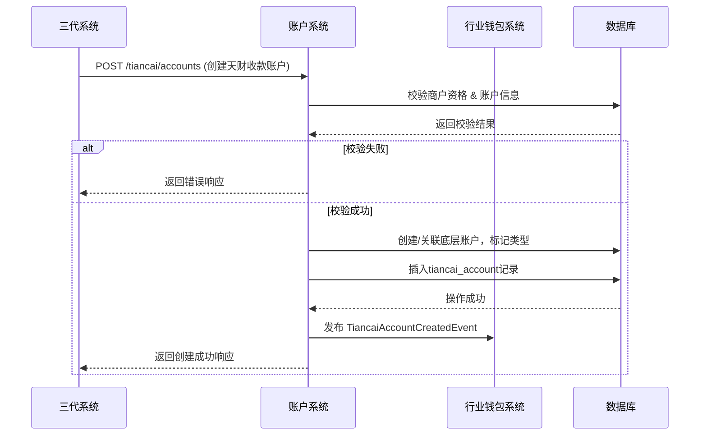

### 5.2 分账资金划转流程（账户系统视角）
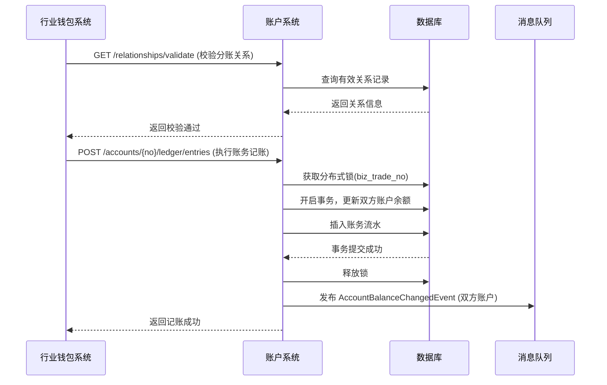

## 6. 错误处理

| 错误码 | HTTP 状态码 | 描述 | 处理策略 |
| :--- | :--- | :--- | :--- |
| `ACCOUNT_MERCHANT_INVALID` | 400 | 商户号无效或非天财机构 | 拒绝请求，返回详细错误信息。 |
| `ACCOUNT_ROLE_TYPE_MISMATCH` | 400 | 账户角色与类型不匹配 | 拒绝请求，提示正确组合。 |
| `ACCOUNT_ALREADY_EXISTS` | 409 | 天财账户已存在 | 返回已存在的账户信息，确保幂等。 |
| `RELATIONSHIP_DUPLICATE` | 409 | 同类型关系已存在且有效 | 返回现有关系ID。 |
| `RELATIONSHIP_NOT_FOUND` | 404 | 有效关系不存在 | 分账指令被拒绝。 |
| `ACCOUNT_BALANCE_INSUFFICIENT` | 422 | 账户余额不足 | 拒绝出账请求。 |
| `ACCOUNT_FROZEN` | 423 | 账户已冻结 | 拒绝所有资金变动请求。 |
| `LEDGER_ENTRY_DUPLICATE` | 409 | 重复的记账请求(biz_trade_no) | 返回之前的记账结果，确保幂等。 |
| `DATABASE_CONNECTION_FAILED` | 500 | 数据库连接失败 | 触发系统告警，请求入队列重试。 |

**通用策略**：
- **客户端错误(4xx)**：记录日志，返回明确错误信息，不重试。
- **服务端错误(5xx)**：记录错误日志并告警，对于账务类操作，利用`request_id`和`biz_trade_no`实现幂等，上游可安全重试。
- **分布式锁争用**：采用指数退避策略重试，超过最大重试次数后返回“系统繁忙”。

## 7. 依赖说明

### 7.1 上游依赖
1. **三代系统**
   - **交互方式**：同步REST API调用。
   - **职责**：提供商户信息校验、触发天财账户创建请求。
   - **关键点**：账户系统依赖其提供准确的商户状态和机构归属信息。

2. **行业钱包系统**
   - **交互方式**：同步API调用（校验关系）、异步事件消费（`AccountRelationVerifiedEvent`）。
   - **职责**：发起关系绑定状态同步、分账前的账户关系校验、触发账务操作。
   - **关键点**：账户系统是其执行分账的资金底层，必须保持高可用和强一致性。

3. **清结算系统**
   - **交互方式**：同步API调用（账务操作）。
   - **职责**：在结算日，将待结算账户(01)资金划入天财收款账户；处理退货(04账户)资金调拨。
   - **关键点**：账务接口需支持大并发批量处理，并保证事务性。

### 7.2 下游依赖
1. **数据库 (MySQL)**
   - **用途**：持久化存储账户、关系、流水数据。
   - **要求**：主从架构，读写分离。需要支持事务和行级锁。

2. **消息中间件 (Kafka/RocketMQ)**
   - **用途**：发布账户变更事件，实现系统间解耦。
   - **要求**：保证至少一次投递，关键事件需有序。

3. **分布式锁服务 (Redis)**
   - **用途**：保证`biz_trade_no`级别账务操作的幂等性。
   - **要求**：高可用，锁自动过期防止死锁。

### 7.3 设计原则
- **松耦合**：通过事件驱动与上游业务系统解耦，避免循环依赖。
- **高内聚**：账户生命周期、账务核心逻辑封装在本模块内部。
- **明确边界**：账户系统不处理业务规则（如分账比例、结算周期），只提供账户层面的能力和状态管理。业务规则由行业钱包系统负责。

## 3.2 认证系统


# 认证系统模块设计文档

## 1. 概述

### 1.1 目的
认证系统作为支付平台的核心身份核验模块，旨在为“天财分账”及其他业务场景提供安全、合规、可靠的身份与账户所有权验证能力。其主要目的是确保资金流转方（如总部、门店、供应商、股东）的身份真实性和账户控制权，为后续的“关系绑定”和“分账”操作提供法律和风控基础。

### 1.2 范围
本模块专注于提供标准化的认证能力，不处理具体的业务签约流程。其核心职责包括：
- **打款验证**：通过对公或对私银行卡打入随机金额，验证账户的有效性和用户控制权。
- **人脸验证**：通过比对姓名、身份证号与人脸生物特征，验证个人身份真实性。
- **认证状态管理**：记录、查询和管理每一次认证尝试的结果与证据。
- **与电子签约平台集成**：作为其底层认证能力提供方，完成关系绑定流程中的关键核验步骤。

### 1.3 设计原则
- **解耦与复用**：认证能力与具体业务逻辑解耦，通过标准API提供服务。
- **安全与合规**：所有验证流程符合金融级安全标准与监管要求，证据链完整可追溯。
- **高可用与性能**：作为关键路径组件，需保证高可用性，验证过程应高效。

## 2. 接口设计

### 2.1 API端点 (RESTful)

#### 2.1.1 发起打款验证
- **端点**: `POST /api/v1/verification/transfer-payment`
- **描述**: 请求系统向指定银行卡打入一笔随机金额的验证款。
- **认证**: 需要调用方（如行业钱包系统）的API密钥认证。
- **请求头**:
    - `X-Client-Id`: 调用方标识
    - `X-Signature`: 请求签名
- **请求体**:
```json
{
  "requestId": "req_202310271200001", // 调用方唯一请求ID，用于幂等
  "bizScene": "TIANCAI_BINDING", // 业务场景：TIANCAI_BINDING(天财关系绑定), WITHDRAW(提现)等
  "bizReferenceNo": "bind_123456", // 关联的业务唯一号（如签约流水号）
  "accountInfo": {
    "accountType": "CORPORATE", // 账户类型：CORPORATE-对公，PERSONAL-对私
    "accountName": "北京天财科技有限公司", // 账户名
    "accountNo": "1101234567890123456", // 银行卡号
    "bankCode": "ICBC", // 银行编码
    "bankBranch": "北京分行海淀支行" // 开户支行（对公建议提供）
  },
  "callbackUrl": "https://wallet.example.com/callback/verification" // 异步结果回调地址（可选）
}
```
- **成功响应** (202 Accepted):
```json
{
  "code": "SUCCESS",
  "message": "打款验证已发起",
  "data": {
    "verificationId": "ver_7x82hjs9a2k", // 本系统生成的唯一验证ID
    "status": "PROCESSING",
    "estimatedCompletionTime": "2023-10-27T12:05:00+08:00" // 预计打款完成时间
  }
}
```

#### 2.1.2 提交打款验证码
- **端点**: `POST /api/v1/verification/transfer-payment/{verificationId}/confirm`
- **描述**: 用户回填收到的打款金额，以完成验证。
- **请求体**:
```json
{
  "amount": "0.23" // 用户回填的金额，单位元，保留两位小数
}
```
- **成功响应**:
```json
{
  "code": "SUCCESS",
  "message": "验证成功",
  "data": {
    "verificationId": "ver_7x82hjs9a2k",
    "status": "SUCCESS",
    "verifiedAt": "2023-10-27T12:08:15+08:00"
  }
}
```

#### 2.1.3 发起人脸验证
- **端点**: `POST /api/v1/verification/face`
- **描述**: 发起一次人脸识别验证请求。
- **请求体**:
```json
{
  "requestId": "req_202310271200002",
  "bizScene": "TIANCAI_BINDING",
  "bizReferenceNo": "bind_123457",
  "userInfo": {
    "name": "张三",
    "idCardNo": "110101199001011234",
    "idCardType": "ID_CARD" // 证件类型：ID_CARD, PASSPORT等
  },
  "callbackUrl": "https://wallet.example.com/callback/verification",
  "redirectUrl": "https://h5.e-sign.com/face?token={token}" // 引导用户完成人脸识别的H5页面，由电子签约平台提供
}
```
- **成功响应**:
```json
{
  "code": "SUCCESS",
  "message": "人脸验证已发起",
  "data": {
    "verificationId": "ver_8k3jhs82na1",
    "status": "WAITING_USER_ACTION",
    "authToken": "eyJhbGciOi...", // 用于H5页面的临时令牌
    "redirectUrl": "https://h5.e-sign.com/face?token=eyJhbGciOi..." // 完整的跳转URL
  }
}
```

#### 2.1.4 查询验证结果
- **端点**: `GET /api/v1/verification/{verificationId}`
- **描述**: 同步查询某次验证的详细状态和结果。
- **成功响应**:
```json
{
  "code": "SUCCESS",
  "data": {
    "verificationId": "ver_7x82hjs9a2k",
    "requestId": "req_202310271200001",
    "bizScene": "TIANCAI_BINDING",
    "bizReferenceNo": "bind_123456",
    "method": "TRANSFER_PAYMENT", // 验证方法：TRANSFER_PAYMENT, FACE
    "status": "SUCCESS", // 状态：PROCESSING, WAITING_USER_ACTION, SUCCESS, FAILED, EXPIRED
    "accountInfo": { ... }, // 发起时的账户信息（打款验证独有）
    "userInfo": { ... }, // 发起时的用户信息（人脸验证独有）
    "evidence": {
      "transferAmount": "0.23", // 打款金额（打款验证成功后有值）
      "transferTime": "2023-10-27T12:03:00+08:00", // 打款时间
      "transactionNo": "txn_202310271203001" // 打款交易流水号
    },
    "failureReason": "AMOUNT_MISMATCH", // 失败原因码（如果失败）
    "failureMessage": "回填金额与打款金额不符",
    "createdAt": "2023-10-27T12:00:00+08:00",
    "updatedAt": "2023-10-27T12:08:15+08:00"
  }
}
```

### 2.2 发布/消费的事件

#### 2.2.1 发布的事件
认证系统在关键节点会向消息中间件（如Kafka）发布领域事件，供其他系统（如行业钱包系统、电子签约平台）订阅。

1. **VerificationInitiatedEvent** (验证已发起)
    - **Topic**: `verification.events.initiated`
    - **触发时机**: 成功受理打款验证或人脸验证请求后。
    - **Payload**:
    ```json
    {
      "eventId": "evt_001",
      "eventType": "VERIFICATION_INITIATED",
      "timestamp": "2023-10-27T12:00:00+08:00",
      "data": {
        "verificationId": "ver_7x82hjs9a2k",
        "bizScene": "TIANCAI_BINDING",
        "bizReferenceNo": "bind_123456",
        "method": "TRANSFER_PAYMENT",
        "status": "PROCESSING"
      }
    }
    ```

2. **VerificationCompletedEvent** (验证已完成)
    - **Topic**: `verification.events.completed`
    - **触发时机**: 验证最终状态确定（成功或失败）。
    - **Payload**:
    ```json
    {
      "eventId": "evt_002",
      "eventType": "VERIFICATION_COMPLETED",
      "timestamp": "2023-10-27T12:08:15+08:00",
      "data": {
        "verificationId": "ver_7x82hjs9a2k",
        "bizScene": "TIANCAI_BINDING",
        "bizReferenceNo": "bind_123456",
        "method": "TRANSFER_PAYMENT",
        "status": "SUCCESS",
        "failureReason": null,
        "evidence": { ... }
      }
    }
    ```

#### 2.2.2 消费的事件
认证系统可能需要消费来自其他系统的事件以触发某些操作（本需求中暂不涉及主动消费，主要为被动API调用）。

## 3. 数据模型

### 3.1 核心表设计

#### 表: `verification_record` (验证记录表)
存储每一次验证请求的完整信息与状态。
| 字段名 | 类型 | 必填 | 默认值 | 说明 |
| :--- | :--- | :--- | :--- | :--- |
| `id` | bigint(20) | 是 | AUTO_INCREMENT | 自增主键 |
| `verification_id` | varchar(32) | 是 | | **业务唯一验证ID**，全局唯一索引 `uk_verification_id` |
| `request_id` | varchar(64) | 是 | | **调用方请求ID**，与`client_id`组成联合唯一索引 `uk_request_client`，用于幂等 |
| `client_id` | varchar(32) | 是 | | **调用方标识** (如 `wallet_system`) |
| `biz_scene` | varchar(32) | 是 | | **业务场景**，如 `TIANCAI_BINDING` |
| `biz_reference_no` | varchar(64) | 是 | | **关联业务流水号** |
| `method` | varchar(20) | 是 | | **验证方法**：`TRANSFER_PAYMENT`, `FACE` |
| `status` | varchar(30) | 是 | `INIT` | **状态**: `INIT`, `PROCESSING`, `WAITING_USER_ACTION`, `SUCCESS`, `FAILED`, `EXPIRED` |
| `account_info_json` | json | 否 | NULL | **账户信息** (打款验证用)，JSON格式存储 `accountInfo` |
| `user_info_json` | json | 否 | NULL | **用户信息** (人脸验证用)，JSON格式存储 `userInfo` |
| `evidence_json` | json | 否 | NULL | **验证证据**，成功后的打款金额、流水号等 |
| `failure_reason` | varchar(50) | 否 | NULL | **失败原因码** |
| `failure_message` | varchar(255) | 否 | NULL | **失败详情** |
| `callback_url` | varchar(512) | 否 | NULL | 异步回调地址 |
| `expires_at` | datetime | 是 | | **验证过期时间**，创建后一定时间（如30分钟）未完成则状态置为`EXPIRED` |
| `created_at` | datetime | 是 | CURRENT_TIMESTAMP | 创建时间 |
| `updated_at` | datetime | 是 | CURRENT_TIMESTAMP ON UPDATE | 更新时间 |

**索引**:
- PRIMARY KEY (`id`)
- UNIQUE KEY `uk_verification_id` (`verification_id`)
- UNIQUE KEY `uk_request_client` (`request_id`, `client_id`)
- KEY `idx_biz_ref` (`biz_scene`, `biz_reference_no`)
- KEY `idx_status_expires` (`status`, `expires_at`) (用于过期扫描任务)

#### 表: `transfer_payment_detail` (打款验证明细表)
为打款验证场景扩展存储打款执行细节，与`verification_record`为一对一关系。
| 字段名 | 类型 | 必填 | 默认值 | 说明 |
| :--- | :--- | :--- | :--- | :--- |
| `id` | bigint(20) | 是 | AUTO_INCREMENT | 主键 |
| `verification_id` | varchar(32) | 是 | | 关联验证ID，外键 `fk_verification_id` |
| `transfer_amount` | decimal(10,2) | 是 | | **打款金额** (随机生成，如0.23) |
| `transfer_status` | varchar(20) | 是 | `PENDING` | **打款执行状态**: `PENDING`, `SUCCESS`, `FAILED` |
| `transaction_no` | varchar(64) | 否 | NULL | **打款交易流水号**，关联支付/清结算系统 |
| `attempt_count` | tinyint | 是 | 0 | **打款尝试次数** |
| `last_attempt_at` | datetime | 否 | NULL | 最后一次尝试打款时间 |
| `confirmed_amount` | decimal(10,2) | 否 | NULL | **用户回填的金额** |
| `created_at` | datetime | 是 | CURRENT_TIMESTAMP | |
| `updated_at` | datetime | 是 | CURRENT_TIMESTAMP ON UPDATE | |

**索引**:
- PRIMARY KEY (`id`)
- UNIQUE KEY `uk_verification_id` (`verification_id`)
- KEY `idx_transfer_status` (`transfer_status`, `last_attempt_at`) (用于重试任务)

### 3.2 与其他模块的关系
- **行业钱包系统**: 是认证系统的主要调用方，在“关系绑定”流程中发起认证请求。
- **电子签约平台**: 在人脸验证场景中，认证系统通过重定向将用户引导至电子签约平台提供的H5页面进行人脸采集与比对。电子签约平台在比对完成后，通过回调通知认证系统结果。
- **支付/清结算系统**: 在执行打款验证时，认证系统需调用支付或清结算系统的付款接口，完成小额打款。
- **账户系统**: 在部分风控场景下，可能需要查询账户状态（非本需求核心）。

## 4. 业务逻辑

### 4.1 核心算法

#### 4.1.1 随机打款金额生成
- **规则**: 生成一个介于 `0.01` 元到 `1.00` 元之间的随机金额。
- **精度**: 人民币分（0.01元）。
- **算法**: `amount = (random.nextInt(100) + 1) / 100.0`。
- **唯一性**: 对于同一`verification_id`，金额生成后固定不变。在极低概率冲突下可重试生成。

#### 4.1.2 验证结果判定
- **打款验证成功**: `abs(confirmed_amount - transfer_amount) < 0.005` (即误差小于半分钱)。
- **人脸验证成功**: 接收电子签约平台回调，比对分数高于预设阈值（如0.8），且姓名、身份证号一致。
- **失败**: 金额不符、超时、人脸比对失败或用户主动取消。

### 4.2 业务规则

1. **幂等性**: 使用 `request_id` + `client_id` 保证同一业务请求不会重复创建验证记录。
2. **有效期**: 每笔验证创建后有效期为 **30分钟**。超时后状态自动更新为 `EXPIRED`，不可再提交验证码。
3. **打款重试**: 打款操作若首次失败（如银行通道问题），系统自动重试，最多 **3次**，间隔指数退避。
4. **验证次数限制**: 同一`biz_reference_no`在24小时内，同一验证方法失败次数不得超过 **5次**，防止暴力破解。
5. **金额保密**: 打款金额在验证成功前，不得在任何日志或接口中明文泄露。
6. **场景适配**:
    - **对公账户绑定**：强制使用 **打款验证**。
    - **对私账户绑定**：优先使用 **人脸验证**；若人脸验证不可用（如用户拒绝），可降级为 **打款验证**。

### 4.3 验证逻辑

#### 4.3.1 发起请求校验
```python
def validate_init_request(request):
    # 1. 基本校验
    if not request.request_id or not request.biz_scene or not request.biz_reference_no:
        raise ValidationError("必要参数缺失")
    
    # 2. 根据method校验特定字段
    if request.method == "TRANSFER_PAYMENT":
        if not request.account_info or not request.account_info.account_no:
            raise ValidationError("打款验证必须提供账户信息")
        # 对公账户名校验规则更严格
        if request.account_info.account_type == "CORPORATE" and not request.account_info.account_name:
            raise ValidationError("对公账户必须提供户名")
    
    elif request.method == "FACE":
        if not request.user_info or not request.user_info.name or not request.user_info.id_card_no:
            raise ValidationError("人脸验证必须提供用户姓名和身份证号")
    
    # 3. 幂等校验：查询是否已有相同的 request_id + client_id 记录
    existing_record = VerificationRecord.find_by_request(request.request_id, request.client_id)
    if existing_record:
        return existing_record # 直接返回已存在的记录
    
    # 4. 风控校验：检查同一业务号是否超过失败次数限制
    if is_failure_limit_exceeded(request.biz_reference_no, request.method):
        raise BusinessError("验证失败次数过多，请稍后再试")
```

#### 4.3.2 确认打款金额校验
```python
def confirm_transfer_payment(verification_id, confirmed_amount):
    record = VerificationRecord.find_by_id(verification_id)
    
    # 1. 状态校验
    if record.status not in ["PROCESSING", "WAITING_USER_ACTION"]:
        raise BusinessError("当前验证状态不允许确认")
    
    # 2. 过期校验
    if record.expires_at < current_time():
        record.update_status("EXPIRED")
        raise BusinessError("验证已过期")
    
    # 3. 金额比对
    detail = TransferPaymentDetail.find_by_verification_id(verification_id)
    if abs(float(confirmed_amount) - float(detail.transfer_amount)) < 0.005:
        record.update_status("SUCCESS", evidence={"transferAmount": detail.transfer_amount, ...})
        publish_verification_completed_event(record)
    else:
        record.update_status("FAILED", failure_reason="AMOUNT_MISMATCH")
        publish_verification_completed_event(record)
        raise BusinessError("验证失败，金额不符")
```

## 5. 时序图

### 5.1 打款验证流程（门店绑定天财收款账户 - 对公场景）
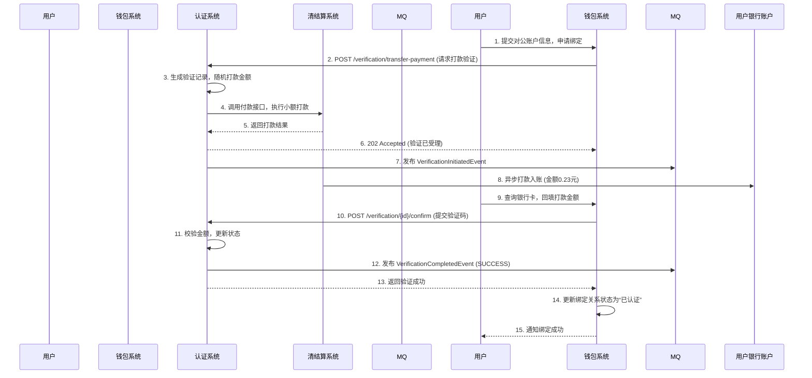

### 5.2 人脸验证流程（供应商绑定天财接收方账户 - 对私场景）
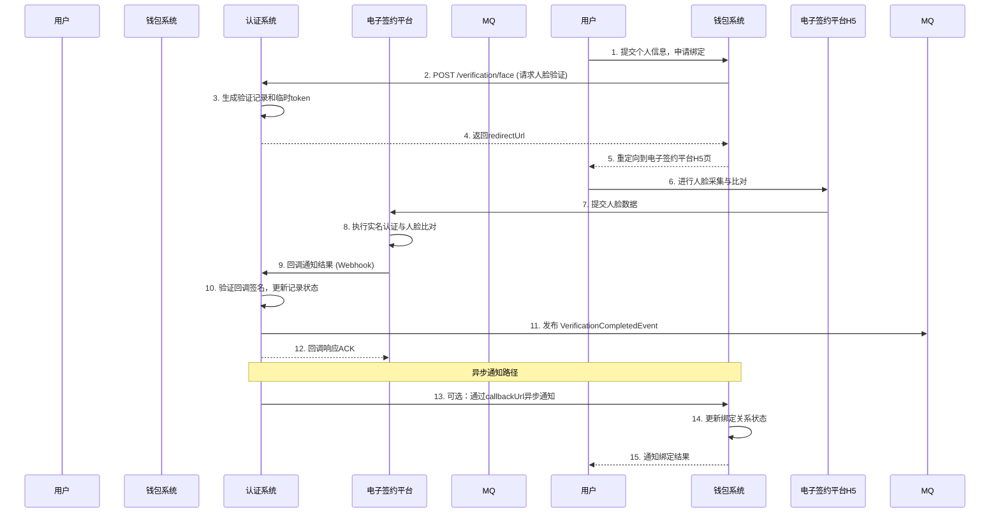

## 6. 错误处理

### 6.1 预期错误码列表
| HTTP状态码 | 错误码 | 描述 | 处理建议 |
| :--- | :--- | :--- | :--- |
| 400 | `INVALID_PARAMETER` | 请求参数缺失或格式错误 | 检查请求体，确保必填字段符合规范 |
| 400 | `UNSUPPORTED_VERIFICATION_METHOD` | 不支持的验证方法 | 检查`method`字段是否为`TRANSFER_PAYMENT`或`FACE` |
| 409 | `DUPLICATE_REQUEST` | 重复的请求ID | 使用原`verificationId`进行后续操作，或更换`requestId` |
| 429 | `RATE_LIMIT_EXCEEDED` | 调用频率超限 | 降低调用频率，遵循限流策略 |
| 429 | `FAILURE_LIMIT_EXCEEDED` | 同一业务验证失败次数超限 | 引导用户24小时后再试 |
| 404 | `VERIFICATION_NOT_FOUND` | 验证记录不存在 | 检查`verificationId`是否正确 |
| 403 | `VERIFICATION_EXPIRED` | 验证已过期 | 重新发起验证请求 |
| 403 | `VERIFICATION_COMPLETED` | 验证已完成（成功/失败） | 根据当前状态决定后续操作，无需重复提交 |
| 500 | `THIRD_PARTY_SERVICE_ERROR` | 下游服务（清结算、电子签）异常 | 系统自动重试，告警通知运维 |
| 503 | `BANK_CHANNEL_UNAVAILABLE` | 打款通道暂时不可用 | 系统自动重试，告警通知运维 |

### 6.2 处理策略
1. **客户端错误 (4xx)**: 调用方需修正请求后重试。系统提供清晰的错误信息。
2. **服务端错误 (5xx)**:
    - **打款失败**: 系统内置重试机制（最多3次），并记录失败原因。最终仍失败则更新验证状态为`FAILED`，原因`TRANSFER_FAILED`。
    - **依赖服务超时/不可用**: 快速失败，返回503，并触发降级策略（如人脸验证不可用时，业务方可选择降级为打款验证）。
3. **异步回调保证**: 向`callbackUrl`发送回调时，实施重试机制（如1, 3, 5分钟间隔，最多5次），确保业务方最终能收到结果。
4. **监控与告警**: 对失败率、延迟、下游服务状态设置监控看板与告警阈值。

## 7. 依赖说明

### 7.1 上游依赖（认证系统调用）

| 依赖系统 | 交互目的 | 接口方式 | 关键要求 |
| :--- | :--- | :--- | :--- |
| **清结算系统** | 执行小额打款 | 同步/异步API | 高可用、支持小额付款（最低0.01元）、返回明确交易流水号 |
| **电子签约平台** | 人脸比对与实名认证 | 异步回调(Webhook) | 提供标准的H5页面集成方式、回调需带签名防篡改 |
| **消息队列 (Kafka)** | 发布领域事件 | 消息发布 | 高吞吐、高可用 |

### 7.2 下游依赖（调用认证系统）

| 调用方 | 交互场景 | 集成方式 | 注意事项 |
| :--- | :--- | :--- | :--- |
| **行业钱包系统** | 关系绑定流程中的身份核验 | 同步REST API + 事件订阅 | 需处理异步回调，实现幂等，关注验证有效期 |
| **（未来）其他业务系统** | 提现验证、敏感操作确认等 | 同步REST API | 遵循统一的API规范与认证方式 |

### 7.3 集成要点
1. **API认证**: 所有调用需通过API Gateway，使用 `X-Client-Id` 和签名 (`X-Signature`) 进行身份验证与防重放。
2. **超时设置**: 调用清结算系统打款接口时，设置合理超时（如5秒），并配置快速失败与重试策略。
3. **回调安全**: 电子签约平台回调需验证签名，确保请求来源可信。
4. **数据一致性**: 依赖分布式事务或最终一致性方案。例如，更新验证状态与发布事件应在一个本地事务中；若回调通知失败，通过定期扫描`PROCESSING`状态超时记录进行补偿。

## 3.3 计费中台


# 计费中台模块设计文档

## 1. 概述

### 1.1 目的
计费中台模块是天财分账系统的核心计费引擎，负责对各类分账交易、账户管理、资金操作进行精确的费用计算和结算处理。它作为清结算系统的一部分，向上游（行业钱包系统、三代系统）提供标准化的计费服务，向下游（账户系统、对账单系统）输出计费结果和结算指令，确保天财业务的资金流转符合计费规则，并生成准确的计费凭证。

### 1.2 范围
- **计费对象**：天财分账交易（归集、批量付款、会员结算）、天财专用账户的开户/维护、提现/充值操作。
- **核心功能**：
    1. **费率规则管理**：支持为不同业务场景、不同角色（总部/门店）、不同账户类型配置差异化的计费规则（如固定费用、百分比费率、阶梯费率、封顶/保底）。
    2. **实时计费**：在分账指令处理、账户操作等关键节点，实时计算并冻结/扣除相关费用。
    3. **批量结算**：按结算周期（如T+1）对已发生的费用进行汇总、核对，并生成结算指令，驱动资金从待结算账户或指定账户划转至收费方账户。
    4. **费用对账**：生成详细的计费明细和汇总账单，供内部对账和天财机构查询。
    5. **计费豁免与优惠**：支持基于特定条件（如活动期、大客户）的费用减免。
- **非范围**：支付交易本身的清算（由清结算主流程负责）、底层账户的账务记账（由账户系统负责）、电子签约流程。

## 2. 接口设计

### 2.1 API端点 (RESTful)

#### 2.1.1 计费试算接口
- **端点**: `POST /v1/billing/calculate`
- **描述**: 在业务发起前（如分账），预先计算并返回费用明细，用于前端展示或风控校验。
- **请求头**: `X-Biz-Scenario: {场景码}`, `X-Request-ID: {请求ID}`
- **请求体**:
```json
{
  "biz_order_no": "TC202403210001", // 业务订单号
  "scene_code": "TC_COLLECT", // 业务场景码，如 TC_COLLECT(归集), TC_BATCH_PAY(批量付款)
  "payer_info": {
    "account_no": "TC_RCV_1001", // 付方账户号
    "account_role": "HEADQUARTERS" // 付方角色
  },
  "payee_info": {
    "account_no": "TC_RCV_1002", // 收方账户号（批量付款时为数组）
    "account_role": "STORE"
  },
  "amount": 100000, // 分账金额（单位：分）
  "currency": "CNY",
  "extend_info": { // 扩展信息，用于匹配复杂规则
    "industry_type": "catering",
    "merchant_tier": "VIP1"
  }
}
```
- **响应体** (成功):
```json
{
  "code": "SUCCESS",
  "data": {
    "biz_order_no": "TC202403210001",
    "total_fee": 50, // 总费用（分）
    "currency": "CNY",
    "fee_details": [
      {
        "fee_type": "PLATFORM_SERVICE_FEE", // 费用类型
        "fee_name": "平台服务费",
        "calculation_base": 100000, // 计费基数
        "rate": "0.0005", // 费率
        "fee_amount": 50,
        "payer_account_no": "TC_RCV_1001", // 承担方账户
        "payee_account_no": "FEE_ACCOUNT_PLATFORM" // 收费方账户
      }
    ]
  }
}
```

#### 2.1.2 费用确认与冻结接口
- **端点**: `POST /v1/billing/confirm`
- **描述**: 业务正式执行前（如分账指令通过风控后），确认并冻结费用，确保资金可用。
- **请求体**: 包含 `biz_order_no` 和 `calculate_id` (试算返回的标识)。
- **响应体**: 返回 `billing_order_no` (计费订单号) 和费用冻结结果。

#### 2.1.3 费用结算指令生成接口（内部）
- **端点**: `POST /internal/v1/billing/settle`
- **描述**: 由调度任务触发，对已冻结且业务已完成的费用，生成结算指令。
- **请求体**: `{ "settle_date": "2024-03-21", "biz_scenario": "TC_COLLECT" }`
- **响应体**: 返回生成的结算批次号及指令数量。

### 2.2 发布/消费的事件

#### 2.2.1 消费的事件
- **`Tiancai.Split.Order.Completed`** (来自行业钱包系统): 分账订单完成。触发计费模块进行费用确认和结算准备。
- **`Account.Created`** (来自账户系统): 天财专用账户创建成功。可能触发开户手续费计费。
- **`Settlement.Cycle.Closed`** (来自清结算系统): 结算周期关闭。触发批量费用结算作业。

#### 2.2.2 发布的事件
- **`Billing.Fee.Frozen`**: 费用冻结成功。通知相关系统费用已预留。
- **`Billing.Settlement.Instruction.Created`**: 结算指令已生成。清结算系统将消费此事件执行资金划转。
- **`Billing.Detail.Generated`**: 计费明细已生成。对账单系统消费以生成天财机构账单。

## 3. 数据模型

### 3.1 核心表设计

#### 3.1.1 计费规则表 (`billing_rule`)
| 字段名 | 类型 | 必填 | 描述 |
| :--- | :--- | :--- | :--- |
| `rule_id` | bigint | Y | 主键 |
| `rule_code` | varchar(64) | Y | 规则唯一编码 |
| `rule_name` | varchar(128) | Y | 规则名称 |
| `biz_scenario` | varchar(32) | Y | 业务场景码 |
| `payer_role` | varchar(32) | N | 付费方角色 (如 HEADQUARTERS)，NULL表示通用 |
| `payee_role` | varchar(32) | N | 收款方角色 |
| `account_type` | varchar(32) | N | 账户类型 (TC_RCV, TC_RECIPIENT) |
| `fee_type` | varchar(32) | Y | 费用类型 (PLATFORM_SERVICE_FEE, WITHDRAW_FEE) |
| `calculation_mode` | varchar(32) | Y | 计费模式 (PERCENTAGE, FIXED, TIERED) |
| `rate` | decimal(10,6) | N | 费率 (百分比模式) |
| `fixed_amount` | bigint | N | 固定费用 (分) |
| `tier_config` | json | N | 阶梯费率配置 |
| `min_fee` | bigint | N | 最低费用 |
| `max_fee` | bigint | N | 最高费用 |
| `fee_payer` | varchar(32) | Y | 费用承担方 (PAYER, PAYEE, BOTH) |
| `effective_date` | date | Y | 生效日期 |
| `expiry_date` | date | N | 失效日期 |
| `status` | tinyint | Y | 状态 (1生效，0失效) |

#### 3.1.2 计费订单表 (`billing_order`)
| 字段名 | 类型 | 必填 | 描述 |
| :--- | :--- | :--- | :--- |
| `billing_order_no` | varchar(64) | Y | 主键，计费订单号 |
| `biz_order_no` | varchar(64) | Y | 关联的业务订单号 |
| `biz_scenario` | varchar(32) | Y | 业务场景 |
| `total_fee` | bigint | Y | 总费用 (分) |
| `currency` | char(3) | Y | 币种 |
| `fee_status` | varchar(32) | Y | 状态 (CALCULATED, FROZEN, SETTLED, CANCELLED) |
| `payer_account_no` | varchar(64) | Y | 业务付方账户 |
| `settle_date` | date | N | 结算日期 |
| `created_at` | datetime | Y | 创建时间 |

#### 3.1.3 计费明细表 (`billing_detail`)
| 字段名 | 类型 | 必填 | 描述 |
| :--- | :--- | :--- | :--- |
| `id` | bigint | Y | 主键 |
| `billing_order_no` | varchar(64) | Y | 关联计费订单 |
| `fee_type` | varchar(32) | Y | 费用类型 |
| `calculation_base` | bigint | Y | 计费基数 (分) |
| `rate` | decimal(10,6) | N | 适用费率 |
| `fee_amount` | bigint | Y | 费用金额 (分) |
| `payer_account_no` | varchar(64) | Y | 费用承担方账户 |
| `payee_account_no` | varchar(64) | Y | 费用收取方账户 (如平台收入户) |
| `rule_id` | bigint | Y | 关联的计费规则 |

#### 3.1.4 结算指令表 (`settlement_instruction`)
| 字段名 | 类型 | 必填 | 描述 |
| :--- | :--- | :--- | :--- |
| `instruction_id` | varchar(64) | Y | 指令ID |
| `batch_no` | varchar(64) | Y | 结算批次号 |
| `billing_order_no` | varchar(64) | Y | 关联计费订单 |
| `payer_account_no` | varchar(64) | Y | 出款账户 (如待结算账户01) |
| `payee_account_no` | varchar(64) | Y | 入款账户 (平台账户) |
| `amount` | bigint | Y | 金额 |
| `currency` | char(3) | Y | 币种 |
| `status` | varchar(32) | Y | 状态 (PENDING, PROCESSING, SUCCESS, FAILED) |
| `settle_date` | date | Y | 结算日期 |

### 3.2 与其他模块的关系
- **行业钱包系统**: 通过事件和API交互，是计费触发的主要上游。
- **账户系统**: 依赖其查询账户信息、角色、类型，并驱动费用账户的扣款。
- **清结算系统**: 隶属其下，消费结算周期事件，并输出结算指令给清结算执行。
- **对账单系统**: 提供计费明细数据，用于生成天财机构账单。
- **三代系统**: 可能透传商户层级、行业等扩展信息，用于匹配计费规则。

## 4. 业务逻辑

### 4.1 核心计费算法
1. **规则匹配引擎**：根据 `biz_scenario`, `payer_role`, `payee_role`, `account_type` 以及扩展信息（如 `industry_type`），从 `billing_rule` 表中匹配出优先级最高（规则最具体）且处于生效期的计费规则。
2. **费用计算**：
    - **百分比模式**: `fee = calculation_base * rate`。应用 `min_fee` 和 `max_fee` 限制。
    - **固定费用模式**: `fee = fixed_amount`。
    - **阶梯模式**: 根据 `tier_config` (如 `[{“min”:0, “max”:10000, “rate”:0.001}, ...]`) 计算。
3. **费用承担方拆分**：若 `fee_payer` 为 `BOTH`，则按预设比例在付方和收方之间拆分费用，生成两条计费明细。

### 4.2 业务规则
- **归集场景**：通常由门店（付方）承担平台服务费。费用从门店的 **天财收款账户** 中扣除。
- **批量付款/会员结算场景**：通常由总部（付方）承担手续费。费用从总部的 **天财收款账户** 中扣除。
- **账户开户**：可能收取一次性开户费，从对应的 **天财收款账户** 或 **天财接收方账户** 中扣除。
- **提现**：从天财接收方账户提现到银行卡，可能按笔收取固定提现费。
- **退货场景**：关联原交易，计费可能冲正（reverse）或免除。

### 4.3 验证逻辑
- **费用试算验证**：匹配不到有效规则时，返回错误码 `NO_VALID_BILLING_RULE`。
- **费用冻结验证**：检查付方账户状态是否正常、可用余额是否足够覆盖“业务金额+冻结费用”。
- **结算前验证**：检查关联的业务订单状态是否为最终成功状态。

## 5. 时序图

### 5.1 分账业务计费流程

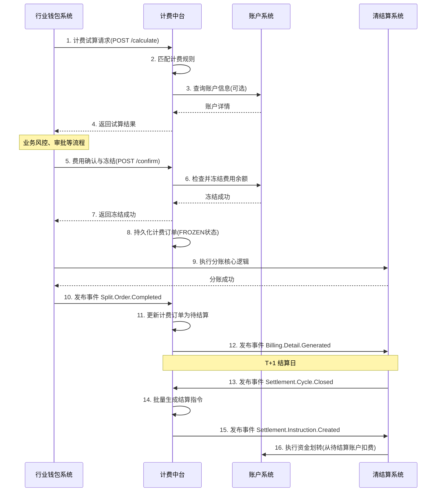

## 6. 错误处理

| 错误码 | HTTP状态码 | 描述 | 处理策略 |
| :--- | :--- | :--- | :--- |
| `BIZ_SCENARIO_INVALID` | 400 | 业务场景码不支持 | 检查请求参数，引导使用白名单内的场景码。 |
| `NO_VALID_BILLING_RULE` | 400 | 未找到适用的计费规则 | 检查计费规则配置，或联系运营人员为该场景配置规则。 |
| `ACCOUNT_NOT_FOUND` | 404 | 账户不存在或状态异常 | 调用方需确保账户已正确开户并处于可用状态。 |
| `INSUFFICIENT_BALANCE` | 409 | 账户余额不足（用于冻结） | 通知业务方充值或调整业务金额。 |
| `FEE_ALREADY_SETTLED` | 409 | 费用已结算，不可重复操作 | 幂等处理，返回已存在的结算结果。 |
| `CALCULATE_ID_EXPIRED` | 410 | 试算结果已过期 | 重新调用试算接口。 |
| `SYSTEM_ERROR` | 500 | 系统内部错误 | 记录详细日志，触发告警，人工介入排查。 |

**通用策略**：
- 所有关键操作（冻结、结算）必须实现**幂等性**，通过唯一业务订单号或计费订单号控制。
- 采用**异步补偿机制**。对于结算失败指令，记录失败原因，由定时任务重试或转人工处理。
- 所有错误均返回结构化的JSON响应，包含 `code`, `message`, `request_id`。

## 7. 依赖说明

### 7.1 上游模块交互
1. **行业钱包系统 (主调用方)**:
    - **交互方式**: 同步API调用（试算、确认）、异步事件监听（`Split.Order.Completed`）。
    - **职责**: 提供准确的业务场景、账户信息、金额，并在业务合适节点触发计费。
    - **契约**: 需保证业务订单号的全局唯一性。

2. **账户系统**:
    - **交互方式**: 同步RPC/API调用。
    - **职责**: 提供账户余额查询、费用冻结/解冻/扣减接口。计费中台不直接操作账户余额，只调用账户系统接口。
    - **关键接口**: `冻结资金`、`解冻并扣款`、`查询账户详情`。

3. **清结算系统 (父系统)**:
    - **交互方式**: 事件总线、内部API。
    - **职责**: 提供结算周期时钟事件，接收并执行计费中台发出的资金结算指令。

### 7.2 下游模块交互
1. **对账单系统**:
    - **交互方式**: 异步事件 (`Billing.Detail.Generated`)、数据库直读（可选）。
    - **职责**: 消费计费明细事件，为天财机构聚合生成费用账单。

### 7.3 配置与数据依赖
- **计费规则配置台**: 需要一个独立的运营管理后台，供业务人员配置和发布计费规则。此配置台可直接操作 `billing_rule` 表或通过管理API与计费中台交互。
- **商户/机构信息**: 依赖三代系统或商户中心提供商户的行业分类、等级等信息，用于精细化的规则匹配。这些信息可通过请求中的 `extend_info` 传入，或由计费中台根据商户号实时查询获取。

## 3.4 三代系统


# 三代系统模块设计文档

## 1. 概述

### 1.1 目的
三代系统作为拉卡拉支付的核心商户管理系统，是天财分账业务的**入口和协调中枢**。本模块负责接收天财的业务请求，协调**行业钱包系统**、**账户系统**、**电子签约平台**等多个下游系统，完成天财专用账户的开通、关系绑定、分账指令转发等全流程业务处理。三代系统是天财业务与底层支付基础设施之间的**桥梁和控制器**。

### 1.2 范围
- **商户与账户管理**：作为天财收单商户的开户和管理入口，触发天财专用账户的创建流程。
- **业务请求受理与路由**：接收天财发起的各类分账业务请求（归集、批量付款、会员结算），进行初步校验后路由至行业钱包系统处理。
- **流程协调与状态管理**：协调电子签约、认证、账户绑定等多个异步流程，管理整体业务状态。
- **数据透传与结果返回**：作为统一出口，向天财返回业务处理结果。
- **与现有系统集成**：无缝集成现有的商户管理、交易处理等核心功能，确保天财业务不破坏现有流程。

## 2. 接口设计

### 2.1 API端点 (RESTful)

#### 2.1.1 商户与账户开通接口
- **POST /api/v1/tiancai/merchants/{merchant_no}/enable**
    - **描述**：为指定的收单商户开通天财分账业务能力。此接口会触发天财专用账户的创建流程。
    - **路径参数**：
        - `merchant_no`: 收单商户号
    - **请求体**：
      ```json
      {
        "request_id": "req_enable_001",
        "institution_code": "TIANCAI", // 机构代码，固定为天财
        "account_roles": ["HEADQUARTERS", "STORE"], // 需要开通的账户角色列表
        "operator": "admin_user",
        "ext_params": {} // 扩展参数
      }
      ```
    - **响应体**：
      ```json
      {
        "code": "SUCCESS",
        "message": "开通请求已受理",
        "data": {
          "process_id": "PROC_20231011001", // 流程实例ID，用于查询进度
          "estimated_time": 30 // 预计完成时间（秒）
        }
      }
      ```

#### 2.1.2 分账业务请求接口
- **POST /api/v1/tiancai/split-orders**
    - **描述**：天财发起分账指令的统一入口。三代系统接收后，进行基础校验并转发给行业钱包系统。
    - **请求体**：
      ```json
      {
        "request_id": "split_req_20231011001",
        "biz_scene": "COLLECTION", // 业务场景：COLLECTION(归集)/BATCH_PAY(批量付款)/MEMBER_SETTLE(会员结算)
        "payer": {
          "tiancai_account_id": "TCA_20231011001",
          "merchant_no": "M100001",
          "role": "STORE"
        },
        "payee_list": [
          {
            "tiancai_account_id": "TCA_20231011002",
            "merchant_no": "M100002",
            "role": "HEADQUARTERS",
            "amount": 10000, // 分账金额（分）
            "currency": "CNY",
            "memo": "门店日结归集"
          }
        ],
        "total_amount": 10000,
        "biz_ref_no": "TC_ORDER_001", // 天财业务参考号
        "callback_url": "https://tiancai.com/callback", // 异步回调地址
        "ext_info": {}
      }
      ```
    - **响应体**：
      ```json
      {
        "code": "SUCCESS",
        "message": "分账指令已接收",
        "data": {
          "split_order_id": "SO_202310110001", // 三代系统生成的分账订单号
          "status": "PROCESSING",
          "received_at": "2023-10-11T10:00:00Z"
        }
      }
      ```

#### 2.1.3 查询接口
- **GET /api/v1/tiancai/split-orders/{split_order_id}**
    - **描述**：查询分账指令处理状态。
- **GET /api/v1/tiancai/merchants/{merchant_no}/accounts**
    - **描述**：查询商户名下的天财专用账户列表及状态。
- **GET /api/v1/tiancai/processes/{process_id}**
    - **描述**：查询异步流程（如账户开通、关系绑定）的执行进度。

#### 2.1.4 回调接口 (供下游系统调用)
- **POST /api/internal/tiancai/callback/process**
    - **描述**：行业钱包、电子签约等下游系统回调通知流程状态变更。
    - **请求体**：
      ```json
      {
        "process_id": "PROC_20231011001",
        "step": "ACCOUNT_CREATION", // 流程步骤
        "status": "SUCCESS", // 步骤状态：SUCCESS/FAILED/PENDING
        "result_data": {
          "tiancai_account_id": "TCA_20231011001",
          "account_no": "3010001001"
        },
        "error_code": "",
        "error_message": "",
        "timestamp": "2023-10-11T10:00:00Z"
      }
      ```

### 2.2 发布/消费的事件

#### 2.2.1 消费的事件
- **TiancaiAccountCreatedEvent** (来自账户系统)：接收天财账户创建成功通知，更新本地账户映射关系。
- **SplitOrderCompletedEvent** (来自行业钱包系统)：接收分账指令处理完成通知，更新订单状态并回调天财。

#### 2.2.2 发布的事件
- **MerchantCreatedEvent**：当三代系统创建新的收单商户时发布，供账户系统监听以判断是否需开通天财账户。
  ```json
  {
    "event_id": "event_merchant_001",
    "event_type": "MERCHANT_CREATED",
    "timestamp": "2023-10-11T09:00:00Z",
    "data": {
      "merchant_no": "M100001",
      "merchant_name": "天财示范店",
      "institution_code": "TIANCAI",
      "status": "ACTIVE",
      "created_at": "2023-10-11T09:00:00Z"
    }
  }
  ```
- **TiancaiBusinessEnabledEvent**：商户成功开通天财业务时发布，供监控和审计系统使用。

## 3. 数据模型

### 3.1 核心表设计

#### 表：`tiancai_merchant_config` (天财商户配置表)
| 字段名 | 类型 | 必填 | 默认值 | 描述 |
| :--- | :--- | :--- | :--- | :--- |
| `id` | bigint | Y | AUTO_INCREMENT | 主键 |
| `merchant_no` | varchar(32) | Y | | **收单商户号**，关联核心商户表 |
| `institution_code` | varchar(20) | Y | `TIANCAI` | 机构代码 |
| `business_status` | varchar(20) | Y | `DISABLED` | 天财业务状态：`DISABLED`/`ENABLING`/`ENABLED`/`SUSPENDED` |
| `enabled_roles` | json | Y | `[]` | 已开通的账户角色列表，如`["HEADQUARTERS", "STORE"]` |
| `config_json` | json | N | | 业务配置（费率、限额等） |
| `created_at` | datetime | Y | CURRENT_TIMESTAMP | |
| `updated_at` | datetime | Y | CURRENT_TIMESTAMP ON UPDATE | |

#### 表：`tiancai_account_mapping` (天财账户映射表)
| 字段名 | 类型 | 必填 | 默认值 | 描述 |
| :--- | :--- | :--- | :--- | :--- |
| `id` | bigint | Y | AUTO_INCREMENT | 主键 |
| `merchant_no` | varchar(32) | Y | | 收单商户号 |
| `account_role` | varchar(20) | Y | | 账户角色：`HEADQUARTERS`/`STORE`/`RECEIVER` |
| `tiancai_account_id` | varchar(32) | Y | | 天财账户ID（来自账户系统） |
| `account_no` | varchar(20) | Y | | 底层账户号 |
| `status` | varchar(20) | Y | | 映射状态：`CREATING`/`ACTIVE`/`INACTIVE` |
| `created_at` | datetime | Y | CURRENT_TIMESTAMP | |

#### 表：`tiancai_split_order` (天财分账订单表)
| 字段名 | 类型 | 必填 | 默认值 | 描述 |
| :--- | :--- | :--- | :--- | :--- |
| `id` | bigint | Y | AUTO_INCREMENT | 主键 |
| `split_order_id` | varchar(32) | Y | | **业务主键**，格式`SO_YYYYMMDDxxx` |
| `request_id` | varchar(64) | Y | | 天财请求流水号，用于幂等 |
| `biz_scene` | varchar(20) | Y | | 业务场景：`COLLECTION`/`BATCH_PAY`/`MEMBER_SETTLE` |
| `payer_merchant_no` | varchar(32) | Y | | 付方商户号 |
| `payer_account_id` | varchar(32) | Y | | 付方天财账户ID |
| `total_amount` | decimal(15,2) | Y | | 总分账金额 |
| `currency` | varchar(3) | Y | `CNY` | 币种 |
| `status` | varchar(20) | Y | `INIT` | 订单状态：`INIT`/`PROCESSING`/`SUCCESS`/`FAILED`/`PARTIAL_SUCCESS` |
| `wallet_order_id` | varchar(32) | N | | 行业钱包系统订单ID |
| `callback_url` | varchar(512) | N | | 天财回调地址 |
| `callback_status` | varchar(20) | Y | `PENDING` | 回调状态：`PENDING`/`SENT`/`FAILED` |
| `request_data` | json | Y | | 原始请求数据（全量） |
| `result_data` | json | N | | 处理结果数据 |
| `error_code` | varchar(50) | N | | 错误码 |
| `error_message` | varchar(500) | N | | 错误信息 |
| `created_at` | datetime | Y | CURRENT_TIMESTAMP | |
| `updated_at` | datetime | Y | CURRENT_TIMESTAMP ON UPDATE | |

#### 表：`tiancai_process_flow` (天财业务流程表)
| 字段名 | 类型 | 必填 | 默认值 | 描述 |
| :--- | :--- | :--- | :--- | :--- |
| `id` | bigint | Y | AUTO_INCREMENT | 主键 |
| `process_id` | varchar(32) | Y | | 流程实例ID，格式`PROC_YYYYMMDDxxx` |
| `process_type` | varchar(30) | Y | | 流程类型：`ACCOUNT_ENABLE`/`RELATION_BIND`/`PAYMENT_AUTH` |
| `merchant_no` | varchar(32) | Y | | 关联商户号 |
| `current_step` | varchar(30) | Y | | 当前步骤 |
| `step_status` | varchar(20) | Y | `PENDING` | 步骤状态：`PENDING`/`PROCESSING`/`SUCCESS`/`FAILED` |
| `context_data` | json | Y | | 流程上下文数据 |
| `expire_time` | datetime | N | | 流程过期时间 |
| `created_at` | datetime | Y | CURRENT_TIMESTAMP | |
| `updated_at` | datetime | Y | CURRENT_TIMESTAMP ON UPDATE | |

### 3.2 与其他模块的关系
- **账户系统**：通过`tiancai_account_mapping`表维护商户号与天财账户ID的映射关系。
- **行业钱包系统**：通过`tiancai_split_order.wallet_order_id`关联分账订单。
- **电子签约平台**：通过`tiancai_process_flow.context_data`存储签约流程的临时数据。
- **核心商户表(merchant)**：`tiancai_merchant_config.merchant_no`外键关联，确保只有有效商户可开通天财业务。

## 4. 业务逻辑

### 4.1 核心算法与规则

#### 4.1.1 天财业务开通流程控制
```python
def enable_tiancai_business(merchant_no, account_roles):
    """
    开通天财业务的核心流程控制
    1. 校验商户是否属于天财机构且状态正常
    2. 为每个account_role异步创建天财专用账户
    3. 等待所有账户创建成功
    4. 更新业务状态为ENABLED
    """
    # 1. 校验商户
    merchant = get_merchant(merchant_no)
    if merchant.institution_code != 'TIANCAI':
        raise ValidationError("非天财机构商户")
    
    # 2. 创建流程记录
    process_id = create_process('ACCOUNT_ENABLE', merchant_no, account_roles)
    
    # 3. 异步调用账户系统创建账户（每个角色一个账户）
    for role in account_roles:
        async_call_account_system(merchant_no, role, process_id)
    
    # 4. 返回流程ID，后续通过回调更新状态
    return process_id
```

#### 4.1.2 分账指令路由与转发规则
1. **场景识别与路由**：
   - `COLLECTION`(归集)：门店(付方) → 总部(收方)
   - `BATCH_PAY`(批量付款)：总部(付方) → 多个接收方(收方)
   - `MEMBER_SETTLE`(会员结算)：总部(付方) → 门店(收方)
   
2. **预处理校验**：
   - 校验付方商户是否已开通天财业务且状态正常
   - 校验付方天财账户是否存在且状态为ACTIVE
   - 校验总金额与明细金额之和是否一致
   - 基于`request_id`实现幂等（防止重复提交）

3. **请求转发**：
   - 将标准化后的请求转发给行业钱包系统
   - 记录`wallet_order_id`关联关系
   - 启动异步超时监控（如30分钟未完成则标记为超时）

#### 4.1.3 异步流程状态机管理
```python
class ProcessStateMachine:
    states = ['PENDING', 'PROCESSING', 'SUCCESS', 'FAILED', 'EXPIRED']
    
    def handle_callback(process_id, step, status, result_data):
        """
        处理下游系统回调，更新流程状态
        """
        process = get_process(process_id)
        
        # 更新当前步骤状态
        update_step_status(process, step, status, result_data)
        
        # 判断流程是否完成
        if all_steps_completed(process):
            if any_step_failed(process):
                final_status = 'FAILED'
                # 触发补偿操作（如回滚已创建的账户）
            else:
                final_status = 'SUCCESS'
                # 更新商户业务状态为ENABLED
                update_merchant_business_status(process.merchant_no, 'ENABLED')
            
            update_process_status(process_id, final_status)
            # 发布流程完成事件
            publish_process_completed_event(process_id, final_status)
```

### 4.2 验证逻辑
- **商户校验**：校验商户是否存在、是否属于天财机构、状态是否正常。
- **账户校验**：校验天财账户是否存在、状态是否ACTIVE、是否属于指定商户。
- **金额校验**：校验金额为正数、不超过限额、币种为CNY。
- **幂等校验**：基于`request_id`防止重复请求，对于分账订单还需校验`biz_ref_no`在天财侧的唯一性。
- **业务规则校验**：校验业务场景与账户角色的匹配性（如归集场景付方必须是门店角色）。

## 5. 时序图

### 5.1 天财业务开通流程
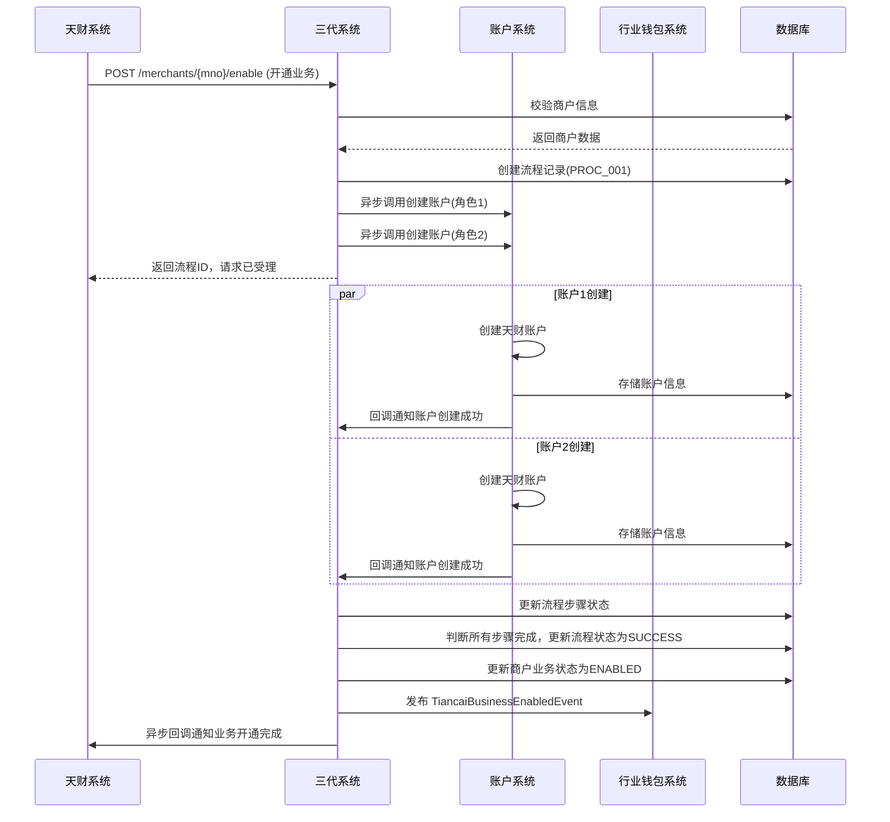

### 5.2 分账指令处理流程
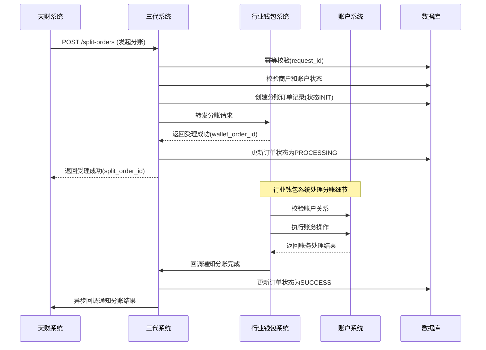

## 6. 错误处理

| 错误码 | HTTP 状态码 | 描述 | 处理策略 |
| :--- | :--- | :--- | :--- |
| `MERCHANT_NOT_FOUND` | 404 | 商户不存在 | 拒绝请求，提示检查商户号。 |
| `MERCHANT_NOT_TIANCAI` | 400 | 商户不属于天财机构 | 拒绝请求，仅天财机构商户可开通此业务。 |
| `BUSINESS_ALREADY_ENABLED` | 409 | 天财业务已开通 | 返回当前业务状态，确保幂等。 |
| `INVALID_ACCOUNT_ROLE` | 400 | 无效的账户角色 | 拒绝请求，提示有效角色列表。 |
| `SPLIT_REQUEST_DUPLICATE` | 409 | 重复的分账请求(request_id) | 返回已受理的订单信息，确保幂等。 |
| `ACCOUNT_NOT_ACTIVE` | 422 | 天财账户状态非ACTIVE | 拒绝分账请求，提示检查账户状态。 |
| `AMOUNT_VALIDATION_FAILED` | 400 | 金额校验失败（负数、超限等） | 拒绝请求，提示具体错误。 |
| `SCENE_ROLE_MISMATCH` | 400 | 业务场景与账户角色不匹配 | 拒绝请求，提示正确组合。 |
| `PROCESS_TIMEOUT` | 504 | 异步流程执行超时 | 触发超时处理，标记流程为EXPIRED，需人工介入。 |
| `CALLBACK_FAILED` | 500 | 回调天财系统失败 | 记录日志并加入重试队列，最多重试5次。 |

**通用策略**：
- **输入验证**：所有外部请求必须经过严格验证，防止非法数据进入系统。
- **幂等性保证**：对于创建类、交易类请求，必须支持基于`request_id`的幂等。
- **异步流程补偿**：对于多步骤异步流程，设计补偿机制，在部分步骤失败时进行回滚或人工干预。
- **优雅降级**：当非核心依赖（如监控事件发布）失败时，不应影响主流程，记录日志后继续执行。
- **监控告警**：对关键错误（5xx、流程超时、回调失败）配置实时告警。

## 7. 依赖说明

### 7.1 上游依赖
1. **天财系统**
   - **交互方式**：同步REST API调用 + 异步HTTP回调。
   - **职责**：发起业务开通、分账指令等业务请求，接收处理结果回调。
   - **关键点**：
     - 需与天财约定接口规范、加密方式、重试机制。
     - 回调必须幂等，天财需正确处理重复回调。
     - 建立对账机制，确保双方数据一致性。

### 7.2 下游依赖
1. **账户系统**
   - **交互方式**：同步REST API调用（创建账户） + 异步事件消费（`MerchantCreatedEvent`）。
   - **职责**：执行天财专用账户的创建和管理。
   - **关键点**：账户创建是异步过程，三代系统需维护流程状态等待回调。

2. **行业钱包系统**
   - **交互方式**：同步REST API调用（转发分账请求） + 异步事件消费（`TiancaiAccountCreatedEvent`）。
   - **职责**：处理分账业务的核心逻辑，包括关系校验、账务指令生成等。
   - **关键点**：三代系统作为路由层，不处理具体分账逻辑，但需监控处理超时。

3. **电子签约平台**
   - **交互方式**：同步REST API调用（发起签约） + 异步HTTP回调（签约结果）。
   - **职责**：为关系绑定提供电子签约服务。
   - **关键点**：签约流程涉及H5页面跳转，三代系统需管理签约会话状态。

4. **认证系统**
   - **交互方式**：通过行业钱包系统间接调用。
   - **职责**：提供打款验证、人脸验证等身份核验能力。
   - **关键点**：三代系统不直接交互，但需了解认证失败对整体流程的影响。

### 7.3 设计原则
- **单一入口**：三代系统作为天财业务的唯一入口，统一处理认证、鉴权、路由。
- **职责分离**：三代系统负责流程协调和状态管理，不深入业务规则细节（如分账比例计算）。
- **异步化设计**：耗时操作（账户创建、签约）采用异步流程，提高接口响应速度。
- **状态可追溯**：所有业务流程都有明确的状态记录，支持查询和人工干预。
- **故障隔离**：下游系统故障时，三代系统应有降级策略（如返回"处理中"状态，而不是直接失败）。

## 3.5 清结算系统


# 清结算系统模块设计文档

## 1. 概述

### 1.1 目的
本模块作为支付体系中的资金处理核心，负责处理与“天财分账业务”相关的交易清算、资金结算、计费以及退货资金处理。它连接收单交易、账户系统和行业钱包系统，确保天财专用账户的资金能够按照业务规则，从待结算账户准确、及时地结算到目标账户，并处理相关的退货资金流转。

### 1.2 范围
- **资金结算**：将收单交易沉淀在“待结算账户（01账户）”中的资金，根据商户配置的结算模式（本场景下为“主动结算”），划转至指定的“天财收款账户”。
- **退货处理**：处理天财场景下的退货交易，协调“退货账户（04账户）”与“天财收款账户”之间的资金调拨。
- **计费处理**：在结算过程中，根据计费规则计算并扣除交易手续费。
- **清算文件处理**：生成并提供与结算、退货相关的资金对账文件。
- **与天财分账的协同**：作为分账业务的资金源头，为“行业钱包系统”的分账指令提供已结算到账的资金保障。

## 2. 接口设计

### 2.1 API端点 (RESTful)

#### 2.1.1 结算指令处理接口
- **POST /api/v1/settlement/instructions**
    - **描述**：接收来自支付核心或定时任务触发的结算指令，将资金从待结算账户（01）结算至目标天财收款账户。支持批量处理。
    - **请求体**：
      ```json
      {
        "request_id": "settle_req_20250120001",
        "instruction_type": "REGULAR_SETTLEMENT", // 指令类型：REGULAR_SETTLEMENT(常规结算), REFUND_SETTLEMENT(退货结算)
        "settle_date": "2025-01-19", // 结算日期（账期）
        "items": [
          {
            "biz_settle_no": "STL_M100001_20250119", // 业务结算流水号，用于幂等
            "source_account_no": "0100000001", // 源账户号（待结算账户01）
            "target_tiancai_account_id": "TCA_20231011001", // 目标天财账户ID
            "target_account_no": "3010001001", // 目标账户号（天财收款账户）
            "currency": "CNY",
            "settle_amount": 150000, // 结算金额（元）
            "fee_amount": 300, // 手续费金额（元）
            "net_amount": 149700, // 净结算金额（元）
            "trade_summary": { // 交易汇总信息（可选，用于对账）
              "total_count": 100,
              "total_amount": 150000
            }
          }
        ]
      }
      ```
    - **响应体**：
      ```json
      {
        "code": "SUCCESS",
        "message": "处理成功",
        "data": {
          "instruction_id": "INST_202501200001",
          "status": "PROCESSING", // PROCESSING, PARTIAL_SUCCESS, SUCCESS, FAILED
          "details": [
            {
              "biz_settle_no": "STL_M100001_20250119",
              "status": "SUCCESS",
              "ledger_entry_no": "LE_202501200001" // 关联的账务流水号
            }
          ]
        }
      }
      ```

#### 2.1.2 退货资金处理接口
- **POST /api/v1/refund/fund-adjustments**
    - **描述**：处理天财场景的退货。当发生退货时，需从天财收款账户扣款至退货账户（04），或从退货账户退款至用户原路。
    - **请求体**：
      ```json
      {
        "request_id": "refund_adj_001",
        "adjustment_type": "MERCHANT_REFUND", // MERCHANT_REFUND(商户退款), SYSTEM_REFUND(系统退款)
        "original_trade_no": "PAY_20250119001", // 原支付交易号
        "refund_trade_no": "REF_20250120001", // 本次退款交易号
        "tiancai_account_id": "TCA_20231011001", // 关联的天财收款账户ID
        "receive_account_no": "3010001001", // 天财收款账户号（出款方）
        "refund_account_no": "0400000001", // 退货账户号（04账户，入款方）
        "amount": 5000,
        "currency": "CNY",
        "reason": "客户取消订单"
      }
      ```
    - **响应体**：返回调拨处理结果及账务流水号。

#### 2.1.3 查询接口
- **GET /api/v1/settlement/instructions/{instruction_id}**：查询结算指令状态。
- **GET /api/v1/settlement/records?tiancai_account_id={}&settle_date={}&status={}**：查询结算记录。
- **GET /api/v1/refund/adjustments?tiancai_account_id={}&date={}**：查询退货资金调拨记录。

### 2.2 发布/消费的事件

#### 2.2.1 消费的事件
- **TradeSettledEvent** (来自支付核心)：消费已清算完成的交易汇总事件，触发结算任务。
- **TiancaiAccountCreatedEvent** (来自账户系统)：获知天财收款账户创建，用于建立结算路由（将商户的待结算账户01与天财收款账户关联）。
- **RefundAppliedEvent** (来自支付核心/业务系统)：消费退款申请事件，触发退货资金处理流程。

#### 2.2.2 发布的事件
- **SettlementCompletedEvent**：当资金成功从待结算账户结算至天财收款账户后发布，通知行业钱包系统资金已到位，可执行分账。
  ```json
  {
    "event_id": "event_settle_001",
    "event_type": "SETTLEMENT_COMPLETED",
    "timestamp": "2025-01-20T02:00:00Z",
    "data": {
      "tiancai_account_id": "TCA_20231011001",
      "account_no": "3010001001",
      "settle_date": "2025-01-19",
      "net_amount": 149700,
      "currency": "CNY",
      "biz_settle_no": "STL_M100001_20250119"
    }
  }
  ```
- **RefundFundAdjustmentCompletedEvent**：退货资金调拨完成时发布，供对账系统使用。
- **SettlementInstructionProcessedEvent**：结算指令处理完成（无论成功失败）时发布，供监控和报表系统使用。

## 3. 数据模型

### 3.1 核心表设计

#### 表：`settlement_instruction` (结算指令表)
| 字段名 | 类型 | 必填 | 默认值 | 描述 |
| :--- | :--- | :--- | :--- | :--- |
| `id` | bigint | Y | AUTO_INCREMENT | 主键 |
| `instruction_id` | varchar(32) | Y | | **业务指令ID**，全局唯一 |
| `request_id` | varchar(64) | Y | | 请求流水号，用于幂等 |
| `instruction_type` | varchar(30) | Y | | 指令类型：`REGULAR_SETTLEMENT`, `REFUND_SETTLEMENT` |
| `settle_date` | date | Y | | 结算日期（账期） |
| `status` | varchar(20) | Y | `INIT` | 状态：`INIT`, `PROCESSING`, `SUCCESS`, `FAILED`, `PARTIAL_SUCCESS` |
| `total_count` | int | Y | 0 | 指令条目总数 |
| `success_count` | int | Y | 0 | 成功条目数 |
| `failure_count` | int | Y | 0 | 失败条目数 |
| `created_at` | datetime | Y | CURRENT_TIMESTAMP | |
| `updated_at` | datetime | Y | CURRENT_TIMESTAMP ON UPDATE | |

#### 表：`settlement_record` (结算记录表)
| 字段名 | 类型 | 必填 | 默认值 | 描述 |
| :--- | :--- | :--- | :--- | :--- |
| `id` | bigint | Y | AUTO_INCREMENT | 主键 |
| `biz_settle_no` | varchar(64) | Y | | **业务结算流水号**，唯一键 |
| `instruction_id` | varchar(32) | Y | | 所属指令ID |
| `source_account_no` | varchar(20) | Y | | 源账户（待结算账户01） |
| `target_tiancai_account_id` | varchar(32) | Y | | 目标天财账户ID |
| `target_account_no` | varchar(20) | Y | | 目标账户（天财收款账户） |
| `currency` | varchar(3) | Y | `CNY` | |
| `settle_amount` | decimal(15,2) | Y | | 结算金额（含手续费） |
| `fee_amount` | decimal(15,2) | Y | | 手续费金额 |
| `net_amount` | decimal(15,2) | Y | | 净结算金额 |
| `status` | varchar(20) | Y | `INIT` | 状态：`INIT`, `ACCOUNT_PROCESSING`, `SUCCESS`, `FAILED` |
| `ledger_entry_no` | varchar(32) | N | | 账户系统返回的账务流水号 |
| `trade_summary` | json | N | | 交易汇总信息 |
| `error_msg` | text | N | | 失败原因 |
| `completed_at` | datetime | N | | 完成时间 |
| `created_at` | datetime | Y | CURRENT_TIMESTAMP | |

#### 表：`refund_fund_adjustment` (退货资金调拨表)
| 字段名 | 类型 | 必填 | 默认值 | 描述 |
| :--- | :--- | :--- | :--- | :--- |
| `id` | bigint | Y | AUTO_INCREMENT | 主键 |
| `adjustment_no` | varchar(32) | Y | | **调拨流水号**，唯一 |
| `request_id` | varchar(64) | Y | | 请求流水号，幂等 |
| `adjustment_type` | varchar(30) | Y | | 类型：`MERCHANT_REFUND`, `SYSTEM_REFUND` |
| `original_trade_no` | varchar(64) | Y | | 原支付交易号 |
| `refund_trade_no` | varchar(64) | Y | | 退款交易号 |
| `tiancai_account_id` | varchar(32) | Y | | 关联的天财账户ID |
| `receive_account_no` | varchar(20) | Y | | 出款账户（天财收款账户） |
| `refund_account_no` | varchar(20) | Y | | 入款账户（退货账户04） |
| `amount` | decimal(15,2) | Y | | 调拨金额 |
| `currency` | varchar(3) | Y | `CNY` | |
| `status` | varchar(20) | Y | `INIT` | 状态：`INIT`, `SUCCESS`, `FAILED` |
| `ledger_entry_no` | varchar(32) | N | | 账务流水号 |
| `reason` | varchar(255) | N | | 调拨原因 |
| `created_at` | datetime | Y | CURRENT_TIMESTAMP | |

#### 表：`settlement_route` (结算路由表)
| 字段名 | 类型 | 必填 | 默认值 | 描述 |
| :--- | :--- | :--- | :--- | :--- |
| `id` | bigint | Y | AUTO_INCREMENT | 主键 |
| `merchant_no` | varchar(32) | Y | | 收单商户号 |
| `settle_account_no` | varchar(20) | Y | | 待结算账户号（01账户） |
| `tiancai_account_id` | varchar(32) | Y | | 目标天财收款账户ID |
| `target_account_no` | varchar(20) | Y | | 目标天财收款账户号 |
| `settle_mode` | varchar(20) | Y | `ACTIVE` | 结算模式：`ACTIVE` |
| `status` | varchar(20) | Y | `ACTIVE` | 状态：`ACTIVE`, `INACTIVE` |
| `created_at` | datetime | Y | CURRENT_TIMESTAMP | |

### 3.2 与其他模块的关系
- **账户系统**：通过调用账务操作接口(`/ledger/entries`)执行资金划转，是核心的资金操作依赖方。
- **行业钱包系统**：消费本模块发布的`SettlementCompletedEvent`，作为触发分账的起点。
- **支付核心（三代系统）**：消费其发布的交易清算完成事件，是结算任务的触发源；同时为其提供退货资金处理服务。
- **对账单系统**：为本模块提供交易明细数据以汇总结算金额，并消费本模块发布的事件生成资金结算对账单。

## 4. 业务逻辑

### 4.1 核心算法与规则

#### 4.1.1 主动结算流程（天财收款账户）
1. **触发时机**：每日定时任务（如T+1日凌晨）或实时触发（根据`TradeSettledEvent`）。
2. **路由查找**：根据`merchant_no`查询`settlement_route`表，找到对应的待结算账户（01）和目标天财收款账户。
3. **金额汇总**：调用对账单系统或内部汇总服务，统计指定账期(`settle_date`)内，该待结算账户对应的所有成功交易净额（交易金额 - 已发生退款）。
4. **计费计算**：根据商户费率合同，计算该笔结算应付的手续费。
    - `结算金额 = 交易净额`
    - `净结算金额 = 结算金额 - 手续费`
5. **生成指令**：创建结算指令和记录，状态置为`INIT`。
6. **调用账户系统**：调用账户系统账务接口，执行资金划转：
    - **借记（DEBIT）** 待结算账户（01），金额为`净结算金额`。
    - **贷记（CREDIT）** 天财收款账户，金额为`净结算金额`。
    - （手续费单独记入收入账户，此逻辑可能内嵌在账户系统或清结算内部）。
7. **状态更新与发布事件**：账务成功则更新记录状态为`SUCCESS`，并发布`SettlementCompletedEvent`。失败则记录错误，进行重试或人工干预。

#### 4.1.2 天财场景退货处理规则
1. **商户发起退款**：
   - 资金路径：天财收款账户 (出) -> 退货账户（04）(入)。
   - 逻辑：调用账户系统，从天财收款账户的可用余额中扣减退款金额，记入退货账户。退货账户资金后续用于原路退回给用户。
2. **系统原路退款**：
   - 资金路径：退货账户（04）(出) -> 银行/支付渠道。
   - 逻辑：此步骤通常由支付核心执行，清结算系统负责确保退货账户中有足额资金。
3. **校验**：执行调拨前，需校验天财收款账户状态是否正常、可用余额是否充足。

#### 4.1.3 幂等性与一致性
- **结算**：使用`biz_settle_no`作为业务唯一键，在`settlement_record`表中实现幂等。账户系统层面使用`biz_trade_no`保证账务幂等。
- **退货调拨**：使用`request_id`和`adjustment_no`实现双重幂等保证。
- **分布式事务**：与账户系统的账务操作为同步调用，依赖其内部事务保证资金划转的原子性。本系统记录操作状态，用于对账和补偿。

### 4.2 验证逻辑
- **结算指令验证**：验证结算日期有效性、目标天财账户是否存在且状态为`ACTIVE`、结算路由有效。
- **金额验证**：结算金额、手续费需大于0，且净结算金额不大于源账户余额（由账户系统最终校验）。
- **退货调拨验证**：验证原交易是否存在、退款金额是否合理、关联的天财账户是否有权操作此退款。

## 5. 时序图

### 5.1 天财收款账户日常结算流程
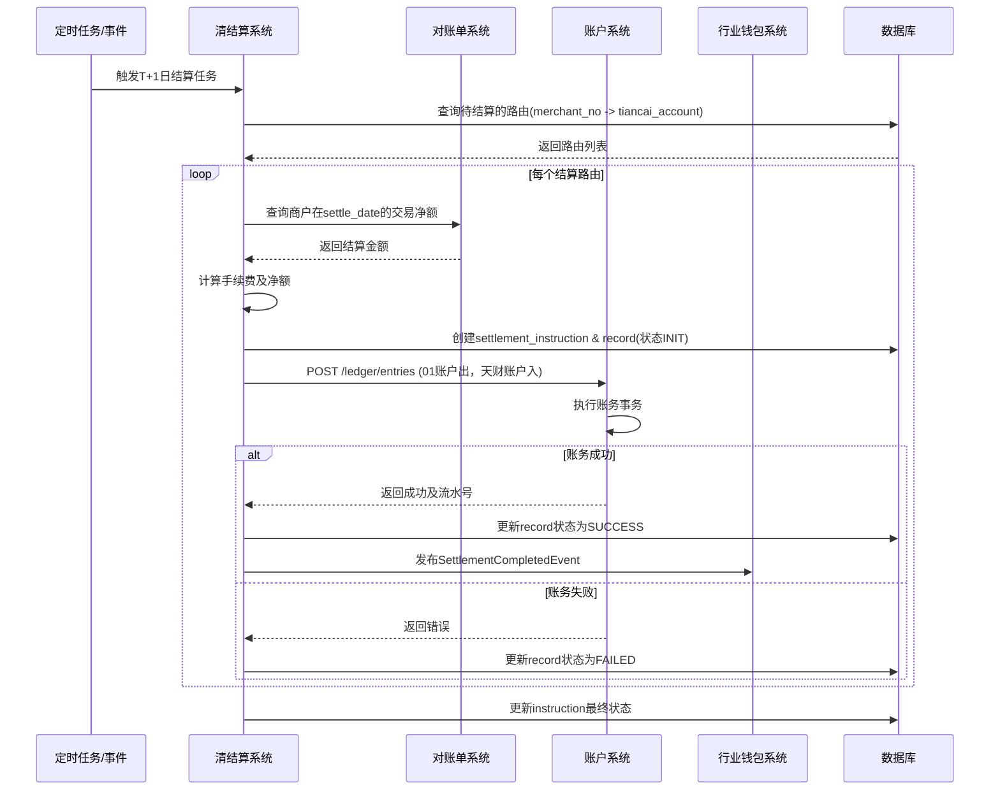

### 5.2 天财场景退货资金调拨流程
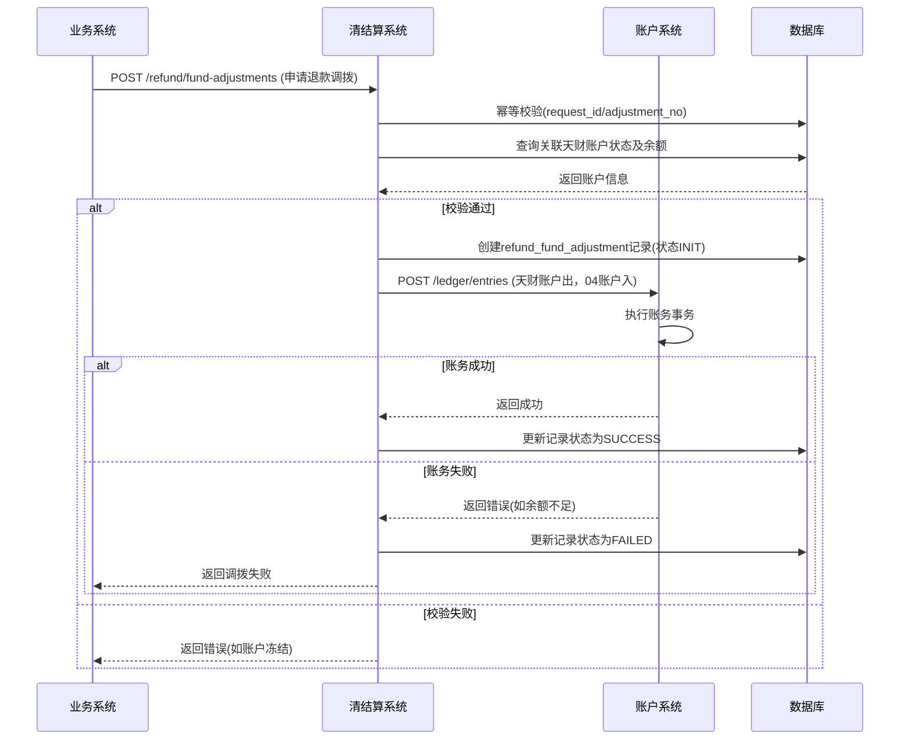

## 6. 错误处理

| 错误码 | HTTP 状态码 | 描述 | 处理策略 |
| :--- | :--- | :--- | :--- |
| `SETTLE_ROUTE_NOT_FOUND` | 404 | 未找到该商户的生效结算路由 | 检查商户是否已开通天财账户并配置路由，结算任务暂停并告警。 |
| `SETTLE_AMOUNT_INVALID` | 400 | 结算金额计算错误（<=0） | 记录异常，跳过该商户本次结算，发出业务告警。 |
| `TIANCAI_ACCOUNT_INACTIVE` | 422 | 目标天财账户状态非ACTIVE | 结算任务暂停，等待账户恢复或人工处理。 |
| `ACCOUNT_TRANSFER_FAILED` | 502 | 调用账户系统账务操作失败 | 根据账户系统返回的具体错误码决定重试策略（如网络错误重试，余额不足则失败）。 |
| `DUPLICATE_SETTLE_NO` | 409 | 重复的`biz_settle_no` | 返回已存在的结算记录信息，确保幂等。 |
| `REFUND_ORIGINAL_TRADE_NOT_FOUND` | 404 | 退货对应的原交易不存在 | 拒绝调拨请求。 |
| `REFUND_ACCOUNT_BALANCE_INSUFFICIENT` | 422 | 天财收款账户余额不足 | 拒绝调拨请求，通知业务方。 |
| `DATA_AGGREGATION_ERROR` | 500 | 从对账单系统汇总数据失败 | 重试查询，多次失败后触发告警，人工介入。 |

**通用策略**：
- **业务逻辑错误(4xx)**：立即失败，记录明确日志，通知上游系统。
- **外部依赖错误(5xx/网络超时)**：
  - **结算任务**：标记该条记录为`FAILED`，指令状态为`PARTIAL_SUCCESS`。整体任务继续执行其他路由。失败记录进入延时重试队列。
  - **退货调拨**：立即向调用方返回失败，支持其重试（依赖`request_id`幂等）。
- **重试机制**：对可重试错误（网络超时、数据库死锁），采用指数退避策略，最多重试3次。

## 7. 依赖说明

### 7.1 上游依赖
1. **支付核心（三代系统）**
   - **交互方式**：异步事件消费 (`TradeSettledEvent`, `RefundAppliedEvent`)。
   - **职责**：提供已清算的交易数据作为结算源；触发退款流程。
   - **关键点**：事件数据的准确性和及时性是结算正确性的基础。需有监控确保事件不丢失。

2. **账户系统**
   - **交互方式**：同步REST API调用 (`POST /ledger/entries`)。
   - **职责**：执行所有资金划转的底层账务操作。
   - **关键点**：**强依赖**。其可用性和性能直接决定清结算系统的吞吐量与成功率。需有熔断和降级策略（如堆积队列）。

3. **对账单系统**
   - **交互方式**：同步REST API调用。
   - **职责**：提供指定商户和账期的交易金额汇总数据。
   - **关键点**：结算金额计算的依据，需保证数据一致性（如已汇总的金额不会因后续退货而改变）。

4. **行业钱包系统**
   - **交互方式**：异步事件消费 (`TiancaiAccountCreatedEvent`)。
   - **职责**：提供天财账户创建信息，用于建立结算路由。
   - **关键点**：需及时建立路由，否则会影响结算。

### 7.2 设计原则
- **最终一致性**：通过事件驱动，与支付核心、行业钱包等系统达成最终一致性。结算完成后发布事件，驱动下游分账。
- **职责清晰**：
  - **清结算**：负责“资金何时、何路径、算多少”的问题。
  - **账户系统**：负责“资金如何安全地从一个数字转移到另一个数字”。
  - **行业钱包**：负责“资金到账后，根据业务规则如何再分配”。
- **可观测性**：所有结算指令、调拨记录状态可查，关键步骤有明确日志，便于对账和问题排查。
- **弹性设计**：结算任务支持分批、并行处理，单条失败不影响整体。依赖外部系统故障时有重试和补偿机制。

## 3.6 账务核心系统


# 账务核心系统模块设计文档

## 1. 概述

### 1.1 目的
本模块作为天财分账业务的账务处理核心，负责处理所有与天财专用账户相关的资金流转、记账、结算、分账等核心账务操作。它向上承接行业钱包系统的业务指令，向下调用账户系统的底层账务能力，确保资金变动的准确性、一致性、可追溯性和合规性。本模块是天财分账业务资金流的核心引擎。

### 1.2 范围
- **分账指令处理**：接收并处理行业钱包系统发起的各类分账指令（归集、批量付款、会员结算），完成资金从付方账户到收方账户的划转。
- **结算处理**：与清结算系统协同，处理收单交易资金的结算流程，将待结算账户（01账户）的资金划入指定的天财收款账户。
- **退货资金处理**：处理涉及天财收款账户的退货场景，协调退货账户（04账户）与天财收款账户之间的资金调拨。
- **账务流水与对账**：生成所有资金变动的明细流水，为对账单系统提供数据源，并支持内部对账与差错处理。
- **资金操作校验**：在执行任何资金操作前，对账户状态、关系、余额、业务规则进行严格校验。
- **事务与一致性保障**：确保所有跨账户、跨系统的资金操作在分布式环境下的最终一致性。

## 2. 接口设计

### 2.1 API端点 (RESTful)

#### 2.1.1 分账指令接口
- **POST /api/v1/tiancai/split-orders**
    - **描述**：接收并执行天财分账指令。这是核心业务接口。
    - **请求体**：
      ```json
      {
        "request_id": "split_req_20250120001", // 请求流水号，全局唯一，用于幂等
        "biz_scene": "COLLECTION", // 业务场景：COLLECTION(归集)/BATCH_PAY(批量付款)/MEMBER_SETTLE(会员结算)
        "payer_account_id": "TCA_20231011001", // 付方天财账户ID
        "payee_account_id": "TCA_20231011002", // 收方天财账户ID
        "amount": 100000, // 分账金额（单位：分）
        "currency": "CNY",
        "biz_ref_no": "ORDER_REF_001", // 业务参考号（如订单号），用于关联业务
        "remark": "门店日终归集",
        "ext_info": { // 扩展信息，根据场景不同
          "split_ratio": 0.3, // 分账比例（批量付款可能用到）
          "fee_deduct_info": {...} // 手续费扣收信息（如有）
        }
      }
      ```
    - **响应体**：
      ```json
      {
        "code": "SUCCESS",
        "message": "分账指令接收成功",
        "data": {
          "split_order_no": "TSO_2025012000001", // 系统生成的分账订单号
          "request_id": "split_req_20250120001",
          "status": "PROCESSING", // 状态：PROCESSING(处理中)/SUCCESS/FAILED
          "estimated_settle_time": "2025-01-20T15:30:00Z" // 预计完成时间
        }
      }
      ```
    - **说明**：此接口为异步处理，立即返回受理结果。实际账务处理通过内部流程完成。

#### 2.1.2 结算触发接口
- **POST /api/v1/tiancai/settlement-trigger**
    - **描述**：由清结算系统调用，触发将待结算账户资金结算至天财收款账户。
    - **请求体**：
      ```json
      {
        "request_id": "settle_req_001",
        "settlement_batch_no": "SETTLE_20250120_01", // 清结算批次号
        "merchant_no": "M100001",
        "tiancai_receive_account_id": "TCA_20231011001", // 目标天财收款账户ID
        "total_amount": 5000000, // 结算总金额（分）
        "currency": "CNY",
        "settlement_date": "2025-01-20", // 结算日期
        "detail_items": [ // 可选的明细列表，用于对账
          {
            "trade_no": "TRADE_001",
            "amount": 100000,
            "fee": 500
          }
        ]
      }
      ```
    - **响应体**：返回受理结果及系统生成的结算指令号。

#### 2.1.3 退货资金处理接口
- **POST /api/v1/tiancai/refund-adjustment**
    - **描述**：处理涉及天财收款账户的退货，调整退货账户（04）与天财收款账户的资金。
    - **请求体**：
      ```json
      {
        "request_id": "refund_adj_001",
        "refund_trade_no": "REFUND_20250120001",
        "original_trade_no": "TRADE_001", // 原交易号
        "tiancai_receive_account_id": "TCA_20231011001", // 关联的天财收款账户
        "refund_amount": 50000, // 退货金额（分）
        "currency": "CNY",
        "adjustment_type": "DIRECT_DEDUCT", // 调整类型：DIRECT_DEDUCT(直接扣减)/FUND_TRANSFER(资金划转)
        "reason": "客户取消订单"
      }
      ```
    - **响应体**：返回处理结果。

#### 2.1.4 查询接口
- **GET /api/v1/tiancai/split-orders/{split_order_no}**：查询分账指令状态及详情。
- **GET /api/v1/tiancai/accounts/{tiancai_account_id}/transactions**：查询账户交易流水。
- **POST /api/v1/tiancai/internal/reconciliation**：内部对账接口（日终批处理）。

### 2.2 发布/消费的事件

#### 2.2.1 消费的事件
- **TiancaiAccountCreatedEvent** (来自账户系统)：监听天财账户创建，初始化本模块的账户缓存或路由信息。
- **AccountRelationshipBoundEvent** (来自账户系统)：更新本模块维护的关系映射，用于快速校验。
- **SettlementCompletedEvent** (来自清结算系统)：接收结算完成通知，触发后续分账或资金可用性更新。

#### 2.2.2 发布的事件
- **TiancaiSplitOrderCreatedEvent**：分账指令被成功接收并持久化后发布。
  ```json
  {
    "event_id": "event_split_created_001",
    "event_type": "TIANCAI_SPLIT_ORDER_CREATED",
    "timestamp": "2025-01-20T10:00:00Z",
    "data": {
      "split_order_no": "TSO_2025012000001",
      "biz_scene": "COLLECTION",
      "payer_account_id": "TCA_20231011001",
      "payee_account_id": "TCA_20231011002",
      "amount": 100000,
      "status": "PROCESSING"
    }
  }
  ```
- **TiancaiSplitOrderCompletedEvent**：分账指令处理完成（成功或失败）后发布，通知行业钱包系统和对账单系统。
- **FundsSettledEvent**：天财收款账户收到结算资金后发布，通知相关业务方资金已到位。
- **AccountTransactionEvent**：每笔账务变动（记账流水）完成后发布，包含详细的借贷信息，是对账单系统的核心数据源。

## 3. 数据模型

### 3.1 核心表设计

#### 表：`tiancai_split_order` (天财分账订单表)
| 字段名 | 类型 | 必填 | 默认值 | 描述 |
| :--- | :--- | :--- | :--- | :--- |
| `id` | bigint | Y | AUTO_INCREMENT | 主键 |
| `split_order_no` | varchar(32) | Y | | **业务主键**，分账订单号，格式`TSO_YYYYMMDDxxxxx` |
| `request_id` | varchar(64) | Y | | 请求流水号，用于幂等，全局唯一 |
| `biz_scene` | varchar(20) | Y | | 业务场景：`COLLECTION`/`BATCH_PAY`/`MEMBER_SETTLE` |
| `payer_account_id` | varchar(32) | Y | | 付方天财账户ID |
| `payee_account_id` | varchar(32) | Y | | 收方天财账户ID |
| `amount` | decimal(15,2) | Y | | 分账金额（元，存储用元） |
| `currency` | varchar(3) | Y | `CNY` | 币种 |
| `status` | varchar(20) | Y | `INIT` | 状态：`INIT`(初始)/`VALIDATING`(校验中)/`PROCESSING`(处理中)/`SUCCESS`/`FAILED`/`PARTIAL_SUCCESS`(部分成功-批付) |
| `biz_ref_no` | varchar(64) | N | | 业务参考号 |
| `remark` | varchar(256) | N | | 备注 |
| `failure_reason` | varchar(512) | N | | 失败原因 |
| `processed_at` | datetime | N | | 处理完成时间 |
| `created_at` | datetime | Y | CURRENT_TIMESTAMP | |
| `updated_at` | datetime | Y | CURRENT_TIMESTAMP ON UPDATE | |

#### 表：`account_transaction` (账户交易流水表)
| 字段名 | 类型 | 必填 | 默认值 | 描述 |
| :--- | :--- | :--- | :--- | :--- |
| `id` | bigint | Y | AUTO_INCREMENT | 主键 |
| `transaction_no` | varchar(32) | Y | | 交易流水号，格式`TXN_YYYYMMDDxxxxx` |
| `account_no` | varchar(20) | Y | | **账户号**（底层账户号） |
| `tiancai_account_id` | varchar(32) | Y | | 关联的天财账户ID |
| `biz_trade_no` | varchar(64) | Y | | 关联的业务交易号（如split_order_no, settlement_batch_no） |
| `biz_type` | varchar(30) | Y | | 业务类型：`TIANCAI_SPLIT`/`SETTLEMENT_IN`(结算入金)/`REFUND_ADJUSTMENT`/`WITHDRAW`(提现) |
| `direction` | varchar(10) | Y | | 方向：`CREDIT`(入账)/`DEBIT`(出账) |
| `amount` | decimal(15,2) | Y | | 交易金额（元） |
| `balance_before` | decimal(15,2) | Y | | 交易前余额 |
| `balance_after` | decimal(15,2) | Y | | 交易后余额 |
| `balance_type` | varchar(20) | Y | `AVAILABLE` | 余额类型：`AVAILABLE`/`FROZEN` |
| `currency` | varchar(3) | Y | `CNY` | |
| `status` | varchar(20) | Y | `SUCCESS` | 状态：`SUCCESS`/`FAILED` |
| `remark` | varchar(256) | N | | 备注 |
| `created_at` | datetime | Y | CURRENT_TIMESTAMP | |

#### 表：`settlement_instruction` (结算指令记录表)
| 字段名 | 类型 | 必填 | 默认值 | 描述 |
| :--- | :--- | :--- | :--- | :--- |
| `id` | bigint | Y | AUTO_INCREMENT | 主键 |
| `instruction_no` | varchar(32) | Y | | 结算指令号，系统生成 |
| `settlement_batch_no` | varchar(64) | Y | | 清结算系统批次号 |
| `tiancai_receive_account_id` | varchar(32) | Y | | 天财收款账户ID |
| `total_amount` | decimal(15,2) | Y | | 结算总金额 |
| `currency` | varchar(3) | Y | `CNY` | |
| `status` | varchar(20) | Y | `INIT` | 状态：`INIT`/`PROCESSING`/`SUCCESS`/`FAILED` |
| `settlement_date` | date | Y | | 结算日期 |
| `detail_count` | int | N | | 关联的交易明细笔数 |
| `processed_at` | datetime | N | | |
| `created_at` | datetime | Y | CURRENT_TIMESTAMP | |

#### 表：`internal_reconciliation` (内部对账表)
| 字段名 | 类型 | 必填 | 默认值 | 描述 |
| :--- | :--- | :--- | :--- | :--- |
| `id` | bigint | Y | AUTO_INCREMENT | 主键 |
| `recon_date` | date | Y | | 对账日期 |
| `account_type` | varchar(20) | Y | | 账户类型：`TIANCAI_RECEIVE`/`TIANCAI_RECEIVER` |
| `total_credit` | decimal(15,2) | Y | | 总入账金额 |
| `total_debit` | decimal(15,2) | Y | | 总出账金额 |
| `beginning_balance` | decimal(15,2) | Y | | 期初余额 |
| `ending_balance` | decimal(15,2) | Y | | 期末余额 |
| `calculated_balance` | decimal(15,2) | Y | | 计算余额（期初+入-出） |
| `balance_diff` | decimal(15,2) | Y | `0.00` | 差额（计算余额-期末余额） |
| `status` | varchar(20) | Y | `PENDING` | 状态：`PENDING`/`BALANCED`/`UNBALANCED` |
| `checked_at` | datetime | N | | 核对时间 |
| `created_at` | datetime | Y | CURRENT_TIMESTAMP | |

### 3.2 与其他模块的关系
- **行业钱包系统**：通过`tiancai_split_order`表记录其发起的业务指令，并通过事件通知其处理结果。
- **账户系统**：通过`account_transaction`表中的`account_no`关联底层账户流水，账务操作最终调用账户系统接口完成。
- **清结算系统**：通过`settlement_instruction`表记录结算触发指令，实现结算资金的可追溯。
- **对账单系统**：`account_transaction`表是其核心数据源，`internal_reconciliation`表支持其对账。

## 4. 业务逻辑

### 4.1 核心算法与规则

#### 4.1.1 分账指令处理流程
1. **指令接收与幂等**：基于`request_id`进行幂等校验，防止重复处理。
2. **业务校验**：
   - 调用账户系统接口，校验付方与收方账户状态是否为`ACTIVE`。
   - 调用账户系统关系校验接口，验证是否存在`VERIFIED`状态且有效的对应类型关系。
   - 校验付方账户可用余额是否充足（实时查询或缓存）。
   - 校验业务场景与账户角色的匹配性（如归集场景，付方必须是门店，收方必须是总部）。
3. **指令持久化**：校验通过后，将指令状态置为`VALIDATING`并持久化。
4. **账务执行**：
   - 调用账户系统账务操作接口(`POST /ledger/entries`)，使用`split_order_no`作为`biz_trade_no`。
   - 请求体构造借贷分录：付方账户`DEBIT`，收方账户`CREDIT`。
   - 账户系统在事务中完成双方余额更新。
5. **状态更新与通知**：
   - 账务成功：更新分账订单状态为`SUCCESS`，记录处理时间。
   - 账务失败：更新状态为`FAILED`，记录失败原因。
   - 发布`TiancaiSplitOrderCompletedEvent`和`AccountTransactionEvent`。

#### 4.1.2 结算资金处理流程
1. **触发接收**：接收清结算系统的结算触发请求，基于`settlement_batch_no`和`tiancai_receive_account_id`做幂等。
2. **资金划转**：
   - 确定源账户：待结算账户（01账户），根据`merchant_no`定位。
   - 确定目标账户：天财收款账户对应的底层账户。
   - 调用账户系统账务操作接口，完成从01账户到天财收款账户的资金划转。
3. **记录与通知**：记录结算指令，发布`FundsSettledEvent`，通知相关方资金已到账。

#### 4.1.3 批量付款特殊处理
- **拆分处理**：一个批量付款指令可能包含多个收款方。本模块接收的是单个付方对单个收方的指令。行业钱包系统负责拆分和组装。
- **部分成功**：在极端情况下，一个批量批次中部分成功、部分失败。`tiancai_split_order`表记录每笔明细，行业钱包系统需汇总状态。本模块支持`PARTIAL_SUCCESS`状态用于上游汇总。

#### 4.1.4 日终对账流程
1. **数据汇总**：每日凌晨，统计`account_transaction`表中当日所有交易，按账户类型汇总`CREDIT`和`DEBIT`总额。
2. **余额核对**：从账户系统获取各天财账户的日初和日末余额快照。
3. **差额计算**：计算`期初余额 + 总入账 - 总出账`是否等于`期末余额`。
4. **异常处理**：若差额不为零，触发告警，并生成差错处理工单，供运营人员核查。
5. **状态更新**：核对无误后，更新`internal_reconciliation`表状态为`BALANCED`。

### 4.2 验证逻辑
- **分账指令验证**：`业务场景`、`账户角色`、`关系有效性`、`余额充足性`四重校验。
- **结算触发验证**：校验`天财收款账户`是否存在且状态正常，校验`结算批次`是否已处理过（幂等）。
- **金额验证**：所有金额必须为正数，且符合币种精度要求。
- **事务边界**：任何涉及资金变动的操作，必须在一个明确的业务事务内，且有补偿或冲正机制。

## 5. 时序图

### 5.1 天财分账（归集）核心流程
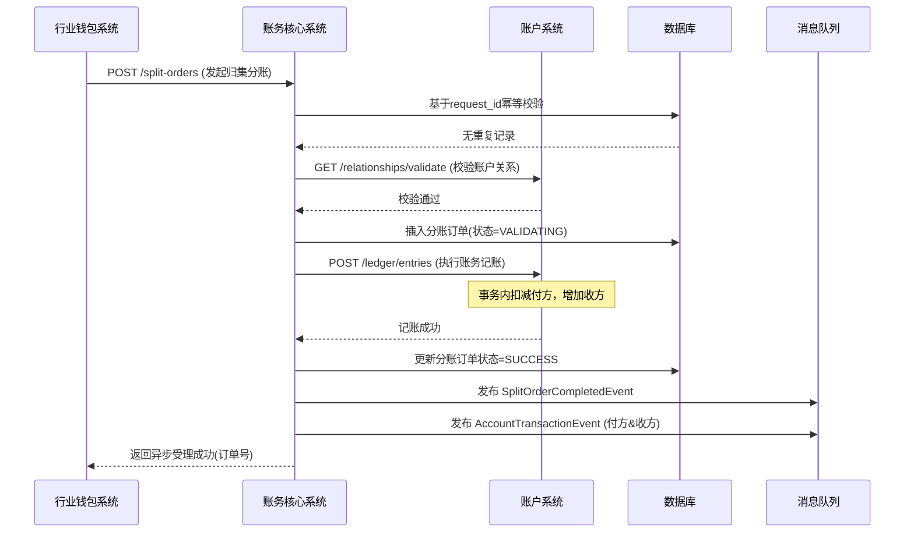

### 5.2 收单资金结算至天财账户流程
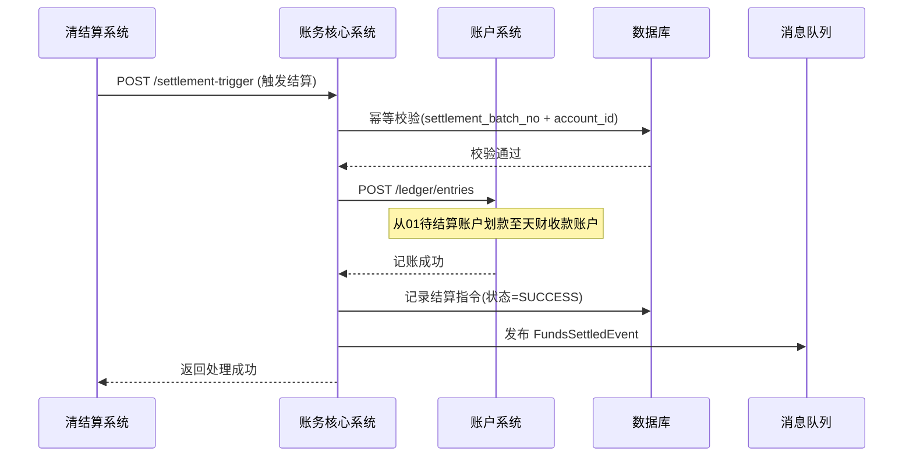

## 6. 错误处理

| 错误码 | HTTP 状态码 | 描述 | 处理策略 |
| :--- | :--- | :--- | :--- |
| `SPLIT_REQUEST_DUPLICATE` | 409 | 重复的分账请求(request_id) | 返回已创建的分账订单信息，确保幂等。 |
| `ACCOUNT_RELATIONSHIP_INVALID` | 422 | 账户关系校验失败 | 拒绝分账，返回具体原因（无关系、已过期、类型不匹配）。 |
| `PAYER_BALANCE_INSUFFICIENT` | 422 | 付方余额不足 | 拒绝分账，通知调用方。 |
| `ACCOUNT_STATUS_ABNORMAL` | 423 | 付方或收方账户状态非ACTIVE | 拒绝分账，提示账户冻结或注销。 |
| `BIZ_SCENE_VALIDATION_FAILED` | 400 | 业务场景与账户角色不匹配 | 拒绝请求，例如门店向门店发起归集。 |
| `SETTLEMENT_BATCH_DUPLICATE` | 409 | 重复的结算触发请求 | 返回已处理的结算指令信息。 |
| `LEDGER_OPERATION_FAILED` | 500 | 底层账务操作失败 | 记录失败详情，更新分账订单状态为FAILED，发布失败事件。触发告警，需人工介入检查。 |
| `RECONCILIATION_UNBALANCED` | (内部) | 日终对账不平 | 触发高级别告警，冻结相关账户的异常交易，生成差错工单。 |

**通用策略**：
- **业务校验错误(4xx)**：立即失败，返回明确错误信息，不进行重试。
- **外部系统调用失败**：
  - 账户系统调用失败：根据错误类型决定。如果是网络超时等暂时性错误，进入重试队列（最多3次）。如果是账户状态等业务错误，立即失败。
  - 采用**SAGA模式**处理长事务：对于已调用账户系统记账但后续步骤失败的情况，有对应的冲正接口，保证最终一致性。
- **内部系统错误(5xx)**：记录完整错误日志和上下文，触发监控告警。对于异步处理的任务，移至死信队列，供人工排查。

## 7. 依赖说明

### 7.1 上游依赖
1. **行业钱包系统**
   - **交互方式**：同步REST API调用 (`POST /split-orders`)。
   - **职责**：发起所有分账业务请求，是业务规则的制定者和校验者（前置基础校验）。
   - **关键点**：本模块依赖其提供正确的业务场景、账户ID和金额。采用异步响应模式，通过事件回传处理结果。

2. **清结算系统**
   - **交互方式**：同步REST API调用 (`POST /settlement-trigger`)。
   - **职责**：在结算日触发资金从待结算账户转入天财收款账户。
   - **关键点**：依赖其提供准确的结算金额、批次号和商户信息。需保证幂等性处理。

3. **账户系统**
   - **交互方式**：同步REST API调用 (关系校验、账务操作)。
   - **职责**：提供账户状态、关系的最终校验，以及执行原子化的资金划转。
   - **关键点**：**强依赖**。账务操作必须成功，否则整个分账失败。需要设计良好的重试和补偿机制。

### 7.2 设计原则
- **职责清晰**：本模块聚焦于“账务处理”，不涉及业务签约、认证、规则计算等。
- **异步化与解耦**：核心资金处理虽需强一致性，但通过异步事件通知结果，与业务系统解耦。
- **幂等性设计**：所有写操作接口必须支持幂等，通过`request_id`、`biz_trade_no`等实现。
- **可观测性**：所有资金流转必须留下完整的双流水分录（交易流水），支持审计和对账。
- **最终一致性**：在分布式环境下，通过事件驱动和补偿交易（冲正）保证跨系统数据的最终一致性。

## 3.7 电子签约平台


# 电子签约平台模块设计文档

## 1. 概述

### 1.1 目的
电子签约平台作为“天财分账”业务中关系绑定的核心法律流程执行模块，旨在为总部、门店、供应商、股东等角色提供安全、合规、便捷的电子协议签署与身份认证集成服务。其主要目的是：
1. **法律合规**：通过电子签约完成《分账授权协议》、《代付授权协议》等法律文件的签署，建立合法有效的资金划转授权关系。
2. **流程引导**：为不同签约场景提供标准化的H5页面，引导用户完成协议查看、确认、签署及身份认证流程。
3. **证据链留存**：完整记录签约过程（时间戳、IP、用户操作、协议版本等），生成不可篡改的签约证据包，满足司法存证要求。
4. **认证集成**：无缝集成认证系统的打款验证和人脸验证能力，作为用户身份核验的统一入口。

### 1.2 范围
本模块专注于电子签约流程的管理与执行，不处理具体的账户绑定或分账业务逻辑。核心职责包括：
- **协议模板管理**：维护不同场景（归集、批量付款、会员结算）的协议模板及版本。
- **签约流程编排**：根据业务场景，动态生成签约流程（协议签署→身份认证→结果回调）。
- **H5页面服务**：提供响应式H5页面，用于协议展示、签署确认及认证跳转。
- **签约记录管理**：存储完整的签约过程数据与证据链。
- **与认证系统集成**：调用认证系统API发起验证，并接收其验证结果回调。
- **签约状态同步**：通过事件通知行业钱包系统签约结果，驱动后续业务流转。

### 1.3 设计原则
- **合规先行**：所有流程设计符合《电子签名法》及相关金融监管要求。
- **用户体验**：流程简洁明了，移动端友好，减少用户操作步骤。
- **安全可靠**：协议内容防篡改，签署过程可追溯，数据传输加密。
- **高可用**：作为关键业务入口，需保证高可用性与快速响应。
- **解耦设计**：与具体业务逻辑解耦，通过标准API和事件提供服务。

## 2. 接口设计

### 2.1 API端点 (RESTful)

#### 2.1.1 创建签约流程
- **端点**: `POST /api/v1/contracts/processes`
- **描述**: 由行业钱包系统调用，根据业务场景创建一条签约流程实例。
- **认证**: 需要调用方API密钥认证。
- **请求头**:
    - `X-Client-Id`: 调用方标识（如 `wallet_system`）
    - `X-Signature`: 请求签名
- **请求体**:
```json
{
  "requestId": "wallet_req_20231028001", // 调用方唯一请求ID，用于幂等
  "bizScene": "TIANCAI_COLLECTION", // 业务场景: TIANCAI_COLLECTION(归集), TIANCAI_BATCH_PAY(批量付款), TIANCAI_MEMBER_SETTLE(会员结算)
  "bizReferenceNo": "bind_20231028001", // 关联的业务唯一号（如关系绑定流水号）
  "contractType": "COLLECTION_AUTHORIZATION", // 协议类型: COLLECTION_AUTHORIZATION(分账授权协议), PAYMENT_AUTHORIZATION(代付授权协议)
  "parties": [
    {
      "partyRole": "PAYER", // 参与方角色: PAYER(付方), PAYEE(收方), 对应业务中的总部、门店等
      "partyType": "CORPORATE", // 参与方类型: CORPORATE(企业), PERSONAL(个人)
      "partyName": "北京天财科技有限公司", // 参与方名称
      "certificateType": "UNIFIED_SOCIAL_CREDIT_CODE", // 证件类型: UNIFIED_SOCIAL_CREDIT_CODE(统一社会信用代码), ID_CARD(身份证)
      "certificateNo": "91110108MA01XXXXXX", // 证件号码
      "contactPhone": "13800138000", // 联系人手机号（用于短信验证）
      "accountInfo": { // 账户信息（可选，用于预填或展示）
        "accountNo": "1101234567890123456",
        "accountName": "北京天财科技有限公司",
        "bankCode": "ICBC"
      }
    },
    {
      "partyRole": "PAYEE",
      "partyType": "CORPORATE",
      "partyName": "上海浦东门店有限公司",
      "certificateType": "UNIFIED_SOCIAL_CREDIT_CODE",
      "certificateNo": "91310115MA1XXXXXXX",
      "contactPhone": "13900139000",
      "accountInfo": {
        "accountNo": "3109876543210987654",
        "accountName": "上海浦东门店有限公司",
        "bankCode": "CCB"
      }
    }
  ],
  "contractVariables": { // 协议变量，用于填充模板
    "effectiveDate": "2023-11-01",
    "expiryDate": "2024-10-31",
    "dailyLimit": "100000.00",
    "singleLimit": "50000.00"
  },
  "callbackUrl": "https://wallet.example.com/callback/contract", // 签约结果异步回调地址
  "redirectUrl": "https://merchant.example.com/result?bizNo={bizReferenceNo}" // 签约完成后跳转回商户页面的地址
}
```
- **成功响应** (201 Created):
```json
{
  "code": "SUCCESS",
  "message": "签约流程创建成功",
  "data": {
    "processId": "proc_9k2jhs83la5", // 本系统生成的签约流程ID
    "status": "INITIATED",
    "nextActions": [ // 下一步操作指引（按参与方分组）
      {
        "partyRole": "PAYER",
        "partyName": "北京天财科技有限公司",
        "actionType": "SIGN_CONTRACT", // 操作类型: SIGN_CONTRACT(签署协议), VERIFY_IDENTITY(身份认证)
        "actionUrl": "https://h5.e-sign.com/contract?token=eyJhbGciOi...&party=PAYER", // H5页面地址（带临时令牌）
        "expiresAt": "2023-10-28T14:30:00+08:00" // 链接有效期
      },
      {
        "partyRole": "PAYEE",
        "partyName": "上海浦东门店有限公司",
        "actionType": "SIGN_CONTRACT",
        "actionUrl": "https://h5.e-sign.com/contract?token=eyJhbGciOi...&party=PAYEE",
        "expiresAt": "2023-10-28T14:30:00+08:00"
      }
    ]
  }
}
```

#### 2.1.2 查询签约流程状态
- **端点**: `GET /api/v1/contracts/processes/{processId}`
- **描述**: 查询签约流程的详细状态、各参与方进度及最终结果。
- **成功响应**:
```json
{
  "code": "SUCCESS",
  "data": {
    "processId": "proc_9k2jhs83la5",
    "requestId": "wallet_req_20231028001",
    "bizScene": "TIANCAI_COLLECTION",
    "bizReferenceNo": "bind_20231028001",
    "contractType": "COLLECTION_AUTHORIZATION",
    "status": "IN_PROGRESS", // 整体状态: INITIATED, IN_PROGRESS, COMPLETED, CANCELLED, EXPIRED
    "parties": [
      {
        "partyRole": "PAYER",
        "partyName": "北京天财科技有限公司",
        "signStatus": "SIGNED", // 签署状态: PENDING, SIGNED, REJECTED
        "verifyStatus": "PENDING", // 认证状态: PENDING, VERIFIED, FAILED
        "signedAt": "2023-10-28T10:15:30+08:00",
        "signedIp": "192.168.1.100",
        "userAgent": "Mozilla/5.0..."
      },
      {
        "partyRole": "PAYEE",
        "partyName": "上海浦东门店有限公司",
        "signStatus": "PENDING",
        "verifyStatus": "PENDING",
        "signedAt": null
      }
    ],
    "contractDocument": {
      "documentId": "doc_7s82kja93n2",
      "downloadUrl": "https://h5.e-sign.com/download/doc_7s82kja93n2", // 已签署协议PDF下载地址（仅当所有方签署完成后生成）
      "hash": "a1b2c3d4e5f6..." // 协议文件哈希值，用于防篡改校验
    },
    "evidencePackage": { // 证据包（仅当流程完成）
      "packageId": "evi_8k3jls92ma1",
      "downloadUrl": "https://h5.e-sign.com/download/evi_8k3jls92ma1"
    },
    "expiresAt": "2023-10-29T10:00:00+08:00",
    "createdAt": "2023-10-28T10:00:00+08:00",
    "updatedAt": "2023-10-28T10:15:30+08:00"
  }
}
```

#### 2.1.3 接收认证系统回调
- **端点**: `POST /api/v1/webhook/verification` （由认证系统调用）
- **描述**: 接收人脸验证或打款验证的结果回调，更新对应签约流程的认证状态。
- **认证**: 通过请求签名验证（`X-Signature`）确保回调来源可信。
- **请求体**:
```json
{
  "eventType": "VERIFICATION_COMPLETED", // 事件类型
  "timestamp": "2023-10-28T10:20:15+08:00",
  "signature": "签名串",
  "data": {
    "verificationId": "ver_8k3jhs82na1",
    "bizScene": "TIANCAI_BINDING",
    "bizReferenceNo": "bind_20231028001", // 与签约流程的bizReferenceNo关联
    "method": "FACE", // 或 TRANSFER_PAYMENT
    "status": "SUCCESS", // 或 FAILED
    "partyInfo": { // 标识是哪个参与方
      "partyRole": "PAYER",
      "certificateNo": "91110108MA01XXXXXX"
    },
    "evidence": { ... }, // 验证证据
    "failureReason": null
  }
}
```
- **成功响应**:
```json
{
  "code": "SUCCESS",
  "message": "回调处理成功"
}
```

#### 2.1.4 生成协议预览
- **端点**: `GET /api/v1/contracts/templates/preview`
- **描述**: 根据协议类型和变量，生成协议预览内容（HTML/PDF），用于前端展示。
- **查询参数**:
    - `contractType`: 协议类型
    - `variables`: URL编码的JSON字符串，包含协议变量
- **成功响应**:
```json
{
  "code": "SUCCESS",
  "data": {
    "htmlContent": "<html>...协议预览HTML...</html>",
    "variablesUsed": {
      "effectiveDate": "2023-11-01",
      "expiryDate": "2024-10-31"
    }
  }
}
```

### 2.2 发布/消费的事件

#### 2.2.1 发布的事件
电子签约平台在关键节点向消息中间件发布事件，供行业钱包系统等订阅。

1. **ContractProcessInitiatedEvent** (签约流程已创建)
    - **Topic**: `esign.events.process.initiated`
    - **触发时机**: 成功创建签约流程后。
    - **Payload**:
    ```json
    {
      "eventId": "evt_esign_001",
      "eventType": "CONTRACT_PROCESS_INITIATED",
      "timestamp": "2023-10-28T10:00:00+08:00",
      "data": {
        "processId": "proc_9k2jhs83la5",
        "bizScene": "TIANCAI_COLLECTION",
        "bizReferenceNo": "bind_20231028001",
        "contractType": "COLLECTION_AUTHORIZATION",
        "status": "INITIATED",
        "parties": [ ... ],
        "expiresAt": "2023-10-29T10:00:00+08:00"
      }
    }
    ```

2. **ContractPartySignedEvent** (参与方已签署)
    - **Topic**: `esign.events.party.signed`
    - **触发时机**: 任一参与方完成协议签署操作。
    - **Payload**:
    ```json
    {
      "eventId": "evt_esign_002",
      "eventType": "CONTRACT_PARTY_SIGNED",
      "timestamp": "2023-10-28T10:15:30+08:00",
      "data": {
        "processId": "proc_9k2jhs83la5",
        "bizReferenceNo": "bind_20231028001",
        "partyRole": "PAYER",
        "partyName": "北京天财科技有限公司",
        "signedAt": "2023-10-28T10:15:30+08:00",
        "signMethod": "SMS_VERIFICATION", // 签署方式: SMS_VERIFICATION, PASSWORD, etc.
        "remainingParties": ["PAYEE"] // 剩余待签署方
      }
    }
    ```

3. **ContractProcessCompletedEvent** (签约流程已完成)
    - **Topic**: `esign.events.process.completed`
    - **触发时机**: 所有参与方均完成签署和认证，流程最终完成。
    - **Payload**:
    ```json
    {
      "eventId": "evt_esign_003",
      "eventType": "CONTRACT_PROCESS_COMPLETED",
      "timestamp": "2023-10-28T10:25:00+08:00",
      "data": {
        "processId": "proc_9k2jhs83la5",
        "bizScene": "TIANCAI_COLLECTION",
        "bizReferenceNo": "bind_20231028001",
        "contractType": "COLLECTION_AUTHORIZATION",
        "status": "COMPLETED",
        "completionTime": "2023-10-28T10:25:00+08:00",
        "contractDocument": {
          "documentId": "doc_7s82kja93n2",
          "hash": "a1b2c3d4e5f6..."
        },
        "evidencePackageId": "evi_8k3jls92ma1"
      }
    }
    ```

4. **ContractProcessFailedEvent** (签约流程已失败)
    - **Topic**: `esign.events.process.failed`
    - **触发时机**: 流程因超时、用户拒绝、认证失败等原因最终失败。
    - **Payload**:
    ```json
    {
      "eventId": "evt_esign_004",
      "eventType": "CONTRACT_PROCESS_FAILED",
      "timestamp": "2023-10-28T10:30:00+08:00",
      "data": {
        "processId": "proc_9k2jhs83la5",
        "bizReferenceNo": "bind_20231028001",
        "status": "CANCELLED", // 或 EXPIRED
        "failureReason": "VERIFICATION_FAILED", // 失败原因码
        "failureDetail": "PAYER身份认证失败",
        "failedAt": "2023-10-28T10:30:00+08:00"
      }
    }
    ```

#### 2.2.2 消费的事件
电子签约平台消费来自认证系统的事件，以更新认证状态。

1. **VerificationCompletedEvent** (来自认证系统)
    - **Topic**: `verification.events.completed`
    - **处理逻辑**: 根据`bizReferenceNo`和`partyInfo`找到对应签约流程和参与方，更新其认证状态。如果所有参与方均完成认证且已签署，则触发流程完成。

## 3. 数据模型

### 3.1 核心表设计

#### 表: `contract_process` (签约流程表)
存储签约流程的主信息。
| 字段名 | 类型 | 必填 | 默认值 | 说明 |
| :--- | :--- | :--- | :--- | :--- |
| `id` | bigint(20) | 是 | AUTO_INCREMENT | 自增主键 |
| `process_id` | varchar(32) | 是 | | **业务唯一流程ID**，全局唯一索引 `uk_process_id` |
| `request_id` | varchar(64) | 是 | | **调用方请求ID**，与`client_id`联合唯一索引 `uk_request_client` |
| `client_id` | varchar(32) | 是 | | **调用方标识** (如 `wallet_system`) |
| `biz_scene` | varchar(32) | 是 | | **业务场景** |
| `biz_reference_no` | varchar(64) | 是 | | **关联业务流水号**，索引 `idx_biz_ref` |
| `contract_type` | varchar(50) | 是 | | **协议类型** |
| `contract_template_id` | varchar(32) | 是 | | **使用的协议模板ID**，关联`contract_template`表 |
| `contract_variables_json` | json | 是 | | **协议变量**，JSON格式 |
| `status` | varchar(20) | 是 | `INITIATED` | **整体状态**: `INITIATED`, `IN_PROGRESS`, `COMPLETED`, `CANCELLED`, `EXPIRED` |
| `callback_url` | varchar(512) | 是 | | **异步回调地址** |
| `redirect_url` | varchar(512) | 否 | NULL | **完成跳转地址** |
| `contract_document_id` | varchar(32) | 否 | NULL | **最终协议文件ID**，关联`contract_document`表 |
| `evidence_package_id` | varchar(32) | 否 | NULL | **证据包ID** |
| `expires_at` | datetime | 是 | | **流程过期时间**（如创建后24小时） |
| `completed_at` | datetime | 否 | NULL | **完成时间** |
| `failure_reason` | varchar(50) | 否 | NULL | **失败原因码** |
| `failure_detail` | varchar(255) | 否 | NULL | **失败详情** |
| `created_at` | datetime | 是 | CURRENT_TIMESTAMP | |
| `updated_at` | datetime | 是 | CURRENT_TIMESTAMP ON UPDATE | |

#### 表: `contract_party` (签约参与方表)
存储流程中各参与方的信息与进度。
| 字段名 | 类型 | 必填 | 默认值 | 说明 |
| :--- | :--- | :--- | :--- | :--- |
| `id` | bigint(20) | 是 | AUTO_INCREMENT | 主键 |
| `process_id` | varchar(32) | 是 | | **关联流程ID**，外键 `fk_process_id`，联合索引 `idx_process_party` |
| `party_role` | varchar(20) | 是 | | **参与方角色** (`PAYER`, `PAYEE`) |
| `party_type` | varchar(20) | 是 | | **参与方类型** (`CORPORATE`, `PERSONAL`) |
| `party_name` | varchar(100) | 是 | | **参与方名称** |
| `certificate_type` | varchar(30) | 是 | | **证件类型** |
| `certificate_no` | varchar(50) | 是 | | **证件号码**，索引 `idx_cert_no` |
| `contact_phone` | varchar(20) | 是 | | **联系人手机号** |
| `account_info_json` | json | 否 | NULL | **账户信息**，JSON格式 |
| `sign_status` | varchar(20) | 是 | `PENDING` | **签署状态**: `PENDING`, `SIGNED`, `REJECTED` |
| `verify_status` | varchar(20) | 是 | `PENDING` | **认证状态**: `PENDING`, `VERIFIED`, `FAILED` |
| `verification_id` | varchar(32) | 否 | NULL | **关联的认证记录ID**（来自认证系统） |
| `verification_method` | varchar(20) | 否 | NULL | **认证方法** (`FACE`, `TRANSFER_PAYMENT`) |
| `signed_at` | datetime | 否 | NULL | **签署时间** |
| `signed_ip` | varchar(45) | 否 | NULL | **签署IP** |
| `signed_user_agent` | text | 否 | NULL | **签署User-Agent** |
| `sign_method` | varchar(30) | 否 | NULL | **签署方式** (`SMS_VERIFICATION`, `PASSWORD`) |
| `sms_verify_code` | varchar(10) | 否 | NULL | **短信验证码**（加密存储） |
| `sms_sent_at` | datetime | 否 | NULL | **短信发送时间** |
| `token` | varchar(64) | 是 | | **临时访问令牌**，用于H5页面鉴权，索引 `idx_token` |
| `token_expires_at` | datetime | 是 | | **令牌过期时间** |
| `created_at` | datetime | 是 | CURRENT_TIMESTAMP | |
| `updated_at` | datetime | 是 | CURRENT_TIMESTAMP ON UPDATE | |

#### 表: `contract_template` (协议模板表)
存储各类协议的模板内容。
| 字段名 | 类型 | 必填 | 默认值 | 说明 |
| :--- | :--- | :--- | :--- | :--- |
| `id` | bigint(20) | 是 | AUTO_INCREMENT | 主键 |
| `template_id` | varchar(32) | 是 | | **模板ID**，唯一索引 `uk_template_id` |
| `template_name` | varchar(100) | 是 | | **模板名称** |
| `contract_type` | varchar(50) | 是 | | **协议类型**，索引 `idx_contract_type` |
| `biz_scene` | varchar(32) | 是 | | **适用业务场景** |
| `version` | varchar(10) | 是 | | **模板版本**，格式如`1.0.0` |
| `content_html` | text | 是 | | **模板HTML内容**，含变量占位符 `{{variable}}` |
| `variables_definition_json` | json | 是 | | **变量定义**，描述每个变量的名称、类型、必填、示例 |
| `effective_date` | date | 是 | | **生效日期** |
| `expiry_date` | date | 否 | NULL | **失效日期** |
| `is_active` | tinyint(1) | 是 | 1 | **是否启用** |
| `created_by` | varchar(50) | 是 | | **创建人** |
| `created_at` | datetime | 是 | CURRENT_TIMESTAMP | |
| `updated_at` | datetime | 是 | CURRENT_TIMESTAMP ON UPDATE | |

#### 表: `contract_document` (协议文件表)
存储最终生成的已签署协议文件。
| 字段名 | 类型 | 必填 | 默认值 | 说明 |
| :--- | :--- | :--- | :--- | :--- |
| `id` | bigint(20) | 是 | AUTO_INCREMENT | 主键 |
| `document_id` | varchar(32) | 是 | | **文件ID**，唯一索引 `uk_document_id` |
| `process_id` | varchar(32) | 是 | | **关联流程ID**，索引 `idx_process_id` |
| `file_hash` | varchar(64) | 是 | | **文件哈希值** (SHA-256) |
| `file_size` | int | 是 | | **文件大小** (字节) |
| `storage_path` | varchar(512) | 是 | | **存储路径** (对象存储Key) |
| `download_url` | varchar(512) | 是 | | **下载地址** |
| `created_at` | datetime | 是 | CURRENT_TIMESTAMP | |

#### 表: `evidence_package` (证据包表)
存储签约过程的完整证据链。
| 字段名 | 类型 | 必填 | 默认值 | 说明 |
| :--- | :--- | :--- | :--- | :--- |
| `id` | bigint(20) | 是 | AUTO_INCREMENT | 主键 |
| `package_id` | varchar(32) | 是 | | **证据包ID**，唯一索引 |
| `process_id` | varchar(32) | 是 | | **关联流程ID** |
| `evidence_json` | json | 是 | | **证据内容**，包含：流程记录、各方签署记录、认证记录、时间戳证书等 |
| `tsa_certificate` | text | 否 | NULL | **时间戳权威证书** |
| `storage_path` | varchar(512) | 是 | | **存储路径** |
| `created_at` | datetime | 是 | CURRENT_TIMESTAMP | |

### 3.2 与其他模块的关系
- **行业钱包系统**: 是电子签约平台的主要调用方，发起签约流程创建请求，并订阅签约结果事件以更新绑定关系状态。
- **认证系统**: 
  - **调用关系**: 电子签约平台在需要身份认证时，调用认证系统的API发起人脸验证或打款验证。
  - **回调关系**: 认证系统通过Webhook回调电子签约平台，通知验证结果。
- **短信网关**: 用于发送协议签署的短信验证码。
- **对象存储**: 用于存储生成的协议PDF文件和证据包文件。
- **时间戳服务**: 用于对关键操作（如签署、认证完成）加盖可信时间戳。

## 4. 业务逻辑

### 4.1 核心算法

#### 4.1.1 协议模板渲染
- **输入**: 模板HTML内容 + 协议变量键值对
- **过程**:
  1. 解析模板中的变量占位符 `{{variableName}}`
  2. 根据变量定义校验变量值的类型和必填性
  3. 进行HTML转义，防止XSS攻击
  4. 替换占位符为实际值
  5. 添加水印、页眉页脚等固定内容
- **输出**: 渲染后的HTML，可直接在H5页面展示

#### 4.1.2 签约流程状态机
```python
class ContractProcessStateMachine:
    states = ['INITIATED', 'IN_PROGRESS', 'COMPLETED', 'CANCELLED', 'EXPIRED']
    
    def on_party_signed(self, process_id, party_role):
        """当一方签署时"""
        process = get_process(process_id)
        # 更新该方签署状态
        update_party_sign_status(process_id, party_role, 'SIGNED')
        
        # 检查是否所有方都已签署
        all_signed = check_all_parties_signed(process_id)
        if all_signed:
            # 所有方已签署，检查认证状态
            all_verified = check_all_parties_verified(process_id)
            if all_verified:
                # 全部完成，生成最终协议文件
                generate_final_document(process_id)
                process.update_status('COMPLETED')
                publish_completed_event(process)
            else:
                # 等待认证完成
                process.update_status('IN_PROGRESS')
        else:
            process.update_status('IN_PROGRESS')
        
        publish_party_signed_event(process, party_role)
    
    def on_party_verified(self, process_id, party_role, success):
        """当一方认证完成时"""
        status = 'VERIFIED' if success else 'FAILED'
        update_party_verify_status(process_id, party_role, status)
        
        if not success:
            # 认证失败，整个流程失败
            process.update_status('CANCELLED', failure_reason='VERIFICATION_FAILED')
            publish_failed_event(process)
            return
        
        # 检查是否所有方都已完成认证和签署
        all_signed = check_all_parties_signed(process_id)
        all_verified = check_all_parties_verified(process_id)
        
        if all_signed and all_verified:
            generate_final_document(process_id)
            process.update_status('COMPLETED')
            publish_completed_event(process)
```

#### 4.1.3 短信验证码生成与验证
- **生成**: 6位数字随机码，有效期5分钟
- **存储**: 加密存储（如AES加密），避免明文泄露
- **验证**: 比对用户输入与存储的加密值，区分大小写，连续错误5次锁定1小时

### 4.2 业务规则

1. **签约流程有效期**: 创建后 **24小时** 内必须完成，超时自动置为 `EXPIRED`。
2. **签署顺序**: 支持并行签署（所有参与方可同时签署），无强制顺序要求。
3. **身份认证时机**:
   - **对公账户**: 必须在签署协议后，通过打款验证完成认证。
   - **对私账户**: 优先在签署协议前通过人脸验证完成认证；若人脸验证失败或用户拒绝，可在签署后通过打款验证完成。
4. **协议版本控制**: 使用中的协议模板不可修改，只能发布新版本。新发起的流程使用最新生效版本的模板。
5. **证据链要求**:
   - 必须记录: 协议内容、签署时间、签署IP、User-Agent、短信验证码发送记录、认证结果。
   - 关键操作必须加盖可信时间戳。
   - 最终证据包必须包含所有原始数据的哈希值，确保不可篡改。
6. **重试与幂等**:
   - 使用 `request_id` + `client_id` 保证流程创建幂等。
   - 短信验证码发送失败自动重试2次。
   - 协议文件生成失败可手动触发重试。

### 4.3 验证逻辑

#### 4.3.1 创建流程请求校验
```python
def validate_create_request(request):
    # 1. 基本参数校验
    required_fields = ['requestId', 'bizScene', 'bizReferenceNo', 'contractType', 'parties']
    for field in required_fields:
        if not getattr(request, field, None):
            raise ValidationError(f"缺少必要参数: {field}")
    
    # 2. 业务场景与协议类型匹配校验
    valid_scene_type_map = {
        'TIANCAI_COLLECTION': ['COLLECTION_AUTHORIZATION'],
        'TIANCAI_BATCH_PAY': ['PAYMENT_AUTHORIZATION'],
        'TIANCAI_MEMBER_SETTLE': ['PAYMENT_AUTHORIZATION']
    }
    if request.contractType not in valid_scene_type_map.get(request.bizScene, []):
        raise ValidationError(f"业务场景[{request.bizScene}]不支持协议类型[{request.contractType}]")
    
    # 3. 参与方校验
    if len(request.parties) < 2:
        raise ValidationError("至少需要两个参与方")
    
    payer_count = sum(1 for p in request.parties if p.partyRole == 'PAYER')
    payee_count = sum(1 for p in request.parties if p.partyRole == 'PAYEE')
    
    # 根据业务场景校验参与方角色组合
    if request.bizScene == 'TIANCAI_COLLECTION':
        # 归集: 1个PAYER(总部), 至少1个PAYEE(门店)
        if payer_count != 1 or payee_count < 1:
            raise ValidationError("归集场景需要1个付方(总部)和至少1个收方(门店)")
    
    # 4. 参与方信息校验
    for party in request.parties:
        if party.partyType == 'CORPORATE':
            if not party.certificateNo or len(party.certificateNo) < 15:
                raise ValidationError(f"企业参与方[{party.partyName}]的统一社会信用代码无效")
        elif party.partyType == 'PERSONAL':
            if not validate_id_card(party.certificateNo):
                raise ValidationError(f"个人参与方[{party.partyName}]的身份证号无效")
        
        # 手机号格式校验
        if not validate_phone(party.contactPhone):
            raise ValidationError(f"参与方[{party.partyName}]的手机号格式无效")
    
    # 5. 幂等校验
    existing = ContractProcess.find_by_request(request.requestId, request.client_id)
    if existing:
        return existing
    
    # 6. 协议变量校验
    template = ContractTemplate.get_active_by_type(request.contractType)
    validate_template_variables(template, request.contractVariables)
```

#### 4.3.2 H5页面访问令牌校验
```python
def validate_h5_access(token, party_role):
    """
    验证H5页面访问令牌的有效性
    """
    # 1. 查找对应的参与方记录
    party = ContractParty.find_by_token(token)
    if not party:
        raise AuthenticationError("无效的访问令牌")
    
    # 2. 检查令牌是否过期
    if party.token_expires_at < current_time():
        raise AuthenticationError("访问令牌已过期")
    
    # 3. 检查流程状态
    process = ContractProcess.find_by_id(party.process_id)
    if process.status in ['COMPLETED', 'CANCELLED', 'EXPIRED']:
        raise BusinessError("签约流程已结束")
    
    # 4. 检查角色匹配
    if party.party_role != party_role:
        raise AuthenticationError("访问令牌与角色不匹配")
    
    # 5. 检查是否已签署（防止重复签署）
    if party.sign_status == 'SIGNED':
        raise BusinessError("您已签署过本协议")
    
    return party, process
```

## 5. 时序图

### 5.1 归集场景签约流程（总部与门店）
```mermaid
sequenceDiagram
    participant 总部 as 总部用户
    participant 门店 as 门店用户
    participant 行业钱包系统 as 钱包系统
    participant 电子签约平台
    participant 认证系统
    participant 短信网关
    participant 消息队列 as MQ

    钱包系统->>电子签约平台: 1. POST /contracts/processes (创建签约流程)
    电子签约平台->>电子签约平台: 2. 校验请求，生成流程记录
    电子签约平台->>短信网关: 3. 发送签署短信通知(总部、门店)
    电子签约平台-->>钱包系统: 4. 返回流程ID和签署链接
    电子签约平台->>MQ: 5. 发布ContractProcessInitiatedEvent
    
    总部用户->>电子签约平台H5: 6. 访问总部签署链接
    电子签约平台H5->>电子签约平台: 7. 验证token，渲染协议页面
    电子签约平台-->>总部用户: 8. 展示协议内容
    总部用户->>电子签约平台H5: 9. 点击"同意并签署"
    电子签约平台H5->>短信网关: 10. 请求发送短信验证码
    短信网关-->>总部用户: 11. 收到验证码短信
    总部用户->>电子签约平台H5: 12. 输入验证码并提交
    电子签约平台H5->>电子签约平台: 13. 验证验证码，记录签署
    电子签约平台->>MQ: 14. 发布ContractPartySignedEvent(总部)
    电子签约平台-->>总部用户: 15. 提示签署成功，等待门店签署
    
    门店用户->>电子签约平台H5: 16. 访问门店签署链接
    ... 类似总部签署流程 ...
    电子签约平台->>MQ: 17. 发布ContractPartySignedEvent(门店)
    
    Note over 电子签约平台: 所有方签署完成，开始身份认证
    
    电子签约平台->>认证系统: 18. POST /verification/face (门店-对私)
    认证系统-->>电子签约平台: 19. 返回redirectUrl
    电子签约平台-->>门店用户: 20. 重定向到人脸识别H5
    门店用户->>认证系统H5: 21. 完成人脸识别
    认证系统->>电子签约平台: 22. Webhook回调验证结果
    电子签约平台->>电子签约平台: 23. 更新门店认证状态
    
    电子签约平台->>认证系统: 24. POST /verification/transfer-payment (总部-对公)
    认证系统->>认证系统: 25. 执行打款
    认证系统-->>总部用户银行账户: 26. 小额打款入账
    总部用户->>电子签约平台H5: 27. 查询并回填打款金额
    电子签约平台->>认证系统: 28. 提交验证码
    认证系统->>电子签约平台: 29. Webhook回调验证结果
    电子签约平台->>电子签约平台: 30. 更新总部认证状态
    
    Note over 电子签约平台: 所有认证完成
    
    电子签约平台->>电子签约平台: 31. 生成最终协议PDF和证据包
    电子签约平台->>MQ: 32. 发布ContractProcessCompletedEvent
    电子签约平台->>钱包系统: 33. 异步回调(callbackUrl)
    电子签约平台-->>总部用户: 34. 重定向到redirectUrl
    电子签约平台-->>门店用户: 35. 重定向到redirectUrl
```

### 5.2 批量付款开通流程（总部开通代付权限）
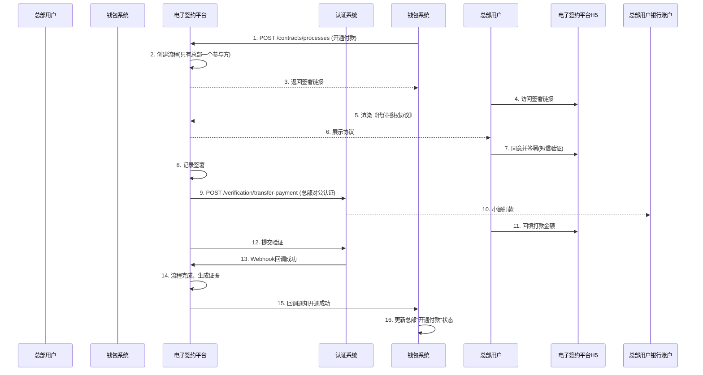

## 6. 错误处理

### 6.1 预期错误码列表
| HTTP状态码 | 错误码 | 描述 | 处理建议 |
| :--- | :--- | :--- | :--- |
| 400 | `INVALID_PARAMETER` | 请求参数缺失或格式错误 | 检查请求体，参考API文档 |
| 400 | `INVALID_PARTY_CONFIG` | 参与方配置不符合业务场景规则 | 调整参与方角色和数量 |
| 400 | `INVALID_TEMPLATE_VARIABLES` | 协议变量缺失或值无效 | 检查变量是否符合模板定义 |
| 409 | `DUPLICATE_REQUEST` | 重复的请求ID | 使用原`processId`查询状态 |
| 404 | `PROCESS_NOT_FOUND` | 签约流程不存在 | 检查`processId`是否正确 |
| 404 | `TEMPLATE_NOT_FOUND` | 协议模板未找到 | 检查`contractType`和版本 |
| 403 | `INVALID_ACCESS_TOKEN` | H5访问令牌无效或过期 | 重新获取签署链接 |
| 403 | `ALREADY_SIGNED` | 参与方已签署，不可重复签署 | 查询当前签署状态 |
| 403 | `SMS_VERIFICATION_FAILED` | 短信验证码错误或过期 | 重新获取验证码 |
| 403 | `PROCESS_EXPIRED` | 签约流程已过期 | 重新发起签约流程 |
| 403 | `PROCESS_COMPLETED` | 签约流程已完成 | 无需重复操作 |
| 429 | `SMS_RATE_LIMIT` | 短信发送频率超限 | 稍后再试 |
| 500 | `DOCUMENT_GENERATION_FAILED` | 协议文件生成失败 | 系统自动重试，可手动触发 |
| 503 | `CERTIFICATION_SERVICE_UNAVAILABLE` | 认证系统不可用 | 系统自动重试，业务方降级处理 |

### 6.2 处理策略
1. **客户端错误 (4xx)**: 提供清晰的错误信息，指导用户或调用方修正。
2. **服务端错误 (5xx)**:
   - **依赖服务失败**（认证系统、短信网关）: 实施重试机制（最多3次，指数退避），最终失败则更新流程状态为失败，并记录原因。
   - **文件生成失败**: 异步重试队列处理，支持手动触发重新生成。
   - **回调通知失败**: 向`callbackUrl`发送回调时，采用重试机制（1, 5, 15, 30分钟），最多5次。
3. **超时处理**:
   - 定期扫描`INITIATED`和`IN_PROGRESS`状态且`expires_at`已过的流程，自动更新为`EXPIRED`。
   - 发布`ContractProcessFailedEvent`通知相关系统。
4. **监控告警**:
   - 监控关键指标：流程创建量、签署成功率、认证成功率、平均完成时间、错误率。
   - 设置告警：失败率突增、依赖服务不可用、文件生成积压。

## 7. 依赖说明

### 7.1 上游依赖（电子签约平台调用）

| 依赖系统 | 交互目的 | 接口方式 | 关键要求 |
| :--- | :--- | :--- | :--- |
| **认证系统** | 发起人脸/打款验证 | 同步REST API + 接收Webhook | 高可用，明确的验证结果回调机制 |
| **短信网关** | 发送签署验证码和通知短信 | 同步/异步API | 高到达率，支持模板短信，发送状态回执 |
| **对象存储** | 存储协议PDF和证据包 | SDK (如S3协议) | 高可靠，支持生成预签名下载URL |
| **时间戳服务** | 为关键操作加盖可信时间戳 | API | 符合国密标准，司法认可 |
| **消息队列 (Kafka)** | 发布领域事件 | 消息发布 | 高吞吐，保证至少一次投递 |

### 7.2 下游依赖（调用电子签约平台）

| 调用方 | 交互场景 | 集成方式 | 注意事项 |
| :--- | :--- | :--- | :--- |
| **行业钱包系统** | 关系绑定流程中的签约环节 | 同步REST API + 事件订阅 + 异步回调 | 需处理`callbackUrl`回调，实现幂等，关注流程有效期 |
| **认证系统** | 人脸验证结果回调 | Webhook回调 | 需验证回调签名，确保来源可信 |

### 7.3 集成要点
1. **安全通信**:
   - 所有API调用通过API Gateway，使用双向TLS和请求签名。
   - H5页面链接使用短期有效的JWT令牌，防止篡改和重放。
   - 敏感数据（如短信验证码）加密存储。

2. **异步处理与最终一致性**:
   - 协议文件生成、证据打包等耗时操作采用异步队列处理。
   - 状态更新、事件发布、回调通知在本地事务中完成，确保原子性。
   - 通过定期补偿任务处理异常状态（如回调失败、文件生成失败）。

3. **合规与审计**:
   - 所有操作日志留存不少于5年。
   - 证据包符合《电子签名法》要求，支持司法出证。
   - 定期进行安全审计和渗透测试。

4. **性能与扩展性**:
   - H5页面静态资源CDN加速。
   - 协议模板缓存，减少数据库查询。
   - 支持水平扩展，应对签约高峰。

## 3.8 钱包APP/商服平台


# 钱包APP/商服平台模块设计文档

## 1. 概述

### 1.1 目的
钱包APP/商服平台模块是面向**天财机构**及其下属**总部**、**门店**等角色用户的**前端业务操作平台**。本模块作为天财分账业务的**用户交互层**，提供直观、便捷的界面，引导用户完成账户开通、关系绑定、分账指令发起、交易查询等全流程操作。它是连接天财业务用户与后端核心系统（三代系统、行业钱包系统）的**关键桥梁**，旨在提升用户体验和业务处理效率。

### 1.2 范围
- **用户门户**：为天财、总部、门店等不同角色提供专属的业务操作界面。
- **账户管理**：展示天财专用账户信息、状态，支持银行卡绑定与管理。
- **关系绑定流程引导**：通过H5页面集成电子签约、人脸/打款认证，引导用户完成分账关系建立的法律流程。
- **分账业务发起**：提供归集、批量付款、会员结算等场景的业务发起界面与表单。
- **交易与账单查询**：提供分账记录、账户流水、对账单的查询与下载功能。
- **消息与通知**：向用户推送业务处理结果、认证提醒等重要通知。

## 2. 接口设计

### 2.1 API端点 (RESTful)

#### 2.1.1 用户与权限接口
- **GET /api/v1/user/current**
    - **描述**：获取当前登录用户的身份信息、所属机构及角色列表。
    - **响应体**：
      ```json
      {
        "code": "SUCCESS",
        "data": {
          "user_id": "user_tc_admin_001",
          "user_name": "天财管理员",
          "institution_code": "TIANCAI",
          "roles": ["TIANCAI_ADMIN"], // 用户角色：TIANCAI_ADMIN, HEADQUARTERS_ADMIN, STORE_OPERATOR
          "managed_merchants": ["M100001", "M100002"], // 可管理的商户列表
          "permissions": ["ACCOUNT_VIEW", "SPLIT_ORDER_CREATE"]
        }
      }
      ```

#### 2.1.2 账户信息接口
- **GET /api/v1/accounts**
    - **描述**：获取当前用户有权查看的天财专用账户列表。
    - **查询参数**：
        - `merchant_no` (可选)：筛选指定商户的账户。
        - `account_role` (可选)：筛选指定角色的账户（HEADQUARTERS/STORE/RECEIVER）。
    - **响应体**：
      ```json
      {
        "code": "SUCCESS",
        "data": {
          "accounts": [
            {
              "tiancai_account_id": "TCA_20231011001",
              "account_no": "3010001001",
              "account_role": "HEADQUARTERS",
              "merchant_no": "M100001",
              "merchant_name": "天财品牌总部",
              "status": "ACTIVE",
              "balance": 5000000, // 余额（分）
              "currency": "CNY",
              "bank_cards": [
                {
                  "card_id": "bc_001",
                  "bank_name": "中国工商银行",
                  "card_no_suffix": "1234",
                  "is_default": true,
                  "status": "BOUND"
                }
              ],
              "created_at": "2023-10-11T10:00:00Z"
            }
          ]
        }
      }
      ```

#### 2.1.3 关系绑定流程接口
- **POST /api/v1/relation-bindings/initiate**
    - **描述**：发起关系绑定流程。根据场景生成签约链接或唤起认证流程。
    - **请求体**：
      ```json
      {
        "scene": "COLLECTION", // COLLECTION, BATCH_PAY, MEMBER_SETTLE, PAYMENT_AUTH
        "payer": {
          "tiancai_account_id": "TCA_20231011001",
          "merchant_no": "M100001"
        },
        "payee": {
          "tiancai_account_id": "TCA_20231011002",
          "merchant_no": "M100002",
          "account_role": "RECEIVER", // 仅BATCH_PAY场景需要
          "bank_card": { // 仅当payee为RECEIVER且需要绑卡时
            "bank_name": "中国建设银行",
            "card_no": "6217000010001234567",
            "account_name": "张三"
          }
        }
      }
      ```
    - **响应体**：
      ```json
      {
        "code": "SUCCESS",
        "data": {
          "process_id": "BIND_PROC_001",
          "next_action": "SIGN_CONTRACT", // SIGN_CONTRACT, FACE_AUTH, REMIT_AUTH, COMPLETE
          "action_url": "https://esign.lakala.com/h5/contract?token=xyz", // H5签约页面URL
          "expires_in": 1800 // 操作有效期（秒）
        }
      }
      ```

#### 2.1.4 分账业务发起接口
- **POST /api/v1/split-orders**
    - **描述**：发起分账指令（归集、批量付款、会员结算）。请求将被转发至三代系统。
    - **请求体**：
      ```json
      {
        "request_id": "front_req_20231011001", // 前端生成，用于幂等
        "biz_scene": "COLLECTION",
        "payer_account_id": "TCA_20231011001",
        "payee_list": [
          {
            "payee_account_id": "TCA_20231011002",
            "amount": 10000,
            "memo": "门店日结归集"
          }
        ],
        "total_amount": 10000,
        "biz_ref_no": "TC_DAILY_001",
        "callback_url": "https://wallet-app.lakala.com/api/callback/tiancai" // 本模块回调地址，用于接收三代回调后通知前端
      }
      ```
    - **响应体**：
      ```json
      {
        "code": "SUCCESS",
        "data": {
          "split_order_id": "SO_202310110001",
          "status": "PROCESSING",
          "estimated_completion_time": 30 // 预计处理时间（秒）
        }
      }
      ```

#### 2.1.5 查询接口
- **GET /api/v1/split-orders**
    - **描述**：分页查询分账订单列表。
- **GET /api/v1/split-orders/{split_order_id}**
    - **描述**：查询分账订单详情。
- **GET /api/v1/transactions**
    - **描述**：查询账户动账流水。
- **GET /api/v1/statements**
    - **描述**：查询并下载对账单（机构层面分账、提款、收单账单）。

#### 2.1.6 回调接口 (供三代系统调用)
- **POST /api/internal/callback/tiancai**
    - **描述**：接收三代系统异步回调，更新前端状态并通过WebSocket等通道通知用户。
    - **请求体**：
      ```json
      {
        "split_order_id": "SO_202310110001",
        "status": "SUCCESS",
        "result_data": {
          "actual_amount": 10000,
          "finish_time": "2023-10-11T10:05:00Z"
        },
        "error_info": null,
        "timestamp": "2023-10-11T10:05:00Z"
      }
      ```

### 2.2 发布/消费的事件

#### 2.2.1 消费的事件
- **SplitOrderStatusChangedEvent** (来自三代系统回调)：消费分账订单状态变更事件，用于更新前端状态和推送用户通知。
- **RelationBindingCompletedEvent** (来自电子签约平台/行业钱包系统回调)：消费关系绑定完成事件，更新绑定状态。

#### 2.2.2 发布的事件 (前端内部事件，用于驱动UI)
- **UserNotificationEvent**：向特定用户推送业务通知。
  ```json
  {
    "event_type": "USER_NOTIFICATION",
    "user_id": "user_tc_admin_001",
    "notification": {
      "title": "分账成功",
      "content": "分账订单 SO_202310110001 处理成功，金额100.00元。",
      "type": "SUCCESS",
      "related_order_id": "SO_202310110001",
      "timestamp": "2023-10-11T10:05:00Z"
    }
  }
  ```

## 3. 数据模型

### 3.1 核心表设计

#### 表：`user` (用户表)
| 字段名 | 类型 | 必填 | 默认值 | 描述 |
| :--- | :--- | :--- | :--- | :--- |
| `id` | bigint | Y | AUTO_INCREMENT | 主键 |
| `user_id` | varchar(64) | Y | | **用户唯一标识**，与IAM系统对齐 |
| `user_name` | varchar(100) | Y | | 用户姓名 |
| `institution_code` | varchar(20) | Y | | 所属机构代码，如`TIANCAI` |
| `role_codes` | json | Y | `[]` | 角色代码列表 |
| `managed_merchant_nos` | json | Y | `[]` | 可管理的收单商户号列表 |
| `status` | varchar(20) | Y | `ACTIVE` | 状态 |
| `created_at` | datetime | Y | CURRENT_TIMESTAMP | |

#### 表：`frontend_split_order` (前端分账订单表)
| 字段名 | 类型 | 必填 | 默认值 | 描述 |
| :--- | :--- | :--- | :--- | :--- |
| `id` | bigint | Y | AUTO_INCREMENT | 主键 |
| `front_order_id` | varchar(32) | Y | | 前端订单号，用于关联前端会话 |
| `split_order_id` | varchar(32) | Y | | 三代系统分账订单号 |
| `request_id` | varchar(64) | Y | | 前端请求流水号，用于幂等 |
| `user_id` | varchar(64) | Y | | 发起用户ID |
| `biz_scene` | varchar(20) | Y | | 业务场景 |
| `payer_account_id` | varchar(32) | Y | | 付方账户ID |
| `total_amount` | decimal(15,2) | Y | | 总金额 |
| `status` | varchar(20) | Y | `INIT` | 状态：`INIT`, `PROCESSING`, `SUCCESS`, `FAILED` |
| `callback_received` | tinyint(1) | Y | 0 | 是否已收到三代回调 |
| `ui_status` | varchar(20) | Y | `PENDING_SUBMIT` | UI状态：`PENDING_SUBMIT`, `SUBMITTED`, `SHOW_RESULT` |
| `form_data` | json | Y | | 前端表单提交的原始数据 |
| `result_data` | json | N | | 三代回调的结果数据 |
| `created_at` | datetime | Y | CURRENT_TIMESTAMP | |
| `updated_at` | datetime | Y | CURRENT_TIMESTAMP ON UPDATE | |

#### 表：`relation_binding_flow` (关系绑定流程表)
| 字段名 | 类型 | 必填 | 默认值 | 描述 |
| :--- | :--- | :--- | :--- | :--- |
| `id` | bigint | Y | AUTO_INCREMENT | 主键 |
| `flow_id` | varchar(32) | Y | | 前端绑定流程ID |
| `process_id` | varchar(32) | Y | | 后端流程ID（三代或钱包系统） |
| `scene` | varchar(20) | Y | | 绑定场景 |
| `payer_info` | json | Y | | 付方信息 |
| `payee_info` | json | Y | | 收方信息 |
| `current_step` | varchar(30) | Y | | 当前步骤：`INIT`, `SIGNING`, `AUTHING`, `COMPLETED` |
| `step_data` | json | N | | 各步骤的临时数据（如签约token） |
| `expire_time` | datetime | N | | 流程过期时间 |
| `user_id` | varchar(64) | Y | | 操作用户 |
| `created_at` | datetime | Y | CURRENT_TIMESTAMP | |

#### 表：`user_notification` (用户通知表)
| 字段名 | 类型 | 必填 | 默认值 | 描述 |
| :--- | :--- | :--- | :--- | :--- |
| `id` | bigint | Y | AUTO_INCREMENT | 主键 |
| `user_id` | varchar(64) | Y | | 目标用户ID |
| `title` | varchar(200) | Y | | 通知标题 |
| `content` | text | Y | | 通知内容 |
| `type` | varchar(20) | Y | | 类型：`SUCCESS`, `WARNING`, `ERROR`, `INFO` |
| `related_id` | varchar(64) | N | | 关联业务ID（如订单号） |
| `read` | tinyint(1) | Y | 0 | 是否已读 |
| `created_at` | datetime | Y | CURRENT_TIMESTAMP | |

### 3.2 与其他模块的关系
- **三代系统**：通过`frontend_split_order.split_order_id`关联分账订单；通过回调接口接收处理结果。
- **行业钱包系统/电子签约平台**：通过`relation_binding_flow.process_id`关联绑定流程；通过H5页面嵌入或重定向进行交互。
- **账户系统**：间接通过三代系统或行业钱包系统获取账户数据，本地不持久化核心账户信息。
- **对账单系统**：通过接口获取账单数据，提供下载链接。

## 4. 业务逻辑

### 4.1 核心算法与规则

#### 4.1.1 用户权限与数据隔离
```python
def get_accessible_accounts(user_id):
    """
    根据用户角色和管理的商户，返回可查看的账户列表。
    规则：
    1. TIANCAI_ADMIN: 可查看所有天财机构下的账户。
    2. HEADQUARTERS_ADMIN: 仅可查看所属总部商户及其关联门店的账户。
    3. STORE_OPERATOR: 仅可查看所属门店的账户。
    """
    user = get_user(user_id)
    if 'TIANCAI_ADMIN' in user.role_codes:
        return query_all_tiancai_accounts()
    elif 'HEADQUARTERS_ADMIN' in user.role_codes:
        # 获取该总部管理的所有门店商户号
        managed_stores = get_managed_stores(user.managed_merchant_nos)
        return query_accounts_by_merchants([user.managed_merchant_nos] + managed_stores)
    else:
        return query_accounts_by_merchants(user.managed_merchant_nos)
```

#### 4.1.2 关系绑定流程引导引擎
```python
def determine_binding_steps(scene, payer_role, payee_role, payee_has_bank_card):
    """
    根据业务场景和账户角色，确定关系绑定所需的步骤序列。
    返回如：['SIGN_CONTRACT', 'FACE_AUTH']。
    """
    steps = []
    
    if scene in ['COLLECTION', 'MEMBER_SETTLE']:
        # 总部与门店间绑定：需签署《分账协议》
        steps.append('SIGN_CONTRACT')
        # 根据账户类型决定认证方式
        if payee_role == 'STORE':  # 门店为对私账户？需确认，此处为示例
            steps.append('FACE_AUTH')
        else:
            steps.append('REMIT_AUTH')
    
    elif scene == 'BATCH_PAY':
        # 总部与接收方绑定：需签署《代付授权协议》
        steps.append('SIGN_CONTRACT')
        if not payee_has_bank_card:
            steps.append('BIND_BANK_CARD')  # 引导绑卡
        steps.append('REMIT_AUTH')  # 接收方通常为对公账户
    
    elif scene == 'PAYMENT_AUTH':
        # 开通付款权限：总部签署《代付授权协议》
        steps.append('SIGN_CONTRACT')
    
    return steps
```

#### 4.1.3 分账请求预处理与幂等
```python
def submit_split_order(user_id, form_data):
    """
    提交分账请求前端处理逻辑。
    1. 生成前端订单号和幂等ID。
    2. 保存表单数据。
    3. 调用三代接口。
    4. 启动轮询或等待回调。
    """
    front_order_id = generate_front_order_id()
    request_id = f"{user_id}_{timestamp}_{random_suffix}"
    
    # 幂等检查：基于(request_id, user_id)防止重复提交
    if duplicate_request_exists(request_id, user_id):
        return get_existing_order(request_id)
    
    # 保存前端订单记录
    save_frontend_order(front_order_id, request_id, user_id, form_data, status='INIT')
    
    # 构建调用三代的请求体
    backend_request = transform_to_backend_request(form_data, request_id)
    
    try:
        # 同步调用三代接口
        response = call_generation3_api('/split-orders', backend_request)
        split_order_id = response['split_order_id']
        
        # 更新关联关系
        update_frontend_order(front_order_id, split_order_id=split_order_id, status='PROCESSING')
        
        # 启动后台任务轮询状态（备用，主要靠回调）
        start_status_polling(front_order_id, split_order_id)
        
        return {'front_order_id': front_order_id, 'status': 'PROCESSING'}
    except Exception as e:
        update_frontend_order(front_order_id, status='FAILED', error=str(e))
        raise
```

### 4.2 验证逻辑
- **用户会话验证**：所有API请求需携带有效的身份令牌（JWT），验证用户身份和权限。
- **数据归属验证**：用户发起的操作（如查询账户、发起分账）必须验证其是否有权操作目标商户/账户。
- **表单验证**：
    - 金额：必须为正数，符合金额格式，不超过账户余额或业务限额。
    - 业务场景与账户角色匹配：如归集场景，付方必须是门店，收方必须是总部。
    - 关系绑定前置检查：发起分账前，校验付方与收方是否已完成必要的关系绑定。
- **流程状态验证**：防止重复发起已进行中的绑定流程或订单。

## 5. 时序图

### 5.1 用户发起分账（归集）流程
```mermaid
sequenceDiagram
    participant U as 用户(门店操作员)
    participant FE as 钱包APP前端
    participant BE as 钱包APP后端
    participant G3 as 三代系统
    participant W as 行业钱包系统
    participant A as 账户系统

    U->>FE: 1. 登录，进入归集页面
    FE->>BE: 2. GET /accounts (获取可操作账户)
    BE-->>FE: 3. 返回账户列表（门店收款账户）
    U->>FE: 4. 选择付方账户，输入金额、选择总部收方
    FE->>BE: 5. 前置校验（余额、关系绑定状态）
    BE-->>FE: 6. 校验通过
    U->>FE: 7. 确认提交
    FE->>BE: 8. POST /split-orders (提交分账请求)
    BE->>BE: 9. 生成front_order_id, 保存表单
    BE->>G3: 10. POST /split-orders (转发请求)
    G3-->>BE: 11. 返回受理成功(split_order_id)
    BE->>BE: 12. 关联订单号，更新状态为PROCESSING
    BE-->>FE: 13. 返回受理成功，跳转处理中页面
    FE->>BE: 14. 轮询订单状态（或等待WebSocket推送）
    
    Note over G3,W,A: 后端分账处理（同三代设计）
    G3->>W: 处理分账
    W->>A: 执行账务
    A-->>W: 返回结果
    W-->>G3: 回调通知完成
    
    G3->>BE: 15. POST /callback/tiancai (异步回调)
    BE->>BE: 16. 更新订单状态为SUCCESS，生成用户通知
    BE->>FE: 17. 通过WebSocket推送通知
    FE->>U: 18. 展示处理成功结果
```

### 5.2 关系绑定（签约认证）流程
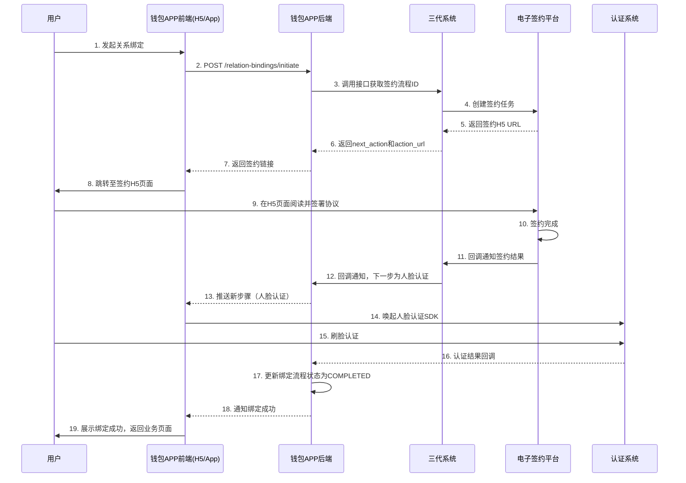

## 6. 错误处理

| 错误场景 | HTTP 状态码 | 前端处理策略 |
| :--- | :--- | :--- |
| **用户未登录/令牌失效** | 401 | 跳转至登录页面。 |
| **权限不足** | 403 | 显示“无权访问”提示，引导用户联系管理员。 |
| **账户余额不足** | 422 | 表单提交前校验，提示用户“余额不足”。 |
| **关系未绑定** | 422 | 引导用户先完成关系绑定流程，提供“去绑定”按钮。 |
| **表单验证失败** (金额格式错误等) | 400 | 在表单字段旁显示具体错误提示。 |
| **调用三代系统失败** | 502 | 显示“系统繁忙，请稍后重试”，并记录日志。 |
| **异步回调超时** (未收到三代回调) | - | 前端轮询查询订单状态，显示“处理中，请稍后查看结果”。 |
| **签约或认证流程中断/失败** | - | 引导用户重新发起流程，并显示具体失败原因（如“人脸识别失败”）。 |
| **网络异常** | - | 显示网络错误提示，提供“重试”按钮。 |

**通用策略**：
- **友好提示**：所有错误向用户展示清晰、友好的提示信息，避免技术细节。
- **自动重试**：对于网络抖动等临时错误，前端可自动重试1-2次。
- **状态同步**：通过轮询和WebSocket双机制确保前端状态与后端同步。
- **离线缓存**：对于提交失败的表单，可临时缓存本地，待网络恢复后提示用户重新提交。
- **监控与上报**：前端异常通过监控SDK上报，便于排查问题。

## 7. 依赖说明

### 7.1 上游依赖
1. **三代系统**
   - **交互方式**：同步REST API调用（提交业务请求、查询） + 异步HTTP回调（接收结果）。
   - **职责**：业务请求的实际处理入口和状态权威来源。
   - **关键点**：
     - 本模块需严格遵循三代系统的接口规范。
     - 异步回调必须幂等处理。
     - 需处理三代系统不可用时的降级（如显示“系统维护中”）。

2. **电子签约平台 (H5页面)**
   - **交互方式**：前端直接重定向或WebView嵌入。
   - **职责**：提供签约界面，完成法律流程。
   - **关键点**：需处理签约页面的返回回调，管理会话状态。

3. **认证系统 (SDK)**
   - **交互方式**：前端集成SDK（人脸识别）。
   - **职责**：提供生物识别认证能力。
   - **关键点**：需处理SDK初始化失败、认证超时等异常。

### 7.2 下游依赖
1. **用户浏览器/移动端APP**
   - **交互方式**：HTTP/HTTPS, WebSocket。
   - **职责**：渲染界面，执行用户交互。
   - **关键点**：需兼容主流浏览器和移动端版本，考虑弱网环境。

### 7.3 设计原则
- **用户为中心**：界面设计简洁，流程引导清晰，减少用户操作步骤。
- **状态可追踪**：任何异步操作都提供明确的状态提示和查询入口。
- **前后端分离**：前端负责展示和交互，后端负责业务逻辑聚合和接口转发。
- **安全优先**：敏感操作（如确认付款）需二次确认；数据传输加密。
- **性能体验**：关键接口快速响应，大量数据列表分页加载，利用缓存减少重复请求。

## 3.9 行业钱包系统


# 行业钱包系统模块设计文档

## 1. 概述

### 1.1 目的
行业钱包系统是“天财分账业务”的**核心业务逻辑处理引擎**。它作为连接业务入口（三代系统）、底层账户（账户系统）和法律流程（电子签约平台）的枢纽，负责处理天财专用账户的开通、关系绑定、分账指令执行等核心业务流程。本模块旨在为天财提供一套安全、高效、可扩展的资金分账解决方案，支撑归集、批量付款、会员结算三大核心场景。

### 1.2 范围
- **天财账户开通协调**：接收账户创建事件，协调完成天财专用账户在钱包层的初始化与状态同步。
- **关系绑定流程驱动**：作为关系绑定的发起方和协调者，调用电子签约平台完成协议签署与身份认证，并将结果同步至账户系统。
- **分账指令处理**：接收并处理来自三代系统的分账指令，执行严格的业务规则校验、账户关系验证、账务指令生成与执行。
- **业务场景适配**：针对归集、批量付款、会员结算三种不同场景，定制化处理流程与校验规则。
- **状态管理与对账**：维护分账订单的生命周期状态，提供查询接口，并与对账单系统协同确保账务一致性。
- **异常处理与补偿**：设计健壮的重试、冲正、人工干预机制，保障资金安全与业务连续性。

## 2. 接口设计

### 2.1 API端点 (RESTful)

#### 2.1.1 账户与关系管理接口
- **POST /api/v1/tiancai/accounts/{tiancai_account_id}/bindings**
    - **描述**：发起账户关系绑定流程（如总部与门店的归集关系）。此接口将调用电子签约平台创建签约流程。
    - **路径参数**：
        - `tiancai_account_id`: 付方天财账户ID
    - **请求体**：
      ```json
      {
        "request_id": "bind_req_20231011001",
        "biz_scene": "COLLECTION", // COLLECTION(归集)/BATCH_PAY(批量付款)/MEMBER_SETTLE(会员结算)
        "to_account_id": "TCA_20231011002", // 收方天财账户ID（批量付款时为列表）
        "to_account_ids": ["TCA_RECV_001", "TCA_RECV_002"], // 批量付款场景下收方账户ID列表
        "contract_variables": { // 协议变量
          "effective_date": "2023-11-01",
          "expiry_date": "2024-10-31",
          "daily_limit": "100000.00"
        },
        "operator": "admin_user", // 操作员
        "callback_url": "https://g3.example.com/callback/binding" // 绑定结果回调地址（通知三代系统）
      }
      ```
    - **响应体**：
      ```json
      {
        "code": "SUCCESS",
        "message": "关系绑定流程已发起",
        "data": {
          "binding_id": "BIND_202310110001", // 钱包系统生成的关系绑定流水号
          "process_id": "proc_9k2jhs83la5", // 电子签约平台返回的流程ID
          "status": "SIGNING", // 状态：SIGNING(签约中)/VERIFYING(认证中)/COMPLETED/FAILED
          "sign_urls": [ // 签约链接（按参与方）
            {
              "party_role": "PAYER",
              "party_name": "北京天财科技有限公司",
              "sign_url": "https://h5.e-sign.com/contract?token=eyJhbGciOi..."
            }
          ]
        }
      }
      ```

- **POST /api/v1/tiancai/accounts/{tiancai_account_id}/open-payment**
    - **描述**：为总部开通“付款”权限（用于批量付款和会员结算场景）。此流程仅涉及总部单方签署《代付授权协议》并进行对公认证。
    - **请求体**：
      ```json
      {
        "request_id": "open_pay_req_001",
        "operator": "admin_user",
        "callback_url": "https://g3.example.com/callback/open-payment"
      }
      ```
    - **响应体**：返回开通流程ID及状态。

#### 2.1.2 分账指令处理接口（内部）
- **POST /api/internal/tiancai/split-orders**
    - **描述**：由三代系统调用，处理分账指令。此接口执行核心业务逻辑。
    - **认证**：内部服务间认证（API Key + IP白名单）。
    - **请求体**：
      ```json
      {
        "request_id": "g3_req_20231011001", // 三代请求ID
        "split_order_id": "SO_202310110001", // 三代分账订单号
        "biz_scene": "COLLECTION",
        "payer": {
          "tiancai_account_id": "TCA_20231011001",
          "merchant_no": "M100001"
        },
        "payee_list": [
          {
            "tiancai_account_id": "TCA_20231011002",
            "merchant_no": "M100002",
            "amount": 10000,
            "currency": "CNY",
            "memo": "门店日结归集"
          }
        ],
        "total_amount": 10000,
        "biz_ref_no": "TC_ORDER_001", // 天财业务参考号
        "ext_info": {}
      }
      ```
    - **响应体**：
      ```json
      {
        "code": "SUCCESS",
        "message": "分账指令处理中",
        "data": {
          "wallet_order_id": "WO_202310110001", // 钱包系统分账订单号
          "status": "PROCESSING",
          "estimated_completion_time": 30 // 预计完成秒数
        }
      }
      ```

#### 2.1.3 查询接口
- **GET /api/v1/tiancai/split-orders/{wallet_order_id}**
    - **描述**：查询分账订单详情及处理状态。
    - **响应体**：
      ```json
      {
        "code": "SUCCESS",
        "data": {
          "wallet_order_id": "WO_202310110001",
          "split_order_id": "SO_202310110001",
          "biz_scene": "COLLECTION",
          "status": "SUCCESS", // INIT, PROCESSING, SUCCESS, PARTIAL_SUCCESS, FAILED, REVERSED
          "payer_account_id": "TCA_20231011001",
          "total_amount": 10000,
          "currency": "CNY",
          "details": [
            {
              "payee_account_id": "TCA_20231011002",
              "amount": 10000,
              "status": "SUCCESS",
              "ledger_entry_no": "LE_202310110001", // 账务流水号
              "completed_at": "2023-10-11T10:05:00Z"
            }
          ],
          "created_at": "2023-10-11T10:00:00Z",
          "completed_at": "2023-10-11T10:05:00Z"
        }
      }
      ```

- **GET /api/v1/tiancai/accounts/{tiancai_account_id}/bindings**
    - **描述**：查询账户的绑定关系列表。
- **GET /api/v1/tiancai/bindings/{binding_id}**
    - **描述**：查询特定关系绑定的详情及进度。

#### 2.1.4 回调接口（供电子签约平台调用）
- **POST /api/internal/callback/esign**
    - **描述**：接收电子签约平台的签约结果回调。
    - **请求体**：
      ```json
      {
        "event_type": "CONTRACT_PROCESS_COMPLETED", // 或 FAILED
        "process_id": "proc_9k2jhs83la5",
        "biz_reference_no": "BIND_202310110001", // 即钱包系统的binding_id
        "status": "COMPLETED",
        "contract_document": {
          "document_id": "doc_7s82kja93n2",
          "hash": "a1b2c3d4e5f6..."
        },
        "completion_time": "2023-10-11T10:25:00Z",
        "failure_reason": ""
      }
      ```
    - **响应体**：返回成功接收确认。

### 2.2 发布/消费的事件

#### 2.2.1 消费的事件
1. **TiancaiAccountCreatedEvent** (来自账户系统)
    - **Topic**: `account.events.tiancai.created`
    - **处理逻辑**：接收天财专用账户创建成功事件，在钱包系统创建对应的账户映射记录，初始化状态。
2. **AccountBalanceChangedEvent** (来自账户系统)
    - **Topic**: `account.events.balance.changed`
    - **处理逻辑**：监听关键账户（如天财收款账户）的余额变动，用于监控和风控。
3. **MerchantCreatedEvent** (来自三代系统，可选)
    - **Topic**: `g3.events.merchant.created`
    - **处理逻辑**：感知新商户创建，为后续可能的自动开通天财业务做准备。

#### 2.2.2 发布的事件
1. **AccountRelationVerifiedEvent** (账户关系已验证)
    - **Topic**: `wallet.events.relation.verified`
    - **触发时机**：关系绑定流程（签约+认证）全部完成，且钱包系统已将该关系同步至账户系统后。
    - **Payload**:
    ```json
    {
      "event_id": "evt_wallet_001",
      "event_type": "ACCOUNT_RELATION_VERIFIED",
      "timestamp": "2023-10-11T10:30:00Z",
      "data": {
        "binding_id": "BIND_202310110001",
        "relation_type": "COLLECTION",
        "from_account_id": "TCA_20231011001",
        "to_account_id": "TCA_20231011002",
        "contract_id": "doc_7s82kja93n2",
        "effective_time": "2023-11-01T00:00:00Z",
        "expire_time": "2024-10-31T23:59:59Z"
      }
    }
    ```
2. **SplitOrderCompletedEvent** (分账订单已完成)
    - **Topic**: `wallet.events.split_order.completed`
    - **触发时机**：分账订单（包括批量付款中的子订单）处理完成（成功或失败）。
    - **Payload**:
    ```json
    {
      "event_id": "evt_wallet_002",
      "event_type": "SPLIT_ORDER_COMPLETED",
      "timestamp": "2023-10-11T10:05:00Z",
      "data": {
        "wallet_order_id": "WO_202310110001",
        "split_order_id": "SO_202310110001",
        "biz_scene": "COLLECTION",
        "status": "SUCCESS",
        "total_amount": 10000,
        "details": [...],
        "completed_at": "2023-10-11T10:05:00Z"
      }
    }
    ```
3. **PaymentOpenedEvent** (付款权限已开通)
    - **Topic**: `wallet.events.payment.opened`
    - **触发时机**：总部成功开通付款权限（完成《代付授权协议》签署与认证）。
    - **Payload**:
    ```json
    {
      "event_id": "evt_wallet_003",
      "event_type": "PAYMENT_OPENED",
      "timestamp": "2023-10-11T09:30:00Z",
      "data": {
        "tiancai_account_id": "TCA_HQ_001",
        "merchant_no": "M100001",
        "contract_id": "doc_xxxx",
        "opened_at": "2023-10-11T09:30:00Z"
      }
    }
    ```

## 3. 数据模型

### 3.1 核心表设计

#### 表：`tiancai_wallet_account` (钱包账户映射表)
| 字段名 | 类型 | 必填 | 默认值 | 描述 |
| :--- | :--- | :--- | :--- | :--- |
| `id` | bigint | Y | AUTO_INCREMENT | 主键 |
| `tiancai_account_id` | varchar(32) | Y | | **天财账户ID**，关联账户系统，唯一索引 `uk_tc_account_id` |
| `merchant_no` | varchar(32) | Y | | 收单商户号 |
| `account_role` | varchar(20) | Y | | 角色：`HEADQUARTERS`/`STORE`/`RECEIVER` |
| `account_type` | varchar(20) | Y | | 类型：`TIANCAI_RECEIVE`/`TIANCAI_RECEIVER` |
| `wallet_status` | varchar(20) | Y | `ACTIVE` | 钱包层状态：`ACTIVE`/`FROZEN`/`CLOSED` |
| `payment_capability` | varchar(20) | Y | `CLOSED` | 付款能力：`CLOSED`/`OPENED`，仅总部收款账户有效 |
| `payment_open_contract_id` | varchar(64) | N | | 开通付款的协议ID |
| `payment_opened_at` | datetime | N | | 开通付款时间 |
| `created_at` | datetime | Y | CURRENT_TIMESTAMP | |
| `updated_at` | datetime | Y | CURRENT_TIMESTAMP ON UPDATE | |

#### 表：`account_binding` (账户关系绑定表)
| 字段名 | 类型 | 必填 | 默认值 | 描述 |
| :--- | :--- | :--- | :--- | :--- |
| `id` | bigint | Y | AUTO_INCREMENT | 主键 |
| `binding_id` | varchar(32) | Y | | **绑定流水号**，唯一索引 `uk_binding_id` |
| `relation_type` | varchar(30) | Y | | 关系类型：`COLLECTION`/`BATCH_PAY`/`MEMBER_SETTLE` |
| `from_account_id` | varchar(32) | Y | | 付方天财账户ID，索引 `idx_from_account` |
| `to_account_id` | varchar(32) | Y | | 收方天财账户ID（批量付款时存首个），索引 `idx_to_account` |
| `to_account_ids_json` | json | N | | **批量付款场景**下所有收方账户ID列表 |
| `contract_id` | varchar(64) | Y | | 电子签约协议ID |
| `contract_document_url` | varchar(512) | N | | 协议文件下载地址 |
| `auth_status` | varchar(20) | Y | `PENDING` | 认证状态：`PENDING`/`SIGNING`/`VERIFYING`/`VERIFIED`/`EXPIRED`/`FAILED` |
| `effective_time` | datetime | Y | | 生效时间 |
| `expire_time` | datetime | N | | 过期时间 |
| `daily_limit` | decimal(15,2) | N | | 日限额 |
| `single_limit` | decimal(15,2) | N | | 单笔限额 |
| `process_id` | varchar(32) | N | | 电子签约流程ID |
| `callback_url` | varchar(512) | Y | | 结果回调地址（通知三代） |
| `created_at` | datetime | Y | CURRENT_TIMESTAMP | |
| `updated_at` | datetime | Y | CURRENT_TIMESTAMP ON UPDATE | |

#### 表：`tiancai_split_order` (钱包分账订单表)
| 字段名 | 类型 | 必填 | 默认值 | 描述 |
| :--- | :--- | :--- | :--- | :--- |
| `id` | bigint | Y | AUTO_INCREMENT | 主键 |
| `wallet_order_id` | varchar(32) | Y | | **钱包订单号**，唯一索引 `uk_wallet_order_id` |
| `split_order_id` | varchar(32) | Y | | 三代分账订单号，索引 `idx_split_order_id` |
| `request_id` | varchar(64) | Y | | 三代请求ID，用于幂等 |
| `biz_scene` | varchar(20) | Y | | 业务场景：`COLLECTION`/`BATCH_PAY`/`MEMBER_SETTLE` |
| `payer_account_id` | varchar(32) | Y | | 付方天财账户ID |
| `total_amount` | decimal(15,2) | Y | | 总分账金额 |
| `currency` | varchar(3) | Y | `CNY` | 币种 |
| `status` | varchar(20) | Y | `INIT` | 订单状态：`INIT`/`PROCESSING`/`SUCCESS`/`PARTIAL_SUCCESS`/`FAILED`/`REVERSED` |
| `biz_ref_no` | varchar(64) | N | | 天财业务参考号 |
| `relation_binding_id` | varchar(32) | N | | 关联的关系绑定ID（用于归集、会员结算） |
| `batch_details_json` | json | N | | **批量付款场景**下存储付款明细（账户、金额、备注） |
| `ledger_entries_json` | json | N | | 账务流水号列表（关联账户系统） |
| `error_code` | varchar(50) | N | | 错误码 |
| `error_message` | varchar(500) | N | | 错误信息 |
| `completed_at` | datetime | N | | 完成时间 |
| `created_at` | datetime | Y | CURRENT_TIMESTAMP | |
| `updated_at` | datetime | Y | CURRENT_TIMESTAMP ON UPDATE | |

#### 表：`split_order_detail` (分账订单明细表)
| 字段名 | 类型 | 必填 | 默认值 | 描述 |
| :--- | :--- | :--- | :--- | :--- |
| `id` | bigint | Y | AUTO_INCREMENT | 主键 |
| `wallet_order_id` | varchar(32) | Y | | 关联钱包订单号，索引 `idx_wallet_order_id` |
| `payee_account_id` | varchar(32) | Y | | 收方天财账户ID |
| `amount` | decimal(15,2) | Y | | 分账金额 |
| `currency` | varchar(3) | Y | `CNY` | 币种 |
| `status` | varchar(20) | Y | `INIT` | 状态：`INIT`/`SUCCESS`/`FAILED` |
| `ledger_entry_no` | varchar(32) | N | | 账务流水号 |
| `memo` | varchar(200) | N | | 备注 |
| `error_code` | varchar(50) | N | | 错误码 |
| `completed_at` | datetime | N | | 完成时间 |
| `created_at` | datetime | Y | CURRENT_TIMESTAMP | |

### 3.2 与其他模块的关系
- **账户系统**：
  - 通过`tiancai_account_id`关联`tiancai_account`表。
  - 关系绑定完成后，调用账户系统接口建立底层关系记录。
  - 执行分账时，调用账户系统接口进行账务处理。
- **三代系统**：
  - 通过`split_order_id`关联`tiancai_split_order`表。
  - 通过`callback_url`回调通知三代系统绑定或分账结果。
- **电子签约平台**：
  - 通过`process_id`关联`contract_process`表。
  - 通过`contract_id`关联最终协议文件。
- **对账单系统**：通过监听`SplitOrderCompletedEvent`和账户系统的`AccountBalanceChangedEvent`，生成业务对账单。

## 4. 业务逻辑

### 4.1 核心算法与规则

#### 4.1.1 关系绑定流程驱动算法
```python
def initiate_binding(from_account_id, to_account_id, biz_scene, contract_vars):
    """
    发起关系绑定流程
    1. 校验双方账户存在、状态正常、角色符合场景
    2. 检查是否已存在有效绑定（防重复）
    3. 调用电子签约平台创建签约流程
    4. 记录绑定流程状态，返回签约链接
    """
    # 1. 账户校验
    payer_acc = get_wallet_account(from_account_id)
    payee_acc = get_wallet_account(to_account_id)
    
    validate_accounts_for_binding(payer_acc, payee_acc, biz_scene)
    
    # 2. 重复绑定校验
    existing = find_active_binding(from_account_id, to_account_id, biz_scene)
    if existing:
        return existing.binding_id, existing.sign_urls
    
    # 3. 调用电子签约
    esign_request = build_esign_request(payer_acc, payee_acc, biz_scene, contract_vars)
    esign_response = call_esign_platform(esign_request)
    
    # 4. 创建绑定记录
    binding = create_binding_record(
        from_account_id, to_account_id, biz_scene,
        esign_response.process_id, contract_vars
    )
    
    return binding.binding_id, esign_response.sign_urls
```

#### 4.1.2 分账指令处理状态机
```python
class SplitOrderProcessor:
    
    def process_order(self, wallet_order_id):
        order = get_order(wallet_order_id)
        
        if order.status != 'INIT':
            return  # 幂等处理
        
        order.update_status('PROCESSING')
        
        try:
            # 1. 业务规则校验
            self.validate_business_rules(order)
            
            # 2. 账户关系校验（归集/会员结算需检查绑定关系）
            if order.biz_scene in ['COLLECTION', 'MEMBER_SETTLE']:
                binding = validate_binding_exists(
                    order.payer_account_id, 
                    order.get_payee_account_id(),  # 首个收方
                    order.biz_scene
                )
                order.relation_binding_id = binding.binding_id
            
            # 3. 付款权限校验（批量付款/会员结算需检查总部开通状态）
            if order.biz_scene in ['BATCH_PAY', 'MEMBER_SETTLE']:
                validate_payment_capability(order.payer_account_id)
            
            # 4. 限额校验
            validate_limits(order.payer_account_id, order.total_amount, order.biz_scene)
            
            # 5. 调用账户系统执行账务
            ledger_results = self.execute_ledger_entries(order)
            
            # 6. 更新订单状态
            self.update_order_status(order, ledger_results)
            
            # 7. 发布完成事件
            publish_split_order_completed_event(order)
            
        except BusinessException as e:
            order.update_status('FAILED', e.code, e.message)
            publish_split_order_completed_event(order)
            raise
        except Exception as e:
            order.update_status('FAILED', 'SYSTEM_ERROR', str(e))
            # 触发告警，需人工介入
            raise
```

#### 4.1.3 批量付款拆分与执行算法
```python
def process_batch_payment(order):
    """
    处理批量付款场景
    1. 拆分为多个子分账指令
    2. 并行执行（控制并发）
    3. 汇总结果，部分成功时支持冲正或人工处理
    """
    payee_list = order.batch_details_json  # 从JSON解析出收款方列表
    
    # 1. 创建子订单明细
    details = create_order_details(order.wallet_order_id, payee_list)
    
    # 2. 并发执行（限制并发数，如10个）
    semaphore = Semaphore(10)
    results = []
    
    with ThreadPoolExecutor() as executor:
        futures = []
        for detail in details:
            future = executor.submit(
                process_single_payment,
                order.payer_account_id,
                detail,
                semaphore
            )
            futures.append(future)
        
        for future in as_completed(futures):
            results.append(future.result())
    
    # 3. 汇总结果
    success_count = sum(1 for r in results if r['status'] == 'SUCCESS')
    failed_count = len(results) - success_count
    
    if failed_count == 0:
        order_status = 'SUCCESS'
    elif success_count == 0:
        order_status = 'FAILED'
    else:
        order_status = 'PARTIAL_SUCCESS'
        # 记录失败明细，触发人工对账或自动冲正流程
    
    return order_status, results
```

### 4.2 业务规则

1. **场景与角色匹配规则**：
   - **归集(COLLECTION)**：付方必须是`STORE`(门店)，收方必须是`HEADQUARTERS`(总部)。
   - **批量付款(BATCH_PAY)**：付方必须是`HEADQUARTERS`(总部)且已开通付款权限，收方必须是`RECEIVER`(接收方)。
   - **会员结算(MEMBER_SETTLE)**：付方必须是`HEADQUARTERS`(总部)且已开通付款权限，收方必须是`STORE`(门店)。

2. **关系绑定前置要求**：
   - 归集、会员结算场景：分账前必须完成对应账户间的绑定与认证。
   - 批量付款场景：总部必须完成“开通付款”流程（签署《代付授权协议》+对公认证），但无需与每个接收方单独绑定。

3. **限额控制规则**：
   - **单笔限额**：基于绑定关系中的`single_limit`字段控制。
   - **日累计限额**：基于绑定关系中的`daily_limit`字段控制，按付方账户和关系类型维度统计。
   - **系统级限额**：配置系统级默认限额，防止未设置限额时无限制转账。

4. **幂等性规则**：
   - 所有接口支持基于`request_id`的幂等。
   - 分账指令基于`biz_ref_no`（天财侧）+ `payer_account_id` 保证业务幂等。

5. **时效性规则**：
   - 关系绑定签约链接有效期24小时。
   - 分账指令处理超时时间30分钟，超时后标记为`PROCESSING_TIMEOUT`，触发人工核查。

### 4.3 验证逻辑

#### 4.3.1 分账指令预处理校验
```python
def pre_validate_split_order(order_request):
    """
    分账指令预处理校验（在接收请求时执行）
    """
    errors = []
    
    # 1. 基础校验
    if not order_request.payer or not order_request.payee_list:
        errors.append("付方或收方列表不能为空")
    
    if order_request.total_amount <= 0:
        errors.append("分账金额必须大于0")
    
    # 2. 金额一致性校验
    detail_sum = sum(p['amount'] for p in order_request.payee_list)
    if detail_sum != order_request.total_amount:
        errors.append(f"明细金额之和{detail_sum}与总金额{order_request.total_amount}不符")
    
    # 3. 场景与账户角色校验
    payer_acc = get_account(order_request.payer.tiancai_account_id)
    
    if order_request.biz_scene == 'COLLECTION':
        if payer_acc.account_role != 'STORE':
            errors.append("归集场景付方必须是门店")
        for payee in order_request.payee_list:
            payee_acc = get_account(payee.tiancai_account_id)
            if payee_acc.account_role != 'HEADQUARTERS':
                errors.append("归集场景收方必须是总部")
    
    # 4. 付款能力校验（批量付款/会员结算）
    if order_request.biz_scene in ['BATCH_PAY', 'MEMBER_SETTLE']:
        if payer_acc.payment_capability != 'OPENED':
            errors.append("付方未开通付款权限")
    
    # 5. 幂等校验
    existing = find_order_by_request_id(order_request.request_id)
    if existing:
        return existing  # 返回已存在的订单
    
    if errors:
        raise ValidationError("; ".join(errors))
    
    return None
```

#### 4.3.2 账户关系有效性校验
```python
def validate_binding_for_split(payer_id, payee_id, biz_scene, amount):
    """
    校验分账所需的账户关系是否有效
    """
    # 1. 查询有效绑定关系
    binding = find_active_binding(payer_id, payee_id, biz_scene)
    if not binding:
        raise BusinessError("账户间未建立有效的分账授权关系")
    
    # 2. 检查绑定状态
    if binding.auth_status != 'VERIFIED':
        raise BusinessError(f"绑定关系状态异常: {binding.auth_status}")
    
    # 3. 检查有效期
    now = datetime.now()
    if binding.effective_time > now:
        raise BusinessError("绑定关系尚未生效")
    if binding.expire_time and binding.expire_time < now:
        raise BusinessError("绑定关系已过期")
    
    # 4. 检查限额
    if binding.single_limit and amount > binding.single_limit:
        raise BusinessError(f"单笔金额{amount}超过限额{binding.single_limit}")
    
    # 检查日限额
    daily_used = get_daily_used_amount(payer_id, payee_id, biz_scene)
    if binding.daily_limit and (daily_used + amount) > binding.daily_limit:
        raise BusinessError(f"日累计金额将超过限额{binding.daily_limit}")
    
    return binding
```

## 5. 时序图

### 5.1 归集场景完整流程（开户→绑定→分账）
```mermaid
sequenceDiagram
    participant 天财 as 天财系统
    participant G3 as 三代系统
    participant 钱包 as 行业钱包系统
    participant 账户 as 账户系统
    participant 签约 as 电子签约平台
    participant 认证 as 认证系统

    Note over 天财,G3: 第一阶段：账户开通
    天财->>G3: 1. 请求开通天财业务(商户M1,M2)
    G3->>账户: 2. 创建总部账户(TCA_HQ)
    G3->>账户: 3. 创建门店账户(TCA_STORE)
    账户->>钱包: 4. 发布 TiancaiAccountCreatedEvent (TCA_HQ)
    账户->>钱包: 5. 发布 TiancaiAccountCreatedEvent (TCA_STORE)
    钱包->>钱包: 6. 创建钱包账户映射记录
    G3-->>天财: 7. 返回开通成功

    Note over 天财,G3: 第二阶段：关系绑定
    天财->>G3: 8. 发起归集关系绑定(TCA_STORE -> TCA_HQ)
    G3->>钱包: 9. POST /accounts/{id}/bindings
    钱包->>钱包: 10. 校验账户，创建绑定记录(BIND_001)
    钱包->>签约: 11. POST /contracts/processes (创建签约流程)
    签约->>签约: 12. 生成签约链接
    签约-->>钱包: 13. 返回process_id和签署链接
    钱包-->>G3: 14. 返回绑定ID和签署链接
    G3-->>天财: 15. 返回签署链接给门店和总部
    
    Note over 签约,认证: 门店和总部分别完成签署与认证（详见电子签约时序图）
    签约->>钱包: 16. 回调通知签约完成
    钱包->>账户: 17. POST /accounts/relationships (建立底层关系)
    账户-->>钱包: 18. 返回关系建立成功
    钱包->>钱包: 19. 更新绑定状态为VERIFIED
    钱包->>账户: 20. 发布 AccountRelationVerifiedEvent
    钱包->>G3: 21. 回调通知绑定成功
    G3-->>天财: 22. 通知绑定完成

    Note over 天财,G3: 第三阶段：执行分账（归集）
    天财->>G3: 23. 发起归集分账指令
    G3->>钱包: 24. POST /internal/split-orders
    钱包->>钱包: 25. 校验业务规则、绑定关系、限额
    钱包->>账户: 26. POST /ledger/entries (执行账务)
    账户->>账户: 27. 扣减门店账户，增加总部账户
    账户-->>钱包: 28. 返回账务处理成功
    钱包->>钱包: 29. 更新订单状态为SUCCESS
    钱包->>G3: 30. 发布 SplitOrderCompletedEvent
    钱包->>G3: 31. 异步回调通知分账结果
    G3-->>天财: 32. 回调通知分账成功
```

### 5.2 批量付款场景分账流程
```mermaid
sequenceDiagram
    participant G3 as 三代系统
    participant 钱包 as 行业钱包系统
    participant 账户 as 账户系统

    Note left of G3: 前置条件：总部已开通付款权限
    G3->>钱包: 1. POST /internal/split-orders (BATCH_PAY)
    钱包->>钱包: 2. 校验总部付款能力
    钱包->>钱包: 3. 拆分为多个子付款指令
    par 并行处理子付款
        钱包->>账户: 4a. 校验接收方账户状态
        钱包->>账户: 5a. POST /ledger/entries (付款1)
        账户-->>钱包: 6a. 返回结果
    and
        钱包->>账户: 4b. 校验接收方账户状态
        钱包->>账户: 5b. POST /ledger/entries (付款2)
        账户-->>钱包: 6b. 返回结果
    end
    钱包->>钱包: 7. 汇总处理结果
    alt 全部成功
        钱包->>钱包: 8. 更新订单状态为SUCCESS
    else 部分成功
        钱包->>钱包: 9. 更新订单状态为PARTIAL_SUCCESS
        钱包->>钱包: 10. 记录失败明细，触发异常处理流程
    end
    钱包->>G3: 11. 发布事件并回调通知结果
```

## 6. 错误处理

### 6.1 预期错误码列表
| 错误码 | HTTP状态码 | 描述 | 处理策略 |
| :--- | :--- | :--- | :--- |
| `WALLET_ACCOUNT_NOT_FOUND` | 404 | 天财账户在钱包系统中不存在 | 检查账户ID，或等待账户创建事件同步 |
| `WALLET_ACCOUNT_INACTIVE` | 423 | 钱包账户状态非ACTIVE | 检查账户状态，需解冻或重新开通 |
| `PAYMENT_CAPABILITY_CLOSED` | 403 | 付款权限未开通 | 引导完成开通付款流程 |
| `BINDING_NOT_FOUND` | 404 | 绑定关系不存在 | 检查账户间是否已完成绑定 |
| `BINDING_NOT_VERIFIED` | 403 | 绑定关系未完成认证 | 等待或重新发起绑定流程 |
| `BINDING_EXPIRED` | 403 | 绑定关系已过期 | 重新发起绑定流程 |
| `DAILY_LIMIT_EXCEEDED` | 429 | 超过日累计限额 | 提示限额，次日重试或调整限额 |
| `SINGLE_LIMIT_EXCEEDED` | 400 | 超过单笔限额 | 拆分金额或调整限额 |
| `INSUFFICIENT_BALANCE` | 422 | 付方账户余额不足 | 提示充值或减少金额 |
| `BATCH_PARTIAL_FAILURE` | 207 | 批量付款部分失败 | 返回详细结果，失败项需人工处理 |
| `DUPLICATE_REQUEST` | 409 | 重复请求 | 返回已受理的订单信息 |
| `SCENE_ROLE_MISMATCH` | 400 | 业务场景与账户角色不匹配 | 检查场景配置和账户角色 |
| `ESIGN_SERVICE_UNAVAILABLE` | 503 | 电子签约服务不可用 | 自动重试，超时后标记为失败 |
| `ACCOUNT_SERVICE_UNAVAILABLE` | 503 | 账户服务不可用 | 自动重试，关键操作需保证最终一致性 |

### 6.2 处理策略
1. **业务校验错误 (4xx)**：
   - 立即返回错误，不进行重试。
   - 提供清晰的错误信息，指导调用方修正。
   - 记录错误日志用于业务分析。

2. **依赖服务错误 (5xx)**：
   - **电子签约平台失败**：关系绑定流程中，重试创建签约流程（最多3次），最终失败则标记绑定流程为失败。
   - **账户系统失败**：
     - 账务操作失败：基于`biz_trade_no`幂等重试（最多5次，指数退避）。
     - 关键操作（如关系建立）失败：记录异常状态，触发人工干预流程。
   - **三代系统回调失败**：异步重试队列（1, 5, 15, 30, 60分钟），最多5次，最终失败记录日志并告警。

3. **部分成功处理（批量付款）**：
   - 记录每个子付款的详细结果。
   - 整体订单状态标记为`PARTIAL_SUCCESS`。
   - 提供查询接口获取失败明细。
   - 触发异常处理工作流，支持人工冲正或重新发起失败项。

4. **超时与悬挂订单处理**：
   - 定时任务扫描`PROCESSING`状态超时（>30分钟）的订单。
   - 查询账户系统确认实际账务状态。
   - 根据实际情况更新订单状态（成功/失败/悬挂需人工处理）。
   - 发布相应事件通知相关系统。

5. **监控与告警**：
   - 关键指标监控：订单处理成功率、平均耗时、各场景交易量、失败率。
   - 错误类型监控：针对高频错误进行优化。
   - 依赖服务健康度监控：账户系统、电子签约平台可用性。
   - 设置告警：失败率突增、处理延迟、悬挂订单累积。

## 7. 依赖说明

### 7.1 上游依赖（调用行业钱包系统）

| 依赖系统 | 交互场景 | 接口方式 | 关键要求与注意事项 |
| :--- | :--- | :--- | :--- |
| **三代系统** | 1. 发起关系绑定<br>2. 发起分账指令<br>3. 查询订单状态 | 同步REST API | 1. 需严格校验请求参数与业务规则<br>2. 分账指令处理异步化，需提供回调机制<br>3. 支持幂等，防止重复处理 |
| **电子签约平台** | 1. 接收签约结果回调<br>2. 查询签约流程状态 | Webhook回调 + 同步查询API | 1. 验证回调签名，确保来源可信<br>2. 处理签约超时和失败场景<br>3. 签约成功后方可进行关系同步 |
| **账户系统** | 1. 消费账户创建事件<br>2. 建立底层账户关系<br>3. 执行账务操作<br>4. 查询账户状态 | 异步事件 + 同步REST API | 1. 账务操作必须保证幂等和事务性<br>2. 关系建立是分账的前置条件<br>3. 余额查询用于风控和校验 |

### 7.2 下游依赖（行业钱包系统调用）

| 依赖系统 | 交互场景 | 接口方式 | 关键要求与注意事项 |
| :--- | :--- | :--- | :--- |
| **账户系统** | 1. 同步账户关系<br>2. 执行分账账务<br>3. 查询账户信息 | 同步REST API | 1. 关键操作需有重试和补偿机制<br>2. 关注响应时间，超时需有降级策略<br>3. 账务流水号需妥善记录，用于对账 |
| **电子签约平台** | 1. 创建签约流程<br>2. 查询签约状态 | 同步REST API | 1. 签约流程变量需准确传递<br>2. 处理签约链接过期和用户取消场景<br>3. 签约结果需与本地绑定记录强一致 |
| **消息队列 (Kafka)** | 发布领域事件 | 异步发布 | 1. 事件格式需保持版本兼容<br>2. 保证关键事件至少投递一次<br>3. 事件发布在本地事务完成后进行 |

### 7.3 集成设计原则
1. **异步解耦**：
   - 与三代系统：分账指令处理异步化，通过回调通知结果。
   - 与电子签约平台：签约流程异步执行，通过事件和回调驱动状态流转。
   - 事件驱动：关键状态变更通过事件通知相关系统，降低直接耦合。

2. **幂等与一致性**：
   - 所有写操作（创建绑定、分账）必须支持幂等。
   - 本地状态更新与外部调用在事务中完成，或通过补偿机制保证最终一致性。
   - 分账指令的账务操作必须保证原子性。

3. **容错与降级**：
   - 依赖服务不可用时，应有明确的降级策略（如返回“处理中”状态）。
   - 实现熔断机制，防止级联故障。
   - 关键路径有备用方案（如账户系统短暂不可用时，可基于本地缓存进行基础校验）。

4. **可观测性**：
   - 全链路日志追踪，便于问题定位。
   - 关键业务指标监控（成功率、耗时、限额使用率等）。
   - 提供丰富的查询接口，支持运营和客服查询业务状态。

5. **扩展性**：
   - 支持水平扩展，应对交易高峰。
   - 业务规则可配置化，便于支持新的分账场景。
   - 账户关系模型设计灵活，支持未来可能的多对多关系。

## 3.10 业务核心


# 业务核心模块设计文档

## 1. 概述

### 1.1 目的
**业务核心模块**是“天财分账业务”的**业务编排与流程驱动引擎**。它位于行业钱包系统与上游三代系统之间，作为业务需求的统一入口和流程编排中心，负责接收、解析、路由来自天财（通过三代系统）的业务请求，并驱动行业钱包系统执行具体的账户管理、关系绑定和分账操作。本模块旨在为天财提供一个稳定、高效、可扩展的业务接入层，屏蔽底层系统的复杂性，确保业务流程的完整性和数据一致性。

### 1.2 范围
- **业务请求接入与路由**：接收三代系统转发的天财业务请求（如开通、绑定、分账），进行初步校验和路由分发。
- **业务流程编排**：协调行业钱包系统、账户系统、电子签约平台等多个下游服务，驱动完整的业务生命周期（如开户->绑定->分账）。
- **业务数据聚合与转换**：将天财的业务语言（如商户号、门店ID）转换为系统内部标识（如天财账户ID），并聚合多个下游系统的数据，形成统一的业务视图。
- **业务状态机管理**：维护业务层面（如一个“归集关系建立”任务）的状态流转，提供全局的业务进度查询。
- **业务异常处理与补偿**：捕获业务流程中的异常，根据业务规则决定重试、回滚或转人工处理，保障业务最终一致性。
- **业务对账与报表**：为天财提供业务层面的对账数据，汇总分账、提款、收单等业务活动。

## 2. 接口设计

### 2.1 API端点 (RESTful)

#### 2.1.1 业务开通接口
- **POST /api/v1/tiancai/business/open**
    - **描述**：为指定商户开通天财分账业务。此接口将触发创建天财专用账户（总部或门店）的完整流程。
    - **请求体**：
      ```json
      {
        "request_id": "biz_open_req_20231011001",
        "merchant_no": "M100001",
        "institution_code": "TC001", // 天财机构编码
        "account_role": "HEADQUARTERS", // HEADQUARTERS/STORE
        "account_info": {
          "account_name": "北京天财科技有限公司",
          "cert_type": "UNIFIED_SOCIAL_CREDIT_CODE", // 证件类型
          "cert_no": "91110108MA01XXXXXX",
          "legal_person_name": "张三",
          "contact_phone": "13800138000",
          "settlement_bank_card": { // 结算银行卡信息（用于提现）
            "bank_code": "ICBC",
            "bank_account_no": "6222021234567890123",
            "bank_account_name": "北京天财科技有限公司"
          }
        },
        "operator": "admin_user",
        "callback_url": "https://g3.example.com/callback/biz-open"
      }
      ```
    - **响应体**：
      ```json
      {
        "code": "SUCCESS",
        "message": "天财业务开通流程已受理",
        "data": {
          "business_id": "BIZ_OPEN_202310110001", // 业务核心生成的业务流水号
          "status": "PROCESSING", // PROCESSING/SUCCESS/FAILED
          "tiancai_account_id": "TCA_20231011001", // 预生成的账户ID（最终以完成回调为准）
          "estimated_completion_time": 60 // 预计完成秒数
        }
      }
      ```

#### 2.1.2 关系绑定业务接口
- **POST /api/v1/tiancai/business/bindings**
    - **描述**：发起一个完整的账户关系绑定业务请求（如归集关系）。此接口将驱动行业钱包系统完成签约与认证流程。
    - **请求体**：
      ```json
      {
        "request_id": "biz_bind_req_20231011001",
        "biz_scene": "COLLECTION",
        "payer_merchant_no": "M100002", // 付方商户号（门店）
        "payee_merchant_no": "M100001", // 收方商户号（总部）
        "contract_variables": {
          "effective_date": "2023-11-01",
          "expiry_date": "2024-10-31",
          "daily_limit": "100000.00",
          "single_limit": "50000.00"
        },
        "operator": "admin_user",
        "callback_url": "https://g3.example.com/callback/biz-binding"
      }
      ```
    - **响应体**：
      ```json
      {
        "code": "SUCCESS",
        "message": "关系绑定业务已受理",
        "data": {
          "business_id": "BIZ_BIND_202310110001",
          "status": "PROCESSING",
          "sign_urls": [ // 透传行业钱包返回的签约链接
            {
              "party_role": "PAYER",
              "party_name": "天财朝阳门店",
              "sign_url": "https://h5.e-sign.com/contract?token=eyJhbGciOi..."
            },
            {
              "party_role": "PAYEE", 
              "party_name": "北京天财科技有限公司",
              "sign_url": "https://h5.e-sign.com/contract?token=eyJhbGciOi..."
            }
          ]
        }
      }
      ```

#### 2.1.3 分账业务接口
- **POST /api/v1/tiancai/business/split-orders**
    - **描述**：发起一个分账业务请求（归集、批量付款、会员结算）。此接口将进行业务层面的校验，并调用行业钱包系统执行分账。
    - **请求体**：
      ```json
      {
        "request_id": "biz_split_req_20231011001",
        "split_order_id": "SO_202310110001", // 三代分账订单号
        "biz_scene": "COLLECTION",
        "payer_merchant_no": "M100002",
        "payee_list": [
          {
            "merchant_no": "M100001",
            "amount": 10000,
            "currency": "CNY",
            "memo": "门店日结归集"
          }
        ],
        "total_amount": 10000,
        "biz_ref_no": "TC_ORDER_001", // 天财业务参考号
        "operator": "system_auto",
        "callback_url": "https://g3.example.com/callback/biz-split"
      }
      ```
    - **响应体**：
      ```json
      {
        "code": "SUCCESS",
        "message": "分账业务已受理",
        "data": {
          "business_id": "BIZ_SPLIT_202310110001",
          "status": "PROCESSING",
          "wallet_order_id": "WO_202310110001" // 行业钱包订单号
        }
      }
      ```

#### 2.1.4 业务状态查询接口
- **GET /api/v1/tiancai/business/{business_id}**
    - **描述**：查询一个具体业务请求的详细状态和结果。
    - **响应体**：
      ```json
      {
        "code": "SUCCESS",
        "data": {
          "business_id": "BIZ_BIND_202310110001",
          "business_type": "ACCOUNT_BINDING",
          "request_id": "biz_bind_req_20231011001",
          "status": "SUCCESS",
          "request_params": {...},
          "phase_details": [
            {
              "phase": "ACCOUNT_MAPPING",
              "status": "SUCCESS",
              "result": {
                "payer_account_id": "TCA_20231011002",
                "payee_account_id": "TCA_20231011001"
              },
              "completed_at": "2023-10-11T10:00:30Z"
            },
            {
              "phase": "WALLET_BINDING",
              "status": "SUCCESS",
              "result": {
                "binding_id": "BIND_202310110001",
                "contract_id": "doc_7s82kja93n2"
              },
              "completed_at": "2023-10-11T10:30:00Z"
            }
          ],
          "final_result": {
            "binding_id": "BIND_202310110001",
            "auth_status": "VERIFIED",
            "effective_time": "2023-11-01T00:00:00Z"
          },
          "created_at": "2023-10-11T10:00:00Z",
          "completed_at": "2023-10-11T10:30:00Z"
        }
      }
      ```

#### 2.1.5 业务对账文件生成接口
- **POST /api/v1/tiancai/business/reconciliations**
    - **描述**：按机构、日期、业务类型生成对账文件。
    - **请求体**：
      ```json
      {
        "institution_code": "TC001",
        "date": "2023-10-11",
        "biz_type": "SPLIT_ORDER", // SPLIT_ORDER/WITHDRAWAL/ACQUIRING
        "file_format": "CSV" // CSV/EXCEL
      }
      ```
    - **响应体**：返回文件下载链接或异步生成任务ID。

### 2.2 发布/消费的事件

#### 2.2.1 消费的事件
1. **TiancaiAccountCreatedEvent** (来自账户系统，通过行业钱包转发或直接消费)
    - **Topic**: `account.events.tiancai.created`
    - **处理逻辑**：更新本地商户-账户映射关系，并更新对应的业务开通任务状态。
2. **AccountRelationVerifiedEvent** (来自行业钱包系统)
    - **Topic**: `wallet.events.relation.verified`
    - **处理逻辑**：更新对应的关系绑定业务状态为成功，并回调通知三代系统。
3. **SplitOrderCompletedEvent** (来自行业钱包系统)
    - **Topic**: `wallet.events.split_order.completed`
    - **处理逻辑**：更新对应的分账业务状态，记录分账结果，并回调通知三代系统。
4. **PaymentOpenedEvent** (来自行业钱包系统)
    - **Topic**: `wallet.events.payment.opened`
    - **处理逻辑**：更新总部账户的付款能力状态，并更新对应的开通付款业务状态。

#### 2.2.2 发布的事件
1. **BusinessProcessCompletedEvent** (业务流程完成)
    - **Topic**: `business.events.process.completed`
    - **触发时机**：任何一个由业务核心驱动的多阶段业务流程（如开通、绑定）最终完成（成功或失败）。
    - **Payload**:
    ```json
    {
      "event_id": "evt_biz_001",
      "event_type": "BUSINESS_PROCESS_COMPLETED",
      "timestamp": "2023-10-11T10:30:00Z",
      "data": {
        "business_id": "BIZ_BIND_202310110001",
        "business_type": "ACCOUNT_BINDING",
        "status": "SUCCESS",
        "request_id": "biz_bind_req_20231011001",
        "institution_code": "TC001",
        "result_summary": {
          "binding_id": "BIND_202310110001",
          "payer_account_id": "TCA_20231011002",
          "payee_account_id": "TCA_20231011001"
        },
        "completed_at": "2023-10-11T10:30:00Z"
      }
    }
    ```
2. **DailyReconciliationReadyEvent** (日终对账文件就绪)
    - **Topic**: `business.events.reconciliation.ready`
    - **触发时机**：日终对账文件生成完成。
    - **Payload**: 包含文件存储路径、记录数、校验和等信息。

## 3. 数据模型

### 3.1 核心表设计

#### 表：`business_process` (业务流程主表)
| 字段名 | 类型 | 必填 | 默认值 | 描述 |
| :--- | :--- | :--- | :--- | :--- |
| `id` | bigint | Y | AUTO_INCREMENT | 主键 |
| `business_id` | varchar(32) | Y | | **业务流水号**，唯一索引 `uk_business_id` |
| `business_type` | varchar(30) | Y | | 业务类型：`ACCOUNT_OPEN`/`ACCOUNT_BINDING`/`SPLIT_ORDER`/`OPEN_PAYMENT` |
| `request_id` | varchar(64) | Y | | 上游请求ID，用于幂等，索引 `idx_request_id` |
| `institution_code` | varchar(32) | Y | | 天财机构编码，索引 `idx_institution` |
| `status` | varchar(20) | Y | `PROCESSING` | 业务状态：`PROCESSING`/`SUCCESS`/`PARTIAL_SUCCESS`/`FAILED`/`MANUAL_REVIEW` |
| `request_params_json` | json | Y | | 原始请求参数 |
| `phase_config_json` | json | Y | | 业务流程阶段配置（定义有哪些阶段） |
| `current_phase` | varchar(30) | N | | 当前处理阶段 |
| `callback_url` | varchar(512) | Y | | 结果回调地址 |
| `operator` | varchar(64) | Y | | 操作员 |
| `error_code` | varchar(50) | N | | 错误码 |
| `error_message` | varchar(500) | N | | 错误信息 |
| `completed_at` | datetime | N | | 完成时间 |
| `created_at` | datetime | Y | CURRENT_TIMESTAMP | |
| `updated_at` | datetime | Y | CURRENT_TIMESTAMP ON UPDATE | |

#### 表：`business_phase` (业务流程阶段表)
| 字段名 | 类型 | 必填 | 默认值 | 描述 |
| :--- | :--- | :--- | :--- | :--- |
| `id` | bigint | Y | AUTO_INCREMENT | 主键 |
| `business_id` | varchar(32) | Y | | 关联业务流水号，索引 `idx_business_id` |
| `phase` | varchar(30) | Y | | 阶段代码，如 `ACCOUNT_MAPPING`, `WALLET_BINDING` |
| `phase_seq` | int | Y | | 阶段顺序 |
| `status` | varchar(20) | Y | `PENDING` | 阶段状态：`PENDING`/`PROCESSING`/`SUCCESS`/`FAILED`/`SKIPPED` |
| `dependency_phases_json` | json | N | | 依赖的前置阶段列表 |
| `executor_type` | varchar(20) | Y | | 执行器类型：`INTERNAL_SERVICE`/`EXTERNAL_SYNC`/`EVENT_WAIT` |
| `executor_config_json` | json | Y | | 执行器配置（服务名、方法、参数映射等） |
| `retry_count` | int | Y | 0 | 重试次数 |
| `max_retries` | int | Y | 3 | 最大重试次数 |
| `result_json` | json | N | | 阶段执行结果 |
| `error_code` | varchar(50) | N | | 错误码 |
| `error_message` | varchar(500) | N | | 错误信息 |
| `started_at` | datetime | N | | 开始时间 |
| `completed_at` | datetime | N | | 完成时间 |
| `created_at` | datetime | Y | CURRENT_TIMESTAMP | |

#### 表：`merchant_account_mapping` (商户-账户映射表)
| 字段名 | 类型 | 必填 | 默认值 | 描述 |
| :--- | :--- | :--- | :--- | :--- |
| `id` | bigint | Y | AUTO_INCREMENT | 主键 |
| `merchant_no` | varchar(32) | Y | | **收单商户号**，唯一索引 `uk_merchant_no` |
| `institution_code` | varchar(32) | Y | | 天财机构编码，索引 `idx_institution` |
| `tiancai_account_id` | varchar(32) | Y | | **天财账户ID**，唯一索引 `uk_tiancai_account_id` |
| `account_role` | varchar(20) | Y | | 角色：`HEADQUARTERS`/`STORE`/`RECEIVER` |
| `account_status` | varchar(20) | Y | `ACTIVE` | 账户状态：`ACTIVE`/`FROZEN`/`CLOSED` |
| `payment_capability` | varchar(20) | Y | `CLOSED` | 付款能力：`CLOSED`/`OPENED` |
| `merchant_info_json` | json | N | | 商户基本信息快照 |
| `created_at` | datetime | Y | CURRENT_TIMESTAMP | |
| `updated_at` | datetime | Y | CURRENT_TIMESTAMP ON UPDATE | |

#### 表：`business_reconciliation` (业务对账表)
| 字段名 | 类型 | 必填 | 默认值 | 描述 |
| :--- | :--- | :--- | :--- | :--- |
| `id` | bigint | Y | AUTO_INCREMENT | 主键 |
| `reconciliation_id` | varchar(32) | Y | | 对账批次号 |
| `institution_code` | varchar(32) | Y | | 天财机构编码 |
| `reconciliation_date` | date | Y | | 对账日期 |
| `biz_type` | varchar(30) | Y | | 业务类型：`SPLIT_ORDER`/`WITHDRAWAL`/`ACQUIRING` |
| `status` | varchar(20) | Y | `GENERATING` | 状态：`GENERATING`/`COMPLETED`/`FAILED` |
| `file_format` | varchar(10) | Y | `CSV` | 文件格式 |
| `file_path` | varchar(512) | N | | 文件存储路径 |
| `record_count` | int | N | | 记录数 |
| `total_amount` | decimal(15,2) | N | | 总金额 |
| `checksum` | varchar(64) | N | | 文件校验和 |
| `generated_at` | datetime | N | | 生成时间 |
| `created_at` | datetime | Y | CURRENT_TIMESTAMP | |

### 3.2 与其他模块的关系
- **三代系统**：
  - 通过`request_id`关联上游请求。
  - 通过`callback_url`回调通知业务结果。
- **行业钱包系统**：
  - 通过`business_phase.executor_config`配置调用钱包的API。
  - 消费钱包发布的事件来驱动阶段流转。
- **账户系统**：
  - 通过`tiancai_account_id`关联账户。
  - 监听账户创建事件来更新`merchant_account_mapping`。
- **对账单系统**：
  - `business_reconciliation`表为对账单系统提供业务数据源。
  - 发布对账文件就绪事件供对账单系统消费。

## 4. 业务逻辑

### 4.1 核心算法与规则

#### 4.1.1 业务流程编排引擎
```python
class BusinessProcessOrchestrator:
    
    def execute_process(self, business_id):
        """
        执行业务流程
        1. 加载业务流程定义和当前状态
        2. 确定下一个可执行的阶段
        3. 调用对应的阶段执行器
        4. 更新阶段状态，驱动流程流转
        5. 处理完成或失败
        """
        process = get_business_process(business_id)
        
        while True:
            # 1. 获取下一个待执行阶段
            next_phase = self.get_next_executable_phase(process)
            if not next_phase:
                # 所有阶段完成
                self.finalize_process(process)
                break
                
            # 2. 执行阶段
            phase_result = self.execute_phase(next_phase)
            
            # 3. 更新阶段状态
            if phase_result.success:
                next_phase.update_status('SUCCESS', phase_result.data)
                # 检查是否有后续阶段被解锁
                self.unlock_dependent_phases(process, next_phase.phase)
            else:
                if next_phase.retry_count < next_phase.max_retries:
                    # 重试
                    next_phase.retry_count += 1
                    next_phase.update_status('PENDING')
                    # 可以加入延迟重试队列
                    schedule_retry(next_phase)
                else:
                    # 重试耗尽，标记阶段失败
                    next_phase.update_status('FAILED', phase_result.error)
                    # 根据业务规则决定是否继续或终止整个流程
                    if self.should_abort_process(process, next_phase):
                        process.update_status('FAILED')
                        break
                    # 否则继续尝试其他不依赖此阶段的路径
                    
            # 4. 更新业务流程当前阶段
            process.current_phase = self.get_current_phase_display(process)
            process.save()
```

#### 4.1.2 商户-账户映射解析器
```python
class MerchantAccountResolver:
    
    def resolve_account_id(self, merchant_no, institution_code, account_role=None):
        """
        根据商户号和机构编码解析出对应的天财账户ID
        1. 查询本地映射表
        2. 如果不存在，可能触发异步开户流程
        3. 返回账户ID，或抛出特定异常
        """
        # 1. 查询本地缓存/数据库
        mapping = self.get_mapping(merchant_no, institution_code)
        
        if mapping:
            # 检查账户状态
            if mapping.account_status != 'ACTIVE':
                raise BusinessError(f"账户状态异常: {mapping.account_status}")
            # 检查角色匹配（如果指定了角色）
            if account_role and mapping.account_role != account_role:
                raise BusinessError(f"商户角色不匹配: 期望{account_role}, 实际{mapping.account_role}")
            return mapping.tiancai_account_id
        
        # 2. 映射不存在，触发异步开户
        # 这里需要根据业务规则决定：是立即失败，还是触发开户流程
        if self.auto_open_account_enabled():
            # 创建开户业务流程
            business_id = self.create_account_open_process(
                merchant_no, institution_code, account_role
            )
            # 抛出特定异常，让调用方知道需要等待
            raise AccountNotExistsError(
                f"账户不存在，已触发开户流程: {business_id}",
                business_id=business_id
            )
        else:
            raise AccountNotExistsError(f"商户{merchant_no}未开通天财账户")
    
    def on_account_created_event(self, event):
        """
        处理账户创建事件，更新映射表
        """
        # 从事件中提取商户信息（需要事件中包含merchant_no）
        # 或者通过查询账户系统获取关联的商户号
        merchant_no = self.extract_merchant_no_from_event(event)
        
        if merchant_no:
            mapping = MerchantAccountMapping(
                merchant_no=merchant_no,
                institution_code=event.institution_code,
                tiancai_account_id=event.account_id,
                account_role=event.account_role,
                account_status='ACTIVE'
            )
            mapping.save()
            
            # 查找是否有等待此账户的业务流程，并更新其状态
            self.notify_waiting_processes(merchant_no, event.account_id)
```

#### 4.1.3 分账业务预处理与路由
```python
def preprocess_split_order(request):
    """
    分账业务请求预处理
    1. 参数校验与标准化
    2. 商户号到账户ID的转换
    3. 业务规则预校验
    4. 路由到正确的处理流程
    """
    # 1. 基础校验
    validate_request_structure(request)
    
    # 2. 解析付方账户ID
    payer_account_id = account_resolver.resolve_account_id(
        request.payer_merchant_no,
        request.institution_code,
        get_expected_role_for_scene(request.biz_scene, 'PAYER')
    )
    
    # 3. 解析收方账户ID列表
    payee_account_list = []
    for payee in request.payee_list:
        payee_account_id = account_resolver.resolve_account_id(
            payee.merchant_no,
            request.institution_code,
            get_expected_role_for_scene(request.biz_scene, 'PAYEE')
        )
        payee_account_list.append({
            'tiancai_account_id': payee_account_id,
            'amount': payee.amount,
            'currency': payee.currency,
            'memo': payee.memo
        })
    
    # 4. 构建行业钱包系统请求
    wallet_request = {
        'request_id': request.request_id,
        'split_order_id': request.split_order_id,
        'biz_scene': request.biz_scene,
        'payer': {
            'tiancai_account_id': payer_account_id,
            'merchant_no': request.payer_merchant_no
        },
        'payee_list': payee_account_list,
        'total_amount': request.total_amount,
        'biz_ref_no': request.biz_ref_no
    }
    
    # 5. 根据场景决定处理方式
    if request.biz_scene == 'BATCH_PAY' and len(payee_account_list) > 10:
        # 大批量付款，拆分为多个子流程
        return create_batch_split_subprocesses(request, wallet_request)
    else:
        # 直接调用行业钱包
        return create_single_split_process(request, wallet_request)
```

### 4.2 业务规则

1. **业务类型与阶段映射规则**：
   - `ACCOUNT_OPEN`：阶段 = [`VALIDATE`, `CREATE_ACCOUNT`, `SYNC_WALLET`, `NOTIFY`]
   - `ACCOUNT_BINDING`：阶段 = [`ACCOUNT_MAPPING`, `VALIDATE_RELATION`, `INITIATE_BINDING`, `WAIT_ESIGN`, `SYNC_RELATION`, `NOTIFY`]
   - `SPLIT_ORDER`：阶段 = [`ACCOUNT_MAPPING`, `PRE_VALIDATE`, `CALL_WALLET`, `WAIT_RESULT`, `NOTIFY`]
   - `OPEN_PAYMENT`：阶段 = [`ACCOUNT_MAPPING`, `VALIDATE_HQ`, `INITIATE_OPEN_PAY`, `WAIT_ESIGN`, `SYNC_CAPABILITY`, `NOTIFY`]

2. **商户账户映射规则**：
   - 一个商户号在同一机构下只能映射到一个天财账户ID。
   - 账户角色一旦确定，不可更改（如门店不能变更为总部）。
   - 映射关系建立后，业务核心应缓存此关系，减少对下游系统的查询。

3. **业务流程状态流转规则**：
   - 只有所有前置阶段都成功，后续阶段才能开始。
   - 任一阶段失败，根据`phase.failure_strategy`决定流程走向（继续、终止、转人工）。
   - 支持人工干预，可以手动重试某个失败阶段或跳过。

4. **业务幂等规则**：
   - 基于`request_id`实现业务层幂等，避免重复创建业务流程。
   - 业务流程内部阶段执行也需支持幂等，基于`business_id`+`phase`。

5. **超时与悬挂处理规则**：
   - 每个阶段设置执行超时时间（如5分钟）。
   - 定时任务扫描超时阶段，根据配置进行重试或标记为失败。
   - 整个业务流程设置总超时时间（如30分钟），超时转人工处理。

### 4.3 验证逻辑

#### 4.3.1 业务请求准入校验
```python
def validate_business_request(request, business_type):
    """
    业务请求准入校验
    """
    errors = []
    
    # 1. 必填字段校验
    required_fields = get_required_fields(business_type)
    for field in required_fields:
        if not getattr(request, field, None):
            errors.append(f"字段{field}不能为空")
    
    # 2. 格式校验
    if hasattr(request, 'merchant_no'):
        if not re.match(r'^M\d{6,}$', request.merchant_no):
            errors.append("商户号格式错误")
    
    if hasattr(request, 'total_amount'):
        if request.total_amount <= 0:
            errors.append("金额必须大于0")
    
    # 3. 业务逻辑校验
    if business_type == 'ACCOUNT_BINDING':
        if request.payer_merchant_no == request.payee_merchant_no:
            errors.append("付方和收方不能是同一商户")
    
    if business_type == 'SPLIT_ORDER':
        if request.biz_scene not in ['COLLECTION', 'BATCH_PAY', 'MEMBER_SETTLE']:
            errors.append(f"不支持的业务场景: {request.biz_scene}")
    
    # 4. 机构权限校验
    if not institution_service.has_permission(request.institution_code, business_type):
        errors.append(f"机构{request.institution_code}无权限执行{business_type}")
    
    if errors:
        raise ValidationError("; ".join(errors))
```

#### 4.3.2 业务流程依赖校验
```python
def check_prerequisites(business_type, request_params):
    """
    检查执行业务流程的前置条件
    """
    if business_type == 'SPLIT_ORDER':
        # 分账业务前置检查
        payer_account_id = account_resolver.resolve_account_id(
            request_params.payer_merchant_no,
            request_params.institution_code
        )
        
        # 检查账户状态
        account_status = account_service.get_status(payer_account_id)
        if account_status != 'ACTIVE':
            raise BusinessError(f"付方账户状态异常: {account_status}")
        
        # 检查余额（对于实时分账）
        if request_params.biz_scene in ['COLLECTION', 'BATCH_PAY']:
            balance = account_service.get_balance(payer_account_id)
            if balance < request_params.total_amount:
                raise BusinessError(f"付方账户余额不足: {balance}")
    
    elif business_type == 'ACCOUNT_BINDING':
        # 绑定业务前置检查
        # 检查双方账户是否存在且状态正常
        payer_account_id = account_resolver.resolve_account_id(
            request_params.payer_merchant_no,
            request_params.institution_code
        )
        payee_account_id = account_resolver.resolve_account_id(
            request_params.payee_merchant_no, 
            request_params.institution_code
        )
        
        # 检查是否已存在有效绑定（防重复）
        existing = binding_service.find_active_binding(
            payer_account_id, payee_account_id, request_params.biz_scene
        )
        if existing:
            raise BusinessError("已存在有效的绑定关系")
```

## 5. 时序图

### 5.1 归集关系绑定完整业务流程
```mermaid
sequenceDiagram
    participant 天财 as 天财系统
    participant G3 as 三代系统
    participant 业务核心 as 业务核心
    participant 钱包 as 行业钱包系统
    participant 账户 as 账户系统
    participant 签约 as 电子签约平台

    Note over 天财,G3: 第一阶段：接收并预处理请求
    天财->>G3: 1. 发起归集关系绑定请求(门店M2->总部M1)
    G3->>业务核心: 2. POST /business/bindings
    业务核心->>业务核心: 3. 参数校验、幂等检查
    业务核心->>业务核心: 4. 创建业务流程记录(BIZ_BIND_001)
    业务核心->>业务核心: 5. 解析商户号->账户ID
    业务核心->>账户: 6. 查询账户状态(TCA_STORE, TCA_HQ)
    账户-->>业务核心: 7. 返回账户状态正常
    业务核心-->>G3: 8. 返回受理成功(business_id, sign_urls)
    G3-->>天财: 9. 返回签约链接给门店和总部

    Note over 业务核心,钱包: 第二阶段：驱动钱包执行绑定
    业务核心->>业务核心: 10. 更新阶段状态(ACCOUNT_MAPPING→SUCCESS)
    业务核心->>业务核心: 11. 开始下一阶段(WALLET_BINDING)
    业务核心->>钱包: 12. POST /accounts/{id}/bindings
    钱包->>钱包: 13. 创建绑定记录，调用电子签约
    钱包-->>业务核心: 14. 返回绑定ID(BIND_001)
    业务核心->>业务核心: 15. 更新阶段状态(WALLET_BINDING→SUCCESS)
    业务核心->>业务核心: 16. 开始下一阶段(WAIT_ESIGN)

    Note over 签约,业务核心: 第三阶段：等待签约完成
    签约->>天财门店: 17. H5页面签署协议
    天财门店->>签约: 18. 完成签署
    签约->>天财总部: 19. H5页面签署协议
    天财总部->>签约: 20. 完成签署
    签约->>钱包: 21. 回调通知签约完成
    钱包->>账户: 22. 同步账户关系
    钱包->>业务核心: 23. 发布AccountRelationVerifiedEvent
    业务核心->>业务核心: 24. 更新阶段状态(WAIT_ESIGN→SUCCESS)

    Note over 业务核心,G3: 第四阶段：完成与通知
    业务核心->>业务核心: 25. 开始下一阶段(NOTIFY)
    业务核心->>G3: 26. 回调通知绑定成功
    业务核心->>业务核心: 27. 更新业务流程状态(SUCCESS)
    业务核心->>业务核心: 28. 发布BusinessProcessCompletedEvent
    G3-->>天财: 29. 转发回调通知
```

### 5.2 分账业务处理流程（以归集为例）
```mermaid
sequenceDiagram
    participant G3 as 三代系统
    participant 业务核心 as 业务核心
    participant 钱包 as 行业钱包系统
    participant 账户 as 账户系统

    G3->>业务核心: 1. POST /business/split-orders (归集)
    业务核心->>业务核心: 2. 创建业务流程(BIZ_SPLIT_001)
    业务核心->>业务核心: 3. 解析商户号->账户ID
    业务核心->>业务核心: 4. 业务规则预校验
    业务核心->>业务核心: 5. 更新阶段(ACCOUNT_MAPPING→SUCCESS)
    
    alt 需要检查绑定关系
        业务核心->>钱包: 6. 查询绑定关系状态
        钱包-->>业务核心: 7. 返回绑定有效
        业务核心->>业务核心: 8. 更新阶段(RELATION_CHECK→SUCCESS)
    end
    
    业务核心->>钱包: 9. POST /internal/split-orders
    业务核心->>业务核心: 10. 更新阶段(CALL_WALLET→SUCCESS)
    业务核心->>业务核心: 11. 开始等待阶段(WAIT_RESULT)
    
    钱包->>钱包: 12. 执行分账逻辑
    钱包->>账户: 13. 调用账务接口
    账户-->>钱包: 14. 返回账务成功
    钱包->>业务核心: 15. 发布SplitOrderCompletedEvent
    
    业务核心->>业务核心: 16. 更新阶段(WAIT_RESULT→SUCCESS)
    业务核心->>G3: 17. 回调通知分账结果
    业务核心->>业务核心: 18. 更新业务流程状态(SUCCESS)
```

## 6. 错误处理

### 6.1 预期错误码列表
| 错误码 | HTTP状态码 | 描述 | 处理策略 |
| :--- | :--- | :--- | :--- |
| `BIZ_VALIDATION_FAILED` | 400 | 业务参数校验失败 | 返回详细错误信息，不创建业务流程 |
| `MERCHANT_NOT_FOUND` | 404 | 商户不存在或未开通天财业务 | 引导先开通天财业务 |
| `ACCOUNT_NOT_EXISTS` | 404 | 天财账户不存在 | 可能触发自动开户流程，或返回错误 |
| `ACCOUNT_STATUS_ABNORMAL` | 423 | 账户状态异常（冻结、关闭） | 提示联系客服解冻账户 |
| `BUSINESS_PROCESS_DUPLICATE` | 409 | 重复的业务请求 | 返回已存在的业务流程信息 |
| `INSTITUTION_PERMISSION_DENIED` | 403 | 机构无权限执行此操作 | 检查机构配置和合约 |
| `PREREQUISITE_NOT_MET` | 412 | 前置条件不满足 | 如分账前未完成绑定，返回具体缺失条件 |
| `PHASE_EXECUTION_TIMEOUT` | 504 | 阶段执行超时 | 自动重试，超阈值后转人工 |
| `DEPENDENCY_SERVICE_UNAVAILABLE` | 503 | 依赖服务不可用 | 根据服务重要性决定重试或失败 |
| `BUSINESS_PROCESS_ABORTED` | 500 | 业务流程异常终止 | 记录详细日志，触发告警，需人工介入 |

### 6.2 处理策略
1. **输入校验错误 (4xx)**：
   - 在API层立即返回，不创建业务流程记录。
   - 提供清晰的错误提示，指导调用方修正。
   - 记录错误日志用于业务分析。

2. **业务流程执行错误**：
   - **阶段执行失败**：根据阶段配置的重试策略进行重试（次数、间隔）。
   - **依赖服务异常**：对关键服务（账户、钱包）实现熔断机制，避免雪崩。
   - **超时处理**：设置阶段和流程级超时，超时后标记为`MANUAL_REVIEW`状态，触发人工干预。

3. **部分成功处理**：
   - 对于批量操作（如批量付款），记录每个子项的结果。
   - 整体业务流程状态标记为`PARTIAL_SUCCESS`。
   - 提供查询接口获取详细结果，支持对失败项单独重试。

4. **补偿与冲正**：
   - 对于已部分执行成功的业务流程，如果后续阶段失败，根据业务规则决定是否冲正。
   - 实现冲正接口，支持人工触发对已成功操作的逆向处理。
   - 关键资金操作必须有冲正能力，保证最终一致性。

5. **监控与告警**：
   - 业务流程成功率、平均耗时、各阶段失败率监控。
   - 依赖服务健康度监控与告警。
   - 悬挂流程（长时间处于PROCESSING）监控与告警。
   - 业务量异常波动告警。

## 7. 依赖说明

### 7.1 上游依赖（调用业务核心）

| 依赖系统 | 交互场景 | 接口方式 | 关键要求与注意事项 |
| :--- | :--- | :--- | :--- |
| **三代系统** | 1. 提交各类业务请求<br>2. 查询业务状态<br>3. 接收业务结果回调 | 同步REST API + 异步回调 | 1. 请求需包含幂等ID(request_id)<br>2. 业务处理异步化，需提供回调机制<br>3. 支持业务状态实时查询 |
| **天财系统** | 通过三代系统间接交互 | 间接 | 1. 业务核心需理解天财的业务语言和流程<br>2. 提供符合天财需求的对账和报表 |

### 7.2 下游依赖（业务核心调用）

| 依赖系统 | 交互场景 | 接口方式 | 关键要求与注意事项 |
| :--- | :--- | :--- | :--- |
| **行业钱包系统** | 1. 执行账户绑定<br>2. 执行分账指令<br>3. 开通付款权限<br>4. 查询账户关系 | 同步REST API + 事件消费 | 1. 作为核心业务逻辑执行器<br>2. 需处理钱包系统的异步响应和事件<br>3. 实现重试和降级策略 |
| **账户系统** | 1. 查询账户状态和余额<br>2. 监听账户创建事件<br>3. 执行冲正操作 | 同步REST API + 事件消费 | 1. 关键校验依赖账户状态<br>2. 账户创建事件是映射关系建立的关键<br>3. 冲正操作需保证幂等 |
| **电子签约平台** | 通过行业钱包间接交互 | 间接 | 1. 了解签约流程和状态流转<br>2. 处理签约超时和失败场景 |

### 7.3 集成设计原则
1. **异步编排与状态管理**：
   - 业务流程异步执行，通过状态机管理进度。
   - 提供实时状态查询，让调用方了解处理进度。
   - 关键状态变更通过事件通知相关系统。

2. **幂等与一致性**：
   - 所有业务请求基于`request_id`实现幂等。
   - 业务流程内部阶段执行也需幂等。
   - 通过本地事务+事件+补偿机制保证最终一致性。

3. **容错与降级**：
   - 对非关键依赖实现降级（如查询类操作使用缓存）。
   - 业务流程支持暂停、继续、跳过等人工干预能力。
   - 实现熔断机制，防止依赖服务故障扩散。

4. **可观测性**：
   - 全业务流程链路追踪，便于问题定位。
   - 丰富的业务指标监控（各业务类型量、成功率、耗时等）。
   - 详细的业务操作日志，支持审计和排查。

5. **扩展性**：
   - 业务流程阶段可配置，支持新增业务类型。
   - 支持水平扩展，应对业务量增长。
   - 业务规则可配置化，便于调整。

## 3.11 对账单系统


# 对账单系统模块设计文档

## 1. 概述

### 1.1 目的
对账单系统是“天财分账业务”的**统一账务数据聚合与呈现平台**。它负责从账户系统、清结算系统、行业钱包系统等多个上游模块采集资金变动、交易结算、分账指令等原始数据，经过清洗、关联、汇总后，为天财机构提供机构层面、账户层面、业务场景层面的各类对账单（如分账对账单、提款对账单、收单对账单）。本模块旨在为天财提供准确、及时、可追溯的资金流转视图，满足其对账、审计、财务核算和业务分析的核心需求。

### 1.2 范围
- **多源数据采集**：通过消费事件和主动查询，从账户系统、清结算系统、行业钱包系统等获取原始动账、结算、分账数据。
- **数据关联与聚合**：基于业务实体（如天财账户ID、商户号、交易流水号）将来自不同系统的异构数据进行关联，形成完整的业务链条视图。
- **对账单生成与提供**：
  - **分账对账单**：记录天财账户间的分账、归集、批量付款、会员结算等资金划转明细。
  - **提款对账单**：记录从天财接收方账户提现至银行卡的资金流出明细。
  - **收单对账单**：记录收单交易资金从待结算账户结算至天财收款账户的明细。
  - **账户动账明细**：提供单个天财账户的所有资金变动流水。
- **对账文件生成与分发**：按机构、日期、业务类型生成标准格式（CSV/Excel）的对账文件，支持下载或推送。
- **查询与报表服务**：为运营后台、天财机构提供多维度的账务查询和统计报表API。
- **数据一致性保障**：建立对账机制，核对上下游系统数据，及时发现并预警差异。

## 2. 接口设计

### 2.1 API端点 (RESTful)

#### 2.1.1 对账单查询与下载接口
- **GET /api/v1/tiancai/reconciliations**
    - **描述**：查询对账单列表，支持按机构、日期、业务类型、账户等多维度筛选。
    - **查询参数**：
      ```
      institution_code=TC001
      reconciliation_date=2025-01-19
      biz_type=SPLIT_ORDER  // SPLIT_ORDER(分账)/WITHDRAWAL(提款)/ACQUIRING(收单)/ALL
      tiancai_account_id=TCA_20231011001
      file_status=GENERATED  // GENERATED/AVAILABLE/EXPIRED
      page=1
      page_size=50
      ```
    - **响应体**：
      ```json
      {
        "code": "SUCCESS",
        "data": {
          "total": 5,
          "items": [
            {
              "reconciliation_id": "REC_TC001_20250119_SPLIT",
              "institution_code": "TC001",
              "reconciliation_date": "2025-01-19",
              "biz_type": "SPLIT_ORDER",
              "file_name": "TC001_分账对账_20250119.csv",
              "file_format": "CSV",
              "file_size": 102400,
              "download_url": "https://recon.example.com/download/REC_TC001_20250119_SPLIT",
              "record_count": 1500,
              "total_amount": 1500000.00,
              "status": "AVAILABLE",
              "generated_at": "2025-01-20T02:30:00Z",
              "expire_at": "2025-02-19T23:59:59Z"
            }
          ]
        }
      }
      ```

- **POST /api/v1/tiancai/reconciliations/generate**
    - **描述**：触发对账文件的即时生成（通常用于补单或测试）。
    - **请求体**：
      ```json
      {
        "institution_code": "TC001",
        "reconciliation_date": "2025-01-19",
        "biz_type": "SPLIT_ORDER",
        "file_format": "CSV"
      }
      ```
    - **响应体**：返回生成任务ID或直接返回文件信息。

#### 2.1.2 账户动账明细查询接口
- **GET /api/v1/tiancai/accounts/{tiancai_account_id}/ledger**
    - **描述**：查询指定天财账户在特定时间范围内的所有资金变动明细。
    - **查询参数**：
      ```
      start_time=2025-01-19T00:00:00Z
      end_time=2025-01-19T23:59:59Z
      biz_type=TIANCAI_SPLIT,SETTLEMENT,WITHDRAWAL  // 可选，过滤业务类型
      min_amount=0.01
      max_amount=100000.00
      page=1
      page_size=100
      ```
    - **响应体**：
      ```json
      {
        "code": "SUCCESS",
        "data": {
          "account_id": "TCA_20231011001",
          "account_role": "HEADQUARTERS",
          "currency": "CNY",
          "start_balance": 50000.00, // 期初余额
          "end_balance": 165000.00,  // 期末余额
          "total_credit": 120000.00, // 期间总入账
          "total_debit": 5000.00,    // 期间总出账
          "items": [
            {
              "sequence_no": "202501190001",
              "occurred_at": "2025-01-19T10:05:00Z",
              "biz_trade_no": "TC_TRANS_001",
              "biz_type": "TIANCAI_SPLIT",
              "biz_scene": "COLLECTION",
              "counterparty_account_id": "TCA_20231011002",
              "counterparty_name": "天财朝阳门店",
              "direction": "CREDIT", // CREDIT(入账)/DEBIT(出账)
              "amount": 10000.00,
              "balance_after": 60000.00,
              "remark": "门店日结归集",
              "ext_info": {
                "split_order_id": "SO_202501190001",
                "wallet_order_id": "WO_202501190001"
              }
            },
            {
              "sequence_no": "202501190002",
              "occurred_at": "2025-01-20T02:00:00Z",
              "biz_trade_no": "STL_M100001_20250119",
              "biz_type": "SETTLEMENT",
              "counterparty_account_id": "SYSTEM",
              "counterparty_name": "清结算系统",
              "direction": "CREDIT",
              "amount": 110000.00,
              "balance_after": 170000.00,
              "remark": "T+1日收单结算",
              "ext_info": {
                "settle_date": "2025-01-19",
                "trade_count": 100
              }
            }
          ]
        }
      }
      ```

#### 2.1.3 业务对账汇总接口
- **GET /api/v1/tiancai/institutions/{institution_code}/summary**
    - **描述**：查询天财机构在指定日期的各类业务汇总数据，用于仪表盘或快速对账。
    - **查询参数**：
      ```
      summary_date=2025-01-19
      ```
    - **响应体**：
      ```json
      {
        "code": "SUCCESS",
        "data": {
          "institution_code": "TC001",
          "summary_date": "2025-01-19",
          "accounts_summary": {
            "total_count": 50,
            "active_count": 48,
            "total_balance": 3500000.00
          },
          "settlement_summary": {
            "total_amount": 1500000.00,
            "total_fee": 3000.00,
            "net_amount": 1497000.00,
            "merchant_count": 20
          },
          "split_summary": {
            "total_count": 120,
            "total_amount": 800000.00,
            "by_scene": {
              "COLLECTION": {"count": 100, "amount": 500000.00},
              "BATCH_PAY": {"count": 15, "amount": 250000.00},
              "MEMBER_SETTLE": {"count": 5, "amount": 50000.00}
            }
          },
          "withdrawal_summary": {
            "total_count": 30,
            "total_amount": 200000.00,
            "success_count": 28,
            "processing_count": 2
          }
        }
      }
      ```

#### 2.1.4 数据一致性校验接口（内部/管理用）
- **POST /api/internal/tiancai/reconciliations/verify**
    - **描述**：触发指定日期和业务类型的数据一致性校验，比对上下游系统数据。
    - **请求体**：
      ```json
      {
        "institution_code": "TC001",
        "verify_date": "2025-01-19",
        "biz_type": "SPLIT_ORDER",
        "force_regenerate": false
      }
      ```
    - **响应体**：返回校验结果，包括差异明细。

### 2.2 发布/消费的事件

#### 2.2.1 消费的事件
1. **AccountBalanceChangedEvent** (来自账户系统)
    - **Topic**: `account.events.balance.changed`
    - **处理逻辑**：核心数据源。消费账户余额变动事件，解析业务类型，记录到`account_ledger`表，并更新相关聚合数据。
2. **SettlementCompletedEvent** (来自清结算系统)
    - **Topic**: `settlement.events.completed`
    - **处理逻辑**：消费结算完成事件，记录收单结算明细，关联到对应的天财收款账户。
3. **SplitOrderCompletedEvent** (来自行业钱包系统)
    - **Topic**: `wallet.events.split_order.completed`
    - **处理逻辑**：消费分账订单完成事件，记录分账业务明细，关联付方和收方账户。
4. **WithdrawalOrderCompletedEvent** (来自提现系统，假设存在)
    - **Topic**: `withdrawal.events.order.completed`
    - **处理逻辑**：消费提现订单完成事件，记录从天财接收方账户提现至银行卡的明细。
5. **TiancaiAccountCreatedEvent** (来自账户系统)
    - **Topic**: `account.events.tiancai.created`
    - **处理逻辑**：消费天财账户创建事件，在对账单系统创建账户基本信息记录，用于关联查询。

#### 2.2.2 发布的事件
1. **ReconciliationFileGeneratedEvent** (对账文件已生成)
    - **Topic**: `reconciliation.events.file.generated`
    - **触发时机**：日终对账文件生成并存储完成。
    - **Payload**:
    ```json
    {
      "event_id": "evt_recon_001",
      "event_type": "RECONCILIATION_FILE_GENERATED",
      "timestamp": "2025-01-20T02:30:00Z",
      "data": {
        "reconciliation_id": "REC_TC001_20250119_SPLIT",
        "institution_code": "TC001",
        "reconciliation_date": "2025-01-19",
        "biz_type": "SPLIT_ORDER",
        "file_name": "TC001_分账对账_20250119.csv",
        "file_path": "/reconciliations/2025/01/19/TC001_SPLIT.csv",
        "file_format": "CSV",
        "record_count": 1500,
        "total_amount": 1500000.00,
        "download_url": "https://recon.example.com/download/REC_TC001_20250119_SPLIT",
        "generated_at": "2025-01-20T02:30:00Z"
      }
    }
    ```
2. **DataInconsistencyDetectedEvent** (数据不一致告警)
    - **Topic**: `reconciliation.events.inconsistency.detected`
    - **触发时机**：在对账校验过程中发现上下游系统数据存在不可自动修复的差异。
    - **Payload**: 包含差异类型、涉及账户、日期、金额差异等详细信息。

## 3. 数据模型

### 3.1 核心表设计

#### 表：`account_ledger` (账户流水明细表)
| 字段名 | 类型 | 必填 | 默认值 | 描述 |
| :--- | :--- | :--- | :--- | :--- |
| `id` | bigint | Y | AUTO_INCREMENT | 主键 |
| `sequence_no` | varchar(32) | Y | | **流水序号**，按账户+时间生成，唯一索引 `uk_sequence_no` |
| `tiancai_account_id` | varchar(32) | Y | | **天财账户ID**，索引 `idx_account_id` |
| `account_role` | varchar(20) | Y | | 账户角色：`HEADQUARTERS`/`STORE`/`RECEIVER` |
| `occurred_at` | datetime(6) | Y | | **业务发生时间**（精确到毫秒），索引 `idx_occurred_at` |
| `recorded_at` | datetime | Y | CURRENT_TIMESTAMP | 系统记录时间 |
| `biz_date` | date | Y | | **业务日期**（用于按日分区和查询），索引 `idx_biz_date` |
| `biz_trade_no` | varchar(64) | Y | | **业务交易流水号**（来自上游系统），索引 `idx_biz_trade_no` |
| `biz_type` | varchar(30) | Y | | **业务类型**：`TIANCAI_SPLIT`/`SETTLEMENT`/`WITHDRAWAL`/`REFUND`/`FEE`/`ADJUSTMENT` |
| `biz_scene` | varchar(30) | N | | **业务场景**：`COLLECTION`/`BATCH_PAY`/`MEMBER_SETTLE`（仅TIANCAI_SPLIT有效） |
| `direction` | varchar(10) | Y | | **资金方向**：`CREDIT`(入账)/`DEBIT`(出账) |
| `amount` | decimal(15,2) | Y | | **变动金额**（元） |
| `balance_before` | decimal(15,2) | N | | 变动前余额（冗余，便于核对） |
| `balance_after` | decimal(15,2) | Y | | **变动后余额** |
| `currency` | varchar(3) | Y | `CNY` | 币种 |
| `counterparty_account_id` | varchar(32) | N | | **对手方天财账户ID**（如分账的另一方） |
| `counterparty_name` | varchar(100) | N | | 对手方名称（冗余，便于展示） |
| `remark` | varchar(500) | N | | 备注/摘要 |
| `ext_info_json` | json | N | | **扩展信息**（存储上游事件中的原始数据或关联ID） |
| `institution_code` | varchar(32) | Y | | **天财机构编码**，索引 `idx_institution` |
| `data_source` | varchar(20) | Y | | **数据来源**：`ACCOUNT_EVENT`/`SETTLEMENT_EVENT`/`WALLET_EVENT` |
| `recon_status` | varchar(20) | Y | `PENDING` | **对账状态**：`PENDING`/`RECONCILED`/`INCONSISTENT` |

#### 表：`reconciliation_file` (对账文件表)
| 字段名 | 类型 | 必填 | 默认值 | 描述 |
| :--- | :--- | :--- | :--- | :--- |
| `id` | bigint | Y | AUTO_INCREMENT | 主键 |
| `reconciliation_id` | varchar(32) | Y | | **对账文件ID**，唯一索引 `uk_reconciliation_id` |
| `institution_code` | varchar(32) | Y | | 天财机构编码，索引 `idx_institution` |
| `reconciliation_date` | date | Y | | **对账日期**，索引 `idx_reconciliation_date` |
| `biz_type` | varchar(30) | Y | | **业务类型**：`SPLIT_ORDER`/`WITHDRAWAL`/`ACQUIRING`/`ALL` |
| `file_name` | varchar(255) | Y | | 文件名 |
| `file_format` | varchar(10) | Y | `CSV` | 文件格式：`CSV`/`EXCEL` |
| `file_path` | varchar(512) | Y | | 文件存储路径（对象存储或本地） |
| `file_size` | bigint | N | | 文件大小（字节） |
| `download_url` | varchar(512) | N | | 下载链接（可能有时效性） |
| `record_count` | int | Y | 0 | 记录条数 |
| `total_amount` | decimal(15,2) | N | | 总金额（根据业务类型） |
| `checksum` | varchar(64) | N | | 文件校验和（MD5/SHA256） |
| `status` | varchar(20) | Y | `GENERATING` | 状态：`GENERATING`/`AVAILABLE`/`EXPIRED`/`DELETED` |
| `generated_at` | datetime | N | | 生成时间 |
| `expire_at` | datetime | N | | 链接过期时间 |
| `created_at` | datetime | Y | CURRENT_TIMESTAMP | |
| `updated_at` | datetime | Y | CURRENT_TIMESTAMP ON UPDATE | |

#### 表：`tiancai_account_info` (天财账户信息表)
| 字段名 | 类型 | 必填 | 默认值 | 描述 |
| :--- | :--- | :--- | :--- | :--- |
| `id` | bigint | Y | AUTO_INCREMENT | 主键 |
| `tiancai_account_id` | varchar(32) | Y | | **天财账户ID**，唯一索引 `uk_tiancai_account_id` |
| `merchant_no` | varchar(32) | Y | | 收单商户号，索引 `idx_merchant_no` |
| `account_role` | varchar(20) | Y | | 角色：`HEADQUARTERS`/`STORE`/`RECEIVER` |
| `account_type` | varchar(20) | Y | | 类型：`TIANCAI_RECEIVE`/`TIANCAI_RECEIVER` |
| `account_status` | varchar(20) | Y | `ACTIVE` | 账户状态 |
| `institution_code` | varchar(32) | Y | | 天财机构编码，索引 `idx_institution` |
| `account_name` | varchar(100) | N | | 账户名称（企业/门店名称） |
| `legal_person` | varchar(50) | N | | 法人/负责人 |
| `contact_phone` | varchar(20) | N | | 联系电话 |
| `created_at` | datetime | Y | | 账户创建时间 |
| `synced_at` | datetime | Y | CURRENT_TIMESTAMP | 信息同步时间 |

#### 表：`daily_summary` (日终汇总表)
| 字段名 | 类型 | 必填 | 默认值 | 描述 |
| :--- | :--- | :--- | :--- | :--- |
| `id` | bigint | Y | AUTO_INCREMENT | 主键 |
| `summary_date` | date | Y | | **汇总日期**，唯一键 `uk_date_institution_type` |
| `institution_code` | varchar(32) | Y | | **天财机构编码**，唯一键 `uk_date_institution_type` |
| `summary_type` | varchar(30) | Y | | **汇总类型**：`ACCOUNT`/`SETTLEMENT`/`SPLIT`/`WITHDRAWAL`，唯一键 `uk_date_institution_type` |
| `metric_key` | varchar(50) | Y | | **指标键**，如 `total_balance`, `split_count`, `settle_amount` |
| `metric_value` | decimal(20,2) | Y | | **指标值** |
| `dimension_json` | json | N | | **维度信息**（如按场景、按账户角色等分组） |
| `calculated_at` | datetime | Y | CURRENT_TIMESTAMP | 计算时间 |

### 3.2 与其他模块的关系
- **账户系统**：
  - 消费`AccountBalanceChangedEvent`作为核心流水数据源。
  - 通过`tiancai_account_id`关联，可能需要调用查询接口补全账户信息。
- **清结算系统**：
  - 消费`SettlementCompletedEvent`获取收单结算明细。
  - 可能需要调用查询接口获取结算汇总数据。
- **行业钱包系统**：
  - 消费`SplitOrderCompletedEvent`获取分账业务明细。
  - 可能需要调用查询接口获取分账订单详情。
- **三代系统/业务核心**：
  - 通过`institution_code`和`merchant_no`关联机构与商户信息。
  - 为三代系统的运营后台提供对账数据查询服务。
- **文件存储服务**：存储生成的对账文件，提供下载链接。

## 4. 业务逻辑

### 4.1 核心算法与规则

#### 4.1.1 事件处理与流水记录算法
```python
class AccountLedgerProcessor:
    
    def process_balance_changed_event(self, event: AccountBalanceChangedEvent):
        """
        处理账户余额变动事件，记录流水
        1. 解析事件，映射业务类型和场景
        2. 关联天财账户信息
        3. 计算变动前后余额（可能需要查询当前余额）
        4. 记录流水，标记对账状态
        """
        # 1. 解析事件
        account_id = event.data['account_no']  # 需要映射为tiancai_account_id
        biz_trade_no = event.data['biz_trade_no']
        biz_type = self.map_biz_type(event.data['biz_type'])
        
        # 2. 获取账户信息（缓存或查询）
        account_info = self.get_account_info(account_id)
        if not account_info:
            logger.warning(f"账户信息不存在: {account_id}, 事件丢弃")
            return
        
        # 3. 计算余额（对于首次记录，可能需要查询期初余额）
        # 假设事件中已包含变动金额和方向，我们需要计算变动后余额
        # 实际可能需要查询账户系统或基于上一条流水计算
        balance_before, balance_after = self.calculate_balances(
            account_id, event.data['direction'], event.data['amount'], biz_trade_no
        )
        
        # 4. 构建流水记录
        ledger_entry = AccountLedger(
            sequence_no=self.generate_sequence_no(account_id),
            tiancai_account_id=account_info.tiancai_account_id,
            account_role=account_info.account_role,
            occurred_at=event.timestamp,
            biz_date=event.timestamp.date(),
            biz_trade_no=biz_trade_no,
            biz_type=biz_type,
            biz_scene=self.extract_biz_scene(event.data),
            direction=event.data['direction'],
            amount=event.data['amount'],
            balance_before=balance_before,
            balance_after=balance_after,
            currency=event.data.get('currency', 'CNY'),
            counterparty_account_id=self.extract_counterparty(event.data),
            counterparty_name=self.get_counterparty_name(event.data),
            remark=self.generate_remark(event.data),
            ext_info_json=event.data.get('ext_info', {}),
            institution_code=account_info.institution_code,
            data_source='ACCOUNT_EVENT',
            recon_status='PENDING'
        )
        
        # 5. 保存流水（事务内）
        with transaction.atomic():
            ledger_entry.save()
            # 更新日终汇总数据（增量更新）
            self.update_daily_summary(ledger_entry)
    
    def map_biz_type(self, original_biz_type):
        """
        将上游系统的业务类型映射为对账单系统的标准业务类型
        """
        mapping = {
            'TIANCAI_SPLIT': 'TIANCAI_SPLIT',
            'SETTLEMENT': 'SETTLEMENT',
            'REFUND': 'REFUND',
            'FEE_DEDUCTION': 'FEE',
            'ADJUSTMENT': 'ADJUSTMENT',
            'WITHDRAWAL': 'WITHDRAWAL'
        }
        return mapping.get(original_biz_type, 'OTHER')
```

#### 4.1.2 对账文件生成算法
```python
class ReconciliationFileGenerator:
    
    def generate_daily_reconciliation(self, institution_code, recon_date, biz_type):
        """
        生成日终对账文件
        1. 查询指定日期和业务类型的流水数据
        2. 按业务类型进行数据转换和格式化
        3. 生成文件并上传到存储服务
        4. 记录文件元数据，发布生成事件
        """
        # 1. 查询流水数据
        query_filters = {
            'institution_code': institution_code,
            'biz_date': recon_date,
            'recon_status': 'RECONCILED'  # 只使用已对账的数据
        }
        
        if biz_type != 'ALL':
            query_filters['biz_type'] = self.map_to_ledger_biz_type(biz_type)
        
        ledger_entries = AccountLedger.objects.filter(**query_filters).order_by('occurred_at')
        
        if not ledger_entries:
            logger.info(f"无流水数据，跳过生成: {institution_code}, {recon_date}, {biz_type}")
            return None
        
        # 2. 按业务类型进行数据转换
        records = []
        total_amount = 0
        
        for entry in ledger_entries:
            record = self.transform_ledger_to_recon_record(entry, biz_type)
            records.append(record)
            if entry.direction == 'CREDIT':
                total_amount += entry.amount
            else:
                total_amount -= entry.amount
        
        # 3. 生成文件
        file_content = self.format_to_csv(records) if file_format == 'CSV' else self.format_to_excel(records)
        
        # 上传到对象存储
        file_name = f"{institution_code}_{self.get_biz_type_name(biz_type)}_{recon_date}.{file_format.lower()}"
        file_path = f"reconciliations/{recon_date.year}/{recon_date.month:02d}/{recon_date.day:02d}/{file_name}"
        
        download_url = storage_service.upload(file_path, file_content, file_format)
        
        # 4. 保存文件记录
        recon_file = ReconciliationFile(
            reconciliation_id=f"REC_{institution_code}_{recon_date}_{biz_type}",
            institution_code=institution_code,
            reconciliation_date=recon_date,
            biz_type=biz_type,
            file_name=file_name,
            file_format=file_format,
            file_path=file_path,
            file_size=len(file_content),
            download_url=download_url,
            record_count=len(records),
            total_amount=total_amount,
            status='AVAILABLE',
            generated_at=datetime.now(),
            expire_at=datetime.now() + timedelta(days=30)  # 30天有效期
        )
        recon_file.save()
        
        # 5. 发布事件
        event_publisher.publish(ReconciliationFileGeneratedEvent(
            reconciliation_id=recon_file.reconciliation_id,
            institution_code=institution_code,
            reconciliation_date=recon_date,
            biz_type=biz_type,
            file_name=file_name,
            file_path=file_path,
            file_format=file_format,
            record_count=len(records),
            total_amount=total_amount,
            download_url=download_url,
            generated_at=recon_file.generated_at
        ))
        
        return recon_file
    
    def transform_ledger_to_recon_record(self, ledger_entry, target_biz_type):
        """
        将流水记录转换为对账文件中的一行记录
        根据目标业务类型决定包含哪些字段
        """
        if target_biz_type == 'SPLIT_ORDER':
            return {
                '流水号': ledger_entry.sequence_no,
                '交易时间': ledger_entry.occurred_at.strftime('%Y-%m-%d %H:%M:%S'),
                '付方账户ID': ledger_entry.counterparty_account_id if ledger_entry.direction == 'CREDIT' else ledger_entry.tiancai_account_id,
                '收方账户ID': ledger_entry.tiancai_account_id if ledger_entry.direction == 'CREDIT' else ledger_entry.counterparty_account_id,
                '业务场景': ledger_entry.biz_scene,
                '金额(元)': f"{ledger_entry.amount:.2f}",
                '方向': '收入' if ledger_entry.direction == 'CREDIT' else '支出',
                '余额(元)': f"{ledger_entry.balance_after:.2f}",
                '备注': ledger_entry.remark,
                '关联订单号': ledger_entry.ext_info_json.get('split_order_id', '')
            }
        elif target_biz_type == 'ACQUIRING':
            # 收单结算对账格式
            pass
        # ... 其他业务类型
```

#### 4.1.3 数据一致性校验算法
```python
class DataConsistencyChecker:
    
    def verify_settlement_data(self, institution_code, verify_date):
        """
        校验清结算数据一致性
        1. 从对账单系统查询当日所有SETTLEMENT类型的流水
        2. 从清结算系统查询当日所有结算记录（通过API）
        3. 按商户/账户进行比对
        4. 记录差异并告警
        """
        # 1. 查询本地流水
        local_settlements = AccountLedger.objects.filter(
            institution_code=institution_code,
            biz_date=verify_date,
            biz_type='SETTLEMENT'
        ).values('biz_trade_no', 'tiancai_account_id', 'amount', 'direction')
        
        # 2. 查询清结算系统记录
        settlement_records = settlement_service.query_settlement_records(
            institution_code, verify_date
        )
        
        # 3. 构建比对映射
        local_map = {(item['biz_trade_no'], item['tiancai_account_id']): item for item in local_settlements}
        remote_map = {(item['biz_settle_no'], item['target_tiancai_account_id']): item for item in settlement_records}
        
        # 4. 比对
        discrepancies = []
        
        # 检查清结算系统有但对账单系统没有的记录
        for key, remote_item in remote_map.items():
            if key not in local_map:
                discrepancies.append({
                    'type': 'MISSING_LOCAL',
                    'biz_trade_no': remote_item['biz_settle_no'],
                    'account_id': remote_item['target_tiancai_account_id'],
                    'remote_amount': remote_item['net_amount'],
                    'local_amount': None
                })
        
        # 检查对账单系统有但清结算系统没有的记录
        for key, local_item in local_map.items():
            if key not in remote_map:
                discrepancies.append({
                    'type': 'MISSING_REMOTE',
                    'biz_trade_no': local_item['biz_trade_no'],
                    'account_id': local_item['tiancai_account_id'],
                    'remote_amount': None,
                    'local_amount': local_item['amount']
                })
        
        # 检查金额不一致的记录
        common_keys = set(local_map.keys()) & set(remote_map.keys())
        for key in common_keys:
            local_item = local_map[key]
            remote_item = remote_map[key]
            if abs(local_item['amount'] - remote_item['net_amount']) > 0.01:  # 允许1分误差
                discrepancies.append({
                    'type': 'AMOUNT_MISMATCH',
                    'biz_trade_no': key[0],
                    'account_id': key[1],
                    'remote_amount': remote_item['net_amount'],
                    'local_amount': local_item['amount'],
                    'difference': local_item['amount'] - remote_item['net_amount']
                })
        
        # 5. 处理差异
        if discrepancies:
            logger.error(f"发现数据不一致: {len(discrepancies)}条差异")
            # 发布告警事件
            event_publisher.publish(DataInconsistencyDetectedEvent(
                institution_code=institution_code,
                verify_date=verify_date,
                biz_type='SETTLEMENT',
                discrepancy_count=len(discrepancies),
                discrepancies=discrepancies[:10]  # 只取前10条详情
            ))
            
            # 标记不一致的流水记录
            for disc in discrepancies:
                if disc['type'] != 'MISSING_REMOTE':
                    AccountLedger.objects.filter(
                        biz_trade_no=disc['biz_trade_no'],
                        tiancai_account_id=disc['account_id']
                    ).update(recon_status='INCONSISTENT')
        
        return len(discrepancies) == 0, discrepancies
```

### 4.2 业务规则

1. **流水记录规则**：
   - 每条流水必须有唯一的`sequence_no`，格式：`YYYYMMDD` + `账户序列` + `6位自增`。
   - 流水按`occurred_at`（业务发生时间）排序，而非系统记录时间。
   - 对于分账交易，需同时记录付方和收方的流水，且金额相等、方向相反。
   - 余额计算：`balance_after = balance_before + (CREDIT金额) - (DEBIT金额)`。

2. **对账文件生成规则**：
   - 日终对账文件在T+1日凌晨2点定时生成。
   - 只包含状态为`RECONCILED`（已对账）的流水记录。
   - 文件生成后有效期为30天，过期后链接失效（文件可归档）。
   - 支持按机构、业务类型（分账、提款、收单）生成独立文件。

3. **数据一致性规则**：
   - 每日凌晨3点执行数据一致性校验（在生成对账文件之后）。
   - 允许的金额误差为±0.01元（处理浮点数精度问题）。
   - 发现不一致时，标记相关流水为`INCONSISTENT`，并发布告警事件。
   - 支持手动触发重新对账和修复。

4. **账户信息同步规则**：
   - 消费`TiancaiAccountCreatedEvent`时创建或更新账户信息。
   - 每日同步一次账户状态信息（从账户系统或行业钱包系统）。
   - 账户关闭或冻结时，仍保留历史流水记录，但标记账户状态。

5. **查询性能优化规则**：
   - `account_ledger`表按`biz_date`进行分区（按日或按月）。
   - 高频查询字段建立复合索引（如`(tiancai_account_id, occurred_at)`）。
   - 日终汇总数据预计算，避免实时聚合大表。

### 4.3 验证逻辑

#### 4.3.1 事件数据验证
```python
def validate_event_data(event_data, expected_schema):
    """
    验证上游事件数据的完整性和有效性
    """
    errors = []
    
    # 1. 必填字段检查
    required_fields = ['account_no', 'biz_trade_no', 'biz_type', 'direction', 'amount']
    for field in required_fields:
        if field not in event_data:
            errors.append(f"缺少必填字段: {field}")
    
    # 2. 金额有效性
    if 'amount' in event_data:
        try:
            amount = float(event_data['amount'])
            if amount <= 0:
                errors.append("金额必须大于0")
            if amount > 100000000:  # 1亿元上限
                errors.append("金额超过系统上限")
        except (ValueError, TypeError):
            errors.append("金额格式错误")
    
    # 3. 方向有效性
    if 'direction' in event_data and event_data['direction'] not in ['CREDIT', 'DEBIT']:
        errors.append("方向必须为CREDIT或DEBIT")
    
    # 4. 业务类型有效性
    valid_biz_types = ['TIANCAI_SPLIT', 'SETTLEMENT', 'REFUND', 'FEE', 'ADJUSTMENT', 'WITHDRAWAL']
    if 'biz_type' in event_data and event_data['biz_type'] not in valid_biz_types:
        errors.append(f"无效的业务类型: {event_data['biz_type']}")
    
    if errors:
        raise ValidationError("; ".join(errors))
    
    return True
```

#### 4.3.2 对账文件生成前置校验
```python
def precheck_reconciliation_generation(institution_code, recon_date, biz_type):
    """
    对账文件生成前置检查
    """
    # 1. 检查日期有效性
    if recon_date > date.today():
        raise BusinessError("对账日期不能晚于今天")
    
    # 2. 检查是否已生成过
    existing = ReconciliationFile.objects.filter(
        institution_code=institution_code,
        reconciliation_date=recon_date,
        biz_type=biz_type,
        status='AVAILABLE'
    ).first()
    
    if existing:
        raise BusinessError(f"对账文件已存在: {existing.reconciliation_id}")
    
    # 3. 检查是否有待对账的数据
    pending_count = AccountLedger.objects.filter(
        institution_code=institution_code,
        biz_date=recon_date,
        recon_status='PENDING'
    ).count()
    
    if pending_count > 0:
        raise BusinessError(f"仍有{pending_count}条流水待对账，请先完成对账")
    
    # 4. 检查机构有效性
    if not institution_service.is_valid(institution_code):
        raise BusinessError(f"无效的机构编码: {institution_code}")
    
    return True
```

## 5. 时序图

### 5.1 账户动账流水记录流程（事件驱动）
```mermaid
sequenceDiagram
    participant 账户系统 as 账户系统
    participant MQ as 消息队列
    participant 处理器 as 流水处理器
    participant 数据库 as 数据库
    participant 缓存 as 缓存服务

    账户系统->>MQ: 发布 AccountBalanceChangedEvent
    MQ->>处理器: 消费事件
    处理器->>处理器: 1. 解析事件，验证数据
    处理器->>缓存: 2. 查询账户信息缓存(tiancai_account_id)
    alt 缓存命中
        缓存-->>处理器: 返回账户信息
    else 缓存未命中
        处理器->>数据库: 查询账户信息
        数据库-->>处理器: 返回账户信息
        处理器->>缓存: 更新缓存
    end
    处理器->>数据库: 3. 查询上一条流水(获取balance_before)
    数据库-->>处理器: 返回上一条流水
    处理器->>处理器: 4. 计算balance_after
    处理器->>数据库: 5. 插入新流水记录(事务)
    处理器->>数据库: 6. 更新日终汇总表(增量)
    数据库-->>处理器: 操作成功
    处理器->>处理器: 7. 标记对账状态为PENDING
```

### 5.2 日终对账文件生成流程
```mermaid
sequenceDiagram
    participant 调度器 as 定时任务调度器
    participant 生成器 as 对账文件生成器
    participant 数据库 as 数据库
    participant 存储 as 对象存储服务
    participant MQ as 消息队列

    调度器->>生成器: 触发T+1日对账任务(02:00)
    生成器->>数据库: 1. 查询待生成对账的机构列表
    数据库-->>生成器: 返回机构列表[TC001, TC002]
    
    loop 每个机构
        生成器->>生成器: 2. 前置检查(日期、状态等)
        生成器->>数据库: 3. 查询当日已对账流水
        数据库-->>生成器: 返回流水记录
        
        alt 有流水数据
            生成器->>生成器: 4. 数据转换与格式化
            生成器->>存储: 5. 上传文件到对象存储
            存储-->>生成器: 返回下载URL
            生成器->>数据库: 6. 记录文件元数据
            生成器->>MQ: 7. 发布ReconciliationFileGeneratedEvent
        else 无流水数据
            生成器->>生成器: 记录日志，跳过
        end
    end
```

### 5.3 数据一致性校验流程
```mermaid
sequenceDiagram
    participant 调度器 as 定时任务调度器
    participant 校验器 as 数据一致性校验器
    participant 数据库 as 数据库(对账单系统)
    participant 清结算 as 清结算系统API
    participant 钱包 as 行业钱包系统API
    participant MQ as 消息队列

    调度器->>校验器: 触发T+1日数据校验(03:00)
    
    par 校验清结算数据
        校验器->>数据库: 1. 查询本地SETTLEMENT流水
        数据库-->>校验器: 返回本地记录
        校验器->>清结算: 2. 查询结算记录API
        清结算-->>校验器: 返回远程记录
        校验器->>校验器: 3. 比对记录，找出差异
        alt 发现差异
            校验器->>数据库: 4. 标记不一致流水
            校验器->>MQ: 5. 发布DataInconsistencyDetectedEvent
        end
    and 校验分账数据
        校验器->>数据库: 1. 查询本地TIANCAI_SPLIT流水
        数据库-->>校验器: 返回本地记录
        校验器->>钱包: 2. 查询分账订单API
        钱包-->>校验器: 返回远程记录
        校验器->>校验器: 3. 比对记录，找出差异
        alt 发现差异
            校验器->>数据库: 4. 标记不一致流水
            校验器->>MQ: 5. 发布DataInconsistencyDetectedEvent
        end
    end
```

## 6. 错误处理

### 6.1 预期错误码列表
| 错误码 | HTTP状态码 | 描述 | 处理策略 |
| :--- | :--- | :--- | :--- |
| `RECON_FILE_NOT_FOUND` | 404 | 对账文件不存在或已过期 | 检查文件ID和有效期，可触发重新生成 |
| `RECON_GENERATION_IN_PROGRESS` | 409 | 对账文件正在生成中 | 返回当前生成状态，提示稍后重试 |
| `INVALID_RECON_DATE` | 400 | 对账日期无效（未来日期） | 检查日期参数，只允许生成历史日期对账 |
| `NO_DATA_FOR_RECON` | 404 | 指定日期无对账数据 | 返回空结果，或提示选择其他日期 |
| `ACCOUNT_NOT_FOUND` | 404 | 天财账户不存在 | 检查账户ID，或等待账户信息同步 |
| `EVENT_DATA_INVALID` | 400 | 事件数据格式或内容无效 | 记录错误日志，丢弃事件，监控异常事件源 |
| `DATA_SOURCE_UNAVAILABLE` | 503 | 上游数据源（API）不可用 | 实现熔断机制，对账任务暂停并告警 |
| `STORAGE_SERVICE_ERROR` | 500 | 文件存储服务错误 | 重试上传，多次失败后标记生成失败 |
| `DATA_INCONSISTENCY` | 500 | 数据一致性校验失败 | 记录差异详情，发布告警，需人工介入 |
| `QUERY_TIMEOUT` | 504 | 查询超时（大数据量） | 优化查询，添加分页，使用预聚合数据 |

### 6.2 处理策略
1. **事件处理错误**：
   - **数据格式错误**：记录详细错误日志，丢弃无效事件，监控异常事件源。
   - **依赖服务不可用**（如账户信息查询）：将事件放入死信队列，等待服务恢复后重试。
   - **重复事件**：基于`biz_trade_no`实现幂等，重复事件直接忽略。

2. **对账文件生成错误**：
   - **生成过程中失败**：标记文件状态为`FAILED`，记录错误原因，支持手动重试。
   - **存储服务失败**：实现重试机制（3次指数退避），最终失败则告警。
   - **数据量过大**：支持分片生成，或优化查询使用游标分批处理。

3. **数据一致性校验错误**：
   - **上游API不可用**：跳过本次校验，记录日志并告警，下次重试。
   - **发现数据差异**：标记不一致记录，发布告警事件，但不阻断主流程。
   - **自动修复**：对于明确可修复的差异（如金额舍入误差），可自动调整并记录修复日志。

4. **查询接口错误**：
   - **参数错误**：返回明确的错误提示，指导调用方修正。
   - **数据量过大**：强制分页，限制单次查询时间范围（如最多31天）。
   - **敏感数据访问**：实现机构/账户级别的数据权限控制。

5. **监控与告警**：
   - **关键指标监控**：事件处理延迟、对账文件生成成功率、数据一致性差异数。
   - **错误率监控**：各接口错误率、事件处理错误率。
   - **数据延迟监控**：流水记录延迟（事件发生到入库的时间差）。
   - **容量监控**：数据库表大小、文件存储使用量。

## 7. 依赖说明

### 7.1 上游依赖（数据来源）

| 依赖系统 | 交互场景 | 接口方式 | 关键要求与注意事项 |
| :--- | :--- | :--- | :--- |
| **账户系统** | 1. 消费账户余额变动事件<br>2. 查询账户信息（补全）<br>3. 消费账户创建事件 | 异步事件消费 + 同步REST API | 1. 事件格式需稳定，包含必要业务信息<br>2. 事件顺序需保证（至少分区有序）<br>3. 需要账户ID到天财账户ID的映射关系 |
| **清结算系统** | 1. 消费结算完成事件<br>2. 查询结算记录（对账校验） | 异步事件消费 + 同步REST API | 1. 结算事件需包含关联的天财账户ID<br>2. 提供按日期和机构的结算记录查询API<br>3. 结算金额计算规则需明确 |
| **行业钱包系统** | 1. 消费分账订单完成事件<br>2. 查询分账订单详情（对账校验） | 异步事件消费 + 同步REST API | 1. 分账事件需包含付方和收方账户ID<br>2. 提供按日期和机构的分账订单查询API<br>3. 需明确分账业务场景的标识 |
| **三代系统/业务核心** | 1. 获取机构与商户信息<br>2. 消费业务完成事件（可选） | 同步REST API + 异步事件消费 | 1. 提供机构信息查询接口<br>2. 商户-账户映射关系需保持一致 |

### 7.2 下游依赖（服务消费者）

| 依赖系统 | 交互场景 | 接口方式 | 关键要求与注意事项 |
| :--- | :--- | :--- | :--- |
| **天财系统** | 1. 下载对账文件<br>2. 查询账户动账明细<br>3. 获取业务汇总数据 | 同步REST API + 文件下载 | 1. 接口需支持天财的认证鉴权<br>2. 对账文件格式需符合天财要求<br>3. 查询性能需满足天财的实时性要求 |
| **三代系统运营后台** | 1. 查询对账状态<br>2. 查看数据差异告警<br>3. 手动触发对账生成 | 同步REST API | 1. 提供丰富的查询和筛选条件<br>2. 支持运营人员的人工干预操作<br>3. 数据展示需直观易懂 |
| **监控与告警系统** | 1. 消费数据不一致告警事件<br>2. 采集系统监控指标 | 异步事件消费 + 指标上报 | 1. 告警事件需包含足够的问题定位信息<br>2. 监控指标需覆盖系统健康度和数据质量 |

### 7.3 集成设计原则
1. **事件驱动，最终一致**：
   - 核心流水数据通过消费事件获取，保证数据的最终一致性。
   - 对账文件在日终批量生成，不追求实时性。
   - 通过定期校验发现并修复数据差异。

2. **数据聚合，统一视图**：
   - 将来自多个系统的异构数据聚合为统一的业务视图。
   - 建立清晰的关联关系（账户、交易、订单）。
   - 提供不同粒度的数据查询（明细、汇总、文件）。

3. **读写分离，性能优化**：
   - 流水记录高频写入，对账查询高频读取，考虑读写分离架构。
   - 大数据量表（如`account_ledger`）采用分区策略。
   - 预计算汇总数据，避免实时聚合影响性能。

4. **容错与降级**：
   - 事件处理支持重试和死信队列。
   - 上游服务不可用时，对账生成任务可降级（使用最后已知数据或跳过）。
   - 文件生成失败不影响核心流水记录功能。

5. **安全与审计**：
   - 对账数据涉及资金，需严格的数据权限控制（机构隔离）。
   - 所有对账文件生成和下载操作需记录审计日志。
   - 敏感数据（如金额）在传输和存储中需加密。

---
# 4 接口设计
# 4. 接口设计

## 4.1 对外接口

本节描述系统向外部业务方（如商户、机构用户、前端应用）提供的服务接口。

### 4.1.1 商户业务开通与管理
| 接口路径 | 方法 | 所属模块 | 功能说明 |
| :--- | :--- | :--- | :--- |
| `/api/v1/tiancai/merchants/{merchant_no}/enable` | POST | 三代系统 | 为指定收单商户开通天财分账业务能力，触发天财专用账户创建流程。 |
| `/api/v1/tiancai/business/open` | POST | 业务核心 | 为指定商户开通天财分账业务（业务编排入口）。 |

### 4.1.2 账户管理
| 接口路径 | 方法 | 所属模块 | 功能说明 |
| :--- | :--- | :--- | :--- |
| `/api/v1/tiancai/accounts` | POST | 账户系统 | 创建天财专用账户。 |
| `/api/v1/tiancai/accounts` | GET | 账户系统 | 根据条件查询天财账户列表。 |
| `/api/v1/tiancai/accounts/{tiancai_account_id}` | GET | 账户系统 | 查询天财账户详情。 |
| `/api/v1/accounts` | GET | 钱包APP/商服平台模块 | 获取当前登录用户有权查看的天财专用账户列表。 |

### 4.1.3 关系绑定与认证
| 接口路径 | 方法 | 所属模块 | 功能说明 |
| :--- | :--- | :--- | :--- |
| `/api/v1/tiancai/accounts/{tiancai_account_id}/relationships` | POST | 账户系统 | 建立天财账户间的关系绑定。 |
| `/api/v1/relation-bindings/initiate` | POST | 钱包APP/商服平台模块 | 发起关系绑定流程，获取签约或认证链接。 |
| `/api/v1/tiancai/business/bindings` | POST | 业务核心 | 发起账户关系绑定业务请求。 |
| `/api/v1/verification/transfer-payment` | POST | 认证系统 | 发起打款验证，验证账户控制权。 |
| `/api/v1/verification/transfer-payment/{verificationId}/confirm` | POST | 认证系统 | 提交用户回填的打款金额，完成验证。 |
| `/api/v1/verification/face` | POST | 认证系统 | 发起人脸识别验证请求。 |
| `/api/v1/verification/{verificationId}` | GET | 认证系统 | 同步查询某次验证的详细状态和结果。 |

### 4.1.4 分账业务
| 接口路径 | 方法 | 所属模块 | 功能说明 |
| :--- | :--- | :--- | :--- |
| `/api/v1/tiancai/split-orders` | POST | 三代系统 | 天财发起分账指令的统一入口（归集、批量付款、会员结算）。 |
| `/api/v1/tiancai/split-orders` | POST | 钱包APP/商服平台模块 | 发起分账指令（归集、批量付款、会员结算）。 |
| `/api/v1/tiancai/business/split-orders` | POST | 业务核心 | 发起分账业务请求。 |
| `/api/v1/tiancai/split-orders/{split_order_id}` | GET | 三代系统 | 查询分账指令处理状态。 |
| `/api/v1/split-orders` | GET | 钱包APP/商服平台模块 | 分页查询分账订单列表。 |

### 4.1.5 结算与资金处理
| 接口路径 | 方法 | 所属模块 | 功能说明 |
| :--- | :--- | :--- | :--- |
| `/api/v1/settlement/instructions` | POST | 清结算系统 | 接收结算指令，将资金从待结算账户结算至目标天财收款账户。 |
| `/api/v1/refund/fund-adjustments` | POST | 清结算系统 | 处理天财场景的退货资金调拨。 |
| `/api/v1/settlement/instructions/{instruction_id}` | GET | 清结算系统 | 查询结算指令状态。 |
| `/api/v1/settlement/records` | GET | 清结算系统 | 查询结算记录。 |
| `/api/v1/refund/adjustments` | GET | 清结算系统 | 查询退货资金调拨记录。 |

### 4.1.6 对账与查询
| 接口路径 | 方法 | 所属模块 | 功能说明 |
| :--- | :--- | :--- | :--- |
| `/api/v1/tiancai/reconciliations` | GET | 对账单系统 | 查询对账单列表，支持多维度筛选。 |
| `/api/v1/tiancai/reconciliations/generate` | POST | 对账单系统 | 触发对账文件的即时生成。 |
| `/api/v1/tiancai/accounts/{tiancai_account_id}/ledger` | GET | 对账单系统 | 查询指定天财账户的资金变动明细。 |
| `/api/v1/tiancai/institutions/{institution_code}/summary` | GET | 对账单系统 | 查询天财机构在指定日期的各类业务汇总数据。 |
| `/api/v1/tiancai/business/reconciliations` | POST | 业务核心 | 按机构、日期、业务类型生成对账文件。 |

### 4.1.7 电子签约
| 接口路径 | 方法 | 所属模块 | 功能说明 |
| :--- | :--- | :--- | :--- |
| `/api/v1/contracts/processes` | POST | 电子签约平台 | 创建签约流程。 |
| `/api/v1/contracts/processes/{processId}` | GET | 电子签约平台 | 查询签约流程状态。 |
| `/api/v1/contracts/templates/preview` | GET | 电子签约平台 | 生成协议预览。 |

### 4.1.8 用户与权限
| 接口路径 | 方法 | 所属模块 | 功能说明 |
| :--- | :--- | :--- | :--- |
| `/api/v1/user/current` | GET | 钱包APP/商服平台模块 | 获取当前登录用户身份、机构及权限信息。 |

### 4.1.9 计费试算
| 接口路径 | 方法 | 所属模块 | 功能说明 |
| :--- | :--- | :--- | :--- |
| `/v1/billing/calculate` | POST | 计费中台 | 计费试算接口，在业务发起前预先计算并返回费用明细。 |

## 4.2 模块间接口

本节描述系统内部各微服务模块之间的关键调用接口。

### 4.2.1 账户系统
| 接口路径 | 方法 | 调用方 | 功能说明 |
| :--- | :--- | :--- | :--- |
| `/api/v1/accounts/{account_no}/ledger/entries` | POST | 账务核心系统、计费中台等 | 执行原子化的账务记账（内部调用）。 |

### 4.2.2 三代系统
| 接口路径 | 方法 | 调用方 | 功能说明 |
| :--- | :--- | :--- | :--- |
| `/api/internal/tiancai/callback/process` | POST | 行业钱包系统、电子签约平台等 | 供下游系统回调，通知异步流程状态变更。 |

### 4.2.3 行业钱包系统
| 接口路径 | 方法 | 调用方 | 功能说明 |
| :--- | :--- | :--- | :--- |
| `/api/internal/tiancai/split-orders` | POST | 三代系统、业务核心 | 处理分账指令（内部接口）。 |

### 4.2.4 账务核心系统
| 接口路径 | 方法 | 调用方 | 功能说明 |
| :--- | :--- | :--- | :--- |
| `/api/v1/tiancai/settlement-trigger` | POST | 清结算系统 | 由清结算系统调用，触发将待结算账户资金结算至天财收款账户。 |
| `/api/v1/tiancai/refund-adjustment` | POST | 清结算系统 | 处理涉及天财收款账户的退货资金调整。 |

### 4.2.5 计费中台
| 接口路径 | 方法 | 调用方 | 功能说明 |
| :--- | :--- | :--- | :--- |
| `/v1/billing/confirm` | POST | 业务核心、三代系统 | 费用确认与冻结接口，在业务正式执行前确认并冻结费用。 |
| `/internal/v1/billing/settle` | POST | 调度任务 | 费用结算指令生成接口（内部），由调度任务触发，对已冻结费用生成结算指令。 |

### 4.2.6 电子签约平台
| 接口路径 | 方法 | 调用方 | 功能说明 |
| :--- | :--- | :--- | :--- |
| `/api/v1/webhook/verification` | POST | 认证系统 | 接收认证系统回调，更新签约流程状态。 |

### 4.2.7 对账单系统
| 接口路径 | 方法 | 调用方 | 功能说明 |
| :--- | :--- | :--- | :--- |
| `/api/internal/tiancai/reconciliations/verify` | POST | 调度任务 | 触发指定日期和业务类型的数据一致性校验。 |

### 4.2.8 业务核心
| 接口路径 | 方法 | 调用方 | 功能说明 |
| :--- | :--- | :--- | :--- |
| `/api/v1/tiancai/business/{business_id}` | GET | 钱包APP/商服平台模块 | 查询具体业务请求的详细状态和结果。 |

**请求/响应格式说明：**
以上接口的请求和响应格式，通常遵循系统统一的RESTful API规范。请求体多为JSON格式，包含业务参数；响应体包含状态码、消息和业务数据。具体字段定义需参考各接口的详细设计文档。关键内部接口（如账务记账、分账指令处理）会定义严格的数据契约，以确保资金处理的准确性和一致性。
---
# 5 数据库设计
# 5. 数据库设计

## 5.1 ER图

```mermaid
erDiagram
    %% 账户与商户核心
    account {
        varchar account_no PK "账户号"
        decimal balance "余额"
        varchar status "状态"
        varchar capability_flags "能力标记"
    }

    tiancai_account {
        varchar tiancai_account_id PK "天财账户ID"
        varchar account_no FK "关联底层账户号"
        varchar account_type "账户类型"
        varchar institution_code "所属机构代码"
        varchar status "状态"
    }

    tiancai_merchant_config {
        varchar merchant_no PK "商户号"
        varchar status "天财业务开通状态"
        timestamp enabled_at "开通时间"
    }

    merchant_account_mapping {
        varchar id PK
        varchar merchant_no FK "商户号"
        varchar tiancai_account_id FK "天财账户ID"
    }

    %% 关系绑定与认证
    account_relationship {
        varchar id PK
        varchar source_account_id FK "源账户ID"
        varchar target_account_id FK "目标账户ID"
        varchar relation_type "关系类型"
        varchar status "状态"
        varchar contract_process_id FK "签约流程ID"
    }

    verification_record {
        varchar verification_id PK "验证ID"
        varchar business_type "业务类型"
        varchar target_account_id FK "目标账户ID"
        varchar status "状态"
        json verification_data "验证数据"
    }

    contract_process {
        varchar process_id PK "流程ID"
        varchar business_type "业务类型"
        varchar business_id "关联业务ID"
        varchar status "状态"
        varchar signed_document_id FK "已签署文件ID"
    }

    %% 业务流程与订单
    business_process {
        varchar business_id PK "业务ID"
        varchar business_type "业务类型"
        varchar merchant_no FK "商户号"
        varchar status "状态"
        varchar result "结果"
    }

    tiancai_split_order {
        varchar split_order_id PK "分账订单ID"
        varchar business_id FK "关联业务ID"
        varchar split_order_no "分账订单号"
        varchar order_type "订单类型"
        decimal total_amount "总金额"
        varchar status "状态"
    }

    split_order_detail {
        varchar id PK
        varchar split_order_id FK "分账订单ID"
        varchar payee_account_id FK "收款方账户ID"
        decimal amount "分账金额"
        varchar status "状态"
    }

    %% 账务与计费
    account_transaction {
        varchar transaction_id PK "交易流水ID"
        varchar account_no FK "账户号"
        varchar business_order_no "业务订单号"
        decimal amount "金额"
        varchar transaction_type "交易类型"
        timestamp transaction_time "交易时间"
    }

    billing_order {
        varchar billing_order_id PK "计费订单ID"
        varchar business_order_no "关联业务订单号"
        decimal total_fee "总费用"
        varchar fee_status "费用状态"
        varchar settlement_instruction_id FK "结算指令ID"
    }

    settlement_instruction {
        varchar instruction_id PK "指令ID"
        varchar business_order_no "关联业务订单号"
        decimal amount "结算金额"
        varchar payer_account_id FK "付款方账户ID"
        varchar payee_account_id FK "收款方账户ID"
        varchar status "状态"
    }

    %% 对账与文件
    account_ledger {
        varchar ledger_id PK "流水ID"
        varchar tiancai_account_id FK "天财账户ID"
        varchar business_order_no "业务订单号"
        decimal amount "金额"
        varchar ledger_type "流水类型"
        date business_date "业务日期"
    }

    reconciliation_file {
        varchar file_id PK "文件ID"
        varchar institution_code "机构代码"
        date reconciliation_date "对账日期"
        varchar file_type "文件类型"
        varchar file_path "文件路径"
        varchar status "状态"
    }

    %% 关系定义
    account ||--o{ tiancai_account : "映射为"
    tiancai_merchant_config ||--o{ merchant_account_mapping : "拥有"
    tiancai_account ||--o{ merchant_account_mapping : "被映射"
    tiancai_account ||--o{ account_relationship : "作为源"
    tiancai_account ||--o{ account_relationship : "作为目标"
    account_relationship }o--|| contract_process : "通过"
    verification_record }o--|| tiancai_account : "验证"
    business_process ||--o{ tiancai_split_order : "产生"
    tiancai_split_order ||--o{ split_order_detail : "包含"
    tiancai_split_order }o--|| account_transaction : "生成"
    tiancai_split_order }o--|| billing_order : "关联"
    billing_order }o--|| settlement_instruction : "驱动"
    tiancai_account ||--o{ account_ledger : "拥有流水"
    tiancai_split_order }o--|| account_ledger : "对应"
```

## 5.2 表结构

### 5.2.1 账户与商户核心表

| 表名 | 所属模块 | 主要字段说明 | 与其他表的关系 |
| :--- | :--- | :--- | :--- |
| **account** | 账户系统 | `account_no` (PK): 账户号，唯一标识一个底层资金账户。<br>`balance`: 当前账户余额。<br>`status`: 账户状态（如：ACTIVE, FROZEN, CLOSED）。<br>`capability_flags`: 账户能力标记（如：可收款、可付款、可分账）。 | 1. 被 `tiancai_account` 表通过 `account_no` 关联。 |
| **tiancai_account** | 账户系统 | `tiancai_account_id` (PK): 天财业务专用账户ID。<br>`account_no` (FK): 关联的底层标准账户号。<br>`account_type`: 账户类型（如：总部、门店、会员）。<br>`institution_code`: 所属天财机构代码。<br>`status`: 天财账户状态。 | 1. 外键 `account_no` 关联 `account` 表。<br>2. 被 `merchant_account_mapping`、`account_relationship`、`account_ledger` 等多表关联。 |
| **tiancai_merchant_config** | 三代系统 | `merchant_no` (PK): 收单商户号。<br>`status`: 该商户的天财分账业务开通状态。<br>`enabled_at`: 业务开通时间。 | 1. 被 `merchant_account_mapping` 表通过 `merchant_no` 关联。 |
| **merchant_account_mapping** | 业务核心/三代系统 | `id` (PK): 主键。<br>`merchant_no` (FK): 商户号。<br>`tiancai_account_id` (FK): 天财账户ID。 | 1. 外键 `merchant_no` 关联 `tiancai_merchant_config` 表。<br>2. 外键 `tiancai_account_id` 关联 `tiancai_account` 表。 |

### 5.2.2 关系绑定与认证表

| 表名 | 所属模块 | 主要字段说明 | 与其他表的关系 |
| :--- | :--- | :--- | :--- |
| **account_relationship** | 账户系统/行业钱包系统 | `id` (PK): 主键。<br>`source_account_id` (FK): 源天财账户ID（如：门店）。<br>`target_account_id` (FK): 目标天财账户ID（如：总部）。<br>`relation_type`: 关系类型（如：归集授权）。<br>`status`: 绑定状态。<br>`contract_process_id` (FK): 关联的电子签约流程ID。 | 1. 外键 `source_account_id` 和 `target_account_id` 均关联 `tiancai_account` 表。<br>2. 外键 `contract_process_id` 关联 `contract_process` 表。 |
| **verification_record** | 认证系统 | `verification_id` (PK): 验证记录唯一ID。<br>`business_type`: 验证业务类型（打款、人脸等）。<br>`target_account_id` (FK): 被验证的天财账户ID。<br>`status`: 验证状态。<br>`verification_data`: 验证过程数据（JSON格式）。 | 1. 外键 `target_account_id` 关联 `tiancai_account` 表。 |
| **contract_process** | 电子签约平台 | `process_id` (PK): 签约流程ID。<br>`business_type`: 关联业务类型（如：账户绑定）。<br>`business_id`: 关联的业务ID（如：`account_relationship.id`）。<br>`status`: 签约流程状态。<br>`signed_document_id`: 已签署的文件ID。 | 1. 被 `account_relationship` 表通过 `contract_process_id` 关联。 |

### 5.2.3 业务流程与订单表

| 表名 | 所属模块 | 主要字段说明 | 与其他表的关系 |
| :--- | :--- | :--- | :--- |
| **business_process** | 业务核心 | `business_id` (PK): 业务流程唯一ID。<br>`business_type`: 业务类型（开通、绑定、分账）。<br>`merchant_no` (FK): 发起业务的商户号。<br>`status`: 业务流程状态。<br>`result`: 最终处理结果。 | 1. 外键 `merchant_no` 关联 `tiancai_merchant_config` 表。<br>2. 被 `tiancai_split_order` 表通过 `business_id` 关联。 |
| **tiancai_split_order** | 三代系统/行业钱包系统/账务核心系统 | `split_order_id` (PK): 分账订单主键ID。<br>`business_id` (FK): 关联的业务流程ID。<br>`split_order_no`: 分账订单号，用于外部展示和关联。<br>`order_type`: 订单类型（归集、批量付款、会员结算）。<br>`total_amount`: 分账总金额。<br>`status`: 订单状态。 | 1. 外键 `business_id` 关联 `business_process` 表。<br>2. 被 `split_order_detail`、`account_transaction`、`account_ledger` 等表关联。 |
| **split_order_detail** | 行业钱包系统 | `id` (PK): 主键。<br>`split_order_id` (FK): 所属分账订单ID。<br>`payee_account_id` (FK): 收款方天财账户ID。<br>`amount`: 分给该收款方的金额。<br>`status`: 该笔分账明细的状态。 | 1. 外键 `split_order_id` 关联 `tiancai_split_order` 表。<br>2. 外键 `payee_account_id` 关联 `tiancai_account` 表。 |

### 5.2.4 账务、计费与结算表

| 表名 | 所属模块 | 主要字段说明 | 与其他表的关系 |
| :--- | :--- | :--- | :--- |
| **account_transaction** | 账务核心系统 | `transaction_id` (PK): 交易流水ID。<br>`account_no` (FK): 发生交易的底层账户号。<br>`business_order_no`: 关联的业务订单号（如分账订单号）。<br>`amount`: 交易金额。<br>`transaction_type`: 交易类型（支出、收入）。<br>`transaction_time`: 交易时间。 | 1. 外键 `account_no` 关联 `account` 表。<br>2. 通过 `business_order_no` 与 `tiancai_split_order.split_order_no` 逻辑关联。 |
| **billing_order** | 计费中台 | `billing_order_id` (PK): 计费订单ID。<br>`business_order_no`: 关联的业务订单号。<br>`total_fee`: 计算出的总费用。<br>`fee_status`: 费用状态（待确认、已冻结、已结算）。<br>`settlement_instruction_id` (FK): 关联的结算指令ID。 | 1. 通过 `business_order_no` 与业务订单逻辑关联。<br>2. 外键 `settlement_instruction_id` 关联 `settlement_instruction` 表。 |
| **settlement_instruction** | 计费中台/清结算系统 | `instruction_id` (PK): 结算指令ID。<br>`business_order_no`: 关联的业务订单号。<br>`amount`: 需要结算的金额。<br>`payer_account_id` (FK): 付款方天财账户ID。<br>`payee_account_id` (FK): 收款方天财账户ID。<br>`status`: 指令状态。 | 1. 外键 `payer_account_id` 和 `payee_account_id` 关联 `tiancai_account` 表。<br>2. 被 `billing_order` 表关联。 |

### 5.2.5 对账与文件表

| 表名 | 所属模块 | 主要字段说明 | 与其他表的关系 |
| :--- | :--- | :--- | :--- |
| **account_ledger** | 对账单系统 | `ledger_id` (PK): 账户流水明细ID。<br>`tiancai_account_id` (FK): 天财账户ID。<br>`business_order_no`: 引起流水的业务订单号。<br>`amount`: 流水金额。<br>`ledger_type`: 流水类型（如：分账收入、结算支出）。<br>`business_date`: 业务发生日期。 | 1. 外键 `tiancai_account_id` 关联 `tiancai_account` 表。<br>2. 通过 `business_order_no` 与 `tiancai_split_order` 等业务订单表逻辑关联。 |
| **reconciliation_file** | 对账单系统 | `file_id` (PK): 对账文件ID。<br>`institution_code`: 所属机构代码。<br>`reconciliation_date`: 对账日期。<br>`file_type`: 文件类型（日账单、交易明细等）。<br>`file_path`: 文件在对象存储中的路径。<br>`status`: 文件生成状态。 | 1. 通过 `institution_code` 与 `tiancai_account.institution_code` 逻辑关联。 |

### 5.2.6 其他辅助表

*   **`user` (钱包APP/商服平台模块)**: 存储平台用户信息、所属机构及权限。
*   **`frontend_split_order` (钱包APP/商服平台模块)**: 记录前端发起的订单草稿及展示状态，与后端的 `tiancai_split_order` 关联。
*   **`billing_rule` (计费中台)**: 存储计费规则。
*   **`billing_detail` (计费中台)**: 记录计费订单的明细构成。
*   **`tiancai_process_flow` (三代系统)**: 记录异步业务流程的步骤状态。
*   **`settlement_record` (清结算系统)**: 记录结算指令执行后的资金划转结果。
*   **`refund_fund_adjustment` (清结算系统)**: 记录退货资金调拨明细。
*   **`contract_document` (电子签约平台)**: 存储已签署的协议文件。
*   **`daily_summary` (对账单系统)**: 存储业务的日终汇总数据。