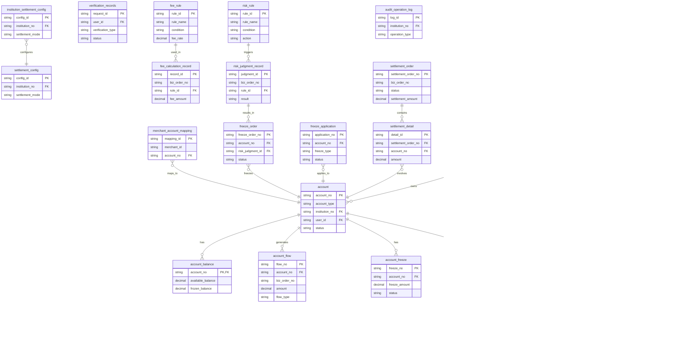

# DocuFlow-AI Project - 软件设计文档
生成时间: 2026-01-22 16:20:56

## 目录
1. [概述说明](#1-概述说明)
   - 1.1 [术语与缩略词](#11-术语与缩略词)
2. [系统设计](#2-系统设计)
3. [模块设计](#3-模块设计)
   - 3.1 [业务核心](#module-1)
   - 3.2 [账务核心](#module-2)
   - 3.3 [计费中台](#module-3)
   - 3.4 [认证系统](#module-4)
   - 3.5 [账户系统](#module-5)
   - 3.6 [电子签约平台](#module-6)
   - 3.7 [清结算](#module-7)
   - 3.8 [行业钱包](#module-8)
   - 3.9 [风控](#module-9)
   - 3.10 [三代](#module-10)
   - 3.11 [对账单系统](#module-11)
4. [接口设计](#4-接口设计)
5. [数据库设计](#5-数据库设计)

---
# 1 概述说明

## 1.1 术语与缩略词

## 业务实体

- **天财**: 提出分账、会员结算、批量付款需求的业务平台方，负责发起开户、分账等指令。
- **天财收款账户** (别名: 天财专用账户, 天财专用收款账户): 为收单商户开立的专用账户，支持转账、分账给其他天财账户以及提现，分为总部和门店角色。
- **天财接收方账户** (别名: 接收方账户): 为非收单商户或个人开立的专用账户，仅支持提现，可作为分账的接收方。
- **收单商户** (别名: 拉卡拉收单商户): 通过拉卡拉进行收款交易的商户，分为企业或个体类型，可开通天财收款账户。
- **非收单商户** (别名: 一般接收方): 不通过拉卡拉进行收款交易，但可作为资金接收方的商户或个人。
- **总部** (别名: 品牌, 总店): 在品牌架构中处于上层，负责对下属门店进行资金归集、分账管理的主体，角色类型之一。
- **门店**: 隶属于某个总部，进行实际经营，可作为资金付方或收方的主体，角色类型之一。
- **待结算账户** (别名: 01待结算账户): 用于暂存未结算交易资金的账户，类型标识为01账户。
- **退货账户** (别名: 04退货账户): 用于处理退货资金的专用账户，类型标识为04账户。

## 系统角色/参与者

- **三代**: 支付系统中的一个重要角色或系统模块，负责处理开户审核、配置结算模式、同步账户信息等。
- **行业钱包** (别名: 钱包系统): 负责处理用户ID生成、账户开户、关系绑定、分账请求校验等核心钱包业务的系统。
- **清结算** (别名: 清结算/计费中台): 负责资金清算、结算、计费、冻结申请处理及推送结算结果的系统模块。
- **账户系统** (别名: 账户域, 账户): 负责账户的底层开户、余额管理、资金扣减/增加、冻结等核心账户操作的系统。
- **账务核心** (别名: 账务, 账务域): 负责记录所有资金变动的会计分录和记账的系统。
- **电子签约平台** (别名: 电子签章系统): 提供协议模板、短信推送、H5页面、并集成打款/人脸验证以完成电子协议签署的系统。
- **计费中台**: 负责计算并生成转账、分账等业务手续费的系统。
- **对账单系统**: 负责生成和提供各类账户动账明细、交易明细等对账文件的系统。
- **业务核心**: 接收并处理天财分账等交易数据的系统。
- **风控**: 负责判定交易或商户风险，并发起冻结指令的系统或角色。

## 领域特定术语

- **机构号** (别名: 二级机构号): 由三代运营分配给天财或其下属商户的唯一标识，用于区分不同业务机构。
- **APPID**: 由ISV或开放平台分配的应用标识，用于识别调用方。
- **主动结算**: 一种结算模式，资金会主动结算到商户指定的收款账户（如天财收款账户）。
- **被动结算**: 一种结算模式，资金结算路径由系统默认决定，商户不主动指定。
- **对账单**: 按日生成的，记录交易、结算、账户动账等明细的文件，用于机构对账。

## 关键流程/工作流名称

- **分账** (别名: 天财分账, 转账): 从天财收款账户向其他天财收款账户或天财接收方账户进行资金划转的业务操作。
- **归集** (别名: 资金归集): 将下属门店的资金汇总到总部的资金操作场景，是分账的一种业务类型。
- **会员结算**: 用户支付后，资金先到品牌侧，再按规则分账到门店的业务场景。
- **批量付款** (别名: 批付): 从总部账户向多个入驻方或合作方进行批量资金支付的业务场景。
- **关系绑定** (别名: 绑定关系): 在归集、批量付款、会员结算等场景下，建立付方与收方授权关系的流程，包含签约与认证。
- **开通付款**: 在批量付款和会员结算场景下，付方（总部/门店）需要先完成的签约与认证流程，以获得付款权限。
- **打款验证** (别名: 小额打款验证): 通过向指定银行卡打入随机小额款项并验证回填金额，以确认银行卡有效性和持有人身份的认证方式。
- **人脸验证**: 通过比对姓名、身份证和人脸信息，以确认个人身份一致性的认证方式。
- **交易冻结**: 风控判定交易存在风险后，对已结算至账户的资金进行冻结的流程。
- **商户冻结**: 风控对商户申请冻结，从而冻结其对应的天财收款账户的流程。
- **退货前置**: 退货流程中，在正式扣款前查询并校验终点账户余额的环节。
- **提现** (别名: 提款): 从天财收款账户或天财接收方账户将资金提款至绑定银行卡的实时操作。

---
# 2 系统设计
## 2.1 系统结构
本系统采用分层架构，旨在为"天财"业务平台提供分账、会员结算、批量付款等资金处理能力。整体架构分为接入层、业务层、核心服务层和基础服务层，各层职责清晰，通过API进行松耦合交互。

- **接入层**：接收来自天财平台的业务请求，进行协议转换、路由和初步校验。
- **业务层**：包含"业务核心"模块，作为业务流程的编排中心，负责协调下游服务完成复杂的业务逻辑，如分账、结算、关系绑定等。
- **核心服务层**：包含处理核心领域能力的模块，如"行业钱包"（用户与账户关系）、"清结算"（资金结算与冻结）、"账户系统"（资金操作）、"账务核心"（账务记录）。
- **基础服务层**：提供通用能力支撑，如"计费中台"（手续费计算）、"电子签约平台"（协议签署）、"认证系统"（身份验证）、"风控"（风险控制）、"对账单系统"（对账文件生成）。

系统架构图如下：

## 2.2 功能结构
系统功能围绕"天财"资金业务展开，主要划分为账户管理、资金处理、业务支撑、风险与对账四大功能域。

- **账户管理域**：负责商户与账户的生命周期管理，包括开户、信息同步、关系绑定与授权。
- **资金处理域**：负责核心的资金流转操作，包括分账、结算、归集、批量付款、提现及相关的计费处理。
- **业务支撑域**：为业务流程提供必要的通用服务，包括身份认证、电子签约、商户审核与配置。
- **风险与对账域**：负责系统风险控制及事后的账务核对，包括交易/商户冻结、对账单生成。

功能结构图如下：

## 2.3 网络拓扑图
TBD

## 2.4 数据流转
系统内关键业务数据（如交易请求、账户指令、账务记录）在模块间按特定顺序流转，以完成一个完整的业务闭环。以"分账"业务为例，数据流转主要经过业务受理、业务校验、资金结算、账务记录四个阶段。

1.  **业务受理**：天财平台发起请求至业务核心。
2.  **业务校验**：业务核心调用行业钱包进行业务规则校验。
3.  **资金结算**：业务核心或行业钱包驱动清结算流程，清结算协调计费中台计算手续费，并调用账户系统完成资金划转。
4.  **账务记录**：账户系统调用账务核心记录资金变动分录。最终，对账单系统从各数据源拉取数据生成对账文件。

数据流图如下：

## 2.5 系统模块交互关系
各系统模块通过API调用、事件通知等方式进行协作，形成清晰的依赖关系。业务核心作为主要协调者，行业钱包、清结算、账户系统作为核心领域服务，其他模块提供专项能力支撑。

关键交互关系包括：
- **业务核心**：作为总协调者，依赖行业钱包、清结算、计费中台、账户系统、三代等完成业务流程。
- **行业钱包**：依赖账户系统进行开户，依赖电子签约平台完成关系绑定。
- **清结算**：依赖计费中台计算费用，依赖账户系统操作资金，依赖账务核心完成记账。
- **账户系统**：是资金操作的执行者，最终依赖账务核心记录所有变动。
- **风控**：依赖清结算和账户系统执行冻结操作。
- **对账单系统**：依赖业务核心、清结算、账务核心提供数据源。

模块交互图如下：

---
# 3 模块设计

## 3.1 业务核心

### 1. 概述
- **目的与范围**: 业务核心模块负责接收并处理来自天财平台的分账等交易数据，作为业务处理的入口和协调中心。其核心职责是接收业务请求，协调下游系统（如行业钱包、清结算、账户系统等）完成资金处理，并返回处理结果。其边界在于处理业务逻辑的流转与协调，不直接处理账户底层操作、清结算计算或风险判定。

### 2. 接口设计
- **API端点 (REST/GraphQL)**: TBD
- **请求/响应结构**: TBD
- **发布/消费的事件**: TBD

### 3. 数据模型
- **表/集合**: TBD
- **关键字段**: TBD
- **与其他模块的关系**: 业务核心模块处理的数据与天财、行业钱包、清结算等模块的业务状态紧密相关，但具体的数据库表关联关系TBD。

### 4. 业务逻辑
- **核心工作流/算法**: 主要业务流程是处理"天财分账"请求。模块接收分账指令后，需协调行业钱包进行分账请求校验，调用计费中台计算手续费，通过清结算发起结算，并最终驱动账户系统和账务核心完成资金划转与记账。模块需维护一个核心业务订单状态机，以管理请求的整个生命周期。
- **业务规则与验证**: 业务核心自身主要负责请求的格式、基础参数校验。更深层次的业务规则（如账户状态、余额、关系授权）校验由下游模块（如行业钱包）负责。
- **关键边界情况处理**: 在处理流程中，需处理下游系统调用失败、超时等异常情况，确保事务一致性或发起冲正。需处理清结算结果推送的异步回调，更新业务状态。所有关键接口需支持幂等性处理，防止重复请求导致资金风险。
- **协调逻辑说明**: 对下游模块的调用采用同步与异步结合的模式。对行业钱包的校验、计费中台的手续费计算采用同步调用。对清结算的结算申请采用同步调用发起，但结算结果通过异步消息回调通知。模块需维护请求状态，并处理回调超时等异常。

### 5. 时序图

### 6. 错误处理
- **预期错误情况**: 可能的错误类型包括：请求参数非法、下游服务（行业钱包、清结算等）不可用、下游服务返回业务失败（如余额不足、账户状态异常）、网络超时、异步结果回调超时等。
- **处理策略**: 对于参数错误，直接返回客户端错误。对于下游服务不可用或超时，进行有限次重试或熔断降级，并返回系统繁忙。对于业务失败，将下游错误码和原因透传给调用方。对于关键资金操作，需设计补偿或冲正机制，防止数据不一致。异步回调超时需有主动查询或对账机制确保最终一致性。
- **幂等性保证**: 通过业务唯一请求号进行幂等控制，避免重复处理。

### 7. 依赖关系
- **上游模块**: 天财（业务请求来源）。
- **下游模块**: 行业钱包（分账校验）、清结算（资金清算与结算驱动）、计费中台（手续费计算）、账户系统（资金操作）、账务核心（记账）。

## 3.2 账务核心

### 1. 概述
- **目的与范围**: 本模块负责记录所有资金变动的会计分录和记账，是资金流转的最终记录层。其核心职责是接收来自上游系统（如账户系统、清结算）的资金操作指令，生成准确、完整的会计流水，确保账务数据的一致性和可追溯性。其边界在于处理记账请求、维护账务流水，不涉及账户余额的直接管理或业务逻辑的校验。

### 2. 接口设计
- **API端点 (REST)**: TBD
    - 示例：`POST /api/v1/accounting/entries` 用于接收记账指令。
- **请求/响应结构**: TBD
    - 请求体应包含：业务流水号、机构号、业务类型（分账/归集/会员结算/提现等）、账户信息（付方账户、收方账户）、金额、幂等键等。
    - 响应体应包含：处理状态、账务流水号、错误码（如有）。
- **发布/消费的事件**: TBD
    - 消费来自"清结算"的结算完成事件，触发记账。
    - 消费来自"账户系统"的余额变动事件，触发记账。
    - 发布账务记录完成事件，供"对账单系统"消费。

### 3. 数据模型
- **表/集合**: TBD
    - 核心账务流水表（accounting_ledger）
- **关键字段**: TBD
    - 账务流水号、机构号、业务流水号、业务类型（分账/归集/会员结算/提现/冻结等）、付方账户号、付方账户类型（01/04/天财收款账户等）、收方账户号、收方账户类型、借贷方向、金额、关联账户类型、时间戳（创建、更新）、幂等键、对账标识。
- **与其他模块的关系**: 本模块的账务流水记录与账户系统的账户余额变动、清结算系统的结算结果、业务核心的交易数据存在强关联，通过业务流水号、账户号等关键字段进行关联追溯。

### 4. 业务逻辑
- **核心工作流/算法**: 接收记账请求，根据借贷记账法规则，将一笔业务资金变动拆分为一条或多条借贷平衡的会计分录，并持久化存储。
    - **分账/归集**: 付方账户（天财收款账户）记"贷"，收方账户（天财收款账户或天财接收方账户）记"借"。
    - **会员结算**: 待结算账户（01账户）记"贷"，品牌/门店对应的天财收款账户记"借"。
    - **提现**: 付方账户（天财收款账户或天财接收方账户）记"贷"，系统外部银行账户（或中间过渡账户）记"借"。
    - **退货**: 退货账户（04账户）记"贷"，目标天财收款账户记"借"。
    - **冻结/解冻**: 记录资金状态变更，不改变借贷总额。
- **业务规则与验证**:
    - 确保每笔会计分录的借贷总额相等。
    - 根据业务类型，验证关联账户类型的合法性（如分账的付方必须是天财收款账户）。
    - 通过幂等键（如业务流水号）保证重复请求的幂等性。
- **关键边界情况处理**: 处理重复记账请求的幂等性；在分布式事务场景下，确保账务记录与上游业务状态的一致性。

### 5. 时序图

### 6. 错误处理
- **预期错误情况**: 记账请求数据格式错误；数据库连接或写入失败；生成会计分录时借贷不平衡；账户类型与业务类型不匹配；幂等键冲突。
- **处理策略**: 对格式错误立即返回失败；对持久化失败进行重试并告警；对借贷不平衡或业务规则校验失败的请求拒绝处理并记录异常；幂等键冲突时返回已存在的成功结果。

### 7. 依赖关系
- **上游模块**: 账户系统（触发余额变动的记账）、清结算（推送结算结果触发记账）、业务核心（交易数据触发记账）。
- **下游模块**: 对账单系统（依赖账务流水生成对账文件）。

## 3.3 计费中台

### 1. 概述
- **目的与范围**：本模块负责计算并生成转账、分账等业务手续费。其核心职责是接收业务请求，根据预设的计费规则计算应收手续费，并将计费结果通知相关系统。其边界在于仅负责费用的计算与生成，不涉及资金的扣划、账户余额管理或会计分录记录。
- **与清结算模块的关系澄清**：根据术语表，"清结算"是"清结算/计费中台"的别名，这表明清结算与计费中台在概念上可能是一个复合模块或紧密耦合。在本设计中，我们将"计费中台"视为"清结算"大模块中的一个专注于费用计算的子模块或服务。因此，计费中台为清结算流程提供计费结果，是其内部的一个关键环节。

### 2. 接口设计
- **API端点 (REST)**：
    - `POST /api/v1/fee/calculate`：核心计费接口，接收计费请求，返回计费结果。
    - `GET /api/v1/fee/rules/{ruleId}`：查询特定费率规则详情（供管理或调试用）。
- **请求/响应结构**：
    - **计费请求 (CalculateFeeRequest)**:
        - `requestId` (String): 请求唯一标识，用于幂等性控制。
        - `appId` (String): 调用方应用标识。
        - `bizType` (String): 业务类型，如 `SPLIT_ACCOUNT`（分账）、`TRANSFER`（转账）、`BATCH_PAY`（批量付款）。
        - `payerInstitutionNo` (String): 付方机构号。
        - `payeeInstitutionNo` (String): 收方机构号。
        - `amount` (BigDecimal): 交易金额。
        - `currency` (String): 币种，默认CNY。
        - `extInfo` (Map<String, Object>): 扩展信息，用于传递商户类型、交易场景等。
    - **计费响应 (CalculateFeeResponse)**:
        - `code` (String): 响应码。
        - `message` (String): 响应消息。
        - `data` (FeeDetail): 计费明细数据。
    - **计费明细 (FeeDetail)**:
        - `feeRequestId` (String): 计费记录唯一ID，与请求中的`requestId`关联。
        - `calculatedFee` (BigDecimal): 计算出的手续费金额。
        - `currency` (String): 手续费币种。
        - `ruleId` (String): 所应用的费率规则ID。
        - `calculationTime` (Long): 计费时间戳。
- **发布/消费的事件**：
    - **消费事件**: TBD (例如，可能监听来自业务核心的交易创建事件)。
    - **发布事件**: `FeeCalculatedEvent`，事件体包含 `FeeDetail` 核心信息，供清结算等下游模块消费。

### 3. 数据模型
- **表/集合**：
    - **费率规则表 (fee_rule)**：存储可动态配置的计费规则。
        - `rule_id` (PK): 规则唯一标识。
        - `biz_type`: 适用的业务类型。
        - `payer_type`: 付方类型（如总部、门店）。
        - `payee_type`: 收方类型。
        - `fee_calc_mode`: 计费模式（如百分比、固定额、混合）。
        - `fee_rate`: 费率（百分比值）。
        - `fixed_fee`: 固定费用。
        - `min_fee`: 最低手续费。
        - `max_fee`: 最高手续费。
        - `effective_start`: 规则生效开始时间。
        - `effective_end`: 规则生效结束时间。
        - `status`: 规则状态（启用/禁用）。
    - **计费记录表 (fee_calculation_record)**：记录每一次计费请求和结果，用于对账、审计和幂等。
        - `fee_request_id` (PK): 计费请求ID，具有唯一约束。
        - `original_request_id`: 原始业务请求ID。
        - `app_id`: 调用方APPID。
        - `biz_type`: 业务类型。
        - `payer_inst_no`: 付方机构号。
        - `payee_inst_no`: 收方机构号。
        - `transaction_amount`: 交易金额。
        - `calculated_fee`: 计算出的手续费。
        - `currency`: 币种。
        - `applied_rule_id`: 应用的规则ID。
        - `calculation_status`: 计算状态（成功/失败）。
        - `error_msg`: 失败时的错误信息。
        - `created_at`: 记录创建时间。
- **与其他模块的关系**：本模块生成的计费结果（通过事件或API响应）需要提供给**清结算**模块，用于后续的资金清算与结算处理。计费记录可供**对账单系统**生成费用明细。

### 4. 业务逻辑
- **核心工作流/算法**：
    1. **请求接收与验证**：接收计费请求，校验必填字段（`requestId`, `bizType`, `amount`等）的完整性与合法性（如金额需为正数）。
    2. **幂等性检查**：以 `requestId` 为键，查询`fee_calculation_record`表。若已存在成功记录，则直接返回历史结果；若存在失败记录，根据策略决定是重试还是报错。
    3. **费率规则匹配**：根据 `bizType`、`payerInstitutionNo`、`payeeInstitutionNo` 以及请求中的扩展信息（如商户类型），结合当前时间，查询 `fee_rule` 表，匹配优先级最高（如最具体）的生效规则。
    4. **手续费计算**：根据匹配到的规则中的 `fee_calc_mode`、`fee_rate`、`fixed_fee` 等参数，结合交易 `amount`，计算出手续费。应用 `min_fee` 和 `max_fee` 进行封顶保底处理。
    5. **结果持久化与发布**：将计费请求、结果、所用规则ID持久化到 `fee_calculation_record` 表。发布 `FeeCalculatedEvent` 事件。
    6. **响应**：向调用方返回计费结果。
- **业务规则与验证**：
    - 计费规则支持基于多维度（业务类型、参与方身份、时间）的精细化配置。
    - 验证失败（如无匹配规则、参数非法）应立即失败，阻止交易继续，并返回明确错误码。
- **关键边界情况处理**：
    - **无匹配规则**：视为配置错误，返回"费率规则未配置"错误。
    - **外部依赖（如规则库）不可用**：可降级使用本地缓存的最新规则；若缓存也无数据，则快速失败，避免计算错误费用。
    - **数据一致性**：通过"先持久化记录，后发布事件"的顺序，并在事件发布环节采用可靠消息投递机制（如本地事务消息表），确保下游系统至少能最终一致性消费到计费结果。

### 5. 时序图

### 6. 错误处理
- **预期错误情况**：
    1. **计费规则配置缺失或无效**：无匹配的生效规则。
    2. **请求参数不合法**：如金额为负、必填字段为空、格式错误。
    3. **幂等冲突**：重复的 `requestId` 但业务参数不一致。
    4. **系统依赖异常**：数据库连接失败、缓存服务不可用。
- **处理策略**：
    - 对于错误1和2，立即失败，返回具体的业务错误码和提示，阻断交易。
    - 对于错误3，记录告警，并返回"重复请求"错误，提示调用方检查。
    - 对于错误4，进行服务降级（如使用缓存规则）或快速失败，具体策略根据配置决定。所有系统异常均需记录详细日志并告警。

### 7. 依赖关系
- **上游模块/调用方**：
    - **业务核心**：在发起分账、转账等交易前，调用计费中台计算手续费。
    - **清结算**：在清算处理过程中，可能直接调用计费中台进行费用计算。
- **下游模块/消费者**：
    - **清结算**：作为核心下游，消费 `FeeCalculatedEvent`，将手续费结果纳入清算与结算流程。
    - **对账单系统**：读取 `fee_calculation_record` 数据，生成费用明细对账单。
- **外部依赖**：
    - **数据库**：用于存储费率规则和计费记录。
    - **缓存服务**：用于缓存热点费率规则，提升查询性能与可用性。
    - **消息中间件**：用于可靠地发布计费结果事件。

## 3.4 认证系统

### 1. 概述
- **目的与范围**: 本模块负责在关系绑定、开通付款等业务流程中，对参与方（如总部、门店、个人）进行身份与授权验证。核心职责包括管理打款验证、人脸验证等认证流程，并记录认证结果，为分账、归集、会员结算等业务提供身份核验支持。其边界止于认证行为的发起、执行与结果记录，不涉及具体的电子签约协议生成（协议生成由电子签约平台负责），但会为包含人脸验证的签约流程提供验证服务。不涉及账户资金操作。

### 2. 接口设计
- **API端点 (REST/GraphQL)**:
    - `POST /api/v1/verification/payment`: 发起打款验证请求。
    - `POST /api/v1/verification/payment/confirm`: 提交并验证回填金额。
    - `POST /api/v1/verification/face`: 发起人脸验证请求。
    - `GET /api/v1/verification/{request_id}`: 查询认证结果。
- **请求/响应结构**:
    - 发起打款验证请求 (`POST /api/v1/verification/payment`)
        - 请求体: `{"user_id": "string", "bank_card_no": "string", "bank_name": "string", "business_scene": "string"}`
        - 响应体: `{"request_id": "string", "status": "PROCESSING"}`
    - 提交打款验证 (`POST /api/v1/verification/payment/confirm`)
        - 请求体: `{"request_id": "string", "amount": "string"}`
        - 响应体: `{"request_id": "string", "status": "SUCCESS/FAILED", "result_code": "string"}`
    - 发起人脸验证请求 (`POST /api/v1/verification/face`)
        - 请求体: `{"user_id": "string", "id_card_no": "string", "name": "string", "face_image_data": "string", "business_scene": "string"}`
        - 响应体: `{"request_id": "string", "status": "PROCESSING"}`
- **发布/消费的事件**:
    - 发布事件: `VerificationCompletedEvent` (事件内容: `request_id`, `user_id`, `verification_type`, `result`, `timestamp`)。
    - 消费事件: TBD。

### 3. 数据模型
- **表/集合**:
    - `verification_records` (认证记录表)
- **关键字段**:
    - `request_id` (主键): 认证请求唯一标识。
    - `user_id`: 用户标识。
    - `verification_type`: 认证类型 (PAYMENT, FACE)。
    - `status`: 状态 (INIT, PROCESSING, SUCCESS, FAILED)。
    - `result`: 认证结果 (PASS, REJECT)。
    - `external_ref_id`: 外部关联ID (如银行打款流水号、第三方人脸请求ID)。
    - `request_data`: 请求数据 (JSON格式，存储银行卡号、身份证号等)。
    - `response_data`: 响应数据 (JSON格式，存储第三方服务返回的原始结果)。
    - `created_at`: 创建时间。
    - `updated_at`: 更新时间。
- **与其他模块的关系**: 本模块为**电子签约平台**提供人脸验证服务调用。认证结果记录被**行业钱包**、**业务核心**等模块查询或通过事件订阅，用于判断是否允许进行关系绑定或付款操作。

### 4. 业务逻辑
- **核心工作流/算法**:
    1.  **打款验证流程**：系统向待验证的银行卡打入随机小额款项，用户回填金额，系统校验金额正确性以确认银行卡有效及持有人身份。
    2.  **人脸验证流程**：系统接收由上游（如电子签约平台）提供的用户姓名、身份证信息及人脸图像，调用第三方人脸比对服务进行比对，确认身份信息的一致性。
- **业务规则与验证**:
    - 在关系绑定、开通付款等场景下，根据业务规则和参与方类型，触发相应的认证流程。
    - 验证打款回填金额的准确性。
    - 调用第三方服务校验人脸信息与身份信息的匹配度。
- **关键边界情况处理**:
    - 打款失败或超时未到账的处理：记录失败原因，通知上游业务方，允许重新发起。
    - 用户多次回填错误金额的处理：设置最大重试次数（如3次），超过后标记验证失败。
    - 人脸比对失败或质量过低的重试与降级策略：可允许用户重新采集人脸图像重试。降级策略为：在特定业务场景下，若人脸验证连续失败，可触发人工审核流程作为兜底。

### 5. 时序图

#### 打款验证流程

#### 人脸验证流程

### 6. 错误处理
- **预期错误情况**:
    - `ERR_BANK_PAYMENT_FAILED`: 银行卡信息错误或通道异常导致打款失败。
    - `ERR_AMOUNT_MISMATCH`: 用户回填金额错误。
    - `ERR_FACE_SERVICE_UNAVAILABLE`: 人脸采集或比对服务异常。
    - `ERR_NETWORK_TIMEOUT`: 与电子签约平台或银行通道的网络超时。
    - `ERR_IDENTITY_VERIFY_FAILED`: 人脸比对失败或身份信息不匹配。
- **处理策略**:
    - 对可重试的错误（如网络超时、第三方服务暂时不可用）进行有限次重试（最多3次，指数退避）。
    - 记录详细的错误日志，包含`request_id`和错误上下文，便于问题追踪。
    - 向调用方返回明确的错误码(`result_code`)和提示信息。
    - 对于认证失败，根据业务规则决定是否允许用户重试，并明确告知用户剩余重试次数。

### 7. 依赖关系
- **上游模块**:
    - **业务核心**/**行业钱包**: 在需要认证的流程中发起认证请求。
    - **电子签约平台**: 在集成人脸验证的签约流程中调用本模块。
- **下游模块**:
    - **银行通道**: 依赖其执行小额打款操作。
    - **第三方人脸比对服务**: 依赖其进行人脸识别（外部服务）。

## 3.5 账户系统

### 1. 概述
- **目的与范围**: 本模块负责账户的底层开户、余额管理、资金扣减/增加、冻结等核心账户操作。其核心职责是管理各类账户（如天财收款账户、天财接收方账户、待结算账户、退货账户）的生命周期和资金状态，为上层业务（如分账、归集、提现）提供原子化的资金操作能力。其边界在于处理账户的创建、查询、余额变动和状态变更，不涉及业务逻辑校验（如分账关系）和会计分录记录。

### 2. 接口设计
- **API端点 (REST)**: TBD
    - 示例：`POST /api/v1/accounts` 用于开户。
    - 示例：`POST /api/v1/accounts/{accountNo}/balance/operate` 用于资金操作。
    - 示例：`POST /api/v1/accounts/{accountNo}/freeze` 用于冻结/解冻。
- **请求/响应结构**: TBD
    - 资金操作请求体应包含：业务流水号、操作类型（增加/扣减）、金额、关联账户信息、幂等键等。
    - 开户请求体应包含：机构号、账户类型（天财收款账户/天财接收方账户等）、角色（总部/门店）、关联商户信息等。
- **发布/消费的事件**: TBD
    - 消费来自"行业钱包"的开户指令，完成底层账户创建。
    - 消费来自"清结算"的结算指令，执行账户余额增加或扣减。
    - 消费来自"风控"的冻结指令，执行账户资金冻结/解冻。
    - 发布账户余额变动事件，供"账务核心"消费以触发记账。
    - 发布账户状态变更事件，供相关系统感知。

### 3. 数据模型
- **表/集合**: TBD
    - 账户主表（account）
    - 账户余额表（account_balance）
    - 账户流水表（account_flow）
    - 账户冻结记录表（account_freeze）
- **关键字段**: TBD
    - 账户主表：账户号、机构号、账户类型（天财收款账户/天财接收方账户/01待结算账户/04退货账户）、角色（总部/门店）、状态（正常/冻结/注销）、关联商户ID、创建时间。
    - 账户余额表：账户号、可用余额、冻结余额、总余额。
    - 账户流水表：流水号、账户号、业务流水号、变动前余额、变动金额、变动后余额、变动类型（增加/扣减/冻结/解冻）、关联账户、时间戳。
    - 账户冻结记录表：冻结流水号、账户号、冻结金额、解冻金额、冻结状态、关联风控指令号。
- **与其他模块的关系**: 本模块的账户号与"行业钱包"的用户ID关联；账户流水与"账务核心"的会计分录通过业务流水号关联；账户状态与"风控"的指令关联。

### 4. 业务逻辑
- **核心工作流/算法**:
    - **开户流程**: 接收开户请求，根据账户类型和角色创建账户记录，初始化余额为0。
    - **资金操作流程**: 接收资金操作指令（如增加、扣减），校验账户状态和余额充足性（针对扣减和冻结），以事务方式更新账户余额并记录流水。
    - **冻结/解冻流程**: 接收冻结指令，将账户部分或全部可用余额转入冻结余额；接收解冻指令，执行反向操作。
- **业务规则与验证**:
    - 扣减或冻结操作前，必须校验账户可用余额是否充足。
    - 资金操作必须保证幂等性，通过业务流水号实现。
    - 根据账户类型限制操作：天财收款账户支持转账、分账、提现；天财接收方账户仅支持提现；待结算账户和退货账户仅接受系统内部划拨。
    - 状态为"冻结"或"注销"的账户禁止进行资金出账操作。
- **关键边界情况处理**: 处理并发资金操作时的余额一致性（通过数据库事务或乐观锁）；处理重复请求的幂等性；在分布式场景下，确保账户流水与余额变动的最终一致性。

### 5. 时序图

### 6. 错误处理
- **预期错误情况**: 开户请求数据不完整或格式错误；账户不存在或状态异常（冻结、注销）；扣减或冻结时余额不足；数据库操作失败（连接超时、死锁）；幂等键冲突。
- **处理策略**: 对参数错误立即返回失败；对余额不足的请求拒绝操作；对数据库操作失败进行有限次重试并告警；幂等键冲突时返回已存在的成功结果；所有失败均需记录详细日志。

### 7. 依赖关系
- **上游模块**: 行业钱包（提供开户指令）、清结算（提供结算指令）、风控（提供冻结指令）。
- **下游模块**: 账务核心（消费账户余额变动事件以记账）。

## 3.6 电子签约平台

### 1. 概述
- **目的与范围**: 本模块负责提供协议模板、短信推送、H5页面，并集成打款/人脸验证以完成电子协议签署。核心职责是为关系绑定、开通付款等业务流程提供电子签约能力，确保签约过程的合法性与可追溯性。其边界止于协议生成、签署流程引导、验证集成与签署结果记录，不涉及具体的资金操作或账户管理。

### 2. 接口设计
- **API端点 (REST/GraphQL)**:
    - `POST /api/v1/sign/initiate`: 发起签约流程。
    - `GET /api/v1/sign/status/{signing_id}`: 查询签约状态。
    - `GET /api/v1/sign/contract/{signing_id}`: 获取已签署协议内容。
- **请求/响应结构**:
    - 发起签约 (`POST /api/v1/sign/initiate`)
        - 请求体: `{"business_scene": "string", "parties": [{"user_id": "string", "party_type": "HEADQUARTERS/STORE/INDIVIDUAL"}], "template_id": "string"}`
        - 响应体: `{"signing_id": "string", "h5_link": "string", "expires_at": "timestamp"}`
    - 查询状态 (`GET /api/v1/sign/status/{signing_id}`)
        - 响应体: `{"signing_id": "string", "status": "PENDING/SIGNED/EXPIRED/FAILED", "signed_at": "timestamp", "verification_status": "string"}`
- **发布/消费的事件**:
    - 发布事件: `SigningCompletedEvent` (事件内容: `signing_id`, `business_scene`, `parties`, `status`, `signed_at`)。
    - 消费事件: TBD。

### 3. 数据模型
- **表/集合**:
    - `signing_contracts` (签约记录表)
    - `protocol_templates` (协议模板表)
- **关键字段**:
    - `signing_contracts` 表:
        - `signing_id` (主键): 签约流程唯一标识。
        - `template_id`: 使用的协议模板ID。
        - `template_version`: 协议模板版本号。
        - `parties`: 签约参与方信息 (JSON格式)。
        - `business_scene`: 业务场景 (如 RELATION_BINDING, PAYMENT_ENABLE)。
        - `status`: 状态 (PENDING, SIGNED, EXPIRED, FAILED)。
        - `h5_link`: 签约H5页面链接。
        - `link_expires_at`: 链接过期时间。
        - `verification_request_id`: 关联的认证系统请求ID。
        - `signed_at`: 签署完成时间。
        - `signed_content`: 签署时的协议内容快照 (JSON/文本)。
        - `created_at`: 创建时间。
        - `updated_at`: 更新时间。
    - `protocol_templates` 表:
        - `template_id` (主键): 模板唯一标识。
        - `template_name`: 模板名称。
        - `version`: 当前版本号。
        - `content`: 协议模板内容。
        - `business_scene`: 适用的业务场景。
        - `party_type`: 适用的签约方主体类型 (HEADQUARTERS, STORE, INDIVIDUAL)。
        - `is_active`: 是否启用。
        - `created_at`: 创建时间。
        - `updated_at`: 更新时间。
- **与其他模块的关系**: 本模块在签约流程中需要调用**认证系统**的人脸验证服务。生成的签约记录可能被**行业钱包**、**业务核心**等模块查询，用于判断关系绑定或开通付款的授权状态。

### 4. 业务逻辑
- **核心工作流/算法**:
    1.  **签约流程**：根据业务场景（如关系绑定、开通付款）选择协议模板，生成签约H5页面链接，通过短信推送给签约方。签约方在H5页面完成身份信息填写，并根据要求完成打款验证或人脸验证，最终完成协议签署。
    2.  **验证集成**：在签约流程中，根据参与方类型（如个人、企业）和业务规则，嵌入并调用**认证系统**的打款验证或人脸验证流程，验证通过后方可完成签署。
    3.  **模板管理**：协议模板按业务场景和签约方主体类型进行管理。模板内容变更时，需创建新版本并更新`version`字段，确保已发起的签约流程使用发起时的模板版本，新签约流程使用最新生效版本。
    4.  **签约ID与H5链接生成**：发起签约时，系统生成全局唯一的`signing_id`，并基于此ID生成带有签名的H5页面链接。链接需设置有效期（如24小时），过期后无法访问。
- **业务规则与验证**:
    - 根据业务场景和签约方主体类型（总部、门店、个人）匹配并渲染对应的协议模板。
    - 在签约流程中强制集成身份验证环节，验证不通过则无法完成签署。
    - 记录完整的签约过程，包括协议内容、签署方信息、验证结果和时间戳。
    - 协议模板版本更新时，不影响已生成但未签署的签约流程，这些流程继续使用旧版本模板内容。
- **关键边界情况处理**:
    - 签约链接过期或失效的处理：设置链接有效期，过期后需上游模块重新发起签约。
    - 签约过程中验证失败的处理：引导用户重新进行验证，或根据业务规则终止流程。
    - 协议内容发生变更的处理：在`protocol_templates`表中创建新版本协议，并更新`is_active`状态。确保已签署的旧协议版本不被覆盖。

### 5. 时序图

#### 集成人脸验证的签约流程

### 6. 错误处理
- **预期错误情况**:
    - `ERR_TEMPLATE_NOT_FOUND`: 协议模板不存在。
    - `ERR_SMS_SEND_FAILED`: 签约短信发送失败。
    - `ERR_VERIFICATION_FAILED`: 集成的人脸或打款验证失败。
    - `ERR_SIGN_EXPIRED`: 签约链接或会话已过期。
    - `ERR_NETWORK_TIMEOUT`: 与认证系统或短信通道交互超时。
- **处理策略**:
    - 对第三方服务（短信、认证）的调用失败进行有限次重试（如3次）。
    - 向发起签约的上游模块（行业钱包或业务核心）返回明确的错误信息，便于其进行流程控制（如重发签约）。
    - 记录详细的错误日志，包含签约ID、参与方信息等上下文。
    - 对于用户操作超时，提供重新进入或重新发起的入口。

### 7. 依赖关系
- **上游模块**:
    - **行业钱包**: 在关系绑定等场景下发起签约流程。
    - **业务核心**: 在开通付款等场景下发起签约流程。
- **下游模块**:
    - **认证系统**: 依赖其提供人脸验证和打款验证服务。
    - **短信通道**: 依赖其发送签约通知短信（外部服务）。

## 3.7 清结算

### 1. 概述
- **目的与范围**: 本模块负责资金清算、结算、计费、冻结申请处理及推送结算结果。其核心职责是处理来自业务核心的交易数据，协调计费中台完成手续费计算，驱动账户系统完成资金划转，并最终将结算结果通知账务核心进行记账。其边界在于处理结算指令的生成、执行与结果同步，不直接管理账户余额，也不处理业务逻辑（如分账关系）的校验。根据术语表，"清结算"是"清结算/计费中台"的别名，在本设计中，计费中台被视为清结算模块内部的一个关键子服务或组件，负责提供手续费计算能力。

### 2. 接口设计
- **API端点 (REST)**: TBD
    - 示例：`POST /api/v1/settlement/process` 用于触发结算处理。
    - 示例：`POST /api/v1/settlement/freeze/apply` 用于处理冻结申请。
- **请求/响应结构**: TBD
    - 结算处理请求体可能包含：业务流水号、业务类型（分账/会员结算等）、参与方信息、金额等。
    - 冻结申请请求体可能包含：冻结指令号、账户号、冻结金额、风控指令号等。
- **发布/消费的事件**:
    - 消费来自"业务核心"的交易数据或结算指令。
    - 消费来自"计费中台"的计费结果事件（`FeeCalculatedEvent`）。
    - 发布结算完成事件（`SettlementCompletedEvent`），供"账务核心"消费以触发记账。
    - 发布账户操作指令事件（`AccountOperationCommand`），供"账户系统"消费以执行资金操作。
    - 接收并处理来自"风控"的冻结申请事件。

### 3. 数据模型
- **表/集合**: TBD
    - 结算订单表（`settlement_order`）
    - 结算明细表（`settlement_detail`）
    - 冻结申请记录表（`freeze_application`）
- **关键字段**: TBD
    - 结算订单表：结算单号、业务流水号、业务类型（分账/归集/会员结算/批量付款）、总金额、手续费金额、结算状态（待处理/结算中/成功/失败）、参与方机构号、创建时间。
    - 结算明细表：明细ID、结算单号、付方账户号、收方账户号、结算金额、账户类型、状态。
    - 冻结申请记录表：申请ID、风控指令号、目标账户号、申请冻结金额、处理状态（待处理/已发送/成功/失败）、创建时间。
- **与其他模块的关系**: 本模块的结算单与"业务核心"的交易数据通过业务流水号关联；结算明细中的账户号与"账户系统"关联；结算结果与"账务核心"的会计分录关联；冻结申请与"风控"指令关联。

### 4. 业务逻辑
- **核心工作流/算法**:
    1.  **结算流程**:
        - 接收业务核心的结算指令或交易数据。
        - 调用"计费中台"计算手续费（或消费其事件）。
        - 生成结算订单和明细，状态为"待处理"。
        - 根据业务类型（如分账、会员结算）和结算模式（主动/被动），构造资金划转指令。
        - 向"账户系统"发送资金操作指令（扣减付方，增加收方）。
        - 接收账户系统操作结果，更新结算状态。
        - 发布"结算完成事件"通知"账务核心"记账。
    2.  **冻结申请处理流程**:
        - 接收来自"风控"的冻结申请。
        - 记录冻结申请，状态为"待处理"。
        - 向"账户系统"发送资金冻结指令。
        - 根据账户系统返回结果，更新申请状态并反馈给风控。
- **业务规则与验证**:
    - 结算前需确保业务数据合法且状态可结算。
    - 驱动账户系统进行资金操作前，需明确付方、收方账户及金额。
    - 处理冻结申请时，需校验目标账户是否存在且状态正常。
    - 所有操作需保证幂等性。
- **关键边界情况处理**:
    - 账户系统操作失败（如余额不足）：回滚结算状态，记录失败原因，并可能触发冲正流程。
    - 计费中台服务不可用：可采用降级策略（如使用默认费率）或快速失败。
    - 消息重复消费：通过业务流水号等实现幂等，避免重复结算。
- **幂等性实现**:
    - 在结算流程开始时，根据业务流水号检查是否已存在处理中的结算单。若存在，则拒绝重复处理或返回已有结果。
    - 所有对外发送的指令（如账户操作指令）均携带幂等键（如业务流水号），确保接收方能正确处理重复请求。
- **事务与补偿机制**:
    - 结算流程涉及多个步骤，采用Saga模式保证最终一致性。
    - 若向账户系统发送扣减指令成功，但增加指令失败，则触发补偿操作，向付方账户执行一笔增加指令以回滚之前的扣减。
    - 补偿操作同样需要保证幂等性。

### 5. 时序图

### 6. 错误处理
- **预期错误情况**: 接收到的业务数据不合法或缺失；计费中台调用失败或返回异常；账户系统操作失败（余额不足、账户状态异常）；数据库操作失败；消息投递失败；补偿操作失败。
- **处理策略**:
    - 对业务数据错误立即返回失败。
    - 对依赖服务（计费中台、账户系统）的临时故障进行有限次重试。
    - 对账户余额不足等业务性失败，终止流程并记录明确失败原因，触发相应的补偿流程。
    - 所有失败均需记录详细日志并告警。
    - 通过Saga模式与补偿机制确保跨系统操作的最终一致性。
    - 监控补偿操作的执行状态，对于补偿失败的情况进行告警并人工介入。

### 7. 依赖关系
- **上游模块**:
    - 业务核心：提供结算指令与原始交易数据。
    - 计费中台：作为内部子服务，提供手续费计算结果。
    - 风控：发起冻结申请指令。
- **下游模块**:
    - 账户系统：消费本模块发出的资金操作指令（扣减、增加、冻结），并返回操作结果。
    - 账务核心：消费本模块发布的结算完成事件，进行会计分录记账。

## 3.8 行业钱包

### 1. 概述
- **目的与范围**: 本模块负责处理用户ID生成、账户开户、关系绑定、分账请求校验等核心钱包业务的系统。其核心职责是管理天财收款账户与天财接收方账户的开户流程，建立并维护业务场景（如归集、批量付款、会员结算）下的授权关系，并对分账等资金操作请求进行业务层面的校验。其边界在于处理钱包层面的业务逻辑，驱动账户系统完成底层账户开户，但不直接进行底层资金操作和清结算计算。

### 2. 接口设计
- **API端点 (REST)**:
    - `POST /api/v1/wallet/users`: 创建钱包用户（开户）。
    - `POST /api/v1/wallet/relations`: 发起关系绑定。
    - `GET /api/v1/wallet/relations/{relation_id}`: 查询关系绑定状态。
    - `POST /api/v1/wallet/validations/split`: 校验分账请求。
    - `PUT /api/v1/wallet/settlement-configs`: 更新结算配置。
- **请求/响应结构**:
    - 创建钱包用户 (`POST /api/v1/wallet/users`):
        - 请求体: `{"institution_no": "string", "merchant_type": "ACQUIRING/NON_ACQUIRING", "role": "HEADQUARTERS/STORE/TBD"}`
        - 响应体: `{"user_id": "string", "account_status": "NORMAL"}`
    - 发起关系绑定 (`POST /api/v1/wallet/relations`):
        - 请求体: `{"payer_user_id": "string", "payee_user_id": "string", "business_scene": "COLLECTION/BATCH_PAY/MEMBER_SETTLEMENT"}`
        - 响应体: `{"relation_id": "string", "signing_id": "string", "h5_link": "string"}`
    - 校验分账请求 (`POST /api/v1/wallet/validations/split`):
        - 请求体: `{"payer_user_id": "string", "payee_user_id": "string", "business_scene": "string", "request_id": "string"}`
        - 响应体: `{"is_valid": boolean, "code": "string", "message": "string"}`
- **发布/消费的事件**:
    - 消费来自**三代**的开户审核结果、结算模式配置、账户信息同步等事件。
    - 消费来自**电子签约平台**的`SigningCompletedEvent`，用于更新关系绑定状态。
    - 发布`WalletUserCreatedEvent`（事件内容: `user_id`, `institution_no`, `account_status`），供下游系统（如业务核心）感知。
    - 发布`AccountRelationStatusChangedEvent`（事件内容: `relation_id`, `payer_user_id`, `payee_user_id`, `old_status`, `new_status`）。

### 3. 数据模型
- **表/集合**:
    - `wallet_user` (钱包用户表)
    - `account_relation` (账户关系表)
    - `settlement_config` (结算配置表)
- **关键字段**:
    - `wallet_user` 表:
        - `user_id` (主键): 钱包用户唯一标识，与账户系统的账户号关联。
        - `institution_no`: 机构号，由三代运营分配给天财或其下属商户的唯一标识。
        - `merchant_type`: 商户类型（ACQUIRING: 收单商户 / NON_ACQUIRING: 非收单商户）。
        - `role`: 角色（HEADQUARTERS: 总部 / STORE: 门店 / TBD）。
        - `account_status`: 账户状态（NORMAL: 正常 / FROZEN: 冻结 / CLOSED: 注销）。
        - `created_at`: 创建时间。
        - `updated_at`: 更新时间。
    - `account_relation` 表:
        - `relation_id` (主键): 关系唯一标识。
        - `payer_user_id`: 付方用户ID，外键关联`wallet_user.user_id`。
        - `payee_user_id`: 收方用户ID，外键关联`wallet_user.user_id`。
        - `business_scene`: 业务场景（COLLECTION: 归集 / BATCH_PAY: 批量付款 / MEMBER_SETTLEMENT: 会员结算）。
        - `signing_id`: 关联的电子签约ID，外键关联电子签约平台的签约记录。
        - `relation_status`: 关系状态（PENDING_SIGN: 待签约 / ACTIVE: 已生效 / INACTIVE: 已失效）。
        - `authorized_at`: 授权生效时间。
        - `created_at`: 创建时间。
        - `updated_at`: 更新时间。
    - `settlement_config` 表:
        - `config_id` (主键): 配置ID。
        - `user_id`: 用户ID，外键关联`wallet_user.user_id`。
        - `settlement_mode`: 结算模式（ACTIVE: 主动结算 / PASSIVE: 被动结算）。
        - `settlement_account`: 指定的结算账户信息（JSON格式）。
        - `effective_date`: 生效日期。
        - `created_at`: 创建时间。
        - `updated_at`: 更新时间。
- **与其他模块的关系**: 本模块的`user_id`与**账户系统**的账户号关联；`signing_id`与**电子签约平台**的签约记录关联；结算配置信息源自**三代**的同步。

### 4. 业务逻辑
- **核心工作流/算法**:
    1.  **开户流程**: 接收来自三代的开户指令或业务触发，生成全局唯一的用户ID（如使用分布式ID生成器），根据商户类型（收单/非收单）确定账户类型，调用账户系统的开户接口完成底层账户开户，记录钱包用户信息，并发布`WalletUserCreatedEvent`。
    2.  **关系绑定流程**: 为归集、批量付款、会员结算等场景建立付方与收方的授权关系。首先校验付方用户是否已完成"开通付款"流程（即其账户状态正常且存在有效的签约记录）。校验通过后，调用电子签约平台发起签约流程，记录关系状态为"待签约"。异步消费`SigningCompletedEvent`，根据签约结果更新关系状态为"已生效"或"已失效"，并发布状态变更事件。处理并发请求时，对同一对`payer_user_id`和`payee_user_id`在特定场景下的关系创建请求进行幂等控制。
    3.  **分账请求校验流程**: 接收业务核心的分账校验请求。校验步骤包括：a) 查询付方与收方账户状态，确保付方为正常状态的天财收款账户，收方为正常状态的天财收款账户或天财接收方账户。b) 查询双方在指定业务场景下是否存在状态为"已生效"的授权关系。c) 校验通过则返回成功，否则返回具体失败原因。此流程需支持高并发，对关键数据查询使用缓存优化。
    4.  **结算模式管理**: 接收并处理三代同步的商户结算模式（主动/被动）及指定的结算账户信息，更新`settlement_config`表。此操作为幂等操作，基于`user_id`和`effective_date`进行更新或插入。
- **业务规则与验证**:
    - 开户时，收单商户可开立天财收款账户，非收单商户可开立天财接收方账户。
    - 建立关系绑定前，付方需已完成"开通付款"流程（即完成签约与认证）。
    - 分账校验时，付方账户必须为正常状态的天财收款账户；收方账户可为天财收款账户或天财接收方账户。
    - 校验资金操作是否在已授权的业务场景和关系范围内。
    - 账户状态变更为"冻结"或"注销"时，需将其所有关联的生效关系状态同步置为"已失效"。
- **关键边界情况处理**:
    - 处理电子签约回调超时或失败：实现状态查询补偿机制，定期轮询电子签约平台获取未最终态的关系绑定状态。
    - 处理并发开户请求时的用户ID生成唯一性：使用分布式唯一ID生成器（如雪花算法）。
    - 关系绑定状态与账户状态联动：如账户冻结，通过监听账户状态变更事件，自动将相关绑定关系状态更新为"已失效"。
    - 异步事件处理保证幂等性：通过事件ID或业务唯一键（如`signing_id`）实现。

### 5. 时序图

### 6. 错误处理
- **预期错误情况**:
    - `ERR_INVALID_PARAM`: 开户、关系绑定或校验请求参数不完整或格式错误。
    - `ERR_ACCOUNT_OPEN_FAILED`: 调用账户系统开户失败。
    - `ERR_ACCOUNT_NOT_FOUND`: 分账校验时账户不存在。
    - `ERR_ACCOUNT_STATUS_ABNORMAL`: 分账校验时账户状态异常（冻结、注销）。
    - `ERR_RELATION_NOT_AUTHORIZED`: 分账校验时无有效授权关系。
    - `ERR_SIGNING_INIT_FAILED`: 发起电子签约失败。
    - `ERR_SIGNING_CALLBACK_MISSING`: 接收电子签约事件时签约ID不存在或状态不一致。
    - `ERR_DATA_SYNC_FAILED`: 与三代数据同步失败。
    - `ERR_CONCURRENT_CONFLICT`: 处理并发请求时发生冲突。
- **处理策略**:
    - 参数错误立即返回`ERR_INVALID_PARAM`。
    - 下游服务（账户系统、电子签约）调用失败进行有限次重试（如3次），重试失败后记录错误日志并告警，向上游返回具体错误码。
    - 业务校验失败返回明确的业务错误码（如`ERR_RELATION_NOT_AUTHORIZED`）及原因。
    - 异步事件处理通过唯一键保证幂等性，避免重复更新状态。
    - 对于并发冲突，采用乐观锁或分布式锁机制，返回`ERR_CONCURRENT_CONFLICT`引导重试。
    - 记录所有异常日志，包含请求ID、用户ID等上下文信息，用于排查。

### 7. 依赖关系
- **上游模块**:
    - **三代**: 提供开户审核指令、结算模式配置、账户信息同步。
- **下游模块**:
    - **账户系统**: 驱动底层账户开户。
    - **业务核心**: 提供分账校验服务，并消费本模块发布的事件。
    - **电子签约平台**: 驱动关系绑定签约流程。

## 3.9 风控

### 1. 概述
- **目的与范围**: 本模块负责判定交易或商户风险，并发起冻结指令。其核心职责是接收来自业务系统（如业务核心）的风险判定请求，或主动监控交易与商户状态，在识别到风险后，向清结算模块发起对账户资金的冻结申请。其边界在于风险规则的执行与冻结指令的生成，不直接操作账户资金，也不处理冻结指令的执行结果。根据术语表，本模块发起的"交易冻结"和"商户冻结"流程，其最终冻结目标为"天财收款账户"。

### 2. 接口设计
- **API端点 (REST)**:
    - `POST /api/v1/risk/transaction/check`: 用于交易风险判定。
    - `POST /api/v1/risk/merchant/freeze/apply`: 用于商户冻结申请。
    - `GET /api/v1/risk/rules`: 查询生效的风险规则列表。
    - `POST /api/v1/risk/rules/reload`: 触发风险规则热重载。
- **请求/响应结构**:
    - 交易风险判定请求体 (`TransactionRiskCheckRequest`): 交易流水号、交易金额、付方机构号、收方机构号、商户ID、交易时间、业务类型。
    - 交易风险判定响应体 (`TransactionRiskCheckResponse`): 风险判定结果（通过/拒绝/需人工审核）、风险等级、命中规则ID列表、建议动作。
    - 商户冻结申请请求体 (`MerchantFreezeApplyRequest`): 商户ID、机构号、冻结原因码、申请冻结金额、申请操作员、幂等键。
    - 商户冻结申请响应体 (`MerchantFreezeApplyResponse`): 申请结果（成功/失败）、风控指令号、失败原因。
- **发布/消费的事件**:
    - 消费事件:
        - `TransactionCreatedEvent` (来自业务核心): 包含交易数据，用于触发交易风险判定。
        - `RiskAlertEvent` (来自其他监控系统): 包含风险告警信息，可能触发商户冻结流程。
    - 发布事件:
        - `FreezeApplicationEvent` (发布至清结算): 包含风控指令号、目标账户号、冻结金额、冻结原因，以触发资金冻结。

### 3. 数据模型
- **表/集合**:
    - 风险规则表 (`risk_rule`)
    - 风险判定记录表 (`risk_judgment_record`)
    - 冻结指令表 (`freeze_order`)
    - 商户-账户映射表 (`merchant_account_mapping`)
- **关键字段**:
    - `risk_rule`: 规则ID、规则名称、规则类型（交易/商户）、规则条件（JSON格式）、风险等级、动作（告警/冻结/人工审核）、优先级、生效状态、最后更新时间。
    - `risk_judgment_record`: 记录ID、关联业务流水号、商户ID、规则ID、判定结果（通过/拒绝/风险）、风险详情、判定时间、触发动作。
    - `freeze_order`: 指令号、目标账户号、目标商户ID、关联业务流水号（可选）、申请冻结金额、冻结原因、指令状态（已生成/已发送/处理成功/处理失败）、风控规则ID、幂等键、创建时间、更新时间。
    - `merchant_account_mapping`: 映射ID、商户ID、机构号、账户号（天财收款账户）、账户状态、生效时间。
- **与其他模块的关系**: 本模块的冻结指令通过目标账户号与"账户系统"管理的账户关联；冻结指令的执行状态与"清结算"模块的冻结申请处理结果关联；风险判定记录与"业务核心"的交易数据通过业务流水号关联；商户-账户映射表用于根据商户ID和机构号查询对应的"天财收款账户"。

### 4. 业务逻辑
- **核心工作流/算法**:
    1.  **交易冻结流程**:
        - 接收业务核心的`TransactionCreatedEvent`事件。
        - 根据事件中的商户ID和机构号，查询`merchant_account_mapping`表，获取对应的"天财收款账户"作为潜在冻结目标。若未找到，记录错误并终止流程。
        - 加载所有生效的、类型为"交易"的风险规则，按优先级排序。
        - 将交易数据依次与规则条件进行匹配（规则引擎执行）。
        - 若规则命中且动作为"冻结"，则根据业务流水号检查`freeze_order`表，确保无重复指令（幂等性校验）。
        - 生成冻结指令，状态为"已生成"，并记录至`freeze_order`表。
        - 向"清结算"模块发布`FreezeApplicationEvent`事件，指令状态更新为"已发送"。
        - （异步）接收清结算返回的处理结果，更新指令状态为"处理成功"或"处理失败"。
    2.  **商户冻结流程**:
        - 通过API调用或消费`RiskAlertEvent`事件发起商户冻结。
        - 根据请求中的商户ID和机构号，查询`merchant_account_mapping`表，获取对应的"天财收款账户"。若未找到，返回错误。
        - 根据请求中的幂等键，检查`freeze_order`表，防止重复申请。
        - 生成冻结指令并记录。
        - 向"清结算"模块发布`FreezeApplicationEvent`事件。
    3.  **风险规则管理**:
        - 规则存储在`risk_rule`表中，规则条件为JSON格式，可由规则引擎解析。
        - 支持规则的热重载。管理员通过`POST /api/v1/risk/rules/reload`接口触发，系统重新从数据库加载所有规则至内存缓存。
        - 规则执行采用优先级机制，高优先级规则先执行，一旦命中"冻结"动作，可配置是否跳过后续规则。
- **业务规则与验证**:
    - 执行风险规则前，校验输入数据的完整性与合法性。
    - 生成冻结指令前，必须确认目标"天财收款账户"存在且状态正常（通过查询`merchant_account_mapping`及与账户系统交互确认）。
    - 所有冻结申请必须携带幂等键（如业务流水号或由商户ID+时间戳+序列号生成），确保同一业务在短时间内不会被重复冻结。
- **关键边界情况处理**:
    - 风险规则引擎执行失败：记录错误日志，并触发降级策略（如转为人工审核），同时告警。
    - 无法找到交易/商户对应的天财收款账户：终止冻结流程，记录失败原因并告警。
    - 向清结算发送冻结申请事件失败：进行有限次重试，若最终失败则更新指令状态为"处理失败"并告警。
    - 接收来自其他监控系统的`RiskAlertEvent`：解析事件，提取商户信息，并入商户冻结流程。

### 5. 时序图

### 6. 错误处理
- **预期错误情况**:
    1.  输入数据错误：请求数据格式错误、缺失关键字段（如商户ID、机构号）。
    2.  依赖数据缺失：查询`merchant_account_mapping`表未找到对应账户。
    3.  内部服务异常：风险规则引擎加载或执行异常；数据库连接或操作失败。
    4.  外部依赖故障：向清结算模块发布事件失败；清结算处理超时或返回失败。
    5.  幂等冲突：检测到重复的业务流水号或幂等键。
- **处理策略**:
    - 对输入数据校验失败，立即返回400错误响应，并记录日志。
    - 对依赖数据缺失（如找不到账户），终止当前流程，返回明确的业务错误码，并触发告警通知运营人员。
    - 对规则引擎等内部组件故障，捕获异常，记录错误日志，触发降级策略（如放行交易并标记为"需人工审核"），同时发送系统告警。
    - 对清结算事件发布失败，采用重试机制（如最多3次），重试后仍失败则更新指令状态为"处理失败"，记录日志并告警。
    - 检测到幂等冲突时，查询已存在的指令状态，并返回对应的处理结果，确保业务幂等。
    - 所有错误处理均需保证关键状态（如指令状态）的准确更新，并提供完整的错误上下文日志用于排查。

### 7. 依赖关系
- **上游模块**:
    - 业务核心：提供需要进行风险判定的交易数据或事件 (`TransactionCreatedEvent`)。
    - 其他监控系统：提供风险告警事件 (`RiskAlertEvent`)，作为商户冻结的触发源之一。
- **下游模块**:
    - 清结算：消费本模块发布的`FreezeApplicationEvent`，并协调"账户系统"执行实际的账户资金冻结操作。
    - 账户系统：通过清结算间接依赖，用于验证目标账户状态（可选，可通过缓存或映射表实现初步校验）。

## 3.10 三代

### 1. 概述
- **目的与范围**: 本模块是支付系统中负责商户机构管理与审核的网关。其核心职责是作为业务平台（天财）与内部执行系统（如行业钱包）之间的桥梁，接收并审核来自天财的业务指令（如开户、结算模式配置），并将审核通过的指令同步至下游系统执行。本模块是商户机构信息（如机构号、商户类型、角色）的权威来源，并负责审核决策的记录。其边界在于处理管理指令的审核与分发，不直接执行账户开户、资金操作或关系绑定等具体业务逻辑。

### 2. 接口设计
- **API端点 (REST)**:
    - `POST /api/v1/third-generation/merchants/audit`: 接收并处理开户申请。
    - `PUT /api/v1/third-generation/merchants/{institution_no}/settlement-config`: 接收并处理商户结算模式配置申请。
    - `GET /api/v1/third-generation/merchants/{institution_no}`: 查询商户审核状态与基本信息。
- **请求/响应结构**:
    - 开户申请 (`POST /api/v1/third-generation/merchants/audit`):
        - 请求体: `{"institution_no": "string", "merchant_name": "string", "merchant_type": "ACQUIRING/NON_ACQUIRING", "role": "HEADQUARTERS/STORE", "contact_info": "TBD"}`
        - 响应体: `{"audit_id": "string", "institution_no": "string", "audit_status": "PENDING/APPROVED/REJECTED"}`
    - 结算模式配置 (`PUT /api/v1/third-generation/merchants/{institution_no}/settlement-config`):
        - 请求体: `{"settlement_mode": "ACTIVE/PASSIVE", "settlement_account_info": "TBD", "effective_date": "string"}`
        - 响应体: `{"config_id": "string", "institution_no": "string", "status": "SUCCESS/FAILED"}`
- **发布/消费的事件**:
    - **消费**来自**天财**的开户申请指令、结算模式配置申请指令。
    - **发布** `MerchantAuditResultEvent` (事件内容: `audit_id`, `institution_no`, `merchant_type`, `role`, `audit_result`, `audit_time`)，供**行业钱包**消费以驱动开户流程。
    - **发布** `SettlementConfigSyncEvent` (事件内容: `institution_no`, `user_id`, `settlement_mode`, `settlement_account_info`, `effective_date`)，供**行业钱包**消费以更新结算配置。
    - **发布** `MerchantStatusSyncEvent` (事件内容: `institution_no`, `user_id`, `old_status`, `new_status`, `update_time`)，供**业务核心**等下游系统感知商户状态变化。

### 3. 数据模型
- **表/集合**:
    - `merchant_audit` (商户审核表)
    - `institution_settlement_config` (机构结算配置表)
    - `audit_operation_log` (审核操作日志表)
- **关键字段**:
    - `merchant_audit` 表:
        - `audit_id` (主键): 审核记录唯一标识。
        - `institution_no`: 机构号，由三代运营分配给天财或其下属商户的唯一标识。
        - `merchant_name`: 商户名称。
        - `merchant_type`: 商户类型（ACQUIRING: 收单商户 / NON_ACQUIRING: 非收单商户）。
        - `role`: 角色（HEADQUARTERS: 总部 / STORE: 门店）。
        - `audit_status`: 审核状态（PENDING: 审核中 / APPROVED: 已通过 / REJECTED: 已拒绝）。
        - `audit_comment`: 审核意见。
        - `created_at`: 创建时间。
        - `updated_at`: 更新时间。
    - `institution_settlement_config` 表:
        - `config_id` (主键): 配置ID。
        - `institution_no`: 机构号，外键关联`merchant_audit.institution_no`。
        - `user_id`: 钱包用户ID，开户成功后由行业钱包回填。
        - `settlement_mode`: 结算模式（ACTIVE: 主动结算 / PASSIVE: 被动结算）。
        - `settlement_account_info`: 指定的结算账户信息（JSON格式）。
        - `effective_date`: 生效日期。
        - `config_status`: 配置状态（ACTIVE: 生效 / INACTIVE: 失效）。
        - `created_at`: 创建时间。
        - `updated_at`: 更新时间。
    - `audit_operation_log` 表:
        - `log_id` (主键): 日志ID。
        - `institution_no`: 机构号。
        - `operation_type`: 操作类型（MERCHANT_AUDIT: 商户审核 / SETTLEMENT_CONFIG: 结算配置）。
        - `request_data`: 请求数据（JSON格式）。
        - `response_data`: 响应数据（JSON格式）。
        - `operator`: 操作者（系统或人工）。
        - `created_at`: 操作时间。
- **与其他模块的关系**: 本模块的 `institution_no` 是核心业务标识，与**行业钱包**的 `wallet_user` 表通过 `institution_no` 关联。`user_id` 字段在开户成功后由行业钱包回填，用于关联钱包用户。

### 4. 业务逻辑
- **核心工作流/算法**:
    1.  **开户审核流程**:
        - 接收天财提交的开户申请（包含机构号、商户类型、角色等信息）。
        - 执行审核逻辑（如校验机构号唯一性、信息完整性、资质合规性）。
        - 审核通过后，在 `merchant_audit` 表中记录商户信息，状态置为"APPROVED"。
        - 发布 `MerchantAuditResultEvent`（审核结果为通过），事件中包含机构号、商户类型、角色等信息，供**行业钱包**消费并执行开户。
        - 审核不通过，则更新 `merchant_audit` 表状态为"REJECTED"并记录原因。
        - 所有操作记录日志至 `audit_operation_log`。
    2.  **结算模式配置流程**:
        - 接收天财提交的商户结算模式配置申请。
        - 校验目标商户是否存在且审核状态为"APPROVED"。
        - 更新或插入 `institution_settlement_config` 表中的结算配置，状态为"ACTIVE"。
        - 发布 `SettlementConfigSyncEvent`，事件中包含机构号、结算模式、生效日期等信息，供**行业钱包**消费并更新其 `settlement_config` 表。
        - 记录操作日志。
    3.  **商户状态同步流程**:
        - **触发**: 当商户状态因审核、风控等原因发生变化时（源自身或接收行业钱包/风控通知）。
        - **动作**: 更新 `merchant_audit` 表中的 `audit_status`。
        - **发布**: 发布 `MerchantStatusSyncEvent`，将状态变更（如从"APPROVED"变为"FROZEN"）广播给**业务核心**等需要感知的系统。
- **业务规则与验证**:
    - 开户审核必须确保 `institution_no` 在系统内唯一。
    - 结算模式配置仅可对已审核通过（`audit_status` 为 `APPROVED`）的商户进行操作。
    - 所有来自天财的指令需通过 `APPID` 等机制进行身份鉴权。
- **关键边界情况处理**:
    - **重复开户申请**: 基于 `institution_no` 实现幂等。若已存在审核通过记录，则直接返回成功并忽略；若处于审核中，返回处理中状态。
    - **下游事件发布失败**: 采用消息队列的持久化与重试机制，确保事件至少投递一次。在消费者端（如行业钱包）通过业务唯一键（如 `institution_no` + `operation_type`）实现幂等消费。
    - **配置生效日期冲突**: 新配置的 `effective_date` 晚于当前生效配置时，正常覆盖；若早于，则拒绝或启动配置版本管理流程（TBD）。

### 5. 时序图

### 6. 错误处理
- **预期错误情况**:
    - `ERR_INVALID_PARAM`: 请求参数不合法、不完整。
    - `ERR_DUPLICATE_INSTITUTION_NO`: 开户申请中的机构号已存在。
    - `ERR_MERCHANT_NOT_FOUND`: 配置操作时指定的商户不存在。
    - `ERR_MERCHANT_STATUS_INVALID`: 商户状态非"APPROVED"，无法进行配置。
    - `ERR_AUDIT_LOGIC_FAILED`: 审核流程内部逻辑错误（如规则引擎异常）。
    - `ERR_EVENT_PUBLISH_FAILED`: 事件发布到消息中间件失败。
- **处理策略**:
    - 参数与业务规则校验失败，立即向天财返回明确的错误码和描述。
    - 依赖下游消息队列的发布-订阅能力保证事件可靠投递。针对 `ERR_EVENT_PUBLISH_FAILED`，由消息中间件客户端进行重试，并监控死信队列进行告警。
    - 所有业务操作（无论成功失败）均记录到 `audit_operation_log` 表。
    - 关键接口（开户、配置）通过业务唯一标识（如 `institution_no`）实现幂等，防止重复处理。

### 7. 依赖关系
- **上游模块**:
    - **天财**: 业务平台方，向本模块发起开户、结算模式配置等业务指令。
- **下游模块**:
    - **行业钱包**: 消费本模块发布的 `MerchantAuditResultEvent` 和 `SettlementConfigSyncEvent`，以执行具体的钱包用户创建和结算配置更新。同时，行业钱包会回填 `user_id` 信息。
    - **业务核心**: 消费本模块发布的 `MerchantStatusSyncEvent`，以感知商户状态变化。

## 3.11 对账单系统

### 1. 概述
- **目的与范围**: 本模块负责生成和提供各类账户动账明细、交易明细等对账文件。其核心职责是按日（或按需）为天财、收单商户、非收单商户等机构生成标准化的对账单，记录资金变动、交易流水、结算结果等信息，并提供安全、可靠的查询与下载服务。其边界在于对账单的生成、存储和分发，不涉及原始交易数据的处理或资金结算逻辑。

### 2. 接口设计
- **API端点 (REST)**:
    - `GET /api/v1/statements`: 查询对账单列表。
    - `GET /api/v1/statements/{statement_id}/download`: 获取对账单文件下载链接。
    - `POST /api/v1/statements/regenerate`: 手动触发对账单重新生成（补单）。
- **请求/响应结构**:
    - 查询对账单列表 (`GET /api/v1/statements`):
        - 请求参数: `institution_no` (机构号，必填), `account_no` (账户号，可选), `statement_date` (对账日期，格式：YYYY-MM-DD，必填), `statement_type` (对账单类型，可选，枚举：ACCOUNT_FLOW/TRANSACTION/SETTLEMENT)。
        - 响应体: `{"code": "string", "message": "string", "data": [{"statement_id": "string", "institution_no": "string", "account_no": "string", "statement_date": "string", "statement_type": "string", "file_name": "string", "file_size": number, "status": "GENERATING/GENERATED/DELIVERED", "generated_at": "string", "download_url": "string (预签名URL，可选)"}]}`
    - 下载对账单 (`GET /api/v1/statements/{statement_id}/download`):
        - 请求参数: 路径参数 `statement_id`。
        - 响应体: `{"code": "string", "message": "string", "data": {"download_url": "string (预签名URL，有效期5分钟)"}}`
    - 手动触发重新生成 (`POST /api/v1/statements/regenerate`):
        - 请求体: `{"institution_no": "string", "account_no": "string", "statement_date": "string", "statement_type": "string"}`
        - 响应体: `{"code": "string", "message": "string", "data": {"task_id": "string"}}`
- **发布/消费的事件**:
    - 消费来自**账务核心**的会计分录完成事件 (`AccountingEntryCompletedEvent`)，作为动账明细的源数据。
    - 消费来自**清结算**的结算完成事件 (`SettlementCompletedEvent`)，作为结算明细的源数据。
    - 消费来自**业务核心**的交易数据事件 (`TransactionDataEvent`)，作为交易明细的源数据。 (注：需与业务核心模块确认该事件定义)
    - 发布对账单生成完成事件 (`StatementGeneratedEvent`)，事件内容包含：`statement_id`, `institution_no`, `statement_date`, `statement_type`, `file_url`。

### 3. 数据模型
- **表/集合**:
    - `statement_index` (对账单索引表)
    - `statement_detail` (对账单明细表)
    - `statement_file` (文件存储表)
    - `data_source_checkpoint` (数据源检查点表)
- **关键字段**:
    - `statement_index` 表:
        - `statement_id` (主键): 对账单唯一标识。
        - `institution_no`: 机构号。
        - `account_no`: 账户号。
        - `statement_date`: 对账日期。
        - `statement_type`: 对账单类型 (ACCOUNT_FLOW/TRANSACTION/SETTLEMENT)。
        - `status`: 状态 (GENERATING/GENERATED/DELIVERED)。
        - `file_id`: 外键，关联 `statement_file.file_id`。
        - `total_records`: 总记录数。
        - `file_hash`: 文件哈希值 (SHA-256)。
        - `created_at`: 创建时间。
        - `updated_at`: 更新时间。
    - `statement_detail` 表:
        - `detail_id` (主键): 明细记录ID。
        - `statement_id`: 外键，关联 `statement_index.statement_id`。
        - `business_flow_no`: 业务流水号。
        - `transaction_time`: 交易/动账时间。
        - `account_no`: 账户号。
        - `counterparty_account_no`: 对方账户号。
        - `transaction_type`: 交易类型 (SPLIT/COLLECTION/WITHDRAWAL/FREEZE/UNFREEZE)。
        - `amount`: 金额。
        - `balance`: 动账后余额。
        - `summary`: 摘要。
        - `created_at`: 创建时间。
    - `statement_file` 表:
        - `file_id` (主键): 文件唯一标识。
        - `storage_path`: 对象存储路径 (如OSS key)。
        - `file_hash`: 文件哈希值 (SHA-256)。
        - `file_size`: 文件大小 (字节)。
        - `generated_at`: 文件生成时间。
    - `data_source_checkpoint` 表:
        - `checkpoint_id` (主键): 检查点ID。
        - `data_source`: 数据源标识 (ACCOUNTING/SETTLEMENT/TRANSACTION)。
        - `institution_no`: 机构号。
        - `account_no`: 账户号。
        - `last_processed_id`: 最后处理的记录ID或时间戳。
        - `checkpoint_date`: 检查点日期。
        - `created_at`: 创建时间。
        - `updated_at`: 更新时间。
- **与其他模块的关系**: 本模块的明细数据源自账务核心、清结算、业务核心等模块的事件；对账单服务于天财等业务平台。

### 4. 业务逻辑
- **核心工作流/算法**:
    1.  **对账单生成流程（定时任务）**:
        - 在每日固定时间（如T+1日凌晨）触发对账单生成任务。
        - 根据配置，为每个机构、账户、对账单类型（如账户动账明细）拉取指定对账日期范围内的源数据。
            - **账户动账明细**: 通过消费 `AccountingEntryCompletedEvent` 或查询账务核心API获取会计分录。
            - **结算明细**: 通过消费 `SettlementCompletedEvent` 或查询清结算API获取结算记录。
            - **交易明细**: 通过消费 `TransactionDataEvent` 或查询业务核心API获取交易数据。
        - 将源数据按标准格式（如CSV）进行清洗、转换、汇总，生成对账单文件。
        - **数据完整性校验**: 生成过程中，统计记录总数，计算数据哈希，并与源数据总量或上游系统提供的汇总信息进行比对。
        - 将文件上传至持久化存储（如对象存储OSS），记录文件元数据。
        - 更新 `statement_index` 表状态为"已生成"，记录 `total_records` 和 `file_hash`，并发布 `StatementGeneratedEvent`。
    2.  **对账单查询与下载流程**:
        - 接收来自天财或商户的查询请求，根据机构号、账户号、日期等条件从 `statement_index` 表检索。
        - 返回对账单列表信息。
        - 接收下载请求，校验请求方权限（如机构号匹配），从文件存储中获取文件流或预签名下载URL返回。
    3.  **补单机制**:
        - 当源数据延迟或缺失导致定时任务生成失败或数据不完整时，触发补单。
        - 支持手动通过API (`POST /api/v1/statements/regenerate`) 触发对指定机构、账户、日期、类型的对账单重新生成。
        - 补单流程与定时任务流程基本一致，但会基于 `data_source_checkpoint` 表记录的上次处理进度，拉取增量或缺失的数据，确保最终数据完整。
        - 补单生成的文件将覆盖（或标记为补单版本）原对账单文件。
    4.  **文件生命周期管理**:
        - **保留策略**: 对账单文件默认保留180天。超过180天的文件将被标记为待归档。
        - **归档策略**: 每季度初，将超过180天的对账单文件从主存储（如标准OSS）迁移至低频访问存储或归档存储。
        - **清理策略**: 超过2年的对账单文件，在归档存储中自动删除。清理任务每月执行一次。
        - 文件状态（如是否已归档）在 `statement_file` 表中维护。
- **业务规则与验证**:
    - 对账单生成需保证数据完整性，确保对账日期内的所有相关交易记录均已纳入。
    - 文件生成过程需具备幂等性，避免同一日期同一类型的对账单重复生成。
    - 下载接口需进行身份与权限校验，确保机构只能下载其自身或下属账户的对账单。
    - 补单操作需有权限控制，通常仅限运营人员或系统自动触发。
- **关键边界情况处理**:
    - 源数据延迟或缺失：通过 `data_source_checkpoint` 监控源数据就绪状态。若在生成时点数据不完整，则延迟生成任务或生成部分对账单并标记为"待补全"，后续通过补单机制处理。
    - 文件生成失败：记录失败日志并告警，支持手动触发重试。
    - 海量数据生成性能：采用分片生成（按机构、账户分片）、异步处理、增量计算等技术优化。
    - 数据一致性校验失败：如记录数或哈希值不匹配，则中止生成流程，记录告警并通知相关人员。

### 5. 时序图

### 6. 错误处理
- **预期错误情况**: 源数据服务（账务核心、清结算等）查询超时或失败；数据格式异常；数据完整性校验失败（记录数/哈希不匹配）；文件生成过程中发生IO错误；文件上传至对象存储失败；数据库操作失败；权限校验失败；补单任务冲突。
- **处理策略**:
    - 对依赖服务查询失败进行有限次重试并记录告警，重试失败后标记任务为"数据源异常"。
    - 对数据格式异常进行清洗或标记为异常记录，生成异常报告。
    - 对数据完整性校验失败，中止流程，记录详细日志并告警，需人工介入核查。
    - 对文件生成和上传失败，记录详细日志并告警，支持手动重试。
    - 对权限校验失败，直接返回无权限错误。
    - 对补单任务冲突（同一任务正在执行），返回"任务执行中"状态。
    - 所有关键流程需记录操作日志，便于问题追踪。

### 7. 依赖关系
- **上游模块**:
    - **账务核心**: 提供账户动账的会计分录明细数据。
    - **清结算**: 提供结算订单与明细数据。
    - **业务核心**: 提供原始交易数据。(需确认 `TransactionDataEvent` 事件定义)
- **下游模块**:
    - **天财**: 消费对账单生成事件，并调用本模块接口查询和下载对账单。

---
# 4 接口设计
## 4.1 对外接口
系统对外部调用方（如天财平台、ISV等）暴露的接口。

| Method | Path | Module | Description | Request/Response |
| :--- | :--- | :--- | :--- | :--- |
| POST | /api/v1/third-generation/merchants/audit | 三代 | 接收并处理商户开户申请 | TBD |
| PUT | /api/v1/third-generation/merchants/{institution_no}/settlement-config | 三代 | 接收并处理商户结算模式配置申请 | TBD |
| GET | /api/v1/third-generation/merchants/{institution_no} | 三代 | 查询商户审核状态与基本信息 | TBD |
| POST | /api/v1/verification/payment | 认证系统 | 发起打款验证请求 | TBD |
| POST | /api/v1/verification/payment/confirm | 认证系统 | 提交并验证回填金额 | TBD |
| POST | /api/v1/verification/face | 认证系统 | 发起人脸验证请求 | TBD |
| GET | /api/v1/verification/{request_id} | 认证系统 | 查询认证结果 | TBD |
| POST | /api/v1/sign/initiate | 电子签约平台 | 发起签约流程 | TBD |
| GET | /api/v1/sign/status/{signing_id} | 电子签约平台 | 查询签约状态 | TBD |
| GET | /api/v1/sign/contract/{signing_id} | 电子签约平台 | 获取已签署协议内容 | TBD |
| GET | /api/v1/statements | 对账单系统 | 查询对账单列表 | TBD |
| GET | /api/v1/statements/{statement_id}/download | 对账单系统 | 获取对账单文件下载链接 | TBD |
| POST | /api/v1/statements/regenerate | 对账单系统 | 手动触发对账单重新生成（补单） | TBD |

## 4.2 模块间接口
系统内部各模块之间相互调用的接口。

| Method | Path | Module (调用方) | Description | Request/Response |
| :--- | :--- | :--- | :--- | :--- |
| POST | /api/v1/wallet/users | 行业钱包 | 创建钱包用户（开户） | TBD |
| POST | /api/v1/wallet/relations | 行业钱包 | 发起关系绑定 | TBD |
| GET | /api/v1/wallet/relations/{relation_id} | 行业钱包 | 查询关系绑定状态 | TBD |
| POST | /api/v1/wallet/validations/split | 行业钱包 | 校验分账请求 | TBD |
| PUT | /api/v1/wallet/settlement-configs | 行业钱包 | 更新结算配置 | TBD |
| POST | /api/v1/accounts | 账户系统 | 用于开户 | TBD |
| POST | /api/v1/accounts/{accountNo}/balance/operate | 账户系统 | 用于资金操作 | TBD |
| POST | /api/v1/accounts/{accountNo}/freeze | 账户系统 | 用于冻结/解冻 | TBD |
| POST | /api/v1/accounting/entries | 账务核心 | 用于接收记账指令 | TBD |
| POST | /api/v1/fee/calculate | 计费中台 | 核心计费接口，接收计费请求，返回计费结果 | TBD |
| GET | /api/v1/fee/rules/{ruleId} | 计费中台 | 查询特定费率规则详情 | TBD |
| POST | /api/v1/settlement/process | 清结算 | 用于触发结算处理 | TBD |
| POST | /api/v1/settlement/freeze/apply | 清结算 | 用于处理冻结申请 | TBD |
| POST | /api/v1/risk/transaction/check | 风控 | 用于交易风险判定 | TBD |
| POST | /api/v1/risk/merchant/freeze/apply | 风控 | 用于商户冻结申请 | TBD |
| GET | /api/v1/risk/rules | 风控 | 查询生效的风险规则列表 | TBD |
| POST | /api/v1/risk/rules/reload | 风控 | 触发风险规则热重载 | TBD |
---
# 5 数据库设计
## 5.1 ER图

## 5.2 表结构

| 表名 | 所属模块 | 主要字段 | 关系说明 |
| :--- | :--- | :--- | :--- |
| account | 账户系统 | account_no (PK), account_type, institution_no, user_id, status | 账户主表，与 wallet_user 关联，被多个流水/冻结表引用。 |
| account_balance | 账户系统 | account_no (PK, FK), available_balance, frozen_balance | 账户余额表，与 account 一对一关联。 |
| account_flow | 账户系统 | flow_no (PK), account_no (FK), biz_order_no, amount, flow_type | 账户流水表，记录资金变动，与 account 多对一关联。 |
| account_freeze | 账户系统 | freeze_no (PK), account_no (FK), freeze_amount, status | 账户冻结记录表，与 account 多对一关联。 |
| accounting_ledger | 账务核心 | ledger_no (PK), biz_order_no, account_no (FK), debit_amount, credit_amount | 核心账务流水表，记录会计分录，与 account 多对一关联。 |
| wallet_user | 行业钱包 | user_id (PK), institution_no, user_type | 钱包用户表，是账户的拥有者。 |
| account_relation | 行业钱包 | relation_id (PK), payer_user_id (FK), payee_user_id (FK), relation_type, auth_status | 账户关系表，关联两个 wallet_user，用于授权绑定。 |
| settlement_config | 行业钱包 | config_id (PK), institution_no, settlement_mode | 结算配置表，记录商户的结算模式。 |
| fee_rule | 计费中台 | rule_id (PK), rule_name, condition, fee_rate | 计费规则表，存储可配置的费率规则。 |
| fee_calculation_record | 计费中台 | record_id (PK), biz_order_no, rule_id (FK), fee_amount | 计费记录表，记录每次计费请求和结果，与 fee_rule 关联。 |
| verification_records | 认证系统 | request_id (PK), user_id, verification_type, status | 认证记录表，记录打款/人脸验证结果。 |
| signing_contracts | 电子签约平台 | signing_id (PK), relation_id (FK), protocol_template_id (FK), sign_status | 签约记录表，与 account_relation 和 protocol_templates 关联。 |
| protocol_templates | 电子签约平台 | template_id (PK), template_name, content | 协议模板表，存储签约协议模板。 |
| settlement_order | 清结算 | settlement_order_no (PK), biz_order_no, status, settlement_amount | 结算订单表，记录结算批次。 |
| settlement_detail | 清结算 | detail_id (PK), settlement_order_no (FK), account_no (FK), amount | 结算明细表，记录每笔结算涉及的账户和金额，与 settlement_order 和 account 关联。 |
| freeze_application | 清结算 | application_no (PK), account_no (FK), freeze_type, status | 冻结申请记录表，与 account 关联。 |
| risk_rule | 风控 | rule_id (PK), rule_name, condition, action | 风险规则表，存储风险判定规则。 |
| risk_judgment_record | 风控 | judgment_id (PK), biz_order_no, rule_id (FK), result | 风险判定记录表，记录每次判定结果，与 risk_rule 关联。 |
| freeze_order | 风控 | freeze_order_no (PK), account_no (FK), risk_judgment_id (FK), status | 冻结指令表，记录发起的冻结操作，与 account 和 risk_judgment_record 关联。 |
| merchant_account_mapping | 风控 | mapping_id (PK), merchant_id, account_no (FK) | 商户-账户映射表，关联外部商户ID与内部账户，与 account 关联。 |
| merchant_audit | 三代 | audit_id (PK), institution_no, audit_status | 商户审核表，记录开户申请审核状态。 |
| institution_settlement_config | 三代 | config_id (PK), institution_no, settlement_mode | 机构结算配置表，记录商户的结算模式配置。 |
| audit_operation_log | 三代 | log_id (PK), institution_no, operation_type | 审核操作日志表，记录所有业务操作日志。 |
| statement_index | 对账单系统 | statement_id (PK), institution_no, statement_date, statement_type | 对账单索引表，记录对账单元信息。 |
| statement_detail | 对账单系统 | detail_id (PK), statement_id (FK), biz_order_no, amount | 对账单明细表，记录对账单的每笔明细，与 statement_index 关联。 |
| statement_file | 对账单系统 | file_id (PK), statement_id (FK), file_path | 文件存储表，存储对账单文件信息，与 statement_index 关联。 |
| data_source_checkpoint | 对账单系统 | checkpoint_id (PK), data_source, last_sync_date | 数据源检查点表，记录各数据源同步进度。 |